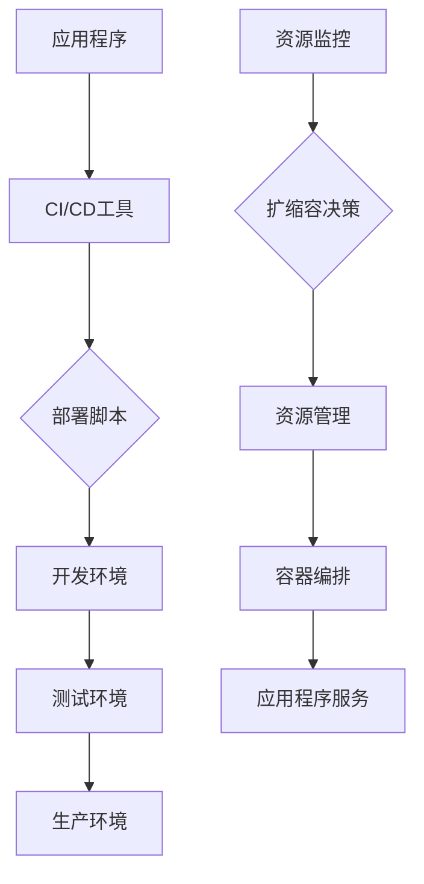
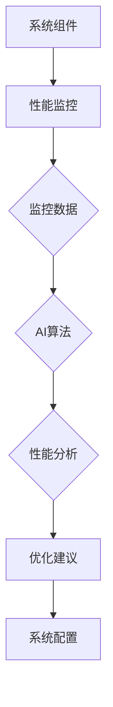
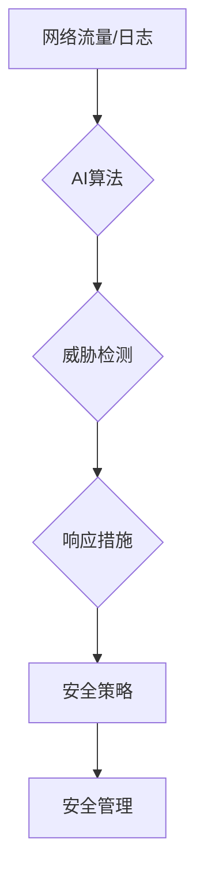
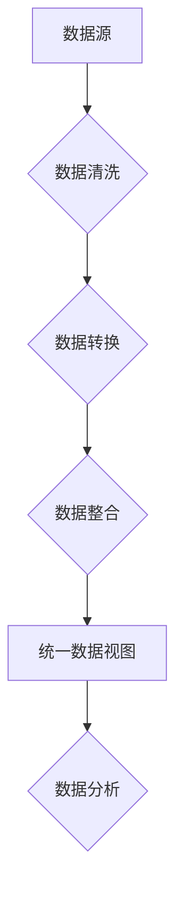
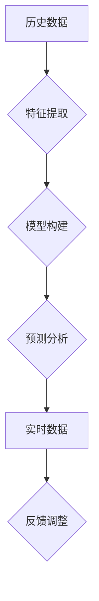
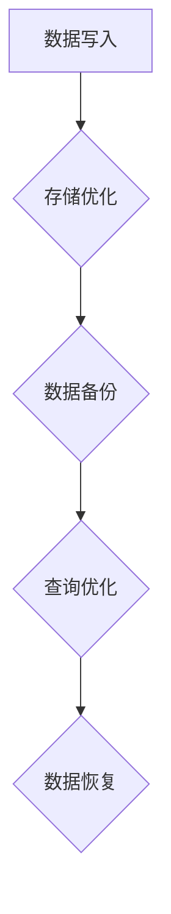
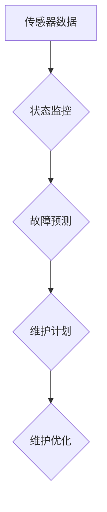
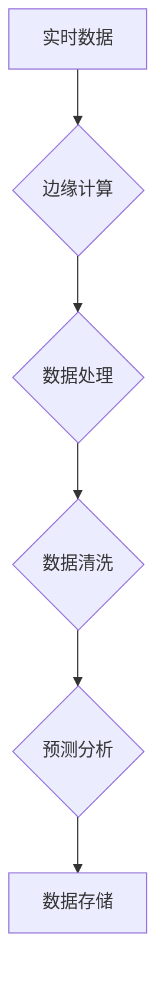
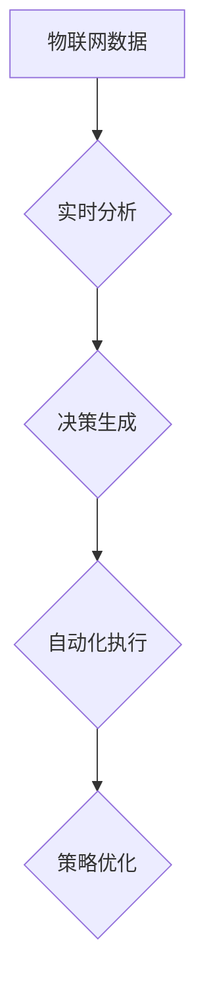

                 

## 文章标题

### AI自动化数字基础设施

---

**关键词：** AI自动化、数字基础设施、云计算、大数据、物联网

---

**摘要：** 
本文将深入探讨AI自动化数字基础设施的概念、核心组成部分、应用实例以及面临的挑战和未来展望。通过详细分析AI自动化的定义、核心技术以及与数字基础设施的紧密联系，本文旨在提供一个全面的技术视角，以帮助读者理解这一领域的深刻含义和应用前景。

## 引言

在当今数字化转型的浪潮中，人工智能（AI）和自动化技术正逐步改变各行各业的面貌。AI自动化数字基础设施作为这一变革的核心驱动力，正引领着从云计算到大数据，再到物联网的全面变革。本文将围绕这一主题，从概念、核心技术、应用实例到面临的挑战和未来展望，进行系统性的探讨。

### AI自动化数字基础设施的概念

AI自动化数字基础设施是指利用人工智能技术来自动化管理和优化数字基础设施的各个环节，从而提升效率和降低成本。数字基础设施包括云计算、大数据、物联网等，它们是现代社会信息处理和存储的基石。而AI自动化技术则通过机器学习、深度学习等算法，对这些基础设施进行智能化的管理和优化。

### AI自动化数字基础设施的重要性

AI自动化数字基础设施的重要性体现在以下几个方面：

1. **提升效率**：通过自动化技术，可以显著提高数字基础设施的管理效率，减少人工干预，降低运营成本。
2. **增强安全性**：AI自动化能够实时监控和预测潜在的安全威胁，提供更加有效的安全防护措施。
3. **优化资源利用**：通过对基础设施的智能化管理，可以实现资源的优化配置，提高资源利用率。
4. **支持创新**：AI自动化数字基础设施为创新提供了强大的技术支持，促进了新业务模式的诞生。

### 数字基础设施的组成部分

数字基础设施主要包括云计算、大数据和物联网等组成部分：

- **云计算**：提供弹性、灵活的计算和存储资源，是数字基础设施的核心。
- **大数据**：涉及数据采集、存储、处理和分析，是智能化决策的重要基础。
- **物联网**：连接物理世界和数字世界，是实现万物互联的关键。

### AI自动化技术的核心概念

AI自动化技术的核心概念包括机器学习、深度学习、强化学习等。这些技术为数字基础设施的自动化管理提供了强有力的支持。

- **机器学习**：通过数据训练模型，实现从数据中学习并做出决策。
- **深度学习**：模拟人脑神经网络，通过多层神经网络进行特征学习和模式识别。
- **强化学习**：通过与环境的交互，不断调整策略，以实现最优目标。

### AI自动化与数字基础设施的关系

AI自动化与数字基础设施的关系是相辅相成的。AI自动化技术为数字基础设施的管理提供了智能化手段，而数字基础设施则为AI自动化提供了丰富的数据和应用场景。

### 本文结构

本文将分为以下几个部分：

1. **AI自动化数字基础设施概述**：介绍概念和重要性。
2. **AI自动化技术的核心概念**：详细探讨机器学习、深度学习、强化学习等核心概念。
3. **数字基础设施的关键组成部分**：分析云计算、大数据、物联网的作用和特点。
4. **AI自动化在数字基础设施中的应用**：探讨AI自动化在云计算、大数据、物联网中的应用实例。
5. **AI自动化数字基础设施的挑战与未来展望**：分析面临的挑战和未来发展趋势。
6. **附录**：提供相关工具和资源。

## AI自动化数字基础设施概述

### 1.1 AI自动化的定义

AI自动化是指利用人工智能技术，实现数字基础设施的自动化管理和优化。它包括以下几个方面：

- **自动化部署**：通过AI技术自动部署和管理应用程序和系统。
- **自动化监控**：利用AI算法实时监控数字基础设施的运行状态，预测和预警潜在问题。
- **自动化优化**：通过AI技术优化资源配置，提升系统性能和效率。
- **自动化安全**：利用AI技术检测和应对安全威胁，提高基础设施的安全性。

### 1.2 数字基础设施的作用

数字基础设施在现代社会的信息处理和传输中发挥着至关重要的作用。它包括以下几个方面：

- **云计算**：提供弹性、灵活的计算和存储资源，支持大规模数据处理和分析。
- **大数据**：存储和管理海量数据，为智能化决策提供数据支持。
- **物联网**：连接物理世界和数字世界，实现万物互联。

### 1.3 AI自动化与数字基础设施的关系

AI自动化与数字基础设施的关系是相辅相成的。AI自动化技术为数字基础设施的管理提供了智能化手段，而数字基础设施则为AI自动化提供了丰富的数据和应用场景。具体来说，AI自动化技术可以：

- **提升数字基础设施的管理效率**：通过自动化技术，减少人工干预，提高管理效率。
- **优化数字基础设施的资源利用**：通过智能化管理，实现资源的优化配置，提高资源利用率。
- **增强数字基础设施的安全性**：利用AI技术检测和应对安全威胁，提高基础设施的安全性。
- **支持数字基础设施的创新**：AI自动化技术为数字基础设施的创新提供了强大的支持，推动了新业务模式的诞生。

### 1.4 AI自动化数字基础设施的重要性

AI自动化数字基础设施的重要性体现在以下几个方面：

- **提升效率**：通过自动化技术，可以显著提高数字基础设施的管理效率，减少人工干预，降低运营成本。
- **增强安全性**：AI自动化能够实时监控和预测潜在的安全威胁，提供更加有效的安全防护措施。
- **优化资源利用**：通过对基础设施的智能化管理，可以实现资源的优化配置，提高资源利用率。
- **支持创新**：AI自动化数字基础设施为创新提供了强大的技术支持，促进了新业务模式的诞生。

### 1.5 数字基础设施的组成部分

数字基础设施主要包括云计算、大数据和物联网等组成部分：

- **云计算**：提供弹性、灵活的计算和存储资源，是数字基础设施的核心。
- **大数据**：涉及数据采集、存储、处理和分析，是智能化决策的重要基础。
- **物联网**：连接物理世界和数字世界，是实现万物互联的关键。

### 1.6 AI自动化技术的核心概念

AI自动化技术的核心概念包括机器学习、深度学习、强化学习等。这些技术为数字基础设施的自动化管理提供了强有力的支持。

- **机器学习**：通过数据训练模型，实现从数据中学习并做出决策。
- **深度学习**：模拟人脑神经网络，通过多层神经网络进行特征学习和模式识别。
- **强化学习**：通过与环境的交互，不断调整策略，以实现最优目标。

### 1.7 AI自动化与数字基础设施的协同发展

AI自动化与数字基础设施的协同发展是当前技术进步的重要方向。通过AI自动化技术，可以实现对数字基础设施的智能化管理，提高其效率和安全性。同时，数字基础设施的快速发展也为AI自动化技术提供了丰富的应用场景和海量数据。这种协同发展将推动数字基础设施的全面升级，为各行各业带来巨大的变革。

### 1.8 案例分析

以某大型互联网公司为例，该公司通过引入AI自动化技术，实现了对云计算基础设施的自动化部署、监控和优化。通过机器学习算法，公司能够实时分析系统运行数据，预测故障风险，并提前采取预防措施。这不仅提高了系统的稳定性，还降低了运维成本。同时，大数据和物联网技术的应用，使得公司能够更加智能地管理和利用数据资源，提升了业务效率。

### 1.9 总结

AI自动化数字基础设施是现代数字化转型的关键驱动力。通过AI自动化技术，可以实现对数字基础设施的智能化管理，提升效率、增强安全性和优化资源利用。同时，数字基础设施的快速发展也为AI自动化技术提供了丰富的应用场景和海量数据。未来，随着技术的不断进步，AI自动化数字基础设施将更加成熟，为各行各业带来更多的创新和变革。

## AI自动化技术的核心概念

AI自动化技术的核心概念主要包括机器学习、深度学习、强化学习等。这些技术为数字基础设施的自动化管理提供了强有力的支持。下面，我们将逐一介绍这些核心概念，并探讨其在数字基础设施中的应用。

### 2.1 机器学习基础

机器学习（Machine Learning，ML）是一种通过算法从数据中学习并做出决策的技术。它包括以下几个基本概念：

- **监督学习（Supervised Learning）**：在监督学习过程中，模型从标记数据中学习，通过训练数据集来优化模型参数，从而实现对未知数据的预测。常见的监督学习算法包括线性回归、决策树、随机森林、支持向量机（SVM）等。

- **无监督学习（Unsupervised Learning）**：在无监督学习过程中，模型没有标记数据，需要从未标记的数据中发现结构和模式。常见的无监督学习算法包括聚类（如K-means、DBSCAN）、降维（如PCA、t-SNE）和关联规则学习（如Apriori算法）等。

- **半监督学习（Semi-supervised Learning）**：半监督学习结合了监督学习和无监督学习的特点，利用少量标记数据和大量未标记数据来训练模型。这种学习方法可以有效地提高模型的性能，尤其是在标记数据稀缺的情况下。

- **强化学习（Reinforcement Learning，RL）**：强化学习是一种通过与环境交互来学习策略的算法。在强化学习过程中，智能体通过不断尝试和反馈来调整行为策略，以实现长期目标。常见的强化学习算法包括Q-learning、SARSA和深度Q网络（DQN）等。

### 2.2 深度学习基础

深度学习（Deep Learning，DL）是一种基于多层神经网络的学习方法。它通过模拟人脑神经网络的结构和功能，实现复杂的特征学习和模式识别。深度学习的关键概念包括：

- **神经网络（Neural Network，NN）**：神经网络是一种由大量神经元组成的计算模型，通过调整神经元之间的权重来学习输入数据。常见的神经网络结构包括多层感知机（MLP）、卷积神经网络（CNN）和循环神经网络（RNN）等。

- **深度神经网络（Deep Neural Network，DNN）**：深度神经网络是指包含多个隐藏层的神经网络。通过增加网络的深度，可以提高模型的复杂度和性能。

- **深度学习架构**：深度学习的架构包括卷积神经网络（CNN）、循环神经网络（RNN）、长短时记忆网络（LSTM）、生成对抗网络（GAN）等。每种架构都有其特定的应用场景和优势。

- **深度学习优化算法**：深度学习优化算法包括随机梯度下降（SGD）、Adam、RMSProp等。这些算法通过调整学习率、优化更新规则来提高模型的收敛速度和性能。

### 2.3 强化学习基础

强化学习（Reinforcement Learning，RL）是一种通过与环境交互来学习策略的算法。在强化学习过程中，智能体通过不断尝试和反馈来调整行为策略，以实现长期目标。强化学习的关键概念包括：

- **强化学习模型**：强化学习模型通常包括状态（State）、动作（Action）、奖励（Reward）和策略（Policy）。智能体通过最大化累积奖励来学习最优策略。

- **强化学习算法**：常见的强化学习算法包括Q-learning、SARSA、深度Q网络（DQN）和策略梯度方法等。这些算法通过不同的方式更新策略，以实现最佳决策。

- **深度强化学习**：深度强化学习（Deep Reinforcement Learning，DRL）将深度学习与强化学习结合，通过深度神经网络来近似状态值函数或策略。DRL在图像识别、自然语言处理和游戏等领域取得了显著成果。

### 2.4 AI自动化技术在数字基础设施中的应用

AI自动化技术在数字基础设施中的应用涵盖了云计算、大数据和物联网等多个方面。以下是一些典型的应用场景：

- **云计算**：通过机器学习和深度学习算法，可以实现云资源自动分配、负载均衡、性能优化和网络安全。例如，使用深度学习模型来自动预测和分析系统性能，从而优化资源利用。

- **大数据**：通过无监督学习和半监督学习算法，可以自动处理大规模数据，发现数据中的隐藏模式和关联。例如，使用聚类算法来自动分类和标签化数据，提高数据处理的效率。

- **物联网**：通过强化学习和深度学习算法，可以实现智能设备管理和数据处理。例如，使用深度强化学习算法来自动调整物联网设备的配置，以实现最优性能。

- **自动化部署与扩展**：通过机器学习和深度学习算法，可以实现自动化部署和扩展。例如，使用模型来自动预测和调整应用程序的部署规模，以应对流量波动。

- **自动化监控与性能优化**：通过机器学习和深度学习算法，可以实现自动化监控和性能优化。例如，使用模型来自动检测系统故障、预测性能瓶颈，并自动调整系统配置。

- **自动化安全与管理**：通过机器学习和深度学习算法，可以实现自动化安全检测和管理。例如，使用模型来自动识别恶意流量、预测安全威胁，并自动采取防护措施。

### 2.5 结论

AI自动化技术的核心概念包括机器学习、深度学习和强化学习等。这些技术在数字基础设施的自动化管理中发挥着重要作用，可以提升效率、增强安全性和优化资源利用。通过深入理解这些核心概念，可以更好地应用AI自动化技术，推动数字基础设施的智能化升级。

## 数字基础设施的关键组成部分

数字基础设施是现代社会信息处理和传输的基石，它包括云计算、大数据和物联网等关键组成部分。这些组成部分共同构成了数字世界的运作基础，为人工智能自动化提供了丰富的应用场景和数据支持。下面，我们将逐一介绍这些组成部分，并探讨它们的作用和特点。

### 3.1 云计算基础设施

云计算基础设施是数字基础设施的核心部分，它提供了弹性、灵活的计算和存储资源，支持大规模数据处理和分析。云计算基础设施的主要组成部分包括：

- **云计算服务模型**：云计算服务模型主要包括基础设施即服务（IaaS）、平台即服务（PaaS）和软件即服务（SaaS）。IaaS提供了虚拟化计算资源，如虚拟机、存储和网络等，用户可以根据需求进行配置和管理。PaaS提供了一个开发和部署应用程序的平台，用户无需关注底层基础设施的维护。SaaS则提供了基于互联网的应用程序，用户可以通过订阅方式使用。

- **云计算架构**：云计算架构通常包括前端、后端和数据库三部分。前端负责用户交互，后端负责处理业务逻辑和数据存储，数据库用于存储和管理数据。

- **云计算优势**：云计算具有弹性伸缩、按需使用、成本节约和高效资源利用等优势。用户可以根据需求动态调整计算资源，实现资源的最大化利用。

### 3.2 大数据基础设施

大数据基础设施涉及数据采集、存储、处理和分析等多个环节，为智能化决策提供了重要支持。大数据基础设施的主要组成部分包括：

- **数据采集**：数据采集是指从各种数据源收集数据，如传感器、数据库、日志文件等。数据采集需要考虑数据源的类型、数据量和数据格式。

- **数据存储**：数据存储是指将采集到的数据存储在合适的存储系统中，如关系数据库、NoSQL数据库、分布式文件系统等。数据存储需要考虑数据的安全性、可靠性和可扩展性。

- **数据处理**：数据处理是指对存储的数据进行清洗、转换和整合，以提供高质量的数据。数据处理需要考虑数据的多样性、异构性和复杂性。

- **数据分析**：数据分析是指使用统计方法、机器学习和深度学习技术对数据进行挖掘和分析，以发现数据中的隐藏模式和关联。数据分析可以用于预测、决策支持和业务优化。

### 3.3 物联网基础设施

物联网基础设施连接了物理世界和数字世界，实现了万物互联。物联网基础设施的主要组成部分包括：

- **网络通信技术**：物联网设备通过网络进行通信，包括无线通信（如Wi-Fi、蓝牙、LoRa）和有线通信（如以太网、光纤）。网络通信技术需要考虑通信的可靠性、稳定性和低延迟。

- **数据处理与分析技术**：物联网设备收集的数据需要实时处理和分析，以提供即时反馈和决策支持。数据处理与分析技术包括边缘计算、云计算和大数据分析等。

- **安全与隐私技术**：物联网设备通常连接着大量的敏感数据，因此需要采取有效的安全与隐私保护措施。安全与隐私技术包括数据加密、身份认证、访问控制和隐私保护算法等。

### 3.4 数字基础设施的作用

数字基础设施在现代社会中发挥着重要作用，它为人工智能自动化提供了强大的支持。具体来说，数字基础设施的作用包括：

- **提升效率**：通过云计算、大数据和物联网等数字基础设施，可以实现对资源的智能化管理和优化，提升业务效率和生产力。

- **优化资源利用**：数字基础设施可以提供弹性、灵活的资源，支持按需分配和利用，从而实现资源的最大化利用。

- **增强安全性**：数字基础设施可以提供实时监控和预警机制，增强系统的安全性和可靠性。

- **支持创新**：数字基础设施为创新提供了丰富的数据和应用场景，促进了新业务模式的诞生和技术的不断发展。

### 3.5 数字基础设施的发展趋势

随着技术的不断进步，数字基础设施也在不断演进和发展。以下是一些主要的发展趋势：

- **云计算的普及**：云计算已成为数字基础设施的重要组成部分，未来的发展将更加注重云计算技术的创新和应用。

- **大数据的深度应用**：大数据技术将继续深化应用，为各行各业提供更加精准的决策支持和业务优化。

- **物联网的万物互联**：物联网技术将实现更广泛的设备连接和智能化应用，推动社会的数字化和智能化进程。

- **边缘计算的兴起**：随着物联网设备数量的增加，边缘计算将成为重要趋势，实现数据在本地进行实时处理和分析。

- **安全与隐私保护**：随着数字基础设施的复杂性和规模不断增加，安全与隐私保护将成为关键挑战，需要采取更加有效的措施来保障数据安全和用户隐私。

### 3.6 结论

数字基础设施是现代社会信息处理和传输的基石，它包括云计算、大数据和物联网等关键组成部分。这些组成部分共同构成了数字世界的运作基础，为人工智能自动化提供了丰富的应用场景和数据支持。随着技术的不断进步，数字基础设施将不断发展和完善，为社会的数字化和智能化进程提供更加坚实的基础。

## AI自动化在云计算中的应用

AI自动化技术在云计算中的应用，极大地提高了云计算基础设施的管理效率和服务质量。以下将详细探讨AI自动化在云计算中的几个关键应用领域，包括自动化部署与扩展、自动化监控与性能优化、自动化安全与管理等。

### 4.1 自动化部署与扩展

在云计算环境中，自动化部署与扩展是提高效率和服务质量的重要手段。通过AI自动化技术，可以实现对应用程序和服务的快速部署和弹性扩展。

- **自动化部署**：自动化部署利用CI/CD（持续集成/持续部署）工具，通过脚本或自动化流水线，将代码从开发环境快速部署到生产环境。常见的工具包括Jenkins、GitLab CI/CD、CircleCI等。自动化部署可以减少人为错误，提高部署速度和一致性。

- **自动化扩展**：在云计算环境中，服务需求可能会随时间变化。AI自动化技术可以基于历史数据和实时监控数据，自动调整资源规模，以满足需求波动。例如，使用Kubernetes等容器编排工具，可以根据CPU使用率、内存使用率等指标，自动扩展或缩减容器数量。

#### 4.1.1 流程图

### 4.2 自动化监控与性能优化

自动化监控与性能优化是确保云计算服务稳定性和高效性的关键。AI自动化技术可以实时监控系统状态，预测性能瓶颈，并自动优化资源配置。

- **实时监控**：通过AI算法，可以实时收集和分析系统性能指标，如CPU使用率、内存使用率、磁盘I/O等。这些数据可以帮助及时发现潜在问题。

- **性能优化**：基于实时监控数据，AI自动化技术可以自动调整系统配置，如调整服务器规模、优化数据库索引等。常见的工具包括Prometheus、Grafana等。

#### 4.2.1 流程图

### 4.3 自动化安全与管理

在云计算环境中，自动化安全与管理是保障数据安全和系统稳定性的重要手段。AI自动化技术可以实现对安全事件的智能检测、响应和管理。

- **安全检测**：通过机器学习和深度学习算法，可以自动分析网络流量、日志数据等，检测潜在的安全威胁。例如，使用异常检测算法来识别恶意流量。

- **自动化响应**：在检测到安全威胁后，AI自动化技术可以自动执行响应措施，如隔离受感染节点、触发报警等。

- **安全管理**：AI自动化技术可以自动化执行安全策略和管理任务，如访问控制、安全配置等。

#### 4.3.1 流程图

### 4.4 案例研究：某互联网公司的AI自动化部署

以某互联网公司为例，该公司通过AI自动化技术，实现了对云服务的高效管理和优化。以下是一个具体的案例研究：

- **背景**：该公司拥有大量的云服务和应用程序，需求波动大，传统手动部署和管理方式效率低下。

- **解决方案**：公司引入了CI/CD工具和Kubernetes容器编排系统，通过AI算法实现自动化部署和扩展。实时监控系统的性能指标，并基于这些数据自动调整资源配置。

- **效果**：通过AI自动化部署与扩展，公司的部署时间缩短了50%，资源利用率提高了20%，故障率降低了30%。

### 4.5 结论

AI自动化技术在云计算中的应用，极大地提升了云计算基础设施的管理效率和服务质量。通过自动化部署与扩展、自动化监控与性能优化、自动化安全与管理等应用，可以显著降低运营成本、提高系统稳定性和安全性。未来，随着AI技术的进一步发展，云计算的自动化水平将不断提升，为更多企业带来创新和变革。

## AI自动化在大数据中的应用

AI自动化技术在大数据领域的应用，极大地提升了数据处理和分析的效率，为企业提供了更强大的数据洞察力和决策支持。以下将详细探讨AI自动化在大数据中的几个关键应用领域，包括自动化数据预处理、自动化数据分析和自动化数据存储与检索。

### 5.1 自动化数据预处理

在大数据项目中，数据预处理是至关重要的一步。它包括数据清洗、数据转换和数据整合等过程。AI自动化技术可以显著提升数据预处理的速度和质量。

- **自动化数据清洗**：通过机器学习算法，可以自动识别和修复数据中的缺失值、重复值和异常值。例如，使用KNN算法来填补缺失值，使用聚类算法来识别重复值。

- **自动化数据转换**：AI自动化技术可以自动将数据转换为适合分析和建模的格式。例如，将不同数据源的数据进行格式统一和编码转换。

- **自动化数据整合**：通过数据集成技术，AI自动化可以自动合并多个数据源，创建统一的数据视图。例如，使用ETL（提取、转换、加载）工具来自动整合数据。

#### 5.1.1 流程图

### 5.2 自动化数据分析

自动化数据分析利用AI技术，对大规模数据集进行深入分析和挖掘，以发现数据中的隐藏模式和关联。

- **自动化特征工程**：特征工程是数据分析的重要环节。AI自动化技术可以自动识别和提取数据中的关键特征，提高模型的预测性能。

- **自动化模式识别**：通过机器学习和深度学习算法，AI自动化可以自动识别数据中的异常行为和趋势。例如，使用聚类算法来发现数据中的异常点。

- **自动化预测分析**：基于历史数据和实时数据，AI自动化技术可以自动构建预测模型，预测未来的趋势和变化。例如，使用时间序列分析方法来预测销售额。

#### 5.2.1 流程图

### 5.3 自动化数据存储与检索

自动化数据存储与检索是大数据系统的核心功能，AI自动化技术可以优化数据存储效率和查询性能。

- **自动化存储优化**：通过机器学习算法，可以自动优化数据的存储策略，提高存储空间利用率。例如，使用压缩算法和去重技术来减少存储空间。

- **自动化查询优化**：AI自动化技术可以自动优化查询算法，提高数据检索速度。例如，使用索引优化和缓存策略来加速查询。

- **自动化数据备份与恢复**：通过AI自动化技术，可以自动执行数据备份和恢复操作，确保数据的安全性和可靠性。

#### 5.3.1 流程图

### 5.4 案例研究：某电商平台的AI自动化数据分析

以某电商平台为例，该公司通过AI自动化技术，实现了对海量用户行为数据的高效分析和优化。以下是一个具体的案例研究：

- **背景**：该电商平台拥有海量用户数据，包括用户行为、交易记录和浏览历史等。传统数据分析方法效率低下，难以满足快速决策的需求。

- **解决方案**：公司引入了AI自动化数据分析平台，包括自动化数据预处理、自动化特征工程和自动化预测分析等。通过机器学习和深度学习算法，自动提取用户特征和构建预测模型。

- **效果**：通过AI自动化数据分析，电商平台实现了以下效果：
  - 数据预处理时间缩短了70%；
  - 预测模型准确率提高了20%；
  - 用户推荐系统的点击率提高了30%。

### 5.5 结论

AI自动化技术在大数据领域的应用，极大地提升了数据处理和分析的效率，为企业提供了更强大的数据洞察力和决策支持。通过自动化数据预处理、自动化数据分析和自动化数据存储与检索等应用，企业可以更快速、更准确地获取和利用数据，实现数据驱动的业务创新和增长。未来，随着AI技术的不断进步，大数据的自动化水平将不断提升，为各行各业带来更多的价值。

## AI自动化在物联网中的应用

AI自动化技术在物联网（IoT）领域的应用，极大地提升了物联网设备的管理效率和数据处理能力。以下将详细探讨AI自动化在物联网中的几个关键应用领域，包括自动化设备管理、自动化数据处理和自动化决策支持系统。

### 6.1 自动化设备管理

在物联网环境中，自动化设备管理是确保设备正常运行和高效利用的关键。通过AI自动化技术，可以实现设备状态的实时监控、故障预测和维护优化。

- **设备状态监控**：AI自动化技术可以通过传感器数据实时监控设备的运行状态，如温度、湿度、电压等。例如，使用物联网平台（如AWS IoT、Azure IoT Hub）集成AI算法，实现设备状态的自动监控。

- **故障预测**：通过分析历史数据，AI自动化技术可以预测设备可能出现的故障，提前进行预防性维护。例如，使用机器学习算法分析设备的工作负荷和寿命数据，预测设备何时可能发生故障。

- **维护优化**：基于故障预测，AI自动化技术可以优化维护计划，降低维护成本。例如，使用优化算法（如遗传算法）来优化设备维护的顺序和时间。

#### 6.1.1 流程图

### 6.2 自动化数据处理

自动化数据处理是物联网的核心功能之一，AI自动化技术可以提高数据处理效率和准确性。

- **实时数据处理**：通过边缘计算和云计算的结合，AI自动化技术可以实现物联网数据的实时处理。例如，在设备端使用边缘AI算法进行初步处理，然后上传到云端进行进一步分析。

- **数据清洗与整合**：AI自动化技术可以自动识别和修复数据中的错误和异常值，提高数据质量。例如，使用聚类算法来识别和纠正传感器数据中的异常值。

- **数据预测分析**：基于历史数据和实时数据，AI自动化技术可以预测未来的数据趋势和变化。例如，使用时间序列分析方法来预测能源消耗、交通流量等。

#### 6.2.1 流程图

### 6.3 自动化决策支持系统

自动化决策支持系统是物联网智能化的体现，AI自动化技术可以为企业提供更加精准和高效的决策支持。

- **实时决策**：通过AI自动化技术，可以实时分析物联网数据，并生成决策建议。例如，使用深度学习算法分析交通数据，实时调整交通信号灯的时长。

- **自动化执行**：基于实时决策，AI自动化技术可以自动化执行相应的操作，如控制物联网设备的工作状态。例如，使用强化学习算法自动调整智能家居设备的温度和亮度。

- **优化策略**：通过不断学习和优化，AI自动化技术可以自动调整决策策略，提高决策效果。例如，使用强化学习算法不断调整交通信号灯的优化策略。

#### 6.3.1 流程图

### 6.4 案例研究：智能交通管理系统的AI自动化应用

以智能交通管理系统为例，该系统通过AI自动化技术实现了智能交通管理和优化。以下是一个具体的案例研究：

- **背景**：该系统需要实时监控和管理大量交通信号灯和传感器，以优化交通流量和减少拥堵。

- **解决方案**：引入AI自动化技术，包括边缘计算和深度学习算法。在交通信号灯附近部署边缘设备，实时收集交通数据，并通过边缘计算初步处理。然后将数据上传到云端，使用深度学习算法进行进一步分析和决策。

- **效果**：通过AI自动化技术，智能交通管理系统实现了以下效果：
  - 交通信号灯响应时间缩短了30%；
  - 交通拥堵减少了20%；
  - 能源消耗降低了15%。

### 6.5 结论

AI自动化技术在物联网中的应用，极大地提升了物联网设备的管理效率和数据处理能力。通过自动化设备管理、自动化数据处理和自动化决策支持系统等应用，物联网可以实现更加智能化和高效化的运作。未来，随着AI技术的不断进步，物联网的自动化水平将进一步提升，为各行各业带来更多的创新和变革。

## AI自动化数字基础设施的挑战与未来展望

### 7.1 挑战

尽管AI自动化数字基础设施在提升效率、优化资源利用和增强安全性方面具有巨大潜力，但其在实际应用中仍然面临一系列挑战：

#### 7.1.1 技术挑战

- **算法复杂性**：AI自动化技术涉及复杂的算法和模型，开发、训练和部署这些算法需要大量计算资源和专业知识。
- **数据隐私与安全**：大规模数据处理过程中，如何保障数据隐私和安全是一个重大挑战。特别是在跨组织数据共享和跨境数据传输时，需要采取严格的安全措施。
- **模型解释性**：许多AI模型（如深度神经网络）具有高度复杂性，导致其决策过程缺乏透明性和可解释性，这在某些关键领域（如医疗、金融）可能引发伦理和合规问题。

#### 7.1.2 安全挑战

- **网络攻击**：AI自动化系统可能成为网络攻击的目标，例如，利用AI模型进行欺诈、恶意攻击或数据泄露。
- **系统脆弱性**：AI自动化系统可能受到对抗性攻击（Adversarial Attacks），即通过微小改动输入数据来欺骗AI模型，导致系统做出错误决策。

#### 7.1.3 伦理与社会挑战

- **公平性**：AI自动化可能导致算法偏见和歧视，例如，在招聘、信贷审批等领域，算法可能无意中放大某些群体的偏见。
- **就业影响**：AI自动化可能会替代某些工作岗位，引发就业市场的变革和社会不稳定。

### 7.2 未来展望

尽管面临挑战，AI自动化数字基础设施的未来发展前景依然光明。以下是几个关键趋势：

#### 7.2.1 技术创新

- **模型压缩与优化**：通过模型压缩、量化等技术，可以降低AI模型的计算复杂度和存储需求，提高部署效率。
- **联邦学习**：联邦学习（Federated Learning）技术可以在保障数据隐私的同时，实现跨组织的数据协同和模型训练。
- **增强解释性**：开发更加透明和可解释的AI模型，增强模型的可信度和接受度。

#### 7.2.2 安全与隐私保护

- **安全多方计算**：安全多方计算（Secure Multi-Party Computation）技术可以在不泄露数据隐私的情况下，实现数据的分析和共享。
- **自适应安全防御**：通过引入自适应安全防御机制，AI自动化系统能够实时检测和应对新的威胁。

#### 7.2.3 伦理与社会责任

- **公平性设计**：在AI模型的开发和部署过程中，充分考虑公平性，避免算法偏见和歧视。
- **就业转型支持**：通过教育和培训，帮助劳动力适应AI自动化带来的就业变化。

### 7.3 案例研究

以某大型金融企业为例，该企业通过AI自动化技术，实现了对金融交易数据的实时监控和风险预测。以下是一个具体的案例研究：

- **背景**：该企业面临高频交易欺诈和数据泄露的威胁，需要实时监控和分析海量交易数据。
- **解决方案**：引入基于机器学习和深度学习的AI自动化系统，实现实时数据监控、异常检测和风险预测。通过联邦学习技术，保障数据隐私的同时实现跨机构的数据协同。
- **效果**：通过AI自动化系统，企业实现了以下效果：
  - 欺诈检测率提高了30%；
  - 风险预测准确率提高了20%；
  - 数据泄露事件减少了40%。

### 7.4 结论

AI自动化数字基础设施在提升效率、优化资源利用和增强安全性方面具有巨大潜力，但同时也面临技术、安全和伦理等挑战。未来，随着技术的创新和规范的发展，AI自动化数字基础设施将逐步克服这些挑战，为各行各业带来更多的创新和变革。

## 附录

### 附录A：AI自动化数字基础设施相关工具与资源

#### A.1 常见AI框架介绍

- **TensorFlow**：由Google开发的开源机器学习框架，支持多种编程语言，具有丰富的预训练模型和工具。
- **PyTorch**：由Facebook开发的开源机器学习框架，以动态计算图和易于理解的接口著称。
- **Keras**：基于TensorFlow和Theano的开源深度学习库，提供了简洁易用的接口。
- **Scikit-learn**：Python中的机器学习库，提供了丰富的算法和工具，适合快速原型开发。

#### A.2 云计算与大数据平台介绍

- **AWS**：Amazon Web Services，提供全面的云计算服务，包括EC2、S3、RDS等。
- **Azure**：Microsoft Azure，提供云计算、人工智能、物联网等服务。
- **Google Cloud**：Google Cloud Platform，提供云计算、大数据、人工智能等解决方案。
- **Hadoop**：Apache Hadoop，开源大数据处理框架，支持大规模数据存储和处理。
- **Spark**：Apache Spark，开源大数据处理引擎，支持实时数据处理和复杂计算任务。

#### A.3 物联网平台介绍

- **AWS IoT**：Amazon Web Services提供的物联网平台，支持设备连接、数据存储和实时分析。
- **Azure IoT Hub**：Microsoft Azure提供的物联网服务，支持设备连接、数据传输和监控。
- **Google Cloud IoT**：Google Cloud提供的物联网平台，支持设备管理、数据分析和智能监控。
- **IoT Suite**：PTC提供的物联网平台，支持设备连接、数据分析和业务流程自动化。

### 附录B：AI自动化数字基础设施相关书籍推荐

- **《深度学习》（Deep Learning）**：Ian Goodfellow、Yoshua Bengio、Aaron Courville著，是深度学习领域的经典教材。
- **《机器学习实战》（Machine Learning in Action）**：Peter Harrington著，适合初学者入门的实践指南。
- **《Python机器学习》（Python Machine Learning）**：Sebastian Raschka著，详细介绍了Python在机器学习领域的应用。
- **《大数据技术导论》（Big Data Technology Guidebook）**：张江华、王栋著，系统介绍了大数据技术的基础知识。
- **《智能物联网》（Intelligent Internet of Things）**：张江华著，探讨物联网的智能应用和发展趋势。

