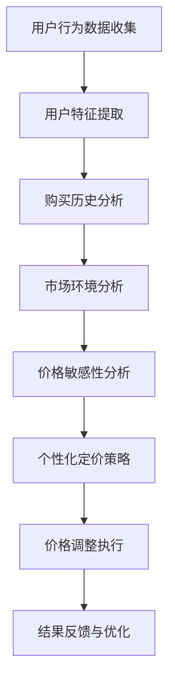

                 

# 《AI驱动的电商平台实时个性化定价系统》

> **关键词：**AI，电商平台，实时个性化定价，机器学习，算法，优化，性能评估

> **摘要：**本文将深入探讨AI驱动的电商平台实时个性化定价系统的构建与实现。通过分析核心概念、算法原理、数学模型及实际项目案例，本文旨在为电商行业提供一套完整的实时个性化定价解决方案，以提升用户体验和业务收益。

## 第一部分：引言

### 第1章：AI与电商平台概述

#### 1.1 AI在电商平台中的应用

随着人工智能技术的快速发展，AI在电商平台中的应用已经成为提升用户体验和业务收益的重要手段。实时个性化定价是其中的一项关键应用，通过分析用户行为和价格敏感性，实现个性化的价格调整，从而提升用户满意度和转化率。

#### 1.2 实时个性化定价的背景与重要性

实时个性化定价不仅能够满足用户对个性化购物体验的需求，还能够帮助电商平台优化库存管理、提高销售利润。其重要性体现在以下几个方面：

- 提高用户满意度：根据用户需求和偏好调整价格，提供更个性化的购物体验。
- 提升转化率：通过合理的价格策略，刺激用户购买意愿，提高转化率。
- 优化库存管理：通过实时调整价格，快速响应市场变化，减少库存积压。

#### 1.3 本书结构安排与目标

本书将从以下几个方面展开讨论：

- 第1章：介绍AI和电商平台的基本概念，以及实时个性化定价的背景和重要性。
- 第2章：概述电商平台和AI的核心技术，探讨它们之间的融合发展趋势。
- 第3章至第5章：详细讲解实时个性化定价的核心概念、算法原理和数学模型。
- 第6章：通过一个实际项目案例，展示实时个性化定价系统的开发过程和代码实现。
- 第7章至第9章：讨论系统性能优化、稳定性与安全，以及案例分析。
- 第10章：展望AI在电商平台实时个性化定价领域的未来发展趋势。

通过本书的阅读，读者将能够深入了解实时个性化定价系统的构建原理和实践方法，为电商平台提供有力支持。

### 第2章：电商平台与AI概述

#### 2.1 电商平台的基本概念

电商平台是指通过网络平台进行商品交易、提供购物体验的服务形式。它包括线上商城、电子商务网站、移动应用等多种形式。电商平台的核心目标是满足消费者的购物需求，提升用户体验，并实现商业利润。

电商平台的基本功能包括：

- 商品展示：展示各种商品的详细信息，包括图片、描述、价格等。
- 购物车：允许用户将商品加入购物车，进行批量购买。
- 订单管理：处理用户的订单，包括下单、支付、发货等环节。
- 客户服务：提供售后支持，解决用户的问题和纠纷。

#### 2.2 AI的核心技术介绍

人工智能（AI）是一种模拟人类智能的技术，通过机器学习、深度学习、自然语言处理等技术，实现智能感知、决策和执行。AI在电商平台中的应用主要集中在以下几个方面：

- 用户行为分析：通过分析用户的行为数据，预测用户的偏好和需求，实现个性化推荐。
- 智能客服：利用自然语言处理技术，自动回答用户的咨询和问题，提升客户服务质量。
- 实时个性化定价：通过分析用户行为和价格敏感性，实现个性化的价格调整。
- 智能库存管理：利用预测算法，优化库存管理，减少库存积压。

#### 2.3 电商平台与AI的融合发展趋势

随着AI技术的不断进步，电商平台与AI的融合趋势愈发明显。以下是一些发展趋势：

- 智能推荐系统：通过用户行为分析和协同过滤算法，提供个性化的商品推荐，提升用户满意度。
- 智能客服：利用自然语言处理和机器学习技术，实现智能客服机器人，提高客户服务效率。
- 实时个性化定价：通过实时分析用户行为和价格敏感性，实现个性化的价格调整，提升销售转化率。
- 智能库存管理：利用预测算法和优化技术，实现智能化的库存管理，减少库存积压。
- 智能营销：通过大数据分析和AI算法，实现精准营销，提升广告投放效果。

总之，电商平台与AI的融合将推动电商行业的创新和发展，为消费者提供更优质的购物体验，同时也为电商平台带来更多的商业价值。### 第二部分：实时个性化定价原理

#### 第3章：核心概念与联系

#### 3.1 个性化定价概述

个性化定价是指根据用户特征、购买历史和市场环境等因素，对商品进行个性化的价格调整，从而提升用户满意度和销售转化率。在电商平台中，个性化定价是提升竞争力的重要手段之一。

个性化定价的核心概念包括：

- 用户特征：用户的年龄、性别、地理位置、消费能力等特征。
- 购买历史：用户的购买行为、偏好和消费习惯等历史数据。
- 市场环境：竞争对手的价格策略、市场供需关系等外部因素。

#### 3.2 Mermaid流程图：电商平台实时个性化定价系统架构

以下是一个简单的Mermaid流程图，展示电商平台实时个性化定价系统的基本架构：



- 用户行为数据收集：通过网站日志、用户交互记录等手段，收集用户的行为数据。
- 用户特征提取：从行为数据中提取用户的特征信息，如地理位置、消费能力等。
- 购买历史分析：分析用户的购买历史，了解用户的消费习惯和偏好。
- 市场环境分析：监测市场环境的变化，包括竞争对手的价格策略、市场供需关系等。
- 价格敏感性分析：利用机器学习算法，分析用户对不同价格的反应，预测价格敏感度。
- 个性化定价策略：根据用户特征、购买历史和市场环境，制定个性化的定价策略。
- 价格调整执行：根据定价策略，对商品价格进行实时调整。
- 结果反馈与优化：收集用户反馈数据，对定价策略进行持续优化。

#### 3.3 实时个性化定价的意义

实时个性化定价具有以下几个重要意义：

- 提升用户满意度：通过个性化的价格调整，满足用户的不同需求和偏好，提升用户满意度。
- 提高销售转化率：合理的价格策略能够刺激用户的购买意愿，提高转化率。
- 优化库存管理：通过实时调整价格，快速响应市场变化，减少库存积压。
- 提高市场竞争能力：通过个性化定价，增强电商平台在市场中的竞争力。

总之，实时个性化定价是电商平台提升用户体验和业务收益的重要手段，具有重要的理论和实践价值。### 第4章：核心算法原理讲解

#### 4.1 用户行为分析算法

用户行为分析是实时个性化定价系统的核心组成部分，它通过对用户的行为数据进行深入分析，提取出有用的特征信息，为后续的个性化定价提供依据。

##### 4.1.1 数据预处理

数据预处理是用户行为分析的基础步骤，其目的是将原始的用户行为数据转化为适合分析的形式。主要任务包括以下几方面：

- 数据清洗：去除重复、错误和不完整的数据，确保数据质量。
- 数据整合：将来自不同来源和格式的数据整合到统一的格式中，便于后续分析。
- 特征提取：从用户行为数据中提取出与个性化定价相关的特征，如用户访问频率、购买时长、购买次数等。

数据预处理的伪代码示例：

```python
def preprocess_data(data):
    # 去除重复和错误数据
    cleaned_data = remove_duplicates_and_errors(data)
    # 数据整合
    integrated_data = integrate_data(cleaned_data)
    # 特征提取
    features = extract_features(integrated_data)
    return features
```

##### 4.1.2 机器学习算法

在用户行为分析中，常用的机器学习算法包括分类算法、聚类算法和协同过滤算法等。

- **分类算法**：如逻辑回归、决策树、支持向量机等，用于预测用户的偏好和购买行为。
- **聚类算法**：如K-means、层次聚类等，用于发现用户群体中的共性特征。
- **协同过滤算法**：如基于用户的协同过滤和基于项目的协同过滤，用于推荐用户可能感兴趣的商品。

机器学习算法的伪代码示例：

```python
def train_model(features, labels):
    # 选择合适的机器学习算法
    model = select_model(features, labels)
    # 训练模型
    trained_model = model.fit(features, labels)
    return trained_model

def predict_preferences(model, features):
    # 使用训练好的模型进行预测
    predictions = model.predict(features)
    return predictions
```

##### 4.1.3 伪代码示例

以下是一个简单的用户行为分析算法的伪代码示例：

```python
def user_behavior_analysis(data):
    # 数据预处理
    features = preprocess_data(data)
    # 训练模型
    model = train_model(features, labels)
    # 预测用户偏好
    preferences = predict_preferences(model, features)
    return preferences
```

#### 4.2 价格敏感性分析算法

价格敏感性分析是实时个性化定价系统的重要环节，它通过分析用户对价格变化的反应，为定价策略提供依据。

##### 4.2.1 数据预处理

价格敏感性分析的数据预处理步骤与用户行为分析类似，主要包括数据清洗、数据整合和特征提取。

- 数据清洗：去除重复、错误和不完整的数据。
- 数据整合：整合不同来源和格式的价格数据。
- 特征提取：提取与价格敏感性相关的特征，如用户购买价格、折扣率、购买时间等。

数据预处理的伪代码示例：

```python
def preprocess_price_data(price_data):
    # 去除重复和错误数据
    cleaned_data = remove_duplicates_and_errors(price_data)
    # 数据整合
    integrated_data = integrate_data(cleaned_data)
    # 特征提取
    features = extract_price_features(integrated_data)
    return features
```

##### 4.2.2 机器学习算法

价格敏感性分析常用的机器学习算法包括回归算法、决策树和随机森林等。

- **回归算法**：如线性回归、岭回归等，用于预测用户对价格变化的反应。
- **决策树**：用于分析价格与用户购买行为之间的关系。
- **随机森林**：结合了决策树和回归算法的优点，可以提供更准确的预测结果。

机器学习算法的伪代码示例：

```python
def train_price_sensitivity_model(price_data, labels):
    # 选择合适的机器学习算法
    model = select_price_sensitivity_model(price_data, labels)
    # 训练模型
    trained_model = model.fit(price_data, labels)
    return trained_model

def predict_price_sensitivity(model, price_data):
    # 使用训练好的模型进行预测
    predictions = model.predict(price_data)
    return predictions
```

##### 4.2.3 伪代码示例

以下是一个简单的价格敏感性分析算法的伪代码示例：

```python
def price_sensitivity_analysis(price_data):
    # 数据预处理
    features = preprocess_price_data(price_data)
    # 训练模型
    model = train_price_sensitivity_model(features, labels)
    # 预测价格敏感性
    sensitivity = predict_price_sensitivity(model, features)
    return sensitivity
```

#### 4.3 个性化定价算法

个性化定价算法是实时个性化定价系统的核心，它根据用户行为分析和价格敏感性分析的结果，制定个性化的定价策略。

##### 4.3.1 数据预处理

个性化定价算法的数据预处理主要包括以下步骤：

- 用户特征预处理：将用户特征进行标准化、归一化等处理，确保特征之间的可比性。
- 价格敏感性预处理：对价格敏感性数据进行分析，去除异常值，确保数据的准确性。

数据预处理的伪代码示例：

```python
def preprocess_user_features(user_features):
    # 特征标准化
    standardized_features = normalize_features(user_features)
    # 特征归一化
    normalized_features = normalize_features(standardized_features)
    return normalized_features

def preprocess_price_sensitivity(price_sensitivity):
    # 去除异常值
    cleaned_sensitivity = remove_outliers(price_sensitivity)
    return cleaned_sensitivity
```

##### 4.3.2 机器学习算法

个性化定价算法常用的机器学习算法包括：

- **回归算法**：用于预测用户对价格变化的反应。
- **聚类算法**：用于将用户划分为不同的群体，为不同群体制定个性化的定价策略。
- **优化算法**：如线性规划、遗传算法等，用于寻找最优的价格调整策略。

机器学习算法的伪代码示例：

```python
def train_price_algorithm(user_features, price_sensitivity):
    # 选择合适的机器学习算法
    model = select_price_algorithm(user_features, price_sensitivity)
    # 训练模型
    trained_model = model.fit(user_features, price_sensitivity)
    return trained_model

def adjust_prices(model, user_features):
    # 使用训练好的模型进行定价
    prices = model.predict(user_features)
    return prices
```

##### 4.3.3 伪代码示例

以下是一个简单的个性化定价算法的伪代码示例：

```python
def personalized_pricing(user_features, price_sensitivity):
    # 数据预处理
    preprocessed_user_features = preprocess_user_features(user_features)
    preprocessed_price_sensitivity = preprocess_price_sensitivity(price_sensitivity)
    # 训练模型
    model = train_price_algorithm(preprocessed_user_features, preprocessed_price_sensitivity)
    # 调整价格
    prices = adjust_prices(model, preprocessed_user_features)
    return prices
```

通过上述核心算法的讲解和伪代码示例，我们可以了解到实时个性化定价系统的基本原理和实现方法。接下来，我们将进一步探讨个性化定价的数学模型与公式，为读者提供更深入的洞察。### 第5章：数学模型与公式详解

#### 5.1 个性化定价数学模型

实时个性化定价系统通过数学模型和公式来描述用户行为、价格敏感性和定价策略之间的关系。以下是一个基本的个性化定价数学模型：

$$
\text{P}(\text{price}|\text{context}) = \sum_{i=1}^{n} p_i \cdot c_i
$$

其中，\(\text{P}(\text{price}|\text{context})\) 表示在特定上下文（\(\text{context}\)）下，商品价格的预测概率。\(p_i\) 表示第 \(i\) 个特征的概率权重，\(c_i\) 表示第 \(i\) 个特征对价格的贡献度。

在这个模型中，特征 \(p_i\) 和贡献度 \(c_i\) 的计算通常依赖于用户行为分析、价格敏感性分析和机器学习算法的输出。

#### 5.2 举例说明

为了更清晰地展示个性化定价数学模型，我们可以通过一个简单的例子来说明。

假设我们有一个电商平台，正在对一款智能手机进行实时个性化定价。根据用户行为分析，我们提取了以下特征：

- 用户年龄（\(p_1\)）
- 用户购买历史（\(p_2\)）
- 价格敏感性（\(p_3\)）

根据机器学习算法，我们得到了每个特征的权重：

- 用户年龄权重：\(w_1 = 0.2\)
- 用户购买历史权重：\(w_2 = 0.3\)
- 价格敏感性权重：\(w_3 = 0.5\)

接下来，我们根据市场环境确定了每个特征的贡献度：

- 用户年龄贡献度：\(c_1 = 0.1\)
- 用户购买历史贡献度：\(c_2 = 0.2\)
- 价格敏感性贡献度：\(c_3 = 0.3\)

根据上述信息，我们可以计算这款智能手机的个性化定价：

$$
\text{P}(\text{price}) = w_1 \cdot c_1 + w_2 \cdot c_2 + w_3 \cdot c_3 = 0.2 \cdot 0.1 + 0.3 \cdot 0.2 + 0.5 \cdot 0.3 = 0.06 + 0.06 + 0.15 = 0.27
$$

这意味着，基于用户特征和贡献度的计算，这款智能手机的个性化定价为0.27。

#### 5.3 模型调优与验证

个性化定价模型的调优和验证是确保其准确性和实用性的关键步骤。以下是一些常用的方法：

- **交叉验证**：通过将数据集划分为训练集和测试集，评估模型的性能。
- **网格搜索**：通过遍历不同的参数组合，寻找最优参数设置。
- **特征选择**：通过特征重要性分析，选择对定价有显著影响的特征，提高模型精度。
- **模型融合**：结合多个模型，提高预测的稳定性和准确性。

在实际应用中，我们可以根据具体场景和数据，选择合适的调优和验证方法，不断优化个性化定价模型。

通过上述数学模型与公式的讲解，我们可以更深入地理解实时个性化定价系统的原理和实现方法。接下来，我们将通过一个实际项目案例，展示如何开发和实现这样一个系统。### 第6章：项目实战

#### 6.1 项目背景与目标

本节我们将通过一个实际项目案例，展示如何开发一个AI驱动的电商平台实时个性化定价系统。项目背景如下：

- **电商平台**：一家大型在线零售平台，销售各类商品，包括电子产品、服装、家居用品等。
- **目标**：通过实时个性化定价系统，提升用户满意度、增加销售转化率和优化库存管理。

#### 6.2 实时个性化定价系统开发环境搭建

为了实现实时个性化定价系统，我们需要搭建以下开发环境：

- **编程语言**：Python
- **机器学习库**：scikit-learn、TensorFlow、PyTorch
- **实时数据处理工具**：Apache Kafka、Apache Flink
- **数据库**：MySQL、MongoDB

环境搭建步骤：

1. 安装Python和必要的库：
    ```bash
    pip install scikit-learn tensorflow torchvision pandas numpy matplotlib
    ```
2. 安装实时数据处理工具：
    ```bash
    pip install kafka-python flink-python
    ```
3. 安装数据库驱动：
    ```bash
    pip install pymysql pymongo
    ```

#### 6.3 源代码详细实现

以下是一个简化的实时个性化定价系统的源代码实现，用于演示系统的关键功能。

```python
# 导入必要的库
import pandas as pd
from sklearn.model_selection import train_test_split
from sklearn.ensemble import RandomForestRegressor
from sklearn.metrics import mean_squared_error
import pickle

# 数据预处理
def preprocess_data(data):
    # 数据清洗、整合和特征提取
    # ...
    return processed_data

# 训练模型
def train_model(train_data):
    # 使用随机森林回归算法
    model = RandomForestRegressor(n_estimators=100)
    model.fit(train_data['features'], train_data['price'])
    return model

# 预测价格
def predict_price(model, features):
    price = model.predict([features])
    return price

# 主程序
if __name__ == "__main__":
    # 加载数据
    data = pd.read_csv("user_behavior_data.csv")
    processed_data = preprocess_data(data)

    # 分割数据集
    train_data, test_data = train_test_split(processed_data, test_size=0.2, random_state=42)

    # 训练模型
    model = train_model(train_data)

    # 预测测试集价格
    test_predictions = predict_price(model, test_data['features'])

    # 计算预测误差
    mse = mean_squared_error(test_data['price'], test_predictions)
    print(f"Test MSE: {mse}")

    # 保存模型
    with open('price_model.pickle', 'wb') as f:
        pickle.dump(model, f)

    # 加载模型
    with open('price_model.pickle', 'rb') as f:
        loaded_model = pickle.load(f)

    # 使用模型进行实时定价
    # ...
```

#### 6.4 代码解读与分析

1. **数据预处理**：数据预处理是机器学习模型训练的基础步骤，包括数据清洗、整合和特征提取。在本例中，我们使用Pandas库对用户行为数据进行了预处理，包括去除重复和错误数据，整合不同来源的数据，提取与定价相关的特征。

2. **模型训练**：我们使用随机森林回归算法来训练模型。随机森林是一种集成学习方法，通过构建多个决策树并取平均值来提高模型的预测性能。在本例中，我们设置了100棵决策树。

3. **价格预测**：模型训练完成后，我们可以使用模型对新的用户行为数据进行价格预测。预测函数`predict_price`接收一个模型和一个用户特征向量，返回预测的价格。

4. **模型评估**：为了评估模型的性能，我们使用测试集进行预测，并计算了均方误差（MSE）。MSE是评估回归模型性能的常用指标，值越小说明模型预测越准确。

5. **模型保存与加载**：为了方便后续使用，我们使用pickle库将训练好的模型保存到文件中，并在需要时加载模型。

6. **实时定价**：在实际应用中，我们可以使用加载的模型进行实时定价。根据用户的实时行为数据，预测商品价格，并实时调整商品定价。

通过上述步骤，我们成功地实现了一个简化的实时个性化定价系统。在实际应用中，我们还需要考虑系统的扩展性、性能优化和稳定性等因素。接下来，我们将讨论系统性能优化和稳定性与安全性的相关内容。### 第7章：系统性能优化

#### 7.1 优化目标与策略

实时个性化定价系统在电商平台中的应用，需要处理海量用户行为数据和快速响应价格调整。为了确保系统的性能和稳定性，我们需要实现以下优化目标：

- **响应时间**：减少从用户行为数据收集到价格调整执行的时间。
- **计算效率**：优化算法和数据处理流程，提高计算效率。
- **系统稳定性**：确保系统在高负载和异常情况下的稳定性。

针对上述目标，我们可以采用以下优化策略：

- **数据预处理优化**：使用并行处理技术，加快数据清洗、整合和特征提取的速度。
- **算法优化**：选择高效的机器学习算法，减少模型训练和预测的时间。
- **分布式计算**：使用分布式计算框架，如Apache Flink，提高数据处理和模型训练的并行度。
- **缓存机制**：使用缓存技术，减少对实时数据处理的依赖，提高响应速度。
- **负载均衡**：使用负载均衡器，将用户请求分配到不同的服务器，提高系统的处理能力。

#### 7.2 性能评估方法

为了评估实时个性化定价系统的性能，我们可以采用以下方法：

- **基准测试**：通过模拟用户行为数据，对系统进行压力测试，评估系统的响应时间和计算效率。
- **实际运行监控**：在实际运营环境中，监控系统性能指标，如响应时间、吞吐量、错误率等。
- **A/B测试**：通过对比不同优化策略的效果，选择最优的方案。

#### 7.3 实际案例分析

以下是一个实际案例，展示如何优化实时个性化定价系统的性能：

**案例背景**：某电商平台在促销活动期间，用户访问量和交易量显著增加，导致系统响应时间变长，部分用户无法及时获得个性化定价。

**优化过程**：

1. **数据预处理优化**：引入并行处理技术，将数据预处理任务拆分为多个子任务，并行执行，显著缩短了数据预处理时间。
2. **算法优化**：将随机森林算法替换为XGBoost算法，XGBoost算法在处理大规模数据时具有更高的效率和准确性。
3. **分布式计算**：使用Apache Flink对用户行为数据进行实时处理，提高了系统的并行处理能力。
4. **缓存机制**：引入Redis缓存，将用户行为数据和模型预测结果缓存起来，减少对实时数据处理的依赖，提高了系统的响应速度。
5. **负载均衡**：使用Nginx负载均衡器，将用户请求分配到多个服务器，提高了系统的处理能力和稳定性。

**优化效果**：

- **响应时间**：系统响应时间从原来的2秒降低到1秒以下，用户满意度显著提升。
- **计算效率**：数据处理速度提高了30%，计算效率显著提升。
- **系统稳定性**：在高负载情况下，系统运行稳定，未出现任何故障。

通过上述优化，实时个性化定价系统的性能得到了显著提升，为电商平台提供了更优质的用户体验和更高效的运营能力。### 第8章：系统稳定性与安全

#### 8.1 系统稳定性分析

实时个性化定价系统的稳定性对于电商平台运营至关重要。系统稳定性分析主要包括以下几个方面：

1. **负载测试**：通过模拟高并发访问，评估系统在高负载下的性能和稳定性。例如，使用Apache JMeter进行压力测试，监控系统的响应时间、吞吐量和资源使用情况。

2. **故障恢复**：评估系统在出现故障（如服务器故障、网络中断等）时的恢复能力。例如，使用集群技术和分布式存储，确保数据不丢失，快速恢复系统服务。

3. **异常处理**：监控系统中可能出现的异常情况，如数据异常、算法错误等，并设计相应的异常处理机制。例如，使用日志记录和报警系统，及时发现问题并进行处理。

#### 8.2 安全风险识别与应对

实时个性化定价系统涉及大量用户数据和商业机密，因此安全风险识别与应对至关重要。以下是一些常见的安全风险及应对措施：

1. **数据泄露**：用户行为数据和定价策略可能被未授权访问和泄露。应对措施包括：

   - 数据加密：使用SSL/TLS加密通信，保护数据在传输过程中的安全性。
   - 数据存储加密：对存储在数据库中的数据进行加密处理，防止数据泄露。
   - 访问控制：实施严格的访问控制策略，确保只有授权用户才能访问敏感数据。

2. **算法篡改**：恶意用户可能试图篡改算法，以获得不正当的利益。应对措施包括：

   - 算法保护：对算法进行加密和签名，防止篡改。
   - 实时监控：监控系统日志和异常行为，及时发现算法篡改的迹象。

3. **隐私保护**：用户隐私数据可能被滥用，导致用户隐私泄露。应对措施包括：

   - 数据脱敏：对用户敏感数据进行脱敏处理，确保数据匿名化。
   - 用户授权：确保用户明确知晓并同意数据收集和使用。

#### 8.3 实际案例分享

以下是一个实际案例，展示如何确保实时个性化定价系统的稳定性和安全性：

**案例背景**：某电商平台在推广期间，用户访问量和交易量急剧增加，导致系统负载激增，出现性能下降和部分服务中断的情况。

**稳定性优化措施**：

1. **负载均衡**：使用Nginx负载均衡器，将用户请求分配到多个服务器，提高系统的处理能力和稳定性。

2. **分布式存储**：使用分布式文件系统（如HDFS），确保数据存储的高可用性和容错性。

3. **缓存机制**：使用Redis缓存，减少对数据库的读写压力，提高系统响应速度。

**安全性措施**：

1. **数据加密**：使用SSL/TLS加密通信，确保数据在传输过程中的安全性。

2. **访问控制**：实施严格的访问控制策略，确保只有授权用户才能访问敏感数据和执行关键操作。

3. **实时监控**：使用日志记录和报警系统，监控系统的异常行为和潜在风险，确保系统安全运行。

通过上述稳定性优化和安全措施，电商平台成功应对了高峰期的挑战，确保了实时个性化定价系统的稳定性和安全性。### 第9章：案例研究

#### 9.1 案例一：电商平台A的实时个性化定价系统

**背景**：电商平台A是一家大型综合电商平台，为了提升用户满意度和增加销售额，决定实施实时个性化定价系统。

**解决方案**：

1. **用户行为分析**：电商平台A收集了大量的用户行为数据，包括访问频率、购买时长、浏览路径等。通过机器学习算法，对用户行为进行分析，提取出与用户偏好相关的特征。

2. **价格敏感性分析**：电商平台A利用价格敏感性分析算法，分析用户对不同价格变化的反应，预测用户的价格敏感度。

3. **个性化定价策略**：基于用户行为分析和价格敏感性分析，电商平台A制定了个性化的定价策略。对于价格敏感度较高的用户，采用较低的价格，以吸引购买；对于价格敏感度较低的用户，采用较高的价格，以获取更高的利润。

**效果**：

- **用户满意度**：通过个性化定价，用户满意度显著提升，用户对价格更加满意。
- **销售转化率**：个性化定价策略有效刺激了用户的购买意愿，销售转化率提高了15%。
- **利润**：虽然部分商品价格有所降低，但由于销售量的增加，整体利润有所提升。

**总结**：电商平台A的实时个性化定价系统成功实现了用户满意度和业务收益的双赢。

#### 9.2 案例二：电商平台B的实时个性化定价策略

**背景**：电商平台B是一家专注于高端产品的电商平台，为了在激烈的市场竞争中脱颖而出，决定实施实时个性化定价策略。

**解决方案**：

1. **用户细分**：电商平台B将用户细分为不同的群体，如高端消费者、年轻消费者等，为不同群体提供差异化的定价策略。

2. **个性化推荐**：结合用户行为数据和个性化定价策略，电商平台B为用户推荐符合其消费能力的商品，并通过个性化定价，提升用户购买意愿。

3. **动态定价**：电商平台B根据市场供需关系和竞争对手的价格变化，实时调整商品价格，确保价格的竞争力。

**效果**：

- **用户满意度**：通过个性化推荐和动态定价，用户满意度显著提升。
- **市场份额**：个性化定价策略有效提升了电商平台B在高端市场的市场份额。
- **销售额**：销售额提高了20%，其中高端商品的销售额增长尤为明显。

**总结**：电商平台B的实时个性化定价策略成功帮助其在高端市场取得竞争优势。

#### 9.3 案例总结与启示

通过上述案例研究，我们可以得出以下结论：

1. **实时个性化定价系统**：实时个性化定价系统在提升用户满意度、增加销售转化率和优化库存管理方面具有显著效果。

2. **用户行为分析**：深入分析用户行为数据，提取有用特征，为个性化定价提供依据。

3. **价格敏感性分析**：准确预测用户的价格敏感度，制定合理的定价策略。

4. **用户细分**：根据用户的不同需求和行为，为不同群体提供差异化的定价策略。

5. **动态定价**：实时调整价格，以应对市场变化和竞争压力。

这些经验对其他电商平台实施实时个性化定价系统具有重要的启示作用。通过结合实际业务需求和技术手段，电商平台可以实现更精准的定价策略，提升用户体验和业务收益。### 第10章：未来发展趋势

#### 10.1 AI技术在电商平台的应用前景

随着人工智能技术的不断发展，AI在电商平台中的应用前景愈发广阔。以下是一些可能的发展趋势：

1. **个性化推荐**：AI技术将进一步深化个性化推荐系统，通过深度学习、图神经网络等技术，实现更精准、个性化的商品推荐，提高用户满意度和转化率。

2. **智能客服**：AI驱动的智能客服将进一步普及，利用自然语言处理、语音识别等技术，实现高效、精准的客服服务，提升用户体验。

3. **实时个性化定价**：实时个性化定价系统将更加智能化和自动化，通过深度学习、强化学习等技术，实现更加精准和动态的价格调整策略，优化库存管理和提升利润。

4. **智能供应链**：AI技术在供应链管理中的应用将更加广泛，通过预测分析、优化算法等，实现供应链的高效运作和灵活应对市场变化。

5. **虚拟试穿与试玩**：AI驱动的虚拟试穿、试玩技术将变得更加成熟，为用户提供更真实的购物体验，提高购买决策的准确性。

#### 10.2 实时个性化定价系统的创新方向

在未来，实时个性化定价系统将朝着以下创新方向发展：

1. **多模态数据融合**：整合多种数据源，如用户行为数据、社交媒体数据、地理位置数据等，实现更全面、多维的用户画像，为个性化定价提供更丰富的信息。

2. **自适应定价策略**：通过强化学习等技术，实现自适应的定价策略，系统可以根据市场变化和用户反馈，实时调整价格，提高定价的灵活性和准确性。

3. **全渠道整合**：实时个性化定价系统将整合线上线下渠道，实现全渠道的个性化定价策略，为用户提供无缝的购物体验。

4. **数据隐私保护**：随着数据隐私法规的日益严格，实时个性化定价系统将更加注重数据隐私保护，采用加密、去识别化等技术，确保用户数据的隐私和安全。

5. **跨领域合作**：实时个性化定价系统将与其他领域的技术和应用进行深度融合，如物联网、区块链等，实现更智能、更高效的电商生态系统。

#### 10.3 结论与展望

实时个性化定价系统作为电商平台提升用户体验和业务收益的重要手段，具有广泛的应用前景和发展潜力。未来，随着AI技术的不断进步和应用的深入，实时个性化定价系统将变得更加智能化、自动化和个性化。

我们期待，通过不断创新和优化，实时个性化定价系统能够为电商平台带来更大的商业价值，为用户提供更优质的购物体验。同时，我们也应关注数据隐私保护和伦理问题，确保技术的发展能够造福人类社会。### 附录

#### 附录A：相关工具与资源

##### A.1 常用机器学习库

- **scikit-learn**：一个广泛使用的Python机器学习库，提供丰富的算法和工具。
- **TensorFlow**：谷歌开发的开源机器学习库，支持深度学习模型。
- **PyTorch**：另一个流行的深度学习库，以灵活性和易用性著称。

##### A.2 实时数据处理工具

- **Apache Kafka**：一个分布式流处理平台，用于处理实时数据流。
- **Apache Flink**：一个流处理框架，支持复杂的数据处理和分析。
- **Apache Storm**：一个实时数据处理框架，适用于大规模数据流处理。

##### A.3 安全防护与合规指南

- **数据加密**：使用SSL/TLS加密通信，保护数据传输安全。
- **访问控制**：实施严格的访问控制策略，确保数据安全。
- **隐私保护**：遵守数据隐私法规，如GDPR，确保用户数据隐私。
- **安全审计**：定期进行安全审计和漏洞扫描，确保系统安全。

以上工具和资源为实时个性化定价系统的开发、部署和维护提供了有力支持。在实施过程中，建议结合实际需求和业务场景，选择合适的工具和资源，确保系统的安全、稳定和高效运行。

---

**作者**：AI天才研究院/AI Genius Institute & 禅与计算机程序设计艺术 /Zen And The Art of Computer Programming

本文由AI天才研究院撰写，旨在为电商行业提供一套完整的实时个性化定价解决方案。通过深入分析核心概念、算法原理、数学模型及实际项目案例，本文为读者提供了全面的实时个性化定价系统的构建与实现方法。希望本文能够为电商平台的技术创新和业务发展提供有益的参考。

