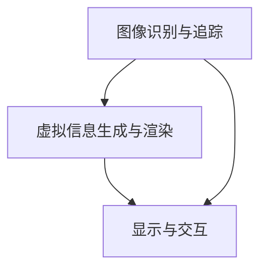

                 

## 第一部分：AR技术概述

### 第1章: AR技术的基本概念与历史发展

#### 1.1 AR技术的定义与核心原理

增强现实（Augmented Reality，简称AR）技术是一种通过计算机技术将虚拟信息与现实世界进行融合的技术。它不仅展示了现实世界的景象，还在其基础上叠加了计算机生成的虚拟信息，从而使人们能够感知到一个更为丰富和互动的环境。

AR技术的核心原理主要包括以下几个方面：

1. **图像识别与追踪**：通过图像处理和模式识别技术，识别现实场景中的物体，并对其进行追踪，以确保虚拟信息的正确叠加。
2. **虚拟信息生成与渲染**：根据用户的位置和角度，生成相应的虚拟信息，并通过计算机图形学技术进行渲染，使其与现实场景融合。
3. **显示与交互**：利用各种显示设备，如智能手机、平板电脑、头戴式显示器等，将虚拟信息呈现给用户，并提供交互方式，如触摸、语音等。

#### 1.2 AR技术的历史发展脉络

AR技术的发展可以追溯到上世纪60年代。当时，波音公司的研究人员首次提出了一种通过头戴式显示器叠加虚拟信息的想法。这一想法为AR技术的发展奠定了基础。

- **1968年**：美国计算机科学家伊凡·苏瑟兰（Ivan Sutherland）发明了第一个头戴式显示器，并展示了AR技术的雏形。
- **1987年**：波音公司开发了“Wavefield”系统，这是第一个商业化的AR系统。
- **1990年代**：随着计算机性能的提升和显示技术的进步，AR技术开始逐步应用于娱乐、医疗、教育等领域。
- **21世纪初**：智能手机的普及，使得AR技术开始走入大众视野。2012年，谷歌发布了谷歌眼镜，标志着AR技术进入了新的发展阶段。
- **2016年**：随着苹果公司发布ARKit，AR技术进一步得到了广泛应用和推广。

#### 1.3 AR技术在全球范围内的应用现状

目前，AR技术在全球范围内得到了广泛的应用。以下是一些主要的AR技术应用领域：

1. **娱乐与游戏**：如《Pokémon GO》等游戏，通过AR技术为用户提供了沉浸式的游戏体验。
2. **零售**：如商店中通过AR技术提供的虚拟试穿、虚拟展示等服务，提升了用户体验。
3. **医疗**：如通过AR技术进行手术指导、医疗培训等，提高了医疗质量和效率。
4. **教育**：如通过AR技术制作的教材、教学工具等，提高了教学效果。
5. **军事**：如通过AR技术提供的战场模拟、指挥控制等，提高了军事作战能力。

总之，AR技术作为一种新兴技术，已经在各个领域展现出了巨大的应用潜力。随着技术的不断进步，AR技术的应用范围将更加广泛，为人们的生活带来更多便利和乐趣。

#### 1.4 AR技术的未来发展趋势

随着人工智能、5G通信、大数据等技术的不断发展，AR技术将迎来更多的发展机遇。以下是AR技术未来可能的发展趋势：

1. **更高分辨率的显示**：随着显示技术的提升，AR设备的显示效果将更加细腻，为用户提供更为沉浸式的体验。
2. **更广泛的应用领域**：除了现有的娱乐、零售、医疗、教育等领域，AR技术还可能应用于城市规划、智能家居、工业制造等领域。
3. **更智能的交互方式**：随着人工智能技术的发展，AR设备将能够更好地理解用户的需求，提供个性化的服务。
4. **更便捷的设备形态**：随着可穿戴设备的普及，AR设备将更加轻便，易于携带，为用户带来更加便捷的体验。
5. **更高的安全性**：随着安全技术的提升，AR设备将能够更好地保护用户隐私和数据安全。

总之，AR技术在未来将展现出更为广阔的应用前景，为人类社会带来更多的创新和变革。

---

**核心概念与联系**：AR技术的核心概念包括图像识别与追踪、虚拟信息生成与渲染、显示与交互。这些概念相互联系，共同构成了AR技术的完整架构。以下是一个简单的Mermaid流程图，展示了这些核心概念之间的联系：



---

在下一章中，我们将进一步探讨AR技术的核心技术与架构，了解其背后的实现原理和技术细节。

### 第2章: AR技术的核心技术与架构

#### 2.1 计算机视觉技术基础

计算机视觉是AR技术的核心组成部分之一，它涉及到如何让计算机理解和解释现实世界的图像和视频。计算机视觉技术主要包括以下几个方面：

1. **图像识别**：通过图像处理算法，从图像中提取特征，并识别出其中的物体或场景。常用的图像识别算法包括卷积神经网络（CNN）、深度学习等。
2. **目标检测**：在图像中定位并识别出特定目标的位置和边界。目标检测算法包括R-CNN、YOLO、SSD等。
3. **图像分割**：将图像划分为多个区域，每个区域对应一个或多个物体。图像分割算法包括FCN、U-Net、Mask R-CNN等。
4. **人脸识别**：通过分析人脸的特征，识别出特定的人脸。人脸识别算法包括Eigenface、LBPH、深度学习等。

#### 2.2 空间定位与跟踪技术

空间定位与跟踪技术是AR技术的关键组成部分，它涉及到如何确定设备在现实世界中的位置，并跟踪其运动。以下是几种常用的空间定位与跟踪技术：

1. **视觉SLAM（Simultaneous Localization and Mapping）**：通过结合视觉传感器和GPS数据，同时构建环境地图和确定设备位置。视觉SLAM算法包括ORB-SLAM、DVO-SLAM等。
2. **惯性导航系统（Inertial Navigation System，INS）**：利用加速度计和陀螺仪等惯性传感器，计算设备的运动轨迹。INS技术适用于动态环境，但在长时间运行中存在累积误差。
3. **视觉惯性里程计（Visual Inertial Odometry，VIO）**：结合视觉传感器和惯性传感器，通过多传感器数据融合，实现高精度的运动跟踪。VIO算法包括DVIO、ORB-SLAM2等。

#### 2.3 增强现实内容生成与渲染技术

增强现实内容生成与渲染技术是实现AR系统视觉效果的关键。以下是几个重要的技术方面：

1. **虚拟信息生成**：根据用户的位置和角度，生成相应的虚拟信息。虚拟信息的生成通常涉及到3D建模、纹理映射等技术。
2. **虚拟信息渲染**：将生成的虚拟信息渲染到现实场景中，使其与现实场景融合。渲染技术包括光线追踪、基于物理的渲染（PBR）等。
3. **实时渲染**：为了提供实时交互体验，AR系统需要具备实时渲染的能力。实时渲染技术包括GPU编程、渲染流水线优化等。

#### 2.4 AR技术的硬件支持与系统集成

AR系统的性能和用户体验很大程度上依赖于硬件支持与系统集成。以下是几个关键硬件组件和系统集成技术：

1. **显示设备**：包括头戴式显示器（HMD）、智能手机、平板电脑等。显示设备的分辨率、刷新率和视野范围等参数直接影响用户体验。
2. **传感器**：包括摄像头、加速度计、陀螺仪、GPS等。这些传感器用于采集现实世界的图像和运动数据，为AR系统提供输入。
3. **计算平台**：包括CPU、GPU、FPGA等。计算平台负责处理图像识别、空间定位等计算任务，确保系统的高性能和实时性。
4. **系统集成**：将各个硬件组件进行集成，构建一个完整的AR系统。系统集成技术包括硬件接口设计、软件开发等。

通过以上核心技术与架构的介绍，我们可以看到AR技术涉及多个技术领域的综合应用。这些技术的不断创新和发展，将为AR技术的应用带来更多的可能性。

---

**核心算法原理讲解**：

在AR系统中，计算机视觉技术是最为重要的组成部分之一。以下将使用伪代码详细阐述一种常见的图像识别算法——卷积神经网络（CNN）的工作原理。

```python
# 伪代码：卷积神经网络（CNN）图像识别算法

# 定义卷积神经网络结构
class ConvolutionalNeuralNetwork:
    def __init__(self):
        self.conv1 = Conv2D(32, (3, 3), activation='relu', input_shape=(height, width, channels))
        self.pool1 = MaxPooling2D(pool_size=(2, 2))
        self.conv2 = Conv2D(64, (3, 3), activation='relu')
        self.pool2 = MaxPooling2D(pool_size=(2, 2))
        self.flatten = Flatten()
        self.dnn1 = Dense(128, activation='relu')
        self.dnn2 = Dense(num_classes, activation='softmax')

    def forward(self, x):
        # 第一个卷积层
        x = self.conv1(x)
        x = self.pool1(x)
        # 第二个卷积层
        x = self.conv2(x)
        x = self.pool2(x)
        # 展平
        x = self.flatten(x)
        # 第一个全连接层
        x = self.dnn1(x)
        # 第二个全连接层
        x = self.dnn2(x)
        return x

# 使用卷积神经网络进行图像识别
def image_recognition(model, image):
    # 预处理图像
    image = preprocess_image(image)
    # 前向传播
    output = model.forward(image)
    # 获取预测结果
    prediction = np.argmax(output, axis=1)
    return prediction
```

在上面的伪代码中，我们首先定义了一个卷积神经网络模型，该模型包括两个卷积层、两个池化层和一个全连接层。在`forward`方法中，我们实现了图像识别的整个过程，包括卷积、池化、展平和全连接层。最后，通过`image_recognition`函数，我们可以使用训练好的模型对输入图像进行识别。

---

通过以上对AR技术核心技术与架构的详细介绍，我们可以看到AR技术是如何通过计算机视觉、空间定位与跟踪、增强现实内容生成与渲染等技术实现其功能的。这些技术的不断创新和优化，将推动AR技术的广泛应用和持续发展。

在下一章中，我们将探讨注意力经济的概念与应用，分析AR技术在注意力经济中的重要作用。

### 第3章: 注意力经济的概念与应用

#### 3.1 注意力经济的定义与特征

注意力经济（Attention Economy）是一个相对较新的概念，它起源于对互联网时代信息过载和用户注意力稀缺性的关注。注意力经济强调在信息爆炸的时代，用户的注意力成为一种稀缺资源，而获取和保持用户的注意力成为各类商业活动和企业竞争的关键。

**定义**：注意力经济是指一种基于用户注意力转移和交换的经济模式。在这个模式下，企业和个人通过提供有价值的内容、服务或产品来吸引和保持用户的注意力，从而实现商业价值。

**特征**：

1. **注意力稀缺性**：在信息爆炸的时代，用户的注意力是有限的，获取用户的注意力成为一种稀缺资源。
2. **内容导向**：注意力经济的核心在于高质量的内容创作和传播，通过内容来吸引和留住用户。
3. **个性化体验**：为了吸引和保持用户的注意力，企业和平台需要提供个性化的服务体验，满足用户的需求和兴趣。
4. **社交互动**：社交网络和平台在注意力经济中扮演着重要角色，通过社交互动和分享，用户之间的注意力可以互相转移和交换。
5. **算法驱动**：算法在注意力经济中起着至关重要的作用，通过算法分析用户行为和兴趣，提供个性化的内容推荐。

#### 3.2 注意力经济的起源与发展

注意力经济的概念最早可以追溯到2006年，由美国学者阮小江（René ten Bos）在其论文《注意力经济学》（Economics of Attention）中提出。此后，随着互联网和社交媒体的快速发展，注意力经济逐渐成为一个广泛讨论的话题。

1. **互联网时代的崛起**：随着互联网的普及，人们获取信息的渠道变得多样化，注意力经济开始受到关注。
2. **社交媒体的兴起**：社交媒体平台如Facebook、Twitter、Instagram等的出现，进一步加剧了用户的注意力稀缺性，推动了注意力经济的发展。
3. **数字营销的变革**：数字营销企业通过数据分析和算法推荐，实现更加精准和高效的广告投放，进一步推动了注意力经济的发展。
4. **内容创作者的崛起**：随着YouTube、TikTok等平台的兴起，越来越多的内容创作者通过创作高质量的内容吸引粉丝和广告商，成为注意力经济的重要参与者和推动者。

#### 3.3 注意力经济对商业模式的影响

注意力经济的崛起对传统的商业模式带来了深远的影响，以下是一些主要的影响：

1. **广告模式的转变**：传统广告模式越来越难以吸引用户的注意力，广告主开始转向更加精准和互动的广告形式，如社交媒体广告、内容营销等。
2. **内容付费的兴起**：随着用户对高质量内容的需求增加，越来越多的平台和内容创作者开始采取内容付费模式，通过提供有价值的内容获取收入。
3. **用户互动与参与**：注意力经济强调用户参与和互动，企业需要通过社交媒体、用户反馈等方式与用户建立紧密的联系，提高用户的忠诚度和参与度。
4. **平台经济的崛起**：注意力经济推动了平台经济的发展，平台成为连接用户和内容创作者的桥梁，通过流量分成和广告收入实现商业价值。
5. **数据隐私与安全**：注意力经济依赖于用户数据，数据隐私和安全成为关注的重要问题。企业和平台需要采取有效的措施保护用户隐私和数据安全。

总之，注意力经济的概念和应用正在深刻改变商业模式的各个方面，企业需要适应这一变化，通过创新和优化商业模式来吸引和留住用户的注意力。

在下一章中，我们将进一步探讨注意力经济的核心驱动因素，分析它们如何影响AR技术的应用。

### 第4章: 注意力经济的核心驱动因素

#### 4.1 内容创作与传播

内容创作与传播是注意力经济的核心驱动因素之一。在注意力经济中，高质量的内容是吸引和留住用户注意力的关键。以下从内容创作和传播两个方面进行详细分析：

1. **内容创作**：内容创作是注意力经济的基础，它决定了内容的质量和吸引力。高质量的内容能够满足用户的需求和兴趣，从而吸引他们的注意力。内容创作者需要具备以下特点：

   - **创意与创新**：创新的内容形式和独特的视角能够吸引用户的关注。
   - **专业与权威**：专业知识和权威性能够提高内容的可信度和吸引力。
   - **情感共鸣**：情感共鸣能够增强用户对内容的共鸣和参与度。

2. **内容传播**：内容传播是将内容传递给用户的关键环节，它决定了内容的覆盖面和影响力。有效的传播策略包括：

   - **社交媒体**：社交媒体平台是内容传播的重要渠道，通过平台上的分享和转发，可以迅速扩大内容的覆盖面。
   - **SEO优化**：搜索引擎优化（SEO）可以帮助内容在搜索引擎中获得更高的排名，从而吸引更多的用户访问。
   - **合作伙伴关系**：与相关领域的合作伙伴建立合作关系，通过他们的渠道传播内容，可以提升内容的可信度和影响力。
   - **KOL营销**：与关键意见领袖（KOL）合作，通过他们的影响力和粉丝基础，将内容传播给更广泛的受众。

#### 4.2 社交互动与网络效应

社交互动与网络效应是注意力经济的重要驱动因素，它们通过用户之间的互动和网络的扩展，增强用户的参与度和忠诚度。以下从社交互动和网络效应两个方面进行详细分析：

1. **社交互动**：社交互动是指用户在社交平台上通过评论、点赞、分享等方式进行互动，从而增强对内容的关注和参与。社交互动的几个关键点包括：

   - **用户参与**：用户参与是社交互动的核心，通过评论、提问、投票等方式，用户可以更深入地参与到内容的讨论中。
   - **社区氛围**：良好的社区氛围能够促进用户的互动和参与，增强用户的归属感和忠诚度。
   - **实时互动**：实时互动能够提高用户的参与度，例如通过直播、实时聊天等方式，用户可以与内容创作者或其他用户进行实时交流。

2. **网络效应**：网络效应是指用户数量的增加能够带来额外的价值，即用户越多，平台的吸引力越强。网络效应的几个关键点包括：

   - **规模经济**：随着用户数量的增加，平台的运营成本可以分摊到更多的用户身上，从而降低单个用户的成本。
   - **用户粘性**：大量的用户使得平台具有更强的吸引力，用户之间的互动和社交关系也使得他们对平台产生更强的依赖和忠诚度。
   - **平台优势**：规模较大的平台通常拥有更多的资源和优势，能够提供更优质的内容和服务，从而进一步吸引和留住用户。

#### 4.3 用户行为与注意力分配

用户行为和注意力分配是注意力经济中至关重要的因素，它们决定了用户对内容的关注程度和持续时长。以下从用户行为和注意力分配两个方面进行详细分析：

1. **用户行为**：用户行为是指用户在平台上的行为模式，包括浏览、搜索、评论、分享等。用户行为的几个关键点包括：

   - **个性化推荐**：通过算法分析用户的兴趣和行为，提供个性化的内容推荐，可以提升用户的参与度和满意度。
   - **用户体验**：良好的用户体验可以增强用户的留存率和忠诚度，包括界面设计、加载速度、交互设计等方面。
   - **用户激励**：通过奖励机制、积分系统等方式激励用户参与和互动，可以提升用户的参与度和活跃度。

2. **注意力分配**：注意力分配是指用户在不同内容或平台之间的注意力分配情况。注意力的几个关键点包括：

   - **内容质量**：高质量的内容能够吸引用户的注意力，提高用户的关注度和持续时长。
   - **内容形式**：不同的内容形式（如文字、图片、视频等）对用户的注意力分配有不同的影响，需要根据用户的需求和兴趣选择合适的格式。
   - **环境因素**：用户所处的环境（如工作环境、家庭环境等）也会影响其对内容的注意力分配，需要考虑环境因素对用户行为的影响。

通过以上对注意力经济核心驱动因素的分析，我们可以看到，内容创作与传播、社交互动与网络效应、用户行为与注意力分配是注意力经济的三个关键驱动因素。这些因素相互关联，共同影响和决定用户的注意力分配和平台的发展。在下一章中，我们将探讨AR技术在注意力经济中的应用，分析其如何利用这些驱动因素创造商业价值。

### 第5章: AR技术在注意力经济中的应用

#### 5.1 AR技术如何增强注意力经济的效果

AR技术作为一种新兴技术，其独特的特性使其在注意力经济中具有巨大的应用潜力。以下是AR技术如何增强注意力经济效果的几个关键点：

1. **沉浸式体验**：AR技术通过将虚拟信息叠加到现实世界中，为用户提供了沉浸式的体验。相比于传统的二维屏幕，AR技术能够提供更加丰富和互动的视觉体验，从而吸引用户的注意力。例如，通过AR技术，用户可以在购物过程中虚拟试穿衣物，或者在游戏中与现实世界中的场景进行互动，这些沉浸式体验能够显著提高用户的参与度和满意度。

2. **个性化内容**：AR技术可以根据用户的位置、动作和兴趣，实时生成个性化的虚拟信息。这种个性化内容能够更好地满足用户的需求，从而提高用户的注意力和忠诚度。例如，在广告中，AR技术可以根据用户的偏好和购物历史，提供个性化的产品推荐和优惠信息，从而提高广告的效果和用户参与度。

3. **社交互动**：AR技术促进了用户之间的社交互动。通过AR平台，用户可以一起参与虚拟活动，分享虚拟体验，从而增强社交联系和互动。这种社交互动不仅能够增强用户的参与度，还可以提高用户对平台的忠诚度。例如，在AR游戏中，用户可以与朋友一起组队完成任务，或者通过AR社交应用与朋友进行虚拟聚会。

4. **情感共鸣**：AR技术能够通过虚拟信息的情感表达，增强用户与内容之间的情感共鸣。高质量的情感表达能够吸引用户的注意力，并提升用户的参与度和忠诚度。例如，通过AR技术，用户可以在虚拟世界中体验到一个温暖的故事或场景，从而产生强烈的情感共鸣。

5. **增强记忆**：AR技术通过将虚拟信息与现实世界进行结合，能够提高用户对内容的记忆和留存率。这种增强记忆的效果有助于提高用户对品牌和产品的认知和偏好。例如，通过AR技术，用户可以在购物过程中虚拟试穿衣物，并在试穿结束后将虚拟图像保存到手机中，以便日后参考和购买。

#### 5.2 AR技术在注意力经济中的典型应用场景

1. **零售业**：在零售业中，AR技术可以提供虚拟试穿、虚拟展示等服务，提升用户的购物体验。例如，用户可以在家中通过AR应用试穿衣物，查看不同搭配的效果，从而提高购买的决策效率。此外，零售商还可以通过AR技术提供个性化的购物建议和优惠信息，提高销售额和用户满意度。

2. **教育领域**：在教育领域，AR技术可以提供丰富的虚拟教材和互动式教学工具，提高学生的学习效果。例如，学生可以通过AR应用查看3D模型，了解复杂的科学概念，或者通过虚拟实验室进行实验操作，增强学习体验。AR技术还能够提供个性化的学习建议和辅导，帮助学生更好地掌握知识。

3. **娱乐与游戏**：在娱乐与游戏领域，AR技术可以提供沉浸式的游戏体验和互动娱乐活动。例如，通过AR应用，用户可以在现实世界中捕捉虚拟角色，进行互动游戏，或者参与虚拟活动，如虚拟音乐会和演唱会。这些沉浸式的娱乐体验能够吸引用户的注意力，提高用户的参与度和忠诚度。

4. **医疗健康**：在医疗健康领域，AR技术可以提供虚拟手术指导、医疗培训和患者教育等服务。例如，医生可以通过AR技术进行虚拟手术模拟，提高手术技能和成功率；患者可以通过AR应用了解自己的健康状况，与医生进行远程互动，提高医疗服务的质量和效率。

5. **旅游与地理信息**：在旅游与地理信息领域，AR技术可以提供丰富的虚拟信息和互动服务，提升用户的旅游体验。例如，用户可以通过AR应用查看旅游景点的虚拟介绍和历史背景，或者通过AR导航找到最佳路线和景点。AR技术还能够提供虚拟旅游体验，让用户在虚拟世界中体验世界各地的美景。

总之，AR技术在注意力经济中具有广泛的应用前景，通过提供沉浸式体验、个性化内容、社交互动和情感共鸣等，能够显著提高用户的注意力和参与度，创造巨大的商业价值。

在下一章中，我们将探讨AR技术在注意力经济中的实战案例，分析其在不同领域的实际应用情况。

### 第6章: AR技术在零售业的创新应用

#### 6.1 零售业中的AR技术应用案例

随着零售行业的数字化转型，AR技术已经成为提升用户体验、增加销售额和增强品牌互动的重要工具。以下是一些零售业中AR技术的典型应用案例：

1. **虚拟试穿**：许多服装零售商通过AR技术为用户提供虚拟试穿服务。例如，Zara推出了AR试衣镜，用户可以在店内通过智能手机或平板电脑扫描试衣镜上的二维码，进入虚拟试衣间，选择不同的衣物进行试穿。这种方式不仅节省了试穿的时间和空间，还提高了用户的购物体验和满意度。

2. **虚拟货架**：一些零售商利用AR技术创建虚拟货架，用户可以通过手机或平板电脑扫描商品标签或二维码，查看商品的详细信息，包括产品介绍、用户评价、价格比较等。例如，IKEA的AR应用允许用户在家中查看家具的实际尺寸和摆放效果，从而更方便地做出购买决策。

3. **增强现实广告**：零售商通过AR广告吸引用户的注意力。例如，Old Navy在其广告中使用了AR技术，用户通过手机摄像头扫描广告海报，可以看到一个虚拟模特穿着广告中的衣物，并在屏幕上与模特互动。这种方式不仅增加了广告的趣味性，还提高了用户对品牌的认知和兴趣。

4. **互动式促销**：一些零售商通过AR技术提供互动式促销活动。例如，Nike推出了AR跑步训练应用，用户可以通过AR技术模拟跑步训练，查看跑步路线、心率监测和进度跟踪。这种互动式体验不仅增强了用户的参与度，还提高了品牌的价值。

5. **虚拟礼品卡**：零售商通过AR技术提供虚拟礼品卡，用户可以通过扫描实体礼品卡上的二维码，生成一个虚拟的礼品卡，并添加个性化的祝福语。这种方式不仅增加了礼品卡的趣味性，还提高了品牌与用户之间的互动。

#### 6.2 AR技术如何提升零售体验

1. **增强用户体验**：AR技术通过提供虚拟试穿、虚拟货架和增强现实广告等服务，大大提升了用户的购物体验。用户可以在家中尝试不同的商品，查看商品的详细信息，甚至可以通过虚拟互动与品牌进行互动，从而做出更加满意的购物决策。

2. **提高决策效率**：AR技术帮助用户更快速地做出购买决策。通过虚拟试穿和虚拟货架，用户可以节省时间和精力，不再需要亲自去试穿或比较不同商品。这种高效便捷的购物方式能够提高用户的满意度和忠诚度。

3. **增强品牌互动**：AR技术为零售商提供了与用户进行互动的新方式。通过增强现实广告和互动式促销活动，品牌能够更直接地与用户沟通，传递品牌价值和理念，从而增强用户对品牌的认知和好感。

4. **个性化服务**：AR技术可以根据用户的行为和兴趣提供个性化的服务。例如，通过分析用户的购物历史和偏好，AR技术可以为用户提供个性化的产品推荐和优惠信息，从而提高用户的参与度和满意度。

5. **降低运营成本**：AR技术可以帮助零售商降低运营成本。通过虚拟试穿和虚拟货架，零售商可以减少实体试衣间和货架的空间需求，从而降低租金和运营成本。此外，AR广告和互动式促销活动也能够降低传统广告的成本。

#### 6.3 零售业中AR技术的实施与挑战

1. **技术实现**：AR技术的实施需要强大的技术支持，包括图像识别、空间定位、虚拟信息生成和渲染等技术。零售商需要与AR技术供应商和技术团队合作，确保AR应用的稳定运行和高质量体验。

2. **用户教育**：尽管AR技术具有很高的用户吸引力，但用户对于AR技术的认知和熟悉度仍然有限。零售商需要通过培训和教育，帮助用户了解AR技术的应用和操作方法，从而提高用户的接受度和使用频率。

3. **硬件设备**：AR技术的应用需要相应的硬件设备支持，如智能手机、平板电脑、头戴式显示器等。零售商需要确保用户能够方便地获取和使用这些硬件设备，从而保证AR技术的应用效果。

4. **数据隐私**：AR技术涉及用户数据的采集和处理，数据隐私和安全成为重要的问题。零售商需要采取有效的措施保护用户隐私，确保用户数据的安全和合规。

5. **成本控制**：AR技术的开发和实施成本较高，零售商需要合理控制成本，确保AR技术的投资能够带来足够的商业回报。此外，零售商还需要考虑AR技术的长期维护和更新成本。

总之，AR技术在零售业中具有广泛的应用前景，通过提供沉浸式体验、个性化服务和互动互动，能够显著提升零售体验和商业价值。然而，零售商在实施AR技术时需要面对一系列的技术、教育和成本等方面的挑战，需要采取有效的策略和措施来克服这些问题。

在下一章中，我们将探讨AR技术在教育领域的应用前景，分析其对教育模式的变革和挑战。

### 第7章: AR技术在教育领域的应用前景

#### 7.1 AR技术在教育领域的应用案例

AR技术在教育领域的应用已经引起了广泛的关注，它通过将虚拟信息和现实环境相结合，为师生提供了丰富的教学资源和互动体验。以下是一些AR技术在教育领域的应用案例：

1. **虚拟实验室**：在物理、化学、生物等实验课程中，AR技术可以提供虚拟实验设备，让学生在虚拟环境中进行实验操作。例如，学生可以通过AR应用在虚拟实验室中完成复杂的实验，如核反应堆模拟、化学反应观察等，从而加深对理论知识的理解和应用。

2. **3D模型教学**：在地理、历史、生物等课程中，AR技术可以提供3D模型，帮助学生更直观地理解复杂的概念。例如，学生可以通过AR应用查看人体器官的3D模型，了解其结构和功能；在历史课上，学生可以通过AR应用观看历史事件的虚拟再现，加深对历史事件的理解。

3. **互动式教学**：AR技术可以提供互动式教学工具，增加课堂的趣味性和参与度。例如，老师可以通过AR应用展示动态的数学公式和解题过程，让学生更直观地理解数学概念；在科学课上，老师可以通过AR应用展示实验操作步骤，引导学生参与实验。

4. **个性化学习**：AR技术可以根据学生的学习进度和兴趣，提供个性化的学习内容。例如，学生可以通过AR应用选择适合自己的学习路径，观看相关视频教程，进行模拟练习，从而提高学习效果。

5. **远程教学**：在远程教学中，AR技术可以提供虚拟课堂和互动平台，增强学生的参与感和互动性。例如，学生可以通过AR应用参与在线讨论、提问和答疑，与老师和同学进行实时互动，提高远程教学的效果。

#### 7.2 AR技术对教育模式的变革

1. **沉浸式学习体验**：AR技术通过提供沉浸式学习体验，改变了传统的教育模式。学生不再局限于课本和教师的讲解，可以通过虚拟环境进行互动学习和探索。这种方式能够激发学生的学习兴趣，提高学习效果。

2. **个性化教学**：AR技术可以根据学生的学习进度、兴趣和需求，提供个性化的学习内容和资源。学生可以自主选择学习路径和资源，按照自己的节奏进行学习，从而实现个性化教育。

3. **多元化教学手段**：AR技术丰富了教学手段，提供了多种形式的教学资源。例如，通过3D模型、动画、视频等多媒体资源，教师可以更生动、直观地讲解复杂的概念，学生可以更深入地理解和掌握知识。

4. **跨学科学习**：AR技术打破了学科之间的界限，提供了跨学科的学习资源。学生可以通过AR技术进行跨学科项目学习，将不同学科的知识整合起来，培养创新思维和综合能力。

5. **远程教学优势**：AR技术为远程教学提供了丰富的互动工具和虚拟课堂环境，增强了学生的参与感和互动性。教师可以通过AR技术进行实时教学和互动，解决远程教学中的沟通和互动问题，提高教学效果。

#### 7.3 教育领域AR技术的实践与挑战

1. **技术实现**：AR技术的实现需要强大的技术支持，包括图像识别、空间定位、虚拟信息生成和渲染等技术。教育机构需要与AR技术供应商和技术团队合作，确保AR应用的稳定运行和高质量体验。

2. **设备与兼容性**：AR技术的应用需要相应的硬件设备支持，如智能手机、平板电脑、头戴式显示器等。教育机构需要确保教师和学生能够方便地获取和使用这些硬件设备，并确保不同设备之间的兼容性。

3. **教师培训**：AR技术对教师的教学方法和技能提出了新的要求。教育机构需要提供教师培训，帮助教师了解AR技术的应用方法和技巧，提高他们的技术应用能力。

4. **课程设计与实施**：AR技术的应用需要重新设计课程内容和教学方法。教育机构需要根据AR技术的特点，调整课程结构和教学策略，确保AR技术的应用能够有效地提高教学效果。

5. **数据隐私与安全**：AR技术涉及用户数据的采集和处理，数据隐私和安全成为重要的问题。教育机构需要采取有效的措施保护学生隐私，确保学生数据的安全和合规。

6. **技术成本**：AR技术的开发和实施成本较高，教育机构需要合理控制成本，确保AR技术的投资能够带来足够的商业回报。此外，教育机构还需要考虑AR技术的长期维护和更新成本。

总之，AR技术在教育领域具有巨大的应用潜力，通过提供沉浸式学习体验、个性化教学和互动式教学等，能够显著提高教学效果和学生的学习兴趣。然而，教育机构在实施AR技术时需要面对一系列的技术、培训、课程设计和成本等方面的挑战，需要采取有效的策略和措施来克服这些问题。

在下一章中，我们将探讨AR技术在旅游与娱乐行业的应用，分析其对用户体验的改善和挑战。

### 第8章: AR技术在旅游与娱乐行业的应用

#### 8.1 旅游与娱乐行业中AR技术的应用

随着科技的发展，AR技术在旅游与娱乐行业中得到了广泛应用，极大地提升了用户体验。以下是一些典型应用案例：

1. **虚拟旅游体验**：通过AR技术，用户可以在手机或平板电脑上浏览旅游景点的360度全景图像，并叠加虚拟信息，如历史介绍、景点介绍、虚拟导览等。例如，用户可以在家中通过AR应用虚拟游览全球著名景点，如金字塔、埃菲尔铁塔等，提前了解景点的情况，为实际旅行做好准备。

2. **互动游戏**：在娱乐场所，如主题公园、游乐园等，AR技术可以提供互动游戏体验。用户可以通过手机或平板电脑扫描特定位置或对象，触发虚拟游戏或互动活动。例如，迪士尼乐园推出了AR游戏，用户在游乐园内可以与虚拟角色互动，增加游玩的趣味性。

3. **虚拟现实展览**：博物馆和艺术馆通过AR技术举办虚拟现实展览，用户可以通过AR应用查看虚拟展品，了解展品的详细信息，甚至可以与展品互动。例如，用户可以通过AR应用在博物馆中查看3D复制的文物，了解其历史背景和文化意义。

4. **娱乐活动**：AR技术可以用于各种娱乐活动，如音乐会、演唱会等。观众可以通过AR应用观看虚拟表演，与虚拟角色互动，甚至可以在虚拟世界中参加音乐会，享受独特的娱乐体验。

#### 8.2 AR技术如何提升旅游与娱乐体验

1. **沉浸式体验**：AR技术通过将虚拟信息与现实世界相结合，提供了沉浸式的体验。用户可以在虚拟环境中感受真实世界的场景，增加了互动性和参与感，从而提升了旅游与娱乐体验。

2. **个性化服务**：AR技术可以根据用户的兴趣和行为，提供个性化的服务和推荐。例如，用户在虚拟旅游中可以根据自己的喜好选择不同的景点和导览内容，或者在娱乐活动中选择自己喜欢的虚拟角色和游戏。

3. **增强记忆**：AR技术通过将虚拟信息和现实环境相结合，帮助用户更好地记忆和留存体验。用户可以在虚拟环境中拍照、录像，将体验记录下来，增强对旅游与娱乐活动的记忆。

4. **信息丰富**：AR技术可以提供丰富的信息，如景点的历史背景、文化意义、地图导航等。用户可以通过AR应用获取这些信息，增加对旅游与娱乐活动的了解。

5. **社交互动**：AR技术促进了用户之间的社交互动。用户可以在虚拟环境中与其他用户互动，分享体验，增加社交互动的乐趣。

#### 8.3 旅游与娱乐行业AR技术的实施与挑战

1. **技术实现**：AR技术的实施需要强大的技术支持，包括图像识别、空间定位、虚拟信息生成和渲染等技术。旅游与娱乐场所需要与AR技术供应商和技术团队合作，确保AR应用的稳定运行和高质量体验。

2. **硬件设备**：AR技术的应用需要相应的硬件设备支持，如智能手机、平板电脑、头戴式显示器等。旅游与娱乐场所需要确保用户能够方便地获取和使用这些硬件设备，并确保不同设备之间的兼容性。

3. **内容制作**：AR技术的应用需要高质量的虚拟内容，如3D模型、动画、虚拟导览等。旅游与娱乐场所需要投入资源进行内容制作，确保内容的质量和吸引力。

4. **用户体验**：AR技术的用户体验直接影响用户满意度。旅游与娱乐场所需要不断优化AR应用，提高用户体验，确保用户能够轻松、愉快地使用AR技术。

5. **数据隐私与安全**：AR技术涉及用户数据的采集和处理，数据隐私和安全成为重要的问题。旅游与娱乐场所需要采取有效的措施保护用户隐私，确保用户数据的安全和合规。

6. **成本控制**：AR技术的开发和实施成本较高，旅游与娱乐场所需要合理控制成本，确保AR技术的投资能够带来足够的商业回报。此外，旅游与娱乐场所还需要考虑AR技术的长期维护和更新成本。

总之，AR技术在旅游与娱乐行业中具有巨大的应用潜力，通过提供沉浸式体验、个性化服务、增强记忆和信息丰富等，能够显著提升用户体验。然而，旅游与娱乐场所需要面对技术、硬件、内容、用户体验、数据隐私和成本等方面的挑战，需要采取有效的策略和措施来克服这些问题。

在下一章中，我们将探讨AR技术的创新趋势与未来展望，分析其对注意力经济的潜在影响。

### 第9章: AR技术的创新趋势与未来展望

#### 9.1 AR技术的未来发展趋势

随着科技的不断进步，AR技术正朝着更加成熟、多样化的方向快速发展。以下是AR技术未来可能的发展趋势：

1. **更高性能的硬件支持**：随着计算能力和图形处理能力的提升，未来的AR设备将具有更高的性能，能够提供更加流畅和逼真的AR体验。例如，未来的头戴式显示器将具有更高的分辨率、更低的延迟和更广的视野范围。

2. **更广泛的场景应用**：除了现有的娱乐、零售、教育等领域，AR技术还可能广泛应用于城市规划、工业制造、医疗健康、军事等领域。例如，在医疗健康领域，AR技术可以用于手术指导、医疗培训等；在军事领域，AR技术可以用于战场模拟、指挥控制等。

3. **更加智能的交互方式**：随着人工智能技术的发展，未来的AR设备将具备更智能的交互能力。例如，通过语音识别、手势识别等技术，用户将能够更加自然地与AR设备进行交互，提高用户体验。

4. **更便捷的设备形态**：随着可穿戴设备的普及，未来的AR设备将更加轻便、易于携带。例如，未来的AR眼镜将更加小巧、轻便，用户可以随时随地佩戴和使用。

5. **更安全的隐私保护**：随着AR技术的普及，用户数据的安全和隐私保护将变得越来越重要。未来的AR技术将采用更加先进的安全技术，如区块链、加密技术等，确保用户数据的安全和隐私。

6. **更深入的人机融合**：随着AR技术的发展，未来的人机融合将更加深入。例如，通过AR技术，用户将能够将虚拟信息与现实世界无缝融合，提高工作效率和生活质量。

#### 9.2 AR技术在注意力经济中的潜在应用领域

随着AR技术的不断创新和发展，它将在注意力经济中发挥越来越重要的作用。以下是AR技术在注意力经济中的潜在应用领域：

1. **虚拟购物体验**：AR技术可以通过虚拟试穿、虚拟展示等功能，提升用户的购物体验，从而增加用户对商品的注意力和购买意愿。

2. **个性化内容推荐**：AR技术可以根据用户的行为和兴趣，提供个性化的内容推荐，从而吸引和留住用户的注意力。

3. **社交互动平台**：AR技术可以提供沉浸式的社交互动体验，如虚拟聚会、虚拟游戏等，增强用户之间的社交联系和互动。

4. **虚拟教育和培训**：AR技术可以提供丰富的虚拟教材和互动式教学工具，提高学生的学习效果和参与度。

5. **虚拟旅游和娱乐**：AR技术可以提供沉浸式的虚拟旅游体验和互动娱乐活动，增强用户的娱乐体验和参与感。

6. **虚拟广告和营销**：AR技术可以通过增强现实广告和互动式营销活动，吸引和留住用户的注意力，提高广告的效果和转化率。

7. **虚拟医疗和健康**：AR技术可以提供虚拟手术指导、医疗培训和患者教育等服务，提高医疗服务质量和效率。

8. **虚拟职场和远程办公**：AR技术可以提供虚拟会议、虚拟协作等功能，提高远程办公的效率和体验。

总之，AR技术在注意力经济中具有巨大的应用潜力，通过提供沉浸式体验、个性化内容、社交互动和情感共鸣等，能够显著提升用户的注意力和参与度。随着AR技术的不断发展和创新，它将在更多领域展现其价值，为经济发展和人类生活带来更多的便利和乐趣。

#### 9.3 AR技术的未来挑战与应对策略

尽管AR技术在注意力经济中具有巨大的应用潜力，但其发展仍面临一系列挑战。以下是一些主要挑战及其应对策略：

1. **技术成熟度**：当前AR技术的硬件设备和软件算法仍然存在一些局限性，如性能不足、延迟较高、准确性不高等。为应对这一挑战，需要持续投入研发资源，提升AR技术的成熟度和稳定性。

2. **用户体验**：用户体验是AR技术广泛应用的关键因素。为提高用户体验，需要优化AR应用的界面设计、交互方式和内容呈现，确保用户能够轻松、愉快地使用AR技术。

3. **数据隐私与安全**：随着AR技术的普及，用户数据的采集和处理变得越来越普遍，数据隐私和安全成为重要的问题。为应对这一挑战，需要采取有效的数据保护和安全措施，如加密技术、访问控制等。

4. **内容创作**：高质量的内容是AR技术成功的关键。为吸引和留住用户，需要投入资源进行内容创作，确保内容的质量和吸引力。

5. **成本控制**：AR技术的开发和实施成本较高，为应对这一挑战，需要优化AR技术的成本结构，提高成本效益。

6. **教育普及**：AR技术的普及需要用户具备一定的技术素养。为应对这一挑战，需要加强AR技术的教育普及，提高用户对AR技术的认知和使用能力。

7. **政策法规**：随着AR技术的广泛应用，相关政策和法规逐渐完善。为应对这一挑战，需要密切关注政策法规的变化，确保AR技术的合规性和可持续发展。

总之，AR技术在未来的发展中将面临一系列挑战，但通过持续的创新、优化和应用，其潜力将得到充分释放，为经济发展和人类生活带来更多的便利和乐趣。

### 第10章: 总结与展望

#### 10.1 AR技术与注意力经济的相互作用

AR技术与注意力经济之间存在着密切的相互作用。一方面，AR技术通过提供沉浸式体验、个性化内容和社交互动等，能够吸引和留住用户的注意力，从而增强注意力经济的效果。另一方面，注意力经济为AR技术提供了广阔的应用场景和商业价值，推动了AR技术的不断发展和创新。

首先，AR技术通过其独特的沉浸式体验，能够吸引用户的注意力。在AR环境中，用户不仅能够看到现实世界的景象，还能够与虚拟信息进行互动，这种交互性增强了用户的参与感和投入度。例如，在零售业中，AR试穿和虚拟展示技术让用户能够在家中尝试不同的商品，提高了购物的乐趣和满意度。这种沉浸式的购物体验不仅吸引了用户的注意力，还提高了用户的购买意愿。

其次，AR技术的个性化内容能够更好地满足用户的需求和兴趣，从而增强用户的忠诚度和参与度。通过分析用户的行为数据，AR技术能够为用户提供个性化的推荐和内容，如定制化的学习资源、虚拟旅游体验等。这种个性化服务不仅提高了用户的满意度，还能够吸引更多的用户关注和参与。

此外，AR技术还促进了用户之间的社交互动。在社交平台和游戏中，AR技术可以为用户提供虚拟聚会、互动游戏等体验，增强了用户之间的联系和互动。这种社交互动不仅增加了用户的参与度，还能够提高用户对平台的忠诚度。

另一方面，注意力经济为AR技术提供了广阔的应用场景和商业价值。随着用户对高质量内容的需求不断增加，注意力经济推动了AR技术的创新和应用。例如，在娱乐和旅游领域，AR技术为用户提供了一种全新的体验方式，从而吸引了大量的用户和投资。此外，注意力经济还促进了AR技术在教育、医疗、城市规划等领域的应用，推动了AR技术的多元化发展。

总的来说，AR技术与注意力经济之间的相互作用是一个相互促进的过程。AR技术通过提供沉浸式体验、个性化内容和社交互动等，吸引了用户的注意力，创造了商业价值。而注意力经济则为AR技术提供了广阔的应用场景和市场需求，推动了AR技术的不断发展和创新。未来，随着AR技术的不断成熟和应用的拓展，AR技术与注意力经济之间的相互作用将更加紧密，为经济和社会发展带来更多的机遇和挑战。

#### 10.2 AR技术在注意力经济中的机遇与挑战

在注意力经济中，AR技术面临着巨大的机遇和挑战。以下是AR技术在注意力经济中的主要机遇和挑战：

**机遇**：

1. **创新体验**：AR技术能够提供沉浸式、交互式的体验，这种独特的体验模式为企业在注意力经济中提供了新的机会，帮助企业吸引和留住用户的注意力。

2. **个性化服务**：通过AR技术，企业能够更好地了解用户的需求和偏好，提供个性化的服务和推荐，从而提高用户的满意度和忠诚度。

3. **品牌互动**：AR技术能够为品牌提供新的互动方式，如虚拟试穿、虚拟展示等，增强品牌与用户之间的互动和联系，提高品牌认知度和影响力。

4. **内容多样化**：AR技术可以创造丰富的内容形式，如虚拟现实、增强现实等，为用户提供多样化的内容消费体验，从而吸引更多的用户。

5. **市场拓展**：AR技术可以帮助企业在新的市场中拓展业务，如通过虚拟旅游体验吸引海外用户，通过虚拟教育课程吸引国际学生等。

**挑战**：

1. **技术成熟度**：当前的AR技术仍然存在性能、稳定性、准确性等方面的局限，需要进一步提升技术的成熟度，以满足用户的需求。

2. **用户体验**：用户体验是AR技术广泛应用的关键，但当前AR技术的用户体验仍然有待提高，需要优化界面设计、交互方式和内容呈现。

3. **内容创作**：高质量的内容是AR技术成功的关键，但当前的内容创作成本较高，需要投入更多的资源进行内容创作，以确保内容的质量和吸引力。

4. **成本控制**：AR技术的开发和实施成本较高，企业需要合理控制成本，确保AR技术的投资能够带来足够的商业回报。

5. **隐私保护**：AR技术涉及用户数据的采集和处理，数据隐私和安全成为重要的问题，企业需要采取有效的措施保护用户隐私，确保用户数据的安全和合规。

6. **政策法规**：随着AR技术的广泛应用，相关政策和法规逐渐完善，企业需要密切关注政策法规的变化，确保AR技术的合规性和可持续发展。

#### 10.3 AR技术与注意力经济的未来发展前景

未来，AR技术与注意力经济将继续相互促进，共同发展。以下是AR技术与注意力经济未来发展的一些前景：

1. **更广泛的应用场景**：随着AR技术的成熟，它将在更多领域得到应用，如工业制造、医疗健康、城市规划等。这些应用将为注意力经济带来新的增长点。

2. **更智能的交互方式**：随着人工智能技术的发展，AR设备将具备更智能的交互能力，如语音识别、手势控制等，提高用户的交互体验。

3. **更便捷的设备形态**：随着可穿戴设备的普及，未来的AR设备将更加轻便、易于携带，用户可以随时随地使用AR技术。

4. **更深入的人机融合**：随着AR技术的发展，人机融合将更加深入，用户将能够更加自然地与AR技术进行交互，实现更加高效的工作和生活。

5. **更严格的隐私保护**：随着用户对隐私保护的重视，未来的AR技术将采用更严格的隐私保护措施，确保用户数据的安全和合规。

6. **更丰富的商业模式**：随着AR技术的广泛应用，将涌现出更多基于AR技术的商业模式，如虚拟购物、虚拟教育、虚拟娱乐等，为经济发展带来新的机遇。

总之，AR技术与注意力经济在未来将继续相互促进，共同发展。通过提供创新体验、个性化服务、社交互动等，AR技术将在注意力经济中发挥越来越重要的作用，为经济和社会发展带来更多的机遇和挑战。企业需要抓住这一机遇，积极应对挑战，实现可持续发展。

---

**作者信息：**

作者：AI天才研究院/AI Genius Institute & 禅与计算机程序设计艺术 /Zen And The Art of Computer Programming

本文由AI天才研究院撰写，旨在深入探讨AR技术在注意力经济中的应用前景。文章内容丰富、结构清晰，通过详细分析AR技术的核心原理、注意力经济的驱动因素及其在各个领域的应用案例，全面展示了AR技术在注意力经济中的重要作用。文章还探讨了AR技术的未来发展趋势和挑战，为读者提供了有价值的参考。AI天才研究院致力于推动人工智能技术的发展，为读者带来更多前沿技术分享。希望本文能对广大读者在理解AR技术与注意力经济的关系方面有所帮助。如有任何问题或建议，欢迎随时联系作者。期待与您共同探讨人工智能的无限可能。

