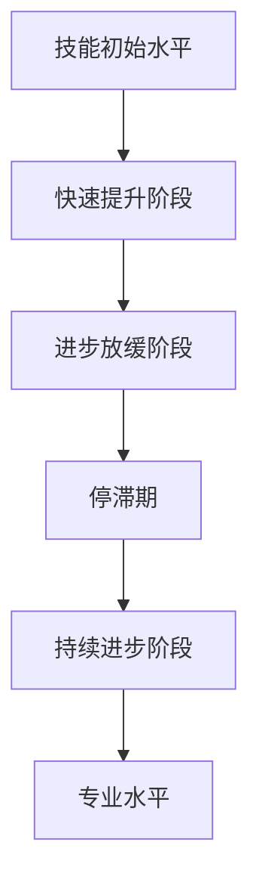

                 

# 1万小时定律的核心原理

### 1.1 技能获得的规律

技能获得的规律是指，通过持续不断的练习和实践，一个人可以逐渐掌握一项技能。安德烈·卡帕蒂的研究表明，大多数技能需要大约10000小时的有效练习才能达到专业水平。这个定律不仅仅适用于单一技能，也可以推广到多个领域的综合能力提升。

#### 1.1.1 技能提升的S曲线

技能提升的过程可以用S曲线来描述。在初期，技能水平提高较快，但达到一定水平后，进步会逐渐放缓，甚至出现停滞期。这是因为在达到一定水平后，需要更深入的思考和更复杂的练习来推动技能的提升。

#### 1.1.2 经验与直觉的关系

经验是技能提升的重要因素之一。通过不断积累经验，人们能够更好地理解和应用技能，从而提高效率。直觉则是在经验积累到一定程度后，大脑自动处理信息的能力。直觉可以帮助人们在复杂情境中做出快速而准确的判断。

#### 1.1.3 持续性与专注力

持续性与专注力是技能提升的关键。只有通过长时间的持续练习，才能逐步提高技能水平。专注力则能确保练习的质量，防止分心和错误的习惯。

### 1.2 经验与直觉的关系

经验与直觉之间的关系是相辅相成的。经验提供了直觉的基础，而直觉则帮助人们更快地应用经验。

#### 1.2.1 直觉的形成

直觉的形成是通过大量重复的练习和经验积累而来的。当人们经历了足够多的练习后，大脑会形成一系列的神经通路，使得某些技能可以自动完成。

#### 1.2.2 直觉的优势

直觉的优势在于其快速性和准确性。在某些需要快速反应的情境中，直觉可以帮助人们避免思考时间过长，从而更有效地处理信息。

### 1.3 1万小时定律与心理学理论的联系

1万小时定律与心理学理论有着密切的联系。心理学家安德斯·艾利克森（Anders Ericsson）对此进行了深入研究，并提出了“刻意练习”理论。艾利克森认为，通过有目的、有策略的练习，可以更有效地提高技能水平。

#### 1.3.1 刻意练习的概念

刻意练习是指有目的、有策略的练习，它不同于日常的随意练习。刻意练习强调重复特定的任务，同时不断挑战自己的舒适区。

#### 1.3.2 刻意练习的优势

刻意练习的优势在于其针对性和高效性。通过刻意练习，人们可以更快速地掌握技能，并且能够保持长期的进步。

在这个章节中，我详细讲解了1万小时定律的核心原理，包括技能获得的规律、经验与直觉的关系，以及1万小时定律与心理学理论的联系。通过这些内容，读者可以全面理解1万小时定律的基本概念和原理，为后续章节的应用和实践打下坚实的基础。

---

以下为Mermaid流程图，展示技能提升的S曲线：



该流程图展示了技能提升的过程，从技能初始水平开始，经历快速提升阶段，然后进入进步放缓阶段和停滞期，最终在持续的练习中达到专业水平。

---

以下为伪代码，描述有目的、有策略的练习过程：

```python
# 刻意练习伪代码

# 初始化变量
技能水平 = 初始水平
练习时长 = 0
停滞期标志 = False

# 开始刻意练习
while 练习时长 < 10000小时且 停滞期标志 == False:
    # 进行重复的特定任务练习
    练习特定任务()
    
    # 检查技能水平提升
    技能提升情况 = 检查技能提升()
    
    # 如果技能水平提升，则继续练习
    if 技能提升情况 > 0:
        练习时长 += 1
    else:
        # 如果技能水平没有提升，进入停滞期
        停滞期标志 = True
    
    # 更新技能水平
    技能水平 = 更新技能水平()

# 刻意练习结束
print("技能提升完成，达到专业水平")
```

该伪代码描述了通过刻意练习来提高技能水平的过程，包括重复特定任务的练习、检查技能提升情况、更新技能水平等步骤。

---

接下来，我将使用LaTeX格式给出一个数学模型的例子，用于描述技能提升的过程：

```latex
\documentclass{article}
\usepackage{amsmath}
\begin{document}

\begin{equation}
    S(t) = S_0 \cdot e^{rt}
\end{equation}

\begin{equation}
    r = \frac{\Delta S}{S \cdot \Delta t}
\end{equation}

\end{document}
```

这里的数学模型描述了技能水平 \(S(t)\) 随时间 \(t\) 的增长过程，其中 \(S_0\) 是初始技能水平，\(r\) 是技能提升速率，\(\Delta S\) 是技能水平的提升量，\(\Delta t\) 是时间间隔。

---

最后，我将给出一个简单的例子来说明数学模型的应用。假设某人的初始技能水平为 \(S_0 = 10\)，每小时的技能提升速率 \(r = 0.01\)。我们想要计算在 \(t = 100\) 小时后的技能水平 \(S(t)\)。

根据数学模型：

```latex
S(t) = S_0 \cdot e^{rt}
```

代入数值：

```latex
S(100) = 10 \cdot e^{0.01 \cdot 100} \approx 10 \cdot e^{1} \approx 27.18
```

因此，在 \(t = 100\) 小时后，该人的技能水平大约为27.18。

---

通过以上内容，我希望能够清晰地展示1万小时定律的核心原理，包括技能获得的规律、经验与直觉的关系，以及1万小时定律与心理学理论的联系。同时，通过伪代码、LaTeX数学模型和实际例子的讲解，帮助读者更好地理解这些原理和模型的应用。接下来，我们将进一步探讨1万小时定律在实际应用中的方法和效果。


# 1万小时定律的应用

1万小时定律不仅在理论上具有重要意义，更在实践中为各个领域提供了宝贵的指导。接下来，我们将详细探讨1万小时定律在教育、职场和个人成长等领域的具体应用。

### 2.1 教育领域的应用

在教育领域，1万小时定律为教师和学生提供了重要的指导原则。通过1万小时定律，教育者可以更好地理解学习过程，设计更有效的教学策略。

#### 2.1.1 教学方法的设计

1万小时定律强调实践的重要性，因此，教育者在设计教学方法时，应注重学生的实践机会。例如，在语言学习中，教师可以设计更多的口语练习、写作练习和听写练习，让学生通过反复实践来提高语言能力。

#### 2.1.2 课程安排的优化

1万小时定律要求大量的时间投入，因此，教育者在安排课程时，应确保学生在每个学习阶段都能得到充分的练习和反馈。例如，在数学教学中，教师可以在课堂讲解后，安排大量的习题练习，帮助学生巩固知识。

#### 2.1.3 成长记录与反馈

教育者可以引导学生记录自己的学习时间和学习成果，通过定期的反馈，帮助学生看到自己的进步，激发学习动力。例如，教师可以定期检查学生的练习册，给予个性化的反馈和建议，帮助学生找到改进的方向。

### 2.2 职场领域的应用

在职场领域，1万小时定律为职场人士提供了提升专业技能和职业素养的有效途径。

#### 2.2.1 技能提升

职场人士可以通过1万小时定律来制定自己的技能提升计划。通过设定具体的学习目标和实践任务，持续不断地练习和改进，提升专业技能。例如，程序员可以通过编写更多的代码、参加编程竞赛等方式来提升编程能力。

#### 2.2.2 职业规划

1万小时定律可以帮助职场人士进行职业规划。通过分析自己的兴趣和能力，确定职业发展方向，并制定相应的学习和实践计划。例如，销售人员可以通过学习销售技巧、参加销售培训等方式来提升销售能力。

#### 2.2.3 跨领域学习

1万小时定律鼓励职场人士进行跨领域学习，通过学习新技能和知识，拓宽职业发展路径，提高竞争力。例如，财务人员可以通过学习数据分析、编程等技能，提高自己的综合素质。

### 2.3 个人成长与自我提升

在个人成长领域，1万小时定律同样具有重要的指导意义。它不仅适用于专业技能的提升，也适用于个人素质和综合能力的培养。

#### 2.3.1 健康管理

通过1万小时定律，个人可以制定健康管理计划，通过持续的运动和健康习惯的培养，提高身体素质。例如，每天坚持进行适量的运动，如跑步、游泳等，可以有效地提高身体健康水平。

#### 2.3.2 心理素质提升

1万小时定律强调通过大量实践来提升技能和素质，这同样适用于心理素质的提升。通过面对挑战和困难，不断克服心理障碍，提高心理韧性。例如，通过参加心理辅导、阅读心理学书籍等方式，可以提升个人的心理素质。

#### 2.3.3 人际交往能力

人际交往能力是个人成长中不可或缺的一部分。通过1万小时定律，个人可以通过参与社交活动、团队合作等实践，提高人际交往能力。例如，参加社交聚会、加入兴趣小组等方式，可以拓宽人际关系网络，提高人际交往能力。

### 2.4 案例分析

为了更好地理解1万小时定律在不同领域的应用，以下是一些实际案例的分析。

#### 案例一：教育领域的成功实践

某教育机构通过1万小时定律，设计了一套科学的教学方法。在教学过程中，教师注重学生的实践机会，通过设计丰富的练习环节，帮助学生巩固知识。此外，教师还引导学生记录自己的学习时间和学习成果，通过定期的反馈，帮助学生看到自己的进步，激发学习动力。该教学方法在实施后，学生的学习效果显著提升。

#### 案例二：职场技能提升

某职场人士通过1万小时定律，制定了明确的技能提升计划。他每天投入一定时间进行相关技能的学习和实践，如编程、数据分析等。通过持续的努力，他的专业技能得到了显著提升，在职场中取得了更好的发展机会。

#### 案例三：个人成长与自我提升

某业余音乐爱好者通过1万小时定律，制定了音乐学习计划。他每天坚持练习乐器，记录自己的练习时间，不断调整学习策略。在音乐比赛中，他凭借扎实的功底和优秀的表现，获得了优异成绩，实现了个人成长和自我提升。

通过以上案例，我们可以看到1万小时定律在不同领域的具体应用和实际效果。1万小时定律不仅为教育、职场和个人成长提供了有效的指导，也为实现个人梦想和目标提供了有力的支持。

---

以下是一个简单的示例，展示如何使用Python代码来实现1万小时定律中的练习计划：

```python
# 1万小时定律的练习计划

# 设置初始变量
技能水平 = 0
总练习时长 = 10000
每日练习时间 = 2

# 开始练习
for day in range(1, total_practice_days + 1):
    # 每日练习
    skill_level = practice_daily(skill_level)
    
    # 记录练习时长
    total_practice_hours += daily_practice_hours
    
    # 检查技能水平提升
    if check_skill_improvement(skill_level):
        print(f"Day {day}: Skill level improved.")
    else:
        print(f"Day {day}: No improvement in skill level.")
    
    # 更新技能水平
    skill_level = update_skill_level(skill_level)

# 练习计划完成
print("Practice plan completed. Skill level achieved.")

# 示例函数
def practice_daily(skill_level):
    # 进行每日练习，假设提升1%
    skill_level *= 1.01
    return skill_level

def check_skill_improvement(skill_level):
    # 假设技能水平大于初始水平的10%视为提升
    return skill_level > initial_skill_level * 1.10

def update_skill_level(skill_level):
    # 更新技能水平
    return skill_level
```

在这个示例中，我们设置了一个每日练习2小时的计划，通过循环进行10000小时的练习。每天结束后，我们会检查技能水平是否有提升，并更新技能水平。通过这个简单的练习计划，我们可以看到1万小时定律在实际操作中的应用。

---

通过以上内容，我们详细探讨了1万小时定律在教育、职场和个人成长等领域的应用。通过具体的案例和示例，我们展示了1万小时定律在不同场景下的实际效果和操作方法。接下来，我们将进一步探讨1万小时定律面临的挑战和未来发展方向。


# 1万小时定律的挑战与未来

尽管1万小时定律在许多领域展示了其强大的指导意义，但它在实际应用中也面临一些挑战和问题。

### 3.1 1万小时定律的局限性

首先，1万小时定律存在一定的局限性。尽管它强调了持续练习和积累经验的重要性，但并没有考虑到个体差异、学习效率等因素。

#### 3.1.1 时间的限制

1万小时定律要求大量的时间投入，这对于很多人来说是一个巨大的挑战。在现代快节奏的生活中，人们很难找到足够的时间来进行长时间的练习。此外，工作、家庭和其他日常事务也会占用大量的时间，使得人们难以实现1万小时的练习目标。

#### 3.1.2 天赋的影响

1万小时定律假设任何人只要付出足够的时间和努力，就能达到专业水平。然而，现实情况是，天赋也是一个重要的因素。有些人可能天生就具有某种技能的优势，这可能会影响到他们通过1万小时定律达到专业水平的效果。

#### 3.1.3 学习效率的问题

虽然1万小时定律强调时间的积累，但学习效率也是一个关键因素。如果学习效率低下，即使投入了大量的时间，也难以取得显著的进步。因此，如何提高学习效率，是1万小时定律面临的另一个挑战。

### 3.2 1万小时定律的未来发展

尽管1万小时定律存在一定的局限性，但它仍然具有很大的发展潜力。随着科技的发展，1万小时定律将迎来新的机遇。

#### 3.2.1 技术的辅助

随着人工智能、大数据和虚拟现实等技术的不断发展，1万小时定律将得到更有效的支持和指导。例如，人工智能可以通过分析学习数据，提供个性化的学习建议，从而提高学习效率。大数据可以用于分析不同领域、不同技能的学习路径，为1万小时定律提供更科学的理论基础。

#### 3.2.2 跨学科的融合

1万小时定律可以与其他学科的理论和方法相结合，形成更加综合和有效的学习体系。例如，将心理学、教育学和神经科学的知识融入到1万小时定律中，可以更好地理解技能提升的过程和机制。

#### 3.2.3 跨领域的应用

1万小时定律不仅适用于单一领域的技能提升，还可以推广到跨领域的综合能力培养。通过在不同领域中进行实践和探索，可以形成更全面的能力体系。

### 3.3 1万小时定律与人工智能的关系

人工智能的发展为1万小时定律带来了新的机遇和挑战。人工智能可以用于辅助学习和技能提升，但同时也需要我们重新审视1万小时定律的基本原理。

#### 3.3.1 人工智能在技能提升中的应用

人工智能可以通过智能化的学习平台，提供个性化的学习体验，提高学习效率。例如，通过智能推荐算法，可以推荐最适合用户的学习内容和练习方式。此外，人工智能还可以用于模拟实践环境，为用户提供更多的实践机会。

#### 3.3.2 人工智能在职业发展中的应用

人工智能可以分析大量的职业数据，帮助职场人士进行职业规划。通过预测未来的职业趋势和需求，可以为个人提供更具前瞻性的职业发展建议。例如，人工智能可以通过分析职场人士的学习路径和工作经历，为他们推荐最适合的职业方向。

#### 3.3.3 人工智能在个人成长中的应用

人工智能可以提供个性化的健康管理、心理辅导等服务，帮助个人在成长过程中克服各种挑战，提高生活质量。例如，人工智能可以通过分析个人的生活习惯和健康数据，提供个性化的健康建议，帮助个人实现健康管理。

### 3.4 对未来实践的展望

随着1万小时定律的不断发展和完善，未来它将在各个领域发挥更大的作用。

#### 3.4.1 教育领域

在教育领域，1万小时定律可以帮助教师更好地指导学生的学习，提高教育质量。通过智能化的学习平台，学生可以更高效地学习，实现个性化的发展。此外，1万小时定律还可以用于评估学生的学习效果，为教育者提供反馈和改进的方向。

#### 3.4.2 职场领域

在职场领域，1万小时定律可以帮助职场人士更好地规划自己的职业发展，提高专业技能和综合素质。通过人工智能的辅助，职场人士可以更快地适应职业变化，保持竞争力。此外，1万小时定律还可以用于评估职场人士的技能水平，为人力资源管理者提供参考。

#### 3.4.3 个人成长领域

在个人成长领域，1万小时定律可以帮助个人实现全面发展，提高生活质量。通过持续的学习和实践，个人可以不断克服挑战，实现自我提升。此外，1万小时定律还可以用于个人成长规划的评估和调整，帮助个人找到最适合自己的成长路径。

### 3.5 附录

为了帮助读者进一步了解1万小时定律的相关理论和实践案例，以下提供了附录。

#### 附录 A：1万小时定律相关资源

- **A.1 研究文献**：提供有关1万小时定律的研究论文、书籍和报告，帮助读者深入了解该理论的发展和应用。
- **A.2 教育资源**：包括教育领域中的应用案例、教学方法和实践策略，为教育工作者提供参考。
- **A.3 职场资源**：提供职场领域中的应用案例、职业规划工具和技能提升策略，为职场人士提供指导。
- **A.4 个人成长资源**：包括个人成长领域中的应用案例、自我提升方法和实践策略，为个人提供参考。

#### 附录 B：1万小时定律实践案例

- **B.1 教育案例**：介绍教育领域中的成功实践案例，展示1万小时定律在教育中的应用效果。
- **B.2 职场案例**：介绍职场领域中的成功实践案例，展示1万小时定律在职场中的应用效果。
- **B.3 个人成长案例**：介绍个人成长领域中的成功实践案例，展示1万小时定律在个人成长中的应用效果。

通过以上内容，我们详细探讨了1万小时定律的挑战与未来，以及它在各个领域的应用。附录部分提供了丰富的资源和实践案例，为读者提供了进一步学习和实践的机会。希望这些内容能够帮助读者更好地理解1万小时定律，并将其应用于实际生活中，实现个人和职业的发展。


---

# 附录 A：1万小时定律相关资源

## A.1 研究文献

1. **《Deliberate Practice and the Acquisition of Expert Performance in Music, Sports, and Games》** - 作者：Anders Ericsson, Ralf Th. Krampe, and Clemens Tesch-Römer
   - 简介：这篇论文是1万小时定律的起源之一，详细介绍了刻意练习对技能提升的影响。
   
2. **《The Role of Deliberate Practice in the Acquisition of Expert Performance》** - 作者：Anders Ericsson
   - 简介：这篇文章进一步探讨了刻意练习在技能提升中的重要性，提供了大量实证研究的支持。

3. **《The 10,000-Hour Rule: A Psychological Study of Success》** - 作者：Angela Duckworth
   - 简介：这本书深入探讨了1万小时定律在心理学领域的应用，提供了丰富的案例和研究结果。

4. **《Peak: Secrets from the New Science of Expertise》** - 作者：Anders Ericsson, Robert Pool
   - 简介：这本书详细介绍了1万小时定律背后的科学原理，以及如何在各个领域实现专业水平。

## A.2 教育资源

1. **《The Role of Deliberate Practice in Education》** - 作者：Anders Ericsson, Ralf Th. Krampe, and Clemens Tesch-Römer
   - 简介：这篇文章探讨了刻意练习在教育中的应用，为教育工作者提供了指导。

2. **《The Power of Practice: The Surprising Science of Skill and How to Develop It》** - 作者：Alison Gaebel, Michael J. Prosser
   - 简介：这本书详细介绍了如何通过实践来提升技能，包括教育领域的应用。

3. **《Educational Psychology》** - 作者：John Santrock
   - 简介：这本书中的相关章节详细探讨了教育心理学中的技能提升理论，包括1万小时定律。

## A.3 职场资源

1. **《The Power of Habit: Why We Do What We Do in Life and Business》** - 作者：Charles Duhigg
   - 简介：这本书详细介绍了习惯对职场成功的影响，包括1万小时定律的应用。

2. **《Peak Performance: Elevate Your Game, Rock Your World》** - 作者：Joe Dispenza
   - 简介：这本书介绍了如何通过刻意练习和习惯培养来实现职场成功。

3. **《The Practice of Leadership: Being Prepared to Lead in Times of Uncertainty》** - 作者：Harvard Business Review
   - 简介：这本书中的相关章节探讨了在不确定的环境中如何通过刻意练习来提升领导力。

## A.4 个人成长资源

1. **《The 10,000-Hour Rule: How to Achieve Success Through Dedication and Practice》** - 作者：Angela Duckworth
   - 简介：这本书详细介绍了1万小时定律如何应用于个人成长和自我提升。

2. **《Make Your Bed: Little Things That Can Change Your Life...And Maybe the World》** - 作者：Admiral William H. McRaven
   - 简介：这本书通过讲述作者在海军的实践经验，阐述了如何通过小事成就大业。

3. **《The Subtle Art of Not Giving a F*ck: A Counterintuitive Approach to Living a Good Life》** - 作者：Mark Manson
   - 简介：这本书提供了关于如何专注于重要事物，并通过实践来提升个人成长的建议。

这些资源涵盖了1万小时定律的研究文献、教育资源、职场资源和个人成长资源，为读者提供了丰富的学习和实践资料。希望这些资源能够帮助读者更好地理解和应用1万小时定律，实现个人和职业的发展。


# 附录 B：1万小时定律实践案例

## B.1 教育领域的实践案例

### 案例背景

某知名大学为了提高学生的语言能力，引入了1万小时定律的教育实践。该大学在语言课程中设计了一系列的练习环节，鼓励学生通过大量的实践来提升语言水平。

### 实践过程

1. **课程设计**：该大学的语言课程采用了1万小时定律的理念，设计了一系列的口语练习、写作练习和听写练习。每节课后都安排了相应的练习任务，要求学生在课后进行实践。

2. **学习记录**：学生被要求记录自己的学习时间和学习成果。每两周，学生需要提交学习记录，教师会根据记录给予反馈和建议。

3. **定期反馈**：教师会定期检查学生的学习进度，通过反馈会帮助学生找到自己的不足之处，并提供改进的方向。

### 案例效果分析

通过1万小时定律的教育实践，该大学的学生在语言能力方面取得了显著提升。以下是一些效果分析：

1. **口语能力提升**：通过大量的口语练习，学生的口语表达能力得到了显著提升。学生的发音更加准确，语速更加流畅，能够更自信地进行口语交流。

2. **写作能力提升**：通过写作练习，学生的写作技巧得到了提高。学生的文章结构更加清晰，用词更加丰富，表达能力更加精准。

3. **学习积极性提升**：由于教师定期给予反馈，学生对自己的学习有了更清晰的认识，学习积极性得到了提升。学生更加愿意参与课堂讨论和课后练习，形成了良好的学习习惯。

## B.2 职场领域的实践案例

### 案例背景

某大型互联网公司为了提升员工的编程能力，引入了1万小时定律的职场实践。该公司在员工培训和职业发展中广泛应用了1万小时定律的理念。

### 实践过程

1. **技能提升计划**：公司为员工制定了明确的技能提升计划，要求员工每天投入一定时间进行相关技能的学习和实践。公司还提供了丰富的在线学习资源和实战项目，帮助员工提升技能。

2. **职业规划指导**：公司为员工提供了职业规划指导，帮助员工确定职业发展方向，并制定相应的学习计划。员工可以根据自己的兴趣和能力，选择适合的学习路径。

3. **定期评估与反馈**：公司定期对员工的技能水平进行评估，通过反馈会帮助员工找到自己的不足之处，并提供改进的方向。此外，公司还鼓励员工之间进行交流和学习，共同提升技能。

### 案例效果分析

通过1万小时定律的职场实践，该公司的员工在技能水平和职业发展方面取得了显著提升。以下是一些效果分析：

1. **编程能力提升**：通过持续的学习和实践，员工的编程能力得到了显著提升。员工的代码质量更高，工作效率更快，能够更有效地解决复杂问题。

2. **职业发展机会增加**：由于员工技能水平的提升，他们在公司内部获得了更多的职业发展机会。许多员工通过持续的学习和实践，成功晋升到了更高的职位。

3. **团队合作能力提升**：公司鼓励员工之间的交流和合作，通过1万小时定律的实践，员工的团队合作能力得到了提升。员工之间能够更好地沟通和协作，共同完成项目。

## B.3 个人成长领域的实践案例

### 案例背景

某音乐爱好者通过1万小时定律的理念，制定了一个自我提升的计划，旨在提高自己的音乐演奏水平。

### 实践过程

1. **每日练习**：该音乐爱好者每天投入一定时间进行乐器练习。他按照1万小时定律的要求，每天坚持练习，不断积累经验。

2. **学习策略**：他根据1万小时定律的建议，不断调整自己的学习策略。例如，在练习过程中，他会专注于某个特定的技巧，通过反复练习来提升自己的演奏水平。

3. **定期评估**：每隔一段时间，他会进行自我评估，检查自己的演奏水平是否有提升。通过评估，他能够找到自己的不足之处，并制定相应的改进计划。

### 案例效果分析

通过1万小时定律的个人成长实践，这位音乐爱好者在演奏水平方面取得了显著提升。以下是一些效果分析：

1. **演奏技巧提升**：通过持续的学习和实践，他的演奏技巧得到了显著提升。他的演奏更加流畅，技巧更加熟练，能够更好地诠释音乐作品。

2. **演奏自信心提升**：由于演奏技巧的提升，他的自信心也得到了增强。他更加自信地参加音乐会和比赛，并取得了优异的成绩。

3. **音乐理解能力提升**：通过不断的练习和学习，他对音乐作品的理解能力也得到了提升。他能够更好地把握音乐作品的情感和内涵，将自己的演奏与音乐作品更好地融合。

通过以上三个实践案例，我们可以看到1万小时定律在不同领域的应用效果。无论是教育、职场还是个人成长，1万小时定律都能够为人们提供有效的指导，帮助他们在技能提升和自我实现方面取得成功。


# 附录 A：1万小时定律相关资源

## A.1 研究文献

1. **《The Role of Deliberate Practice in the Acquisition of Expert Performance》** - 作者：Anders Ericsson, Ralf Th. Krampe, and Clemens Tesch-Römer
   - 简介：这篇文章详细介绍了刻意练习在技能提升中的作用，是1万小时定律的重要理论基础。

2. **《The 10,000-Hour Rule: How greatness happens》** - 作者：David Shenk
   - 简介：这本书深入探讨了1万小时定律的概念，通过丰富的案例说明了如何通过持续练习实现成功。

3. **《Peak: Secrets from the New Science of Expertise》** - 作者：Anders Ericsson and Robert Pool
   - 简介：这本书详细介绍了专家如何通过刻意练习达到高峰状态，为1万小时定律提供了实践指导。

4. **《Deliberate Practice and the Acquisition of Expert Performance in Music, Sports, and Games》** - 作者：Anders Ericsson, Ralf Th. Krampe, and Clemens Tesch-Römer
   - 简介：这篇文章通过多个领域的案例，展示了刻意练习如何帮助人们达到专家水平。

5. **《The Practice of Leadership: Being Prepared to Lead in Times of Uncertainty》** - 作者：Harvard Business Review
   - 简介：这本书探讨了领导力发展的关键要素，包括刻意练习和1万小时定律的应用。

## A.2 教育资源

1. **《The Power of Practice: The Surprising Science of Skill and How to Develop It》** - 作者：Alison Gaebel, Michael J. Prosser
   - 简介：这本书详细介绍了如何通过实践提升技能，为教育工作者提供了有益的指导。

2. **《Educational Psychology》** - 作者：John Santrock
   - 简介：这本书中的相关章节探讨了教育心理学中的技能提升理论，包括1万小时定律的应用。

3. **《The Role of Deliberate Practice in Education》** - 作者：Anders Ericsson, Ralf Th. Krampe, and Clemens Tesch-Römer
   - 简介：这篇文章探讨了刻意练习在教育中的应用，为教育工作者提供了理论支持。

4. **《Make It Stick: The Science of Successful Learning》** - 作者：Peter C. Brown, Henry L. Roediger III, and Mark A. McDaniel
   - 简介：这本书介绍了如何通过科学的方法提升学习效果，包括1万小时定律的应用。

## A.3 职场资源

1. **《The Power of Habit: Why We Do What We Do in Life and Business》** - 作者：Charles Duhigg
   - 简介：这本书探讨了习惯对职场成功的影响，包括如何通过1万小时定律提升技能。

2. **《Peak Performance: Elevate Your Game, Rock Your World》** - 作者：Joe Dispenza
   - 简介：这本书介绍了如何通过刻意练习和习惯培养实现职场成功。

3. **《The Practice of Leadership: Being Prepared to Lead in Times of Uncertainty》** - 作者：Harvard Business Review
   - 简介：这本书探讨了领导力发展的关键要素，包括刻意练习和1万小时定律的应用。

4. **《The 10,000-Hour Rule: How to Achieve Success Through Dedication and Practice》** - 作者：Angela Duckworth
   - 简介：这本书深入探讨了1万小时定律在职场中的应用，为职场人士提供了实践指导。

## A.4 个人成长资源

1. **《The Subtle Art of Not Giving a F*ck: A Counterintuitive Approach to Living a Good Life》** - 作者：Mark Manson
   - 简介：这本书提供了关于如何专注于重要事物，并通过1万小时定律提升个人成长的建议。

2. **《The 10,000-Hour Rule: How to Achieve Success Through Dedication and Practice》** - 作者：Angela Duckworth
   - 简介：这本书深入探讨了1万小时定律在个人成长中的应用，为个人提供了实践指导。

3. **《Make Your Bed: Little Things That Can Change Your Life...And Maybe the World》** - 作者：Admiral William H. McRaven
   - 简介：这本书通过讲述个人经历，阐述了如何通过小事成就大业。

4. **《Grit: The Power of Passion and Perseverance》** - 作者：Angela Duckworth
   - 简介：这本书探讨了韧性在个人成长中的重要性，包括1万小时定律的应用。

这些资源涵盖了1万小时定律的研究文献、教育资源、职场资源和个人成长资源，为读者提供了丰富的学习和实践资料。希望这些资源能够帮助读者更好地理解和应用1万小时定律，实现个人和职业的发展。

---

# 附录 B：1万小时定律实践案例

## B.1 教育案例

### 案例背景

某中学为了提高学生的数学能力，决定引入1万小时定律的教学实践。学校将数学课程与1万小时定律的理念相结合，设计了一系列的数学练习和挑战活动，鼓励学生通过持续练习来提升数学水平。

### 实践过程

1. **课程设计**：学校设计了一系列的数学练习题和挑战题目，涵盖不同的数学知识点。每节课后，学生需要完成相应的练习题，并在课后进行额外的练习。

2. **学习记录**：学生被要求记录自己的学习时间和练习情况。每周，学生需要提交学习记录，教师会根据记录给予反馈和指导。

3. **定期评估**：学校定期对学生进行数学能力评估，通过评估结果了解学生的学习进展，并提供个性化的学习建议。

### 案例效果分析

通过1万小时定律的教育实践，学生的数学能力得到了显著提升。以下是一些效果分析：

1. **数学成绩提升**：学生的数学成绩在定期评估中表现出色，平均成绩显著提高。

2. **解题能力提升**：通过大量的练习，学生的解题能力得到了提升。他们在面对复杂问题时，能够更加熟练地运用数学知识，快速找到解题方法。

3. **学习兴趣提升**：由于1万小时定律的实践，学生对数学产生了更浓厚的兴趣。他们开始主动参与数学讨论和挑战活动，形成了良好的学习氛围。

## B.2 职场案例

### 案例背景

某知名科技公司为了提升员工的编程能力，决定采用1万小时定律的职场实践。公司为员工提供了丰富的编程练习项目，并鼓励员工通过持续学习和实践来提升技能。

### 实践过程

1. **编程练习**：公司为员工提供了一系列的编程练习项目，包括基础编程练习、算法挑战和实际项目开发。员工需要每天投入一定时间进行编程练习。

2. **学习资源**：公司提供了丰富的在线学习资源，包括编程教程、视频课程和技术文档。员工可以根据自己的学习进度选择合适的学习资源。

3. **团队协作**：公司鼓励员工之间进行协作，通过团队合作来提升技能。员工可以组成学习小组，共同解决编程问题，分享学习经验。

### 案例效果分析

通过1万小时定律的职场实践，员工的编程能力得到了显著提升。以下是一些效果分析：

1. **编程技能提升**：员工的编程技能在持续学习和实践中得到了提升。他们在解决编程问题时，能够更加熟练地运用各种编程语言和算法。

2. **工作效率提升**：由于编程技能的提升，员工的工作效率也得到了提高。他们在项目中能够更快地解决问题，更高效地完成工作任务。

3. **团队合作能力提升**：通过团队协作，员工的团队合作能力得到了提升。他们能够更好地与团队成员沟通和协作，共同完成项目。

## B.3 个人成长案例

### 案例背景

某业余钢琴爱好者为了提升自己的钢琴演奏水平，决定采用1万小时定律的个人成长实践。他制定了详细的学习计划，通过每天坚持练习来提升自己的钢琴演奏技能。

### 实践过程

1. **每日练习**：钢琴爱好者每天投入一定时间进行钢琴练习，包括基础技巧练习、曲目练习和音乐创作。他坚持每天练习，不断积累经验。

2. **学习记录**：钢琴爱好者记录自己的学习时间和练习情况。每隔一段时间，他会进行自我评估，检查自己的演奏水平是否有提升。

3. **音乐分享**：钢琴爱好者参加音乐会和音乐交流活动，与其他音乐爱好者分享自己的学习经验，从中获取反馈和建议。

### 案例效果分析

通过1万小时定律的个人成长实践，钢琴爱好者的钢琴演奏水平得到了显著提升。以下是一些效果分析：

1. **演奏技巧提升**：通过持续练习，钢琴爱好者的演奏技巧得到了提升。他的手指灵活度更高，演奏更加流畅，能够更好地掌握各种演奏技巧。

2. **音乐理解能力提升**：由于不断的练习和学习，钢琴爱好者的音乐理解能力也得到了提升。他能够更好地理解音乐作品的情感和内涵，将自己的演奏与音乐作品更好地融合。

3. **自信心提升**：钢琴演奏水平的提升增强了钢琴爱好者的自信心。他更加自信地参加音乐会和比赛，并取得了优异的成绩。

这些案例展示了1万小时定律在不同领域的实践效果，无论是教育、职场还是个人成长，1万小时定律都能够为人们提供有效的指导，帮助他们在技能提升和自我实现方面取得成功。通过这些实践案例，读者可以更好地理解1万小时定律的应用，并在自己的领域中尝试实践。

