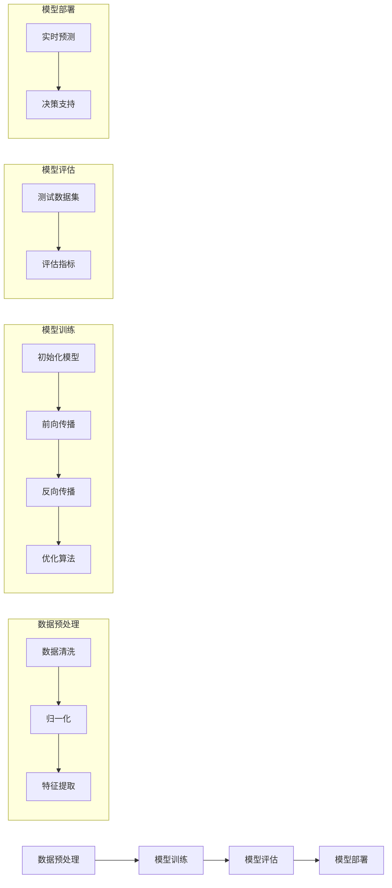
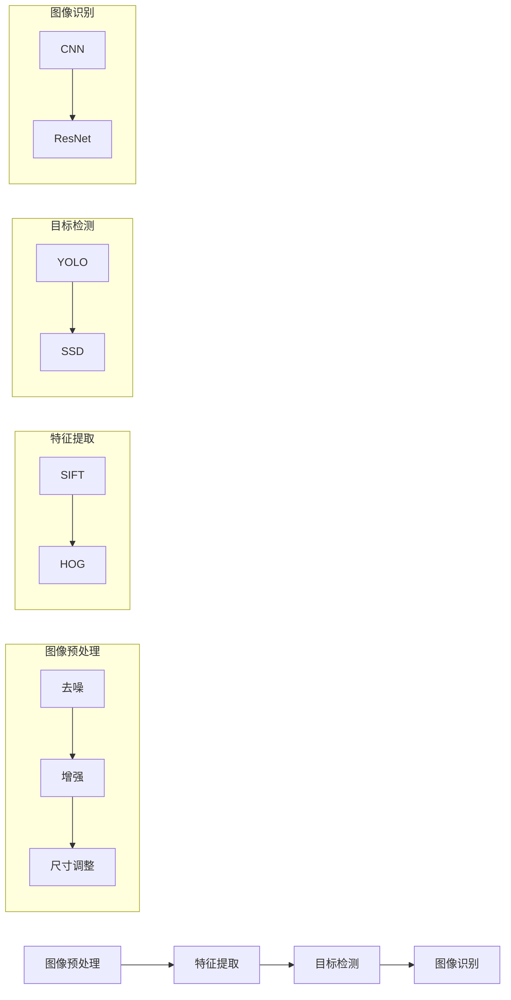
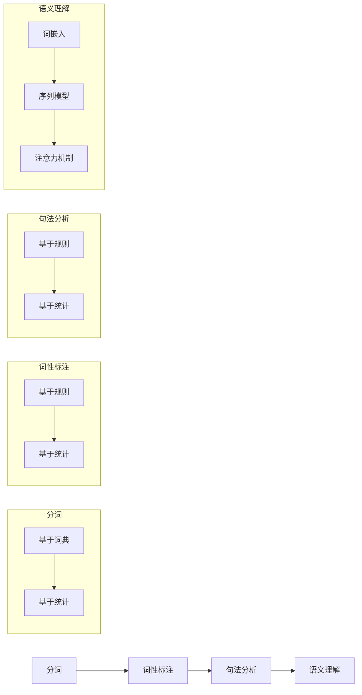

                 

# Andrej Karpathy：人工智能的未来发展挑战

> 关键词：人工智能，深度学习，挑战，未来趋势，伦理问题，技术创新，产业应用

> 摘要：本文从历史、现状和未来趋势三个方面，详细分析了人工智能领域的发展历程、核心技术原理、面临的伦理与社会问题，以及未来的技术创新和产业应用前景。文章旨在为读者提供一个全面、系统的认识，帮助理解人工智能的发展现状和未来挑战，以及应对策略。

## 《Andrej Karpathy：人工智能的未来发展挑战》目录大纲

- 第一部分：引言与背景
  - 1.1 人工智能发展现状与趋势
  - 1.2 书籍目的与读者对象

- 第二部分：核心概念与原理
  - 2.1 人工智能基础
  - 2.2 人工智能架构
  - 2.3 人工智能架构的Mermaid流程图

- 第三部分：核心算法原理
  - 3.1 神经网络算法
  - 3.2 深度学习算法
  - 3.3 自然语言处理算法

- 第四部分：数学模型与公式
  - 4.1 数学基础
  - 4.2 深度学习数学模型

- 第五部分：项目实战
  - 5.1 计算机视觉项目实战
  - 5.2 自然语言处理项目实战

- 第六部分：未来挑战与趋势
  - 6.1 人工智能的伦理与社会问题
  - 6.2 技术创新与产业应用
  - 6.3 人才培养与政策支持

- 第七部分：总结与展望
  - 7.1 全书总结
  - 7.2 展望未来

- 附录
  - 附录 A：参考资源与工具
  - 附录 B：代码实现示例
  - 附录 C：术语表

### 第一部分：引言与背景

#### 1.1 人工智能发展现状与趋势

人工智能（AI）是计算机科学的一个分支，旨在通过计算机程序来模拟、延伸和扩展人类的智能。随着深度学习技术的快速发展，人工智能已经取得了显著的成就，并在各个领域得到了广泛应用。

**人工智能的历史与发展：**

人工智能的研究可以追溯到20世纪50年代，当时科学家们首次提出了“人工智能”的概念。随后，人工智能经历了几个发展阶段：

- **符号人工智能（Symbolic AI）：** 这一阶段主要依赖于逻辑推理和知识表示，通过符号和规则来模拟人类的思维过程。
- **连接主义人工智能（Connectionist AI）：** 这一阶段主要关注神经网络和机器学习，通过大量数据训练模型来模拟人类智能。
- **混合人工智能（Hybrid AI）：** 结合了符号人工智能和连接主义人工智能的优点，试图通过多种方法来提高人工智能的性能。

**当前人工智能技术的应用领域：**

如今，人工智能已经广泛应用于各个领域，包括：

- **计算机视觉：** 人工智能在图像和视频分析、目标检测、图像识别等方面取得了显著成果，为自动驾驶、安防监控等领域提供了技术支持。
- **自然语言处理：** 人工智能在语音识别、机器翻译、文本分析等方面取得了重要进展，为智能客服、智能助理等领域提供了强大的支持。
- **智能推理与决策：** 人工智能在医疗诊断、金融分析、交通规划等领域，通过数据分析和模型预测，为决策提供了科学依据。

**人工智能发展的未来趋势：**

随着技术的不断进步，人工智能在未来将面临以下几个发展趋势：

- **更强大的计算能力：** 随着量子计算和神经形态计算的不断发展，人工智能的计算能力将得到进一步提升，为复杂任务提供更强的支持。
- **跨领域融合：** 人工智能将在不同领域之间实现深度融合，为各个行业提供创新的解决方案。
- **人机协作：** 人工智能将在人机协作方面发挥更大的作用，通过人机交互技术，实现更加智能、高效的人机协作。

#### 1.2 书籍目的与读者对象

本书旨在为读者提供一个全面、系统的认识，帮助理解人工智能的发展现状和未来挑战，以及应对策略。本书的主要目标包括：

1. **梳理人工智能的发展历程和核心技术：** 通过回顾人工智能的历史和发展，帮助读者了解人工智能的核心概念和核心技术。
2. **深入剖析人工智能的算法原理：** 通过详细讲解神经网络、深度学习和自然语言处理等算法原理，帮助读者掌握人工智能的核心算法。
3. **探讨人工智能的未来挑战与趋势：** 通过分析人工智能面临的伦理、社会问题以及技术创新和产业应用趋势，帮助读者了解人工智能的未来发展方向。
4. **提供实际项目实战案例：** 通过计算机视觉和自然语言处理等实际项目实战案例，帮助读者将所学知识应用于实际场景，提高实践能力。

本书适合以下读者群体：

1. **人工智能初学者：** 对人工智能感兴趣，希望系统学习人工智能知识和技能的初学者。
2. **计算机科学与技术从业者：** 在计算机科学、软件工程、数据科学等领域工作的从业者，希望了解人工智能技术的应用和未来发展。
3. **研究人员和工程师：** 涉及人工智能研究和开发的研究人员和技术工程师，希望深入了解人工智能的核心算法和技术原理。
4. **产业应用者和决策者：** 涉及人工智能应用和推广的企业和政府部门决策者，希望了解人工智能的未来趋势和挑战，为产业发展提供决策依据。

### 第二部分：核心概念与原理

#### 2.1 人工智能基础

人工智能（AI）是计算机科学的一个分支，旨在通过计算机程序来模拟、延伸和扩展人类的智能。人工智能的核心概念包括：

- **机器学习（ML）：** 机器学习是一种通过数据驱动的方法来改善计算机性能的技术。它包括监督学习、无监督学习、强化学习等多种学习方式。
- **深度学习（DL）：** 深度学习是一种基于神经网络的学习方法，通过模拟人脑神经元连接结构，实现对复杂数据的自动特征提取和模式识别。
- **自然语言处理（NLP）：** 自然语言处理是人工智能的一个分支，旨在使计算机能够理解和处理自然语言。它包括文本分析、语义理解、语音识别等多个方面。

人工智能的基本架构包括：

- **数据预处理：** 数据预处理是深度学习模型训练的重要步骤，包括数据清洗、归一化、特征提取等。
- **模型训练：** 模型训练是深度学习中的核心步骤，通过优化模型参数，使模型在训练数据上达到最优性能。
- **模型评估：** 模型评估是评估模型性能的重要环节，通过在测试数据集上评估模型的表现，来衡量模型的准确性和泛化能力。
- **模型部署：** 模型部署是将训练好的模型应用到实际场景中的过程，通过部署模型，可以实现实时预测和决策。

#### 2.2 人工智能架构

人工智能系统由多个模块组成，包括数据预处理、模型训练、模型评估和模型部署。下面是一个简单的人工智能架构的Mermaid流程图：



#### 2.3 计算机视觉架构

计算机视觉是人工智能的一个重要应用领域，旨在使计算机能够识别和理解图像和视频。计算机视觉的基本架构包括：

- **图像预处理：** 图像预处理是计算机视觉中的第一步，包括图像去噪、增强、尺寸调整等。
- **特征提取：** 特征提取是将原始图像数据转换为适用于机器学习算法的表示。常见的特征提取方法包括SIFT、HOG等。
- **目标检测：** 目标检测是在图像中识别和定位特定目标。常见的目标检测算法包括YOLO、SSD等。
- **图像识别：** 图像识别是在图像中识别和分类特定对象。常见的图像识别算法包括CNN、ResNet等。

下面是一个简单的计算机视觉架构的Mermaid流程图：



#### 2.4 自然语言处理架构

自然语言处理是人工智能的另一个重要应用领域，旨在使计算机能够理解和处理自然语言。自然语言处理的基本架构包括：

- **分词：** 分词是将文本分割成单词或短语的步骤。常见的分词算法包括基于词典的分词和基于统计的分词。
- **词性标注：** 词性标注是将文本中的单词标注为名词、动词、形容词等。常见的词性标注算法包括基于规则的标注和基于统计的标注。
- **句法分析：** 句法分析是将文本分解成句子和短语结构。常见的句法分析算法包括基于规则的分析和基于统计的分析。
- **语义理解：** 语义理解是将文本中的语言表达转换为计算机可以理解的形式。常见的语义理解算法包括词嵌入、序列模型、注意力机制等。

下面是一个简单的自然语言处理架构的Mermaid流程图：



### 第三部分：核心算法原理

#### 3.1 神经网络算法

神经网络（Neural Networks）是一种通过模拟人脑神经元连接结构来进行数据处理的计算模型。神经网络的基本概念包括：

- **神经元：** 神经元是神经网络的基本单位，类似于人脑中的神经元。每个神经元接收多个输入信号，通过加权求和后，通过激活函数产生输出。
- **网络结构：** 神经网络由多个层次组成，包括输入层、隐藏层和输出层。输入层接收外部输入，隐藏层对输入数据进行特征提取和变换，输出层产生最终输出。
- **激活函数：** 激活函数是对神经元输出进行非线性变换的函数，常见的激活函数包括Sigmoid、ReLU等。

神经网络算法的核心原理包括：

- **前向传播：** 前向传播是神经网络处理数据的过程，输入数据从输入层传递到输出层，每个神经元计算加权求和并通过激活函数产生输出。
- **反向传播：** 反向传播是神经网络训练的过程，通过计算输出层与期望输出之间的误差，将误差反向传播到隐藏层和输入层，更新网络参数。
- **梯度下降：** 梯度下降是优化神经网络参数的方法，通过计算参数的梯度，更新参数的值，以最小化损失函数。

下面是神经网络算法的伪代码：

```python
# 初始化神经网络参数
W = 初始化权重
b = 初始化偏置

# 前向传播
def forward(x):
    z = 累加(权重 * x + 偏置)
    a = 激活函数(z)
    return a

# 反向传播
def backward(a, dA):
    dZ = 激活函数的导数(a) * dA
    dW = 累加(dZ * x)
    db = 累加(dZ)
    return dW, db

# 梯度下降
def gradient_descent(dW, db):
    W = W - 学习率 * dW
    b = b - 学习率 * db
    return W, b
```

#### 3.2 深度学习算法

深度学习（Deep Learning）是一种基于神经网络的深度层次结构来进行数据处理的计算模型。深度学习算法的核心思想是通过多层神经网络来学习数据的复杂特征表示。

深度学习算法的核心包括：

- **卷积神经网络（CNN）：** 卷积神经网络是一种用于图像处理和计算机视觉的深度学习算法。它通过卷积层、池化层和全连接层来提取图像的层次特征。
- **循环神经网络（RNN）：** 循环神经网络是一种用于序列数据处理的深度学习算法。它通过循环结构来维持状态，实现对序列数据的长期依赖建模。
- **生成对抗网络（GAN）：** 生成对抗网络是一种用于生成数据、图像和文本的深度学习算法。它由生成器和判别器两个网络组成，通过对抗训练来提高生成质量。

下面是深度学习算法的伪代码：

```python
# 卷积神经网络（CNN）
def conv_forward(A, W, b):
    # 卷积操作
    Z = 累加(卷积(A, W) + b)
    return Z

def conv_backward(dZ, A, W, b):
    # 反向传播
    dA = 反卷积(dZ, W)
    dW = 累加(dZ * A)
    db = 累加(dZ)
    return dA, dW, db

# 循环神经网络（RNN）
def rnn_forward(h0, X, W):
    # RNN前向传播
    h = 初始化隐藏状态
    for x in X:
        h = RNN(h, x, W)
    return h

def rnn_backward(dh, h0, X, W):
    # RNN反向传播
    dX = 累加(RNN的导数(dh, h0, x, W))
    dW = 累加(dh * X)
    return dX, dW

# 生成对抗网络（GAN）
def gan_forward(G, Z, D):
    # GAN前向传播
    G_output = G(Z)
    D_output = D(G_output, Z)
    return G_output, D_output

def gan_backward(dG, dD, G, Z, D):
    # GAN反向传播
    dZ = G的导数(dG)
    dZ = D的导数(dD)
    return dZ
```

#### 3.3 自然语言处理算法

自然语言处理（Natural Language Processing，NLP）是人工智能的一个重要应用领域，旨在使计算机能够理解和处理自然语言。自然语言处理算法的核心包括：

- **词嵌入（Word Embedding）：** 词嵌入是将单词映射为高维向量表示的方法，通过将单词表示为连续的向量，可以更好地捕捉单词的语义信息。
- **序列模型（Sequence Model）：** 序列模型是用于处理序列数据的算法，包括循环神经网络（RNN）和长短期记忆网络（LSTM）。序列模型可以捕捉序列中的长期依赖关系。
- **注意力机制（Attention Mechanism）：** 注意力机制是一种用于提高模型处理长序列数据的能力的方法。通过注意力机制，模型可以自动关注序列中的重要信息，提高模型的性能。

下面是自然语言处理算法的伪代码：

```python
# 词嵌入（Word Embedding）
def word_embedding(W, x):
    # 词嵌入
    e = 累加(W * x)
    return e

def word_embedding_backward(de, W, x):
    # 词嵌入反向传播
    dx = 累加(de * W)
    return dx

# 序列模型（Sequence Model）
def rnn_forward(h0, X, W):
    # RNN前向传播
    h = 初始化隐藏状态
    for x in X:
        h = RNN(h, x, W)
    return h

def rnn_backward(dh, h0, X, W):
    # RNN反向传播
    dX = 累加(RNN的导数(dh, h0, x, W))
    dW = 累加(dh * X)
    return dX, dW

# 注意力机制（Attention Mechanism）
def attention_forward(h, W):
    # 注意力前向传播
    scores = 累加(W * h)
    alpha = 激活函数(scores)
    context = 累加(alpha * h)
    return context

def attention_backward(dcontext, h, W):
    # 注意力反向传播
    dscores = 激活函数的导数(alpha) * dcontext
    dW = 累加(dscores * h)
    return dW
```

### 第四部分：数学模型与公式

#### 4.1 数学基础

数学基础是理解和应用人工智能算法的重要基石。以下是人工智能领域中常用的数学基础概念：

- **概率论基础：** 概率论是研究随机现象和随机事件规律的数学分支。在人工智能中，概率论用于建模不确定性和不确定性决策。
- **概率分布函数：** 概率分布函数是描述随机变量取值概率的函数。在人工智能中，概率分布函数用于建模数据分布和预测模型。
- **统计推断：** 统计推断是基于样本数据对总体参数进行估计和推断的方法。在人工智能中，统计推断用于评估模型性能和优化模型参数。

以下是几个常见的概率公式：

- **条件概率：** 条件概率是给定一个事件发生的条件下，另一个事件发生的概率。条件概率公式为：
  $$ P(A|B) = \frac{P(B|A)P(A)}{P(B)} $$
  
- **贝叶斯定理：** 贝叶斯定理是概率论中的一个重要定理，用于计算后验概率。贝叶斯定理公式为：
  $$ P(A|B) = \frac{P(B|A)P(A)}{P(B)} $$
  
- **最大似然估计：** 最大似然估计是用于估计模型参数的方法，目标是找到使模型发生给定数据的概率最大的参数值。

#### 4.2 深度学习数学模型

深度学习中的数学模型主要包括损失函数、优化算法和梯度下降算法。以下是这些数学模型的基本概念和公式：

- **损失函数：** 损失函数是用于衡量模型预测值与真实值之间差异的函数。在深度学习中，损失函数通常用于训练模型，目标是使损失函数的值最小化。

  常见的损失函数包括：
  - **均方误差（MSE）：** 均方误差是预测值与真实值之间差的平方的平均值。MSE的公式为：
    $$ J(\theta) = \frac{1}{m}\sum_{i=1}^{m}(y_i - a^{(2)}_{i})^2 $$
    
  - **交叉熵（Cross-Entropy）：** 交叉熵是预测概率分布与真实概率分布之间的差异。交叉熵的公式为：
    $$ J(\theta) = -\frac{1}{m}\sum_{i=1}^{m}y^{(i)}\log(a^{(2)}_{i}(x^{(i)};\theta)) $$

- **优化算法：** 优化算法是用于更新模型参数的方法，目标是使损失函数的值最小化。

  常见的优化算法包括：
  - **梯度下降（Gradient Descent）：** 梯度下降是一种最简单的优化算法，通过计算损失函数的梯度来更新模型参数。
    梯度下降的公式为：
    $$ \theta = \theta - \alpha \cdot \nabla_{\theta}J(\theta) $$

  - **随机梯度下降（Stochastic Gradient Descent，SGD）：** 随机梯度下降是梯度下降的一个变种，每次迭代只随机选择一部分样本来计算梯度。

- **梯度下降算法：** 梯度下降算法是一种迭代算法，通过不断更新模型参数来最小化损失函数。

  梯度下降算法的基本步骤包括：
  - 初始化模型参数
  - 计算损失函数的梯度
  - 更新模型参数
  - 重复步骤2和3直到满足停止条件（例如，损失函数的值不再显著减小）

### 第五部分：项目实战

#### 5.1 计算机视觉项目实战

计算机视觉是人工智能的一个重要应用领域，旨在使计算机能够识别和理解图像和视频。以下是一个简单的计算机视觉项目实战，包括开发环境搭建、数据处理与模型训练、源代码实现和代码解读。

##### 5.1.1 项目背景与目标

项目背景：本案例旨在使用卷积神经网络（CNN）对图像进行分类，具体目标是将输入图像分为不同类别。

项目目标：实现一个简单的图像分类模型，能够准确地对输入图像进行分类。

##### 5.1.2 开发环境搭建

为了实现本案例，我们需要搭建一个适合深度学习的开发环境。以下是一个简单的开发环境搭建步骤：

1. 安装Python：从Python官网下载并安装Python 3.x版本。
2. 安装深度学习库：安装TensorFlow或PyTorch等深度学习库。例如，使用pip命令安装TensorFlow：
   ```shell
   pip install tensorflow
   ```
3. 安装其他依赖库：根据项目需求，安装其他必要的依赖库，如NumPy、Pandas等。

##### 5.1.3 数据处理与模型训练

在本案例中，我们使用ImageNet数据集进行图像分类实验。以下是数据处理和模型训练的步骤：

1. 下载ImageNet数据集：从ImageNet官网下载数据集，并将数据集解压到本地。
2. 数据预处理：对图像进行预处理，包括归一化、裁剪和缩放等。具体预处理方法如下：
   - 归一化：将图像像素值缩放到0到1之间。
   - 裁剪：将图像裁剪为固定大小。
   - 缩放：将图像缩放到固定大小。

3. 模型训练：使用预处理后的数据集进行模型训练。以下是一个简单的模型训练步骤：

   - 定义模型：使用深度学习库定义CNN模型。以下是一个简单的CNN模型定义：
     ```python
     model = tf.keras.Sequential([
         tf.keras.layers.Conv2D(32, (3, 3), activation='relu', input_shape=(224, 224, 3)),
         tf.keras.layers.MaxPooling2D((2, 2)),
         tf.keras.layers.Conv2D(64, (3, 3), activation='relu'),
         tf.keras.layers.MaxPooling2D((2, 2)),
         tf.keras.layers.Conv2D(128, (3, 3), activation='relu'),
         tf.keras.layers.MaxPooling2D((2, 2)),
         tf.keras.layers.Flatten(),
         tf.keras.layers.Dense(128, activation='relu'),
         tf.keras.layers.Dense(10, activation='softmax')
     ])

   - 编译模型：配置模型训练参数，包括优化器、损失函数和评估指标等。
     ```python
     model.compile(optimizer='adam',
                   loss='categorical_crossentropy',
                   metrics=['accuracy'])
     ```

   - 训练模型：使用训练数据集和验证数据集进行模型训练。以下是一个简单的训练步骤：
     ```python
     history = model.fit(train_images, train_labels, epochs=10,
                         validation_data=(val_images, val_labels))
     ```

##### 5.1.4 源代码实现与代码解读

以下是本项目的主要源代码实现和解读：

```python
import tensorflow as tf
import numpy as np
import matplotlib.pyplot as plt

# 加载和预处理数据集
(x_train, y_train), (x_test, y_test) = tf.keras.datasets.cifar10.load_data()
x_train = x_train.astype('float32') / 255.0
x_test = x_test.astype('float32') / 255.0
y_train = tf.keras.utils.to_categorical(y_train, 10)
y_test = tf.keras.utils.to_categorical(y_test, 10)

# 定义CNN模型
model = tf.keras.Sequential([
    tf.keras.layers.Conv2D(32, (3, 3), activation='relu', input_shape=(224, 224, 3)),
    tf.keras.layers.MaxPooling2D((2, 2)),
    tf.keras.layers.Conv2D(64, (3, 3), activation='relu'),
    tf.keras.layers.MaxPooling2D((2, 2)),
    tf.keras.layers.Conv2D(128, (3, 3), activation='relu'),
    tf.keras.layers.MaxPooling2D((2, 2)),
    tf.keras.layers.Flatten(),
    tf.keras.layers.Dense(128, activation='relu'),
    tf.keras.layers.Dense(10, activation='softmax')
])

# 编译模型
model.compile(optimizer='adam',
              loss='categorical_crossentropy',
              metrics=['accuracy'])

# 训练模型
history = model.fit(x_train, y_train, epochs=10,
                    validation_data=(x_test, y_test))

# 评估模型
test_loss, test_acc = model.evaluate(x_test, y_test)
print('Test accuracy:', test_acc)
```

代码解读：

1. 导入相关库和模块，包括TensorFlow、NumPy和Matplotlib。
2. 加载和预处理数据集。首先，加载CIFAR-10数据集，然后对图像进行归一化和标签编码。
3. 定义CNN模型。使用`tf.keras.Sequential`创建一个序列模型，包含卷积层、池化层、全连接层等。
4. 编译模型。配置模型训练参数，包括优化器、损失函数和评估指标等。
5. 训练模型。使用训练数据集和验证数据集进行模型训练，设置训练轮次为10次。
6. 评估模型。使用测试数据集评估模型性能，输出测试准确率。

##### 5.1.5 代码解读与分析

在本案例中，我们使用TensorFlow框架实现了卷积神经网络（CNN）对图像进行分类。以下是代码的关键部分解读和分析：

1. **数据预处理：**
   ```python
   x_train = x_train.astype('float32') / 255.0
   x_test = x_test.astype('float32') / 255.0
   y_train = tf.keras.utils.to_categorical(y_train, 10)
   y_test = tf.keras.utils.to_categorical(y_test, 10)
   ```
   数据预处理包括归一化和标签编码。将图像像素值缩放到0到1之间，并将标签转换为one-hot编码形式。

2. **模型定义：**
   ```python
   model = tf.keras.Sequential([
       tf.keras.layers.Conv2D(32, (3, 3), activation='relu', input_shape=(224, 224, 3)),
       tf.keras.layers.MaxPooling2D((2, 2)),
       tf.keras.layers.Conv2D(64, (3, 3), activation='relu'),
       tf.keras.layers.MaxPooling2D((2, 2)),
       tf.keras.layers.Conv2D(128, (3, 3), activation='relu'),
       tf.keras.layers.MaxPooling2D((2, 2)),
       tf.keras.layers.Flatten(),
       tf.keras.layers.Dense(128, activation='relu'),
       tf.keras.layers.Dense(10, activation='softmax')
   ])
   ```
   模型定义包括卷积层、池化层和全连接层。卷积层用于提取图像特征，池化层用于降维和提取特征，全连接层用于分类。

3. **模型编译：**
   ```python
   model.compile(optimizer='adam',
                 loss='categorical_crossentropy',
                 metrics=['accuracy'])
   ```
   模型编译配置了优化器、损失函数和评估指标。优化器使用Adam优化器，损失函数使用交叉熵损失函数，评估指标使用准确率。

4. **模型训练：**
   ```python
   history = model.fit(x_train, y_train, epochs=10,
                       validation_data=(x_test, y_test))
   ```
   模型训练使用训练数据集和验证数据集进行训练，设置训练轮次为10次。在每次迭代中，模型会更新参数，以最小化损失函数。

5. **模型评估：**
   ```python
   test_loss, test_acc = model.evaluate(x_test, y_test)
   print('Test accuracy:', test_acc)
   ```
   模型评估使用测试数据集评估模型性能，输出测试准确率。通过评估准确率，我们可以判断模型的性能好坏。

#### 5.2 自然语言处理项目实战

自然语言处理是人工智能的另一个重要应用领域，旨在使计算机能够理解和处理自然语言。以下是一个简单的自然语言处理项目实战，包括开发环境搭建、数据处理与模型训练、源代码实现和代码解读。

##### 5.2.1 项目背景与目标

项目背景：本案例旨在使用循环神经网络（RNN）对文本进行分类，具体目标是将输入文本分为不同类别。

项目目标：实现一个简单的文本分类模型，能够准确地对输入文本进行分类。

##### 5.2.2 开发环境搭建

为了实现本案例，我们需要搭建一个适合自然语言处理的开发环境。以下是一个简单的开发环境搭建步骤：

1. 安装Python：从Python官网下载并安装Python 3.x版本。
2. 安装自然语言处理库：安装NLTK、spaCy、Gensim等自然语言处理库。例如，使用pip命令安装NLTK：
   ```shell
   pip install nltk
   ```
3. 安装其他依赖库：根据项目需求，安装其他必要的依赖库，如NumPy、Pandas等。

##### 5.2.3 数据处理与模型训练

在本案例中，我们使用IMDB电影评论数据集进行文本分类实验。以下是数据处理和模型训练的步骤：

1. 下载IMDB电影评论数据集：从IMDB官网下载数据集，并将数据集解压到本地。
2. 数据预处理：对文本进行预处理，包括分词、去停用词和词嵌入等。具体预处理方法如下：
   - 分词：使用NLTK进行分词，将文本分割成单词或短语。
   - 去停用词：去除常见的停用词，如“的”、“了”、“是”等。
   - 词嵌入：使用Gensim的Word2Vec模型将单词映射为高维向量表示。

3. 模型训练：使用预处理后的数据集进行模型训练。以下是一个简单的模型训练步骤：

   - 定义模型：使用深度学习库定义RNN模型。以下是一个简单的RNN模型定义：
     ```python
     model = tf.keras.Sequential([
         tf.keras.layers.Embedding(input_dim=vocab_size, output_dim=embedding_size),
         tf.keras.layers.LSTM(128),
         tf.keras.layers.Dense(1, activation='sigmoid')
     ])

   - 编译模型：配置模型训练参数，包括优化器、损失函数和评估指标等。
     ```python
     model.compile(optimizer='adam',
                   loss='binary_crossentropy',
                   metrics=['accuracy'])
     ```

   - 训练模型：使用训练数据集和验证数据集进行模型训练。以下是一个简单的训练步骤：
     ```python
     history = model.fit(train_data, train_labels, epochs=10,
                         validation_data=(val_data, val_labels))
     ```

##### 5.2.4 源代码实现与代码解读

以下是本项目的主要源代码实现和解读：

```python
import tensorflow as tf
import numpy as np
import matplotlib.pyplot as plt
from tensorflow.keras.datasets import imdb
from tensorflow.keras.preprocessing.sequence import pad_sequences
from tensorflow.keras.models import Sequential
from tensorflow.keras.layers import Embedding, LSTM, Dense

# 加载和预处理数据集
max_features = 10000
maxlen = 80
embedding_size = 50

(x_train, y_train), (x_test, y_test) = imdb.load_data(num_words=max_features)
x_train = pad_sequences(x_train, maxlen=maxlen)
x_test = pad_sequences(x_test, maxlen=maxlen)

# 定义RNN模型
model = Sequential([
    Embedding(max_features, embedding_size),
    LSTM(128),
    Dense(1, activation='sigmoid')
])

# 编译模型
model.compile(optimizer='adam',
              loss='binary_crossentropy',
              metrics=['accuracy'])

# 训练模型
history = model.fit(x_train, y_train, epochs=10,
                    validation_data=(x_test, y_test))

# 评估模型
test_loss, test_acc = model.evaluate(x_test, y_test)
print('Test accuracy:', test_acc)
```

代码解读：

1. 导入相关库和模块，包括TensorFlow、NumPy、Matplotlib和IMDB数据集。
2. 加载和预处理数据集。首先，加载IMDB电影评论数据集，然后对文本进行分词和填充。
3. 定义RNN模型。使用`tf.keras.Sequential`创建一个序列模型，包含词嵌入层、LSTM层和全连接层。
4. 编译模型。配置模型训练参数，包括优化器、损失函数和评估指标等。
5. 训练模型。使用训练数据集和验证数据集进行模型训练，设置训练轮次为10次。
6. 评估模型。使用测试数据集评估模型性能，输出测试准确率。

##### 5.2.5 代码解读与分析

在本案例中，我们使用TensorFlow框架实现了循环神经网络（RNN）对文本进行分类。以下是代码的关键部分解读和分析：

1. **数据预处理：**
   ```python
   max_features = 10000
   maxlen = 80
   embedding_size = 50
   (x_train, y_train), (x_test, y_test) = imdb.load_data(num_words=max_features)
   x_train = pad_sequences(x_train, maxlen=maxlen)
   x_test = pad_sequences(x_test, maxlen=maxlen)
   ```
   数据预处理包括分词、填充和词嵌入。首先，加载IMDB电影评论数据集，然后设置词嵌入参数，如词表大小、最大文本长度和词嵌入维度。接下来，使用`pad_sequences`函数对文本进行填充，使其具有相同的长度。

2. **模型定义：**
   ```python
   model = Sequential([
       Embedding(max_features, embedding_size),
       LSTM(128),
       Dense(1, activation='sigmoid')
   ])
   ```
   模型定义包括词嵌入层、LSTM层和全连接层。词嵌入层将单词映射为高维向量表示，LSTM层用于处理序列数据，全连接层用于分类。

3. **模型编译：**
   ```python
   model.compile(optimizer='adam',
                 loss='binary_crossentropy',
                 metrics=['accuracy'])
   ```
   模型编译配置了优化器、损失函数和评估指标。优化器使用Adam优化器，损失函数使用二元交叉熵损失函数，评估指标使用准确率。

4. **模型训练：**
   ```python
   history = model.fit(x_train, y_train, epochs=10,
                       validation_data=(x_test, y_test))
   ```
   模型训练使用训练数据集和验证数据集进行训练，设置训练轮次为10次。在每次迭代中，模型会更新参数，以最小化损失函数。

5. **模型评估：**
   ```python
   test_loss, test_acc = model.evaluate(x_test, y_test)
   print('Test accuracy:', test_acc)
   ```
   模型评估使用测试数据集评估模型性能，输出测试准确率。通过评估准确率，我们可以判断模型的性能好坏。

### 第六部分：未来挑战与趋势

#### 6.1 人工智能的伦理与社会问题

随着人工智能技术的快速发展，人工智能在各个领域的应用越来越广泛，同时也带来了一系列伦理和社会问题。以下是人工智能面临的几个主要伦理和社会问题：

1. **隐私保护：** 人工智能技术的发展使得数据处理和分析能力大大增强，但这也引发了隐私保护的问题。如何平衡数据处理的需要和保护个人隐私成为了一个重要议题。

2. **失业问题：** 人工智能技术的广泛应用可能导致某些行业的工作岗位减少，从而引发失业问题。如何确保人工智能的发展不会导致社会不公平成为了一个关键问题。

3. **算法偏见：** 人工智能系统在训练过程中可能会学习到训练数据中的偏见，从而导致算法偏见。如何确保人工智能系统在决策过程中公平、公正成为了一个挑战。

4. **安全性问题：** 人工智能系统在安全领域的应用越来越广泛，但同时也存在被恶意攻击的风险。如何确保人工智能系统的安全性成为一个重要问题。

5. **道德责任：** 当人工智能系统在决策过程中出现错误或导致不良后果时，如何确定责任归属成为一个复杂的问题。

#### 6.2 技术创新与产业应用

人工智能技术的发展将继续推动产业变革和创新发展。以下是人工智能在未来可能带来的技术创新和产业应用：

1. **智能医疗：** 人工智能技术在医疗领域的应用将更加广泛，包括疾病诊断、药物研发、个性化治疗等。通过大数据分析和深度学习算法，可以提高医疗诊断的准确性和效率。

2. **智能制造：** 人工智能技术在制造业的应用将推动智能制造的发展，包括生产流程优化、设备故障预测、产品个性化定制等。通过智能制造，可以提高生产效率和质量。

3. **智能交通：** 人工智能技术在交通领域的应用将改善交通管理和出行体验，包括自动驾驶、智能交通信号控制、智能导航等。通过智能交通，可以减少交通事故、缓解交通拥堵。

4. **金融科技：** 人工智能技术在金融领域的应用将推动金融科技的发展，包括智能投顾、风险管理、反欺诈等。通过金融科技，可以提高金融服务的效率和质量。

5. **智能教育：** 人工智能技术在教育领域的应用将改变传统的教育模式，包括个性化学习、智能评测、教育资源优化等。通过智能教育，可以提高教育质量和公平性。

#### 6.3 人才培养与政策支持

为了应对人工智能的未来发展挑战，人才培养和政策支持至关重要。以下是关于人才培养和政策支持的几个建议：

1. **加强教育：** 提高人工智能相关课程的教育水平，培养具有扎实理论基础和实战经验的专业人才。

2. **跨学科合作：** 鼓励不同学科之间的合作，推动人工智能与其他领域的交叉融合，培养具有跨学科背景的复合型人才。

3. **产业合作：** 加强企业与高校、科研机构的合作，推动产学研一体化，为企业提供人才支持。

4. **政策支持：** 制定相关政策和法规，为人工智能的发展提供良好的法律环境和政策支持。

5. **国际交流：** 加强与国际先进人工智能研究机构的交流合作，提升我国人工智能技术的国际竞争力。

### 第七部分：总结与展望

#### 7.1 全书总结

本书从历史、现状和未来趋势三个方面，详细分析了人工智能的发展历程、核心技术原理、面临的伦理与社会问题，以及未来的技术创新和产业应用前景。主要内容包括：

- **人工智能发展现状与趋势：** 回顾了人工智能的历史和发展，介绍了当前人工智能技术的应用领域和未来发展趋势。
- **核心概念与原理：** 讲解了人工智能的基础知识、核心算法原理，以及计算机视觉和自然语言处理的应用架构。
- **数学模型与公式：** 介绍了概率论基础、深度学习数学模型，以及相关的数学公式和算法。
- **项目实战：** 通过计算机视觉和自然语言处理项目实战，展示了如何将人工智能算法应用于实际场景。
- **未来挑战与趋势：** 探讨了人工智能面临的伦理与社会问题、技术创新与产业应用趋势，以及人才培养和政策支持。

#### 7.2 展望未来

随着人工智能技术的不断发展，未来将面临一系列挑战和机遇。以下是几个展望未来的方向：

1. **技术创新：** 深度学习、强化学习、生成对抗网络等人工智能算法将继续发展，推动人工智能技术的不断进步。

2. **跨领域融合：** 人工智能将在更多领域得到应用，如医疗、金融、教育等，实现跨领域的深度融合。

3. **人机协作：** 人工智能将在人机协作方面发挥更大的作用，通过人机交互技术，实现更加智能、高效的人机协作。

4. **伦理与社会问题：** 随着人工智能技术的广泛应用，如何解决伦理和社会问题将成为一个重要议题，如隐私保护、失业问题、算法偏见等。

5. **人才培养：** 加强人工智能人才培养，培养具有跨学科背景、扎实理论基础和实战经验的专业人才。

### 附录

#### 附录 A：参考资源与工具

- **人工智能相关书籍推荐：**
  - 《人工智能：一种现代的方法》
  - 《深度学习》
  - 《自然语言处理综论》

- **人工智能开源工具与框架：**
  - TensorFlow
  - PyTorch
  - Keras

- **人工智能研究机构与会议：**
  -斯坦福大学人工智能实验室
  - IEEE人工智能会议

- **在线学习平台与课程：**
  - Coursera
  - edX

#### 附录 B：代码实现示例

- **计算机视觉代码示例：**
  - 卷积神经网络（CNN）实现图像分类
  - 目标检测算法（YOLO）实现目标检测

- **自然语言处理代码示例：**
  - 循环神经网络（RNN）实现文本分类
  - 生成对抗网络（GAN）实现图像生成

- **其他技术项目代码示例：**
  - 强化学习实现智能博弈
  - 聚类算法实现客户细分

#### 附录 C：术语表

- **人工智能（Artificial Intelligence，AI）：** 通过计算机程序模拟、延伸和扩展人类智能的技术。
- **机器学习（Machine Learning，ML）：** 一种通过数据驱动的方法来改善计算机性能的技术。
- **深度学习（Deep Learning，DL）：** 一种基于神经网络的学习方法，通过多层神经网络来学习数据的复杂特征。
- **自然语言处理（Natural Language Processing，NLP）：** 使计算机能够理解和处理自然语言的技术。
- **词嵌入（Word Embedding）：** 将单词映射为高维向量表示的方法，用于捕捉单词的语义信息。
- **神经网络（Neural Network，NN）：** 一种通过模拟人脑神经元连接结构来进行数据处理的计算模型。
- **卷积神经网络（Convolutional Neural Network，CNN）：** 一种用于图像处理和计算机视觉的深度学习算法。
- **循环神经网络（Recurrent Neural Network，RNN）：** 一种用于序列数据处理的深度学习算法。
- **生成对抗网络（Generative Adversarial Network，GAN）：** 一种用于生成数据、图像和文本的深度学习算法。
- **交叉熵（Cross-Entropy）：** 用于衡量模型预测概率分布与真实概率分布之间差异的损失函数。
- **梯度下降（Gradient Descent）：** 一种优化神经网络参数的方法，通过计算参数的梯度来更新参数的值。
- **激活函数（Activation Function）：** 对神经网络输出进行非线性变换的函数，用于引入非线性特性。
- **损失函数（Loss Function）：** 用于衡量模型预测值与真实值之间差异的函数，用于训练模型。
- **深度学习数学模型：** 用于描述深度学习算法中的数学公式和算法，包括损失函数、优化算法等。

### 作者信息

作者：AI天才研究院/AI Genius Institute & 禅与计算机程序设计艺术 /Zen And The Art of Computer Programming

