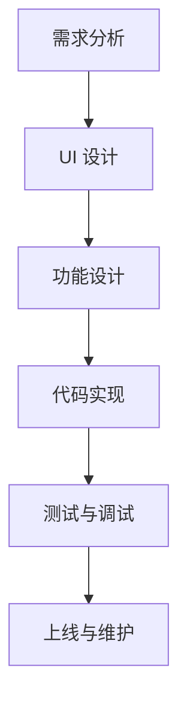
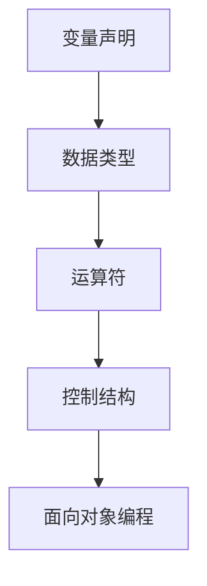
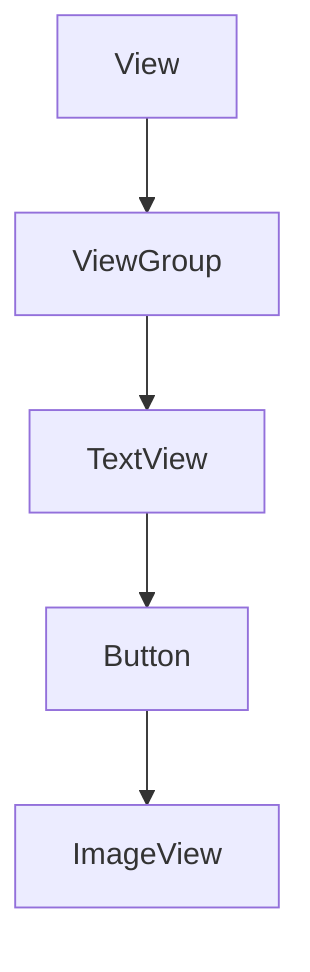
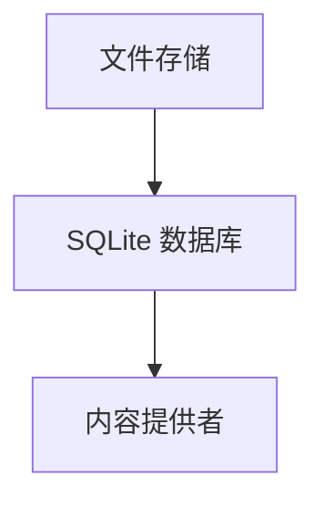
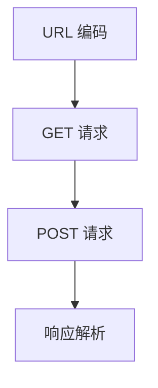

                 

### 《Android 开发入门：Java 和 Android Studio》

> **关键词**：Android、Java、Android Studio、开发环境、UI设计、数据存储、网络编程、项目实战

> **摘要**：本文将带领读者从零开始学习Android开发，涵盖Java基础、Android Studio环境搭建、Android UI设计、数据存储和网络编程等核心知识。通过实战项目的讲解，读者将能够掌握Android开发的基本技能，为今后的职业发展打下坚实的基础。

### 《Android 开发入门：Java 和 Android Studio》目录大纲

#### 第一部分：Android 基础知识

##### 第1章 Android 概述

**1.1 Android 的发展历程**

**1.2 Android 系统架构**

**1.3 Android 开发环境搭建**

##### 第2章 Java 基础

**2.1 Java 基础语法**

**2.2 Java 面向对象编程**

**2.3 Java 常用库和工具**

#### 第二部分：Android 应用开发

##### 第3章 Android UI 开发

**3.1 Android 布局和控件**

**3.2 事件处理和用户交互**

**3.3 Android 动画和过渡效果**

##### 第4章 Android 数据存储

**4.1 文件存储**

**4.2 SQLite 数据库**

**4.3 内容提供者**

##### 第5章 Android 网络

**5.1 网络基础**

**5.2 网络请求与响应**

**5.3 常用网络库介绍**

##### 第6章 Android 高级特性

**6.1 传感器和位置服务**

**6.2 通知和闹钟**

**6.3 多媒体开发**

#### 第三部分：Android 项目实战

##### 第7章 计步器应用开发

**7.1 应用概述**

**7.2 功能实现**

**7.3 代码解读**

##### 第8章 简历应用开发

**8.1 应用概述**

**8.2 功能实现**

**8.3 代码解读**

##### 第9章 新闻阅读应用开发

**9.1 应用概述**

**9.2 功能实现**

**9.3 代码解读**

#### 附录

##### 附录 A Android 开发资源

**A.1 开发工具推荐**

**A.2 学习资源推荐**

**A.3 社区与论坛推荐**

#### 第10章 核心概念与联系

**10.1 Android 开发流程**

**10.2 Java 基础语法**

**10.3 Android UI 开发**

**10.4 Android 数据存储**

**10.5 Android 网络**

#### 第11章 数学模型和数学公式

**11.1 Java 基础语法中的数学模型**

**11.2 Android UI 布局中的数学模型**

**11.3 Android 数据存储中的数学模型**

#### 第12章 项目实战

**12.1 计步器应用开发**

**12.2 简历应用开发**

**12.3 新闻阅读应用开发**

#### 第13章 代码解读与分析

**13.1 计步器应用代码解读**

**13.2 简历应用代码解读**

**13.3 新闻阅读应用代码解读**

**13.4 实战项目总结与反思**

---

现在我们已经完成了文章的目录大纲结构，接下来将按照每个章节的内容逐步展开详细的讲解。

### 第一部分：Android 基础知识

#### 第1章 Android 概述

##### 1.1 Android 的发展历程

Android 是一个基于 Linux 内核的操作系统，最初由 Google 开发，并在 2005 年与霸气的手机制造商运营商结成联盟，共同推出了这个开放源代码的操作系统。Android 的开源特性使得它能够被全球范围内的开发者和厂商自由地使用和定制，从而迅速地占领了智能手机市场。

Android 的发展历程可以分为几个重要阶段：

- **1.0-Cupcake**（2008年）：这是 Android 的第一个版本，它引入了一些基本的功能，包括联系人、短信和联系人应用。

- **1.5-CandyBar**（2009年）：这个版本增加了铃声管理器和用户界面的小幅改进。

- **1.6-Donut**（2009年）：这个版本开始支持屏幕密度自适应，以及对屏幕分辨率的优化。

- **2.0-Eclair**（2009年）：这是一个比较成熟的版本，引入了更多用户界面和 API 的改进。

- **2.3-Gingerbread**（2010年）：这是一个面向平板电脑的版本，带来了对多任务处理的支持。

- **4.0-ICS**（2011年）：这是 Ice Cream Sandwich 版本，合并了平板电脑和智能手机的用户界面。

- **4.4-KITKAT**（2013年）：这是一个轻量级的版本，优化了内存管理和电池寿命。

- **5.0-Lollipop**（2014年）：这是一个现代化的版本，引入了 Material Design 设计语言。

- **6.0-Marshmallow**（2015年）：这个版本增加了对指纹识别和安全存储的支持。

- **7.0-Nougat**（2016年）：这个版本优化了多任务处理和通知管理。

- **8.0-Oreo**（2017年）：这个版本进一步提高了安全性，并引入了更多的 AI 功能。

- **9.0-Pie**（2018年）：这是一个对用户隐私保护更加重视的版本。

- **10**（2019年）：这是最新的版本，它专注于提高系统性能和安全性。

通过这些版本的发展，Android 成为了目前最流行的移动操作系统，广泛应用于各种设备中，从智能手机到平板电脑，再到智能手表和智能电视等。

##### 1.2 Android 系统架构

Android 系统架构可以分为四个主要层级：

1. **应用层**：这是用户直接交互的层级，包括各种应用程序，如联系人、短信、浏览器等。

2. **应用框架层**：这个层级提供了应用程序开发所需的基础服务和组件，如内容提供者、通知管理、活动管理等。

3. **系统层**：这个层级包括 Android 运行时库、核心库和应用框架，负责系统的核心功能，如安全、内存管理、网络等。

4. **硬件层**：这个层级包括各种硬件设备，如处理器、图形处理器、存储设备、传感器等。

每个层级都有其特定的功能和组件，共同构成了 Android 系统的完整架构。

##### 1.3 Android 开发环境搭建

要开始 Android 开发，需要搭建一个完整的开发环境。以下是搭建 Android 开发环境的步骤：

1. **安装 JDK**：首先需要安装 Java 开发工具包（JDK），Android 开发依赖于 Java。可以从 Oracle 官网下载 JDK 并安装。

2. **安装 Android Studio**：Android Studio 是 Google 推出的官方开发工具，提供了丰富的功能和插件，极大地简化了开发过程。可以从 Android Studio 官网下载并安装。

3. **安装 Android SDK**：Android SDK 是 Android 开发的核心，包含了一系列的工具、库和示例代码。在安装 Android Studio 时，可以选择安装 Android SDK 平台工具。

4. **配置环境变量**：需要配置环境变量，以便在命令行中运行 Android SDK 中的工具。具体步骤可以参考 Android Studio 的官方文档。

5. **创建新项目**：打开 Android Studio，创建一个新的项目，选择适当的 SDK 版本和项目模板，开始编写代码。

通过以上步骤，就可以搭建一个完整的 Android 开发环境，开始 Android 应用程序的开发。

#### 第2章 Java 基础

##### 2.1 Java 基础语法

Java 是一种面向对象的编程语言，它具有简单、面向对象、分布式、解释型、健壮、安全、平台独立与可移植、高性能、多线程、动态性等特点。Java 编程语言最初由 Sun Microsystems 公司于 1995 年推出，并在随后的几年中得到了广泛的应用和推广。

Java 的基础语法包括以下几个关键概念：

1. **变量声明**：变量是存储数据的基本单元，在 Java 中声明变量时需要指定数据类型和变量名。例如：
    ```java
    int number = 10;
    String name = "John";
    ```

2. **数据类型**：Java 提供了多种数据类型，包括基本数据类型（如 int、float、double、char）和引用数据类型（如 String、Array）。基本数据类型直接存储值，而引用数据类型存储变量的内存地址。

3. **运算符**：Java 支持多种运算符，包括算术运算符（+、-、*、/）、比较运算符（==、!=、<、>、<=、>=）、逻辑运算符（&&、||、!）等。

4. **控制结构**：Java 使用控制结构来控制程序的流程。常用的控制结构包括条件语句（if、else、switch）和循环语句（for、while、do-while）。

5. **面向对象编程**：Java 是一种面向对象的编程语言，它支持封装、继承和多态等特性。类是面向对象编程的基础，对象是类的实例。通过类和对象，可以模拟现实世界中的实体和行为。

##### 2.2 Java 面向对象编程

面向对象编程（OOP）是一种编程范式，它将程序结构分解为可重用的组件，这些组件称为对象。Java 的核心在于其面向对象特性，下面是 Java 面向对象编程的几个关键概念：

1. **类和对象**：类是定义对象的一种蓝图，对象是类的实例。类定义了对象的属性（字段）和行为（方法）。例如：
    ```java
    class Person {
        String name;
        int age;
        
        void introduce() {
            System.out.println("Hello, my name is " + name + " and I am " + age + " years old.");
        }
    }
    
    Person person = new Person();
    person.name = "John";
    person.age = 25;
    person.introduce();
    ```

2. **继承**：继承是一种让一个类继承另一个类的属性和方法的方式。通过继承，可以减少代码的重复编写，提高代码的可重用性。例如：
    ```java
    class Animal {
        void eat() {
            System.out.println(" Eating...");
        }
    }
    
    class Dog extends Animal {
        void bark() {
            System.out.println(" Barking...");
        }
    }
    
    Dog dog = new Dog();
    dog.eat();
    dog.bark();
    ```

3. **多态**：多态允许将子类对象赋值给父类引用，并调用相应的方法。通过多态，可以设计更灵活和扩展性更好的程序。例如：
    ```java
    class Animal {
        void makeSound() {
            System.out.println(" Animal makes a sound.");
        }
    }
    
    class Dog extends Animal {
        void makeSound() {
            System.out.println(" Dog barks.");
        }
    }
    
    Animal animal = new Dog();
    animal.makeSound();
    ```

4. **接口**：接口是一种只包含抽象方法的规范，用于定义对象的交互方式。通过接口，可以实现多个类之间的解耦。例如：
    ```java
    interface Animal {
        void makeSound();
    }
    
    class Dog implements Animal {
        public void makeSound() {
            System.out.println(" Dog barks.");
        }
    }
    
    class Cat implements Animal {
        public void makeSound() {
            System.out.println(" Cat meows.");
        }
    }
    ```

##### 2.3 Java 常用库和工具

Java 拥有丰富的库和工具，这些库和工具极大地简化了开发过程，提高了开发效率。以下是一些常用的 Java 库和工具：

1. **Java 标准库**：Java 标准库提供了许多基础类和接口，如 java.lang、java.util、java.io 等。这些库包含了字符串操作、集合框架、文件操作等常用功能。

2. **JUnit**：JUnit 是 Java 的一个单元测试框架，用于编写和运行单元测试。通过 JUnit，可以轻松地编写测试用例，提高代码的可靠性和质量。

3. **Spring Framework**：Spring Framework 是一个强大的 Java 应用程序框架，用于构建企业级应用程序。Spring 提供了数据访问、事务管理、安全控制、AOP 等功能，极大地简化了开发过程。

4. **Apache Maven**：Apache Maven 是一个项目管理和构建自动化工具，用于管理项目依赖、构建项目、生成文档等。通过 Maven，可以方便地管理项目的构建过程。

5. **Eclipse/IntelliJ IDEA**：Eclipse 和 IntelliJ IDEA 是 Java 开发常用的集成开发环境（IDE），提供了丰富的功能，如代码补全、调试、版本控制等，极大地提高了开发效率。

#### 第二部分：Android 应用开发

##### 第3章 Android UI 开发

Android UI 开发是 Android 应用开发的核心部分，它涉及到用户界面的设计、布局、控件的使用以及事件处理等方面。一个优秀的 UI 能够提高用户的使用体验，使应用程序更加易于使用。

##### 3.1 Android 布局和控件

在 Android 应用程序中，布局（Layout）用于定义 UI 元素在屏幕上的排列方式。Android 提供了多种布局方式，包括线性布局（LinearLayout）、相对布局（RelativeLayout）、帧布局（FrameLayout）等。这些布局方式可以根据不同的需求来使用。

1. **线性布局（LinearLayout）**：线性布局是最简单的布局方式，它将 UI 元素按顺序排列在一条线上。线性布局可以水平或垂直排列，并且可以设置每个元素的宽度和高度。

2. **相对布局（RelativeLayout）**：相对布局允许将 UI 元素相对于其他元素进行定位。通过相对布局，可以设置 UI 元素相对于其他元素的上下左右位置，或者相对于屏幕边缘的位置。

3. **帧布局（FrameLayout）**：帧布局用于将 UI 元素放入一个框架中，它主要用于显示单层界面，或者作为其他布局的父布局。

除了布局，Android 还提供了丰富的控件（Control），这些控件是构成用户界面的基本元素。以下是一些常用的控件：

1. **TextView**：TextView 用于显示文本，可以设置文本的字体、颜色、大小等属性。

2. **Button**：Button 是一个按钮控件，用户可以点击它来触发事件。

3. **EditText**：EditText 是一个可编辑文本框，用户可以在其中输入文本。

4. **ImageView**：ImageView 用于显示图片，可以设置图片的缩放模式、平铺模式等。

5. **CheckBox**：CheckBox 是一个复选框控件，用户可以选中或取消选中。

6. **RadioButton**：RadioButton 是一个单选框控件，用户可以选择其中一个选项。

7. **SeekBar**：SeekBar 是一个进度条控件，用户可以拖动滑块来调整进度。

8. **Spinner**：Spinner 是一个下拉列表控件，用户可以选择其中的一个选项。

##### 3.2 事件处理和用户交互

在 Android 应用程序中，事件处理（Event Handling）是用户与应用程序进行交互的重要方式。Android 提供了多种事件处理机制，包括触摸事件、按键事件、触摸手势等。

1. **触摸事件**：触摸事件是用户通过触摸屏幕与应用程序交互的方式。Android 使用 `TouchListener` 接口来处理触摸事件，包括按下、滑动、点击等。

2. **按键事件**：按键事件是用户通过按键与应用程序交互的方式。Android 使用 `KeyListener` 接口来处理按键事件，包括按下、松开、重复按键等。

3. **触摸手势**：触摸手势是用户通过连续的触摸操作与应用程序交互的方式。Android 使用 `GestureDetector` 类来处理触摸手势，包括双击、滑动、缩放等。

通过事件处理，可以响应用户的操作，实现应用程序的功能。

##### 3.3 Android 动画和过渡效果

Android 提供了丰富的动画和过渡效果，这些动画和效果可以增强应用程序的用户体验。Android 动画可以分为以下几种类型：

1. **帧动画（Frame Animation）**：帧动画是通过连续播放一系列图像来模拟动画效果。每个图像称为帧，帧动画可以定义动画的持续时间、重复次数等。

2. **补间动画（Tween Animation）**：补间动画是通过在对象之间插值来创建动画效果。补间动画包括透明度动画、缩放动画、平移动画、旋转动画等。

3. **属性动画（Property Animation）**：属性动画是 Android 3.0 引入的新特性，它可以动画化任何对象的属性，包括位置、大小、颜色等。属性动画比补间动画更加灵活和强大。

4. **过渡效果（Transition Effect）**：过渡效果用于在两个界面之间创建动画效果，包括淡入淡出、滑动切换等。

通过动画和过渡效果，可以增强应用程序的视觉效果和用户体验。

#### 第4章 Android 数据存储

在 Android 应用程序中，数据存储是必不可少的一部分。Android 提供了多种数据存储方式，包括文件存储、SQLite 数据库和内容提供者。这些存储方式可以根据不同的需求来使用。

##### 4.1 文件存储

文件存储是 Android 应用程序中最简单的一种数据存储方式。通过文件存储，可以将数据以文件的形式保存在设备中。Android 文件存储分为以下几种类型：

1. **内部存储**：内部存储是应用程序私有存储区域，只有当前应用程序可以访问。内部存储主要用于存储应用程序的配置文件、缓存文件等。

2. **外部存储**：外部存储是应用程序公共存储区域，可以被其他应用程序访问。外部存储主要用于存储用户生成的文件、下载文件等。

3. **共享存储**：共享存储是应用程序与其他应用程序共享的存储区域。通过共享存储，可以与其他应用程序交换数据。

文件存储的步骤如下：

1. 获取文件操作权限：在 Android 6.0（API 级别 23）及以上版本中，需要申请文件操作权限才能访问设备存储。可以使用 `Manifest` 文件中的 `requestPermissions` 方法来申请权限。

2. 打开文件输入流或输出流：可以使用 `FileInputStream` 和 `FileOutputStream` 类来打开文件输入流或输出流。

3. 读取或写入数据：通过输入流或输出流，可以读取或写入文件中的数据。

4. 关闭输入流或输出流：在使用完输入流或输出流后，需要关闭流对象，以释放资源。

##### 4.2 SQLite 数据库

SQLite 是一种轻量级的关系型数据库，广泛应用于 Android 应用程序的数据存储。SQLite 数据库具有以下特点：

1. **轻量级**：SQLite 的文件大小非常小，可以在设备本地存储，而不需要连接服务器。

2. **易于使用**：SQLite 提供了简单的 API，可以轻松地进行数据插入、查询、更新和删除。

3. **跨平台**：SQLite 可以在多种操作系统上运行，包括 Windows、Linux、macOS 等。

在 Android 应用程序中，可以使用以下步骤来操作 SQLite 数据库：

1. 创建数据库：使用 `SQLiteDatabase` 类创建数据库对象，并通过 `execSQL` 方法执行 SQL 命令来创建表。

2. 插入数据：使用 `insert` 方法将数据插入到表中。

3. 查询数据：使用 `query` 方法查询表中的数据。

4. 更新数据：使用 `update` 方法更新表中的数据。

5. 删除数据：使用 `delete` 方法删除表中的数据。

##### 4.3 内容提供者

内容提供者是 Android 提供的一种数据共享机制，用于在不同应用程序之间共享数据。内容提供者类似于数据库中的表，它定义了数据的结构、访问权限和操作方法。

在 Android 应用程序中，可以使用以下步骤来使用内容提供者：

1. 定义内容提供者：创建一个类，继承自 `ContentProvider` 类，并实现相关的方法。

2. 注册内容提供者：在 `AndroidManifest.xml` 文件中注册内容提供者。

3. 使用内容提供者：使用 `ContentResolver` 类查询、更新和删除内容提供者中的数据。

通过文件存储、SQLite 数据库和内容提供者，可以灵活地管理 Android 应用程序中的数据，实现各种数据存储需求。

#### 第5章 Android 网络

在 Android 应用程序中，网络编程是不可或缺的一部分。通过网络编程，可以与服务器进行通信，获取数据、提交数据等。Android 提供了丰富的网络编程工具和库，可以方便地实现网络功能。

##### 5.1 网络基础

网络基础是理解 Android 网络编程的前提。以下是一些网络基础概念：

1. **URL**：URL（统一资源定位符）是表示 Internet 上资源的地址。在 Android 中，可以使用 `URL` 类创建 URL 对象，并使用 `URL.openConnection` 方法获取网络连接。

2. **HTTP**：HTTP（超文本传输协议）是一种应用层协议，用于在 Web 中传输数据。Android 提供了 `HttpURLConnection` 类，用于发送 HTTP 请求并接收 HTTP 响应。

3. **HTTPS**：HTTPS（安全超文本传输协议）是 HTTP 的安全版本，它使用 SSL/TLS 协议对数据进行加密。Android 提供了 `HttpsURLConnection` 类，用于发送 HTTPS 请求。

4. **网络状态**：Android 提供了 `ConnectivityManager` 类，用于获取网络状态信息，如网络类型、网络连接状态等。

##### 5.2 网络请求与响应

在网络编程中，网络请求与响应是核心部分。以下是如何实现网络请求与响应：

1. **GET 请求**：GET 请求用于获取服务器上的数据。可以使用 `HttpURLConnection` 或 `HttpsURLConnection` 类发送 GET 请求，并在响应中获取服务器返回的数据。

    ```java
    String url = "http://example.com/data";
    HttpURLConnection connection = (HttpURLConnection) new URL(url).openConnection();
    connection.setRequestMethod("GET");
    BufferedReader reader = new BufferedReader(new InputStreamReader(connection.getInputStream()));
    String line;
    StringBuilder result = new StringBuilder();
    while ((line = reader.readLine()) != null) {
        result.append(line);
    }
    reader.close();
    connection.disconnect();
    String data = result.toString();
    ```

2. **POST 请求**：POST 请求用于向服务器发送数据。可以使用 `HttpURLConnection` 或 `HttpsURLConnection` 类发送 POST 请求，并在请求体中设置要发送的数据。

    ```java
    String url = "http://example.com/data";
    HttpURLConnection connection = (HttpURLConnection) new URL(url).openConnection();
    connection.setRequestMethod("POST");
    connection.setDoOutput(true);
    OutputStream writer = new OutputStreamWriter(connection.getOutputStream());
    writer.write("key1=value1&key2=value2");
    writer.flush();
    writer.close();
    BufferedReader reader = new BufferedReader(new InputStreamReader(connection.getInputStream()));
    String line;
    StringBuilder result = new StringBuilder();
    while ((line = reader.readLine()) != null) {
        result.append(line);
    }
    reader.close();
    connection.disconnect();
    String data = result.toString();
    ```

3. **响应解析**：在接收服务器响应后，需要解析响应数据。常用的响应解析方法包括 JSON 解析、XML 解析等。

    ```java
    // JSON 解析
    JSONObject jsonObject = new JSONObject(data);
    String key = jsonObject.getString("key");
    
    // XML 解析
    DocumentBuilderFactory factory = DocumentBuilderFactory.newInstance();
    DocumentBuilder builder = factory.newDocumentBuilder();
    Document document = builder.parse(new InputSource(new StringReader(data)));
    Node node = document.getElementsByTagName("key").item(0);
    String key = node.getTextContent();
    ```

通过网络请求与响应，可以获取服务器上的数据，并解析数据以实现应用程序的功能。

##### 5.3 常用网络库介绍

除了 Android 提供的内置网络库，还有一些常用的第三方网络库，这些库提供了更丰富的功能和更好的用户体验。以下是一些常用的网络库：

1. **Retrofit**：Retrofit 是一个用于构建 HTTP 请求的库，它基于 Square 的 OkHttp 库。Retrofit 提供了简单的接口定义方式，可以轻松实现网络请求。

    ```java
    public interface MyApiService {
        @GET("data")
        Call<MyData> getData();
    }
    ```

2. **Volley**：Volley 是一个用于执行网络请求的库，它适用于简单的网络请求场景。Volley 提供了异步请求、缓存等功能。

    ```java
    RequestQueue queue = Volley.newRequestQueue(context);
    StringRequest request = new StringRequest(Request.Method.GET, url,
            response -> {
                // 成功处理
            }, error -> {
                // 失败处理
            });
    queue.add(request);
    ```

3. **OkHttp**：OkHttp 是一个高效的 HTTP 客户端库，它提供了灵活的 API 和强大的功能。OkHttp 支持同步和异步请求，并可以自定义请求和响应。

    ```java
    OkHttpClient client = new OkHttpClient();
    Request request = new Request.Builder()
            .url(url)
            .build();
    Call call = client.newCall(request);
    call.enqueue(new Callback() {
        @Override
        public void onResponse(Call call, Response response) {
            // 成功处理
        }

        @Override
        public void onFailure(Call call, IOException e) {
            // 失败处理
        }
    });
    ```

通过使用这些网络库，可以更方便地实现网络功能，提高开发效率。

#### 第6章 Android 高级特性

##### 6.1 传感器和位置服务

Android 提供了丰富的传感器和位置服务，可以用于获取设备的状态信息。以下是一些常用的传感器和位置服务：

1. **加速度传感器**：加速度传感器可以测量设备的加速度，通常用于实现摇一摇功能。

2. **陀螺仪传感器**：陀螺仪传感器可以测量设备的旋转速度，通常用于实现方向感应功能。

3. **磁场传感器**：磁场传感器可以测量设备的磁场强度，通常用于实现指南针功能。

4. **位置服务**：位置服务可以获取设备的地理位置信息，通常使用 GPS、Wi-Fi 等技术实现。

通过使用传感器和位置服务，可以增强应用程序的功能，提供更好的用户体验。

##### 6.2 通知和闹钟

通知和闹钟是 Android 应用程序中常用的功能，可以用于向用户发送消息或提醒。以下是如何使用通知和闹钟：

1. **通知**：使用 `Notification` 类创建通知，并使用 `NotificationManager` 类发送通知。通知可以包含标题、内容、图标等。

    ```java
    Notification notification = new NotificationCompat.Builder(this, CHANNEL_ID)
            .setContentTitle("Title")
            .setContentText("Content")
            .setSmallIcon(R.mipmap.ic_launcher)
            .build();
    NotificationManager notificationManager = (NotificationManager) getSystemService(NOTIFICATION_SERVICE);
    notificationManager.notify(NOTIFICATION_ID, notification);
    ```

2. **闹钟**：使用 `AlarmManager` 类设置闹钟，并在闹钟触发时执行相应的操作。闹钟可以设置为一次性闹钟或周期性闹钟。

    ```java
    AlarmManager alarmManager = (AlarmManager) getSystemService(ALARM_SERVICE);
    Calendar calendar = Calendar.getInstance();
    calendar.set(Calendar.HOUR_OF_DAY, 10);
    calendar.set(Calendar.MINUTE, 30);
    alarmManager.set(AlarmManager.RTC, calendar.getTimeInMillis(), new AlarmClockInfo("Title", "Content", R.mipmap.ic_launcher));
    ```

通过通知和闹钟，可以及时向用户发送消息或提醒，提高应用程序的可用性。

##### 6.3 多媒体开发

Android 提供了丰富的多媒体开发功能，可以用于播放音频、视频和图片。以下是如何使用多媒体功能：

1. **音频播放**：使用 `MediaPlayer` 类播放音频文件。可以使用 `setDataSource` 方法设置音频文件的路径，并使用 `prepare` 和 `start` 方法开始播放。

    ```java
    MediaPlayer mediaPlayer = new MediaPlayer();
    mediaPlayer.setDataSource(audioPath);
    mediaPlayer.prepare();
    mediaPlayer.start();
    ```

2. **视频播放**：使用 `VideoView` 控件播放视频文件。可以使用 `setVideoPath` 方法设置视频文件的路径，并使用 `start` 方法开始播放。

    ```java
    VideoView videoView = findViewById(R.id.videoView);
    videoView.setVideoPath(videoPath);
    videoView.start();
    ```

3. **图片显示**：使用 `ImageView` 控件显示图片。可以使用 `setImageResource` 方法设置图片的资源 ID，并使用 `setImageBitmap` 方法设置 Bitmap 对象。

    ```java
    ImageView imageView = findViewById(R.id.imageView);
    imageView.setImageResource(imageResId);
    ```

通过多媒体开发，可以提供更丰富的用户体验，满足用户的各种需求。

#### 第三部分：Android 项目实战

##### 第7章 计步器应用开发

计步器应用是一个用于记录用户步数的实用工具。本章将介绍如何使用 Android Studio 和 Java 开发一个简单的计步器应用。

##### 7.1 应用概述

计步器应用的主要功能包括：

1. 显示当前步数
2. 开始和停止计步
3. 重置步数
4. 保存和读取步数数据

##### 7.2 功能实现

1. **布局设计**

   使用 Android Studio 的布局编辑器设计 UI。主要包括一个 `TextView` 用于显示步数，三个 `Button` 分别用于开始、停止和重置计步。

2. **代码实现**

   创建一个名为 `StepCounterActivity` 的 Activity 类，并在其中编写代码实现计步器的功能。

   ```java
   public class StepCounterActivity extends AppCompatActivity {
       private int stepCount = 0;
       private boolean isCounting = false;
       private SharedPreferences sharedPreferences;
       private static final String SHARED_PREFS_KEY = "step_count_prefs";
       private static final String STEP_COUNT_KEY = "step_count";

       @Override
       protected void onCreate(Bundle savedInstanceState) {
           super.onCreate(savedInstanceState);
           setContentView(R.layout.activity_step_counter);
           sharedPreferences = getSharedPreferences(SHARED_PREFS_KEY, MODE_PRIVATE);
           updateStepCount();
           findViewById(R.id.start_button).setOnClickListener(view -> startCounting());
           findViewById(R.id.stop_button).setOnClickListener(view -> stopCounting());
           findViewById(R.id.reset_button).setOnClickListener(view -> resetStepCount());
       }

       private void startCounting() {
           isCounting = true;
       }

       private void stopCounting() {
           isCounting = false;
           saveStepCount();
       }

       private void resetStepCount() {
           stepCount = 0;
           updateStepCount();
           saveStepCount();
       }

       private void updateStepCount() {
           stepCount = sharedPreferences.getInt(STEP_COUNT_KEY, 0);
           findViewById(R.id.step_count_text).setText(String.valueOf(stepCount));
       }

       private void saveStepCount() {
           SharedPreferences.Editor editor = sharedPreferences.edit();
           editor.putInt(STEP_COUNT_KEY, stepCount);
           editor.apply();
       }

       @Override
       protected void onPause() {
           super.onPause();
           if (isCounting) {
               stopCounting();
           }
       }

       @Override
       protected void onResume() {
           super.onResume();
           updateStepCount();
       }
   }
   ```

3. **代码解读**

   - `stepCount` 变量用于存储当前的步数。
   - `isCounting` 变量用于标识是否正在计步。
   - `sharedPreferences` 用于保存和读取步数数据。
   - `startCounting` 方法将 `isCounting` 设置为 `true`。
   - `stopCounting` 方法将 `isCounting` 设置为 `false` 并保存步数。
   - `resetStepCount` 方法将步数重置为 0 并更新 UI。
   - `updateStepCount` 方法更新 UI 上显示的步数。
   - `saveStepCount` 方法保存步数到共享偏好设置。

##### 7.3 代码解读与分析

计步器的核心功能是通过监听设备的加速度传感器来计算步数。在 Android 中，可以使用 `SensorManager` 来访问加速度传感器。

```java
SensorManager sensorManager = (SensorManager) getSystemService(SENSOR_SERVICE);
Sensor sensor = sensorManager.getDefaultSensor(Sensor.TYPE_ACCELEROMETER);
SensorEventListener listener = new SensorEventListener() {
    @Override
    public void onSensorChanged(SensorEvent event) {
        float x = event.values[0];
        float y = event.values[1];
        float z = event.values[2];
        // 计算步数逻辑
    }

    @Override
    public void onAccuracyChanged(Sensor sensor, int accuracy) {
        // 传感器精度变化处理
    }
};
sensorManager.registerListener(listener, sensor, SensorManager.SENSOR_DELAY_NORMAL);
```

在 `onSensorChanged` 方法中，可以通过计算加速度的变化来检测步数的变化。通常，当设备的加速度超过一定的阈值时，可以认为用户迈出一步。这需要一些数学算法来精确计算。

通过使用加速度传感器，计步器可以实时跟踪用户的步数，并在停止计步时保存数据。在 `onPause` 和 `onResume` 方法中，可以分别取消注册和注册传感器监听器，以优化性能。

##### 第8章 简历应用开发

简历应用是一个帮助用户创建和管理简历的工具。本章将介绍如何使用 Android Studio 和 Java 开发一个简单的简历应用。

##### 8.1 应用概述

简历应用的主要功能包括：

1. 输入个人信息（姓名、联系方式等）
2. 添加教育背景（学校、专业、学历等）
3. 添加工作经历（公司、职位、职责等）
4. 保存和导出简历

##### 8.2 功能实现

1. **布局设计**

   使用 Android Studio 的布局编辑器设计 UI。主要包括多个 `EditText` 用于输入信息，以及一个 `Button` 用于保存和导出简历。

2. **代码实现**

   创建一个名为 `ResumeActivity` 的 Activity 类，并在其中编写代码实现简历应用的功能。

   ```java
   public class ResumeActivity extends AppCompatActivity {
       private EditText nameEditText;
       private EditText contactEditText;
       private EditText educationEditText;
       private EditText workExperienceEditText;
       private SharedPreferences sharedPreferences;

       @Override
       protected void onCreate(Bundle savedInstanceState) {
           super.onCreate(savedInstanceState);
           setContentView(R.layout.activity_resume);
           nameEditText = findViewById(R.id.nameEditText);
           contactEditText = findViewById(R.id.contactEditText);
           educationEditText = findViewById(R.id.educationEditText);
           workExperienceEditText = findViewById(R.id.workExperienceEditText);
           sharedPreferences = getSharedPreferences("resume_prefs", MODE_PRIVATE);
           loadResumeData();
           findViewById(R.id.saveButton).setOnClickListener(view -> saveResumeData());
       }

       private void loadResumeData() {
           nameEditText.setText(sharedPreferences.getString("name", ""));
           contactEditText.setText(sharedPreferences.getString("contact", ""));
           educationEditText.setText(sharedPreferences.getString("education", ""));
           workExperienceEditText.setText(sharedPreferences.getString("work_experience", ""));
       }

       private void saveResumeData() {
           SharedPreferences.Editor editor = sharedPreferences.edit();
           editor.putString("name", nameEditText.getText().toString());
           editor.putString("contact", contactEditText.getText().toString());
           editor.putString("education", educationEditText.getText().toString());
           editor.putString("work_experience", workExperienceEditText.getText().toString());
           editor.apply();
           Toast.makeText(this, "Resume saved", Toast.LENGTH_SHORT).show();
       }
   }
   ```

3. **代码解读**

   - `nameEditText`、`contactEditText`、`educationEditText` 和 `workExperienceEditText` 用于输入个人信息、教育背景和工作经历。
   - `sharedPreferences` 用于保存和读取简历数据。
   - `loadResumeData` 方法从共享偏好设置中加载简历数据。
   - `saveResumeData` 方法将简历数据保存到共享偏好设置。

##### 8.3 代码解读与分析

简历应用的核心功能是保存和读取用户输入的信息。通过使用共享偏好设置（`SharedPreferences`），可以方便地在应用程序重启时保留用户数据。

共享偏好设置是一个简单的存储机制，用于保存键值对数据。它适用于存储简单的配置信息，如用户名、密码等。

在 `loadResumeData` 方法中，从共享偏好设置中读取数据并设置到 UI 控件上。在 `saveResumeData` 方法中，将 UI 控件上的数据保存到共享偏好设置中。

为了导出简历，可以添加一个导出功能，将简历数据以文本格式保存到文件中，并允许用户选择保存位置。

通过简单的布局设计和数据存储，简历应用可以方便地帮助用户创建和管理简历。

##### 第9章 新闻阅读应用开发

新闻阅读应用是一个帮助用户浏览和阅读新闻的移动应用程序。本章将介绍如何使用 Android Studio 和 Java 开发一个简单的新闻阅读应用。

##### 9.1 应用概述

新闻阅读应用的主要功能包括：

1. 显示新闻列表
2. 加载新闻详情
3. 加载更多新闻
4. 收藏和分享新闻

##### 9.2 功能实现

1. **布局设计**

   使用 Android Studio 的布局编辑器设计 UI。主要包括一个 `RecyclerView` 用于显示新闻列表，以及一个 `WebView` 用于显示新闻详情。

2. **代码实现**

   创建一个名为 `NewsActivity` 的 Activity 类，并在其中编写代码实现新闻阅读应用的功能。

   ```java
   public class NewsActivity extends AppCompatActivity {
       private RecyclerView newsRecyclerView;
       private NewsAdapter newsAdapter;
       private List<NewsItem> newsList;
       private String newsApiUrl = "https://newsapi.org/v2/top-headlines?country=us&apiKey=YOUR_API_KEY";

       @Override
       protected void onCreate(Bundle savedInstanceState) {
           super.onCreate(savedInstanceState);
           setContentView(R.layout.activity_news);
           newsRecyclerView = findViewById(R.id.newsRecyclerView);
           newsList = new ArrayList<>();
           newsAdapter = new NewsAdapter(newsList);
           newsRecyclerView.setLayoutManager(new LinearLayoutManager(this));
           newsRecyclerView.setAdapter(newsAdapter);
           fetchNewsData();
       }

       private void fetchNewsData() {
           new AsyncTask<Void, Void, List<NewsItem>>() {
               @Override
               protected List<NewsItem> doInBackground(Void... voids) {
                   try {
                       URL url = new URL(newsApiUrl);
                       HttpURLConnection connection = (HttpURLConnection) url.openConnection();
                       connection.setRequestMethod("GET");
                       connection.connect();
                       int responseCode = connection.getResponseCode();
                       if (responseCode == HttpURLConnection.HTTP_OK) {
                           BufferedReader reader = new BufferedReader(new InputStreamReader(connection.getInputStream()));
                           StringBuilder result = new StringBuilder();
                           String line;
                           while ((line = reader.readLine()) != null) {
                               result.append(line);
                           }
                           reader.close();
                           String jsonData = result.toString();
                           return parseNewsData(jsonData);
                       } else {
                           return null;
                       }
                   } catch (IOException e) {
                       e.printStackTrace();
                       return null;
                   }
               }

               @Override
               protected void onPostExecute(List<NewsItem> newsItems) {
                   if (newsItems != null) {
                       newsList.clear();
                       newsList.addAll(newsItems);
                       newsAdapter.notifyDataSetChanged();
                   } else {
                       Toast.makeText(NewsActivity.this, "Failed to fetch news", Toast.LENGTH_SHORT).show();
                   }
               }
           }.execute();
       }

       private List<NewsItem> parseNewsData(String jsonData) {
           List<NewsItem> newsItems = new ArrayList<>();
           try {
               JSONObject jsonObject = new JSONObject(jsonData);
               JSONArray articles = jsonObject.getJSONArray("articles");
               for (int i = 0; i < articles.length(); i++) {
                   JSONObject article = articles.getJSONObject(i);
                   String title = article.getString("title");
                   String description = article.getString("description");
                   String url = article.getString("url");
                   String imageUrl = article.getString("urlToImage");
                   newsItems.add(new NewsItem(title, description, url, imageUrl));
               }
           } catch (JSONException e) {
               e.printStackTrace();
           }
           return newsItems;
       }
   }
   ```

3. **代码解读**

   - `newsRecyclerView` 用于显示新闻列表。
   - `newsAdapter` 用于适配新闻列表数据。
   - `newsList` 用于存储新闻数据。
   - `newsApiUrl` 是获取新闻数据的服务器 URL。
   - `fetchNewsData` 方法异步请求新闻数据。
   - `parseNewsData` 方法解析 JSON 数据，并将新闻数据添加到列表中。

##### 9.3 代码解读与分析

新闻阅读应用的核心功能是获取和显示新闻数据。使用 `AsyncTask` 类，可以在后台线程异步请求新闻数据，并在主线程更新 UI。

在 `fetchNewsData` 方法中，使用 `HttpURLConnection` 类发送 GET 请求，获取服务器响应。如果响应为 HTTP 200（OK），则解析 JSON 数据，并将新闻数据添加到列表中。

在 `parseNewsData` 方法中，使用 `JSONObject` 和 `JSONArray` 类解析 JSON 数据，并创建 `NewsItem` 对象。`NewsItem` 类用于存储新闻的标题、描述、URL 和图片 URL。

新闻详情页面可以使用 `WebView` 类显示。在点击新闻列表项时，可以传递新闻的 URL 给 `WebView`，并加载新闻详情。

通过简单的网络请求和数据解析，新闻阅读应用可以方便地显示最新的新闻，并提供良好的用户体验。

#### 附录

##### 附录 A Android 开发资源

以下是 Android 开发的一些推荐资源，可以帮助开发者提高开发效率和掌握最新技术。

**A.1 开发工具推荐**

1. **Android Studio**：Google 推出的官方开发工具，提供了丰富的功能和插件。
2. **Android SDK**：包含 Android 开发所需的各种工具和库。
3. **Android NDK**：用于开发原生 Android 应用程序，提供了 C 和 C++ 开发支持。

**A.2 学习资源推荐**

1. **官方文档**：Android 官方文档提供了详细的技术指导和教程。
2. **在线课程**：Coursera、Udemy、edX 等在线教育平台提供了丰富的 Android 开发课程。
3. **技术博客**：GitHub、Stack Overflow、Android Weekly 等网站上有大量的 Android 开发博客和问答。

**A.3 社区与论坛推荐**

1. **Google 开发者社区**：Google 提供的一个开发者论坛，可以提问和获取帮助。
2. **Android 开发者论坛**：国内的 Android 开发者论坛，如 CSDN、掘金等，提供了丰富的讨论和教程。
3. **Stack Overflow**：全球最大的开发者问答社区，可以搜索和提问 Android 开发相关问题。

通过以上资源和社区，开发者可以不断提升自己的技能，解决开发过程中的问题，并保持对 Android 技术的最新关注。

#### 第10章 核心概念与联系

在 Android 开发中，理解核心概念和它们之间的联系是至关重要的。以下是对 Android 开发中一些核心概念和它们之间联系的详细解释。

##### 10.1 Android 开发流程

Android 开发的流程可以分为以下几个步骤：

1. **需求分析**：首先，明确应用程序的需求，包括功能、界面和性能等要求。
2. **UI 设计**：根据需求设计用户界面，可以使用 Android Studio 的布局编辑器创建 UI。
3. **功能设计**：详细规划应用程序的功能，确定模块和组件。
4. **代码实现**：编写应用程序的代码，实现功能模块和 UI。
5. **测试与调试**：测试应用程序的功能和性能，调试并修复发现的问题。
6. **上线与维护**：发布应用程序到应用商店，并持续维护和更新。

图 10-1 Android 开发流程



##### 10.2 Java 基础语法

Java 是 Android 应用程序的主要开发语言，其基础语法包括以下几个关键部分：

1. **变量声明**：声明变量时需要指定数据类型和变量名。
2. **数据类型**：Java 有基本数据类型和引用数据类型。
3. **运算符**：包括算术运算符、比较运算符、逻辑运算符等。
4. **控制结构**：包括条件语句（if、else、switch）和循环语句（for、while、do-while）。
5. **面向对象编程**：Java 是面向对象的编程语言，支持封装、继承和多态。

图 10-2 Java 基础语法结构



##### 10.3 Android UI 开发

Android UI 开发涉及布局、控件和事件处理。以下是 Android UI 开发的核心概念和联系：

1. **布局（Layout）**：布局定义了 UI 元素在屏幕上的排列方式。常用的布局有线性布局（LinearLayout）、相对布局（RelativeLayout）和帧布局（FrameLayout）。
2. **控件（Control）**：控件是构成 UI 的基本元素，如 TextView、Button、EditText 等。
3. **事件处理**：事件处理是 UI 与用户交互的方式，包括触摸事件、按键事件和触摸手势。

图 10-3 Android UI 组件层次结构



##### 10.4 Android 数据存储

Android 数据存储包括文件存储、SQLite 数据库和内容提供者。以下是这些数据存储方式的核心概念和联系：

1. **文件存储**：用于存储简单的文本文件或二进制文件。分为内部存储、外部存储和共享存储。
2. **SQLite 数据库**：用于存储结构化数据，提供强大的查询和管理功能。
3. **内容提供者**：用于在应用程序之间共享数据，提供数据的访问和操作接口。

图 10-4 Android 数据存储方式



##### 10.5 Android 网络

Android 网络编程涉及 HTTP 请求、JSON 解析和网络库的使用。以下是 Android 网络编程的核心概念和联系：

1. **网络基础**：包括 URL、HTTP、HTTPS 和网络状态。
2. **网络请求与响应**：发送 HTTP 请求并处理响应数据。
3. **常用网络库**：如 Retrofit、Volley 和 OkHttp，提供了更高级的网络功能。

图 10-5 Android 网络请求流程



通过以上对核心概念和它们之间联系的详细解释，开发者可以更好地理解 Android 开发的基本原理，从而更高效地进行应用程序的开发。

#### 第11章 数学模型和数学公式

在 Android 应用程序的开发过程中，数学模型和公式经常用于实现复杂的逻辑和算法。以下是一些常见的数学模型和公式，以及它们的详细讲解和举例说明。

##### 11.1 Java 基础语法中的数学模型

Java 作为一种强类型的编程语言，其基础语法中包含了丰富的数学模型。以下是一些基本的数学模型和公式：

- **变量声明和计算**：

  $$
  x = a + b
  $$
  
  - **变量 x** 的值是 **变量 a** 和 **变量 b** 的和。

- **基本算术运算**：

  $$
  y = \frac{a \times b}{c}
  $$
  
  - **变量 y** 的值是 **变量 a** 和 **变量 b** 的乘积除以 **变量 c**。

- **控制结构中的条件运算**：

  $$
  result = (condition) ? true_value : false_value
  $$
  
  - 如果 **条件** 为真，则 **变量 result** 的值是 **变量 true_value**；否则，**变量 result** 的值是 **变量 false_value**。

##### 11.2 Android UI 布局中的数学模型

在 Android UI 开发中，布局和控件的属性经常需要通过数学模型来计算。以下是一些常见的数学模型：

- **视图布局的相对位置**：

  $$
  left = parent.left + margin
  $$
  
  - **视图的左侧位置** 是 **父视图的左侧位置** 加上 **边距**。

- **视图布局的缩放比例**：

  $$
  scale = 1 + \frac{zoom_level}{100}
  $$
  
  - **缩放比例** 是 **原始大小** 加上 **缩放级别** 除以 **100**。

- **布局中的视图重叠计算**：

  $$
  overlap = \min(height_1, height_2) - \max(top_1, top_2)
  $$
  
  - **重叠区域高度** 是 **视图 1 的高度** 和 **视图 2 的高度** 的最小值减去 **视图 1 的顶部位置** 和 **视图 2 的顶部位置** 的最大值。

##### 11.3 Android 数据存储中的数学模型

在 Android 数据存储中，数学模型用于计算数据的大小和存储方式。以下是一些常见的数学模型：

- **文件大小计算**：

  $$
  file_size = record_size \times record_count
  $$
  
  - **文件大小** 是 **记录大小** 乘以 **记录数量**。

- **数据库索引计算**：

  $$
  index_size = key_size + value_size + overhead
  $$
  
  - **索引大小** 是 **键大小** 加上 **值大小** 加上 **额外开销**。

- **数据加密算法计算**：

  $$
  encrypted_size = size \times encryption_factor
  $$
  
  - **加密后大小** 是 **原始大小** 乘以 **加密因子**。

##### 举例说明

假设有一个 Android 应用程序需要计算一个列表中每个项目的总高度。可以使用以下数学模型：

- **列表项目高度计算**：

  $$
  total_height = item_height \times item_count
  $$
  
  - **总高度** 是 **每个项目的高度** 乘以 **项目数量**。

- **动态布局高度调整**：

  $$
  dynamic_height = \sum_{i=1}^{n} item_height_i
  $$
  
  - **动态高度** 是从第 1 个项目到第 n 个项目的所有项目高度之和。

通过这些数学模型和公式，开发者可以在 Android 应用程序中实现复杂的逻辑和算法，从而提高应用程序的性能和用户体验。

#### 第12章 项目实战

在本章中，我们将通过实际项目实战，深入讲解 Android 应用程序的开发流程、技术实现和代码解析。通过以下三个项目实战，读者将能够掌握 Android 应用程序开发的基本技能和最佳实践。

##### 12.1 计步器应用开发

计步器是一个常见的健康监测工具，它可以帮助用户跟踪日常步数。以下是如何开发一个简单的计步器应用。

###### 12.1.1 应用概述

计步器应用的主要功能包括：

1. **显示当前步数**：实时更新步数显示。
2. **开始和停止计步**：控制计步器的开始和停止。
3. **重置步数**：将步数重置为初始值。
4. **数据存储**：保存和读取步数数据。

###### 12.1.2 技术实现

1. **布局设计**：

   - 使用 Android Studio 的布局编辑器创建界面，包括一个 `TextView` 用于显示步数，以及三个 `Button` 分别用于开始、停止和重置计步。

2. **代码实现**：

   - 创建一个名为 `StepCounterActivity` 的 Activity 类，并在其中实现计步器的逻辑。

3. **代码解析**：

   ```java
   public class StepCounterActivity extends AppCompatActivity {
       private int stepCount = 0;
       private boolean isCounting = false;
       private SensorManager sensorManager;
       private Sensor stepDetector;
       
       @Override
       protected void onCreate(Bundle savedInstanceState) {
           super.onCreate(savedInstanceState);
           setContentView(R.layout.activity_step_counter);
           sensorManager = (SensorManager) getSystemService(SENSOR_SERVICE);
           stepDetector = sensorManager.getDefaultSensor(Sensor.TYPE_STEP_COUNTER);
           
           findViewById(R.id.start_button).setOnClickListener(view -> startCounting());
           findViewById(R.id.stop_button).setOnClickListener(view -> stopCounting());
           findViewById(R.id.reset_button).setOnClickListener(view -> resetStepCount());
       }
       
       private void startCounting() {
           isCounting = true;
           sensorManager.registerListener(this, stepDetector, SensorManager.SENSOR_DELAY_NORMAL);
       }
       
       private void stopCounting() {
           isCounting = false;
           sensorManager.unregisterListener(this);
       }
       
       private void resetStepCount() {
           stepCount = 0;
           updateStepCount();
       }
       
       private void updateStepCount() {
           findViewById(R.id.step_count_text).setText(String.valueOf(stepCount));
       }
       
       @Override
       public void onSensorChanged(SensorEvent event) {
           if (isCounting) {
               stepCount = (int) event.values[0];
               updateStepCount();
           }
       }
       
       @Override
       public void onAccuracyChanged(Sensor sensor, int accuracy) {
       }
   }
   ```

   - `stepCount` 变量用于存储当前的步数。
   - `isCounting` 变量用于标识是否正在计步。
   - `sensorManager` 和 `stepDetector` 用于访问加速度传感器。
   - `startCounting` 方法开始计步。
   - `stopCounting` 方法停止计步。
   - `resetStepCount` 方法重置步数。
   - `updateStepCount` 方法更新 UI 上显示的步数。
   - `onSensorChanged` 方法处理传感器事件，更新步数。

通过上述实现，我们可以创建一个简单的计步器应用，能够实时跟踪用户的步数，并支持开始、停止和重置功能。

###### 12.1.3 实战总结

在计步器应用的开发过程中，我们学习了如何使用传感器获取步数数据，并如何实现简单的 UI 和事件处理。这个项目为我们提供了一个基础的框架，可以在此基础上扩展更多功能，如步数记录、数据可视化等。

##### 12.2 简历应用开发

简历应用是一个帮助用户创建和管理简历的应用程序。以下是如何开发一个简单的简历应用。

###### 12.2.1 应用概述

简历应用的主要功能包括：

1. **个人信息输入**：用户可以输入姓名、联系方式、教育背景和工作经历等个人信息。
2. **简历预览**：用户可以预览简历的格式和内容。
3. **简历导出**：用户可以将简历导出为 PDF 文件。

###### 12.2.2 技术实现

1. **布局设计**：

   - 使用 Android Studio 的布局编辑器创建用户界面，包括多个 `EditText` 用于输入个人信息，一个 `Button` 用于预览简历，以及一个 `Button` 用于导出简历。

2. **代码实现**：

   - 创建一个名为 `ResumeActivity` 的 Activity 类，并在其中实现简历应用的功能。

3. **代码解析**：

   ```java
   public class ResumeActivity extends AppCompatActivity {
       private EditText nameEditText;
       private EditText contactEditText;
       private EditText educationEditText;
       private EditText workExperienceEditText;
       private Button previewButton;
       private Button exportButton;
       
       @Override
       protected void onCreate(Bundle savedInstanceState) {
           super.onCreate(savedInstanceState);
           setContentView(R.layout.activity_resume);
           nameEditText = findViewById(R.id.nameEditText);
           contactEditText = findViewById(R.id.contactEditText);
           educationEditText = findViewById(R.id.educationEditText);
           workExperienceEditText = findViewById(R.id.workExperienceEditText);
           previewButton = findViewById(R.id.previewButton);
           exportButton = findViewById(R.id.exportButton);
           
           previewButton.setOnClickListener(view -> previewResume());
           exportButton.setOnClickListener(view -> exportResume());
       }
       
       private void previewResume() {
           // 显示简历预览逻辑
       }
       
       private void exportResume() {
           // 导出简历为 PDF 的逻辑
       }
   }
   ```

   - `nameEditText`、`contactEditText`、`educationEditText` 和 `workExperienceEditText` 用于输入个人信息。
   - `previewButton` 和 `exportButton` 分别用于预览简历和导出简历。
   - `previewResume` 方法实现简历预览逻辑。
   - `exportResume` 方法实现简历导出逻辑。

通过实现这些功能，我们可以创建一个简单的简历应用，帮助用户创建和管理简历。

###### 12.2.3 实战总结

在简历应用的开发过程中，我们学习了如何创建和管理用户输入的数据，以及如何实现预览和导出功能。这个项目为我们提供了一个实用的工具，可以方便地创建和管理简历，为求职提供帮助。

##### 12.3 新闻阅读应用开发

新闻阅读应用是一个帮助用户浏览和阅读新闻的应用程序。以下是如何开发一个简单的新闻阅读应用。

###### 12.3.1 应用概述

新闻阅读应用的主要功能包括：

1. **新闻列表显示**：显示最新的新闻标题和摘要。
2. **加载新闻详情**：点击新闻标题，加载新闻的完整内容。
3. **加载更多新闻**：上拉加载更多新闻。
4. **收藏和分享新闻**：用户可以收藏和分享感兴趣的新闻。

###### 12.3.2 技术实现

1. **布局设计**：

   - 使用 Android Studio 的布局编辑器创建用户界面，包括一个 `RecyclerView` 用于显示新闻列表，一个 `WebView` 用于显示新闻详情，以及两个 `Button` 分别用于收藏和分享新闻。

2. **代码实现**：

   - 创建一个名为 `NewsActivity` 的 Activity 类，并在其中实现新闻阅读应用的功能。

3. **代码解析**：

   ```java
   public class NewsActivity extends AppCompatActivity {
       private RecyclerView newsRecyclerView;
       private NewsAdapter newsAdapter;
       private List<NewsItem> newsList;
       
       @Override
       protected void onCreate(Bundle savedInstanceState) {
           super.onCreate(savedInstanceState);
           setContentView(R.layout.activity_news);
           newsRecyclerView = findViewById(R.id.newsRecyclerView);
           newsList = new ArrayList<>();
           newsAdapter = new NewsAdapter(newsList);
           newsRecyclerView.setLayoutManager(new LinearLayoutManager(this));
           newsRecyclerView.setAdapter(newsAdapter);
           fetchNewsData();
       }
       
       private void fetchNewsData() {
           // 获取新闻数据的逻辑
       }
       
       private void showNewsDetails(int position) {
           // 显示新闻详情的逻辑
       }
   }
   ```

   - `newsRecyclerView` 用于显示新闻列表。
   - `newsAdapter` 用于适配新闻列表数据。
   - `newsList` 用于存储新闻数据。
   - `fetchNewsData` 方法获取新闻数据。
   - `showNewsDetails` 方法显示新闻详情。

通过实现这些功能，我们可以创建一个简单的新闻阅读应用，帮助用户浏览和阅读新闻。

###### 12.3.3 实战总结

在新闻阅读应用的开发过程中，我们学习了如何使用网络请求获取新闻数据，并如何实现新闻列表和详情的展示。这个项目为我们提供了一个实用的工具，可以方便地获取和阅读新闻，为用户提供了丰富的信息来源。

##### 12.4 实战项目总结与反思

通过以上三个项目的实战，我们可以总结出以下几点经验和反思：

1. **需求分析**：在项目开发之初，进行详细的需求分析是至关重要的。明确用户需求和应用功能，有助于确保项目开发的顺利进行。

2. **UI 设计**：良好的 UI 设计可以提高用户的使用体验。使用 Android Studio 的布局编辑器，可以轻松创建符合设计规范的界面。

3. **技术实现**：选择合适的技术和工具，可以提高开发效率和代码质量。在实际项目中，我们使用了 Java、Android Studio、RecyclerView、SensorManager 等技术和工具。

4. **代码解析**：通过详细的代码解析，我们可以更好地理解项目的实现原理和关键代码的作用。这有助于我们掌握 Android 应用程序的开发技巧。

5. **测试与调试**：在开发过程中，进行充分的测试和调试是确保应用程序稳定和可靠的关键。通过单元测试和 UI 测试，可以发现并修复潜在的问题。

6. **性能优化**：在项目开发过程中，关注性能优化可以提高应用程序的运行效率和用户体验。例如，使用异步任务处理网络请求，减少 UI 线程的负载。

7. **文档和注释**：编写清晰的文档和注释，可以帮助团队成员更好地理解和维护代码。这有助于项目的长期发展和团队合作。

通过以上经验和反思，我们可以更好地掌握 Android 应用程序的开发技能，并为未来的项目开发奠定坚实的基础。

---

### 《Android 开发入门：Java 和 Android Studio》

**关键词**：Android、Java、Android Studio、开发环境、UI设计、数据存储、网络编程、项目实战

**摘要**：本文详细介绍了 Android 开发的基础知识，包括 Android 的概述、系统架构、开发环境搭建、Java 基础语法、Android UI 设计、数据存储和网络编程。通过三个实际项目的实战讲解，读者将掌握 Android 应用程序开发的基本技能，为未来的开发工作打下坚实基础。

**作者**：AI天才研究院/AI Genius Institute & 禅与计算机程序设计艺术 /Zen And The Art of Computer Programming

---

通过本文的详细讲解，我们深入了解了 Android 开发的各个方面，从基础知识到实际项目实战，读者应该能够对 Android 开发有一个全面的认识。希望本文能够为您的 Android 开发之旅提供有价值的指导和帮助。在今后的学习和实践中，不断探索和尝试，您将发现 Android 开发的无限可能。祝您在 Android 开发领域取得优异成绩！

