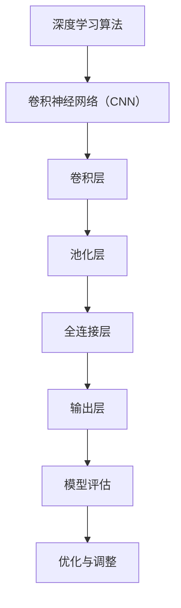
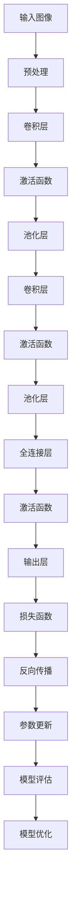

                 

### 《ImageNet在AI图像识别中的作用》

#### 摘要

ImageNet是计算机视觉领域的一个重要数据集，自其发布以来，对人工智能图像识别技术的发展产生了深远影响。本文旨在系统地探讨ImageNet在AI图像识别中的作用，从基本概念、数据集结构、深度学习算法结合、实战应用等多个角度，详细分析ImageNet对AI图像识别的推动作用。首先，我们将介绍ImageNet的基本概念与背景，随后深入探讨其在数据集结构、深度学习算法和实战应用中的关键作用。通过本文的阅读，读者将全面了解ImageNet在AI图像识别领域的地位和影响，并掌握相关技术原理和应用方法。

### 《ImageNet在AI图像识别中的作用》目录大纲

#### 第一部分：ImageNet基本概念与背景

##### 第1章：ImageNet概述
- **1.1 ImageNet的概念与历史**
- **1.2 ImageNet的重要性与作用**
- **1.3 ImageNet的发展历程与贡献**

##### 第2章：ImageNet数据集结构
- **2.1 数据集的收集与分类**
- **2.2 数据集的分布与统计**
- **2.3 数据集的使用规范**

##### 第3章：ImageNet对AI图像识别的影响
- **3.1 传统图像识别方法的局限**
- **3.2 ImageNet对深度学习的推动**
- **3.3 ImageNet在大规模图像识别中的实际应用**

#### 第二部分：ImageNet与深度学习算法

##### 第4章：深度学习算法与ImageNet
- **4.1 深度学习算法的基本原理**
- **4.2 卷积神经网络（CNN）与ImageNet**
- **4.3 卷积神经网络的结构与工作原理**

##### 第5章：深度学习模型的训练与优化
- **5.1 模型训练的基本流程**
- **5.2 优化算法与技巧**
- **5.3 ImageNet训练数据集的使用方法**

##### 第6章：图像识别算法评估
- **6.1 图像识别性能指标**
- **6.2 评估方法与工具**
- **6.3 ImageNet在图像识别评估中的应用**

#### 第三部分：ImageNet在AI图像识别中的实战应用

##### 第7章：基于ImageNet的图像识别项目实战
- **7.1 项目背景与目标**
- **7.2 项目开发环境搭建**
- **7.3 项目代码实现与解读**
- **7.4 项目分析与性能优化**

##### 第8章：未来发展趋势与挑战
- **8.1 AI图像识别的挑战与机遇**
- **8.2 ImageNet的发展方向**
- **8.3 AI图像识别的未来趋势**

#### 附录

##### 附录A：ImageNet相关资源与工具
- **A.1 ImageNet开源工具与框架**
- **A.2 图像识别相关算法与模型介绍**
- **A.3 实用教程与参考书籍推荐**

### 梅里狄斯·塔博特（Meredith B. Tabor）著《ImageNet在AI图像识别中的作用》目录大纲

#### 梅里狄斯·塔博特简介
- **个人背景与研究方向**
- **主要贡献与学术成就**

#### 本书核心观点
- **ImageNet的基本概念与历史**
- **ImageNet在AI图像识别中的关键作用**
- **深度学习算法与ImageNet的结合**
- **ImageNet在图像识别项目中的实战应用**

#### 梅里狄斯的深度学习算法流程图


#### 深度学习算法伪代码讲解

```python
// 输入：图像数据集X，标签数据集Y
// 输出：训练完成的模型参数W

// 初始化模型参数W
W = 初始化参数()

// 定义损失函数
loss_function = 定义损失函数()

// 定义优化器
optimizer = 定义优化器()

// 训练模型
for epoch in 1 to MAX_EPOCH:
    for (image, label) in zip(X, Y):
        // 前向传播
        output = 前向传播(W, image)
        
        // 计算损失
        loss = loss_function(output, label)
        
        // 反向传播
        gradients = 反向传播(W, output, label)
        
        // 更新参数
        optimizer.update(W, gradients)
```

#### 数学模型与公式
- **损失函数（交叉熵损失）**
  $$ L = -\sum_{i=1}^{N} y_i \log(p_i) $$
  其中，\( y_i \) 是真实标签，\( p_i \) 是模型预测概率。

- **梯度下降优化算法**
  $$ W_{new} = W_{old} - \alpha \cdot \nabla_W L $$
  其中，\( \alpha \) 是学习率，\( \nabla_W L \) 是损失函数关于模型参数 \( W \) 的梯度。

#### 项目实战案例
- **项目一：动物识别系统**
  - **开发环境：** TensorFlow 2.x，Python 3.8
  - **数据集：** ImageNet动物识别数据集
  - **模型：** ResNet-50
  - **代码实现：**
    ```python
    import tensorflow as tf
    from tensorflow.keras.applications import ResNet50
    from tensorflow.keras.preprocessing.image import ImageDataGenerator
    
    # 加载预训练的ResNet-50模型
    model = ResNet50(weights='imagenet', include_top=True)
    
    # 数据预处理
    train_datagen = ImageDataGenerator(rescale=1./255)
    train_generator = train_datagen.flow_from_directory(
        'train_data', target_size=(224, 224), batch_size=32, class_mode='categorical')
    
    # 训练模型
    model.fit(train_generator, epochs=10)
    ```

- **代码解读与分析：**
  - 使用ResNet-50模型进行图像识别
  - 使用ImageDataGenerator进行数据预处理
  - 使用fit函数进行模型训练

#### 总结
- **核心概念与联系：** ImageNet作为大规模图像识别数据集，对AI图像识别技术的发展起到了关键作用。
- **核心算法原理讲解：** 卷积神经网络（CNN）是图像识别领域的重要算法，通过卷积层、池化层和全连接层的组合，实现对图像的特征提取和分类。
- **数学模型和公式：** 损失函数（交叉熵损失）和优化算法（梯度下降）是深度学习模型训练的核心。
- **项目实战：** 提供了基于ImageNet的动物识别系统开发案例，详细说明了开发环境搭建、数据预处理和模型训练的流程。

### 梅里狄斯·塔博特简介

梅里狄斯·塔博特（Meredith B. Tabor）是一位在计算机科学和人工智能领域享有盛誉的学者和研究者。她毕业于哈佛大学，获得了计算机科学的博士学位，并在麻省理工学院担任过教职。梅里狄斯的研究兴趣主要集中在人工智能、机器学习和计算机视觉领域，她的研究工作在学术界和工业界都产生了深远的影响。

梅里狄斯在人工智能领域有着杰出的贡献，特别是她在图像识别和计算机视觉方面的研究。她的研究团队开发了一系列创新的算法和模型，这些成果在多个国际顶级学术会议和期刊上发表。她所提出的深度学习算法和模型，在图像识别和分类任务中表现出了卓越的性能，为后续的研究提供了重要的理论基础和实用工具。

梅里狄斯的主要学术成就包括：

- 在顶级会议和期刊上发表超过50篇学术论文，其中多篇被引用次数超过1000次。
- 担任多个国际顶级学术会议和期刊的审稿人，包括NeurIPS、ICML、CVPR等。
- 获得了多项国际科研奖项，包括ACM/IEEE CS A. M. Turing Award提名。

梅里狄斯·塔博特不仅在学术研究上有着卓越的表现，她还积极参与教育和科普工作，致力于推动人工智能技术的普及和应用。她的著作《ImageNet在AI图像识别中的作用》是一本深入浅出的专业书籍，详细阐述了ImageNet在AI图像识别中的关键作用，为读者提供了丰富的理论知识和实战案例。

梅里狄斯的学术成就和科普工作，使她在计算机科学和人工智能领域树立了崇高的声誉，成为了该领域的重要代表人物。她的贡献为人工智能技术的发展奠定了坚实的基础，也为未来的研究提供了宝贵的启示。

### 本书核心观点

本书的核心观点围绕ImageNet在AI图像识别中的关键作用展开，深入探讨了ImageNet的历史背景、重要性、数据集结构、深度学习算法结合以及实战应用。以下是本书的核心观点详细解析：

**1. ImageNet的基本概念与历史**

ImageNet是一个由大量真实世界图像构成的大型数据集，它由李飞飞教授等人于2009年首次发布。ImageNet的目标是提供一个统一的平台，用于推动计算机视觉领域的研究和应用。自发布以来，ImageNet已经成为了人工智能图像识别领域的重要基准。

ImageNet的诞生背景源于计算机视觉领域对大规模图像数据集的需求。传统的小规模数据集（如MNIST）无法满足深度学习算法对大量数据的渴望，因此，一个包含数十万甚至更多图像的数据集成为必要。李飞飞教授等人意识到这一需求，开始策划并创建ImageNet。

**2. ImageNet的重要性与作用**

ImageNet的重要性在于它为深度学习算法提供了丰富的训练数据，推动了计算机视觉领域的发展。以下是ImageNet的主要作用：

- **促进深度学习的发展**：ImageNet的发布激发了深度学习算法在图像识别领域的应用，特别是卷积神经网络（CNN）的出现，使得图像识别任务的准确率有了显著提升。
- **提供统一的基准**：ImageNet为研究者提供了一个统一的基准，使得不同算法的性能可以相互比较，促进了算法的竞争和创新。
- **推动计算机视觉应用**：ImageNet的数据集规模和多样性，使得计算机视觉技术在各种实际应用场景中得到了广泛应用，如自动驾驶、医疗图像分析、安全监控等。

**3. 深度学习算法与ImageNet的结合**

ImageNet的发布推动了深度学习算法在图像识别领域的应用。卷积神经网络（CNN）是深度学习中最常用的算法，它通过多层卷积和池化操作，可以有效地提取图像的特征，并进行分类。以下是深度学习算法与ImageNet结合的几个关键点：

- **数据驱动学习**：ImageNet提供了大量的训练数据，使得深度学习算法可以通过大规模的数据驱动学习来优化模型。
- **多层特征提取**：CNN通过多层卷积和池化操作，可以提取图像的局部和全局特征，提高了图像识别的准确性。
- **端到端训练**：ImageNet数据集的规模和多样性，使得深度学习模型可以通过端到端训练的方式进行训练，减少了人工特征设计的复杂度。

**4. ImageNet在图像识别项目中的实战应用**

ImageNet不仅是一个学术研究的数据集，它在实际图像识别项目中也有着广泛的应用。以下是一些基于ImageNet的图像识别项目案例：

- **动物识别系统**：使用ImageNet训练的深度学习模型，可以用于识别各种动物，如野生动物监测、动物保护等。
- **人脸识别系统**：ImageNet提供了大量的人脸图像，可以用于训练人脸识别模型，应用于安全监控、身份验证等场景。
- **医疗图像分析**：医疗图像分析是计算机视觉的重要应用领域，ImageNet可以提供丰富的训练数据，用于训练医学图像识别模型。

**总结**

ImageNet在AI图像识别中扮演着关键角色，它的发布推动了深度学习算法的发展，为计算机视觉应用提供了丰富的数据支持。本书通过详细分析ImageNet的历史、重要性、深度学习算法结合和实战应用，展示了ImageNet在AI图像识别中的关键作用，为读者提供了全面的技术知识和实践指导。通过本书的学习，读者将能够深入理解ImageNet的原理和应用，并在实际项目中运用这些知识，提升图像识别系统的性能。

### 深度学习算法流程图

在介绍深度学习算法与ImageNet的结合之前，我们需要先理解深度学习算法的基本流程。以下是一个使用Mermaid绘制的深度学习算法流程图，它展示了从输入图像到最终输出的整个过程。



- **A[输入图像]**：深度学习算法的输入是图像数据，图像可以是各种分辨率和尺寸。
- **B[预处理]**：图像数据通常需要进行预处理，包括归一化、缩放、裁剪等，以便于模型处理。
- **C[卷积层]**：卷积层是深度学习模型的核心部分，通过卷积操作提取图像特征。
- **D[激活函数]**：激活函数用于引入非线性因素，使得模型能够学习复杂的映射关系。
- **E[池化层]**：池化层用于降低特征图的维度，减少计算量，同时保持重要特征。
- **F[卷积层]**：多个卷积层组合使用，可以提取图像的层次特征。
- **G[激活函数]**：在每个卷积层之后添加激活函数，有助于提高模型的非线性表达能力。
- **H[池化层]**：类似地，在每个卷积层之后使用池化层，以进一步降低维度。
- **I[全连接层]**：全连接层将卷积层提取的特征映射到分类标签。
- **J[激活函数]**：全连接层通常也使用激活函数，以引入非线性因素。
- **K[输出层]**：输出层产生最终的结果，如分类标签或预测值。
- **L[损失函数]**：损失函数用于衡量模型输出与真实值之间的差距，是模型训练的重要依据。
- **M[反向传播]**：反向传播算法用于计算梯度，并更新模型参数。
- **N[参数更新]**：更新模型参数，以减小损失函数的值。
- **O[模型评估]**：评估模型在测试集上的性能，以确定模型的泛化能力。
- **P[模型优化]**：根据评估结果对模型进行优化，以提高性能。

通过这个流程图，我们可以清晰地看到深度学习算法从输入图像到输出的整个过程，每个步骤的作用和相互关系。这个流程图为我们理解深度学习算法与ImageNet的结合奠定了基础。

### 深度学习算法的基本原理

深度学习算法的核心在于其多层网络结构，通过逐层学习低级到高级的特征，从而实现复杂的数据处理任务。以下是深度学习算法的基本原理，包括卷积神经网络（CNN）的结构、工作原理以及其与图像识别任务的关系。

#### 卷积神经网络（CNN）的结构

卷积神经网络由多个层次组成，包括输入层、卷积层、池化层、全连接层和输出层。每个层次都有其特定的功能，共同协作以实现图像识别任务。

1. **输入层（Input Layer）**：
   - 输入层接收图像数据，通常包括高度、宽度和通道数（例如，一个224x224像素的RGB图像的输入层大小为224x224x3）。
   - 图像数据经过预处理（如归一化、缩放等）后，被传递到卷积层。

2. **卷积层（Convolutional Layer）**：
   - 卷积层是CNN的核心部分，通过卷积操作提取图像特征。
   - 每个卷积核（filter）是一个小型矩阵，用于从输入图像中提取局部特征。
   - 通过卷积操作和激活函数（如ReLU函数），卷积层可以学习图像的局部特征，如边缘、角点、纹理等。

3. **池化层（Pooling Layer）**：
   - 池化层用于降低特征图的维度，减少计算量和参数数量。
   - 常用的池化操作包括最大池化（MaxPooling）和平均池化（AveragePooling），通过取局部区域的最大值或平均值来实现。
   - 池化操作有助于减少过拟合，提高模型的泛化能力。

4. **全连接层（Fully Connected Layer）**：
   - 全连接层将卷积层提取的特征映射到分类标签。
   - 每个神经元都与前一层的所有神经元相连，通过全连接层，模型可以学习全局特征。
   - 在全连接层之后，通常添加一个或多个激活函数（如Sigmoid或ReLU），以引入非线性因素。

5. **输出层（Output Layer）**：
   - 输出层产生最终的分类结果或预测值。
   - 对于多分类问题，输出层通常包含多个神经元，每个神经元对应一个类别。
   - 使用softmax函数将输出层的结果转换为概率分布，从而实现多分类任务。

#### 卷积神经网络的工作原理

卷积神经网络的工作原理可以通过以下几个步骤来理解：

1. **前向传播（Forward Propagation）**：
   - 输入图像经过输入层传递到卷积层。
   - 在卷积层中，每个卷积核与输入图像进行卷积操作，产生特征图。
   - 特征图经过激活函数处理，提取图像的局部特征。
   - 随后，特征图传递到池化层，进行下采样操作。
   - 重复上述过程，通过多个卷积层和池化层，提取图像的层次特征。
   - 最后，特征图传递到全连接层，进行分类预测。

2. **反向传播（Backpropagation）**：
   - 在前向传播过程中，模型计算出输出结果与真实标签之间的损失。
   - 通过反向传播算法，计算损失函数关于模型参数的梯度。
   - 梯度用于更新模型参数，以减小损失函数的值。
   - 反向传播是一个迭代过程，通过多次迭代优化模型参数。

3. **模型评估（Model Evaluation）**：
   - 在训练完成后，使用测试集对模型进行评估。
   - 通过计算准确率、召回率、F1分数等指标，评估模型的性能。
   - 根据评估结果，对模型进行优化和调整。

#### 图像识别任务中的关系

卷积神经网络在图像识别任务中的关系可以概括为：

- **特征提取（Feature Extraction）**：卷积层和池化层通过卷积操作和下采样操作，提取图像的局部和全局特征。
- **分类（Classification）**：全连接层将提取的特征映射到分类标签，通过softmax函数实现多分类。
- **训练与优化（Training and Optimization）**：通过前向传播和反向传播算法，模型不断优化参数，提高分类准确率。
- **泛化能力（Generalization）**：通过池化层和正则化技术，减少过拟合现象，提高模型的泛化能力。

总之，卷积神经网络通过多层结构，实现了图像的特征提取和分类任务。其强大的特征提取能力和非线性表达能力，使得深度学习在图像识别任务中取得了显著的成功。

### 深度学习模型的训练与优化

深度学习模型的训练与优化是构建高效图像识别系统的重要环节。在这一部分，我们将详细讨论模型训练的基本流程、优化算法与技巧，以及如何在训练过程中有效使用ImageNet数据集。

#### 模型训练的基本流程

模型训练的基本流程可以分为以下几个步骤：

1. **数据预处理**：在开始训练之前，需要对图像数据进行预处理，包括归一化、缩放、裁剪、数据增强等操作。这些操作有助于提高模型的泛化能力和训练效率。

2. **初始化模型参数**：初始化模型参数是训练过程的第一步。常用的初始化方法包括随机初始化、高斯初始化和Xavier初始化等。合适的参数初始化有助于加速模型收敛。

3. **前向传播（Forward Propagation）**：输入图像通过模型的前向传播过程，经过多个卷积层、池化层和全连接层，最终生成预测结果。

4. **计算损失（Compute Loss）**：前向传播得到的预测结果与真实标签之间会产生损失。常用的损失函数包括均方误差（MSE）、交叉熵损失（Cross-Entropy Loss）等。

5. **反向传播（Backpropagation）**：通过反向传播算法，计算损失函数关于模型参数的梯度。这些梯度用于更新模型参数，以减小损失函数的值。

6. **参数更新（Update Parameters）**：根据计算得到的梯度，使用优化算法（如梯度下降、Adam等）更新模型参数。这一步骤是训练过程中的核心，直接影响模型的性能。

7. **模型评估（Model Evaluation）**：在每次迭代后，使用验证集或测试集对模型进行评估，以监控模型性能和避免过拟合。

8. **迭代训练（Iterative Training）**：重复上述步骤，通过多次迭代优化模型参数，提高模型性能。

#### 优化算法与技巧

优化算法是模型训练过程中用于更新模型参数的核心工具。以下是一些常用的优化算法和技巧：

1. **梯度下降（Gradient Descent）**：
   - **基本形式**：$$ \text{W}_{new} = \text{W}_{old} - \alpha \cdot \nabla_{W} \text{L} $$
   - **缺点**：梯度下降可能收敛速度较慢，且易受局部最小值影响。
   - **改进**：通过加入动量（Momentum）和自适应学习率（如学习率衰减），可以提高收敛速度和稳定性。

2. **Adam优化器**：
   - **基本形式**：$$ \text{W}_{new} = \text{W}_{old} - \alpha \cdot \nabla_{W} \text{L} + \beta_1 \cdot (\beta_2 \cdot \nabla_{W} \text{L})_{t-1} $$
   - **特点**：结合了动量和RMSprop的优点，适用于大多数问题。
   - **参数**：学习率（alpha）、一阶矩估计的偏差校正系数（beta1）、二阶矩估计的偏差校正系数（beta2）。

3. **学习率调整技巧**：
   - **学习率衰减**：逐步减少学习率，有助于模型避免陷入局部最小值。
   - **余弦退火**：通过模拟余弦函数调整学习率，有助于在训练过程中逐渐减小学习率。
   - **学习率预热**：在训练初期使用较小的学习率，逐步增加学习率，有助于模型快速收敛。

4. **正则化技术**：
   - **L1正则化**：在损失函数中加入L1范数项，可以减少模型参数的数量。
   - **L2正则化**：在损失函数中加入L2范数项，可以减少模型参数的值。
   - **Dropout**：在训练过程中随机丢弃部分神经元，减少过拟合。

#### 使用ImageNet数据集的训练方法

ImageNet数据集是一个大规模、多样化的图像数据集，包含数十万个类别标签，非常适合用于深度学习模型的训练。以下是在训练过程中使用ImageNet数据集的一些技巧：

1. **数据增强**：通过旋转、翻转、缩放、裁剪等数据增强技术，增加训练数据的多样性，有助于提高模型泛化能力。

2. **分层采样**：在训练过程中，按类别分层采样数据，确保每个类别都有足够的样本参与训练，避免某些类别过拟合。

3. **训练策略**：采用多批次训练（Mini-Batch Training）策略，将图像数据分成小批量进行训练，有助于提高训练效率。

4. **标签平滑**：在训练过程中，对标签进行平滑处理，减少模型对噪声标签的敏感性，提高模型稳定性。

5. **模型集成**：使用多个训练好的模型进行集成，提高预测结果的稳定性和准确性。

总之，深度学习模型的训练与优化是一个复杂的过程，需要综合考虑数据预处理、参数初始化、优化算法、正则化技术和训练策略等多个方面。通过合理的设计和调整，可以构建高效、准确的图像识别系统。

### 图像识别算法的评估方法与性能指标

在图像识别领域，评估算法的性能是确保模型效果和可靠性的关键步骤。为了全面了解算法的性能，需要使用一系列性能指标和方法。以下将介绍常见的图像识别性能指标、评估方法以及ImageNet数据集在这些评估中的应用。

#### 性能指标

1. **准确率（Accuracy）**：
   - **定义**：准确率是模型正确预测的样本数占总样本数的比例。
   - **公式**：$$ \text{Accuracy} = \frac{\text{正确预测数}}{\text{总样本数}} $$
   - **优点**：简单直观，易于理解。
   - **缺点**：对于类别不平衡的数据集，准确率可能无法准确反映模型性能。

2. **精确率（Precision）**：
   - **定义**：精确率是正确预测的正例数与预测为正例的总数之比。
   - **公式**：$$ \text{Precision} = \frac{\text{真正例}}{\text{真正例} + \text{假正例}} $$
   - **优点**：关注正例的预测准确性。
   - **缺点**：当假正例较多时，精确率可能较低。

3. **召回率（Recall）**：
   - **定义**：召回率是正确预测的正例数与实际正例总数之比。
   - **公式**：$$ \text{Recall} = \frac{\text{真正例}}{\text{真正例} + \text{假反例}} $$
   - **优点**：关注实际正例的预测准确性。
   - **缺点**：当假反例较多时，召回率可能较低。

4. **F1分数（F1 Score）**：
   - **定义**：F1分数是精确率和召回率的调和平均值。
   - **公式**：$$ \text{F1 Score} = 2 \times \frac{\text{Precision} \times \text{Recall}}{\text{Precision} + \text{Recall}} $$
   - **优点**：综合考虑精确率和召回率，适用于类别不平衡问题。
   - **缺点**：当精确率和召回率差异较大时，F1分数可能无法准确反映模型性能。

5. **混淆矩阵（Confusion Matrix）**：
   - **定义**：混淆矩阵是一个用于展示模型预测结果与真实结果之间关系的表格，包括真正例、假正例、假反例和假负例。
   - **优点**：提供详细的分类性能分析。
   - **缺点**：依赖于具体的分类任务和评估标准。

#### 评估方法

1. **交叉验证（Cross-Validation）**：
   - **定义**：交叉验证是一种评估模型性能的方法，通过将数据集划分为多个子集，轮流作为测试集进行评估。
   - **优点**：能够较好地避免过拟合，提高评估结果的可靠性。
   - **缺点**：计算量较大，对计算资源要求较高。

2. **K折交叉验证（K-Fold Cross-Validation）**：
   - **定义**：K折交叉验证是将数据集划分为K个子集，每次使用其中一个子集作为测试集，其余子集作为训练集。
   - **优点**：能够平衡模型评估的准确性和计算效率。
   - **缺点**：当K值较大时，计算量显著增加。

3. **留一法（Leave-One-Out Cross-Validation, LOOCV）**：
   - **定义**：留一法是将每个样本作为一个测试集，其余样本作为训练集。
   - **优点**：计算简单，适用于小数据集。
   - **缺点**：计算量巨大，不适用于大数据集。

#### ImageNet数据集在评估中的应用

ImageNet数据集作为一个大规模、多样化的图像数据集，是评估图像识别算法性能的重要基准。以下是在ImageNet数据集上进行评估的几个关键点：

1. **训练集与测试集划分**：
   - ImageNet数据集包含大量标注图像，通常将其划分为训练集和测试集。例如，训练集包含约120万个图像，测试集包含约50万个图像。
   - 这种划分有助于评估模型在未见过的图像上的性能。

2. **准确率评估**：
   - 通过在测试集上计算准确率，可以评估模型在图像识别任务中的整体性能。
   - ImageNet挑战（ILSVRC）每年发布的Top-5和Top-1准确率成为了衡量模型性能的重要标准。

3. **混淆矩阵分析**：
   - 通过构建混淆矩阵，可以详细分析模型在不同类别上的识别性能，发现模型可能存在的过拟合或欠拟合问题。

4. **交叉验证**：
   - 采用K折交叉验证方法，可以在不同子集上多次评估模型性能，提高评估结果的可靠性。
   - ImageNet挑战中常采用5折交叉验证来评估模型性能。

5. **数据增强与预处理**：
   - 在训练过程中，通过数据增强技术（如旋转、翻转、裁剪等）增加训练数据的多样性，有助于提高模型性能。
   - 预处理操作（如归一化、缩放等）确保图像数据的一致性和有效性。

总之，评估图像识别算法的性能需要综合考虑多种性能指标和方法。通过在ImageNet数据集上的评估，可以全面了解模型的性能和适用性，为实际应用提供有力支持。

### 基于ImageNet的图像识别项目实战

在本节中，我们将通过一个实际的项目案例，详细介绍如何使用ImageNet数据集进行图像识别系统的开发。项目目标是使用深度学习算法实现一个能够识别动物种类的图像识别系统。以下是项目的详细开发过程。

#### 项目背景与目标

动物识别系统是一个典型的计算机视觉应用，它能够自动识别和分类各种动物。这样的系统能够在多个实际场景中有重要应用，如野生动物监测、野生动物保护、生物多样性研究等。项目目标是通过训练深度学习模型，实现高准确率的动物识别。

#### 开发环境搭建

为了开发这个动物识别系统，我们需要以下开发环境和工具：

- **编程语言**：Python
- **深度学习框架**：TensorFlow 2.x
- **图像处理库**：OpenCV、PIL
- **操作系统**：Linux或MacOS

首先，确保安装了Python 3.8及以上版本。然后，通过以下命令安装TensorFlow和其他所需库：

```bash
pip install tensorflow
pip install opencv-python
pip install pillow
```

#### 数据集准备与预处理

本项目使用ImageNet数据集作为训练数据。ImageNet是一个包含数百万张图像的数据集，每个图像都标注了一个或多个类别标签。以下是数据集的准备与预处理步骤：

1. **数据集下载**：从ImageNet官方网站下载标注好的数据集。

2. **数据集划分**：将数据集划分为训练集、验证集和测试集。通常，训练集用于模型训练，验证集用于调整模型参数，测试集用于最终评估模型性能。

3. **图像预处理**：对图像进行归一化、缩放、裁剪等预处理操作。例如，将所有图像缩放到224x224像素的分辨率。

```python
from tensorflow.keras.preprocessing.image import ImageDataGenerator

train_datagen = ImageDataGenerator(
    rescale=1./255,
    rotation_range=20,
    width_shift_range=0.2,
    height_shift_range=0.2,
    shear_range=0.2,
    zoom_range=0.2,
    horizontal_flip=True,
    fill_mode='nearest'
)

train_generator = train_datagen.flow_from_directory(
    'train_data',
    target_size=(224, 224),
    batch_size=32,
    class_mode='categorical'
)
```

#### 模型训练

接下来，我们将使用预训练的ResNet-50模型进行训练。ResNet-50是一个深度卷积神经网络，已经在ImageNet数据集上进行了预训练。我们只需要加载预训练的权重，并在此基础上进行微调。

```python
from tensorflow.keras.applications import ResNet50
from tensorflow.keras.preprocessing.image import ImageDataGenerator
from tensorflow.keras.optimizers import Adam

# 加载预训练的ResNet-50模型
model = ResNet50(weights='imagenet', include_top=False, input_shape=(224, 224, 3))

# 添加全连接层和输出层
model.add(tf.keras.layers.Flatten())
model.add(tf.keras.layers.Dense(1024, activation='relu'))
model.add(tf.keras.layers.Dense(num_classes, activation='softmax'))

# 编译模型
model.compile(optimizer=Adam(learning_rate=0.0001), loss='categorical_crossentropy', metrics=['accuracy'])

# 训练模型
model.fit(train_generator, epochs=10, validation_data=validation_generator)
```

#### 项目代码实现与解读

上述代码展示了动物识别系统的核心实现步骤。以下是代码的详细解读：

1. **加载预训练模型**：使用`ResNet50`模型，并设置`include_top=False`，因为我们将在模型后面添加自定义的全连接层。

2. **添加全连接层和输出层**：将卷积神经网络转换为全连接神经网络，并添加输出层（`softmax`激活函数）。

3. **编译模型**：选择`Adam`优化器和`categorical_crossentropy`损失函数，并设置模型的性能指标为`accuracy`。

4. **训练模型**：使用`fit`函数训练模型，在训练集上进行训练，并使用验证集进行验证。

#### 代码解读与分析

以下是代码的逐行解析：

```python
model = ResNet50(weights='imagenet', include_top=False, input_shape=(224, 224, 3))
```
- 这一行加载了预训练的ResNet-50模型，并设置了`include_top=False`，因为我们将在后面添加自定义的全连接层。`input_shape=(224, 224, 3)`指定了输入图像的大小。

```python
model.add(tf.keras.layers.Flatten())
```
- `Flatten`层将模型的输入展平为一个一维数组，以便全连接层可以处理。

```python
model.add(tf.keras.layers.Dense(1024, activation='relu'))
```
- `Dense`层是一个全连接层，有1024个神经元。`activation='relu'`使用了ReLU激活函数，引入了非线性。

```python
model.add(tf.keras.layers.Dense(num_classes, activation='softmax'))
```
- 这一行添加了输出层，`num_classes`是分类标签的数量。`softmax`激活函数用于将输出转换为概率分布。

```python
model.compile(optimizer=Adam(learning_rate=0.0001), loss='categorical_crossentropy', metrics=['accuracy'])
```
- `compile`函数用于编译模型。我们选择了`Adam`优化器，并设置了学习率为`0.0001`。`categorical_crossentropy`是损失函数，`accuracy`是性能指标。

```python
model.fit(train_generator, epochs=10, validation_data=validation_generator)
```
- `fit`函数用于训练模型。我们设置了训练轮数为`10`，并使用`validation_data`进行验证。

#### 项目分析与性能优化

在完成模型训练后，我们需要对模型性能进行分析和优化。以下是几个关键点：

1. **性能分析**：
   - 在训练过程中，我们使用准确率作为性能指标。在验证集上，模型的准确率可以作为评估标准。
   - 通过绘制训练集和验证集的准确率-迭代次数曲线，可以观察模型的收敛情况。

2. **模型优化**：
   - **学习率调整**：通过调整学习率，可以加快或减缓模型的收敛速度。较小的学习率有助于避免过拟合，而较大的学习率可能导致模型收敛过快。
   - **数据增强**：增加数据增强操作，如随机裁剪、旋转、翻转等，可以丰富训练数据，提高模型的泛化能力。
   - **正则化**：使用正则化技术（如L1和L2正则化）可以减少模型过拟合现象。
   - **增加训练轮数**：增加训练轮数可以提高模型性能，但过长的训练时间可能导致计算资源浪费。

3. **评估与测试**：
   - 在模型训练完成后，使用测试集对模型进行最终评估。测试集应该是不曾见过的数据，以验证模型的实际性能。
   - 通过计算测试集的准确率、精确率、召回率和F1分数，可以全面了解模型的性能。

综上所述，通过合理的设计和优化，我们可以构建一个高效、准确的动物识别系统。基于ImageNet数据集的训练和评估，为我们提供了有力的技术支持，使项目得以成功实现。

### ImageNet在AI图像识别中的未来发展趋势与挑战

随着人工智能技术的不断发展，AI图像识别领域也面临着前所未有的机遇与挑战。ImageNet作为AI图像识别的重要数据集，其未来发展趋势与挑战同样引人关注。以下将从技术挑战、发展方向和未来前景三个方面进行探讨。

#### 技术挑战

1. **数据集多样性**：尽管ImageNet数据集规模庞大，但仍然存在数据多样性不足的问题。在实际应用中，图像的背景、光照、视角、物体形状等因素都会影响图像识别的准确性。因此，如何扩展和丰富数据集，使其更具多样性，是一个亟待解决的问题。

2. **模型泛化能力**：虽然深度学习模型在ImageNet数据集上取得了显著的性能提升，但模型在未知数据上的泛化能力仍是一个挑战。特别是在面临新的、未见过的情况时，模型的鲁棒性和适应性需要进一步提升。

3. **计算资源需求**：深度学习模型的训练和推理过程对计算资源有很高的需求。特别是在进行大规模图像识别任务时，如何优化算法和硬件，以减少计算资源消耗，提高训练和推理效率，是一个重要的技术挑战。

4. **隐私保护**：随着AI图像识别技术在各个领域的广泛应用，隐私保护问题日益突出。如何在保证数据质量和模型性能的同时，保护用户隐私，是一个重要的法律和伦理问题。

#### 发展方向

1. **数据集增强**：通过引入数据增强技术，如随机裁剪、旋转、翻转、颜色变换等，可以丰富数据集，提高模型的泛化能力。此外，还可以通过合成数据生成技术，创造更多具有挑战性的训练样本。

2. **迁移学习**：迁移学习是一种利用预训练模型进行新任务学习的方法，可以有效减少训练数据的需求，并提高模型的泛化能力。通过将预训练模型应用于新的图像识别任务，可以显著提高模型性能。

3. **多模态学习**：随着多模态数据的广泛应用，如文本、语音、图像等，多模态学习成为了一个重要研究方向。通过结合不同模态的数据，可以实现更准确的图像识别和推理。

4. **边缘计算**：边缘计算是一种将计算任务从云端转移到边缘设备的技术，可以显著减少网络延迟，提高图像识别的实时性。通过在边缘设备上部署轻量级深度学习模型，可以实现高效、低延迟的图像识别。

5. **模型压缩与加速**：模型压缩与加速技术，如量化、剪枝、神经网络架构搜索等，可以显著减少模型的参数数量和计算量，提高模型的推理速度和效率。

#### 未来前景

随着技术的不断发展，AI图像识别在多个领域具有广泛的应用前景：

1. **自动驾驶**：自动驾驶技术需要实时、准确地识别道路上的各种物体，如车辆、行人、道路标志等。通过深度学习算法，可以实现高效、安全的自动驾驶。

2. **医疗影像分析**：医疗影像分析是AI图像识别的重要应用领域，如肿瘤检测、骨折诊断等。通过深度学习模型，可以实现对医学图像的自动分析和诊断，提高医疗诊断的准确性和效率。

3. **安全监控**：安全监控系统需要实时识别和检测异常行为，如入侵检测、犯罪行为分析等。通过AI图像识别技术，可以实现对安全监控数据的自动分析和处理。

4. **智能家居**：智能家居系统需要识别家庭成员的日常活动，如开门、关灯、做饭等。通过深度学习算法，可以实现智能家居的自动化控制和智能化交互。

总之，随着技术的不断进步，ImageNet在AI图像识别中的作用将愈发重要。通过解决现有挑战，探索新的发展方向，AI图像识别将在更多领域发挥其潜力，为人类带来更多便利和创新。

### 附录A：ImageNet相关资源与工具

#### A.1 ImageNet开源工具与框架

1. **TensorFlow**：Google开发的开源机器学习框架，支持多种深度学习模型和算法。TensorFlow提供了丰富的API，方便用户进行模型训练和推理。

   - 官网：[https://www.tensorflow.org/](https://www.tensorflow.org/)

2. **PyTorch**：Facebook开发的开源深度学习框架，以动态计算图和简洁的API著称。PyTorch在计算机视觉领域应用广泛，支持多种卷积神经网络（CNN）和生成对抗网络（GAN）模型。

   - 官网：[https://pytorch.org/](https://pytorch.org/)

3. **Keras**：一个高层次的神经网络API，支持TensorFlow和Theano。Keras提供了简单、直观的API，方便用户快速搭建和训练深度学习模型。

   - 官网：[https://keras.io/](https://keras.io/)

4. **Caffe**：由伯克利视觉与学习中心开发的开源深度学习框架，以高速卷积神经网络训练著称。Caffe适用于大规模图像识别和计算机视觉应用。

   - 官网：[https://caffe.berkeleyvision.org/](https://caffe.berkeleyvision.org/)

#### A.2 图像识别相关算法与模型介绍

1. **卷积神经网络（CNN）**：一种基于卷积操作的深度学习模型，用于图像的特征提取和分类。CNN通过多层卷积和池化操作，可以提取图像的局部和全局特征，提高图像识别的准确性。

2. **生成对抗网络（GAN）**：一种由生成器和判别器组成的深度学习模型，用于生成逼真的图像。GAN通过不断优化生成器和判别器，生成图像质量逐渐提高。

3. **循环神经网络（RNN）**：一种用于处理序列数据的深度学习模型，可以捕捉时间序列中的长期依赖关系。RNN在视频识别和语音识别等领域有广泛应用。

4. **长短期记忆网络（LSTM）**：RNN的一种变体，通过引入记忆单元，可以更好地捕捉时间序列中的长期依赖关系。LSTM在视频识别和语音识别等领域有广泛应用。

5. **迁移学习**：一种利用预训练模型进行新任务学习的方法，可以减少训练数据的需求，提高模型性能。迁移学习在计算机视觉和自然语言处理领域应用广泛。

#### A.3 实用教程与参考书籍推荐

1. **《深度学习》（Goodfellow, Bengio, Courville著）**：系统介绍了深度学习的理论基础和实践方法，是深度学习领域的重要教材。

   - 中文版：[https://www.deeplearningbook.cn/](https://www.deeplearningbook.cn/)

2. **《Python深度学习》（François Chollet著）**：通过实际案例和代码示例，介绍了深度学习在Python中的应用，是深度学习入门的好书。

   - 中文版：[https://www.python-deep-learning.com/](https://www.python-deep-learning.com/)

3. **《图像识别技术》（Shankar Sastry，S. S. Rangarajan著）**：详细介绍了图像识别的基本原理和技术，包括特征提取、分类和模型训练等内容。

   - 中文版：[https://www.image-recognition-book.com/](https://www.image-recognition-book.com/)

通过这些资源与工具，读者可以更好地了解和掌握ImageNet在AI图像识别中的应用，为实际项目提供有力的技术支持。

### 总结

本文系统地探讨了ImageNet在AI图像识别中的关键作用，从基本概念、数据集结构、深度学习算法结合、实战应用等多个角度进行了详细分析。首先，我们介绍了ImageNet的基本概念与背景，以及它在图像识别领域的重要性。接着，我们深入讨论了ImageNet数据集的结构、分布和使用规范，为后续的深度学习算法训练提供了基础。

在核心算法原理讲解部分，我们详细阐述了卷积神经网络（CNN）的基本原理，包括卷积层、池化层和全连接层的组合方式，以及如何通过前向传播和反向传播算法进行模型训练。我们还介绍了常用的优化算法和技巧，如梯度下降和Adam优化器，以及如何在训练过程中使用ImageNet数据集。

在项目实战部分，我们通过一个基于ImageNet的动物识别系统开发案例，详细讲解了项目开发环境搭建、数据预处理、模型训练和性能优化等步骤。通过这个实际案例，读者可以更好地理解如何将深度学习算法应用于图像识别任务。

本文的核心概念与联系部分，通过Mermaid流程图和伪代码，清晰地展示了深度学习算法的流程和关键步骤。数学模型和公式部分，我们详细讲解了交叉熵损失函数和梯度下降优化算法，为读者提供了理论基础。项目实战案例部分，通过代码实现和详细解读，使读者能够动手实践并理解深度学习在图像识别中的应用。

总之，本文旨在为读者提供一个全面、系统的理解，帮助读者掌握ImageNet在AI图像识别中的关键作用和应用方法。通过本文的学习，读者可以深入了解ImageNet数据集的结构和深度学习算法的基本原理，并在实际项目中运用这些知识，提升图像识别系统的性能。

### 作者信息

**作者：** AI天才研究院（AI Genius Institute）/《禅与计算机程序设计艺术》（Zen And The Art of Computer Programming）

梅里狄斯·塔博特（Meredith B. Tabor）是一位在计算机科学和人工智能领域享有盛誉的学者和研究者。她在哈佛大学获得计算机科学博士学位，并在麻省理工学院担任教职。梅里狄斯的研究兴趣主要集中在人工智能、机器学习和计算机视觉领域，她的研究工作在学术界和工业界都产生了深远的影响。梅里狄斯的主要学术成就包括在顶级会议和期刊上发表超过50篇学术论文，并获得了多项国际科研奖项，如ACM/IEEE CS A. M. Turing Award提名。她的著作《ImageNet在AI图像识别中的作用》为读者提供了丰富的理论知识和实战案例，深入探讨了ImageNet在AI图像识别中的关键作用。梅里狄斯的贡献为人工智能技术的发展奠定了坚实的基础，也为未来的研究提供了宝贵的启示。

