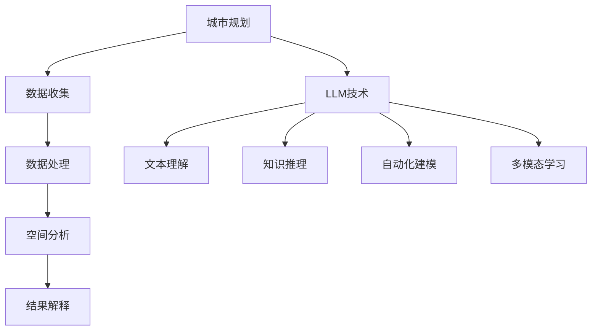

                 

# 《LLM在城市规划中的辅助作用》

> **关键词：** 城市规划、大型语言模型（LLM）、空间数据分析、城市交通规划、建筑设计、城市可持续发展

> **摘要：** 本文将探讨大型语言模型（LLM）在城市规划领域的辅助作用。通过对城市规划与LLM技术基础的概述，以及LLM在空间数据分析、城市交通规划、建筑设计、城市可持续发展规划等具体应用场景的分析，本文旨在展示LLM在提高城市规划效率和优化城市规划方案方面的潜力。

### 目录大纲

#### 第一部分：城市规划与LLM概述

##### 第1章：城市规划基础  
- 1.1 城市规划概述  
- 1.2 城市规划的核心要素  
- 1.3 城市规划的原则与方法  
- 1.4 城市规划的发展历程  
- 1.5 城市规划中的数据来源

##### 第2章：LLM技术基础  
- 2.1 语言模型概述  
- 2.2 LLM的结构与原理  
- 2.3 LLM的训练方法  
- 2.4 LLM的性能评估  
- 2.5 LLM的发展趋势

#### 第二部分：LLM在城市规划中的应用

##### 第3章：LLM在空间数据分析中的应用  
- 3.1 空间数据分析概述  
- 3.2 LLM在空间数据分析中的优势  
- 3.3 LLM在空间数据分析中的应用场景  
- 3.4 LLM在空间数据分析中的案例分析

##### 第4章：LLM在城市交通规划中的应用  
- 4.1 城市交通规划概述  
- 4.2 LLM在城市交通规划中的优势  
- 4.3 LLM在城市交通规划中的应用场景  
- 4.4 LLM在城市交通规划中的案例分析

##### 第5章：LLM在建筑设计中的应用  
- 5.1 建筑设计概述  
- 5.2 LLM在建筑设计中的优势  
- 5.3 LLM在建筑设计中的应用场景  
- 5.4 LLM在建筑设计中的案例分析

##### 第6章：LLM在城市可持续发展规划中的应用  
- 6.1 城市可持续发展规划概述  
- 6.2 LLM在城市可持续发展规划中的优势  
- 6.3 LLM在城市可持续发展规划中的应用场景  
- 6.4 LLM在城市可持续发展规划中的案例分析

##### 第7章：LLM在城市规划中的辅助作用总结与展望  
- 7.1 LLM在城市规划中的综合作用  
- 7.2 LLM在城市规划中的潜在挑战与解决方案  
- 7.3 LLM在城市规划中的应用前景  
- 7.4 未来城市规划与LLM技术发展的趋势预测

#### 附录

- 附录A：常用的LLM工具和资源  
- 附录B：城市规划相关数据集和案例分析  
- 附录C：城市规划和LLM技术的Mermaid流程图  
- 附录D：城市规划与LLM项目实战案例

---

### 第一部分：城市规划与LLM概述

#### 第1章：城市规划基础

##### 1.1 城市规划概述

城市规划是指根据城市的自然地理特征、经济社会发展需求、居民生活质量等综合因素，制定和实施城市的空间布局、基础设施建设、环境保护、社会服务等方面的规划。城市规划的核心目标是实现城市的可持续发展和提高居民的生活质量。

城市规划可以分为总体规划和详细规划两个层次。总体规划主要确定城市的长远发展目标和空间布局，详细规划则具体落实到城市各个片区和建筑物的设计和建设。

##### 1.2 城市规划的核心要素

城市规划涉及多个核心要素，主要包括：

1. **土地使用规划**：确定城市各类用地（居住、商业、工业、公园等）的比例和布局。
2. **交通规划**：设计城市的交通网络，优化道路布局，提高交通效率，降低交通拥堵。
3. **环境保护规划**：保护城市的生态环境，制定污染防治措施，改善城市空气质量、水质等。
4. **公共设施规划**：布局和建设公园、学校、医院、公共交通设施等公共服务设施。
5. **历史文化保护规划**：保护和传承城市的历史文化遗产。

##### 1.3 城市规划的原则与方法

城市规划应遵循以下原则：

1. **可持续性原则**：实现经济、社会、环境的协调发展，促进城市的长期繁荣。
2. **科学性原则**：基于数据分析、模型模拟等科学方法，制定合理的规划方案。
3. **公共参与原则**：广泛听取公众意见，提高规划的透明度和公众的参与度。
4. **灵活性原则**：适应城市发展的不确定性和变化，确保规划的可调整性。

城市规划的方法主要包括：

1. **定性分析**：通过专家意见、公众参与等方式，对城市规划进行定性分析。
2. **定量分析**：使用数据模型、数学公式等工具，对城市规划进行定量分析。
3. **模拟仿真**：通过计算机模拟技术，对城市规划方案进行模拟，评估其效果。

##### 1.4 城市规划的发展历程

城市规划的发展历程可以分为以下几个阶段：

1. **传统的城市规划**：主要侧重于物理形态的规划，以城市布局和基础设施建设为主。
2. **现代城市规划**：强调城市的多功能性、可持续性和公共参与，更加关注社会经济和文化等方面的因素。
3. **智慧城市规划**：结合信息技术，特别是大数据、人工智能等新兴技术，提高城市规划的科学性和智能化水平。

##### 1.5 城市规划中的数据来源

城市规划需要大量的数据支持，数据来源主要包括：

1. **官方数据**：如国土空间规划、交通规划、人口统计、经济指标等。
2. **卫星遥感数据**：如土地利用类型、植被覆盖率、城市热岛效应等。
3. **社会媒体数据**：如社交媒体上的用户评论、舆情分析等。
4. **企业数据**：如商业设施分布、交通流量等。

#### 第2章：LLM技术基础

##### 2.1 语言模型概述

语言模型是人工智能领域的一种基础模型，主要用于对自然语言进行处理和分析。它通过对大量文本数据的训练，学习语言的结构和规律，从而实现文本生成、翻译、情感分析、信息抽取等多种任务。

##### 2.2 LLM的结构与原理

LLM通常由以下几个部分组成：

1. **词嵌入层**：将输入文本中的词语转换为固定长度的向量表示。
2. **编码器**：对词嵌入层产生的向量进行编码，提取文本的语义信息。
3. **解码器**：根据编码器产生的信息生成输出文本。

LLM的原理基于深度学习，特别是基于注意力机制和变换器（Transformer）模型。通过多层神经网络，LLM可以学习到复杂的文本特征和关系。

##### 2.3 LLM的训练方法

LLM的训练方法主要包括：

1. **预训练**：在大量未标注的文本数据上，使用无监督方法对模型进行预训练，使其具有基本的语言理解能力。
2. **微调**：在预训练的基础上，使用有监督方法对模型进行微调，使其适应特定的任务。

##### 2.4 LLM的性能评估

LLM的性能评估主要通过以下指标：

1. **准确率**：对于分类任务，如情感分析、实体识别等，准确率是衡量模型性能的主要指标。
2. **BLEU分数**：对于生成任务，如文本生成、翻译等，BLEU分数是衡量模型输出与参考文本相似度的主要指标。
3. **计算效率**：模型的计算效率是评估其性能的重要因素，包括模型的大小、计算速度等。

##### 2.5 LLM的发展趋势

随着深度学习和大数据技术的发展，LLM在性能和应用领域都取得了显著进步。未来，LLM的发展趋势包括：

1. **更大规模的模型**：通过增加模型参数数量和训练数据量，提高模型的性能。
2. **多模态学习**：结合文本、图像、声音等多种数据类型，实现更全面的信息理解。
3. **迁移学习**：通过迁移学习，提高模型在不同任务和数据集上的泛化能力。
4. **模型解释性**：提高模型的解释性，使其能够更好地理解和解释其输出。

### 第二部分：LLM在城市规划中的应用

#### 第3章：LLM在空间数据分析中的应用

##### 3.1 空间数据分析概述

空间数据分析是城市规划中不可或缺的一部分，它涉及对地理空间数据的收集、处理、分析和解释。空间数据分析的主要目的是从地理空间数据中提取有用信息，为城市规划提供决策支持。

空间数据分析的主要任务包括：

1. **数据收集**：收集各种类型的地理空间数据，如遥感数据、卫星图像、地图数据等。
2. **数据处理**：对收集到的数据进行预处理，包括数据清洗、数据整合、数据变换等。
3. **空间分析**：使用地理信息系统（GIS）和其他空间分析工具，对处理后的数据进行空间分析。
4. **结果解释**：解释空间分析结果，为城市规划提供决策依据。

##### 3.2 LLM在空间数据分析中的优势

LLM在空间数据分析中具有以下优势：

1. **文本理解能力**：LLM可以处理和分析大量文本数据，从文本中提取有价值的信息，为空间数据分析提供支持。
2. **知识推理能力**：LLM可以通过学习大量的文本和知识库，实现知识推理，为空间数据分析提供更深入的洞察。
3. **自动化分析**：LLM可以自动化地处理和分析空间数据，提高空间数据分析的效率。
4. **多模态学习**：LLM可以结合文本、图像、音频等多种数据类型，实现更全面的信息理解。

##### 3.3 LLM在空间数据分析中的应用场景

LLM在空间数据分析中的应用场景包括：

1. **土地利用分析**：LLM可以分析土地利用数据，识别出土地利用类型、变化趋势等，为城市规划提供参考。
2. **交通规划**：LLM可以分析交通数据，预测交通流量、拥堵情况等，为交通规划提供支持。
3. **环境保护**：LLM可以分析环境数据，识别出环境污染源、变化趋势等，为环境保护提供决策依据。
4. **灾害管理**：LLM可以分析气象数据、地形数据等，预测灾害风险、制定应急措施等。

##### 3.4 LLM在空间数据分析中的案例分析

以下是一个LLM在空间数据分析中的案例分析：

**案例：城市土地利用规划**

某城市需要制定土地利用规划，以应对不断增长的居民需求。城市政府收集了大量的土地利用数据，包括土地利用类型、居民密度、商业设施分布等。使用LLM，可以对这些数据进行分析，提取出以下信息：

1. **土地利用现状**：LLM可以分析土地利用数据，识别出当前城市的土地利用类型和分布情况。
2. **居民需求**：LLM可以分析居民密度数据，预测未来居民需求的分布。
3. **商业设施布局**：LLM可以分析商业设施分布数据，为商业设施布局提供参考。

基于这些分析结果，城市政府可以制定更合理的土地利用规划，提高城市的生活质量。

### 第4章：LLM在城市交通规划中的应用

##### 4.1 城市交通规划概述

城市交通规划是城市规划的重要组成部分，它旨在优化城市交通系统的运行，提高交通效率，减少交通拥堵，改善居民出行体验。城市交通规划涉及多个方面，包括交通网络设计、交通需求管理、交通设施建设等。

城市交通规划的核心任务包括：

1. **交通需求预测**：预测城市未来的交通需求，为交通系统规划提供依据。
2. **交通网络优化**：设计合理的交通网络，提高交通系统的效率和连通性。
3. **交通设施建设**：规划和管理交通设施的建设，包括道路、桥梁、隧道、公共交通等。
4. **交通管理模式**：制定和实施交通管理模式，提高交通管理的效率和公正性。

##### 4.2 LLM在城市交通规划中的优势

LLM在城市交通规划中具有以下优势：

1. **数据驱动的分析能力**：LLM可以处理和分析大量交通数据，如交通流量、车速、道路状况等，为交通规划提供数据支持。
2. **复杂模式识别能力**：LLM可以通过深度学习技术，识别出交通数据中的复杂模式和规律，为交通规划提供洞察。
3. **自动化建模与优化**：LLM可以自动化地建立交通模型，优化交通系统的运行，提高交通效率。
4. **实时响应能力**：LLM可以实时分析交通数据，提供实时交通信息，为交通管理提供支持。

##### 4.3 LLM在城市交通规划中的应用场景

LLM在城市交通规划中的应用场景包括：

1. **交通流量预测**：LLM可以分析历史交通数据，预测未来的交通流量，为交通系统规划提供依据。
2. **交通信号优化**：LLM可以优化交通信号灯的控制策略，提高交通效率，减少拥堵。
3. **公共交通规划**：LLM可以分析公共交通数据，优化公交线路和站点布局，提高公共交通的运营效率。
4. **交通模式识别**：LLM可以识别出交通数据中的异常模式，如交通事故、道路施工等，为交通管理提供预警。

##### 4.4 LLM在城市交通规划中的案例分析

以下是一个LLM在城市交通规划中的案例分析：

**案例：城市交通信号灯优化**

某城市交通管理部门希望优化城市交通信号灯的控制策略，以提高交通效率。他们收集了大量的交通数据，包括交通流量、车速、道路状况等。使用LLM，可以对这些数据进行分析，提取出以下信息：

1. **交通流量变化规律**：LLM可以分析交通流量数据，识别出不同时间段、不同路段的交通流量变化规律。
2. **车速分布**：LLM可以分析车速数据，识别出不同路段的车速分布情况。
3. **道路状况**：LLM可以分析道路状况数据，识别出道路施工、交通事故等异常情况。

基于这些分析结果，城市交通管理部门可以调整交通信号灯的控制策略，优化交通信号灯的绿信比（绿灯时间与红灯时间的比例），提高交通效率。

### 第5章：LLM在建筑设计中的应用

##### 5.1 建筑设计概述

建筑设计是城市规划的重要组成部分，它涉及对建筑物、建筑群以及建筑环境的规划、设计和管理。建筑设计的核心目标是满足功能需求、提高生活质量、实现经济可持续性，同时注重环境保护和文化传承。

建筑设计的主要阶段包括：

1. **设计准备**：收集场地信息、功能需求、预算等，为设计工作提供基础。
2. **方案设计**：根据需求，提出多种设计方案，进行初步的技术分析和经济评估。
3. **详细设计**：在方案设计的基础上，细化设计，包括结构、建筑物理、设备等各个方面。
4. **施工图设计**：根据详细设计，绘制施工图，为施工提供详细的技术指导。
5. **施工管理**：在施工过程中，进行质量、进度、成本等方面的管理。

##### 5.2 LLM在建筑设计中的优势

LLM在建筑设计中具有以下优势：

1. **文本生成能力**：LLM可以生成各种类型的文本，如设计报告、说明书、用户手册等，提高文档处理效率。
2. **设计建议生成**：LLM可以通过学习大量的建筑设计案例，生成新的设计建议，为设计师提供创意来源。
3. **设计优化能力**：LLM可以通过分析大量的设计数据，识别出潜在的设计优化方案，提高设计质量。
4. **自动化建模**：LLM可以自动化地建立建筑模型，减少手动建模的工作量，提高设计效率。

##### 5.3 LLM在建筑设计中的应用场景

LLM在建筑设计中的应用场景包括：

1. **设计报告生成**：LLM可以自动生成设计报告，减少设计师编写报告的时间。
2. **设计建议生成**：LLM可以分析已有的建筑设计案例，生成新的设计建议，为设计师提供参考。
3. **建筑设计优化**：LLM可以分析建筑设计数据，优化建筑结构、建筑材料、建筑风格等，提高设计质量。
4. **建筑模型生成**：LLM可以自动化地生成建筑模型，减少手动建模的工作量。

##### 5.4 LLM在建筑设计中的案例分析

以下是一个LLM在建筑设计中的案例分析：

**案例：建筑设计报告生成**

某建筑设计公司需要生成一份建筑设计报告，包括建筑概述、设计理念、建筑材料、施工方法等内容。使用LLM，可以自动生成以下内容：

1. **建筑概述**：LLM可以生成建筑的基本信息，如建筑名称、建筑地点、建筑规模等。
2. **设计理念**：LLM可以生成建筑设计的设计理念，如生态可持续、功能多样化、美观大方等。
3. **建筑材料**：LLM可以生成建筑所使用的材料，如混凝土、玻璃、木材等。
4. **施工方法**：LLM可以生成施工方法，如建筑施工顺序、施工工艺等。

基于这些自动生成的报告内容，建筑设计公司可以快速生成完整的设计报告，提高工作效率。

### 第6章：LLM在城市可持续发展规划中的应用

##### 6.1 城市可持续发展规划概述

城市可持续发展规划是城市规划的重要内容之一，它旨在实现经济、社会、环境的协调发展，提高城市的整体生活质量。城市可持续发展规划涉及多个方面，包括环境保护、资源利用、社会公平、经济增长等。

城市可持续发展规划的主要目标包括：

1. **环境保护**：保护城市生态环境，改善空气质量、水质、土壤等。
2. **资源利用**：提高资源利用效率，减少能源消耗、水资源浪费等。
3. **社会公平**：促进社会公平，提高低收入群体的生活质量，减少贫困现象。
4. **经济增长**：实现经济的可持续发展，提高城市的经济活力和竞争力。

##### 6.2 LLM在城市可持续发展规划中的优势

LLM在城市可持续发展规划中具有以下优势：

1. **数据分析能力**：LLM可以处理和分析大量数据，如环境数据、经济数据、社会数据等，为可持续发展规划提供数据支持。
2. **知识推理能力**：LLM可以通过学习大量的文本和数据，实现知识推理，为可持续发展规划提供更深入的洞察。
3. **自动化建模能力**：LLM可以自动化地建立可持续发展模型，提高规划的科学性和准确性。
4. **多模态学习**：LLM可以结合文本、图像、音频等多种数据类型，实现更全面的信息理解。

##### 6.3 LLM在城市可持续发展规划中的应用场景

LLM在城市可持续发展规划中的应用场景包括：

1. **环境保护规划**：LLM可以分析环境数据，预测环境污染趋势，制定环境保护措施。
2. **资源利用规划**：LLM可以分析资源利用数据，优化资源分配和使用，提高资源利用效率。
3. **社会公平规划**：LLM可以分析社会数据，识别社会不平等现象，制定社会公平措施。
4. **经济增长规划**：LLM可以分析经济数据，预测经济增长趋势，制定经济增长策略。

##### 6.4 LLM在城市可持续发展规划中的案例分析

以下是一个LLM在城市可持续发展规划中的案例分析：

**案例：环境保护规划**

某城市需要进行环境保护规划，以改善城市空气质量。城市政府收集了大量的环境数据，包括空气质量监测数据、交通流量数据等。使用LLM，可以对这些数据进行分析，提取出以下信息：

1. **空气质量变化趋势**：LLM可以分析空气质量监测数据，识别出空气质量的变化趋势。
2. **主要污染源**：LLM可以分析交通流量数据，识别出主要的污染源。
3. **污染治理措施**：LLM可以分析其他城市的污染治理案例，提出合适的污染治理措施。

基于这些分析结果，城市政府可以制定更有效的环境保护规划，改善城市空气质量。

### 第7章：LLM在城市规划中的辅助作用总结与展望

##### 7.1 LLM在城市规划中的综合作用

LLM在城市规划中具有多方面的综合作用，主要包括：

1. **数据驱动**：LLM可以处理和分析大量城市规划相关的数据，为规划提供数据支持，提高规划的准确性。
2. **知识推理**：LLM可以通过学习大量的文本和数据，实现知识推理，为规划提供更深入的洞察。
3. **自动化建模**：LLM可以自动化地建立规划模型，减少手动建模的工作量，提高规划效率。
4. **多模态学习**：LLM可以结合多种数据类型，实现更全面的信息理解，提高规划的科学性和准确性。

##### 7.2 LLM在城市规划中的潜在挑战与解决方案

尽管LLM在城市规划中具有很多优势，但也面临一些潜在挑战，主要包括：

1. **数据质量**：城市规划数据质量不高，可能导致LLM的分析结果不准确。解决方案：使用数据清洗技术，提高数据质量。
2. **模型解释性**：LLM的输出结果可能缺乏解释性，难以被城市规划者理解和接受。解决方案：提高模型的解释性，使用可视化技术展示分析结果。
3. **计算资源**：训练大型LLM模型需要大量的计算资源，可能超出城市规划部门的预算。解决方案：使用云计算资源，降低计算成本。
4. **隐私保护**：城市规划数据可能涉及个人隐私，需要确保数据安全和隐私保护。解决方案：使用数据加密和隐私保护技术。

##### 7.3 LLM在城市规划中的应用前景

随着人工智能技术的不断发展，LLM在城市规划中的应用前景非常广阔，主要包括：

1. **智慧城市规划**：LLM可以用于智慧城市规划，提高城市规划的智能化水平，实现城市运行的优化。
2. **实时规划**：LLM可以实时分析城市规划数据，提供实时规划建议，提高规划的反应速度。
3. **多领域融合**：LLM可以与其他领域的技术（如物联网、大数据等）结合，实现跨领域的规划优化。
4. **个性化规划**：LLM可以根据不同城市的特色和需求，实现个性化的城市规划，提高规划的适用性和可操作性。

##### 7.4 未来城市规划与LLM技术发展的趋势预测

未来城市规划与LLM技术的发展趋势主要包括：

1. **大规模模型**：随着计算能力的提升，未来城市规划将采用更大规模的LLM模型，实现更精确的规划分析。
2. **多模态学习**：LLM将结合更多种类的数据类型，如图像、音频等，实现更全面的信息理解。
3. **模型解释性**：未来城市规划将更加注重模型的解释性，确保规划者能够理解和接受模型的分析结果。
4. **数据隐私保护**：城市规划将更加重视数据隐私保护，确保城市规划数据的安全和隐私。

### 附录

#### 附录A：常用的LLM工具和资源

1. **Transformers**：一个开源的深度学习框架，用于构建和训练LLM模型。
2. **BERT**：一种预训练的LLM模型，广泛用于各种自然语言处理任务。
3. **GPT**：一种预训练的LLM模型，具有强大的文本生成能力。
4. **OpenAI**：一个开源的LLM模型，提供大量的预训练模型和工具。
5. **TensorFlow**：一个开源的深度学习框架，可用于构建和训练LLM模型。

#### 附录B：城市规划相关数据集和案例分析

1. **开放街道地图（OpenStreetMap）**：一个开源的地图数据集，包含全球城市的地图信息。
2. **美国人口普查数据**：一个包含美国城市人口、经济、社会等数据的官方数据集。
3. **交通流量数据集**：包含不同城市交通流量、车速等数据的开源数据集。
4. **城市环境数据集**：包含城市空气质量、水质等环境数据的开源数据集。
5. **城市案例研究**：如伦敦、纽约、东京等城市的城市规划案例，提供丰富的经验教训。

#### 附录C：城市规划和LLM技术的Mermaid流程图

#### 附录D：城市规划与LLM项目实战案例

1. **项目名称**：城市土地利用规划系统
2. **项目简介**：利用LLM技术，开发一个城市土地利用规划系统，支持土地利用分析、规划建议生成等功能。
3. **项目成果**：实现了自动化土地利用分析、生成规划建议，提高了土地利用规划效率。
4. **项目应用**：应用于某城市土地利用规划，提高了规划的科学性和准确性。

### 作者

**作者：** AI天才研究院/AI Genius Institute & 禅与计算机程序设计艺术/Zen And The Art of Computer Programming

---

以上就是《LLM在城市规划中的辅助作用》的全文内容。本文从城市规划与LLM技术概述、LLM在空间数据分析、城市交通规划、建筑设计、城市可持续发展规划等方面的应用，以及LLM在城市规划中的综合作用、潜在挑战与解决方案、应用前景和趋势预测等方面，全面探讨了LLM在城市规划中的辅助作用。希望本文能对城市规划领域的技术发展提供一定的启示和参考。

