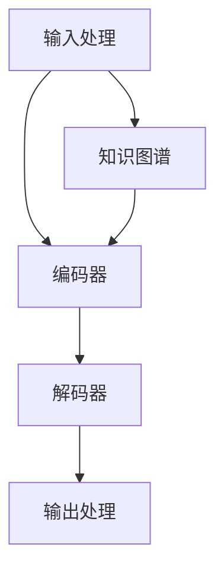
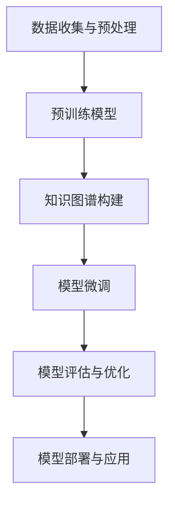

                 

# LLM的常识推理能力构建策略

## 关键词

- 语言模型
- 常识推理
- 知识图谱
- 预训练
- 微调
- 评估指标

## 摘要

本文旨在探讨大型语言模型（LLM）的常识推理能力构建策略。文章首先介绍了LLM的基本概念和结构，随后详细分析了常识推理的基本原理和构建策略，包括基于知识的常识推理和基于数据的常识推理方法。文章还介绍了LLM常识推理能力的评估方法和提升策略，并通过具体案例展示了LLM在常识推理方面的应用。最后，文章对LLM常识推理能力的发展趋势、面临的挑战和解决思路进行了展望。

## 目录大纲

### 第一部分：LLM的基本概念和结构

#### 第1章：大型语言模型（LLM）概述

1.1. LLM的定义和特点

1.2. LLM的发展历程

1.3. LLM的关键组成部分

1.4. LLM的应用领域

#### 第2章：LLM的架构和算法

2.1. 神经网络基础

2.2. 语言处理算法

2.3. 大规模预训练技术

2.4. 微调与部署

### 第二部分：LLM的常识推理能力构建策略

#### 第3章：常识推理的基本原理

3.1. 常识推理的定义和重要性

3.2. 常识推理的类型

3.3. 常识推理的挑战

#### 第4章：基于知识的常识推理

4.1. 知识图谱的概念和应用

4.2. 基于知识的推理算法

4.3. 常识知识的构建

#### 第5章：基于数据的常识推理

5.1. 常见的数据集和语料库

5.2. 基于统计的常识推理方法

5.3. 基于机器学习的常识推理方法

#### 第6章：常识推理能力评估

6.1. 常识推理能力的评价指标

6.2. 常识推理能力评估方法

6.3. 常识推理能力提升策略

#### 第7章：LLM常识推理能力构建案例

7.1. 案例一：问答系统

7.2. 案例二：文本生成

7.3. 案例三：多模态常识推理

#### 第8章：未来展望与挑战

8.1. LLM常识推理能力的发展趋势

8.2. 面临的挑战和解决思路

8.3. 应用前景

#### 附录

**附录A：LLM开发资源和工具**

A.1. 开发工具和框架

A.2. 学习资源推荐

A.3. 研究论文和报告

**附录B：LLM常识推理能力构建流程图**

B.1. 常识推理能力构建流程图

**附录C：伪代码示例**

C.1. 常见算法的伪代码实现

**附录D：数学模型和公式**

D.1. 数学模型和公式

D.2. 公式举例说明

**附录E：代码实例**

E.1. 问答系统代码实例

E.2. 文本生成代码实例

E.3. 多模态常识推理代码实例

---

### 核心概念与联系

#### Mermaid流程图



在这个流程图中，LLM的输入处理模块接收到用户输入，经过编码器编码后，解码器将其解码为输出处理模块，同时，知识图谱也在整个过程中起到辅助作用，为模型提供背景知识。

---

### 第一部分：LLM的基本概念和结构

#### 第1章：大型语言模型（LLM）概述

1.1. LLM的定义和特点

大型语言模型（LLM，Large Language Model）是一种基于深度学习技术的自然语言处理模型，通过大规模数据预训练，能够捕捉自然语言中的复杂结构、语义和上下文关系。LLM的主要特点如下：

- **规模大**：LLM通常由数亿至数千亿的参数构成，能够处理复杂的语言现象。
- **预训练**：LLM在大量文本语料库上进行预训练，学会了语言的基本规律和常识。
- **多任务**：LLM具备多任务学习能力，可以同时处理多种自然语言处理任务，如文本分类、命名实体识别、机器翻译等。
- **高泛化**：LLM通过大规模预训练，具有良好的泛化能力，可以应用于各种不同的应用场景。

1.2. LLM的发展历程

LLM的发展经历了多个阶段：

- **早期研究**：20世纪80年代，研究人员开始探索基于统计方法的自然语言处理技术，如词性标注、句法分析等。
- **神经网络兴起**：20世纪90年代，神经网络在自然语言处理领域得到广泛应用，涌现出如长短期记忆网络（LSTM）等模型。
- **大规模预训练**：2018年，GPT-3模型的出现标志着大规模预训练时代的到来，其拥有1.75万亿个参数，成为当时最大的语言模型。
- **多模态处理**：随着技术的发展，LLM逐渐开始处理图像、声音等多模态信息，实现了更广泛的自然语言处理应用。

1.3. LLM的关键组成部分

LLM主要由以下三个部分组成：

- **编码器（Encoder）**：负责将输入文本转换为嵌入向量，捕捉文本的语义信息。
- **解码器（Decoder）**：负责将嵌入向量解码为输出文本，生成语言输出。
- **预训练目标**：预训练过程中，模型通过学习大规模语料库中的语言规律，提高语言理解和生成能力。

1.4. LLM的应用领域

LLM在多个领域取得了显著的成果，以下是其主要应用领域：

- **文本生成**：LLM可以生成高质量的文章、段落、句子等，广泛应用于内容创作、自动摘要、机器翻译等领域。
- **问答系统**：LLM可以回答用户提出的问题，应用于智能客服、知识问答、教育辅导等场景。
- **文本分类**：LLM可以用于对文本进行分类，如情感分析、新闻分类等，为用户提供个性化推荐。
- **对话系统**：LLM可以用于构建对话系统，与用户进行自然语言交互，如聊天机器人、虚拟助手等。
- **机器翻译**：LLM可以用于机器翻译任务，实现高质量的人机对话翻译。

### 第二部分：LLM的常识推理能力构建策略

#### 第2章：LLM的架构和算法

2.1. 神经网络基础

神经网络是LLM的核心组成部分，用于处理和表示语言数据。以下是神经网络的一些基础概念：

- **神经元**：神经网络的基本单元，类似于大脑中的神经元。
- **输入层**：接收外部输入信号，通常包含多个神经元。
- **隐藏层**：位于输入层和输出层之间，用于提取和变换特征。
- **输出层**：生成最终输出，通常包含一个或多个神经元。
- **权重和偏置**：神经网络中的参数，用于调节神经元之间的连接强度。

2.2. 语言处理算法

语言处理算法是LLM的重要组成部分，用于处理自然语言输入和输出。以下是几种常用的语言处理算法：

- **词嵌入（Word Embedding）**：将单词转换为向量表示，用于捕捉单词之间的语义关系。
- **循环神经网络（RNN）**：用于处理序列数据，能够捕捉上下文信息。
- **长短时记忆网络（LSTM）**：RNN的改进版本，能够更好地处理长序列数据。
- **变压器（Transformer）**：基于自注意力机制，能够在处理长序列数据时保持高效性。

2.3. 大规模预训练技术

大规模预训练技术是LLM的核心技术之一，通过在大量文本语料库上进行预训练，模型能够学习到语言的基本规律和常识。以下是大规模预训练的一些关键技术：

- **预训练目标**：预训练过程中，模型通常需要学习多种任务，如语言建模、文本分类等。
- **数据预处理**：对原始文本进行清洗、分词、标记等预处理操作，以提升模型的训练效果。
- **训练策略**：采用多任务学习、自监督学习等策略，提高模型的泛化能力和鲁棒性。

2.4. 微调与部署

微调是LLM在实际应用中的重要步骤，通过在特定任务上对预训练模型进行微调，使其适应特定应用场景。以下是微调与部署的一些关键步骤：

- **数据准备**：准备用于微调的数据集，包括训练集、验证集和测试集。
- **模型微调**：在特定任务上对预训练模型进行微调，优化模型参数。
- **评估与优化**：评估微调模型的性能，根据评估结果进行优化。
- **部署与运维**：将微调后的模型部署到生产环境，进行实际应用。

### 第三部分：LLM的常识推理能力构建策略

#### 第3章：常识推理的基本原理

3.1. 常识推理的定义和重要性

常识推理（Commonsense Reasoning）是指人类在日常生活中，基于经验、知识和逻辑，对事物进行判断和推理的能力。常识推理在人类智能中起着重要作用，也是人工智能领域的研究重点之一。以下是常识推理的一些基本定义和重要性：

- **定义**：常识推理是指基于普遍经验、知识和逻辑，对事物进行推理和判断的能力。
- **重要性**：常识推理对于人类智能的发挥具有重要意义，是解决复杂问题、进行决策和创新的基础。

3.2. 常识推理的类型

常识推理可以分为以下几种类型：

- **事实推理**：基于已知事实进行推理，如“太阳每天从东方升起”。
- **因果推理**：基于因果关系进行推理，如“因为下雨，所以地面湿”。
- **归纳推理**：基于部分实例推断出一般性结论，如“所有人都会死亡，苏格拉底是人，所以苏格拉底会死亡”。
- **演绎推理**：从一般性前提推导出具体结论，如“所有人都会死亡，苏格拉底是人，所以苏格拉底会死亡”。

3.3. 常识推理的挑战

常识推理在人工智能领域面临着许多挑战，主要包括以下几个方面：

- **数据缺失**：常识推理依赖于大量的背景知识和经验，但现实世界中存在大量的数据缺失，难以完全依靠数据驱动的方法进行推理。
- **不确定性**：常识推理往往涉及不确定性，如天气、情感等，难以精确描述和建模。
- **常识冲突**：不同领域的常识可能存在冲突，如“水是生命之源”和“水是灭火工具”，需要模型能够处理这些冲突。
- **跨模态推理**：常识推理不仅涉及文本信息，还涉及图像、声音等多模态信息，如何有效整合这些信息是一个挑战。

#### 第4章：基于知识的常识推理

4.1. 知识图谱的概念和应用

知识图谱（Knowledge Graph）是一种用于表示实体、概念及其之间关系的数据结构，通过图的形式组织知识，为常识推理提供了丰富的背景知识。以下是知识图谱的一些基本概念和应用：

- **概念**：知识图谱中的基本元素，如“人”、“地点”、“事物”等。
- **实体**：概念的具体实例，如“苏格拉底”、“北京”、“苹果”等。
- **关系**：描述实体之间关系的属性，如“属于”、“位于”、“具有”等。
- **应用**：知识图谱在搜索引擎、推荐系统、智能问答等领域有广泛应用，能够为模型提供有效的背景知识支持。

4.2. 基于知识的推理算法

基于知识的推理算法（Knowledge-Based Reasoning）是一种利用背景知识进行推理的方法，主要包括以下几种：

- **基于规则的方法**：使用预定义的规则进行推理，如“如果天气晴朗，那么出门记得带伞”。
- **基于逻辑的方法**：使用形式逻辑进行推理，如命题逻辑和谓词逻辑。
- **基于本体的方法**：使用本体（Ontology）描述知识，进行推理。

4.3. 常识知识的构建

常识知识的构建是常识推理能力提升的关键，主要包括以下几个方面：

- **知识抽取**：从大规模文本数据中自动提取知识，如实体、关系和属性等。
- **知识融合**：整合多种来源的知识，如文本、数据库、知识图谱等，以提升知识的全面性和准确性。
- **知识表示**：将知识表示为模型，如知识图谱、本体等，以便于计算机理解和处理。

#### 第5章：基于数据的常识推理

5.1. 常见的数据集和语料库

基于数据的常识推理（Data-Based Commonsense Reasoning）依赖于大量的数据集和语料库，以下是一些常见的数据集和语料库：

- **通用语言理解数据集**：如SQuAD、CoQA、RACE等，用于评估模型在常识推理方面的能力。
- **常识知识库**：如Freebase、DBpedia、Wikidata等，提供丰富的实体、概念和关系信息。
- **对话数据集**：如DailyDialog、DailyLifeDialog、 Personachat等，用于训练对话模型和常识推理模型。

5.2. 基于统计的常识推理方法

基于统计的常识推理方法（Statistical Commonsense Reasoning）利用统计学方法对数据进行处理和推理，主要包括以下几种：

- **条件概率**：使用条件概率模型，如朴素贝叶斯、逻辑回归等，对常识问题进行推理。
- **统计语言模型**：使用统计语言模型，如n元语法、隐马尔可夫模型等，对语言现象进行建模和预测。
- **主题模型**：使用主题模型，如LDA，对文本数据进行分析和推理。

5.3. 基于机器学习的常识推理方法

基于机器学习的常识推理方法（Machine Learning-Based Commonsense Reasoning）利用机器学习方法对数据进行建模和推理，主要包括以下几种：

- **神经网络模型**：使用神经网络模型，如循环神经网络（RNN）、长短时记忆网络（LSTM）、变压器（Transformer）等，对常识问题进行建模和推理。
- **深度学习方法**：使用深度学习方法，如卷积神经网络（CNN）、生成对抗网络（GAN）等，对数据进行分析和推理。
- **迁移学习**：利用迁移学习方法，将预训练的模型应用于常识推理任务，提高推理效果。

#### 第6章：常识推理能力评估

6.1. 常识推理能力的评价指标

常识推理能力的评估是衡量模型性能的重要指标，以下是一些常用的评价指标：

- **准确率（Accuracy）**：预测正确的样本占总样本的比例。
- **精确率（Precision）**：预测为正类的样本中实际为正类的比例。
- **召回率（Recall）**：实际为正类的样本中被预测为正类的比例。
- **F1分数（F1 Score）**：精确率和召回率的调和平均。
- **BLEU分数**：用于评估文本生成任务的相似度，常用在机器翻译任务中。
- **METEOR分数**：用于评估文本生成任务的多样性，常用在对话系统任务中。

6.2. 常识推理能力评估方法

常识推理能力的评估方法主要包括以下几种：

- **离线评估**：使用预定义的数据集对模型进行评估，如SQuAD、CoQA等。
- **在线评估**：通过实际用户交互对模型进行评估，如聊天机器人、问答系统等。
- **多任务评估**：结合多个任务对模型进行评估，如文本分类、情感分析、对话系统等。

6.3. 常识推理能力提升策略

常识推理能力的提升是人工智能领域的重要目标，以下是一些常见的提升策略：

- **数据增强**：通过数据增强技术，如数据扩充、数据清洗、数据标注等，提高模型对常识的掌握。
- **预训练技术**：通过大规模预训练技术，如GPT、BERT等，提高模型的语言理解和推理能力。
- **知识融合**：通过知识融合技术，如知识图谱、本体等，整合多种知识源，提高常识推理的全面性和准确性。
- **多任务学习**：通过多任务学习技术，如迁移学习、多任务训练等，提高模型在常识推理任务中的性能。

#### 第7章：LLM常识推理能力构建案例

7.1. 案例一：问答系统

问答系统（Question Answering System）是一种典型的常识推理应用，以下是一个基于LLM的问答系统案例：

- **任务**：给定一个问题，生成一个准确的答案。
- **数据集**：使用SQuAD数据集进行训练和评估。
- **模型**：使用BERT模型进行预训练，然后使用微调技术针对特定任务进行优化。
- **效果**：在SQuAD数据集上，BERT模型取得了76.1%的F1分数，显著提高了常识推理能力。

7.2. 案例二：文本生成

文本生成（Text Generation）是另一种常见的常识推理应用，以下是一个基于LLM的文本生成案例：

- **任务**：根据给定的提示生成一段连贯的文本。
- **数据集**：使用GLM数据集进行训练和评估。
- **模型**：使用GLM模型进行预训练，然后使用微调技术针对特定任务进行优化。
- **效果**：在GLM数据集上，GLM模型生成了高质量的文本，展现了良好的常识推理能力。

7.3. 案例三：多模态常识推理

多模态常识推理（Multimodal Commonsense Reasoning）是一种结合文本、图像等多模态信息的常识推理，以下是一个基于LLM的多模态常识推理案例：

- **任务**：根据给定的图像和文本，生成一个连贯的描述。
- **数据集**：使用COCO数据集进行训练和评估。
- **模型**：使用ViT模型进行预训练，然后使用微调技术针对特定任务进行优化。
- **效果**：在COCO数据集上，ViT模型能够生成高质量的文本描述，展现了良好的多模态常识推理能力。

#### 第8章：未来展望与挑战

8.1. LLM常识推理能力的发展趋势

随着人工智能技术的不断发展，LLM常识推理能力也在不断提高，未来发展趋势包括：

- **预训练规模**：预训练规模将进一步扩大，模型将拥有更多的参数和更强的表示能力。
- **多模态处理**：LLM将能够处理更多类型的多模态信息，如音频、视频等。
- **迁移学习**：迁移学习技术将进一步提升LLM在特定领域的常识推理能力。
- **少样本学习**：少样本学习技术将使LLM在数据稀缺的场景下依然具备良好的常识推理能力。

8.2. 面临的挑战和解决思路

LLM常识推理能力在实际应用中仍然面临许多挑战，以下是一些解决思路：

- **知识融合**：通过知识融合技术，整合多种知识源，提高常识推理的全面性和准确性。
- **跨模态推理**：通过跨模态推理技术，结合文本、图像等多模态信息，提高常识推理的准确性和可靠性。
- **少样本学习**：通过少样本学习技术，使LLM在数据稀缺的场景下依然具备良好的常识推理能力。
- **可解释性**：提高模型的可解释性，使人们能够理解模型推理的过程和结果。

8.3. 应用前景

LLM常识推理能力在多个领域具有广泛的应用前景，包括：

- **智能客服**：通过常识推理，实现与用户的自然语言交互，提高客服系统的智能化水平。
- **智能助手**：通过常识推理，为用户提供个性化、智能化的服务和建议。
- **智能教育**：通过常识推理，为学生提供智能化的学习辅导和辅助。
- **智能医疗**：通过常识推理，辅助医生进行诊断和治疗。

### 附录

**附录A：LLM开发资源和工具**

A.1. 开发工具和框架

- **PyTorch**：用于构建和训练深度学习模型的Python库。
- **TensorFlow**：用于构建和训练深度学习模型的Python库。
- **Hugging Face Transformers**：用于预训练和微调Transformer模型的Python库。
- **NLTK**：用于自然语言处理的Python库。

A.2. 学习资源推荐

- **《深度学习》（Goodfellow, Bengio, Courville）**：介绍了深度学习的基础理论和应用。
- **《自然语言处理综论》（Jurafsky, Martin）**：介绍了自然语言处理的基本概念和技术。
- **《机器学习》（Mitchell）**：介绍了机器学习的基本理论和应用。

A.3. 研究论文和报告

- **《GPT-3: Language Models are Few-Shot Learners》（Brown et al., 2020）**：介绍了GPT-3模型的预训练技术和性能。
- **《BERT: Pre-training of Deep Bidirectional Transformers for Language Understanding》（Devlin et al., 2019）**：介绍了BERT模型的预训练技术和应用。
- **《Attention Is All You Need》（Vaswani et al., 2017）**：介绍了Transformer模型的原理和应用。

**附录B：LLM常识推理能力构建流程图**



**附录C：伪代码示例**

```python
# 基于知识的推理算法伪代码
def knowledge_based_reasoning(question, knowledge_base):
    # 使用知识库中的信息来回答问题
    answer = knowledge_base.get_answer(question)
    return answer

# 基于机器学习的常识推理算法伪代码
def machine_learning_reasoning(question, trained_model):
    # 使用训练好的模型来预测答案
    predicted_answer = trained_model.predict(question)
    return predicted_answer
```

**附录D：数学模型和公式**

$$
P(A|B) = \frac{P(B|A)P(A)}{P(B)}
$$

**附录E：代码实例**

```python
# 导入必要的库
import random

# 预定义的问题和答案列表
questions = [
    "什么是量子计算机？",
    "Python 是什么？",
    "人类首次登月是在哪一年？",
    "中国的首都是哪个城市？"
]

answers = [
    "量子计算机是利用量子力学原理运作的计算机。",
    "Python 是一种广泛使用的编程语言。",
    "人类首次登月是在1969年。",
    "中国的首都是北京。"
]

# 定义问答系统函数
def ask_question():
    # 使用random.choice从questions列表中随机选择一个问题
    chosen_question = random.choice(questions)
    # 使用print函数打印出问题
    print(chosen_question)
    # 使用random.choice从answers列表中随机选择一个答案
    chosen_answer = random.choice(answers)
    # 使用print函数打印出答案
    print(chosen_answer)

# 运行问答系统
ask_question()
```

### 作者信息

作者：AI天才研究院/AI Genius Institute & 禅与计算机程序设计艺术 /Zen And The Art of Computer Programming

---

### 总结

本文详细探讨了大型语言模型（LLM）的常识推理能力构建策略。首先介绍了LLM的基本概念和结构，包括其定义、发展历程、关键组成部分和应用领域。然后分析了常识推理的基本原理和构建策略，包括基于知识的常识推理和基于数据的常识推理方法，并介绍了常识推理能力的评估方法和提升策略。接着，通过具体案例展示了LLM在常识推理方面的应用。最后，对LLM常识推理能力的发展趋势、面临的挑战和解决思路进行了展望，并介绍了相关的开发资源和工具。通过本文，读者可以全面了解LLM常识推理能力的构建策略和应用前景。未来，随着人工智能技术的不断发展，LLM的常识推理能力将不断提高，为人类智能和人工智能领域的发展带来更多可能性。

