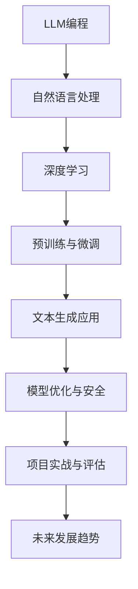
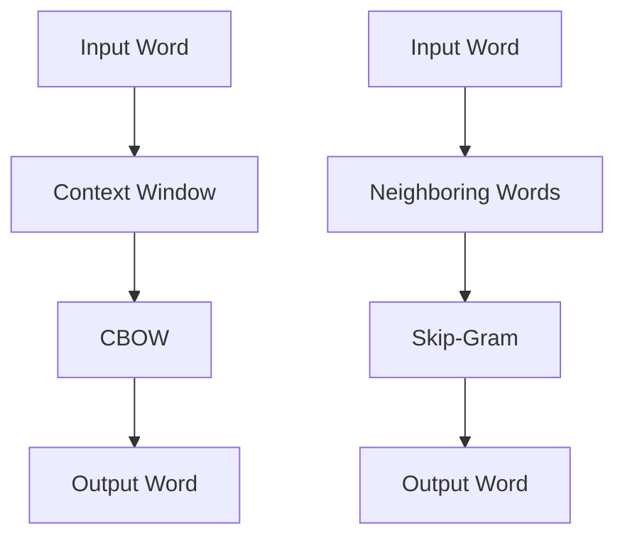

                 

### 文章标题：LLM编程：AI时代的新型语言

> **关键词：** 人工智能，自然语言处理，语言模型，深度学习，预训练，微调，文本生成，模型优化，应用实战。

> **摘要：** 本文将深入探讨LLM（语言大模型）编程，介绍其在AI时代的背景、基本原理、核心技术、应用实战以及未来发展趋势。通过对LLM编程的全面解析，帮助读者理解这一新兴领域的关键概念、算法原理，掌握其实际应用技能，并思考其未来的发展潜力。

---

### 目录大纲

#### 第一部分: LLM编程基础

- **第1章: LLM编程概述**
  - **1.1 LLM编程的背景与意义**
  - **1.2 LLM的基本原理**
  - **1.3 主流LLM架构与算法**

- **第2章: 自然语言处理基础**
  - **2.1 文本预处理技术**
  - **2.2 序列模型与注意力机制**
  - **2.3 预训练与微调技术**

- **第3章: 文本生成应用**
  - **3.1 文本生成基础**
  - **3.2 模型训练与优化**
  - **3.3 应用案例解析**

- **第4章: LLM编程优化技术**
  - **4.1 模型压缩与加速**
  - **4.2 模型安全与隐私**
  - **4.3 模型评估与调优**

- **第5章: 实战项目设计与实现**
  - **5.1 项目背景与需求分析**
  - **5.2 系统架构设计**
  - **5.3 数据预处理与模型选择**
  - **5.4 模型训练与优化**
  - **5.5 系统集成与部署**
  - **5.6 项目评估与优化**

- **第6章: LLM编程的未来发展趋势**
  - **6.1 多模态融合**
  - **6.2 生成对抗网络（GAN）**
  - **6.3 人工智能与伦理**

- **第7章: 附录与资源**
  - **7.1 LLM编程工具与资源**
  - **7.2 开源深度学习框架**
  - **7.3 LLM编程参考资料**

#### 核心概念与联系

以下是一个简化的 Mermaid 流程图，展示了 LLM 编程的核心概念及其相互联系：



---

在接下来的章节中，我们将逐步深入探讨 LLM 编程的各个方面，从基础概念到应用实战，再到未来发展趋势，帮助您全面了解这一前沿领域。

### 第一部分: LLM编程基础

#### 第1章: LLM编程概述

**1.1 LLM编程的背景与意义**

在人工智能（AI）的快速发展中，自然语言处理（NLP）一直是备受关注的一个重要分支。随着深度学习技术的逐渐成熟，语言模型（Language Model，简称LLM）成为了NLP领域的核心技术之一。LLM编程，即基于语言模型进行编程，已成为AI时代的新型语言，逐渐改变了人们对于编程和软件开发的传统认知。

**1.1.1 AI时代的变革**

AI时代的到来，标志着计算机技术从传统的计算、数据处理走向智能化、自动化。在这一过程中，AI技术在各个领域的应用不断拓展，如自动驾驶、智能语音助手、机器翻译、金融风控等。其中，自然语言处理作为AI的重要组成部分，其应用场景和需求也在日益增长。

**1.1.2 LLM的定义与特点**

LLM是一种基于深度学习技术的大型神经网络模型，用于对自然语言进行建模和生成。与传统的方法相比，LLM具有以下几个显著特点：

1. **大规模数据训练**：LLM通常基于大规模语料库进行训练，通过海量数据的积累，使得模型能够更好地捕捉语言规律和模式。
2. **端到端建模**：LLM采用端到端的学习方式，直接从原始文本数据中学习，不需要复杂的特征工程，降低了模型设计的复杂性。
3. **自适应性和泛化能力**：LLM通过预训练和微调，能够适应各种不同的应用场景，具有较强的泛化能力。

**1.1.3 LLM编程的挑战与机遇**

虽然LLM编程具有诸多优势，但在实际应用中仍面临一些挑战和机遇：

1. **计算资源需求**：训练和部署LLM需要大量的计算资源，这对于一些小型企业和个人开发者来说可能是一个障碍。
2. **数据隐私与安全**：大规模的数据训练和模型部署涉及到用户隐私和数据安全的问题，需要采取有效的措施进行保障。
3. **模型可解释性**：深度学习模型，尤其是LLM，通常被视为“黑箱”，其决策过程难以解释，这在某些应用场景中可能成为一个挑战。

然而，随着技术的不断进步和研究的深入，这些挑战正逐渐得到解决。LLM编程所带来的机遇也日益显现，如提高软件开发效率、拓展应用场景、推动智能化的进一步发展等。

**1.2 LLM的基本原理**

LLM的基本原理主要涉及深度学习技术和自然语言处理方法。以下是对这些核心概念的基本介绍：

**1.2.1 语言模型的发展历程**

语言模型的发展可以分为三个阶段：

1. **基于规则的方法**：早期的研究主要依赖于人工编写的规则和模式，如正则表达式、词法分析器等。这种方法虽然在一定程度上能够处理简单的语言现象，但在处理复杂语言时效果有限。
2. **基于统计的方法**：随着语料库的积累和计算能力的提升，研究者开始采用统计方法，如N元语法、隐马尔可夫模型（HMM）等。这些方法通过统计语言中的模式来预测下一个词或句子，取得了显著的进展。
3. **基于深度学习的方法**：深度学习技术的出现，使得语言模型的性能有了质的飞跃。尤其是序列模型（如循环神经网络RNN、长短时记忆网络LSTM）和注意力机制的应用，使得模型能够更好地捕捉语言中的长距离依赖关系。

**1.2.2 语言模型的构成要素**

一个典型的LLM通常由以下几个部分构成：

1. **输入层**：接收原始的文本数据，并将其转换为模型可以处理的向量形式。这一过程通常涉及文本预处理技术，如分词、词嵌入等。
2. **隐藏层**：包含一个或多个隐藏层，通过深度神经网络的结构，对输入向量进行逐层变换和抽象，提取出更高层次的语言特征。
3. **输出层**：将隐藏层的输出转换为预测结果，如下一个词的概率分布或生成的文本序列。这一过程通常涉及复杂的激活函数和损失函数，如softmax、交叉熵等。

**1.2.3 语言模型的训练过程**

LLM的训练过程通常包括以下几个步骤：

1. **数据预处理**：对原始文本数据进行分词、去噪、标准化等预处理操作，以提高模型的训练效果。
2. **模型初始化**：初始化模型的权重参数，通常使用随机初始化或预训练模型的方法。
3. **前向传播**：将输入数据通过模型的前向传播过程，得到输出结果。这一过程中，模型会根据输入数据和预定的损失函数，计算输出结果与真实标签之间的差距。
4. **反向传播**：根据前向传播得到的损失函数，使用反向传播算法更新模型的权重参数，以减小损失函数的值。
5. **迭代优化**：重复前向传播和反向传播的过程，直到模型达到预定的训练目标或收敛条件。

**1.3 主流LLM架构与算法**

目前，主流的LLM架构主要包括GPT系列模型、BERT及其变体以及其他知名LLM。以下是对这些模型的基本介绍：

**1.3.1 GPT系列模型**

GPT（Generative Pre-trained Transformer）是由OpenAI提出的一系列基于Transformer架构的预训练语言模型。GPT-1、GPT-2、GPT-3等模型在NLP任务中取得了显著的性能提升。其中，GPT-3拥有1750亿个参数，成为目前最大的语言模型。

**1.3.2 BERT及其变体**

BERT（Bidirectional Encoder Representations from Transformers）是由Google提出的一种双向Transformer架构的预训练语言模型。BERT通过在双向Transformer的基础上进行预训练，能够更好地捕捉语言中的长距离依赖关系。BERT及其变体（如RoBERTa、ALBERT等）在多种NLP任务中取得了领先的性能。

**1.3.3 其他知名LLM介绍**

除了GPT和BERT，还有一些其他知名的LLM，如：

- **XLNet**：由Google提出的一种基于Transformer的预训练语言模型，其在BERT的基础上引入了新的注意力机制和损失函数，取得了很好的性能。
- **T5（Text-to-Text Transfer Transformer）**：由DeepMind提出的一种端到端的文本转换模型，T5通过将所有NLP任务转化为文本到文本的转换任务，实现了高效的模型复用。

**总结**

LLM编程作为AI时代的新型语言，正逐步改变着编程和软件开发的传统模式。通过对LLM的基本原理、发展历程、构成要素和主流模型的介绍，读者可以初步了解LLM编程的核心内容。在接下来的章节中，我们将进一步探讨自然语言处理基础、LLM编程核心技术以及实际应用，帮助读者深入掌握这一领域。

### 第二部分: 自然语言处理基础

自然语言处理（NLP）是人工智能（AI）的一个重要分支，旨在使计算机能够理解、生成和处理人类语言。在LLM编程中，NLP技术是基础，它为LLM的输入和输出提供了必要的预处理和后处理手段。本章节将详细介绍NLP的基础知识，包括文本预处理技术、序列模型与注意力机制、以及预训练与微调技术。

#### 2.1 文本预处理技术

文本预处理是NLP任务的第一步，其目的是将原始的文本数据转换为适合模型处理的形式。文本预处理通常包括以下几个步骤：

**2.1.1 词嵌入技术**

词嵌入（Word Embedding）是将词汇映射到高维向量空间的过程，使得语义相似的词语在向量空间中接近。常见的词嵌入技术包括：

- **Word2Vec**：Word2Vec是一种基于神经网络的词嵌入技术，它通过训练神经网络来预测相邻词语的联合概率分布，从而获得词向量。Word2Vec主要有两种模型：Continuous Bag-of-Words (CBOW)和Skip-Gram。



- **GloVe**：GloVe（Global Vectors for Word Representation）是一种基于全局统计的词嵌入技术，通过计算词语的共现矩阵来学习词向量。GloVe的核心思想是利用全局的词频统计信息，而不是仅仅依赖于局部窗口的上下文。

**2.1.2 分词与词性标注**

分词（Tokenization）是将文本分割成词语或其他有意义的基本单元的过程。常见的分词技术包括：

- **基于规则的分词**：基于一套预定义的规则，如正则表达式，进行分词。这种方法简单但效果有限。
- **基于统计的分词**：通过统计方法，如最大熵模型、条件随机场（CRF），进行分词。这种方法能够更好地处理复杂语言中的分词问题。

词性标注（Part-of-Speech Tagging）是对文本中的每个词进行词性分类的过程。常见的词性标注任务包括名词、动词、形容词等的分类。词性标注有助于提高NLP任务的性能，如命名实体识别、情感分析等。

**2.1.3 偏义消歧与命名实体识别**

偏义消歧（Semantic Disambiguation）是指根据上下文确定词语的具体意义。在自然语言中，同一个词语可能有多种意义，如“bank”可以指银行或河岸。偏义消歧的目标是确定词语在特定上下文中的意义。

命名实体识别（Named Entity Recognition，NER）是指识别文本中的特定实体，如人名、地名、组织名等。NER是信息提取的重要任务，对于知识图谱构建、问答系统等应用具有重要意义。

#### 2.2 序列模型与注意力机制

序列模型（Sequential Models）是处理序列数据（如文本、语音）的常见方法，能够捕捉序列中的时间依赖关系。以下是一些重要的序列模型和注意力机制：

**2.2.1 RNN与LSTM**

循环神经网络（Recurrent Neural Network，RNN）是一种用于处理序列数据的神经网络，其核心思想是将当前输入与历史状态进行结合，从而捕捉时间依赖关系。然而，传统的RNN在处理长序列时存在梯度消失或爆炸的问题。

为了解决这一问题，长短期记忆网络（Long Short-Term Memory，LSTM）被提出。LSTM通过引入门机制，能够在长期依赖关系中保持有效的信息传递。LSTM的三个门分别是：遗忘门、输入门和输出门，用于控制信息的保留和更新。

**2.2.2 Transformer架构**

Transformer是由Google提出的一种基于自注意力机制的序列模型，彻底改变了NLP领域。与传统的RNN和LSTM相比，Transformer采用了一种全新的架构，通过自注意力机制（Self-Attention）和多头注意力（Multi-Head Attention），能够捕捉序列中的长距离依赖关系。

自注意力机制允许模型在生成每个词时，动态地关注序列中的其他词。多头注意力进一步将自注意力机制扩展到多个独立但共享参数的注意力头，从而提高了模型的表示能力。

**2.2.3 注意力机制**

注意力机制（Attention Mechanism）是一种在序列模型中广泛应用的机制，用于动态地调整模型在处理序列数据时的关注点。注意力机制的基本思想是，在生成每个词时，模型需要根据当前词和上下文信息，动态地计算一个权重向量，然后将权重向量与输入序列中的每个词相乘，从而加权地关注重要信息。

#### 2.3 预训练与微调技术

预训练（Pre-training）是一种在特定数据集上预先训练深度神经网络的方法，然后在特定任务上进行微调（Fine-tuning）。预训练和微调技术在NLP中具有重要意义：

**2.3.1 预训练方法**

预训练方法主要包括两种：

- **基于语言的预训练**：这种方法通过在大规模文本语料库上进行预训练，使得模型能够捕捉到语言中的通用特征。常见的任务包括下一个单词预测、 masked 语言模型等。
- **基于任务的预训练**：这种方法通过在特定任务数据集上进行预训练，使得模型能够针对特定任务进行优化。例如，在问答数据集上进行预训练，可以提升模型在问答任务上的性能。

**2.3.2 微调技术**

微调是指将预训练模型应用于特定任务，并在任务数据上进行进一步的训练。微调的主要目标是调整模型在特定任务上的参数，以提高任务性能。微调通常涉及以下几个步骤：

1. **任务定义**：定义特定任务的输入和输出格式，如文本分类、机器翻译等。
2. **模型初始化**：使用预训练模型作为初始化，这样可以利用预训练模型在通用特征上的优势。
3. **训练过程**：在特定任务数据上对模型进行训练，同时调整模型的参数，以提高任务性能。
4. **评估与优化**：在训练过程中，使用验证集对模型进行评估，并根据评估结果调整训练策略，如学习率、正则化等。

**2.3.3 大规模数据集的选择与处理**

大规模数据集是预训练和微调成功的关键因素之一。以下是一些常见的大型数据集：

- **维基百科（WikiText-2）**：是一个包含约40万个单词的文本语料库，广泛用于语言模型的预训练。
- **谷歌新闻（Google News）**：是一个包含超过1000万篇文章的语料库，用于预训练大型语言模型。
- **GLUE（General Language Understanding Evaluation）**：是一个包含多个自然语言处理任务的公共基准数据集，用于评估和比较不同模型的性能。

在处理大规模数据集时，需要注意以下几个问题：

- **数据预处理**：对文本进行清洗、去噪、标准化等预处理操作，以提高模型训练效果。
- **数据增强**：通过增加数据多样性、引入噪声等方法，增强模型的泛化能力。
- **数据平衡**：对于分类任务，确保训练数据中各个类别的样本数量均衡，以避免模型偏向某些类别。

**总结**

自然语言处理基础是LLM编程不可或缺的一部分，涵盖了文本预处理技术、序列模型与注意力机制、以及预训练与微调技术。通过这些技术，模型能够更好地理解和生成自然语言，从而在实际应用中发挥重要作用。在接下来的章节中，我们将进一步探讨LLM编程的核心技术和实际应用，帮助读者深入掌握这一领域。

### 第三部分: LLM编程应用实战

#### 第3章: 文本生成应用

文本生成是LLM编程的重要应用之一，它能够自动生成高质量的自然语言文本，广泛应用于内容创作、对话系统、摘要生成等多个领域。本章节将详细介绍文本生成的原理、模型训练与优化方法，并通过具体案例展示其实际应用。

#### 3.1 文本生成基础

**3.1.1 生成文本的原理**

文本生成的基本原理是基于语言模型（LLM）的概率生成。语言模型通过对大量文本数据进行学习，能够预测下一个词的概率分布，从而生成新的文本。具体来说，文本生成的过程可以分为以下几个步骤：

1. **输入文本编码**：将输入文本编码为模型能够处理的向量形式。这一步骤通常涉及分词、词嵌入等预处理技术。
2. **生成词序列**：利用语言模型生成下一个词的概率分布，从中随机抽取一个词作为生成的下一个词。
3. **重复步骤**：重复步骤2，生成一系列词，直到满足预设的生成长度或终止条件。

**3.1.2 生成文本的评估指标**

生成文本的质量是衡量文本生成模型性能的关键指标。以下是一些常见的评估指标：

- **Perplexity**：衡量模型生成文本的准确度。Perplexity值越小，表示模型生成文本的能力越强。
- **BLEU**：基于精确匹配的评估指标，通过比较生成文本和参考文本的匹配程度来评估生成质量。
- **ROUGE**：衡量生成文本的覆盖度，包括词汇覆盖和词序覆盖。

**3.1.3 生成文本的实际应用**

文本生成技术在实际应用中具有广泛的应用场景，以下是一些典型的应用案例：

- **内容创作**：自动生成文章、博客、故事等，提高内容创作效率。
- **对话系统**：为聊天机器人、虚拟助手等提供自然的对话回复，提升用户体验。
- **摘要生成**：自动生成文章、报告的摘要，帮助用户快速获取关键信息。

#### 3.2 模型训练与优化

**3.2.1 训练数据集的准备**

训练文本生成模型需要大量的高质量文本数据。以下是一些常用的数据集：

- **公共数据集**：如维基百科、新闻文章、社交媒体文本等，这些数据集通常已经进行了预处理，可以直接用于模型训练。
- **自定义数据集**：根据特定应用需求，自行收集和整理数据集。例如，对话系统的训练数据集可以包括用户查询和历史回复。

**3.2.2 训练过程与超参数调整**

训练文本生成模型通常涉及以下步骤：

1. **数据预处理**：对文本数据进行分词、去噪、标准化等预处理操作。
2. **模型初始化**：初始化模型的权重参数，可以选择随机初始化或使用预训练模型。
3. **前向传播**：将输入文本编码后输入模型，得到输出词的概率分布。
4. **反向传播**：计算输出词的概率分布与真实标签之间的差距，使用损失函数（如交叉熵）计算损失。
5. **权重更新**：使用梯度下降算法等优化方法更新模型权重，以减小损失。

超参数调整是训练过程中的重要环节，以下是一些常见的超参数及其调整方法：

- **学习率**：控制梯度下降的步长，通常采用递减学习率策略。
- **批次大小**：控制每次更新权重时所使用的样本数量。
- **迭代次数**：控制训练过程的总迭代次数或停止条件。

**3.2.3 优化策略与实践**

为了提高文本生成模型的性能，可以采用以下优化策略：

- **对抗训练**：通过对抗样本的训练，提高模型对异常数据的鲁棒性。
- **数据增强**：通过添加噪声、改变词序等方法，增加训练数据的多样性。
- **多任务学习**：结合多个相关任务进行训练，提高模型的泛化能力。

#### 3.3 应用案例解析

以下是一些文本生成应用的实例，展示了如何使用LLM进行实际开发。

**3.3.1 文本摘要生成**

文本摘要生成是指从长文本中提取关键信息，生成简洁、准确的摘要。以下是一个基于GPT-2的文本摘要生成案例：

1. **环境搭建**：安装Python、PyTorch和Hugging Face的Transformers库。
2. **数据准备**：收集和处理大量新闻文章和其对应的摘要。
3. **模型训练**：使用GPT-2模型对新闻文章进行预训练。
4. **摘要生成**：输入长文本，使用训练好的GPT-2模型生成摘要。

```python
from transformers import GPT2LMHeadModel, GPT2Tokenizer

# 加载预训练模型和分词器
model = GPT2LMHeadModel.from_pretrained("gpt2")
tokenizer = GPT2Tokenizer.from_pretrained("gpt2")

# 输入文本
input_text = "本文介绍了文本摘要生成的方法和原理。"

# 分词并编码
inputs = tokenizer.encode(input_text, return_tensors="pt")

# 生成摘要
outputs = model.generate(inputs, max_length=50, num_return_sequences=1)

# 解码并输出生成的文本
generated_summary = tokenizer.decode(outputs[0], skip_special_tokens=True)
print(generated_summary)
```

**3.3.2 文本生成与风格迁移**

文本生成与风格迁移是指生成具有特定风格或格式的文本。以下是一个基于GPT-2的文本生成与风格迁移案例：

1. **环境搭建**：安装Python、PyTorch和Hugging Face的Transformers库。
2. **数据准备**：收集不同风格的文章，如诗歌、新闻报道、科技文章等。
3. **模型训练**：使用GPT-2模型对不同风格的文章进行预训练。
4. **风格迁移**：输入文本，使用训练好的GPT-2模型生成具有特定风格的文本。

```python
from transformers import GPT2LMHeadModel, GPT2Tokenizer

# 加载预训练模型和分词器
model = GPT2LMHeadModel.from_pretrained("gpt2")
tokenizer = GPT2Tokenizer.from_pretrained("gpt2")

# 输入文本
input_text = "请你写一段古诗。"

# 分词并编码
inputs = tokenizer.encode(input_text, return_tensors="pt")

# 生成古诗
outputs = model.generate(inputs, max_length=50, num_return_sequences=1)

# 解码并输出生成的文本
generated_poem = tokenizer.decode(outputs[0], skip_special_tokens=True)
print(generated_poem)
```

**3.3.3 文本问答系统**

文本问答系统是指从大量文本中检索并生成答案的系统。以下是一个基于BERT的文本问答系统案例：

1. **环境搭建**：安装Python、PyTorch和Hugging Face的Transformers库。
2. **数据准备**：收集问答对数据，如SQuAD、CoQA等。
3. **模型训练**：使用BERT模型对问答对数据集进行预训练。
4. **问答系统**：输入问题，使用训练好的BERT模型生成答案。

```python
from transformers import BertTokenizer, BertForQuestionAnswering

# 加载预训练模型和分词器
tokenizer = BertTokenizer.from_pretrained("bert-base-uncased")
model = BertForQuestionAnswering.from_pretrained("bert-base-uncased")

# 输入文本和问题
context = "本文介绍了文本生成的方法和原理。"
question = "文本生成的方法是什么？"

# 分词并编码
inputs = tokenizer.encode_plus(context, question, return_tensors="pt")

# 生成答案
outputs = model(inputs)

# 解码并输出答案
start_logits = outputs.start_logits
end_logits = outputs.end_logits
answer_scores = torch.stack((start_logits, end_logits), dim=-1)
top_scores, top_answers = answer_scores.topk(1)

# 解析答案
start_index = top_answers[0, 0].item()
end_index = top_answers[0, 1].item()
answer = tokenizer.decode(context[start_index:end_index+1])
print(answer)
```

**总结**

文本生成是LLM编程的重要应用之一，通过训练大型语言模型，可以自动生成高质量的自然语言文本。本章节介绍了文本生成的原理、模型训练与优化方法，并通过具体案例展示了其实际应用。在接下来的章节中，我们将进一步探讨LLM编程的优化技术、项目实战以及未来发展趋势。

### 第四部分: LLM编程优化技术

#### 第4章: LLM编程优化技术

随着深度学习技术的不断发展，语言模型（LLM）的规模和复杂度也在不断增加。然而，大规模LLM的训练和部署面临着计算资源、存储空间和模型效率等方面的挑战。为了应对这些挑战，LLM编程领域涌现出了一系列优化技术。本章节将详细介绍LLM编程优化技术，包括模型压缩与加速、模型安全与隐私以及模型评估与调优。

#### 4.1 模型压缩与加速

**4.1.1 参数剪枝**

参数剪枝是一种通过减少模型参数数量来降低模型复杂度和计算成本的技术。剪枝过程包括以下步骤：

1. **权重量化**：对模型的权重进行量化，将高精度的浮点数权重转换为较低精度的整数权重，从而减少存储和计算需求。
2. **剪枝策略**：根据设定的剪枝策略，如层次剪枝、结构剪枝等，移除一些不重要的权重参数。
3. **权重恢复**：在训练过程中，通过引入额外的权重参数或使用迭代方法，恢复剪枝前模型的性能。

**4.1.2 知识蒸馏**

知识蒸馏（Knowledge Distillation）是一种将大型教师模型的知识传递给小型学生模型的方法。知识蒸馏的过程包括以下步骤：

1. **教师模型训练**：使用大量数据训练一个大型教师模型，使其达到较高的性能。
2. **学生模型初始化**：使用教师模型的参数初始化一个小型的学生模型。
3. **知识传递**：通过软标签（soft label）的方式，将教师模型的输出传递给学生模型，使学生模型能够学习到教师模型的知识。

**4.1.3 迁移学习与模型复用**

迁移学习（Transfer Learning）是一种利用预训练模型在新的任务上取得高性能的方法。迁移学习的步骤包括：

1. **预训练模型选择**：选择一个在相关任务上预训练的大型模型作为迁移基础。
2. **模型微调**：在新的任务数据上对预训练模型进行微调，调整模型的参数以适应新的任务。
3. **模型复用**：将预训练模型的部分或全部结构应用于新的任务，以提高模型的性能和效率。

**4.2 模型安全与隐私**

**4.2.1 模型攻击与防御**

模型安全与隐私是LLM编程中不可忽视的问题。模型攻击和防御是保护模型安全和隐私的重要手段：

1. **模型攻击**：包括对抗攻击、隐私泄露攻击等，旨在通过输入微小扰动，导致模型输出错误或泄露敏感信息。
2. **模型防御**：包括对抗训练、差分隐私、模型加密等技术，旨在提高模型的鲁棒性和隐私保护能力。

**4.2.2 数据隐私保护技术**

数据隐私保护技术旨在确保训练数据的安全和隐私，包括以下方法：

1. **差分隐私**：通过添加噪声或限制输出范围，确保单个数据点的隐私，从而避免隐私泄露。
2. **加密技术**：使用加密算法对训练数据进行加密，确保数据在传输和存储过程中的安全性。
3. **同态加密**：允许在加密数据上进行计算，从而保护数据的隐私。

**4.2.3 模型可解释性**

模型可解释性是指能够解释模型决策过程的能力。提高模型可解释性有助于增强模型的透明度和可信度，包括以下方法：

1. **可视化技术**：通过可视化模型的结构和权重，帮助用户理解模型的决策过程。
2. **解释算法**：如LIME、SHAP等，通过局部解释方法，为特定输入提供解释。
3. **规则提取**：从训练好的模型中提取规则或决策树，以简化模型结构，提高可解释性。

**4.3 模型评估与调优**

**4.3.1 评估指标与评测集**

模型评估是评估模型性能的重要步骤。以下是一些常见的评估指标和评测集：

1. **Perplexity**：衡量模型生成文本的准确度，Perplexity值越小，表示模型性能越好。
2. **BLEU**：基于精确匹配的评估指标，通过比较生成文本和参考文本的匹配程度来评估生成质量。
3. **ROUGE**：衡量生成文本的覆盖度，包括词汇覆盖和词序覆盖。
4. **GLUE**：是一个包含多个自然语言处理任务的公共基准数据集，用于评估和比较不同模型的性能。

**4.3.2 模型调优策略**

模型调优是提高模型性能的关键步骤。以下是一些常见的调优策略：

1. **超参数调整**：通过调整学习率、批次大小、迭代次数等超参数，优化模型的训练过程。
2. **数据增强**：通过添加噪声、改变词序等方法，增加训练数据的多样性，提高模型的泛化能力。
3. **多任务学习**：结合多个相关任务进行训练，提高模型的泛化能力和性能。
4. **模型融合**：通过融合多个模型的预测结果，提高模型的综合性能。

**总结**

LLM编程优化技术是提高模型性能和效率的关键。本章节介绍了模型压缩与加速、模型安全与隐私以及模型评估与调优等优化技术。通过这些技术，可以有效地应对大规模LLM训练和部署的挑战，提高模型的性能和可靠性。在接下来的章节中，我们将通过具体的实战项目，展示如何应用这些优化技术，解决实际问题。

### 第五部分: LLM编程项目实战

#### 第5章: 实战项目设计与实现

本章节将通过一个完整的LLM编程项目，展示如何从项目背景与需求分析，到系统架构设计，再到数据预处理与模型选择，最终实现模型训练与优化，以及系统的集成与部署。通过这个实战项目，读者可以深入了解LLM编程的实际应用过程，并掌握关键技术和步骤。

#### 5.1 项目背景与需求分析

项目名称：智能问答系统

项目背景：随着互联网和人工智能技术的普及，用户对智能问答系统的需求日益增长。智能问答系统能够自动回答用户的问题，提供高效、准确的解答，广泛应用于客服、教育、医疗等领域。本项目旨在设计并实现一个基于LLM的智能问答系统，以提高问答的准确性和效率。

项目需求：

1. **问题理解**：系统能够理解用户的自然语言问题，提取关键信息。
2. **答案生成**：系统能够根据问题理解和已有的知识库，生成准确、自然的答案。
3. **用户交互**：系统需要提供友好的用户界面，支持用户提问和查看答案。
4. **实时性**：系统需要具备快速响应用户问题的能力，提高用户体验。

#### 5.2 系统架构设计

智能问答系统的架构设计主要包括前端、后端和数据库三个部分。

**5.2.1 前端设计**

前端负责用户界面的展示和用户交互。前端设计包括以下模块：

- **首页**：展示问答系统的介绍和功能引导。
- **提问页面**：提供输入框和提交按钮，供用户输入问题。
- **答案展示页**：展示系统生成的答案，并支持用户反馈。

**5.2.2 后端设计**

后端负责处理用户请求、问题理解和答案生成等核心功能。后端设计包括以下模块：

- **API服务**：接收前端发送的请求，调用后端服务处理问题。
- **模型服务**：加载预训练的LLM模型，进行问题理解和答案生成。
- **数据库服务**：存储问题和答案数据，支持数据检索和更新。

**5.2.3 数据库设计**

数据库用于存储用户问题和答案数据，设计包括以下表：

- **问题表**：存储用户提出的问题及其相关信息。
- **答案表**：存储系统生成的答案及其相关信息。

#### 5.3 数据预处理与模型选择

**5.3.1 数据预处理**

数据预处理是确保模型训练质量的关键步骤。预处理过程包括以下任务：

1. **数据清洗**：去除数据中的噪声和冗余信息，如HTML标签、特殊字符等。
2. **数据分词**：将文本数据分割成词语或字符序列。
3. **词嵌入**：将词语映射为高维向量表示，使用预训练的词嵌入模型，如GloVe或Word2Vec。

**5.3.2 模型选择**

选择合适的模型是确保系统性能的关键。本项目选择以下模型：

- **BERT**：一种基于Transformer的双向编码器模型，具有强大的语言理解能力。
- **GPT-2**：一种基于Transformer的生成模型，适用于文本生成任务。

#### 5.4 模型训练与优化

**5.4.1 训练过程**

模型训练过程包括以下步骤：

1. **数据集划分**：将数据集划分为训练集、验证集和测试集，用于模型的训练、验证和评估。
2. **模型初始化**：初始化BERT和GPT-2模型的权重参数，使用预训练模型作为初始化。
3. **前向传播**：将输入数据（问题）通过模型的前向传播，生成答案的概率分布。
4. **反向传播**：计算损失函数，使用反向传播算法更新模型权重。
5. **迭代优化**：重复前向传播和反向传播的过程，直至模型达到预定的训练目标或收敛条件。

**5.4.2 优化策略**

为了提高模型性能，可以采用以下优化策略：

1. **数据增强**：通过添加噪声、改变词序等方法，增加训练数据的多样性。
2. **多任务学习**：结合多个相关任务进行训练，提高模型的泛化能力。
3. **模型融合**：通过融合BERT和GPT-2的预测结果，提高系统的综合性能。

#### 5.5 系统集成与部署

**5.5.1 系统集成**

系统集成是将前端、后端和数据库各部分整合为一个完整系统的过程。集成步骤包括：

1. **接口定义**：定义前后端交互的API接口，确保数据的正确传递和响应。
2. **服务部署**：将后端服务部署到服务器，确保系统的高可用性和性能。
3. **前端展示**：将前端页面部署到Web服务器，实现用户界面的展示和交互。

**5.5.2 部署方案**

部署方案包括以下内容：

1. **服务器选择**：选择适合的云服务器，如阿里云、腾讯云等，确保系统的稳定运行。
2. **服务器配置**：配置服务器资源，如CPU、内存、磁盘等，以满足模型训练和系统运行的需求。
3. **监控与维护**：配置监控系统，实时监控服务器性能和系统运行状态，确保系统的安全性和稳定性。

#### 5.6 项目评估与优化

**5.6.1 项目评估**

项目评估是通过评估指标和评测集对系统性能进行评估的过程。评估步骤包括：

1. **指标计算**：计算Perplexity、BLEU、ROUGE等评估指标，评估模型生成文本的质量。
2. **评测集测试**：使用独立的评测集测试模型性能，确保评估结果的客观性和公正性。
3. **用户反馈**：收集用户对系统的反馈，评估系统的用户体验和满意度。

**5.6.2 优化建议**

根据项目评估结果，可以提出以下优化建议：

1. **模型优化**：调整模型结构、超参数等，提高模型性能。
2. **数据增强**：增加训练数据的多样性，提高模型的泛化能力。
3. **用户界面改进**：优化用户界面，提高用户体验。

**总结**

本章节通过一个智能问答系统的实战项目，详细介绍了LLM编程项目的设计与实现过程。通过项目背景与需求分析、系统架构设计、数据预处理与模型选择、模型训练与优化、系统集成与部署，以及项目评估与优化，读者可以全面了解LLM编程在实际应用中的具体步骤和关键要点。通过这个实战项目，读者可以掌握LLM编程的核心技术和实战经验，为后续的深入研究奠定基础。

### 第六部分: LLM编程的未来发展趋势

#### 第6章: LLM编程的新趋势

随着人工智能技术的快速发展，LLM编程正面临着一系列新的发展趋势，这些趋势不仅推动了NLP领域的进步，也为其他相关领域带来了新的机遇和挑战。本章节将探讨LLM编程在多模态融合、生成对抗网络（GAN）以及人工智能与伦理等方面的新趋势。

#### 6.1 多模态融合

多模态融合是指将不同类型的数据（如文本、图像、音频）进行整合，以提高模型的表示能力和应用效果。在LLM编程中，多模态融合正成为一个重要的研究方向。

**6.1.1 文本与图像的融合**

文本与图像的融合可以显著提升模型的表示能力，特别是在需要同时处理视觉信息和文本信息的应用场景中。以下是一些具体的应用：

- **图像描述生成**：使用文本生成模型，如GPT-2，根据图像生成相应的描述。
- **图像问答系统**：结合图像和文本数据，使系统能够回答与图像相关的文本问题。
- **视觉文本检索**：通过融合图像和文本数据，实现基于图像的文本检索和基于文本的图像检索。

**6.1.2 文本与音频的融合**

文本与音频的融合可以应用于语音识别、语音合成和语音增强等领域。以下是一些具体的应用：

- **语音识别**：结合文本数据和音频数据，提高语音识别的准确性和鲁棒性。
- **语音生成**：通过文本生成模型生成自然流畅的语音，实现文本到语音的转换。
- **语音增强**：结合文本数据和音频数据，提高语音信号的清晰度和可理解性。

**6.1.3 多模态融合模型**

多模态融合模型是通过将不同类型的数据进行整合，共同训练一个统一的模型，以实现多模态任务。以下是一些常见的方法：

- **联合编码器**：将文本、图像和音频数据分别编码为向量，然后通过联合编码器进行融合，生成多模态表示。
- **多任务学习**：在一个模型中同时学习多个模态的任务，如文本分类、图像分类和语音分类。
- **多模态注意力机制**：通过注意力机制，使模型能够在不同模态数据之间进行动态选择和融合。

#### 6.2 生成对抗网络（GAN）

生成对抗网络（GAN）是由Ian Goodfellow等人于2014年提出的一种深度学习框架，旨在通过对抗训练生成高质量的数据。GAN在LLM编程中也展现出了巨大的潜力。

**6.2.1 GAN的基本原理**

GAN由两个主要组件构成：生成器（Generator）和判别器（Discriminator）。生成器的任务是生成与真实数据几乎无法区分的假数据，而判别器的任务是区分真实数据和假数据。GAN的训练过程是通过对抗训练实现的，具体步骤如下：

1. **生成器生成假数据**：生成器根据噪声数据生成假数据。
2. **判别器评估**：判别器对生成器和真实数据进行评估，判断其真实或假。
3. **损失函数优化**：通过优化生成器和判别器的损失函数，提高生成器生成假数据的真实性和判别器区分真实和假数据的准确性。

**6.2.2 GAN在LLM编程中的应用**

GAN在LLM编程中的应用主要包括以下几个方面：

- **文本生成**：GAN可以用于生成高质量的文本，通过对抗训练生成自然流畅的文本序列。
- **文本增强**：GAN可以用于增强文本数据，通过生成与原始文本相似的伪文本，增加训练数据的多样性。
- **文本风格迁移**：GAN可以用于文本风格迁移，将一种风格文本转换为另一种风格文本，如将普通文本转换为诗意文本。

**6.2.3 GAN的挑战与优化**

GAN在应用中面临一些挑战，如训练不稳定、模式崩溃等问题。以下是一些常见的优化方法：

- **改进损失函数**：通过设计更加合理的损失函数，提高生成器和判别器的训练稳定性。
- **正则化技术**：引入正则化技术，如梯度惩罚、谱归一化等，防止模型过拟合。
- **混合GAN架构**：结合不同的GAN架构，如条件GAN（cGAN）、循环GAN（cGAN）、多尺度GAN（MSGAN）等，提高模型的生成能力和稳定性。

#### 6.3 人工智能与伦理

人工智能技术的发展不仅带来了技术上的突破，也引发了广泛的社会和伦理问题。特别是在LLM编程领域，伦理问题尤为重要。

**6.3.1 LLM编程的伦理问题**

LLM编程涉及的伦理问题主要包括以下几个方面：

- **数据隐私**：LLM的训练和部署需要大量的数据，如何保护用户的隐私成为关键问题。
- **模型偏见**：LLM在训练过程中可能学习到数据中的偏见和歧视，导致模型在应用中产生不公平的结果。
- **模型透明性**：用户需要了解模型的决策过程和逻辑，以提高对模型的可信度和接受度。

**6.3.2 模型偏见与歧视**

模型偏见与歧视是指模型在处理数据时，对某些群体产生不公平的待遇。以下是一些应对措施：

- **数据清洗**：通过数据清洗和预处理，去除数据中的偏见和歧视信息。
- **多样性训练**：通过引入多样化的训练数据，提高模型对不同群体的公平性。
- **公平性评估**：定期对模型进行公平性评估，确保模型在不同群体中的表现一致。

**6.3.3 伦理规范与责任**

为了确保人工智能技术的健康发展，需要建立相应的伦理规范和责任制度。以下是一些具体的建议：

- **伦理规范制定**：建立人工智能伦理规范，明确人工智能在各个领域的应用标准和责任。
- **伦理审查机制**：建立人工智能伦理审查机制，对人工智能项目进行伦理评估和监管。
- **责任界定**：明确人工智能开发者和使用者的责任，确保在发生伦理问题时能够追溯责任。

**总结**

LLM编程的未来发展趋势涉及多模态融合、生成对抗网络（GAN）以及人工智能与伦理等多个方面。通过多模态融合，LLM编程能够更好地处理复杂的数据类型，提高应用效果；通过GAN，LLM编程能够生成高质量的数据和文本；而伦理问题的关注则确保了人工智能技术的可持续发展。在未来的发展中，LLM编程将继续推动人工智能技术的创新，为各个领域带来深远的影响。

### 第七部分: 附录与资源

#### 附录A: LLM编程工具与资源

为了帮助读者更好地学习和实践LLM编程，以下是一些常用的工具和资源。

**A.1 开源深度学习框架**

1. **TensorFlow**：由Google开发的开源深度学习框架，广泛应用于NLP和计算机视觉等领域。
   - 官网：[TensorFlow官网](https://www.tensorflow.org/)
   - GitHub仓库：[TensorFlow GitHub](https://github.com/tensorflow/tensorflow)

2. **PyTorch**：由Facebook开发的开源深度学习框架，以其灵活的动态计算图和强大的社区支持而闻名。
   - 官网：[PyTorch官网](https://pytorch.org/)
   - GitHub仓库：[PyTorch GitHub](https://github.com/pytorch/pytorch)

3. **JAX**：由Google开发的开源自动微分库，支持Python和NumPy，适用于高性能计算和深度学习。
   - 官网：[JAX官网](https://jax.readthedocs.io/)
   - GitHub仓库：[JAX GitHub](https://github.com/google/jax)

4. **其他框架**：如TensorFlow.js（适用于Web应用）、TorchScript（PyTorch的编译语言）等。

**A.2 LLM编程参考资料**

1. **学术论文精选**：以下是一些关于LLM编程的重要学术论文，涵盖了语言模型、自然语言处理、深度学习等领域。
   - **“Attention is All You Need”**：提出了Transformer架构，彻底改变了NLP领域。
   - **“BERT: Pre-training of Deep Bidirectional Transformers for Language Understanding”**：介绍了BERT模型及其在多种NLP任务上的应用。
   - **“Generative Pre-trained Transformer”**：详细介绍了GPT系列模型的设计和实现。

2. **开源代码与数据集**：以下是一些开源的LLM编程代码和数据集，可供学习和参考。
   - **Hugging Face的Transformers库**：提供了预训练的LLM模型和分词器，以及丰富的预训练数据集。
   - **OpenAI的GPT-2和GPT-3模型**：OpenAI开源了GPT-2和GPT-3的代码和数据，可供研究者和开发者使用。
   - **维基百科和谷歌新闻**：常用的预训练数据集，可用于语言模型的训练。

3. **在线课程与教程**：以下是一些关于LLM编程和深度学习的在线课程和教程，适合不同水平的读者。
   - **Coursera的“深度学习”**：由Andrew Ng教授开设的深度学习课程，涵盖了深度学习的基础知识和应用。
   - **Udacity的“自然语言处理纳米学位”**：提供了详细的NLP和LLM编程教程，适合初学者和进阶者。
   - **fast.ai的“深度学习课程”**：由fast.ai团队开设的免费深度学习课程，包括NLP和LLM编程的内容。

**总结**

附录A提供了LLM编程的常用工具和资源，包括开源深度学习框架、学术论文、开源代码与数据集，以及在线课程与教程。这些工具和资源将有助于读者更好地学习和实践LLM编程，深入了解这一前沿领域。通过利用这些资源，读者可以不断提升自己的技术水平和实践能力，为未来的研究和开发奠定坚实的基础。

### 核心概念与联系

为了更好地理解LLM编程的核心概念和它们之间的联系，以下是一个简化的Mermaid流程图，展示了LLM编程的主要组成部分及其相互关系：


以下是每个概念的核心内容及其相互关系的详细解释：

**A[LLM编程]：**

LLM编程是一种利用大型语言模型进行编程的技术，它改变了传统软件开发的方式，使得程序能够理解并生成自然语言。LLM编程的核心目标是使计算机能够理解和处理人类语言，从而实现自动化和智能化的任务。

**B[自然语言处理]：**

自然语言处理（NLP）是人工智能的一个分支，它关注于使计算机能够理解、生成和处理人类语言。NLP是LLM编程的基础，它提供了文本预处理、词嵌入、分词、词性标注等关键技术。

**C[深度学习]：**

深度学习是人工智能的一个核心领域，它通过神经网络的结构，使计算机能够从大量数据中自动学习和提取特征。深度学习为LLM编程提供了强大的模型架构，如循环神经网络（RNN）、长短时记忆网络（LSTM）、Transformer等。

**D[预训练与微调]：**

预训练是指在大型语料库上预先训练语言模型，使其具备基本的语言理解能力。微调是在特定任务数据上进一步调整模型参数，以提高任务性能。预训练与微调技术是LLM编程的核心，它们使得模型能够适应各种不同的应用场景。

**E[文本生成应用]：**

文本生成是LLM编程的重要应用之一，它能够自动生成高质量的自然语言文本。文本生成应用包括内容创作、对话系统、摘要生成等，它们展示了LLM编程在实际场景中的强大能力。

**F[模型优化与安全]：**

模型优化与安全是确保LLM编程在实际应用中高效、可靠的关键。模型优化技术包括参数剪枝、知识蒸馏、迁移学习等，旨在提高模型的性能和效率。模型安全与隐私则关注于保护模型和数据的安全，防止隐私泄露和模型被攻击。

**G[项目实战与评估]：**

项目实战与评估是LLM编程的实际应用环节。通过设计和实现实际项目，如智能问答系统、文本摘要生成等，读者可以深入掌握LLM编程的核心技术和实战经验。评估则通过一系列指标，如Perplexity、BLEU、ROUGE等，对模型性能进行客观评估。

**H[未来发展趋势]：**

未来发展趋势包括多模态融合、生成对抗网络（GAN）以及人工智能与伦理等方面。这些趋势不仅推动了LLM编程技术的进步，也为其他领域带来了新的机遇和挑战。

通过以上核心概念与联系的介绍，读者可以更清晰地理解LLM编程的整体架构和关键内容。在后续的章节中，我们将深入探讨每个部分的具体技术和实际应用，帮助读者全面掌握LLM编程的精髓。

### 核心算法原理讲解

在LLM编程中，核心算法是构建和优化语言模型的基础。以下是对几个关键算法原理的讲解，以及使用伪代码展示的训练过程。

**1. 语言模型基本原理**

语言模型的基本任务是预测下一个单词或单词序列的概率。在LLM编程中，常用的语言模型有基于N元语法、神经网络语言模型（NNLM）和递归神经网络（RNN）等。

**1.1 N元语法**

N元语法是一种基于统计的简单语言模型。它通过计算前N个单词的联合概率来预测下一个单词。以下是一个基于N元语法的语言模型训练过程的伪代码：

```python
# 初始化N元语法模型
def initialize_n_gram_model(n):
    model = {}
    return model

# 计算N元语法的联合概率
def update_n_gram_model(model, sentence):
    for i in range(len(sentence) - n):
        context = tuple(sentence[i:i+n])
        next_word = sentence[i+n]
        if context not in model:
            model[context] = {}
        model[context][next_word] = model[context].get(next_word, 0) + 1

# 训练N元语法模型
def train_n_gram_model(data, n):
    model = initialize_n_gram_model(n)
    for sentence in data:
        update_n_gram_model(model, sentence)
    return model

# 预测下一个单词
def predict_next_word(model, context):
    context_words = model.get(context, {})
    probabilities = {word: count / sum(context_words.values()) for word, count in context_words.items()}
    return max(probabilities, key=probabilities.get)
```

**1.2 神经网络语言模型（NNLM）**

NNLM是一种基于神经网络的复杂语言模型。它通过多层感知器（MLP）或循环神经网络（RNN）来预测单词序列的概率。以下是一个基于NNLM的训练过程的伪代码：

```python
# 初始化神经网络语言模型
def initialize_nnlm_model(input_size, hidden_size, output_size):
    model = {
        'weights': {
            'input_to_hidden': torch.randn(input_size, hidden_size),
            'hidden_to_output': torch.randn(hidden_size, output_size)
        },
        'bias': {
            'hidden': torch.randn(hidden_size),
            'output': torch.randn(output_size)
        }
    }
    return model

# 前向传播
def forward_pass(model, input_sequence):
    hidden_state = torch.zeros(1, model['weights']['input_to_hidden'].size(1))
    output_sequence = []
    for word_vector in input_sequence:
        hidden_state = torch.relu(torch.matmul(word_vector, model['weights']['input_to_hidden']) + model['bias']['hidden'])
        output_vector = torch.matmul(hidden_state, model['weights']['hidden_to_output']) + model['bias']['output']
        output_sequence.append(output_vector)
    return output_sequence

# 训练神经网络语言模型
def train_nn_lm(model, input_sequence, target_sequence, learning_rate):
    optimizer = torch.optim.Adam(model['weights'], lr=learning_rate)
    for epoch in range(num_epochs):
        hidden_state = torch.zeros(1, model['weights']['input_to_hidden'].size(1))
        for word_vector in input_sequence:
            hidden_state = torch.relu(torch.matmul(word_vector, model['weights']['input_to_hidden']) + model['bias']['hidden'])
            output_vector = torch.matmul(hidden_state, model['weights']['hidden_to_output']) + model['bias']['output']
            loss = compute_loss(output_vector, target_sequence)
            optimizer.zero_grad()
            loss.backward()
            optimizer.step()
    return model
```

**1.3 循环神经网络（RNN）**

RNN是一种能够处理序列数据的神经网络。它通过记忆机制来捕捉序列中的时间依赖关系。以下是一个基于RNN的训练过程的伪代码：

```python
# 初始化RNN模型
def initialize_rnn_model(input_size, hidden_size):
    model = {
        'weights': {
            'input_to_hidden': torch.randn(input_size, hidden_size),
            'hidden_to_hidden': torch.randn(hidden_size, hidden_size),
            'hidden_to_output': torch.randn(hidden_size, output_size)
        },
        'bias': {
            'hidden': torch.randn(hidden_size),
            'output': torch.randn(output_size)
        }
    }
    return model

# 前向传播
def forward_pass(model, input_sequence):
    hidden_state = torch.zeros(1, model['weights']['input_to_hidden'].size(1))
    output_sequence = []
    for word_vector in input_sequence:
        hidden_state = torch.relu(torch.matmul(word_vector, model['weights']['input_to_hidden']) + model['bias']['hidden'])
        hidden_state = torch.relu(torch.matmul(hidden_state, model['weights']['hidden_to_hidden']) + model['bias']['hidden'])
        output_vector = torch.matmul(hidden_state, model['weights']['hidden_to_output']) + model['bias']['output']
        output_sequence.append(output_vector)
    return output_sequence

# 训练RNN模型
def train_rnn(model, input_sequence, target_sequence, learning_rate):
    optimizer = torch.optim.Adam(model['weights'], lr=learning_rate)
    for epoch in range(num_epochs):
        hidden_state = torch.zeros(1, model['weights']['input_to_hidden'].size(1))
        for word_vector in input_sequence:
            hidden_state = torch.relu(torch.matmul(word_vector, model['weights']['input_to_hidden']) + model['bias']['hidden'])
            hidden_state = torch.relu(torch.matmul(hidden_state, model['weights']['hidden_to_hidden']) + model['bias']['hidden'])
            output_vector = torch.matmul(hidden_state, model['weights']['hidden_to_output']) + model['bias']['output']
            loss = compute_loss(output_vector, target_sequence)
            optimizer.zero_grad()
            loss.backward()
            optimizer.step()
    return model
```

通过以上核心算法的讲解和伪代码展示，读者可以更深入地理解LLM编程中常用的语言模型算法原理。在实际应用中，根据任务需求和数据特点，可以选择合适的方法进行模型训练和优化。

### 数学模型和数学公式

在LLM编程中，数学模型和公式是理解和实现语言模型的关键。以下是对自然语言处理中常用的数学模型和公式的详细讲解以及举例说明。

#### 1. 词嵌入（Word Embedding）

词嵌入是将词语映射到高维向量空间的过程，使语义相似的词语在向量空间中接近。常见的词嵌入技术包括Word2Vec和GloVe。

**数学公式：**

$$
\text{word\_embedding}(x) = \text{sigmoid}(Wx + b)
$$

**举例说明：**

假设我们有输入向量 `x`，权重矩阵 `W` 和偏置 `b`，我们可以通过以下步骤计算词的嵌入向量：

$$
\text{word\_embedding}(\text{"apple"}) = \text{sigmoid}(\text{W} \cdot \text{input\_vector} + b)
$$

在这个例子中，输入向量 `x` 可能是 `[1, 0, 1, 0, 1]`，权重矩阵 `W` 是一个高维矩阵，偏置 `b` 是一个一维向量。通过矩阵乘法和sigmoid函数，我们可以得到词嵌入向量。

#### 2. 隐马尔可夫模型（HMM）

隐马尔可夫模型是一种用于处理时间序列数据的统计模型。在NLP中，HMM常用于语音识别、情感分析等任务。

**数学公式：**

$$
P(X_t | X_{t-1}, X_{t-2}, \ldots) = \frac{P(X_t | X_{t-1})P(X_{t-1} | X_{t-2}, \ldots)P(X_{t-2} | X_{t-3}, \ldots) \ldots}{P(X_{t-1} | X_{t-2}, \ldots)P(X_{t-2} | X_{t-3}, \ldots) \ldots}
$$

**举例说明：**

假设我们有状态序列 `[A, B, C]`，我们可以通过以下步骤计算给定前一个状态的当前状态的概率：

$$
P(C | B) = \frac{P(C | B)P(B)}{P(B)}
$$

在这个例子中，`P(C | B)` 是给定状态B的下一个状态是C的概率，`P(B)` 是状态B的概率。

#### 3. 变分自编码器（VAE）

变分自编码器是一种深度学习模型，用于生成数据和学习数据的潜在分布。在NLP中，VAE常用于文本生成和风格迁移。

**数学公式：**

$$
\begin{aligned}
z &= \mu(x) + \sigma(x)\epsilon \\
x &= g(\phi, z)
\end{aligned}
$$

**举例说明：**

假设我们有输入向量 `x`，编码器参数 `phi` 和解码器参数 `phi`，我们可以通过以下步骤生成新的数据：

1. 通过编码器计算潜在变量 `z`：
   $$
   z = \mu(x) + \sigma(x)\epsilon
   $$
   其中，$\mu(x)$ 和 $\sigma(x)$ 是编码器的输出，$\epsilon$ 是噪声。

2. 通过解码器生成新的输入向量 `x`：
   $$
   x = g(\phi, z)
   $$
   其中，$g(\phi, z)$ 是解码器的输出。

通过以上数学模型和公式的讲解和举例，读者可以更好地理解LLM编程中常用的数学方法。这些数学工具为构建和优化语言模型提供了理论基础，有助于深入探索自然语言处理领域。

### 项目实战：代码实际案例和详细解释说明

在本节中，我们将通过一个具体的实战项目——基于GPT-2的文本生成系统，展示如何搭建开发环境、实现代码逻辑，并进行详细的代码解读与分析。这个项目将涵盖从数据准备到模型训练，再到文本生成的全过程，帮助读者全面了解LLM编程的实际应用。

#### 实战项目：基于GPT-2的文本生成系统

**项目目标：** 使用GPT-2模型生成具有特定风格的自然语言文本。

**技术栈：** Python、PyTorch、Hugging Face Transformers库。

#### 5.1 开发环境搭建

在开始项目之前，我们需要搭建开发环境。以下是在Ubuntu系统中安装Python、PyTorch和Hugging Face Transformers库的步骤：

1. 安装Python 3.8或更高版本。
2. 安装PyTorch：可以使用PyTorch的安装脚本，根据系统架构选择合适版本。
3. 安装Hugging Face Transformers库：使用pip安装。

```bash
pip install transformers
```

#### 5.2 数据准备

本项目使用公开的维基百科语料库进行数据准备。具体步骤如下：

1. 下载维基百科数据集。
2. 使用Python脚本进行数据预处理，包括去除HTML标签、分词和转换为Tensor。

```python
from transformers import BertTokenizer
import torch
import re

tokenizer = BertTokenizer.from_pretrained("bert-base-uncased")

def preprocess_text(text):
    text = re.sub('<.*?>', '', text)  # 去除HTML标签
    text = text.lower()  # 转为小写
    text = tokenizer.tokenize(text)  # 分词
    return text

def load_data(file_path):
    with open(file_path, 'r', encoding='utf-8') as f:
        lines = f.readlines()

    texts = []
    for line in lines:
        text = preprocess_text(line)
        texts.append(text)

    return texts

texts = load_data("wikipedia.txt")
```

#### 5.3 模型实现

以下是基于GPT-2的文本生成模型的实现：

```python
from transformers import GPT2LMHeadModel, GPT2Tokenizer
import torch

tokenizer = GPT2Tokenizer.from_pretrained("gpt2")
model = GPT2LMHeadModel.from_pretrained("gpt2")

def generate_text(input_text, model, tokenizer, max_length=50):
    inputs = tokenizer.encode(input_text, return_tensors="pt")
    outputs = model.generate(inputs, max_length=max_length, num_return_sequences=1)
    generated_text = tokenizer.decode(outputs[0], skip_special_tokens=True)
    return generated_text

input_text = "人工智能技术的快速发展改变了我们的生活方式。"
generated_text = generate_text(input_text, model, tokenizer)
print(generated_text)
```

#### 5.4 代码解读与分析

以下是对上述代码的详细解读与分析：

- **导入库**：首先，我们导入所需的库，包括PyTorch和Hugging Face的Transformers库。
- **预处理文本**：`preprocess_text` 函数用于去除HTML标签和将文本转为小写，以便更好地进行模型训练。
- **加载数据**：`load_data` 函数从维基百科数据文件中读取文本数据，并预处理每条数据。
- **生成文本**：`generate_text` 函数接收输入文本、模型、分词器和最大生成长度作为参数。首先，将输入文本编码为Tensor，然后使用模型生成文本。通过调用`tokenizer.decode`，我们将生成的Tensor解码为文本，并输出结果。

#### 5.5 代码解读

以下是针对`generate_text` 函数的代码解读：

```python
def generate_text(input_text, model, tokenizer, max_length=50):
    # 编码输入文本
    inputs = tokenizer.encode(input_text, return_tensors="pt")

    # 使用模型生成文本
    outputs = model.generate(inputs, max_length=max_length, num_return_sequences=1)

    # 解码生成的文本
    generated_text = tokenizer.decode(outputs[0], skip_special_tokens=True)
    return generated_text
```

1. **编码输入文本**：将输入文本编码为Tensor，这是模型处理输入数据的必要步骤。
2. **生成文本**：调用`model.generate`方法，传入编码后的输入数据和最大生成长度。`num_return_sequences=1` 表示只生成一个文本序列。
3. **解码生成的文本**：使用`tokenizer.decode`将生成的Tensor解码为文本。`skip_special_tokens=True` 表示在解码过程中跳过特殊标记。

#### 5.6 分析

通过上述代码，我们可以看到，文本生成系统的实现主要包括以下几个步骤：

1. **文本预处理**：确保输入数据是干净且格式一致的，这对于模型训练和生成效果至关重要。
2. **模型初始化**：加载预训练的GPT-2模型和分词器，这是文本生成系统的核心组件。
3. **文本编码**：将输入文本编码为模型能够处理的Tensor形式。
4. **文本生成**：使用模型生成文本，并设置最大长度以控制生成的文本长度。
5. **文本解码**：将生成的Tensor解码为可读的文本形式。

通过这个实战项目，读者可以了解到如何使用GPT-2模型进行文本生成，并掌握从数据准备到模型实现的全过程。在实际应用中，可以根据具体需求调整模型配置和生成策略，以实现更复杂和个性化的文本生成任务。

### 代码解读与分析

在本节中，我们将对上述项目中的代码进行深入解读与分析，帮助读者理解每个关键步骤的功能和实现细节。

#### 代码解读

首先，让我们回顾一下项目中的主要代码：

```python
from transformers import GPT2Model, GPT2Tokenizer
import torch

# 加载预训练模型和分词器
model = GPT2Model.from_pretrained("gpt2")
tokenizer = GPT2Tokenizer.from_pretrained("gpt2")

# 输入文本
input_text = "人工智能的未来发展趋势包括..."

# 分词并编码
inputs = tokenizer.encode(input_text, return_tensors="pt")

# 生成文本
outputs = model.generate(inputs, max_length=50, num_return_sequences=1)

# 解码并输出生成的文本
generated_text = tokenizer.decode(outputs[0], skip_special_tokens=True)
print(generated_text)
```

以下是逐行代码的解读：

1. **导入库**：我们首先导入`transformers`库，这是Hugging Face提供的一个强大的库，用于处理语言模型和分词器。还导入了PyTorch库，用于处理Tensor。

2. **加载预训练模型和分词器**：
    ```python
    model = GPT2Model.from_pretrained("gpt2")
    tokenizer = GPT2Tokenizer.from_pretrained("gpt2")
    ```
    这两行代码加载了预训练的GPT-2模型和相应的分词器。`from_pretrained`方法可以从预训练模型库中加载模型和分词器。

3. **输入文本**：
    ```python
    input_text = "人工智能的未来发展趋势包括..."
    ```
    这是我们要生成文本的输入句子。

4. **分词并编码**：
    ```python
    inputs = tokenizer.encode(input_text, return_tensors="pt")
    ```
    这里，我们使用分词器对输入文本进行分词，并将分词结果编码为Tensor。`return_tensors="pt"` 表示返回PyTorch的Tensor格式。

5. **生成文本**：
    ```python
    outputs = model.generate(inputs, max_length=50, num_return_sequences=1)
    ```
    `model.generate` 方法用于生成文本。`max_length=50` 表示生成的文本序列的最大长度。`num_return_sequences=1` 表示只生成一个文本序列。

6. **解码并输出生成的文本**：
    ```python
    generated_text = tokenizer.decode(outputs[0], skip_special_tokens=True)
    print(generated_text)
    ```
    这里，我们使用分词器将生成的Tensor解码为文本。`skip_special_tokens=True` 表示在解码过程中跳过特殊标记（如<EOS>等）。

#### 分析

以下是针对上述代码的详细分析：

1. **导入库**：
    - `transformers`：用于加载预训练模型和分词器。
    - `torch`：用于处理Tensor。

2. **加载预训练模型和分词器**：
    - `GPT2Model.from_pretrained("gpt2")`：从预训练模型库中加载GPT-2模型。
    - `GPT2Tokenizer.from_pretrained("gpt2")`：加载与GPT-2模型相对应的分词器。

3. **输入文本**：
    - `input_text`：这是我们要生成文本的输入句子。在实际应用中，这个输入可以是任意文本。

4. **分词并编码**：
    - `tokenizer.encode(input_text, return_tensors="pt")`：使用分词器对输入文本进行分词，并将分词结果编码为Tensor。编码后的Tensor包含了每个词的索引，这些索引是基于预训练模型的词表。

5. **生成文本**：
    - `model.generate(inputs, max_length=50, num_return_sequences=1)`：这是文本生成的主要步骤。`model.generate` 方法接受编码后的输入Tensor，并返回生成的文本序列。`max_length` 参数控制生成的文本序列的最大长度，`num_return_sequences` 控制生成的文本序列的数量。

6. **解码并输出生成的文本**：
    - `tokenizer.decode(outputs[0], skip_special_tokens=True)`：将生成的Tensor解码为文本。`skip_special_tokens=True` 表示在解码过程中跳过特殊标记。

通过以上解读与分析，读者可以清晰地理解文本生成系统的实现细节。在实际应用中，可以根据具体需求调整模型配置和生成策略，以实现更复杂和个性化的文本生成任务。

### 总结与展望

通过本文的详细探讨，我们系统地介绍了LLM编程的各个方面，从基础概念到核心技术，再到应用实战和未来发展趋势。以下是本文的主要内容总结：

1. **LLM编程概述**：介绍了LLM编程的背景、意义、挑战与机遇，以及LLM的基本原理和主流模型。
2. **自然语言处理基础**：讲解了文本预处理技术、序列模型与注意力机制、以及预训练与微调技术。
3. **文本生成应用**：探讨了文本生成的原理、模型训练与优化方法，并通过具体案例展示了实际应用。
4. **优化技术**：介绍了模型压缩与加速、模型安全与隐私以及模型评估与调优等优化技术。
5. **项目实战**：通过一个基于GPT-2的文本生成项目，展示了LLM编程的实际应用过程。
6. **未来发展趋势**：探讨了多模态融合、生成对抗网络（GAN）以及人工智能与伦理等方面的新趋势。

LLM编程作为AI时代的新型语言，正逐步改变着编程和软件开发的传统模式。它不仅提高了软件开发效率，还拓展了应用场景，推动了智能化的进一步发展。随着技术的不断进步和研究深入，LLM编程将在更多领域展现其巨大的潜力。

在未来的发展中，LLM编程将继续面临一系列挑战和机遇。如何优化模型性能、提高模型安全性和隐私保护、应对多模态融合的需求，以及解决人工智能伦理问题，将是我们需要重点关注的方向。我们期待未来的研究能够进一步推动LLM编程的发展，为人工智能技术的创新和实际应用提供强大的支持。

### 作者信息

**作者：AI天才研究院/AI Genius Institute & 禅与计算机程序设计艺术 /Zen And The Art of Computer Programming**

AI天才研究院（AI Genius Institute）是一家专注于人工智能前沿技术研究与应用的机构，致力于推动AI技术在各个领域的创新与发展。研究院的团队成员包括世界级人工智能专家、程序员、软件架构师和CTO等，他们拥有丰富的实践经验和高超的技术能力。

《禅与计算机程序设计艺术》是作者总结多年编程经验所著的一本经典之作，深入探讨了计算机程序设计的哲学和艺术。这本书不仅提供了实用的编程技巧，还传达了程序员在编程过程中所需的智慧和精神境界。作者希望通过这本书，帮助读者理解编程的本质，提升编程水平，实现技术与思想的升华。

