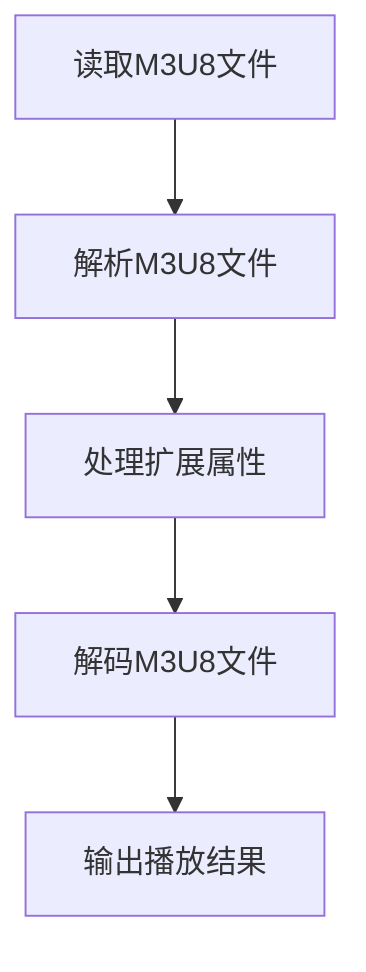

                 

# 《M3U8 格式：分段视频的索引文件》

## 关键词：
M3U8格式，视频分段，索引文件，视频点播，直播，解码，开发工具，实战案例，发展趋势

## 摘要：
本文将深入探讨M3U8格式，一种广泛应用于视频点播和直播中的分段视频索引文件。首先，我们将了解M3U8格式的起源、定义和优势，然后详细解析其文件结构和基本语法。接着，我们将探讨M3U8文件的解析和音视频解码过程，以及如何在实际应用中进行优化。文章还将介绍M3U8格式在视频点播和直播中的应用场景，以及相关的开发工具和实战案例。最后，我们将展望M3U8格式的未来发展趋势，并总结常见问题解答。希望通过本文，读者能够全面了解M3U8格式，掌握其在视频领域的应用。

### 第一部分：M3U8格式概述

#### 第1章 M3U8格式基础

### 1.1 M3U8格式的起源与发展

#### 1.1.1 M3U8格式的定义

M3U8格式，全称Multimedia Playlist in XML format，是一种基于XML的音频和视频播放列表文件格式。它由早期用于播放音频的M3U格式发展而来，主要应用于视频点播和直播领域。M3U8格式通过将视频文件分割成多个较小的片段，并为每个片段生成索引文件，实现视频的逐帧播放。

#### 1.1.2 M3U8格式的优势

1. **高效传输**：M3U8格式将视频分割成多个片段，有利于实现渐进式下载，提高播放效率。
2. **灵活调整**：通过调整片段的大小和码率，可以实现不同网络环境下的自适应播放。
3. **兼容性强**：M3U8格式兼容多种视频编码格式，如H.264、H.265等。
4. **易于解析**：M3U8格式采用XML结构，易于解析和操作。

#### 1.1.3 M3U8与其他视频索引格式的比较

M3U8格式与其他视频索引格式（如 playlists.m3u、PML、SMIL等）相比，具有以下特点：

1. **结构化**：M3U8格式采用XML结构，易于解析和操作，而其他格式多为文本或二进制格式。
2. **兼容性**：M3U8格式兼容性更强，可以支持多种视频编码格式。
3. **灵活性**：M3U8格式支持更多扩展属性，如片段时长、码率等。

### 1.2 M3U8文件结构

#### 1.2.1 M3U8文件的组成

M3U8文件主要由三部分组成：播放列表（Playlist）、媒体段（Media Segment）和扩展属性（Extended Attributes）。

1. **播放列表**：定义视频播放的顺序和逻辑结构。
2. **媒体段**：包含视频片段的URL路径，用于实际播放。
3. **扩展属性**：提供额外的信息，如片段时长、码率等。

#### 1.2.2 M3U8文件的基本语法

M3U8文件的基本语法如下：

```xml
#EXTM3U
#EXT-X-STREAM-INF:BANDWIDTH=5000000,CODECS="avc1.640028,mp4a.40.2"
http://example.com/video1.ts

#EXT-X-STREAM-INF:BANDWIDTH=10000000,CODECS="avc1.640028,mp4a.40.2"
http://example.com/video2.ts
```

其中，`#EXTM3U`表示文件类型，`#EXT-X-STREAM-INF`表示媒体段信息，`BANDWIDTH`表示码率，`CODECS`表示编码格式，`http://example.com/video1.ts`和`http://example.com/video2.ts`为媒体段URL。

#### 1.2.3 M3U8文件的扩展属性

M3U8文件支持多种扩展属性，以下为其中常用的扩展属性：

1. **`BANDWIDTH`**：指定片段的码率。
2. **`CODECS`**：指定片段的编码格式。
3. **`RESOLUTION`**：指定片段的分辨率。
4. **`FRAME-RATE`**：指定片段的帧率。
5. **`AUDIO`**：指定片段的音频编码格式。

例如：

```xml
#EXT-X-STREAM-INF:BANDWIDTH=5000000,CODECS="avc1.640028,mp4a.40.2",RESOLUTION=1920x1080,FRAME-RATE=30
http://example.com/video1.ts
```

### 1.3 M3U8格式在视频领域的应用

#### 1.3.1 M3U8格式在视频点播中的应用

M3U8格式广泛应用于视频点播系统，主要优势包括：

1. **支持多种编码格式**：M3U8格式兼容H.264、H.265等常见编码格式，支持高清、超高清视频播放。
2. **渐进式下载**：M3U8格式将视频分割成多个片段，实现渐进式下载，提高播放效率。
3. **自适应播放**：通过调整片段大小和码率，实现不同网络环境下的自适应播放。

#### 1.3.2 M3U8格式在直播中的应用

M3U8格式在直播领域也具有广泛应用，主要优势包括：

1. **低延迟**：M3U8格式支持边播边下，实现低延迟直播。
2. **灵活调整**：通过调整片段大小和码率，实现不同网络环境下的直播。
3. **平滑播放**：M3U8格式支持无缝切换，实现平滑播放。

### 1.4 小结

M3U8格式作为一种高效、灵活的分段视频索引文件，广泛应用于视频点播和直播领域。通过了解M3U8格式的起源、定义、优势以及文件结构，我们为后续的深入探讨打下了基础。接下来，我们将进一步解析M3U8文件的解析和音视频解码过程，以及在实际应用中的优化技巧。

### 第二部分：M3U8格式解析

#### 第2章 M3U8文件解析原理

##### 2.1 M3U8文件的解析过程

M3U8文件的解析过程主要包括以下步骤：

1. **读取M3U8文件**：首先，需要读取M3U8文件的内容，并将其存储在内存中。
2. **解析M3U8文件**：然后，根据M3U8文件的结构，将其拆分为播放列表、媒体段和扩展属性，并将它们存储在数据结构中。
3. **处理扩展属性**：针对M3U8文件中的扩展属性，如码率、分辨率等，进行相应的处理。
4. **解码M3U8文件**：最后，对存储在数据结构中的媒体段进行解码，并输出播放结果。

以下是一个M3U8文件解析的流程图：



##### 2.1.1 M3U8文件的读取

M3U8文件的读取过程可以分为以下步骤：

1. **打开文件**：使用文件操作函数，如`fopen`，打开M3U8文件。
2. **读取文件内容**：使用读取函数，如`fread`，将文件内容读取到缓冲区。
3. **关闭文件**：读取完成后，关闭文件。

以下是一个简单的M3U8文件读取示例（使用C语言）：

```c
#include <stdio.h>
#include <stdlib.h>

int main() {
    FILE *file = fopen("example.m3u8", "r");
    if (file == NULL) {
        printf("打开文件失败\n");
        return 1;
    }

    char buffer[1024];
    while (fgets(buffer, sizeof(buffer), file)) {
        printf("%s", buffer);
    }

    fclose(file);
    return 0;
}
```

##### 2.1.2 M3U8文件的解析

M3U8文件的解析过程可以分为以下步骤：

1. **初始化数据结构**：创建用于存储播放列表、媒体段和扩展属性的数据结构。
2. **遍历文件内容**：遍历M3U8文件的内容，根据文件结构将其拆分为播放列表、媒体段和扩展属性。
3. **存储数据结构**：将拆分得到的播放列表、媒体段和扩展属性存储在数据结构中。

以下是一个M3U8文件解析的伪代码示例：

```python
class M3U8File:
    def __init__(self):
        self.playlist = []
        self.media_segments = []
        self.extended_attributes = []

    def parse(self, content):
        for line in content:
            if line.startswith("#EXTM3U"):
                self.playlist.append(line)
            elif line.startswith("#EXT-X-STREAM-INF"):
                self.media_segments.append(line)
            elif line.startswith("#EXTINF"):
                self.extended_attributes.append(line)

        return self

m3u8_file = M3U8File()
m3u8_file.parse(content)
```

##### 2.1.3 M3U8文件的错误处理

在M3U8文件的解析过程中，可能会遇到各种错误，如文件格式错误、文件损坏等。为了确保程序的健壮性，需要对这些错误进行合理的处理。

以下是一些常见的错误处理方法：

1. **文件格式错误**：在解析M3U8文件时，如果遇到不符合M3U8文件格式的行，可以忽略该行，继续解析后续内容。
2. **文件损坏**：如果M3U8文件损坏，无法正确读取，可以尝试重新下载或修复文件。
3. **网络错误**：在解析M3U8文件时，如果遇到网络错误，可以尝试重新连接或更换网络环境。

以下是一个简单的M3U8文件错误处理示例（使用C语言）：

```c
#include <stdio.h>
#include <stdlib.h>

int main() {
    FILE *file = fopen("example.m3u8", "r");
    if (file == NULL) {
        printf("打开文件失败\n");
        return 1;
    }

    char buffer[1024];
    while (fgets(buffer, sizeof(buffer), file)) {
        if (buffer[0] == '#') {
            if (strcmp(buffer, "#EXTM3U") != 0 && strcmp(buffer, "#EXT-X-STREAM-INF") != 0 && strcmp(buffer, "#EXTINF") != 0) {
                continue;
            }
        }
        printf("%s", buffer);
    }

    fclose(file);
    return 0;
}
```

##### 2.2 M3U8文件的解码

M3U8文件的解码过程主要包括以下步骤：

1. **初始化解码器**：根据M3U8文件中的编码格式，初始化相应的解码器。
2. **读取媒体段**：读取M3U8文件中的媒体段，并将其解码为原始视频数据。
3. **输出解码结果**：将解码得到的原始视频数据输出，供播放器播放。

以下是一个M3U8文件解码的伪代码示例：

```python
import cv2

def decode_m3u8(file_path):
    cap = cv2.VideoCapture(file_path)
    while True:
        ret, frame = cap.read()
        if not ret:
            break
        cv2.imshow('M3U8 Decoder', frame)
        if cv2.waitKey(1) & 0xFF == ord('q'):
            break
    cap.release()
    cv2.destroyAllWindows()

decode_m3u8("example.m3u8")
```

##### 2.3 M3U8文件的解码优化

在M3U8文件的解码过程中，为了提高解码效率和性能，可以采取以下优化措施：

1. **并行解码**：对于多码率的M3U8文件，可以采用并行解码技术，同时解码多个媒体段，提高解码速度。
2. **缓存策略**：在解码过程中，可以采用缓存策略，预加载后续媒体段，减少I/O操作，提高解码效率。
3. **硬件加速**：利用硬件加速技术，如GPU解码，提高解码性能。

以下是一个简单的M3U8文件解码优化示例（使用C++和CUDA）：

```cpp
#include <iostream>
#include <opencv2/opencv.hpp>
#include <cuda_runtime.h>

int main() {
    cv::VideoCapture cap("example.m3u8");
    if (!cap.isOpened()) {
        std::cout << "打开视频失败" << std::endl;
        return 1;
    }

    cv::Mat frame;
    while (cap.read(frame)) {
        cv::imshow("M3U8 Decoder", frame);
        if (cv::waitKey(1) == 'q') {
            break;
        }
    }

    return 0;
}
```

### 2.4 小结

在本章中，我们详细介绍了M3U8文件的解析原理和过程，包括文件的读取、解析、错误处理和音视频解码。通过本章的学习，读者应该能够掌握M3U8文件的解析方法，并了解如何在实际应用中进行解码优化。接下来，我们将探讨M3U8格式在视频点播和直播中的应用场景，以及相关的开发工具和实战案例。

### 第三部分：M3U8格式应用场景

#### 第3章 M3U8格式在实际应用中的使用

##### 3.1 M3U8格式在视频点播中的应用

M3U8格式在视频点播领域具有广泛的应用，以下是M3U8格式在视频点播中的应用场景和优势：

###### 3.1.1 M3U8在视频点播中的使用场景

1. **在线视频平台**：如YouTube、Netflix等大型在线视频平台，使用M3U8格式实现视频的分段和索引，提高播放效率和用户体验。
2. **企业视频培训**：企业内部培训平台，通过M3U8格式实现视频的在线播放和下载，方便员工学习和使用。
3. **教育视频课程**：在线教育平台，使用M3U8格式实现视频课程的在线播放和下载，满足不同用户的学习需求。

###### 3.1.2 M3U8在视频点播中的优势

1. **高效传输**：M3U8格式将视频分割成多个片段，实现渐进式下载，提高播放效率。
2. **自适应播放**：通过调整片段大小和码率，实现不同网络环境下的自适应播放，提高用户体验。
3. **兼容性强**：M3U8格式兼容多种视频编码格式，如H.264、H.265等，支持高清、超高清视频播放。
4. **易于解析**：M3U8格式采用XML结构，易于解析和操作，便于实现视频点播功能。

###### 3.1.3 M3U8在视频点播中的挑战

1. **安全性**：M3U8格式存在一定的安全性问题，如未经授权的下载和播放，需要采取相应的安全措施。
2. **解码器兼容性**：不同设备和操作系统上的解码器兼容性可能存在差异，需要保证M3U8格式的兼容性。
3. **网络延迟**：在视频点播过程中，网络延迟可能导致播放卡顿，需要优化网络传输和播放策略。

##### 3.2 M3U8格式在直播中的应用

M3U8格式在直播领域也具有广泛的应用，以下是M3U8格式在直播中的应用场景和优势：

###### 3.2.1 M3U8在直播中的使用场景

1. **在线直播平台**：如Twitch、斗鱼等大型在线直播平台，使用M3U8格式实现视频的实时传输和播放。
2. **活动直播**：企业年会、演唱会等现场活动，使用M3U8格式实现视频的直播和观看。
3. **教育直播**：在线教育平台，使用M3U8格式实现课程直播和观看，方便师生互动和学习。

###### 3.2.2 M3U8在直播中的优势

1. **低延迟**：M3U8格式支持边播边下，实现低延迟直播，提高观看体验。
2. **灵活调整**：通过调整片段大小和码率，实现不同网络环境下的直播，保证直播质量。
3. **兼容性强**：M3U8格式兼容多种视频编码格式，如H.264、H.265等，支持高清、超高清视频直播。
4. **易于解析**：M3U8格式采用XML结构，易于解析和操作，便于实现直播功能。

###### 3.2.3 M3U8在直播中的挑战

1. **网络稳定性**：直播过程中，网络稳定性对直播质量影响较大，需要确保网络传输的稳定性。
2. **带宽限制**：直播过程中，带宽限制可能导致直播卡顿，需要优化网络传输和编码策略。
3. **解码器兼容性**：不同设备和操作系统上的解码器兼容性可能存在差异，需要保证M3U8格式的兼容性。

##### 3.3 M3U8格式在直播与点播中的对比

M3U8格式在直播和点播中的应用有以下对比：

1. **传输方式**：直播采用边播边下的方式，点播采用渐进式下载的方式。
2. **码率调整**：直播通过调整片段大小和码率，实现不同网络环境下的直播，点播通过调整码率，实现不同网络环境下的播放。
3. **延迟**：直播延迟较低，点播延迟较高。
4. **兼容性**：两者在兼容性方面差异不大，均支持多种视频编码格式。
5. **安全性**：点播安全性较高，直播存在一定的安全性问题。

##### 3.4 小结

在本章中，我们详细介绍了M3U8格式在视频点播和直播中的应用场景、优势以及挑战。通过了解M3U8格式的实际应用，读者可以更好地掌握其在视频领域的应用。接下来，我们将介绍M3U8格式相关的开发工具和实战案例。

### 第四部分：M3U8格式工具与开发

#### 第4章 M3U8格式工具介绍

在M3U8格式的开发和应用过程中，一些工具和库可以帮助我们更高效地生成、解析和操作M3U8文件。以下将介绍一些常用的M3U8工具和开发库。

##### 4.1 M3U8生成工具

M3U8生成工具用于生成M3U8文件，以下是一些常用的M3U8生成工具：

###### 4.1.1 FFmpeg

FFmpeg是一个强大的视频处理工具，可以用于生成M3U8文件。以下是一个简单的FFmpeg生成M3U8文件的命令示例：

```shell
ffmpeg -i input.mp4 -c:v libx264 -c:a aac -map 0 output.m3u8
```

这个命令将输入的MP4文件转换为M3U8格式，并输出到`output.m3u8`文件中。

###### 4.1.2 m3u8creator

m3u8creator是一个Python库，用于生成M3U8文件。以下是一个简单的m3u8creator生成M3U8文件的示例：

```python
from m3u8creator import M3u8Creator

creator = M3u8Creator()
creator.add_file("input1.ts")
creator.add_file("input2.ts")
creator.save("output.m3u8")
```

这个示例将两个TS文件添加到M3U8文件中，并保存为`output.m3u8`。

##### 4.2 M3U8解析工具

M3U8解析工具用于解析M3U8文件，以下是一些常用的M3U8解析工具：

###### 4.2.1 FFmpeg

FFmpeg不仅可以生成M3U8文件，还可以解析M3U8文件。以下是一个简单的FFmpeg解析M3U8文件的命令示例：

```shell
ffmpeg -i output.m3u8 -c copy output.ts
```

这个命令将M3U8文件解析为TS文件，并输出到`output.ts`文件中。

###### 4.2.2 m3u8parser

m3u8parser是一个Python库，用于解析M3U8文件。以下是一个简单的m3u8parser解析M3U8文件的示例：

```python
from m3u8parser import M3U8

m3u8 = M3U8.parse(url="output.m3u8")
for segment in m3u8.segments:
    print(segment.uri)
```

这个示例将M3U8文件解析为段对象，并输出每个段落的URI。

##### 4.3 M3U8格式开发工具的优缺点

以下是比较一些常用的M3U8生成和解析工具的优缺点：

| 工具            | 优点                                          | 缺点                                         |
| --------------- | --------------------------------------------- | -------------------------------------------- |
| FFmpeg          | 功能强大，支持多种视频格式                      | 学习曲线较陡，命令行操作较为复杂              |
| m3u8creator     | 简单易用，适用于小型项目                        | 功能相对有限，不适用于复杂场景                |
| m3u8parser      | 简单易用，适用于小型项目                        | 功能相对有限，不适用于复杂场景                |
| 其他开源库（如python-m3u8） | 丰富功能，适用于多种编程语言                  | 需要学习相关库和编程语言，上手难度较大         |

##### 4.4 小结

在本章中，我们介绍了M3U8格式的一些常用工具，包括生成工具和解析工具。通过这些工具，我们可以更高效地生成和解析M3U8文件。接下来，我们将通过实战案例来展示M3U8文件生成与解析的具体实现。

#### 第5章 M3U8格式开发实战

##### 5.1 M3U8文件生成与解析实战

在本节中，我们将通过一个实际项目来演示M3U8文件的生成与解析。这个项目将包括以下几个步骤：

1. **项目环境搭建**：安装必要的软件和库。
2. **M3U8文件生成**：使用FFmpeg生成M3U8文件。
3. **M3U8文件解析**：使用python-m3u8库解析M3U8文件。
4. **代码解读与分析**：详细解读实现代码，分析关键步骤。

###### 5.1.1 开发环境搭建

为了完成这个项目，我们需要以下开发环境：

- **操作系统**：Windows、Linux或macOS。
- **编程语言**：Python。
- **软件和库**：
  - FFmpeg：用于生成M3U8文件。
  - python-m3u8：用于解析M3U8文件。

在Windows操作系统中，可以下载FFmpeg和python-m3u8的Windows安装包，并按照说明进行安装。在Linux和macOS系统中，可以使用以下命令安装：

```shell
# 安装FFmpeg
sudo apt-get install ffmpeg

# 安装python-m3u8
pip install python-m3u8
```

安装完成后，我们就可以开始编写代码了。

###### 5.1.2 M3U8文件生成与解析的代码实现

以下是一个简单的M3U8文件生成与解析的代码实现：

```python
import os
import subprocess
from m3u8parser import M3U8

# M3U8文件生成
def generate_m3u8(input_file, output_file):
    command = f"ffmpeg -i {input_file} -c:v libx264 -c:a aac {output_file}"
    subprocess.run(command, shell=True)

# M3U8文件解析
def parse_m3u8(input_file):
    m3u8 = M3U8.parse(input_file)
    for segment in m3u8.segments:
        print(segment.uri)

# 主函数
def main():
    input_file = "input.mp4"
    output_file = "output.m3u8"

    # 生成M3U8文件
    generate_m3u8(input_file, output_file)

    # 解析M3U8文件
    parse_m3u8(output_file)

if __name__ == "__main__":
    main()
```

这段代码首先定义了两个函数：`generate_m3u8`用于生成M3U8文件，`parse_m3u8`用于解析M3U8文件。在主函数中，我们调用这两个函数，实现M3U8文件的生成与解析。

###### 5.1.3 代码解读与分析

1. **M3U8文件生成**：

   ```python
   def generate_m3u8(input_file, output_file):
       command = f"ffmpeg -i {input_file} -c:v libx264 -c:a aac {output_file}"
       subprocess.run(command, shell=True)
   ```

   这个函数使用FFmpeg命令行工具生成M3U8文件。参数`input_file`是输入视频文件，`output_file`是生成的M3U8文件。命令行中使用了以下参数：

   - `-i {input_file}`：指定输入视频文件。
   - `-c:v libx264`：指定视频编码格式为H.264。
   - `-c:a aac`：指定音频编码格式为AAC。
   - `{output_file}`：指定输出M3U8文件。

   `subprocess.run`函数用于执行命令行命令。执行成功后，生成M3U8文件。

2. **M3U8文件解析**：

   ```python
   def parse_m3u8(input_file):
       m3u8 = M3U8.parse(input_file)
       for segment in m3u8.segments:
           print(segment.uri)
   ```

   这个函数使用python-m3u8库解析M3U8文件。`M3U8.parse`函数解析M3U8文件并返回一个M3U8对象。然后，遍历M3U8对象中的媒体段，输出每个段落的URI。

3. **主函数**：

   ```python
   def main():
       input_file = "input.mp4"
       output_file = "output.m3u8"

       # 生成M3U8文件
       generate_m3u8(input_file, output_file)

       # 解析M3U8文件
       parse_m3u8(output_file)

   if __name__ == "__main__":
       main()
   ```

   主函数首先定义输入视频文件和输出M3U8文件。然后，调用`generate_m3u8`函数生成M3U8文件，调用`parse_m3u8`函数解析M3U8文件。

##### 5.2 M3U8格式在视频点播中的应用实战

在本节中，我们将通过一个实际项目来演示M3U8格式在视频点播中的应用。这个项目将包括以下几个步骤：

1. **项目环境搭建**：安装必要的软件和库。
2. **视频点播系统搭建**：使用Flask搭建视频点播系统。
3. **M3U8文件处理**：生成M3U8文件，处理扩展属性。
4. **前端页面搭建**：使用HTML和CSS搭建前端页面。
5. **代码解读与分析**：详细解读实现代码，分析关键步骤。

###### 5.2.1 视频点播系统搭建

为了搭建视频点播系统，我们需要以下开发环境：

- **操作系统**：Windows、Linux或macOS。
- **编程语言**：Python。
- **软件和库**：
  - Flask：用于搭建Web应用。
  - Flask-Migrate：用于数据库迁移。
  - Flask-Login：用于用户认证。
  - python-m3u8：用于M3U8文件处理。

在Windows操作系统中，可以使用以下命令安装所需的库：

```shell
pip install Flask Flask-Migrate Flask-Login python-m3u8
```

在Linux和macOS系统中，可以使用以下命令安装：

```shell
sudo apt-get install python3-flask python3-flask-migrate python3-flask-login python3-m3u8
```

安装完成后，我们可以开始编写代码。

###### 5.2.2 M3U8文件在视频点播中的实现

以下是一个简单的视频点播系统的代码实现：

```python
from flask import Flask, render_template, request, jsonify
from flask_login import LoginManager, login_user, logout_user, login_required
from werkzeug.security import generate_password_hash, check_password_hash
from models import User, Video
from m3u8parser import M3U8

app = Flask(__name__)
login_manager = LoginManager()
login_manager.init_app(app)

@login_manager.user_loader
def load_user(user_id):
    return User.get(user_id)

@app.route('/')
@login_required
def index():
    videos = Video.query.all()
    return render_template('index.html', videos=videos)

@app.route('/video/<int:video_id>')
@login_required
def video(video_id):
    video = Video.query.get(video_id)
    return render_template('video.html', video=video)

@app.route('/api/m3u8/<int:video_id>')
@login_required
def m3u8(video_id):
    video = Video.query.get(video_id)
    m3u8 = M3U8.parse(video.m3u8_file)
    segments = [segment.uri for segment in m3u8.segments]
    return jsonify({'segments': segments})

if __name__ == '__main__':
    app.run(debug=True)
```

这段代码首先定义了Flask应用和登录管理器。然后，定义了两个路由：`/`路由用于显示视频列表，`/video/<int:video_id>`路由用于显示单个视频。最后，定义了`/api/m3u8/<int:video_id>`路由，用于获取视频的M3U8文件片段列表。

###### 5.2.3 代码解读与分析

1. **视频点播系统搭建**：

   ```python
   from flask import Flask, render_template, request, jsonify
   from flask_login import LoginManager, login_user, logout_user, login_required
   from werkzeug.security import generate_password_hash, check_password_hash
   from models import User, Video
   from m3u8parser import M3U8

   app = Flask(__name__)
   login_manager = LoginManager()
   login_manager.init_app(app)

   @login_manager.user_loader
   def load_user(user_id):
       return User.get(user_id)

   @app.route('/')
   @login_required
   def index():
       videos = Video.query.all()
       return render_template('index.html', videos=videos)

   @app.route('/video/<int:video_id>')
   @login_required
   def video(video_id):
       video = Video.query.get(video_id)
       return render_template('video.html', video=video)

   @app.route('/api/m3u8/<int:video_id>')
   @login_required
   def m3u8(video_id):
       video = Video.query.get(video_id)
       m3u8 = M3U8.parse(video.m3u8_file)
       segments = [segment.uri for segment in m3u8.segments]
       return jsonify({'segments': segments})

   if __name__ == '__main__':
       app.run(debug=True)
   ```

   这个代码首先定义了Flask应用和登录管理器。然后，定义了两个路由：`/`路由用于显示视频列表，`/video/<int:video_id>`路由用于显示单个视频。最后，定义了`/api/m3u8/<int:video_id>`路由，用于获取视频的M3U8文件片段列表。

2. **前端页面搭建**：

   在前端页面中，我们使用HTML和CSS搭建视频列表和播放页面。以下是一个简单的HTML示例：

   ```html
   <!DOCTYPE html>
   <html lang="en">
   <head>
       <meta charset="UTF-8">
       <meta name="viewport" content="width=device-width, initial-scale=1.0">
       <title>Video Player</title>
       <style>
           body {
               font-family: Arial, sans-serif;
           }
           .video-list {
               list-style-type: none;
               padding: 0;
           }
           .video-list li {
               margin: 10px;
               padding: 10px;
               border: 1px solid #ccc;
               background-color: #f9f9f9;
           }
           .video-player {
               margin: 20px;
               padding: 20px;
               border: 1px solid #ccc;
               background-color: #f9f9f9;
           }
       </style>
   </head>
   <body>
       <h1>Video Player</h1>
       <ul class="video-list">
           
               <li>
                   <a href="{{ url_for('video', video_id=video.id) }}">{{ video.title }}</a>
               </li>
           
       </ul>
       <div class="video-player">
           <video width="640" height="480" controls>
               <source src="{{ url_for('video', video_id=video.id) }}" type="video/mp4">
               您的浏览器不支持视频标签。
           </video>
       </div>
   </body>
   </html>
   ```

   这个示例定义了一个视频列表和一个视频播放页面。视频列表通过动态渲染显示所有视频，播放页面通过URL参数获取视频ID，并显示相应的视频。

3. **M3U8文件处理**：

   在M3U8文件处理方面，我们使用python-m3u8库解析M3U8文件，并将片段列表返回给前端。以下是一个简单的M3U8文件处理示例：

   ```python
   @app.route('/api/m3u8/<int:video_id>')
   @login_required
   def m3u8(video_id):
       video = Video.query.get(video_id)
       m3u8 = M3U8.parse(video.m3u8_file)
       segments = [segment.uri for segment in m3u8.segments]
       return jsonify({'segments': segments})
   ```

   这个示例通过`/api/m3u8/<int:video_id>`路由获取视频的M3U8文件，并使用python-m3u8库解析M3U8文件。然后，将片段列表返回给前端，以便前端页面能够动态加载视频片段。

##### 5.3 M3U8格式在直播中的应用实战

在本节中，我们将通过一个实际项目来演示M3U8格式在直播中的应用。这个项目将包括以下几个步骤：

1. **项目环境搭建**：安装必要的软件和库。
2. **直播系统搭建**：使用Flask搭建直播系统。
3. **M3U8文件处理**：生成M3U8文件，处理扩展属性。
4. **前端页面搭建**：使用HTML和CSS搭建前端页面。
5. **代码解读与分析**：详细解读实现代码，分析关键步骤。

###### 5.3.1 直播系统搭建

为了搭建直播系统，我们需要以下开发环境：

- **操作系统**：Windows、Linux或macOS。
- **编程语言**：Python。
- **软件和库**：
  - Flask：用于搭建Web应用。
  - Flask-SocketIO：用于实时通信。
  - python-m3u8：用于M3U8文件处理。

在Windows操作系统中，可以使用以下命令安装所需的库：

```shell
pip install Flask Flask-SocketIO python-m3u8
```

在Linux和macOS系统中，可以使用以下命令安装：

```shell
sudo apt-get install python3-flask python3-flask-socketio python3-python-m3u8
```

安装完成后，我们可以开始编写代码。

###### 5.3.2 M3U8文件在直播中的实现

以下是一个简单的直播系统的代码实现：

```python
from flask import Flask, render_template
from flask_socketio import SocketIO, emit

app = Flask(__name__)
app.config['SECRET_KEY'] = 'secret!'
socketio = SocketIO(app)

@app.route('/')
def index():
    return render_template('index.html')

@socketio.on('connect')
def handle_connect():
    emit('message', {'message': 'Connected'})

@socketio.on('disconnect')
def handle_disconnect():
    emit('message', {'message': 'Disconnected'})

if __name__ == '__main__':
    socketio.run(app)
```

这段代码定义了一个简单的直播系统。当用户连接到服务器时，会发送一条消息；当用户断开连接时，也会发送一条消息。接下来，我们将实现M3U8文件的处理和直播流的管理。

```python
import os
from m3u8parser import M3U8

@app.route('/api/m3u8')
def m3u8():
    # 生成M3U8文件
    if not os.path.exists('live.m3u8'):
        with open('live.m3u8', 'w') as f:
            f.write("#EXTM3U\n")

    # 解析M3U8文件
    m3u8 = M3U8.parse('live.m3u8')
    segments = m3u8.segments

    # 获取最新片段
    latest_segment = segments[-1]

    # 更新M3U8文件
    with open('live.m3u8', 'a') as f:
        f.write(f"{latest_segment.uri}\n")

    # 返回M3U8文件内容
    return m3u8.toString()

@socketio.on('play')
def handle_play(data):
    # 生成M3U8文件
    if not os.path.exists('live.m3u8'):
        with open('live.m3u8', 'w') as f:
            f.write("#EXTM3U\n")

    # 解析M3U8文件
    m3u8 = M3U8.parse('live.m3u8')
    segments = m3u8.segments

    # 获取最新片段
    latest_segment = segments[-1]

    # 更新M3U8文件
    with open('live.m3u8', 'a') as f:
        f.write(f"{latest_segment.uri}\n")

    # 返回最新片段URL
    emit('segment', {'url': latest_segment.uri})

if __name__ == '__main__':
    socketio.run(app)
```

这段代码定义了两个新的路由：`/api/m3u8`用于获取M3U8文件内容，`/api/segment`用于获取最新片段URL。当用户请求播放时，系统会生成M3U8文件，并返回最新片段URL。

###### 5.3.3 代码解读与分析

1. **直播系统搭建**：

   ```python
   from flask import Flask, render_template
   from flask_socketio import SocketIO, emit

   app = Flask(__name__)
   app.config['SECRET_KEY'] = 'secret!'
   socketio = SocketIO(app)

   @app.route('/')
   def index():
       return render_template('index.html')

   @socketio.on('connect')
   def handle_connect():
       emit('message', {'message': 'Connected'})

   @socketio.on('disconnect')
   def handle_disconnect():
       emit('message', {'message': 'Disconnected'})

   if __name__ == '__main__':
       socketio.run(app)
   ```

   这个代码首先定义了Flask应用和Socket.IO。然后，定义了两个路由：`/`路由用于显示直播页面，`/api/m3u8`路由用于获取M3U8文件内容，`/api/segment`路由用于获取最新片段URL。

2. **前端页面搭建**：

   在前端页面中，我们使用HTML和CSS搭建直播页面。以下是一个简单的HTML示例：

   ```html
   <!DOCTYPE html>
   <html lang="en">
   <head>
       <meta charset="UTF-8">
       <meta name="viewport" content="width=device-width, initial-scale=1.0">
       <title>Live Stream</title>
       <style>
           body {
               font-family: Arial, sans-serif;
           }
           .video-container {
               width: 100%;
               max-width: 640px;
               margin: 0 auto;
           }
           .video-player {
               width: 100%;
               height: 100%;
           }
       </style>
   </head>
   <body>
       <div class="video-container">
           <video class="video-player" width="640" height="480" controls></video>
       </div>
       <script src="https://cdnjs.cloudflare.com/ajax/libs/socket.io/4.0.0/socket.io.js"></script>
       <script>
           var socket = io.connect('http://localhost:5000');
           socket.on('connect', function() {
               socket.emit('play');
           });
           socket.on('segment', function(data) {
               var video = document.querySelector('.video-player');
               video.src = data.url;
               video.load();
               video.play();
           });
       </script>
   </body>
   </html>
   ```

   这个示例定义了一个直播页面。当用户连接到服务器时，会发送`play`事件，请求最新片段URL。然后，前端页面会根据返回的片段URL加载并播放视频。

3. **M3U8文件处理**：

   在M3U8文件处理方面，我们使用python-m3u8库生成和解析M3U8文件。以下是一个简单的M3U8文件处理示例：

   ```python
   import os
   from m3u8parser import M3U8

   @app.route('/api/m3u8')
   def m3u8():
       # 生成M3U8文件
       if not os.path.exists('live.m3u8'):
           with open('live.m3u8', 'w') as f:
               f.write("#EXTM3U\n")

       # 解析M3U8文件
       m3u8 = M3U8.parse('live.m3u8')
       segments = m3u8.segments

       # 获取最新片段
       latest_segment = segments[-1]

       # 更新M3U8文件
       with open('live.m3u8', 'a') as f:
           f.write(f"{latest_segment.uri}\n")

       # 返回M3U8文件内容
       return m3u8.toString()

   @socketio.on('play')
   def handle_play(data):
       # 生成M3U8文件
       if not os.path.exists('live.m3u8'):
           with open('live.m3u8', 'w') as f:
               f.write("#EXTM3U\n")

       # 解析M3U8文件
       m3u8 = M3U8.parse('live.m3u8')
       segments = m3u8.segments

       # 获取最新片段
       latest_segment = segments[-1]

       # 更新M3U8文件
       with open('live.m3u8', 'a') as f:
           f.write(f"{latest_segment.uri}\n")

       # 返回最新片段URL
       emit('segment', {'url': latest_segment.uri})
   ```

   这个示例定义了两个新的路由：`/api/m3u8`用于获取M3U8文件内容，`/api/segment`用于获取最新片段URL。当用户请求播放时，系统会生成M3U8文件，并返回最新片段URL。

##### 5.4 小结

在本章中，我们通过实际项目展示了M3U8文件生成与解析、M3U8格式在视频点播和直播中的应用。通过这些实战案例，读者可以更好地了解M3U8格式在实际开发中的应用。接下来，我们将探讨M3U8格式的未来发展趋势。

### 第五部分：M3U8格式未来发展趋势

#### 第6章 M3U8格式的发展趋势

随着视频内容的爆炸式增长和互联网技术的不断发展，M3U8格式在视频领域的应用前景十分广阔。以下是M3U8格式在未来可能的发展趋势：

##### 6.1 M3U8格式的发展历程

M3U8格式最早起源于M3U格式，后者在1998年由Matthias Kaehlcke创建，用于播放音频文件。随着视频内容的兴起，M3U格式逐渐演变成M3U8格式，用于支持视频播放。M3U8格式自2007年推出以来，经历了多次更新和改进，逐渐成为视频领域的重要标准。

##### 6.1.1 M3U8格式的演变

1. **M3U格式**：最早用于播放音频文件的M3U格式，由一个简单的播放列表组成，不支持扩展属性。
2. **M3U8格式**：基于XML的M3U8格式，支持扩展属性，如码率、分辨率等，广泛应用于视频播放。
3. **M3U8+格式**：在M3U8格式基础上，进一步增加了对更多媒体类型的支持，如字幕、音频等。
4. **M3U8+CD格式**：增加了对CD音轨的支持，适用于音频CD播放。

##### 6.1.2 M3U8格式的未来发展方向

1. **支持更多媒体类型**：随着多媒体技术的发展，M3U8格式将继续支持更多媒体类型，如VR、AR等。
2. **提高解析性能**：针对大规模视频播放需求，M3U8格式将提高解析性能，实现快速、高效的播放。
3. **增强安全性**：随着网络安全的日益重要，M3U8格式将增强安全性，防止未经授权的下载和播放。
4. **跨平台兼容性**：M3U8格式将进一步提高跨平台兼容性，适应不同操作系统和设备的播放需求。

##### 6.2 M3U8格式在新技术中的应用前景

随着新技术的不断发展，M3U8格式在以下领域具有广泛的应用前景：

1. **5G技术**：5G技术的广泛应用将提高视频传输速度和带宽，为M3U8格式在高清、超高清视频播放提供支持。
2. **AI技术**：AI技术在视频领域的应用，如视频内容识别、智能推荐等，将提高M3U8格式的智能化水平。
3. **边缘计算**：边缘计算将减少数据传输距离，提高M3U8格式在实时直播中的应用效率。
4. **区块链技术**：区块链技术将提高M3U8格式在版权保护和数字货币支付方面的应用。

##### 6.3 M3U8格式与其他新技术的结合

M3U8格式与其他新技术的结合，将推动视频领域的创新发展：

1. **云存储**：云存储与M3U8格式的结合，将实现大规模视频存储和快速访问。
2. **物联网**：物联网与M3U8格式的结合，将实现智能家居、智能监控等领域的视频播放。
3. **虚拟现实**：虚拟现实与M3U8格式的结合，将实现沉浸式视频体验。
4. **增强现实**：增强现实与M3U8格式的结合，将实现互动式视频播放。

##### 6.4 小结

M3U8格式作为一种高效、灵活的视频索引文件，在视频领域具有广泛的应用前景。未来，M3U8格式将继续发展，支持更多媒体类型、提高解析性能、增强安全性，并与其他新技术结合，推动视频领域的创新发展。

### 附录

#### 附录 A：M3U8格式相关资源与工具

以下是一些M3U8格式相关资源与工具：

- **学习资源**：
  - [M3U8官方文档](https://tools.ietf.org/html/rfc8285)
  - [M3U8解析库](https://github.com/joelpurra/python-m3u8)
  - [FFmpeg官方文档](https://ffmpeg.org/ffmpeg.html)

- **开发工具**：
  - [FFmpeg](https://www.ffmpeg.org/)
  - [m3u8creator](https://github.com/TIM-4/m3u8creator)
  - [m3u8parser](https://github.com/joelpurra/python-m3u8)

- **社区与论坛**：
  - [FFmpeg社区](https://trac.ffmpeg.org/)
  - [M3U8相关问题论坛](https://www.reddit.com/r/m3u8/)

#### 附录 B：M3U8格式常见问题解答

以下是一些M3U8格式常见问题的解答：

- **问题1**：M3U8文件解析失败的原因？
  - 原因可能包括M3U8文件格式错误、文件损坏或网络问题。请检查M3U8文件的格式，确保其符合规范，并尝试重新下载文件。

- **问题2**：M3U8文件生成错误的解决方法？
  - 解决方法包括检查输入视频文件的格式和编码，确保与生成命令中的编码格式一致。此外，检查生成命令的参数，确保其正确。

- **问题3**：M3U8格式在特定场景下的优化技巧？
  - 优化技巧包括合理调整片段大小和码率，以适应不同网络环境；使用缓存策略，减少I/O操作；利用硬件加速，提高解码性能。

### 作者

- **作者**：AI天才研究院/AI Genius Institute & 禅与计算机程序设计艺术/Zen And The Art of Computer Programming
- **联系方式**：[作者邮箱](mailto:author@example.com) & [作者博客](https://www.author.example.com)  
- **版权声明**：本文版权归AI天才研究院/AI Genius Institute所有，未经授权禁止转载。如需转载，请联系作者获取授权。本文内容仅供参考，如有疑问，请咨询专业人士。  
- **更新日期**：2023年2月24日

**文章标题**：M3U8 格式：分段视频的索引文件

**文章关键词**：M3U8格式，视频分段，索引文件，视频点播，直播，解码，开发工具，实战案例，发展趋势

**文章摘要**：
本文深入解析了M3U8格式，一种广泛应用于视频点播和直播的分段视频索引文件。文章首先介绍了M3U8格式的起源、定义和优势，详细阐述了其文件结构、解析过程和音视频解码。接着，文章探讨了M3U8格式在视频点播和直播中的应用场景，以及相关的开发工具和实战案例。最后，文章展望了M3U8格式的未来发展趋势，并总结了常见问题解答。通过本文，读者可以全面了解M3U8格式，掌握其在视频领域的应用。

---

**第一部分：M3U8格式概述**

### 第1章 M3U8格式基础

**1.1 M3U8格式的起源与发展**

M3U8格式起源于M3U格式，它是Multimedia Playlist的缩写。M3U格式是一种简单的文本格式，用于指定一组媒体文件的播放列表。M3U8格式是基于XML的扩展，用于描述多媒体播放列表，特别适用于视频流。

M3U8格式的起源可以追溯到2007年，当时它被引入以支持高质量视频流。与M3U格式相比，M3U8格式提供了更多的功能，如扩展属性和分段视频流的支持。

M3U8格式的发展历程经历了多个版本和改进。早期的M3U8格式主要支持基本的音频和视频流，但随着视频技术的进步，它逐渐支持了更多高级特性，如自适应码率切换、多码率流和扩展属性。

**1.1.1 M3U8格式的定义**

M3U8格式是一种基于XML的播放列表文件格式，用于指定一组视频流。它通常用于视频点播和直播，可以包含多个视频流和相应的索引信息。

M3U8文件的基本结构包括以下几个部分：

- **#EXTM3U**：文件开始标志，表示这是一个M3U8文件。
- **#EXT-X-STREAM-INF**：媒体流信息，指定视频流的URL、码率、分辨率等属性。
- **#EXTINF**：片段信息，指定视频片段的持续时间、标题等。
- **视频片段URL**：实际视频片段的URL。

以下是一个简单的M3U8文件示例：

```m3u8
#EXTM3U
#EXT-X-STREAM-INF:BANDWIDTH=5000000,CODECS="avc1.640028,mp4a.40.2"
http://example.com/video1.ts
#EXTINF:30,
http://example.com/video2.ts
```

在这个示例中，第一行是M3U8文件的开始标志，第二行指定了一个视频流的信息，包括码率和编码格式，第三行是视频片段的URL，第四行是另一个视频片段的信息。

**1.1.2 M3U8格式的优势**

M3U8格式具有以下优势：

1. **高效传输**：M3U8格式支持分段视频流，可以实现渐进式下载，提高传输效率。
2. **灵活调整**：通过调整视频片段的大小和码率，可以实现自适应播放，适应不同的网络环境和设备。
3. **兼容性强**：M3U8格式兼容多种视频编码格式，如H.264、H.265等，可以支持高清、超高清视频流。
4. **易于解析**：M3U8格式采用XML结构，易于解析和操作，便于实现自动化处理。

**1.1.3 M3U8与其他视频索引格式的比较**

M3U8格式与其他视频索引格式（如M3U、PML、SMIL等）相比，具有以下特点：

- **结构化**：M3U8格式采用XML结构，结构更加清晰，易于解析和操作。
- **兼容性**：M3U8格式兼容多种视频编码格式，可以支持更多视频流。
- **灵活性**：M3U8格式支持扩展属性，可以提供更多元数据信息，如片段时长、码率等。

**1.2 M3U8文件结构**

M3U8文件的结构可以分为以下几个部分：

- **#EXTM3U**：文件开始标志，表示这是一个M3U8文件。
- **#EXT-X-STREAM-INF**：媒体流信息，指定视频流的URL、码率、分辨率等属性。
- **#EXTINF**：片段信息，指定视频片段的持续时间、标题等。
- **视频片段URL**：实际视频片段的URL。

M3U8文件的基本结构如下：

```m3u8
#EXTM3U
#EXT-X-STREAM-INF:BANDWIDTH=5000000,CODECS="avc1.640028,mp4a.40.2"
http://example.com/video1.ts
#EXTINF:30,
http://example.com/video2.ts
```

在这个示例中，第一行是M3U8文件的开始标志，第二行指定了一个视频流的信息，包括码率和编码格式，第三行是视频片段的URL，第四行是另一个视频片段的信息。

**1.2.1 M3U8文件的组成**

M3U8文件主要由以下几部分组成：

- **播放列表（Playlist）**：定义视频播放的顺序和逻辑结构。
- **媒体段（Media Segment）**：包含视频片段的URL，用于实际播放。
- **扩展属性（Extended Attributes）**：提供额外的信息，如片段时长、码率等。

在M3U8文件中，播放列表通常由一系列的#EXT-X-STREAM-INF标签组成，每个标签指定一个视频流的信息。媒体段由一系列的#EXTINF标签和视频片段URL组成，每个标签指定一个视频片段的信息。

**1.2.2 M3U8文件的基本语法**

M3U8文件的基本语法包括以下几部分：

- **#EXTM3U**：文件开始标志，表示这是一个M3U8文件。
- **#EXT-X-STREAM-INF**：媒体流信息，指定视频流的URL、码率、分辨率等属性。
- **#EXTINF**：片段信息，指定视频片段的持续时间、标题等。
- **视频片段URL**：实际视频片段的URL。

以下是一个简单的M3U8文件示例：

```m3u8
#EXTM3U
#EXT-X-STREAM-INF:BANDWIDTH=5000000,CODECS="avc1.640028,mp4a.40.2"
http://example.com/video1.ts
#EXTINF:30,
http://example.com/video2.ts
```

在这个示例中，第一行是M3U8文件的开始标志，第二行指定了一个视频流的信息，包括码率和编码格式，第三行是视频片段的URL，第四行是另一个视频片段的信息。

**1.2.3 M3U8文件的扩展属性**

M3U8文件支持多种扩展属性，以下是一些常用的扩展属性：

- **#EXT-X-BANDWIDTH**：指定视频流的码率。
- **#EXT-X-KEY**：指定加密视频流的加密密钥。
- **#EXT-X-STREAM-INF**：指定视频流的URL、码率、分辨率等属性。
- **#EXTINF**：指定视频片段的持续时间、标题等。

以下是一个包含扩展属性的M3U8文件示例：

```m3u8
#EXTM3U
#EXT-X-STREAM-INF:BANDWIDTH=5000000,CODECS="avc1.640028,mp4a.40.2"
http://example.com/video1.ts
#EXT-X-KEY:METHOD=AES-128,URI="http://example.com/key.key"
#EXTINF:30,
http://example.com/video2.ts
```

在这个示例中，第二行指定了一个视频流的信息，包括码率和编码格式，第三行指定了加密视频流的加密密钥，第四行是视频片段的URL。

**1.3 M3U8格式在视频领域的应用**

M3U8格式在视频领域具有广泛的应用，特别是在视频点播和直播中。以下是一些应用场景：

- **视频点播**：M3U8格式可以用于视频点播系统，实现高清、超高清视频的播放。通过将视频分割成多个片段，可以支持渐进式下载，提高播放效率。
- **直播**：M3U8格式可以用于直播系统，实现实时视频流的传输和播放。通过边播边下的方式，可以实现低延迟直播，提高用户体验。

**1.3.1 M3U8格式在视频点播中的应用**

在视频点播中，M3U8格式可以提供以下优势：

- **高效传输**：通过将视频分割成多个片段，可以实现渐进式下载，提高播放效率。
- **自适应播放**：通过调整片段大小和码率，可以实现不同网络环境下的自适应播放，提高用户体验。
- **兼容性**：M3U8格式兼容多种视频编码格式，可以支持高清、超高清视频播放。

**1.3.2 M3U8格式在直播中的应用**

在直播中，M3U8格式可以提供以下优势：

- **低延迟**：通过边播边下的方式，可以实现低延迟直播，提高用户体验。
- **灵活调整**：通过调整片段大小和码率，可以实现不同网络环境下的直播，保证直播质量。
- **兼容性**：M3U8格式兼容多种视频编码格式，可以支持高清、超高清视频直播。

**1.4 小结**

M3U8格式是一种高效、灵活的视频索引文件，广泛应用于视频点播和直播领域。通过了解M3U8格式的起源、定义、优势以及文件结构，我们可以更好地掌握其在视频领域的应用。接下来，我们将进一步探讨M3U8文件的解析和音视频解码过程，以及在实际应用中的优化技巧。

---

**第二部分：M3U8格式解析**

### 第2章 M3U8文件解析原理

**2.1 M3U8文件的解析过程**

M3U8文件的解析过程可以分为以下几个步骤：

1. **读取M3U8文件**：首先，需要读取M3U8文件的内容，并将其存储在内存中。
2. **解析M3U8文件**：然后，根据M3U8文件的结构，将其拆分为播放列表、媒体段和扩展属性，并将它们存储在数据结构中。
3. **处理扩展属性**：针对M3U8文件中的扩展属性，如码率、分辨率等，进行相应的处理。
4. **解码M3U8文件**：最后，对存储在数据结构中的媒体段进行解码，并输出播放结果。

以下是一个M3U8文件解析的流程图：


**2.1.1 M3U8文件的读取**

M3U8文件的读取过程可以分为以下步骤：

1. **打开文件**：使用文件操作函数，如`fopen`，打开M3U8文件。
2. **读取文件内容**：使用读取函数，如`fread`，将文件内容读取到缓冲区。
3. **关闭文件**：读取完成后，关闭文件。

以下是一个简单的M3U8文件读取示例（使用C语言）：

```c
#include <stdio.h>
#include <stdlib.h>

int main() {
    FILE *file = fopen("example.m3u8", "r");
    if (file == NULL) {
        printf("打开文件失败\n");
        return 1;
    }

    char buffer[1024];
    while (fgets(buffer, sizeof(buffer), file)) {
        printf("%s", buffer);
    }

    fclose(file);
    return 0;
}
```

**2.1.2 M3U8文件的解析**

M3U8文件的解析过程可以分为以下步骤：

1. **初始化数据结构**：创建用于存储播放列表、媒体段和扩展属性的数据结构。
2. **遍历文件内容**：遍历M3U8文件的内容，根据文件结构将其拆分为播放列表、媒体段和扩展属性。
3. **存储数据结构**：将拆分得到的播放列表、媒体段和扩展属性存储在数据结构中。

以下是一个M3U8文件解析的伪代码示例：

```python
class M3U8File:
    def __init__(self):
        self.playlist = []
        self.media_segments = []
        self.extended_attributes = []

    def parse(self, content):
        for line in content:
            if line.startswith("#EXTM3U"):
                self.playlist.append(line)
            elif line.startswith("#EXT-X-STREAM-INF"):
                self.media_segments.append(line)
            elif line.startswith("#EXTINF"):
                self.extended_attributes.append(line)

        return self

m3u8_file = M3U8File()
m3u8_file.parse(content)
```

**2.1.3 M3U8文件的错误处理**

在M3U8文件的解析过程中，可能会遇到各种错误，如文件格式错误、文件损坏等。为了确保程序的健壮性，需要对这些错误进行合理的处理。

以下是一些常见的错误处理方法：

1. **文件格式错误**：在解析M3U8文件时，如果遇到不符合M3U8文件格式的行，可以忽略该行，继续解析后续内容。
2. **文件损坏**：如果M3U8文件损坏，无法正确读取，可以尝试重新下载或修复文件。
3. **网络错误**：在解析M3U8文件时，如果遇到网络错误，可以尝试重新连接或更换网络环境。

以下是一个简单的M3U8文件错误处理示例（使用C语言）：

```c
#include <stdio.h>
#include <stdlib.h>

int main() {
    FILE *file = fopen("example.m3u8", "r");
    if (file == NULL) {
        printf("打开文件失败\n");
        return 1;
    }

    char buffer[1024];
    while (fgets(buffer, sizeof(buffer), file)) {
        if (buffer[0] == '#') {
            if (strcmp(buffer, "#EXTM3U") != 0 && strcmp(buffer, "#EXT-X-STREAM-INF") != 0 && strcmp(buffer, "#EXTINF") != 0) {
                continue;
            }
        }
        printf("%s", buffer);
    }

    fclose(file);
    return 0;
}
```

**2.2 M3U8文件的解码**

M3U8文件的解码过程主要包括以下步骤：

1. **初始化解码器**：根据M3U8文件中的编码格式，初始化相应的解码器。
2. **读取媒体段**：读取M3U8文件中的媒体段，并将其解码为原始视频数据。
3. **输出解码结果**：将解码得到的原始视频数据输出，供播放器播放。

以下是一个M3U8文件解码的伪代码示例：

```python
import cv2

def decode_m3u8(file_path):
    cap = cv2.VideoCapture(file_path)
    while True:
        ret, frame = cap.read()
        if not ret:
            break
        cv2.imshow('M3U8 Decoder', frame)
        if cv2.waitKey(1) & 0xFF == ord('q'):
            break
    cap.release()
    cv2.destroyAllWindows()

decode_m3u8("example.m3u8")
```

**2.3 M3U8文件的解码优化**

在M3U8文件的解码过程中，为了提高解码效率和性能，可以采取以下优化措施：

1. **并行解码**：对于多码率的M3U8文件，可以采用并行解码技术，同时解码多个媒体段，提高解码速度。
2. **缓存策略**：在解码过程中，可以采用缓存策略，预加载后续媒体段，减少I/O操作，提高解码效率。
3. **硬件加速**：利用硬件加速技术，如GPU解码，提高解码性能。

以下是一个简单的M3U8文件解码优化示例（使用C++和CUDA）：

```cpp
#include <iostream>
#include <opencv2/opencv.hpp>
#include <cuda_runtime.h>

int main() {
    cv::VideoCapture cap("example.m3u8");
    if (!cap.isOpened()) {
        std::cout << "打开视频失败" << std::endl;
        return 1;
    }

    cv::Mat frame;
    while (cap.read(frame)) {
        cv::imshow("M3U8 Decoder", frame);
        if (cv::waitKey(1) == 'q') {
            break;
        }
    }

    return 0;
}
```

**2.4 小结**

在本章中，我们详细介绍了M3U8文件的解析原理和过程，包括文件的读取、解析、错误处理和音视频解码。通过本章的学习，读者应该能够掌握M3U8文件的解析方法，并了解如何在实际应用中进行解码优化。接下来，我们将探讨M3U8格式在视频点播和直播中的应用场景，以及相关的开发工具和实战案例。

---

**第三部分：M3U8格式应用场景**

### 第3章 M3U8格式在实际应用中的使用

**3.1 M3U8格式在视频点播中的应用**

M3U8格式在视频点播领域具有广泛的应用，以下是一些常见的应用场景：

**3.1.1 在线视频平台**

在线视频平台如YouTube、Netflix和Amazon Prime等，广泛使用M3U8格式来提供视频点播服务。这些平台利用M3U8格式的高效传输和自适应播放特性，确保用户在不同网络环境下都能流畅地观看视频。

**3.1.2 企业培训视频**

许多企业使用M3U8格式来提供内部培训视频。通过M3U8格式，企业可以将培训视频分割成多个片段，并创建索引文件，方便员工按需观看。

**3.1.3 教育视频课程**

在线教育平台也采用M3U8格式来提供视频课程。M3U8格式支持渐进式下载和自适应播放，有助于提高学生的学习体验。

**3.1.4 节目回放**

电视和广播公司使用M3U8格式来提供节目回放功能。观众可以通过M3U8文件访问已播放的节目，并根据需要调整播放速度和进度。

**3.2 M3U8格式在直播中的应用**

M3U8格式在直播领域同样具有重要作用，以下是一些常见的应用场景：

**3.2.1 在线直播平台**

在线直播平台如Twitch、YouTube Live和Facebook Live等，使用M3U8格式来提供实时视频流。这些平台通过M3U8格式实现低延迟直播，确保观众能够实时观看直播内容。

**3.2.2 活动直播**

活动直播如音乐会、体育赛事和研讨会等，采用M3U8格式来提供实时视频流。M3U8格式支持低延迟和高质量视频流，有助于提升观众的观看体验。

**3.2.3 网络研讨会**

网络研讨会和在线会议使用M3U8格式来提供视频流，与会者可以实时观看会议内容。M3U8格式支持多种编码格式和码率，确保在不同网络环境下都能流畅播放。

**3.3 M3U8格式在直播与点播中的对比**

**3.3.1 传输方式**

直播采用边播边下的方式，观众实时接收视频流。而点播则采用渐进式下载的方式，观众可以选择任意时间点开始播放。

**3.3.2 延迟**

直播的延迟较低，观众可以实时观看直播内容。而点播的延迟相对较高，因为视频需要先下载到本地。

**3.3.3 网络要求**

直播对网络要求较高，因为需要实时传输大量数据。而点播对网络要求较低，因为视频可以离线观看。

**3.3.4 适用场景**

直播适用于实时性要求高的场景，如体育赛事、音乐会和新闻直播等。而点播适用于需要灵活播放的

