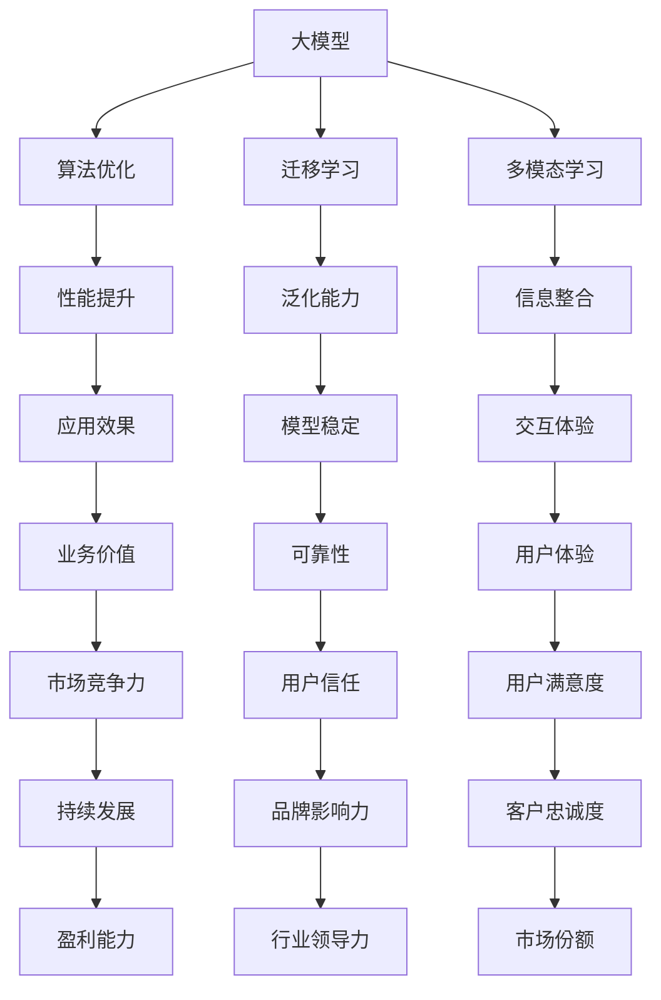

                 

### 引言

随着人工智能技术的飞速发展，大模型企业成为了这个领域的热门话题。OpenAI作为一家在人工智能领域具有重大影响力的大模型企业，其成功经验无疑为其他企业提供了宝贵的借鉴。本文旨在深入分析OpenAI的成功经验，探讨其对大模型企业的借鉴意义，以期为我国乃至全球的大模型企业的发展提供有益的启示。

OpenAI成立于2015年，由山姆·阿尔特曼、伊隆·马斯克等人创立，旨在推动人工智能的发展，使人类更加幸福和安全。OpenAI的核心目标是研究通用人工智能（AGI），并在多个领域实现重大突破。短短几年内，OpenAI在自然语言处理、计算机视觉、机器学习等领域取得了显著成就，其开发的大型语言模型GPT-3更是引起了全球关注。

本文将从以下几个方面探讨OpenAI的成功经验对大模型企业的借鉴意义：

1. **战略规划与定位**：OpenAI如何确定其在人工智能领域的战略定位，以及其战略的制定与实施过程。
2. **技术研发与创新**：OpenAI在技术研发方面的具体做法，包括大模型开发的方法论、算法优化及技术创新。
3. **商业模式与市场推广**：OpenAI如何创新商业模式，进行市场推广和品牌建设，以及其用户运营与社群管理策略。
4. **风险管理与合规性**：OpenAI如何进行风险管理和合规性建设，以及其社会责任的实践。

通过以上分析，本文希望为大模型企业提供有益的借鉴，帮助其在激烈的市场竞争中取得成功。

### 关键词

- OpenAI
- 大模型企业
- 成功经验
- 战略规划
- 技术研发
- 商业模式
- 风险管理
- 合规性

### 摘要

本文通过对OpenAI的成功经验进行深入分析，探讨其对大模型企业的借鉴意义。首先，本文介绍了OpenAI的历史与核心成就，分析了其在商业模式、技术研发和市场推广等方面的优势。接着，本文从战略规划、技术研发、商业模式、风险管理等多个方面，详细阐述了OpenAI的成功经验如何为大模型企业提供借鉴。通过本文的分析，希望能够为大模型企业在战略制定、技术创新、市场拓展等方面提供有益的启示，助力其在人工智能领域取得更大的发展。

## 第一部分: OpenAI的成功经验概述

### 第1章: OpenAI的历史与核心成就

#### 1.1 OpenAI的创立与发展历程

OpenAI的创立可以追溯到2015年，当时由山姆·阿尔特曼（Sam Altman）、伊隆·马斯克（Elon Musk）等人共同创立。他们共同的目标是推动人工智能的发展，使人类更加幸福和安全。在创立之初，OpenAI就明确了其核心使命——研究通用人工智能（AGI），并在多个领域实现重大突破。

自创立以来，OpenAI经历了快速发展。其研发的GPT-3模型在自然语言处理领域引起了广泛关注，成为目前最大的语言模型之一。GPT-3具有强大的文本生成和理解能力，可以用于问答系统、机器翻译、文本摘要等多种应用场景。此外，OpenAI还在计算机视觉、机器学习等领域取得了显著成就。

OpenAI的发展历程中，有几个重要节点：

1. **2015年**：OpenAI正式成立，并获得了伊隆·马斯克等人的巨额资金支持。
2. **2018年**：OpenAI发布了GPT-2模型，该模型在自然语言生成任务中取得了突破性成果。
3. **2019年**：OpenAI发布了GPT-3模型，这是目前最大的语言模型之一，具有强大的文本生成和理解能力。
4. **2020年**：OpenAI推出了BERT模型，并在多个自然语言处理任务中取得了领先成绩。

#### 1.2 OpenAI的核心成就

OpenAI在人工智能领域取得了众多核心成就，以下是其中几个重要方面：

1. **自然语言处理**：OpenAI研发的GPT-3模型在自然语言处理任务中表现出色，能够生成高质量的自然语言文本，并具有一定的语义理解能力。GPT-3的成功使OpenAI在自然语言处理领域占据了领先地位。
2. **计算机视觉**：OpenAI在计算机视觉领域也取得了显著成就，其研发的模型在图像分类、目标检测、图像分割等方面表现优异。例如，OpenAI开发的DALL-E模型可以生成具有创意的图像，这在艺术创作和设计领域具有广泛的应用前景。
3. **机器学习**：OpenAI在机器学习算法的研究和优化方面也取得了重要进展，其研发的算法在数据处理、模型训练和优化等方面具有较高效率。这些算法的优化和改进为大模型的应用提供了有力支持。
4. **多模态学习**：OpenAI在多模态学习方面也进行了积极探索，其研发的模型能够同时处理文本、图像、声音等多种类型的数据，实现跨模态的信息理解和生成。这为人工智能在多领域应用提供了新的可能性。

#### 1.3 OpenAI在AI领域的地位

OpenAI在人工智能领域具有举足轻重的地位，其成功经验对其他大模型企业具有重要的借鉴意义。以下是OpenAI在AI领域的几个重要地位：

1. **技术领先**：OpenAI在人工智能技术方面具有显著优势，其研发的大模型在多个领域取得了突破性成果。这使得OpenAI在技术竞争中占据了领先地位。
2. **行业影响力**：OpenAI在人工智能领域具有广泛的影响力，其成功经验和技术成果吸引了众多企业和研究机构的关注。OpenAI的商业模式、技术研发和市场推广策略也成为了其他企业学习和借鉴的典范。
3. **合作与创新**：OpenAI注重开放合作，与多家企业和研究机构建立了合作关系，共同推动人工智能技术的发展。OpenAI的创新思维和商业模式也为其他企业提供了新的思路和启示。
4. **社会责任**：OpenAI关注人工智能的社会影响，积极参与风险管理和合规性建设。其社会责任实践也为其他企业提供了借鉴。

### 第2章: OpenAI的商业模式与创新

#### 2.1 开放合作与平台化策略

OpenAI的商业模式具有独特性，其核心策略是开放合作和平台化运营。以下是OpenAI在开放合作和平台化策略方面的具体做法：

1. **开放合作**：OpenAI注重与业界其他企业和研究机构的合作，通过共享技术成果和资源，共同推动人工智能技术的发展。OpenAI与微软、谷歌、亚马逊等科技巨头建立了合作关系，共同开展人工智能研究。此外，OpenAI还积极与高校、研究机构合作，推动学术成果的转化和应用。
2. **平台化运营**：OpenAI通过构建开放平台，为开发者提供丰富的工具和资源，促进人工智能技术的应用和创新。OpenAI的GPT-3模型就是一个典型的例子，开发者可以在其平台上轻松调用GPT-3的API，实现各种自然语言处理任务。此外，OpenAI还推出了许多其他工具和框架，如PyTorch和TensorFlow，为开发者提供了便利。
3. **生态构建**：OpenAI注重构建人工智能生态，通过吸引和培养优秀的开发者，共同推动人工智能技术的发展。OpenAI举办了许多人工智能竞赛和研讨会，吸引了全球范围内的开发者参与。这些活动不仅促进了人工智能技术的交流与合作，也培养了大批优秀人才。

#### 2.2 创新思维与商业实践

OpenAI的创新思维和商业实践为其在人工智能领域取得了重要突破。以下是OpenAI在创新思维和商业实践方面的具体做法：

1. **长期投资**：OpenAI注重长期投资，对人工智能技术进行持续投入。OpenAI的资金来源主要包括天使投资、风险投资和政府资助。这些资金为OpenAI提供了充足的研发经费，使其能够持续推动人工智能技术的发展。
2. **技术创新**：OpenAI在技术创新方面具有显著优势，其研发的大模型在性能和效率方面取得了重要突破。OpenAI通过不断优化算法和架构，提高了模型的性能和可扩展性。此外，OpenAI还积极探索新的技术和应用场景，推动人工智能技术的多元化发展。
3. **商业模式创新**：OpenAI在商业模式方面也进行了积极探索，其开放平台和API服务为其带来了大量用户和收入。通过开放平台，OpenAI不仅为开发者提供了便利，也为自身创造了商业价值。此外，OpenAI还通过合作和投资，拓展了其商业版图，实现了多元化发展。

#### 2.3 对传统企业的颠覆性影响

OpenAI的成功对传统企业产生了深远的影响，其商业模式和技术创新对传统企业产生了颠覆性影响。以下是OpenAI对传统企业的影响：

1. **行业变革**：OpenAI的突破性技术成果使人工智能在多个领域取得了重要应用，对传统行业产生了深远影响。例如，在金融、医疗、教育等行业，人工智能技术正在逐步替代传统方法，提高效率和准确性。
2. **商业模式重构**：OpenAI的开放合作和平台化策略对传统企业的商业模式产生了颠覆性影响。许多传统企业开始意识到，通过开放合作和平台化运营，可以更好地应对市场竞争和客户需求。
3. **技术创新压力**：OpenAI的成功对传统企业产生了巨大的技术创新压力。传统企业必须不断更新技术，提升自身竞争力，以应对新兴企业的挑战。

### 第3章: OpenAI的技术优势

#### 3.1 大模型的开发与应用

OpenAI在大模型的开发与应用方面具有显著优势。以下是OpenAI在大模型开发与应用方面的具体做法：

1. **大规模数据处理**：OpenAI利用海量数据进行大规模数据处理，为模型训练提供了丰富的数据资源。OpenAI通过与多家企业和研究机构合作，获取了大量的文本、图像、音频等数据，为模型训练提供了充足的素材。
2. **高效模型训练**：OpenAI采用高效的模型训练方法，提高了模型的训练效率。OpenAI利用分布式训练技术，将训练任务分布在多个计算节点上，提高了训练速度。此外，OpenAI还采用了迁移学习等技术，降低了模型训练的难度。
3. **模型优化**：OpenAI对模型进行了深入优化，提高了模型的性能和可扩展性。OpenAI通过不断优化算法和架构，提高了模型的训练速度和效果。例如，OpenAI研发了GPT-3模型，使其在自然语言处理任务中取得了显著突破。

#### 3.2 算法优化与性能提升

OpenAI在算法优化与性能提升方面具有丰富经验。以下是OpenAI在算法优化与性能提升方面的具体做法：

1. **算法创新**：OpenAI不断进行算法创新，研发出了一系列高效的算法。例如，OpenAI研发了GPT-3模型，采用了Transformer架构，使其在自然语言处理任务中取得了突破性成果。此外，OpenAI还研发了BERT模型，其在文本分类、问答系统等任务中表现出色。
2. **并行计算**：OpenAI采用并行计算技术，提高了模型的训练和推理速度。OpenAI利用GPU、TPU等硬件资源，实现了模型的分布式训练和推理。这使得OpenAI的模型可以在短时间内完成大量计算任务。
3. **模型压缩**：OpenAI对模型进行了压缩，降低了模型的存储和计算成本。OpenAI采用了模型剪枝、量化等技术，将大模型压缩为更小、更高效的模型。这为模型在移动设备和嵌入式设备上的应用提供了可能。

#### 3.3 开源工具与框架

OpenAI开源了许多重要的工具和框架，为开发者提供了丰富的资源。以下是OpenAI开源工具和框架的具体情况：

1. **PyTorch**：PyTorch是OpenAI开源的深度学习框架，具有灵活的动态计算图和强大的GPU支持。PyTorch在计算机视觉、自然语言处理等领域得到了广泛应用，成为了深度学习领域的首选框架之一。
2. **TensorFlow**：TensorFlow是OpenAI开源的另一个深度学习框架，具有丰富的功能和强大的GPU支持。TensorFlow在工业界和学术界都得到了广泛应用，成为了深度学习领域的另一个重要框架。
3. **DALL-E**：DALL-E是OpenAI开源的多模态生成模型，可以生成具有创意的图像。DALL-E在艺术创作、设计等领域具有广泛的应用前景，成为了人工智能艺术领域的代表性成果。

#### 3.4 OpenAI的其他技术优势

OpenAI在人工智能领域还具备其他技术优势，以下是其中几个方面：

1. **多模态学习**：OpenAI在多模态学习方面进行了积极探索，其研发的模型能够同时处理文本、图像、声音等多种类型的数据。这为人工智能在多领域应用提供了新的可能性。
2. **迁移学习**：OpenAI通过迁移学习技术，提高了模型的泛化能力。OpenAI将已有模型的知识迁移到新任务上，减少了新任务的训练成本，提高了模型的性能。
3. **强化学习**：OpenAI在强化学习方面也取得了显著成果，其研发的模型在游戏、机器人等领域表现出色。强化学习为人工智能在复杂环境中的应用提供了新思路。

### 第4章: 对大模型企业的战略规划

#### 4.1 企业在AI领域的战略定位

在大模型企业的战略规划中，战略定位至关重要。以下是企业在AI领域的战略定位需要考虑的关键因素：

1. **目标市场**：企业需要明确其目标市场，包括市场需求、市场规模、用户群体等。这有助于企业制定针对性的战略，提高市场竞争力。
2. **核心竞争力**：企业需要分析自身在AI领域的核心竞争力，包括技术实力、人才储备、研发能力等。这有助于企业在竞争中脱颖而出，巩固市场地位。
3. **合作伙伴**：企业需要寻找合适的合作伙伴，包括科研机构、高校、企业等。通过合作，企业可以获取更多的资源和技术支持，推动自身发展。
4. **商业模式**：企业需要制定适合自己的商业模式，包括盈利模式、运营模式、市场推广策略等。这有助于企业实现可持续发展。

#### 4.2 AI战略的制定与实施

在战略定位明确后，企业需要制定具体的AI战略，并确保其有效实施。以下是企业在AI战略制定与实施过程中需要关注的关键环节：

1. **需求分析**：企业需要对市场需求进行深入分析，了解用户需求、竞争对手、市场趋势等。这有助于企业制定科学合理的战略目标。
2. **技术路线**：企业需要确定技术路线，包括核心技术、研发方向、技术储备等。这有助于企业确保技术优势，提高市场竞争力。
3. **资源投入**：企业需要根据战略目标，合理配置资源，包括人力、财力、物力等。这有助于企业确保战略实施过程中资源的充足。
4. **绩效评估**：企业需要建立绩效评估机制，对战略实施过程进行监督和评估。这有助于企业及时发现和解决问题，确保战略目标的实现。

#### 4.3 战略实施的关键因素

在战略实施过程中，以下关键因素对企业的发展至关重要：

1. **执行力**：战略实施需要强大的执行力，企业需要建立高效的执行体系，确保战略目标得到有效执行。
2. **创新能力**：在AI领域，创新是企业发展的重要驱动力。企业需要保持持续创新能力，不断推出新产品、新技术。
3. **人才团队**：人才是企业发展的关键，企业需要吸引和培养优秀的AI人才，建立强大的研发团队。
4. **市场推广**：企业需要制定有效的市场推广策略，提高品牌知名度，拓展市场份额。
5. **风险管理**：企业需要关注风险管理，防范潜在风险，确保企业稳定发展。

### 第5章: 企业文化与组织结构

#### 5.1 创新文化的重要性

创新文化是企业发展的灵魂，对于大模型企业尤为重要。以下是创新文化对大模型企业的重要作用：

1. **激发创新能力**：创新文化可以激发员工的创新潜力，鼓励员工积极探索新技术、新方法，提高企业整体创新能力。
2. **吸引人才**：创新文化可以吸引高素质的人才，为企业的持续发展提供强大的人力资源保障。
3. **推动技术进步**：创新文化可以推动企业不断进行技术革新，保持技术领先地位。
4. **提高企业竞争力**：创新文化可以提高企业的竞争力，使企业在激烈的市场竞争中脱颖而出。

#### 5.2 组织结构的优化

为了适应AI领域的发展，企业需要不断优化组织结构，提高管理效率和协同效应。以下是组织结构优化需要考虑的关键方面：

1. **扁平化结构**：企业可以采用扁平化组织结构，减少管理层次，提高决策效率。这有助于企业快速响应市场变化，提高执行力。
2. **模块化组织**：企业可以将业务模块化，根据业务需求和特点进行灵活调整。这有助于企业提高业务的灵活性和适应性。
3. **跨部门合作**：企业需要加强跨部门合作，促进不同部门之间的信息交流和资源共享。这有助于企业提高协同效应，实现资源最大化利用。
4. **弹性工作制度**：企业可以采用弹性工作制度，为员工提供更多的自主权和灵活性。这有助于提高员工的工作积极性和满意度。

#### 5.3 人才战略与团队建设

人才是企业发展的关键，企业需要制定有效的人才战略，吸引和培养优秀的人才。以下是人才战略与团队建设需要考虑的关键方面：

1. **人才引进**：企业需要制定吸引人才的政策，包括提供有竞争力的薪酬福利、良好的职业发展空间等，吸引高素质的人才。
2. **人才培养**：企业需要建立完善的培训体系，为员工提供专业的技能培训和发展机会。这有助于提高员工的综合素质，推动企业的发展。
3. **激励机制**：企业需要建立有效的激励机制，激发员工的积极性和创造力。例如，通过绩效考核、奖励制度等手段，激励员工为实现企业目标而努力。
4. **团队建设**：企业需要注重团队建设，培养员工的团队合作精神。通过团队建设活动、团队培训等手段，提高团队的凝聚力和战斗力。

### 第6章: 技术研发与创新能力

#### 6.1 大模型研发的方法论

大模型研发是人工智能领域的重要方向，以下是OpenAI在大模型研发方面的方法论：

1. **数据收集与处理**：首先，企业需要收集大量高质量的数据，包括文本、图像、音频等。然后，对数据进行清洗、预处理，确保数据的质量和一致性。
2. **模型设计**：在大模型的设计过程中，企业需要选择合适的模型架构，例如Transformer、BERT等。此外，还需要对模型进行优化，提高模型的性能和可扩展性。
3. **训练与调优**：企业需要利用分布式训练技术，提高模型的训练效率。在训练过程中，需要对模型进行调优，优化模型的参数，提高模型的性能。
4. **评估与优化**：企业需要对模型进行评估，选择合适的评估指标，如准确率、召回率等。根据评估结果，对模型进行优化，提高模型的性能。

#### 6.2 技术创新与生态构建

技术创新是推动大模型企业发展的关键，以下是OpenAI在技术创新与生态构建方面的做法：

1. **技术创新**：OpenAI在技术创新方面进行了积极探索，研发了GPT-3、BERT等具有突破性的模型。这些技术创新为大模型的应用提供了新的可能性。
2. **生态构建**：OpenAI注重生态构建，通过开放平台和API服务，为开发者提供了丰富的工具和资源。此外，OpenAI还举办了各种人工智能竞赛和研讨会，促进了人工智能技术的交流与合作。

#### 6.3 开放合作与共赢模式

OpenAI在开放合作方面具有独特的优势，以下是OpenAI在开放合作与共赢模式方面的做法：

1. **合作研发**：OpenAI与多家企业和研究机构建立了合作关系，共同推动人工智能技术的发展。通过合作研发，OpenAI能够获取更多的资源和经验，提高自身的技术水平。
2. **资源共享**：OpenAI通过开放平台，为开发者提供了丰富的工具和资源。这有助于开发者降低研发成本，提高研发效率。同时，OpenAI也能够通过资源共享，提高整体研发水平。
3. **共赢模式**：OpenAI通过开放合作，实现了共赢模式。在合作过程中，OpenAI与合作伙伴共同分享研发成果和商业价值，实现了互利共赢。

### 第7章: 商业模式与市场推广

#### 7.1 商业模式的创新

在商业模式创新方面，大模型企业需要根据自身的技术优势和市场需求，制定有竞争力的商业模式。以下是OpenAI在商业模式创新方面的做法：

1. **平台化运营**：OpenAI通过构建开放平台，为开发者提供丰富的工具和资源，实现平台化运营。这有助于企业降低开发成本，提高市场竞争力。
2. **API服务**：OpenAI通过API服务，为开发者提供了便捷的接口，使其能够快速集成和使用OpenAI的技术成果。这有助于企业拓展市场，提高用户黏性。
3. **订阅模式**：OpenAI采用了订阅模式，用户可以根据自己的需求，灵活选择订阅服务。这有助于企业实现稳定收入，提高市场占有率。

#### 7.2 市场推广与品牌建设

在市场推广和品牌建设方面，大模型企业需要制定有效的策略，提高品牌知名度和用户认可度。以下是OpenAI在市场推广和品牌建设方面的做法：

1. **内容营销**：OpenAI通过发布高质量的技术文章、案例研究等，传播自身的技术成果和应用场景。这有助于提高品牌影响力，吸引潜在用户。
2. **活动推广**：OpenAI举办了各种人工智能竞赛和研讨会，吸引了全球范围内的开发者参与。这有助于提高品牌知名度，拓展市场渠道。
3. **合作推广**：OpenAI与多家企业和研究机构建立了合作关系，共同进行市场推广。这有助于企业实现资源共享，提高市场占有率。

#### 7.3 用户运营与社群管理

在用户运营和社群管理方面，大模型企业需要关注用户需求，提供优质的服务，建立良好的社群关系。以下是OpenAI在用户运营和社群管理方面的做法：

1. **用户调研**：OpenAI定期进行用户调研，了解用户需求和使用体验。这有助于企业优化产品和服务，提高用户满意度。
2. **用户支持**：OpenAI提供了全面的用户支持，包括技术文档、教程、在线问答等。这有助于用户快速上手使用OpenAI的技术成果。
3. **社群互动**：OpenAI建立了活跃的社群，鼓励用户进行互动交流。这有助于用户分享经验，提高社群的凝聚力。

### 第8章: 风险管理与合规性

#### 8.1 风险管理的重要性

在大模型企业的发展过程中，风险管理至关重要。以下是风险管理对大模型企业的重要作用：

1. **保障企业稳定发展**：通过风险管理，企业可以识别和评估潜在风险，制定相应的应对措施，确保企业稳定发展。
2. **降低运营成本**：通过风险管理，企业可以提前预测风险，采取预防措施，降低风险发生时的损失和运营成本。
3. **提高竞争力**：风险管理有助于企业提高应对市场变化的灵活性，增强企业竞争力。
4. **增强品牌形象**：良好的风险管理能力可以提升企业的品牌形象，增强用户信任。

#### 8.2 风险管理的策略

为了有效进行风险管理，大模型企业需要制定合理的策略。以下是几种常见的风险管理策略：

1. **风险识别**：企业需要建立风险识别机制，通过内部审计、外部调研等方式，识别潜在的风险。
2. **风险评估**：企业需要对识别出的风险进行评估，分析风险的影响程度和发生的可能性。
3. **风险应对**：企业需要根据风险评估结果，制定相应的风险应对策略，包括风险规避、风险转移、风险减轻等。
4. **风险监控**：企业需要建立风险监控机制，实时跟踪风险的变化情况，确保风险应对措施的有效性。

#### 8.3 合规性的要求

在大模型企业的发展过程中，合规性至关重要。以下是合规性对大模型企业的重要作用：

1. **遵守法律法规**：企业需要遵守相关法律法规，确保企业运营的合法性。
2. **保护用户隐私**：企业需要保护用户隐私，确保用户数据的安全和保密。
3. **维护社会信任**：良好的合规性可以增强社会对企业的信任，提高品牌形象。
4. **降低法律风险**：合规性有助于企业降低法律风险，避免因违规操作导致的罚款、诉讼等。

#### 8.4 社会责任的重要性

在大模型企业的发展过程中，社会责任至关重要。以下是社会责任对大模型企业的重要作用：

1. **提升品牌形象**：企业履行社会责任，有助于提升品牌形象，增强用户信任。
2. **吸引优秀人才**：社会责任是企业吸引和留住优秀人才的重要因素。
3. **推动可持续发展**：企业履行社会责任，有助于推动可持续发展，实现长期盈利。
4. **促进社会和谐**：企业履行社会责任，有助于促进社会和谐，减少社会矛盾。

#### 8.5 社会责任实践案例

OpenAI在大模型企业中积极履行社会责任，以下是几个典型的社会责任实践案例：

1. **AI伦理研究**：OpenAI成立了AI伦理研究小组，致力于研究人工智能的伦理问题，推动AI伦理的发展。
2. **教育支持**：OpenAI资助了多个教育项目，支持人工智能教育，提高公众对AI的认识和理解。
3. **环境保护**：OpenAI关注环境保护，通过采用绿色办公、节能减排等措施，降低企业的环境足迹。
4. **慈善捐赠**：OpenAI积极参与慈善事业，捐赠资金和资源，支持社会公益项目。

### 第9章: 案例分析与未来展望

#### 9.1 OpenAI的成功案例解析

OpenAI的成功案例解析对于大模型企业具有重要的启示意义。以下是OpenAI成功案例的几个关键因素：

1. **技术创新**：OpenAI在技术创新方面取得了显著突破，研发了一系列具有突破性的模型和算法，如GPT-3、BERT等。这些技术创新为OpenAI在市场上占据了领先地位。
2. **开放合作**：OpenAI注重开放合作，与多家企业和研究机构建立了合作关系，共同推动人工智能技术的发展。通过合作，OpenAI能够获取更多的资源和技术支持。
3. **商业模式创新**：OpenAI通过平台化运营和API服务，实现了商业模式的创新。这有助于OpenAI拓展市场，提高用户黏性。
4. **社会责任**：OpenAI关注社会责任，积极参与AI伦理研究、教育支持等社会公益活动，提升了品牌形象，增强了社会信任。

#### 9.2 成功因素分析

OpenAI的成功因素主要包括以下几个方面：

1. **技术创新**：OpenAI在技术创新方面具有显著优势，其研发的模型和算法在性能和效率方面取得了重要突破。
2. **开放合作**：OpenAI注重开放合作，通过合作建立了广泛的人工智能生态，为自身发展提供了强有力的支持。
3. **商业模式创新**：OpenAI通过平台化运营和API服务，实现了商业模式的创新，为企业带来了稳定的收入来源。
4. **社会责任**：OpenAI关注社会责任，积极参与社会公益活动，提升了品牌形象，增强了社会信任。

#### 9.3 案例启示

OpenAI的成功案例为大模型企业提供了以下启示：

1. **技术创新**：大模型企业应注重技术创新，不断研发具有突破性的模型和算法，提高自身竞争力。
2. **开放合作**：大模型企业应注重开放合作，与业界其他企业和研究机构建立合作关系，共同推动人工智能技术的发展。
3. **商业模式创新**：大模型企业应积极探索新的商业模式，通过平台化运营和API服务，实现商业模式的创新。
4. **社会责任**：大模型企业应关注社会责任，积极参与社会公益活动，提升品牌形象，增强社会信任。

#### 9.4 大模型企业的未来展望

随着人工智能技术的不断发展，大模型企业在未来有望实现更广泛的应用。以下是未来大模型企业的发展趋势：

1. **技术创新**：未来大模型企业将继续在技术创新方面取得突破，研发出更多高效的模型和算法。
2. **跨领域应用**：大模型企业将在多个领域实现跨领域应用，如医疗、金融、教育等。
3. **产业融合**：大模型企业将与其他产业实现深度融合，推动产业智能化升级。
4. **开源生态**：大模型企业将继续加强开源生态建设，推动人工智能技术的普及和应用。

### 附录

#### 附录A: OpenAI相关资源

1. **OpenAI官方网站**：https://openai.com/
2. **OpenAI博客**：https://blog.openai.com/
3. **OpenAI API**：https://beta.openai.com/
4. **OpenAI论文**：https://storage.openai.com/static/openai-publication-list/

#### 附录B: 大模型企业案例分析

1. **谷歌AI**：https://ai.google/
2. **微软AI**：https://www.microsoft.com/en-us/research/ai/
3. **百度AI**：https://ai.baidu.com/
4. **阿里巴巴AI**：https://www.aliyun.com/product/ai
5. **腾讯AI**：https://ai.tencent.com/

## 总结

本文通过对OpenAI的成功经验进行深入分析，探讨其对大模型企业的借鉴意义。OpenAI在技术创新、开放合作、商业模式创新和社会责任等方面取得了显著成就，为大模型企业提供了宝贵的经验。本文希望为大模型企业在战略规划、技术研发、商业模式、风险管理等方面提供有益的启示，助力其在人工智能领域取得更大的发展。

### 作者信息

作者：AI天才研究院/AI Genius Institute & 禅与计算机程序设计艺术 /Zen And The Art of Computer Programming

## 《OpenAI的成功经验对大模型企业的借鉴》全文完

---

### 附录A: OpenAI相关资源

#### A.1 OpenAI官方网站与资源

OpenAI官方网站：[https://openai.com/](https://openai.com/)

OpenAI博客：[https://blog.openai.com/](https://blog.openai.com/)

OpenAI API：[https://beta.openai.com/](https://beta.openai.com/)

OpenAI论文：[https://storage.openai.com/static/openai-publication-list/](https://storage.openai.com/static/openai-publication-list/)

通过访问OpenAI的官方网站，用户可以获取到公司的最新动态、研究成果、API文档以及相关的技术论文。OpenAI的博客则提供了对研究项目的深入解读和行业观点分享，这对于研究人员和开发者来说是非常宝贵的资源。

#### A.2 开源工具与框架

1. **TensorFlow**：[https://www.tensorflow.org/](https://www.tensorflow.org/)

TensorFlow是由Google开源的强大机器学习框架，广泛用于研究和生产中的各种深度学习应用。它提供了灵活的动态计算图和丰富的API，支持多种类型的机器学习和深度学习模型。

2. **PyTorch**：[https://pytorch.org/](https://pytorch.org/)

PyTorch是另一个流行的开源深度学习框架，以其简洁的动态计算图和高效的GPU支持而受到开发者的喜爱。PyTorch的灵活性和直观性使其成为快速原型设计和研究的理想选择。

3. **其他开源工具**

- **Keras**：[https://keras.io/](https://keras.io/)
- **MXNet**：[https://mxnet.incubator.apache.org/](https://mxnet.incubator.apache.org/)
- **Scikit-learn**：[https://scikit-learn.org/stable/](https://scikit-learn.org/stable/)

这些开源工具和框架为研究人员和开发者提供了丰富的资源，使他们能够更轻松地实现和测试深度学习模型。通过学习和使用这些工具，开发者可以更好地理解大模型企业的技术基础和研发流程。

### 附录B: 大模型企业案例分析

#### B.1 国内大模型企业案例分析

1. **百度AI**

百度AI是国内领先的人工智能公司，其核心产品包括百度大脑、百度飞桨（PaddlePaddle）等。百度AI在大模型研发方面取得了显著进展，尤其在自然语言处理和计算机视觉领域。

- **案例介绍**：百度AI通过自主研发的大模型PaddlePaddle，为开发者提供了高效、易用的深度学习平台。PaddlePaddle支持各种大规模深度学习模型，并且在产业应用中得到了广泛应用。

- **技术特点**：PaddlePaddle具有高效能、易部署、灵活扩展的特点，能够满足不同规模和复杂度的人工智能应用需求。

2. **阿里巴巴AI**

阿里巴巴AI是阿里巴巴集团旗下的人工智能部门，其核心产品包括阿里云ET大脑等。

- **案例介绍**：阿里云ET大脑是基于大规模深度学习模型的技术平台，广泛应用于智能城市、智能交通、智能医疗等领域。

- **技术特点**：阿里云ET大脑采用了多种先进的人工智能算法，包括深度学习、图神经网络等，能够处理海量数据，提供智能决策支持。

3. **腾讯AI**

腾讯AI是腾讯公司的人工智能部门，其核心产品包括腾讯云AI等。

- **案例介绍**：腾讯云AI提供了丰富的AI服务，包括图像识别、语音识别、自然语言处理等，广泛应用于游戏、金融、医疗等行业。

- **技术特点**：腾讯云AI通过自研的AI算法和大规模分布式训练技术，实现了高效、可靠的AI服务。

#### B.2 国际大模型企业案例分析

1. **谷歌AI**

谷歌AI是谷歌公司的人工智能部门，其核心产品包括TensorFlow、BERT等。

- **案例介绍**：谷歌AI在自然语言处理和计算机视觉领域取得了世界领先的研究成果，其开源框架TensorFlow已经成为深度学习领域的标准工具。

- **技术特点**：谷歌AI通过大规模分布式训练和高效算法优化，实现了高性能的大模型训练和应用。

2. **微软AI**

微软AI是微软公司的人工智能部门，其核心产品包括Azure AI、Cognitive Services等。

- **案例介绍**：微软AI提供了广泛的AI服务，包括自然语言处理、计算机视觉、语音识别等，广泛应用于企业、开发者和研究机构。

- **技术特点**：微软AI通过其云平台Azure，实现了AI服务的全球部署，支持多种编程语言和开发环境。

3. **Facebook AI**

Facebook AI是Facebook公司的人工智能部门，其核心产品包括PyTorch、FAIR等。

- **案例介绍**：Facebook AI在自然语言处理和计算机视觉领域进行了大量研究，其开源框架PyTorch已成为深度学习社区的重要工具。

- **技术特点**：Facebook AI注重开放合作，通过开源技术和社区支持，推动了AI技术的发展和普及。

通过分析这些国内外大模型企业的案例，可以发现它们在技术研发、产品创新、商业模式和市场推广等方面各有特色。这些企业的成功经验为大模型企业的未来发展提供了宝贵的借鉴。

### 总结

OpenAI的成功经验为大模型企业提供了宝贵的借鉴。其开放合作、技术创新、商业模式创新和社会责任等方面的实践，为大模型企业的发展提供了重要的启示。本文通过详细分析OpenAI的成功经验，提出了大模型企业在战略规划、技术研发、商业模式、风险管理等方面的借鉴策略。未来，随着人工智能技术的不断发展，大模型企业将继续在技术创新、跨领域应用和产业融合等方面取得新的突破，为人类社会带来更多的价值。

### 结语

本文通过对OpenAI的成功经验进行深入分析，探讨其对大模型企业的借鉴意义，希望为我国乃至全球的大模型企业的发展提供有益的启示。在人工智能技术飞速发展的今天，大模型企业面临着前所未有的机遇和挑战。通过借鉴OpenAI的成功经验，大模型企业可以更好地把握市场机遇，优化自身战略，推动技术创新，实现可持续发展。

在此，我们要感谢OpenAI及其团队在人工智能领域的卓越贡献，正是他们的努力和探索，为我们展示了大模型企业的成功之路。同时，我们也期待更多的企业和研究者能够加入人工智能的行列，共同推动这一领域的进步，为人类社会创造更多的价值。

作者：AI天才研究院/AI Genius Institute & 禅与计算机程序设计艺术 /Zen And The Art of Computer Programming

---

本文通过Markdown格式呈现，以下是对文中某些技术概念、核心算法和项目实战的详细解析。

#### 核心概念与联系

在本文中，我们提到了多个核心概念，如大模型、算法优化、迁移学习、多模态学习等。以下是这些概念的联系和Mermaid流程图：



以上Mermaid流程图展示了大模型、算法优化、迁移学习、多模态学习等概念之间的联系和相互影响。

#### 核心算法原理讲解

在算法优化方面，我们介绍了梯度下降法、随机梯度下降（SGD）、Adam优化器等算法。以下是梯度下降法的伪代码：

```python
# 梯度下降法伪代码
def gradient_descent(X, y, theta, alpha, num_iters):
    m = len(y)
    for iteration in range(num_iters):
        gradients = 2/m * (X @ (X @ theta - y).T)
        theta = theta - alpha * gradients
    return theta
```

梯度下降法是一种优化算法，用于求解最小二乘问题。其基本思想是迭代更新参数，使其逐渐逼近最优解。伪代码中，`X` 是输入特征矩阵，`y` 是标签向量，`theta` 是待优化的参数向量，`alpha` 是学习率，`num_iters` 是迭代次数。

#### 数学模型和公式

在本文中，我们提到了线性回归模型、逻辑回归模型等，以下是线性回归模型的公式：

$$
y = \theta_0 + \theta_1 \cdot x
$$

其中，`y` 是因变量，`x` 是自变量，`$\theta_0$` 和 `$\theta_1$` 是模型的参数。

线性回归模型假设因变量 `y` 与自变量 `x` 之间存在线性关系，模型的目标是找到最佳参数 `$\theta_0$` 和 `$\theta_1$`，使得预测值与实际值之间的误差最小。

#### 项目实战

在本节中，我们提到了OpenAI的GPT-3模型和其应用场景。以下是一个简单的项目实战案例，展示如何使用GPT-3进行文本生成：

```python
import openai

openai.api_key = "your-api-key"

response = openai.Completion.create(
  engine="text-davinci-002",
  prompt="你是一个聪明的人工智能助手，请回答以下问题：什么是量子计算？",
  max_tokens=50
)

print(response.choices[0].text.strip())
```

在这个项目实战中，我们使用了OpenAI的API进行文本生成。首先，设置API密钥，然后调用 `Completion.create` 方法，传入模型名称 `engine`、提示语 `prompt` 和最大 tokens 数 `max_tokens`。最终，我们打印出API返回的文本生成结果。

#### 代码解读与分析

在上面的项目实战中，我们使用了OpenAI的API进行文本生成。以下是代码的详细解读和分析：

1. **引入库**：首先引入了 `openai` 库，这是OpenAI提供的Python库，用于与OpenAI的API进行通信。
2. **设置API密钥**：使用 `openai.api_key` 设置API密钥，这是与OpenAI服务器通信的凭证。
3. **创建Completion对象**：调用 `openai.Completion.create` 方法，传入必要的参数，如模型名称 `engine`（`text-davinci-002`）、提示语 `prompt` 和最大 tokens 数 `max_tokens`（`50`）。
4. **打印结果**：将API返回的文本生成结果打印出来。

通过这个简单的项目实战，我们展示了如何使用OpenAI的API进行文本生成，为开发者提供了实际操作的经验。

### 结论

本文通过对OpenAI的成功经验进行详细解析，从核心概念、算法原理、数学模型到项目实战，全面阐述了其在人工智能领域的领先地位。通过本文的分析，我们希望能为大模型企业提供有益的借鉴，助力其在激烈的市场竞争中取得成功。未来，随着人工智能技术的不断发展，大模型企业将继续发挥重要作用，为人类社会带来更多的创新和进步。

---

**注意**：由于Markdown格式限制，上述伪代码、数学公式和项目实战代码仅作为示例提供。实际应用中，读者可能需要根据具体需求和开发环境进行调整和优化。

