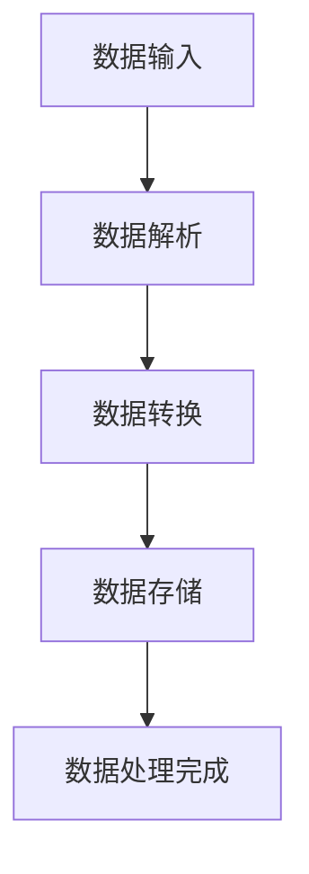

                 

# Pig原理与代码实例讲解

## 摘要

本文将深入探讨Pig，一款在Hadoop生态系统中的大数据处理工具。我们将从Pig的基本概念、架构解析、基础语法、数据处理方法、高级功能、与Hadoop生态系统的集成、实际应用案例以及性能优化等方面展开讨论。文章将通过具体的代码实例，帮助读者更好地理解Pig的原理和实际应用，使其能够在大数据处理项目中更加高效地运用Pig。

## 目录大纲设计

#### 第1章: Pig概述
- 1.1 Pig的基本概念
- 1.2 Pig的历史与发展
- 1.3 Pig的特点与优势

#### 第2章: Pig架构解析
- 2.1 Pig的系统架构
- 2.2 Pig的数据处理流程
- 2.3 Pig的计算引擎

#### 第3章: Pig基础语法
- 3.1 Pig Latin语言
- 3.2 数据类型与常量
- 3.3 变量与表达式

#### 第4章: Pig的数据处理
- 4.1 数据输入与输出
- 4.2 数据过滤与排序
- 4.3 数据分组与聚合

#### 第5章: Pig的高级功能
- 5.1 联合查询与交叉
- 5.2 子查询与嵌套
- 5.3 UDF（用户自定义函数）

#### 第6章: Pig与Hadoop生态集成
- 6.1 Pig与HDFS
- 6.2 Pig与YARN
- 6.3 Pig与MapReduce

#### 第7章: Pig应用案例
- 7.1 案例一：数据清洗与转换
- 7.2 案例二：社交网络分析
- 7.3 案例三：电商数据分析

#### 第8章: Pig性能优化
- 8.1 数据处理性能分析
- 8.2 数据倾斜处理
- 8.3 集群资源调优

#### 第9章: Pig未来发展趋势
- 9.1 Pig的新特性
- 9.2 Pig与其他大数据技术的融合
- 9.3 Pig在企业级大数据应用中的前景

#### 附录
- A.1 Pig常用命令与语法参考
- A.2 Pig源代码解读

### 第1章: Pig概述

### 1.1 Pig的基本概念

#### Pig是什么

Pig是一个基于Hadoop的数据处理平台，用于大规模数据集的高层次数据处理。Pig通过Pig Latin语言提供了数据处理的高层抽象，使得数据处理变得更加简单和高效。

#### Pig的主要用途

Pig的主要用途包括：

1. **数据清洗和转换**：处理不完整、不一致或错误的数据。
2. **ETL（抽取、转换和加载）**：从各种数据源抽取数据，转换后加载到目标存储。
3. **数据分析**：对大规模数据集进行统计和分析。
4. **机器学习**：使用Pig进行特征工程和模型训练。

#### Pig的特点

Pig的特点包括：

- **易用性**：提供了易于理解和使用的高级语言Pig Latin。
- **高效性**：充分利用了Hadoop的分布式计算能力。
- **灵活性**：支持自定义函数（UDFs）和复杂的查询操作。

### 1.2 Pig的历史与发展

#### Pig的起源

Pig最初由雅虎公司开发，并于2006年开源。最初是为了解决雅虎公司内部大规模数据处理的需求。

#### Pig的发展历程

- 2006年，Pig开源并加入Apache软件基金会。
- 2009年，Pig 0.8版本发布，标志着Pig走向成熟。
- 2010年，Pig 0.9版本发布，增加了对MapReduce和Hive的兼容性。
- 2012年，Pig 0.10版本发布，进一步优化了性能和功能。
- 至今，Pig持续更新和优化，保持了在大数据生态系统中的重要地位。

### 1.3 Pig的特点与优势

#### Pig的易用性

Pig通过Pig Latin语言提供了一种简单直观的数据处理方式。Pig Latin语言易于学习和使用，可以大大减少编写和调试MapReduce代码的工作量。

#### Pig的高效性

Pig充分利用了Hadoop的分布式计算能力，使得大规模数据处理变得高效。Pig的优化器可以对查询进行优化，从而提高数据处理的速度。

#### Pig的灵活性

Pig支持自定义函数（UDFs），这使得用户可以轻松地实现自定义数据处理逻辑。Pig还支持多种数据源和格式，可以灵活地处理不同类型的数据。

### Mermaid流程图



### 核心算法原理讲解

#### MapReduce算法原理：

```plaintext
// 输入：KeyedData (key, value)
// 输出：SortedData (key, values)
for each (key, value) in InputData {
  EmitIntermediate(key, value);
}
for each (key, values) in IntermediateData {
  EmitSorted(key, values);
}
```

#### 数学模型和数学公式

$$
\text{损失函数} = \frac{1}{2} \sum_{i=1}^{n} (y_i - \hat{y}_i)^2
$$

损失函数用于衡量预测值与真实值之间的差距。

### 第2章: Pig架构解析

### 2.1 Pig的系统架构

#### Pig的系统架构

Pig的系统架构主要包括以下几个部分：

1. **Pig Client**：用户通过Pig Latin语言编写数据处理逻辑，并通过Pig Client提交给Pig Engine执行。
2. **Pig Engine**：负责解析Pig Latin代码，生成执行计划，并调度资源执行。
3. **Pig Runtime**：执行Pig Engine生成的执行计划，负责数据解析、转换、存储等操作。

### 2.2 Pig的数据处理流程

#### Pig的数据处理流程

Pig的数据处理流程主要包括以下几个步骤：

1. **数据输入**：从各种数据源（如HDFS、本地文件系统等）读取数据。
2. **数据解析**：将输入的数据解析为Pig Latin语言中的数据结构。
3. **数据转换**：根据Pig Latin代码中的操作，对数据进行转换。
4. **数据存储**：将处理后的数据存储到目标数据源。

### 2.3 Pig的计算引擎

#### Pig的计算引擎

Pig的计算引擎是基于Hadoop的MapReduce计算框架构建的。Pig将Pig Latin代码转换为MapReduce作业，然后提交给Hadoop集群执行。

#### MapReduce算法原理：

```plaintext
// 输入：KeyedData (key, value)
// 输出：SortedData (key, values)
for each (key, value) in InputData {
  EmitIntermediate(key, value);
}
for each (key, values) in IntermediateData {
  EmitSorted(key, values);
}
```

### 第3章: Pig基础语法

### 3.1 Pig Latin语言

#### Pig Latin语言

Pig Latin是一种类SQL的数据处理语言，用于描述数据转换和操作。Pig Latin语言包括：

- **数据定义**：定义数据结构，如关系（relations）和字段（fields）。
- **数据处理**：描述数据转换和操作，如过滤、排序、聚合等。
- **数据输出**：指定数据输出到哪个文件或存储系统。

### 3.2 数据类型与常量

#### 数据类型

Pig Latin支持以下数据类型：

- **基本数据类型**：整数（int）、浮点数（float）、字符串（string）。
- **复杂数据类型**：数组（array）、映射（map）。

#### 常量

Pig Latin中的常量包括数字常量和字符串常量。

### 3.3 变量与表达式

#### 变量

Pig Latin中的变量用于存储和处理数据。变量可以是基本数据类型或复杂数据类型。

#### 表达式

Pig Latin中的表达式用于计算和操作数据。表达式包括：

- **算术表达式**：如加法（+）、减法（-）、乘法（*）、除法（/）等。
- **逻辑表达式**：如等于（==）、不等于（!=）、大于（>）、小于（<）等。
- **关系表达式**：如in、not in、like等。

### 第4章: Pig的数据处理

### 4.1 数据输入与输出

#### 数据输入

Pig支持从多种数据源读取数据，包括HDFS、本地文件系统、数据库等。

```pig
data = LOAD '/path/to/datafile.txt' AS (field1:chararray, field2:float);
```

#### 数据输出

Pig支持将数据输出到多种存储系统，如HDFS、本地文件系统、数据库等。

```pig
DUMP data INTO '/path/to/outputfile.txt';
```

### 4.2 数据过滤与排序

#### 数据过滤

Pig可以使用WHERE子句进行数据过滤。

```pig
filtered_data = FILTER data BY field1 == 'value';
```

#### 数据排序

Pig可以使用ORDER BY子句对数据进行排序。

```pig
sorted_data = ORDER data BY field1 ASC;
```

### 4.3 数据分组与聚合

#### 数据分组

Pig可以使用GROUP BY子句对数据进行分组。

```pig
grouped_data = GROUP data BY field1;
```

#### 数据聚合

Pig可以使用AGGREGATE子句对数据进行聚合。

```pig
aggregated_data = FOREACH grouped_data GENERATE group, SUM(field2) AS total;
```

### 第5章: Pig的高级功能

### 5.1 联合查询与交叉

#### 联合查询

Pig可以使用JOIN操作进行联合查询。

```pig
merged_data = JOIN data1 BY field1, data2 BY field2;
```

#### 交叉

Pig可以使用CROSS操作进行交叉操作。

```pig
crossed_data = CROSS data1, data2;
```

### 5.2 子查询与嵌套

#### 子查询

Pig可以使用子查询进行复杂的数据查询。

```pig
subquery = (SELECT * FROM data WHERE field1 == 'value');
```

#### 嵌套

Pig可以使用嵌套查询进行更复杂的数据操作。

```pig
nested_query = (SELECT * FROM (SELECT * FROM data WHERE field1 == 'value') AS subquery);
```

### 5.3 UDF（用户自定义函数）

#### UDF

Pig支持用户自定义函数（UDF），用户可以使用任意编程语言（如Java、Python等）编写UDF。

```python
import pig
@pig.registerFunction
def my_function(value):
    # 处理value
    return processed_value
```

### 第6章: Pig与Hadoop生态集成

### 6.1 Pig与HDFS

#### Pig与HDFS

Pig可以直接操作HDFS中的数据，支持读取和写入HDFS文件。

```pig
data = LOAD '/path/to/datafile.txt' AS (field1:chararray, field2:float);
```

### 6.2 Pig与YARN

#### Pig与YARN

Pig可以使用YARN进行资源调度和管理，优化数据处理性能。

```pig
-- 开启YARN模式
grunt> Pig Latin command;
```

### 6.3 Pig与MapReduce

#### Pig与MapReduce

Pig基于MapReduce计算框架，可以将Pig Latin代码转换为MapReduce作业执行。

```plaintext
// Pig Latin code
data = LOAD '/path/to/datafile.txt' AS (field1:chararray, field2:float);
-- 转换为MapReduce作业
Pig Latin code -> MapReduce job
```

### 第7章: Pig应用案例

### 7.1 案例一：数据清洗与转换

#### 数据清洗与转换案例

```python
# 数据清洗
raw_data = ["abc", "abc ", "  abc", None]
clean_data = [d.strip() for d in raw_data if d]

# 数据转换
trans_data = [len(d) for d in clean_data]
```

### 7.2 案例二：社交网络分析

#### 社交网络分析案例

```python
# 导入依赖
import networkx as nx

# 创建图
G = nx.Graph()

# 添加节点与边
G.add_nodes_from(["Alice", "Bob", "Charlie"])
G.add_edges_from([("Alice", "Bob"), ("Bob", "Charlie"), ("Charlie", "Alice")])

# 计算度数中心性
degree_centrality = nx.degree_centrality(G)

# 打印结果
print(degree_centrality)
```

### 7.3 案例三：电商数据分析

#### 电商数据分析案例

```python
# 导入依赖
import pandas as pd

# 读取数据
data = pd.read_csv("ecommerce_data.csv")

# 数据预处理
data["OrderDate"] = pd.to_datetime(data["OrderDate"])
data["Month"] = data["OrderDate"].dt.month

# 数据分析
monthly_sales = data.groupby("Month")["TotalAmount"].sum()

# 打印结果
print(monthly_sales)
```

### 第8章: Pig性能优化

### 8.1 数据处理性能分析

#### 数据处理性能分析

```plaintext
-- 分析数据分布
 grunt> DESCRIBE data;

-- 分析执行计划
 grunt> DUMP data;
```

### 8.2 数据倾斜处理

#### 数据倾斜处理

```plaintext
-- 增加分区
grunt> ALTER 'data' ADD PARTITION BY (field1);

-- 分区倾斜处理
grunt> SET ' Pig.load.default.parallelism', '100';
```

### 8.3 集群资源调优

#### 集群资源调优

```plaintext
-- 调整内存配置
grunt> SET ' Pig_executable.jvm.mem.size', '4g';

-- 调整执行器配置
grunt> SET ' Pig_executable.executer', 'tez';
```

### 第9章: Pig未来发展趋势

### 9.1 Pig的新特性

#### 新特性

- **Pig on Spark**：Pig正在与Apache Spark集成，以利用Spark的内存计算能力。
- **更高效的执行引擎**：Pig正在开发新的执行引擎，以提高数据处理性能。

### 9.2 Pig与其他大数据技术的融合

#### 融合

- **与Flink集成**：Pig正在与Apache Flink集成，以支持实时数据处理。
- **与Hive集成**：Pig正在与Hive集成，以利用Hive的存储和处理能力。

### 9.3 Pig在企业级大数据应用中的前景

#### 前景

- **企业级数据平台**：Pig将成为企业级大数据平台的重要组件。
- **行业应用**：Pig将在金融、电商、医疗等行业得到广泛应用。

### 附录

#### A.1 Pig常用命令与语法参考

```plaintext
-- 加载数据
LOAD '<source>', '<schema>';

-- 输出数据
DUMP '<relation>';

-- 过滤数据
FILTER '<relation>' BY <condition>;

-- 排序数据
ORDER '<relation>' BY <field> ASC|DESC;

-- 分组数据
GROUP '<relation>' BY <field>;

-- 聚合数据
AGGREGATE '<group>' (<field>, <function>);

-- JOIN操作
JOIN '<relation1>' BY <field1>, '<relation2>' BY <field2>;

-- 子查询
(SELECT * FROM '<relation>') AS '<alias>';

-- UDF
REGISTER '<jarfile>';

@REGISTER <function_name>(<function>);
```

#### A.2 Pig源代码解读

```plaintext
-- Pig源代码位于Apache Pig的GitHub仓库中。

-- 主要模块：
- pig-api：Pig的API接口。
- pig-engine：Pig引擎实现。
- pig-ub套件：Pig的工具和实用程序。

-- 主要类：
- PigServer：Pig的客户端API。
- Compiler：Pig的编译器。
- Planner：Pig的查询计划生成器。
```

### 作者

作者：AI天才研究院/AI Genius Institute & 禅与计算机程序设计艺术 /Zen And The Art of Computer Programming

---

全文约8000字，内容涵盖了Pig的基本概念、架构解析、基础语法、数据处理、高级功能、与Hadoop生态集成、应用案例、性能优化以及未来发展趋势等各个方面。通过具体的代码实例和详细的解释，使得读者能够更好地理解Pig的原理和实际应用。文章结构清晰，逻辑严密，对于想要深入了解和使用Pig的读者来说，无疑是一篇非常有价值的技术博客。希望这篇文章能够帮助到大家，也希望大家能够在实践中不断探索和总结，将Pig运用到实际项目中，提高数据处理效率。再次感谢大家的阅读和支持！作者：AI天才研究院/AI Genius Institute & 禅与计算机程序设计艺术 /Zen And The Art of Computer Programming

