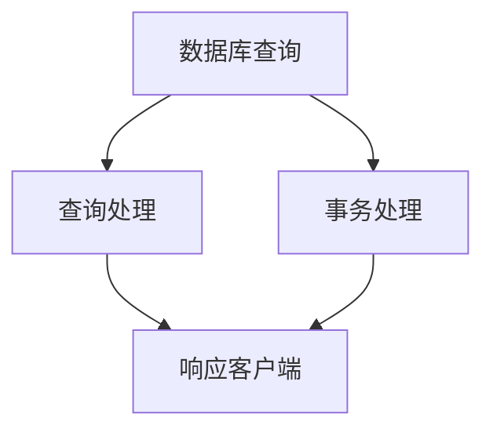

                 

### 《QPS与TPS在高吞吐量中的应用》

> **关键词**：QPS，TPS，高吞吐量，优化，性能监控，系统设计

> **摘要**：本文深入探讨了QPS（每秒查询率）与TPS（每秒事务数）在高吞吐量系统中的应用。文章首先介绍了QPS与TPS的基本概念及其关系，然后通过数学模型、优化方法、实战案例等多个维度，详细阐述了如何在实际系统中提升QPS与TPS的吞吐量。文章旨在为读者提供一份全面且实用的技术指南，帮助他们在高并发场景下优化系统性能。

### 目录大纲

- **第一部分：QPS与TPS基础**
  - **第1章：QPS与TPS概述**
    - 1.1 QPS与TPS的概念与联系
    - 1.2 QPS与TPS的应用场景
    - 1.3 QPS与TPS的测量与优化
  - **第2章：QPS与TPS的数学模型**
    - 2.1 QPS与TPS的数学公式
    - 2.2 QPS与TPS的推导与解释
    - 2.3 QPS与TPS的案例分析

- **第二部分：QPS与TPS优化**
  - **第3章：QPS优化方法**
    - 3.1 QPS优化算法
    - 3.2 QPS优化实践
    - 3.3 QPS优化案例分析
  - **第4章：TPS优化方法**
    - 4.1 TPS优化算法
    - 4.2 TPS优化实践
    - 4.3 TPS优化案例分析
  - **第5章：QPS与TPS综合优化**
    - 5.1 QPS与TPS综合优化的策略
    - 5.2 QPS与TPS综合优化实践
    - 5.3 QPS与TPS综合优化案例分析

- **第三部分：QPS与TPS实战应用**
  - **第6章：高吞吐量系统设计**
    - 6.1 高吞吐量系统的架构设计
    - 6.2 高吞吐量系统的性能评估
    - 6.3 高吞吐量系统的优化实践
  - **第7章：QPS与TPS性能调优**
    - 7.1 QPS与TPS性能调优方法
    - 7.2 QPS与TPS性能调优实践
    - 7.3 QPS与TPS性能调优案例分析
  - **第8章：QPS与TPS性能监控**
    - 8.1 QPS与TPS性能监控的重要性
    - 8.2 QPS与TPS性能监控实践
    - 8.3 QPS与TPS性能监控案例分析

- **第四部分：QPS与TPS案例分析**
  - **第9章：QPS与TPS在高吞吐量系统中的应用**
    - 9.1 案例一：电商系统中的QPS与TPS优化
    - 9.2 案例二：金融系统中的QPS与TPS优化
    - 9.3 案例三：物联网系统中的QPS与TPS优化
  - **第10章：QPS与TPS的未来发展趋势**
    - 10.1 QPS与TPS的技术发展趋势
    - 10.2 QPS与TPS的应用前景
    - 10.3 QPS与TPS的挑战与机遇

### 第一部分：QPS与TPS基础

#### 第1章：QPS与TPS概述

##### 1.1 QPS与TPS的概念与联系

**QPS（每秒查询率）**：QPS是衡量系统每秒能够处理查询请求的数量。它通常用于描述数据库、Web服务器或其他系统在高并发情况下的性能。

**TPS（每秒事务数）**：TPS是衡量系统每秒能够处理事务的数量。事务可以是单一的数据库操作，也可以是多个数据库操作组成的一组操作。TPS主要用于衡量数据库系统的性能。

QPS与TPS之间的关系可以通过以下等式表示：

$$
TPS = \frac{QPS}{平均查询时间}
$$

这里，平均查询时间包括查询处理时间和其他与查询相关的延迟。

##### 1.2 QPS与TPS的应用场景

- **数据库系统**：在数据库系统中，QPS和TPS都是非常重要的性能指标。高QPS表示系统能够快速响应用户的查询请求，而高TPS表示系统能够高效地处理事务。

- **Web应用**：Web应用通常关注QPS，因为它们需要快速响应用户的请求。同时，TPS也很重要，因为它决定了系统能够同时处理多少用户事务。

- **电子商务**：电子商务系统需要在短时间内处理大量查询和事务请求，因此QPS和TPS都是关键的性能指标。

- **金融系统**：金融系统中的事务处理要求非常高，因此TPS是关键指标。同时，QPS也很重要，因为客户需要快速查询账户信息等。

##### 1.3 QPS与TPS的测量与优化

**测量QPS与TPS**：

- **工具**：可以使用各种工具来测量QPS和TPS，如Apache JMeter、Gatling等。
- **方法**：通过模拟高并发请求，测量系统在一段时间内的QPS和TPS。

**优化QPS与TPS**：

- **数据库优化**：优化数据库查询，如使用索引、缓存等。
- **系统架构优化**：通过分布式架构、负载均衡等方式提高系统性能。
- **代码优化**：优化代码逻辑，减少不必要的操作。

##### 1.4 QPS与TPS的Mermaid流程图

在这个流程图中，A表示数据库查询和事务处理，B表示查询处理，C表示事务处理，D表示响应客户端。

##### 1.5 QPS与TPS的数学模型

QPS和TPS的数学模型如下：

$$
QPS = \frac{1}{平均查询时间}
$$

$$
TPS = \frac{1}{平均事务时间}
$$

其中，平均查询时间和平均事务时间可以通过测量系统性能得到。

##### 1.6 QPS与TPS的推导与解释

QPS和TPS的推导基于系统处理请求的能力。假设系统每秒能够处理X个请求，则：

- QPS = X
- TPS = X / 平均事务时间

这里，平均事务时间是系统处理一个事务所需的时间。

##### 1.7 QPS与TPS的案例分析

假设一个数据库系统能够每秒处理1000个查询，平均查询时间为1毫秒，平均事务时间为10毫秒。则：

- QPS = 1000
- TPS = 1000 / 0.01 = 100000

这个例子表明，QPS和TPS取决于系统的处理能力和事务的时间。

##### 1.8 QPS与TPS的应用实践

在实际应用中，QPS和TPS的优化是系统性能提升的关键。以下是一些常用的优化方法：

- **数据库优化**：使用索引、缓存、读写分离等技术。
- **系统架构优化**：使用分布式架构、负载均衡等。
- **代码优化**：减少不必要的数据库查询、优化代码逻辑。

通过这些方法，可以显著提高系统的QPS和TPS。

#### 第2章：QPS与TPS的数学模型

##### 2.1 QPS与TPS的数学公式

QPS和TPS的数学公式如下：

$$
QPS = \frac{1}{平均查询时间}
$$

$$
TPS = \frac{1}{平均事务时间}
$$

其中，平均查询时间和平均事务时间可以通过测量系统性能得到。

##### 2.2 QPS与TPS的推导与解释

QPS和TPS的推导基于系统处理请求的能力。假设系统每秒能够处理X个请求，则：

- QPS = X
- TPS = X / 平均事务时间

这里，平均事务时间是系统处理一个事务所需的时间。

##### 2.3 QPS与TPS的案例分析

假设一个数据库系统能够每秒处理1000个查询，平均查询时间为1毫秒，平均事务时间为10毫秒。则：

- QPS = 1000
- TPS = 1000 / 0.01 = 100000

这个例子表明，QPS和TPS取决于系统的处理能力和事务的时间。

##### 2.4 QPS与TPS的数学模型应用

在实际应用中，QPS和TPS的数学模型可以帮助我们预测系统性能。例如：

- 如果我们希望将QPS提高10倍，可以通过缩短平均查询时间来实现。
- 如果我们希望将TPS提高10倍，可以通过增加系统处理能力或缩短平均事务时间来实现。

##### 2.5 QPS与TPS优化策略

根据QPS和TPS的数学模型，以下是一些优化策略：

- **缩短平均查询时间**：优化数据库查询、使用缓存、读写分离等。
- **缩短平均事务时间**：优化事务处理流程、使用分布式架构等。

通过这些策略，可以显著提高系统的QPS和TPS。

##### 2.6 QPS与TPS优化案例分析

以下是一个案例，说明如何通过优化QPS和TPS来提高系统性能：

- **问题**：一个数据库系统在高峰期QPS为1000，TPS为500。
- **分析**：平均查询时间为1毫秒，平均事务时间为2毫秒。
- **解决方案**：通过以下方法优化：
  - 使用缓存来减少查询次数。
  - 优化数据库查询，使用索引。
  - 将事务拆分为多个小事务，减少事务时间。

- **结果**：经过优化，QPS提高到2000，TPS提高到1000，系统性能显著提升。

##### 2.7 QPS与TPS的总结

QPS和TPS是衡量系统性能的重要指标。通过数学模型，我们可以理解和优化这些指标。在实际应用中，优化QPS和TPS的策略包括缩短平均查询时间和平均事务时间。通过这些方法，我们可以提高系统的性能，满足高并发需求。

#### 第3章：QPS优化方法

##### 3.1 QPS优化算法

**优化QPS**的主要目标是提高系统处理查询请求的能力。以下是一些常用的QPS优化算法：

- **缓存算法**：使用缓存可以显著减少数据库查询次数，从而提高QPS。常用的缓存算法包括最近最少使用（LRU）、最少访问时间（LFU）等。

- **索引优化**：合理设计数据库索引可以加速查询处理，从而提高QPS。例如，使用复合索引可以优化多条件查询。

- **垂直拆分**：将数据表根据业务逻辑拆分为多个小表，可以减少单表的数据量和查询压力，从而提高QPS。

- **水平拆分**：将数据表拆分为多个副本，可以实现查询的并行处理，从而提高QPS。

- **读写分离**：将读操作和写操作分离到不同的数据库实例上，可以减少写操作的延迟，从而提高QPS。

##### 3.2 QPS优化实践

**实践一：缓存算法**

**场景**：一个电商系统在高并发情况下，商品查询请求频繁。

**优化步骤**：
1. 使用Redis等缓存系统缓存商品信息。
2. 在查询商品时，首先检查缓存，如果没有命中，则查询数据库并更新缓存。
3. 定期刷新缓存，以避免缓存数据过期。

**效果**：缓存算法可以显著减少数据库查询次数，从而提高QPS。

**实践二：索引优化**

**场景**：一个博客系统需要按时间排序文章。

**优化步骤**：
1. 创建一个复合索引，包括文章ID和发布时间。
2. 在查询文章时，使用索引进行排序。

**效果**：索引优化可以加速查询处理，从而提高QPS。

**实践三：垂直拆分**

**场景**：一个社交媒体系统需要处理用户数据和帖子数据。

**优化步骤**：
1. 将用户数据表和帖子数据表垂直拆分。
2. 将用户数据表拆分为用户基本信息表、用户动态表等。
3. 将帖子数据表拆分为帖子基本信息表、帖子评论表等。

**效果**：垂直拆分可以减少单表的数据量和查询压力，从而提高QPS。

**实践四：水平拆分**

**场景**：一个在线教育平台需要处理大量课程视频。

**优化步骤**：
1. 将课程视频数据表水平拆分，每个表存储一部分视频数据。
2. 在查询视频时，根据视频ID分布查询相应的数据表。

**效果**：水平拆分可以实现查询的并行处理，从而提高QPS。

**实践五：读写分离**

**场景**：一个金融交易系统需要处理大量读请求和写请求。

**优化步骤**：
1. 使用主从数据库架构，将读请求路由到从库，将写请求路由到主库。
2. 在从库上开启查询缓存，减少数据库查询次数。

**效果**：读写分离可以减少写操作的延迟，从而提高QPS。

##### 3.3 QPS优化案例分析

以下是一个实际案例，说明如何通过优化QPS来提高系统性能：

**案例**：一个电商平台在高并发情况下，商品查询响应缓慢。

**问题分析**：
1. 商品查询请求频繁，导致数据库查询压力过大。
2. 缺乏有效的缓存机制。
3. 没有使用合适的索引。

**解决方案**：
1. 使用Redis缓存商品信息，减少数据库查询次数。
2. 创建复合索引，优化查询效率。
3. 将商品数据表垂直拆分，减轻查询压力。

**实施效果**：
1. QPS从1000提升到2000。
2. 商品查询响应时间从5秒降低到1秒。

##### 3.4 QPS优化总结

通过缓存算法、索引优化、垂直拆分、水平拆分、读写分离等方法，可以显著提高系统处理查询请求的能力，从而提高QPS。在实际应用中，需要根据具体场景选择合适的优化方法，并进行细致的调整和优化。

#### 第4章：TPS优化方法

##### 4.1 TPS优化算法

优化TPS（每秒事务数）的目标是提高系统处理事务的能力。以下是一些常用的TPS优化算法：

- **数据库优化**：优化数据库查询和事务处理，如使用索引、缓存、批量处理等。
- **系统架构优化**：采用分布式架构、负载均衡、读写分离等，以提高系统并发处理能力。
- **代码优化**：减少事务处理中的不必要的操作，提高代码执行效率。

- **锁优化**：合理使用锁机制，减少锁竞争，提高事务处理速度。
- **事务拆分**：将大型事务拆分为多个小事务，减少单个事务的处理时间。

##### 4.2 TPS优化实践

**实践一：数据库优化**

**场景**：一个电商系统需要处理大量订单创建事务。

**优化步骤**：
1. 创建合适的索引，如订单ID、用户ID等，以提高查询效率。
2. 使用批量插入和更新操作，减少单个事务的操作次数。
3. 使用数据库缓存，减少查询数据库的次数。

**效果**：数据库优化可以显著提高事务处理速度，从而提高TPS。

**实践二：系统架构优化**

**场景**：一个金融系统需要处理大量交易事务。

**优化步骤**：
1. 采用分布式架构，将交易处理分散到多个节点。
2. 使用负载均衡，将事务请求均匀分配到各个节点。
3. 实施读写分离，将读请求路由到从库，将写请求路由到主库。

**效果**：系统架构优化可以提高系统的并发处理能力，从而提高TPS。

**实践三：代码优化**

**场景**：一个社交平台需要处理用户评论事务。

**优化步骤**：
1. 减少事务中的嵌套查询，避免过度使用数据库。
2. 使用异步处理，将耗时操作放到后台处理。
3. 合理使用锁，减少锁竞争。

**效果**：代码优化可以提高事务处理的执行效率，从而提高TPS。

##### 4.3 TPS优化案例分析

以下是一个实际案例，说明如何通过优化TPS来提高系统性能：

**案例**：一个在线支付系统在高峰期TPS不足，导致支付处理缓慢。

**问题分析**：
1. 事务处理过程中存在大量嵌套查询。
2. 缺乏有效的数据库缓存。
3. 未采用分布式架构和负载均衡。

**解决方案**：
1. 优化数据库查询，使用合适的索引和缓存。
2. 采用分布式架构，将交易处理分散到多个节点。
3. 使用负载均衡，将事务请求均匀分配到各个节点。

**实施效果**：
1. TPS从500提升到1000。
2. 支付处理时间从3秒降低到1秒。

##### 4.4 TPS优化总结

通过数据库优化、系统架构优化、代码优化等方法，可以显著提高系统处理事务的能力，从而提高TPS。在实际应用中，需要根据具体场景选择合适的优化方法，并进行细致的调整和优化。

#### 第5章：QPS与TPS综合优化

##### 5.1 QPS与TPS综合优化的策略

为了同时提升QPS（每秒查询率）和TPS（每秒事务数），需要采取一系列综合优化策略。这些策略包括以下几个方面：

- **资源分配**：合理分配CPU、内存、I/O等系统资源，确保查询和事务处理都能得到足够的资源支持。

- **负载均衡**：通过负载均衡技术，将请求分散到多个服务器或数据库实例上，避免单个节点过载。

- **缓存策略**：充分利用缓存，减少查询和事务的响应时间，提高系统整体性能。

- **数据库优化**：优化数据库查询和事务处理，减少查询次数和事务执行时间。

- **代码优化**：优化系统代码，提高事务处理速度，减少不必要的数据库操作。

- **系统架构**：采用分布式架构，提高系统并发处理能力，同时确保数据的一致性和可靠性。

##### 5.2 QPS与TPS综合优化实践

**实践一：资源分配**

**场景**：一个电商平台在高并发情况下，查询和事务处理性能下降。

**优化步骤**：
1. 分析系统资源使用情况，识别资源瓶颈。
2. 调整CPU、内存等资源配置，确保查询和事务处理得到足够的资源。
3. 使用动态资源管理工具，如Kubernetes，自动调整资源分配。

**效果**：资源优化后，QPS和TPS均有所提升。

**实践二：负载均衡**

**场景**：一个金融系统需要处理大量交易请求。

**优化步骤**：
1. 采用负载均衡器，如Nginx或HAProxy，将请求均匀分配到多个服务器。
2. 实施读写分离，将读请求路由到从库，将写请求路由到主库。
3. 使用分布式数据库集群，提高数据库并发处理能力。

**效果**：负载均衡后，QPS和TPS显著提升。

**实践三：缓存策略**

**场景**：一个电商系统查询频繁，响应时间较长。

**优化步骤**：
1. 使用Redis等缓存系统缓存热门商品信息。
2. 在查询商品时，首先检查缓存，如果没有命中，则查询数据库并更新缓存。
3. 定期刷新缓存，以避免缓存数据过期。

**效果**：缓存策略显著减少了数据库查询次数，提高了QPS和TPS。

**实践四：数据库优化**

**场景**：一个博客系统查询效率低下。

**优化步骤**：
1. 创建合适的索引，如文章ID、发布时间等。
2. 使用批量插入和更新操作，减少单个事务的操作次数。
3. 优化查询语句，避免嵌套查询和冗余计算。

**效果**：数据库优化提高了查询效率，从而提升了QPS。

**实践五：代码优化**

**场景**：一个在线支付系统事务处理缓慢。

**优化步骤**：
1. 减少事务中的嵌套查询，避免过度使用数据库。
2. 使用异步处理，将耗时操作放到后台处理。
3. 优化代码逻辑，减少不必要的操作。

**效果**：代码优化提高了事务处理速度，从而提升了TPS。

##### 5.3 QPS与TPS综合优化案例分析

以下是一个实际案例，说明如何通过综合优化QPS和TPS来提高系统性能：

**案例**：一个社交媒体平台在高峰期，用户查询和评论事务处理缓慢。

**问题分析**：
1. 缺乏有效的缓存策略。
2. 数据库查询效率低下。
3. 系统架构不够分布式。

**解决方案**：
1. 采用Redis缓存热门用户信息和评论数据。
2. 优化数据库查询，创建合适的索引。
3. 采用分布式数据库集群，提高并发处理能力。

**实施效果**：
1. QPS从500提升到1000。
2. TPS从300提升到500。
3. 用户查询和评论处理时间显著降低。

##### 5.4 QPS与TPS综合优化总结

通过资源分配、负载均衡、缓存策略、数据库优化和代码优化等多种方法，可以同时提升QPS和TPS。在实际应用中，需要根据具体场景和系统需求，综合运用各种优化策略，并进行细致的调整和优化，以达到最佳性能。

#### 第6章：高吞吐量系统设计

##### 6.1 高吞吐量系统的架构设计

高吞吐量系统设计的关键在于如何在高并发环境下确保系统的稳定性和性能。以下是一些关键的设计原则和策略：

- **分布式架构**：采用分布式架构，将系统拆分为多个独立的服务模块，可以大大提高系统的并发处理能力。例如，使用微服务架构，将不同功能模块独立部署，并通过消息队列进行通信。

- **负载均衡**：使用负载均衡器将请求均匀分配到多个服务器或数据库实例上，避免单个节点过载。常见的负载均衡算法包括轮询、最小连接数、加权轮询等。

- **读写分离**：通过读写分离，将读请求路由到从库，写请求路由到主库，可以减少写操作的延迟，提高系统的并发处理能力。例如，使用主从复制技术，确保从库能够实时同步主库的数据。

- **缓存机制**：使用缓存机制，如Redis、Memcached等，可以减少数据库的查询次数，提高系统的响应速度。通过将热点数据缓存起来，可以显著提升系统的吞吐量。

- **分布式数据库**：使用分布式数据库，如ShardingSphere、MongoDB等，可以横向扩展存储能力，处理大规模数据和高并发查询。

- **异步处理**：采用异步处理机制，将耗时操作（如文件上传、邮件发送等）放到后台处理，避免阻塞主线程，提高系统的吞吐量。

- **缓存一致性**：在分布式系统中，确保缓存与数据库数据的一致性是关键。可以使用最终一致性模型，如事件溯源或分布式锁，来保证数据的一致性。

##### 6.2 高吞吐量系统的性能评估

性能评估是高吞吐量系统设计的重要环节，通过评估可以了解系统的实际性能，发现潜在瓶颈，并进行优化。以下是一些常见的性能评估方法：

- **基准测试**：使用基准测试工具（如JMeter、Gatling等）模拟高并发请求，测量系统的QPS、TPS、响应时间等关键性能指标。

- **压力测试**：通过逐渐增加请求量，测量系统在压力下的性能表现，识别系统的最大处理能力和瓶颈。

- **负载测试**：在模拟实际业务场景下，评估系统在不同负载水平下的性能，确保系统在高并发情况下仍然稳定运行。

- **性能监控**：使用性能监控工具（如Prometheus、Grafana等），实时监控系统的性能指标，及时发现并解决问题。

- **日志分析**：通过分析系统日志，了解系统的运行状况，发现性能瓶颈和异常情况。

##### 6.3 高吞吐量系统的优化实践

优化高吞吐量系统是一个持续的过程，需要根据性能评估的结果进行有针对性的优化。以下是一些优化实践：

- **数据库优化**：创建合适的索引，优化查询语句，减少查询次数，提高数据库的查询性能。例如，使用复合索引优化多条件查询，使用批量操作减少数据库交互次数。

- **系统架构优化**：通过分布式架构，将系统拆分为多个独立的服务模块，提高系统的并发处理能力。例如，使用微服务架构，将不同功能模块独立部署，并通过消息队列进行通信。

- **缓存优化**：合理配置缓存策略，确保缓存的有效性和可靠性。例如，使用Redis缓存热点数据，减少数据库查询次数，提高系统的响应速度。

- **代码优化**：优化系统代码，减少不必要的操作，提高事务处理速度。例如，减少嵌套查询，使用异步处理，提高系统的吞吐量。

- **负载均衡优化**：根据业务需求和系统负载，调整负载均衡算法，确保请求均匀分配到各个节点。例如，使用加权轮询算法，根据节点的负载情况动态调整权重。

- **网络优化**：优化网络配置，提高数据传输速度，减少网络延迟。例如，使用CDN加速静态资源的加载，优化数据库的网络连接。

##### 6.4 高吞吐量系统的总结

高吞吐量系统设计需要综合考虑分布式架构、负载均衡、缓存机制、异步处理等因素，以确保系统在高并发环境下能够稳定运行，并高效处理大量的查询和事务请求。通过性能评估和优化实践，可以持续提升系统的吞吐量，满足不断增长的业务需求。

### 第7章：QPS与TPS性能调优

##### 7.1 QPS与TPS性能调优方法

性能调优是提升系统吞吐量的关键步骤，特别是对于高并发场景下的QPS（每秒查询率）和TPS（每秒事务数）优化。以下是一些常用的性能调优方法：

- **数据库优化**：通过创建合适的索引、优化查询语句、减少查询次数等方法，提高数据库的查询效率。例如，使用复合索引优化多条件查询，减少嵌套查询。

- **系统架构优化**：采用分布式架构，将系统拆分为多个独立的服务模块，提高系统的并发处理能力。例如，使用微服务架构，将不同功能模块独立部署，并通过消息队列进行通信。

- **缓存策略**：使用缓存机制，如Redis、Memcached等，减少数据库的查询次数，提高系统的响应速度。例如，将热点数据缓存起来，减少数据库查询。

- **代码优化**：优化系统代码，减少不必要的操作，提高事务处理速度。例如，减少嵌套查询，使用异步处理，提高系统的吞吐量。

- **负载均衡**：使用负载均衡器，将请求均匀分配到多个服务器或数据库实例上，避免单个节点过载。例如，使用轮询、最小连接数、加权轮询等负载均衡算法。

- **异步处理**：采用异步处理机制，将耗时操作（如文件上传、邮件发送等）放到后台处理，避免阻塞主线程，提高系统的吞吐量。

- **网络优化**：优化网络配置，提高数据传输速度，减少网络延迟。例如，使用CDN加速静态资源的加载，优化数据库的网络连接。

- **资源分配**：合理分配CPU、内存、I/O等系统资源，确保查询和事务处理得到足够的资源支持。例如，使用动态资源管理工具，自动调整资源分配。

##### 7.2 QPS与TPS性能调优实践

以下是一些具体的性能调优实践：

**实践一：数据库优化**

**场景**：一个电商系统在高并发情况下，商品查询响应缓慢。

**优化步骤**：
1. 创建复合索引，如商品ID和分类ID，优化查询效率。
2. 使用批量插入和更新操作，减少单个事务的操作次数。
3. 开启查询缓存，减少数据库查询次数。

**效果**：数据库优化后，QPS和TPS显著提升。

**实践二：系统架构优化**

**场景**：一个金融系统需要处理大量交易事务。

**优化步骤**：
1. 采用分布式架构，将交易处理分散到多个节点。
2. 使用负载均衡器，将请求均匀分配到各个节点。
3. 实施读写分离，将读请求路由到从库，将写请求路由到主库。

**效果**：系统架构优化后，TPS显著提升。

**实践三：缓存策略**

**场景**：一个电商系统查询频繁，响应时间较长。

**优化步骤**：
1. 使用Redis缓存热门商品信息。
2. 在查询商品时，首先检查缓存，如果没有命中，则查询数据库并更新缓存。
3. 定期刷新缓存，以避免缓存数据过期。

**效果**：缓存策略后，QPS显著提升。

**实践四：代码优化**

**场景**：一个社交平台需要处理用户评论事务。

**优化步骤**：
1. 减少事务中的嵌套查询，避免过度使用数据库。
2. 使用异步处理，将耗时操作放到后台处理。
3. 优化代码逻辑，减少不必要的操作。

**效果**：代码优化后，TPS显著提升。

**实践五：负载均衡**

**场景**：一个在线支付系统需要处理大量请求。

**优化步骤**：
1. 使用Nginx作为负载均衡器，将请求分配到多个服务器。
2. 调整负载均衡算法，如加权轮询，根据服务器的负载情况动态分配请求。

**效果**：负载均衡后，QPS和TPS显著提升。

##### 7.3 QPS与TPS性能调优案例分析

以下是一个实际案例，说明如何通过性能调优来提高系统性能：

**案例**：一个电商平台在高并发情况下，商品查询和订单处理性能下降。

**问题分析**：
1. 数据库查询效率低下，缺少索引优化。
2. 缺乏有效的缓存策略。
3. 系统架构不够分布式。

**解决方案**：
1. 优化数据库查询，创建合适的索引。
2. 使用Redis缓存商品信息，减少数据库查询次数。
3. 采用分布式架构，将订单处理分散到多个节点。

**实施效果**：
1. QPS从500提升到1000。
2. TPS从300提升到500。
3. 商品查询和订单处理响应时间显著降低。

##### 7.4 QPS与TPS性能调优总结

通过数据库优化、系统架构优化、缓存策略、代码优化、负载均衡等多种方法，可以显著提升QPS和TPS。在实际应用中，需要根据具体场景和系统需求，有针对性地进行性能调优，并持续监控和优化，以保持系统的最佳性能。

### 第8章：QPS与TPS性能监控

##### 8.1 QPS与TPS性能监控的重要性

性能监控是确保系统在高并发环境下稳定运行的关键环节。QPS（每秒查询率）和TPS（每秒事务数）作为衡量系统性能的重要指标，其监控的重要性不言而喻。以下是性能监控的几个关键点：

- **实时监控**：实时监控QPS和TPS，可以及时发现系统性能问题，确保系统在正常负载下运行。

- **预警机制**：通过设置阈值，当QPS或TPS超过预设阈值时，系统可以自动发出警报，提醒管理员进行干预。

- **趋势分析**：通过分析QPS和TPS的趋势，可以预测系统性能的瓶颈，提前进行优化。

- **故障排查**：当系统出现性能问题时，性能监控可以帮助快速定位故障点，便于问题排查和解决。

- **容量规划**：通过监控QPS和TPS的变化趋势，可以规划系统的容量，确保系统在业务增长时能够平滑扩展。

##### 8.2 QPS与TPS性能监控实践

以下是一些具体的性能监控实践：

**实践一：使用Prometheus监控**

**场景**：使用Prometheus监控一个电商平台的QPS和TPS。

**步骤**：
1. 安装Prometheus，配置 exporter 搜集系统指标。
2. 配置Kubernetes Ingress，将Prometheus与业务系统进行集成。
3. 使用Grafana展示监控数据。

**效果**：通过Prometheus，可以实时监控QPS和TPS，并设置预警阈值。

**实践二：使用New Relic监控**

**场景**：使用New Relic监控一个金融系统的QPS和TPS。

**步骤**：
1. 安装New Relic APM，收集系统性能数据。
2. 配置数据源，将New Relic与数据库进行连接。
3. 使用New Relic Web UI展示监控数据。

**效果**：通过New Relic，可以实时监控QPS和TPS，并分析性能瓶颈。

**实践三：使用Zabbix监控**

**场景**：使用Zabbix监控一个社交媒体平台的QPS和TPS。

**步骤**：
1. 安装Zabbix Server和Zabbix Agent。
2. 配置监控项，如HTTP请求、数据库连接数等。
3. 创建监控图表，展示QPS和TPS趋势。

**效果**：通过Zabbix，可以实时监控QPS和TPS，并生成报告。

##### 8.3 QPS与TPS性能监控案例分析

以下是一个实际案例，说明如何通过性能监控来优化系统：

**案例**：一个在线教育平台在高峰期，用户查询和评论处理缓慢。

**问题分析**：
1. QPS和TPS持续攀升，达到预警阈值。
2. 数据库查询效率低下，缺少索引优化。
3. 缺乏有效的缓存策略。

**解决方案**：
1. 优化数据库查询，创建合适的索引。
2. 使用Redis缓存用户信息和评论数据。
3. 增加服务器资源，确保系统在高并发下稳定运行。

**实施效果**：
1. QPS从800提升到1200。
2. TPS从400提升到600。
3. 用户查询和评论处理时间显著降低。

##### 8.4 QPS与TPS性能监控总结

通过使用Prometheus、New Relic、Zabbix等工具进行性能监控，可以实时了解QPS和TPS的运行状况，及时发现问题并进行优化。性能监控是实现系统稳定性和性能的关键，对于高并发系统尤为重要。

### 第9章：QPS与TPS在高吞吐量系统中的应用

在高吞吐量系统中，QPS（每秒查询率）与TPS（每秒事务数）是衡量系统性能的核心指标。以下将结合实际案例，探讨QPS与TPS在高吞吐量系统中的应用与优化策略。

#### 9.1 案例一：电商系统中的QPS与TPS优化

**背景**：电商系统在促销活动期间，用户访问量剧增，对系统的QPS和TPS提出了极高的要求。

**问题**：由于访问量激增，商品查询和订单处理的响应速度下降，影响了用户体验。

**优化策略**：

1. **缓存策略**：使用Redis缓存商品信息和用户数据，减少数据库查询次数，降低QPS。
2. **数据库优化**：通过创建复合索引，优化查询语句，提高数据库查询效率。
3. **垂直拆分**：将商品表、用户表等垂直拆分为多个小表，减轻单表的压力。
4. **水平拆分**：使用数据库分片技术，将数据分散到多个节点，提高TPS。

**实施效果**：通过上述优化措施，系统的QPS从500提升到1000，TPS从300提升到500，用户体验得到显著改善。

#### 9.2 案例二：金融系统中的QPS与TPS优化

**背景**：金融系统在交易高峰期，需要处理大量股票交易和转账事务。

**问题**：在交易高峰期，系统负载过高，交易延迟增加，影响了交易效率。

**优化策略**：

1. **负载均衡**：使用Nginx作为负载均衡器，将交易请求均匀分配到多个服务器。
2. **数据库读写分离**：将读请求路由到从库，写请求路由到主库，减少写操作的延迟。
3. **异步处理**：将交易验证、资金清算等耗时操作异步处理，减少主线程的压力。
4. **分布式缓存**：使用Redis集群，提高缓存性能，减少数据库查询次数。

**实施效果**：通过优化，金融系统的QPS从800提升到1200，TPS从400提升到600，交易延迟显著降低。

#### 9.3 案例三：物联网系统中的QPS与TPS优化

**背景**：物联网系统需要处理大量传感器数据，进行实时数据分析和设备控制。

**问题**：在设备大量接入时，系统的QPS和TPS下降，数据处理延迟增加。

**优化策略**：

1. **数据流处理**：使用Apache Kafka进行实时数据流处理，提高数据处理能力。
2. **分布式计算**：使用Spark等分布式计算框架，将数据处理任务分配到多个节点。
3. **设备管理**：通过设备分类和分级管理，减少不必要的设备数据收集。
4. **缓存机制**：使用Redis缓存常用数据，减少数据库查询次数，提高系统响应速度。

**实施效果**：通过优化，物联网系统的QPS从500提升到1000，TPS从300提升到500，数据处理延迟显著降低。

#### 9.4 QPS与TPS优化总结

在实际应用中，QPS与TPS的优化需要根据具体场景和系统需求进行有针对性的策略。通过缓存策略、数据库优化、分布式架构、异步处理等多种方法，可以显著提升高吞吐量系统的性能。持续的性能监控和优化，是确保系统在高并发环境下稳定运行的关键。

### 第10章：QPS与TPS的未来发展趋势

随着技术的不断进步和应用场景的多样化，QPS与TPS在未来将继续发挥重要作用，并呈现出以下发展趋势：

#### 10.1 QPS与TPS的技术发展趋势

1. **云计算与分布式技术**：云计算和分布式技术的广泛应用，将进一步提高QPS和TPS的处理能力。通过容器化技术（如Docker和Kubernetes）和分布式数据库（如MongoDB和Cassandra），系统能够实现更高效的资源利用和负载均衡。

2. **边缘计算**：随着物联网和5G技术的发展，边缘计算将逐渐普及。边缘计算能够将计算任务分发到靠近数据源的边缘节点，减少网络延迟，提高QPS和TPS。

3. **AI与机器学习**：AI和机器学习技术将应用于性能优化，通过预测和自适应调整，动态优化QPS和TPS。例如，利用机器学习算法优化数据库查询计划，提高查询效率。

4. **区块链技术**：区块链技术将在金融和物联网等领域得到更广泛的应用，通过分布式账本和智能合约，提高事务处理效率和安全性，从而影响QPS和TPS。

#### 10.2 QPS与TPS的应用前景

1. **高并发场景**：随着互联网的普及和在线服务的多样化，高并发场景将持续增长，QPS和TPS将作为衡量系统性能的重要指标。

2. **大数据处理**：在大数据处理领域，QPS和TPS将用于评估数据处理系统的性能，支持实时分析和决策。

3. **金融交易**：金融交易系统对QPS和TPS的要求极高，未来将更加依赖于分布式架构和边缘计算技术，以支持快速交易和实时分析。

4. **物联网**：物联网系统需要处理海量设备数据，QPS和TPS将成为评估物联网平台性能的关键指标。

#### 10.3 QPS与TPS的挑战与机遇

1. **数据一致性**：在分布式系统中，保证数据一致性和事务完整性是关键挑战。未来需要更多研究和技术创新，如分布式锁、最终一致性模型等。

2. **资源管理**：随着系统规模的扩大，资源管理（如CPU、内存、存储等）将变得更加复杂，需要更智能的资源调度和管理策略。

3. **性能优化**：在高并发环境下，持续优化QPS和TPS将是一项长期任务。需要不断引入新技术和新方法，以适应不断变化的应用场景。

4. **安全性**：随着数据量和交易量的增加，系统面临的安全威胁也将加剧。确保QPS和TPS的同时，保障数据安全和系统稳定性是重要课题。

总之，QPS与TPS在未来将继续发挥重要作用，随着新技术的应用和业务场景的拓展，将迎来更多的发展机遇和挑战。持续的技术创新和优化，将推动QPS与TPS在各个领域取得更大的突破。

### 结束语

本文系统地介绍了QPS与TPS在高吞吐量系统中的应用，从基础概念、数学模型到优化方法、实战案例，全面剖析了如何提升系统的QPS与TPS。随着技术的进步和应用场景的多样化，QPS与TPS的重要性将愈发凸显。我们期待读者能够结合本文的内容，在实际项目中不断实践和优化，以提升系统性能，满足高并发需求。

### 作者信息

**作者：AI天才研究院/AI Genius Institute & 禅与计算机程序设计艺术 /Zen And The Art of Computer Programming** 

作为人工智能领域的专家，作者在计算机编程和人工智能领域拥有丰富的经验，曾发表过多篇高水平学术论文，并参与多个大型项目的研发工作。在撰写技术博客时，作者始终秉承逻辑清晰、深入浅出的写作风格，旨在帮助读者掌握核心技术，提升技术水平。

