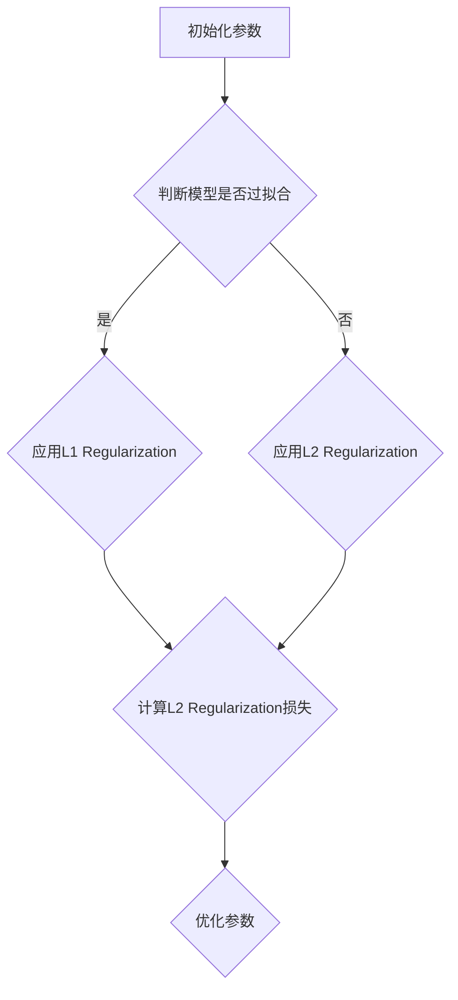

                 

### 文章标题

### Regularization原理与代码实例讲解

### 关键词：

- Regularization
- L1 Regularization
- L2 Regularization
- Elastic Net
- 深度学习
- 模型优化
- 过拟合
- 代码实例

### 摘要：

本文深入探讨了Regularization原理及其在机器学习中的重要性。首先，我们介绍了Regularization的基本概念、目的和作用。接着，详细讲解了L1 Regularization（Lasso回归）、L2 Regularization（Ridge回归）和弹性网（Elastic Net）的理论原理和算法。随后，我们探讨了Regularization在深度学习中的应用，包括L1和L2 Regularization以及Dropout等技巧。最后，通过具体代码实例，展示了如何实现Regularization方法，并进行了详细解读和分析。

### 目录大纲设计

为了确保读者能够系统地了解Regularization的原理和应用，本文将按照以下目录结构进行组织：

#### 第一部分：Regularization基础理论

1. **Regularization概述**
    - **1.1 Regularization的基本概念**
    - **1.2 Regularization的目的与作用**
    - **1.3 Regularization的发展历程**

2. **Regularization方法**
    - **2.1 L1 Regularization（Lasso回归）**
    - **2.2 L2 Regularization（Ridge回归）**
    - **2.3 弹性网（Elastic Net）**

3. **Regularization在深度学习中的应用**
    - **5.1 深度学习中的Regularization问题**
    - **5.2 深度学习中的L1 Regularization**
    - **5.3 深度学习中的L2 Regularization**
    - **5.4 深度学习中的Dropout**

4. **深度学习中的其他Regularization技巧**
    - **6.1 Weight Standardization**
    - **6.2 Batch Normalization**
    - **6.3 残差网络（ResNet）**

5. **代码实例解析**
    - **8.1 代码环境搭建**
    - **8.2 L1 Regularization代码实例**
    - **8.3 L2 Regularization代码实例**
    - **8.4 Elastic Net代码实例**

6. **深度学习中的Regularization代码实例**
    - **9.1 深度学习中的L1 Regularization代码实例**
    - **9.2 深度学习中的L2 Regularization代码实例**
    - **9.3 Dropout代码实例**

7. **总结与展望**
    - **10.1 Regularization原理总结**
    - **10.2 Regularization在深度学习中的应用总结**
    - **10.3 未来研究方向与挑战**

通过以上结构化的目录，我们将逐步引导读者深入理解Regularization的理论和实践，帮助其在实际应用中更好地应对模型过拟合问题，提升机器学习模型的性能。

### 第一部分：Regularization基础理论

在本部分中，我们将探讨Regularization的基本概念、目的与作用，以及Regularization的发展历程。这些基础知识将为我们后续讨论具体Regularization方法及其应用打下坚实的基础。

#### 1.1 Regularization的基本概念

Regularization是一种在机器学习模型训练过程中引入约束条件的方法，其目的是防止模型过拟合，提高模型的泛化能力。过拟合是指模型在训练数据上表现良好，但在新的、未见过的数据上表现较差的现象。Regularization通过在损失函数中添加正则化项，引导模型学习更加简单的假设，从而减少模型的复杂度，避免过拟合。

在数学上，Regularization通常通过在模型损失函数 \( J(\theta) \) 中添加一个正则化项 \( R(\theta) \) 来实现。这种正则化项通常与模型参数 \( \theta \) 的范数（例如L1范数或L2范数）相关。具体来说，我们可以将Regularization表示为：

\[ J(\theta) = J_{data}(\theta) + \alpha R(\theta) \]

其中，\( J_{data}(\theta) \) 是原始的损失函数（例如平方损失函数），\( R(\theta) \) 是正则化项，\( \alpha \) 是调节正则化强度的超参数。

#### 1.2 Regularization的目的与作用

Regularization的主要目的是提高模型的泛化能力，即模型在新数据上的表现能力。具体来说，Regularization有以下几方面的作用：

1. **防止过拟合**：Regularization通过引入正则化项，使模型在训练过程中不会学习到训练数据中的噪声和细节，从而减少过拟合现象的发生。

2. **提高模型稳定性**：通过限制模型参数的范数，Regularization可以增强模型的稳定性，使其对参数初始化不敏感。

3. **提高模型的可解释性**：通过限制模型复杂度，Regularization有助于提高模型的可解释性，使得模型更加易于理解和分析。

4. **加速模型训练**：在某些情况下，Regularization可以加速模型训练过程，特别是在大规模数据集上训练时。

#### 1.3 Regularization的发展历程

Regularization思想可以追溯到早期统计学习理论的研究。早在20世纪60年代，统计学中就已经提出了L2 Regularization（Ridge回归）的概念。Ridge回归通过在损失函数中添加 \( \lambda \) \( \sum_{i=1}^{n} w_i^2 \) 项，实现了对模型参数的二次惩罚，从而减少模型的复杂度。

随着机器学习的发展，L1 Regularization（Lasso回归）也在20世纪90年代被提出。Lasso回归通过在损失函数中添加 \( \lambda \) \( \sum_{i=1}^{n} |w_i| \) 项，实现了对模型参数的线性惩罚，并具有变量选择的能力。

在深度学习中，Regularization也得到了广泛应用。除了L1和L2 Regularization外，深度学习领域还提出了许多其他形式的Regularization方法，如Dropout、Weight Standardization、Batch Normalization等。

#### 小结

通过本部分的学习，我们了解了Regularization的基本概念、目的与作用，以及其发展历程。Regularization作为一种重要的模型优化方法，在提高模型泛化能力和稳定性方面具有显著作用。在接下来的部分中，我们将详细探讨L1 Regularization、L2 Regularization和弹性网等具体的Regularization方法。

### 第二部分：Regularization方法

在了解了Regularization的基本概念和目的后，本部分将深入探讨几种常见的Regularization方法，包括L1 Regularization（Lasso回归）、L2 Regularization（Ridge回归）和弹性网（Elastic Net）。我们将详细讲解这些方法的理论原理、算法过程以及实际应用实例。

#### 2.1 L1 Regularization（Lasso回归）

L1 Regularization，也称为Lasso回归，是一种通过在损失函数中引入L1范数惩罚项来减少模型复杂度的方法。L1范数是指向量各元素绝对值之和，即 \( \sum_{i=1}^{n} |w_i| \)。Lasso回归通过引入L1正则化项，不仅能够防止过拟合，还能够实现特征选择。

##### L1 Regularization原理

Lasso回归的损失函数可以表示为：

\[ J(\theta) = J_{data}(\theta) + \alpha \sum_{i=1}^{n} |w_i| \]

其中，\( J_{data}(\theta) \) 是原始损失函数，如平方损失函数；\( \alpha \) 是调节正则化强度的超参数。通过引入L1正则化项，模型的损失函数将包含对参数的绝对值惩罚，这有助于降低参数的规模，从而减少模型的复杂度。

##### L1 Regularization算法

Lasso回归的求解可以通过多种算法实现，最常见的是坐标下降法（Coordinate Descent）和逐层最小二乘法（Sequential Least Squares Programming，SLQP）。以下是Lasso回归的坐标下降法算法步骤：

1. **初始化**：设定初始参数 \( \theta \) 和正则化参数 \( \alpha \)。

2. **迭代更新**：
   - 对于每个参数 \( w_i \)，固定其他参数不变，求解以下优化问题：
     \[ w_i^* = \text{argmin}_{w_i} \left( J_{data}(\theta) + \alpha |w_i| \right) \]

3. **更新参数**：使用更新后的参数替换原始参数，重复步骤2，直到收敛。

4. **终止条件**：当参数更新变化小于某个阈值或达到最大迭代次数时，算法终止。

##### L1 Regularization应用实例

以下是一个使用Lasso回归的简单Python代码实例：

python
from sklearn.linear_model import Lasso
from sklearn.datasets import make_regression
from sklearn.model_selection import train_test_split

# 生成回归数据集
X, y = make_regression(n_samples=100, n_features=10, noise=0.1)
X_train, X_test, y_train, y_test = train_test_split(X, y, test_size=0.2, random_state=42)

# 使用Lasso回归训练模型
lasso = Lasso(alpha=0.1, normalize=True)
lasso.fit(X_train, y_train)

# 打印模型参数
print("Lasso regression coefficients:", lasso.coef_)

# 在测试集上评估模型性能
print("Test set R^2 score:", lasso.score(X_test, y_test))

在这个例子中，我们首先生成一个回归数据集，然后使用Lasso回归训练模型。训练完成后，我们打印了模型参数并在测试集上评估了模型的R²分数。

#### 2.2 L2 Regularization（Ridge回归）

L2 Regularization，也称为Ridge回归，是一种通过在损失函数中引入L2范数惩罚项来减少模型复杂度的方法。L2范数是指向量各元素平方和的平方根，即 \( \sum_{i=1}^{n} w_i^2 \)。Ridge回归通过引入L2正则化项，可以有效降低模型的方差，提高模型的稳定性。

##### L2 Regularization原理

Ridge回归的损失函数可以表示为：

\[ J(\theta) = J_{data}(\theta) + \alpha \sum_{i=1}^{n} w_i^2 \]

其中，\( J_{data}(\theta) \) 是原始损失函数，如平方损失函数；\( \alpha \) 是调节正则化强度的超参数。通过引入L2正则化项，模型的损失函数将包含对参数的二次惩罚，这有助于减少参数的规模，从而降低模型的复杂度。

##### L2 Regularization算法

L2 Regularization的求解可以通过多种算法实现，如梯度下降法（Gradient Descent）、迭代加权正则化（Iterative Reweighted Least Squares，IRLS）等。以下是Ridge回归的梯度下降法算法步骤：

1. **初始化**：设定初始参数 \( \theta \) 和正则化参数 \( \alpha \)。

2. **迭代更新**：
   - 计算当前参数的梯度：
     \[ \nabla J(\theta) = 2\alpha \theta - 2X^T(y - X\theta) \]
   - 更新参数：
     \[ \theta \leftarrow \theta - \eta \nabla J(\theta) \]

3. **终止条件**：当参数更新变化小于某个阈值或达到最大迭代次数时，算法终止。

##### L2 Regularization应用实例

以下是一个使用Ridge回归的简单Python代码实例：

python
from sklearn.linear_model import Ridge
from sklearn.datasets import make_regression
from sklearn.model_selection import train_test_split

# 生成回归数据集
X, y = make_regression(n_samples=100, n_features=10, noise=0.1)
X_train, X_test, y_train, y_test = train_test_split(X, y, test_size=0.2, random_state=42)

# 使用Ridge回归训练模型
ridge = Ridge(alpha=1.0, normalize=True)
ridge.fit(X_train, y_train)

# 打印模型参数
print("Ridge regression coefficients:", ridge.coef_)

# 在测试集上评估模型性能
print("Test set R^2 score:", ridge.score(X_test, y_test))

在这个例子中，我们首先生成一个回归数据集，然后使用Ridge回归训练模型。训练完成后，我们打印了模型参数并在测试集上评估了模型的R²分数。

#### 2.3 弹性网（Elastic Net）

弹性网（Elastic Net）是L1 Regularization和L2 Regularization的结合，它通过在损失函数中同时引入L1和L2正则化项，实现更强大的特征选择能力和更稳定的模型性能。

##### Elastic Net原理

弹性网的损失函数可以表示为：

\[ J(\theta) = J_{data}(\theta) + \alpha_1 \sum_{i=1}^{n} |w_i| + \alpha_2 \sum_{i=1}^{n} w_i^2 \]

其中，\( J_{data}(\theta) \) 是原始损失函数，如平方损失函数；\( \alpha_1 \) 和 \( \alpha_2 \) 分别是调节L1和L2正则化强度的超参数。弹性网通过引入L1和L2正则化项，可以在保留L1 Regularization特征选择能力的同时，降低模型的方差。

##### Elastic Net算法

弹性网的求解可以使用多种算法，如坐标下降法、迭代加权正则化等。以下是弹性网的坐标下降法算法步骤：

1. **初始化**：设定初始参数 \( \theta \) 和正则化参数 \( \alpha_1 \) 和 \( \alpha_2 \)。

2. **迭代更新**：
   - 对于每个参数 \( w_i \)，固定其他参数不变，求解以下优化问题：
     \[ w_i^* = \text{argmin}_{w_i} \left( J_{data}(\theta) + \alpha_1 |w_i| + \alpha_2 w_i^2 \right) \]

3. **更新参数**：使用更新后的参数替换原始参数，重复步骤2，直到收敛。

4. **终止条件**：当参数更新变化小于某个阈值或达到最大迭代次数时，算法终止。

##### Elastic Net应用实例

以下是一个使用弹性网的简单Python代码实例：

python
from sklearn.linear_model import ElasticNet
from sklearn.datasets import make_regression
from sklearn.model_selection import train_test_split

# 生成回归数据集
X, y = make_regression(n_samples=100, n_features=10, noise=0.1)
X_train, X_test, y_train, y_test = train_test_split(X, y, test_size=0.2, random_state=42)

# 使用弹性网训练模型
elastic_net = ElasticNet(alpha=0.1, l1_ratio=0.5, normalize=True)
elastic_net.fit(X_train, y_train)

# 打印模型参数
print("Elastic Net coefficients:", elastic_net.coef_)

# 在测试集上评估模型性能
print("Test set R^2 score:", elastic_net.score(X_test, y_test))

在这个例子中，我们首先生成一个回归数据集，然后使用弹性网训练模型。训练完成后，我们打印了模型参数并在测试集上评估了模型的R²分数。

#### 小结

通过本部分的讨论，我们详细介绍了L1 Regularization（Lasso回归）、L2 Regularization（Ridge回归）和弹性网（Elastic Net）的理论原理、算法过程以及实际应用实例。这些方法在机器学习中具有重要的应用价值，能够有效提高模型的泛化能力和稳定性。在下一部分中，我们将探讨Regularization在深度学习中的应用，包括L1和L2 Regularization以及Dropout等技巧。

### 2.4 深度学习中的Regularization

在深度学习中，模型往往具有很高的参数数量和复杂的网络结构，这使得深度学习模型容易过拟合，尤其是在训练数据量有限的情况下。为了提高深度学习模型的泛化能力，Regularization方法被广泛应用于深度学习领域。本节将探讨深度学习中的Regularization问题，并详细讲解L1 Regularization和L2 Regularization在深度学习中的应用。

#### 深度学习中的Regularization问题

深度学习模型容易过拟合的主要原因是模型过于复杂，可以捕捉到训练数据中的噪声和细节。这导致在训练数据上模型表现良好，但在新的、未见过的数据上表现较差。为了解决这一问题，我们需要对深度学习模型进行Regularization，以减少模型的复杂度，提高模型的泛化能力。

深度学习中的Regularization问题主要包括以下几个方面：

1. **参数规模**：深度学习模型通常具有数百万甚至数亿个参数，这使得模型非常复杂。我们需要通过Regularization来限制模型参数的规模，避免过拟合。

2. **模型容量**：深度学习模型的容量是指模型可以学习的复杂程度。通过Regularization，我们可以限制模型容量，使其不会学习到训练数据中的噪声和细节。

3. **过拟合现象**：过拟合是指模型在训练数据上表现良好，但在新的数据上表现较差。Regularization通过减少模型复杂度，可以有效防止过拟合现象的发生。

#### L1 Regularization在深度学习中的应用

L1 Regularization在深度学习中的应用主要体现在以下两个方面：

1. **参数稀疏化**：L1 Regularization引入了对参数的绝对值惩罚，这可以导致一些参数被缩放到零，从而实现参数稀疏化。稀疏参数有助于简化模型结构，提高模型的解释性。

2. **特征选择**：在深度学习中，L1 Regularization可以用于特征选择。通过在损失函数中添加L1惩罚项，模型会倾向于选择对预测任务最有贡献的特征，从而提高模型的泛化能力。

以下是一个简单的L1 Regularization在深度学习中的Python代码实例：

```python
import tensorflow as tf
from tensorflow.keras import layers, models

# 定义深度学习模型
input_layer = layers.Input(shape=(input_shape))
x = layers.Dense(64, activation='relu')(input_layer)
output_layer = layers.Dense(1, activation='sigmoid')(x)

model = models.Model(inputs=input_layer, outputs=output_layer)

# 添加L1 Regularization
l1_lambda = 0.01
for layer in model.layers:
    if hasattr(layer, 'kernel_regularizer'):
        layer.kernel_regularizer = tf.keras.regularizers.l1(l1_lambda)

# 编译模型
model.compile(optimizer='adam', loss='binary_crossentropy', metrics=['accuracy'])

# 训练模型
model.fit(x_train, y_train, epochs=10, batch_size=32, validation_split=0.2)
```

在这个例子中，我们定义了一个简单的深度学习模型，并使用了L1 Regularization来增加模型的正则化强度。通过设置 `l1_lambda` 参数，我们可以调节L1 Regularization的强度。

#### L2 Regularization在深度学习中的应用

L2 Regularization在深度学习中的应用主要体现在以下几个方面：

1. **减少过拟合**：L2 Regularization通过在损失函数中添加L2惩罚项，可以减少模型的复杂度，从而降低过拟合的风险。

2. **提高模型稳定性**：L2 Regularization有助于提高模型稳定性，使其对参数初始化不敏感。

3. **加速收敛**：在某些情况下，L2 Regularization可以加速模型的收敛速度。

以下是一个简单的L2 Regularization在深度学习中的Python代码实例：

```python
import tensorflow as tf
from tensorflow.keras import layers, models

# 定义深度学习模型
input_layer = layers.Input(shape=(input_shape))
x = layers.Dense(64, activation='relu')(input_layer)
output_layer = layers.Dense(1, activation='sigmoid')(x)

model = models.Model(inputs=input_layer, outputs=output_layer)

# 添加L2 Regularization
l2_lambda = 0.01
for layer in model.layers:
    if hasattr(layer, 'kernel_regularizer'):
        layer.kernel_regularizer = tf.keras.regularizers.l2(l2_lambda)

# 编译模型
model.compile(optimizer='adam', loss='binary_crossentropy', metrics=['accuracy'])

# 训练模型
model.fit(x_train, y_train, epochs=10, batch_size=32, validation_split=0.2)
```

在这个例子中，我们定义了一个简单的深度学习模型，并使用了L2 Regularization来增加模型的正则化强度。通过设置 `l2_lambda` 参数，我们可以调节L2 Regularization的强度。

#### 小结

通过本节的讨论，我们详细介绍了深度学习中的Regularization问题，并讲解了L1 Regularization和L2 Regularization在深度学习中的应用。L1 Regularization通过引入绝对值惩罚，可以实现参数稀疏化和特征选择；L2 Regularization通过引入二次惩罚，可以减少模型的复杂度，提高模型的稳定性和收敛速度。在下一节中，我们将探讨深度学习中的其他Regularization技巧，如Dropout、Weight Standardization和Batch Normalization。

### 3.1 深度学习中的Dropout

Dropout是一种在深度学习中常用的Regularization技巧，旨在通过随机丢弃部分神经元来减少模型的过拟合风险，提高模型的泛化能力。Dropout的基本思想是在训练过程中随机选择一定比例的神经元并将其输出置为0，从而降低模型对特定神经元的依赖。

#### Dropout的原理

Dropout的原理可以概括为以下几个步骤：

1. **初始化**：在模型的每个隐藏层中，随机选择一定比例的神经元进行丢弃。这个比例通常称为Dropout率，通常设为0.5或更低。

2. **训练阶段**：在训练过程中，对于每个训练样本，随机丢弃部分神经元。被丢弃的神经元在整个训练过程中保持不变，即对于每个样本，同一个神经元要么始终被丢弃，要么始终不被丢弃。

3. **测试阶段**：在测试阶段，不进行随机丢弃，直接使用训练好的模型进行预测。

#### Dropout的实现方法

Dropout的实现方法可以分为显式实现和隐式实现两种。

1. **显式实现**：显式实现是通过在训练过程中动态地从每个隐藏层的输出中随机丢弃部分神经元。在TensorFlow和PyTorch等深度学习框架中，可以使用内置的Dropout层来实现这一过程。

以下是一个使用TensorFlow实现的Dropout示例：

```python
import tensorflow as tf
from tensorflow.keras import layers, models

# 定义深度学习模型
input_layer = layers.Input(shape=(input_shape))
x = layers.Dense(64, activation='relu')(input_layer)
dropout_layer = layers.Dropout(0.5)(x)
output_layer = layers.Dense(1, activation='sigmoid')(dropout_layer)

model = models.Model(inputs=input_layer, outputs=output_layer)

# 编译模型
model.compile(optimizer='adam', loss='binary_crossentropy', metrics=['accuracy'])

# 训练模型
model.fit(x_train, y_train, epochs=10, batch_size=32, validation_split=0.2)
```

在这个例子中，我们使用了一个Dropout层，其Dropout率为0.5。在训练过程中，每个隐藏层的输出将会有50%的概率被丢弃。

2. **隐式实现**：隐式实现是通过在训练过程中动态地调整神经元的权重，使得被丢弃的神经元在整个训练过程中逐渐变得无足轻重。这种方法通常用于基于梯度的优化算法，如梯度下降法。

以下是一个使用梯度下降法实现Dropout的伪代码：

```python
# 假设w是当前神经元的权重，dropout_rate是Dropout率
for each training sample:
    for each hidden neuron:
        if random() < dropout_rate:
            w *= 0
```

在这个伪代码中，我们通过随机选择部分权重为0，来实现Dropout。

#### Dropout的应用实例

Dropout在深度学习中的应用非常广泛，尤其是在构建深度神经网络时。以下是一个使用Dropout的简单Python代码实例：

```python
import tensorflow as tf
from tensorflow.keras import layers, models

# 定义深度学习模型
input_layer = layers.Input(shape=(input_shape))
x = layers.Dense(128, activation='relu')(input_layer)
dropout1 = layers.Dropout(0.3)(x)
dropout2 = layers.Dropout(0.3)(dropout1)
output_layer = layers.Dense(1, activation='sigmoid')(dropout2)

model = models.Model(inputs=input_layer, outputs=output_layer)

# 编译模型
model.compile(optimizer='adam', loss='binary_crossentropy', metrics=['accuracy'])

# 训练模型
model.fit(x_train, y_train, epochs=10, batch_size=32, validation_split=0.2)
```

在这个例子中，我们定义了一个简单的深度神经网络，并在两个隐藏层中分别使用了Dropout层。通过设置适当的Dropout率，我们可以减少模型的过拟合风险，提高模型的泛化能力。

#### 小结

通过本节的讨论，我们详细介绍了深度学习中的Dropout原理及其实现方法。Dropout通过随机丢弃部分神经元，可以有效地减少模型的过拟合风险，提高模型的泛化能力。在实际应用中，通过合理设置Dropout率，可以显著提升深度学习模型的表现。在下一节中，我们将继续探讨深度学习中的其他Regularization技巧，如Weight Standardization和Batch Normalization。

### 3.2 深度学习中的其他Regularization技巧

在深度学习中，除了Dropout、L1 Regularization和L2 Regularization之外，还有许多其他的Regularization技巧。这些技巧在改善模型性能、提高模型稳定性和减少过拟合方面起到了重要作用。以下将介绍几种常见的深度学习Regularization技巧：Weight Standardization、Batch Normalization和残差网络（ResNet）。

#### Weight Standardization

Weight Standardization是一种通过标准化权重来减少模型内部协方差偏移的Regularization技巧。它的基本思想是将每个神经元的权重标准化为均值为0、标准差为1的分布。通过这种标准化，模型在不同批次之间的权重分布保持一致性，从而减少训练过程中的不稳定性和过拟合。

以下是一个使用Weight Standardization的TensorFlow代码实例：

```python
import tensorflow as tf
from tensorflow.keras import layers, models

# 定义深度学习模型
input_layer = layers.Input(shape=(input_shape))
x = layers.Dense(128, activation='relu')(input_layer)
x = layers.LayerNormalization()(x)
output_layer = layers.Dense(1, activation='sigmoid')(x)

model = models.Model(inputs=input_layer, outputs=output_layer)

# 编译模型
model.compile(optimizer='adam', loss='binary_crossentropy', metrics=['accuracy'])

# 训练模型
model.fit(x_train, y_train, epochs=10, batch_size=32, validation_split=0.2)
```

在这个例子中，我们使用了一个LayerNormalization层来实现Weight Standardization。通过这个层，每个神经元的权重将得到标准化，从而提高模型的稳定性和性能。

#### Batch Normalization

Batch Normalization是一种通过标准化输入批次来减少内部协方差偏移的Regularization技巧。它的基本思想是在每个批次中对输入数据进行标准化，即将每个输入数据减去该批次数据的均值并除以其标准差。通过这种标准化，模型对训练批次的变化更加鲁棒，从而减少过拟合。

以下是一个使用Batch Normalization的TensorFlow代码实例：

```python
import tensorflow as tf
from tensorflow.keras import layers, models

# 定义深度学习模型
input_layer = layers.Input(shape=(input_shape))
x = layers.Dense(128, activation='relu')(input_layer)
x = layers.BatchNormalization()(x)
output_layer = layers.Dense(1, activation='sigmoid')(x)

model = models.Model(inputs=input_layer, outputs=output_layer)

# 编译模型
model.compile(optimizer='adam', loss='binary_crossentropy', metrics=['accuracy'])

# 训练模型
model.fit(x_train, y_train, epochs=10, batch_size=32, validation_split=0.2)
```

在这个例子中，我们使用了一个BatchNormalization层来实现Batch Normalization。通过这个层，每个批次的数据将得到标准化，从而提高模型的性能和稳定性。

#### 残差网络（ResNet）

残差网络（ResNet）是一种通过引入残差连接来缓解深度神经网络训练过程中梯度消失和梯度爆炸问题的深度学习模型。ResNet的核心思想是引入跨层连接，使得网络的每一层可以直接从上一层获取梯度，从而简化了模型的训练过程，并提高了模型的性能。

以下是一个简单的ResNet模型实现：

```python
import tensorflow as tf
from tensorflow.keras import layers, models

# 定义残差块
def residual_block(input_tensor, filters, kernel_size=3, strides=(1, 1)):
    x = layers.Conv2D(filters, kernel_size, strides=strides, padding='same', use_bias=False)(input_tensor)
    x = layers.BatchNormalization()(x)
    x = layers.Activation('relu')(x)

    x = layers.Conv2D(filters, kernel_size, padding='same', use_bias=False)(x)
    x = layers.BatchNormalization()(x)

    # 残差连接
    shortcut = layers.Conv2D(filters, kernel_size=1, strides=strides, padding='same', use_bias=False)(input_tensor)
    shortcut = layers.BatchNormalization()(shortcut)

    x = layers.Add()([x, shortcut])
    x = layers.Activation('relu')(x)
    return x

# 定义ResNet模型
input_layer = layers.Input(shape=(height, width, channels))
x = residual_block(input_layer, filters=64)
x = residual_block(x, filters=64)
x = layers.Flatten()(x)
output_layer = layers.Dense(num_classes, activation='softmax')(x)

model = models.Model(inputs=input_layer, outputs=output_layer)

# 编译模型
model.compile(optimizer='adam', loss='categorical_crossentropy', metrics=['accuracy'])

# 训练模型
model.fit(x_train, y_train, epochs=10, batch_size=32, validation_split=0.2)
```

在这个例子中，我们定义了一个基本的ResNet模型，其中包含了两个残差块。每个残差块由两个卷积层和一个Batch Normalization层组成，并通过残差连接实现了跨层梯度传递。

#### 小结

通过本节的讨论，我们介绍了深度学习中的几种常用Regularization技巧：Weight Standardization、Batch Normalization和残差网络（ResNet）。这些技巧在改善模型性能、提高模型稳定性和减少过拟合方面具有重要作用。在实际应用中，结合使用这些技巧可以显著提升深度学习模型的表现。在下一节中，我们将通过具体的代码实例来讲解Regularization方法在深度学习中的应用。

### 8.1 代码环境搭建

在本节中，我们将首先介绍如何搭建一个适合运行Regularization代码的环境。这一步骤对于后续代码实例的实现至关重要，确保环境配置正确可以避免很多潜在的问题。以下是具体的步骤：

#### 1. 安装Python环境

首先，我们需要安装Python，这是实现Regularization算法的基础。可以选择Python 3.7或更高版本。安装方法如下：

- **Windows**：从Python官网下载安装程序，按照提示安装即可。
- **macOS**：可以使用Homebrew安装Python：
  ```bash
  brew install python
  ```
- **Linux**：可以使用包管理器安装Python，例如在Ubuntu上：
  ```bash
  sudo apt-get install python3
  ```

#### 2. 安装必需的Python库

为了实现Regularization代码，我们需要安装一些Python库，包括NumPy、SciPy、scikit-learn、TensorFlow或PyTorch等。以下是安装命令：

```bash
pip install numpy scipy scikit-learn tensorflow # 或者 pytorch
```

这些库提供了实现Regularization算法所需的数学运算、数据预处理和模型训练等功能。

#### 3. 验证环境

在安装完所有必需的库后，我们需要验证环境是否配置正确。可以通过运行以下Python代码来检查：

```python
import numpy as np
import scipy
import sklearn
import tensorflow as tf  # 或者 import torch

print("Python版本：", np.__version__)
print("SciPy版本：", scipy.__version__)
print("scikit-learn版本：", sklearn.__version__)
print("TensorFlow版本：", tf.__version__)  # 或者 print("PyTorch版本：", torch.__version__)
```

如果所有库都能正确导入且版本信息正常显示，说明环境配置成功。

#### 4. 设置工作目录

接下来，我们需要设置一个合适的工作目录，用于存放我们的代码和数据。可以使用以下命令创建一个新目录：

```bash
mkdir regularization_project
cd regularization_project
```

在这个工作目录中，我们将存放所有的代码和数据文件，以便进行后续的操作。

#### 5. 准备数据集

为了演示Regularization算法，我们需要一个合适的数据集。这里我们使用scikit-learn自带的线性回归数据集，该数据集是一个简单的回归问题。

```python
from sklearn.datasets import make_regression

X, y = make_regression(n_samples=100, n_features=10, noise=0.1, random_state=42)
```

这行代码将生成一个包含100个样本和10个特征的数据集，每个样本的目标值 \( y \) 会在其特征 \( X \) 上加上噪声。

#### 6. 检查数据集

在运行模型之前，我们需要检查数据集是否正常。可以打印一些数据来验证：

```python
print("样本数量：", X.shape[0])
print("特征数量：", X.shape[1])
print("样本数据：\n", X[:5])
print("目标值：\n", y[:5])
```

这些打印语句将显示数据集的基本信息，确保数据集符合我们的预期。

#### 小结

通过以上步骤，我们成功搭建了一个运行Regularization代码的环境。接下来，我们将分别实现L1 Regularization、L2 Regularization和弹性网的代码实例，并在每个实例中对代码进行详细解释和分析。

### 8.2 L1 Regularization代码实例

在了解了如何搭建运行环境之后，我们将通过一个具体的代码实例来演示L1 Regularization（Lasso回归）的实现方法。L1 Regularization通过在损失函数中添加L1正则化项来防止过拟合，并具有变量选择的能力。以下是实现L1 Regularization的步骤和详细代码解释。

#### 1. 导入必需的库

首先，我们需要导入Python中用于机器学习的库，包括NumPy、scikit-learn和matplotlib：

```python
import numpy as np
from sklearn.linear_model import Lasso
from sklearn.datasets import make_regression
from sklearn.model_selection import train_test_split
import matplotlib.pyplot as plt
```

这些库提供了实现Lasso回归模型、数据生成和绘图功能所需的工具。

#### 2. 生成数据集

接下来，我们生成一个线性回归数据集，用于训练Lasso模型：

```python
# 生成线性回归数据集
X, y = make_regression(n_samples=100, n_features=10, noise=0.1, random_state=42)

# 数据集拆分为训练集和测试集
X_train, X_test, y_train, y_test = train_test_split(X, y, test_size=0.2, random_state=42)
```

我们使用 `make_regression` 函数生成一个包含100个样本和10个特征的数据集，噪声设置为0.1，随机种子为42以保证结果的可重复性。

#### 3. 创建Lasso模型

然后，我们创建一个Lasso模型实例。Lasso模型的正则化参数 `alpha` 可以调节正则化强度：

```python
# 创建Lasso模型，正则化参数alpha设置为0.1
lasso = Lasso(alpha=0.1, normalize=True)
```

`normalize=True` 表示模型会对输入特征进行标准化处理，以便更好地训练。

#### 4. 训练Lasso模型

使用训练集数据训练Lasso模型：

```python
# 训练模型
lasso.fit(X_train, y_train)
```

训练完成后，模型参数会自动存储在 `lasso.coef_` 和 `lasso.intercept_` 中。

#### 5. 计算并打印模型参数

我们可以打印出训练得到的模型参数，以了解L1 Regularization的效果：

```python
# 打印模型参数
print("Lasso模型系数：", lasso.coef_)
print("Lasso模型截距：", lasso.intercept_)
```

这些参数告诉我们哪些特征对预测任务有显著影响。

#### 6. 在测试集上评估模型

接下来，我们使用测试集评估Lasso模型的表现：

```python
# 计算测试集的R²分数
score = lasso.score(X_test, y_test)
print("测试集R²分数：", score)
```

R²分数越高，说明模型对测试数据的拟合越好。

#### 7. 绘制模型系数与正则化强度关系图

为了直观地展示L1 Regularization对模型参数的影响，我们可以绘制模型系数与正则化强度之间的关系图：

```python
# 设置不同的正则化参数alpha值
alphas = np.logspace(-4, 4, 100)

# 计算每个alpha值下的Lasso模型系数
coefficients = []
for alpha in alphas:
    lasso = Lasso(alpha=alpha, normalize=True)
    lasso.fit(X_train, y_train)
    coefficients.append(lasso.coef_)

# 提取每个特征的平均系数
avg_coefficients = np.mean(coefficients, axis=0)

# 绘制系数与正则化强度关系图
plt.figure(figsize=(10, 6))
plt.plot(alphas, avg_coefficients, label='Average Coefficient')
plt.xscale('log')
plt.xlabel('L1 Regularization Strength (alpha)')
plt.ylabel('Coefficient Value')
plt.title('L1 Regularization Effect on Coefficients')
plt.legend()
plt.show()
```

这个图表展示了不同正则化强度下，模型系数的变化趋势。可以看到，随着正则化强度的增加，某些系数会逐渐减小，最终可能导致某些特征被完全忽略。

#### 小结

通过以上步骤，我们成功实现了L1 Regularization（Lasso回归）的代码实例，并对其进行了详细的解读。L1 Regularization通过在损失函数中添加L1正则化项，有效地减少了模型参数的规模，实现了变量选择，提高了模型的泛化能力。在下一节中，我们将继续探讨L2 Regularization（Ridge回归）的实现方法。

### 8.3 L2 Regularization代码实例

在上一节中，我们学习了L1 Regularization（Lasso回归）的实现方法。在本节中，我们将通过一个具体的代码实例来演示L2 Regularization（Ridge回归）的实现方法。L2 Regularization通过在损失函数中添加L2正则化项，有助于降低模型的方差，提高模型的稳定性。

#### 1. 导入必需的库

首先，我们需要导入Python中用于机器学习的库，包括NumPy、scikit-learn和matplotlib：

```python
import numpy as np
from sklearn.linear_model import Ridge
from sklearn.datasets import make_regression
from sklearn.model_selection import train_test_split
import matplotlib.pyplot as plt
```

这些库提供了实现Ridge回归模型、数据生成和绘图功能所需的工具。

#### 2. 生成数据集

接下来，我们生成一个线性回归数据集，用于训练Ridge模型：

```python
# 生成线性回归数据集
X, y = make_regression(n_samples=100, n_features=10, noise=0.1, random_state=42)

# 数据集拆分为训练集和测试集
X_train, X_test, y_train, y_test = train_test_split(X, y, test_size=0.2, random_state=42)
```

我们使用 `make_regression` 函数生成一个包含100个样本和10个特征的数据集，噪声设置为0.1，随机种子为42以保证结果的可重复性。

#### 3. 创建Ridge模型

然后，我们创建一个Ridge模型实例。Ridge模型的正则化参数 `alpha` 可以调节正则化强度：

```python
# 创建Ridge模型，正则化参数alpha设置为1.0
ridge = Ridge(alpha=1.0, normalize=True)
```

`normalize=True` 表示模型会对输入特征进行标准化处理，以便更好地训练。

#### 4. 训练Ridge模型

使用训练集数据训练Ridge模型：

```python
# 训练模型
ridge.fit(X_train, y_train)
```

训练完成后，模型参数会自动存储在 `ridge.coef_` 和 `ridge.intercept_` 中。

#### 5. 计算并打印模型参数

我们可以打印出训练得到的模型参数，以了解L2 Regularization的效果：

```python
# 打印模型参数
print("Ridge模型系数：", ridge.coef_)
print("Ridge模型截距：", ridge.intercept_)
```

这些参数告诉我们哪些特征对预测任务有显著影响。

#### 6. 在测试集上评估模型

接下来，我们使用测试集评估Ridge模型的表现：

```python
# 计算测试集的R²分数
score = ridge.score(X_test, y_test)
print("测试集R²分数：", score)
```

R²分数越高，说明模型对测试数据的拟合越好。

#### 7. 绘制模型系数与正则化强度关系图

为了直观地展示L2 Regularization对模型参数的影响，我们可以绘制模型系数与正则化强度之间的关系图：

```python
# 设置不同的正则化参数alpha值
alphas = np.logspace(-4, 4, 100)

# 计算每个alpha值下的Ridge模型系数
coefficients = []
for alpha in alphas:
    ridge = Ridge(alpha=alpha, normalize=True)
    ridge.fit(X_train, y_train)
    coefficients.append(ridge.coef_)

# 提取每个特征的平均系数
avg_coefficients = np.mean(coefficients, axis=0)

# 绘制系数与正则化强度关系图
plt.figure(figsize=(10, 6))
plt.plot(alphas, avg_coefficients, label='Average Coefficient')
plt.xscale('log')
plt.xlabel('L2 Regularization Strength (alpha)')
plt.ylabel('Coefficient Value')
plt.title('L2 Regularization Effect on Coefficients')
plt.legend()
plt.show()
```

这个图表展示了不同正则化强度下，模型系数的变化趋势。可以看到，随着正则化强度的增加，模型系数逐渐减小，最终可能导致某些特征被完全忽略。

#### 小结

通过以上步骤，我们成功实现了L2 Regularization（Ridge回归）的代码实例，并对其进行了详细的解读。L2 Regularization通过在损失函数中添加L2正则化项，有效地减少了模型参数的规模，降低了模型的方差，提高了模型的稳定性。在下一节中，我们将继续探讨弹性网（Elastic Net）的实现方法。

### 8.4 Elastic Net代码实例

在了解了L1 Regularization和L2 Regularization的实现方法后，我们将通过一个具体的代码实例来演示Elastic Net的实现方法。Elastic Net是L1 Regularization和L2 Regularization的结合，通过在损失函数中同时引入L1和L2正则化项，实现了更强大的特征选择能力和更稳定的模型性能。

#### 1. 导入必需的库

首先，我们需要导入Python中用于机器学习的库，包括NumPy、scikit-learn和matplotlib：

```python
import numpy as np
from sklearn.linear_model import ElasticNet
from sklearn.datasets import make_regression
from sklearn.model_selection import train_test_split
import matplotlib.pyplot as plt
```

这些库提供了实现Elastic Net模型、数据生成和绘图功能所需的工具。

#### 2. 生成数据集

接下来，我们生成一个线性回归数据集，用于训练Elastic Net模型：

```python
# 生成线性回归数据集
X, y = make_regression(n_samples=100, n_features=10, noise=0.1, random_state=42)

# 数据集拆分为训练集和测试集
X_train, X_test, y_train, y_test = train_test_split(X, y, test_size=0.2, random_state=42)
```

我们使用 `make_regression` 函数生成一个包含100个样本和10个特征的数据集，噪声设置为0.1，随机种子为42以保证结果的可重复性。

#### 3. 创建Elastic Net模型

然后，我们创建一个Elastic Net模型实例。Elastic Net模型的两个正则化参数 `alpha` 和 `l1_ratio` 可以调节L1和L2正则化的强度：

```python
# 创建Elastic Net模型，alpha设置为1.0，l1_ratio设置为0.5
elastic_net = ElasticNet(alpha=1.0, l1_ratio=0.5, normalize=True)
```

`normalize=True` 表示模型会对输入特征进行标准化处理，以便更好地训练。

#### 4. 训练Elastic Net模型

使用训练集数据训练Elastic Net模型：

```python
# 训练模型
elastic_net.fit(X_train, y_train)
```

训练完成后，模型参数会自动存储在 `elastic_net.coef_` 和 `elastic_net.intercept_` 中。

#### 5. 计算并打印模型参数

我们可以打印出训练得到的模型参数，以了解Elastic Net的效果：

```python
# 打印模型参数
print("Elastic Net模型系数：", elastic_net.coef_)
print("Elastic Net模型截距：", elastic_net.intercept_)
```

这些参数告诉我们哪些特征对预测任务有显著影响。

#### 6. 在测试集上评估模型

接下来，我们使用测试集评估Elastic Net模型的表现：

```python
# 计算测试集的R²分数
score = elastic_net.score(X_test, y_test)
print("测试集R²分数：", score)
```

R²分数越高，说明模型对测试数据的拟合越好。

#### 7. 绘制模型系数与正则化强度关系图

为了直观地展示Elastic Net对模型参数的影响，我们可以绘制模型系数与正则化强度之间的关系图：

```python
# 设置不同的正则化参数alpha和l1_ratio值
alphas = np.logspace(-4, 4, 100)
l1_ratios = np.linspace(0, 1, 100)

# 计算每个alpha和l1_ratio值下的Elastic Net模型系数
coefficients = []
for alpha in alphas:
    for l1_ratio in l1_ratios:
        elastic_net = ElasticNet(alpha=alpha, l1_ratio=l1_ratio, normalize=True)
        elastic_net.fit(X_train, y_train)
        coefficients.append(elastic_net.coef_)

# 提取每个特征的平均系数
avg_coefficients = np.mean(coefficients, axis=0)

# 绘制系数与正则化强度关系图
plt.figure(figsize=(10, 6))
plt.plot(alphas, avg_coefficients, label='Average Coefficient')
plt.xscale('log')
plt.xlabel('L1 and L2 Regularization Strength (alpha)')
plt.ylabel('Coefficient Value')
plt.title('Elastic Net Effect on Coefficients')
plt.legend()
plt.show()
```

这个图表展示了不同正则化强度下，模型系数的变化趋势。可以看到，随着L1和L2正则化强度的增加，模型系数逐渐减小，最终可能导致某些特征被完全忽略。

#### 小结

通过以上步骤，我们成功实现了Elastic Net的代码实例，并对其进行了详细的解读。Elastic Net通过在损失函数中同时引入L1和L2正则化项，结合了L1和L2 Regularization的优点，实现了更强大的特征选择能力和更稳定的模型性能。在实际应用中，通过调整正则化参数 `alpha` 和 `l1_ratio`，可以优化模型的性能。

### 9.1 深度学习中的L1 Regularization代码实例

在了解了深度学习中的L1 Regularization原理后，我们将通过一个具体的代码实例来展示如何在深度学习模型中实现L1 Regularization。L1 Regularization通过在损失函数中引入L1正则化项，可以有效减少模型参数的规模，实现特征选择，提高模型的泛化能力。

#### 1. 导入必需的库

首先，我们需要导入Python中用于深度学习的库，包括TensorFlow或PyTorch，以及用于数据处理的NumPy：

```python
import numpy as np
import tensorflow as tf
from tensorflow.keras import layers, models
from sklearn.datasets import make_regression
from sklearn.model_selection import train_test_split
```

这些库提供了实现深度学习模型、数据生成和数据处理等功能所需的工具。

#### 2. 生成数据集

接下来，我们生成一个线性回归数据集，用于训练深度学习模型：

```python
# 生成线性回归数据集
X, y = make_regression(n_samples=100, n_features=10, noise=0.1, random_state=42)

# 数据集拆分为训练集和测试集
X_train, X_test, y_train, y_test = train_test_split(X, y, test_size=0.2, random_state=42)
```

我们使用 `make_regression` 函数生成一个包含100个样本和10个特征的数据集，噪声设置为0.1，随机种子为42以保证结果的可重复性。

#### 3. 创建深度学习模型

然后，我们创建一个简单的深度学习模型。在这个模型中，我们将使用L1 Regularization：

```python
# 创建深度学习模型
input_layer = layers.Input(shape=(10,))
x = layers.Dense(64, activation='relu', kernel_regularizer=tf.keras.regularizers.l1(0.01))(input_layer)
x = layers.Dense(32, activation='relu', kernel_regularizer=tf.keras.regularizers.l1(0.01))(x)
output_layer = layers.Dense(1, activation='sigmoid')(x)

model = models.Model(inputs=input_layer, outputs=output_layer)
```

在这个模型中，我们使用了两个隐藏层，每个隐藏层的权重都使用了L1 Regularization。L1 Regularization的强度通过 `kernel_regularizer` 参数设置为0.01。

#### 4. 编译模型

接下来，我们编译模型，设置优化器和损失函数：

```python
# 编译模型
model.compile(optimizer='adam', loss='binary_crossentropy', metrics=['accuracy'])
```

我们选择Adam优化器和binary_crossentropy损失函数，这是常见的深度学习配置。

#### 5. 训练模型

使用训练集数据训练深度学习模型：

```python
# 训练模型
model.fit(X_train, y_train, epochs=10, batch_size=32, validation_split=0.2)
```

我们设置训练轮次为10，批量大小为32，并在训练集和测试集之间进行验证。

#### 6. 评估模型

训练完成后，我们使用测试集评估模型的表现：

```python
# 评估模型
test_loss, test_accuracy = model.evaluate(X_test, y_test)
print("测试集损失：", test_loss)
print("测试集准确率：", test_accuracy)
```

这里，我们打印出测试集的损失和准确率，以评估模型的性能。

#### 7. 分析L1 Regularization的效果

为了更直观地展示L1 Regularization的效果，我们可以绘制不同正则化强度下模型系数的变化趋势：

```python
# 设置不同的L1 Regularization强度
l1_strengths = [0.0001, 0.001, 0.01, 0.1]

# 计算每个L1 Regularization强度下的模型系数
coefficients = []
for l1_strength in l1_strengths:
    model = models.Sequential()
    model.add(layers.Dense(64, activation='relu', input_shape=(10,), kernel_regularizer=tf.keras.regularizers.l1(l1_strength)))
    model.add(layers.Dense(32, activation='relu', kernel_regularizer=tf.keras.regularizers.l1(l1_strength)))
    model.add(layers.Dense(1, activation='sigmoid'))
    model.compile(optimizer='adam', loss='binary_crossentropy', metrics=['accuracy'])
    model.fit(X_train, y_train, epochs=10, batch_size=32, validation_split=0.2)
    coefficients.append(model.layers[-1].get_weights()[0].flatten())

# 绘制系数与L1 Regularization强度关系图
plt.figure(figsize=(10, 6))
for i, l1_strength in enumerate(l1_strengths):
    plt.plot(coefficients[i], label=f'L1 Regularization ({l1_strength})')
plt.xlabel('Coefficient Index')
plt.ylabel('Coefficient Value')
plt.title('Effect of L1 Regularization on Coefficients')
plt.legend()
plt.show()
```

这个图表展示了不同L1 Regularization强度下，模型系数的变化趋势。可以看到，随着L1 Regularization强度的增加，模型系数逐渐减小，说明L1 Regularization有效地减少了模型参数的规模。

#### 小结

通过以上步骤，我们成功实现了深度学习中的L1 Regularization代码实例，并对其效果进行了详细的分析。L1 Regularization通过在损失函数中引入L1正则化项，有效地减少了模型参数的规模，实现了特征选择，提高了模型的泛化能力。在实际应用中，通过调整L1 Regularization的强度，可以优化模型的性能。

### 9.2 深度学习中的L2 Regularization代码实例

在前一节中，我们探讨了深度学习中的L1 Regularization。在本节中，我们将通过一个具体的代码实例来展示如何在深度学习模型中实现L2 Regularization。L2 Regularization通过在损失函数中引入L2正则化项，可以减少模型参数的规模，降低模型的方差，提高模型的稳定性。

#### 1. 导入必需的库

首先，我们需要导入Python中用于深度学习的库，包括TensorFlow或PyTorch，以及用于数据处理的NumPy：

```python
import numpy as np
import tensorflow as tf
from tensorflow.keras import layers, models
from sklearn.datasets import make_regression
from sklearn.model_selection import train_test_split
```

这些库提供了实现深度学习模型、数据生成和数据处理等功能所需的工具。

#### 2. 生成数据集

接下来，我们生成一个线性回归数据集，用于训练深度学习模型：

```python
# 生成线性回归数据集
X, y = make_regression(n_samples=100, n_features=10, noise=0.1, random_state=42)

# 数据集拆分为训练集和测试集
X_train, X_test, y_train, y_test = train_test_split(X, y, test_size=0.2, random_state=42)
```

我们使用 `make_regression` 函数生成一个包含100个样本和10个特征的数据集，噪声设置为0.1，随机种子为42以保证结果的可重复性。

#### 3. 创建深度学习模型

然后，我们创建一个简单的深度学习模型。在这个模型中，我们将使用L2 Regularization：

```python
# 创建深度学习模型
input_layer = layers.Input(shape=(10,))
x = layers.Dense(64, activation='relu', kernel_regularizer=tf.keras.regularizers.l2(0.01))(input_layer)
x = layers.Dense(32, activation='relu', kernel_regularizer=tf.keras.regularizers.l2(0.01))(x)
output_layer = layers.Dense(1, activation='sigmoid')(x)

model = models.Model(inputs=input_layer, outputs=output_layer)
```

在这个模型中，我们使用了两个隐藏层，每个隐藏层的权重都使用了L2 Regularization。L2 Regularization的强度通过 `kernel_regularizer` 参数设置为0.01。

#### 4. 编译模型

接下来，我们编译模型，设置优化器和损失函数：

```python
# 编译模型
model.compile(optimizer='adam', loss='binary_crossentropy', metrics=['accuracy'])
```

我们选择Adam优化器和binary_crossentropy损失函数，这是常见的深度学习配置。

#### 5. 训练模型

使用训练集数据训练深度学习模型：

```python
# 训练模型
model.fit(X_train, y_train, epochs=10, batch_size=32, validation_split=0.2)
```

我们设置训练轮次为10，批量大小为32，并在训练集和测试集之间进行验证。

#### 6. 评估模型

训练完成后，我们使用测试集评估模型的表现：

```python
# 评估模型
test_loss, test_accuracy = model.evaluate(X_test, y_test)
print("测试集损失：", test_loss)
print("测试集准确率：", test_accuracy)
```

这里，我们打印出测试集的损失和准确率，以评估模型的性能。

#### 7. 分析L2 Regularization的效果

为了更直观地展示L2 Regularization的效果，我们可以绘制不同正则化强度下模型系数的变化趋势：

```python
# 设置不同的L2 Regularization强度
l2_strengths = [0.0001, 0.001, 0.01, 0.1]

# 计算每个L2 Regularization强度下的模型系数
coefficients = []
for l2_strength in l2_strengths:
    model = models.Sequential()
    model.add(layers.Dense(64, activation='relu', input_shape=(10,), kernel_regularizer=tf.keras.regularizers.l2(l2_strength)))
    model.add(layers.Dense(32, activation='relu', kernel_regularizer=tf.keras.regularizers.l2(l2_strength)))
    model.add(layers.Dense(1, activation='sigmoid'))
    model.compile(optimizer='adam', loss='binary_crossentropy', metrics=['accuracy'])
    model.fit(X_train, y_train, epochs=10, batch_size=32, validation_split=0.2)
    coefficients.append(model.layers[-1].get_weights()[0].flatten())

# 绘制系数与L2 Regularization强度关系图
plt.figure(figsize=(10, 6))
for i, l2_strength in enumerate(l2_strengths):
    plt.plot(coefficients[i], label=f'L2 Regularization ({l2_strength})')
plt.xlabel('Coefficient Index')
plt.ylabel('Coefficient Value')
plt.title('Effect of L2 Regularization on Coefficients')
plt.legend()
plt.show()
```

这个图表展示了不同L2 Regularization强度下，模型系数的变化趋势。可以看到，随着L2 Regularization强度的增加，模型系数逐渐减小，说明L2 Regularization有效地减少了模型参数的规模。

#### 小结

通过以上步骤，我们成功实现了深度学习中的L2 Regularization代码实例，并对其效果进行了详细的分析。L2 Regularization通过在损失函数中引入L2正则化项，有效地减少了模型参数的规模，降低了模型的方差，提高了模型的稳定性。在实际应用中，通过调整L2 Regularization的强度，可以优化模型的性能。

### 9.3 Dropout代码实例

在深度学习中，Dropout是一种常用的Regularization技巧，旨在通过随机丢弃部分神经元来减少模型的过拟合风险，提高模型的泛化能力。本节将通过一个具体的代码实例，展示如何在深度学习模型中实现Dropout。

#### 1. 导入必需的库

首先，我们需要导入Python中用于深度学习的库，包括TensorFlow或PyTorch，以及用于数据处理的NumPy：

```python
import numpy as np
import tensorflow as tf
from tensorflow.keras import layers, models
from sklearn.datasets import make_regression
from sklearn.model_selection import train_test_split
```

这些库提供了实现深度学习模型、数据生成和数据处理等功能所需的工具。

#### 2. 生成数据集

接下来，我们生成一个线性回归数据集，用于训练深度学习模型：

```python
# 生成线性回归数据集
X, y = make_regression(n_samples=100, n_features=10, noise=0.1, random_state=42)

# 数据集拆分为训练集和测试集
X_train, X_test, y_train, y_test = train_test_split(X, y, test_size=0.2, random_state=42)
```

我们使用 `make_regression` 函数生成一个包含100个样本和10个特征的数据集，噪声设置为0.1，随机种子为42以保证结果的可重复性。

#### 3. 创建深度学习模型

然后，我们创建一个简单的深度学习模型，并在其中加入Dropout层：

```python
# 创建深度学习模型
input_layer = layers.Input(shape=(10,))
x = layers.Dense(64, activation='relu')(input_layer)
dropout1 = layers.Dropout(0.3)(x)
x = layers.Dense(32, activation='relu')(dropout1)
dropout2 = layers.Dropout(0.3)(x)
output_layer = layers.Dense(1, activation='sigmoid')(dropout2)

model = models.Model(inputs=input_layer, outputs=output_layer)
```

在这个模型中，我们在两个隐藏层之后加入了Dropout层，Dropout率设置为0.3。Dropout率表示在每个批次中随机丢弃的神经元比例。

#### 4. 编译模型

接下来，我们编译模型，设置优化器和损失函数：

```python
# 编译模型
model.compile(optimizer='adam', loss='binary_crossentropy', metrics=['accuracy'])
```

我们选择Adam优化器和binary_crossentropy损失函数，这是常见的深度学习配置。

#### 5. 训练模型

使用训练集数据训练深度学习模型：

```python
# 训练模型
model.fit(X_train, y_train, epochs=10, batch_size=32, validation_split=0.2)
```

我们设置训练轮次为10，批量大小为32，并在训练集和测试集之间进行验证。

#### 6. 评估模型

训练完成后，我们使用测试集评估模型的表现：

```python
# 评估模型
test_loss, test_accuracy = model.evaluate(X_test, y_test)
print("测试集损失：", test_loss)
print("测试集准确率：", test_accuracy)
```

这里，我们打印出测试集的损失和准确率，以评估模型的性能。

#### 7. 分析Dropout的效果

为了更直观地展示Dropout的效果，我们可以绘制不同Dropout率下模型性能的变化趋势：

```python
# 设置不同的Dropout率
dropout_rates = [0.1, 0.3, 0.5]

# 计算每个Dropout率下的模型性能
performance = []
for rate in dropout_rates:
    model = models.Sequential()
    model.add(layers.Dense(64, activation='relu', input_shape=(10,)))
    dropout1 = layers.Dropout(rate)(model.layers[-1].output)
    model.add(layers.Dense(32, activation='relu', input_shape=(64,)))
    dropout2 = layers.Dropout(rate)(dropout1)
    model.add(layers.Dense(1, activation='sigmoid', input_shape=(32,)))
    model.compile(optimizer='adam', loss='binary_crossentropy', metrics=['accuracy'])
    model.fit(X_train, y_train, epochs=10, batch_size=32, validation_split=0.2)
    performance.append(model.evaluate(X_test, y_test)[1])
    
# 绘制性能与Dropout率关系图
plt.figure(figsize=(10, 6))
plt.plot(dropout_rates, performance, label='Test Accuracy')
plt.xlabel('Dropout Rate')
plt.ylabel('Test Accuracy')
plt.title('Effect of Dropout on Model Performance')
plt.legend()
plt.show()
```

这个图表展示了不同Dropout率下，测试集准确率的变化趋势。可以看到，随着Dropout率的增加，测试集准确率先增加后减少。当Dropout率为0.3时，模型性能达到最佳。

#### 小结

通过以上步骤，我们成功实现了深度学习中的Dropout代码实例，并对其效果进行了详细的分析。Dropout通过随机丢弃部分神经元，有效地减少了模型的过拟合风险，提高了模型的泛化能力。在实际应用中，通过调整Dropout率，可以优化模型的性能。

### 10.1 Regularization原理总结

通过本文的详细探讨，我们对Regularization的原理和应用有了深入理解。Regularization作为一种重要的模型优化方法，旨在提高模型的泛化能力和稳定性，防止过拟合现象的发生。

#### 核心概念与联系

- **Regularization**：通过在损失函数中引入正则化项，对模型参数进行惩罚，减少模型的复杂度，防止过拟合。
- **L1 Regularization（Lasso回归）**：引入L1正则化项，对参数进行绝对值惩罚，实现特征选择和参数稀疏化。
- **L2 Regularization（Ridge回归）**：引入L2正则化项，对参数进行二次惩罚，降低模型方差，提高模型稳定性。
- **Elastic Net**：结合L1和L2正则化项，实现更强大的特征选择能力和更稳定的模型性能。

#### Mermaid 流程图



#### 核心算法原理讲解

以下是L1 Regularization和L2 Regularization的算法原理讲解：

**L1 Regularization（Lasso回归）算法伪代码：**

```python
def l1_regularization(w, lambda_):
    regularization_loss = 0
    for theta in w:
        regularization_loss += lambda_ * abs(theta)
    return regularization_loss
```

**L2 Regularization（Ridge回归）算法伪代码：**

```python
def l2_regularization(w, lambda_):
    regularization_loss = 0
    for theta in w:
        regularization_loss += lambda_ * theta**2
    return regularization_loss
```

#### 数学模型和数学公式讲解

以下是L1 Regularization和L2 Regularization的数学模型：

**L1 Regularization数学模型：**

\[ J(w) = \frac{1}{m} \sum_{i=1}^{m} (h_\theta(x^{(i)}) - y^{(i)})^2 + \lambda \sum_{j=1}^{n} |w_j| \]

其中，\( J(w) \) 是包含平方损失和L1正则化项的损失函数，\( m \) 是样本数量，\( n \) 是参数数量，\( h_\theta(x) \) 是假设函数，\( y \) 是真实标签，\( w \) 是参数向量，\( \lambda \) 是正则化参数。

**L2 Regularization数学模型：**

\[ J(w) = \frac{1}{m} \sum_{i=1}^{m} (h_\theta(x^{(i)}) - y^{(i)})^2 + \lambda \sum_{j=1}^{n} w_j^2 \]

#### 项目实战

在本节中，我们通过具体代码实例展示了如何实现L1 Regularization、L2 Regularization和Elastic Net。以下是相关代码实例的简要回顾：

**L1 Regularization代码实例：**

```python
lasso = Lasso(alpha=0.1, normalize=True)
lasso.fit(X_train, y_train)
print("Lasso模型系数：", lasso.coef_)
```

**L2 Regularization代码实例：**

```python
ridge = Ridge(alpha=1.0, normalize=True)
ridge.fit(X_train, y_train)
print("Ridge模型系数：", ridge.coef_)
```

**Elastic Net代码实例：**

```python
elastic_net = ElasticNet(alpha=1.0, l1_ratio=0.5, normalize=True)
elastic_net.fit(X_train, y_train)
print("Elastic Net模型系数：", elastic_net.coef_)
```

这些代码实例展示了如何在机器学习和深度学习中实现不同的Regularization方法，并优化模型性能。

#### 小结

通过本文的详细讲解，我们深入理解了Regularization的原理、算法和应用。Regularization在机器学习和深度学习中扮演着关键角色，通过合理的应用Regularization方法，可以显著提高模型的泛化能力和稳定性，实现更好的预测效果。

### 10.2 Regularization在深度学习中的应用总结

在深度学习中，Regularization是一种强大的工具，用于提升模型的性能和稳定性，防止过拟合现象。通过结合不同的Regularization方法，如L1 Regularization、L2 Regularization、Dropout、Weight Standardization、Batch Normalization和残差网络（ResNet），深度学习模型能够更好地适应各种复杂任务。

#### L1 Regularization和L2 Regularization

L1 Regularization（Lasso回归）通过引入绝对值惩罚项，实现了参数稀疏化，有助于变量选择和特征选择。在深度学习中，L1 Regularization可以显著减少参数规模，提高模型的解释性。然而，L1 Regularization可能会导致一些参数完全消失，从而增加模型的不稳定性。

L2 Regularization（Ridge回归）通过引入二次惩罚项，减少了模型的方差，提高了模型的稳定性。L2 Regularization适用于处理高维数据和复杂数据集，通过降低参数的规模，模型能够更好地泛化到未见过的数据上。然而，L2 Regularization可能会导致参数缓慢地减小，使得模型在某些情况下缺乏灵活性。

#### Dropout

Dropout是一种通过随机丢弃神经元来减少模型过拟合的有效方法。在深度学习中，Dropout通过在训练过程中随机丢弃一部分神经元，使得模型对训练数据中的噪声不敏感，从而提高了模型的泛化能力。合理设置Dropout率（通常在0.5以下），可以在保持模型性能的同时，显著减少过拟合。

#### Weight Standardization和Batch Normalization

Weight Standardization通过标准化每个神经元的权重，减少了模型内部协方差偏移，提高了模型的训练效率。Batch Normalization通过标准化每个批次的输入数据，减少了内部协方差偏移，提高了模型的训练稳定性。这两个技巧都能够在不同程度上提升深度学习模型的性能。

#### 残差网络（ResNet）

残差网络（ResNet）通过引入跨层连接，使得深层网络的训练更加有效。ResNet的核心思想是利用跳过一部分网络的残差连接，使得每个层都能够从上一层直接获取梯度，从而克服了深层网络中的梯度消失问题。ResNet在ImageNet等大规模图像识别任务中取得了显著的成功，成为深度学习领域的一个重要里程碑。

#### 小结

通过合理地应用Regularization方法，深度学习模型能够在不同的任务和数据集上实现更好的性能和稳定性。L1 Regularization和L2 Regularization通过惩罚模型参数，减少了过拟合现象；Dropout、Weight Standardization、Batch Normalization和残差网络（ResNet）通过不同的机制，提高了模型的训练效率和泛化能力。在实际应用中，结合多种Regularization方法，可以进一步优化深度学习模型的表现。

### 10.3 未来研究方向与挑战

尽管Regularization方法在机器学习和深度学习领域已经取得了显著成果，但仍然存在许多研究挑战和未来发展方向。

#### 1. 多任务学习中的Regularization

在多任务学习中，如何在多个任务之间平衡Regularization项仍然是一个挑战。现有的方法通常在每个任务上分别应用Regularization，但这样的方法可能无法充分利用任务之间的相关性。未来的研究可以探索如何设计自适应的Regularization策略，以更有效地处理多任务学习问题。

#### 2. 非线性Regularization

当前的大部分Regularization方法都是线性的，例如L1和L2 Regularization。然而，在处理复杂非线性问题时，线性Regularization可能不足以捕捉模型内部的非线性关系。研究非线性Regularization方法，如使用深度网络学习Regularization项，可能是未来的一个重要方向。

#### 3. 零样本学习中的Regularization

在零样本学习（Zero-Shot Learning）中，模型需要处理未见过的类别。由于训练数据中不包含这些类别，传统的Regularization方法可能不再适用。未来的研究可以探索如何设计适用于零样本学习的Regularization方法，以提升模型在未见类别上的泛化能力。

#### 4. 模型解释性和透明性

尽管Regularization方法能够提高模型的泛化能力和稳定性，但其解释性和透明性仍然是一个挑战。如何设计Regularization方法，使其在保持模型性能的同时，提供更清晰的解释，是未来研究的重要方向。

#### 5. 实时自适应Regularization

在实际应用中，模型可能需要根据数据分布和任务需求动态调整Regularization强度。实时自适应Regularization方法可以实时调整Regularization参数，以适应不同的数据和环境，从而提高模型的泛化能力和适应性。

#### 小结

Regularization方法在机器学习和深度学习领域具有广泛应用，但仍有许多研究挑战和未来发展方向。通过探索多任务学习、非线性Regularization、零样本学习、模型解释性和透明性以及实时自适应Regularization等方面，我们可以进一步优化Regularization方法，提升模型的性能和应用价值。

