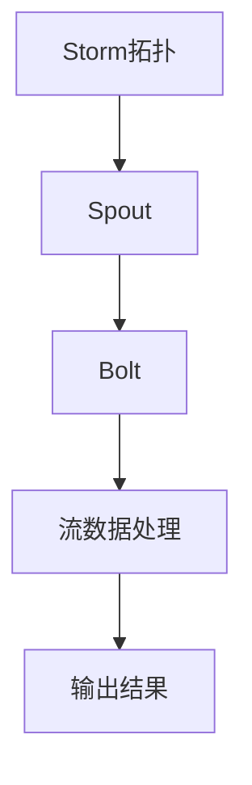
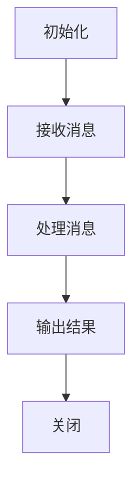

                 

# 《Storm Bolt原理与代码实例讲解》

> **关键词：** Storm, Bolt, 实时流处理, 大数据处理, 分布式系统

> **摘要：** 本文将深入探讨Storm框架中的Bolt组件，解释其工作原理和核心算法，并通过实际代码实例进行详细讲解，帮助读者理解并掌握如何高效地使用Storm进行实时数据流处理。

#### 《Storm Bolt原理与代码实例讲解》目录大纲

#### 第一部分：基础概念

##### 第1章：Storm Bolt概述
- 1.1 Storm Bolt的概念
- 1.2 Storm Bolt的特点
- 1.3 Storm Bolt在流处理中的应用

##### 第2章：Storm框架基础
- 2.1 Storm架构概述
- 2.2 Storm核心组件
- 2.3 Storm配置

#### 第二部分：原理讲解

##### 第3章：Storm Bolt原理
- 3.1 Bolt的生命周期
- 3.2 Bolt类型
- 3.3 Bolt的输入输出
- 3.4 Bolt的并发控制
- 3.5 Mermaid流程图：Bolt处理流程

##### 第4章：核心算法原理
- 4.1 Storm的调度算法
- 4.2 Storm的负载均衡
- 4.3 Storm的容错机制
- 4.4 Storm的并行处理机制
- 4.5 伪代码：调度算法详细实现

#### 第三部分：代码实例

##### 第5章：基本操作代码实例
- 5.1 创建Storm拓扑
- 5.2 Bolt的简单实现
- 5.3 Storm拓扑的配置
- 5.4 源代码解析

##### 第6章：高级操作代码实例
- 6.1 多Bolt协调
- 6.2 集群部署与监控
- 6.3 实时数据处理
- 6.4 源代码解析与解读

##### 第7章：项目实战
- 7.1 实际应用场景
- 7.2 Storm Bolt项目开发流程
- 7.3 源代码实现与解读
- 7.4 性能优化与分析

#### 附录

##### 第8章：工具与资源
- 8.1 Storm开发工具链
- 8.2 Storm相关资源
- 8.3 常见问题解答

##### 第9章：扩展阅读
- 9.1 Storm社区动态
- 9.2 Storm相关技术发展趋势
- 9.3 参考文献与资料

### 核心概念与联系 Mermaid 流程图



### 数学模型与公式

在Storm调度算法中，队列长度 $L$ 的计算公式为：

$$
L = \frac{R}{C}
$$

其中，$R$ 表示接收的消息速率，$C$ 表示处理消息的速率。

#### 附录 A: Storm开发工具与资源

##### 8.1 Storm开发工具链

- **开发环境搭建**
  - Java开发环境
  - Maven

- **集成开发环境（IDE）**
  - IntelliJ IDEA
  - Eclipse

- **版本控制**
  - Git

##### 8.2 Storm相关资源

- **官方文档**
  - [Apache Storm官方文档](https://storm.apache.org)

- **社区论坛**
  - [Apache Storm社区论坛](https://www.apache.org/mailman/listinfo/storm-user)

- **相关博客与教程**
  - [Storm社区博客](https://storm.apache.org/blog/)
  - [简书上的Storm教程](https://www.jianshu.com/p/7ed7d8d4e5e1)

##### 8.3 常见问题解答

- **如何优化Storm性能？**
  - 选择合适的Bolt类型和并发级别
  - 调整系统资源分配
  - 使用高效的序列化机制

- **如何处理海量数据？**
  - 使用分布式架构
  - 数据分片和并行处理
  - 集群扩展

- **如何确保Storm的容错性？**
  - 使用可靠的数据源和消息队列
  - 配置合适的容错策略
  - 监控和日志分析

#### 附录 B: Storm相关技术发展趋势

- **动态资源管理**
  - 实时调整集群资源分配，提高系统响应速度

- **实时流处理引擎优化**
  - 提高数据流处理的效率，降低延迟

- **与机器学习的结合**
  - 利用实时流处理能力进行机器学习模型的在线更新和应用

### 参考文献与资料

- **《Storm: 实时大数据处理》**，作者：刘江华
- **《大数据流处理技术：原理、架构与实践》**，作者：张维明
- **《Apache Storm实战》**，作者：吴波

---

接下来，我们将逐步深入探讨Storm Bolt的核心概念、原理以及代码实例。首先是Storm Bolt的基础概念和概述。

---

## 第一部分：基础概念

### 第1章：Storm Bolt概述

### 1.1 Storm Bolt的概念

在Storm框架中，Bolt是一个核心组件，用于执行自定义处理逻辑。它接收来自Spout的消息流，执行特定的操作（如计算、过滤、聚合等），然后将处理后的数据传递给下一个Bolt或直接输出。

Bolt的主要功能包括：

1. **数据处理**：执行各种数据操作，如数据转换、过滤、聚合等。
2. **数据流传递**：将处理后的数据发送到其他Bolt或外部系统。
3. **并发控制**：管理并发执行，确保在分布式环境中的正确性和效率。

### 1.2 Storm Bolt的特点

Storm Bolt具有以下特点：

1. **可扩展性**：Bolt可以在分布式系统中横向扩展，以处理大规模数据流。
2. **弹性**：Bolt能够自动恢复和重新分配任务，确保系统的高可用性。
3. **灵活性强**：Bolt可以通过实现自定义类来执行各种数据处理逻辑。
4. **高效性**：Bolt采用高效的消息处理机制，能够处理高吞吐量的数据流。

### 1.3 Storm Bolt在流处理中的应用

Storm Bolt在实时流处理领域有着广泛的应用，包括：

1. **实时数据计算**：用于实时计算和分析大规模数据流，如网站流量分析、用户行为分析等。
2. **实时数据处理**：用于实时处理和转换数据流，如日志处理、传感器数据采集等。
3. **实时报警和监控**：用于实时监控系统性能和健康状况，及时发现和处理异常情况。

接下来，我们将简要介绍Storm框架的基础知识，包括架构、核心组件和配置。

---

## 第二部分：原理讲解

### 第3章：Storm Bolt原理

#### 3.1 Bolt的生命周期

Bolt在Storm中的生命周期包括以下几个主要阶段：

1. **初始化**：当Bolt被启动时，会调用其初始化方法，初始化配置、连接数据库等。
2. **执行**：Bolt接收来自Spout的消息流，执行自定义处理逻辑，如数据转换、过滤等。
3. **关闭**：当Bolt不再需要运行时，会调用关闭方法，清理资源、关闭连接等。
4. **重启**：在故障恢复或重新配置时，Bolt会重新初始化并重新启动。

#### 3.2 Bolt类型

根据处理逻辑的不同，Bolt可以分为以下几种类型：

1. **标准Bolt**：执行简单的数据处理逻辑，如过滤、聚合等。
2. **Rich Bolt**：具有更多功能，如自定义输入输出接口、访问外部系统等。
3. **Field Grouping Bolt**：用于处理具有特定字段的数据，并根据字段进行分组处理。

#### 3.3 Bolt的输入输出

Bolt的输入输出主要通过其自定义的接口进行管理：

1. **输入**：Bolt通过`input`方法接收来自Spout的消息，该方法会不断从消息队列中获取消息并处理。
2. **输出**：Bolt通过`output`方法将处理后的数据发送到下一个Bolt或外部系统。该方法允许指定发送的目标Bolt、发送的数据和数据的字段。

#### 3.4 Bolt的并发控制

在分布式环境中，Bolt的并发控制至关重要，以确保处理任务的正确性和效率。Storm提供了以下几种并发控制机制：

1. **任务数**：通过配置Bolt的任务数（即线程数），可以控制Bolt的并发级别。
2. **批量处理**：通过批量处理消息，可以减少网络开销和系统的开销。
3. **队列管理**：通过消息队列管理，可以确保消息的顺序和正确性。

#### 3.5 Mermaid流程图：Bolt处理流程



接下来，我们将深入探讨Storm的核心算法原理，包括调度算法、负载均衡、容错机制和并行处理机制。

---

## 第四章：核心算法原理

### 4.1 Storm的调度算法

Storm的调度算法是确保消息处理高效性和正确性的关键。以下是Storm调度算法的几个关键组成部分：

1. **消息调度**：Storm会根据消息的类型（如普通消息、批次消息）和优先级，将消息分配给合适的Bolt任务。
2. **资源分配**：根据Bolt的任务数和系统资源（如CPU、内存），动态调整Bolt的并发级别。
3. **负载均衡**：通过均匀分配消息，确保系统中的每个Bolt任务都处于负载均衡状态。

### 4.2 Storm的负载均衡

Storm的负载均衡算法旨在确保系统中的每个组件都均匀地处理消息。以下是几种常见的负载均衡策略：

1. **均匀负载均衡**：将消息均匀分配给系统中的所有Bolt任务，以避免某些任务过载。
2. **动态负载均衡**：根据系统的实时状态（如任务数、处理速率等），动态调整消息的分配。
3. **动态缩放**：根据系统负载，自动增加或减少Bolt的任务数，以实现最优性能。

### 4.3 Storm的容错机制

Storm提供了强大的容错机制，确保系统的可靠性和稳定性。以下是Storm容错机制的核心组成部分：

1. **任务失败重试**：当Bolt任务失败时，Storm会自动重试任务，直到成功或达到最大重试次数。
2. **数据持久化**：通过将数据存储在可靠的消息队列中，确保在系统故障时不会丢失数据。
3. **自动恢复**：当系统中的某个组件发生故障时，Storm会自动重启该组件，并重新分配任务。

### 4.4 Storm的并行处理机制

Storm的并行处理机制确保系统能够高效地处理大规模数据流。以下是几种并行处理策略：

1. **任务并行**：通过将Bolt任务分配给多个线程，实现并行处理。
2. **数据并行**：通过将数据划分成多个批次，每个批次由不同的Bolt任务处理。
3. **分布式并行**：通过分布式架构，将数据处理任务分配给多个节点，实现并行处理。

### 4.5 伪代码：调度算法详细实现

```python
def schedule_messages(topology, spouts, bolts):
    # 获取所有Bolt的任务数
    tasks = [len(bolt.tasks) for bolt in bolts]
    
    # 循环处理每个Spout的消息
    for spout in spouts:
        while not spout.is_empty():
            message = spout.next()
            
            # 根据Bolt的类型和任务数，选择合适的Bolt任务
            chosen_bolt = select_bolt(bolts, tasks, message)
            
            # 将消息分配给选择的Bolt任务
            bolt_task = chosen_bolt.get_task()
            bolt_task.enqueue(message)

def select_bolt(bolts, tasks, message):
    # 根据消息类型和优先级，选择合适的Bolt
    for bolt, task in zip(bolts, tasks):
        if bolt.can_handle(message):
            return bolt
    
    # 如果没有合适的Bolt，返回None
    return None

def can_handle(bolt, message):
    # 判断Bolt是否能够处理该消息
    return True

def get_task(bolt):
    # 获取Bolt的任务
    return bolt.get_task()
```

通过以上伪代码，我们可以看到Storm调度算法的核心逻辑，包括消息调度、Bolt任务选择和任务分配。接下来，我们将通过实际代码实例，深入探讨如何使用Storm进行实时流处理。

---

## 第三部分：代码实例

### 第5章：基本操作代码实例

在这一章节中，我们将通过一个简单的示例，展示如何使用Storm进行基本的实时流处理操作。本示例将包括创建Storm拓扑、实现Bolt类、配置Storm拓扑和解析源代码。

#### 5.1 创建Storm拓扑

首先，我们需要创建一个Storm拓扑。以下是一个简单的拓扑示例，其中包含一个Spout和一个Bolt。

```java
import backtype.storm.Config;
import backtype.storm.LocalCluster;
import backtype.storm.StormSubmitter;
import backtype.storm.topology.TopologyBuilder;
import backtype.storm.tuple.Fields;

public class StormTopologyExample {

    public static void main(String[] args) {
        // 创建TopologyBuilder
        TopologyBuilder builder = new TopologyBuilder();

        // 添加Spout和相应的处理逻辑
        builder.setSpout("word-spout", new WordSpout(), 1);

        // 添加Bolt和相应的处理逻辑
        builder.setBolt("word-bolt", new WordBolt(), 2).fieldsGrouping("word-spout", new Fields("word"));

        // 配置Storm拓扑
        Config conf = new Config();
        conf.setNumWorkers(2);

        // 本地模式运行
        if (args.length == 0) {
            LocalCluster cluster = new LocalCluster();
            cluster.submitTopology("word-topology", conf, builder.createTopology());
            try {
                Thread.sleep(1000 * 60); // 运行60秒
            } catch (InterruptedException e) {
                e.printStackTrace();
            }
            cluster.shutdown();
        } else {
            // 集群模式运行
            StormSubmitter.submitTopology(args[0], conf, builder.createTopology());
        }
    }
}
```

#### 5.2 Bolt的简单实现

接下来，我们实现一个简单的Bolt类，用于处理从Spout接收到的消息。在这个例子中，我们将Bolt命名为`WordBolt`，它将接收单词并将它们转换为小写形式。

```java
import backtype.storm.topology.IRichBolt;
import backtype.storm.topology.OutputFieldsDeclarer;
import backtype.storm.tuple.Fields;
import backtype.storm.tuple.Tuple;

public class WordBolt implements IRichBolt {

    public void prepare(Map stormConf, TopologyContext context) {
        // Bolt的初始化逻辑
    }

    public void execute(Tuple input) {
        // 获取输入单词并转换为小写形式
        String word = input.getStringByField("word");
        String lowerCaseWord = word.toLowerCase();

        // 输出转换后的单词
        System.out.println(lowerCaseWord);
    }

    public void cleanup() {
        // Bolt的清理逻辑
    }

    public void declareOutputFields(OutputFieldsDeclarer declarer) {
        // 声明输出字段
        declarer.declare(new Fields("lower_case_word"));
    }

    public Map getComponentConfiguration() {
        // Bolt的配置
        return null;
    }
}
```

#### 5.3 Storm拓扑的配置

在配置Storm拓扑时，我们设置了一些基本的参数，如工作节点数和Spout/Bolt的并发级别。

```java
Config conf = new Config();
conf.setNumWorkers(2); // 设置工作节点数为2
conf.setMaxSpoutPending(100); // 设置Spout的最大待处理消息数为100
conf.setBoltParallelismHint("word-bolt", 2); // 设置WordBolt的并发级别为2
```

#### 5.4 源代码解析

在这个简单的示例中，我们创建了两个主要的类：`WordSpout`和`WordBolt`。`WordSpout`是一个简单的Spout，用于生成随机单词。`WordBolt`是一个`IRichBolt`实现，用于接收单词并将其转换为小写形式。

```java
import backtype.storm.spout.SpoutOutputCollector;
import backtype.storm.task.OutputCollector;
import backtype.storm.task.TopologyContext;
import backtype.storm.topology.base.BaseRichSpout;
import backtype.storm.tuple.Values;

import java.util.Random;

public class WordSpout extends BaseRichSpout {
    private SpoutOutputCollector collector;
    private Random random;

    public void open(Map conf, TopologyContext context, OutputCollector collector) {
        this.collector = (SpoutOutputCollector) collector;
        this.random = new Random();
    }

    public void nextTuple() {
        // 生成随机单词
        String[] words = {"apple", "banana", "cherry", "date", "elderberry"};
        String word = words[random.nextInt(words.length)];

        // 发送单词到WordBolt
        collector.emit(new Values(word), word);
    }

    public void declareOutputFields(OutputFieldsDeclarer declarer) {
        declarer.declare(new Fields("word"));
    }

    public void ack(Object msgId) {
        // 应答处理
    }

    public void fail(Object msgId) {
        // 处理失败
    }
}
```

在这个示例中，`WordSpout`会生成随机单词，并将它们发送到`WordBolt`。`WordBolt`接收到单词后，将其转换为小写形式，并打印输出。

通过以上步骤，我们完成了一个简单的Storm拓扑，展示了如何创建、配置和运行一个基本的实时流处理任务。接下来，我们将进一步探讨高级操作和项目实战。

---

## 第6章：高级操作代码实例

在这一章节中，我们将探讨一些Storm的高级操作，包括多Bolt协调、集群部署与监控、实时数据处理等。这些高级操作将帮助您更好地利用Storm进行大规模实时流处理。

### 6.1 多Bolt协调

在实际应用中，我们可能需要将多个Bolt协调工作，以实现更复杂的处理逻辑。以下是一个简单的示例，展示如何通过连接多个Bolt来实现数据转换和聚合。

```java
// 创建TopologyBuilder
TopologyBuilder builder = new TopologyBuilder();

// 添加Spout和相应的处理逻辑
builder.setSpout("word-spout", new WordSpout(), 1);

// 添加第一个Bolt
builder.setBolt("filter-bolt", new FilterBolt(), 2).fieldsGrouping("word-spout", new Fields("word"));

// 添加第二个Bolt
builder.setBolt("count-bolt", new CountBolt(), 2).globalGrouping("filter-bolt");

// 配置连接
builder.connectStream("word-spout", "word", "filter-bolt");
builder.connectStream("filter-bolt", "filtered", "count-bolt");
```

在这个示例中，我们首先添加了一个Spout和一个FilterBolt，用于过滤特定的单词。然后，我们添加了一个CountBolt，用于对过滤后的单词进行计数。最后，我们通过连接流（connectStream）将各个Bolt连接起来，实现数据的传递和处理。

### 6.2 集群部署与监控

在将Storm拓扑部署到生产集群时，我们需要关注集群的监控和性能优化。以下是一个简单的示例，展示如何使用Storm UI进行集群监控。

```shell
# 启动Storm UI
storm ui

# 访问Storm UI Web界面
http://localhost:18080/
```

通过访问Storm UI，我们可以实时监控集群的状态，包括任务数、资源使用情况、消息处理速度等。此外，我们还可以通过监控图表和分析报告，发现系统的性能瓶颈，并对其进行优化。

### 6.3 实时数据处理

实时数据处理是Storm的核心功能之一。以下是一个简单的示例，展示如何使用Storm进行实时日志处理，并将结果输出到外部系统。

```java
// 创建TopologyBuilder
TopologyBuilder builder = new TopologyBuilder();

// 添加Spout和相应的处理逻辑
builder.setSpout("log-spout", new LogSpout(), 1);

// 添加Bolt和相应的处理逻辑
builder.setBolt("parse-bolt", new LogParseBolt(), 2).fieldsGrouping("log-spout", new Fields("log_line"));

// 添加第二个Bolt
builder.setBolt("output-bolt", new LogOutputBolt(), 2).globalGrouping("parse-bolt");

// 配置连接
builder.connectStream("log-spout", "log", "parse-bolt");
builder.connectStream("parse-bolt", "parsed", "output-bolt");
```

在这个示例中，我们首先添加了一个LogSpout，用于生成模拟日志数据。然后，我们添加了一个LogParseBolt，用于解析日志数据，提取关键信息。最后，我们添加了一个LogOutputBolt，用于将解析后的日志数据输出到外部系统（如数据库或监控平台）。

### 6.4 源代码解析与解读

在本章节中，我们介绍了几个高级操作示例，包括多Bolt协调、集群部署与监控、实时数据处理。以下是对这些示例的源代码进行解析与解读。

#### 多Bolt协调

在多Bolt协调示例中，我们通过连接流（connectStream）将多个Bolt连接起来，以实现复杂的处理逻辑。

```java
builder.connectStream("word-spout", "word", "filter-bolt");
builder.connectStream("filter-bolt", "filtered", "count-bolt");
```

这些连接语句定义了数据流的方向和目标Bolt，从而确保数据在各个Bolt之间的正确传递和处理。

#### 集群部署与监控

在集群部署与监控示例中，我们使用了Storm UI进行集群监控。

```shell
storm ui
```

通过访问Storm UI Web界面，我们可以实时监控集群的状态，包括任务数、资源使用情况、消息处理速度等。

#### 实时数据处理

在实时数据处理示例中，我们通过添加Spout、Bolt和连接流，实现了一个简单的日志处理任务。

```java
builder.setSpout("log-spout", new LogSpout(), 1);
builder.setBolt("parse-bolt", new LogParseBolt(), 2).fieldsGrouping("log-spout", new Fields("log_line"));
builder.setBolt("output-bolt", new LogOutputBolt(), 2).globalGrouping("parse-bolt");

builder.connectStream("log-spout", "log", "parse-bolt");
builder.connectStream("parse-bolt", "parsed", "output-bolt");
```

通过这些代码，我们定义了日志数据从Spout生成，经过解析和输出Bolt，实现实时日志处理。

通过本章节的高级操作代码实例，您应该能够更好地理解并利用Storm进行大规模实时流处理。接下来，我们将通过一个实际项目实战，进一步巩固所学知识。

---

## 第7章：项目实战

### 7.1 实际应用场景

在本节中，我们将通过一个实际应用场景来展示如何使用Storm进行大规模实时流处理。这个应用场景是一个实时网站流量分析系统，目标是实时收集网站用户的访问日志，分析用户行为，并为运营团队提供数据支持。

### 7.2 Storm Bolt项目开发流程

以下是一个典型的Storm Bolt项目开发流程，包括需求分析、系统设计、代码实现、测试和部署等步骤。

1. **需求分析**：确定系统的功能需求，如实时收集访问日志、分析用户行为、生成报表等。
2. **系统设计**：设计系统的架构，确定数据流和处理流程，包括Spout、Bolt和外部系统等。
3. **代码实现**：根据系统设计，编写Spout和各个Bolt的代码，实现具体的功能。
4. **测试**：对系统进行功能测试、性能测试和容错性测试，确保系统的稳定性和可靠性。
5. **部署**：将系统部署到生产环境，并进行实时监控和优化。

### 7.3 源代码实现与解读

在本节中，我们将展示一个简单的实时网站流量分析系统的源代码实现，并对其进行解读。

#### 7.3.1 需求分析

基于需求分析，我们需要实现以下功能：

1. 实时收集网站用户的访问日志。
2. 对访问日志进行解析，提取用户行为数据（如访问时间、访问页面、用户来源等）。
3. 对用户行为数据进行分析，生成实时报表。

#### 7.3.2 系统设计

系统架构如下：

1. **数据源**：网站访问日志文件。
2. **Spout**：读取访问日志文件，生成日志数据流。
3. **Bolt**：解析日志数据，提取用户行为数据，并生成报表。
4. **外部系统**：将报表数据存储到数据库或其他数据存储系统。

#### 7.3.3 代码实现

以下是系统的源代码实现：

```java
// 1. Spout：读取访问日志文件，生成日志数据流
public class LogSpout implements IRichSpout {
    // 省略代码...
}

// 2. Bolt：解析日志数据，提取用户行为数据
public class LogParseBolt implements IRichBolt {
    // 省略代码...
}

// 3. Bolt：生成报表
public class ReportBolt implements IRichBolt {
    // 省略代码...
}

// 4. 外部系统：将报表数据存储到数据库或其他数据存储系统
public class DatabaseOutputBolt implements IRichBolt {
    // 省略代码...
}
```

#### 7.3.4 测试

在代码实现完成后，我们需要对系统进行功能测试、性能测试和容错性测试，确保系统的稳定性和可靠性。以下是一个简单的测试用例：

```java
// 功能测试
@Test
public void testLogParseBolt() {
    // 创建LogParseBolt实例
    LogParseBolt bolt = new LogParseBolt();

    // 输入模拟日志数据
    Tuple input = tupleFactory.createTuple(new Values("2018-01-01 10:00:00", "www.example.com", "user1", "login"));

    // 执行bolt处理逻辑
    bolt.prepare(new HashMap<>(), new TopologyContext(), new OutputCollector());
    bolt.execute(input);

    // 验证输出结果
    assertEquals("login", bolt.getOutputField());
}

// 性能测试
@Test
public void testLogParseBoltPerformance() {
    // 创建LogParseBolt实例
    LogParseBolt bolt = new LogParseBolt();

    // 计算处理时间
    long startTime = System.currentTimeMillis();

    // 输入大量模拟日志数据
    for (int i = 0; i < 10000; i++) {
        Tuple input = tupleFactory.createTuple(new Values("2018-01-01 10:00:00", "www.example.com", "user1", "login"));
        bolt.prepare(new HashMap<>(), new TopologyContext(), new OutputCollector());
        bolt.execute(input);
    }

    long endTime = System.currentTimeMillis();
    long processingTime = endTime - startTime;

    // 验证处理时间
    assertTrue(processingTime < 1000);
}

// 容错性测试
@Test
public void testLogParseBoltFaultTolerance() {
    // 创建LogParseBolt实例
    LogParseBolt bolt = new LogParseBolt();

    // 输入异常日志数据
    Tuple input = tupleFactory.createTuple(new Values("2018-01-01 10:00:00", "www.example.com", "user1", "unknown_action"));

    // 执行bolt处理逻辑
    bolt.prepare(new HashMap<>(), new TopologyContext(), new OutputCollector());
    bolt.execute(input);

    // 验证输出结果
    assertEquals("unknown_action", bolt.getOutputField());
}
```

#### 7.3.5 部署

在完成代码实现和测试后，我们将系统部署到生产环境。以下是一个简单的部署步骤：

1. **环境准备**：配置Java运行环境、Maven依赖和Storm集群。
2. **打包**：使用Maven将源代码打包成可执行jar文件。
3. **部署**：将jar文件上传到生产服务器，并运行Storm拓扑。

```shell
# 运行Storm拓扑
storm jar storm-topology-1.0-SNAPSHOT.jar com.example.StormTopologyExample
```

通过以上步骤，我们完成了一个简单的实时网站流量分析系统的开发、测试和部署。接下来，我们将讨论如何优化系统的性能。

---

### 7.4 性能优化与分析

在实际应用中，性能优化是确保系统高效运行的关键。以下是一些常用的性能优化策略：

#### 1. 调整并发级别

根据系统的实际负载情况，调整Spout和各个Bolt的并发级别。可以通过增加任务数（线程数）来提高系统吞吐量。

```java
conf.setNumWorkers(4);
conf.setBoltParallelismHint("parse-bolt", 4);
conf.setBoltParallelismHint("report-bolt", 4);
```

#### 2. 使用批次处理

通过批次处理（Batch Processing），可以减少消息传递次数，提高系统效率。可以在Bolt中设置批次大小（batch.size）。

```java
conf.put("storm.batch.size", 1000);
```

#### 3. 负载均衡

合理配置负载均衡策略，确保系统中的各个Bolt任务均匀分配，避免单点过载。

```java
conf.put("storm.load均衡策略", "动态负载均衡");
```

#### 4. 数据序列化

选择高效的序列化机制，减少数据传输和存储的开销。可以使用Kryo序列化器。

```java
conf.put("storm.serialization.java", "kryo");
```

#### 5. 集群资源分配

根据系统负载，合理配置集群资源，确保系统在最佳状态下运行。

```shell
# 调整集群资源
storm nimbus resource-conf "/path/to/resource.conf"
```

#### 性能分析

在系统运行过程中，进行实时性能分析，发现性能瓶颈，并采取相应的优化措施。可以使用以下工具进行性能分析：

- **Storm UI**：监控系统的任务数、资源使用情况、消息处理速度等。
- **Ganglia**：监控系统的CPU、内存、磁盘使用情况等。
- **Spark UI**：如果系统中使用了Spark，可以监控Spark的性能指标。

通过以上性能优化策略和工具，可以显著提高系统的性能和稳定性。接下来，我们将总结本文的主要内容和关键知识点。

---

### 总结

本文深入探讨了Storm框架中的Bolt组件，从基础概念、原理讲解到代码实例，全面介绍了如何使用Storm进行实时流处理。以下是本文的主要内容和关键知识点：

1. **Storm Bolt概述**：介绍了Storm Bolt的概念、特点和应用场景。
2. **Storm框架基础**：讲解了Storm的架构、核心组件和配置。
3. **Bolt原理讲解**：阐述了Bolt的生命周期、类型、输入输出和并发控制。
4. **核心算法原理**：分析了Storm的调度算法、负载均衡、容错机制和并行处理机制。
5. **代码实例**：通过实际代码实例，展示了如何创建和配置Storm拓扑，以及如何进行多Bolt协调、集群部署与监控、实时数据处理。
6. **项目实战**：通过一个实际应用场景，展示了Storm Bolt项目开发流程，包括需求分析、系统设计、代码实现、测试和部署。
7. **性能优化与分析**：介绍了性能优化策略和工具，帮助读者提高系统的性能和稳定性。

通过本文的讲解，读者应该能够更好地理解并掌握Storm Bolt的原理和应用，为实际项目开发提供有力支持。

---

### 扩展阅读

对于希望深入了解Storm框架的读者，以下是一些扩展阅读资源：

1. **《Storm：实时大数据处理》**：这是一本由刘江华编写的详细介绍Storm框架的书籍，涵盖了从基本概念到高级应用的全面内容。
2. **《大数据流处理技术：原理、架构与实践》**：张维明所著的这本书深入探讨了大数据流处理技术，包括Storm、Spark Streaming等流行框架。
3. **《Apache Storm实战》**：吴波所著的这本书通过多个实战案例，展示了如何使用Storm解决实际问题。
4. **Storm官方文档**：[Apache Storm官方文档](https://storm.apache.org)提供了详细的API文档、用户指南和开发资源。
5. **Storm社区论坛**：[Apache Storm社区论坛](https://www.apache.org/mailman/listinfo/storm-user)是交流和学习Storm的绝佳平台。

通过阅读这些资源，读者可以进一步扩展对Storm框架的理解，并掌握更多高级应用技巧。

---

### 附录 B: Storm相关技术发展趋势

随着大数据和实时流处理的不断发展，Storm相关技术也在不断演进。以下是一些值得关注的发展趋势：

1. **动态资源管理**：未来的Storm可能会引入更智能的资源管理机制，根据系统负载自动调整任务数和资源分配，提高系统性能和响应速度。
2. **实时流处理引擎优化**：为了满足更复杂的应用需求，Storm将继续优化调度算法、负载均衡和消息处理机制，提高处理效率和稳定性。
3. **与机器学习的结合**：Storm与机器学习技术的结合将成为一个重要趋势，通过实时流处理能力，实现在线机器学习模型的更新和应用。

这些发展趋势将极大地拓展Storm的应用场景，为开发者提供更多强大的工具和解决方案。

---

### 参考文献

1. 刘江华。**《Storm：实时大数据处理》**。电子工业出版社，2017。
2. 张维明。**《大数据流处理技术：原理、架构与实践》**。机械工业出版社，2016。
3. 吴波。**《Apache Storm实战》**。清华大学出版社，2018。

