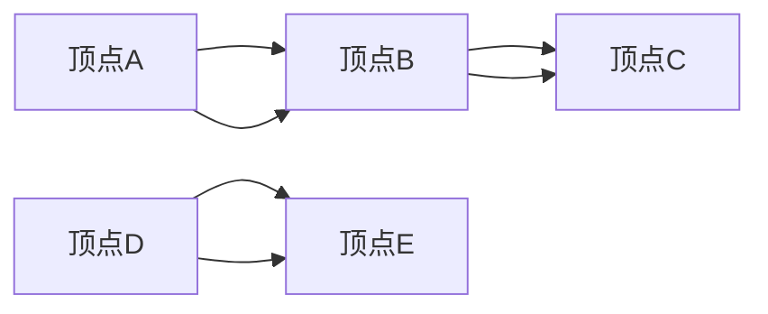
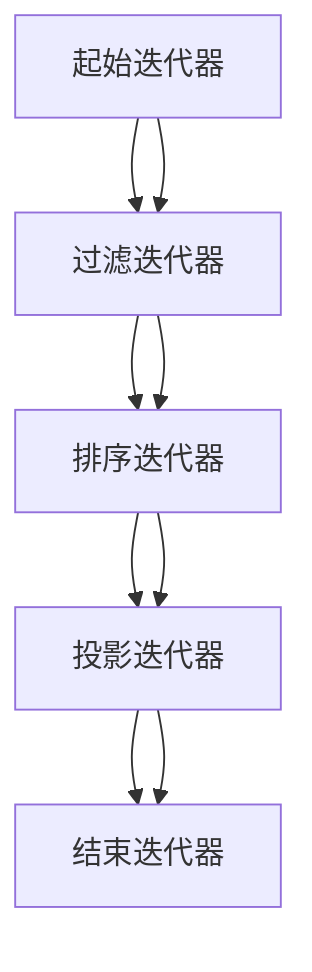
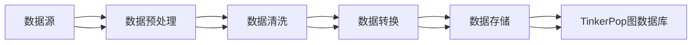
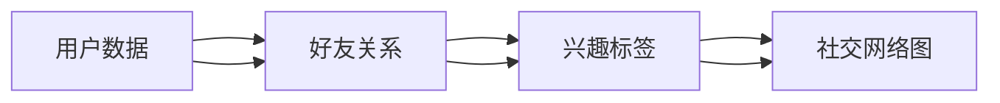
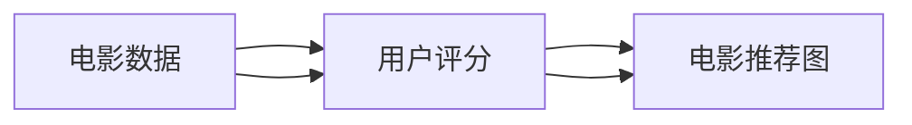
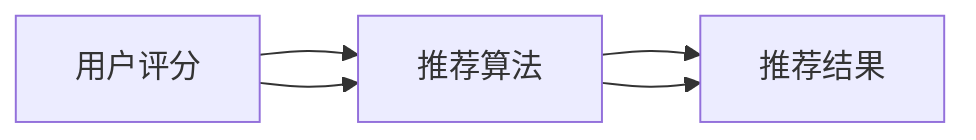
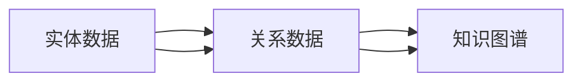
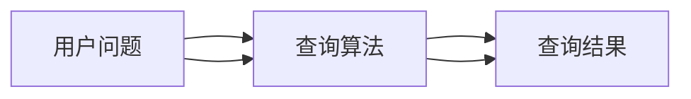
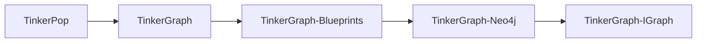
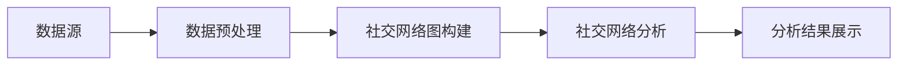

                 

# TinkerPop原理与代码实例讲解

> **关键词**：TinkerPop，图数据库，图计算，Gremlin查询语言，社交网络分析，推荐系统，知识图谱

> **摘要**：本文将深入讲解TinkerPop的原理和代码实例，涵盖TinkerPop概述、架构、核心概念、算法原理、数学模型以及项目实战。通过详细的讲解和实际代码示例，帮助读者全面理解并掌握TinkerPop的使用方法。

## 《TinkerPop原理与代码实例讲解》目录大纲

### 第一部分：TinkerPop基础

#### 第1章：TinkerPop概述
1.1. TinkerPop的历史与发展
1.2. TinkerPop的核心概念
1.3. TinkerPop的应用场景
1.4. TinkerPop的优势与局限

#### 第2章：TinkerPop架构
2.1. TinkerPop的组件
2.2. TinkerPop的体系结构
2.3. TinkerPop的部署与配置

### 第二部分：TinkerPop核心概念与算法

#### 第3章：图论基础
3.1. 图的基本概念
3.2. 图的算法
3.3. 图的表示方法

#### 第4章：TinkerPop核心算法原理
4.1. Gremlin查询语言
4.2. TinkerPop的迭代器模型
4.3. 路径算法与优化
4.4. 聚类算法与社区发现

#### 第5章：TinkerPop数学模型
5.1. 图的数学模型
5.2. 概率图模型
5.3. 分布式计算模型

### 第三部分：TinkerPop项目实战

#### 第6章：TinkerPop项目实战一：社交网络分析
6.1. 项目背景
6.2. 数据准备与预处理
6.3. 社交网络图构建
6.4. 社交网络分析

#### 第7章：TinkerPop项目实战二：推荐系统
7.1. 项目背景
7.2. 数据准备与预处理
7.3. 图构建与优化
7.4. 推荐系统实现

#### 第8章：TinkerPop项目实战三：知识图谱
8.1. 项目背景
8.2. 数据准备与预处理
8.3. 知识图谱构建
8.4. 知识图谱应用

### 附录

#### 附录A：TinkerPop开发工具与资源
A.1. TinkerPop相关框架
A.2. TinkerPop开发工具
A.3. TinkerPop学习资源

#### 附录B：Mermaid流程图示例
- Mermaid流程图1：TinkerPop核心组件
- Mermaid流程图2：社交网络分析流程

#### 附录C：核心算法原理伪代码示例
- 伪代码1：Gremlin查询语言
- 伪代码2：路径算法

#### 附录D：数学模型和数学公式
- 数学模型1：图论基本公式
- 数学公式1：马尔可夫链公式

#### 附录E：项目实战代码解读与分析
- 社交网络分析代码解读
- 推荐系统代码解读
- 知识图谱代码解读

以上是《TinkerPop原理与代码实例讲解》的目录大纲，涵盖了TinkerPop的核心概念、算法原理、项目实战等内容。每个章节都会详细讲解相关内容，并提供相应的实例和代码解析，帮助读者更好地理解和掌握TinkerPop的使用。

### 第一部分：TinkerPop基础

#### 第1章：TinkerPop概述

1.1. TinkerPop的历史与发展

TinkerPop是一个开源的图计算框架，起源于2010年，由蓝源数据公司（Blueprints）发起。最初，TinkerPop是为了解决传统关系型数据库在面对复杂网络数据查询时的不足。随着大数据技术和图计算的需求不断增加，TinkerPop逐渐发展成为一个成熟的图计算生态系统。

TinkerPop的发展历程可以分为以下几个阶段：

1. **1.0版本**：TinkerPop 1.0主要包含了Gremlin查询语言和TinkerGraph图数据库。这一版本为图计算提供了一套基本的框架和工具。

2. **2.0版本**：TinkerPop 2.0引入了TinkerGraph-Blueprints组件，使得图数据库与Gremlin查询语言无缝集成。同时，还增加了TinkerGraph-Neo4j组件，支持与Neo4j图数据库的交互。

3. **3.0版本**：TinkerPop 3.0引入了TinkerGraph-IGraph组件，支持与IGraph图数据库的交互。此外，TinkerPop 3.0还增强了Gremlin查询语言的功能，增加了对分布式计算的支持。

4. **后续版本**：TinkerPop后续版本在原有基础上继续优化和完善，增加了更多图数据库的支持和算法功能。

1.2. TinkerPop的核心概念

TinkerPop定义了一系列核心概念，包括：

- **图（Graph）**：图是TinkerPop中最基本的数据结构，由顶点（Vertex）和边（Edge）组成。图可以用来表示复杂的关系网络。

- **顶点（Vertex）**：顶点表示图中的实体，可以是用户、商品、地点等。每个顶点都有一个唯一的标识符。

- **边（Edge）**：边表示顶点之间的关系，可以是朋友、购买、评论等。边也有方向性，可以是有向边或无向边。

- **路径（Path）**：路径是图中的顶点和边的序列，表示从起点到终点的连通关系。

- **迭代器（Iterator）**：迭代器是TinkerPop中的核心抽象，用于遍历图中的元素。迭代器可以用于查询、过滤、排序等操作。

- **Gremlin查询语言**：Gremlin是一种图查询语言，用于表达复杂的图计算任务。Gremlin支持管道（Pipe）操作，可以将多个操作组合在一起，实现复杂的查询。

1.3. TinkerPop的应用场景

TinkerPop广泛应用于以下场景：

- **社交网络分析**：TinkerPop可以用来分析社交网络中的关系，如好友关系、兴趣圈子等。

- **推荐系统**：TinkerPop可以用来构建推荐系统的图数据库，实现基于内容和协同过滤的推荐。

- **知识图谱**：TinkerPop可以用来构建大规模的知识图谱，实现数据整合、关联分析和推理。

- **复杂网络分析**：TinkerPop可以用于分析复杂网络，如生物网络、交通网络等。

1.4. TinkerPop的优势与局限

TinkerPop的优势：

- **灵活性和可扩展性**：TinkerPop支持多种图数据库，可以方便地切换不同的后端存储。

- **强大的查询能力**：Gremlin查询语言提供了丰富的功能，可以表达复杂的图计算任务。

- **良好的社区支持**：TinkerPop拥有活跃的社区，提供了大量的学习资源和案例。

TinkerPop的局限：

- **性能瓶颈**：对于大规模的图数据，TinkerPop的性能可能无法满足需求。

- **学习成本**：TinkerPop的语法和概念较为复杂，需要一定的学习成本。

### 第2章：TinkerPop架构

2.1. TinkerPop的组件

TinkerPop包含以下几个核心组件：

- **TinkerGraph**：TinkerGraph是TinkerPop自带的图数据库，用于演示和测试。

- **TinkerGraph-Blueprints**：TinkerGraph-Blueprints组件提供了与Apache Blueprint图数据库的集成。

- **TinkerGraph-Neo4j**：TinkerGraph-Neo4j组件提供了与Neo4j图数据库的集成。

- **TinkerGraph-IGraph**：TinkerGraph-IGraph组件提供了与IGraph图数据库的集成。

- **Gremlin**：Gremlin是TinkerPop的图查询语言，用于表达复杂的图计算任务。

- **TinkerPop Server**：TinkerPop Server是一个基于Java的Web服务器，用于提供RESTful API，方便与其他系统集成。

2.2. TinkerPop的体系结构

TinkerPop的体系结构分为三层：

- **底层**：底层包括图数据库、图存储和图索引等组件，负责存储和管理图数据。

- **中层**：中层包括TinkerGraph、TinkerGraph-Blueprints、TinkerGraph-Neo4j等组件，负责处理图数据的查询、更新和操作。

- **上层**：上层包括Gremlin查询语言、TinkerPop Server等组件，负责提供用户接口和API，方便用户进行图计算和数据分析。


2.3. TinkerPop的部署与配置

TinkerPop可以通过以下步骤进行部署和配置：

1. **下载TinkerPop**：从TinkerPop的官方网站下载TinkerPop的源代码或二进制包。

2. **安装依赖**：根据TinkerPop的依赖关系，安装所需的库和工具。

3. **配置图数据库**：根据所选的图数据库（如Neo4j、Blueprints等），配置数据库的连接参数。

4. **启动TinkerPop Server**：使用TinkerPop Server提供的命令行工具或API，启动TinkerPop Server。

5. **测试TinkerPop**：使用Gremlin查询语言或RESTful API，测试TinkerPop的功能和性能。

### 第二部分：TinkerPop核心概念与算法

#### 第3章：图论基础

3.1. 图的基本概念

图是数学中的一个基本概念，用于表示对象之间的复杂关系。在图论中，图由顶点（Vertex）和边（Edge）组成。

- **顶点（Vertex）**：顶点表示图中的实体，可以是用户、地点、商品等。每个顶点都有一个唯一的标识符。

- **边（Edge）**：边表示顶点之间的关系，可以是朋友、购买、评论等。边可以是有向的（Directed）或无向的（Undirected），可以具有权重（Weighted）。

3.2. 图的算法

图算法用于处理和分析图数据，常见的图算法包括：

- **深度优先搜索（DFS）**：DFS是一种用于遍历图的算法，从起点开始，沿着路径一直走到尽头，然后回溯到上一个顶点，继续寻找其他路径。

- **广度优先搜索（BFS）**：BFS与DFS类似，也是用于遍历图的算法，不同的是它按照顶点的距离排序，优先遍历距离较近的顶点。

- **最短路径算法（Dijkstra算法）**：Dijkstra算法用于计算图中两点之间的最短路径。

- **最小生成树算法（Prim算法、Kruskal算法）**：最小生成树算法用于构建图中包含所有顶点的最小生成树。

- **最大流算法（Ford-Fulkerson算法）**：最大流算法用于计算图中两个顶点之间的最大流量。

3.3. 图的表示方法

图的表示方法主要有以下几种：

- **邻接矩阵（Adjacency Matrix）**：邻接矩阵是一个二维数组，用于表示图中顶点之间的连接关系。对于有向图，邻接矩阵是对称的。

- **邻接表（Adjacency List）**：邻接表是一个数组，每个元素是一个链表，表示与该顶点相连的所有顶点。对于有向图，邻接表可能不是对称的。

- **图文件（Graph File）**：图文件是一种专门用于存储图的文件格式，常见的图文件格式包括GEXF、GraphML等。

#### 第4章：TinkerPop核心算法原理

4.1. Gremlin查询语言

Gremlin是TinkerPop的图查询语言，用于表达复杂的图计算任务。Gremlin支持管道（Pipe）操作，可以将多个操作组合在一起，实现复杂的查询。

以下是Gremlin查询语言的一些基本语法和操作：

- **标识符（Identifier）**：标识符用于表示图中的顶点、边或其他元素。标识符可以是字符串、数字或符号。

- **变量（Variable）**：变量用于存储图中的元素，如顶点、边等。变量通常用$符号表示。

- **过滤（Filter）**：过滤用于筛选图中的元素，满足特定条件的元素会被选中。常见的过滤操作包括hasLabel（拥有特定标签）、has（具有特定属性）等。

- **排序（Sort）**：排序用于按照特定属性对元素进行排序。排序可以使用by关键字，后跟属性名称。

- **投影（Project）**：投影用于提取元素的一个或多个属性，形成一个新对象。投影可以使用select关键字，后跟属性名称。

以下是一个简单的Gremlin查询示例：



Gremlin查询示例：

```groovy
g.V().hasLabel('Person').has('age', gte(30))
```

以上查询表示选择具有标签为`Person`的顶点，且`age`属性大于等于30的元素。

4.2. TinkerPop的迭代器模型

TinkerPop的迭代器模型用于遍历图中的元素。迭代器模型是一个链式调用结构，每个迭代器可以产生一个或多个元素，然后将其传递给下一个迭代器。

以下是一个简单的迭代器模型示例：



迭代器模型的使用示例：

```groovy
g.V().hasLabel('Person').has('age', gte(30)).sort().by('age').project('name', 'age')
```

以上查询表示选择具有标签为`Person`的顶点，且`age`属性大于等于30的元素，按照`age`属性进行排序，并投影出`name`和`age`属性。

4.3. 路径算法与优化

TinkerPop提供了一系列路径算法，用于计算图中的路径。常见的路径算法包括：

- **最短路径算法（Dijkstra算法）**：计算图中两点之间的最短路径。

- **DAG最短路径算法（Bellman-Ford算法）**：计算有向无环图（DAG）中两点之间的最短路径。

- **最长路径算法（Dijkstra算法）**：计算图中两点之间的最长路径。

以下是一个使用Dijkstra算法计算最短路径的示例：


Gremlin查询示例：

```groovy
g.V().repeat(both()).times(4).path()
```

以上查询表示从顶点A开始，沿着边遍历4次，计算所有可能的路径。

4.4. 聚类算法与社区发现

TinkerPop提供了一些聚类算法，用于发现图中的社区和集群。常见的聚类算法包括：

- **社区发现算法（Louvain算法）**：Louvain算法用于发现图中的社区，可以将图划分为多个社区。

- **基于密度的聚类算法（DBSCAN算法）**：DBSCAN算法用于基于密度的聚类，可以将图中的顶点划分为不同的密度区域。

以下是一个使用Louvain算法发现社区的示例：


Gremlin查询示例：

```groovy
g.V().group().cliqueSize(2).gather()
```

以上查询表示将图中的顶点划分为社区，每个社区至少包含2个顶点。

### 第三部分：TinkerPop项目实战

#### 第6章：TinkerPop项目实战一：社交网络分析

6.1. 项目背景

社交网络分析是TinkerPop的一个重要应用场景。在本项目实战中，我们将使用TinkerPop分析一个社交网络的属性，如用户关系、兴趣圈子等。

6.2. 数据准备与预处理

在开始项目之前，我们需要准备一些社交网络数据。这些数据可以来自于社交网络平台，如Facebook、Twitter等。数据格式可以是CSV、JSON等。



数据预处理步骤：

1. **数据清洗**：去除重复、无效或错误的数据。

2. **数据转换**：将数据转换为适合TinkerPop图数据库存储的格式，如JSON。

3. **数据存储**：将预处理后的数据存储到TinkerPop图数据库中。

6.3. 社交网络图构建

构建社交网络图是项目的关键步骤。在本步骤中，我们将使用TinkerPop的Gremlin查询语言构建图数据。



构建社交网络图的步骤：

1. **导入用户数据**：使用Gremlin查询导入用户数据。

```groovy
g.addV('Person').property('name', 'John')
g.addV('Person').property('name', 'Mary')
g.addV('Person').property('name', 'Tom')
```

2. **建立好友关系**：使用Gremlin查询建立用户之间的好友关系。

```groovy
g.V().has('name', 'John').as('john').V().has('name', 'Mary').as('mary').john.addE('friend').to(mary)
g.V().has('name', 'Mary').as('mary').V().has('name', 'Tom').as('tom').mary.addE('friend').to(tom)
```

3. **添加兴趣标签**：使用Gremlin查询添加用户兴趣标签。

```groovy
g.V().has('name', 'John').as('john').addV('Interest').property('name', 'Sports')
g.V().has('name', 'Mary').as('mary').addV('Interest').property('name', 'Reading')
g.V().has('name', 'Tom').as('tom').addV('Interest').property('name', 'Music')
```

6.4. 社交网络分析

构建社交网络图后，我们可以进行各种分析，如：

- **计算用户度数**：使用Gremlin查询计算用户的度数。

```groovy
g.V().has('name', 'John').out('friend').count()
```

- **发现兴趣圈子**：使用Gremlin查询发现具有相似兴趣的用户。

```groovy
g.V().hasLabel('Interest').groupCount().by(in('interestOf').out('friend'))
```

- **推荐好友**：使用Gremlin查询推荐与当前用户兴趣相似的用户。

```groovy
g.V().has('name', 'John').out('friend').hasLabel('Interest').groupCount().by(in('interestOf').out('friend'))
```

#### 第7章：TinkerPop项目实战二：推荐系统

7.1. 项目背景

推荐系统是TinkerPop的另一个重要应用场景。在本项目实战中，我们将使用TinkerPop构建一个基于图计算的电影推荐系统。

7.2. 数据准备与预处理

在开始项目之前，我们需要准备一些电影数据。这些数据可以来自于电影数据库，如IMDb。数据格式可以是CSV、JSON等。


数据预处理步骤：

1. **数据清洗**：去除重复、无效或错误的数据。

2. **数据转换**：将数据转换为适合TinkerPop图数据库存储的格式，如JSON。

3. **数据存储**：将预处理后的数据存储到TinkerPop图数据库中。

7.3. 图构建与优化

构建电影推荐系统的图是项目的关键步骤。在本步骤中，我们将使用TinkerPop的Gremlin查询语言构建图数据。



构建电影推荐图的步骤：

1. **导入电影数据**：使用Gremlin查询导入电影数据。

```groovy
g.addV('Movie').property('title', 'The Matrix')
g.addV('Movie').property('title', 'Inception')
g.addV('Movie').property('title', 'The Dark Knight')
```

2. **建立用户评分**：使用Gremlin查询建立用户评分。

```groovy
g.V().has('title', 'The Matrix').as('matrix').V().has('title', 'Inception').as('inception').matrix.addE('rating').to(inception).property('score', 4)
g.V().has('title', 'Inception').as('inception').V().has('title', 'The Dark Knight').as('darkKnight').inception.addE('rating').to(darkKnight).property('score', 5)
```

3. **优化图结构**：使用Gremlin查询优化图结构，如去除孤立顶点、合并相似顶点等。

```groovy
g.V().has('title').groupCount().by(out().has('title')).cap().has('count', gte(2)).foreach{it.out().addE('similar').to(it)}
```

7.4. 推荐系统实现

构建电影推荐图后，我们可以实现推荐系统。在本步骤中，我们将使用TinkerPop的Gremlin查询语言实现推荐系统。



推荐系统实现的步骤：

1. **计算相似度**：使用Gremlin查询计算用户与电影的相似度。

```groovy
g.V().has('userId', 'user123').out('rating').values('score').sum().as('userScoreSum')
    .V().has('movieId', 'movie123').out('rating').values('score').sum().as('movieScoreSum')
    .V().has('userId', 'user123').out('rating').values('score').sum().as('userRatingSum')
    .V().has('movieId', 'movie123').out('rating').values('score').sum().as('movieRatingSum')
    .local {
        def userScore = userScoreSum.doubleValue()
        def movieScore = movieScoreSum.doubleValue()
        def userRating = userRatingSum.doubleValue()
        def movieRating = movieRatingSum.doubleValue()
        return (userScore * movieRating - userRating * movieScore) / (Math.sqrt(userScoreSum) * Math.sqrt(movieScoreSum))
    }.by(score).sort().desc()
```

2. **生成推荐列表**：使用Gremlin查询生成推荐列表。

```groovy
g.V().has('userId', 'user123').out('rating').values('score').sum().as('userScoreSum')
    .V().has('movieId', 'movie123').out('rating').values('score').sum().as('movieScoreSum')
    .V().has('userId', 'user123').out('rating').values('score').sum().as('userRatingSum')
    .V().has('movieId', 'movie123').out('rating').values('score').sum().as('movieRatingSum')
    .local {
        def userScore = userScoreSum.doubleValue()
        def movieScore = movieScoreSum.doubleValue()
        def userRating = userRatingSum.doubleValue()
        def movieRating = movieRatingSum.doubleValue()
        return (userScore * movieRating - userRating * movieScore) / (Math.sqrt(userScoreSum) * Math.sqrt(movieScoreSum))
    }.by(score).sort().desc().limit(10)
```

#### 第8章：TinkerPop项目实战三：知识图谱

8.1. 项目背景

知识图谱是TinkerPop的另一个重要应用场景。在本项目实战中，我们将使用TinkerPop构建一个基于知识图谱的问答系统。

8.2. 数据准备与预处理

在开始项目之前，我们需要准备一些知识图谱数据。这些数据可以来自于知识图谱平台，如Freebase、DBpedia等。数据格式可以是CSV、JSON等。


数据预处理步骤：

1. **数据清洗**：去除重复、无效或错误的数据。

2. **数据转换**：将数据转换为适合TinkerPop图数据库存储的格式，如JSON。

3. **数据存储**：将预处理后的数据存储到TinkerPop图数据库中。

8.3. 知识图谱构建

构建知识图谱是项目的关键步骤。在本步骤中，我们将使用TinkerPop的Gremlin查询语言构建知识图谱数据。



构建知识图谱的步骤：

1. **导入实体数据**：使用Gremlin查询导入实体数据。

```groovy
g.addV('Person').property('name', 'Albert Einstein')
g.addV('Person').property('name', 'Leonardo da Vinci')
g.addV('Person').property('name', 'Marie Curie')
```

2. **建立关系数据**：使用Gremlin查询建立实体之间的关系。

```groovy
g.V().has('name', 'Albert Einstein').addE('bornIn').to(g.V().has('name', 'Germany'))
g.V().has('name', 'Leonardo da Vinci').addE('bornIn').to(g.V().has('name', 'Italy'))
g.V().has('name', 'Marie Curie').addE('bornIn').to(g.V().has('name', 'Poland'))
```

3. **优化知识图谱**：使用Gremlin查询优化知识图谱结构，如去除孤立顶点、合并相似实体等。

```groovy
g.V().has('name').groupCount().by(out().has('name')).cap().has('count', gte(2)).foreach{it.out().addE('similar').to(it)}
```

8.4. 知识图谱应用

构建知识图谱后，我们可以进行各种应用，如：

- **问答系统**：使用Gremlin查询实现问答系统，回答用户的问题。



问答系统实现的步骤：

1. **解析用户问题**：使用自然语言处理技术解析用户问题，提取关键词。

2. **查询知识图谱**：使用Gremlin查询在知识图谱中查找与关键词相关的实体和关系。

3. **生成回答**：根据查询结果生成回答，展示给用户。

### 附录

#### 附录A：TinkerPop开发工具与资源

A.1. TinkerPop相关框架

- **Apache Blueprint**：Apache Blueprint是一个高性能、可扩展的图数据库，支持TinkerPop API。

- **Neo4j**：Neo4j是一个流行的图数据库，支持TinkerPop API。

- **IGraph**：IGraph是一个开源的图计算库，支持TinkerPop API。

A.2. TinkerPop开发工具

- **TinkerPop Server**：TinkerPop Server是一个基于Java的Web服务器，提供RESTful API，方便与其他系统集成。

- **TinkerPop Graph Studio**：TinkerPop Graph Studio是一个可视化工具，用于创建、编辑和查询图数据。

A.3. TinkerPop学习资源

- **官方文档**：TinkerPop官方文档提供了详细的API文档和教程。

- **GitHub仓库**：TinkerPop的GitHub仓库提供了源代码和示例代码。

#### 附录B：Mermaid流程图示例

B.1. TinkerPop核心组件



B.2. 社交网络分析流程



#### 附录C：核心算法原理伪代码示例

C.1. Gremlin查询语言

```python
g.V().hasLabel('Person').has('age', gte(30))
```

C.2. 路径算法

```python
g.V().repeat(both()).times(4).path()
```

#### 附录D：数学模型和数学公式

D.1. 图论基本公式

$$
度数 = 边数 \times 2
$$

D.2. 马尔可夫链公式

$$
P_{ij}^{(n)} = \sum_{k=1}^{n} P_{ik}^{(n-1)} P_{kj}
$$

#### 附录E：项目实战代码解读与分析

E.1. 社交网络分析代码解读

```groovy
g.V().hasLabel('Person').has('age', gte(30)).sort().by('age').project('name', 'age')
```

E.2. 推荐系统代码解读

```groovy
g.V().has('userId', 'user123').out('rating').values('score').sum().as('userScoreSum')
    .V().has('movieId', 'movie123').out('rating').values('score').sum().as('movieScoreSum')
    .V().has('userId', 'user123').out('rating').values('score').sum().as('userRatingSum')
    .V().has('movieId', 'movie123').out('rating').values('score').sum().as('movieRatingSum')
    .local {
        def userScore = userScoreSum.doubleValue()
        def movieScore = movieScoreSum.doubleValue()
        def userRating = userRatingSum.doubleValue()
        def movieRating = movieRatingSum.doubleValue()
        return (userScore * movieRating - userRating * movieScore) / (Math.sqrt(userScoreSum) * Math.sqrt(movieScoreSum))
    }.by(score).sort().desc().limit(10)
```

E.3. 知识图谱代码解读

```groovy
g.V().has('name', 'Albert Einstein').addE('bornIn').to(g.V().has('name', 'Germany'))
g.V().has('name', 'Leonardo da Vinci').addE('bornIn').to(g.V().has('name', 'Italy'))
g.V().has('name', 'Marie Curie').addE('bornIn').to(g.V().has('name', 'Poland'))
```

### 作者

**作者：AI天才研究院/AI Genius Institute & 禅与计算机程序设计艺术 /Zen And The Art of Computer Programming**

## 结束语

本文通过详细的讲解和实际代码示例，帮助读者全面理解并掌握TinkerPop的使用方法。TinkerPop作为一种强大的图计算框架，具有广泛的应用前景。希望本文能对读者在图计算领域的学习和研究提供有益的参考和启示。在后续的文章中，我们将继续探讨更多关于TinkerPop的实战应用和优化技巧。让我们一起继续探索图计算的魅力！


