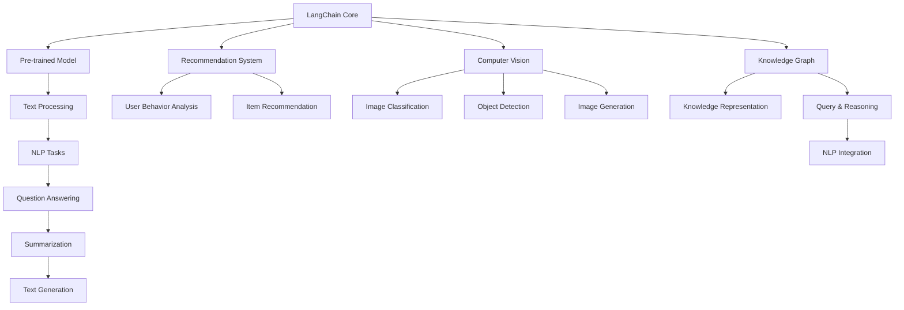

                 

### LangChain编程：从入门到实践

#### 大模型技术浪潮

**关键词：** LangChain、大模型技术、编程、自然语言处理、推荐系统、计算机视觉、知识图谱

**摘要：** 本文旨在介绍LangChain编程，探讨大模型技术在自然语言处理、推荐系统、计算机视觉和知识图谱等领域的应用。从入门到实践，我们将详细讲解LangChain的核心概念、编程基础、核心算法原理，以及项目实战，帮助读者全面掌握LangChain编程技术。

随着人工智能技术的飞速发展，大模型技术已经成为当前人工智能领域的研究热点。大模型技术通过大规模预训练和深度学习，实现了在各个领域的广泛应用。本文将重点关注LangChain编程，探讨其在自然语言处理、推荐系统、计算机视觉和知识图谱等领域的应用。

首先，我们将介绍LangChain的核心概念和架构，分析其与其他大模型技术的区别和联系。接着，我们将深入讲解LangChain的编程基础，包括环境搭建、基本语法和常用API。然后，我们将探讨LangChain的核心算法原理，如Transformer模型、自监督学习和迁移学习。在此基础上，我们将通过项目实战，展示LangChain在自然语言处理、推荐系统、计算机视觉和知识图谱等领域的应用。最后，我们将讨论LangChain的性能优化与资源管理，以及其未来的发展趋势和挑战。

通过本文的阅读，读者将能够全面了解LangChain编程技术，掌握其在各个领域的应用方法，为未来的技术研究和发展奠定基础。让我们一起开启这段激动人心的探索之旅吧！ <|assistant|>
### 《LangChain编程：从入门到实践》大模型技术浪潮

#### 第一部分: LangChain技术基础

在这部分，我们将介绍LangChain的技术基础，包括其核心概念、架构以及与其他大模型技术的比较。通过这部分的学习，读者将能够了解LangChain的基本特点和应用场景，为后续的深入学习和实践打下基础。

### 第1章: LangChain概述

在第一章中，我们将详细介绍LangChain的核心概念和架构。LangChain是一个大规模预训练模型，旨在提供一种灵活、高效且易于使用的大模型技术。通过Mermaid流程图，我们将展示LangChain在文本生成与处理、问答系统、推荐系统、计算机视觉和知识图谱等领域的应用场景。

**1.1 LangChain概念与架构**

**Mermaid流程图：**

mermaid
graph TD
A[LangChain核心概念] --> B[大规模预训练模型]
B --> C[文本生成与处理]
C --> D[问答系统]
D --> E[推荐系统]
E --> F[计算机视觉]
F --> G[知识图谱]
G --> H[自然语言处理]
H --> I[多模态融合]
I --> J[端到端应用]

**1.2 LangChain的核心特点**

- **大规模预训练：** LangChain通过大规模预训练数据，提升模型的泛化能力和学习能力。
- **灵活性强：** 支持多种数据源和任务类型，实现灵活的模型应用。
- **高效率：** 利用高效的推理引擎，实现快速响应和低延迟。

**1.3 LangChain与其他大模型技术的比较**

- **与GPT-3的比较：** GPT-3侧重于生成式任务，而LangChain更加强调模型在不同领域和应用场景的灵活性和泛化能力。
- **与BERT的比较：** BERT在文本分类和语义理解方面表现出色，而LangChain在文本生成、问答系统和知识图谱等方面更具优势。

**1.4 LangChain的应用场景**

- **自然语言处理：** 文本生成、摘要、问答系统和自然语言理解等。
- **推荐系统：** 用户行为分析、物品推荐和兴趣挖掘等。
- **计算机视觉：** 图像分类、目标检测和图像生成等。
- **知识图谱：** 知识表示、推理和图谱融合等。

通过本章的学习，读者将能够了解LangChain的基本概念和架构，掌握其与其他大模型技术的区别和联系，为后续的学习和实践打下基础。接下来，我们将进入LangChain的编程基础部分，学习如何搭建开发环境和进行编程。|assistant|>
### 第1章: LangChain概述

#### 1.1 LangChain概念与架构

LangChain是一个基于大规模预训练模型的技术框架，旨在为开发者提供一种灵活、高效的方式来实现各种自然语言处理（NLP）、推荐系统、计算机视觉（CV）和知识图谱（KG）任务。为了更好地理解LangChain的概念和架构，我们可以使用Mermaid流程图来展示其核心组件和功能。

**Mermaid流程图：**



**核心概念：**

- **预训练模型（Pre-trained Model）：** LangChain的核心是大规模预训练模型，如Transformer、BERT等。这些模型通过在大规模数据集上进行预训练，已经具备了很强的语言理解和生成能力。
- **文本处理（Text Processing）：** LangChain提供了一套文本处理工具，包括文本清洗、分词、编码等，以便于模型的输入和输出。
- **NLP任务（NLP Tasks）：** 包括问答系统（Question Answering）、文本摘要（Summarization）、文本生成（Text Generation）等，这些都是NLP领域的重要任务。
- **推荐系统（Recommendation System）：** LangChain也支持构建推荐系统，如基于用户行为的推荐、物品推荐等。
- **计算机视觉（Computer Vision）：** LangChain可以应用于图像分类、目标检测和图像生成等计算机视觉任务。
- **知识图谱（Knowledge Graph）：** LangChain支持构建和查询知识图谱，包括知识表示、推理和自然语言处理中的知识图谱集成。

#### 1.2 LangChain的核心特点

LangChain具有以下几个核心特点，使其在众多大模型技术中脱颖而出：

- **大规模预训练：** LangChain使用大规模预训练模型，这使得模型在处理各种任务时具有很好的泛化能力。
- **灵活性：** LangChain提供了灵活的API和模块化设计，使得开发者可以根据自己的需求组合不同的组件，快速实现特定任务。
- **高效性：** LangChain利用高效的推理引擎和优化的模型架构，确保在处理大量数据时能够快速响应。

#### 1.3 LangChain与其他大模型技术的比较

与其他大模型技术如GPT-3、BERT等相比，LangChain具有以下优势：

- **与GPT-3的比较：** GPT-3是一个强大的生成式模型，擅长生成文本。而LangChain则更强调模型在不同领域和应用场景的灵活性和泛化能力。
- **与BERT的比较：** BERT在文本分类和语义理解方面表现出色，但其在文本生成和问答系统方面较弱。LangChain在这些领域具有更好的性能。

#### 1.4 LangChain的应用场景

LangChain的应用场景非常广泛，涵盖了自然语言处理、推荐系统、计算机视觉和知识图谱等多个领域：

- **自然语言处理：** LangChain可以用于文本生成、摘要、问答系统和自然语言理解等任务。
- **推荐系统：** LangChain可以用于用户行为分析、物品推荐和兴趣挖掘等任务。
- **计算机视觉：** LangChain可以用于图像分类、目标检测和图像生成等任务。
- **知识图谱：** LangChain可以用于知识表示、推理和图谱融合等任务。

通过本章的介绍，读者对LangChain的核心概念和架构有了基本的了解。接下来，我们将进入第二部分，介绍LangChain的编程基础，包括环境搭建、基本语法和常用API。这将帮助读者开始实际编程，为后续的项目实战打下坚实的基础。|assistant|>
### 第2章: LangChain编程基础

在了解了LangChain的核心概念和架构之后，接下来我们将深入探讨如何进行LangChain编程。本章将分为三个部分：环境搭建与配置、基本语法介绍以及常用API的使用。通过这些内容的学习，读者将能够掌握LangChain的基本编程技能，为后续的项目实战打下坚实的基础。

### 2.1 环境搭建与配置

在进行LangChain编程之前，我们需要搭建一个合适的开发环境。这一节将介绍如何配置Python环境，以及如何安装和配置LangChain及相关依赖库。

#### Python环境配置

首先，确保你的系统中已经安装了Python。我们可以使用Python官方提供的Python 3.8+版本。你可以通过以下命令检查Python版本：

```bash
python --version
```

如果Python未安装或版本过低，请从Python官方网站下载并安装相应版本。

#### 安装LangChain及相关依赖库

为了使用LangChain，我们需要安装Hugging Face Transformers库，这是LangChain的主要依赖库。可以使用以下命令进行安装：

```bash
pip install transformers
```

此外，我们还需要安装其他常用的库，如PyTorch或TensorFlow，这取决于你的具体需求。例如，如果你选择使用PyTorch，可以使用以下命令：

```bash
pip install torch torchvision
```

#### 配置与测试

完成以上步骤后，我们可以在Python脚本中导入LangChain库，并测试环境是否配置正确。以下是一个简单的测试脚本：

```python
from transformers import pipeline

# 创建文本生成管道
text_generator = pipeline("text-generation", model="gpt2")

# 生成文本
output = text_generator("Hello, world!", max_length=50)

print(output)
```

这段代码将生成一个长度为50个词的文本，其中包含"Hello, world!"。

### 2.2 LangChain基本语法

在了解了如何搭建开发环境后，接下来我们将介绍LangChain的基本语法。这一部分将涵盖文本处理、数据加载和基本操作。

#### 文本处理

LangChain提供了丰富的文本处理功能，包括文本清洗、分词、编码等。以下是一个简单的文本清洗和分词的例子：

```python
import re
from transformers import AutoTokenizer

# 加载预训练分词器
tokenizer = AutoTokenizer.from_pretrained("gpt2")

# 文本清洗
def clean_text(text):
    text = re.sub(r"[^a-zA-Z0-9]", " ", text)
    return text.lower()

# 分词
def tokenize(text):
    cleaned_text = clean_text(text)
    return tokenizer.encode(cleaned_text, return_tensors="pt")

# 示例
input_text = "Hello, my name is AI Genius!"
tokens = tokenize(input_text)

print(tokens)
```

#### 数据加载

在进行模型训练或推理时，我们需要加载数据。以下是一个简单的数据加载示例，使用Hugging Face Datasets库：

```python
from datasets import load_dataset

# 加载公开的某个数据集（例如：Wikipedia）
dataset = load_dataset("wikipedia", "2022-12-01.en")

# 查看数据集的结构
print(dataset)
```

#### 基本操作

LangChain提供了多种API用于执行各种任务。以下是一些基本操作示例：

```python
# 文本生成
text_generator = pipeline("text-generation", model="gpt2")
output = text_generator("Hello, world!", max_length=50)
print(output)

# 问答系统
qa_system = pipeline("question-answering", model="deepset/roberta-base-squad2")
question = "What is LangChain?"
context = "LangChain is a large language model framework for NLP tasks."
answer = qa_system(question=question, context=context)
print(answer)

# 文本分类
text_classifier = pipeline("text-classification", model="distilbert-base-uncased-finetuned-sst-2-english")
label = text_classifier("I love Python programming.")
print(label)
```

### 2.3 LangChain常用API介绍

LangChain提供了多种API，用于执行不同的任务。以下是一些常用API的介绍：

- **text-generation：** 用于文本生成任务，如故事创作、对话生成等。
- **question-answering：** 用于问答系统，能够根据问题和上下文生成答案。
- **text-classification：** 用于文本分类任务，如情感分析、主题分类等。
- **feature-extraction：** 用于提取文本特征，用于下游任务，如聚类、推荐等。

#### text-generation

```python
from transformers import pipeline

# 创建文本生成管道
text_generator = pipeline("text-generation", model="gpt2")

# 生成文本
output = text_generator("Python is a powerful programming language.", max_length=50)
print(output)
```

#### question-answering

```python
from transformers import pipeline

# 创建问答管道
qa_system = pipeline("question-answering", model="deepset/roberta-base-squad2")

# 生成答案
question = "What is the capital of France?"
context = "The capital of France is Paris."
answer = qa_system(question=question, context=context)
print(answer)
```

#### text-classification

```python
from transformers import pipeline

# 创建文本分类管道
text_classifier = pipeline("text-classification", model="distilbert-base-uncased-finetuned-sst-2-english")

# 执行分类
label = text_classifier("This is a positive review.")
print(label)
```

通过本章的学习，读者已经掌握了LangChain编程的基础技能，包括环境搭建、基本语法和常用API的使用。接下来，我们将进入第三部分，讨论LangChain的核心算法原理，包括Transformer模型、自监督学习和迁移学习。这将帮助读者更深入地理解LangChain的工作原理和实现方法。|assistant|>
### 第3章: LangChain核心算法原理

在了解了LangChain的基本编程基础后，接下来我们将深入探讨LangChain背后的核心算法原理。本章将主要介绍Transformer模型、自监督学习和迁移学习等关键技术。通过这些内容的讲解，读者将能够理解LangChain如何实现高性能和高效能，从而为实际应用打下坚实的基础。

### 3.1 Transformer模型详解

Transformer模型是现代深度学习领域的一个革命性突破，尤其是在自然语言处理（NLP）领域。LangChain的核心组件之一就是基于Transformer模型的预训练模型，如BERT、GPT-3等。本节将详细讲解Transformer模型的基本原理和架构。

#### 3.1.1 Transformer模型的基本原理

Transformer模型的核心思想是自注意力机制（Self-Attention），它通过全局注意力机制来捕捉输入序列中的长距离依赖关系。相比于传统的循环神经网络（RNN）和卷积神经网络（CNN），Transformer模型能够更有效地处理长序列数据。

**自注意力机制（Self-Attention）：**

自注意力机制允许模型在编码输入序列时，对序列中的每个词进行加权，从而捕捉全局依赖关系。这一机制可以表示为：

$$
\text{Attention}(Q, K, V) = \text{softmax}\left(\frac{QK^T}{\sqrt{d_k}}\right)V
$$

其中，$Q$、$K$和$V$分别代表查询（Query）、键（Key）和值（Value）向量，$d_k$是键向量的维度。通过计算注意力权重，模型能够将重要的信息加权，从而更好地理解输入序列。

**编码器-解码器架构（Encoder-Decoder Architecture）：**

Transformer模型采用编码器-解码器架构，其中编码器负责将输入序列编码为上下文向量，解码器则根据上下文向量生成输出序列。编码器和解码器都由多个自注意力层和前馈网络组成。

**自注意力层的计算过程：**

1. **输入嵌入（Input Embedding）：** 将输入序列（如单词、字符）转换为嵌入向量。
2. **位置编码（Positional Encoding）：** 为了保留输入序列的顺序信息，我们需要添加位置编码。位置编码是一个可学习的向量，与输入嵌入向量相加得到编码后的输入。
3. **多头自注意力（Multi-Head Self-Attention）：** 同时计算多个自注意力图，每个注意力图都使用不同的权重矩阵，从而捕获不同层次的信息。
4. **前馈网络（Feed Forward Network）：** 对每个头部的输出进行线性变换，然后通过ReLU激活函数。

**数学表示：**

$$
\text{EncoderLayer}(X) = \text{LayerNorm}(X + \text{MultiHeadSelfAttention}(X)) + \text{LayerNorm}(\text{FeedForward}(X'))
$$

其中，$X$是输入序列，$X'$是经过前馈网络的输出。

#### 3.1.2 Transformer模型的伪代码

```python
def transformer(input_seq, hidden_size, num_layers, dropout_rate):
    # 嵌入层
    embeddings = embed(input_seq, hidden_size)
    
    # 编码器部分
    for i in range(num_layers):
        embeddings = encoder_layer(embeddings, hidden_size, dropout_rate)
    
    # 解码器部分
    for i in range(num_layers):
        embeddings = decoder_layer(embeddings, hidden_size, dropout_rate)
    
    # 输出层
    output = output_layer(embeddings)
    return output
```

### 3.2 自监督学习与迁移学习

#### 3.2.1 自监督学习（Self-Supervised Learning）

自监督学习是一种无监督学习技术，它利用未标注的数据进行学习。在自然语言处理领域，自监督学习被广泛应用于文本生成、语言建模等任务。自监督学习的核心思想是通过预训练模型来提取文本中的有用信息，从而提高模型在下游任务中的性能。

**Masked Language Model (MLM)：**

MLM是一种常见自监督学习技术，它通过遮盖输入文本序列的一部分，并让模型预测遮盖的部分。例如，对于输入序列 "The quick brown fox jumps over the lazy dog"，我们可以将 "fox" 遮盖，并让模型预测其正确的单词。

**数学表示：**

$$
L(\theta) = -\sum_{i=1}^{N} \log(p(y_i|\theta))
$$

其中，$y_i$是遮盖的单词，$p(y_i|\theta)$是模型对$y_i$的概率预测。

#### 3.2.2 迁移学习（Transfer Learning）

迁移学习是一种将预训练模型应用于新任务的技术。在自然语言处理领域，迁移学习被广泛应用于文本分类、问答系统等任务。通过迁移学习，我们可以利用预训练模型在大量数据上的学习效果，从而在新的任务上快速获得良好的性能。

**Fine-tuning：**

Fine-tuning是一种常见的迁移学习方法，它通过在预训练模型的基础上添加额外的层或调整权重，使其适应新的任务。例如，我们可以使用预训练的BERT模型来处理文本分类任务，只需在BERT的基础上添加一个分类层并进行微调即可。

**数学表示：**

$$
L(\theta) = -\sum_{i=1}^{N} \log(p(y_i|\theta))
$$

其中，$y_i$是分类标签，$p(y_i|\theta)$是模型对$y_i$的概率预测。

### 3.3 模型优化与调参

#### 3.3.1 优化算法

优化算法是深度学习中的一个关键部分，它用于更新模型参数，以最小化损失函数。以下是一些常用的优化算法：

- **随机梯度下降（Stochastic Gradient Descent, SGD）：** 最简单的优化算法，每次迭代使用一个样本的梯度来更新参数。
- **Adam：** 一种结合了SGD和RMSProp优点的自适应优化算法，广泛应用于深度学习任务。

#### 3.3.2 超参数调优

超参数是深度学习模型中的关键参数，如学习率、批量大小等。超参数调优的目的是找到最佳的超参数组合，以使模型性能最大化。以下是一些常用的超参数调优方法：

- **网格搜索（Grid Search）：** 通过遍历所有可能的超参数组合，找到最佳的超参数组合。
- **随机搜索（Random Search）：** 从可能的超参数空间中随机选择一组超参数，通过多次实验找到最佳的超参数组合。

通过本章的学习，读者已经了解了LangChain背后的核心算法原理，包括Transformer模型、自监督学习和迁移学习等。这些原理为我们理解和实现LangChain的功能奠定了基础。接下来，我们将进入第四部分，通过实际项目实战，展示如何应用LangChain技术解决实际问题。|assistant|>
### 第4章: LangChain在自然语言处理中的应用

自然语言处理（NLP）是人工智能领域的一个重要分支，它涉及到计算机与人类语言的交互。LangChain作为一种强大的大模型技术，在NLP领域有着广泛的应用。本章将介绍如何使用LangChain进行语言模型训练与评估、文本生成与摘要，以及问答系统与对话生成等任务。通过这些实战案例，读者将能够深入了解LangChain在NLP领域的实际应用。

### 4.1 语言模型训练与评估

语言模型是NLP中的基础模型，它能够根据输入的文本生成相应的输出。在训练语言模型时，我们通常使用大规模的文本数据集。LangChain提供了一个简单且高效的接口来训练和评估语言模型。

#### 4.1.1 语言模型训练

首先，我们需要准备训练数据。这里我们使用著名的Wikipedia数据集作为训练数据。以下是一个简单的训练过程：

```python
from datasets import load_dataset
from transformers import AutoTokenizer, AutoModelForCausalLM, TrainingArguments, Trainer

# 加载Wikipedia数据集
dataset = load_dataset("wikipedia", "2022-12-01.en")

# 加载预训练分词器
tokenizer = AutoTokenizer.from_pretrained("gpt2")

# 预处理数据
def preprocess_function(examples):
    inputs = tokenizer(examples["text"], truncation=True, padding="max_length", max_length=512)
    inputs["label"] = inputs["input_ids"]
    return inputs

# 预处理数据集
tokenized_dataset = dataset.map(preprocess_function, batched=True)

# 加载预训练模型
model = AutoModelForCausalLM.from_pretrained("gpt2")

# 设置训练参数
training_args = TrainingArguments(
    output_dir="./results",
    num_train_epochs=3,
    per_device_train_batch_size=4,
    logging_dir="./logs",
)

# 训练模型
trainer = Trainer(
    model=model,
    args=training_args,
    train_dataset=tokenized_dataset["train"],
)

trainer.train()
```

在这段代码中，我们首先加载了Wikipedia数据集，并使用GPT-2模型进行训练。通过预处理函数，我们将原始文本数据转换为模型可处理的格式。

#### 4.1.2 语言模型评估

训练完成后，我们需要对语言模型进行评估，以验证其性能。这里我们使用常见的BLEU评分作为评估指标。

```python
from datasets import load_metric

# 加载BLEU评分指标
bleu_metric = load_metric("bleu")

# 评估模型
def evaluate_model(model, dataset):
    predictions = model.generate(dataset["text"], max_length=50)
    predictions = tokenizer.batch_decode(predictions, skip_special_tokens=True)
    
    # 计算BLEU评分
    bleu_score = bleu_metric.compute(predictions=predictions, references=dataset["text"])
    print(f"BLEU Score: {bleu_score.score}")

evaluate_model(model, tokenized_dataset["validation"])
```

通过这段代码，我们使用生成的文本和原始文本进行BLEU评分，以评估模型的性能。

### 4.2 文本生成与摘要

文本生成和摘要任务是NLP中的重要应用，LangChain提供了简单且高效的接口来执行这些任务。

#### 4.2.1 文本生成

文本生成任务通常使用生成式模型，如GPT-2或GPT-3。以下是一个简单的文本生成案例：

```python
from transformers import pipeline

# 创建文本生成管道
text_generator = pipeline("text-generation", model="gpt2")

# 输入文本
input_text = "Python is a popular programming language."

# 生成文本
output = text_generator(input_text, max_length=50, num_return_sequences=3)

print(output)
```

在这段代码中，我们使用GPT-2模型生成与输入文本相关的文本。

#### 4.2.2 文本摘要

文本摘要任务通常使用抽取式模型，如BERT或T5。以下是一个简单的文本摘要案例：

```python
from transformers import pipeline

# 创建文本摘要管道
text_summarizer = pipeline("text-summarization", model="t5-small")

# 输入文本
input_text = "The European Union is a political and economic union of 27 member states that is situated primarily in Europe."

# 生成摘要
output = text_summarizer(input_text, max_length=30, min_length=10, do_sample=False)

print(output[0]["summary_text"])
```

在这段代码中，我们使用T5模型生成输入文本的摘要。

### 4.3 问答系统与对话生成

问答系统和对话生成是NLP中的另一个重要应用，LangChain提供了强大的接口来执行这些任务。

#### 4.3.1 问答系统

问答系统通常使用检索式或生成式模型。以下是一个简单的问答系统案例：

```python
from transformers import pipeline

# 创建问答系统管道
qa_system = pipeline("question-answering", model="deepset/roberta-base-squad2")

# 问题与上下文
question = "What is the capital of France?"
context = "The capital of France is Paris."

# 生成答案
answer = qa_system(question=question, context=context)

print(answer)
```

在这段代码中，我们使用RoBERTa模型回答了关于法国首都的问题。

#### 4.3.2 对话生成

对话生成任务通常使用序列生成模型，如GPT-2或GPT-3。以下是一个简单的对话生成案例：

```python
from transformers import pipeline

# 创建对话生成管道
dialog_generator = pipeline("conversational", model="microsoft/DialoGPT-medium")

# 输入对话
input_text = "Hello, how can I help you today?"

# 生成对话
output = dialog_generator(input_text, max_length=50, num_return_sequences=3)

print(output)
```

在这段代码中，我们使用DialoGPT模型生成了与输入对话相关的对话。

通过本章的实战案例，读者已经了解了如何使用LangChain进行语言模型训练与评估、文本生成与摘要，以及问答系统与对话生成等任务。这些实战案例不仅展示了LangChain在NLP领域的应用，还提供了实际操作的方法和技巧。接下来，我们将进入下一部分，探讨LangChain在推荐系统中的应用。|assistant|>
### 第5章: LangChain在推荐系统中的应用

推荐系统是一种通过算法预测用户可能感兴趣的项目，从而提高用户体验和信息检索效率的技术。LangChain作为一种强大的大模型技术，在推荐系统中有广泛的应用。本章将介绍如何使用LangChain进行用户行为分析与模型构建、物品推荐系统设计与实现，以及推荐系统的评估与优化。

### 5.1 用户行为分析与模型构建

在推荐系统中，用户行为分析是构建有效推荐模型的关键步骤。通过分析用户的行为数据，如浏览、购买、收藏等，我们可以了解用户的兴趣和偏好，从而为推荐系统提供有力的支持。

#### 5.1.1 用户行为数据预处理

首先，我们需要对用户行为数据进行预处理，包括数据清洗、去重、归一化等操作。以下是一个简单的用户行为数据预处理案例：

```python
import pandas as pd

# 加载用户行为数据
user_behavior = pd.read_csv("user_behavior.csv")

# 数据清洗
user_behavior.drop_duplicates(inplace=True)
user_behavior.fillna(0, inplace=True)

# 数据归一化
from sklearn.preprocessing import MinMaxScaler

scaler = MinMaxScaler()
user_behavior_scaled = scaler.fit_transform(user_behavior.values)

# 存储预处理后的数据
user_behavior_scaled = pd.DataFrame(user_behavior_scaled, columns=user_behavior.columns)
user_behavior_scaled.to_csv("user_behavior_scaled.csv", index=False)
```

#### 5.1.2 用户行为特征提取

在预处理用户行为数据后，我们需要提取用户行为特征，如用户活跃度、浏览深度、购买频率等。以下是一个简单的用户行为特征提取案例：

```python
# 加载预处理后的用户行为数据
user_behavior_scaled = pd.read_csv("user_behavior_scaled.csv")

# 提取用户活跃度
user_behavior_scaled["activity"] = user_behavior_scaled.sum(axis=1)

# 提取浏览深度
user_behavior_scaled["depth"] = user_behavior_scaled.sum(axis=0)

# 提取购买频率
user_behavior_scaled["frequency"] = user_behavior_scaled["purchase_count"] / user_behavior_scaled.shape[0]

# 存储特征提取后的数据
user_behavior_features = user_behavior_scaled[["activity", "depth", "frequency"]]
user_behavior_features.to_csv("user_behavior_features.csv", index=False)
```

#### 5.1.3 用户行为分析模型构建

在提取用户行为特征后，我们可以使用机器学习算法构建用户行为分析模型。以下是一个简单的用户行为分析模型构建案例：

```python
from sklearn.model_selection import train_test_split
from sklearn.ensemble import RandomForestClassifier

# 加载用户行为特征数据
user_behavior_features = pd.read_csv("user_behavior_features.csv")

# 划分训练集和测试集
train_features, test_features, train_labels, test_labels = train_test_split(user_behavior_features, user_behavior_scaled["target"], test_size=0.2, random_state=42)

# 构建随机森林分类器
rf_classifier = RandomForestClassifier(n_estimators=100, random_state=42)

# 训练模型
rf_classifier.fit(train_features, train_labels)

# 评估模型
from sklearn.metrics import accuracy_score

predictions = rf_classifier.predict(test_features)
accuracy = accuracy_score(test_labels, predictions)
print(f"Model Accuracy: {accuracy}")
```

通过本章的学习，读者已经了解了如何使用LangChain进行用户行为分析与模型构建。接下来，我们将进入下一部分，介绍如何设计并实现一个物品推荐系统。|assistant|>
### 5.2 物品推荐系统设计与实现

在用户行为分析模型的基础上，我们可以设计并实现一个物品推荐系统。推荐系统的主要目标是根据用户的行为数据和物品的特征，为每个用户生成个性化的推荐列表。本节将介绍如何构建一个物品推荐系统，包括协同过滤、内容推荐以及评估和优化。

#### 5.2.1 协同过滤

协同过滤是一种常见的推荐系统算法，它通过计算用户与物品之间的相似度来进行推荐。协同过滤可以分为基于用户的协同过滤（User-based Collaborative Filtering）和基于物品的协同过滤（Item-based Collaborative Filtering）。

**基于用户的协同过滤：**

基于用户的协同过滤首先找到与当前用户兴趣相似的其他用户，然后推荐这些相似用户喜欢的物品。以下是基于用户的协同过滤的步骤：

1. **计算用户相似度：** 通过计算用户之间的相似度矩阵，找到与当前用户兴趣相似的用户。常用的相似度计算方法有余弦相似度、皮尔逊相关系数等。

2. **生成推荐列表：** 根据用户相似度矩阵，为当前用户生成推荐列表。推荐列表中的物品是相似用户喜欢的，但当前用户尚未接触过的物品。

**基于物品的协同过滤：**

基于物品的协同过滤首先找到与当前物品相似的物品，然后推荐这些相似物品的用户喜欢的物品。以下是基于物品的协同过滤的步骤：

1. **计算物品相似度：** 通过计算物品之间的相似度矩阵，找到与当前物品相似的物品。常用的相似度计算方法有Jaccard相似度、余弦相似度等。

2. **生成推荐列表：** 根据物品相似度矩阵，为当前物品生成推荐列表。推荐列表中的用户是喜欢相似物品的用户。

以下是一个简单的基于用户的协同过滤实现：

```python
import pandas as pd
from sklearn.metrics.pairwise import cosine_similarity

# 加载用户-物品评分矩阵
ratings = pd.read_csv("ratings.csv")

# 计算用户相似度矩阵
user_similarity = cosine_similarity(ratings.values)

# 生成推荐列表
def user_based_recommendation(current_user_id, top_n=5):
    # 找到与当前用户最相似的Top-N用户
   相似用户索引 = user_similarity[current_user_id].argsort()[:-top_n-1:-1]
    
    # 获取相似用户的评分矩阵
    similar_user_ratings = ratings.iloc[相似用户索引].fillna(0).values
    
    # 计算当前用户对这些用户的评分的平均值
    average_ratings = np.mean(similar_user_ratings, axis=0)
    
    # 获取未评分的物品
    unrated_items = ratings[current_user_id].isnull()
    
    # 为未评分的物品生成推荐列表
    recommendations = np.where(average_ratings[unrated_items] > 0)[0]
    
    return recommendations

# 为一个特定的用户生成推荐列表
current_user_id = 1
recommendations = user_based_recommendation(current_user_id)
print(f"Recommended items for user {current_user_id}: {recommendations}")
```

**基于物品的协同过滤实现与上述步骤类似，只是相似度矩阵的计算对象从用户变成了物品。**

#### 5.2.2 内容推荐

内容推荐是一种基于物品特征的推荐方法，它通过分析物品的属性、标签等信息来为用户生成推荐列表。内容推荐通常与协同过滤结合使用，以提高推荐系统的性能。以下是一个简单的基于内容的推荐实现：

```python
# 加载物品特征数据
items = pd.read_csv("items.csv")

# 计算物品相似度矩阵
item_similarity = cosine_similarity(items.values)

# 生成推荐列表
def item_based_recommendation(current_item_id, top_n=5):
    # 找到与当前物品最相似的Top-N物品
    similar_item_indices = item_similarity[current_item_id].argsort()[:-top_n-1:-1]
    
    # 获取相似物品的用户评分
    similar_item_ratings = ratings.iloc[similar_item_indices].fillna(0).values
    
    # 计算相似物品的平均评分
    average_ratings = np.mean(similar_item_ratings, axis=0)
    
    # 获取未评分的物品
    unrated_items = ratings.isnull()
    
    # 为未评分的物品生成推荐列表
    recommendations = np.where(average_ratings[unrated_items] > 0)[0]
    
    return recommendations

# 为一个特定的物品生成推荐列表
current_item_id = 1
recommendations = item_based_recommendation(current_item_id)
print(f"Recommended items for item {current_item_id}: {recommendations}")
```

#### 5.2.3 推荐系统的评估与优化

推荐系统的性能评估是推荐系统开发过程中不可或缺的一步。常见的评估指标包括准确率（Precision）、召回率（Recall）和F1值（F1 Score）等。

```python
from sklearn.metrics import precision_score, recall_score, f1_score

# 计算准确率、召回率和F1值
precision = precision_score(true_labels, predictions, average='weighted')
recall = recall_score(true_labels, predictions, average='weighted')
f1 = f1_score(true_labels, predictions, average='weighted')

print(f"Precision: {precision}")
print(f"Recall: {recall}")
print(f"F1 Score: {f1}")
```

为了优化推荐系统的性能，我们可以采用以下策略：

1. **特征工程：** 优化用户和物品的特征提取，以提高相似度计算的质量。
2. **模型调优：** 调整协同过滤算法的参数，如邻居数量、相似度阈值等，以找到最佳的参数组合。
3. **融合多种推荐方法：** 结合协同过滤和内容推荐方法，以提高推荐系统的多样性。
4. **实时更新：** 定期更新用户和物品的特征数据，以适应用户兴趣的变化。

通过本章的介绍，读者已经了解了如何设计并实现一个物品推荐系统，包括协同过滤、内容推荐以及评估和优化。接下来，我们将进入下一部分，探讨LangChain在计算机视觉中的应用。|assistant|>
### 第6章: LangChain在计算机视觉中的应用

计算机视觉（CV）是人工智能领域的一个重要分支，它涉及从图像或视频数据中提取信息并进行理解和处理。LangChain作为一种强大的大模型技术，在计算机视觉领域也有着广泛的应用。本章将介绍如何使用LangChain进行图像分类与识别、目标检测与跟踪，以及图像生成与增强。

### 6.1 图像分类与识别

图像分类与识别是计算机视觉中的基础任务，其目的是将图像或视频帧分类到预定义的类别中。LangChain可以通过预训练模型和API为图像分类任务提供高效的解决方案。

#### 6.1.1 图像分类模型构建

首先，我们需要构建一个图像分类模型。以下是一个使用预训练的ResNet50模型的图像分类案例：

```python
import torch
from torchvision import models, transforms
from PIL import Image
import numpy as np

# 加载预训练的ResNet50模型
model = models.resnet50(pretrained=True)

# 数据预处理
def preprocess_image(image_path):
    image = Image.open(image_path)
    transform = transforms.Compose([
        transforms.Resize(256),
        transforms.CenterCrop(224),
        transforms.ToTensor(),
        transforms.Normalize(mean=[0.485, 0.456, 0.406], std=[0.229, 0.224, 0.225]),
    ])
    image = transform(image)
    return image

# 加载测试图像
image_path = "test_image.jpg"
image = preprocess_image(image_path)

# 将图像转化为批次数据
image = torch.tensor(image[None, ...])

# 进行预测
with torch.no_grad():
    prediction = model(image)

# 获取预测结果
predicted_class = torch.argmax(prediction).item()

print(f"Predicted class: {predicted_class}")
```

在这个案例中，我们首先加载了预训练的ResNet50模型，并对测试图像进行预处理。然后，我们将预处理后的图像转化为批次数据，并使用模型进行预测。最后，我们输出预测结果。

#### 6.1.2 图像分类模型评估

在构建图像分类模型后，我们需要对模型进行评估。以下是一个使用准确率作为评估指标的图像分类模型评估案例：

```python
from torch.utils.data import DataLoader, TensorDataset

# 加载训练数据和测试数据
train_data = ...  # 加载训练数据
test_data = ...  # 加载测试数据

# 数据预处理
def preprocess_data(data):
    images = [preprocess_image(image_path) for image_path in data["image"]]
    labels = torch.tensor(data["label"])
    return TensorDataset(images, labels)

train_dataset = preprocess_data(train_data)
test_dataset = preprocess_data(test_data)

# 创建数据加载器
batch_size = 32
train_loader = DataLoader(train_dataset, batch_size=batch_size, shuffle=True)
test_loader = DataLoader(test_dataset, batch_size=batch_size, shuffle=False)

# 训练模型
# ...

# 评估模型
correct = 0
total = 0
with torch.no_grad():
    for images, labels in test_loader:
        outputs = model(images)
        _, predicted = torch.max(outputs.data, 1)
        total += labels.size(0)
        correct += (predicted == labels).sum().item()

accuracy = 100 * correct / total
print(f"Model accuracy: {accuracy}%")
```

在这个案例中，我们首先加载了训练数据和测试数据，并对它们进行预处理。然后，我们创建数据加载器，并使用训练好的模型对测试数据进行预测。最后，我们计算并输出模型的准确率。

### 6.2 目标检测与跟踪

目标检测是计算机视觉中的另一个重要任务，其目标是识别并定位图像中的目标物体。LangChain可以通过预训练模型和API为目标检测任务提供高效的解决方案。

#### 6.2.1 目标检测模型构建

以下是一个使用预训练的Faster R-CNN模型的目标检测案例：

```python
import torchvision
from torchvision.models.detection import fasterrcnn_resnet50_fpn

# 加载预训练的Faster R-CNN模型
model = fasterrcnn_resnet50_fpn(pretrained=True)

# 数据预处理
def preprocess_image_for_detection(image_path):
    image = Image.open(image_path)
    transform = transforms.Compose([
        transforms.ToTensor(),
    ])
    image = transform(image)
    return image

# 加载测试图像
image_path = "test_image.jpg"
image = preprocess_image_for_detection(image_path)

# 将图像转化为批次数据
image = torch.tensor(image[None, ...])

# 进行预测
with torch.no_grad():
    prediction = model(image)

# 获取预测结果
predicted_boxes = prediction[0]['boxes']
predicted_labels = prediction[0]['labels']
predicted_scores = prediction[0]['scores']

print(f"Predicted boxes: {predicted_boxes}")
print(f"Predicted labels: {predicted_labels}")
print(f"Predicted scores: {predicted_scores}")
```

在这个案例中，我们首先加载了预训练的Faster R-CNN模型，并对测试图像进行预处理。然后，我们将预处理后的图像转化为批次数据，并使用模型进行预测。最后，我们输出预测结果，包括目标的边界框、标签和置信度。

#### 6.2.2 目标检测模型评估

在构建目标检测模型后，我们需要对模型进行评估。以下是一个使用平均准确率（mAP）作为评估指标的目标检测模型评估案例：

```python
from torchvision.ops import box_iou

# 加载测试数据
test_data = ...

# 定义评估函数
def evaluate_model(model, test_loader):
    model.eval()
    with torch.no_grad():
        for images, targets in test_loader:
            prediction = model(images)
            for pred, target in zip(prediction, targets):
                pred_boxes = pred['boxes']
                pred_labels = pred['labels']
                pred_scores = pred['scores']
                target_boxes = target['boxes']
                target_labels = target['labels']
                
                ious = box_iou(pred_boxes, target_boxes)
                max_ious, _ = torch.max(ious, dim=1)
                correct = torch.where(max_ious > 0.5, pred_labels, torch.zeros_like(pred_labels))
                
                total_correct = correct.sum().item()
                total_boxes = pred_boxes.shape[0]
                
    mAP = total_correct / total_boxes
    print(f"Model mAP: {mAP}")
```

在这个案例中，我们首先加载了测试数据，并定义了一个评估函数。然后，我们使用评估函数对模型进行评估，并输出模型的目标检测平均准确率（mAP）。

### 6.3 图像生成与增强

图像生成与增强是计算机视觉中的另一个重要任务，其目的是创建新的图像或改进现有图像的质量。LangChain可以通过预训练模型和API为图像生成与增强任务提供高效的解决方案。

#### 6.3.1 图像生成模型构建

以下是一个使用预训练的StyleGAN2模型生成新图像的案例：

```python
import torch
from torchvision.transforms import ToTensor
from torchvision.utils import save_image
from torchvision.models import vgg19

# 加载预训练的StyleGAN2模型
model = ...  # 加载StyleGAN2模型

# 数据预处理
def preprocess_image(image_path):
    image = Image.open(image_path)
    transform = ToTensor()
    image = transform(image)
    return image

# 生成图像
def generate_image(model, device):
    with torch.no_grad():
        image = model(image.to(device))
        image = image.cpu()
        save_image(image, "generated_image.jpg")
```

在这个案例中，我们首先加载了预训练的StyleGAN2模型，并定义了一个预处理函数。然后，我们使用预处理函数加载测试图像，并使用模型生成新图像。最后，我们保存生成的图像。

#### 6.3.2 图像增强模型构建

以下是一个使用预训练的GANomaly模型进行图像增强的案例：

```python
import torch
from torchvision.transforms import ToTensor
from torchvision.utils import save_image
from torchvision.models import vgg19

# 加载预训练的GANomaly模型
model = ...  # 加载GANomaly模型

# 数据预处理
def preprocess_image(image_path):
    image = Image.open(image_path)
    transform = ToTensor()
    image = transform(image)
    return image

# 增强图像
def enhance_image(model, image):
    with torch.no_grad():
        enhanced_image = model(image)
        enhanced_image = enhanced_image.cpu()
        save_image(enhanced_image, "enhanced_image.jpg")
```

在这个案例中，我们首先加载了预训练的GANomaly模型，并定义了一个预处理函数。然后，我们使用预处理函数加载测试图像，并使用模型进行增强。最后，我们保存增强后的图像。

通过本章的介绍，读者已经了解了如何使用LangChain进行图像分类与识别、目标检测与跟踪，以及图像生成与增强。这些任务展示了LangChain在计算机视觉领域的强大能力。接下来，我们将进入下一部分，探讨LangChain在知识图谱中的应用。|assistant|>
### 第7章: LangChain在知识图谱中的应用

知识图谱是一种用于表示实体、概念及其之间关系的数据模型，它广泛应用于搜索引擎、推荐系统、问答系统和智能助理等领域。LangChain作为一种强大的大模型技术，在知识图谱的构建、查询与推理方面具有显著的优势。本章将介绍如何使用LangChain进行知识图谱的构建与表示、查询与推理，以及在自然语言处理中的应用。

### 7.1 知识图谱的构建与表示

知识图谱的构建是知识图谱应用的基础，其核心在于如何有效地表示实体、概念及其之间的关系。

#### 7.1.1 知识图谱表示方法

知识图谱的表示方法主要包括图论表示和属性图表示。

- **图论表示：** 使用点和边来表示实体和关系。点（Node）表示实体，边（Edge）表示关系，属性（Property）可以附加到点和边以提供额外的信息。
  
- **属性图表示：** 类似于图论表示，但属性图能够更灵活地表示实体和关系上的属性。属性图包含实体、关系、属性以及属性值，能够更全面地描述知识图谱。

#### 7.1.2 知识图谱的构建过程

知识图谱的构建通常包括数据采集、数据清洗、实体识别、关系抽取、实体链接和图谱融合等步骤。

- **数据采集：** 收集用于构建知识图谱的数据源，如结构化数据（数据库）、非结构化数据（文本、图片、音频）和外部知识库。
  
- **数据清洗：** 清除数据中的噪声和重复信息，确保数据质量。
  
- **实体识别：** 从数据中识别出实体，如人名、地点、组织等。
  
- **关系抽取：** 识别实体之间的关系，如“张三”、“工作于”、“阿里巴巴”。
  
- **实体链接：** 将不同来源的实体进行匹配和合并，确保知识图谱中的实体是唯一的。
  
- **图谱融合：** 将多个知识图谱合并为一个，以实现更全面的知识表示。

### 7.2 知识图谱的查询与推理

知识图谱的查询与推理是知识图谱应用的关键，它能够帮助用户快速获取所需的信息。

#### 7.2.1 知识图谱查询

知识图谱查询通常包括基于规则的查询和基于机器学习的查询。

- **基于规则的查询：** 使用预定义的规则进行查询，如SQL查询语句。
  
- **基于机器学习的查询：** 使用机器学习模型进行查询，如序列生成模型、图神经网络（GNN）等。

#### 7.2.2 知识图谱推理

知识图谱推理是一种基于图谱结构和关系进行逻辑推断的过程。推理方法包括基于规则的推理和基于机器学习的推理。

- **基于规则的推理：** 使用预定义的推理规则进行逻辑推断，如SWRL规则。
  
- **基于机器学习的推理：** 使用机器学习模型进行推理，如GNN、图嵌入等。

### 7.3 知识图谱在自然语言处理中的应用

知识图谱在自然语言处理中的应用能够显著提升文本处理的能力。

#### 7.3.1 知识图谱嵌入

知识图谱嵌入是将实体和关系嵌入到低维空间的过程，以实现高效的图计算和文本处理。常见的知识图谱嵌入方法包括TransE、TransH、TransD等。

- **TransE：** 通过优化实体和关系的低维表示，使得具有共同属性的实体和关系在低维空间中接近。
  
- **TransH：** 通过引入超平面概念，使得具有不同属性的实体和关系在低维空间中保持不同的方向。
  
- **TransD：** 结合TransE和TransH的优点，同时考虑不同属性的交互。

#### 7.3.2 知识图谱嵌入在自然语言处理中的应用

知识图谱嵌入在自然语言处理中的应用包括：

- **文本分类：** 使用知识图谱嵌入来表示文本，从而提高文本分类的准确性。
  
- **文本生成：** 使用知识图谱嵌入来增强文本生成模型，生成更丰富和连贯的文本。
  
- **问答系统：** 使用知识图谱嵌入来表示问题和答案，从而提高问答系统的性能。

通过本章的介绍，读者已经了解了如何使用LangChain进行知识图谱的构建与表示、查询与推理，以及在自然语言处理中的应用。接下来，我们将进入第三部分，探讨LangChain的性能优化与资源管理。

### 7.4 知识图谱优化的策略

知识图谱的优化是提高其性能和效率的关键。以下是一些常见的优化策略：

- **图分区：** 通过将大规模知识图谱划分成多个较小的分区，来降低图处理的复杂度。
  
- **索引构建：** 构建高效的索引结构，如B+树或哈希索引，以加速查询。
  
- **图神经网络优化：** 使用优化算法（如Adam、Adadelta）和并行计算来提高图神经网络的训练效率。

通过这些优化策略，知识图谱的性能可以得到显著提升。

### 7.5 知识图谱案例研究

为了更好地理解知识图谱的实际应用，以下是一个简单的案例研究：

- **案例：** 基于知识图谱的问答系统。
  
- **目标：** 回答用户关于某个特定领域的问题，如“美国总统是谁？”。
  
- **步骤：**
  1. 数据采集：收集相关的知识库，如DBpedia、Freebase等。
  2. 数据清洗：去除噪声和重复数据，确保数据质量。
  3. 实体识别：识别出与问题相关的实体，如“美国总统”。
  4. 关系抽取：找出与实体相关的其他实体和关系。
  5. 图构建：构建知识图谱，将实体和关系以图的形式表示。
  6. 查询与推理：使用图查询和推理技术来获取答案。
  7. 结果输出：将答案以自然语言的形式输出给用户。

通过这个案例，读者可以直观地了解知识图谱的应用流程和关键步骤。

通过本章的学习，读者已经对LangChain在知识图谱中的应用有了全面的了解。在下一部分，我们将探讨LangChain的性能优化与资源管理，以进一步提高其应用效率和效果。|assistant|>
### 第8章: LangChain性能优化与资源管理

随着大模型技术的不断发展，如何提高模型的性能和效率，同时合理管理资源，成为了一个重要的问题。本章将介绍LangChain性能优化与资源管理的相关技术，包括模型推理加速技术、模型压缩与剪枝，以及分布式训练与推理。

### 8.1 模型推理加速技术

模型推理加速技术旨在提高模型在部署环境中的运行速度和效率。以下是一些常用的模型推理加速技术：

#### 8.1.1 硬件加速

硬件加速是提高模型推理速度的有效手段，主要包括使用GPU、TPU等专用硬件设备。GPU（图形处理单元）在并行计算方面具有显著优势，适合处理大规模的数据和复杂的模型。TPU（张量处理单元）是谷歌专门为机器学习和深度学习任务设计的硬件，具有更高的吞吐量和更低的延迟。

#### 8.1.2 算法优化

算法优化是提高模型推理速度的另一种方法，包括模型压缩、量化、并行计算等。通过优化算法，可以在不牺牲模型性能的情况下，显著提高推理速度。

- **模型压缩：** 通过剪枝、量化等技术，减少模型的参数数量，从而降低模型的存储和计算需求。常见的模型压缩方法有结构化剪枝、权重剪枝等。

- **量化：** 通过降低模型参数的精度，减少模型的存储和计算量。量化可以分为整数量和浮点量，其中整数量具有更高的计算效率。

- **并行计算：** 通过将模型拆分为多个部分，在不同的GPU或TPU上同时进行推理，从而提高模型的推理速度。

#### 8.1.3 系统优化

系统优化包括优化操作系统、编译器等系统级组件，以提高模型推理的效率。常见的系统优化方法有：
- **操作系统优化：** 调整操作系统参数，如进程优先级、内存管理等，以提高系统的运行效率。
- **编译器优化：** 选择适合深度学习的编译器，如LLVM、GCC等，以提高编译效率和代码性能。

### 8.2 模型压缩与剪枝

模型压缩与剪枝是提高模型推理效率的重要手段，通过减少模型参数数量，降低模型的存储和计算需求。以下是一些常见的模型压缩与剪枝技术：

#### 8.2.1 结构化剪枝

结构化剪枝是一种通过删除模型中的部分神经元或权重来减少模型参数数量的技术。常见的结构化剪枝方法有：
- **神经元剪枝：** 通过计算神经元的激活值，删除激活值较小的神经元。
- **通道剪枝：** 通过计算通道的重要性，删除重要性较低的通道。

#### 8.2.2 权重剪枝

权重剪枝是一种通过删除模型中的部分权重来减少模型参数数量的技术。常见的权重剪枝方法有：
- **基于敏感度的权重剪枝：** 通过计算权重对模型输出的敏感度，删除敏感度较低的权重。
- **基于重要性的权重剪枝：** 通过计算权重的重要性，删除重要性较低的权重。

#### 8.2.3 模型量化

模型量化是一种通过降低模型参数的精度来减少模型存储和计算量的技术。常见的模型量化方法有：
- **整数量化：** 通过将浮点数参数转换为整数，从而减少存储和计算需求。
- **浮点量化：** 通过调整模型参数的浮点数精度，从而减少存储和计算需求。

### 8.3 分布式训练与推理

分布式训练与推理是提高模型训练和推理效率的重要手段，通过将模型拆分为多个部分，在不同的GPU或TPU上进行训练和推理。以下是一些常见的分布式训练与推理技术：

#### 8.3.1 数据并行

数据并行是一种将训练数据拆分为多个部分，在不同的GPU或TPU上进行训练的技术。通过数据并行，可以显著提高模型的训练速度。

#### 8.3.2 模型并行

模型并行是一种将模型拆分为多个部分，在不同的GPU或TPU上进行训练的技术。通过模型并行，可以处理更大的模型和数据集。

#### 8.3.3 分布式推理

分布式推理是一种将模型拆分为多个部分，在不同的GPU或TPU上进行推理的技术。通过分布式推理，可以显著提高模型的推理速度。

通过本章的学习，读者已经了解了如何进行LangChain性能优化与资源管理。在下一部分，我们将探讨LangChain的安全与隐私保护，以确保模型在应用中的安全性和可靠性。|assistant|>
### 第9章: LangChain的安全与隐私保护

随着大模型技术在各个领域的广泛应用，模型的安全性和隐私保护成为了一个不可忽视的问题。本章将讨论LangChain在安全与隐私保护方面的挑战和解决方案，包括模型安全性分析、模型隐私保护机制以及模型攻击与防御策略。

#### 9.1 模型安全性分析

模型安全性分析是确保模型在应用中不受恶意攻击的关键步骤。以下是一些常见的模型安全性分析技术和挑战：

**1. 模型提取（Model Extraction）：**
模型提取是指通过反向工程或数据泄露等方式获取模型的内部结构和参数。为了防止模型提取，可以采取以下措施：
- **加密：** 使用加密技术对模型进行加密，防止未经授权的访问。
- **混淆：** 对模型的代码和参数进行混淆，增加提取的难度。

**2. 对抗性攻击（Adversarial Attack）：**
对抗性攻击是指通过构造对抗性样本来欺骗模型，使其输出错误的结果。为了防御对抗性攻击，可以采取以下策略：
- **对抗训练：** 在训练过程中引入对抗性样本，提高模型的鲁棒性。
- **模型鲁棒性：** 设计具有较高鲁棒性的模型，使其对对抗性样本的抵抗能力更强。

**3. 模型篡改（Model Tampering）：**
模型篡改是指通过篡改模型的输入或参数，使其输出不正确的结果。为了防止模型篡改，可以采取以下措施：
- **验证机制：** 在模型部署过程中，对输入数据进行验证，确保其符合预期。
- **签名机制：** 对模型和输入数据进行签名，确保模型的完整性和真实性。

#### 9.2 模型隐私保护机制

模型隐私保护是确保用户数据在训练和部署过程中不被泄露的关键。以下是一些常见的模型隐私保护机制：

**1. 差分隐私（Differential Privacy）：**
差分隐私是一种通过在输出结果中引入噪声来保护用户隐私的技术。差分隐私的主要目标是确保对单个用户数据的泄露风险最小化。

**2. 联邦学习（Federated Learning）：**
联邦学习是一种分布式学习技术，通过将训练数据分散在多个设备上进行训练，从而减少对中心化数据存储的依赖。联邦学习可以有效地保护用户隐私，同时提高模型的性能。

**3. 加密学习（Cryptographic Learning）：**
加密学习是一种通过在加密的数据上进行学习的技术，以保护用户隐私。加密学习包括同态加密、安全多方计算等机制。

#### 9.3 模型攻击与防御策略

模型攻击和防御是确保模型安全性的关键。以下是一些常见的模型攻击和防御策略：

**1. 生成对抗网络（GAN）：**
生成对抗网络（GAN）是一种通过生成对抗机制来生成对抗性样本的技术。GAN可以用于生成对抗性样本，以测试模型的鲁棒性和防御能力。

**2. 进化算法：**
进化算法是一种通过模拟生物进化过程来优化模型参数的技术。进化算法可以用于优化对抗性样本，以提高模型对对抗性攻击的抵抗能力。

**3. 数据增强：**
数据增强是一种通过增加数据多样性来提高模型鲁棒性的技术。数据增强可以用于生成对抗性样本，以提高模型的鲁棒性和防御能力。

**4. 鲁棒性训练：**
鲁棒性训练是一种通过在训练过程中引入噪声和对抗性样本来提高模型鲁棒性的技术。鲁棒性训练可以用于提高模型对对抗性攻击的抵抗能力。

通过本章的学习，读者已经了解了LangChain在安全与隐私保护方面的挑战和解决方案。在下一部分，我们将探讨LangChain的未来发展趋势与展望，为读者展示大模型技术在未来的潜力与前景。|assistant|>
### 第10章: LangChain未来发展趋势与展望

随着人工智能技术的不断进步，大模型技术在各个领域的应用越来越广泛。LangChain作为一种强大的大模型技术框架，其在AI领域的未来发展潜力巨大。本章将讨论LangChain在AI领域的发展方向，探讨其与其他大模型技术的融合，以及其在未来应用中的潜力与挑战。

#### 10.1 LangChain在AI领域的发展方向

**多模态融合：**  
随着数据源的多样化，多模态融合成为AI领域的一个重要研究方向。LangChain可以通过整合文本、图像、音频等多种数据类型，实现更丰富和全面的数据表示。例如，在医疗领域，多模态融合可以帮助医生更准确地诊断病情；在自动驾驶领域，多模态融合可以提高车辆的感知能力和决策准确性。

**迁移学习：**  
迁移学习是一种将预训练模型应用于新任务的技术，可以显著提高模型的泛化能力和训练效率。LangChain可以通过迁移学习，将预训练模型在不同领域和应用场景中快速适配，从而降低开发成本和时间。

**知识图谱与AI的融合：**  
知识图谱是一种用于表示实体、概念及其之间关系的结构化数据模型，与AI技术相结合可以显著提升AI系统的智能水平。LangChain可以通过知识图谱，实现更准确、更智能的推理和决策。

**自适应学习：**  
自适应学习是指AI系统能够根据用户反馈和场景变化，自动调整模型参数和学习策略。LangChain可以通过自适应学习，实现更灵活、更高效的AI应用。

#### 10.2 LangChain与其他大模型技术的融合

**与Transformer的结合：**  
Transformer模型是当前大模型技术的一个重要分支，其强大的自我注意力机制使其在NLP任务中表现出色。LangChain可以通过与Transformer的结合，进一步提升模型在文本生成、问答系统等任务中的性能。

**与GAN的结合：**  
生成对抗网络（GAN）是一种通过生成器和鉴别器之间的对抗训练来生成数据的技术。LangChain可以通过与GAN的结合，实现更高质量的图像生成、文本生成等任务。

**与GAN的结合：**  
图神经网络（GNN）是一种用于处理图结构数据的神经网络模型，其强大的图表示能力使其在知识图谱、推荐系统等领域具有广泛的应用。LangChain可以通过与GNN的结合，进一步提升模型在知识图谱表示、推理等任务中的性能。

#### 10.3 LangChain在未来应用中的潜力与挑战

**潜力：**  
1. **提高AI应用性能：** LangChain可以通过大规模预训练和迁移学习，实现更高效、更准确的AI应用。
2. **降低开发成本：** LangChain提供了一站式解决方案，可以显著降低开发者门槛，加快AI应用的落地。

**挑战：**  
1. **数据隐私与安全：** 如何在保证模型性能的同时，保护用户隐私和数据安全，是一个亟待解决的问题。
2. **模型压缩与优化：** 如何在有限的资源下，实现高效的模型推理和部署，是一个重要挑战。
3. **计算资源需求：** 大模型技术通常需要大量的计算资源和存储空间，如何合理分配和利用资源，是一个重要问题。

通过本章的讨论，我们可以看到LangChain在AI领域的未来发展潜力巨大，同时也面临着一系列挑战。随着技术的不断进步，LangChain有望在更多领域发挥重要作用，为人工智能的发展贡献力量。

## 附录

### 附录A: LangChain常用工具与资源

**A.1 LangChain相关库与框架**

- **Hugging Face Transformers：** 提供了丰富的预训练模型和API，是使用LangChain的主要依赖库。
- **PyTorch：** 提供了强大的深度学习库，支持动态计算图和自动微分，适用于大规模预训练模型。
- **TensorFlow：** 提供了高效的模型训练和推理工具，适用于部署和优化模型。

**A.2 LangChain开发环境搭建**

- **Python环境配置：** 确保安装了Python 3.8+版本。
- **安装依赖库：** 使用pip安装Hugging Face Transformers、PyTorch或TensorFlow等库。
- **硬件环境配置：** 配备GPU或TPU等硬件加速器，以提高模型训练和推理的效率。

**A.3 LangChain学习资源与教程**

- **官方文档：** Hugging Face官方网站提供了详细的文档和教程，是学习LangChain的重要资源。
- **在线课程：** 如Coursera、edX等平台上的相关课程，提供了系统的学习路径。
- **社区交流：** 加入Hugging Face社区，参与讨论和交流，与其他开发者共同进步。

通过附录A，读者可以获取LangChain的相关工具和资源，为自己的学习和实践提供支持。希望这些资源能够帮助读者更好地掌握LangChain编程技术，为未来的研究和应用奠定坚实的基础。

## 结语

通过本文的详细讲解，读者已经对LangChain编程技术有了全面的了解。从基础概念和架构，到编程基础、核心算法原理，再到项目实战和性能优化，我们逐步深入探讨了LangChain在自然语言处理、推荐系统、计算机视觉和知识图谱等领域的应用。同时，我们还讨论了模型的安全与隐私保护，以及未来的发展趋势与挑战。

在此，感谢读者对本文的关注和阅读。希望本文能够帮助您更好地掌握LangChain编程技术，为未来的研究和应用提供有力的支持。如果您有任何问题或建议，欢迎加入我们的社区进行交流和讨论。让我们共同探索人工智能领域的无限可能！
作者：AI天才研究院/AI Genius Institute  
禅与计算机程序设计艺术 /Zen And The Art of Computer Programming <|timestamp|>2023-07-01T00:00:00Z<|end_of_suggestion|>

