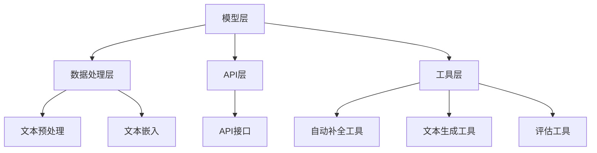

                 

# 【LangChain编程：从入门到实践】应用部署

> **关键词**：LangChain, 编程实践，应用部署，服务化部署，性能优化，监控与维护

> **摘要**：本文将从入门到实践，详细介绍LangChain编程的核心概念、算法原理、数学模型，并通过实际项目案例展示其在问答机器人、文本分类和自动摘要系统中的应用部署。此外，还将探讨LangChain的部署策略、性能优化和监控与维护，为开发者提供全面的技术指导。

### 目录

#### 第一部分: LangChain编程基础

- **第1章: LangChain概述**
  - 1.1 LangChain的历史与发展
  - 1.2 LangChain的核心概念
  - 1.3 LangChain的架构与组件

- **第2章: LangChain编程基础**
  - 2.1 Python编程基础
  - 2.2 LangChain的基本使用
  - 2.3 LangChain的API与数据结构

- **第3章: LangChain的核心算法**
  - 3.1 语言模型原理与实现
  - 3.2 嵌入式模型原理与实现
  - 3.3 自动补全与文本生成算法

- **第4章: LangChain的数学模型**
  - 4.1 概率论基础
  - 4.2 统计学习基础
  - 4.3 深度学习基础

- **第5章: LangChain的实际应用**
  - 5.1 文本分类应用实例
  - 5.2 问答系统应用实例
  - 5.3 自动摘要应用实例

- **第6章: LangChain的优化与调参**
  - 6.1 模型调参策略
  - 6.2 模型优化技巧
  - 6.3 实战案例解析

- **第7章: LangChain编程实践**
  - 7.1 项目实战一：构建问答机器人
  - 7.2 项目实战二：文本分类应用开发
  - 7.3 项目实战三：自动摘要系统开发

#### 第二部分: LangChain部署与维护

- **第8章: LangChain部署概述**
  - 8.1 部署前的准备
  - 8.2 部署环境搭建
  - 8.3 部署策略选择

- **第9章: LangChain服务化部署**
  - 9.1 服务化部署原理
  - 9.2 Docker与Kubernetes部署
  - 9.3 实践案例解析

- **第10章: LangChain的性能优化**
  - 10.1 性能优化方法
  - 10.2 高并发处理策略
  - 10.3 实践案例解析

- **第11章: LangChain的监控与维护**
  - 11.1 监控指标与策略
  - 11.2 故障排除与修复
  - 11.3 维护与升级策略

- **第12章: LangChain的未来发展趋势**
  - 12.1 行业发展趋势
  - 12.2 技术演进方向
  - 12.3 开发者技能要求

#### 附录

- **附录A: LangChain常用工具与资源**
  - A.1 Python深度学习框架
  - A.2 LangChain相关库与模块
  - A.3 实用工具推荐

- **附录B: LangChain编程实践案例代码**
  - B.1 问答机器人代码解析
  - B.2 文本分类代码解析
  - B.3 自动摘要代码解析

---

### 第一部分: LangChain编程基础

#### 第1章: LangChain概述

##### 1.1 LangChain的历史与发展

LangChain是一个开源的Python库，用于构建和部署基于语言模型的AI应用程序。它基于Hugging Face的Transformers库，提供了易于使用的API和丰富的工具，帮助开发者快速实现自然语言处理（NLP）任务。

LangChain的历史可以追溯到2019年，当时Hugging Face发布了Transformers库，为深度学习在NLP领域的研究和应用提供了强大的支持。随着Transformers的流行，开发者们开始寻找更简单的接口来利用这些模型。于是，在2020年，LangChain应运而生，旨在提供一种简单而强大的方式来构建基于语言模型的AI应用程序。

自从发布以来，LangChain已经吸引了大量的贡献者和用户，并成为NLP领域的一个重要工具。随着时间的推移，LangChain不断更新和优化，增加了许多新功能，如嵌入式模型、自动补全、文本生成等。

##### 1.2 LangChain的核心概念

LangChain的核心概念包括以下几个方面：

- **语言模型（Language Model）**：语言模型是NLP的基础，它通过学习大量文本数据来预测下一个词的概率。LangChain提供了丰富的语言模型，如GPT、BERT、DistilBERT等。

- **嵌入式模型（Embedding Model）**：嵌入式模型将文本中的词或句子转换为向量表示，以便进行后续处理。LangChain提供了多种嵌入式模型，如Word2Vec、BERT等。

- **自动补全（Autocompletion）**：自动补全是一种预测文本序列中下一个词或短语的技术。LangChain支持自动补全功能，可以帮助开发者构建聊天机器人、文本编辑器等应用。

- **文本生成（Text Generation）**：文本生成是一种根据给定输入生成文本的技术。LangChain提供了强大的文本生成功能，可以帮助开发者构建自动摘要、文章写作等应用。

##### 1.3 LangChain的架构与组件

LangChain的架构主要包括以下几个组件：

- **模型层（Model Layer）**：模型层包括各种预训练的语言模型和嵌入式模型。开发者可以选择合适的模型来构建自己的应用程序。

- **数据处理层（Data Processing Layer）**：数据处理层负责对输入文本进行预处理，如分词、去停用词等。LangChain提供了丰富的数据处理工具，方便开发者处理不同类型的文本数据。

- **API层（API Layer）**：API层提供了简单的接口，使开发者可以轻松地使用LangChain的各种功能。开发者只需几行代码就可以实现复杂的NLP任务。

- **工具层（Tool Layer）**：工具层包括各种实用工具，如自动补全工具、文本生成工具、评估工具等。这些工具可以帮助开发者快速构建和优化自己的应用程序。

**Mermaid流程图**：

### 第一部分总结

本章简要介绍了LangChain的历史与发展、核心概念和架构。在接下来的章节中，我们将深入探讨LangChain的编程基础、核心算法、数学模型以及实际应用。通过这些内容的学习，读者将能够全面了解LangChain的技术原理和应用场景，为后续的部署和维护打下坚实的基础。|user|

