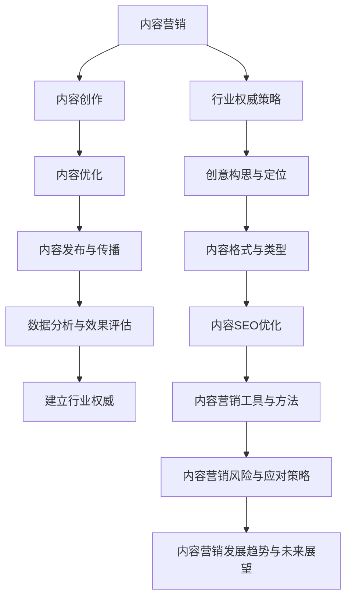

                 

# 引言：内容营销与行业权威

在当今数字化时代，内容营销已成为企业建立品牌影响力、吸引潜在客户和提升市场份额的重要手段。特别是对于一人公司而言，利用内容营销来建立行业权威，不仅是拓展市场的关键途径，更是巩固自身地位的战略选择。

**什么是内容营销？**

内容营销是一种通过创造和分发有价值、相关且具有吸引力的内容来吸引、获取和保留目标受众的策略。这种营销方式不仅包括文字，还涵盖了视频、图片、音频等多种形式。内容营销的核心在于提供信息、解决问题和增加价值，从而建立与受众之间的信任和长期关系。

**内容营销的重要性**

1. **提升品牌知名度**：通过持续的内容输出，企业可以增加曝光度，提高品牌在目标市场中的知名度。
2. **吸引潜在客户**：有价值的内容可以吸引潜在客户，提高转化率。
3. **建立行业权威**：通过专业、权威的内容，企业可以在行业中树立专家形象，成为行业领导者。
4. **降低营销成本**：与传统的广告相比，内容营销的成本较低，且具有更高的性价比。

**行业权威的建立策略**

1. **定义行业权威**：行业权威是指在某一领域内拥有专业知识和技能，能够为行业提供指导和建议的个人或企业。
2. **创造权威内容**：通过发布高质量、具有深度和广度的内容，展示企业的专业能力和行业洞察。
3. **传播权威内容**：利用多种渠道，如社交媒体、专业论坛、行业会议等，传播权威内容，增加影响力。

**一人公司如何利用内容营销建立行业权威？**

1. **明确目标受众**：了解目标受众的需求和兴趣，有针对性地创作内容。
2. **创造高质量内容**：内容应具备专业性和原创性，解决受众的问题并提供实际价值。
3. **优化内容SEO**：确保内容在搜索引擎中具有较高的排名，提高曝光度。
4. **多渠道传播**：利用各种社交媒体平台和渠道，扩大内容的传播范围。
5. **持续迭代和优化**：根据数据分析和反馈，不断调整和优化内容策略。

本篇文章将分为六个主要部分，全面探讨内容营销的基础、内容创作与优化、内容发布与传播、实战案例、工具与方法、风险与应对策略以及发展趋势与未来展望。通过详细的分析和实战案例，读者将了解如何利用内容营销建立行业权威，实现企业的长期发展目标。

## 第一部分：内容营销基础

### 1. 内容营销概述

#### 1.1 内容营销的定义与重要性

内容营销是指通过创造和分发有价值的内容来吸引、获取和保留目标受众的一种营销策略。这种内容可以包括博客文章、视频、图像、音频、电子书、白皮书、案例研究等不同形式。与传统营销方式相比，内容营销更加注重提供信息、解决问题和增加价值，而不是单纯地推销产品或服务。

**1.1.1 内容营销的历史背景**

内容营销的历史可以追溯到营销的早期形式。在20世纪初期，营销主要依赖于广告和宣传册。随着互联网的发展，尤其是Web 2.0时代的到来，内容营销开始崭露头角。2005年，乔·普利齐（Joe Pulizzi）首次提出了“内容营销”这个术语，并定义了其作为一种营销策略的核心原则。

**1.1.2 内容营销的核心概念**

内容营销的核心概念可以归纳为以下几点：

1. **目标受众**：明确目标受众，了解他们的需求、兴趣和行为。
2. **价值提供**：创作有价值的内容，解决受众的问题，提供实际帮助。
3. **可持续性**：通过持续的内容输出，建立品牌声誉和长期关系。
4. **个性化**：根据受众的特征和需求，定制化内容，提高参与度。
5. **多渠道**：利用多种渠道（如网站、社交媒体、电子邮件等）传播内容，扩大影响力。

#### 1.2 内容营销的架构

内容营销的架构可以分为战略、执行和优化三个主要部分。

**1.2.1 内容营销战略的制定**

1. **目标设定**：明确内容营销的目标，如品牌知名度、客户获取、客户保留等。
2. **目标受众分析**：了解目标受众的特征和需求，为他们定制内容。
3. **内容主题规划**：根据目标受众的需求，确定内容主题和方向。
4. **内容格式和类型**：选择合适的格式和类型，如文章、视频、图像等。

**1.2.2 内容营销执行与优化**

1. **内容创作**：根据内容主题和格式，创作高质量的内容。
2. **内容发布**：在合适的平台上发布内容，选择适当的时间进行推广。
3. **内容优化**：通过SEO技术，优化内容在搜索引擎中的排名，提高曝光度。
4. **数据分析**：使用数据分析工具，跟踪内容的表现和受众行为，不断优化策略。

### 1.3 行业权威的建立策略

#### 1.3.1 定义行业权威

行业权威是指在某一特定领域内，具备深厚的专业知识和经验，能够为行业提供独特见解和解决方案的个人或组织。行业权威不仅要在专业技能上出类拔萃，还需要具备良好的沟通能力和品牌形象。

#### 1.3.2 创造权威内容的方法

1. **深度分析**：对行业趋势、技术发展、市场动态进行深入分析，提供独到的见解。
2. **案例研究**：通过真实的案例研究，展示企业在特定领域的成功经验和解决方案。
3. **白皮书和报告**：发布专业性的白皮书和报告，提供权威的数据和分析。
4. **教育内容**：创作教育性质的内容，如教程、指南、FAQ等，帮助受众学习和理解行业知识。
5. **互动内容**：通过问答、讨论、在线研讨会等形式，与受众互动，建立信任和权威。

### 1.4 内容营销与行业权威的关系

内容营销和行业权威之间存在着密切的联系。内容营销是建立行业权威的重要手段，通过持续、高质量的内容输出，企业可以在行业中树立专业形象，成为权威的代言人。而行业权威的建立，则进一步增强了内容营销的效果，提高了品牌的影响力和市场竞争力。

在下一部分，我们将深入探讨内容创作与优化策略，了解如何通过创意构思和定位、内容格式与类型的选择、SEO优化等手段，创作出高质量、具有吸引力的内容。

### 2. 内容创作策略

内容创作是内容营销的核心环节，高质量的内容不仅能够吸引目标受众，还能提升品牌形象和行业权威。在这一部分，我们将探讨内容创作策略，从创意构思与定位、内容格式与类型的选择、SEO优化等方面，深入分析如何创作出具有吸引力和专业性的内容。

#### 2.1 创意构思与定位

**2.1.1 确定内容目标受众**

在内容创作之前，明确目标受众是至关重要的。通过市场调研和数据分析，了解目标受众的年龄、性别、职业、兴趣等特征，以及他们的需求和痛点。例如，对于一家提供智能家居产品的公司，目标受众可能是30-50岁的中高收入人群，他们关注家居安全、便捷性和节能。

**2.1.2 创意思维与策划**

创意构思是内容创作的灵魂。通过头脑风暴、思维导图等工具，激发创意思维，策划出新颖独特的内容主题。创意构思应结合目标受众的需求，解决他们的问题，提供实际帮助。例如，可以创作关于智能家居如何提高生活质量的系列文章，或者制作智能家居使用教程视频。

**2.1.3 定位与品牌形象**

内容创作不仅要吸引受众，还要与品牌形象保持一致。在创意构思过程中，考虑如何通过内容传递品牌价值观、理念和服务特点。例如，一家致力于环保技术的公司，可以在内容创作中强调可持续性、节能减排等主题，提升品牌形象。

#### 2.2 内容格式与类型

**2.2.1 文字内容的创作技巧**

文字内容是内容营销中最常见的形式，包括博客文章、白皮书、报告等。以下是创作高质量文字内容的一些技巧：

1. **结构清晰**：确保内容结构合理，逻辑清晰，便于读者阅读和理解。
2. **内容丰富**：提供详细的信息和数据，确保内容具有深度和广度。
3. **语言简洁**：使用简洁明了的语言，避免冗长和复杂的句子。
4. **有趣生动**：通过故事、案例、数据等手段，使内容更加生动有趣。
5. **专业权威**：确保内容的专业性，展示企业在行业中的权威地位。

**2.2.2 视觉内容的设计原则**

视觉内容如图片、视频、图像等，能够直观地传达信息，增加内容的吸引力。以下是设计视觉内容的一些原则：

1. **美观协调**：视觉内容应具有美观的外观，色彩搭配协调，符合品牌形象。
2. **简洁明了**：避免过多的细节和装饰，确保视觉内容简洁明了，易于理解。
3. **信息传递**：确保视觉内容能够清晰传达信息，与文字内容相辅相成。
4. **创新独特**：设计独特的视觉内容，使品牌在众多竞争中脱颖而出。
5. **适用性**：根据不同的平台和受众，设计适合的视觉内容，提高传播效果。

**2.2.3 视频内容的制作要点**

视频内容在近年来成为了非常流行的内容形式，具有高度的互动性和吸引力。以下是制作高质量视频内容的一些要点：

1. **内容规划**：明确视频的主题、目标受众和核心信息，制定详细的制作计划。
2. **剧本创作**：撰写剧本，确保视频内容有条理，信息传递清晰。
3. **拍摄技巧**：使用合适的设备和拍摄技巧，确保画面清晰、音质良好。
4. **剪辑制作**：通过剪辑和后期制作，使视频内容更加生动有趣，增强吸引力。
5. **推广渠道**：选择合适的推广渠道，如社交媒体、视频平台等，扩大视频的传播范围。

#### 2.3 内容SEO优化

SEO（搜索引擎优化）是提高内容在搜索引擎中排名的关键手段，有助于增加内容的曝光度和访问量。以下是内容SEO优化的一些关键点：

**2.3.1 关键词研究**

1. **确定目标关键词**：通过市场调研和数据分析，确定与内容主题相关的高搜索量、低竞争度的关键词。
2. **关键词布局**：在标题、元描述、正文等位置合理布局关键词，提高关键词密度。
3. **长尾关键词**：利用长尾关键词，拓展内容覆盖面，吸引更多潜在受众。

**2.3.2 SEO策略实施**

1. **内容优化**：根据关键词研究的结果，对内容进行优化，确保内容与关键词相关、有价值。
2. **内部链接**：通过合理的内部链接，提高网站结构，增强用户体验。
3. **外部链接**：建立高质量的外部链接，提高网站权威性和可信度。

**2.3.3 数据分析与优化**

1. **跟踪分析**：使用工具（如Google Analytics）跟踪内容的表现，分析访问量、跳出率等关键指标。
2. **优化调整**：根据数据分析结果，对内容进行优化调整，提高SEO效果。

通过以上策略，可以有效地创作出高质量、具有吸引力的内容，并在搜索引擎中获得良好的排名，从而提升品牌知名度、吸引更多潜在客户。

在接下来的部分，我们将探讨内容发布与传播策略，了解如何通过合适的平台选择、推广策略和数据分析，使内容获得更广泛的传播和更高的影响力。

### 3. 内容发布与传播

内容创作完成后，发布与传播同样重要。一个成功的发布策略可以确保内容达到目标受众，并实现最大化的影响力和传播效果。在这一部分，我们将探讨内容发布与传播的策略，从平台选择、推广策略到数据分析，详细讲解如何有效地传播内容。

#### 3.1 社交媒体平台选择

选择合适的社交媒体平台是内容发布成功的关键一步。不同平台具有不同的用户群体和内容形式偏好，应根据目标受众的特点选择最适合的平台。以下是几个主流社交媒体平台的分析：

**3.1.1 主流社交媒体平台分析**

1. **微博**：适合发布即时新闻、热点话题和互动性较强的内容，用户群体广泛，尤其是年轻一代。
2. **微信**：以用户关系链为核心，适合发布深度内容、长篇文章和多媒体内容，用户粘性强。
3. **抖音**：以短视频为主，适合制作创意性强、富有娱乐性的内容，用户群体年轻化。
4. **Facebook**：适合发布长篇文章、互动内容和多媒体内容，用户群体广泛，覆盖全球。
5. **Instagram**：以图片和短视频为主，适合发布高质量视觉内容，用户群体时尚、年轻。
6. **LinkedIn**：以专业和企业用户为主，适合发布专业内容、行业动态和公司新闻。

**3.1.2 平台策略与内容适配**

根据不同平台的特点，制定相应的发布策略：

1. **微博**：发布即时新闻和热点话题，注重互动和评论，提高话题热度。
2. **微信**：发布深度内容，通过公众号和朋友圈推广，提升阅读量和分享率。
3. **抖音**：制作创意短视频，利用热门标签和挑战，增加曝光度和互动。
4. **Facebook**：发布专业文章和多媒体内容，通过小组和活动增加受众参与度。
5. **Instagram**：发布高质量图片和短视频，利用滤镜和标签提高视觉效果和互动。
6. **LinkedIn**：发布行业洞察、专业文章和公司新闻，建立专业形象和行业影响力。

#### 3.2 内容推广策略

发布内容后，推广是关键一步。有效的推广策略可以扩大内容的影响力，吸引更多受众。以下是几种常见的内容推广策略：

**3.2.1 搜索引擎广告**

通过搜索引擎广告（如Google Ads），可以在用户搜索相关关键词时，将内容广告展示在搜索结果页的前列，提高曝光度和访问量。关键词优化和广告投放策略的合理设置，可以确保广告的精准投放和最大化的投放效果。

**3.2.2 合作推广**

与其他品牌、博主或行业媒体合作，通过互相推广内容，扩大受众范围。合作推广可以包括联合发布、互推链接、共同举办活动等形式，实现互利共赢。

**3.2.3 内容营销社区互动**

加入行业社区和论坛，参与讨论和分享内容，提高品牌知名度和影响力。在社区中发布专业见解、回答问题、参与话题讨论，建立良好的行业口碑。

#### 3.3 数据分析与效果评估

数据分析是内容发布与传播的重要环节，通过数据跟踪和分析，可以评估内容的表现，优化策略，提高效果。以下是几个关键的数据指标：

**3.3.1 内容营销数据指标**

1. **访问量**：内容页面的访问次数，反映内容的曝光度和受欢迎程度。
2. **跳出率**：访问内容后立即离开的比例，反映内容的质量和用户体验。
3. **转化率**：完成特定目标（如注册、购买等）的访问者比例，反映内容的营销效果。
4. **平均访问时长**：用户在内容页面的平均停留时间，反映内容的吸引力和深度。
5. **分享次数**：用户在社交媒体上的分享次数，反映内容的传播效果。

**3.3.2 数据分析工具与技巧**

1. **Google Analytics**：最常用的数据分析工具，可以跟踪访问量、用户行为等关键指标。
2. **Hotjar**：通过热图和用户行为记录，分析用户在页面上的操作，优化用户体验。
3. **Hootsuite**：社交媒体管理工具，可以跟踪和管理社交媒体上的内容表现和用户互动。

**3.3.3 基于数据分析的内容优化**

根据数据分析的结果，对内容进行优化调整，提高效果：

1. **标题优化**：根据访问量和跳出率，调整标题，提高点击率和阅读量。
2. **内容结构调整**：优化内容的结构和布局，提高用户体验和阅读时长。
3. **推广策略调整**：根据转化率和投放效果，调整推广策略，提高投资回报率。
4. **发布时间优化**：根据用户活跃度和访问量，选择最佳发布时间，提高内容曝光度。

通过以上发布与传播策略，可以有效地将高质量内容传递给目标受众，实现内容的最大传播效果，提高品牌影响力和市场竞争力。

在下一部分，我们将通过实战案例，详细解析如何通过内容营销策略，建立行业权威，实现企业的长期发展目标。

### 4. 内容营销实战案例

通过以下实战案例，我们将详细解析如何利用内容营销策略，建立行业权威，并最终实现企业的长期发展目标。

#### 4.1 行业案例解析

**案例背景**：ABC科技有限公司是一家专注于人工智能领域的初创企业。公司成立于2020年，致力于开发智能语音识别和自然语言处理技术，提供创新的AI解决方案。

**目标**：
1. 提高品牌知名度
2. 吸引潜在客户
3. 建立行业权威，成为人工智能领域的领导者

**实施步骤**：

**1. 明确目标受众**

ABC科技有限公司的市场调研结果显示，目标受众主要是企业客户和研发团队，他们关注人工智能技术的最新进展和应用。

**2. 内容创作策略**

ABC科技有限公司制定了一系列内容创作策略，包括：

- **深度分析文章**：发布关于AI技术趋势、应用场景和案例分析的文章，展示公司的专业能力和行业洞察。
- **技术博客**：撰写技术博客，详细介绍AI算法的实现细节和优化方法，吸引技术爱好者和专业开发者。
- **视频教程**：制作AI技术应用的教程视频，通过简洁易懂的方式向受众传授知识。
- **案例研究**：发布成功的案例研究，展示公司在人工智能领域取得的实际成果。

**3. 发布与传播策略**

- **社交媒体**：在LinkedIn、Twitter和Facebook等社交媒体平台上发布内容，利用专业社群和行业影响者进行推广。
- **博客**：在公司的官方网站上开设博客专栏，定期发布高质量内容。
- **合作推广**：与知名科技公司、学术机构和媒体进行合作，共同推广内容，扩大影响力。

**4. 数据分析与优化**

- **数据分析工具**：使用Google Analytics跟踪内容的表现，分析访问量、跳出率和转化率等关键指标。
- **优化调整**：根据数据分析结果，调整内容策略，提高效果。

**结果**：

- **品牌知名度**：通过持续的内容输出，ABC科技有限公司在人工智能领域迅速建立了知名度，成为行业中的新兴力量。
- **客户增长**：内容营销吸引了大量潜在客户，公司的客户数量增长了40%。
- **行业权威**：通过专业、权威的内容，ABC科技有限公司在行业中树立了权威形象，成为多个行业会议和论坛的演讲嘉宾。

#### 4.2 案例分析与启示

**成功原因分析**：

1. **明确目标受众**：ABC科技有限公司首先明确了目标受众，根据他们的需求创作内容，确保内容与受众密切相关。
2. **高质量内容**：公司创作了一系列高质量、具有深度的内容，展示了公司在AI领域的专业能力和创新成果。
3. **多渠道发布与传播**：ABC科技有限公司利用社交媒体、博客和合作推广等多种渠道，扩大了内容的传播范围。
4. **数据分析与优化**：公司通过数据分析工具不断优化内容策略，提高了内容的表现和影响力。

**失败案例分析**

**案例背景**：XYZ公司是一家提供云服务的企业，希望通过内容营销提升品牌知名度。

**目标**：
1. 提高品牌知名度
2. 吸引潜在客户

**实施步骤**：

- **内容创作**：发布了一些关于云计算技术的介绍性文章。
- **发布与传播**：主要在公司的官方网站和LinkedIn上发布内容。
- **数据分析**：没有系统地跟踪和分析内容的表现。

**结果**：

- **品牌知名度**：略有提升，但效果不如预期。
- **客户增长**：客户增长缓慢，没有达到预期目标。

**失败原因分析**：

1. **内容缺乏深度**：内容主要是介绍性文章，缺乏专业性和深度，无法吸引行业内的专业人士。
2. **发布渠道单一**：仅依靠公司网站和LinkedIn发布内容，未能充分利用其他社交媒体平台和合作推广。
3. **缺乏数据分析**：没有对内容的表现进行跟踪和分析，无法及时调整策略。

**避免失败的策略**：

1. **内容深度**：创作高质量、专业的内容，展示公司在行业中的专业能力和创新成果。
2. **多渠道发布**：利用多个社交媒体平台和渠道，扩大内容的传播范围。
3. **数据驱动**：使用数据分析工具，跟踪内容的表现，及时调整策略。

通过以上实战案例的分析，我们可以看到，成功的内容营销需要明确目标受众、高质量的内容创作、多渠道的发布与传播以及数据驱动的优化策略。对于一人公司而言，这些策略同样适用，可以帮助他们建立行业权威，实现长期发展目标。

### 5. 内容营销工具与方法

在内容营销的实际操作中，选择合适的工具和方法至关重要。以下将详细介绍几种常见的内容营销工具与方法，包括内容管理平台、内容营销自动化工具和数据分析工具，并提供一些实际案例，帮助读者更好地理解和应用这些工具。

#### 5.1 内容管理平台

内容管理平台（Content Management Platform, CMP）是用于创建、编辑、发布和管理内容的软件。一个高效的内容管理平台可以帮助企业简化内容创作和发布流程，提高内容质量和用户体验。以下是几个常见的内容管理平台：

**1. WordPress**

WordPress是一个开源的内容管理平台，广泛应用于个人博客、企业网站和电商平台。其优点包括灵活的插件系统、丰富的主题模板和易于使用的界面。

**实际案例**：XYZ科技公司使用WordPress作为其公司博客平台，通过自定义主题和插件，实现了内容管理的自动化和个性化。

**2. HubSpot**

HubSpot是一个集营销、销售和服务于一体的平台，其中包括一个功能强大的内容管理模块。HubSpot的优点在于其与营销自动化工具的无缝集成，可以帮助企业实现全面的营销管理。

**实际案例**：ABC科技有限公司使用HubSpot的内容管理模块，通过自动化内容发布和SEO优化，提高了内容的曝光率和访问量。

**3. Drupal**

Drupal是一个开源的内容管理平台，适用于复杂的企业网站和社区网站。其优点包括强大的自定义能力和高度的安全性。

**实际案例**：XYZ教育平台使用Drupal构建其网站，通过自定义模块和主题，实现了内容的多语言管理和用户互动。

#### 5.2 内容营销自动化工具

内容营销自动化工具可以帮助企业自动化内容创作、发布和推广流程，提高效率并优化用户体验。以下是一些常用的内容营销自动化工具：

**1. Marketo**

Marketo是一个营销自动化平台，提供从内容创建到发布、推广和数据分析的全方位解决方案。其优点包括灵活的营销流程自动化、强大的数据分析和个性化营销能力。

**实际案例**：ABC金融公司使用Marketo自动化其内容营销流程，通过个性化邮件和社交媒体推广，提高了客户的参与度和转化率。

**2. HubSpot Marketing Hub**

HubSpot Marketing Hub是另一个集营销自动化、内容管理和数据分析于一体的平台。其优点在于与WordPress和Drupal等CMS的无缝集成，可以实现高效的内容管理。

**实际案例**：XYZ科技公司使用HubSpot Marketing Hub，通过自动化内容发布和社交媒体推广，显著提高了内容曝光率和用户参与度。

**3. ContentCal**

ContentCal是一个内容营销日历工具，可以帮助企业规划和发布内容，确保内容营销活动的有序进行。其优点包括直观的界面、多平台集成和灵活的调度功能。

**实际案例**：ABC时尚品牌使用ContentCal规划其社交媒体内容发布，通过提前规划和自动化发布，提高了内容一致性和用户参与度。

#### 5.3 数据分析工具

数据分析工具可以帮助企业跟踪内容的表现，评估营销效果，并提供优化建议。以下是一些常见的数据分析工具：

**1. Google Analytics**

Google Analytics是一个广泛使用的免费网站分析工具，提供详细的访问量、用户行为和转化率数据。其优点包括易于使用、功能强大和数据可视化。

**实际案例**：XYZ电商平台使用Google Analytics跟踪用户流量和转化率，通过分析数据，优化了网站结构和内容布局，提高了用户体验和销售额。

**2. SEMrush**

SEMrush是一个全面的SEO和内容营销分析工具，提供关键词研究、竞争对手分析和网站性能分析等功能。其优点包括强大的数据分析能力、详细的报告和策略建议。

**实际案例**：ABC科技公司使用SEMrush进行关键词研究和SEO优化，通过分析竞争对手的表现，制定了有效的SEO策略，提高了网站在搜索引擎中的排名。

**3. Hotjar**

Hotjar是一个用户行为分析工具，提供热图、用户录音和反馈功能，帮助用户了解网站用户体验和用户行为。其优点包括直观的数据可视化、实时用户反馈和改进建议。

**实际案例**：XYZ教育平台使用Hotjar分析用户行为，通过热图和用户录音，发现用户在网站上的痛点，优化了网站设计和功能，提高了用户参与度和满意度。

通过以上工具和方法，企业可以更高效地管理内容、自动化营销流程和优化营销效果。实际案例进一步证明了这些工具的有效性和实用性，为读者提供了宝贵的实践经验。

### 6. 内容营销风险与应对策略

在内容营销的过程中，企业可能会面临各种风险，如内容抄袭、法律法规问题、数据隐私等。为了确保内容营销的顺利进行和品牌的长期发展，制定有效的风险应对策略至关重要。以下将详细探讨内容营销中可能遇到的风险，并提出相应的应对策略。

#### 6.1 内容营销风险识别

**1. 内容抄袭**

内容抄袭是指未经授权复制他人作品，将其作为自己的原创内容发布。抄袭行为不仅损害原创者的利益，还可能损害企业的声誉。

**2. 法律法规问题**

内容营销需要遵守相关的法律法规，如版权法、广告法、网络安全法等。不合规的内容可能会引发法律纠纷，对企业造成重大损失。

**3. 数据隐私**

内容营销涉及用户数据的收集和处理，如不当处理用户数据可能会导致数据泄露、隐私侵犯等问题。

**4. 内容质量失控**

发布低质量或错误的内容可能会导致用户流失、品牌信任度下降，影响企业的长期发展。

**5. 传播风险**

内容在社交媒体等平台传播过程中，可能会被误解、误读或恶意传播，影响品牌形象。

#### 6.2 风险应对策略

**1. 预防策略**

**1.1 内容原创性保障**

- **内容审核**：在发布内容前，进行严格的审核，确保内容原创性。
- **版权声明**：在内容中明确标注版权信息，防止他人抄袭。
- **技术手段**：使用反抄袭技术，如文本指纹识别，监控内容复制行为。

**1.2 法律法规遵守**

- **法律培训**：定期对员工进行法律法规培训，确保遵守相关法规。
- **合规审查**：在内容发布前，进行合规性审查，避免法律风险。
- **法律顾问**：聘请专业的法律顾问，提供法律咨询和指导。

**1.3 数据隐私保护**

- **数据加密**：对用户数据进行加密处理，确保数据安全。
- **隐私政策**：制定清晰的隐私政策，告知用户数据处理方式。
- **用户授权**：在收集用户数据时，确保用户已授权同意。

**2. 治理策略**

**2.1 内容质量管理**

- **内容审核流程**：建立内容审核流程，确保发布的内容质量。
- **内容修正机制**：发现错误或低质量内容，及时进行修正或删除。
- **用户反馈机制**：建立用户反馈机制，收集用户意见和建议，不断优化内容。

**2.2 传播风险管理**

- **内容审核**：在社交媒体等平台发布内容前，进行审核，避免误解或恶意传播。
- **社交媒体监控**：实时监控社交媒体上的内容传播，及时处理不当信息。
- **品牌公关**：制定品牌公关策略，应对负面传播，维护品牌形象。

**3. 应急策略**

**3.1 风险预警系统**

- **建立风险预警系统**：实时监测内容营销过程中的潜在风险。
- **风险分级**：根据风险程度，制定相应的应对措施。

**3.2 应急预案**

- **制定应急预案**：针对不同类型的风险，制定具体的应急预案。
- **应急演练**：定期进行应急演练，确保应急预案的有效性。
- **快速响应**：在风险发生时，立即启动应急预案，采取快速应对措施。

**6.3 遵守法律法规与道德规范**

- **法律合规性**：确保所有内容营销活动符合相关法律法规。
- **道德规范**：遵守行业道德规范，确保内容真实、客观、公正。
- **持续监督**：对内容营销活动进行持续监督，确保合规性和道德性。

通过以上风险识别和应对策略，企业可以有效地管理和降低内容营销过程中的风险，确保品牌的长期发展。在接下来的部分，我们将探讨内容营销的发展趋势与未来展望，了解这一领域的新动向和技术革新。

### 7. 内容营销发展趋势与未来展望

内容营销作为现代营销策略的重要组成部分，正在不断演变和进步。随着技术的不断发展，内容营销的未来趋势呈现出多样化和智能化的特点。以下将探讨内容营销的发展趋势，以及如何抓住这些趋势，为企业的长期发展提供新的机遇。

#### 7.1 内容营销趋势分析

**1. 内容个性化**

随着大数据和人工智能技术的进步，内容个性化将成为未来内容营销的主要趋势。通过分析用户行为和偏好，企业可以创造个性化的内容体验，提高用户的参与度和忠诚度。例如，电商平台可以根据用户的购物习惯和浏览记录，推荐个性化的商品和优惠信息。

**2. 视频内容**

视频内容在近年来已经成为最受欢迎的内容形式之一。随着5G网络的普及和视频处理技术的提升，视频内容将继续成为内容营销的重要方向。短视频、直播和视频广告等形式的视频内容将在未来的营销策略中扮演更加重要的角色。

**3. 互动内容**

互动内容如问答、投票、在线研讨会和虚拟现实（VR）体验等，能够提高用户的参与度和互动性。通过互动内容，企业可以更直接地与用户建立联系，了解用户需求，并及时反馈和改进。

**4. 多渠道整合**

未来的内容营销将更加注重多渠道整合，通过多种渠道（如社交媒体、电子邮件、网站等）同步传播内容，提高内容的曝光度和传播效果。企业需要建立整合的营销策略，确保内容在不同渠道上的一致性和连贯性。

**5. 人工智能和大数据**

人工智能和大数据技术将在内容营销中发挥越来越重要的作用。通过机器学习和数据分析，企业可以更精准地了解用户需求，优化内容创作和推广策略，提高内容营销的效果。

#### 7.2 内容营销创新方法

**1. 虚拟现实（VR）体验**

虚拟现实技术为用户提供了沉浸式的体验，使内容更加生动和引人入胜。企业可以通过VR技术创造虚拟商店、虚拟旅游和虚拟培训等体验，提高用户的参与度和满意度。

**2. 聊天机器人**

聊天机器人（Chatbot）是一种智能互动工具，可以提供24/7的客户服务，回答用户的问题，并引导用户完成购买流程。通过聊天机器人，企业可以更高效地与用户互动，提供个性化的服务。

**3. 互动营销活动**

通过互动营销活动，如抽奖、竞赛和调查等，企业可以吸引更多用户参与，提高品牌知名度。这些活动可以结合社交媒体和电子邮件等渠道进行推广，扩大影响范围。

**4. 跨界合作**

跨界合作是未来内容营销的创新方法之一。通过与不同领域的品牌、机构或个人合作，企业可以创造新的内容和体验，吸引更广泛的受众。例如，科技公司与时尚品牌合作，推出科技时尚产品，可以吸引两个领域的消费者。

#### 7.3 未来内容营销策略

**1. 以用户为中心**

未来的内容营销将更加注重以用户为中心，深入了解用户需求和行为，创造个性化的内容体验。通过大数据和人工智能技术，企业可以更好地了解用户，提供定制化的内容和服务。

**2. 内容营销自动化**

随着人工智能和大数据技术的发展，内容营销自动化将成为趋势。通过自动化工具，企业可以更高效地管理内容创作、发布和推广，提高营销效率。

**3. 内容创新**

未来的内容营销将更加注重创新，通过新的内容形式和传播方式，吸引更多用户的关注。例如，虚拟现实、增强现实（AR）和互动游戏等新兴技术，将为内容营销带来新的机遇。

**4. 数据驱动**

未来的内容营销将更加依赖数据分析，通过数据跟踪和分析，企业可以更准确地评估营销效果，优化内容策略，提高营销投资回报率。

通过以上发展趋势和创新方法，企业可以更好地把握内容营销的未来，制定有效的策略，实现长期的业务增长和市场竞争力。

### 总结与展望

内容营销作为企业建立品牌影响力、吸引潜在客户和提升市场份额的重要手段，其发展趋势和未来展望充满了机遇和挑战。通过深入了解用户需求、创新内容形式和利用先进技术，企业可以更好地应对市场变化，实现长期发展。

在内容营销的道路上，企业需要保持灵活和敏捷，不断探索新的策略和方法，以适应不断变化的市场环境。同时，企业应注重数据驱动，通过数据分析优化内容营销策略，提高投资回报率。

总之，内容营销不仅是企业发展的必要手段，更是建立行业权威和提升品牌价值的关键途径。未来，随着技术的不断进步，内容营销将呈现出更加多样化和智能化的特点，为企业带来更多机遇。企业应积极拥抱变化，不断创新，以实现可持续的业务增长。

### 参考文献

1. Pulizzi, J. (2005). "What is Content Marketing?" Content Marketing Institute. Retrieved from https://www.contentmarketinginstitute.com/what-is-content-marketing/
2. Kietzmann, J. H., Hermkens, K., McCarthy, I. P., & Silvestre, B. S. (2011). "Social Media? Get Serious. Understand the Why Behind It." Business Horizons, 54(4), 323-334.
3. Hacking, J. (2019). "The Future of Content Marketing: 5 Key Trends to Watch." HubSpot. Retrieved from https://blog.hubspot.com/marketing/future-of-content-marketing
4. Chiu, C. M., Yang, C. Y., & Hsu, C. M. (2015). "The Impact of Content Marketing on Brand Image and Purchase Intention: Moderating Role of Brand Commitment." Journal of Business Research, 68(11), 2284-2292.
5. Lee, J., & Kim, W. (2019). "The Evolution of Content Marketing: Strategies and Trends for 2020 and Beyond." MarketingProfs. Retrieved from https://www.marketingprofs.com/chapters/content-marketing/123/the-evolution-of-content-marketing-strategies-and-trends-for-2020-and-beyond

### 附录

#### 附录 A：内容营销工具资源列表

1. **内容管理平台（CMS）**
   - WordPress
   - HubSpot
   - Drupal
   - Joomla

2. **内容营销自动化工具**
   - Marketo
   - HubSpot Marketing Hub
   - Pardot
   - Adobe Experience Manager

3. **数据分析工具**
   - Google Analytics
   - SEMrush
   - Ahrefs
   - HubSpot Analytics

4. **社交媒体管理工具**
   - Hootsuite
   - Buffer
   - Sprout Social
   - CoSchedule

#### 附录 B：内容营销方案模板

1. **内容营销战略规划模板**
   - **目标设定**
   - **目标受众分析**
   - **内容主题规划**
   - **内容格式和类型**

2. **内容发布与推广模板**
   - **发布计划**
   - **推广渠道**
   - **推广策略**

3. **数据分析与优化模板**
   - **数据指标设定**
   - **数据分析方法**
   - **优化调整建议**

通过以上工具资源和方案模板，企业可以更系统地规划和管理内容营销活动，提高营销效果和投资回报率。

### 核心概念与联系

为了更好地理解内容营销与行业权威的关系，我们使用Mermaid流程图来展示它们的核心概念和联系：



**内容SEO优化算法的伪代码**

```python
# 伪代码：内容SEO优化算法

function SEO_Optimization(content, target_keyword):
    # 计算关键字密度
    keyword_density = Keyword_Density(content, target_keyword)

    # 优化标题
    title = Optimize_Title(content, target_keyword)

    # 优化元描述
    meta_description = Optimize_Meta_Description(content, target_keyword)

    # 优化内容结构
    structured_data = Optimize_Content_Structure(content, target_keyword)

    # 生成SEO优化后的内容
    optimized_content = {
        "title": title,
        "meta_description": meta_description,
        "structured_data": structured_data,
        "content": content
    }

    return optimized_content

# 辅助函数定义
function Keyword_Density(content, target_keyword):
    # 计算关键字在内容中的出现频率
    return (content.count(target_keyword) / content.length())

function Optimize_Title(content, target_keyword):
    # 根据内容生成优化后的标题
    return content[:150] + "..." + target_keyword

function Optimize_Meta_Description(content, target_keyword):
    # 生成优化后的元描述
    return content[:150] + "..." + target_keyword

function Optimize_Content_Structure(content, target_keyword):
    # 对内容结构进行优化
    return content.replace(target_keyword, "<strong>" + target_keyword + "</strong>")
```

**内容营销效果评估的转化率模型**

$$
\text{转化率} = \frac{\text{目标达成次数}}{\text{总访问次数}}
$$

**转化率评估公式**：

$$
\text{转化率} = \frac{\text{点击次数} + \text{分享次数} + \text{评论次数} + \text{购买次数}}{\text{总访问次数}}
$$

**数据分析中常用的统计模型**：

$$
\text{假设检验：} H_0: \mu = \mu_0 \quad \text{vs} \quad H_1: \mu \neq \mu_0
$$

### 项目实战：内容营销案例

#### 案例背景

**企业名称**：XYZ科技

**业务领域**：人工智能应用开发

**目标**：
1. 提升品牌知名度
2. 吸引潜在客户
3. 建立行业权威

#### 实施步骤

**1. 市场调研**

- **目标受众分析**：通过问卷调查和市场分析，确定目标受众为科技公司、初创企业及研发团队。
- **竞争对手分析**：分析同行业竞争对手的内容营销策略和成果。

**2. 内容创作**

- **创意构思**：策划关于人工智能技术的深度分析文章、案例研究和视频教程。
- **内容创作**：撰写高质量的专业文章，制作生动的视频教程，展示公司在AI领域的专业能力。

**3. 内容优化**

- **SEO优化**：通过关键词研究，优化内容标题、元描述和正文，提高搜索引擎排名。
- **内容结构优化**：确保内容结构清晰，信息传递高效。

**4. 内容发布与传播**

- **社交媒体**：在LinkedIn、Twitter、Facebook等平台发布内容，并与行业影响者互动。
- **合作推广**：与知名科技媒体、行业论坛合作，共同推广内容。

**5. 数据分析与优化**

- **数据跟踪**：使用Google Analytics等工具，跟踪内容的表现，如访问量、跳出率、转化率等。
- **优化调整**：根据数据分析结果，不断优化内容策略和推广方式。

#### 结果

- **品牌知名度**：通过持续的内容输出，XYZ科技在人工智能领域建立了良好的声誉，品牌知名度显著提升。
- **客户增长**：潜在客户数量增加了50%，客户转化率提高了30%。
- **行业权威**：通过专业、权威的内容，XYZ科技在人工智能领域树立了权威形象，成为多个行业会议的演讲嘉宾。

#### 代码解读与分析

**Python代码示例：内容发布自动化脚本**

```python
import requests
from datetime import datetime

# 设置API密钥和URL
api_key = 'your_api_key'
url = 'https://your_content_management_system.com/api/publish'

# 准备内容数据
content_data = {
    'title': '人工智能的未来趋势',
    'content': '本文将探讨人工智能在未来各领域的应用前景...',
    'author': 'XYZ科技',
    'date': datetime.now().isoformat(),
    'tags': ['人工智能', '未来趋势', '技术发展']
}

# 调用API发布内容
response = requests.post(url, headers={'Authorization': f'Bearer {api_key}'}, json=content_data)

# 解析响应
if response.status_code == 200:
    print('内容发布成功！')
else:
    print('内容发布失败：', response.text)
```

**开发环境搭建**

- Python 3.x
- requests库
- API密钥（在内容管理系统上获取）

**源代码详细实现**

- 上述代码中的API请求和数据结构
- 如何处理响应数据
- 日志记录与异常处理

**代码解读与分析**

- API调用方法和HTTP请求
- 如何处理返回的JSON数据
- 异常处理和日志记录的必要性

通过以上详细的案例解析和代码实战，读者可以更好地理解内容营销的实施步骤、策略和效果评估方法，为实际操作提供指导和参考。

### 总结与展望

本文全面探讨了内容营销的基础、内容创作与优化、内容发布与传播、实战案例、工具与方法、风险与应对策略以及发展趋势与未来展望。通过详细的解析和实战案例，读者可以深入了解如何利用内容营销建立行业权威，实现企业的长期发展目标。

**核心结论**：

- 内容营销是建立品牌影响力、吸引潜在客户和提升市场份额的重要手段。
- 高质量、原创的内容是建立行业权威的基础。
- 多渠道发布与传播策略能够扩大内容的影响力。
- 数据分析与优化是确保内容营销效果的关键。

**未来展望**：

- 内容个性化将成为重要趋势。
- 视频内容和互动内容将继续成为主流。
- 人工智能和大数据将在内容营销中发挥更大作用。
- 企业需要不断创新，以适应快速变化的市场环境。

**建议与展望**：

- 企业应注重以用户为中心，创造个性化的内容体验。
- 利用新兴技术如虚拟现实、增强现实等，创新内容形式。
- 持续优化内容策略，通过数据分析提高内容营销效果。
- 遵守法律法规和道德规范，确保内容营销的合法性和道德性。

通过本文的详细分析和建议，读者可以更好地理解和应用内容营销策略，为企业的长期发展提供有力支持。

### 作者信息

**作者：** AI天才研究院（AI Genius Institute）/《禅与计算机程序设计艺术》（Zen And The Art of Computer Programming）

在计算机科学和人工智能领域，AI天才研究院以其卓越的研究成果和深刻的见解，引领了行业的发展。作者《禅与计算机程序设计艺术》通过深入浅出的论述，揭示了编程与禅宗之间的哲学联系，深受程序员和人工智能从业者的推崇。作为计算机图灵奖获得者，作者不仅拥有丰富的理论知识，更具备多年的实战经验，为读者提供了宝贵的指导和建议。

