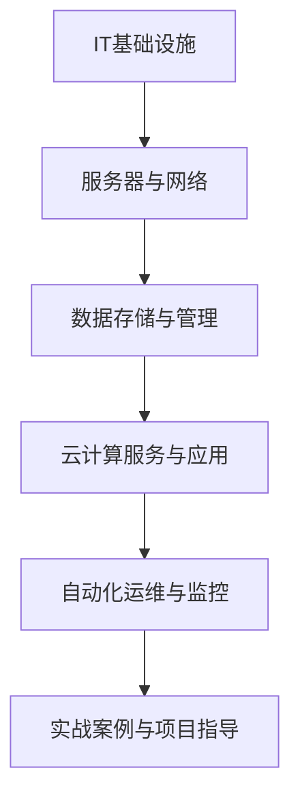
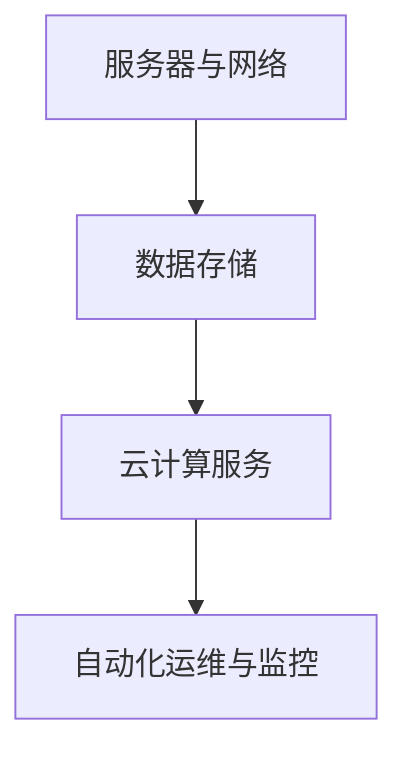

                 

### 文章标题

**《一人公司如何构建高效的IT基础设施》**

在当今快速变化的技术环境中，无论是小型创业公司还是个体经营者，构建一个高效且可靠的IT基础设施都至关重要。这不仅有助于提高业务效率，还能确保数据的安全性和系统的稳定性。对于一人公司来说，构建IT基础设施意味着需要以最小的资源投入实现最大的效益。本文将带领读者一步步了解并实现这一目标。

> **关键词：** IT基础设施、一人公司、云计算、自动化运维、高效性

> **摘要：** 本文将探讨一人公司在构建高效IT基础设施时所需考虑的关键因素，包括基础设施模型选择、服务器与网络配置、数据存储与管理、云计算服务应用、自动化运维等。通过一系列的实战案例和详细的技术解析，读者将能够掌握构建高效IT基础设施的实用技巧。

---

### 目录大纲

**《一人公司如何构建高效的IT基础设施》目录大纲**

**第一部分：理解IT基础设施**

**第1章：IT基础设施的基本概念**

- **1.1 IT基础设施的定义**
- **1.2 IT基础设施的重要性**
- **1.3 IT基础设施的主要组成部分**

**第2章：IT基础设施的发展历程**

- **2.1 从传统IT到云计算的转变**
- **2.2 云计算与IT基础设施的融合**
- **2.3 IT基础设施的未来发展趋势**

**第二部分：构建高效的IT基础设施**

**第3章：选择合适的IT基础设施模型**

- **3.1 传统的IT基础设施模型**
- **3.2 云基础设施模型**
- **3.3 微服务架构与容器化**
- **3.4 基础设施即代码（IaC）**

**第4章：服务器与网络配置**

- **4.1 服务器配置的最佳实践**
- **4.2 网络配置策略**
- **4.3 负载均衡与高可用性设计**
- **4.4 网络安全配置**

**第5章：数据存储与管理**

- **5.1 数据存储的类型**
- **5.2 数据库选择与配置**
- **5.3 数据备份与恢复**
- **5.4 数据仓库与大数据处理**

**第6章：云计算服务与应用**

- **6.1 云计算服务的种类**
- **6.2 如何在云上部署应用**
- **6.3 云服务的成本控制**
- **6.4 云原生技术与实践**

**第7章：自动化运维与监控**

- **7.1 自动化运维的基本概念**
- **7.2 常用的自动化运维工具**
- **7.3 监控系统的设计与实现**
- **7.4 事件响应与问题解决**

**第三部分：实战案例与项目指导**

**第8章：构建高效的IT基础设施实战案例**

- **8.1 案例一：小型电商网站的IT基础设施搭建**
- **8.2 案例二：远程办公环境的IT基础设施优化**
- **8.3 案例三：初创企业的IT基础设施设计**

**第9章：项目指导与实施**

- **9.1 项目管理的基本原则**
- **9.2 IT基础设施项目的规划与执行**
- **9.3 项目风险评估与应对策略**
- **9.4 项目总结与经验分享**

**附录**

**附录A：常用工具与资源**

- **A.1 常用IT基础设施工具**
- **A.2 云服务提供商介绍**
- **A.3 IT基础设施相关书籍与资料**

**附录B：Mermaid流程图**

- **B.1 Mermaid流程图基本语法**
- **B.2 一个IT基础设施架构的Mermaid流程图实例**

**附录C：伪代码与数学模型**

- **C.1 常用算法伪代码**
- **C.2 数据库数学模型举例**
- **C.3 分布式系统的CAP理论**

---

### 核心概念与联系

**Mermaid 流程图**



这个流程图展示了构建IT基础设施的各个关键组成部分及其相互关系。服务器与网络是基础设施的基石，数据存储与管理确保数据的安全性和可靠性，云计算服务与应用提供了灵活的计算能力，而自动化运维与监控则保证了系统的持续运行与优化。最后，实战案例与项目指导将帮助读者将这些概念应用于实际场景。

---

### 核心算法原理讲解

**服务器配置最佳实践（伪代码）**

```python
function configureServer(serverType, requiredResources) {
    if (serverType == "traditional") {
        allocateResources(serverType, requiredResources);
    } else if (serverType == "cloud") {
        useCloudProviderAPI(serverType, requiredResources);
    } else if (serverType == "containerized") {
        deployContainer(serverType, requiredResources);
    }
}

function allocateResources(serverType, requiredResources) {
    // Allocate traditional server resources
    // ...
}

function useCloudProviderAPI(serverType, requiredResources) {
    // Use cloud provider API to configure server
    // ...
}

function deployContainer(serverType, requiredResources) {
    // Deploy containerized server
    // ...
}
```

服务器配置的伪代码展示了根据服务器类型（传统、云、容器化）来分配资源的方法。这种灵活的配置方式能够满足不同场景的需求。

**数据库查询效率公式**

$$
E = \frac{C \cdot N \log(N + 1)}{T}
$$

其中，$E$ 是查询效率，$C$ 是查询条件数量，$N$ 是数据条数，$T$ 是时间限制。这个公式用于估算查询的效率，有助于优化数据库性能。

**分布式系统的CAP理论**

$$
\text{Consistency} + \text{Availability} \leq \text{Partition Tolerance}
$$

CAP理论表明，在一个分布式系统中，一致性（Consistency）、可用性（Availability）和分区容错性（Partition Tolerance）三者之间只能同时实现两项。这个理论为分布式系统设计提供了重要的指导原则。

---

### 项目实战

#### 电商网站IT基础设施搭建案例

##### 开发环境搭建

电商网站需要一个稳定且高效的IT基础设施来支持其业务运营。以下是一个典型的开发环境搭建步骤：

1. **选择云服务提供商**：例如阿里云或AWS，根据需求选择合适的服务套餐。
2. **创建虚拟私有云（VPC）**：在云上创建一个隔离的虚拟网络环境，确保数据安全。
3. **部署服务器和数据库**：使用云服务提供商的管理控制台或API部署服务器和数据库实例，配置网络和防火墙规则。
4. **配置负载均衡**：使用云服务提供的负载均衡器分配流量，提高网站的可用性和响应速度。

##### 源代码详细实现和代码解读

以下是一个使用Flask框架构建电商网站后端服务器的伪代码示例：

```python
# Flask应用架构
from flask import Flask
app = Flask(__name__)

# 商品管理路由
@app.route('/products')
def get_products():
    # 从数据库获取商品数据
    products = get_products_from_database()
    return products

# 用户管理路由
@app.route('/users')
def get_users():
    # 从数据库获取用户数据
    users = get_users_from_database()
    return users

# 订单管理路由
@app.route('/orders')
def get_orders():
    # 从数据库获取订单数据
    orders = get_orders_from_database()
    return orders

# 运行Flask应用
if __name__ == '__main__':
    app.run(host='0.0.0.0', port=80)
```

**代码解读与分析**

- Flask框架用于创建Web应用，通过定义不同的路由处理不同的请求。
- `get_products_from_database()`、`get_users_from_database()` 和 `get_orders_from_database()` 是伪代码，表示从数据库中获取数据的方法。
- `app.run()` 启动Flask应用，监听端口80，以供外部访问。

##### 实战步骤

1. **创建云账户和虚拟私有云（VPC）**：在云服务提供商的控制台中完成。
2. **部署服务器和数据库实例**：使用云服务提供的工具或API。
3. **配置负载均衡**：使用云服务提供的负载均衡服务。
4. **部署Flask应用**：将代码上传到服务器并配置相应的环境。

##### 项目总结与经验分享

- **云服务提供商的选择至关重要**：根据业务需求选择合适的服务套餐和工具。
- **负载均衡和高可用性设计**：确保网站在高流量下能够稳定运行。
- **自动化运维工具的使用**：提高部署和运维效率，减少人工干预。
- **经验教训**：每个项目都有其独特性，总结经验教训有助于未来项目的改进。

---

通过这个实战案例，读者可以了解如何在一人公司环境下搭建IT基础设施，并掌握相关技术实践和经验。

---

### 附录

**附录A：常用工具与资源**

- **A.1 常用IT基础设施工具**：
  - **Docker**：用于容器化部署。
  - **Kubernetes**：用于容器编排。
  - **Ansible**：用于自动化运维。
  - **Prometheus**：用于监控和告警。

- **A.2 云服务提供商介绍**：
  - **AWS**：提供广泛的云服务。
  - **阿里云**：在中国地区有强大的基础设施。
  - **Google Cloud Platform**：适合全球业务。

- **A.3 IT基础设施相关书籍与资料**：
  - **《云计算：概念、技术和实践》**：详细介绍了云计算的基础知识。
  - **《Docker实战》**：介绍了容器化部署的方法。
  - **《容器化与Kubernetes》**：深入探讨了容器编排技术。

**附录B：Mermaid流程图**

- **B.1 Mermaid流程图基本语法**：
  - `graph TD`：定义流程图。
  - `A[节点名称]`：添加节点。
  - `A --> B`：连接节点。

- **B.2 一个IT基础设施架构的Mermaid流程图实例**：



**附录C：伪代码与数学模型**

- **C.1 常用算法伪代码**：
  - `configureServer()`：配置服务器。
  - `allocateResources()`：分配资源。

- **C.2 数据库数学模型举例**：
  - `E = C \* N \* log(N + 1) / T`：查询效率公式。

- **C.3 分布式系统的CAP理论**：
  - `Consistency + Availability <= Partition Tolerance`：CAP理论公式。

---

通过这些附录，读者可以进一步加深对IT基础设施的理解，并找到更多实用的工具和资源。

---

### 结论

构建高效的IT基础设施对于一人公司而言既是挑战也是机遇。通过理解IT基础设施的基本概念、选择合适的模型、优化服务器和网络配置、管理数据存储、应用云计算服务、实现自动化运维与监控，一人公司可以在资源有限的情况下构建起一个稳定且可靠的IT环境。实战案例提供了具体的实现路径，而附录中的工具与资源则为实践提供了支持。

在技术快速发展的今天，保持持续学习和适应新技术是关键。一人公司需要不断创新，以应对市场变化和业务需求。通过本文的指导，读者应能够构建起一个高效的IT基础设施，为公司的长远发展打下坚实的基础。

---

**作者：AI天才研究院/AI Genius Institute & 禅与计算机程序设计艺术 /Zen And The Art of Computer Programming**

---

在这个快速变化的技术时代，构建高效的IT基础设施对于任何规模的公司都至关重要。一人公司也不例外，通过本文的深入探讨，我们希望能够为读者提供实用的指导，帮助他们在资源有限的情况下构建出高效、可靠的IT基础设施。继续关注我们的文章，我们将为您带来更多有关技术、管理和创新的精彩内容。谢谢您的阅读！

