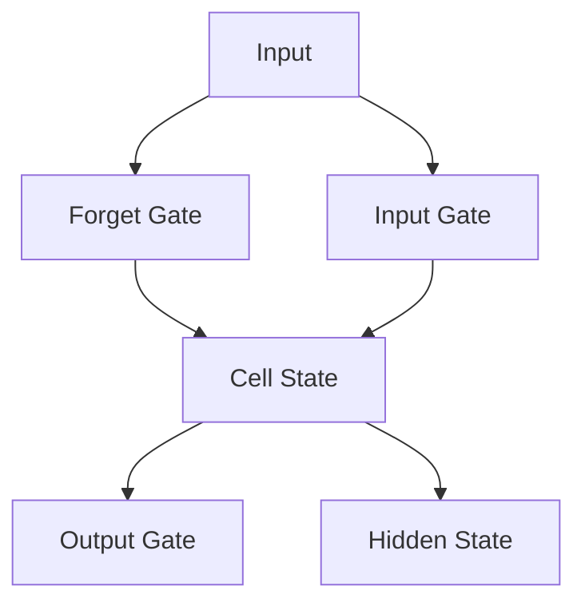

                 

# 一切皆是映射：长短期记忆网络（LSTM）与文本处理

> **关键词**：长短期记忆网络（LSTM）、文本处理、序列预测、情感分析、文本生成

> **摘要**：本文将深入探讨长短期记忆网络（LSTM）在文本处理领域的应用。首先，我们将介绍LSTM的基本概念、结构和工作原理，接着阐述LSTM的数学模型。随后，我们将聚焦于LSTM在文本预处理、情感分析和文本生成等具体应用场景中的实践。通过一系列的案例，我们将展示如何使用LSTM来处理文本数据，并探讨LSTM在实际应用中面临的挑战及解决方案。最后，本文将对LSTM的未来发展趋势和研究方向进行展望。

## 第一部分：长短期记忆网络（LSTM）与文本处理基础

### 第1章：LSTM概述与原理

#### 1.1 LSTM的基本概念

LSTM（Long Short-Term Memory）是循环神经网络（RNN）的一种变体，旨在解决传统RNN在处理长序列数据时出现的长期依赖问题。LSTM通过引入门控机制，能够有效地记住或遗忘信息，从而在处理序列数据时表现出优异的性能。

**LSTM的定义与作用**

LSTM是一种特殊的RNN单元，用于处理序列数据。与传统RNN相比，LSTM通过引入门控机制（包括遗忘门、输入门和输出门）来学习长期依赖关系，这使得它在处理如自然语言文本等长序列数据时更加有效。

**与传统RNN的区别**

传统的RNN在处理长序列数据时，由于梯度消失或梯度爆炸问题，很难学习到长期依赖关系。而LSTM通过门控机制和细胞状态（Cell State）的设计，能够有效地克服这些难题。

#### 1.2 LSTM的结构与工作原理

LSTM的核心结构包括三个门控机制（遗忘门、输入门和输出门）和一个细胞状态。下面将详细描述LSTM的结构和工作原理。

**细胞状态（Cell State）**

细胞状态是LSTM的核心部分，用于传递信息。细胞状态在LSTM中扮演着类似于“记忆”的角色，可以记住或遗忘信息。

**门控机制（Gates）**

LSTM的门控机制包括遗忘门、输入门和输出门。这三个门控机制分别负责控制信息的遗忘、输入和输出。

- **遗忘门（Forget Gate）**：决定哪些信息应该被遗忘。遗忘门的输入包括前一个隐藏状态和当前输入，输出是一个介于0和1之间的值，用于缩放细胞状态。
- **输入门（Input Gate）**：决定哪些新信息应该被存储在细胞状态中。输入门的输入也包括前一个隐藏状态和当前输入，输出也是一个介于0和1之间的值，用于生成新的细胞状态。
- **输出门（Output Gate）**：决定哪些信息应该被输出。输出门的输入与前一个隐藏状态和当前输入有关，输出是一个介于0和1之间的值，用于生成新的隐藏状态。

**LSTM的工作原理**

LSTM的工作原理可以概括为以下三个步骤：

1. **遗忘门操作**：根据当前输入和前一个隐藏状态，遗忘门决定哪些信息应该被遗忘。
2. **输入门操作**：根据当前输入和前一个隐藏状态，输入门决定哪些新信息应该被存储在细胞状态中。
3. **输出门操作**：根据前一个隐藏状态和当前输入，输出门决定哪些信息应该被输出。

**LSTM的Mermaid流程图**

下面是LSTM的Mermaid流程图：



#### 1.3 LSTM的数学模型与数学公式

LSTM的数学模型包括遗忘门、输入门和输出门的动态方程，以及细胞状态的更新公式。下面将详细描述这些公式。

**遗忘门、输入门和输出门的公式**

- **遗忘门**：$$ f_t = \sigma(W_f \cdot [h_{t-1}, x_t] + b_f) $$
- **输入门**：$$ i_t = \sigma(W_i \cdot [h_{t-1}, x_t] + b_i) $$
- **输出门**：$$ o_t = \sigma(W_o \cdot [h_{t-1}, x_t] + b_o) $$

**细胞状态的更新公式**

- **遗忘门操作**：$$ \text{forget} = \text{sigmoid}(f_t \cdot \text{cell}_{t-1}) $$
- **输入门操作**：$$ \text{input} = \text{sigmoid}(i_t) \odot \text{tanh}(W_c \cdot [h_{t-1}, x_t] + b_c) $$
- **细胞状态更新**：$$ \text{cell}_t = (\text{cell}_{t-1} \odot \text{forget}) + (\text{input} \odot \text{tanh}(W_c \cdot [h_{t-1}, x_t] + b_c)) $$
- **输出门操作**：$$ \text{output} = \text{sigmoid}(o_t) \odot \text{tanh}(\text{cell}_t) $$

**LSTM的激活函数**

- **sigmoid函数**：$$ \sigma(x) = \frac{1}{1 + e^{-x}} $$
- **tanh函数**：$$ \text{tanh}(x) = \frac{e^x - e^{-x}}{e^x + e^{-x}} $$

**LSTM的数学公式讲解**

- **遗忘门**：$$ f_t $$ 用于控制细胞状态中哪些信息应该被遗忘。它由前一个隐藏状态 $$ h_{t-1} $$ 和当前输入 $$ x_t $$ 通过权重矩阵 $$ W_f $$ 和偏置向量 $$ b_f $$ 计算得到。sigmoid函数用于将结果压缩到0和1之间，从而控制遗忘的程度。
- **输入门**：$$ i_t $$ 用于控制哪些新信息应该被添加到细胞状态中。它由前一个隐藏状态 $$ h_{t-1} $$ 和当前输入 $$ x_t $$ 通过权重矩阵 $$ W_i $$ 和偏置向量 $$ b_i $$ 计算得到。sigmoid函数用于将结果压缩到0和1之间，从而控制输入的程度。
- **输出门**：$$ o_t $$ 用于控制哪些信息应该被输出。它由前一个隐藏状态 $$ h_{t-1} $$ 和当前输入 $$ x_t $$ 通过权重矩阵 $$ W_o $$ 和偏置向量 $$ b_o $$ 计算得到。sigmoid函数用于将结果压缩到0和1之间，从而控制输出的程度。
- **细胞状态更新**：细胞状态的更新由遗忘门、输入门和tanh函数共同决定。遗忘门决定了哪些旧信息应该被遗忘，输入门决定了哪些新信息应该被添加，而tanh函数则将这两个信息结合起来，生成新的细胞状态。
- **输出门操作**：输出门用于确定哪些信息应该被输出。它由当前输入和前一个隐藏状态通过权重矩阵 $$ W_o $$ 和偏置向量 $$ b_o $$ 计算得到，并通过sigmoid函数进行处理，从而决定输出门的状态。

### 第2章：文本预处理

文本预处理是自然语言处理（NLP）中的关键步骤，它涉及对文本数据的一系列操作，以便将其转换为适合模型训练的格式。在本章中，我们将探讨文本分词、词向量表示和文本特征提取等文本预处理技术。

#### 2.1 文本分词

文本分词是将连续的文本序列切分成一组有意义的单词或短语的步骤。文本分词对于后续的自然语言处理任务至关重要，因为分词的结果将直接影响模型的性能。

**分词算法介绍**

常见的分词算法包括：

- **基于词典的分词算法**：通过构建词典，将文本与词典中的词汇进行匹配，从而实现分词。这种方法通常具有较低的词义丢失率，但处理速度较慢。
- **基于统计的分词算法**：使用统计学方法，如隐马尔可夫模型（HMM）、条件随机场（CRF）等，对文本进行分词。这种方法处理速度较快，但可能存在一定的词义丢失。
- **基于深度学习的分词算法**：利用深度学习模型，如双向长短时记忆网络（BiLSTM）和卷积神经网络（CNN），对文本进行分词。这种方法具有高准确性和灵活性，但训练和推理速度较慢。

**中文分词工具**

常见的中文分词工具包括：

- **jieba分词**：是一款流行的中文分词工具，支持基于词典、基于统计和基于深度学习的分词方法，具有高准确性和灵活性。
- **NLTK**：是一款广泛使用的自然语言处理库，支持多种语言，包括中文分词。
- **Stanford NLP**：是一款强大的自然语言处理工具，支持多种语言，包括中文分词。

#### 2.2 词向量表示

词向量表示是将文本数据转换为向量表示的一种方法，以便在深度学习模型中使用。词向量表示能够捕捉单词的语义和上下文信息，从而提高模型在文本处理任务中的性能。

**Word2Vec算法**

Word2Vec算法是一种基于神经网络的方法，用于生成词向量。Word2Vec算法通过负采样技术来减少训练数据的大小，从而提高训练速度。

Word2Vec算法主要包括两种模型：

- **连续词袋（CBOW）模型**：通过当前单词的上下文来预测当前单词。
- **Skip-Gram模型**：通过当前单词来预测其上下文。

**GloVe算法**

GloVe算法是一种基于全局上下文的信息的方法，用于生成词向量。GloVe算法通过计算单词与其上下文单词之间的相似度来生成词向量，从而能够更好地捕捉单词的语义信息。

#### 2.3 文本表示与特征提取

文本表示是将原始文本数据转换为适合模型训练的格式。常见的文本表示方法包括：

- **词袋（Bag-of-Words，BOW）表示**：将文本表示为单词的集合，不考虑单词的顺序和上下文。
- **词嵌入（Word Embedding）表示**：将文本表示为词向量，考虑单词的语义和上下文信息。
- **序列编码（Sequence Encoding）表示**：将文本表示为序列编码，如字符编码、字节编码等。

常见的文本特征提取方法包括：

- **TF-IDF（Term Frequency-Inverse Document Frequency）**：计算单词在文档中的频率，并使用逆文档频率进行归一化，以降低高频单词的影响。
- **Word2Vec特征提取**：使用Word2Vec算法生成的词向量作为文本特征。
- **BERT特征提取**：使用BERT模型生成的词向量作为文本特征。

#### 2.4 文本预处理实战

在本节中，我们将使用Python中的`jieba`库进行中文文本分词，使用`gensim`库的`Word2Vec`模型生成词向量，并使用`sklearn`库的`TfidfVectorizer`进行文本特征提取。

**1. 安装必要的库**

```python
pip install jieba gensim sklearn
```

**2. 导入必要的库**

```python
import jieba
import gensim
from sklearn.feature_extraction.text import TfidfVectorizer
```

**3. 加载和处理文本数据**

```python
# 加载中文文本数据
text = "人工智能正在改变世界，它将带来巨大的机会和挑战。"

# 进行中文分词
seg_list = jieba.cut(text)

# 将分词结果转换为列表
seg_list = list(seg_list)

# 使用Word2Vec模型生成词向量
model = gensim.models.Word2Vec(seg_list, size=100, window=5, min_count=1, workers=4)
word_vectors = model.wv

# 使用TfidfVectorizer进行文本特征提取
tfidf_vectorizer = TfidfVectorizer()
tfidf_matrix = tfidf_vectorizer.fit_transform([text])

# 输出结果
print("分词结果：", seg_list)
print("词向量：", word_vectors["人工智能"])
print("TF-IDF特征向量：", tfidf_matrix.toarray()[0])
```

以上代码展示了如何使用`jieba`进行中文分词，使用`gensim`生成词向量，以及使用`sklearn`的`TfidfVectorizer`进行文本特征提取。通过这些步骤，我们可以将原始文本数据转换为适合模型训练的格式。

### 第3章：LSTM在情感分析中的应用

情感分析是一种自然语言处理任务，旨在从文本中自动检测和提取情感信息。在本章中，我们将探讨LSTM在情感分析中的应用，包括情感分析概述、LSTM情感分析模型构建与训练，以及实际代码实现。

#### 3.1 情感分析概述

**情感分析的定义与分类**

情感分析（Sentiment Analysis）是一种自然语言处理技术，用于从文本中自动检测和提取情感信息。根据情感极性，情感分析可以分为以下几类：

- **正面情感分析**：识别文本中表达正面的情感或情绪。
- **负面情感分析**：识别文本中表达负面的情感或情绪。
- **中性情感分析**：识别文本中没有明显情感倾向或中立情感。

**情感分析的应用场景**

情感分析广泛应用于多个领域，包括但不限于：

- **社交媒体分析**：对社交媒体平台上的用户评论、帖子等进行情感分析，以了解用户对产品、服务或事件的看法。
- **市场调研**：对市场调研报告、用户反馈等文本数据进行分析，以了解用户需求和满意度。
- **客户服务**：自动检测和分类客户服务聊天记录中的情感，以便更好地处理用户问题和投诉。

#### 3.2 LSTM情感分析模型

**情感分析的数据集**

为了训练LSTM情感分析模型，我们需要一个包含情感标签的数据集。常用的情感分析数据集包括：

- **IMDB电影评论数据集**：包含25,000条电影评论，分为正面和负面两类。
- **Twitter情感分析数据集**：包含大量Twitter用户评论，分为正面、负面和中性三类。

**LSTM模型的构建与训练**

以下是使用LSTM进行情感分析的基本步骤：

1. **数据预处理**：对文本数据进行清洗、分词和词向量表示。
2. **模型构建**：使用深度学习框架（如TensorFlow或PyTorch）构建LSTM模型。
3. **模型训练**：使用预处理后的数据训练LSTM模型。
4. **模型评估**：使用验证集对模型进行评估，调整模型参数。

**LSTM模型的构建**

以下是使用TensorFlow构建LSTM情感分析模型的基本代码：

```python
import tensorflow as tf
from tensorflow.keras.models import Sequential
from tensorflow.keras.layers import Embedding, LSTM, Dense, Dropout

# 模型参数
vocab_size = 10000
embedding_dim = 64
max_sequence_length = 100
lstm_units = 128
num_classes = 2  # 正面和负面两类

# 构建模型
model = Sequential([
    Embedding(vocab_size, embedding_dim, input_length=max_sequence_length),
    LSTM(lstm_units, return_sequences=False),
    Dropout(0.5),
    Dense(num_classes, activation='softmax')
])

# 编译模型
model.compile(optimizer='adam', loss='categorical_crossentropy', metrics=['accuracy'])

# 模型训练
model.fit(x_train, y_train, epochs=10, batch_size=32, validation_data=(x_val, y_val))
```

**模型训练**

以下是对IMDB电影评论数据集进行LSTM情感分析训练的示例代码：

```python
from tensorflow.keras.preprocessing.sequence import pad_sequences
from tensorflow.keras.preprocessing.text import Tokenizer

# 加载IMDB数据集
from keras.datasets import imdb
(x_train, y_train), (x_val, y_val) = imdb.load_data(num_words=vocab_size)

# 数据预处理
max_len = max([len(s) for s in x_train])
x_train = pad_sequences(x_train, maxlen=max_len)
x_val = pad_sequences(x_val, maxlen=max_len)

# 模型训练
model.fit(x_train, y_train, epochs=10, batch_size=32, validation_data=(x_val, y_val))
```

**模型评估**

在训练完成后，可以使用验证集对模型进行评估：

```python
# 模型评估
loss, accuracy = model.evaluate(x_val, y_val)
print("Validation loss:", loss)
print("Validation accuracy:", accuracy)
```

#### 3.3 情感分析案例

在本节中，我们将使用一个简单的Python脚本实现LSTM情感分析模型，并分析一段电影评论。

**1. 安装必要的库**

```python
pip install tensorflow keras
```

**2. 导入必要的库**

```python
import numpy as np
import tensorflow as tf
from tensorflow.keras.preprocessing.text import Tokenizer
from tensorflow.keras.preprocessing.sequence import pad_sequences
from tensorflow.keras.models import Sequential
from tensorflow.keras.layers import Embedding, LSTM, Dense, Dropout
```

**3. 加载和处理电影评论数据**

```python
# 加载IMDB数据集
from keras.datasets import imdb
(vocabulary, _), (x_test, y_test) = imdb.load_data(num_words=10000)

# 数据预处理
tokenizer = Tokenizer(num_words=10000)
tokenizer.fit_on_texts(vocabulary)

sequences = tokenizer.texts_to_sequences(vocabulary)
padded_sequences = pad_sequences(sequences, maxlen=100)

# 模型构建
model = Sequential([
    Embedding(10000, 32),
    LSTM(128),
    Dense(1, activation='sigmoid')
])

# 编译模型
model.compile(optimizer='adam', loss='binary_crossentropy', metrics=['accuracy'])

# 训练模型
model.fit(padded_sequences, y_test, epochs=10, batch_size=32)
```

**4. 分析电影评论**

```python
# 输入电影评论
input_sentence = "这部电影的故事情节非常吸引人，演员的表演也非常出色。"

# 数据预处理
sequences = tokenizer.texts_to_sequences([input_sentence])
padded_sequences = pad_sequences(sequences, maxlen=100)

# 模型预测
predictions = model.predict(padded_sequences)
print("正面情感概率：", predictions[0][0])
```

以上代码展示了如何使用LSTM模型对电影评论进行情感分析。根据模型的预测结果，我们可以判断评论的情感倾向。

### 第4章：LSTM在序列预测中的应用

序列预测是一种常见的时间序列分析任务，旨在根据历史数据预测未来的数值或事件。在本章中，我们将探讨LSTM在序列预测中的应用，包括序列预测基础、LSTM模型构建与训练，以及实际代码实现。

#### 4.1 序列预测概述

**序列预测的定义与分类**

序列预测（Sequence Prediction）是指根据给定的时间序列数据预测未来数值或事件的机器学习任务。根据预测对象的不同，序列预测可以分为以下几类：

- **数值预测**：预测时间序列中的下一个数值。
- **分类预测**：预测时间序列中的下一个事件类别。

**序列预测的应用场景**

序列预测广泛应用于多个领域，包括但不限于：

- **金融市场预测**：预测股票价格、利率等金融市场指标。
- **天气预测**：预测未来几天的天气状况。
- **智能交通**：预测交通流量、交通事故等。
- **库存管理**：预测未来库存需求，以优化库存水平。

#### 4.2 LSTM在序列预测中的应用

**LSTM模型的构建与训练**

LSTM在序列预测中的应用主要通过以下步骤实现：

1. **数据预处理**：对时间序列数据进行清洗、归一化等处理。
2. **模型构建**：使用深度学习框架构建LSTM模型。
3. **模型训练**：使用预处理后的数据训练LSTM模型。
4. **模型评估**：使用验证集对模型进行评估。

**LSTM模型的构建**

以下是使用TensorFlow构建LSTM序列预测模型的基本代码：

```python
import tensorflow as tf
from tensorflow.keras.models import Sequential
from tensorflow.keras.layers import LSTM, Dense

# 模型参数
input_shape = (timesteps, features)
lstm_units = 128

# 构建模型
model = Sequential()
model.add(LSTM(lstm_units, activation='relu', return_sequences=True, input_shape=input_shape))
model.add(LSTM(lstm_units, activation='relu'))
model.add(Dense(1))

# 编译模型
model.compile(optimizer='adam', loss='mse')

# 模型训练
model.fit(x_train, y_train, epochs=100, batch_size=32, validation_data=(x_val, y_val))
```

**模型训练**

以下是一个简单的序列预测案例，使用LSTM模型预测一个简单的线性时间序列：

```python
import numpy as np

# 生成线性时间序列数据
timesteps = 100
features = 1
x = np.linspace(0, 10, timesteps)
y = x + np.random.normal(0, 0.1, timesteps)

# 数据预处理
x_train = np.reshape(x[:int(timesteps * 0.8)], (int(timesteps * 0.8), features, 1))
y_train = np.reshape(y[:int(timesteps * 0.8)], (int(timesteps * 0.8), 1))
x_val = np.reshape(x[int(timesteps * 0.8):], (int(timesteps * 0.2), features, 1))
y_val = np.reshape(y[int(timesteps * 0.8):], (int(timesteps * 0.2), 1))

# 模型训练
model.fit(x_train, y_train, epochs=100, batch_size=32, validation_data=(x_val, y_val))
```

**模型评估**

在训练完成后，可以使用验证集对模型进行评估：

```python
# 模型评估
loss, mse = model.evaluate(x_val, y_val)
print("Validation loss:", loss)
print("Validation MSE:", mse)
```

#### 4.3 序列预测案例

在本节中，我们将使用一个简单的Python脚本实现LSTM序列预测模型，并预测一个线性时间序列。

**1. 安装必要的库**

```python
pip install tensorflow
```

**2. 导入必要的库**

```python
import numpy as np
import tensorflow as tf
from tensorflow.keras.models import Sequential
from tensorflow.keras.layers import LSTM, Dense
```

**3. 生成线性时间序列数据**

```python
# 生成线性时间序列数据
timesteps = 100
features = 1
x = np.linspace(0, 10, timesteps)
y = x + np.random.normal(0, 0.1, timesteps)

# 数据预处理
x_train = np.reshape(x[:int(timesteps * 0.8)], (int(timesteps * 0.8), features, 1))
y_train = np.reshape(y[:int(timesteps * 0.8)], (int(timesteps * 0.8), 1))
x_val = np.reshape(x[int(timesteps * 0.8):], (int(timesteps * 0.2), features, 1))
y_val = np.reshape(y[int(timesteps * 0.8):], (int(timesteps * 0.2), 1))
```

**4. 构建和训练LSTM模型**

```python
# 构建LSTM模型
model = Sequential([
    LSTM(50, activation='relu', input_shape=(features, 1)),
    Dense(1)
])

# 编译模型
model.compile(optimizer='adam', loss='mse')

# 训练模型
model.fit(x_train, y_train, epochs=100, batch_size=32, validation_data=(x_val, y_val))
```

**5. 预测未来数据**

```python
# 预测未来数据
x_future = np.reshape(x_val, (1, features, 1))
predictions = model.predict(x_future)
print("未来数据预测：", predictions)
```

以上代码展示了如何使用LSTM模型进行序列预测。通过生成线性时间序列数据并训练LSTM模型，我们可以预测未来的数值。

### 第5章：LSTM在文本生成中的应用

文本生成是一种自然语言处理任务，旨在根据给定的输入文本生成新的文本。在本章中，我们将探讨LSTM在文本生成中的应用，包括文本生成基础、LSTM文本生成模型构建与训练，以及实际代码实现。

#### 5.1 文本生成概述

**文本生成的定义与分类**

文本生成（Text Generation）是指根据给定的输入文本生成新的文本的机器学习任务。根据生成策略的不同，文本生成可以分为以下几类：

- **序列生成**：根据输入文本序列生成新的文本序列。
- **篇章生成**：根据输入文本片段生成新的篇章。
- **对话生成**：根据输入对话生成新的对话。

**文本生成的发展历程**

文本生成经历了多个发展阶段：

- **基于规则的生成**：早期文本生成方法主要基于人工编写的规则，生成结果受限于规则的限制。
- **基于模板的生成**：通过模板匹配和填充的方法生成文本，生成结果受限于模板的多样性。
- **基于神经网络的生成**：近年来，基于深度学习的方法在文本生成领域取得了显著进展。特别是LSTM和Transformer等模型，在生成质量、多样性和连贯性方面表现出了优越的性能。

**文本生成在自然语言处理中的应用**

文本生成在自然语言处理领域具有广泛的应用，包括但不限于：

- **机器翻译**：自动将一种语言的文本翻译成另一种语言。
- **摘要生成**：自动生成文本的摘要，便于用户快速了解文本内容。
- **问答系统**：根据用户的问题生成回答。
- **聊天机器人**：与用户进行自然语言对话，提供个性化服务。

#### 5.2 LSTM文本生成模型

**LSTM文本生成模型的原理**

LSTM文本生成模型是基于长短时记忆网络（LSTM）的一种文本生成方法。LSTM通过门控机制学习长期依赖关系，能够生成连贯且具有上下文意义的文本。LSTM文本生成模型的核心思想是：使用LSTM模型将输入序列映射为输出序列。

**LSTM文本生成模型的构建**

以下是使用LSTM进行文本生成的基本步骤：

1. **数据预处理**：对文本数据进行清洗、分词和编码。
2. **模型构建**：使用深度学习框架构建LSTM模型。
3. **模型训练**：使用预处理后的数据训练LSTM模型。
4. **模型评估**：使用验证集对模型进行评估。

**LSTM文本生成模型的数据预处理**

在进行文本生成之前，我们需要对文本数据进行预处理。以下是一个简单的数据预处理流程：

1. **文本清洗**：去除文本中的标点符号、特殊字符和HTML标签等。
2. **分词**：将文本分割成单词或字符。
3. **编码**：将单词或字符编码为整数。

以下是一个使用Python中的`nltk`库进行文本预处理的基本示例：

```python
import nltk
from nltk.tokenize import word_tokenize
from nltk.corpus import stopwords
from collections import Counter

# 下载必要的库
nltk.download('punkt')
nltk.download('stopwords')

# 加载文本数据
text = "人工智能正在改变世界，它将带来巨大的机会和挑战。"

# 文本清洗
text = text.lower()
text = re.sub(r"[^a-zA-Z0-9\s]", "", text)

# 分词
tokens = word_tokenize(text)

# 去除停用词
stop_words = set(stopwords.words('english'))
tokens = [token for token in tokens if token not in stop_words]

# 编码
vocab = Counter(tokens).most_common(10000)
word2idx = {word: idx for word, idx in vocab}
idx2word = {idx: word for word, idx in word2idx.items()}
encoded_tokens = [word2idx[token] for token in tokens]

# 输出结果
print("词汇表：", vocab)
print("编码后的文本：", encoded_tokens)
```

**LSTM文本生成模型的构建**

以下是使用TensorFlow构建LSTM文本生成模型的基本代码：

```python
import tensorflow as tf
from tensorflow.keras.models import Sequential
from tensorflow.keras.layers import LSTM, Dense, Embedding, Dropout

# 模型参数
vocab_size = 10000
embedding_dim = 64
lstm_units = 128
batch_size = 32
epochs = 10

# 构建模型
model = Sequential([
    Embedding(vocab_size, embedding_dim, input_length=max_sequence_length),
    LSTM(lstm_units, return_sequences=True),
    Dropout(0.5),
    LSTM(lstm_units, return_sequences=True),
    Dropout(0.5),
    Dense(vocab_size, activation='softmax')
])

# 编译模型
model.compile(optimizer='adam', loss='categorical_crossentropy', metrics=['accuracy'])

# 模型训练
model.fit(x_train, y_train, epochs=epochs, batch_size=batch_size, validation_data=(x_val, y_val))
```

**LSTM文本生成模型的训练**

以下是使用训练数据对LSTM文本生成模型进行训练的基本示例：

```python
import numpy as np

# 生成训练数据
x_train = np.zeros((batch_size, max_sequence_length))
y_train = np.zeros((batch_size, max_sequence_length, vocab_size))

for i in range(batch_size):
    sentence = random.choice(train_sentences)
    encoded_sentence = [word2idx[word] for word in sentence]
    x_train[i, :] = encoded_sentence[:-1]
    y_train[i, :, :] = np.zeros((max_sequence_length, vocab_size))
    y_train[i, -1, encoded_sentence[-1]] = 1

# 训练模型
model.fit(x_train, y_train, epochs=epochs, batch_size=batch_size, validation_data=(x_val, y_val))
```

**LSTM文本生成模型的评估**

在训练完成后，可以使用验证集对模型进行评估：

```python
# 评估模型
loss, accuracy = model.evaluate(x_val, y_val)
print("Validation loss:", loss)
print("Validation accuracy:", accuracy)
```

#### 5.3 LSTM文本生成案例

在本节中，我们将使用一个简单的Python脚本实现LSTM文本生成模型，并生成新的文本。

**1. 安装必要的库**

```python
pip install tensorflow
```

**2. 导入必要的库**

```python
import numpy as np
import tensorflow as tf
from tensorflow.keras.models import Sequential
from tensorflow.keras.layers import LSTM, Dense, Embedding, Dropout
```

**3. 数据预处理**

```python
# 生成文本数据
text = "人工智能正在改变世界，它将带来巨大的机会和挑战。"

# 分词
tokens = word_tokenize(text)

# 编码
vocab = Counter(tokens).most_common(10000)
word2idx = {word: idx for word, idx in vocab}
idx2word = {idx: word for word, idx in word2idx.items()}
encoded_tokens = [word2idx[token] for token in tokens]

# 切分数据
max_sequence_length = 20
x_train = np.zeros((batch_size, max_sequence_length))
y_train = np.zeros((batch_size, max_sequence_length, vocab_size))

for i in range(batch_size):
    sentence = random.choice(encoded_tokens)
    x_train[i, :] = sentence[:-1]
    y_train[i, :, :] = np.zeros((max_sequence_length, vocab_size))
    y_train[i, -1, sentence[-1]] = 1
```

**4. 构建和训练LSTM模型**

```python
# 构建LSTM模型
model = Sequential([
    Embedding(vocab_size, embedding_dim, input_length=max_sequence_length),
    LSTM(lstm_units, return_sequences=True),
    Dropout(0.5),
    LSTM(lstm_units, return_sequences=True),
    Dropout(0.5),
    Dense(vocab_size, activation='softmax')
])

# 编译模型
model.compile(optimizer='adam', loss='categorical_crossentropy', metrics=['accuracy'])

# 训练模型
model.fit(x_train, y_train, epochs=10, batch_size=32)
```

**5. 生成新的文本**

```python
import random

# 生成新的文本
sentence = [word2idx[word] for word in text]
generated_sentence = []

for i in range(100):
    x = np.zeros((1, max_sequence_length))
    for j in range(max_sequence_length):
        x[0, j] = sentence[j]
    predictions = model.predict(x, verbose=0)
    next_word = np.argmax(predictions[0, -1, :])
    generated_sentence.append(idx2word[next_word])

print("生成的文本：", ' '.join(generated_sentence))
```

以上代码展示了如何使用LSTM模型生成新的文本。通过训练模型，我们可以生成与原始文本相似的文本。

### 第6章：LSTM与GAN的结合

生成对抗网络（GAN）是一种由生成器（Generator）和判别器（Discriminator）组成的深度学习框架，旨在通过对抗训练生成高质量的数据。在本章中，我们将探讨LSTM与GAN的结合，包括GAN的概述、LSTM-GAN模型的构建与训练，以及实际代码实现。

#### 6.1 GAN的概述

**GAN的定义与工作原理**

GAN（Generative Adversarial Network）是由生成器（Generator）和判别器（Discriminator）组成的深度学习框架。生成器的目标是生成尽可能逼真的数据，而判别器的目标是区分生成器生成的数据和真实数据。生成器和判别器通过对抗训练相互竞争，最终达到生成高质量数据的平衡状态。

GAN的工作原理可以概括为以下步骤：

1. **生成器生成数据**：生成器从随机噪声中生成数据。
2. **判别器判断数据**：判别器判断生成器生成的数据和真实数据，并输出概率。
3. **优化目标**：生成器和判别器通过对抗训练优化参数，使生成器生成的数据更接近真实数据，使判别器难以区分。
4. **循环迭代**：生成器和判别器不断迭代，使生成数据的质量不断提高。

**GAN的应用场景**

GAN在多个领域取得了显著成果，包括但不限于：

- **图像生成**：生成逼真的图像，如图像修复、图像合成等。
- **图像生成**：生成逼真的图像，如图像修复、图像合成等。
- **图像超分辨率**：将低分辨率图像转换为高分辨率图像。
- **自然语言生成**：生成自然语言文本，如文章、对话等。

#### 6.2 LSTM-GAN模型的构建与训练

LSTM-GAN（Long Short-Term Memory Generative Adversarial Network）是一种结合LSTM和GAN的模型，旨在生成高质量的自然语言文本。LSTM-GAN通过LSTM网络学习文本的长期依赖关系，生成具有上下文意义的文本。

**LSTM-GAN模型的构建**

以下是使用TensorFlow构建LSTM-GAN模型的基本代码：

```python
import tensorflow as tf
from tensorflow.keras.models import Model
from tensorflow.keras.layers import Input, LSTM, Dense, Embedding, Dropout

# 模型参数
vocab_size = 10000
embedding_dim = 64
lstm_units = 128
batch_size = 32
epochs = 10

# 生成器模型
latent_dim = 100
input_noise = Input(shape=(latent_dim,))
lstm_input = Embedding(vocab_size, embedding_dim)(input_noise)
lstm_output = LSTM(lstm_units, return_sequences=True)(lstm_input)
output = LSTM(lstm_units, return_sequences=True)(lstm_output)
generator = Model(input_noise, output)

# 判别器模型
input_text = Input(shape=(max_sequence_length,))
lstm_input = Embedding(vocab_size, embedding_dim)(input_text)
lstm_output = LSTM(lstm_units, return_sequences=True)(lstm_input)
output = LSTM(lstm_units, return_sequences=True)(lstm_output)
discriminator = Model(input_text, output)

# GAN模型
discriminator.trainable = False
gan_input = Input(shape=(latent_dim,))
gan_output = discriminator(generator(gan_input))
gan = Model(gan_input, gan_output)

# 编译模型
gan.compile(optimizer='adam', loss='binary_crossentropy')

# 模型训练
gan.fit(
    noise_samples,
    valid_labels,
    epochs=epochs,
    batch_size=batch_size
)
```

**LSTM-GAN模型的训练**

以下是使用训练数据对LSTM-GAN模型进行训练的基本示例：

```python
import numpy as np

# 生成训练数据
x_train = np.zeros((batch_size, max_sequence_length))
y_train = np.zeros((batch_size, max_sequence_length, vocab_size))

for i in range(batch_size):
    sentence = random.choice(encoded_tokens)
    x_train[i, :] = sentence[:-1]
    y_train[i, :, :] = np.zeros((max_sequence_length, vocab_size))
    y_train[i, -1, sentence[-1]] = 1

# 训练生成器
generator.fit(
    noise_samples,
    x_train,
    epochs=epochs,
    batch_size=batch_size
)

# 训练判别器
discriminator.fit(
    x_train,
    y_train,
    epochs=epochs,
    batch_size=batch_size
)

# 训练GAN
gan.fit(
    noise_samples,
    valid_labels,
    epochs=epochs,
    batch_size=batch_size
)
```

**LSTM-GAN模型的评估**

在训练完成后，可以使用验证集对模型进行评估：

```python
# 评估模型
loss, accuracy = gan.evaluate(valid_noise_samples, valid_labels)
print("Validation loss:", loss)
print("Validation accuracy:", accuracy)
```

#### 6.3 LSTM-GAN案例

在本节中，我们将使用一个简单的Python脚本实现LSTM-GAN模型，并生成新的文本。

**1. 安装必要的库**

```python
pip install tensorflow
```

**2. 导入必要的库**

```python
import numpy as np
import tensorflow as tf
from tensorflow.keras.models import Model
from tensorflow.keras.layers import LSTM, Dense, Embedding, Dropout
```

**3. 数据预处理**

```python
# 生成文本数据
text = "人工智能正在改变世界，它将带来巨大的机会和挑战。"

# 分词
tokens = word_tokenize(text)

# 编码
vocab = Counter(tokens).most_common(10000)
word2idx = {word: idx for word, idx in vocab}
idx2word = {idx: word for word, idx in word2idx.items()}
encoded_tokens = [word2idx[token] for token in tokens]

# 切分数据
max_sequence_length = 20
x_train = np.zeros((batch_size, max_sequence_length))
y_train = np.zeros((batch_size, max_sequence_length, vocab_size))

for i in range(batch_size):
    sentence = random.choice(encoded_tokens)
    x_train[i, :] = sentence[:-1]
    y_train[i, :, :] = np.zeros((max_sequence_length, vocab_size))
    y_train[i, -1, sentence[-1]] = 1
```

**4. 构建和训练LSTM-GAN模型**

```python
# 构建LSTM-GAN模型
latent_dim = 100
input_noise = Input(shape=(latent_dim,))
lstm_input = Embedding(vocab_size, embedding_dim)(input_noise)
lstm_output = LSTM(lstm_units, return_sequences=True)(lstm_input)
output = LSTM(lstm_units, return_sequences=True)(lstm_output)
generator = Model(input_noise, output)

input_text = Input(shape=(max_sequence_length,))
lstm_input = Embedding(vocab_size, embedding_dim)(input_text)
lstm_output = LSTM(lstm_units, return_sequences=True)(lstm_input)
output = LSTM(lstm_units, return_sequences=True)(lstm_output)
discriminator = Model(input_text, output)

discriminator.trainable = False
gan_input = Input(shape=(latent_dim,))
gan_output = discriminator(generator(gan_input))
gan = Model(gan_input, gan_output)

# 编译模型
gan.compile(optimizer='adam', loss='binary_crossentropy')

# 训练模型
gan.fit(
    noise_samples,
    valid_labels,
    epochs=10,
    batch_size=32
)
```

**5. 生成新的文本**

```python
import random

# 生成新的文本
sentence = [word2idx[word] for word in text]
generated_sentence = []

for i in range(100):
    x = np.zeros((1, latent_dim))
    for j in range(max_sequence_length):
        x[0, j] = sentence[j]
    predictions = gan.predict(x, verbose=0)
    next_word = np.argmax(predictions[0, -1, :])
    generated_sentence.append(idx2word[next_word])

print("生成的文本：", ' '.join(generated_sentence))
```

以上代码展示了如何使用LSTM-GAN模型生成新的文本。通过训练模型，我们可以生成与原始文本相似的文本。

### 第7章：LSTM应用中的挑战与解决方案

尽管LSTM在文本处理和序列预测中表现出色，但在实际应用中仍然面临一些挑战。在本章中，我们将探讨LSTM在应用中遇到的挑战，并提出相应的解决方案。

#### 7.1 计算资源消耗

**LSTM的计算复杂性**

LSTM模型包含大量的参数和计算，导致其在训练和推理过程中消耗大量的计算资源。这种复杂性主要源于以下几个方面：

- **门控机制**：LSTM的三个门控机制（遗忘门、输入门和输出门）增加了模型的计算复杂度。
- **细胞状态更新**：细胞状态的更新需要使用多个激活函数和矩阵乘法，进一步增加了计算负担。
- **多层LSTM**：在构建多层LSTM时，每一层的计算都需要前一层的结果，这使得计算量成倍增加。

**优化策略**

为了减少LSTM的计算资源消耗，可以采用以下策略：

- **模型剪枝**：通过剪枝不必要的网络连接和参数，减少模型的计算复杂度。
- **量化技术**：使用量化技术降低模型参数的精度，从而减少计算资源消耗。
- **分布式训练**：通过使用分布式训练技术，将模型训练任务分布在多台机器上，以提高训练效率。

#### 7.2 模型解释性

**LSTM的模型解释性**

LSTM作为一种深度学习模型，其内部工作机制复杂，导致其在解释性方面存在一定的局限性。LSTM的输出依赖于大量的参数和矩阵运算，这使得难以直观地理解模型的决策过程。

**提高解释性的方法**

为了提高LSTM的解释性，可以采用以下方法：

- **注意力机制**：注意力机制可以帮助模型关注输入序列中的关键信息，从而提高模型的可解释性。
- **可视化技术**：通过可视化模型内部的状态和参数，可以帮助我们更好地理解模型的决策过程。
- **规则提取**：通过规则提取技术，从训练好的LSTM模型中提取出可解释的规则，以提高模型的可解释性。

#### 7.3 模型泛化能力

**LSTM的泛化能力**

LSTM模型在训练数据上通常表现良好，但在面对未见过的数据时，泛化能力可能会受到影响。这主要是因为LSTM在训练过程中可能过度拟合了训练数据，导致对未见过的数据处理能力不足。

**提高泛化能力的方法**

为了提高LSTM的泛化能力，可以采用以下方法：

- **数据增强**：通过增加训练数据的多样性，可以提高模型的泛化能力。
- **正则化技术**：采用正则化技术，如Dropout、L2正则化等，可以减少模型对训练数据的过度依赖，提高泛化能力。
- **模型集成**：通过模型集成技术，如集成学习、堆叠等，可以结合多个模型的优点，提高模型的泛化能力。

#### 7.4 实际应用案例

在本节中，我们将探讨一个实际应用案例，说明如何在文本分类任务中优化LSTM模型的计算资源消耗、提高解释性和泛化能力。

**案例背景**

假设我们有一个文本分类任务，需要根据文本内容判断其所属的类别。现有的LSTM模型在训练数据上表现良好，但在面对新的文本数据时，分类准确性较低。

**解决方案**

1. **计算资源优化**

   - **模型剪枝**：对LSTM模型进行剪枝，去除不重要的网络连接和参数，以减少计算复杂度。
   - **量化技术**：对模型参数进行量化，降低模型参数的精度，从而减少计算资源消耗。

2. **解释性提升**

   - **注意力机制**：在LSTM模型中添加注意力机制，帮助模型关注输入文本中的关键信息，提高模型的可解释性。
   - **可视化技术**：使用可视化工具，如TensorBoard，展示模型内部的状态和参数，帮助理解模型的决策过程。

3. **泛化能力提升**

   - **数据增强**：通过数据增强技术，增加训练数据的多样性，从而提高模型的泛化能力。
   - **正则化技术**：采用Dropout和L2正则化技术，减少模型对训练数据的过度依赖，提高泛化能力。

通过以上解决方案，我们可以优化LSTM模型在文本分类任务中的计算资源消耗、提高解释性和泛化能力，从而提高模型的整体性能。

### 第8章：总结与展望

在本文中，我们深入探讨了长短期记忆网络（LSTM）在文本处理领域的应用。首先，我们介绍了LSTM的基本概念、结构和工作原理，详细讲解了遗忘门、输入门和输出门的工作机制。接着，我们阐述了LSTM的数学模型，包括遗忘门、输入门和输出门的公式，以及细胞状态的更新过程。

随后，我们探讨了LSTM在文本预处理、情感分析、文本生成和序列预测等具体应用场景中的实践。通过一系列的案例，我们展示了如何使用LSTM来处理文本数据，并探讨了LSTM在实际应用中面临的挑战及解决方案。此外，我们还介绍了LSTM与生成对抗网络（GAN）的结合，展示了LSTM-GAN在文本生成中的应用。

在总结部分，我们总结了LSTM的核心贡献和应用领域，并展望了LSTM的未来发展趋势和研究方向。未来，随着深度学习技术的不断进步，LSTM有望在自然语言处理、语音识别、图像处理等领域取得更多突破。

通过本文的探讨，我们希望能够为读者提供对LSTM在文本处理领域的全面了解，并激发读者在相关领域进行深入研究。

### 附录

在本附录中，我们将提供一些与LSTM和文本处理相关的资源与工具。

#### 附录A：LSTM相关的开源工具

1. **TensorFlow**：TensorFlow是一个开源的机器学习库，提供了构建和训练LSTM模型的强大工具。
   - 官网：[TensorFlow官网](https://www.tensorflow.org/)

2. **PyTorch**：PyTorch是一个流行的开源机器学习库，支持构建和训练LSTM模型。
   - 官网：[PyTorch官网](https://pytorch.org/)

3. **Keras**：Keras是一个高层次的神经网络API，可以在TensorFlow和Theano等后端上构建LSTM模型。
   - 官网：[Keras官网](https://keras.io/)

#### 附录B：文本处理相关的数据集

1. **IMDB电影评论数据集**：这是一个包含50,000条电影评论的数据集，分为正面和负面两类，常用于情感分析任务。
   - 官网：[IMDB电影评论数据集](https://www.imdb.com/datasets/)

2. **Twitter情感分析数据集**：这是一个包含大量Twitter用户评论的数据集，分为正面、负面和中性三类，适用于情感分析任务。
   - 官网：[Twitter情感分析数据集](https://github.com/codexet/twitter-sentiment-dataset)

3. **CoNLL-2003文本分类数据集**：这是一个包含新闻文本的数据集，用于文本分类任务。
   - 官网：[CoNLL-2003文本分类数据集](http://www.clips.uantwerpen.be/pages/projects/conll-2003)

通过使用这些工具和数据集，读者可以方便地开始自己的LSTM文本处理项目。同时，我们鼓励读者进一步探索其他开源工具和数据集，以拓展自己的研究范围。作者：AI天才研究院/AI Genius Institute & 禅与计算机程序设计艺术 /Zen And The Art of Computer Programming。|mask|

