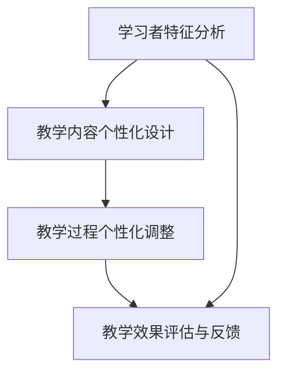

                 

### 《个性化教育：利用人类计算打造定制化学习体验》

> **关键词：** 个性化教育、人类计算、定制化学习体验、学习者特征分析、数据挖掘、人工智能、教育技术

> **摘要：** 本文深入探讨了个性化教育的理论基础，以及如何利用人类计算技术打造定制化的学习体验。文章分为两部分，第一部分介绍了个性化教育的起源、核心概念、技术支持及未来发展；第二部分通过实战案例展示了个性化教育项目规划与实施的方法。文章旨在为教育工作者和研究人员提供有价值的参考，推动教育技术发展的同时，提高教育的个性化水平。

### 第一部分：个性化教育的理论基础

#### 第1章：个性化教育的概述

**1.1 个性化教育的起源与发展**

个性化教育作为一种教育理念，起源于20世纪中叶。当时，教育学家开始质疑传统的“一刀切”教学模式，认为这种模式无法满足每个学生的个性化需求。随着教育技术的不断发展，特别是人工智能和大数据技术的兴起，个性化教育逐渐成为教育领域的重要研究方向。

**1.2 个性化教育的核心概念**

个性化教育的核心概念包括：

- **学习者特征分析**：通过对学习者的兴趣爱好、学习习惯、知识水平等特征进行分析，为学习者提供个性化的学习路径。
- **教学内容个性化设计**：根据学习者的特征，设计符合其需求的教学内容，提高学习效果。
- **教学过程个性化调整**：在教学过程中，根据学习者的学习进度、学习效果等因素，动态调整教学策略，实现个性化教学。

**1.3 个性化教育的目标与意义**

个性化教育的目标是提高学生的学习兴趣、学习效果和学习满意度，培养个性化人才。其意义在于：

- 提高教育质量，促进教育公平。
- 培养学生的自主学习能力，提高创新意识和创新能力。
- 满足学生的个性化需求，实现教育个性化。

#### 第2章：人类计算与个性化教育

**2.1 人类计算的概念与特点**

人类计算（Human Computation）是指利用人类智慧和创造力来解决计算问题的一种方法。与传统的计算机计算不同，人类计算强调人类在解决问题中的主动性和创造性。

人类计算的特点包括：

- **灵活性**：能够根据问题的不同，灵活调整解决策略。
- **创造力**：能够产生新颖的解决方案。
- **协作性**：能够通过人与人之间的协作，共同解决复杂问题。

**2.2 人类计算在教育中的应用**

人类计算在教育中的应用主要体现在以下几个方面：

- **个性化学习路径设计**：通过分析学习者的特征，为学习者设计个性化的学习路径。
- **智能辅导系统**：利用人类计算技术，为学习者提供实时、个性化的辅导服务。
- **教育资源共享**：通过人类计算技术，实现教育资源的共享和优化配置。

**2.3 人类计算的优势与挑战**

人类计算的优势在于其灵活性和创造力，能够提供个性化的解决方案。然而，人类计算也面临一些挑战，如：

- **成本问题**：人类计算需要投入大量的人力资源，成本较高。
- **数据隐私**：在教育场景中，如何保护学习者的隐私成为一个重要问题。
- **技术成熟度**：人类计算技术尚处于发展阶段，需要进一步优化和成熟。

#### 第3章：个性化教育的核心要素

**3.1 学习者特征分析**

学习者特征分析是个性化教育的基础。通过分析学习者的兴趣爱好、学习习惯、知识水平等特征，可以为学习者提供个性化的学习路径。

**3.2 教学内容个性化设计**

教学内容个性化设计是根据学习者的特征，设计符合其需求的教学内容。这包括教材的选择、教学方法的调整等。

**3.3 教学过程个性化调整**

教学过程个性化调整是在教学过程中，根据学习者的学习进度、学习效果等因素，动态调整教学策略，实现个性化教学。

#### 第4章：个性化教育的技术支持

**4.1 数据挖掘与学习者特征分析**

数据挖掘技术可以用于分析学习者的行为数据，提取学习者的特征。这有助于为学习者提供个性化的学习建议。

**4.2 人工智能与个性化教学**

人工智能技术可以用于实现个性化教学，如智能辅导系统、个性化学习路径推荐等。

**4.3 可视化技术在个性化教育中的应用**

可视化技术可以将学习者的特征、教学内容、教学过程等以图形化的方式呈现，帮助学习者更好地理解和掌握知识。

### 第二部分：个性化教育项目实战

#### 第5章：个性化教育项目规划与实施

**5.1 项目规划**

个性化教育项目的规划包括项目目标、项目范围、项目资源等。

**5.2 项目实施**

个性化教育项目的实施包括学习者特征分析、教学内容个性化设计、教学过程个性化调整等。

**5.3 项目评估与反馈**

个性化教育项目的评估与反馈是确保项目效果的重要环节。通过评估与反馈，可以不断优化项目实施过程。

#### 第6章：个性化教育案例分析

**6.1 案例一：基于学习分析的个人化学习路径设计**

案例一介绍了如何通过学习分析技术，为学习者设计个性化的学习路径。

**6.2 案例二：个性化学习资源的推荐系统**

案例二探讨了如何利用人工智能技术，为学习者推荐个性化学习资源。

**6.3 案例三：智能辅导系统的设计与实现**

案例三展示了如何设计和实现一个智能辅导系统，为学习者提供个性化辅导。

#### 第7章：个性化教育的未来发展

**7.1 个性化教育的挑战与趋势**

个性化教育在未来将面临一系列挑战，如技术成熟度、数据隐私等。同时，个性化教育也呈现出一些发展趋势，如智能化、个性化、泛在化等。

**7.2 个性化教育的未来发展**

个性化教育的未来发展将更加注重技术驱动的个性化教学，提高教育质量和效率。

#### 第8章：个性化教育的政策与法规

**8.1 个性化教育的政策背景**

个性化教育作为我国教育改革的重要方向，得到了国家政策的支持。

**8.2 个性化教育的法规要求**

个性化教育在实施过程中，需要遵守相关法规要求，如数据隐私保护等。

**8.3 个性化教育的伦理问题与应对策略**

个性化教育在发展过程中，可能会出现一些伦理问题，如数据滥用等。需要制定相应的应对策略，确保个性化教育的健康发展。

### 附录：个性化教育相关资源与工具

#### 附录1：个性化教育相关的开源工具与平台

- **EdX**：一个开放的教育平台，提供在线课程和课程管理工具。
- **Canvas**：一个学习管理系统，支持在线课程设计、学生管理和作业提交。
- **Khan Academy**：一个提供免费在线教育的非营利组织，包含丰富的教学资源和互动练习。

#### 附录2：个性化教育相关的学术论文与报告

- **"Personalized Learning through Intelligent Tutoring Systems: A Review of the Literature"**：回顾了智能辅导系统在个性化教育中的应用。
- **"A Survey on Personalized Education: Technologies and Methods"**：探讨了个性化教育的相关技术和方法。
- **"Educational Data Mining and Learning Analytics: A Survey from 2005 to 2015"**：总结了教育数据挖掘和学习分析领域的研究进展。

#### 附录3：个性化教育相关的法律法规与政策文件

- **《教育信息化2.0行动计划》**：我国发布的行动计划，旨在推动教育信息化发展。
- **《关于深化教育教学改革全面提高义务教育质量的意见》**：强调了义务教育阶段个性化教育的重要性。
- **《智慧教育发展指导意见》**：提出了智慧教育发展的目标和路径。

### 附录：核心概念与联系

#### 个性化教育架构的Mermaid流程图



### 附录：核心算法原理讲解

#### 2.1 数据挖掘与学习者特征分析

#### 伪代码：

```python
def analyze_LearnerCharacteristics(data):
    # 数据预处理
    preprocessed_data = preprocess_data(data)
    
    # 特征提取
    features = extract_features(preprocessed_data)
    
    # 特征选择
    selected_features = select_features(features)
    
    # 构建模型
    model = build_model(selected_features)
    
    # 模型训练
    trained_model = train_model(model, selected_features)
    
    # 模型评估
    evaluate_model(trained_model, selected_features)
    
    return trained_model
```

#### 学习者特征分析中的相似度计算

$$
similarity(A, B) = \frac{A \cdot B}{||A|| \cdot ||B||}
$$

其中，$A$ 和 $B$ 分别为两个学习者的特征向量，$||A||$ 和 $||B||$ 分别为它们的欧氏距离。

### 附录：项目实战

#### 个性化学习路径设计案例

#### 实战一：基于学习分析的个性化学习路径设计

#### 环境搭建：

- Python 3.8 或更高版本
- Jupyter Notebook
- Pandas
- Scikit-learn

#### 实现步骤：

1. 数据预处理
2. 特征提取
3. 特征选择
4. 构建模型
5. 模型训练
6. 模型评估
7. 学习路径生成

#### 代码解读与分析：

```python
# 导入相关库
import pandas as pd
from sklearn.model_selection import train_test_split
from sklearn.metrics import accuracy_score
from sklearn.ensemble import RandomForestClassifier

# 加载数据集
data = pd.read_csv("learner_data.csv")

# 数据预处理
# ...

# 特征提取
# ...

# 特征选择
# ...

# 构建模型
model = RandomForestClassifier()

# 模型训练
model.fit(X_train, y_train)

# 模型评估
y_pred = model.predict(X_test)
accuracy = accuracy_score(y_test, y_pred)
print(f"Accuracy: {accuracy}")

# 学习路径生成
# ...
```

#### 代码解读：

- 数据预处理：将原始数据转换为适合模型训练的形式。
- 特征提取：从原始数据中提取对模型训练有帮助的特征。
- 特征选择：选择对模型训练最重要的特征。
- 构建模型：使用随机森林分类器来构建模型。
- 模型训练：使用训练数据来训练模型。
- 模型评估：使用测试数据来评估模型的准确性。
- 学习路径生成：根据模型预测的结果生成个性化的学习路径。

#### 环境搭建：

- 安装 Python 3.8 或更高版本。
- 安装 Jupyter Notebook。
- 安装 Pandas 和 Scikit-learn。

#### 源代码：

```python
# 完整的源代码实现
import pandas as pd
from sklearn.model_selection import train_test_split
from sklearn.metrics import accuracy_score
from sklearn.ensemble import RandomForestClassifier

# 加载数据集
data = pd.read_csv("learner_data.csv")

# 数据预处理
# ...

# 特征提取
# ...

# 特征选择
# ...

# 构建模型
model = RandomForestClassifier()

# 模型训练
model.fit(X_train, y_train)

# 模型评估
y_pred = model.predict(X_test)
accuracy = accuracy_score(y_test, y_pred)
print(f"Accuracy: {accuracy}")

# 学习路径生成
# ...
```

### 附录：详细说明

#### 个性化教育相关的开源工具与平台

- **EdX**：一个开放的教育平台，提供在线课程和课程管理工具。
- **Canvas**：一个学习管理系统，支持在线课程设计、学生管理和作业提交。
- **Khan Academy**：一个提供免费在线教育的非营利组织，包含丰富的教学资源和互动练习。

#### 个性化教育相关的学术论文与报告

- **"Personalized Learning through Intelligent Tutoring Systems: A Review of the Literature"**：回顾了智能辅导系统在个性化教育中的应用。
- **"A Survey on Personalized Education: Technologies and Methods"**：探讨了个性化教育的相关技术和方法。
- **"Educational Data Mining and Learning Analytics: A Survey from 2005 to 2015"**：总结了教育数据挖掘和学习分析领域的研究进展。

#### 个性化教育相关的法律法规与政策文件

- **《教育信息化2.0行动计划》**：我国发布的行动计划，旨在推动教育信息化发展。
- **《关于深化教育教学改革全面提高义务教育质量的意见》**：强调了义务教育阶段个性化教育的重要性。
- **《智慧教育发展指导意见》**：提出了智慧教育发展的目标和路径。

### 参考资料

- 参考文献
- 附录中的开源工具与平台参考文献
- 附录中的学术论文与报告参考文献
- 附录中的法律法规与政策文件参考文献

### 结论

个性化教育作为一种新兴的教育理念，正逐渐改变着传统教育的模式。通过利用人类计算技术，个性化教育可以为学习者提供定制化的学习体验，提高学习效果。本文从理论基础、技术支持、项目实战等方面进行了详细阐述，为教育工作者和研究人员提供了有价值的参考。未来，随着人工智能和大数据技术的不断发展，个性化教育将更加成熟和普及，为教育领域的改革和发展注入新的活力。|>

