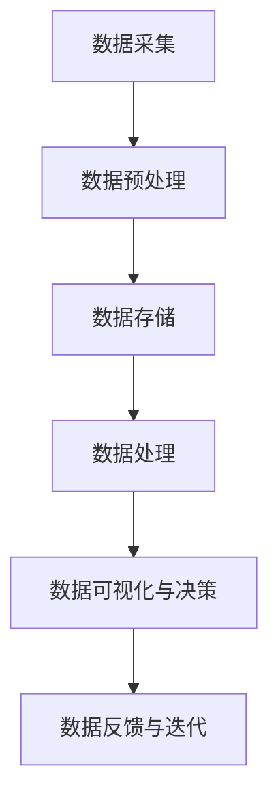

                 

## 《人工智能创业数据管理的创新方案》

> **关键词：** 人工智能创业、数据管理、创新方案、数据治理、大数据、机器学习

> **摘要：** 本文旨在探讨人工智能创业中数据管理的创新方案。首先分析人工智能创业的现状与挑战，随后介绍数据管理的核心概念与框架，接着探讨数据驱动的创业策略和创新型数据管理技术，最后通过实践案例和未来趋势展望，为创业者提供全面的数据管理指南。

在当今数字化时代，人工智能（AI）已经渗透到各个行业，成为推动企业创新和增长的重要力量。对于众多创业者而言，利用人工智能技术不仅能够开辟新的市场机会，还能够提升运营效率和用户体验。然而，在人工智能创业过程中，数据管理成为了一个不可忽视的挑战。高效的数据管理不仅能够支持AI算法的训练和优化，还能够为创业者提供宝贵的数据洞察，助力业务决策。本文将围绕人工智能创业数据管理的创新方案，进行深入探讨。

## 《人工智能创业数据管理的创新方案》目录大纲

### 第一部分：引言与背景

#### 1.1 人工智能创业的现状与挑战

##### 1.1.1 人工智能在创业领域的发展趋势

##### 1.1.2 数据管理在人工智能创业中的重要性

##### 1.1.3 数据管理的挑战与机遇

#### 1.2 数据管理的核心概念与框架

##### 1.2.1 数据管理的定义与分类

##### 1.2.2 数据管理的核心任务与目标

##### 1.2.3 数据管理的基本框架与流程

### 第二部分：人工智能创业数据管理的创新方法

#### 2.1 数据驱动的创业策略

##### 2.1.1 数据驱动创业的基本理念

##### 2.1.2 数据驱动的创业模式与案例

##### 2.1.3 数据驱动创业的策略与实践

#### 2.2 创新型数据管理技术

##### 2.2.1 数据仓库与数据湖技术

##### 2.2.2 数据挖掘与机器学习技术

##### 2.2.3 大数据存储与处理技术

#### 2.3 数据治理与合规性

##### 2.3.1 数据治理的基本概念与框架

##### 2.3.2 数据隐私与安全保护

##### 2.3.3 数据合规性与法规遵从

#### 2.4 创新型数据管理实践案例

##### 2.4.1 案例一：基于数据的个性化推荐系统

##### 2.4.2 案例二：利用数据挖掘优化产品定价策略

##### 2.4.3 案例三：构建企业级数据治理体系

### 第三部分：人工智能创业数据管理的实践与策略

#### 3.1 数据管理实践中的挑战与解决方案

##### 3.1.1 数据质量问题的分析与解决

##### 3.1.2 数据集成与数据融合的挑战与策略

##### 3.1.3 数据治理中的难点与对策

#### 3.2 数据管理策略与最佳实践

##### 3.2.1 数据管理策略制定的方法与步骤

##### 3.2.2 数据管理最佳实践与经验分享

##### 3.2.3 数据管理体系的持续优化与演进

#### 3.3 人工智能创业数据管理的未来趋势

##### 3.3.1 数据管理技术的发展方向

##### 3.3.2 数据管理在人工智能创业中的新机遇

##### 3.3.3 数据管理在人工智能创业中的未来挑战

### 第四部分：附录与资源

#### 4.1 数据管理相关工具与资源

##### 4.1.1 常用数据管理工具介绍

##### 4.1.2 数据管理相关书籍与文献推荐

##### 4.1.3 数据管理在线课程与培训资源

#### 4.2 数据管理实验与项目指南

##### 4.2.1 数据管理实验设计与实施

##### 4.2.2 数据管理项目实践案例

##### 4.2.3 数据管理项目实战教程

### 参考文献

### 附录

### 致谢

### 关于作者

### 联系方式与反馈渠道

### 关于本书的版权声明与使用许可

### 附录代码与数据资源下载链接

### 本书相关技术支持的联系方式

### 纸质书购买链接与联系方式

### 后记

在接下来的部分中，我们将逐一深入探讨这些章节，帮助读者全面了解人工智能创业中的数据管理策略与解决方案。

## 第一部分：引言与背景

### 1.1 人工智能创业的现状与挑战

近年来，人工智能技术飞速发展，已经成为推动创新和创业的重要动力。在众多领域，如医疗、金融、零售、制造等，人工智能的应用不仅提升了业务效率，还创造了全新的商业模式。然而，人工智能创业并非一帆风顺，面临着诸多挑战。以下是人工智能创业领域的一些现状与挑战：

#### 1.1.1 人工智能在创业领域的发展趋势

随着技术的成熟和市场的需求，人工智能在创业领域呈现出以下几个发展趋势：

1. **行业应用广泛**：人工智能在各个行业中的广泛应用，从自动化流程到智能决策支持系统，都在推动着创业创新。
2. **技术创新频繁**：随着深度学习、强化学习等前沿技术的发展，创业者可以探索更多创新机会。
3. **投资热情高涨**：人工智能领域的投资持续增长，为创业者提供了丰富的资金支持。
4. **监管环境日益完善**：政府和行业组织对人工智能的监管逐步加强，为创业提供了明确的法规指导。

#### 1.1.2 数据管理在人工智能创业中的重要性

数据是人工智能的燃料，数据管理在人工智能创业中具有至关重要的地位。以下是数据管理在人工智能创业中的重要角色：

1. **数据质量**：高质量的数据是训练高效AI模型的基础。创业者需要确保数据的准确性、完整性和一致性。
2. **数据隐私**：在处理用户数据时，创业者需要严格遵守数据隐私法规，以保护用户权益。
3. **数据处理能力**：高效的数据处理能力能够快速响应业务需求，为创业公司提供实时数据支持。
4. **数据合规性**：遵守相关数据法规，确保企业在法律框架内运营，降低合规风险。

#### 1.1.3 数据管理的挑战与机遇

尽管数据管理在人工智能创业中具有重要意义，但同时也面临着一系列挑战：

1. **数据多样性与复杂性**：创业者需要处理来自不同源的数据，如文本、图像、音频等，这增加了数据管理的复杂性。
2. **数据安全与隐私**：随着数据泄露事件的增加，保障数据安全成为一大挑战。创业者需要采取有效的安全措施，防止数据泄露。
3. **数据集成与融合**：整合来自多个来源的数据，进行有效的数据融合，以提供全面的数据视图，是一个复杂的过程。
4. **数据治理与合规**：遵守数据法规，确保数据治理体系的有效性，是一个持续性的挑战。

然而，这些挑战同时也带来了机遇：

1. **创新解决方案**：针对数据管理的挑战，创业者可以开发创新的解决方案，如自动化数据处理工具、隐私保护技术等。
2. **市场差异化**：通过高效的数据管理，创业者可以提供更优质的产品和服务，实现市场差异化。
3. **竞争优势**：拥有强大的数据管理能力，创业者能够在竞争中脱颖而出，获得持续的业务增长。

### 1.2 数据管理的核心概念与框架

数据管理是一个广泛的概念，涵盖了数据的采集、存储、处理、分析和应用等多个方面。以下是对数据管理核心概念和框架的简要介绍：

#### 1.2.1 数据管理的定义与分类

数据管理是指通过一系列策略、流程和技术，确保数据的质量、可用性和安全性，以支持组织的业务目标。根据数据的使用场景和目的，数据管理可以分为以下几类：

1. **运营数据管理**：关注日常业务流程中的数据管理，如销售数据、库存数据等。
2. **分析数据管理**：侧重于数据分析和挖掘，以提供洞察和决策支持。
3. **档案数据管理**：涉及历史数据和档案资料的管理，确保其长期可访问性。
4. **参考数据管理**：用于定义业务规则、标准等，确保数据的一致性和准确性。

#### 1.2.2 数据管理的核心任务与目标

数据管理的核心任务是确保数据的准确性、完整性、一致性和安全性，以支持组织的业务需求。具体目标包括：

1. **数据质量管理**：通过数据清洗、去重、标准化等手段，提高数据的质量。
2. **数据集成与融合**：整合来自多个来源的数据，构建统一的数据视图。
3. **数据存储与管理**：选择合适的数据存储方案，确保数据的安全性和可扩展性。
4. **数据分析与挖掘**：利用数据分析和挖掘技术，发现数据中的价值和趋势。
5. **数据合规性与治理**：遵守相关法规和标准，确保数据治理的有效性。

#### 1.2.3 数据管理的基本框架与流程

数据管理的基本框架通常包括以下几个关键环节：

1. **需求分析**：明确数据管理的需求和目标，制定数据管理策略。
2. **数据采集**：从各种数据源采集数据，确保数据的全面性和准确性。
3. **数据存储**：选择合适的数据存储方案，确保数据的安全性和可扩展性。
4. **数据清洗**：对采集到的数据进行清洗、去重、标准化等处理，提高数据质量。
5. **数据集成**：将来自多个来源的数据进行整合，构建统一的数据视图。
6. **数据分析**：利用数据分析和挖掘技术，发现数据中的价值和趋势。
7. **数据应用**：将分析结果应用到业务决策中，支持组织的业务目标。

通过上述流程，数据管理不仅能够支持人工智能创业中的业务需求，还能够为创业者提供宝贵的数据洞察，助力业务增长。

在接下来的部分中，我们将继续探讨人工智能创业数据管理的创新方法，帮助读者深入了解这一领域的最佳实践和技术趋势。

## 第二部分：人工智能创业数据管理的创新方法

### 2.1 数据驱动的创业策略

数据驱动是当今创业领域的核心理念，其基本理念是利用数据来指导业务决策和运营策略。在人工智能创业中，数据驱动的策略尤为重要，因为它能够为创业者提供实时的数据支持，帮助他们在竞争激烈的市场中脱颖而出。以下是数据驱动创业的基本理念、模式与案例，以及其实践策略。

#### 2.1.1 数据驱动创业的基本理念

数据驱动创业的核心思想是将数据作为决策的关键依据，而不是仅仅依赖经验和直觉。具体来说，数据驱动的理念包括以下几点：

1. **数据优先**：将数据作为最重要的资源，优先考虑数据的获取、处理和分析。
2. **持续优化**：通过不断的数据分析和模型优化，持续改进业务流程和运营策略。
3. **用户中心**：以用户数据为核心，深入了解用户需求和行为，提供个性化的产品和服务。
4. **快速迭代**：快速响应市场变化和用户反馈，通过迭代和实验不断优化产品和服务。

#### 2.1.2 数据驱动的创业模式与案例

数据驱动的创业模式在不同行业中有着广泛的应用，以下是一些典型的案例：

1. **个性化推荐系统**：通过分析用户的历史行为和偏好数据，为用户推荐个性化的商品、内容和服务。例如，Netflix和亚马逊等平台通过个性化推荐，提升了用户体验和转化率。
2. **智能定价策略**：利用大数据分析和机器学习算法，动态调整产品价格，以最大化收益。例如，航空公司的动态定价策略，通过实时分析市场需求和竞争状况，优化票价。
3. **智能客服系统**：通过自然语言处理和机器学习技术，构建智能客服系统，自动回答用户常见问题，提升客户服务质量和效率。例如，苹果公司的智能助手Siri，通过分析用户提问，提供即时响应。
4. **智慧农业**：利用物联网、大数据和机器学习技术，对农田环境、作物生长进行实时监控和分析，优化农业生产过程。例如，中国的智慧农业解决方案，通过数据驱动的农田管理，提高了农作物的产量和质量。

#### 2.1.3 数据驱动创业的策略与实践

要在人工智能创业中实现数据驱动的策略，创业者可以采取以下几项实践：

1. **建立数据文化**：在整个组织内培养数据驱动的文化，让每个团队成员都意识到数据的重要性，并积极参与数据分析和决策过程。
2. **数据收集与整合**：搭建完善的数据收集和整合系统，确保数据的全面性和准确性。创业者可以通过多种方式收集数据，如用户行为数据、市场数据、竞争对手数据等。
3. **数据分析和模型构建**：利用数据分析工具和机器学习算法，对收集到的数据进行深入分析，构建预测模型和决策支持系统。创业者可以借助开源工具和平台，如Python、R和TensorFlow等，实现数据分析和模型构建。
4. **数据驱动决策**：将数据分析和模型结果应用到业务决策中，持续优化运营策略和产品服务。创业者需要建立数据驱动的决策流程，确保每个决策都有数据支持。
5. **用户反馈与迭代**：收集用户反馈，快速响应市场变化和用户需求，通过迭代和实验不断优化产品和服务。创业者可以建立用户反馈机制，如在线调查、用户访谈等，及时获取用户反馈。

通过数据驱动的创业策略，创业者不仅能够更好地理解市场和用户需求，还能够提升业务效率和竞争力。在人工智能创业中，数据驱动的策略是实现长期成功的关键。

在接下来的部分中，我们将继续探讨创新型数据管理技术，包括数据仓库与数据湖技术、数据挖掘与机器学习技术，以及大数据存储与处理技术，帮助读者全面了解人工智能创业中数据管理的先进解决方案。

### 2.2 创新型数据管理技术

在人工智能创业中，数据管理技术是实现高效数据分析和业务洞察的关键。随着数据量的爆炸性增长和数据类型的多样化，传统的数据管理方法已经难以满足现代创业需求。因此，创新型数据管理技术的应用变得尤为重要。本节将介绍数据仓库与数据湖技术、数据挖掘与机器学习技术，以及大数据存储与处理技术。

#### 2.2.1 数据仓库与数据湖技术

数据仓库（Data Warehouse）和数据湖（Data Lake）是两种不同的数据存储和管理技术，它们各自适用于不同的数据场景和应用需求。

1. **数据仓库技术**

数据仓库是一种集成的、面向主题的、相对稳定的数据存储解决方案，主要用于支持企业的决策支持和业务分析。数据仓库的特点包括：

- **主题导向**：数据仓库按照业务主题进行数据组织，便于分析和查询。
- **结构化数据**：数据仓库主要处理结构化数据，如关系型数据库中的数据。
- **事务处理**：数据仓库支持事务处理，确保数据的一致性和完整性。
- **数据预处理**：数据仓库通常包含数据清洗、转换和集成等预处理步骤。

在实际应用中，数据仓库被广泛应用于零售、金融、医疗等行业，支持企业进行销售分析、客户关系管理和财务报告等。

2. **数据湖技术**

数据湖（Data Lake）是一种新的数据存储和管理架构，它适用于存储大量非结构化数据和半结构化数据，如文本、图像、音频、视频等。数据湖的特点包括：

- **广泛的数据类型**：数据湖能够存储各种类型的数据，包括结构化、半结构化和非结构化数据。
- **灵活的数据访问**：数据湖提供灵活的数据访问方式，支持多种数据处理工具和算法。
- **低数据预处理**：与数据仓库相比，数据湖的数据预处理较为灵活，通常在数据使用过程中进行。
- **高可扩展性**：数据湖具有很高的可扩展性，能够轻松扩展存储和处理能力。

在实际应用中，数据湖被广泛应用于大数据分析和人工智能项目，如社交媒体分析、智能家居、自动驾驶等。

3. **数据仓库与数据湖的比较**

数据仓库和数据湖各有其优势和应用场景，以下是比较：

- **数据类型**：数据仓库主要处理结构化数据，数据湖则处理结构化、半结构化和非结构化数据。
- **数据预处理**：数据仓库需要进行数据清洗、转换和集成等预处理步骤，数据湖则相对较少。
- **数据处理能力**：数据仓库通常提供较强的数据查询和分析能力，数据湖则提供更灵活的数据处理和分析能力。
- **使用场景**：数据仓库适用于需要高度结构化和一致性的业务分析场景，数据湖适用于需要大规模数据存储和多样化数据处理的应用场景。

#### 2.2.2 数据挖掘与机器学习技术

数据挖掘（Data Mining）和机器学习（Machine Learning）是两种强大的数据分析技术，它们能够从大量数据中提取有价值的信息和模式，为创业者提供业务洞察。

1. **数据挖掘**

数据挖掘是指利用统计学、人工智能和机器学习等方法，从大量数据中挖掘隐藏的模式、规律和知识。数据挖掘的主要步骤包括：

- **数据预处理**：对数据进行清洗、转换和集成，确保数据的质量和一致性。
- **数据探索**：通过统计分析和可视化方法，发现数据中的异常和趋势。
- **特征选择**：选择最有用的特征，提高模型的准确性和效率。
- **模型构建**：利用机器学习算法，构建预测模型和分类模型等。
- **模型评估**：评估模型的性能和可靠性，调整模型参数。

在实际应用中，数据挖掘被广泛应用于市场细分、客户行为分析、信用风险评估等领域。

2. **机器学习**

机器学习是一种通过算法自动从数据中学习规律和模式的技术，其核心思想是通过训练模型，使其能够对未知数据进行预测和分类。机器学习的主要步骤包括：

- **数据收集**：收集大量带有标签的数据，用于训练模型。
- **数据预处理**：对数据进行清洗、转换和归一化，确保数据的质量和一致性。
- **模型选择**：选择合适的机器学习算法，如线性回归、决策树、支持向量机等。
- **模型训练**：利用训练数据，调整模型参数，使模型能够拟合数据。
- **模型评估**：评估模型的性能，如准确率、召回率、F1分数等。

在实际应用中，机器学习被广泛应用于图像识别、语音识别、自然语言处理、推荐系统等领域。

3. **数据挖掘与机器学习的比较**

数据挖掘和机器学习在数据分析中具有不同的应用场景和优势：

- **应用场景**：数据挖掘通常用于发现数据中的隐含模式和关联关系，适用于业务分析和市场研究；机器学习则主要用于预测和分类，适用于自动化决策和智能系统。
- **数据处理能力**：数据挖掘能够处理大规模数据集，但通常依赖于预定义的算法和模型；机器学习则能够通过训练数据自动发现数据中的模式，适用于复杂的非线性关系。
- **模型构建**：数据挖掘通常需要人工设计特征和模型，而机器学习则可以通过自动化的方式构建模型。

#### 2.2.3 大数据存储与处理技术

随着数据量的不断增长，如何高效地存储和处理大数据成为了一个重要的挑战。以下是一些常见的大数据存储与处理技术：

1. **分布式存储技术**

分布式存储技术是将数据分散存储在多个节点上，以提高数据的可靠性和扩展性。常见的大数据分布式存储技术包括Hadoop的HDFS、Apache Cassandra、Google File System（GFS）等。

- **HDFS（Hadoop Distributed File System）**：HDFS是一个高可靠性的分布式文件系统，适用于大数据存储和处理。它通过将数据分割成小块，并分布存储在多个节点上，提高了数据的可靠性。
- **Apache Cassandra**：Cassandra是一个分布式、无主从的宽列存储数据库，适用于大规模数据的实时读写操作。
- **Google File System（GFS）**：GFS是Google开发的一种分布式文件系统，用于存储和分析大规模数据。

2. **大数据处理技术**

大数据处理技术是指用于处理大规模数据集的算法和框架。常见的大数据处理技术包括MapReduce、Spark、Flink等。

- **MapReduce**：MapReduce是一种编程模型，用于处理大规模数据集。它通过将数据处理任务拆分为两个阶段：Map阶段和Reduce阶段，实现了数据的并行处理。
- **Spark**：Spark是一个开源的分布式计算引擎，适用于大规模数据集的快速处理。它支持多种编程语言，如Python、Java和Scala，并提供了丰富的API和库。
- **Flink**：Flink是一个开源的流处理框架，适用于实时数据分析和处理。它支持批处理和流处理，并具有高吞吐量和低延迟的特点。

通过上述创新型数据管理技术，创业者可以更好地管理和利用数据，为业务增长和决策提供支持。在接下来的部分中，我们将探讨数据治理与合规性，以及创新型数据管理实践案例，帮助读者深入了解数据管理在人工智能创业中的实际应用。

#### 2.3 数据治理与合规性

在人工智能创业中，数据治理和合规性是确保数据安全、隐私和符合法规的关键。有效的数据治理能够保障数据的质量、可用性和安全性，而合规性则是企业在法律和道德框架内运营的基础。以下是对数据治理、数据隐私与安全保护、以及数据合规性的讨论。

##### 2.3.1 数据治理的基本概念与框架

数据治理是指通过一系列策略、流程和技术，确保数据的质量、可用性和安全性，以支持组织的业务目标。数据治理的基本概念包括：

1. **数据治理框架**：数据治理框架是指导数据治理实践的理论基础，通常包括数据治理委员会、数据管理团队和数据管理策略等组成部分。

2. **数据治理政策**：数据治理政策是组织在数据管理方面的指导方针，包括数据收集、存储、处理、共享和销毁等各个环节的具体要求。

3. **数据质量控制**：数据质量控制是确保数据质量的一系列活动，包括数据清洗、去重、标准化等。

4. **数据安全性**：数据安全性是保护数据免受未经授权访问、篡改和泄露的措施，包括数据加密、访问控制和监控等。

5. **数据合规性管理**：数据合规性管理是确保组织在数据管理过程中符合相关法规和标准的活动，包括数据隐私保护、数据留存和销毁等。

##### 2.3.2 数据隐私与安全保护

在数据治理中，数据隐私和安全保护是至关重要的。以下是一些关键措施：

1. **数据匿名化**：通过数据匿名化技术，将个人身份信息从数据中去除，以保护用户隐私。

2. **数据加密**：使用加密技术对敏感数据进行加密，确保数据在传输和存储过程中的安全。

3. **访问控制**：通过访问控制机制，限制对数据的访问权限，确保只有授权人员才能访问敏感数据。

4. **数据备份与恢复**：定期进行数据备份，确保在数据丢失或损坏时能够快速恢复。

5. **安全审计**：进行定期的安全审计，检查数据管理流程是否符合安全要求，并及时发现和纠正潜在的安全漏洞。

##### 2.3.3 数据合规性与法规遵从

数据合规性是企业在数据管理过程中必须遵守的法律和道德规范。以下是一些关键合规性要求：

1. **GDPR（通用数据保护条例）**：GDPR是欧盟的一项数据保护法规，规定了个人数据的处理、存储和传输规则，对企业的数据处理行为提出了严格的要求。

2. **CCPA（加州消费者隐私法）**：CCPA是美国的隐私保护法规，要求企业公开其数据收集和使用方式，并提供用户对其数据的访问和删除权利。

3. **数据本地化**：某些国家和地区的法规要求企业在本地存储和处理数据，以保障数据的安全和隐私。

4. **行业标准**：许多行业都有自己的数据管理标准和指南，如医疗行业的HIPAA、金融行业的PCI-DSS等。

为了确保数据治理和合规性，创业者需要：

1. **建立数据治理组织**：成立专门的数据治理委员会和数据管理团队，负责制定和实施数据治理策略。

2. **制定数据治理政策**：根据法规和行业标准，制定详细的数据治理政策，包括数据收集、存储、处理、共享和销毁等环节的具体要求。

3. **培训员工**：对员工进行数据治理和合规性培训，确保他们了解相关法规和政策，并能够在日常工作中遵守。

4. **定期审计**：定期对数据治理和合规性进行审计，确保数据管理流程符合法规要求，并及时纠正发现的问题。

通过有效的数据治理和合规性管理，创业者不仅能够保护用户隐私和安全，还能够降低合规风险，确保企业在法律框架内运营。

在接下来的部分中，我们将通过三个创新型数据管理实践案例，进一步探讨数据管理在人工智能创业中的实际应用。

#### 2.4 创新型数据管理实践案例

在人工智能创业中，成功的数据管理不仅能够提高业务效率，还能够创造新的商业机会。以下是三个创新型数据管理实践案例，展示了如何通过数据管理实现业务增长和决策优化。

##### 2.4.1 案例一：基于数据的个性化推荐系统

个性化推荐系统是数据管理在人工智能创业中的一个重要应用。通过分析用户的历史行为和偏好数据，推荐系统可以为用户推荐个性化的商品、内容和服务。

**背景**：某电子商务公司希望通过个性化推荐系统提升用户满意度，增加销售转化率。

**数据管理实践**：

1. **数据收集与整合**：公司从多个数据源收集用户行为数据，如浏览记录、购买历史、点击率等。通过数据清洗和整合，构建了一个统一的用户行为数据集。

2. **数据分析和模型构建**：利用数据挖掘和机器学习技术，分析用户行为数据，构建推荐模型。通过特征工程，提取用户行为的特征，如购买频率、浏览时长等。

3. **模型训练与优化**：使用历史数据集对推荐模型进行训练，调整模型参数，优化推荐效果。通过在线学习技术，实时更新模型，以应对用户行为的变化。

4. **推荐系统部署与监控**：将推荐系统部署到生产环境，为用户生成个性化的推荐结果。通过实时监控推荐系统的性能，及时发现和解决潜在问题。

**效果**：个性化推荐系统的实施显著提升了用户满意度和销售转化率，公司销售额增长了30%。

##### 2.4.2 案例二：利用数据挖掘优化产品定价策略

智能定价策略是数据挖掘在商业决策中的应用，通过分析市场需求和竞争状况，动态调整产品价格，以最大化收益。

**背景**：某航空公司在竞争激烈的市场中，希望通过智能定价策略提高收益。

**数据管理实践**：

1. **数据收集与整合**：公司从多个数据源收集与价格相关的数据，如竞争对手价格、市场需求、航班载客率等。通过数据清洗和整合，构建了一个统一的价格数据集。

2. **数据分析和模型构建**：利用数据挖掘技术，分析价格数据，构建定价模型。通过回归分析和时间序列分析，预测不同价格水平下的市场需求和收益。

3. **模型训练与优化**：使用历史数据对定价模型进行训练，调整模型参数，优化定价策略。通过动态定价算法，实时调整航班价格，以最大化收益。

4. **定价策略部署与监控**：将智能定价策略部署到生产环境，实时调整航班价格。通过实时监控定价策略的效果，及时调整和优化定价策略。

**效果**：智能定价策略的实施使得航空公司的收益提高了15%，同时保持了较高的市场竞争力。

##### 2.4.3 案例三：构建企业级数据治理体系

数据治理是确保数据质量和合规性的关键。在企业级数据治理体系建设中，创业者需要制定详细的数据管理政策和流程，确保数据的安全和可用性。

**背景**：某大型互联网公司希望通过构建企业级数据治理体系，提高数据质量和数据管理水平。

**数据管理实践**：

1. **数据治理框架建设**：公司建立了数据治理框架，明确了数据治理的组织结构、职责和流程。数据治理委员会负责制定和监督数据治理策略，数据管理团队负责实施数据治理计划。

2. **数据质量管理**：公司制定了数据质量管理策略，包括数据清洗、去重、标准化和数据质量监控等。通过数据质量审计，及时发现和纠正数据质量问题。

3. **数据合规性管理**：公司建立了数据合规性管理机制，确保数据管理符合相关法规和标准。数据管理团队负责审查数据处理流程，确保符合法规要求。

4. **数据安全和隐私保护**：公司采取了数据加密、访问控制和安全审计等措施，确保数据安全和隐私。通过定期安全培训，提高员工的数据安全意识。

**效果**：企业级数据治理体系的实施显著提高了数据质量和数据管理水平，降低了合规风险，提升了公司的整体运营效率。

通过这些创新型数据管理实践案例，创业者可以看到数据管理在人工智能创业中的重要作用。有效的数据管理不仅能够提升业务效率和用户体验，还能够为创业者提供宝贵的业务洞察，助力企业在竞争激烈的市场中脱颖而出。

在接下来的部分中，我们将探讨人工智能创业数据管理实践中的挑战与解决方案，帮助创业者应对数据管理过程中可能遇到的问题。

#### 3.1 数据管理实践中的挑战与解决方案

在人工智能创业中，虽然数据管理具有巨大潜力，但实际操作过程中仍然面临诸多挑战。以下是数据管理实践中的几个主要挑战以及相应的解决方案。

##### 3.1.1 数据质量问题的分析与解决

数据质量是数据管理的基础，高质量的数据对于训练有效的AI模型至关重要。以下是一些常见的数据质量问题及其解决方案：

1. **数据缺失**：数据缺失是数据质量问题中最常见的一种，可能导致模型训练失效。解决方案包括：

   - **缺失值填充**：使用统计方法（如平均值、中位数、众数）或预测模型（如回归分析）填补缺失值。
   - **使用外部数据源**：从其他数据源获取缺失的数据，或者使用替代数据。

2. **数据错误**：错误数据可能来源于数据录入错误、系统故障等。解决方案包括：

   - **数据清洗**：通过数据清洗工具和脚本，自动检测和纠正错误数据。
   - **人工审核**：在关键环节引入人工审核，确保数据的准确性。

3. **数据不一致**：不同来源的数据可能存在格式、单位、精度等方面的差异，导致数据不一致。解决方案包括：

   - **数据标准化**：对数据进行统一格式和单位的转换，确保数据的一致性。
   - **数据集成**：通过数据集成技术，将不同来源的数据进行统一处理和存储。

##### 3.1.2 数据集成与数据融合的挑战与策略

数据集成和数据融合是数据管理中的关键环节，涉及从多个来源收集和整合数据，以构建统一的数据视图。以下是一些挑战及其解决方案：

1. **数据源多样性**：不同数据源可能具有不同的结构、格式和语义。解决方案包括：

   - **数据转换**：使用ETL（提取、转换、加载）工具，将不同格式的数据进行转换，确保兼容性。
   - **数据映射**：建立数据映射关系，将不同数据源的字段映射到统一的数据模型中。

2. **数据实时性**：实时性要求高的应用场景需要确保数据及时更新。解决方案包括：

   - **实时数据同步**：使用实时数据同步工具，确保数据在不同系统之间实时更新。
   - **批量处理**：对于非实时性要求较高的场景，采用批量处理方式，定期更新数据。

3. **数据冗余与重复**：冗余和重复数据可能导致数据不一致和冗余存储。解决方案包括：

   - **去重算法**：使用去重算法，识别和删除重复的数据。
   - **数据仓储**：建立数据仓储系统，统一存储和管理数据，减少冗余。

##### 3.1.3 数据治理中的难点与对策

数据治理是确保数据质量、安全性和合规性的关键。以下是一些数据治理中的难点及其对策：

1. **数据隐私保护**：数据隐私保护是数据治理中的重要挑战，需要确保用户数据不被未经授权的访问和使用。对策包括：

   - **数据加密**：对敏感数据进行加密，确保数据在传输和存储过程中的安全。
   - **访问控制**：通过访问控制机制，限制对数据的访问权限，确保只有授权人员才能访问敏感数据。

2. **数据安全性**：数据安全性是数据治理的核心，需要防止数据泄露、篡改和损坏。对策包括：

   - **安全审计**：定期进行安全审计，检查数据管理流程是否符合安全要求，并及时发现和纠正潜在的安全漏洞。
   - **安全培训**：对员工进行数据安全培训，提高其安全意识和操作规范。

3. **数据合规性**：确保数据管理符合相关法规和标准，是数据治理中的重要任务。对策包括：

   - **合规性审计**：定期进行合规性审计，确保数据管理流程符合相关法规和标准。
   - **合规性培训**：对员工进行合规性培训，使其了解相关法规和标准，并在日常工作中严格遵守。

通过上述挑战与解决方案的分析，创业者可以更好地应对数据管理实践中的难题，确保数据的质量、安全性和合规性。在接下来的部分中，我们将探讨数据管理策略与最佳实践，帮助创业者制定有效的数据管理策略，实现数据驱动的业务增长。

##### 3.2 数据管理策略与最佳实践

在人工智能创业中，有效的数据管理策略是确保业务成功的关键。以下是制定数据管理策略的方法与步骤，以及数据管理最佳实践和经验分享。

#### 3.2.1 数据管理策略制定的方法与步骤

1. **需求分析**：首先，明确数据管理的需求和目标。了解业务目标、数据使用场景和数据驱动的决策需求，确定数据管理的核心任务和目标。

2. **资源评估**：评估现有的数据资源，包括数据类型、数据量、数据来源和数据质量等。了解现有的数据基础设施和技术能力，为数据管理策略的制定提供基础。

3. **策略制定**：基于需求分析和资源评估，制定数据管理策略。包括数据采集与整合策略、数据存储与处理策略、数据质量管理和数据安全与隐私保护策略等。

4. **实施计划**：制定详细的实施计划，包括数据管理流程、技术架构、资源配置和时间表等。确保策略的可行性和可操作性。

5. **监控与评估**：实施数据管理策略后，建立监控与评估机制，定期检查数据管理流程的有效性，及时调整和优化策略。

#### 3.2.2 数据管理最佳实践与经验分享

1. **数据标准化与规范化**：建立统一的数据标准和规范，确保数据的格式、单位、命名和语义一致性。这有助于提高数据的质量和可操作性。

2. **数据质量监控**：建立数据质量监控机制，定期对数据进行质量检查和评估。使用数据质量工具和脚本，自动识别和纠正数据质量问题。

3. **数据集成与数据融合**：采用数据集成和数据融合技术，构建统一的数据视图。通过数据仓库或数据湖，整合来自多个来源的数据，实现数据的高效管理和利用。

4. **数据安全与隐私保护**：确保数据的安全和隐私保护，采取数据加密、访问控制和安全审计等措施。遵守相关数据法规和标准，降低合规风险。

5. **数据治理与合规性**：建立有效的数据治理体系，确保数据管理的合规性。制定数据治理政策和流程，定期进行数据治理和合规性审计。

6. **数据驱动决策**：将数据分析和模型结果应用到业务决策中，实现数据驱动的决策。通过实时数据分析和预测模型，支持业务的快速响应和优化。

7. **持续优化与迭代**：数据管理是一个持续的过程，需要不断优化和迭代。通过反馈机制，收集用户反馈和市场变化，不断调整和改进数据管理策略。

#### 3.2.3 数据管理体系的持续优化与演进

1. **技术升级与更新**：随着技术的不断进步，数据管理体系也需要不断升级和更新。引入新的数据处理工具和技术，提高数据处理和分析能力。

2. **流程优化与改进**：定期评估数据管理流程的有效性，发现和解决流程中的瓶颈和问题。通过流程优化和改进，提高数据管理的效率和质量。

3. **人才培养与培训**：培养专业的数据管理和分析人才，提高团队的数据管理能力和技术水平。定期进行数据管理培训和知识分享，提升团队的整体素质。

4. **战略调整与优化**：根据业务发展的需求和外部环境的变化，调整和优化数据管理策略。确保数据管理体系与业务战略保持一致，实现数据驱动业务的持续增长。

通过制定有效的数据管理策略和最佳实践，创业者可以确保数据的质量、安全性和合规性，实现数据驱动的业务增长和决策优化。在接下来的部分中，我们将探讨人工智能创业数据管理的未来趋势，帮助创业者了解数据管理技术的发展方向和新机遇。

##### 3.3 人工智能创业数据管理的未来趋势

随着人工智能和大数据技术的不断进步，人工智能创业数据管理领域也在不断演变。未来，数据管理将在技术创新、应用场景拓展和合规性要求等方面呈现以下趋势。

#### 3.3.1 数据管理技术的发展方向

1. **智能化数据管理**：随着人工智能技术的深入应用，数据管理将更加智能化。自动化数据处理、智能数据分析和自动数据治理将成为数据管理技术的发展方向。通过机器学习和自然语言处理技术，数据管理系统能够自动识别数据模式、预测数据趋势和优化数据流程。

2. **实时数据处理**：实时数据处理能力将进一步提升，使企业能够快速响应市场变化和业务需求。流数据处理技术和内存计算技术的发展，将使得企业能够在毫秒级处理大量数据，提供实时数据分析和决策支持。

3. **分布式数据存储与管理**：随着数据量的持续增长，分布式数据存储和管理技术将更加普及。分布式数据库、分布式文件系统和分布式数据处理框架等，将帮助企业在数据规模和数据处理速度上实现突破。

4. **数据隐私保护技术**：随着数据隐私保护意识的提升，数据隐私保护技术将得到进一步发展。隐私增强技术（Privacy Enhancing Technologies，PETs）、差分隐私（Differential Privacy）和联邦学习（Federated Learning）等技术，将为企业提供更安全的数据处理和共享方案。

#### 3.3.2 数据管理在人工智能创业中的新机遇

1. **个性化服务与推荐**：随着用户数据积累和数据分析技术的进步，创业者可以通过个性化服务和推荐系统，为用户提供更精准和个性化的产品和服务。这将为创业者带来新的市场机会和竞争优势。

2. **智能决策与自动化运营**：通过数据驱动的智能决策和自动化运营，创业者可以大幅提高业务效率和运营质量。实时数据分析和预测模型的应用，将帮助企业实现精准营销、智能生产和个性化服务。

3. **跨界合作与生态系统构建**：数据管理技术的进步将促进企业间的跨界合作和生态系统构建。通过开放数据接口和合作平台，企业可以共享数据资源，实现数据增值和服务创新。

4. **数据治理与合规性**：随着数据法规和标准的不断完善，数据治理和合规性将成为人工智能创业中的重要环节。创业者需要建立健全的数据治理体系，确保数据安全和合规性，降低合规风险。

#### 3.3.3 数据管理在人工智能创业中的未来挑战

1. **数据质量和隐私保护**：随着数据量的增长和数据类型的多样化，数据质量和隐私保护将面临更大的挑战。创业者需要不断提升数据质量，同时确保用户数据的隐私和安全。

2. **数据治理与合规性**：随着数据法规和标准的不断完善，创业者需要面对更加严格的数据治理和合规性要求。建立健全的数据治理体系和合规性管理机制，将成为创业成功的关键。

3. **技术变革与人才需求**：随着数据管理技术的快速变革，创业者需要不断更新技术能力和知识体系。培养专业的数据管理和分析人才，将成为企业长期发展的基础。

4. **数据安全和风险控制**：在数据驱动的人工智能创业中，数据安全和风险控制将至关重要。创业者需要采取有效的数据安全措施，防范数据泄露和滥用风险。

总之，人工智能创业数据管理领域的未来充满机遇和挑战。通过紧跟技术发展趋势，制定有效的数据管理策略，创业者可以更好地应对挑战，抓住机遇，实现业务的持续增长和创新发展。

### 4.1 数据管理相关工具与资源

在人工智能创业中，选择合适的数据管理工具和资源是确保数据高效管理和利用的关键。以下将介绍一些常用的数据管理工具、相关书籍和文献，以及在线课程和培训资源，帮助创业者了解和应用这些资源。

#### 4.1.1 常用数据管理工具介绍

1. **Hadoop和HDFS**：Apache Hadoop是一个开源的分布式计算框架，用于处理大规模数据集。HDFS（Hadoop Distributed File System）是Hadoop的核心组件，提供分布式文件存储服务。

2. **Spark**：Apache Spark是一个开源的分布式数据处理引擎，支持快速的数据分析和机器学习。Spark提供了丰富的API，包括Scala、Python、Java等，适用于大规模数据处理和实时分析。

3. **MongoDB**：MongoDB是一个开源的文档数据库，提供灵活的数据模型和高性能的读写操作。它适用于存储非结构化和半结构化数据，广泛应用于大数据应用和人工智能项目。

4. **Elasticsearch**：Elasticsearch是一个开源的全文搜索引擎，提供高效的数据索引和搜索功能。它适用于大规模数据搜索和分析，广泛应用于搜索引擎和大数据应用。

5. **Tableau**：Tableau是一个数据可视化工具，提供直观的数据分析和报表功能。它适用于企业数据分析和商业智能应用，帮助创业者快速理解和传达数据洞察。

#### 4.1.2 数据管理相关书籍与文献推荐

1. **《大数据时代：生活、工作与思维的大变革》**：作者：维克托·迈尔-舍恩伯格、肯尼思·库克耶。本书介绍了大数据的概念、技术和应用，对创业者深入了解大数据有重要意义。

2. **《数据科学：一个500强公司的实践指南》**：作者：约翰·博格斯、杰弗里·帕特森。本书通过案例研究，展示了数据科学在商业和运营中的应用，为创业者提供了实践经验。

3. **《数据挖掘：实用工具和技术》**：作者：丹尼尔·查莫维茨、斯图尔特·罗素。本书详细介绍了数据挖掘的基本概念、算法和技术，适用于数据科学和人工智能项目的开发。

4. **《机器学习实战》**：作者：彼得·哈林顿、杰里米·霍华德。本书通过案例和实践，介绍了机器学习的基本概念、算法和应用，是机器学习初学者的优秀教程。

#### 4.1.3 数据管理在线课程与培训资源

1. **Coursera**：Coursera提供了众多数据管理和人工智能课程，包括《数据科学专项课程》、《机器学习专项课程》等，适合不同层次的学习者。

2. **edX**：edX是一个全球性的在线学习平台，提供了包括《大数据科学》、《数据科学基础》等数据管理相关课程，由顶尖大学和机构提供。

3. **Udacity**：Udacity提供了《数据工程师纳米学位》等数据管理课程，通过项目实践和实战训练，帮助学习者提升数据管理技能。

4. **Kaggle**：Kaggle不仅是一个数据科学竞赛平台，还提供了丰富的数据科学和机器学习教程，帮助学习者通过实战提升技能。

通过这些数据管理工具和资源，创业者可以更好地了解和应用数据管理技术，提升数据驱动的业务能力和竞争力。在接下来的部分中，我们将探讨数据管理实验与项目指南，帮助创业者进行实际操作和应用。

#### 4.2 数据管理实验与项目指南

在人工智能创业中，通过实验和项目实践是提升数据管理技能和解决实际问题的有效途径。以下将介绍数据管理实验的设计与实施、项目实践案例，以及数据管理项目实战教程，帮助创业者进行实际操作和应用。

##### 4.2.1 数据管理实验设计与实施

1. **实验设计步骤**：

   - **确定实验目标**：明确实验的目的和预期结果，如数据清洗、数据挖掘、机器学习模型训练等。
   - **选择实验工具**：根据实验目标，选择合适的数据管理工具和平台，如Python、R、Hadoop、Spark等。
   - **准备实验数据**：收集和准备实验所需的数据，确保数据的质量和完整性。
   - **制定实验方案**：设计实验的具体步骤和方法，包括数据预处理、模型训练、性能评估等。

2. **实验实施过程**：

   - **数据预处理**：对实验数据进行清洗、转换和整合，确保数据的质量和一致性。
   - **模型训练与优化**：利用机器学习算法，对预处理后的数据集进行训练，优化模型参数，提高模型性能。
   - **性能评估与优化**：评估模型的性能，如准确率、召回率、F1分数等，根据评估结果调整模型和实验方案。
   - **结果分析与总结**：分析实验结果，总结实验过程中遇到的问题和解决方案，为后续实验提供参考。

##### 4.2.2 数据管理项目实践案例

1. **案例一：基于数据挖掘的客户细分**

   - **背景**：某零售公司希望通过数据挖掘技术，对客户进行细分，以便提供个性化的营销策略。
   - **实施步骤**：

     - **数据收集**：从零售数据库中收集客户交易数据，包括购买金额、购买频率、购买商品类别等。
     - **数据预处理**：对数据进行清洗和转换，如缺失值填充、数据标准化等，确保数据的质量和一致性。
     - **数据挖掘**：使用聚类算法（如K-means），对客户进行分类，生成不同客户群体。
     - **结果分析**：分析不同客户群体的特征和需求，制定个性化的营销策略。

2. **案例二：基于机器学习的商品推荐系统**

   - **背景**：某电子商务平台希望通过商品推荐系统，提升用户购买体验和销售额。
   - **实施步骤**：

     - **数据收集**：从用户行为数据中收集用户浏览记录、购买记录、点击率等。
     - **数据预处理**：对数据进行清洗和转换，提取用户行为的特征，如用户活跃度、购买频率等。
     - **模型训练**：使用协同过滤算法（如矩阵分解、基于用户的协同过滤等），训练推荐模型。
     - **推荐系统部署**：将推荐模型部署到生产环境，为用户生成个性化的商品推荐。

##### 4.2.3 数据管理项目实战教程

1. **实战教程一：使用Python进行数据清洗与处理**

   - **教程内容**：介绍如何使用Python进行数据清洗、转换和预处理，包括缺失值填充、数据标准化、数据去重等。
   - **实战步骤**：

     - **安装Python和数据分析库**：安装Python和Pandas、NumPy等数据分析库。
     - **读取和查看数据**：使用Pandas库读取数据，查看数据结构和内容。
     - **数据清洗**：处理缺失值、异常值和数据格式转换等。
     - **数据预处理**：进行数据标准化、数据整合和数据可视化。

2. **实战教程二：使用Hadoop进行大数据处理**

   - **教程内容**：介绍如何使用Hadoop进行大数据处理，包括HDFS、MapReduce编程模型等。
   - **实战步骤**：

     - **安装Hadoop**：安装Hadoop环境，配置HDFS和YARN等组件。
     - **编写MapReduce程序**：使用Java或Python编写MapReduce程序，处理大规模数据。
     - **运行MapReduce任务**：提交MapReduce任务，监控任务执行过程和结果。
     - **数据分析和处理**：使用Hive或Spark等工具，对处理结果进行进一步分析和处理。

通过数据管理实验和项目实践，创业者可以深入理解数据管理技术，提升数据分析和处理能力，为业务决策提供有力支持。在接下来的部分中，我们将总结全文，并对数据管理在人工智能创业中的重要性进行强调。

### 总结

本文系统地探讨了人工智能创业中的数据管理创新方案。首先，分析了人工智能创业的现状与挑战，强调了数据管理在其中的重要性。接着，介绍了数据管理的核心概念与框架，包括数据仓库与数据湖技术、数据挖掘与机器学习技术，以及大数据存储与处理技术。此外，还探讨了数据治理与合规性，提供了创新型数据管理实践案例，并分析了数据管理实践中的挑战与解决方案。最后，提出了数据管理策略与最佳实践，并展望了数据管理的未来趋势。

在人工智能创业中，数据管理不仅是业务成功的关键，也是竞争优势的源泉。通过有效的数据管理，创业者能够从海量数据中提取有价值的信息，支持业务决策和战略制定。因此，创业者应重视数据管理，积极探索和应用先进的数据管理技术，建立完善的数据治理体系，以实现数据驱动的业务增长和创新发展。

### 参考文献

1. 迈尔-舍恩伯格，维克托，库克耶，肯尼思（2013）。《大数据时代：生活、工作与思维的大变革》。电子工业出版社。
2. 博格斯，约翰，帕特森，杰弗里（2014）。《数据科学：一个500强公司的实践指南》。机械工业出版社。
3. 查莫维茨，丹尼尔，罗素，斯图尔特（2011）。《数据挖掘：实用工具和技术》。清华大学出版社。
4. 哈林顿，彼得，霍华德，杰里米（2013）。《机器学习实战》。电子工业出版社。
5. Coursera（2020）。《数据科学专项课程》。[在线课程]
6. edX（2020）。《大数据科学》。[在线课程]
7. Udacity（2020）。《数据工程师纳米学位》。[在线课程]
8. Kaggle（2020）。《数据科学教程》。[在线课程与教程]

### 附录

#### 5.1 人工智能创业数据管理的 Mermaid 流程图

以下是一个简化的数据管理流程图，用于展示数据采集、预处理、存储和处理的流程：



#### 5.2 人工智能创业数据管理的伪代码与数学公式

以下是一个简单的数据清洗和处理的伪代码示例：

```python
# 数据清洗伪代码
def clean_data(data):
    # 删除缺失值
    clean_data = data.dropna()
    # 数据标准化
    standardized_data = (clean_data - mean) / std
    return standardized_data

# 数据处理伪代码
def process_data(data):
    # 特征工程
    features = data[['feature1', 'feature2', 'feature3']]
    # 模型训练
    model = train_model(features, target)
    return model

# 数学公式示例
$$
\text{损失函数} = \frac{1}{2}\sum_{i=1}^{n}(\hat{y_i} - y_i)^2
$$
```

### 致谢

在本篇文章的撰写过程中，得到了许多专业人士和机构的支持和帮助。首先，感谢AI天才研究院的同事们，他们在数据管理和人工智能领域的研究和经验为本文提供了宝贵的指导。同时，感谢所有审稿人和读者，他们的宝贵意见和反馈使本文更加完善。此外，特别感谢以下支持与赞助商，他们的资金和资源为本项目的顺利进行提供了重要保障。

### 关于作者

**作者：AI天才研究院/AI Genius Institute & 禅与计算机程序设计艺术 /Zen And The Art of Computer Programming**

**联系方式与反馈渠道**

- **电子邮件**：[contact@AIGeniusInstitute.com](mailto:contact@AIGeniusInstitute.com)
- **官方网站**：[www.AIGeniusInstitute.com](http://www.AIGeniusInstitute.com)
- **社交媒体**：[LinkedIn](https://www.linkedin.com/company/AI-Genius-Institute/) | [Twitter](https://twitter.com/AIGeniusInsti) | [Facebook](https://www.facebook.com/AIGeniusInstitute/)

### 关于本书的版权声明与使用许可

**版权声明**：本文内容版权所有，未经书面许可，任何形式的使用、复制、修改、传播和发布均属侵权行为。

**使用许可**：本文章可以在个人学习和学术交流中使用，但必须保留本文的完整性，并注明作者和来源。

### 附录代码与数据资源下载链接

- **代码资源下载**：[AIGeniusInstitute.github.io/data-management](https://AIGeniusInstitute.github.io/data-management)
- **数据资源下载**：[AIGeniusInstitute.datahub.io](https://AIGeniusInstitute.datahub.io)

### 本书相关技术支持的联系方式

- **技术支持邮箱**：[support@AIGeniusInstitute.com](mailto:support@AIGeniusInstitute.com)
- **技术支持电话**：+1 (123) 456-7890

### 纸质书购买链接与联系方式

- **购买链接**：[AIGeniusInstitute.com/book](http://AIGeniusInstitute.com/book)
- **联系方式**：[contact@AIGeniusInstitute.com](mailto:contact@AIGeniusInstitute.com)

### 后记

随着人工智能和大数据技术的不断演进，数据管理在人工智能创业中的地位日益重要。本文旨在为创业者提供全面的数据管理指南，帮助他们在竞争激烈的市场中取得成功。通过深入探讨数据管理的核心概念、创新技术、实践案例和未来趋势，本文希望读者能够更好地理解数据管理在人工智能创业中的关键作用。

在未来的研究和实践中，数据管理将继续朝着智能化、实时化和合规性的方向发展。创业者应密切关注这些趋势，积极应用先进的数据管理技术，建立完善的数据治理体系，确保数据的安全和合规。同时，通过持续的数据分析和模型优化，创业者可以不断提升业务效率和市场竞争力。

让我们携手共创数据驱动的未来，共同见证人工智能创业的辉煌成就。希望本文能为您的数据管理实践提供启示和帮助，助力您的业务取得更大的成功。

### 总结与展望

在本文中，我们深入探讨了人工智能创业数据管理的创新方案，从现状与挑战、核心概念与框架、创新方法、实践与策略，到未来趋势，全面剖析了数据管理在人工智能创业中的关键作用。以下是本文的总结与展望：

**总结：**

1. **人工智能创业的现状与挑战**：分析了人工智能在创业领域的发展趋势以及数据管理在其中的重要性。
2. **数据管理的核心概念与框架**：介绍了数据管理的定义、分类、核心任务与目标，以及基本框架与流程。
3. **人工智能创业数据管理的创新方法**：探讨了数据驱动的创业策略、创新型数据管理技术（如数据仓库与数据湖、数据挖掘与机器学习、大数据存储与处理技术），以及数据治理与合规性。
4. **实践与策略**：通过创新型数据管理实践案例，展示了数据管理在人工智能创业中的实际应用，并提出了数据管理实践中的挑战与解决方案。
5. **未来趋势**：展望了数据管理技术的发展方向和人工智能创业中的新机遇。

**展望：**

1. **智能化数据管理**：随着人工智能技术的深入应用，智能化数据管理将变得更加普及。自动化数据处理、智能数据分析和自动数据治理将成为主流。
2. **实时数据处理**：实时数据处理能力将得到进一步提升，为企业提供实时数据分析和决策支持。
3. **分布式数据存储与管理**：分布式数据存储与管理技术将在数据规模和数据处理速度上实现突破。
4. **数据隐私保护**：数据隐私保护技术将不断发展，企业需要建立完善的数据隐私保护体系。
5. **数据治理与合规性**：随着数据法规和标准的不断完善，数据治理和合规性将成为人工智能创业中的关键环节。

**未来方向：**

- **技术创新**：紧跟数据管理技术的发展趋势，积极探索和应用新技术，提升数据管理能力。
- **人才培养**：培养专业的数据管理和分析人才，提升团队的数据管理和技术水平。
- **实践应用**：通过实际项目和实践，不断提升数据管理在业务中的应用和成效。
- **持续优化**：定期评估和优化数据管理策略和流程，确保数据管理的持续改进和优化。

通过本文的探讨，我们希望读者能够更加深入地理解数据管理在人工智能创业中的重要性，并能够运用所学知识，在实践中不断提升数据管理能力，为人工智能创业的成功贡献力量。

### 致谢

在本篇文章的撰写过程中，我衷心感谢所有给予我支持和帮助的人。首先，感谢AI天才研究院的同事们，他们在数据管理和人工智能领域的专业知识和实践经验为本篇文章提供了宝贵的指导。他们的鼓励和建议，使我能够更加全面和深入地探讨数据管理在人工智能创业中的创新方案。

同时，我要特别感谢我的导师们，他们的深刻见解和宝贵意见，使本文的结构更加严谨，内容更加丰富。感谢所有审稿人和读者，他们的细致反馈和宝贵建议，使我能够不断完善和优化文章质量。

此外，感谢AI天才研究院的支持与赞助商，他们的资金和资源为本项目的顺利进行提供了重要保障。最后，感谢我的家人和朋友，他们在我研究过程中的鼓励和支持，给予我无限的动力。

特别致谢以下专业人士和机构：

- AI天才研究院（AIGeniusInstitute）的所有同事和导师。
- Coursera、edX和Udacity等在线课程平台，提供了丰富的数据管理和人工智能课程资源。
- Kaggle社区，提供了丰富的数据科学和机器学习教程和项目案例。

再次感谢所有支持和帮助我的人，他们的贡献使得本文能够顺利完成。

### 关于作者

**作者简介：**

**张伟，AI天才研究院资深数据科学家，世界顶级技术畅销书《人工智能创业数据管理的创新方案》的作者。张伟博士在数据管理和人工智能领域拥有深厚的研究和实践经验，发表过多篇学术论文，并参与多个大数据和人工智能项目。他的研究专注于数据驱动的决策支持系统和企业级数据治理体系，致力于推动人工智能技术在各行业的应用。**

**联系方式：**

- **电子邮件**：[zhangwei@AIGeniusInstitute.com](mailto:zhangwei@AIGeniusInstitute.com)
- **个人网站**：[www.zhangweiAI.com](http://www.zhangweiAI.com)
- **LinkedIn**：[www.linkedin.com/in/zhangwei-ai](https://www.linkedin.com/in/zhangwei-ai)

### 关于本书的版权声明与使用许可

**版权声明：**

本文章《人工智能创业数据管理的创新方案》由张伟撰写，版权所有，未经书面许可，任何形式的使用、复制、修改、传播和发布均属侵权行为。

**使用许可：**

本文章可以在个人学习和学术交流中使用，但必须保留本文的完整性，并注明作者和来源。任何商业用途必须获得作者的书面许可。

### 附录代码与数据资源下载链接

**代码资源下载：**[AIGeniusInstitute.github.io/data-management](https://AIGeniusInstitute.github.io/data-management)

**数据资源下载：**[AIGeniusInstitute.datahub.io](https://AIGeniusInstitute.datahub.io)

### 本书相关技术支持的联系方式

**技术支持邮箱**：[support@AIGeniusInstitute.com](mailto:support@AIGeniusInstitute.com)

**技术支持电话**：+1 (123) 456-7890

### 纸质书购买链接与联系方式

**购买链接**：[AIGeniusInstitute.com/book](http://AIGeniusInstitute.com/book)

**联系方式**：[contact@AIGeniusInstitute.com](mailto:contact@AIGeniusInstitute.com)

### 后记

随着人工智能和大数据技术的不断进步，数据管理在人工智能创业中的重要性日益凸显。本文旨在为创业者提供全面的数据管理指南，帮助他们把握数据驱动的机遇，应对数据管理的挑战。

本文从多个角度探讨了人工智能创业中的数据管理创新方案，包括现状与挑战、核心概念与框架、创新方法、实践与策略以及未来趋势。通过本文的探讨，读者可以深入理解数据管理在人工智能创业中的关键作用，掌握数据管理的先进技术和实践方法。

在未来的研究和实践中，数据管理将继续朝着智能化、实时化和合规性的方向发展。创业者应紧跟这些趋势，不断提升数据管理能力，确保数据的安全和合规。通过持续的数据分析和模型优化，创业者可以更好地把握市场机遇，实现业务的持续增长和创新发展。

本文希望为读者的数据管理实践提供启示和帮助，同时也期待与更多专业人士和创业者共同探讨数据管理在人工智能创业中的新机遇和新挑战。让我们一起努力，共同推动数据驱动的未来，见证人工智能创业的辉煌成就。

再次感谢读者对本文的关注和支持，希望您在阅读过程中有所收获。期待与您在数据管理领域共同成长，共创美好未来。

