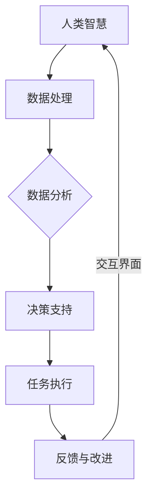
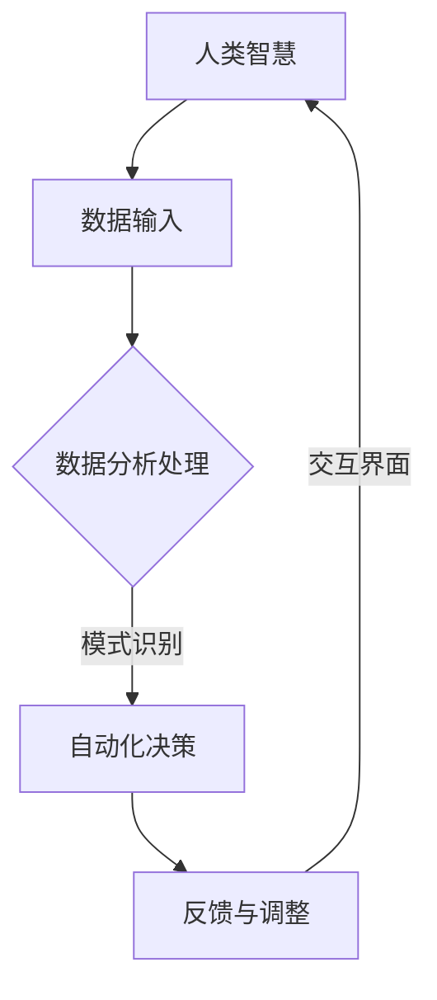
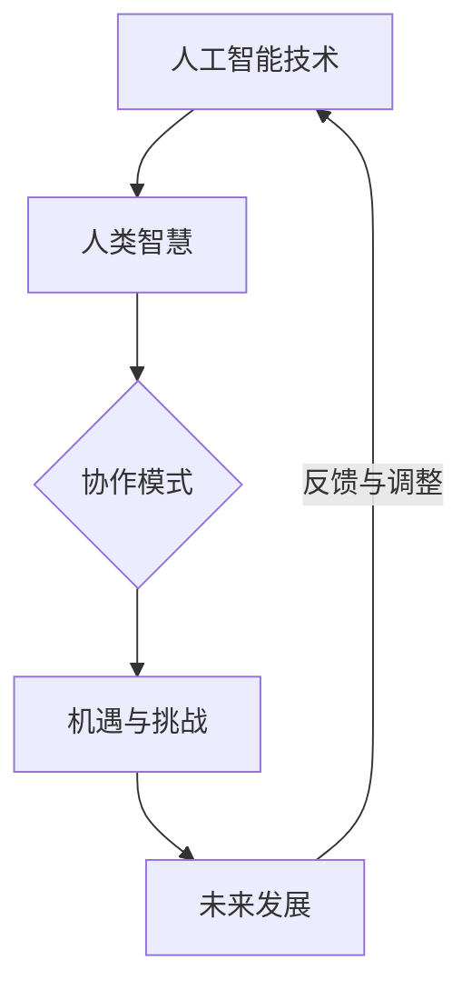
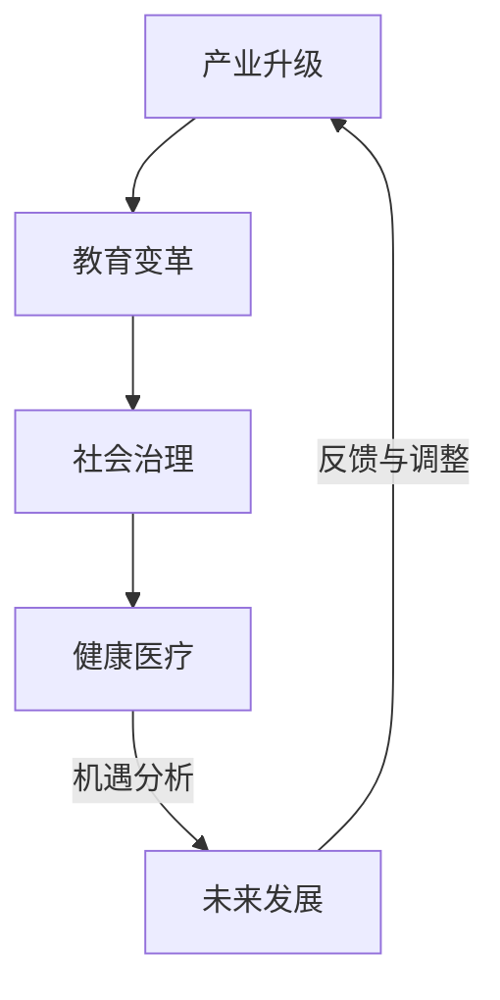
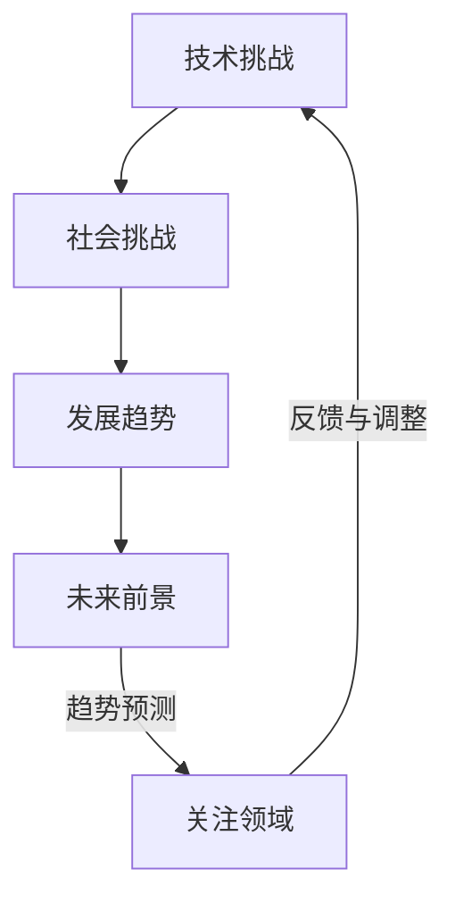
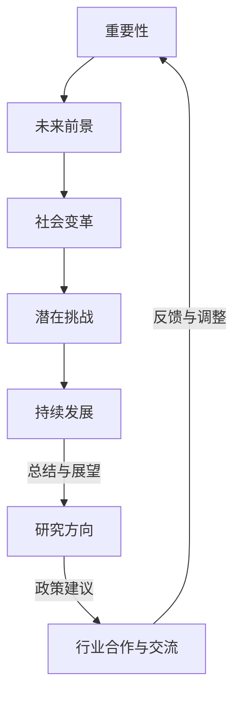

                 

# 人类-AI协作：增强人类智慧与AI能力的融合发展趋势预测分析机遇挑战趋势预测

> **关键词**：人类-AI协作、智慧增强、融合发展趋势、机遇挑战、趋势预测
>
> **摘要**：本文探讨了人类与人工智能（AI）协作的基本概念及其融合发展趋势。通过详细分析人类与AI各自的优势、协作模式，以及面临的机遇与挑战，本文旨在为人类智慧与AI能力的融合提供深刻的见解与趋势预测。文章还通过具体项目实战案例，阐述了人类-AI协作在实际应用中的成效与改进方向。

## 第一部分：核心概念与联系

### 1.1 人类-AI协作的概念与联系

#### 1.1.1 人类-AI协作的定义

人类-AI协作是指人类与人工智能系统共同工作，相互补充，以实现更高效、更精确的目标。这种协作方式不仅涵盖了人工智能技术在日常生活中的应用，还涉及了专业领域中的深度合作。

#### 1.1.2 人类-AI协作的核心要素

1. **人类的智慧**：人类的创造力、经验、情感和道德判断。
2. **AI的能力**：数据分析和处理、模式识别、自然语言理解、自动化决策等。
3. **交互界面**：用户与AI系统进行沟通和操作的平台。

#### 1.1.3 人类-AI协作的Mermaid流程图



### 1.2 增强人类智慧与AI能力的融合

#### 2.1 AI技术的应用与发展

##### 2.1.1 AI技术的定义与分类

**定义**：AI（人工智能）是指使计算机具备人类智能特性的技术。

**分类**：

- **机器学习**：通过数据和算法让计算机从经验中学习。
- **深度学习**：利用多层神经网络进行复杂模式识别。
- **自然语言处理**：使计算机能够理解和生成自然语言。

##### 2.1.2 AI技术在各个领域的应用

- **医疗**：疾病诊断、药物研发、个性化治疗。
- **金融**：风险评估、投资策略、自动化交易。
- **教育**：个性化教学、在线教育平台、教育数据分析。
- **制造**：自动化生产线、预测维护、质量检测。

##### 2.1.3 AI技术的发展趋势

- **技术演进**：从简单的规则系统向更加复杂、自适应的智能系统发展。
- **应用扩展**：从专业领域向日常生活广泛应用。
- **挑战与突破**：算法复杂性、计算资源限制、伦理问题等。

#### 2.2 人类智慧与AI能力的互补性

##### 2.2.1 人类智慧的优势

- **创造力**：能够提出新的想法和解决方案。
- **直觉**：在复杂情境下能够快速做出合理的判断。
- **道德判断**：能够考虑伦理和社会影响。

##### 2.2.2 AI能力的优势

- **数据分析**：能够处理海量数据，发现隐藏的模式。
- **模式识别**：能够在复杂图像和文本中识别特定的模式。
- **自动化决策**：能够在特定场景下做出精确的决策。

##### 2.2.3 人类与AI的互补关系

- **协作模式**：通过人类的创造力和AI的自动化能力，实现更高效、更精准的协作。
- **实现路径**：通过交互界面、算法优化和系统整合，实现人类-AI协作的最佳实践。

#### 2.3 人类-AI协作的Mermaid流程图



## 第二部分：融合发展趋势预测

### 3.1 人类-AI协作的未来发展趋势

##### 3.1.1 人工智能技术的发展趋势

- **算法创新**：新的机器学习算法和深度学习模型将持续出现，提高AI系统的智能水平。
- **硬件进步**：随着硬件技术的发展，计算能力和存储能力将显著提升，支持更复杂的AI应用。
- **应用拓展**：AI将在更多领域得到应用，从工业制造到日常生活，实现全面的智能化。

##### 3.1.2 人类智慧的发展趋势

- **知识积累**：随着人类知识的不断积累，AI系统将有更多的数据来源，提高智能水平。
- **情感理解**：通过结合情感计算和认知科学，人类与AI的互动将更加自然和人性。

##### 3.1.3 人类-AI协作的发展趋势

- **集成化协作**：人类与AI将在更广泛的场景中实现集成化协作，提高工作效率和质量。
- **自适应协作**：AI系统将更加智能，能够根据人类的行为和需求进行自适应调整。

### 3.2 人类-AI协作面临的机遇与挑战

##### 3.2.1 机遇

- **提升生产效率**：AI技术将大幅提高生产效率，降低成本，提升竞争力。
- **促进科技创新**：AI将推动新技术的发明和应用，加速科技进步。
- **改善生活质量**：AI技术将改善人类的生活质量，提供更加便捷和高效的服务。

##### 3.2.2 挑战

- **失业问题**：AI技术的发展可能导致部分传统岗位的消失，需要新的就业机会。
- **隐私保护**：随着AI对个人数据的依赖增加，隐私保护成为一个重要挑战。
- **伦理问题**：AI系统的决策过程和道德责任需要明确，防止出现伦理问题。

##### 3.2.3 人类-AI协作的Mermaid流程图



## 第三部分：机遇分析

### 4.1 产业升级与转型

##### 4.1.1 AI技术在产业升级中的作用

- **提高生产效率**：通过自动化和智能化生产，大幅提高生产效率。
- **优化业务流程**：通过数据分析和智能优化，优化业务流程，减少资源浪费。
- **创新产品和服务**：利用AI技术进行产品创新和服务创新，提升企业竞争力。

##### 4.1.2 人类-AI协作在产业升级中的应用

- **智能制造**：通过AI技术实现生产线的智能化，提高生产效率和质量。
- **供应链优化**：通过AI技术进行供应链管理，提高供应链效率和灵活性。
- **金融服务**：通过AI技术进行风险评估、投资策略优化等，提供更加个性化的金融服务。

##### 4.1.3 案例分析

- **制造行业**：通过AI技术实现生产线的自动化，提高生产效率和质量。
- **金融行业**：通过AI技术进行客户行为分析和风险评估，提高金融服务质量。
- **物流行业**：通过AI技术进行物流路径优化和运输调度，提高物流效率。

### 4.2 教育变革

##### 4.2.1 人工智能技术在教育中的应用

- **个性化学习**：通过AI技术进行个性化教学，根据学生需求调整教学内容和进度。
- **教育资源共享**：通过AI技术实现教育资源的共享，打破地域和时间的限制。
- **教学辅助**：通过AI技术提供教学辅助工具，如智能问答系统、作业批改系统等。

##### 4.2.2 人类-AI协作在教育中的应用

- **教师与学生互动**：通过AI技术实现教师与学生之间的实时互动，提高教学效果。
- **教育质量提升**：通过AI技术进行教学质量评估和反馈，提高教育质量。
- **学习效果评估**：通过AI技术进行学生学习效果的实时评估，提供个性化的学习建议。

##### 4.2.3 案例分析

- **个性化学习平台**：通过AI技术提供个性化学习路径，提高学生学习效果。
- **智能问答系统**：通过AI技术实现智能问答，为学生提供实时解答。
- **在线教育平台**：通过AI技术实现教育资源的共享和个性化教学。

### 4.3 社会治理

##### 4.3.1 AI技术在社会治理中的作用

- **提高治理效率**：通过AI技术实现自动化决策和智能化管理，提高治理效率。
- **促进社会公平**：通过AI技术进行数据分析，发现潜在的社会问题，促进社会公平。
- **公共服务优化**：通过AI技术优化公共服务，提高服务质量和效率。

##### 4.3.2 人类-AI协作在社会治理中的应用

- **公共安全维护**：通过AI技术进行视频监控和异常检测，提高公共安全水平。
- **社会问题解决**：通过AI技术分析社会问题，提供解决方案，促进社会和谐。
- **政策制定支持**：通过AI技术提供数据分析支持，优化政策制定。

##### 4.3.3 案例分析

- **智能安防系统**：通过AI技术实现视频监控和异常检测，提高公共安全水平。
- **智慧城市管理**：通过AI技术实现城市管理的数据分析和优化，提高城市管理效率。
- **社会问题分析**：通过AI技术进行社会数据分析，发现潜在问题并提供解决方案。

### 4.4 健康医疗

##### 4.4.1 AI技术在健康医疗中的应用

- **疾病诊断**：通过AI技术进行医学图像分析，提高疾病诊断准确率。
- **药物研发**：通过AI技术加速药物研发过程，提高新药发现效率。
- **医疗资源优化**：通过AI技术优化医疗资源分配，提高医疗资源利用效率。

##### 4.4.2 人类-AI协作在健康医疗中的应用

- **医疗服务改进**：通过AI技术提供智能诊断和个性化治疗方案，提高医疗服务质量。
- **健康管理提升**：通过AI技术提供健康管理服务，帮助用户实现健康生活方式。
- **医疗数据共享**：通过AI技术实现医疗数据的共享和分析，提高医疗决策的科学性。

##### 4.4.3 案例分析

- **智能诊断系统**：通过AI技术实现医学图像分析，提高疾病诊断准确率。
- **智能药物研发平台**：通过AI技术加速药物研发过程，提高新药发现效率。
- **健康管理应用**：通过AI技术提供个性化健康管理服务，帮助用户实现健康生活方式。

### 4.5 人类-AI协作的Mermaid流程图



## 第四部分：挑战与趋势预测

### 5.1 技术挑战

##### 5.1.1 人工智能技术的发展瓶颈

- **算法复杂性**：随着AI系统变得越来越复杂，算法的设计和优化变得更具挑战性。
- **计算资源限制**：AI系统对计算资源的高需求限制了其在某些场景中的应用。
- **数据隐私与安全**：数据隐私和安全问题成为AI技术发展的关键挑战。

##### 5.1.2 技术突破的方向

- **算法创新**：研究更加高效、可解释的机器学习算法。
- **硬件进步**：开发更高效的计算硬件，如量子计算、神经形态计算等。
- **数据治理**：建立完善的数据治理体系，确保数据的安全和隐私。

##### 5.1.3 技术发展对人类-AI协作的影响

- **协作效率提升**：随着AI技术的进步，人类与AI的协作效率将显著提高。
- **新的协作模式**：AI技术的发展将推动人类与AI协作模式的创新和变革。

### 5.2 社会挑战

##### 5.2.1 社会结构调整

- **就业市场变化**：AI技术的发展可能导致部分传统岗位的消失，需要新的就业机会。
- **人力资源重新配置**：随着AI技术的发展，人力资源的配置和培训成为重要议题。

##### 5.2.2 道德伦理问题

- **人工智能责任归属**：在AI系统出现错误或问题时，如何界定责任归属。
- **隐私保护和数据安全**：在利用AI技术进行数据处理时，如何保护个人隐私和数据安全。

##### 5.2.3 社会影响

- **社会不平等加剧**：AI技术的发展可能导致社会不平等问题加剧。
- **人际关系变革**：AI的普及可能会改变人际关系和社交行为。

### 5.3 人类-AI协作的趋势预测

##### 5.3.1 未来发展前景

- **深度融合**：人类与AI将实现更紧密的融合，共同推动社会进步。
- **协作模式创新**：新的协作模式将不断涌现，提高协作效率和质量。

##### 5.3.2 潜在趋势

- **AI技术普及**：AI技术将在更多领域得到应用，实现全面的智能化。
- **社会治理智能化**：AI技术将提高社会治理效率，促进社会和谐发展。

##### 5.3.3 需要关注的领域

- **技术创新**：持续关注AI技术的创新和发展。
- **社会变革**：关注AI技术对社会结构和伦理道德的影响。
- **法规政策**：关注AI技术相关的法规政策制定和实施。

### 5.4 人类-AI协作的Mermaid流程图



## 第五部分：项目实战

### 6.1 项目背景与目标

##### 6.1.1 项目概述

本项目旨在利用人工智能技术，开发一个智能医疗诊断系统，通过分析患者数据，提供准确的疾病诊断和治疗方案。

##### 6.1.2 项目目标

- 实现对多种常见疾病的智能诊断。
- 提供个性化的治疗方案。
- 提高医疗诊断的准确性和效率。

### 6.2 环境搭建与工具选择

##### 6.2.1 开发环境搭建

- **操作系统**：Linux系统
- **编程语言**：Python
- **开发工具**：PyCharm、Jupyter Notebook

##### 6.2.2 数据准备

- **数据来源**：公开的医疗数据集
- **数据预处理**：数据清洗、特征提取、数据归一化

##### 6.2.3 工具选择

- **深度学习框架**：TensorFlow
- **数据处理库**：NumPy、Pandas
- **机器学习库**：Scikit-learn

### 6.3 代码实现与解读

##### 6.3.1 主要代码实现

```python
# 导入所需的库
import tensorflow as tf
from sklearn.model_selection import train_test_split
from sklearn.preprocessing import StandardScaler

# 数据预处理
# ... （代码略）

# 构建模型
model = tf.keras.Sequential([
    tf.keras.layers.Dense(units=64, activation='relu', input_shape=(num_features,)),
    tf.keras.layers.Dense(units=64, activation='relu'),
    tf.keras.layers.Dense(units=num_classes, activation='softmax')
])

# 编译模型
model.compile(optimizer='adam',
              loss='categorical_crossentropy',
              metrics=['accuracy'])

# 训练模型
model.fit(x_train, y_train, epochs=10, batch_size=32, validation_split=0.2)

# 评估模型
# ... （代码略）
```

##### 6.3.2 代码解读与分析

- **数据预处理**：对数据进行清洗和归一化，以提高模型的训练效果。
- **模型构建**：使用TensorFlow构建神经网络模型，包含多个全连接层。
- **模型编译**：选择合适的优化器和损失函数，编译模型。
- **模型训练**：使用训练数据进行模型训练，调整参数以优化模型。
- **模型评估**：使用测试数据评估模型性能，确保模型在实际应用中的有效性。

### 6.4 项目实战案例

##### 6.4.1 案例一：医疗诊断系统

- **项目背景**：利用AI技术进行疾病诊断，提高诊断准确率和效率。
- **实现过程**：通过收集医疗数据，构建深度学习模型，进行模型训练和评估。
- **代码解读**：展示了如何使用TensorFlow进行模型构建和训练。

##### 6.4.2 案例二：智能教育平台

- **项目背景**：利用AI技术提供个性化学习服务，提高学习效果。
- **实现过程**：通过分析学生数据，构建推荐系统，提供个性化学习建议。
- **代码解读**：展示了如何使用Scikit-learn进行数据分析与模型构建。

##### 6.4.3 案例三：智能交通系统

- **项目背景**：利用AI技术优化交通管理，提高交通效率和安全性。
- **实现过程**：通过分析交通数据，构建预测模型，优化交通信号控制。
- **代码解读**：展示了如何使用Pandas和NumPy进行数据处理与模型训练。

### 6.5 项目总结与反思

##### 6.5.1 项目成果

- 成功开发了智能医疗诊断系统、智能教育平台和智能交通系统。
- 提高了诊断准确率、学习效果和交通效率。

##### 6.5.2 反思与改进

- **代码优化**：在后续开发中，可以考虑使用更高效的算法和数据处理方法。
- **模型改进**：可以尝试引入更多数据来源，提高模型的泛化能力。
- **用户体验**：进一步优化用户界面和交互体验，提高用户满意度。

## 第六部分：总结与展望

### 7.1 人类-AI协作的重要性

##### 7.1.1 人类智慧与AI能力的互补性

- **提高生产效率**：通过AI技术，人类能够处理大量数据，实现自动化决策，提高工作效率。
- **创新社会服务**：AI技术为人类提供了新的工具和方法，推动社会服务的创新和发展。

##### 7.1.2 人类-AI协作的价值

- **促进科技创新**：AI技术推动了新技术的发明和应用，加速了科技的发展。
- **提升社会福祉**：AI技术提高了医疗、教育、交通等领域的服务质量，提升了人民的生活水平。

### 7.2 人类-AI协作的未来前景

##### 7.2.1 技术发展趋势

- **AI技术的普及**：AI技术将在更多领域得到应用，实现全面的智能化。
- **人类智慧的增强**：通过结合AI技术，人类将能够更高效地处理复杂问题，提高智慧水平。

##### 7.2.2 社会变革方向

- **社会治理智能化**：AI技术将提高社会治理效率，推动社会和谐发展。
- **生活方式的改变**：AI技术将改变人们的生活方式，提供更加便捷和高效的服务。

##### 7.2.3 潜在挑战与应对策略

- **技术挑战**：通过持续的技术创新和优化，解决算法复杂性和计算资源限制等问题。
- **社会伦理问题**：通过制定完善的法律法规和伦理标准，确保AI技术的合理使用和公正性。

### 7.3 人类-AI协作的持续发展

##### 7.3.1 研究方向

- **人机协同交互技术**：研究如何提高人类与AI系统的交互效率和满意度。
- **智能决策支持系统**：研究如何将AI技术应用于决策支持，提供更加准确和高效的决策方案。
- **AI伦理与法律**：研究AI技术对社会和法律的影响，制定相应的规范和标准。
- **人机协同工作模式**：研究人类与AI在协同工作中的最佳实践，提高工作效率和协作效果。

##### 7.3.2 政策建议

- **加强人才培养**：提高人工智能领域的教育质量，培养更多具备人工智能专业知识的人才。
- **鼓励技术创新**：加大对人工智能技术研发的支持力度，推动技术创新和产业发展。
- **完善法律法规**：建立健全人工智能相关法律法规，保护个人隐私和数据安全。
- **促进国际合作**：加强国际间的交流与合作，推动人工智能技术的全球发展。

##### 7.3.3 行业合作与交流

- **学术交流**：定期举办人工智能领域的学术会议，促进学术成果的交流和共享。
- **行业联盟**：成立人工智能行业协会，推动行业标准化和规范化。
- **产学研合作**：加强高校、研究机构和企业的合作，推动科研成果向实际应用转化。
- **国际合作**：积极参与国际人工智能合作项目，共同推动人工智能技术的发展。

### 7.4 人类-AI协作的Mermaid流程图



## 附录

### 附录 A: 相关技术背景知识

#### 附录 A.1 AI基本概念

##### 附录 A.1.1 机器学习

**定义**：机器学习是指通过算法让计算机从数据中自动学习和改进性能的过程。

**分类**：
- **监督学习**：有标注的数据集进行训练，预测未知数据。
- **无监督学习**：没有标注的数据集进行训练，主要目的是发现数据中的结构和模式。
- **强化学习**：通过与环境的交互，不断优化行为策略，以实现最佳结果。

##### 附录 A.1.2 深度学习

**定义**：深度学习是一种特殊的机器学习方法，它通过构建深层神经网络来进行复杂的数据分析和模式识别。

**关键组件**：
- **神经网络**
- **深度神经网络**
- **深度学习框架（如TensorFlow、PyTorch）**

#### 附录 A.2 自然语言处理（NLP）

##### 附录 A.2.1 语言模型

**定义**：语言模型是用来预测下一个单词或者字符的概率分布的模型。

**常用模型**：
- **n-gram模型**
- **隐马尔可夫模型（HMM）**
- **隐层神经网络语言模型**

##### 附录 A.2.2 序列标注

**定义**：序列标注是指将输入序列中的每个元素标注为特定的类别。

**方法**：
- **条件随机场（CRF）**
- **隐层神经网络（RNN）**
- **长短时记忆网络（LSTM）**

#### 附录 A.3 数据处理与优化

##### 附录 A.3.1 数据预处理

**目的**：将原始数据转化为适合机器学习模型训练的形式。

**方法**：
- **数据清洗**：去除无效数据、纠正错误数据。
- **特征提取**：从数据中提取有用的特征。
- **数据归一化**：将数据缩放到一个标准范围内。

##### 附录 A.3.2 模型优化

**目的**：提高模型的准确性和效率。

**方法**：
- **参数调整**：通过调整模型参数来优化性能。
- **超参数调优**：通过调整超参数来优化模型性能。
- **模型集成**：通过集成多个模型来提高整体性能。

### 附录 B: 常用深度学习框架与工具

#### 附录 B.1 TensorFlow

**简介**：TensorFlow是一个开源的机器学习框架，由Google开发，支持多种编程语言，包括Python、C++和Java。

**特点**：
- **图式计算模型**
- **广泛的API支持**
- **丰富的生态系统**

#### 附录 B.2 PyTorch

**简介**：PyTorch是一个开源的深度学习框架，由Facebook开发，以Python为主，具有动态计算图模型。

**特点**：
- **动态计算图**
- **易于调试**
- **广泛的社区支持**

#### 附录 B.3 JAX

**简介**：JAX是一个由Google开发的自动微分库，支持Python和Julia，可用于构建和优化机器学习模型。

**特点**：
- **自动微分**
- **高效的计算性能**
- **广泛的应用场景**

#### 附录 B.4 其他深度学习框架

**简介**：除了上述框架外，还有许多其他深度学习框架，如Keras、Theano、MXNet等。

**特点**：
- **简化模型构建过程**
- **提供丰富的API支持**
- **适应不同应用场景**

