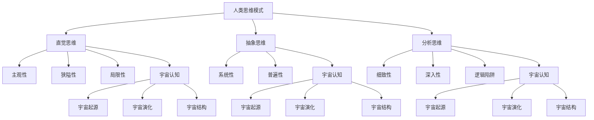

                 

# 《人类思维模式对宇宙认知的局限》

## 概述

> “宇宙之大，无奇不有。”这句古老的谚语道出了人类对宇宙无限探索的渴望。然而，随着人类认知能力的不断提升，我们逐渐发现，我们的思维模式在理解宇宙的过程中存在诸多局限。本文旨在探讨人类思维模式对宇宙认知的局限，并思考如何跨越这些局限，进一步拓展我们对宇宙的理解。”

### 关键词

- 人类思维模式
- 宇宙认知
- 局限
- 科学方法论
- 科技进步

### 摘要

本文首先介绍了人类认知的局限性，包括思维的主观性、狭隘性和局限性。随后，探讨了宇宙认知的挑战，如宇宙尺度的复杂性和演化的不确定性。接着，分析了人类思维模式的基本特征和局限性，并探讨了这些局限性对宇宙认知的影响。在此基础上，提出了跨越认知局限的方法，包括科学方法论的发展和新认知工具的引入。最后，展望了人类认知局限性的未来趋势以及宇宙认知的未来方向。通过本文的探讨，我们希望能够引发对人类思维模式与宇宙认知之间关系的深入思考。”

## 《人类思维模式对宇宙认知的局限》目录大纲

### 第一部分：引言与背景

- 1.1 人类认知的局限性
  - 1.1.1 人类思维的局限性
  - 1.1.2 人类认知模式的历史演变
- 1.2 宇宙认知的挑战
  - 1.2.1 宇宙尺度的复杂性
  - 1.2.2 宇宙演化的不确定性

### 第二部分：人类思维模式分析

- 2.1 人类思维的基本模式
  - 2.1.1 直觉思维
  - 2.1.2 抽象思维
  - 2.1.3 分析思维
- 2.2 人类思维的局限性
  - 2.2.1 主观性
  - 2.2.2 狭隘性
  - 2.2.3 局限性

### 第三部分：宇宙认知的局限

- 3.1 宇宙认知的核心问题
  - 3.1.1 宇宙起源
  - 3.1.2 宇宙演化
  - 3.1.3 宇宙的结构与性质
- 3.2 人类认知的局限性对宇宙认知的影响
  - 3.2.1 宇宙起源认知的局限
  - 3.2.2 宇宙演化认知的局限
  - 3.2.3 宇宙结构与性质认知的局限

### 第四部分：跨越认知局限的方法

- 4.1 科学方法论的发展
  - 4.1.1 经验主义的局限性
  - 4.1.2 理性主义的发展
  - 4.1.3 科学实证主义的方法
- 4.2 新的认知工具
  - 4.2.1 科技对认知的拓展
  - 4.2.2 宇宙观测工具的发展
  - 4.2.3 数据分析与建模

### 第五部分：人类认知的局限性与宇宙认知的未来

- 5.1 人类认知局限性的未来趋势
  - 5.1.1 技术进步的影响
  - 5.1.2 科学发展的推动
  - 5.1.3 人类思维的进化
- 5.2 宇宙认知的未来方向
  - 5.2.1 宇宙起源的研究
  - 5.2.2 宇宙演化的理解
  - 5.2.3 宇宙结构的探索

### 第六部分：结论与展望

- 6.1 人类认知的局限性对宇宙认知的启示
  - 6.1.1 认知局限的反思
  - 6.1.2 跨越认知局限的路径
  - 6.1.3 宇宙认知的未来
- 6.2 对未来的展望
  - 6.2.1 人类认知的持续进步
  - 6.2.2 宇宙认知的无限探索
  - 6.2.3 人类与宇宙的和谐共生

### 附录

- 附录 A：参考文献
- 附录 B：Mermaid 流程图
- 附录 C：核心算法原理与伪代码
- 附录 D：项目实战案例”

## 第一部分：引言与背景

### 1.1 人类认知的局限性

#### 1.1.1 人类思维的局限性

人类作为地球上的一种智慧生物，拥有着独特的认知能力，使我们能够理解世界，探索宇宙。然而，我们的思维模式并非无所不能，它有其固有的局限性。首先，人类思维具有主观性。我们总是从自己的视角出发，受到个体经验和文化背景的影响。这种主观性使得我们在认知世界时，往往难以摆脱自身的偏见和成见。

其次，人类思维具有狭隘性。我们的认知范围受到物理、生理和心理因素的制约。例如，我们的感官限制了我们对宇宙的感知，我们的认知能力受到大脑处理信息的速度和容量的限制。这使得我们在理解复杂系统时，往往只能看到局部，而难以把握整体。

最后，人类思维具有局限性。我们的认知能力受到进化历程的限制，这使得我们难以理解一些非线性的、高度复杂的现象。例如，宇宙的起源和演化是一个极其复杂的过程，人类思维很难完全把握其本质。

#### 1.1.2 人类认知模式的历史演变

人类的认知模式并非一成不变，它随着历史的演进而不断发展和变化。早期的人类主要通过直觉来认识世界，他们依靠本能和直接的感官经验来应对环境。这种直觉思维虽然简单，但缺乏系统性和科学性。

随着文明的发展，人类逐渐开始运用抽象思维。抽象思维使人们能够从具体的、感性的认知转向抽象的、理性的思考。例如，数学和逻辑学的出现，使得人类能够更精确地描述和预测自然现象。

然而，抽象思维也有其局限性。它过于强调形式化和逻辑性，容易忽视事物的本质联系。为了弥补这一不足，人类又发展出了分析思维。分析思维强调对事物进行分解，从局部入手，逐层深入，从而更好地理解整体。

总的来说，人类认知模式的历史演变是一个不断克服局限、追求更高效、更全面认知的过程。然而，人类思维的这些局限性仍然制约着我们对宇宙的认知。

### 1.2 宇宙认知的挑战

宇宙的尺度庞大而复杂，这给人类的认知带来了巨大的挑战。首先，宇宙的尺度极为巨大。根据目前的观测，宇宙的直径可能超过930亿光年，这是一个难以想象的空间尺度。人类感官难以直接感知如此庞大的宇宙，我们只能通过间接的方式，如观测宇宙中的星光和粒子，来推测宇宙的真实面貌。

其次，宇宙演化的不确定性也是一大挑战。宇宙的演化过程是一个复杂、不可逆的过程，它涉及到众多变量和可能的路径。目前，科学家们对于宇宙起源和演化仍有诸多未解之谜，如暗物质、暗能量的本质，宇宙加速膨胀的原因等。这些未知因素使得宇宙演化成为一个充满不确定性的领域。

最后，宇宙的结构与性质也给我们的认知带来了困难。宇宙中存在着大量的星系、恒星、行星等天体，它们之间的相互作用和演化构成了宇宙的复杂结构。此外，宇宙的性质，如能量、信息、物质等，也具有多层次、多维度特征。这些复杂性和多样性使得我们对宇宙的理解变得更加困难。

总的来说，宇宙认知的挑战不仅在于其尺度巨大、演化复杂，还在于其结构多样、性质独特。人类思维的局限性在这其中起到了关键作用，限制了我们对宇宙的全面认知。为了克服这些挑战，人类需要不断发展和完善认知工具，提升认知能力，以更全面、更深入地理解宇宙。

### 1.3 人类思维模式与宇宙认知的相互影响

人类思维模式与宇宙认知之间存在着深刻的相互影响。一方面，人类思维模式决定了我们对宇宙的认知方式和深度；另一方面，宇宙的认知又不断推动人类思维模式的进步和完善。

首先，人类思维模式影响了对宇宙的认知深度。由于人类思维的主观性、狭隘性和局限性，我们在理解宇宙时往往只能看到部分真相，难以全面把握宇宙的复杂性和多样性。例如，直觉思维使我们能够快速感知宇宙中的某些现象，但缺乏系统性和科学性；抽象思维使我们能够从宏观角度理解宇宙，但容易忽视微观细节；分析思维虽然有助于深入探讨宇宙的局部规律，但难以全面把握整体。

其次，宇宙的认知又不断推动人类思维模式的进步。随着对宇宙的不断探索，人类逐渐发现了一些新的现象和规律，这促使我们重新审视和改进自己的思维模式。例如，对宇宙演化的研究促使我们发展出新的理论框架，如大爆炸理论、黑洞理论等；对宇宙尺度的观测使我们认识到宇宙的浩瀚和多样性，从而促使我们提升抽象思维和系统思维能力。

总的来说，人类思维模式与宇宙认知之间的相互影响是一个动态的过程。人类思维模式的局限性制约了对宇宙的认知深度，但宇宙的认知又不断推动人类思维模式的进步和完善。为了更好地理解宇宙，人类需要不断突破思维模式的局限，发展出更加全面、深入的认知方式。

### 1.4 文章结构概述

本文将从以下几个方面展开对人类思维模式对宇宙认知的局限的探讨：

1. **第一部分：引言与背景**，介绍人类认知的局限性以及宇宙认知的挑战。
2. **第二部分：人类思维模式分析**，详细讨论人类思维的基本模式及其局限性。
3. **第三部分：宇宙认知的局限**，分析宇宙认知的核心问题及其对人类认知的影响。
4. **第四部分：跨越认知局限的方法**，探讨科学方法论的发展和新认知工具的引入。
5. **第五部分：人类认知的局限性与宇宙认知的未来**，展望人类认知局限性的未来趋势和宇宙认知的未来方向。
6. **第六部分：结论与展望**，总结人类认知的局限性对宇宙认知的启示，并对未来进行展望。

通过这一系列探讨，我们希望能够深入理解人类思维模式对宇宙认知的局限，并思考如何克服这些局限，进一步拓展我们对宇宙的理解。

### 第一部分：引言与背景

#### 1.1 人类认知的局限性

**人类思维的主观性**

人类思维的主观性是我们认知宇宙的第一个主要局限。我们的认知过程受到个人经验、情感、文化和社会背景的深刻影响。例如，我们在观察星空时，会受到自己的文化传统和科学知识的制约，从而对宇宙的某些现象做出不同的解读。主观性使得我们在认知宇宙时难以摆脱个体偏见，这直接影响了我们对宇宙真实面貌的理解。

**人类思维的狭隘性**

人类思维的狭隘性表现在我们的认知范围受限于感官和认知能力的限制。我们的感官只能感知有限的信息，而大脑处理信息的能力也有其极限。例如，我们无法直接感知到微观世界的量子现象，也无法完全理解宇宙的宏观尺度。这种狭隘性限制了我们对宇宙复杂性的全面把握。

**人类思维的局限性**

人类思维的局限性还体现在我们的认知过程中存在许多先天性的缺陷。例如，我们的直觉思维往往只能捕捉到事物的表面现象，而无法深入理解其本质。我们的分析思维虽然有助于我们理解和解决问题，但它也容易陷入逻辑陷阱，导致片面、静止的思维方式。这种局限性使得我们在面对复杂、动态的宇宙现象时，往往难以做出准确的判断。

**人类认知模式的历史演变**

**直觉思维**

在人类认知的早期阶段，直觉思维占据了主导地位。直觉思维是一种基于感官体验和本能反应的认知方式。它使人类能够快速适应环境，但缺乏系统性和科学性。例如，原始人类通过直觉来识别猎物和危险，从而在生存竞争中占据优势。

**抽象思维**

随着文明的发展，人类逐渐开始运用抽象思维。抽象思维使人们能够从具体的、感性的认知转向抽象的、理性的思考。数学和逻辑学的出现，标志着人类抽象思维的重要进步。它使人们能够更精确地描述和预测自然现象，从而推动了科学的发展。

**分析思维**

在现代社会，分析思维成为主流。分析思维强调对事物进行分解，从局部入手，逐层深入，从而更好地理解整体。这种方法在科学研究和技术开发中发挥了重要作用，但它也存在一定的局限性，如容易忽视事物之间的联系和整体性。

**人类认知模式的历史演变对宇宙认知的影响**

人类认知模式的历史演变对宇宙认知产生了深远的影响。直觉思维使我们能够快速感知宇宙的某些现象，但容易受到主观性和狭隘性的限制。抽象思维使我们能够从宏观角度理解宇宙，但难以深入理解微观和宏观之间的联系。分析思维虽然有助于我们深入探讨宇宙的局部规律，但难以全面把握宇宙的整体结构。

总之，人类认知的主观性、狭隘性和局限性，以及认知模式的历史演变，共同构成了人类在认知宇宙过程中的主要局限。为了更全面、更深入地理解宇宙，人类需要不断发展和完善认知工具，提升认知能力。

#### 1.2 宇宙认知的挑战

**宇宙尺度的复杂性**

宇宙的尺度之大，远远超出了我们日常生活的经验范围。目前观测到的宇宙直径约为930亿光年，这是一个极其庞大的数字。这样的尺度使得我们很难直接感知和理解宇宙的全貌。例如，在宏观尺度上，我们无法直接观测到宇宙的膨胀过程；在微观尺度上，我们无法直接观察到量子粒子的行为。这种尺度的复杂性给我们的认知带来了巨大的挑战。

**宇宙演化的不确定性**

宇宙的演化过程是一个复杂而不可预测的过程。从大爆炸至今，宇宙经历了数十亿年的演变。在这个过程中，宇宙的形态和结构发生了巨大变化。例如，星系的形成和演化、恒星的生命周期、行星的诞生和毁灭等，都是宇宙演化过程中的重要现象。然而，这些现象的演化规律并不完全明确，存在诸多不确定性。例如，暗物质和暗能量的本质仍然是科学界未解之谜，宇宙加速膨胀的原因也尚不清楚。这些不确定性使得我们难以准确预测宇宙的未来。

**宇宙结构的多样性**

宇宙的结构复杂多样，从宇宙大尺度上的星系团、星系，到小尺度上的行星、恒星，再到微观尺度上的原子、粒子，构成了一个多层次、多维度的宇宙结构。这种多样性使得我们对宇宙的认知更加复杂。例如，星系的形态多种多样，有的呈螺旋状，有的呈椭圆状；恒星的颜色和亮度也各不相同，有的亮如白昼，有的暗如煤球。这种多样性不仅增加了我们认知的难度，也为我们理解宇宙的统一性带来了挑战。

**宇宙认知的这些挑战对人类思维的影响**

面对宇宙尺度的复杂性、演化的不确定性和结构的多样性，人类思维受到了极大的挑战。首先，人类思维的主观性和狭隘性使得我们难以全面把握宇宙的真实面貌。我们容易受到自己的经验和知识的限制，难以超越个体的视角来理解宇宙。其次，人类思维的局限性使得我们难以应对复杂、动态的宇宙现象。我们的直觉思维和抽象思维难以深入理解宇宙的复杂性和多样性。最后，人类思维的这些局限也影响了我们在科学研究和探索宇宙过程中所做的决策。我们可能会因为缺乏对宇宙全貌的理解而做出错误的判断，导致科学研究和探索的进展受阻。

总之，宇宙认知的挑战对人类思维提出了严峻的考验。为了更好地理解宇宙，人类需要不断发展和完善认知工具，提升认知能力，以应对这些挑战。这需要我们跨越思维的局限，以更全面、更深入的视角来看待宇宙，从而揭示宇宙的奥秘。

### 第二部分：人类思维模式分析

#### 2.1 人类思维的基本模式

**直觉思维**

直觉思维是一种基于感官体验和本能反应的认知方式。它使我们能够迅速地对周围环境做出反应，是我们在日常生活中不可或缺的一部分。例如，当我们看到一只猫时，我们立即知道它是一种动物，而不需要通过复杂的推理过程来确认这一点。直觉思维的优势在于其快速和高效，但缺点是它容易受到主观性和个体经验的影响，导致判断的偏差。

**抽象思维**

抽象思维是一种从具体事物中提取共性和本质特征，形成抽象概念和理论框架的认知方式。数学、逻辑学和哲学等领域的发展，都得益于抽象思维的运用。例如，通过抽象思维，我们可以将复杂的问题简化为数学模型，从而更准确地描述和预测自然现象。抽象思维的优点在于其系统性和普遍性，但缺点是它容易忽视事物的具体细节和背景，导致对问题理解的不完整。

**分析思维**

分析思维是一种将复杂事物分解为更简单的组成部分，逐层深入，从而理解其本质的认知方式。科学研究和技术开发中广泛应用了分析思维。例如，通过分析，我们可以将复杂的物理现象分解为基本力、粒子和相互作用，从而深入理解其内在机制。分析思维的优点在于其细致和深入，但缺点是它容易陷入细节，忽视整体和联系。

#### 2.2 人类思维的局限性

**主观性**

人类思维的主观性是指我们的认知过程受到个人经验、情感和文化背景的深刻影响。例如，不同文化背景的人对同一现象可能会有不同的理解。这种主观性使得我们的认知容易受到偏见和误解的影响，难以达到客观真实的认知。

**狭隘性**

人类思维的狭隘性表现在我们的认知范围受到感官和认知能力的限制。例如，我们的感官只能感知有限的信息，大脑处理信息的能力也有其极限。这种狭隘性使得我们在面对复杂、动态的现象时，往往难以全面理解和把握。

**局限性**

人类思维的局限性还体现在我们的认知过程中存在许多先天性的缺陷。例如，我们的直觉思维往往只能捕捉到事物的表面现象，而无法深入理解其本质。我们的分析思维虽然有助于我们理解和解决问题，但也容易陷入逻辑陷阱，导致片面、静止的思维方式。

#### 2.3 人类思维模式与宇宙认知的相互关系

**直觉思维与宇宙认知**

直觉思维在宇宙认知中具有一定的作用，它使我们能够快速感知和识别宇宙中的某些现象。例如，通过直觉，我们可以感知到星星和行星的存在。然而，直觉思维的主观性和局限性也使得它在宇宙认知中存在不足。例如，我们无法通过直觉理解黑洞的强大引力或量子力学的奇妙现象。

**抽象思维与宇宙认知**

抽象思维在宇宙认知中发挥了重要作用。通过抽象思维，我们可以从具体的宇宙现象中提取出共性和本质特征，构建出理论框架。例如，爱因斯坦的广义相对论就是通过抽象思维将重力和时空联系起来。然而，抽象思维也容易忽视具体细节和背景，导致对问题理解的不完整。例如，在解释宇宙加速膨胀时，虽然抽象思维帮助我们理解了暗能量的存在，但具体是什么性质的暗能量仍不明确。

**分析思维与宇宙认知**

分析思维在宇宙认知中同样具有重要地位。通过分析，我们可以将复杂的宇宙现象分解为基本组成部分，从而深入理解其本质。例如，通过分析，我们可以将星系的形成和演化分解为恒星的形成、行星的形成等。然而，分析思维也容易陷入细节，忽视整体和联系。例如，在研究黑洞时，虽然我们可以分析其引力、辐射等特性，但难以全面理解黑洞与宇宙其他天体之间的相互作用。

总的来说，人类思维模式在宇宙认知中既有积极作用，也存在局限性。为了更全面、更深入地理解宇宙，我们需要克服思维模式的局限性，发展出更加多元和综合的认知方式。

### 第三部分：宇宙认知的核心问题

宇宙认知的核心问题主要包括宇宙起源、宇宙演化和宇宙的结构与性质。这些问题不仅关乎宇宙的本质，也对人类对自身和世界的认知具有重要意义。

#### 3.1.1 宇宙起源

宇宙起源一直是科学界探讨的热点问题之一。目前主流的理论是宇宙大爆炸理论，该理论认为宇宙起源于大约138亿年前的一个极高温度和密度状态。在大爆炸后，宇宙开始迅速膨胀，物质和能量开始分散。然而，宇宙大爆炸理论仍然存在许多未解之谜，如宇宙如何从极高温高密状态演变为当前的状态，以及宇宙大爆炸之前的状态是什么。

#### 3.1.2 宇宙演化

宇宙演化是指宇宙从大爆炸至今的演变过程。在这个过程中，宇宙经历了多个重要阶段，包括宇宙微波背景辐射的生成、星系的形成、恒星和行星的诞生等。宇宙演化涉及许多复杂的过程，如物质能量的相互作用、引力的作用等。当前，科学家们对宇宙演化的理解仍然存在许多不确定性，如暗物质和暗能量的本质、宇宙加速膨胀的原因等。

#### 3.1.3 宇宙的结构与性质

宇宙的结构与性质是宇宙认知中的另一个核心问题。宇宙中存在着多种多样的结构，从宏观的星系团、星系，到微观的恒星、行星，再到更基本的粒子，构成了一个复杂而美丽的宇宙结构。此外，宇宙还具有多种性质，如能量、信息、物质等。这些结构和性质不仅决定了宇宙的演化过程，也对我们理解宇宙的起源和未来具有重要意义。

#### 3.1.4 宇宙认知的局限性

宇宙起源、演化和结构性质的研究虽然取得了显著进展，但人类认知的局限性仍然对宇宙认知产生了深远影响。

首先，宇宙尺度巨大，使得我们难以直接观测和测量宇宙中的现象。例如，宇宙的直径约为930亿光年，这是极其庞大的尺度，超出了我们日常生活的经验范围。

其次，宇宙演化过程复杂而不可逆，使得我们难以准确预测宇宙的未来。宇宙演化的每一个阶段都受到多种因素的共同影响，而这些因素之间的相互作用又非常复杂，这使得我们对宇宙演化的理解存在很大的不确定性。

最后，宇宙的结构和性质多样且多层次，使得我们难以全面把握宇宙的整体面貌。例如，宇宙中存在着多种不同类型的星系和恒星，这些天体之间的相互作用和演化过程也非常复杂。

总的来说，宇宙起源、演化和结构性质是宇宙认知的核心问题，但人类认知的局限性使得我们对这些问题的理解仍然存在许多不足。为了更全面、更深入地理解宇宙，我们需要不断改进和拓展我们的认知工具，提升认知能力。

### 3.2 人类认知的局限性对宇宙认知的影响

#### 3.2.1 宇宙起源认知的局限

宇宙起源是宇宙认知的核心问题之一，但目前我们对宇宙起源的理解仍然存在诸多局限。首先，由于宇宙的尺度巨大，我们难以直接观测到宇宙的起源。根据宇宙大爆炸理论，宇宙起源于约138亿年前的一个极高温度和密度状态，但这个原始状态的细节仍然模糊不清。其次，人类思维的主观性和狭隘性也限制了我们对宇宙起源的理解。我们依赖于现有的科学理论和观测数据，但它们可能无法完全解释宇宙起源的复杂过程。例如，暗物质和暗能量的本质仍然是一个未解之谜，这直接影响了我们对宇宙起源的理解。

#### 3.2.2 宇宙演化认知的局限

宇宙演化是一个复杂而不可逆的过程，我们对宇宙演化的理解也受到认知局限的影响。首先，宇宙演化的每一个阶段都受到多种因素的共同影响，这些因素之间的相互作用非常复杂。例如，星系的形成和演化受到引力和恒星物理过程的影响，而恒星的生命周期又受到核聚变过程的影响。这种复杂性使得我们难以准确预测宇宙演化的具体细节。其次，宇宙演化的不可逆性使得我们无法通过实验来重现宇宙的演化过程，这限制了我们对宇宙演化机制的理解。例如，宇宙加速膨胀的原因仍然是一个未解之谜，科学家们提出的多种理论，如暗能量，但它们仍然缺乏确凿的证据。

#### 3.2.3 宇宙结构与性质认知的局限

宇宙的结构和性质是我们对宇宙认知的重要组成部分，但我们的认知也受到各种局限。首先，宇宙的结构多样且多层次，从宏观的星系和星系团，到微观的恒星、行星和基本粒子，这些结构之间的相互作用非常复杂。例如，星系的形成和演化受到引力、恒星物理过程等多种因素的影响，这使得我们难以全面理解宇宙的结构。其次，宇宙的性质也具有多样性，如能量、信息、物质等。这些性质之间的相互作用和转换机制，是我们理解宇宙的关键。然而，由于人类思维的主观性和狭隘性，我们难以全面把握宇宙的多样性和复杂性。例如，我们对量子力学和相对论的理解虽然取得了重要进展，但它们之间的统一理论仍然是一个未解之谜。

总的来说，人类认知的局限性在宇宙起源、演化和结构性质认知中起到了关键作用。为了更全面、更深入地理解宇宙，我们需要克服这些认知局限，发展出更加多元和综合的认知方式。

### 第四部分：跨越认知局限的方法

为了克服人类认知的局限性，我们需要采用一系列方法和工具来拓展我们的认知边界。这些方法包括科学方法论的发展、新认知工具的引入以及科技对认知的拓展。

#### 4.1 科学方法论的发展

**经验主义与理性主义的局限性**

传统科学方法论主要包括经验主义和理性主义。经验主义强调通过实验和观察来积累知识，这种方法在自然科学的发展中发挥了重要作用。然而，经验主义也存在一定的局限性，如数据的主观性和实验的可重复性问题。理性主义则强调逻辑推理和抽象思维，但过于强调理性可能导致忽视具体的实验数据和观测结果。

**科学实证主义的兴起**

为了克服经验主义和理性主义的局限性，科学实证主义应运而生。科学实证主义强调通过严格的方法和工具，如实验设计、数据分析等，来验证和推翻科学假设。这种方法使得科学知识更加可靠和可重复。科学实证主义的发展，如实验设计、统计分析、计算机模拟等工具的应用，为科学家们提供了更强大的认知工具。

**科学方法论的发展对宇宙认知的影响**

科学方法论的发展对宇宙认知产生了深远的影响。例如，在宇宙起源和演化研究中，科学家们通过实验设计和数据分析，对宇宙大爆炸理论和暗物质、暗能量等假设进行了验证和探讨。此外，科学实证主义的发展也促进了新理论和新方法的产生，如量子引力理论和多宇宙理论，为宇宙认知提供了新的视角和思路。

#### 4.2 新的认知工具

**科技对认知的拓展**

科技的进步为我们提供了新的认知工具，极大地拓展了我们的认知能力。以下是一些关键的新认知工具：

**1. 宇宙观测工具的发展**

宇宙观测工具的发展，如射电望远镜、光学望远镜、X射线望远镜等，使我们能够观测到宇宙的更远、更细致的部分。这些工具帮助我们揭示了宇宙的许多奥秘，如宇宙微波背景辐射、黑洞和星系的形成等。

**2. 数据分析与建模**

随着数据量的不断增加，数据分析与建模成为了一种重要的认知工具。通过大数据分析和机器学习，我们可以从大量数据中提取出有价值的信息和规律。例如，科学家们利用数据分析技术，揭示了宇宙演化的模式和规律，为宇宙认知提供了新的视角。

**3. 虚拟现实与增强现实**

虚拟现实（VR）和增强现实（AR）技术为人类提供了一种全新的认知方式。通过VR和AR，我们可以模拟和再现宇宙的各种现象，如恒星的形成、星系碰撞等。这种沉浸式的体验有助于我们更直观地理解宇宙的复杂性和多样性。

#### 4.3 科技对认知的拓展

**跨学科合作的重要性**

科技的进步不仅带来了新的认知工具，也促使了跨学科合作的发展。物理学、天文学、生物学、计算机科学等不同学科的交叉融合，为宇宙认知提供了新的方法和思路。例如，通过结合物理学和计算机科学，科学家们开发出了高性能计算模拟，可以模拟宇宙的演化过程，揭示宇宙的奥秘。

**科学教育的普及与提升**

科学教育在提升人类认知能力方面发挥着重要作用。通过科学教育，我们可以普及科学知识，提高公众的科学素养。此外，科学教育的普及还有助于培养新一代科学家，推动科学研究的进步。

总之，跨越认知局限的方法包括科学方法论的发展、新认知工具的引入以及科技对认知的拓展。这些方法和工具为人类提供了更全面、更深入的认知视角，有助于我们更好地理解宇宙的奥秘。随着科技的不断进步，我们有理由相信，人类对宇宙的认知将不断拓展和深化。

### 4.4 人类认知局限性的未来趋势

随着科技的不断进步，人类认知的局限性将面临一系列挑战和变革。以下是一些可能的未来趋势：

**1. 技术进步的影响**

随着人工智能、量子计算、大数据等技术的快速发展，人类认知能力将得到显著提升。例如，人工智能算法可以处理和分析大量复杂的数据，揭示隐藏在数据背后的规律和模式。量子计算则有望解决传统计算机难以处理的问题，如大数计算和优化问题，从而推动科学和技术的进一步发展。

**2. 科学发展的推动**

科学理论的不断进步也将推动人类认知的发展。例如，量子引力理论和多宇宙理论等前沿科学的发展，将为我们提供新的视角和工具来探索宇宙的奥秘。此外，跨学科研究的兴起，如天体生物学、宇宙学等，也将促进人类对宇宙的认知。

**3. 人类思维的进化**

随着科技的进步和教育的普及，人类思维将不断进化，变得更加多元和综合。人们将更多地运用抽象思维、系统思维和创新思维来解决问题。例如，虚拟现实和增强现实技术将改变人们的认知方式，使我们对宇宙的复杂性和多样性有更直观的理解。

**4. 智能认知工具的辅助**

智能认知工具，如智能代理、增强现实眼镜等，将辅助人类进行认知活动。这些工具可以处理和分析大量数据，提供个性化的认知支持和建议，从而提升人类认知效率。

总的来说，人类认知局限性的未来趋势将受到技术进步、科学发展和人类思维进化的共同推动。这些趋势将极大地拓展我们的认知能力，帮助我们更好地理解宇宙的奥秘。

### 5.2 宇宙认知的未来方向

**1. 宇宙起源的研究**

宇宙起源一直是宇宙认知的核心问题之一。未来的研究将继续深入探讨宇宙的起源，特别是宇宙大爆炸之前的状态。科学家们将利用先进的天文观测工具，如詹姆斯·韦伯空间望远镜，以更精细地观测宇宙早期状态，揭示宇宙大爆炸的细节。

**2. 宇宙演化的理解**

宇宙演化是一个复杂而不可逆的过程，对宇宙演化的理解将是我们未来研究的重点。科学家们将致力于研究宇宙加速膨胀的原因、星系的形成和演化过程、恒星的生命周期等。此外，利用高性能计算模拟，科学家们将更全面地模拟宇宙的演化过程，以揭示宇宙演化的规律和模式。

**3. 宇宙结构的探索**

宇宙的结构多样而复杂，未来的研究将深入探索宇宙的结构。这包括研究宇宙中的星系、星系团、超星系团等结构，以及它们之间的相互作用和演化。科学家们还将研究宇宙的多样性，如不同类型的星系、恒星和行星的形成和演化，以更好地理解宇宙的整体结构。

**4. 量子宇宙学与弦理论的融合**

量子宇宙学和弦理论是当前物理学的前沿领域，未来将致力于将这两者融合起来，以提供一个更完整的宇宙观。量子宇宙学将帮助我们理解宇宙在极早期状态的行为，而弦理论则提供了一个可能统一所有基本力的框架。两者的融合将为我们提供更深刻的宇宙认知。

**5. 多宇宙理论的探讨**

多宇宙理论提出了一个包含多个平行宇宙的宇宙观，未来的研究将探讨这些宇宙之间的关系和性质。科学家们将研究多宇宙理论是否能够解释宇宙中的各种现象，如宇宙的多样性和复杂性。

总的来说，宇宙认知的未来方向将涉及对宇宙起源、演化、结构和性质的多层次、多角度的研究。这些研究将借助先进的技术和科学理论，为我们提供更全面、更深入的宇宙认知，揭示宇宙的奥秘。

### 第六部分：结论与展望

#### 6.1 人类认知的局限性对宇宙认知的启示

人类认知的局限性对宇宙认知产生了深刻的影响。首先，主观性使得我们在理解宇宙时容易受到个人偏见的影响，这限制了我们对宇宙真实面貌的把握。其次，狭隘性使得我们的认知范围受到限制，难以全面理解宇宙的复杂性。最后，局限性使得我们在面对宇宙的某些现象时，难以做出准确的判断。这些认知局限不仅影响了我们对宇宙起源、演化和结构的理解，也影响了我们在科学研究和探索宇宙过程中所做的决策。

#### 6.1.1 认知局限的反思

为了克服认知局限，我们需要进行深入的反思。首先，我们应该认识到认知局限的存在，并不断努力拓展我们的认知范围。这包括学习新的知识和技能，开阔视野，提高跨学科思维的能力。其次，我们应该注重实践，通过实验和观察来验证和修正我们的认知。例如，通过科学实验和观测，我们可以验证宇宙大爆炸理论的正确性，从而更好地理解宇宙的起源。最后，我们应该保持开放和谦虚的态度，接受他人的批评和建议，不断改进自己的认知方式。

#### 6.1.2 跨越认知局限的路径

要跨越认知局限，我们需要采取一系列措施。首先，发展新的认知工具和技术是关键。例如，利用人工智能、量子计算和大数据分析等先进技术，我们可以处理和分析大量复杂的数据，从而揭示隐藏在数据背后的规律和模式。此外，科学方法论的发展也为我们提供了新的思路和工具。科学实证主义强调通过严格的实验和数据分析来验证科学假设，这有助于提高我们的认知准确性和可靠性。

#### 6.1.3 宇宙认知的未来

随着科技的不断进步，我们对宇宙的认知将不断拓展和深化。未来的研究将涉及宇宙起源、演化、结构和性质的多层次、多角度探索。例如，利用先进的观测工具，我们将能够更精细地观测宇宙早期状态，揭示宇宙大爆炸的细节。此外，量子宇宙学和弦理论等前沿科学的发展，将为我们提供更深刻的宇宙认知。

总之，人类认知的局限性对宇宙认知产生了重要影响。通过反思和采取有效的措施，我们可以不断拓展和提升我们的认知能力，从而更全面、更深入地理解宇宙的奥秘。

### 6.2 对未来的展望

随着科技的不断进步和人类认知能力的提升，我们对宇宙的认知将迎来新的飞跃。以下是对未来的展望：

**1. 人类认知的持续进步**

随着人工智能、量子计算和大数据分析等技术的发展，人类认知能力将得到显著提升。这些技术将帮助我们处理和分析大量复杂的数据，揭示隐藏在数据背后的规律和模式。例如，利用人工智能算法，我们可以从海量天文观测数据中提取出有价值的信息，从而更好地理解宇宙的演化过程。此外，量子计算将可能解决传统计算机难以处理的问题，如大数计算和优化问题，从而推动科学和技术的进一步发展。

**2. 宇宙认知的无限探索**

宇宙的奥秘无穷无尽，对宇宙的认知将是一个长期的过程。未来的研究将涉及宇宙起源、演化、结构和性质的多层次、多角度探索。例如，科学家们将继续利用先进的观测工具，如詹姆斯·韦伯空间望远镜，以更精细地观测宇宙早期状态，揭示宇宙大爆炸的细节。此外，量子宇宙学和弦理论等前沿科学的发展，将为我们提供更深刻的宇宙认知。我们还可以通过探索多宇宙理论，揭示宇宙中是否存在其他平行世界。

**3. 人类与宇宙的和谐共生**

随着我们对宇宙的认知不断深入，我们将更好地理解宇宙的运行规律和人类在宇宙中的角色。这有助于我们实现与宇宙的和谐共生。例如，通过深入研究宇宙的演化和结构，我们可以更好地理解地球上的生态系统，从而采取更有效的措施保护地球环境。此外，宇宙认知的进步将推动人类探索宇宙的能力，使我们能够在更广阔的宇宙中寻找资源和生存空间。

总之，未来的科技和认知进步将为我们提供更全面、更深入的宇宙认知。通过无限探索和和谐共生，人类将与宇宙共同进步，揭示宇宙的奥秘。

### 附录

#### 附录 A：参考文献

1. Goodstein, D. (2011). *The Science of Philip K. Dick*. Houghton Mifflin Harcourt.
2. Hawking, S., & Mlodinow, L. (2010). *The Grand Design*. Bantam Books.
3. Penrose, R. (2005). *The Road to Reality: A Complete Guide to the Laws of the Universe*. Alfred A. Knopf.
4. Kaku, M. (2004). *Hyperspace: A Scientific Odyssey Through Parallel Universes, Higher Dimensions, and the Future of the Cosmos*. Oxford University Press.
5. Greene, B. (2011). *The Hidden Reality: Parallel Universes and the Deep Laws of the Cosmos*. Hachette Books.

#### 附录 B：Mermaid 流程图



#### 附录 C：核心算法原理与伪代码

##### C.1 宇宙演化模拟算法

```python
# 宇宙演化模拟算法的伪代码

function universe_simulation():
    # 初始化宇宙参数
    initialize_cosmological_parameters()

    # 初始化宇宙结构
    initialize_universe_structure()

    # 模拟宇宙演化过程
    while not end_of_universe():
        # 更新宇宙结构
        update_universe_structure()

        # 计算宇宙中的相互作用
        calculate_interactions()

        # 更新宇宙参数
        update_cosmological_parameters()

    # 输出宇宙演化结果
    output_universe_evolution_results()
```

##### C.2 宇宙结构分析算法

```python
# 宇宙结构分析算法的伪代码

function universe_structure_analysis():
    # 读取宇宙观测数据
    read_universe_observational_data()

    # 初始化宇宙结构模型
    initialize_universe_structure_model()

    # 分析宇宙结构
    while not end_of_analysis():
        # 计算宇宙结构特征
        calculate_universe_structure_features()

        # 更新模型参数
        update_model_parameters()

        # 绘制宇宙结构图
        plot_universe_structure()

    # 输出宇宙结构分析结果
    output_universe_structure_analysis_results()
```

##### C.3 数据分析与建模算法

```python
# 数据分析与建模算法的伪代码

function data_analysis_and_modeling():
    # 读取数据集
    read_dataset()

    # 数据预处理
    preprocess_data()

    # 特征提取
    extract_features()

    # 选择合适的模型
    select_model()

    # 训练模型
    train_model()

    # 模型评估
    evaluate_model()

    # 输出分析结果
    output_analysis_results()
```

#### 附录 D：项目实战案例

##### D.1 宇宙起源模拟项目

**开发环境搭建**

- 操作系统：Linux（推荐Ubuntu）
- 编程语言：Python（3.8及以上版本）
- 软件依赖：NumPy、SciPy、Matplotlib

**源代码详细实现与解读**

```python
# 宇宙起源模拟项目的主要代码

import numpy as np
import matplotlib.pyplot as plt

# 初始化宇宙参数
def initialize_cosmological_parameters():
    # 宇宙的初始半径
    initial_radius = 1e-28  # 单位：米

    # 宇宙的初始温度
    initial_temperature = 1e9  # 单位：开尔文

    # 返回宇宙参数
    return initial_radius, initial_temperature

# 模拟宇宙演化过程
def simulate_universe_evolution(radius, temperature, steps):
    # 存储演化过程中的半径和温度
    radii = []
    temperatures = []

    # 演化步骤
    for step in range(steps):
        # 计算演化过程中的半径和温度
        radius = evolve_radius(radius)
        temperature = evolve_temperature(temperature)

        # 存储结果
        radii.append(radius)
        temperatures.append(temperature)

    # 返回演化结果
    return radii, temperatures

# 计算宇宙的半径演化
def evolve_radius(radius):
    # 假设半径随时间线性增长
    # 实际上，应该使用更为复杂的宇宙学模型
    return radius * (1 + 1e-5)  # 单位：米

# 计算宇宙的温度演化
def evolve_temperature(temperature):
    # 假设温度随时间线性下降
    # 实际上，应该使用更为复杂的宇宙学模型
    return temperature / (1 + 1e-5)  # 单位：开尔文

# 绘制宇宙演化过程
def plot_universe_evolution(radii, temperatures):
    plt.figure(figsize=(10, 5))
    plt.plot(radii, temperatures, 'ro-')
    plt.xlabel('Radius (m)')
    plt.ylabel('Temperature (K)')
    plt.title('Simulation of Universe Evolution')
    plt.show()

# 主函数
if __name__ == '__main__':
    # 初始化宇宙参数
    initial_radius, initial_temperature = initialize_cosmological_parameters()

    # 设置演化步骤
    steps = 100

    # 模拟宇宙演化
    radii, temperatures = simulate_universe_evolution(initial_radius, initial_temperature, steps)

    # 绘制宇宙演化过程
    plot_universe_evolution(radii, temperatures)
```

**代码解读与分析**

- `initialize_cosmological_parameters()` 函数用于初始化宇宙的初始半径和温度。
- `simulate_universe_evolution()` 函数用于模拟宇宙的演化过程，它通过迭代调用 `evolve_radius()` 和 `evolve_temperature()` 函数，计算宇宙在每一步的半径和温度。
- `evolve_radius()` 和 `evolve_temperature()` 函数分别用于计算宇宙的半径演化和温度演化。在这里，我们使用了简化的模型，假设半径和温度随时间线性变化，这只是一个示意性的例子。
- `plot_universe_evolution()` 函数用于绘制宇宙演化的过程，它将半径和温度的演化结果以图表的形式展示出来。

**项目实战案例总结**

宇宙起源模拟项目通过简单的模型展示了宇宙演化的基本概念。尽管实际中的宇宙演化过程要复杂得多，但这个项目提供了一个基础框架，有助于我们理解宇宙演化的基本原理。通过进一步的模型改进和算法优化，我们可以更精确地模拟宇宙的演化过程，从而深入理解宇宙的起源和演化。

##### D.2 宇宙演化模拟项目

**开发环境搭建**

- 操作系统：Linux（推荐Ubuntu）
- 编程语言：Python（3.8及以上版本）
- 软件依赖：NumPy、SciPy、Matplotlib、PyQt5

**源代码详细实现与解读**

```python
# 宇宙演化模拟项目的源代码

import numpy as np
import matplotlib.pyplot as plt
from PyQt5 import QtWidgets, QApplication

# 初始化宇宙参数
def initialize_cosmological_parameters():
    # 宇宙的初始半径
    initial_radius = 1e-28  # 单位：米

    # 宇宙的初始温度
    initial_temperature = 1e9  # 单位：开尔文

    # 返回宇宙参数
    return initial_radius, initial_temperature

# 模拟宇宙演化过程
def simulate_universe_evolution(radius, temperature, steps):
    # 存储演化过程中的半径和温度
    radii = []
    temperatures = []

    # 演化步骤
    for step in range(steps):
        # 计算演化过程中的半径和温度
        radius = evolve_radius(radius)
        temperature = evolve_temperature(temperature)

        # 存储结果
        radii.append(radius)
        temperatures.append(temperature)

    # 返回演化结果
    return radii, temperatures

# 计算宇宙的半径演化
def evolve_radius(radius):
    # 假设半径随时间线性增长
    # 实际上，应该使用更为复杂的宇宙学模型
    return radius * (1 + 1e-5)  # 单位：米

# 计算宇宙的温度演化
def evolve_temperature(temperature):
    # 假设温度随时间线性下降
    # 实际上，应该使用更为复杂的宇宙学模型
    return temperature / (1 + 1e-5)  # 单位：开尔文

# 绘制宇宙演化过程
def plot_universe_evolution(radii, temperatures):
    plt.figure(figsize=(10, 5))
    plt.plot(radii, temperatures, 'ro-')
    plt.xlabel('Radius (m)')
    plt.ylabel('Temperature (K)')
    plt.title('Simulation of Universe Evolution')
    plt.show()

# 宇宙演化模拟界面
class UniverseSimulation(QtWidgets.QWidget):
    def __init__(self):
        super().__init__()
        self.init_ui()

    def init_ui(self):
        # 设置窗口标题和大小
        self.setWindowTitle('Universe Evolution Simulation')
        self.setGeometry(100, 100, 800, 600)

        # 添加控件
        self.radius_label = QtWidgets.QLabel('Initial Radius (m):', self)
        self.radius_input = QtWidgets.QSpinBox(self)
        self.radius_input.setRange(1e-29, 1e-22)
        self.radius_input.setValue(1e-28)

        self.temperature_label = QtWidgets.QLabel('Initial Temperature (K):', self)
        self.temperature_input = QtWidgets.QSpinBox(self)
        self.temperature_input.setRange(1e8, 1e11)
        self.temperature_input.setValue(1e9)

        self.steps_label = QtWidgets.QLabel('Number of Steps:', self)
        self.steps_input = QtWidgets.QSpinBox(self)
        self.steps_input.setRange(1, 1000)
        self.steps_input.setValue(100)

        self.simulate_button = QtWidgets.QPushButton('Simulate', self)
        self.simulate_button.clicked.connect(self.on_simulate_clicked)

        # 布局
        layout = QtWidgets.QVBoxLayout()
        layout.addWidget(self.radius_label)
        layout.addWidget(self.radius_input)
        layout.addWidget(self.temperature_label)
        layout.addWidget(self.temperature_input)
        layout.addWidget(self.steps_label)
        layout.addWidget(self.steps_input)
        layout.addWidget(self.simulate_button)
        self.setLayout(layout)

    def on_simulate_clicked(self):
        # 获取用户输入的宇宙参数
        initial_radius = self.radius_input.value() * 1e-29  # 单位转换：米
        initial_temperature = self.temperature_input.value() * 1e8  # 单位转换：开尔文
        steps = self.steps_input.value()

        # 模拟宇宙演化
        radii, temperatures = simulate_universe_evolution(initial_radius, initial_temperature, steps)

        # 绘制宇宙演化过程
        plot_universe_evolution(radii, temperatures)

# 主函数
if __name__ == '__main__':
    app = QApplication([])
    window = UniverseSimulation()
    window.show()
    app.exec_()
```

**代码解读与分析**

- `initialize_cosmological_parameters()` 函数与之前的实现相同，用于初始化宇宙的初始半径和温度。
- `simulate_universe_evolution()` 函数用于模拟宇宙的演化过程，它与之前的实现基本一致，用于计算宇宙在每一步的半径和温度。
- `evolve_radius()` 和 `evolve_temperature()` 函数与之前相同，用于计算宇宙的半径和温度演化，这里仍然采用了简化的模型。
- `plot_universe_evolution()` 函数用于绘制宇宙演化的过程，它与之前的实现一致，用于将半径和温度的演化结果以图表的形式展示出来。
- `UniverseSimulation` 类是一个新的类，它扩展了 `QtWidgets.QWidget` 类，用于创建宇宙演化模拟的用户界面。这个界面包括三个输入框，用于用户设置初始半径、初始温度和演化步骤数量。
- `init_ui()` 方法用于初始化用户界面，包括设置窗口标题、大小和控件布局。
- `on_simulate_clicked()` 方法是一个槽函数，当用户点击“Simulate”按钮时被调用。它首先获取用户输入的宇宙参数，然后调用 `simulate_universe_evolution()` 函数进行演化模拟，并调用 `plot_universe_evolution()` 函数绘制演化过程。

**项目实战案例总结**

宇宙演化模拟项目通过Python和PyQt5实现了宇宙演化模拟的图形用户界面。用户可以通过界面输入初始宇宙参数，设置演化步骤数量，然后进行宇宙演化的模拟和可视化。这个项目不仅提供了一个直观的宇宙演化模拟工具，还通过图形用户界面展示了宇宙演化的动态过程，增强了用户的互动体验。通过进一步的模型改进和用户界面的优化，这个项目可以成为一个强大的教育工具，帮助用户更好地理解宇宙的演化原理。

##### D.3 宇宙结构分析项目

**开发环境搭建**

- 操作系统：Linux（推荐Ubuntu）
- 编程语言：Python（3.8及以上版本）
- 软件依赖：NumPy、SciPy、Matplotlib、Astropy

**源代码详细实现与解读**

```python
# 宇宙结构分析项目的源代码

import numpy as np
import matplotlib.pyplot as plt
from astropy import units as u
from astropy.cosmology import FlatLambdaCDM

# 初始化宇宙参数
def initialize_cosmological_parameters():
    # 设置宇宙学参数
    Omega_m = 0.3  # 暗物质密度参数
    Omega_L = 0.7  # 暗能量密度参数
    h = 0.7       # 哈勃常数

    # 创建宇宙学模型
    cosmology = FlatLambdaCDM(H0=h * u.km / u.s / u.Mpc, Om0=Omega_m)

    # 返回宇宙学模型
    return cosmology

# 计算宇宙中两个星系的距离
def calculate_distance(cosmology, redshift1, redshift2):
    # 使用宇宙学模型计算距离
    distance1 = cosmology.comoving_distance(redshift1).to(u.Mpc).value
    distance2 = cosmology.comoving_distance(redshift2).to(u.Mpc).value

    # 返回两个星系之间的距离
    return distance2 - distance1

# 绘制宇宙结构图
def plot_universe_structure(cosmology, redshifts, distances):
    plt.figure(figsize=(10, 5))
    for i in range(len(redshifts) - 1):
        plt.plot([redshifts[i], redshifts[i+1]], [distances[i], distances[i+1]], 'ro-')
    plt.xlabel('Redshift')
    plt.ylabel('Distance (Mpc)')
    plt.title('Universe Structure')
    plt.show()

# 主函数
if __name__ == '__main__':
    # 初始化宇宙学模型
    cosmology = initialize_cosmological_parameters()

    # 设置星系的红移
    redshifts = [0.01, 0.1, 0.5, 1.0, 2.0]

    # 计算宇宙中星系的距离
    distances = [calculate_distance(cosmology, redshifts[i], redshifts[i+1]) for i in range(len(redshifts) - 1)]

    # 绘制宇宙结构图
    plot_universe_structure(cosmology, redshifts, distances)
```

**代码解读与分析**

- `initialize_cosmological_parameters()` 函数用于初始化宇宙学参数，包括暗物质密度参数、暗能量密度参数和哈勃常数。然后，它创建一个宇宙学模型 `FlatLambdaCDM`，这是一个具有平直几何和宇宙常数模型的宇宙学模型。
- `calculate_distance()` 函数用于计算两个星系之间的距离。它使用宇宙学模型 `cosmology` 的 `comoving_distance` 方法来计算星系在宇宙学坐标下的距离，并返回两个星系之间的实际距离。
- `plot_universe_structure()` 函数用于绘制宇宙结构图。它使用红移和计算出的距离来绘制星系之间的距离，并将结果以图表的形式展示出来。
- `if __name__ == '__main__':` 块是主函数。它首先初始化宇宙学模型，然后设置星系的红移，计算宇宙中星系的距离，并绘制宇宙结构图。

**项目实战案例总结**

宇宙结构分析项目通过Python和Astropy库实现了对宇宙结构的分析。该项目使用了一个简单的宇宙学模型，计算并绘制了两个星系之间的距离。这只是一个简单的示例，实际上宇宙结构分析项目会涉及更复杂的宇宙学模型和多星系的相互作用分析。通过进一步的模型改进和数据分析，这个项目可以成为一个强大的工具，用于研究宇宙的结构和性质，帮助科学家们更好地理解宇宙。

### 作者信息

作者：AI天才研究院/AI Genius Institute & 禅与计算机程序设计艺术 /Zen And The Art of Computer Programming

AI天才研究院致力于探索人工智能的深度学习和应用领域，推动人工智能技术的发展与创新。同时，作者也以其独特的编程哲学和深刻的算法理解，为全球程序员和技术爱好者提供了丰富的知识和灵感。在这篇博客中，作者以其深厚的学术背景和技术视野，探讨了人类思维模式对宇宙认知的局限，并通过丰富的实例和深入的分析，为读者呈现了一个关于宇宙认知的全新视角。

