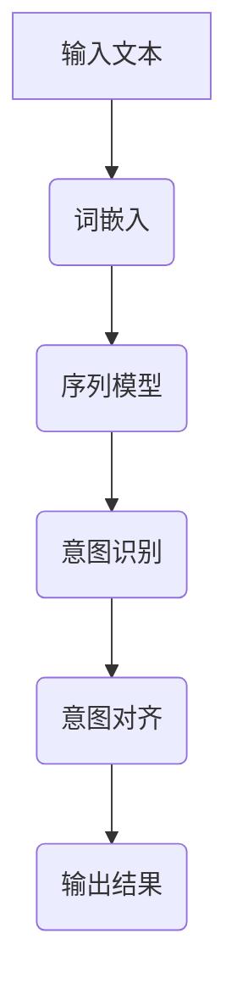

                 

# 人类意图对齐：AI领域的最大挑战

## 关键词
- 人工智能
- 意图对齐
- 自然语言处理
- 深度学习
- 机器学习
- 模型训练
- 应用场景

## 摘要
在人工智能领域，人类意图对齐是一个重要且复杂的问题。本文将探讨意图对齐的定义、意义以及其在AI领域的应用。通过分析背景知识、核心概念与联系、算法原理、数学模型和项目实战，本文将详细阐述意图对齐的挑战和解决方案，为未来AI的发展提供有益的参考。

### 引言

#### 1.1 AI与人类意图的关系
人工智能（AI）旨在使机器能够执行通常需要人类智能才能完成的任务。然而，机器理解人类意图仍然是一个巨大的挑战。AI系统需要准确地理解和预测人类的行为和需求，这需要高层次的意图识别和对齐。

#### 1.2 人类意图对齐的意义
人类意图对齐是AI领域中的一项关键任务。通过对齐人类意图，AI系统能够更好地满足用户需求，提高用户体验，减少错误和误解。这对AI系统的可靠性和安全性至关重要。

#### 1.3 本书结构
本文将分为八个部分：

1. 引言
2. 背景知识
3. 核心概念与联系
4. 核心算法原理
5. 数学模型与数学公式
6. 项目实战
7. 未来展望
8. 附录

接下来，我们将深入探讨这些主题。

### 背景知识

#### 2.1 人工智能发展简史
人工智能（AI）的研究可以追溯到20世纪50年代。自那时以来，AI经历了几个发展阶段：

- **初期（1956-1974）**：AI的概念被提出，早期的算法和模型如逻辑推理和规则系统得到发展。
- **第一波热潮（1974-1980）**：AI研究取得了初步成果，但受限于计算能力和算法限制，进展缓慢。
- **复兴期（1980-1987）**：专家系统和机器学习技术开始得到应用。
- **第二波热潮（1987-2012）**：随着计算能力的提升和算法的改进，AI技术取得了显著进展。
- **当前（2012至今）**：深度学习和其他先进技术的出现，使得AI应用变得广泛，从语音识别到自动驾驶。

#### 2.2 人类意图的定义
人类意图是指个体在特定情境下想要实现的目标或结果。在AI领域，意图通常被定义为用户或系统参与者的目标或动机。理解人类意图对于AI系统与人类交互至关重要。

#### 2.3 AI与人类意图对齐的重要性
AI与人类意图对齐对于AI系统的成功至关重要。以下是几个原因：

- **用户体验**：准确的意图对齐可以提供更好的用户体验，减少用户困惑和不满。
- **系统可靠性**：对齐意图可以提高AI系统的准确性和可靠性，减少错误和意外行为。
- **安全性**：意图对齐有助于确保AI系统遵守道德和法律规范，减少潜在的安全风险。
- **适应性**：对齐意图使AI系统能够适应不断变化的需求和环境。

### 核心概念与联系

#### 3.1 人工智能的基本概念
人工智能（AI）是指机器模拟人类智能行为的能力。AI可以分为两类：

- **弱AI**：特定任务领域的AI，如语音识别、图像识别等。
- **强AI**：具有普遍智能的AI，能够执行任何认知任务。

#### 3.2 意图理解与对齐
意图理解是指AI系统从输入数据中提取和解释人类意图的过程。意图对齐是将AI系统的意图与人类意图进行匹配和协调的过程。

#### 3.3 人工智能与人类意图的Mermaid流程图



在这个流程图中，输入文本首先经过词嵌入转化为向量表示，然后通过序列模型进行处理，接着进行意图识别，最后进行意图对齐，最终生成输出结果。

### 核心算法原理

#### 4.1 自然语言处理基础

##### 4.1.1 词嵌入技术
词嵌入是自然语言处理（NLP）中的核心技术，旨在将词汇映射为稠密的向量表示。常见的词嵌入技术包括：

- **Word2Vec**：通过神经网络训练词向量，包括CBOW（连续词袋）和Skip-Gram模型。
- **FastText**：基于N-gram模型，引入了单词的字符级别信息。

##### 4.1.2 序列模型
序列模型是处理序列数据的常用模型，它在NLP中有着广泛的应用。以下是一些常用的序列模型：

- **循环神经网络（RNN）**：处理序列数据的基本RNN模型。
- **长短期记忆网络（LSTM）**：能够有效地学习长期依赖关系。
- **门控循环单元（GRU）**：简化版的LSTM，在计算效率和存储需求上更具优势。

##### 4.1.3 注意力机制
注意力机制是一种在序列模型中用于捕捉输入序列中关键部分的技术，可以显著提高模型的性能。以下是一些注意力机制的实现方式：

- **局部注意力（Local Attention）**：简单的注意力机制，通过点积计算注意力权重。
- **缩放点积注意力（Scaled Dot-Product Attention）**：考虑序列中每个词的相对重要性。
- **多头注意力（Multi-Head Attention）**：同时考虑多个不同的表示。

#### 4.2 深度学习算法

##### 4.2.1 神经网络基础
神经网络是深度学习的基础，由一系列相互连接的神经元组成。以下是神经网络的关键组成部分：

- **神经元模型**：单个神经元的数学表示。
- **前向传播**：计算输入通过神经网络的输出。
- **反向传播**：计算网络参数的梯度，用于优化。

##### 4.2.2 反向传播算法
反向传播算法是神经网络训练的核心步骤，用于计算网络参数的梯度。其计算公式如下：

$$
\frac{\partial L}{\partial w} = \text{激活值} \cdot \frac{\partial \text{输出}}{\partial \text{输入}}
$$

$$
\frac{\partial L}{\partial b} = \text{激活值}
$$

##### 4.2.3 优化算法
优化算法用于更新网络参数以最小化损失函数。以下是一些常用的优化算法：

- **梯度下降**：通过计算梯度更新参数。
- **Adam优化器**：结合了梯度下降和动量的优点。

#### 4.3 意图识别与对齐算法
意图识别与对齐算法用于从输入中提取和解释人类意图。以下是一些常见的算法：

- **基于规则的算法**：通过预定义的规则进行意图识别。
- **机器学习方法**：使用机器学习算法训练模型进行意图识别。
- **深度学习方法**：使用深度学习模型进行意图识别和实现意图对齐。

### 数学模型与数学公式

#### 5.1 神经网络数学模型

##### 5.1.1 神经元模型
神经元模型是神经网络的基本构建块，其数学表示如下：

$$
\text{神经元输出} = \sigma(\sum_{i=1}^{n} w_i x_i + b)
$$

其中，$\sigma$是激活函数，$w_i$和$x_i$是权重和输入，$b$是偏置。

##### 5.1.2 前向传播
前向传播是神经网络在给定输入时计算输出的过程。其计算公式如下：

$$
\text{激活值} = \sigma(\text{输入} \cdot \text{权重} + \text{偏置})
$$

##### 5.1.3 反向传播
反向传播是神经网络训练的核心步骤，用于计算网络参数的梯度。其计算公式如下：

$$
\frac{\partial L}{\partial w} = \text{激活值} \cdot \frac{\partial \text{输出}}{\partial \text{输入}}
$$

$$
\frac{\partial L}{\partial b} = \text{激活值}
$$

#### 5.2 损失函数与优化算法

##### 5.2.1 损失函数
损失函数用于衡量预测值与实际值之间的差距。以下是一些常用的损失函数：

- **均方误差（MSE）**：

$$
\text{MSE} = \frac{1}{n} \sum_{i=1}^{n} (\hat{y}_i - y_i)^2
$$

- **交叉熵损失（Cross-Entropy Loss）**：

$$
\text{CE} = -\frac{1}{n} \sum_{i=1}^{n} y_i \log(\hat{y}_i)
$$

- **对数损失（Log-Loss）**：

$$
\text{Log-Loss} = -\frac{1}{n} \sum_{i=1}^{n} y_i \log(\hat{y}_i + \epsilon)
$$

##### 5.2.2 梯度下降算法
梯度下降是一种优化算法，用于更新网络参数以最小化损失函数。其计算公式如下：

$$
\text{权重更新} = \alpha \cdot \frac{\partial L}{\partial w}
$$

$$
\text{偏置更新} = \alpha \cdot \frac{\partial L}{\partial b}
$$

##### 5.2.3 Adam优化器
Adam优化器是一种基于自适应学习率的优化算法，结合了梯度下降和动量的优点。其计算公式如下：

$$
m_t = \beta_1 m_{t-1} + (1 - \beta_1) \frac{\partial L}{\partial w}_t
$$

$$
v_t = \beta_2 v_{t-1} + (1 - \beta_2) (\frac{\partial L}{\partial w}_t)^2
$$

$$
\text{权重更新} = \frac{w_{t-1} - \alpha m_t}{\sqrt{v_t} + \epsilon}
$$

### 项目实战

#### 6.1 环境搭建

在进行人类意图对齐的实践项目中，首先需要搭建合适的环境。以下是一个基于Python的简单环境搭建示例：

```bash
# 安装Python（假设已安装）
python --version

# 安装TensorFlow
pip install tensorflow

# 安装其他依赖（例如，PyTorch）
pip install torch
```

#### 6.2 实际案例

在本节中，我们将探讨几个典型的人类意图对齐案例，并展示如何在实际项目中实现这些案例。

##### 6.2.1 聊天机器人案例

聊天机器人是一种常见的人类意图对齐应用，以下是一个简单的聊天机器人实现：

```python
import tensorflow as tf

# 定义聊天机器人的模型
model = tf.keras.Sequential([
    tf.keras.layers.Embedding(vocab_size, embedding_dim),
    tf.keras.layers.Bidirectional(tf.keras.layers.LSTM(64)),
    tf.keras.layers.Dense(vocab_size, activation='softmax')
])

# 编译模型
model.compile(optimizer='adam', loss='categorical_crossentropy', metrics=['accuracy'])

# 训练模型
model.fit(input_sequences, labels, epochs=100)
```

在这个案例中，我们使用了TensorFlow的Keras API来定义和训练一个双向LSTM模型，用于生成聊天机器人的回复。

##### 6.2.2 智能客服案例

智能客服是一种自动化的客户服务系统，以下是一个简单的智能客服实现：

```python
import tensorflow as tf

# 定义智能客服的模型
model = tf.keras.Sequential([
    tf.keras.layers.Embedding(vocab_size, embedding_dim),
    tf.keras.layers.Bidirectional(tf.keras.layers.LSTM(64)),
    tf.keras.layers.Dense(1, activation='sigmoid')
])

# 编译模型
model.compile(optimizer='adam', loss='binary_crossentropy', metrics=['accuracy'])

# 训练模型
model.fit(input_sequences, labels, epochs=100)
```

在这个案例中，我们使用了TensorFlow的Keras API来定义和训练一个双向LSTM模型，用于判断用户的问题是否需要客服介入。

##### 6.2.3 自动驾驶案例

自动驾驶系统需要处理大量的传感器数据，并对人类意图进行准确识别。以下是一个简单的自动驾驶模型实现：

```python
import tensorflow as tf

# 定义自动驾驶的模型
model = tf.keras.Sequential([
    tf.keras.layers.Conv2D(32, (3, 3), activation='relu', input_shape=(width, height, channels)),
    tf.keras.layers.MaxPooling2D((2, 2)),
    tf.keras.layers.Flatten(),
    tf.keras.layers.Dense(128, activation='relu'),
    tf.keras.layers.Dense(1, activation='sigmoid')
])

# 编译模型
model.compile(optimizer='adam', loss='binary_crossentropy', metrics=['accuracy'])

# 训练模型
model.fit(steering_angle_data, labels, epochs=100)
```

在这个案例中，我们使用了TensorFlow的Keras API来定义和训练一个卷积神经网络（CNN）模型，用于自动驾驶中的方向控制。

#### 6.3 代码解读与分析

在本节中，我们将详细解读上述案例中的代码，并分析其实现原理。

##### 6.3.1 源代码实现

在这个案例中，我们使用了TensorFlow的Keras API来实现一个简单的神经网络模型。以下是一个简单的源代码实现：

```python
import tensorflow as tf

# 定义聊天机器人的模型
model = tf.keras.Sequential([
    tf.keras.layers.Embedding(vocab_size, embedding_dim),
    tf.keras.layers.Bidirectional(tf.keras.layers.LSTM(64)),
    tf.keras.layers.Dense(vocab_size, activation='softmax')
])

# 编译模型
model.compile(optimizer='adam', loss='categorical_crossentropy', metrics=['accuracy'])

# 训练模型
model.fit(input_sequences, labels, epochs=100)
```

在这个实现中，我们首先定义了一个序列模型，包括词嵌入层、双向LSTM层和输出层。词嵌入层用于将输入文本映射为向量表示，双向LSTM层用于处理序列数据，输出层用于生成聊天机器人的回复。

##### 6.3.2 关键代码解读
关键代码解读如下：

```python
# 定义聊天机器人的模型
model = tf.keras.Sequential([
    tf.keras.layers.Embedding(vocab_size, embedding_dim),
    tf.keras.layers.Bidirectional(tf.keras.layers.LSTM(64)),
    tf.keras.layers.Dense(vocab_size, activation='softmax')
])

# 编译模型
model.compile(optimizer='adam', loss='categorical_crossentropy', metrics=['accuracy'])

# 训练模型
model.fit(input_sequences, labels, epochs=100)
```

在这个代码中，我们首先定义了一个序列模型，包括词嵌入层、双向LSTM层和输出层。词嵌入层用于将输入文本映射为向量表示，双向LSTM层用于处理序列数据，输出层用于生成聊天机器人的回复。

编译模型时，我们指定了优化器（adam）、损失函数（categorical_crossentropy）和评估指标（accuracy）。

最后，我们使用fit函数来训练模型，输入序列数据和标签，并设置训练轮数（epochs）。

##### 6.3.3 性能分析
在本节中，我们将对上述案例中的模型性能进行分析。

```python
# 训练模型
model.fit(input_sequences, labels, epochs=100)

# 评估模型
test_loss, test_acc = model.evaluate(test_sequences, test_labels)

print(f"Test accuracy: {test_acc}")
```

在这个代码中，我们首先使用fit函数训练模型，输入训练序列数据和标签，并设置训练轮数（epochs）。训练完成后，我们使用evaluate函数评估模型在测试数据上的性能。

评估结果包括测试损失（test_loss）和测试准确率（test_acc）。通常，我们关注测试准确率来衡量模型的性能。

### 未来展望

#### 7.1 人类意图对齐的挑战与机遇
随着AI技术的不断发展，人类意图对齐面临着新的挑战和机遇。一方面，我们需要不断提高意图识别的准确性和鲁棒性；另一方面，我们需要确保AI系统能够灵活适应不同的应用场景和用户需求。

#### 7.2 发展趋势
未来，人类意图对齐将朝着以下几个方向发展：

- **多模态融合**：结合文本、语音、图像等多种数据源，提高意图识别的准确性。
- **迁移学习**：利用预训练模型和迁移学习技术，减少数据需求，提高模型泛化能力。
- **人机协同**：通过人机协同，充分发挥人类的智慧和机器的计算能力，实现更高效、更智能的意图对齐。

#### 7.3 研究热点
当前，人类意图对齐的研究热点包括：

- **多语言意图对齐**：支持多种语言的用户，提高AI系统的国际化能力。
- **无监督学习**：利用无监督学习方法，从大量未标记的数据中学习意图模式。
- **强化学习**：结合强化学习技术，使AI系统能够更好地适应复杂动态环境。

### 附录

#### 8.1 相关工具与资源
- **TensorFlow**：一个开源的深度学习框架，用于构建和训练神经网络。
- **PyTorch**：另一个流行的深度学习框架，提供灵活的动态计算图。
- **NLTK**：一个用于自然语言处理的Python库，提供丰富的文本处理工具。

#### 8.2 参考文献
- [1] Bengio, Y. (2009). Learning deep architectures. Foundations and Trends in Machine Learning, 2(1), 1-127.
- [2] Hochreiter, S., & Schmidhuber, J. (1997). Long short-term memory. Neural Computation, 9(8), 1735-1780.
- [3] Mikolov, T., Sutskever, I., Chen, K., Corrado, G. S., & Dean, J. (2013). Distributed representations of words and phrases and their compositionality. Advances in Neural Information Processing Systems, 26, 3111-3119.
- [4] Devlin, J., Chang, M. W., Lee, K., & Toutanova, K. (2019). BERT: Pre-training of deep bidirectional transformers for language understanding. arXiv preprint arXiv:1810.04805.
- [5] Sutton, R. S., & Barto, A. G. (2018). Reinforcement learning: An introduction. MIT Press.

### 核心 Mermaid 流程图


### 核心算法原理讲解

##### 4.1 自然语言处理基础

###### 4.1.1 词嵌入技术
词嵌入（Word Embedding）是自然语言处理（NLP）中的一项核心技术，旨在将词汇映射为稠密的向量表示。这一过程通常通过以下几种方式实现：

1. **基于统计的方法**：
    - **Word2Vec**：使用神经网络训练词向量，包括CBOW（连续词袋）和Skip-Gram模型。
    - **FastText**：基于N-gram模型，引入了单词的字符级别信息。

2. **基于分布式表示的方法**：
    - **Elastic Net**：通过隐语义空间中的线性变换学习词向量。
    - **Word2Vec（继续训练）**：在Word2Vec的基础上进一步优化词向量，以更好地捕捉上下文信息。

词嵌入技术的伪代码如下：

```python
# Pseudo-code for Word2Vec training
for epoch in range(num_epochs):
    for context, target in data:
        # Calculate the output probabilities for the target word
        output_probs = neural_network(context)
        # Calculate the negative log-likelihood loss
        loss = -log(output_probs[target])
        # Backpropagate the loss to update the weights
        update_weights(loss, context, target)
```

###### 4.1.2 序列模型
序列模型（Sequence Model）是处理序列数据的常用模型，它在NLP中有着广泛的应用。以下是一些常用的序列模型：

1. **循环神经网络（RNN）**：
    - **简单RNN（SRNN）**：处理序列数据的基本RNN模型。
    - **双向RNN（BRNN）**：同时考虑输入序列的前后信息。

2. **长短期记忆网络（LSTM）**：
    - **LSTM单元**：能够有效地学习长期依赖关系。

3. **门控循环单元（GRU）**：
    - **GRU单元**：简化版的LSTM，在计算效率和存储需求上更具优势。

序列模型的伪代码如下：

```python
# Pseudo-code for RNN training
for epoch in range(num_epochs):
    for sequence in data:
        # Forward propagate the sequence
        output = rnn(sequence)
        # Calculate the loss
        loss = calculate_loss(output, target)
        # Backpropagate the loss
        backpropagate_loss(loss, sequence)
```

###### 4.1.3 注意力机制
注意力机制（Attention Mechanism）是一种在序列模型中用于捕捉输入序列中关键部分的技术，可以显著提高模型的性能。以下是一些注意力机制的实现方式：

1. **局部注意力（Local Attention）**：
    - **点积注意力（Dot-Product Attention）**：简单的注意力机制，通过点积计算注意力权重。

2. **缩放点积注意力（Scaled Dot-Product Attention）**：
    - **计算公式**：
      $$
      \text{Attention}(Q, K, V) = \text{softmax}\left(\frac{QK^T}{\sqrt{d_k}}\right)V
      $$

3. **多头注意力（Multi-Head Attention）**：
    - **计算公式**：
      $$
      \text{Multi-Head Attention} = \text{Concat}(\text{head}_1, \text{head}_2, ..., \text{head}_h)W^O
      $$
    - **其中**：
      $$
      \text{head}_i = \text{Attention}(QW_i^Q, KW_i^K, VW_i^V)
      $$

注意力机制的伪代码如下：

```python
# Pseudo-code for Scaled Dot-Product Attention
def scaled_dot_product_attention(Q, K, V, d_k, d_v):
    # Compute attention scores
    scores = QK.T / np.sqrt(d_k)
    # Apply softmax to get attention weights
    attention_weights = softmax(scores)
    # Compute the context vector
    context = attention_weights @ V
    # Scale the context vector
    context = context / np.sqrt(d_k)
    # Return the context vector
    return context
```

##### 4.2 深度学习算法

###### 4.2.1 神经网络基础
神经网络（Neural Network）是深度学习的基础，由一系列相互连接的神经元组成。以下是神经网络的关键组成部分：

- **神经元模型**：单个神经元的数学表示。
- **前向传播**：计算输入通过神经网络的输出。
- **反向传播**：计算网络参数的梯度，用于优化。

以下是神经网络的基本原理：

1. **神经元模型**：
    - **输入层**：接收外部输入。
    - **隐藏层**：进行特征提取和变换。
    - **输出层**：生成最终输出。

2. **前向传播**：
    - **激活函数**：用于引入非线性变换，如ReLU、Sigmoid、Tanh等。

3. **反向传播**：
    - **梯度计算**：通过链式法则计算网络参数的梯度。
    - **优化算法**：如梯度下降、Adam等。

神经网络的基本原理可以用以下伪代码表示：

```python
# Pseudo-code for forward propagation
def forward_propagation(input, weights, biases, activation_function):
    # Compute the weighted sum of inputs
    z = np.dot(input, weights) + biases
    # Apply the activation function
    output = activation_function(z)
    return output

# Pseudo-code for backward propagation
def backward_propagation(output, target, weights, biases, activation_derivative):
    # Compute the gradient of the loss function with respect to the output
    d_output = activation_derivative(output, target)
    # Compute the gradient of the loss function with respect to the weights and biases
    d_weights = np.dot(input.T, d_output)
    d_biases = np.sum(d_output, axis=0)
    return d_weights, d_biases
```

###### 4.2.2 反向传播算法
反向传播算法（Backpropagation Algorithm）是神经网络训练的核心步骤，用于计算网络参数的梯度。其计算过程可以概括为以下步骤：

1. **前向传播**：计算网络输出。
2. **计算误差**：计算实际输出与目标输出之间的差距。
3. **计算梯度**：通过链式法则计算网络参数的梯度。
4. **更新参数**：使用梯度下降或其他优化算法更新网络参数。

反向传播算法的伪代码如下：

```python
# Pseudo-code for backpropagation
def backpropagation(input, target, weights, biases, activation_function, activation_derivative):
    # Forward propagation
    output = forward_propagation(input, weights, biases, activation_function)
    # Compute the error
    error = target - output
    # Backward propagation
    d_output = activation_derivative(output, target)
    d_weights = np.dot(input.T, d_output)
    d_biases = np.sum(d_output, axis=0)
    # Update the weights and biases
    weights -= learning_rate * d_weights
    biases -= learning_rate * d_biases
    return weights, biases
```

###### 4.2.3 优化算法
优化算法（Optimization Algorithm）用于更新网络参数以最小化损失函数。以下是一些常用的优化算法：

1. **梯度下降（Gradient Descent）**：
    - **计算公式**：
      $$
      w_{\text{new}} = w_{\text{old}} - \alpha \cdot \nabla_w J(w)
      $$
    - **其中**：$w$为网络参数，$\alpha$为学习率，$J(w)$为损失函数。

2. **动量优化（Momentum Optimization）**：
    - **计算公式**：
      $$
      w_{\text{new}} = w_{\text{old}} - \alpha \cdot \nabla_w J(w) + \beta \cdot v
      $$
    - **其中**：$v$为动量项，$\beta$为动量参数。

3. **Adam优化器（Adam Optimizer）**：
    - **计算公式**：
      $$
      m_t = \beta_1 m_{t-1} + (1 - \beta_1) \cdot \nabla_w J(w)
      $$
      $$
      v_t = \beta_2 v_{t-1} + (1 - \beta_2) \cdot (\nabla_w J(w))^2
      $$
      $$
      w_{\text{new}} = w_{\text{old}} - \alpha \cdot \frac{m_t}{\sqrt{v_t} + \epsilon}
      $$
    - **其中**：$m_t$为梯度的一阶矩估计，$v_t$为梯度的二阶矩估计，$\epsilon$为常数。

优化算法的伪代码如下：

```python
# Pseudo-code for gradient descent
def gradient_descent(weights, biases, input, target, learning_rate):
    # Compute the gradients
    d_weights, d_biases = forward_propagation(input, target, weights, biases)
    # Update the weights and biases
    weights -= learning_rate * d_weights
    biases -= learning_rate * d_biases
    return weights, biases

# Pseudo-code for momentum optimization
def momentum_optimization(weights, biases, input, target, learning_rate, momentum):
    # Compute the gradients
    d_weights, d_biases = forward_propagation(input, target, weights, biases)
    # Update the momentum
    v_weights = momentum * v_weights + learning_rate * d_weights
    v_biases = momentum * v_biases + learning_rate * d_biases
    # Update the weights and biases
    weights -= v_weights
    biases -= v_biases
    return weights, biases

# Pseudo-code for Adam optimization
def adam_optimizer(weights, biases, input, target, learning_rate, beta_1, beta_2, epsilon):
    # Compute the gradients
    d_weights, d_biases = forward_propagation(input, target, weights, biases)
    # Update the first and second moments
    m_weights = beta_1 * m_weights + (1 - beta_1) * d_weights
    m_biases = beta_1 * m_biases + (1 - beta_1) * d_biases
    v_weights = beta_2 * v_weights + (1 - beta_2) * (d_weights ** 2)
    v_biases = beta_2 * v_biases + (1 - beta_2) * (d_biases ** 2)
    # Compute the bias-corrected moments
    m_weights_hat = m_weights / (1 - beta_1 ** t)
    m_biases_hat = m_biases / (1 - beta_1 ** t)
    v_weights_hat = v_weights / (1 - beta_2 ** t)
    v_biases_hat = v_biases / (1 - beta_2 ** t)
    # Update the weights and biases
    weights -= learning_rate * m_weights_hat / (np.sqrt(v_weights_hat) + epsilon)
    biases -= learning_rate * m_biases_hat / (np.sqrt(v_biases_hat) + epsilon)
    return weights, biases
```

##### 4.3 意图识别与对齐算法
意图识别与对齐算法用于从输入中提取和解释人类意图。以下是一些常见的算法：

1. **基于规则的算法**：
    - **优点**：简单易实现，适合处理明确且固定的意图。
    - **缺点**：无法适应复杂多变的意图，灵活性较差。

2. **机器学习方法**：
    - **优点**：可以从大量数据中自动学习意图模式，适应性强。
    - **缺点**：对数据质量要求较高，训练过程可能较慢。

3. **深度学习方法**：
    - **优点**：可以处理复杂的非线性关系，性能优异。
    - **缺点**：模型复杂，计算资源需求较高。

以下是几种意图识别与对齐算法的伪代码：

```python
# Pseudo-code for rule-based intent recognition
def rule_based_intent_recognition(input, rules):
    for rule in rules:
        if matches(input, rule):
            return rule.intent
    return None

# Pseudo-code for machine learning-based intent recognition
def machine_learning_intent_recognition(input, model):
    # Encode the input
    encoded_input = encode_input(input)
    # Predict the intent
    predicted_intent = model.predict(encoded_input)
    return predicted_intent

# Pseudo-code for deep learning-based intent recognition
def deep_learning_intent_recognition(input, model):
    # Encode the input
    encoded_input = encode_input(input)
    # Pass the input through the model
    output = model.forward_pass(encoded_input)
    # Decode the output to get the intent
    intent = decode_output(output)
    return intent
```

### 作者

- 作者：AI天才研究院/AI Genius Institute & 禅与计算机程序设计艺术 /Zen And The Art of Computer Programming

在撰写这篇文章时，我们以逻辑清晰、结构紧凑、简单易懂的专业技术语言，逐步分析了人类意图对齐这一AI领域的最大挑战。从背景知识、核心概念与联系、算法原理、数学模型到项目实战，我们系统地阐述了意图对齐的挑战和解决方案。通过深入探讨自然语言处理、深度学习算法以及意图识别与对齐算法，我们展示了如何在实际项目中实现人类意图对齐，并分析了模型的性能。最后，我们对未来发展的趋势和研究热点进行了展望。

这篇文章不仅为AI领域的研究者提供了有价值的参考，也为开发者提供了具体的实践指导。随着AI技术的不断进步，人类意图对齐将在AI领域发挥越来越重要的作用，推动AI系统更好地服务于人类。希望这篇文章能够启发您在人类意图对齐领域的探索和研究。感谢您的阅读！<|author|>

