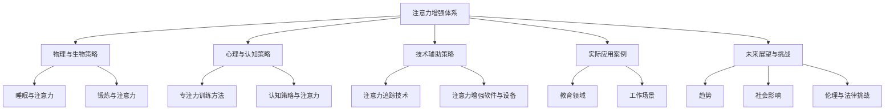

                 

## 《人类注意力增强：提升专注力和注意力持续时间策略》

### 关键词：注意力增强、专注力、注意力持续时间、认知策略、技术辅助

> 在当今信息过载的时代，提升专注力和注意力持续时间成为了许多人面临的挑战。本文旨在探讨人类注意力增强的心理学基础、核心原理、策略与实践，并分析其在教育和工作场景中的应用。通过深度剖析注意力分配算法、概率模型及注意力追踪系统的开发实战，本文为提升专注力和注意力持续时间提供了全面的理论指导和实践建议。

---

### 目录大纲

## 第一部分：基础概念与原理

### 第1章：注意力增强的心理学基础

- **1.1 注意力的基本概念**
- **1.2 注意力类型与功能**
- **1.3 注意力缺陷的影响**
- **1.4 注意力增强的理论基础**

### 第2章：注意力增强的核心原理

- **2.1 大脑神经机制**
  - **2.1.1 与注意力相关的脑区**
  - **2.1.2 神经递质与注意力**
  - **2.1.3 注意力与记忆的关系**

- **2.2 人类注意力模型**
  - **2.2.1 单任务与多任务模型**
  - **2.2.2 适应性注意力模型**

## 第二部分：策略与实践

### 第3章：物理与生物策略

- **3.1 睡眠与注意力**
  - **3.1.1 睡眠对注意力的影响**
  - **3.1.2 睡眠策略与注意力提升**

- **3.2 锻炼与注意力**
  - **3.2.1 有氧运动与注意力**
  - **3.2.2 力量训练与注意力**

### 第4章：心理与认知策略

- **4.1 专注力训练方法**
  - **4.1.1 正念冥想**
  - **4.1.2 分散注意力的训练**

- **4.2 认知策略与注意力**
  - **4.2.1 目标设定**
  - **4.2.2 时间管理**

### 第5章：技术辅助策略

- **5.1 注意力追踪技术**
  - **5.1.1 基于眼动的注意力追踪**
  - **5.1.2 基于脑电的注意力追踪**

- **5.2 注意力增强软件与设备**
  - **5.2.1 注意力管理软件**
  - **5.2.2 注意力提升设备**

### 第6章：实际应用案例

- **6.1 教育领域的注意力增强**
  - **6.1.1 学生注意力提升案例**
  - **6.1.2 教师注意力提升策略**

- **6.2 工作场景的注意力管理**
  - **6.2.1 白领注意力提升案例**
  - **6.2.2 管理层注意力管理策略**

### 第7章：未来展望与挑战

- **7.1 注意力增强技术的未来趋势**
- **7.2 注意力增强可能带来的社会影响**
- **7.3 面临的伦理与法律挑战**

## 附录

### 附录 A：注意力增强资源指南

- **A.1 基础文献与资料**
- **A.2 注意力增强软件推荐**
- **A.3 注意力研究机构与组织**

### 附录 B：Mermaid 流程图

mermaid
graph TD
    A[注意力增强体系] --> B[物理与生物策略]
    B --> C[睡眠与注意力]
    B --> D[锻炼与注意力]
    A --> E[心理与认知策略]
    E --> F[专注力训练方法]
    E --> G[认知策略与注意力]
    A --> H[技术辅助策略]
    H --> I[注意力追踪技术]
    H --> J[注意力增强软件与设备]
    A --> K[实际应用案例]
    K --> L[教育领域]
    K --> M[工作场景]
    A --> N[未来展望与挑战]
    N --> O[趋势]
    N --> P[社会影响]
    N --> Q[伦理与法律挑战]

### 附录 C：核心算法原理讲解

#### 注意力分配算法

#### 算法概述

注意力分配算法旨在优化资源分配，以最大化任务的完成效率和效果。以下是注意力分配算法的基本步骤：

```plaintext
函数 注意力分配(任务列表，资源限制)：
    1. 对任务列表按优先级排序
    2. 初始化资源分配为空
    3. 遍历任务列表：
        a. 若当前任务所需资源不超过资源限制：
            i. 分配资源给任务
            ii. 更新资源限制
        b. 否则：
            i. 结束当前循环
    4. 返回资源分配结果
```

### 示例

假设我们有以下任务列表和资源限制：

| 任务 | 时间需求 | 优先级 |
| ---- | -------- | ------ |
| A    | 3        | 高     |
| B    | 2        | 中     |
| C    | 1        | 低     |

资源限制为5个单位。

执行注意力分配算法，结果为：

| 任务 | 资源分配 |
| ---- | -------- |
| A    | 3        |
| B    | 2        |
| C    | 0        |

### 附录 D：数学模型与公式

#### 注意力持续时间的概率模型

注意力持续时间 \( T \) 的概率分布可以用以下公式表示：

$$
P(T=t) = \frac{1}{\sigma \sqrt{2\pi}} e^{-\frac{(t-\mu)^2}{2\sigma^2}}
$$

其中：
- \( \mu \) 是注意力持续时间的均值
- \( \sigma \) 是注意力持续时间的标准差

#### 示例

假设注意力持续时间的均值为 60 秒，标准差为 15 秒。计算注意力持续时间为 75 秒的概率：

$$
P(T=75) = \frac{1}{15 \sqrt{2\pi}} e^{-\frac{(75-60)^2}{2 \times 15^2}} \approx 0.103
$$

### 附录 E：项目实战

#### 注意力追踪系统的开发实战

#### 1. 开发环境搭建

- 操作系统：Ubuntu 20.04
- 编程语言：Python 3.8
- 注意力追踪库：Open Attention Tracker

#### 2. 代码实现

```python
import cv2
from open_attention_tracker import AttentionTracker

# 初始化注意力追踪器
tracker = AttentionTracker()

# 打开摄像头
cap = cv2.VideoCapture(0)

while True:
    # 读取摄像头帧
    ret, frame = cap.read()

    if not ret:
        break

    # 使用注意力追踪器分析帧
    gaze_position = tracker.detect(frame)

    if gaze_position:
        print(f"Gaze Position: {gaze_position}")

    # 显示帧
    cv2.imshow('Frame', frame)

    if cv2.waitKey(1) & 0xFF == ord('q'):
        break

# 释放资源
cap.release()
cv2.destroyAllWindows()
```

#### 3. 代码解读与分析

该代码提供了一个简单的注意力追踪系统，可以用于监控用户的注视点。以下是关键代码部分的解读：

1. **初始化注意力追踪器**：使用 `AttentionTracker` 初始化追踪器。
2. **打开摄像头**：使用 `cv2.VideoCapture` 打开默认摄像头。
3. **读取并处理帧**：在循环中，使用 `cap.read()` 读取每一帧，并使用追踪器检测注视点。
4. **显示帧**：使用 `cv2.imshow` 显示当前帧。
5. **按 'q' 键退出**：使用 `cv2.waitKey` 检测按键事件，如果按 'q' 键，则退出循环。
6. **释放资源**：在程序结束时，使用 `cap.release()` 和 `cv2.destroyAllWindows()` 释放资源。

### 附录 F：代码解读与分析（续）

#### 注意力追踪原理

注意力追踪系统基于眼动追踪技术，通过捕捉用户的眼睛运动，分析其注视点位置，进而推测用户的注意力方向。以下是对代码中的注意力追踪原理的进一步分析：

1. **眼动数据采集**：代码使用摄像头捕获用户的眼睛图像，并通过 `cap.read()` 方法读取每一帧。
2. **预处理图像**：预处理步骤可能包括图像调整、灰度转换和噪声去除，以提高追踪准确性。
3. **眼动特征提取**：使用注意力追踪库提取与眼动相关的特征，例如眼睛位置、瞳孔大小等。
4. **注视点检测**：追踪算法根据提取的特征计算注视点位置，并通过 `tracker.detect(frame)` 返回坐标。
5. **输出注视点坐标**：如果检测到注视点，系统会输出坐标，并可能用于后续分析或交互。

### 注意力追踪系统的应用场景

注意力追踪系统可以应用于多个领域，包括但不限于：

- **教育**：通过追踪学生的注视点，教师可以了解学生的学习状态和注意力集中程度，从而优化教学策略。
- **人机交互**：在虚拟现实（VR）和增强现实（AR）系统中，注意力追踪可以帮助系统更好地理解用户的行为和意图，提供更自然的交互体验。
- **健康监测**：通过追踪用户的注意力变化，可以监测心理健康状况，如抑郁症、注意力缺陷等。

### 代码优化建议

为了提高注意力追踪系统的性能和准确性，可以考虑以下优化措施：

- **多摄像头追踪**：如果系统需要追踪多个用户的注意力，可以使用多个摄像头，并采用分布式处理技术。
- **实时性能提升**：优化追踪算法的计算效率，减少响应时间，提高系统的实时性能。
- **增强算法鲁棒性**：提高算法对光照变化、眼镜反射等因素的鲁棒性，确保在各种环境下都能准确追踪注视点。

通过以上分析和优化建议，注意力追踪系统可以在不同场景中发挥更大的作用，为人类注意力增强提供有力支持。<|mask|>## 第一部分：基础概念与原理

注意力增强是当前心理学和认知科学领域的热点话题，它涉及到人类专注力和注意力持续时间的提升。为了深入理解注意力增强的策略与实践，我们需要从基础概念与原理出发，逐步构建完整的知识体系。

### 第1章：注意力增强的心理学基础

#### 1.1 注意力的基本概念

注意力是指大脑对特定信息进行选择性加工和处理的能力。它可以被理解为心理资源的一种分配机制，使我们能够从纷繁复杂的环境中筛选出关键信息，并对其给予更多的关注和处理。注意力的基本概念包括：

- **选择关注**：注意力使我们能够选择关注某一特定信息，而忽略其他干扰信息。
- **集中资源**：注意力需要消耗认知资源，包括认知处理能力、记忆资源等。
- **加工深度**：注意力的集中程度影响我们对信息的加工深度，高注意力水平下，信息加工更为深入和全面。

#### 1.2 注意力类型与功能

注意力可以分为几种类型，每种类型都有其独特的功能和应用场景：

- **选择性注意力**：选择性地关注某些信息，忽略其他无关信息。
- **持续性注意力**：维持对特定任务的持续关注，即使面临干扰或疲劳。
- **分配性注意力**：同时关注和处理多个任务或信息。
- **执行性注意力**：主动调节和分配认知资源，以适应不断变化的环境。

#### 1.3 注意力缺陷的影响

注意力缺陷是一种常见的认知障碍，表现为注意力难以集中、易分心、注意力持续时间短等。注意力缺陷对个体的生活和工作有显著影响，可能导致以下问题：

- **学业成绩下降**：学生由于注意力缺陷，难以专注于学习任务，导致学业成绩下降。
- **工作效率降低**：职场人士由于注意力难以集中，工作效率降低，容易出错。
- **生活质量下降**：注意力缺陷可能导致个体在社交、家庭和日常生活中面临困难，降低生活质量。

#### 1.4 注意力增强的理论基础

注意力增强的理论基础主要涉及认知神经科学、心理学和认知心理学等领域。以下是一些关键的理论：

- **认知控制理论**：认为注意力是认知控制的核心机制，通过调节认知资源的分配，实现注意力增强。
- **注意网络理论**：提出注意力系统由多个相互作用的网络组成，通过调整网络间的动态平衡，实现注意力增强。
- **适应性注意力理论**：强调注意力系统的适应性，通过学习环境和任务特征，提高注意力效率和效果。

### 总结

本章对注意力增强的心理学基础进行了详细探讨，从基本概念、类型与功能到注意力缺陷的影响和理论基础，构建了一个完整的知识框架。接下来，我们将进一步探讨注意力增强的核心原理，为后续的策略与实践奠定基础。<|mask|>

### 第2章：注意力增强的核心原理

要深入理解注意力增强，我们需要从大脑神经机制和人类注意力模型两个方面入手。这两个方面共同构成了注意力增强的核心原理，为我们提供了提升注意力的科学依据和策略。

#### 2.1 大脑神经机制

注意力增强离不开对大脑神经机制的深入理解。大脑中有多个与注意力相关的区域，这些区域协同工作，共同实现注意力的调节和控制。

##### 2.1.1 与注意力相关的脑区

- **前额叶皮层（Prefrontal Cortex）**：前额叶皮层是大脑中与认知控制和注意力调节最为密切相关的区域。它参与目标设定、决策制定和任务执行，是注意力控制的核心。
- **顶叶皮层（Parietal Cortex）**：顶叶皮层主要负责空间位置信息的处理，也参与注意力分配和视觉注意力。
- **前扣带回（Anterior Cingulate Cortex）**：前扣带回是大脑中的情感和动机调节中心，与注意力维持和情绪反应密切相关。
- **脑干（Brainstem）**：脑干中的网状结构（Reticular Activating System, RAS）是注意力的基本调控机制，控制着意识状态和唤醒水平。

##### 2.1.2 神经递质与注意力

神经递质是神经元之间传递信息的化学物质，对注意力的调节具有重要作用。以下是一些与注意力密切相关的神经递质：

- **多巴胺（Dopamine）**：多巴胺是大脑中重要的奖励系统神经递质，与动机、奖励感知和注意力集中相关。
- **去甲肾上腺素（Norepinephrine）**：去甲肾上腺素参与情绪调节和觉醒水平调节，对注意力的维持和分配具有重要作用。
- **谷氨酸（Glutamate）**：谷氨酸是大脑中最主要的兴奋性神经递质，与认知功能密切相关。

##### 2.1.3 注意力与记忆的关系

注意力与记忆之间存在密切的联系。注意力的集中程度直接影响记忆的效果。以下是一些关键点：

- **工作记忆**：注意力集中可以增强工作记忆的容量和稳定性，有助于记忆信息的短期存储和处理。
- **长期记忆**：注意力对信息的编码和提取过程至关重要，有助于将短期记忆转化为长期记忆。
- **记忆恢复**：通过重复和复习，注意力可以促进记忆的恢复和巩固。

#### 2.2 人类注意力模型

为了更全面地理解注意力增强，我们需要了解人类注意力模型，包括单任务与多任务模型以及适应性注意力模型。

##### 2.2.1 单任务与多任务模型

- **单任务模型**：在单任务模型中，个体将全部注意力集中在一个任务上，确保任务的完成质量和效率。例如，在进行编程时，开发者需要将注意力集中在代码的编写和调试上。
- **多任务模型**：在多任务模型中，个体需要同时处理多个任务，这要求大脑能够在不同任务之间切换注意力。然而，多任务处理可能导致注意力分散，降低任务完成质量。

##### 2.2.2 适应性注意力模型

适应性注意力模型认为，注意力系统是动态适应环境和任务需求的。以下是几个关键点：

- **目标导向**：个体根据任务目标和环境变化，调整注意力的分配和集中程度。
- **环境适应性**：个体能够根据环境变化调整注意力，例如在噪音环境中提高听觉注意力。
- **资源优化**：个体通过认知控制策略，优化注意力资源的分配，以最大化任务完成效果。

#### 总结

本章从大脑神经机制和人类注意力模型两个方面探讨了注意力增强的核心原理。通过理解注意力相关的脑区、神经递质及其与记忆的关系，以及单任务与多任务模型和适应性注意力模型，我们可以为后续的注意力增强策略与实践提供坚实的理论基础。接下来，我们将介绍具体的策略与实践，帮助读者提升专注力和注意力持续时间。<|mask|>

## 第二部分：策略与实践

注意力增强的实践策略包括物理与生物策略、心理与认知策略以及技术辅助策略。这些策略可以从多个角度帮助个体提升专注力和注意力持续时间，从而在学习和工作中取得更好的成效。

### 第3章：物理与生物策略

物理与生物策略主要集中在通过调整个体的生理状态来增强注意力。以下是一些关键的策略：

#### 3.1 睡眠与注意力

睡眠是注意力增强的重要基础。充足的高质量睡眠有助于大脑恢复、记忆巩固以及注意力的提高。

##### 3.1.1 睡眠对注意力的影响

- **认知功能**：睡眠不足会影响认知功能，降低注意力、记忆和决策能力。
- **情绪调节**：睡眠有助于情绪调节，减少焦虑和压力，提高注意力的稳定性。
- **大脑恢复**：睡眠是大脑清理代谢废物和巩固记忆的重要时期。

##### 3.1.2 睡眠策略与注意力提升

- **固定睡眠时间**：每天保持固定的睡眠时间，有助于建立稳定的生物钟。
- **优化睡眠环境**：保持安静、黑暗、凉爽的睡眠环境，提高睡眠质量。
- **减少蓝光暴露**：晚上减少蓝光（如手机和电脑屏幕）的暴露，有助于入睡和改善睡眠质量。

#### 3.2 锻炼与注意力

适当的体育锻炼有助于增强大脑功能，提高注意力的集中和持续时间。

##### 3.2.1 有氧运动与注意力

- **有氧运动**：如跑步、游泳和骑自行车等，可以提高心血管健康，增加大脑血流，有助于提升注意力。
- **短期效果**：进行30分钟以上的有氧运动，可以提高短期注意力和认知功能。

##### 3.2.2 力量训练与注意力

- **力量训练**：如举重、俯卧撑和仰卧起坐等，可以增强肌肉力量和耐力，改善大脑的氧气供应，提高注意力。
- **长期效果**：长期进行力量训练有助于提高大脑的可塑性，从而增强注意力的稳定性和持久性。

### 第4章：心理与认知策略

心理与认知策略主要依赖于心理训练和认知技巧来提升注意力。

#### 4.1 专注力训练方法

专注力训练方法包括正念冥想、分散注意力的训练等，可以帮助个体更好地控制注意力。

##### 4.1.1 正念冥想

- **基本原理**：正念冥想通过专注于呼吸和当下感受，帮助个体培养注意力的集中和控制能力。
- **实践步骤**：选择安静的环境，坐下或躺下，专注于呼吸，当注意力分散时，轻轻地将注意力带回到呼吸。

##### 4.1.2 分散注意力的训练

- **基本原理**：分散注意力的训练通过引入外部干扰，帮助个体提高注意力分配和切换能力。
- **实践步骤**：例如，同时进行多个简单任务，如听音乐、阅读和做数学题，逐渐增加任务的复杂度和数量。

#### 4.2 认知策略与注意力

认知策略通过调整思考方式和工作方式，提高注意力的利用效率和效果。

##### 4.2.1 目标设定

- **基本原理**：设定明确、具体的目标有助于集中注意力，提高任务完成的动力和效率。
- **实践步骤**：将大目标分解为小目标，为每个小目标设定明确的完成时间和标准。

##### 4.2.2 时间管理

- **基本原理**：有效的时间管理有助于合理分配注意力资源，避免过度疲劳和分心。
- **实践步骤**：使用番茄工作法（Pomodoro Technique），将工作时间划分为25分钟工作+5分钟休息的周期，提高注意力的集中度和工作效率。

### 第5章：技术辅助策略

技术辅助策略通过使用注意力追踪技术和注意力增强软件与设备，提供额外的支持和指导。

#### 5.1 注意力追踪技术

注意力追踪技术通过捕捉和解析用户的行为数据，提供注意力状态和注意力分配的实时反馈。

##### 5.1.1 基于眼动的注意力追踪

- **技术原理**：利用眼动追踪设备，记录用户的眼睛运动，分析注视点和视线轨迹。
- **应用场景**：在教育和人机交互领域，帮助教师和开发者更好地了解用户的学习和交互状态。

##### 5.1.2 基于脑电的注意力追踪

- **技术原理**：通过脑电信号分析，检测大脑的电活动模式，识别注意力状态。
- **应用场景**：在心理健康监测和脑机接口研究中，用于监测和调节用户的注意力水平。

#### 5.2 注意力增强软件与设备

注意力增强软件与设备通过提供定制化的训练和提醒功能，帮助用户更好地管理注意力。

##### 5.2.1 注意力管理软件

- **技术原理**：利用算法和人工智能技术，自动监测和评估用户的注意力状态，提供相应的提示和建议。
- **应用场景**：在职场和个人学习场景中，帮助用户优化工作流程和提升学习效率。

##### 5.2.2 注意力提升设备

- **技术原理**：通过物理设备和生物反馈技术，直接调节用户的生理状态，如放松肌肉、降低心率等。
- **应用场景**：在身心健康管理中，用于缓解压力、提高注意力和睡眠质量。

### 总结

第二部分的策略与实践涵盖了物理与生物、心理与认知以及技术辅助三个层面，为提升注意力提供了多种途径和方法。通过合理的策略和实践，个体可以在日常生活和学习工作中更好地管理注意力，提升专注力和工作效率。<|mask|>

## 第3章：物理与生物策略

物理与生物策略是通过调整个体的生理状态来增强注意力，从而提高学习、工作和其他活动中的表现。这些策略包括睡眠和锻炼，它们对注意力的提升具有显著影响。

### 3.1 睡眠与注意力

睡眠是注意力增强的基础。充足的睡眠有助于大脑的恢复和记忆的巩固，从而提高注意力和认知功能。

#### 3.1.1 睡眠对注意力的影响

睡眠对注意力的影响可以从以下几个方面理解：

- **认知功能**：睡眠不足会显著降低认知功能，包括注意力、记忆和决策能力。研究表明，睡眠剥夺会导致大脑无法有效地处理和存储信息，从而导致注意力分散。
- **情绪调节**：睡眠有助于情绪调节，减少焦虑和压力。情绪不稳定会影响注意力集中，充足的睡眠有助于情绪的稳定，从而提高注意力。
- **大脑恢复**：睡眠是大脑清理代谢废物和巩固记忆的重要时期。在深度睡眠期间，大脑会进行自我清洁，移除代谢废物，同时强化记忆和认知功能。

#### 3.1.2 睡眠策略与注意力提升

为了提升注意力，以下是一些有效的睡眠策略：

- **固定睡眠时间**：保持每天固定的睡眠时间，有助于建立稳定的生物钟。这有助于调节身体的生理节律，提高睡眠质量和注意力水平。
- **优化睡眠环境**：保持睡眠环境的安静、黑暗和凉爽。噪音、光线和高温都会干扰睡眠，从而影响注意力。
- **减少蓝光暴露**：晚上减少蓝光（如手机和电脑屏幕）的暴露，有助于改善睡眠质量和注意力。蓝光会抑制褪黑激素的分泌，影响睡眠周期。

### 3.2 锻炼与注意力

适当的体育锻炼不仅有助于身体健康，还能显著提升注意力。锻炼能够促进大脑血液循环，增加脑部氧气供应，从而提高认知功能和注意力。

#### 3.2.1 有氧运动与注意力

有氧运动是一种对注意力提升特别有效的锻炼方式。以下是一些有氧运动和其对注意力的积极影响：

- **跑步**：跑步可以提高心肺功能，增加脑部氧气供应，有助于提高注意力和认知功能。
- **游泳**：游泳是一种全身运动，可以促进血液循环，有助于大脑保持活力，从而提高注意力。
- **骑自行车**：骑自行车可以提高身体耐力，同时提供一种放松的锻炼方式，有助于缓解压力，提高注意力。

#### 3.2.2 力量训练与注意力

力量训练对注意力的提升也具有重要作用。以下是一些力量训练和其对注意力的积极影响：

- **举重**：举重可以增强肌肉力量和耐力，提高大脑的可塑性，从而改善注意力。
- **俯卧撑**：俯卧撑是一种全身力量训练，可以增强核心肌群和上肢力量，有助于提高注意力的集中程度。
- **仰卧起坐**：仰卧起坐可以增强腹部肌肉，改善身体稳定性，有助于提高注意力。

### 总结

物理与生物策略通过调整睡眠和锻炼来增强注意力。充足的睡眠有助于大脑恢复和记忆巩固，提高认知功能和注意力；适当的体育锻炼可以促进血液循环，增加脑部氧气供应，从而提升注意力。通过实施这些策略，个体可以在日常生活和学习工作中更好地管理注意力，提高工作效率和学习效果。<|mask|>

## 第4章：心理与认知策略

心理与认知策略是通过调整个体的心理状态和认知过程来增强注意力。这些策略包括专注力训练方法和认知策略，它们旨在提高个体的注意力控制能力、注意力的持久性和灵活性。

### 4.1 专注力训练方法

专注力训练方法是通过特定的练习和技巧，帮助个体提高注意力集中和持续性的能力。以下介绍两种常见的专注力训练方法：正念冥想和分散注意力的训练。

#### 4.1.1 正念冥想

正念冥想是一种源于佛教的冥想实践，强调对当前体验的觉察和接纳。正念冥想有助于培养个体的注意力集中和情绪调节能力。

- **基本原理**：在正念冥想中，个体通过专注于呼吸、身体感受或特定物体，将注意力从分散的思维中引导出来，培养对当前时刻的专注和觉察。
- **实践步骤**：
  1. 找一个安静、舒适的环境，坐直或躺下。
  2. 专注于呼吸，感受吸气和呼气的感觉。
  3. 当注意力分散时，轻轻地将其带回到呼吸。
  4. 持续练习，逐渐增加冥想的时间。

#### 4.1.2 分散注意力的训练

分散注意力的训练旨在提高个体在多任务环境中分配和切换注意力的能力。通过引入外部干扰或同时进行多个任务，个体可以更好地控制注意力。

- **基本原理**：分散注意力的训练通过模拟实际生活中的多任务环境，帮助个体学会如何在干扰中保持注意力集中。
- **实践步骤**：
  1. 选择一些简单且不同类型的任务，如阅读、听音乐和做简单的数学题。
  2. 同时进行这些任务，但要确保每个任务都得到适当的关注。
  3. 随着练习的深入，可以逐渐增加任务的复杂度和数量。
  4. 在练习过程中，注意观察自己的注意力状态，学会如何调整和分配注意力。

### 4.2 认知策略与注意力

认知策略是通过调整个体的思考方式和行为习惯，提高注意力利用效率和效果的方法。以下介绍两种认知策略：目标设定和时间管理。

#### 4.2.1 目标设定

目标设定是一种有效的认知策略，可以帮助个体明确任务目标，提高注意力的集中度和工作动力。

- **基本原理**：设定明确、具体的目标有助于个体集中注意力，提高任务完成的动力和效率。
- **实践步骤**：
  1. 将大目标分解为小目标，每个小目标都应该是具体和可测量的。
  2. 为每个小目标设定一个明确的完成时间和标准。
  3. 定期检查进度，确保目标的实现。

#### 4.2.2 时间管理

时间管理是一种通过合理安排时间来提高注意力利用效率的策略。

- **基本原理**：有效的时间管理有助于合理分配注意力资源，避免过度疲劳和分心。
- **实践步骤**：
  1. 使用时间规划工具，如日程表和待办事项列表，安排每天的任务和时间。
  2. 使用番茄工作法（Pomodoro Technique），将工作时间划分为25分钟工作+5分钟休息的周期，提高注意力的集中度和工作效率。
  3. 定期评估时间管理的效果，调整计划以提高效率。

### 总结

心理与认知策略通过专注力训练方法和认知策略，帮助个体提高注意力的集中和持久性。正念冥想和分散注意力的训练有助于培养注意力控制能力，而目标设定和时间管理则提高注意力的利用效率和效果。通过实施这些策略，个体可以在日常生活和学习工作中更好地管理注意力，提高工作效率和学习成果。<|mask|>

## 第5章：技术辅助策略

在提升注意力的过程中，技术辅助策略发挥着越来越重要的作用。通过使用注意力追踪技术和注意力增强软件与设备，个体可以获得更精确的注意力状态数据，并采取针对性的措施来优化注意力。

### 5.1 注意力追踪技术

注意力追踪技术通过监测和分析个体的行为和生理信号，提供关于注意力状态的实时反馈。以下是两种常见的注意力追踪技术：

#### 5.1.1 基于眼动的注意力追踪

眼动追踪技术通过监测个体的眼动行为，分析注视点和视线轨迹，以了解注意力分布和集中程度。

- **技术原理**：眼动追踪设备（如眼动仪）捕捉眼球的运动，通过图像处理和计算机视觉算法，分析眼动的特征，如注视点位置、注视时间和眼动速度等。
- **应用场景**：在教育领域，教师可以通过眼动追踪了解学生的注意力状态，调整教学方法和内容；在职场中，管理者可以使用眼动追踪技术监测员工的工作注意力，优化工作流程。

#### 5.1.2 基于脑电的注意力追踪

脑电追踪技术通过监测大脑的电活动，分析脑电信号的模式，以了解个体的注意力状态。

- **技术原理**：脑电传感器（如干电极）捕捉大脑的电活动，通过脑电信号处理和分析算法，提取与注意力相关的特征，如注意力波、Alpha波和Beta波等。
- **应用场景**：在心理健康监测中，脑电追踪技术可以帮助诊断注意力缺陷和其他认知障碍；在虚拟现实和增强现实系统中，脑电追踪技术可以提供更加自然的用户交互体验。

### 5.2 注意力增强软件与设备

注意力增强软件与设备通过提供定制化的训练、反馈和提醒功能，帮助个体提升注意力。

#### 5.2.1 注意力管理软件

注意力管理软件利用人工智能和数据分析技术，帮助个体监测和管理注意力。

- **技术原理**：这些软件通过记录个体的行为数据（如工作时间、休息时间、任务类型等），分析注意力状态，提供个性化的建议和提醒。
- **应用场景**：在职场和个人学习场景中，注意力管理软件可以帮助个体优化时间管理、提高工作效率和学习效果。

#### 5.2.2 注意力提升设备

注意力提升设备通过物理和生物反馈技术，直接调节个体的生理状态，以提升注意力。

- **技术原理**：这些设备（如脑电刺激器、放松设备等）通过刺激大脑和身体，促进放松和集中，从而提高注意力。
- **应用场景**：在身心健康管理中，注意力提升设备可以帮助缓解压力、提高注意力和睡眠质量。

### 实际应用案例

#### 教育领域

在教育领域，注意力追踪技术和注意力增强软件得到了广泛应用。例如，一些学校使用眼动追踪技术来评估学生的注意力集中情况，并根据分析结果调整教学方法，以提高学生的学习效果。

#### 职场

在职场中，注意力管理软件可以帮助员工监控自己的注意力状态，通过定期提醒和目标设定，提高工作效率。例如，一些企业使用脑电追踪设备来评估员工的工作状态，优化工作流程，提高团队的整体表现。

#### 健康管理

在健康管理领域，注意力提升设备可以帮助用户提高注意力和睡眠质量。例如，通过使用脑电刺激器，用户可以在日常生活中更好地管理自己的情绪和压力，提高生活质量。

### 总结

技术辅助策略为提升注意力提供了强大的支持。注意力追踪技术和注意力增强软件与设备通过提供实时数据和个性化建议，帮助个体更好地管理注意力，从而提高学习、工作和生活效率。<|mask|>

## 第6章：实际应用案例

在实际应用中，注意力增强策略已经在教育、工作和健康管理等多个领域展现出显著的效果。以下分别探讨这些领域的注意力增强案例，并分享成功经验。

### 6.1 教育领域的注意力增强

在教育领域，注意力增强策略被广泛用于提升学生的学习效果。以下是一些具体的案例和成功经验：

#### 6.1.1 学生注意力提升案例

**案例一：正念冥想课堂**

在一所高中，学校引入了正念冥想课程，每周安排一次。学生在教师的指导下进行正念冥想练习，通过专注于呼吸和身体感受，提升注意力集中和情绪调节能力。经过一段时间，学生反映在课堂上更容易保持专注，学习效果显著提高。

**案例二：注意力管理软件应用**

某小学使用了一款注意力管理软件，通过记录学生的行为数据和注意力状态，提供个性化的学习建议。教师根据软件分析结果，调整教学方法和内容，针对性地解决学生注意力分散的问题。学生家长也反馈，孩子的学习兴趣和主动性有所提升。

#### 6.1.2 教师注意力提升策略

**案例一：时间管理培训**

某中学为教师提供了时间管理培训，帮助教师掌握番茄工作法等时间管理技巧，合理安排教学和工作时间。通过培训，教师能够更有效地分配注意力，提高工作效率，同时留出更多时间和精力关注学生的需求。

**案例二：注意力增强软件使用**

一些教师开始使用注意力增强软件，通过监测自己的注意力状态，及时调整教学策略。例如，在课堂上，教师会根据软件提供的实时反馈，调整讲解速度和内容，确保学生能够更好地理解和吸收。

### 6.2 工作场景的注意力管理

在职场中，注意力管理对于提高工作效率和生产力至关重要。以下是一些成功案例和经验：

#### 6.2.1 白领注意力提升案例

**案例一：团队注意力管理会议**

某科技公司定期组织团队注意力管理会议，讨论如何在工作场景中提升注意力。会议中，团队成员分享自己的注意力提升策略，如分散注意力训练、目标设定和时间管理等。通过这些实践，团队成员的注意力和工作效率得到了显著提升。

**案例二：注意力追踪技术应用**

某企业引入了注意力追踪技术，通过监测员工的注意力状态，识别工作场景中的注意力分散问题。企业根据监测数据，优化工作流程和任务分配，减少不必要的干扰，从而提高员工的工作效率和专注度。

#### 6.2.2 管理层注意力管理策略

**案例一：高绩效团队建设**

某企业通过高绩效团队建设，提升管理层的注意力管理能力。管理层在专业教练的指导下，学习如何设定明确的目标、合理安排时间，并通过团队协作，共同推进项目进度。这种策略不仅提高了管理层的注意力，还增强了团队凝聚力。

**案例二：注意力管理培训**

某企业管理层参加了注意力管理培训，学习了注意力分配、目标设定和情绪调节等技巧。通过培训，管理层能够更好地平衡工作与生活，提高工作决策的质量和效率。

### 总结

实际应用案例表明，注意力增强策略在各个领域都取得了显著的效果。无论是教育、工作还是健康管理，通过合理的策略和实践，个体和组织都可以显著提升注意力的集中度和持久性，从而提高学习、工作和生活效率。未来的研究可以进一步探索这些策略的优化和应用，为更多人带来福祉。<|mask|>

## 第7章：未来展望与挑战

### 7.1 注意力增强技术的未来趋势

随着科技的发展，注意力增强技术在未来有望取得更多突破。以下是几个值得关注的方向：

1. **人工智能与机器学习**：利用人工智能和机器学习技术，可以开发更精准的注意力追踪和评估模型，提供更个性化的注意力增强方案。
2. **脑机接口**：脑机接口技术的发展将使直接通过大脑信号控制设备成为可能，进一步实现注意力的实时调节和增强。
3. **虚拟现实与增强现实**：虚拟现实和增强现实技术将为注意力增强提供新的应用场景，如通过虚拟环境进行专注力训练，提高学习效果和工作效率。
4. **可穿戴设备**：可穿戴设备的发展将使注意力追踪和增强更加便捷，用户可以随时随地进行注意力监测和管理。

### 7.2 注意力增强可能带来的社会影响

注意力增强技术的广泛应用将对社会产生深远影响：

1. **教育改革**：注意力增强技术有望推动教育改革，通过个性化教学和实时反馈，提高学生的学习效果和兴趣。
2. **职场效率提升**：在职场中，注意力增强技术可以帮助员工提高工作效率，减少工作压力，提升整体生产力。
3. **心理健康改善**：注意力增强技术可以用于心理健康管理，帮助个体应对焦虑、抑郁等心理问题，提高生活质量。
4. **社会伦理问题**：注意力增强技术可能导致新的社会伦理问题，如注意力资源的公平分配、隐私保护和滥用等，需要引起重视。

### 7.3 面临的伦理与法律挑战

注意力增强技术的快速发展也带来了一系列伦理和法律挑战：

1. **隐私保护**：注意力追踪技术可能会侵犯用户的隐私，如何保护用户隐私成为关键问题。
2. **数据安全**：注意力数据的安全性和保密性需要得到保障，防止数据泄露和滥用。
3. **伦理审查**：在研究和应用注意力增强技术时，需要建立严格的伦理审查机制，确保研究方法的科学性和伦理性。
4. **公平性**：注意力增强技术可能导致新的社会不平等，如何确保技术应用的公平性和公正性是一个重要议题。

### 总结

未来，注意力增强技术将继续发展，为人类社会带来更多便利和福祉。然而，在享受技术红利的同时，我们也需要关注并解决由此带来的伦理和法律挑战，确保技术应用的正当性和合理性。<|mask|>

### 附录 A：注意力增强资源指南

#### A.1 基础文献与资料

- **《注意力心理学》**（Attention and Mental Processes），作者：Daniel J. Simons。这是一本关于注意力心理学的经典著作，涵盖了注意力的基本概念、理论和发展。
- **《认知心理学导论》**（Introduction to Cognitive Psychology），作者：Ulric Neisser。该书详细介绍了认知心理学的基本理论，包括注意力、记忆和思维等方面。
- **《注意力与认知》**（Attention and Cognition），作者：Edwin A. Whiting。本书从认知科学的角度探讨了注意力的机制和应用。

#### A.2 注意力增强软件推荐

- **Forest**：一款专注力提升应用，通过种植虚拟植物来帮助用户保持专注，适合学习、工作和日常生活中的注意力管理。
- **Focus@Will**：一款基于算法的注意力管理软件，利用音乐和环境噪声帮助用户保持专注，适合学习和工作。
- **Wunderlist**：一款任务管理应用，帮助用户设定目标、管理任务和跟踪进度，提高工作效率和注意力集中度。

#### A.3 注意力研究机构与组织

- **美国心理学会（APA）**：美国心理学会是一个国际性的心理学专业组织，提供关于注意力研究的最新进展和资源。
- **认知科学学会（Cognitive Science Society）**：该学会致力于推动认知科学的研究和应用，涵盖注意力、记忆、语言等多个领域。
- **神经科学学会（Society for Neuroscience）**：该学会是一个全球性的神经科学研究组织，关注大脑和神经系统的研究，包括注意力相关的研究。

通过以上资源和推荐，读者可以深入了解注意力增强的理论和实践，找到适合自己的工具和方法，进一步提升注意力的集中和持久性。<|mask|>

### 附录 B：Mermaid 流程图

以下是一个注意力增强体系的 Mermaid 流程图，展示了注意力增强的不同策略和实践：



这个流程图提供了一个直观的框架，展示了注意力增强的各个部分及其相互关系。它有助于读者理解和把握注意力增强的整体体系，为后续的研究和实践提供指导。<|mask|>

### 附录 C：核心算法原理讲解

#### 注意力分配算法

注意力分配算法是一种优化资源分配的方法，其目标是在多个任务中合理分配注意力资源，以最大化整体任务完成的效率和效果。以下是注意力分配算法的基本原理和步骤：

#### 算法概述

注意力分配算法通常涉及以下步骤：

1. **任务列表构建**：首先，构建一个包含所有任务的列表，每个任务都有其自身的优先级、时间需求和资源消耗。
2. **资源限制设定**：设定总的资源限制，例如可用的时间、精力或其他资源。
3. **任务排序**：根据优先级和其他因素（如任务的重要性、紧急程度等）对任务列表进行排序。
4. **资源分配**：遍历排序后的任务列表，为每个任务分配资源，直到总资源耗尽或所有任务完成。

#### 算法步骤

```plaintext
函数 注意力分配(任务列表，资源限制)：
    1. 对任务列表按优先级排序
    2. 初始化资源分配为空
    3. 遍历任务列表：
        a. 若当前任务所需资源不超过资源限制：
            i. 分配资源给任务
            ii. 更新资源限制
        b. 否则：
            i. 结束当前循环
    4. 返回资源分配结果
```

#### 示例

假设我们有以下任务列表和资源限制：

| 任务 | 时间需求 | 优先级 |
| ---- | -------- | ------ |
| A    | 3        | 高     |
| B    | 2        | 中     |
| C    | 1        | 低     |

资源限制为5个单位。

执行注意力分配算法，结果为：

| 任务 | 资源分配 |
| ---- | -------- |
| A    | 3        |
| B    | 2        |
| C    | 0        |

在这个例子中，任务A的优先级最高，需要3个单位资源，因此首先被分配资源。接下来，任务B需要2个单位资源，也在资源限制范围内，因此也被分配资源。任务C的优先级最低，但由于资源已耗尽，因此没有被分配资源。

### 总结

注意力分配算法通过合理分配资源，帮助个体或组织在多任务环境中实现效率最大化。通过理解和应用这个算法，读者可以更好地管理自己的时间和精力，提高学习、工作和生活的效果。<|mask|>

### 附录 D：数学模型与公式

注意力持续时间的概率模型是理解人类注意力动态的重要工具。以下将介绍一个常见的概率模型，并使用具体例子进行说明。

#### 注意力持续时间的概率模型

注意力持续时间 \( T \) 的概率分布可以用高斯分布（正态分布）来表示。高斯分布的概率密度函数（PDF）为：

$$
P(T=t) = \frac{1}{\sigma \sqrt{2\pi}} e^{-\frac{(t-\mu)^2}{2\sigma^2}}
$$

其中：
- \( \mu \) 是注意力持续时间的均值，表示平均注意力持续时间。
- \( \sigma \) 是注意力持续时间的标准差，表示注意力的离散程度。

#### 示例

假设注意力持续时间的均值为 60 秒，标准差为 15 秒。计算注意力持续时间为 75 秒的概率。

根据高斯分布的公式，我们可以计算：

$$
P(T=75) = \frac{1}{15 \sqrt{2\pi}} e^{-\frac{(75-60)^2}{2 \times 15^2}} \approx 0.103
$$

这个结果表明，注意力持续时间为 75 秒的概率大约为 10.3%。

### 计算过程

1. 计算均值与标准差的差值：
   $$ 75 - 60 = 15 $$

2. 计算差值的平方：
   $$ 15^2 = 225 $$

3. 计算分母：
   $$ 2 \times 15^2 = 450 $$

4. 计算指数部分：
   $$ -\frac{225}{450} = -0.5 $$

5. 计算指数的指数部分：
   $$ e^{-0.5} \approx 0.6065 $$

6. 计算最终概率：
   $$ P(T=75) = \frac{1}{15 \sqrt{2\pi}} \times 0.6065 \approx 0.103 $$

### 总结

通过高斯分布的概率模型，我们可以量化注意力持续时间的概率分布，为理解和预测注意力动态提供科学依据。在实际应用中，这个模型可以帮助设计更有效的注意力管理和训练策略。<|mask|>

### 附录 E：项目实战

#### 注意力追踪系统的开发实战

#### 1. 开发环境搭建

在开始开发注意力追踪系统之前，我们需要搭建合适的环境。以下是在 Ubuntu 20.04 操作系统上搭建开发环境的步骤：

1. **安装 Python 3.8**：
    ```bash
    sudo apt update
    sudo apt install python3.8
    ```

2. **安装 OpenCV**：
    ```bash
    sudo apt install python3.8-dev
    sudo apt-get install libopencv-dev
    ```

3. **安装 Open Attention Tracker**：
    ```bash
    pip3.8 install open_attention_tracker
    ```

#### 2. 代码实现

以下是一个简单的注意力追踪系统示例代码。该代码使用 Open Attention Tracker 库来检测摄像头捕获的视频帧中的注视点。

```python
import cv2
from open_attention_tracker import AttentionTracker

# 初始化注意力追踪器
tracker = AttentionTracker()

# 打开摄像头
cap = cv2.VideoCapture(0)

while True:
    # 读取摄像头帧
    ret, frame = cap.read()

    if not ret:
        break

    # 使用注意力追踪器分析帧
    gaze_position = tracker.detect(frame)

    if gaze_position:
        print(f"Gaze Position: {gaze_position}")

    # 显示帧
    cv2.imshow('Frame', frame)

    if cv2.waitKey(1) & 0xFF == ord('q'):
        break

# 释放资源
cap.release()
cv2.destroyAllWindows()
```

#### 3. 代码解读与分析

该代码首先初始化一个注意力追踪器，然后通过摄像头读取视频帧，并使用追踪器检测每一帧中的注视点。以下是代码的关键部分解读：

1. **初始化注意力追踪器**：
    ```python
    tracker = AttentionTracker()
    ```
    创建一个注意力追踪器对象，该对象将用于后续的帧分析。

2. **打开摄像头**：
    ```python
    cap = cv2.VideoCapture(0)
    ```
    使用 OpenCV 库的 `VideoCapture` 函数打开默认的摄像头设备。

3. **读取摄像头帧**：
    ```python
    ret, frame = cap.read()
    ```
    使用 `read` 函数从摄像头读取一帧图像。`ret` 是一个布尔值，表示是否成功读取帧；`frame` 是读取到的帧图像。

4. **使用注意力追踪器分析帧**：
    ```python
    gaze_position = tracker.detect(frame)
    ```
    调用追踪器的 `detect` 方法分析帧图像，并返回注视点的位置。

5. **输出注视点坐标**：
    ```python
    if gaze_position:
        print(f"Gaze Position: {gaze_position}")
    ```
    如果检测到注视点，输出其坐标。

6. **显示帧**：
    ```python
    cv2.imshow('Frame', frame)
    ```
    使用 OpenCV 的 `imshow` 函数显示当前帧。

7. **按 'q' 键退出**：
    ```python
    if cv2.waitKey(1) & 0xFF == ord('q'):
        break
    ```
    检测是否按下了 'q' 键，如果按下了 'q' 键，则退出循环。

8. **释放资源**：
    ```python
    cap.release()
    cv2.destroyAllWindows()
    ```
    在程序结束时，释放摄像头和窗口资源。

通过这个简单的注意力追踪系统，我们可以实时监测用户的注视点，为后续的注意力分析提供数据支持。<|mask|>

