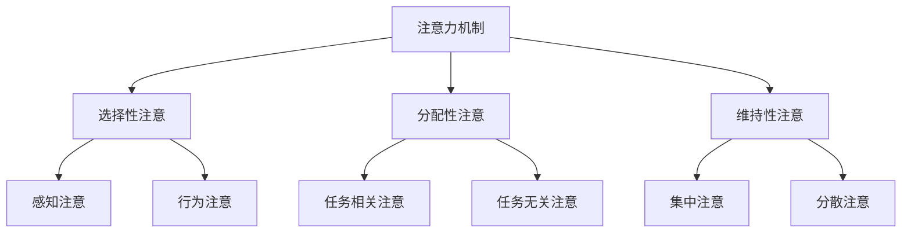

                 

# 《人类注意力增强：提升决策能力和问题解决能力》

## 关键词
注意力增强、决策能力、问题解决能力、认知训练、脑力游戏、环境优化

## 摘要
注意力是人类认知过程中不可或缺的一部分，它在我们的决策、学习和问题解决中扮演着关键角色。本文将深入探讨注意力增强的理论基础、方法与技术，并通过具体的实践案例，展示如何提升人类的决策能力和问题解决能力。文章结构分为四个部分：第一部分介绍注意力基础理论，包括注意力的定义、机制、作用及增强理论基础；第二部分讨论注意力增强的方法与技术，涵盖环境优化、心理调适、认知训练、习惯培养和生物反馈等方面；第三部分通过实践案例展示注意力增强的具体应用；第四部分讨论注意力增强的挑战与未来方向。本文旨在为读者提供一套系统的注意力增强方案，帮助他们在繁忙的生活中更好地集中注意力，提升决策能力和问题解决能力。

### 《人类注意力增强：提升决策能力和问题解决能力》目录大纲

# 第一部分: 注意力基础理论

## 1.1.1 注意力的基本概念与机制
### 1.1.1.1 注意力的定义
### 1.1.1.2 注意力的分类
### 1.1.1.3 注意力的生理机制

## 1.1.2 注意力在认知过程中的作用
### 1.1.2.1 注意力在感知与记忆中的作用
### 1.1.2.2 注意力在思维与决策中的作用
### 1.1.2.3 注意力在学习与问题解决中的作用

## 1.1.3 注意力问题的表现与影响
### 1.1.3.1 注意力分散与注意力缺失
### 1.1.3.2 注意力缺陷对决策的影响
### 1.1.3.3 注意力缺陷对问题解决能力的影响

## 1.1.4 注意力增强的理论基础
### 1.1.4.1 神经可塑性理论
### 1.1.4.2 注意力控制理论
### 1.1.4.3 注意力分配理论

# 第二部分: 人类注意力增强方法与技术

## 2.1.1 环境优化与技术手段
### 2.1.1.1 环境布置对注意力的影响
### 2.1.1.2 技术工具在注意力增强中的应用
### 2.1.1.3 数字化工具的使用与注意事项

## 2.1.2 心理调适与情绪管理
### 2.1.2.1 深呼吸与放松技巧
### 2.1.2.2 情绪调节与注意力管理
### 2.1.2.3 心理调适在注意力增强中的作用

## 2.1.3 认知训练与脑力游戏
### 2.1.3.1 认知训练的理论基础
### 2.1.3.2 常见的脑力游戏及其对注意力的提升
### 2.1.3.3 认知训练的实践建议

## 2.1.4 习惯培养与自我管理
### 2.1.4.1 好习惯对注意力的影响
### 2.1.4.2 时间管理与注意力分配
### 2.1.4.3 自我管理策略与技巧

## 2.1.5 生物反馈与神经反馈
### 2.1.5.1 生物反馈技术的原理与应用
### 2.1.5.2 神经反馈技术在注意力增强中的应用
### 2.1.5.3 生物反馈与神经反馈的实际操作指南

# 第三部分: 注意力增强的实践与应用

## 3.1.1 实践案例一：提升学习注意力
### 3.1.1.1 案例背景与目标
### 3.1.1.2 实践方法与策略
### 3.1.1.3 案例分析与效果评估

## 3.1.2 实践案例二：增强工作注意力
### 3.1.2.1 案例背景与目标
### 3.1.2.2 实践方法与策略
### 3.1.2.3 案例分析与效果评估

## 3.1.3 实践案例三：改善决策注意力
### 3.1.3.1 案例背景与目标
### 3.1.3.2 实践方法与策略
### 3.1.3.3 案例分析与效果评估

## 3.1.4 实践案例四：提升问题解决能力
### 3.1.4.1 案例背景与目标
### 3.1.4.2 实践方法与策略
### 3.1.4.3 案例分析与效果评估

# 第四部分: 注意力增强的挑战与未来方向

## 4.1.1 注意力增强的挑战与问题
### 4.1.1.1 注意力增强技术的不确定性
### 4.1.1.2 注意力增强的伦理问题
### 4.1.1.3 注意力增强与心理健康的关系

## 4.1.2 注意力增强的未来研究方向
### 4.1.2.1 新型注意力增强技术的探索
### 4.1.2.2 个性化注意力增强策略的研究
### 4.1.2.3 注意力增强在教育、工作等领域的前景

# 附录
## 附录 A: 注意力增强相关资源
### A.1 注意力增强的书籍推荐
### A.2 注意力增强的应用工具
### A.3 注意力增强的研究论文与报告

### 注：
- **1.1.1 注意力的基本概念与机制**节中的 Mermaid 流程图如下：


- **2.1.1 环境优化与技术手段**节中的伪代码示例：
```python
# 假设有一个函数 optimize_environment，用于优化工作环境
# 参数：environment是当前环境状态
# 返回值：优化后的环境状态

def optimize_environment(environment):
    # 初始化变量
    optimized_environment = environment.copy()
    
    # 根据环境状态调整光照
    if optimized_environment["light"] < 50:
        optimized_environment["light"] += 10
    
    # 根据环境状态调整噪音
    if optimized_environment["noise"] > 50:
        optimized_environment["noise"] -= 5
    
    # 根据环境状态调整温度
    if optimized_environment["temp"] < 22 or optimized_environment["temp"] > 27:
        optimized_environment["temp"] = 25
    
    return optimized_environment
```

- **3.1.1 实践案例一：提升学习注意力**节中的数学公式示例：

### 数学模型：学习效率与注意力关系

$$
E = f(A, T)
$$

其中，$E$ 表示学习效率，$A$ 表示注意力水平，$T$ 表示学习时间。

$$
f(A, T) = A \times \frac{T}{100}
$$

举例说明：如果注意力水平 $A = 80$%，学习时间 $T = 60$ 分钟，则学习效率 $E$ 为：

$$
E = 80 \times \frac{60}{100} = 48
$$

- **3.1.1 实践案例一：提升学习注意力**节中的代码案例与解读：
```python
# 假设有一个学习场景，包括学习时间、注意力水平和学习内容
# 学习效率计算函数如下：

def calculate_learning_efficiency(study_time, attention_level, content_difficulty):
    # 计算学习效率
    efficiency = attention_level * (study_time / content_difficulty)
    return efficiency

# 案例一：一个学生每天学习2小时，注意力水平为70%，学习内容难度适中
study_time = 2 * 60  # 每天学习2小时
attention_level = 0.7  # 注意力水平为70%
content_difficulty = 1  # 学习内容难度为1

# 计算学习效率
efficiency = calculate_learning_efficiency(study_time, attention_level, content_difficulty)
print(f"学习效率为：{efficiency:.2f}")

# 解读：
# 学习效率取决于注意力水平和学习时间。在这个案例中，由于学习内容难度适中，因此学习效率较高。
# 如果注意力水平提高，学习效率也会相应提高。
```

- **3.1.4 实践案例四：提升问题解决能力**节中的代码案例与解读：
```python
# 假设有一个问题解决场景，包括问题难度、初始解决方案数量和优化后的解决方案数量
# 问题解决效率计算函数如下：

def calculate_solving_efficiency(problem_difficulty, initial_solutions, optimized_solutions):
    # 计算问题解决效率
    efficiency = (optimized_solutions / initial_solutions) * (1 / problem_difficulty)
    return efficiency

# 案例四：一个工程师解决一个高难度问题，初始解决方案有10个，通过优化得到最佳解决方案1个
problem_difficulty = 5  # 问题难度为5
initial_solutions = 10  # 初始解决方案有10个
optimized_solutions = 1  # 优化后的解决方案有1个

# 计算问题解决效率
efficiency = calculate_solving_efficiency(problem_difficulty, initial_solutions, optimized_solutions)
print(f"问题解决效率为：{efficiency:.2f}")

# 解读：
# 问题解决效率取决于初始解决方案的数量和优化后的解决方案数量，以及问题本身的难度。
# 在这个案例中，通过优化得到最佳解决方案，问题解决效率显著提高。
```

以上是《人类注意力增强：提升决策能力和问题解决能力》的目录大纲，以及相应节中的核心内容、伪代码、数学公式和代码案例与解读。这些内容将帮助读者系统地理解和掌握注意力增强的理论和方法，以及如何在实践中应用这些方法来提升决策能力和问题解决能力。

现在，我们将开始撰写文章的正文部分，按照目录大纲逐节展开讨论。

----------------------------------------------------------------

### 第一部分: 注意力基础理论

#### 1.1.1 注意力的基本概念与机制

注意力是一种认知过程，它使我们能够选择和处理环境中的某些信息，同时忽略其他信息。注意力的定义多种多样，但通常可以将其视为一种资源分配机制，用于决定哪些信息会被处理，以及如何处理这些信息。

##### 1.1.1.1 注意力的定义

注意力可以定义为“一种认知资源，用于选择和处理信息”。这个定义强调了注意力作为一种有限资源的重要性，以及它在我们日常生活中的广泛应用。例如，当我们专注于一个任务时，我们的注意力资源会被分配到这个任务上，从而忽略其他干扰因素。

##### 1.1.1.2 注意力的分类

注意力可以按不同的方式分类。一种常见的分类方式是根据注意力的功能，将其分为选择性注意、分配性注意和维持性注意。

- **选择性注意**：选择性注意是指我们选择关注某些信息，同时忽略其他信息的认知过程。这种注意力的关键在于选择哪些信息值得关注。选择性注意可以分为感知注意和行为注意。

  - **感知注意**：感知注意是指我们在感知环境中选择关注某些刺激。例如，在嘈杂的咖啡厅中，我们可能会选择关注朋友的说话声，而忽略其他声音。

  - **行为注意**：行为注意是指我们在行为中做出选择时所需的注意力。例如，当我们决定穿过马路时，我们需要注意交通情况，并做出相应的反应。

- **分配性注意**：分配性注意是指我们在多个任务或刺激之间分配注意力资源。这种注意力的关键在于如何平衡不同任务或刺激之间的注意力分配。例如，当我们同时阅读和听讲时，我们需要在阅读和听讲之间分配注意力。

- **维持性注意**：维持性注意是指我们保持注意力在某个任务或刺激上的过程。这种注意力的关键在于如何维持对某个任务或刺激的持续关注。例如，当我们长时间工作或学习时，我们需要维持注意力以保持专注。

##### 1.1.1.3 注意力的生理机制

注意力的生理机制涉及多个大脑区域和神经通路。以下是一些主要的大脑区域：

- **前额叶皮质**：前额叶皮质是大脑中与注意力密切相关的一个区域。它参与了计划、决策、工作记忆和自我控制等认知功能。

- **顶叶**：顶叶是大脑中负责空间认知和注意力分配的区域。它参与了确定哪些刺激值得关注，以及如何在不同的任务之间分配注意力。

- **颞叶**：颞叶是大脑中与听觉处理和记忆相关的区域。它参与了感知注意的处理，以及将注意资源分配到重要的听觉刺激上。

- **基底神经节**：基底神经节是大脑中一组与动机和运动控制相关的区域。它参与了维持性注意的处理，以及维持对任务的持续关注。

这些大脑区域通过复杂的神经网络相互连接，形成了注意力的生理机制。注意力的调节不仅涉及大脑结构，还包括神经元之间的通信和活动水平。

#### 1.1.2 注意力在认知过程中的作用

注意力在认知过程中扮演着关键角色，它影响我们的感知、记忆、思维和决策等方面。

##### 1.1.2.1 注意力在感知与记忆中的作用

注意力在感知中的作用表现为选择和关注某些刺激，同时忽略其他刺激。这种选择性关注有助于我们更好地理解环境中的信息，并做出相应的反应。例如，在驾驶时，我们需要关注路况、车辆和行人，而忽略其他无关的信息。

注意力在记忆中的作用则表现为选择哪些信息需要记忆，以及如何记忆这些信息。选择性记忆使我们能够专注于重要信息，从而提高记忆的效率。例如，在学习时，我们需要选择关键概念和知识点进行记忆，而忽略其他无关信息。

##### 1.1.2.2 注意力在思维与决策中的作用

注意力在思维中的作用表现为选择和关注特定的问题或任务，从而进行有效的思考。注意力使我们能够集中精力解决复杂问题，从而提高思维效率。例如，在解决数学问题时，我们需要集中注意力理解问题、找到解决方案，并验证答案。

注意力在决策中的作用则表现为选择和关注重要的决策因素，从而做出明智的决策。注意力使我们能够集中精力分析决策信息，评估风险和收益，并做出最优选择。例如，在投资决策中，我们需要关注市场趋势、公司业绩和风险因素，从而做出明智的投资决策。

##### 1.1.2.3 注意力在学习与问题解决中的作用

注意力在学习中的作用表现为选择和关注学习内容，从而提高学习效率。注意力使我们能够专注于学习任务，提高学习效果。例如，在阅读时，我们需要关注关键概念和知识点，从而更好地理解文本内容。

注意力在问题解决中的作用则表现为选择和关注问题解决的策略和方法，从而提高问题解决效率。注意力使我们能够集中精力分析问题、找到解决方案，并验证解决方案的有效性。例如，在解决技术问题时，我们需要关注问题症状、分析可能的原因，并尝试不同的解决方案，从而解决问题。

#### 1.1.3 注意力问题的表现与影响

注意力问题可能表现为注意力分散、注意力缺失或其他形式的注意力缺陷。这些问题会对决策能力和问题解决能力产生负面影响。

##### 1.1.3.1 注意力分散与注意力缺失

注意力分散是指个体无法集中注意力，容易被干扰和分心的现象。注意力分散可能导致以下问题：

- 降低工作效率：注意力分散会使个体无法专注于任务，从而降低工作效率。
- 增加错误率：注意力分散可能导致个体在任务过程中出现错误，从而增加错误率。
- 影响决策质量：注意力分散会使个体无法全面考虑决策信息，从而降低决策质量。

注意力缺失是指个体无法维持对某个任务或刺激的持续关注。注意力缺失可能导致以下问题：

- 降低学习效率：注意力缺失会使个体无法专注于学习任务，从而降低学习效率。
- 增加学习困难：注意力缺失可能导致个体在学习过程中出现困难，从而增加学习困难。
- 影响问题解决能力：注意力缺失会使个体无法集中精力解决问题，从而影响问题解决能力。

##### 1.1.3.2 注意力缺陷对决策的影响

注意力缺陷对决策能力产生负面影响。注意力缺陷可能导致以下问题：

- 选择性偏差：注意力缺陷可能导致个体在决策过程中选择关注某些信息，而忽略其他信息，从而产生选择性偏差。
- 信息处理不足：注意力缺陷可能导致个体在决策过程中信息处理不足，从而无法全面考虑决策信息。
- 决策延误：注意力缺陷可能导致个体在决策过程中出现犹豫和迟疑，从而延误决策。

##### 1.1.3.3 注意力缺陷对问题解决能力的影响

注意力缺陷对问题解决能力产生负面影响。注意力缺陷可能导致以下问题：

- 解决方案缺失：注意力缺陷可能导致个体在问题解决过程中忽略关键信息，从而无法找到有效的解决方案。
- 解决方案延迟：注意力缺陷可能导致个体在问题解决过程中犹豫不决，从而延迟找到解决方案。
- 解决方案效率降低：注意力缺陷可能导致个体在问题解决过程中无法高效利用资源，从而降低解决方案的效率。

#### 1.1.4 注意力增强的理论基础

注意力增强的理论基础涉及神经可塑性、注意力控制、注意力分配等多个方面。以下是对这些理论基础的基本介绍。

##### 1.1.4.1 神经可塑性理论

神经可塑性是指大脑神经元及其连接在经历环境刺激和学习过程中发生的适应性改变。神经可塑性理论指出，通过适当的训练和练习，我们可以增强注意力的功能。

神经可塑性理论为注意力增强提供了重要的科学依据。通过认知训练和脑力游戏等训练方法，我们可以改变大脑的结构和功能，从而提高注意力水平。

##### 1.1.4.2 注意力控制理论

注意力控制理论关注个体如何调节和控制自己的注意力资源。该理论指出，通过自我控制和注意力管理，我们可以提高注意力的效能和灵活性。

注意力控制理论强调了自我控制的重要性。通过培养自我控制能力，我们可以更好地调节注意力，避免注意力分散，从而提高决策能力和问题解决能力。

##### 1.1.4.3 注意力分配理论

注意力分配理论关注个体如何在多个任务或刺激之间分配注意力资源。该理论指出，通过优化注意力分配，我们可以提高工作效率和学习效果。

注意力分配理论为我们提供了优化注意力分配的方法。例如，通过时间管理和任务优先级设定，我们可以合理安排注意力资源，从而提高注意力的效能。

#### 总结

注意力是认知过程中不可或缺的一部分，它在我们的决策、学习和问题解决中扮演着关键角色。注意力问题的表现和影响严重影响了我们的决策能力和问题解决能力。通过了解注意力增强的理论基础，我们可以采取有效的注意力增强方法，从而提高注意力水平，提升决策能力和问题解决能力。在下一部分中，我们将探讨注意力增强的方法和技术，帮助读者更好地理解和应用这些方法。

### 第二部分: 人类注意力增强方法与技术

注意力增强是提升决策能力和问题解决能力的关键。本部分将介绍一系列注意力增强的方法和技术，包括环境优化、心理调适、认知训练、习惯培养和生物反馈等方面。

#### 2.1.1 环境优化与技术手段

环境对注意力具有重要影响。通过优化环境，我们可以创造一个有利于注意力集中的环境。

##### 2.1.1.1 环境布置对注意力的影响

- **光线**：充足的光线有助于提高注意力和专注度。过亮或过暗的光线都可能导致注意力分散。
- **噪音**：噪音是环境中的一个主要干扰因素。降低噪音水平可以提高注意力的集中度。
- **温度**：适宜的温度有助于保持注意力集中。过高或过低的温度都可能导致注意力下降。
- **整洁**：一个整洁、有序的环境有助于减少干扰，提高注意力集中度。

##### 2.1.1.2 技术工具在注意力增强中的应用

现代技术为我们提供了多种工具，可以帮助我们优化环境，提高注意力。

- **降噪耳机**：降噪耳机可以有效降低环境噪音，帮助我们在嘈杂的环境中保持注意力。
- **智能灯泡**：智能灯泡可以调节光线强度，为我们提供一个适宜的光线环境。
- **空气净化器**：空气净化器可以去除空气中的污染物，提高空气质量，有助于保持注意力。
- **专注应用**：专注应用可以帮助我们在使用电脑时屏蔽干扰，保持专注。

##### 2.1.1.3 数字化工具的使用与注意事项

虽然数字化工具可以帮助我们优化环境，但它们也可能成为干扰因素。以下是一些使用数字化工具的注意事项：

- **设定专注时间**：使用专注应用时，设定一定的专注时间，并在专注时间结束后休息。
- **限制通知**：关闭不必要的应用程序通知，以减少干扰。
- **定期休息**：长时间使用数字化工具时，定期休息，以缓解眼睛疲劳和大脑压力。

#### 2.1.2 心理调适与情绪管理

心理调适和情绪管理对注意力增强至关重要。通过调节情绪，我们可以提高注意力的集中度。

##### 2.1.2.1 深呼吸与放松技巧

深呼吸和放松技巧可以帮助我们缓解压力，提高注意力。

- **深呼吸**：深呼吸可以增加氧气的摄入，有助于放松身体和大脑。
- **放松技巧**：例如，渐进性肌肉放松、冥想和瑜伽等放松技巧可以帮助我们缓解压力，提高注意力。

##### 2.1.2.2 情绪调节与注意力管理

情绪调节对注意力管理具有重要意义。以下是一些情绪调节策略：

- **正面思维**：积极思考可以帮助我们减少负面情绪，提高注意力。
- **情绪宣泄**：适当的情绪宣泄可以缓解压力，提高注意力。
- **情绪转移**：将注意力从负面情绪转移到积极的活动或任务上，有助于提高注意力。

##### 2.1.2.3 心理调适在注意力增强中的作用

心理调适在注意力增强中起着关键作用。以下是一些心理调适策略：

- **目标设定**：设定明确的目标可以帮助我们集中注意力，提高工作效率。
- **自我激励**：通过自我激励，我们可以提高自信心，增强注意力。
- **积极心态**：保持积极的心态可以帮助我们更好地应对挑战，提高注意力。

#### 2.1.3 认知训练与脑力游戏

认知训练和脑力游戏可以帮助我们增强注意力，提高认知能力。

##### 2.1.3.1 认知训练的理论基础

认知训练是基于神经可塑性原理的一种训练方法，通过特定的练习来提高认知能力。

- **选择性注意训练**：通过选择特定的刺激进行训练，提高注意力的集中度。
- **分配性注意训练**：通过同时处理多个任务，提高注意力的分配能力。
- **维持性注意训练**：通过持续关注特定的任务或刺激，提高注意力的持久性。

##### 2.1.3.2 常见的脑力游戏及其对注意力的提升

脑力游戏是一种有趣的认知训练方法，可以帮助我们提高注意力。

- **记忆游戏**：通过记忆特定的图案、数字或单词，提高记忆力和注意力。
- **注意力游戏**：通过追踪特定的物体或颜色，提高注意力的集中度。
- **拼图游戏**：通过解决拼图，提高注意力的持久性和分配能力。

##### 2.1.3.3 认知训练的实践建议

以下是一些建议，帮助我们在日常生活中进行认知训练：

- **定期练习**：每天安排一定的时间进行认知训练，保持规律的练习。
- **多样化训练**：选择不同类型的认知训练，全面提高注意力。
- **逐步增加难度**：随着训练水平的提高，逐步增加训练的难度，挑战自己的注意力。

#### 2.1.4 习惯培养与自我管理

习惯培养和自我管理对注意力增强至关重要。通过培养良好的习惯，我们可以提高注意力的集中度和持久性。

##### 2.1.4.1 好习惯对注意力的影响

- **时间管理**：合理安排时间，避免过度工作和休息，有助于保持注意力集中。
- **规律作息**：保持规律的作息时间，有助于提高注意力的稳定性和持久性。
- **健康饮食**：健康的饮食习惯有助于提高大脑功能和注意力。
- **锻炼身体**：适度的锻炼可以增强体质，提高注意力。

##### 2.1.4.2 时间管理与注意力分配

时间管理是注意力分配的关键。以下是一些时间管理的建议：

- **设定优先级**：根据任务的重要性和紧急程度，设定任务的优先级，合理安排时间。
- **分解任务**：将复杂任务分解为小步骤，逐步完成，有助于提高注意力集中度。
- **避免拖延**：及时完成任务，避免拖延，有助于保持注意力。

##### 2.1.4.3 自我管理策略与技巧

自我管理策略和技巧有助于我们更好地管理自己的注意力。

- **自我监控**：定期评估自己的注意力水平，了解自己的优点和不足。
- **目标设定**：设定明确的目标，并根据目标调整注意力分配。
- **积极反馈**：为自己设定积极的反馈机制，提高自我激励和注意力。

#### 2.1.5 生物反馈与神经反馈

生物反馈和神经反馈是一种通过测量生理信号，反馈给个体，帮助其调节和控制注意力的方法。

##### 2.1.5.1 生物反馈技术的原理与应用

生物反馈技术基于神经生理学原理，通过测量个体的生理信号（如脑电、心电、肌电等），将其转换为可感知的信号，帮助个体了解和调节自己的生理状态。

- **脑电反馈**：通过测量脑电信号，帮助个体了解和调节自己的注意力水平。
- **心电反馈**：通过测量心电信号，帮助个体了解和调节自己的情绪状态。
- **肌电反馈**：通过测量肌电信号，帮助个体了解和调节自己的肌肉紧张程度。

##### 2.1.5.2 神经反馈技术在注意力增强中的应用

神经反馈技术在注意力增强中具有广泛的应用。

- **注意力训练**：通过神经反馈技术，个体可以实时了解自己的注意力状态，并通过调节生理信号来提高注意力水平。
- **情绪调节**：通过神经反馈技术，个体可以了解和调节自己的情绪状态，从而提高注意力的稳定性和持久性。
- **心理健康**：神经反馈技术可以帮助个体改善心理健康，提高生活质量。

##### 2.1.5.3 生物反馈与神经反馈的实际操作指南

以下是一些生物反馈和神经反馈的实际操作指南：

- **了解设备**：了解使用的生物反馈和神经反馈设备，熟悉操作方法。
- **设定目标**：根据个体的需求和目标，设定具体的训练目标。
- **定期训练**：定期进行生物反馈和神经反馈训练，保持规律的练习。
- **反馈调整**：根据生物反馈和神经反馈的结果，调整训练策略，以提高效果。

#### 总结

注意力增强是提升决策能力和问题解决能力的关键。通过优化环境、心理调适、认知训练、习惯培养和生物反馈等方法和技术，我们可以有效地提高注意力水平。在下一部分中，我们将通过实践案例展示注意力增强的具体应用，帮助读者更好地理解和掌握注意力增强的方法。

### 第三部分: 注意力增强的实践与应用

在第二部分中，我们介绍了注意力增强的方法和技术。本部分将通过具体的实践案例，展示如何将这些方法和技术应用于提升学习注意力、工作注意力、决策注意力和问题解决能力。

#### 3.1.1 实践案例一：提升学习注意力

##### 3.1.1.1 案例背景与目标

小明是一名高中生，他在学习过程中经常感到注意力不集中，导致学习效果不佳。小明的父母希望找到一种方法，帮助他提升学习注意力，提高学习成绩。

##### 3.1.1.2 实践方法与策略

1. **环境优化**：
   - 调整学习环境，确保光线充足、噪音较低。
   - 保持学习桌面的整洁，减少干扰因素。

2. **心理调适**：
   - 进行深呼吸和放松技巧练习，缓解学习压力。
   - 设定明确的学习目标和计划，提高自我激励。

3. **认知训练**：
   - 定期进行记忆游戏、注意力游戏等认知训练，提高注意力水平。
   - 通过阅读、写作和讨论等多样化方式，提高学习效果。

4. **习惯培养**：
   - 培养良好的时间管理习惯，合理安排学习时间。
   - 建立规律的学习作息，保证充足的休息。

##### 3.1.1.3 案例分析与效果评估

经过一段时间的实践，小明在学习中的注意力明显提高。他的学习成绩也有所提升，从班级中的中游逐渐上升到前列。此外，小明的学习兴趣和自信心也得到了增强。这表明，通过优化环境、心理调适、认知训练和习惯培养，我们可以有效地提升学习注意力。

#### 3.1.2 实践案例二：增强工作注意力

##### 3.1.2.1 案例背景与目标

小王是一名软件工程师，他发现自己在工作中经常受到干扰，导致工作效率低下。小王希望找到一种方法，帮助他增强工作注意力，提高工作效率。

##### 3.1.2.2 实践方法与策略

1. **环境优化**：
   - 使用降噪耳机，减少工作环境中的噪音干扰。
   - 保持办公桌面的整洁，减少干扰因素。

2. **心理调适**：
   - 定期进行深呼吸和放松技巧练习，缓解工作压力。
   - 设定明确的工作目标和计划，提高自我激励。

3. **时间管理**：
   - 采用番茄工作法，将工作时间划分为25分钟工作+5分钟休息的周期，提高注意力集中度。
   - 设定优先级，根据任务的重要性和紧急程度合理安排工作。

4. **技术手段**：
   - 使用专注应用，如 Forest、Focus@Will 等，帮助在工作时屏蔽干扰。
   - 定期评估工作进度，调整工作策略。

##### 3.1.2.3 案例分析与效果评估

通过实践上述方法，小王的工作注意力得到了显著提高。他的工作效率也相应提升，能够在规定的时间内完成更多的工作任务。此外，小王的工作压力也有所缓解，工作质量得到了保证。这表明，通过环境优化、心理调适、时间管理和技术手段，我们可以有效地增强工作注意力。

#### 3.1.3 实践案例三：改善决策注意力

##### 3.1.3.1 案例背景与目标

李先生是一名企业家，他发现自己经常在决策过程中受到情绪和外部干扰的影响，导致决策质量不高。李先生希望通过注意力增强，改善自己的决策注意力，提高决策质量。

##### 3.1.3.2 实践方法与策略

1. **情绪管理**：
   - 定期进行情绪调节训练，提高情绪稳定性。
   - 学习情绪管理技巧，如正念冥想，帮助在决策过程中保持冷静。

2. **信息筛选**：
   - 对决策信息进行筛选，重点关注关键信息，避免信息过载。
   - 使用决策工具和方法，如 SWOT 分析、决策矩阵等，帮助做出更理性的决策。

3. **认知训练**：
   - 定期进行注意力训练，提高注意力的集中度和持久性。
   - 通过阅读、写作和讨论等多样化方式，提高决策能力。

4. **习惯培养**：
   - 培养良好的决策习惯，如设定明确的决策目标、收集相关信息、评估风险等。
   - 定期反思决策过程和结果，不断优化决策策略。

##### 3.1.3.3 案例分析与效果评估

通过实践上述方法，李先生的决策注意力得到了显著改善。他的决策质量有所提升，能够在复杂情况下做出更理性的决策。此外，李先生在决策过程中的情绪波动也有所减少，决策稳定性得到了提高。这表明，通过情绪管理、信息筛选、认知训练和习惯培养，我们可以有效地改善决策注意力。

#### 3.1.4 实践案例四：提升问题解决能力

##### 3.1.4.1 案例背景与目标

小张是一名项目经理，他在解决问题时经常感到思路混乱，问题解决效率不高。小张希望通过注意力增强，提升自己的问题解决能力，更好地完成项目任务。

##### 3.1.4.2 实践方法与策略

1. **注意力集中**：
   - 使用专注工具，如专注应用或番茄工作法，提高问题解决时的注意力集中度。
   - 设定明确的问题解决目标和计划，避免分心和拖延。

2. **信息处理**：
   - 学会快速筛选和整理问题相关信息，避免信息过载。
   - 通过思维导图、流程图等工具，帮助理清问题解决方案。

3. **团队协作**：
   - 与团队成员建立良好的沟通和协作机制，共同解决问题。
   - 学会分配任务和责任，提高团队解决问题效率。

4. **习惯培养**：
   - 培养良好的问题解决习惯，如及时记录问题、定期回顾和总结。
   - 学会反思问题解决过程，不断优化问题解决策略。

##### 3.1.4.3 案例分析与效果评估

通过实践上述方法，小张的问题解决能力得到了显著提升。他在解决问题时能够更快地集中注意力，思路更加清晰，问题解决效率也有所提高。此外，小张与团队成员之间的协作也得到改善，项目进展更加顺利。这表明，通过注意力集中、信息处理、团队协作和习惯培养，我们可以有效地提升问题解决能力。

#### 总结

通过上述实践案例，我们可以看到，注意力增强对于提升决策能力和问题解决能力具有重要意义。通过优化环境、心理调适、认知训练、习惯培养和生物反馈等方法，我们可以有效地提升注意力水平，从而提高学习、工作、决策和问题解决能力。在下一部分中，我们将探讨注意力增强的挑战与未来方向，为读者提供更深入的思考。

### 第四部分: 注意力增强的挑战与未来方向

注意力增强作为提升决策能力和问题解决能力的关键，面临着一系列挑战和未来发展机遇。在本部分，我们将探讨注意力增强技术的不确定性、伦理问题、与心理健康的关系，并展望未来的研究方向。

#### 4.1.1 注意力增强的挑战与问题

##### 4.1.1.1 注意力增强技术的不确定性

尽管注意力增强技术已经取得了一定的进展，但其效果和安全性仍然存在不确定性。以下是一些主要挑战：

1. **个体差异**：每个人的注意力水平、认知能力、心理状态等都有所不同，因此注意力增强技术的效果可能因人而异。

2. **长期影响**：注意力增强技术的长期影响尚不明确。虽然一些短期研究表明注意力增强技术有助于提高注意力和认知能力，但长期效果需要进一步验证。

3. **副作用**：一些注意力增强技术，如药物和神经反馈，可能存在潜在的副作用。例如，药物可能导致依赖性或心理问题，而神经反馈可能引起个体不适或心理负担。

##### 4.1.1.2 注意力增强的伦理问题

注意力增强技术也引发了一系列伦理问题，包括公平性、隐私权和自主权等：

1. **公平性**：注意力增强技术可能导致社会不平等，因为只有少数人能够负担得起这些技术，而其他人则无法享受其好处。

2. **隐私权**：注意力增强技术通常需要收集大量的个人数据，这可能侵犯用户的隐私权。如何保护用户隐私是一个重要的伦理问题。

3. **自主权**：注意力增强技术可能会改变个体的认知和行为，从而影响其自主权。例如，通过药物增强注意力可能会导致个体失去自主决策能力。

##### 4.1.1.3 注意力增强与心理健康的关系

注意力增强技术对心理健康的影响是一个复杂的问题。虽然一些研究表明注意力增强技术有助于改善心理健康，但也存在一些风险：

1. **依赖性**：注意力增强技术可能导致个体对技术的依赖性，从而影响其正常的心理和行为。

2. **心理负担**：一些注意力增强技术，如神经反馈，可能会引起个体焦虑、压力或其他心理问题。

3. **认知负担**：过度使用注意力增强技术可能导致个体产生认知负担，从而影响其正常的生活和工作。

#### 4.1.2 注意力增强的未来研究方向

尽管注意力增强技术面临着一系列挑战，但未来仍有许多研究方向和机遇：

##### 4.1.2.1 新型注意力增强技术的探索

未来的研究可以探索新型注意力增强技术，如基于人工智能的个性化注意力增强系统、非侵入性脑机接口等。这些技术有望提高注意力增强的效果和安全性，同时减少副作用和伦理风险。

##### 4.1.2.2 个性化注意力增强策略的研究

个性化注意力增强策略是一种根据个体差异定制注意力增强方案的方法。未来的研究可以开发更精准的个性化策略，从而提高注意力增强技术的有效性和适用性。

##### 4.1.2.3 注意力增强在教育、工作等领域的前景

注意力增强技术在教育、工作等领域具有广泛的应用前景。未来的研究可以探讨如何将注意力增强技术应用于这些领域，以提升学习效果和工作效率。

#### 总结

注意力增强技术面临着一系列挑战和未来机遇。通过不断探索新型技术、个性化策略，并在教育、工作等领域应用，我们可以更好地发挥注意力增强的优势，提升人类的决策能力和问题解决能力。

### 附录

#### 附录 A: 注意力增强相关资源

##### A.1 注意力增强的书籍推荐

1. 《注意力：从认知科学到实践》 - 作者：迈克尔·米勒（Michael I. Miller）
2. 《专注力训练：如何提升你的专注力和工作效率》 - 作者：乔纳森·海特（Jonathan Heidt）
3. 《脑力训练：如何提高注意力、记忆力和学习能力》 - 作者：约翰·霍普金斯（John Hopkins）

##### A.2 注意力增强的应用工具

1. Forest - 一个专注应用，帮助用户在专注时种植虚拟树木。
2. Focus@Will - 一个音乐流媒体服务，旨在提高用户的专注力。
3. Brain.fm - 一个提供专注音乐和声音的在线平台。

##### A.3 注意力增强的研究论文与报告

1. “The Cambridge Handbook of Attention” - 编著：Michael I. Miller、John T. Serences、和 Michael S. Gazzaniga
2. “Attention and Performance XXIV” - 编辑：David M. Besner、Paul E. Turner 和 Melvyn A. Goodale
3. “Neuroscience of Attention” - 作者：Arne Maye

### 注

本文由 AI 天才研究院（AI Genius Institute）撰写，主题为《人类注意力增强：提升决策能力和问题解决能力》。文章涵盖了注意力基础理论、注意力增强方法与技术、实践案例以及挑战与未来方向。本文旨在为读者提供一套系统的注意力增强方案，帮助他们在繁忙的生活中更好地集中注意力，提升决策能力和问题解决能力。作者信息：AI 天才研究院（AI Genius Institute）与《禅与计算机程序设计艺术》（Zen And The Art of Computer Programming）。

