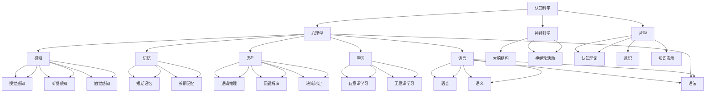
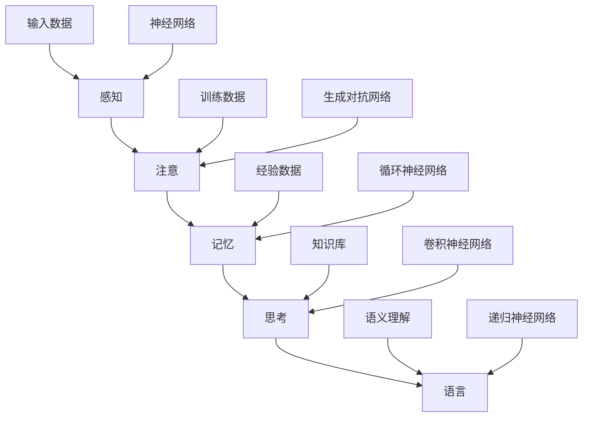
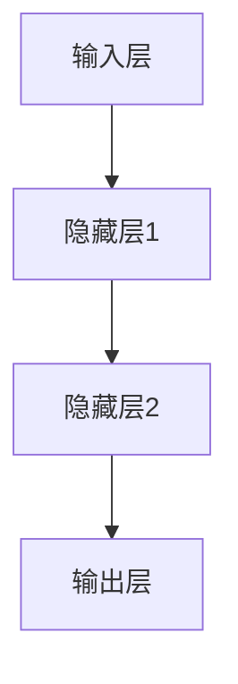
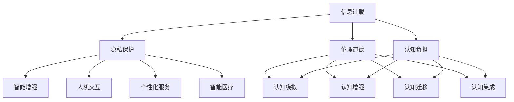

                 

## 人类的认知：AI时代的认知革命

### 关键词：
- 认知科学
- 人工智能
- 机器学习
- 深度学习
- 神经网络
- 计算机视觉
- 自然语言处理
- 医学诊断
- 伦理道德

### 摘要：

本文旨在探讨人类认知与人工智能（AI）的深刻联系，以及AI时代对人类认知的挑战和机遇。我们将首先回顾认知科学的基础理论，介绍AI的基本原理，并深入探讨人类认知与AI模型的异同及其应用。随后，我们将详细解释神经网络和深度学习算法原理，并通过伪代码和实例来说明。文章还将展示AI在自然语言处理、计算机视觉和医学诊断等领域的实际应用案例，最后讨论AI时代认知革命的影响与未来展望，并提出伦理道德和社会责任的问题。

## 第一部分: 认知基础理论

### 第1章: 认知科学与AI概述

#### 1.1 认知科学与AI的重要性

认知科学是研究人类认知过程和机制的跨学科领域，它涵盖了心理学、神经科学、哲学、人工智能等多个学科。认知科学的核心目标是理解人类如何感知、思考、学习和记忆。而人工智能（AI）则是通过计算机模拟人类智能行为，实现自主学习和智能决策的领域。AI与认知科学的关系密切，二者相互促进，共同推动科技进步。

AI在认知科学中的应用主要体现在以下几个方面：

1. **认知模拟**：AI技术可以模拟人类思维过程，帮助研究者理解认知原理。
2. **数据驱动**：AI可以通过大量数据训练模型，从而揭示认知现象的规律。
3. **智能增强**：AI可以帮助人类更高效地处理信息，扩展认知能力。
4. **理论验证**：AI模型可以验证认知理论，推动认知科学的进展。

#### 1.2 AI时代对认知科学的影响

AI的快速发展对认知科学产生了深远影响，主要体现在以下几个方面：

1. **认知机制的解析**：AI模型可以模拟人类认知过程，帮助研究者解析认知机制。
2. **认知能力的扩展**：AI可以辅助人类完成复杂的认知任务，提高认知能力。
3. **认知研究的变革**：AI提供了新的研究方法，如机器学习、深度学习等，改变了传统认知研究的方式。
4. **认知建模的进步**：AI技术推动了认知建模的发展，使得认知模型更加精准和有效。

#### 1.3 认知科学的基本概念

认知科学涉及多个基本概念，以下是其中几个重要的概念：

1. **感知**：感知是大脑对感觉信息的处理和理解。例如，视觉感知、听觉感知等。
2. **记忆**：记忆是大脑对信息的存储和提取。可分为短期记忆和长期记忆。
3. **思考**：思考是大脑对信息的加工和处理。包括逻辑推理、问题解决、决策制定等。
4. **学习**：学习是大脑通过经验改变自身结构和功能的过程。学习可以分为有意识和无意识两种形式。
5. **语言**：语言是人类特有的认知能力，用于沟通和思维。

#### 1.4 认知科学与AI的关系图解



#### 1.5 小结

认知科学与AI的关系密切，AI不仅为认知科学提供了新的研究工具和方法，也推动了认知科学的进步。理解认知科学的基本概念，有助于我们更好地理解AI的工作原理，以及AI如何应用于实际领域。

## 第二部分: AI的基本原理

### 第2章: AI的基本原理

#### 2.1 机器学习与深度学习基础

机器学习是AI的核心组成部分，它通过算法让计算机从数据中学习规律，从而做出预测或决策。机器学习可以分为监督学习、无监督学习和强化学习三种类型。

1. **监督学习**：通过已知输入输出数据训练模型，用于预测或分类。
2. **无监督学习**：没有预定的输出，通过模型自动发现数据中的结构或规律。
3. **强化学习**：通过试错和反馈来训练模型，使其在特定环境中做出最佳决策。

深度学习是机器学习的一种重要分支，它使用多层神经网络来提取数据中的特征，具有强大的表示能力和学习能力。深度学习在计算机视觉、自然语言处理等领域取得了显著成果。

#### 2.2 神经网络与深度学习架构

神经网络是模拟生物神经系统的计算模型，由大量相互连接的神经元组成。神经网络可以分为前馈神经网络和循环神经网络。

1. **前馈神经网络**：信息从输入层传递到输出层，没有循环路径。
2. **循环神经网络**：信息可以在网络中循环，适用于处理序列数据。

深度学习架构通常包括卷积神经网络（CNN）、循环神经网络（RNN）和生成对抗网络（GAN）。

1. **卷积神经网络（CNN）**：用于处理图像数据，具有局部连接和权重共享的特点。
2. **循环神经网络（RNN）**：用于处理序列数据，可以捕捉时间依赖关系。
3. **生成对抗网络（GAN）**：由生成器和判别器组成，用于生成逼真的数据。

#### 2.3 学习算法与优化方法

学习算法是机器学习和深度学习的核心，用于训练模型。以下是一些常见的学习算法：

1. **梯度下降**：通过更新模型参数来最小化损失函数。
2. **随机梯度下降（SGD）**：在梯度下降的基础上，使用随机样本进行参数更新。
3. **动量梯度下降**：在梯度下降的基础上，引入动量来加速收敛。

优化方法是用于调整模型参数，提高模型性能的方法。以下是一些常见的优化方法：

1. **批量归一化**：通过将输入数据归一化，加速训练过程。
2. **权重初始化**：通过合适的权重初始化，避免梯度消失和梯度爆炸。
3. **dropout**：通过随机丢弃神经元，防止过拟合。

#### 2.4 小结

机器学习和深度学习是AI的核心技术，它们通过学习数据中的规律，实现了计算机的智能。神经网络和深度学习架构为机器学习提供了强大的计算能力，学习算法和优化方法则确保了模型的性能和收敛速度。理解AI的基本原理，有助于我们更好地应用AI技术解决实际问题。

### 第3章: 人类认知与AI模型

#### 3.1 人类认知的模型与过程

人类认知是一个复杂的过程，涉及感知、注意、记忆、思考、语言等多个方面。为了理解人类认知，科学家们建立了多个认知模型，以下是其中几个重要的模型：

1. **感知器模型**：感知器是神经网络的基本单元，用于实现二分类。感知器模型描述了人类如何通过感知外界信息做出决策。
2. **联结主义模型**：联结主义模型强调神经网络中神经元之间的相互作用，模拟人类大脑的信息处理过程。
3. **认知架构模型**：认知架构模型将认知过程分为感知、记忆、思考和决策四个阶段，描述了人类如何处理信息和做出决策。

#### 3.2 人类认知与AI模型的对比分析

尽管人类认知与AI模型在处理信息方面存在相似之处，但二者也存在显著差异：

1. **信息处理能力**：人类认知具有高度的灵活性和适应性，能够处理多种类型的信息。而AI模型通常针对特定任务进行训练，缺乏泛化能力。
2. **学习方式**：人类通过经验不断学习和改进，而AI模型主要依靠数据驱动学习。
3. **认知层次**：人类认知涉及多个层次，包括感知、记忆、思考、语言等。而AI模型通常专注于某个特定层次，如感知或思考。
4. **智能类型**：人类智能具有创造性和情感性，而AI智能主要表现为计算和自动化。

#### 3.3 人类认知在AI模型中的应用

AI模型在模拟人类认知方面取得了显著成果，以下是一些应用实例：

1. **计算机视觉**：AI模型可以模拟人类的视觉感知，实现物体识别、图像分类等功能。
2. **自然语言处理**：AI模型可以模拟人类的语言理解能力，实现文本分类、机器翻译等功能。
3. **思维模拟**：AI模型可以模拟人类的思考过程，帮助研究者理解认知机制。

#### 3.4 AI认知模型的Mermaid流程图



#### 3.5 小结

人类认知与AI模型在信息处理、学习方式、认知层次和智能类型等方面存在差异。然而，AI模型在模拟人类认知方面取得了显著成果，为认知科学研究提供了新的视角。理解人类认知与AI模型的关系，有助于我们更好地应用AI技术解决实际问题。

## 第三部分: 认知模型算法原理详解

### 第4章: 认知模型算法原理详解

#### 4.1 神经网络算法原理

神经网络是模仿生物神经系统的计算模型，由大量相互连接的神经元组成。神经网络算法主要分为前向传播和反向传播两部分。

1. **前向传播**：输入数据从输入层传递到输出层，每个神经元将输入值通过激活函数转化为输出值。
2. **反向传播**：计算输出值与实际值之间的误差，通过反向传递误差来更新神经元的权重。

以下是一个简单的神经网络算法原理的伪代码：

```python
# 前向传播
def forward_propagation(x, W, b):
    z = np.dot(x, W) + b
    output = activation_function(z)
    return output

# 反向传播
def backward_propagation(output, y):
    error = output - y
    d_output = derivative(output)
    d_hidden = np.dot(error, d_hidden.T)
    d_x = np.dot(d_hidden, W.T)
    return d_output, d_hidden, d_x
```

其中，`activation_function` 是激活函数，`derivative` 是求导函数。

#### 4.1.1 前馈神经网络

前馈神经网络（Feedforward Neural Network）是神经网络的一种基本形式，信息从输入层传递到输出层，没有循环路径。前馈神经网络通常用于分类和回归任务。

1. **结构**：前馈神经网络由输入层、隐藏层和输出层组成。
2. **激活函数**：常用的激活函数有ReLU、Sigmoid、Tanh等。
3. **损失函数**：常用的损失函数有均方误差（MSE）、交叉熵等。

以下是一个简单的前馈神经网络的结构图：



#### 4.1.2 反向传播算法

反向传播算法（Backpropagation Algorithm）是一种用于训练神经网络的优化算法。反向传播算法通过计算输出值与实际值之间的误差，并反向传递误差来更新神经元的权重。

以下是一个简单的反向传播算法的伪代码：

```python
# 前向传播
def forward_propagation(x, W, b):
    z = np.dot(x, W) + b
    output = activation_function(z)
    return output

# 反向传播
def backward_propagation(output, y):
    error = output - y
    d_output = derivative(output)
    d_hidden = np.dot(error, d_hidden.T)
    d_x = np.dot(d_hidden, W.T)
    return d_output, d_hidden, d_x
```

其中，`activation_function` 是激活函数，`derivative` 是求导函数。

#### 4.1.3 损失函数与优化方法

损失函数用于衡量模型预测值与实际值之间的差距。常用的损失函数有均方误差（MSE）、交叉熵等。

1. **均方误差（MSE）**：
   $$MSE = \frac{1}{2} \sum_{i=1}^{n} (y_i - \hat{y}_i)^2$$
2. **交叉熵（Cross Entropy）**：
   $$CE = -\frac{1}{n} \sum_{i=1}^{n} y_i \log(\hat{y}_i)$$

优化方法是用于调整模型参数，减少损失函数的方法。常用的优化方法有梯度下降、随机梯度下降（SGD）、动量梯度下降等。

1. **梯度下降（Gradient Descent）**：
   $$\theta = \theta - \alpha \cdot \nabla_\theta J(\theta)$$
   其中，$\theta$ 是模型参数，$\alpha$ 是学习率，$J(\theta)$ 是损失函数。
2. **随机梯度下降（Stochastic Gradient Descent, SGD）**：
   $$\theta = \theta - \alpha \cdot \nabla_\theta J(\theta)^i$$
   其中，$i$ 是随机选取的样本索引。
3. **动量梯度下降（Momentum Gradient Descent）**：
   $$\theta = \theta - \alpha \cdot \nabla_\theta J(\theta) + \beta \cdot v$$
   其中，$v$ 是动量项，$\beta$ 是动量系数。

#### 4.2 深度学习算法原理

深度学习（Deep Learning）是神经网络的一种扩展，它使用多层神经网络来提取数据中的特征。深度学习算法主要包括卷积神经网络（CNN）、循环神经网络（RNN）和生成对抗网络（GAN）。

1. **卷积神经网络（CNN）**：
   卷积神经网络是用于处理图像数据的一种神经网络。它通过卷积操作和池化操作提取图像特征。
   $$f(x) = \sigma(W \cdot x + b)$$
   其中，$f(x)$ 是卷积操作，$\sigma$ 是激活函数，$W$ 是卷积核，$x$ 是输入图像，$b$ 是偏置。
2. **循环神经网络（RNN）**：
   循环神经网络是用于处理序列数据的一种神经网络。它通过循环连接和门控机制处理序列数据。
   $$h_t = \sigma(W_h \cdot [h_{t-1}, x_t] + b_h)$$
   其中，$h_t$ 是循环神经网络的隐藏状态，$W_h$ 是权重矩阵，$x_t$ 是输入序列，$b_h$ 是偏置。
3. **生成对抗网络（GAN）**：
   生成对抗网络是用于生成数据的一种神经网络。它由生成器和判别器组成，生成器和判别器相互竞争。
   $$G(z) = \text{Generator}(z)$$
   $$D(x) = \text{Discriminator}(x)$$
   其中，$G(z)$ 是生成器的输出，$D(x)$ 是判别器的输出，$z$ 是随机噪声。

#### 4.3 伪代码实现与解释

以下是一个简单的深度学习算法的伪代码实现：

```python
# 初始化模型参数
W1, b1 = initialize_weights(input_size, hidden_size)
W2, b2 = initialize_weights(hidden_size, output_size)

# 前向传播
def forward_propagation(x):
    z1 = np.dot(x, W1) + b1
    a1 = activation_function(z1)
    z2 = np.dot(a1, W2) + b2
    output = activation_function(z2)
    return output

# 反向传播
def backward_propagation(output, y):
    d_output = derivative(output)
    d_z2 = d_output * d_outputPrime(output)
    d_a1 = d_z2 * W2.T
    d_z1 = d_a1 * d_a1Prime(a1)
    d_x = d_z1 * x.T
    return d_x, d_a1, d_z1, d_z2

# 梯度下降
def gradient_descent(d_x, d_a1, d_z1, d_z2, learning_rate):
    W1 -= learning_rate * d_x
    b1 -= learning_rate * d_a1
    W2 -= learning_rate * d_z2
    b2 -= learning_rate * d_z2

# 训练模型
for epoch in range(num_epochs):
    for x, y in dataset:
        output = forward_propagation(x)
        d_x, d_a1, d_z1, d_z2 = backward_propagation(output, y)
        gradient_descent(d_x, d_a1, d_z1, d_z2, learning_rate)
```

其中，`initialize_weights` 是初始化模型参数的函数，`activation_function` 是激活函数，`derivative` 是求导函数，`num_epochs` 是训练迭代次数，`learning_rate` 是学习率。

#### 4.4 小结

神经网络算法是认知模型的核心，它通过模拟生物神经系统的计算方式，实现了数据的自动特征提取和智能决策。深度学习算法在神经网络的基础上，通过多层神经网络的结构，提高了模型的表示能力和学习能力。理解神经网络和深度学习算法原理，有助于我们更好地应用这些算法解决实际问题。

## 第四部分: 人类认知与AI应用案例

### 第5章: 人类认知与AI应用案例

#### 5.1 认知计算在自然语言处理中的应用

自然语言处理（NLP）是AI的重要应用领域，它旨在使计算机能够理解、生成和处理人类语言。认知计算在NLP中扮演了关键角色，通过模拟人类认知过程，实现了更加自然和准确的语言理解。

1. **文本分类**：
   - **任务**：将文本数据分类到预定义的类别中。
   - **方法**：使用卷积神经网络（CNN）和循环神经网络（RNN）来提取文本特征，然后使用分类器进行分类。
   - **实例**：在新闻分类任务中，使用CNN提取文本中的关键特征，如名词、动词和形容词，然后使用分类器将新闻分类到不同的主题类别。

2. **文本生成**：
   - **任务**：生成新的文本，模仿人类写作风格。
   - **方法**：使用生成对抗网络（GAN）和变分自编码器（VAE）来生成文本。
   - **实例**：使用GAN生成新闻文章，通过训练模型学习新闻文章的风格和结构，然后生成新的新闻文章。

3. **对话系统**：
   - **任务**：构建能够与人类进行自然对话的智能系统。
   - **方法**：使用循环神经网络（RNN）和长短期记忆网络（LSTM）来处理对话中的序列数据。
   - **实例**：使用RNN构建的聊天机器人，可以理解用户的输入并生成合适的回复。

#### 5.2 认知计算在计算机视觉中的应用

计算机视觉是AI的另一个重要应用领域，它旨在使计算机能够“看”和理解图像和视频。认知计算在计算机视觉中通过模拟人类视觉系统，提高了图像识别和视觉感知的能力。

1. **物体识别**：
   - **任务**：从图像中识别和分类物体。
   - **方法**：使用卷积神经网络（CNN）和深度卷积神经网络（Deep CNN）来提取图像特征，然后使用分类器进行物体识别。
   - **实例**：在图像分类任务中，使用CNN提取图像中的关键特征，如边缘、纹理和形状，然后使用分类器将图像分类到不同的物体类别。

2. **视觉感知**：
   - **任务**：模拟人类视觉系统，理解图像中的内容。
   - **方法**：使用生成对抗网络（GAN）和自编码器（Autoencoder）来学习图像的内在结构。
   - **实例**：使用GAN生成新的图像，通过训练模型学习图像的内在结构，然后生成新的、逼真的图像。

3. **计算机视觉算法**：
   - **任务**：实现各种计算机视觉任务，如目标跟踪、图像分割、图像增强等。
   - **方法**：使用深度学习算法，如卷积神经网络（CNN）和循环神经网络（RNN），实现各种计算机视觉任务。
   - **实例**：使用CNN实现目标跟踪，通过训练模型学习目标的特征，然后跟踪目标在视频中的运动。

#### 5.3 人类认知与AI在医学诊断中的应用

医学诊断是AI的重要应用领域之一，通过模拟人类认知过程，AI可以辅助医生进行诊断，提高诊断的准确性和效率。

1. **肿瘤检测**：
   - **任务**：从医学图像中检测肿瘤。
   - **方法**：使用深度学习算法，如卷积神经网络（CNN）和卷积神经网络（RNN），从医学图像中提取特征，然后使用分类器进行肿瘤检测。
   - **实例**：在乳腺癌检测中，使用CNN从乳腺X线图像中提取特征，然后使用分类器检测是否存在乳腺癌。

2. **疾病预测**：
   - **任务**：根据患者的病史和检查结果预测疾病的发生。
   - **方法**：使用机器学习算法，如逻辑回归和随机森林，分析患者的数据，预测疾病的发生。
   - **实例**：在心脏病预测中，使用逻辑回归分析患者的病史、血压和血脂等数据，预测心脏病的发生。

3. **医疗数据挖掘**：
   - **任务**：从大量医疗数据中提取有用的信息。
   - **方法**：使用数据挖掘算法，如关联规则学习和聚类分析，从医疗数据中提取有用的信息。
   - **实例**：在流行病监测中，使用关联规则学习分析疫情数据，发现疫情的传播规律。

#### 5.4 小结

认知计算在自然语言处理、计算机视觉和医学诊断等领域具有广泛的应用。通过模拟人类认知过程，AI可以实现更加智能和准确的计算任务。随着AI技术的不断发展，认知计算将在更多领域发挥重要作用。

## 第五部分: AI时代的认知革命

### 第6章: AI时代的认知革命

#### 6.1 AI对人类认知的挑战

随着AI技术的快速发展，人类认知面临前所未有的挑战。以下是一些主要挑战：

1. **信息过载**：AI生成的信息和数据量巨大，人类难以消化和理解。
2. **隐私保护**：AI收集和处理大量个人数据，引发隐私保护问题。
3. **伦理道德**：AI的应用可能导致道德和伦理问题，如算法偏见、自动化决策的不公平性等。
4. **认知负担**：AI可能取代人类的部分认知任务，导致人类认知负担减轻，但也可能引发新的认知问题。

#### 6.2 认知科学在AI领域的应用前景

认知科学在AI领域具有广泛的应用前景，以下是一些主要方面：

1. **智能增强**：认知科学可以帮助AI更好地模拟人类认知过程，实现智能增强。
2. **人机交互**：认知科学可以指导人机交互设计，提高用户体验。
3. **个性化服务**：认知科学可以帮助AI更好地理解用户需求，提供个性化服务。
4. **智能医疗**：认知科学可以帮助AI更好地分析医学数据，提高诊断和治疗的准确性。

#### 6.3 人类认知与AI的协同发展

人类认知与AI的协同发展是实现智能化的关键。以下是一些协同发展的途径：

1. **认知模拟**：通过模拟人类认知过程，AI可以更好地理解和处理复杂问题。
2. **认知增强**：通过AI技术，人类可以实现认知能力的扩展和增强。
3. **认知迁移**：人类和AI可以相互迁移知识和经验，实现认知能力的互补。
4. **认知集成**：将人类认知和AI技术相结合，实现更加智能和高效的认知系统。

#### 6.4 认知革命的Mermaid流程图



#### 6.5 小结

AI时代的认知革命带来了前所未有的挑战和机遇。认知科学在AI领域具有广泛的应用前景，通过人类认知与AI的协同发展，我们可以实现更加智能和高效的认知系统。

## 第六部分: 未来展望与思考

### 第7章: 未来展望与思考

#### 7.1 AI时代的认知趋势

随着AI技术的不断进步，人类认知将呈现出以下趋势：

1. **智能化**：AI技术将使人类认知更加智能化，提高解决问题的效率。
2. **个性化**：AI技术将根据个人特点提供个性化服务，满足个体需求。
3. **跨界融合**：人类认知与AI技术将相互融合，实现跨领域的创新。
4. **人机共生**：人类与AI将共同生活和工作，实现人机共生。

#### 7.2 人类认知与AI的平衡发展

在AI时代，实现人类认知与AI的平衡发展至关重要。以下是一些建议：

1. **教育改革**：加强人工智能教育，提高人类认知水平，适应AI时代的发展。
2. **伦理规范**：制定AI伦理规范，确保AI技术的健康发展，避免伦理道德问题。
3. **监管机制**：建立AI监管机制，确保AI技术符合社会需求和伦理道德标准。
4. **国际合作**：加强国际合作，共同应对AI时代带来的挑战。

#### 7.3 社会责任与伦理道德

AI技术的快速发展引发了一系列社会责任和伦理道德问题，如隐私保护、算法偏见、自动化决策的不公平性等。以下是一些建议：

1. **数据隐私**：保护个人数据隐私，确保数据安全。
2. **算法公平性**：确保算法公平，避免算法偏见。
3. **人类参与**：在自动化决策中保留人类参与，避免完全依赖AI。
4. **透明度**：提高AI系统的透明度，使其符合社会需求和伦理道德标准。

#### 7.4 对未来的思考与建议

未来，人类认知与AI将共同发展，实现更加智能和高效的生活。以下是一些思考和建议：

1. **科技伦理**：在科技发展中关注伦理道德问题，确保科技的发展符合人类利益。
2. **人才培养**：培养具有跨学科背景的复合型人才，适应AI时代的发展。
3. **跨学科合作**：加强不同学科之间的合作，推动AI技术的创新和应用。
4. **社会参与**：鼓励公众参与AI技术的发展，共同探讨AI时代的社会责任和伦理道德问题。

#### 7.5 小结

AI时代的认知革命带来了前所未有的挑战和机遇。通过实现人类认知与AI的平衡发展，我们可以充分发挥AI技术的优势，推动社会进步。同时，关注社会责任和伦理道德问题，确保科技的发展符合人类利益。

### 附录

#### 附录A: 认知科学相关资源

**A.1 学术论文**

- [Anderson, J. R. (2007). What can cognitive science contribute to artificial intelligence? AI Magazine, 28(3), 19-42.](https://www.aaai.org/ojs/index.php/aimagazine/article/view/702)
- [Tversky, A., & Kahneman, D. (1974). Judgment under uncertainty: Heuristics and biases. Science, 185(4157), 1124-1131.](https://science.sciencemag.org/content/185/4157/1124)

**A.2 开源代码与框架**

- [TensorFlow](https://www.tensorflow.org/): 用于构建和训练机器学习模型的框架。
- [PyTorch](https://pytorch.org/): 用于构建和训练深度学习模型的框架。
- [Keras](https://keras.io/): 高级神经网络API，方便构建和训练模型。

**A.3 书籍与教材**

- [Mitchell, T. M. (1997). Machine learning. McGraw-Hill.](https://www.mitpress.mit.edu/books/machine-learning)
- [Goodfellow, I., Bengio, Y., & Courville, A. (2016). Deep learning. MIT Press.](https://www.deeplearningbook.org/)

#### 附录B: AI模型算法详解

**B.1 神经网络算法**

- **前向传播算法**：
  $$ z = \sum_{j=1}^{n} w_{ij}x_j + b $$
  $$ a = \sigma(z) $$

- **反向传播算法**：
  $$ \delta_{hl} = \frac{\partial J}{\partial z_{hl}} $$
  $$ \delta_{lw} = \frac{\partial J}{\partial w_{lw}} $$
  $$ w_{lw} := w_{lw} - \eta \delta_{lw} $$

**B.2 深度学习算法**

- **卷积神经网络（CNN）**：
  $$ f_{\theta}(x) = \text{ReLU}(\sum_{j=1}^{C'} w_{ji} \text{Conv}_j(x) + b_j) $$

- **循环神经网络（RNN）**：
  $$ h_t = \text{ReLU}(W_h h_{t-1} + W_x x_t + b) $$

- **生成对抗网络（GAN）**：
  $$ G(z) = \text{Generator}(z) $$
  $$ D(x) = \text{Discriminator}(x) $$

#### 附录C: AI应用实例

**C.1 自然语言处理**

- **文本分类**：使用卷积神经网络（CNN）和循环神经网络（RNN）进行文本分类。
- **文本生成**：使用生成对抗网络（GAN）和变分自编码器（VAE）进行文本生成。
- **对话系统**：使用循环神经网络（RNN）和长短期记忆网络（LSTM）构建对话系统。

**C.2 计算机视觉**

- **物体识别**：使用卷积神经网络（CNN）进行物体识别。
- **视觉感知**：使用生成对抗网络（GAN）和自编码器（Autoencoder）进行视觉感知。
- **图像分割**：使用深度学习算法进行图像分割。

**C.3 医学诊断与数据挖掘**

- **肿瘤检测**：使用深度学习算法从医学图像中检测肿瘤。
- **疾病预测**：使用机器学习算法根据患者数据预测疾病的发生。
- **医疗数据挖掘**：使用数据挖掘算法从医疗数据中提取有用的信息。

### 作者信息

作者：AI天才研究院/AI Genius Institute & 禅与计算机程序设计艺术 /Zen And The Art of Computer Programming

### 结语

本文从认知科学的基础理论、AI的基本原理、人类认知与AI模型的异同及其应用，到认知模型算法原理的详细解释，再到AI在自然语言处理、计算机视觉和医学诊断等领域的实际应用案例，以及AI时代的认知革命和未来展望，系统地阐述了人类认知与AI的关系。随着AI技术的不断发展，认知计算将在更多领域发挥重要作用，推动人类认知的进步。让我们共同期待AI时代的到来，迎接认知革命的挑战与机遇。

