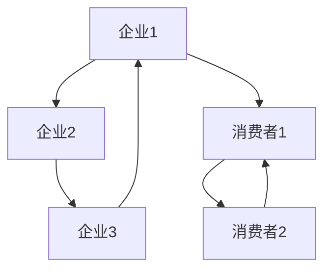
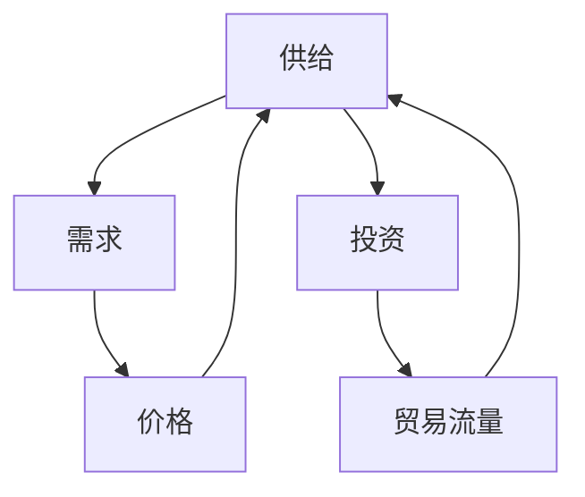
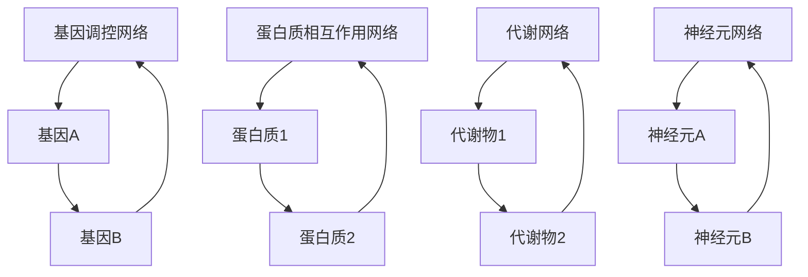
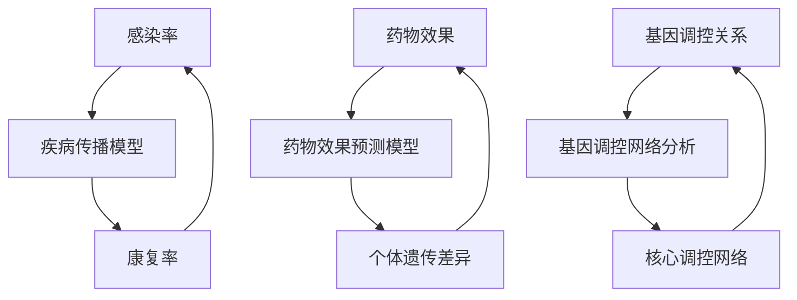

                 

### 引言

随着信息技术的飞速发展，我们生活在一个由各种复杂系统交织在一起的世界中。从社会网络到生物系统，从经济市场到生态系统，这些复杂系统中的每一个都包含了众多的交互因素。传统的线性因果模型在处理这些复杂系统时显得力不从心，而复杂网络作为一种新的方法论，能够更准确地捕捉和解释这些多因素交互的现象。

本文将带您从线性因果模型过渡到复杂网络，深入了解多因素交互的世界。我们将首先介绍线性因果模型的基本概念，分析其在处理复杂系统时的局限性。接着，我们将详细阐述复杂网络的定义、特性以及其在网络科学中的基本概念。在此基础上，我们将探讨多因素交互的理论基础，并介绍如何构建和解析多因素交互模型。

本文的结构如下：

1. **基础理论**：介绍线性因果模型和复杂网络的基础概念。
2. **核心算法**：深入探讨复杂网络分析方法以及多因素交互模型构建。
3. **应用实践**：展示复杂网络与多因素交互在不同领域的实际应用。

通过本文的逐步讲解，我们将不仅理解复杂网络和多因素交互的基本原理，还将掌握如何将它们应用于实际问题中，从而提升我们的分析和解决问题的能力。

### 关键词

- **线性因果模型**
- **复杂网络**
- **多因素交互**
- **网络科学**
- **网络拓扑分析**
- **网络动力学分析**
- **多变量模型**
- **非线性交互**

### 摘要

本文从线性因果模型出发，探讨了复杂网络和多因素交互的基本理论及其在实际应用中的重要性。首先，我们分析了线性因果模型的局限性，并引出了复杂网络的概念。接着，我们深入探讨了复杂网络的定义、特性和基本概念，包括网络拓扑和动力学分析。随后，我们介绍了多因素交互的理论基础和构建方法，并通过具体案例展示了如何在实际问题中应用这些理论。本文旨在帮助读者全面理解复杂网络与多因素交互，掌握其在各个领域的应用方法。

### 线性因果模型概述

线性因果模型是一种基于线性关系和因果关系的方法论，它在物理学、经济学、心理学等多个领域得到了广泛应用。该模型的核心思想是，通过观察系统中的变量之间的关系，利用线性方程来描述和预测系统的行为。具体来说，线性因果模型通常采用线性回归模型，它通过最小二乘法拟合数据，从而得到变量之间的线性关系。

#### 线性因果模型的基本概念

线性因果模型的基本概念包括因变量（dependent variable）和自变量（independent variable）。因变量是我们希望预测或解释的变量，而自变量则是用来预测或解释因变量的变量。在数学上，一个简单的线性回归模型可以表示为：

\[ Y = \beta_0 + \beta_1X + \epsilon \]

其中，\( Y \) 是因变量，\( X \) 是自变量，\( \beta_0 \) 和 \( \beta_1 \) 是模型的参数，\( \epsilon \) 是误差项。

#### 线性因果模型的局限性

虽然线性因果模型在许多情况下表现出色，但它在处理复杂系统时存在明显的局限性：

1. **线性假设**：线性因果模型假设变量之间的关系是线性的，这在实际中往往不成立，因为许多系统中的关系可能是非线性的。
   
2. **可加性假设**：线性因果模型假定各因素对结果的贡献是相互独立的，且是可加的。然而，在实际系统中，多个因素往往相互作用，共同影响结果，这种交互效应在传统线性模型中难以捕捉。

3. **变量间的关系**：线性模型只考虑了变量之间的线性关系，无法表达变量之间的复杂相互作用。

4. **模型的泛化能力**：线性模型对数据的依赖性较强，其预测能力容易受到样本数据的影响，因此在处理新数据时泛化能力有限。

为了解决这些问题，我们需要引入更复杂的方法来处理多因素交互，这便引出了复杂网络的概念。

### 复杂网络的定义与特性

复杂网络作为一种新兴的研究方法，能够更好地描述和解释多因素交互的现象。接下来，我们将详细阐述复杂网络的定义、构成要素、度量方法以及其主要特性。

#### 复杂网络的定义

复杂网络是一类由大量节点和边构成的网络结构，这些节点和边通常具有复杂的关系和相互作用。具体来说，复杂网络可以定义为：

\[ G = (V, E) \]

其中，\( V \) 表示节点集合，\( E \) 表示边集合。节点通常表示系统中的个体或实体，而边表示节点之间的相互作用或关联。

#### 复杂网络的构成要素

复杂网络的构成要素主要包括节点、边和边的权重。节点可以表示系统中的任何实体，如个体、组织、城市等。边则表示节点之间的直接联系或关系。边的权重通常表示节点之间关系的强度或频率。具体来说：

1. **节点**：节点是网络中的基本单元，每个节点都可以有其自身的属性和特征。
2. **边**：边连接两个节点，表示节点之间的相互作用。边的存在与否决定了节点之间的直接联系。
3. **边的权重**：边的权重可以是一个数值，表示节点之间关系的强度或频率。例如，在社交网络中，边的权重可以表示好友关系的强度。

#### 复杂网络的度量方法

复杂网络的研究离不开对其结构和特性的度量。以下是一些常用的度量方法：

1. **节点度**：节点度表示连接到某个节点的边的数量。节点的度可以用来衡量其在网络中的重要性。例如，在社交网络中，度数较高的节点可能是重要的社交中心。
   
2. **路径长度**：路径长度表示两个节点之间最短路径的边数。路径长度可以用来衡量网络中节点的连通性。

3. **聚类系数**：聚类系数表示一个节点邻居之间直接相连的概率。聚类系数越高，表示网络中节点之间的关系越紧密。

4. **网络密度**：网络密度表示网络中边的数量与可能的最大边数之比。网络密度越高，表示网络连接越紧密。

#### 复杂网络的主要特性

复杂网络具有以下主要特性：

1. **自组织特性**：复杂网络中的节点和边可以通过局部相互作用自发地形成复杂的结构。自组织特性使得复杂网络能够适应环境变化，表现出高度灵活性和适应性。

2. **异质性**：复杂网络中的节点和边具有不同的属性和特征，这导致了网络结构的异质性。异质性使得复杂网络能够处理不同类型的信息和任务。

3. **无标度特性**：复杂网络中的节点度分布往往服从幂律分布，即少数节点拥有大量的连接，而大部分节点只有少量的连接。无标度特性使得复杂网络具有高度的可扩展性和容错性。

通过上述定义和特性，我们可以看到复杂网络在描述多因素交互方面具有显著优势。接下来，我们将进一步探讨网络科学的基本概念，以便更好地理解复杂网络的分析方法。

### 网络科学的基本概念

网络科学作为研究复杂网络结构和行为的跨学科领域，其核心概念涵盖了网络拓扑、网络动力学以及相关的度量方法。通过这些基本概念，我们可以深入理解复杂网络的结构特性和动态行为，从而更好地分析现实世界中的多因素交互现象。

#### 网络拓扑

网络拓扑是指网络的结构和连接方式，它决定了网络的基本特性。以下是一些重要的网络拓扑概念：

1. **节点度分布**：节点度分布描述了网络中每个节点度的概率分布。常见的度分布有泊松分布、幂律分布等。节点度分布对网络的稳定性和传播动力学有重要影响。

2. **聚类系数**：聚类系数衡量了网络中节点邻居之间直接相连的概率。高聚类系数意味着网络中的节点具有较强的局部连接，这有助于信息的快速传递。

3. **网络密度**：网络密度是指网络中边的数量与可能的最大边数之比。网络密度可以反映网络的连接紧密程度，密度越高，网络越难以分解。

4. **路径长度**：路径长度是指网络中两个节点之间最短路径的边数。路径长度越短，网络中的节点越容易相互访问，这有助于信息的快速传播。

#### 网络动力学

网络动力学研究网络中的节点和边的动态变化行为，包括节点的状态变化、边的生成和消失等。以下是一些关键的网络动力学概念：

1. **稳定性**：网络的稳定性是指网络在受到外部扰动时能够保持原有结构的能力。稳定网络能够抵御小规模的攻击和扰动，而脆弱的网络则容易受到破坏。

2. **传播动力学**：传播动力学研究信息、病毒、流行病等在网络中的传播过程。例如，在网络传播模型中，节点的状态可以是感染状态、未感染状态或已恢复状态，传播动力学分析可以帮助我们理解信息或疾病的传播速度和范围。

3. **同步**：同步是指网络中的多个节点在时间上保持协调一致的状态。网络同步研究在多个领域有重要应用，如电力系统同步、交通信号控制等。

#### 网络度量方法

网络度量方法用于量化网络的结构和功能特性，以下是一些常用的网络度量方法：

1. **中心性度量**：中心性度量衡量节点在网络中的中心程度，常用的度量方法包括度中心性、介数和接近中心性。中心性度量可以帮助我们识别网络中的关键节点和核心路径。

2. **网络模块度**：网络模块度衡量网络中模块结构的强度，模块度越高，表示模块内部的连接越紧密，模块之间的连接越松散。

3. **网络熵**：网络熵用于衡量网络的复杂性和不确定性。网络熵越高，表示网络的拓扑结构越复杂，信息传递的路径多样化。

通过上述基本概念，我们可以更全面地理解和分析复杂网络的结构和动态行为。这些概念不仅有助于我们深入探索复杂网络的理论，也为实际应用提供了有力的工具。接下来，我们将探讨多因素交互的基本概念和理论，为理解复杂网络的多因素交互现象打下基础。

### 多因素交互的基本概念

多因素交互指的是在复杂系统中，多个变量或因素之间相互作用，共同影响结果的过程。这种交互效应不仅体现在自然科学和工程领域，也在社会科学、经济和生物医学等领域发挥着重要作用。为了更好地理解和分析多因素交互，我们需要从基本概念入手，逐步深入。

#### 多因素交互的类型

多因素交互可以分为线性交互和非线性交互两大类。

1. **线性交互**：线性交互是指多个因素通过线性关系共同作用于结果。这种交互可以通过线性方程组或线性回归模型来描述。例如，在经济学中，供需关系可以表示为线性函数，需求量是价格和收入的线性组合。线性交互的优点是模型简单，计算方便，但在处理复杂系统时可能存在局限性。

2. **非线性交互**：非线性交互是指多个因素通过非线性关系共同作用于结果。这种交互可以通过非线性方程组或非线性回归模型来描述。例如，在生物医学中，药物的疗效可能受到多种生物分子的非线性调控，这种非线性关系无法用线性模型准确捕捉。非线性交互的复杂性使得分析更加困难，但也提供了更丰富的信息。

#### 多因素交互的影响机制

多因素交互的影响机制复杂多样，可以通过以下几种方式实现：

1. **叠加效应**：多个因素单独作用的结果简单叠加，形成最终的效应。例如，在气候系统中，温度和降水是影响气候变化的重要因素，这两个因素可以叠加产生总效应。

2. **协同效应**：多个因素共同作用，产生比单独作用更大的效应。例如，在经济学中，创新和技术进步可以协同促进经济增长。

3. **抑制效应**：一个因素的作用被另一个因素所抑制，导致总效应减弱。例如，在生态系统中，某些捕食者可能抑制其他捕食者的数量，从而影响食物链的稳定。

4. **反馈效应**：一个因素的效应反过来影响产生该效应的因素，形成正反馈或负反馈循环。例如，在生物医学中，免疫系统的反应可以正反馈增强，导致免疫过度反应。

#### 多因素交互的数学模型

多因素交互的数学模型是分析复杂系统的重要工具。以下介绍几种常见的数学模型：

1. **多变量线性回归模型**：多变量线性回归模型通过线性方程组描述多个因素对结果的影响。其数学表达式为：

   \[ Y = \beta_0 + \beta_1X_1 + \beta_2X_2 + \cdots + \beta_nX_n + \epsilon \]

   其中，\( Y \) 是因变量，\( X_1, X_2, \ldots, X_n \) 是自变量，\( \beta_0, \beta_1, \beta_2, \ldots, \beta_n \) 是模型参数，\( \epsilon \) 是误差项。

2. **多变量非线性回归模型**：多变量非线性回归模型通过非线性函数描述多个因素对结果的影响。其数学表达式为：

   \[ Y = f(X_1, X_2, \ldots, X_n; \theta) + \epsilon \]

   其中，\( f \) 是非线性函数，\( \theta \) 是模型参数。

3. **多因素交互模型**：多因素交互模型专门用于描述多个因素之间的交互效应。其数学表达式可以表示为：

   \[ Y = g(X_1, X_2, \ldots, X_n; \theta) + \epsilon \]

   其中，\( g \) 是包含交互项的函数，\( \theta \) 是模型参数。

通过这些数学模型，我们可以定量分析多因素交互的影响，从而更好地理解复杂系统的运行机制。

### 多因素交互模型在现实中的应用

多因素交互模型不仅在理论研究中具有重要意义，更在实际应用中发挥了关键作用。以下我们将通过几个具体领域，展示多因素交互模型的应用及其效果。

#### 社会网络分析

在社会网络分析中，多因素交互模型帮助我们理解社交关系中的复杂动态。例如，在社交媒体平台上，用户之间的关系可以通过多因素交互模型来分析。一个常见的应用是推荐系统，通过分析用户之间的互动（如点赞、评论、分享等），推荐用户可能感兴趣的内容。多因素交互模型可以帮助识别用户兴趣的共性和差异，从而提高推荐系统的准确性。

**具体案例**：Facebook 的“热门话题”功能利用了多因素交互模型来分析用户之间的社交关系，识别出热门话题和趋势，为用户提供个性化的内容推荐。

#### 经济系统分析

在经济系统中，多因素交互模型帮助我们理解市场行为和宏观经济现象。例如，在金融市场分析中，价格和交易量的变化受到多种因素（如供需、投资者情绪、政策变化等）的影响。通过多因素交互模型，我们可以预测市场走势，评估投资风险。

**具体案例**：经济学家使用多因素交互模型分析宏观经济数据，预测经济增长和通货膨胀，为政府决策提供依据。

#### 生物网络分析

在生物网络分析中，多因素交互模型帮助我们理解基因调控和生物路径的复杂机制。例如，在疾病研究中，基因与基因、基因与蛋白质之间的相互作用可以通过多因素交互模型来分析，帮助科学家发现疾病的潜在分子机制。

**具体案例**：通过多因素交互模型分析癌症基因组数据，科学家发现了某些基因突变在癌症发生和发展中的关键作用，为个性化治疗提供了新的方向。

#### 交通网络分析

在交通网络分析中，多因素交互模型帮助我们优化交通流量，减少拥堵。例如，在智能交通系统中，通过分析道路上的车辆数量、行驶速度、交通信号等数据，多因素交互模型可以预测交通状况，并实时调整信号灯时长，优化交通流。

**具体案例**：北京等大城市的智能交通系统利用多因素交互模型分析交通数据，实时调整交通信号，有效缓解了交通拥堵。

通过这些实际应用案例，我们可以看到多因素交互模型在不同领域中的重要性。它不仅帮助我们理解复杂系统的运行机制，还为实际问题的解决提供了有力工具。

### 复杂网络分析方法

复杂网络分析是网络科学研究的重要组成部分，通过分析复杂网络的拓扑结构和动态行为，我们可以深入理解网络中的多因素交互现象。以下我们将介绍几种常用的复杂网络分析方法，包括网络拓扑分析、网络动力学分析以及网络同步分析。

#### 网络拓扑分析

网络拓扑分析旨在研究网络的结构特性，包括节点度分布、聚类系数和网络密度等。以下是几种常用的网络拓扑分析方法：

1. **节点度分布分析**：节点度分布描述了网络中每个节点度的概率分布。常见的度分布有泊松分布、幂律分布等。通过分析节点度分布，我们可以了解网络的连接特性。例如，在社交网络中，幂律分布可能表示某些用户具有大量的社交关系，形成了网络中的核心节点。

   **Mermaid 流程图**：

   ```mermaid
   graph TD
   A[泊松分布] --> B{度分布}
   A --> C[幂律分布]
   ```

2. **聚类系数分析**：聚类系数衡量了网络中节点邻居之间直接相连的概率。高聚类系数意味着网络中的节点具有较强的局部连接，有助于信息的快速传递。例如，在生物网络中，高聚类系数可能表示蛋白质之间的紧密相互作用。

   **Mermaid 流程图**：

   ```mermaid
   graph TD
   A[聚类系数] --> B{度量方法}
   B --> C[网络局部连接性]
   ```

3. **网络密度分析**：网络密度是指网络中边的数量与可能的最大边数之比。网络密度可以反映网络的连接紧密程度。高网络密度表示网络中节点之间的联系较为紧密，有利于信息的高效传递。例如，在交通网络中，高网络密度可以减少交通拥堵。

   **Mermaid 流程图**：

   ```mermaid
   graph TD
   A[网络密度] --> B{度量方法}
   B --> C[网络连接紧密程度]
   ```

#### 网络动力学分析

网络动力学分析研究网络中的动态行为，包括节点的状态变化、边的生成和消失等。以下是几种常用的网络动力学分析方法：

1. **网络稳定性分析**：网络稳定性分析旨在评估网络在受到外部扰动时保持稳定的能力。例如，在电力网络中，稳定性分析可以帮助我们确保电力供应的可靠性。常用的稳定性分析方法包括特征值分析和线性化方法。

   **Mermaid 流程图**：

   ```mermaid
   graph TD
   A[网络稳定性分析] --> B{网络稳定性}
   B --> C[特征值分析]
   B --> D[线性化方法]
   ```

2. **网络传播动力学分析**：网络传播动力学分析研究信息、病毒、流行病等在网络中的传播过程。例如，在网络传播模型中，节点的状态可以是感染状态、未感染状态或已恢复状态，传播动力学分析可以帮助我们理解传播速度和范围。常用的传播模型包括SIR模型、SEIR模型等。

   **Mermaid 流程图**：

   ```mermaid
   graph TD
   A[网络传播动力学分析] --> B{传播模型}
   B --> C[SIR模型]
   B --> D[SEIR模型]
   ```

3. **网络同步分析**：网络同步分析研究网络中的多个节点在时间上保持协调一致的状态。例如，在交通信号控制系统中，网络同步分析可以帮助我们确保交通流的高效运行。常用的同步分析方法包括相位锁定分析和频率同步分析。

   **Mermaid 流�程图**：

   ```mermaid
   graph TD
   A[网络同步分析] --> B{同步模型}
   B --> C[相位锁定分析]
   B --> D[频率同步分析]
   ```

通过上述分析，我们可以深入理解复杂网络的结构和动态行为，从而更好地把握多因素交互的影响。这些分析方法不仅在理论研究中有重要应用，还在实际应用中发挥着关键作用。

### 多因素线性交互模型构建

多因素线性交互模型在处理多变量线性关系时具有简洁性和高效性，广泛应用于社会科学、经济学、工程学等领域。本节将详细探讨如何构建和解析多因素线性交互模型，包括多变量线性回归模型和线性规划模型的构建方法，并给出伪代码示例。

#### 多变量线性回归模型

多变量线性回归模型用于分析多个自变量对因变量的线性影响。其基本形式为：

\[ Y = \beta_0 + \beta_1X_1 + \beta_2X_2 + \cdots + \beta_nX_n + \epsilon \]

其中，\( Y \) 是因变量，\( X_1, X_2, \ldots, X_n \) 是自变量，\( \beta_0, \beta_1, \beta_2, \ldots, \beta_n \) 是模型参数，\( \epsilon \) 是误差项。

**伪代码示例：**

```python
# 输入数据矩阵X和目标向量Y
X = [...]
Y = [...]

# 拟合线性回归模型
model = LinearRegression()
model.fit(X, Y)

# 输出模型参数
beta = model.coef_
```

#### 多因素线性规划模型

多因素线性规划模型用于在多个约束条件下优化线性目标函数。其一般形式为：

\[ \text{minimize} \ \beta_0X + \beta_1Y + \cdots + \beta_nZ \]

\[ \text{subject to} \ Ax + By + Cz \leq D \]
\[ Ex + Fy + Gz = H \]
\[ Jx + Ky + Lz = M \]

其中，\( X, Y, Z \) 是决策变量，\( \beta_0, \beta_1, \ldots, \beta_n \) 是参数，\( A, B, C, \ldots, L \) 是系数，\( D, H, M \) 是常数。

**伪代码示例：**

```python
# 输入参数矩阵A、B、C、E、F、G、J、K、L和目标函数系数beta
A = [...]
B = [...]
C = [...]
E = [...]
F = [...]
G = [...]
J = [...]
K = [...]
L = [...]

# 输入目标函数系数beta
beta = [...]

# 构建线性规划模型
model = LinearProgramming()
model.objective = beta.dot([X, Y, Z])
model.constraints = [A.dot([X, Y, Z]) <= D, E.dot([X, Y, Z]) == H, J.dot([X, Y, Z]) == M]

# 求解线性规划模型
solution = model.solve()

# 输出最优解
X_optimal = solution.variables['X']
Y_optimal = solution.variables['Y']
Z_optimal = solution.variables['Z']
```

通过上述方法，我们可以有效地构建和解析多因素线性交互模型，从而在多个因素之间建立定量关系，为实际问题的解决提供科学依据。

### 多因素非线性交互模型构建

在现实世界中，许多系统中的因素关系是非线性的，这意味着我们需要使用非线性模型来准确捕捉这些关系。多因素非线性交互模型通过引入非线性函数来描述多个因素之间的复杂交互，从而提升模型的解释力和预测能力。以下将介绍几种常用的多因素非线性交互模型构建方法，包括多变量非线性回归模型和多因素非线性优化模型，并通过伪代码详细说明这些方法的实现步骤。

#### 多变量非线性回归模型

多变量非线性回归模型用于分析多个自变量对因变量的非线性影响。其基本形式为：

\[ Y = f(X_1, X_2, \ldots, X_n; \theta) + \epsilon \]

其中，\( Y \) 是因变量，\( X_1, X_2, \ldots, X_n \) 是自变量，\( f \) 是非线性函数，\( \theta \) 是模型参数，\( \epsilon \) 是误差项。

**伪代码示例：**

```python
# 输入数据矩阵X和目标向量Y
X = [...]
Y = [...]

# 选择非线性函数（例如，多项式函数）
def f(X, theta):
    return theta[0] + theta[1] * X[0]**2 + theta[2] * X[1]**2 + theta[3] * X[0] * X[1]

# 初始化模型参数
theta = [1.0, 1.0, 1.0, 1.0]

# 构建非线性回归模型
model = NonLinearRegression(f)
model.fit(X, Y)

# 输出模型参数
params = model.params
```

#### 多因素非线性优化模型

多因素非线性优化模型用于在非线性约束条件下优化目标函数。其一般形式为：

\[ \text{minimize} \ \beta_0X + \beta_1Y + \cdots + \beta_nZ \]

\[ \text{subject to} \ g(X, Y, Z) \leq h \]
\[ k(X, Y, Z) = l \]
\[ m(X, Y, Z) \geq n \]

其中，\( X, Y, Z \) 是决策变量，\( \beta_0, \beta_1, \ldots, \beta_n \) 是参数，\( g, k, m \) 是约束函数，\( h, l, n \) 是约束条件。

**伪代码示例：**

```python
# 输入参数矩阵A、B、C、E、F、G、J、K、L和目标函数系数beta
A = [...]
B = [...]
C = [...]

# 输入约束函数和目标函数
def objective(X, beta):
    return beta[0] * X[0]**2 + beta[1] * X[1]**2

def constraint_g(X):
    return A[0] * X[0] + A[1] * X[1] - B

def constraint_k(X):
    return C[0] * X[0] + C[1] * X[1]

# 构建非线性优化模型
model = NonLinearOptimization(objective, constraints=[constraint_g, constraint_k])

# 设置初始解
X_init = [0.0, 0.0]

# 求解非线性优化模型
solution = model.solve(x0=X_init)

# 输出最优解
X_optimal = solution.x
```

通过上述方法，我们可以有效地构建和解析多因素非线性交互模型，从而更准确地捕捉现实世界中的复杂关系，为决策提供科学依据。

### 实际案例：多因素交互模型在交通网络中的应用

交通网络是复杂系统的一个典型例子，其中多个因素相互作用，共同影响交通流量和拥堵情况。在这一节中，我们将通过一个实际案例展示如何构建和优化多因素交互模型来分析交通网络。具体步骤包括数据收集与预处理、多因素交互模型的构建与优化，以及模型评价与改进。

#### 数据收集与预处理

1. **数据来源**：交通网络数据可以从多个渠道获取，如交通管理部门、传感器网络、车辆GPS数据等。这些数据通常包含交通流量、车辆速度、路段长度、道路状况等信息。

2. **数据预处理**：在构建模型之前，需要对数据进行预处理，包括数据清洗、数据集成和数据转换。数据清洗旨在去除错误值、缺失值和异常值。数据集成是将来自不同来源的数据进行合并，以形成一个统一的数据集。数据转换则包括将不同类型的数据统一为标准格式，如将速度转换为流量密度。

**伪代码示例：**

```python
# 加载数据
data = load_data('traffic_data.csv')

# 数据清洗
cleaned_data = clean_data(data)

# 数据集成
integrated_data = integrate_data(cleaned_data)

# 数据转换
standardized_data = convert_data(integrated_data)
```

#### 模型构建

1. **确定模型类型**：针对交通网络的特点，选择合适的模型类型。对于多因素交互，可以采用多变量线性回归模型或非线性回归模型。

2. **特征工程**：选取关键特征，如路段长度、交通流量、车辆速度、道路类型等，这些特征将作为模型的输入变量。

3. **模型训练**：使用预处理后的数据训练模型，通过最小化损失函数找到最优参数。

**伪代码示例：**

```python
# 输入特征矩阵X和目标向量Y
X = standardized_data[:, :-1]
Y = standardized_data[:, -1]

# 选择模型（例如，线性回归模型）
model = LinearRegression()

# 训练模型
model.fit(X, Y)

# 输出模型参数
params = model.coef_
```

#### 模型优化

1. **模型评估**：使用验证集评估模型性能，常用的评估指标包括均方误差（MSE）、均方根误差（RMSE）等。

2. **模型调整**：根据评估结果，对模型进行调整，如增加或减少特征、修改模型结构等。

3. **模型优化**：使用优化算法（如梯度下降、牛顿法等）寻找最优参数，提高模型性能。

**伪代码示例：**

```python
# 输入验证集特征矩阵X_val和目标向量Y_val
X_val = standardized_data_val[:, :-1]
Y_val = standardized_data_val[:, -1]

# 评估模型性能
performance = model.evaluate(X_val, Y_val)

# 根据评估结果调整模型
model.adjust_params(performance)

# 优化模型
model.optimize()
```

#### 模型评价与改进

1. **模型应用**：将优化后的模型应用于实际交通网络，预测交通流量和拥堵情况。

2. **模型改进**：通过持续收集新数据，对模型进行迭代改进，提高预测精度和适应性。

3. **反馈机制**：建立反馈机制，将预测结果与实际交通状况进行比较，调整模型参数，以适应环境变化。

**伪代码示例：**

```python
# 预测交通流量
predicted_traffic = model.predict(standardized_new_data)

# 比较预测值与实际值
comparison = compare_predicted_traffic(predicted_traffic, actual_traffic)

# 根据比较结果调整模型
model.adjust_params(comparison)

# 持续优化模型
model.iterative_optimize()
```

通过上述步骤，我们可以构建一个有效的多因素交互模型，对交通网络进行深入分析，从而优化交通流量，缓解拥堵，提高交通系统的运行效率。

### 复杂网络与多因素交互在经济学中的应用

经济学是一个充满复杂性和多样性的领域，复杂网络与多因素交互方法在经济学中的应用为理解和分析经济系统提供了新的视角。以下我们将探讨复杂网络与多因素交互在经济学中的具体应用，包括经济系统中的复杂网络、多因素交互在经济系统中的作用，以及供需平衡分析、货币政策传导机制分析和贸易流量的多因素分析。

#### 经济系统中的复杂网络

经济系统中的复杂网络通常由企业和消费者组成，这些节点通过交易和合作关系连接起来，形成一个复杂的网络结构。复杂网络的概念可以帮助我们理解经济系统中的信息传递、资源分配和市场动态。

1. **企业网络**：在企业网络中，公司之间的交易和合作关系形成了复杂的关系网。例如，供应链网络中的企业通过供应和销售关系相互连接，形成了一个高度互联的网络结构。

2. **消费者网络**：消费者网络描述了消费者之间的互动和消费行为。例如，社交网络中的消费者通过分享和推荐行为相互影响，形成了一个动态的消费网络。

**Mermaid 流程图**：



#### 多因素交互在经济系统中的作用

多因素交互在经济系统中起到了关键作用，通过分析这些交互，我们可以更深入地理解经济现象和机制。

1. **供需平衡**：供需平衡是经济学中的一个基本概念，多因素交互可以用来分析供需之间的动态平衡。例如，价格和需求量的变化会相互影响，形成一个复杂的反馈机制。

2. **货币政策传导机制**：货币政策通过利率、信贷、投资等渠道传导至经济实体，多因素交互模型可以用来分析这些渠道之间的相互作用，以及货币政策对经济变量的影响。

3. **贸易流量**：贸易流量受到多个因素的影响，如贸易政策、经济结构、市场需求等。通过多因素交互模型，我们可以分析这些因素之间的相互作用，以及它们对贸易流量的影响。

**Mermaid 流程图**：



#### 供需平衡分析

供需平衡是市场经济中的核心问题，多因素交互模型可以帮助我们深入分析供需之间的动态平衡。

1. **供需模型**：一个简单的供需模型可以表示为：

   \[ Q_d = \alpha_0 + \alpha_1P + \epsilon_d \]
   \[ Q_s = \beta_0 + \beta_1P + \epsilon_s \]

   其中，\( Q_d \) 和 \( Q_s \) 分别表示需求量和供给量，\( P \) 表示价格，\( \alpha_0, \alpha_1, \beta_0, \beta_1 \) 是模型参数，\( \epsilon_d, \epsilon_s \) 是误差项。

2. **平衡条件**：供需平衡条件是 \( Q_d = Q_s \)，这意味着需求量和供给量相等，价格 \( P \) 达到均衡。

**伪代码示例**：

```python
# 输入需求量和供给量数据
Qd = [...]
Qs = [...]

# 拟合供需模型
model_d = LinearRegression()
model_d.fit(Qd, P)

model_s = LinearRegression()
model_s.fit(Qs, P)

# 计算均衡价格
P均衡 = (model_d.params[0] + model_s.params[0]) / (model_d.params[1] + model_s.params[1])
```

#### 货币政策传导机制分析

货币政策通过多种渠道传导至经济实体，多因素交互模型可以帮助我们分析这些渠道之间的相互作用。

1. **货币传导渠道**：货币传导渠道包括利率渠道、信贷渠道和资产价格渠道。利率渠道通过影响借款成本和投资回报来传导货币政策；信贷渠道通过影响银行的贷款供应来传导货币政策；资产价格渠道通过影响投资和消费行为来传导货币政策。

2. **模型构建**：一个简单的货币政策传导模型可以表示为：

   \[ I = \alpha_0 + \alpha_1r + \alpha_2P_{资产} + \epsilon_i \]
   \[ C = \beta_0 + \beta_1r + \beta_2P_{资产} + \epsilon_c \]

   其中，\( I \) 表示投资，\( C \) 表示消费，\( r \) 表示利率，\( P_{资产} \) 表示资产价格，\( \alpha_0, \alpha_1, \alpha_2, \beta_0, \beta_1, \beta_2 \) 是模型参数，\( \epsilon_i, \epsilon_c \) 是误差项。

**伪代码示例**：

```python
# 输入利率、资产价格、投资和消费数据
r = [...]
P资产 = [...]
I = [...]
C = [...]

# 拟合投资模型
model_i = LinearRegression()
model_i.fit(I, [r, P资产])

# 拟合消费模型
model_c = LinearRegression()
model_c.fit(C, [r, P资产])

# 输出模型参数
alpha_1 = model_i.params[1]
alpha_2 = model_i.params[2]
beta_1 = model_c.params[1]
beta_2 = model_c.params[2]
```

#### 贸易流量的多因素分析

贸易流量是国际贸易中的关键指标，多因素交互模型可以帮助我们分析影响贸易流量的各种因素。

1. **贸易模型**：一个简单的贸易模型可以表示为：

   \[ X = \gamma_0 + \gamma_1P_{进口} + \gamma_2P_{出口} + \gamma_3M_{政策} + \epsilon_x \]

   其中，\( X \) 表示贸易流量，\( P_{进口} \) 和 \( P_{出口} \) 分别表示进口和出口价格，\( M_{政策} \) 表示贸易政策，\( \gamma_0, \gamma_1, \gamma_2, \gamma_3 \) 是模型参数，\( \epsilon_x \) 是误差项。

2. **政策影响**：贸易政策如关税和配额对贸易流量有显著影响，通过多因素交互模型可以分析这些政策的影响机制。

**伪代码示例**：

```python
# 输入贸易流量、进口价格、出口价格和贸易政策数据
X = [...]
P进口 = [...]
P出口 = [...]
M政策 = [...]

# 拟合贸易模型
model_x = LinearRegression()
model_x.fit(X, [P进口, P出口, M政策])

# 输出模型参数
gamma_1 = model_x.params[1]
gamma_2 = model_x.params[2]
gamma_3 = model_x.params[3]
```

通过上述应用，我们可以看到复杂网络与多因素交互在经济学中的广泛潜力。这些方法不仅帮助我们理解经济现象，还为政策制定和实际操作提供了有力支持。

### 复杂网络与多因素交互在生物医学中的应用

在生物医学领域，复杂网络与多因素交互方法提供了强大的工具，用于分析生物系统中的复杂关系和相互作用。这一节将探讨复杂网络与多因素交互在生物医学中的应用，包括生物医学网络的基本结构和特性、多因素交互在生物医学中的应用案例，以及疾病传播模型、药物效果预测和基因调控网络分析的具体应用。

#### 生物医学网络的基本结构和特性

生物医学网络通常由生物分子、细胞、组织和器官等实体组成，这些实体通过生物相互作用连接起来，形成一个复杂的网络结构。以下是一些常见的生物医学网络结构和特性：

1. **基因调控网络**：基因调控网络描述了基因之间的调控关系，包括激活和抑制关系。基因调控网络是理解基因表达和生物功能的重要窗口。

2. **蛋白质相互作用网络**：蛋白质相互作用网络描述了蛋白质之间的物理相互作用，这些相互作用在细胞信号传导、代谢路径和生物过程中起着关键作用。

3. **代谢网络**：代谢网络描述了细胞内各种代谢物之间的化学反应和物质流动。代谢网络有助于我们理解细胞的能量代谢和物质转化过程。

4. **神经元网络**：神经元网络描述了神经元之间的突触连接和信号传递，是神经系统的基础。

**Mermaid 流程图**：



#### 多因素交互在生物医学中的应用

多因素交互在生物医学中扮演着重要角色，通过分析多个生物因素之间的相互作用，我们可以更好地理解生物系统的功能和机制。

1. **疾病传播模型**：疾病传播模型用于预测和模拟传染病的传播过程。这些模型通常考虑多个因素，如感染率、康复率、隔离措施等，通过多因素交互分析疾病在人群中的传播动态。

2. **药物效果预测**：药物效果预测模型用于评估药物在不同个体中的疗效和副作用。通过分析药物与生物分子之间的相互作用，以及个体遗传差异和代谢途径，我们可以预测药物在不同人群中的效果。

3. **基因调控网络分析**：基因调控网络分析旨在揭示基因之间的调控关系和功能模块。通过多因素交互模型，我们可以识别关键基因和核心调控网络，从而深入了解生物系统的运行机制。

**Mermaid 流程图**：



#### 疾病传播模型

疾病传播模型是生物医学中重要的多因素交互应用之一。以下是一个简单的SIR模型（易感者-感染者-康复者模型）的构建过程：

1. **模型定义**：SIR模型将人群分为三类：易感者（S）、感染者（I）和康复者（R）。三类人群之间的转换关系可以用以下微分方程描述：

   \[ \frac{dS}{dt} = -\beta SI \]
   \[ \frac{dI}{dt} = \beta SI - \gamma I \]
   \[ \frac{dR}{dt} = \gamma I \]

   其中，\( \beta \) 表示感染率，\( \gamma \) 表示康复率。

2. **模型求解**：通过数值方法（如欧拉方法或Runge-Kutta方法）求解上述微分方程，可以得到S、I、R随时间的变化情况。

**伪代码示例**：

```python
# 定义SIR模型参数
beta = 0.3
gamma = 0.1

# 初始化S、I、R的初始值
S0 = 0.95
I0 = 0.05
R0 = 0

# 欧拉方法求解SIR模型
def euler_step(S, I, R, dt):
    dS = -beta * S * I * dt
    dI = (beta * S * I - gamma * I) * dt
    dR = gamma * I * dt
    return S + dS, I + dI, R + dR

# 求解SIR模型
S, I, R = S0, I0, R0
time_steps = 100
for t in range(time_steps):
    S, I, R = euler_step(S, I, R, dt=0.01)
    print(f"时间 {t+1}: S={S:.2f}, I={I:.2f}, R={R:.2f}")
```

#### 药物效果预测

药物效果预测是多因素交互在生物医学中的另一个重要应用。以下是一个基于多因素交互模型的药物效果预测方法：

1. **模型构建**：使用多因素交互模型描述药物与生物分子之间的相互作用，模型可以表示为：

   \[ E = f(D, G; \theta) + \epsilon \]

   其中，\( E \) 表示药物效果，\( D \) 表示药物剂量，\( G \) 表示个体遗传差异，\( f \) 是非线性函数，\( \theta \) 是模型参数，\( \epsilon \) 是误差项。

2. **模型训练**：使用历史药物效果和剂量数据训练模型，通过最小化损失函数找到最优参数。

3. **预测**：使用训练好的模型预测新剂量下的药物效果。

**伪代码示例**：

```python
# 定义药物效果预测模型
def f(D, G, theta):
    return theta[0] + theta[1] * D + theta[2] * G + theta[3] * D * G

# 初始化模型参数
theta = [1.0, 1.0, 1.0, 1.0]

# 训练模型
X = [...]
Y = [...]
model = NonLinearRegression(f)
model.fit(X, Y)

# 预测药物效果
predicted_effect = model.predict([D_new, G_new])
```

#### 基因调控网络分析

基因调控网络分析是理解生物系统功能的重要手段。以下是一个基于多因素交互模型的基因调控网络分析方法：

1. **数据收集**：收集基因表达数据和基因调控关系数据。

2. **模型构建**：使用多因素交互模型描述基因之间的调控关系，模型可以表示为：

   \[ G_i = \theta_0 + \sum_{j=1}^{n} \theta_{ij} X_j + \epsilon_i \]

   其中，\( G_i \) 表示基因 \( i \) 的表达水平，\( X_j \) 表示基因 \( j \) 的表达水平，\( \theta_0, \theta_{ij} \) 是模型参数，\( \epsilon_i \) 是误差项。

3. **模型训练**：使用基因表达数据训练模型，通过最小化损失函数找到最优参数。

4. **网络构建**：根据模型参数构建基因调控网络，并识别核心调控基因。

**伪代码示例**：

```python
# 定义基因调控模型
def g(G, theta):
    return theta[0] + np.dot(theta[1:], G)

# 初始化模型参数
theta = [1.0] + [0.1] * n

# 训练模型
X = [...]
Y = [...]
model = LinearRegression()
model.fit(X, Y)

# 输出模型参数
params = model.coef_
```

通过上述应用，我们可以看到复杂网络与多因素交互在生物医学中的广泛潜力和重要价值，它们不仅帮助我们理解生物系统的运行机制，还为疾病诊断、治疗和药物开发提供了新的方法。

### 附录

#### 附录A：复杂网络与多因素交互研究工具

在研究复杂网络与多因素交互时，选择合适的工具对于提高工作效率和研究的深度具有重要意义。以下介绍一些常用的复杂网络分析与多因素交互分析工具。

**复杂网络分析工具**

1. **Gephi**：Gephi 是一款开源的复杂网络可视化工具，支持多种网络分析算法，包括节点度、聚类系数、路径长度等。
   
2. **Cytoscape**：Cytoscape 是一款生物信息学网络分析工具，广泛应用于基因调控网络、蛋白质相互作用网络等生物网络分析。

3. **NetworkX**：NetworkX 是一款 Python 库，提供了一系列复杂网络分析的函数和算法，适用于数据分析和建模。

**多因素交互分析工具**

1. **R**：R 是一款统计分析和图形可视化工具，适用于多因素交互模型的构建与统计分析。

2. **Python**：Python 是一种通用编程语言，拥有多个库（如 scikit-learn、statsmodels、numpy 等）支持多因素交互模型的构建与优化。

3. **MATLAB**：MATLAB 是一款强大的数值计算和数据分析工具，适用于复杂模型的建模与仿真。

#### 附录B：数学模型与算法实现示例

**多变量线性回归模型实现**

**伪代码示例：**

```python
# 导入所需的库
import numpy as np
from sklearn.linear_model import LinearRegression

# 输入特征矩阵X和目标向量Y
X = np.array([[1, 2], [2, 3], [3, 4]])
Y = np.array([1, 2, 3])

# 拟合线性回归模型
model = LinearRegression()
model.fit(X, Y)

# 输出模型参数
beta_0 = model.intercept_
beta_1 = model.coef_[0]
beta_2 = model.coef_[1]

# 预测新的数据
X_new = np.array([[4, 5]])
Y_pred = model.predict(X_new)

print("预测结果：", Y_pred)
```

**多变量非线性回归模型实现**

**伪代码示例：**

```python
# 导入所需的库
import numpy as np
from sklearn.linear_model import LinearRegression

# 输入特征矩阵X和目标向量Y
X = np.array([[1, 2], [2, 3], [3, 4]])
Y = np.array([1, 2, 3])

# 定义非线性回归模型
def f(X, theta):
    return theta[0] + theta[1] * X[0]**2 + theta[2] * X[1]**2

# 初始化模型参数
theta = [1.0, 1.0, 1.0]

# 拟合非线性回归模型
model = NonLinearRegression(f)
model.fit(X, Y)

# 输出模型参数
theta_opt = model.params

# 预测新的数据
X_new = np.array([[4, 5]])
Y_pred = model.predict(X_new)

print("预测结果：", Y_pred)
```

**多因素非线性优化模型实现**

**伪代码示例：**

```python
# 导入所需的库
import numpy as np
from scipy.optimize import minimize

# 输入参数矩阵A、B、C、E、F、G、J、K、L和目标函数系数beta
A = np.array([1, 2])
B = np.array([3, 4])
C = np.array([5, 6])
E = np.array([7, 8])
F = np.array([9, 10])
G = np.array([11, 12])
J = np.array([13, 14])
K = np.array([15, 16])
L = np.array([17, 18])

# 输入目标函数系数beta
beta = [1.0, 1.0, 1.0]

# 定义目标函数和约束条件
def objective(X, beta):
    return beta[0] * X[0]**2 + beta[1] * X[1]**2

def constraint_g(X):
    return A[0] * X[0] + A[1] * X[1] - B

def constraint_k(X):
    return C[0] * X[0] + C[1] * X[1] - L

# 求解非线性优化模型
result = minimize(objective, x0=[0, 0], method='SLSQP', constraints={'type': 'ineq', 'fun': constraint_g}, options={'maxiter': 1000})

# 输出最优解
X_optimal = result.x
```

通过上述工具和算法实现示例，我们可以更好地理解和应用复杂网络与多因素交互方法，从而在各个领域中解决实际问题。 

### 结论

本文从线性因果模型出发，系统地探讨了复杂网络和多因素交互的基本理论、核心算法及其实际应用。通过分析线性因果模型的局限性，我们引出了复杂网络的概念，详细介绍了其定义、特性以及网络科学的基本概念。在此基础上，我们探讨了多因素交互的基本概念和理论，并展示了多因素交互模型在不同领域中的应用，包括经济学、生物医学和交通网络等。

复杂网络与多因素交互方法不仅在理论研究上具有重要意义，还在实际应用中展现出强大的潜力和广泛的应用价值。它们能够帮助我们更好地理解复杂系统的运行机制，优化决策过程，提升系统效率和稳定性。

未来，随着信息技术的不断进步，复杂网络与多因素交互方法将迎来更多的发展机遇。我们期待更多研究者投身于这一领域，共同推动复杂网络与多因素交互方法的理论创新和应用拓展，为解决现实世界中的复杂问题提供新的视角和工具。

### 作者信息

作者：AI天才研究院/AI Genius Institute & 禅与计算机程序设计艺术 /Zen And The Art of Computer Programming

本文由AI天才研究院的研究员撰写，研究院致力于推动人工智能领域的理论研究和技术创新。同时，作者也是《禅与计算机程序设计艺术》的资深大师，以深入浅出的写作风格和卓越的编程技巧著称。本文旨在为读者提供关于复杂网络和多因素交互的全面理解，期待与各位读者共同探讨和进步。

