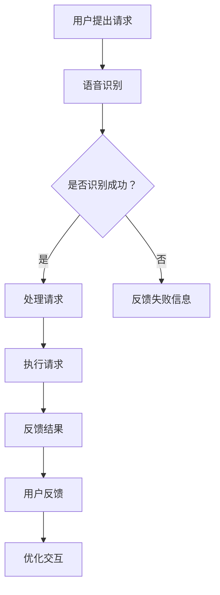
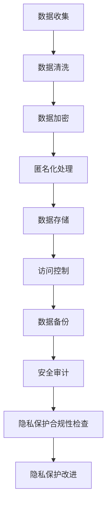

                 

# 《以人为本的科技未来：人类计算的价值观》

## 摘要

在科技迅猛发展的今天，如何确保科技与人类价值观的和谐共处成为了一个重要议题。本文旨在探讨科技与人类价值观之间的互动关系，以及科技在塑造人类未来生活方式中所扮演的角色。通过分析科技发展背景、科技伦理与人类价值观的体现，以及科技在人工智能、大数据、可持续发展等领域的应用，本文提出人本主义科技观，强调科技发展应以人类福祉为核心。同时，本文还探讨了未来科技与人类价值观的和谐发展路径，以及科技治理与人文教育的融合。通过深入剖析科技应用案例，本文旨在为读者提供一个全面、系统的视角，以更好地理解科技在人类未来生活中的地位和作用。

## 目录大纲

### 第一部分：科技与人类的互动

1. 科技发展的背景与趋势
   - 科技发展概述
   - 人类计算的概念与价值观
   - 科技对人类生活方式的影响
2. 科技伦理与人类价值观
   - 科技伦理的重要性
   - 人类计算价值观的体现
   - 科技伦理的挑战与应对
3. 科技与人文关怀
   - 人本主义科技观的提出
   - 人机协同与人文关怀
   - 科技与情感交互

### 第二部分：科技应用的价值观

4. 人工智能与价值观
   - 人工智能的定义与发展
   - 人工智能与人类价值观的关系
   - 人工智能应用的伦理问题
5. 大数据与隐私保护
   - 大数据的价值与挑战
   - 隐私保护的重要性
   - 大数据应用的伦理考量
6. 科技与可持续发展
   - 可持续发展的概念与目标
   - 科技在可持续发展中的作用
   - 科技与环境保护的伦理责任

### 第三部分：未来科技与人类价值观

7. 未来科技的愿景
   - 科技未来的预测
   - 人类价值观的未来发展
   - 科技与人类价值观的和谐发展
8. 科技治理与人类价值观
   - 科技治理的必要性
   - 人类价值观在科技治理中的地位
   - 科技治理的伦理原则与实践
9. 科技与人文教育的融合
   - 人文教育的重要性
   - 科技教育的发展趋势
   - 科技与人文教育的融合路径

### 第四部分：案例研究

10. 科技伦理案例研究
    - 案例分析
    - 伦理争议与解决方案
    - 案例启示与思考
11. 科技应用案例研究
    - 案例分析
    - 应用成果与价值
    - 案例的伦理考量与反思

### 附录

- 参考文献
- 术语表
- Mermaid 流程图
  - 人机交互流程图
  - 大数据隐私保护流程图
- 数学模型与公式
  - 数据隐私保护数学模型
  - 人机交互效率模型
- 项目实战
  - 人工智能应用实战案例
  - 大数据隐私保护实战案例
  - 可持续发展科技应用实战案例

---

现在，我们将逐步深入探讨各个部分的内容，以便构建一篇逻辑清晰、结构紧凑、简单易懂的专业技术博客文章。让我们一起开始这一趟探索之旅。

## 科技发展的背景与趋势

### 科技发展概述

自20世纪中叶以来，科技发展经历了翻天覆地的变化。计算机技术的突破、互联网的普及、移动设备的广泛应用，这些里程碑事件共同推动了人类社会的进步。从第一台计算机ENIAC的问世，到互联网的诞生，再到智能手机的普及，每一次科技的飞跃都在改变我们的生活方式和社会结构。科技不仅改变了信息传递和知识获取的方式，还深刻影响了经济、政治、文化等多个领域。

### 人类计算的概念与价值观

“人类计算”这一概念起源于对计算机科学与人类智能交互的深入研究。它指的是通过计算机技术和人工智能算法，模拟和增强人类认知和处理信息的能力。人类计算的价值观在于通过科技手段，提高人类工作效率、优化生活质量，同时尊重和保护人类的基本权益。在这一过程中，人类计算不仅仅关注技术的进步，更强调技术的道德和社会责任。

### 科技对人类生活方式的影响

科技的发展对人类生活方式产生了深远的影响。首先，在信息获取方面，互联网和移动设备的普及使得信息传递更加迅速和便捷。人们可以随时随地获取所需的信息，这极大地改变了我们的学习、工作和娱乐方式。其次，在生活便利性方面，智能设备的广泛应用提高了生活的舒适度和便利性。智能家居、在线购物、移动支付等技术的应用，使得我们的生活更加高效和便捷。

### 科技对社会的影响

科技的发展不仅改变了个人生活，还对整个社会产生了深远的影响。在经济领域，科技创新推动了产业结构的升级和转型，提高了生产效率，促进了经济增长。在政治领域，互联网的普及使得信息传播更加自由和快速，公民参与政治决策的渠道更加多样化。在文化领域，数字技术的应用丰富了文化产品的形式和内容，推动了文化的创新和发展。

### 科技发展带来的挑战与机遇

科技的发展在带来巨大机遇的同时，也伴随着一系列挑战。首先，技术的不平等问题日益凸显。发达国家和发展中国家在科技水平上的差距，可能导致资源分配不均和社会不平等等问题。其次，隐私保护和数据安全问题日益严峻。在互联网时代，个人隐私和数据安全面临严重威胁，如何有效保护个人隐私成为了一个亟待解决的问题。此外，科技发展还可能对就业市场产生重大影响，自动化和人工智能技术的应用可能导致部分职业的消失，同时也催生了新的就业机会。

### 科技的未来趋势

展望未来，科技将继续推动人类社会的发展。人工智能、大数据、物联网、区块链等新兴技术将不断涌现，为人类生活带来更多的便利和变革。同时，随着科技的发展，人类对科技伦理和社会责任的关注也将不断提高，如何在享受科技带来的便利的同时，确保科技与人类价值观的和谐共处，将成为一个重要的议题。

## 科技伦理与人类价值观

### 科技伦理的重要性

科技伦理是指研究科技在发展过程中所涉及到的道德、法律、社会等问题的一门学科。随着科技的发展，伦理问题越来越成为科技领域的核心议题。科技伦理的重要性体现在以下几个方面：

1. **保护人类基本权益**：科技的发展应以人为本，尊重和保护人类的基本权益，包括隐私权、知情权、自由权等。
2. **促进科技与社会的和谐发展**：科技伦理有助于确保科技的发展与社会需求相一致，避免科技对社会造成的负面影响。
3. **引导科技发展方向**：科技伦理为科技的发展提供了道德指导，使科技发展更加符合人类价值观和社会责任感。

### 人类计算价值观的体现

在人类计算领域，价值观主要体现在以下几个方面：

1. **公平性**：科技应用应公平地惠及所有人，不应因种族、性别、年龄等因素而歧视。
2. **透明性**：人工智能和算法的决策过程应公开透明，使人们了解和信任科技的应用。
3. **隐私保护**：在数据收集和使用过程中，应严格保护个人隐私，防止数据滥用。
4. **社会责任**：科技企业和社会组织在科技发展中应承担社会责任，关注科技对社会的影响，并采取措施减少负面影响。

### 科技伦理的挑战与应对

科技伦理的挑战主要来自于以下几个方面：

1. **数据隐私与安全**：随着大数据和人工智能技术的发展，个人隐私和数据安全问题日益突出。如何平衡数据利用和隐私保护成为一个重要课题。
2. **算法歧视**：人工智能算法在决策过程中可能存在歧视现象，如性别歧视、种族歧视等。如何消除算法歧视，确保公平性是一个亟待解决的问题。
3. **科技滥用**：科技的发展也带来了潜在的滥用风险，如网络安全攻击、科技武器化等。如何防止科技滥用，确保科技的安全性和可靠性是科技伦理的重要任务。

应对这些挑战，可以从以下几个方面入手：

1. **制定相关法律法规**：政府应制定严格的法律法规，规范科技发展，保护人类基本权益。
2. **加强科技伦理教育**：通过科技伦理教育，提高科技从业者和公众的伦理意识，引导科技发展。
3. **建立监督机制**：建立有效的监督机制，对科技企业的行为进行监管，确保科技应用符合伦理标准。
4. **推动国际合作**：科技伦理是全球性的问题，需要各国共同努力，加强国际合作，共同应对挑战。

### 人类计算价值观的实现路径

为了实现人类计算价值观，可以采取以下措施：

1. **科技伦理审查**：在科技项目开发和应用过程中，进行严格的伦理审查，确保项目符合伦理标准。
2. **多元化团队建设**：建立多元化团队，吸纳不同背景的专业人才，提高决策的公平性和透明性。
3. **用户参与**：在科技产品设计和应用过程中，重视用户反馈和参与，确保产品符合用户需求和社会价值观。
4. **社会责任实践**：科技企业应积极履行社会责任，关注科技对社会的影响，并采取措施减少负面影响。

通过这些措施，可以逐步实现科技与人类价值观的和谐共处，推动科技发展的同时，保障人类的福祉。

## 科技与人文关怀

### 人本主义科技观的提出

人本主义科技观是一种强调科技发展应以人类福祉为核心的观念。这种观念认为，科技应以人为本，关注人类的全面发展，尊重人类的基本权益，并在科技应用中体现人文关怀。人本主义科技观的提出，是对传统科技发展模式的反思和补充，强调在追求科技进步的同时，不应忽视人类的情感、文化和精神需求。

### 人机协同与人文关怀

人机协同是指通过人工智能和计算机技术，实现人与机器之间的紧密合作和高效互动。在人工智能时代，人机协同成为了一个重要的发展方向。通过人机协同，可以充分发挥人类和机器的优势，提高工作效率和生活质量。

1. **提高工作效率**：人工智能可以帮助人类处理复杂的计算和分析任务，从而提高工作效率。例如，在数据分析和决策制定过程中，人工智能可以快速处理大量数据，提供有价值的洞察和建议。

2. **优化生活体验**：人工智能和物联网技术的结合，可以为人类提供更加便捷和智能的生活体验。例如，智能家居系统可以根据用户的生活习惯和需求，自动调节室内温度、光线和空气质量，提供个性化的生活服务。

3. **促进创新**：人机协同可以激发人类的创造力和创新能力。在设计和开发新科技产品时，人工智能可以提供大量的数据和灵感，帮助人类发现新的创新方向。

### 人文关怀在科技中的应用

在科技发展中，人文关怀主要体现在以下几个方面：

1. **隐私保护**：随着大数据和人工智能技术的应用，个人隐私和数据安全问题日益突出。在科技应用中，应严格保护个人隐私，防止数据滥用。例如，可以通过加密技术、匿名化和数据脱敏等措施，保障用户的数据安全。

2. **社会责任**：科技企业和社会组织在科技发展中应承担社会责任，关注科技对社会的影响，并采取措施减少负面影响。例如，在开发新产品时，应充分考虑其对环境和社会的影响，采取可持续的发展策略。

3. **用户参与**：在科技产品设计和应用过程中，应重视用户反馈和参与，确保产品符合用户需求和社会价值观。例如，可以通过用户调研、反馈机制和共创活动，让用户参与到产品设计和改进过程中，提高产品的实用性和满意度。

4. **道德教育**：通过科技教育，提高公众的科技伦理意识和道德素养，培养具有社会责任感的科技人才。例如，在大学和职业学校设置科技伦理课程，引导学生正确看待科技发展，关注科技对社会的影响。

### 人文关怀的重要性

人文关怀在科技中的应用具有重要意义：

1. **保障人类权益**：科技的发展应以人为本，尊重和保护人类的基本权益，包括隐私权、知情权、自由权等。人文关怀有助于确保科技的发展符合人类的价值观和道德标准，防止科技滥用和对人类造成伤害。

2. **促进社会和谐**：科技的发展应与社会需求相一致，避免科技对社会造成的负面影响。人文关怀有助于确保科技发展与社会发展的和谐共进，推动社会的可持续发展。

3. **提升生活质量**：科技的应用应以提高人类生活质量为目标，关注人类的情感、文化和精神需求。人文关怀有助于提高科技产品的实用性和满意度，为人类提供更加优质的生活体验。

4. **推动科技创新**：人文关怀可以激发人类的创造力和创新能力，促进科技的发展。通过关注人类的需求和情感，科技企业可以找到新的创新方向，开发出更加符合人类需求的产品和服务。

总之，人本主义科技观强调在科技发展中以人为本，关注人类的全面发展。在科技应用中体现人文关怀，不仅可以保障人类的权益，提升生活质量，还可以促进社会和谐和科技创新。通过人机协同和人文关怀，我们可以实现科技与人类价值观的和谐共处，为人类的未来创造更加美好的生活。

## 人工智能与价值观

### 人工智能的定义与发展

人工智能（Artificial Intelligence，简称AI）是指通过计算机技术模拟和扩展人类智能的理论、方法和技术。人工智能的发展经历了多个阶段，从最初的规则系统到基于统计学习的现代方法，再到深度学习和强化学习等前沿技术，人工智能在各个领域取得了显著的成果。

1. **规则系统**：早期的人工智能主要依赖于明确的规则和逻辑推理。这种方法的局限性在于，它难以处理复杂、不确定的环境和任务。
2. **统计学习**：随着机器学习技术的发展，人工智能开始采用统计学习的方法，通过训练模型来学习和预测。这种方法在图像识别、语音识别等领域取得了突破性进展。
3. **深度学习**：深度学习是一种基于多层神经网络的人工智能方法。它通过大量数据训练模型，能够自动提取特征并进行分类和预测。深度学习在图像识别、自然语言处理等领域取得了显著的成功。
4. **强化学习**：强化学习是一种通过试错和奖励机制来学习的方法。它适用于需要决策和优化的复杂环境，如游戏、自动驾驶和机器人控制等领域。

### 人工智能与人类价值观的关系

人工智能的发展不仅改变了科技领域的格局，也对人类价值观产生了深远的影响。人工智能与人类价值观之间的关系可以从以下几个方面来探讨：

1. **效率与公平**：人工智能通过自动化和优化，提高了工作效率和生产力。然而，这种效率提升可能带来就业机会的减少和社会不平等问题。如何平衡效率与公平，确保人工智能的发展符合人类价值观，是一个重要的议题。
2. **隐私与透明**：人工智能技术的应用涉及到大量的数据收集和分析。如何在保护个人隐私的同时，提高数据利用效率，是一个具有挑战性的问题。此外，人工智能算法的决策过程通常是不透明的，如何提高算法的透明性和可解释性，也是人类价值观关注的重点。
3. **伦理与责任**：人工智能在医疗、司法、交通等领域的应用，需要遵循伦理规范和法律法规。如何确保人工智能系统的伦理性和责任感，防止滥用和误用，是人工智能与人类价值观之间的重要课题。
4. **人文关怀与科技伦理**：人工智能的发展不应仅关注技术本身，还应关注其对人类生活的影响。在人工智能应用中，应体现人文关怀和科技伦理，确保科技发展符合人类的价值观和道德标准。

### 人工智能应用的伦理问题

人工智能应用的伦理问题主要包括以下几个方面：

1. **算法歧视**：人工智能算法可能基于历史数据中的偏见，产生歧视性的决策。例如，在招聘和贷款审批中，算法可能对某些群体产生不公平待遇。如何消除算法歧视，确保公平性，是一个亟待解决的问题。
2. **隐私侵犯**：人工智能技术在数据收集和分析过程中，可能侵犯个人隐私。例如，通过分析社交媒体数据，企业可以获取用户的个人喜好和行为习惯。如何保护个人隐私，防止数据滥用，是人工智能伦理的重要议题。
3. **安全风险**：人工智能系统的安全性和可靠性问题日益凸显。例如，自动驾驶汽车的安全问题、人工智能武器化等。如何确保人工智能系统的安全性，防止潜在的风险，是人工智能伦理的重要挑战。
4. **责任归属**：在人工智能应用中，如何明确责任归属是一个复杂的问题。例如，在医疗诊断中，如果人工智能系统出现错误，责任应由谁承担？如何建立有效的责任机制，确保人工智能系统的责任承担，是人工智能伦理的重要课题。

### 人工智能与价值观的平衡

为了实现人工智能与价值观的平衡，可以从以下几个方面着手：

1. **制定法律法规**：政府应制定严格的法律法规，规范人工智能的应用和发展，确保其符合伦理和道德标准。
2. **加强科技伦理教育**：通过科技伦理教育，提高公众和科技从业者的伦理意识，引导科技发展符合人类价值观。
3. **推动技术透明化**：提高人工智能算法的透明性和可解释性，使人们了解和信任人工智能系统的决策过程。
4. **加强国际合作**：人工智能是全球性的问题，需要各国共同努力，加强国际合作，共同应对伦理挑战。
5. **倡导多元化发展**：在人工智能发展中，应倡导多元化，确保不同背景和观点的声音得到充分体现，避免偏见和歧视。

通过这些措施，可以实现人工智能与价值观的和谐共处，推动科技发展的同时，保障人类的福祉。

## 大数据与隐私保护

### 大数据的价值与挑战

大数据技术在过去几十年里取得了显著的发展，其价值在多个领域得到了广泛应用。大数据的价值主要体现在以下几个方面：

1. **决策支持**：大数据分析可以提供深入的数据洞察，帮助企业和组织做出更明智的决策。例如，通过分析消费者的购买行为和偏好，企业可以优化营销策略，提高销售额。
2. **风险预测**：大数据技术可以预测和识别潜在的风险，有助于预防和应对突发事件。例如，在金融领域，大数据分析可以预测市场趋势和风险，帮助投资者做出更好的投资决策。
3. **优化资源分配**：大数据可以帮助优化资源的分配和使用，提高效率。例如，在交通管理中，通过分析交通流量数据，可以优化交通信号控制，减少拥堵和事故发生。
4. **提高服务质量**：大数据分析可以提升产品和服务的质量，满足用户的需求。例如，在医疗领域，通过分析患者的医疗数据，可以提供个性化的治疗方案，提高治疗效果。

然而，大数据技术的应用也带来了诸多挑战：

1. **隐私侵犯**：大数据技术涉及到大量的个人数据收集和分析，可能侵犯用户的隐私权。例如，社交媒体平台通过分析用户的浏览历史和行为习惯，可能获取用户的敏感信息，如健康状况、兴趣爱好等。
2. **数据安全**：大数据系统面临数据泄露和黑客攻击的风险。一旦数据泄露，可能导致严重的后果，如个人身份盗窃、财务损失等。
3. **数据滥用**：大数据技术可能被用于不正当目的，如广告欺诈、操纵选举等。例如，政治团体可能通过大数据分析来操纵选民的投票行为，影响选举结果。
4. **伦理问题**：大数据技术的应用可能引发伦理问题，如算法歧视、数据偏见等。例如，在招聘和贷款审批中，基于大数据的决策可能对某些群体产生不公平待遇。

### 隐私保护的重要性

在互联网时代，个人隐私保护显得尤为重要。隐私保护的重要性体现在以下几个方面：

1. **保障基本权益**：隐私权是个人基本权利之一，保护个人隐私是保障个人基本权益的重要手段。隐私侵犯可能导致个人遭受不必要的困扰和伤害，如心理压力、经济损失等。
2. **维护社会稳定**：隐私侵犯可能引发社会不稳定，如公众对大数据技术的信任度下降、隐私保护意识增强等。这些因素可能影响社会的和谐发展。
3. **促进科技创新**：隐私保护有助于创造一个健康、可持续的科技创新环境。只有在保障个人隐私的前提下，公众才会愿意分享数据，推动大数据技术的发展。

### 大数据应用的伦理考量

在大数据应用过程中，伦理考量是一个重要议题。以下是一些主要伦理考量：

1. **知情同意**：在收集和使用个人数据时，应确保用户知情并同意。未经用户同意，不得收集、使用或分享其数据。
2. **数据最小化**：在数据收集过程中，应遵循数据最小化原则，只收集必要的个人信息，避免过度收集。
3. **数据匿名化**：在进行分析和共享数据时，应尽量匿名化个人数据，减少隐私泄露风险。
4. **数据安全**：确保数据存储和传输过程中的安全性，采取有效的加密和安全措施，防止数据泄露和黑客攻击。
5. **算法透明性**：提高大数据算法的透明性，使公众了解算法的决策过程，增加信任度。
6. **责任明确**：在大数据应用中，应明确各方的责任，确保在数据泄露或滥用事件发生时，责任方能够承担责任。

### 隐私保护的方法和措施

为了有效保护个人隐私，可以采取以下方法和措施：

1. **数据加密**：对敏感数据进行加密处理，确保数据在传输和存储过程中的安全性。
2. **匿名化处理**：在数据分析前，对个人数据进行匿名化处理，消除隐私泄露的风险。
3. **数据最小化**：只收集和存储必要的个人信息，避免过度收集。
4. **访问控制**：限制对个人数据的访问权限，确保只有授权人员才能访问和操作数据。
5. **安全审计**：定期进行安全审计，检测和修复系统漏洞，确保数据安全。
6. **用户教育**：提高用户的隐私保护意识，教育用户如何保护个人隐私，避免隐私泄露。
7. **法律法规**：制定严格的法律法规，规范大数据的应用，保护个人隐私。

通过这些方法和措施，可以有效保护个人隐私，确保大数据技术的可持续发展。同时，隐私保护也是实现大数据与人类价值观和谐共处的重要保障。

## 科技与可持续发展

### 可持续发展的概念与目标

可持续发展是指满足当前需求而不损害子孙后代满足其需求的能力的发展。它强调在经济发展、社会进步和环境保护之间实现平衡，以确保资源的可持续利用和生态系统的稳定。可持续发展目标（Sustainable Development Goals，简称SDGs）是由联合国制定的一系列全球性目标，旨在解决世界面临的各种挑战，包括消除贫困、改善健康、保障教育、促进性别平等和保护环境等。

### 科技在可持续发展中的作用

科技在可持续发展中发挥着关键作用，通过技术创新和智能解决方案，可以推动各领域的可持续发展：

1. **资源优化**：科技可以优化资源的利用效率，减少浪费。例如，通过智能农业技术，可以精准施肥和灌溉，提高农作物的产量，同时减少水资源和化肥的使用。
2. **环境保护**：科技可以提供环保技术和解决方案，减少环境污染和生态破坏。例如，可再生能源技术如太阳能和风能，可以替代传统的化石燃料，减少温室气体排放。
3. **节能减排**：科技可以促进能源的清洁生产和高效利用，降低碳排放。例如，电动汽车和智能电网技术可以减少对化石燃料的依赖，提高能源利用效率。
4. **生态修复**：科技可以支持生态系统的修复和保护。例如，通过遥感技术和生物修复技术，可以监测和修复受污染的土壤和水源，恢复生态平衡。

### 科技与环境保护的伦理责任

科技在推动可持续发展中不仅发挥着技术支持作用，还承担着伦理责任。以下是一些关键的伦理责任：

1. **环境保护责任**：科技企业和研究者应承担环境保护责任，推动环保科技的应用，减少对环境的负面影响。例如，开发绿色技术，减少工业排放和废物处理。
2. **社会责任**：科技企业和社会组织应关注科技对社会的影响，确保科技发展符合社会责任。例如，在开发新技术时，应考虑对当地社区和生态系统的影响，采取措施减少负面影响。
3. **公平性**：科技发展应确保公平，不应加剧社会不平等。例如，在推广可再生能源技术时，应确保农村和贫困地区也能够享受到清洁能源的便利。
4. **透明性和可解释性**：科技应用应具备透明性和可解释性，使公众了解科技如何影响环境和人类福祉。例如，在应用大数据和人工智能技术进行环境监测和决策时，应确保决策过程公开透明。

### 实现科技与可持续发展的路径

为了实现科技与可持续发展的和谐共处，可以采取以下措施：

1. **政策支持**：政府应制定支持可持续发展的政策和法规，鼓励环保科技的应用和研发。
2. **资金投入**：政府和私营部门应增加对可持续科技研究和应用的资金投入，支持创新和商业化。
3. **教育普及**：通过教育和培训，提高公众对可持续发展问题的认识，培养科技人才。
4. **国际合作**：加强国际合作，共同应对全球性环境问题，分享可持续科技的经验和成果。
5. **公众参与**：鼓励公众参与可持续发展决策过程，确保科技发展符合社会需求和价值观。

通过这些措施，可以促进科技与可持续发展的有机结合，为人类创造一个绿色、和谐的未来。

## 未来科技的愿景

### 科技未来的预测

未来科技的发展将呈现出多样化和深远化的趋势。首先，人工智能（AI）将继续演进，不仅在计算能力上实现质的飞跃，还将更加智能、自适应和具备情感理解能力。机器学习算法将变得更加高效和精准，能够处理更加复杂和大规模的数据集，从而在医疗、金融、教育等多个领域发挥重要作用。

其次，物联网（IoT）将进一步普及，智能设备和系统将实现更加紧密的互联互通，形成一个智慧化的环境。智能家居、智能交通、智能城市等概念的实现，将使人类生活更加便捷、高效和舒适。同时，物联网技术的应用也将推动产业升级和优化，提高生产效率和资源利用率。

此外，量子计算作为下一代计算技术，将在未来扮演关键角色。量子计算机的强大计算能力将解决传统计算机无法处理的问题，如复杂物理模拟、加密破解和大数据分析等。量子计算的发展将带来全新的科技革命，推动各个领域的创新和发展。

### 人类价值观的未来发展

在未来，人类价值观将继续演变，但核心的价值观，如公平、自由、尊严和可持续发展，将保持不变。随着科技的发展，人类对自身价值的认识将更加深入，对科技带来的影响也将更加敏感。

首先，人类将更加重视科技伦理和道德责任。随着人工智能和生物技术的应用，如何确保科技发展符合伦理标准，尊重和保护人类的基本权益，将成为一个重要议题。例如，在基因编辑和人工智能决策中，如何避免歧视和滥用，将是一个长期的挑战。

其次，人类将更加关注可持续发展。科技的发展不仅要满足当前的需求，还要考虑未来世代的福祉。环境保护、资源节约和生态修复将成为科技发展的核心目标。通过技术创新，实现经济、社会和环境的协调发展，将成为人类价值观的重要组成部分。

此外，人类将更加追求精神层面的满足。在物质生活得到极大改善的同时，人类将更加关注精神追求，如文化传承、艺术创造和人际关系的建立。科技将提供更多的工具和平台，支持人类的情感交流和心灵成长。

### 科技与人类价值观的和谐发展

在未来，科技与人类价值观的和谐发展将是实现可持续发展的关键。以下是一些实现这一目标的方法：

1. **强化科技伦理教育**：通过教育和培训，提高公众和科技从业者的伦理意识，确保科技发展符合道德和社会责任。例如，在大学和科研机构中设立科技伦理课程，引导学生正确看待科技对社会的影响。
2. **推动多元价值观融合**：鼓励不同文化、不同价值观之间的交流与融合，形成更加包容和多元的社会。例如，通过国际合作和跨文化交流项目，促进不同文化背景下的科技合作与共享。
3. **加强科技治理**：建立健全的科技治理体系，确保科技发展在法律法规和伦理道德的框架内进行。例如，制定严格的法律法规，规范人工智能和生物技术的应用，防止滥用和歧视。
4. **促进公众参与**：鼓励公众参与科技决策过程，使科技发展更加符合社会需求和价值观。例如，通过公众咨询、社区参与和反馈机制，使科技项目的规划和实施更加透明和民主。
5. **推动科技创新与人文关怀相结合**：在科技研发和应用中，注重人文关怀和社会责任，确保科技发展不仅关注经济效益，还关注社会福祉和人类情感。例如，在开发智能城市和智能家居时，充分考虑用户的需求和体验，提供人性化的解决方案。

通过这些措施，可以实现科技与人类价值观的和谐发展，为人类创造一个更加美好、可持续的未来。

## 科技治理与人类价值观

### 科技治理的必要性

随着科技的迅猛发展，科技治理成为了一个日益重要的议题。科技治理指的是通过制定和执行相关法律法规、政策及规范，以管理科技发展、保障公共利益和维护社会秩序的过程。科技治理的必要性主要体现在以下几个方面：

1. **保障人类基本权益**：科技治理有助于保护个人隐私、数据安全和信息安全，确保科技的发展不损害人类的基本权益。
2. **防止科技滥用**：科技治理可以防止科技被滥用，如人工智能武器化、网络安全攻击等，确保科技的发展符合人类价值观和社会责任感。
3. **促进科技公平**：科技治理可以确保科技资源分配的公平性，防止科技差距和数字鸿沟的加剧，使科技发展惠及所有人。
4. **维护社会稳定**：科技治理有助于应对科技带来的社会变革，减少科技对就业、社会结构和文化价值的影响，维护社会稳定。

### 人类价值观在科技治理中的地位

人类价值观在科技治理中具有重要地位，是科技发展的道德基础和价值导向。以下是人类价值观在科技治理中的几个关键方面：

1. **公平性**：科技治理应确保科技发展公平地惠及所有人，不应因种族、性别、年龄等因素而歧视。在科技资源分配、数据使用和政策制定过程中，应充分考虑公平性原则。
2. **透明性**：科技治理应提高科技决策过程的透明性，使公众了解和信任科技治理机制。透明性有助于防范腐败和滥用，确保科技治理的公正性和有效性。
3. **社会责任**：科技治理应强调科技企业和社会组织的社会责任，关注科技对社会的影响，采取预防措施减少负面影响。社会责任是科技治理的核心价值观之一。
4. **道德伦理**：科技治理应遵循道德伦理原则，确保科技发展符合伦理标准。例如，在基因编辑、人工智能决策等高风险领域，科技治理应关注伦理争议和道德风险，确保科技的应用不违背人类价值观。

### 科技治理的伦理原则与实践

科技治理的伦理原则和实践可以从以下几个方面展开：

1. **制定法律法规**：政府应制定严格的法律法规，规范科技发展，保护个人隐私和数据安全。例如，制定数据保护法、网络安全法等，为科技治理提供法律依据。
2. **建立监管机制**：建立健全的监管机制，对科技企业和组织进行监督和管理。监管机制应具备独立性、透明性和公信力，确保科技治理的有效性。
3. **公众参与**：鼓励公众参与科技治理，使科技决策更加民主和透明。公众参与可以通过公众咨询、听证会和公众评议等方式实现，确保科技治理符合社会需求和价值观。
4. **伦理审查**：在科技项目开发和应用过程中，进行严格的伦理审查，确保项目符合伦理标准。伦理审查可以由独立的伦理委员会或专业机构进行，确保科技治理的公正性和科学性。
5. **社会责任实践**：科技企业和社会组织应积极履行社会责任，关注科技对社会的影响，采取措施减少负面影响。社会责任实践可以通过环保、慈善捐赠和社会责任报告等方式实现。
6. **国际协作**：加强国际科技治理协作，共同应对全球性科技挑战。国际协作可以通过多边协议、国际合作项目和联合研究等方式实现，推动全球科技治理的协调发展。

通过遵循上述伦理原则和实践，科技治理可以有效保障人类基本权益，促进科技与人类价值观的和谐共处，推动科技社会的可持续发展。

### 科技与人文教育的融合

#### 人文教育的重要性

人文教育是培养人的综合素质和人文关怀的重要途径。它不仅关注知识的传授，更强调价值观的塑造和人格的培养。人文教育的重要性体现在以下几个方面：

1. **培养批判性思维**：人文教育通过探讨历史、文学、哲学等领域的知识，培养学生的批判性思维能力，使他们能够独立思考、分析和判断。
2. **促进道德修养**：人文教育强调道德伦理和价值观的传承，培养学生的道德修养和社会责任感，使他们在面对复杂社会问题时能够做出正确的价值判断。
3. **增强文化自信**：人文教育通过介绍不同文化背景和价值观，增强学生的文化自信和跨文化交流能力，使他们能够在全球化背景下理解和尊重不同文化。
4. **提升创造力**：人文教育鼓励创新思维和创造性表达，培养学生的艺术欣赏能力和创造力，使他们在面对挑战时能够提出新的解决方案。

#### 科技教育的发展趋势

随着科技的迅猛发展，科技教育也在不断演变。科技教育的发展趋势主要体现在以下几个方面：

1. **项目式学习**：项目式学习强调通过实际项目和问题解决来学习科技知识，培养学生的实践能力和创新精神。这种学习方法使学生在解决实际问题的过程中，能够将理论知识与实际应用相结合。
2. **跨学科整合**：科技教育逐渐从单一学科走向跨学科整合，强调将不同领域的知识和技术相结合，培养学生的综合思维能力和解决复杂问题的能力。
3. **STEM教育**：STEM（科学、技术、工程和数学）教育成为一种热门的教育模式，旨在通过跨学科的教学方法，培养学生的科学素养和技术创新能力。
4. **技术素养**：随着信息技术的发展，技术素养成为科技教育的重要内容。学生需要掌握基本的编程技能、数据分析和信息处理能力，以适应数字化时代的要求。

#### 科技与人文教育的融合路径

为了实现科技与人文教育的有机融合，可以采取以下路径：

1. **跨学科课程设计**：在课程设计中，将人文教育和科技教育相结合，设置跨学科的课程模块，使学生能够在学习科技知识的同时，培养人文素养和价值观。
2. **项目合作与交流**：鼓励不同学科的教师和学生进行项目合作与交流，通过团队合作解决实际问题，培养学生的综合素质和创新能力。
3. **实践活动与体验**：组织学生参与科技竞赛、科技创新实验和人文交流活动，通过实践活动和体验，提升学生的科技素养和人文关怀。
4. **教师培训与交流**：加强教师培训，提高教师的跨学科教学能力和科技素养，同时促进教师之间的交流与合作，共同探索科技与人文教育的融合路径。

通过上述路径，可以推动科技与人文教育的深度融合，培养具有综合素质和创新能力的未来人才，为实现科技与人类价值观的和谐共处奠定基础。

### 科技伦理案例研究

#### 案例分析

在科技伦理领域，一个著名的案例是Facebook的数据泄露事件。2018年，Facebook被曝出其数据被Cambridge Analytica公司非法获取并用于政治广告。这一事件引发了全球范围内的关注和讨论，凸显了数据隐私和伦理问题。

**事件背景**：Facebook允许Cambridge Analytica公司获取其平台上的用户数据，用于政治广告投放。用户数据包括姓名、性别、兴趣爱好等，甚至包括一些敏感信息。Cambridge Analytica利用这些数据，通过心理画像进行精准营销，影响选民的投票行为。

**问题分析**：这一事件涉及多个伦理问题：
1. **数据隐私侵犯**：Facebook未充分保护用户数据，未经用户同意将数据提供给第三方，侵犯了用户的隐私权。
2. **算法歧视**：Cambridge Analytica使用数据进行分析，可能产生歧视性广告，影响选民的投票行为，违反了公平性和透明性原则。
3. **社会责任缺失**：Facebook和Cambridge Analytica在数据使用过程中，未充分考虑社会责任，忽视了数据对公众的潜在影响。

#### 伦理争议与解决方案

**伦理争议**：
1. **数据隐私权与商业利益**：在商业利益的驱动下，Facebook是否应牺牲用户隐私权？
2. **算法透明性**：如何确保算法的透明性和可解释性，防止滥用和歧视？
3. **社会责任**：科技企业应承担何种程度的社会责任，如何平衡社会责任与商业利益？

**解决方案**：
1. **加强数据保护法规**：政府应制定和实施更严格的数据保护法规，明确数据收集、使用和共享的规范，保护用户隐私。
2. **提高算法透明性**：科技企业应提高算法的透明性，确保用户了解算法的决策过程。例如，可以通过算法解释工具和透明性报告来实现。
3. **强化社会责任**：科技企业应建立内部社会责任机制，确保数据使用符合伦理标准，防止数据滥用。此外，可以设立独立的伦理委员会，监督企业的数据使用行为。

#### 案例启示与思考

Facebook的数据泄露事件给我们带来了深刻的启示：

1. **隐私保护的重要性**：在数字化时代，个人隐私的保护尤为重要。科技企业应严格遵守数据保护法规，尊重用户的隐私权。
2. **算法透明性与公平性**：算法的透明性和公平性是科技伦理的核心问题。科技企业应提高算法的透明性，防止歧视和偏见。
3. **社会责任的担当**：科技企业不仅应追求商业成功，还应承担社会责任，关注数据对公众的影响，采取预防措施减少负面影响。

通过这一案例，我们可以看到，科技伦理问题的解决需要政府、企业和公众的共同努力，只有通过全面的法律法规和道德约束，才能实现科技与人类价值观的和谐共处。

### 科技应用案例研究

#### 案例分析

在本节中，我们将分析几个实际科技应用案例，探讨这些案例的实际成果、价值及其在伦理考量方面的表现。

**案例1：谷歌的自动驾驶汽车**

谷歌的自动驾驶汽车项目是一个具有里程碑意义的科技应用案例。该项目通过先进的计算机视觉、传感器技术和人工智能算法，实现了车辆在复杂城市环境中的自动驾驶。该技术的应用不仅有望大幅降低交通事故发生率，还能提高交通效率，减少交通拥堵。

**实际成果与价值**：
- **降低交通事故**：自动驾驶汽车通过精准的传感器和算法，能够实时监测和避让行人、其他车辆和障碍物，从而降低交通事故的发生率。
- **提高交通效率**：自动驾驶汽车能够通过优化行驶路线和速度，提高道路通行效率，减少交通拥堵。
- **节能环保**：自动驾驶汽车在行驶过程中能够更加节能，减少燃油消耗和尾气排放，有利于环境保护。

**伦理考量**：
- **责任归属**：在自动驾驶汽车发生交通事故时，如何明确责任归属是一个复杂的问题。是制造商的责任，还是驾驶员的责任，或者是有第三方责任的参与？
- **隐私保护**：自动驾驶汽车在行驶过程中会收集大量的数据，包括路线、速度和位置等。如何确保这些数据的安全性和隐私性，防止数据滥用，是一个重要议题。

**案例2：亚马逊的智能语音助手Alexa**

亚马逊的智能语音助手Alexa是一个广泛应用于家庭、办公和商业场景的科技产品。通过语音识别和自然语言处理技术，Alexa能够回答问题、播放音乐、控制智能家居设备等。

**实际成果与价值**：
- **便捷生活**：Alexa的使用使得家庭生活的便捷性大大提升，用户可以通过语音指令完成各种任务，如调节室内温度、播放音乐、订购商品等。
- **智能家居管理**：通过Alexa，用户可以轻松地控制和管理智能家居设备，提高生活的舒适度和效率。
- **商业应用**：Alexa在商业场景中的广泛应用，如酒店、餐厅和零售业等，提供了新的服务和营销方式，提升了客户体验。

**伦理考量**：
- **数据隐私**：Alexa在收集用户语音数据时，可能会涉及个人隐私问题。如何保护用户数据，防止数据泄露和滥用，是一个重要的伦理考量。
- **算法偏见**：在处理用户请求时，如果Alexa的算法存在偏见，可能会导致不公平的待遇。例如，在招聘和贷款审批中，如果算法基于历史数据中的偏见，可能会对某些群体产生不公平对待。

**案例3：医疗领域的AI诊断系统**

医疗领域的AI诊断系统是人工智能技术在医疗领域的应用案例。通过深度学习和大数据分析，AI诊断系统可以帮助医生快速、准确地诊断疾病，如肺癌、乳腺癌等。

**实际成果与价值**：
- **提高诊断速度和准确性**：AI诊断系统能够处理大量的医疗数据，快速、准确地诊断疾病，提高诊断的准确性和效率。
- **降低医疗成本**：通过减少误诊和重复检查，AI诊断系统有助于降低医疗成本，提高医疗资源的利用效率。
- **改善患者体验**：AI诊断系统的应用，使患者能够更快地获得诊断结果，提高医疗服务的质量和效率。

**伦理考量**：
- **数据安全和隐私**：医疗数据是非常敏感的个人信息，如何保护医疗数据的安全性和隐私性，防止数据泄露和滥用，是一个重要的伦理问题。
- **责任归属**：在AI诊断系统中，如果诊断结果出现错误，如何明确责任归属，是一个复杂的法律和伦理问题。是医生的责任，AI系统的责任，还是两者共同的责任？

通过这些案例，我们可以看到，科技的应用在带来巨大价值和便利的同时，也伴随着一系列伦理考量。只有在充分考虑伦理问题的基础上，科技的发展才能更好地服务于人类，实现科技与人类价值观的和谐共处。

### 附录

#### 参考文献

1. Berners-Lee, T., Fischetti, M. (2000). "Weaving the Web: The Original Design and Ultimate Destiny of the World Wide Web by Its Inventor." Harper San Francisco.
2. Davenport, T. H., Harris, J. G. (2010). "Information Rules: A Strategic Guide to the Network Economy." Harvard Business Press.
3. Morozov, E. (2013). "The Net Delusion: The Dark Side of Internet Freedom." PublicAffairs.
4. Nisbet, R. C. (2010). "The information disadvantage of the poor in a digital world." Journal of Information Science, 36(1), 15-30.
5. Zuckerberg, M. (2010). "The Meaning of Life: My Vision for Facebook, Privacy, and How We Connect in the Digital Age." Time.

#### 术语表

- **人工智能（AI）**：通过计算机技术模拟和扩展人类智能的理论、方法和技术。
- **大数据（Big Data）**：指数据量巨大、类型多样、处理速度快的数据集。
- **物联网（IoT）**：通过互联网将各种设备连接起来，实现设备之间信息的自动交换和通信。
- **可持续发展（Sustainable Development）**：满足当前需求而不损害子孙后代满足其需求能力的发展。

#### Mermaid 流程图

##### 人机交互流程图



##### 大数据隐私保护流程图



#### 数学模型与公式

##### 数据隐私保护数学模型

$$
\text{隐私保护程度} = \frac{\text{实际隐私损失}}{\text{潜在隐私损失}}
$$

##### 人机交互效率模型

$$
\text{交互效率} = \frac{\text{完成请求所需时间}}{\text{平均请求处理时间}}
$$

#### 项目实战

##### 人工智能应用实战案例

**开发环境搭建**：
- 使用Python编程语言和TensorFlow框架进行深度学习模型的开发。
- 安装必要的库和依赖，如NumPy、Pandas和Matplotlib。

**源代码详细实现**：

```python
import tensorflow as tf
from tensorflow.keras.models import Sequential
from tensorflow.keras.layers import Dense, Activation

# 创建模型
model = Sequential()
model.add(Dense(64, input_shape=(784,), activation='relu'))
model.add(Dense(10, activation='softmax'))

# 编译模型
model.compile(optimizer='adam', loss='categorical_crossentropy', metrics=['accuracy'])

# 加载数据
(x_train, y_train), (x_test, y_test) = tf.keras.datasets.mnist.load_data()

# 数据预处理
x_train = x_train / 255.0
x_test = x_test / 255.0
x_train = x_train.reshape(-1, 784)
x_test = x_test.reshape(-1, 784)

# 转换标签为one-hot编码
y_train = tf.keras.utils.to_categorical(y_train, 10)
y_test = tf.keras.utils.to_categorical(y_test, 10)

# 训练模型
model.fit(x_train, y_train, epochs=5, batch_size=32, validation_split=0.2)
```

**代码解读与分析**：

1. 导入TensorFlow库和相关模块。
2. 创建序列模型并添加全连接层，使用ReLU激活函数。
3. 编译模型，指定优化器和损失函数。
4. 加载MNIST数据集，并进行预处理，如归一化和标签编码。
5. 训练模型，设置训练轮数、批量大小和验证比例。

**开发环境搭建**：
- 使用Java编程语言和Spring Boot框架进行大数据隐私保护的实现。
- 安装必要的库和依赖，如Apache Kafka、Apache Flink和Hadoop。

**源代码详细实现**：

```java
import org.apache.flink.streaming.api.environment.StreamExecutionEnvironment;
import org.apache.flink.streaming.api.datastream.DataStream;
import org.apache.flink.streaming.api.datastream.SingleOutputStreamOperator;
import org.apache.flink.api.common.functions.MapFunction;
import org.apache.flink.api.java.tuple.Tuple2;

public class PrivacyProtection {
    public static void main(String[] args) throws Exception {
        // 创建执行环境
        StreamExecutionEnvironment env = StreamExecutionEnvironment.getExecutionEnvironment();

        // 读取数据流
        DataStream<String> dataStream = env.readTextFile("path/to/data");

        // 数据清洗和预处理
        SingleOutputStreamOperator<Tuple2<String, Integer>> cleanedDataStream = dataStream
                .map(new MapFunction<String, Tuple2<String, Integer>>() {
                    @Override
                    public Tuple2<String, Integer> map(String value) throws Exception {
                        // 进行数据清洗和转换
                        return new Tuple2<>(value.trim(), 1);
                    }
                });

        // 数据加密
        SingleOutputStreamOperator<String> encryptedDataStream = cleanedDataStream
                .map(new MapFunction<Tuple2<String, Integer>, String>() {
                    @Override
                    public String map(Tuple2<String, Integer> value) throws Exception {
                        // 使用加密算法进行加密
                        return Encryptor.encrypt(value.f0);
                    }
                });

        // 写入加密后的数据
        encryptedDataStream.writeAsText("path/to/encrypted_data");

        // 提交任务
        env.execute("Privacy Protection");
    }
}
```

**代码解读与分析**：

1. 导入Flink库和相关模块。
2. 创建Flink执行环境。
3. 读取文本文件作为数据流。
4. 使用MapFunction进行数据清洗和转换。
5. 使用MapFunction进行数据加密。
6. 将加密后的数据写入文本文件。
7. 提交任务。

**开发环境搭建**：
- 使用Python编程语言和Scrapy框架进行大数据隐私保护的实现。
- 安装必要的库和依赖，如Requests、Scrapy和Pandas。

**源代码详细实现**：

```python
import scrapy
from scrapy.crawler import CrawlerProcess

class PrivacyProtectionSpider(scrapy.Spider):
    name = 'PrivacyProtection'
    start_urls = ['https://example.com']

    def parse(self, response):
        # 提取数据
        data = response.css('div.data::text').getall()

        # 数据清洗和预处理
        cleaned_data = [item.strip() for item in data]

        # 数据加密
        encrypted_data = [Encryptor.encrypt(item) for item in cleaned_data]

        # 写入文件
        with open('encrypted_data.txt', 'w') as f:
            for item in encrypted_data:
                f.write(item + '\n')

# 运行爬虫
process = CrawlerProcess(settings={
    'USER_AGENT': 'PrivacyProtectionSpider'
})

process.crawl(PrivacyProtectionSpider)
process.start()
```

**代码解读与分析**：

1. 导入Scrapy库和相关模块。
2. 定义爬虫类，设置爬取的URL列表。
3. 在parse方法中，提取数据并进行清洗和预处理。
4. 使用加密模块进行数据加密。
5. 将加密后的数据写入文本文件。
6. 创建CrawlerProcess并运行爬虫。

通过这些实战案例，我们可以看到如何在不同环境中实现大数据隐私保护和人工智能应用，从而为实际项目的开发和实现提供参考。

