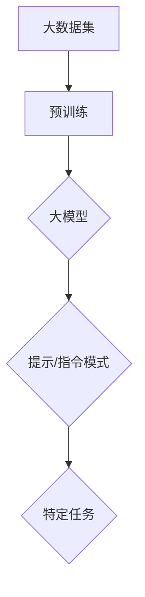
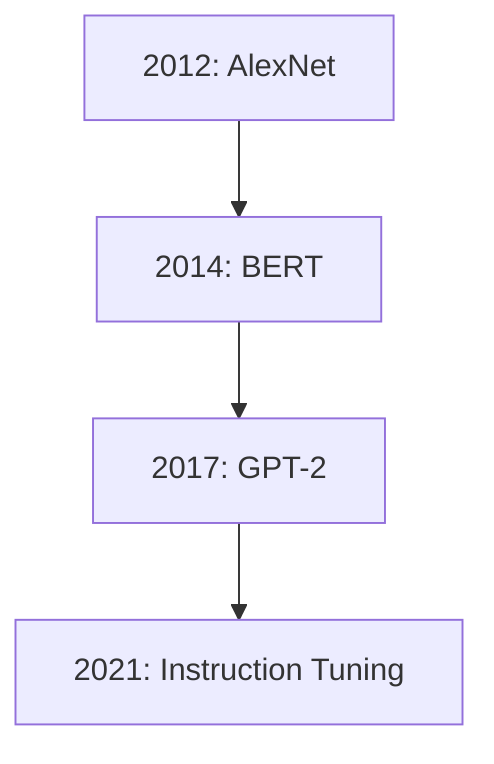
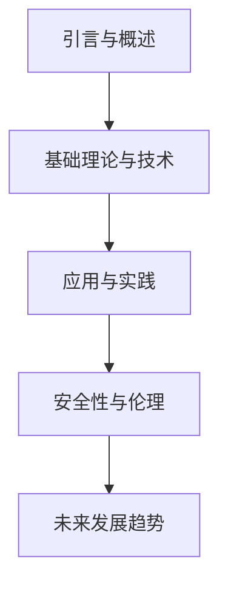
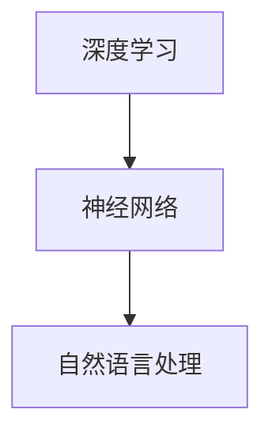
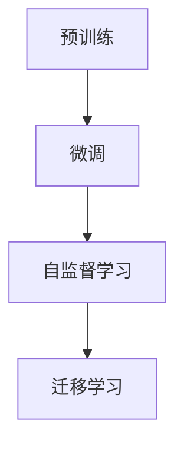
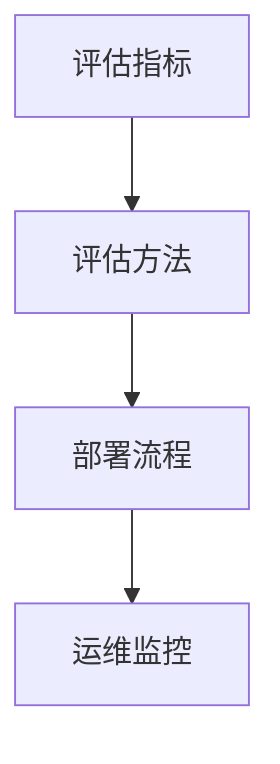
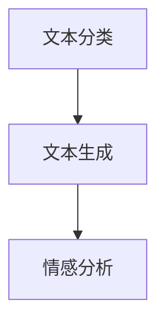

                 

### 文章标题

**以提示/指令模式直接使用大模型**

---

**关键词：大模型，提示/指令模式，深度学习，自然语言处理，计算机视觉，应用实践**

---

**摘要：**

本文旨在探讨大模型与提示/指令模式的结合，探讨其基本概念、核心原理、应用实践以及未来发展趋势。文章首先介绍了大模型与提示/指令模式的基本概念，并阐述了两者的关系。接着，文章深入分析了大模型的理论基础、训练与优化技术，以及其在自然语言处理和计算机视觉中的应用。此外，文章还讨论了大模型与提示/指令模式在医疗、金融和教育等领域的应用实践，以及它们的安全性、伦理问题和社会影响。最后，文章展望了大模型与提示/指令模式的发展趋势和未来发展方向。通过本文，读者可以全面了解大模型与提示/指令模式的核心技术及其在各个领域的应用前景。

---

## 目录大纲

### 第一部分：引言与概述

1. **第1章**：大模型与提示/指令模式的基本概念
   - **核心概念与联系**：使用 Mermaid 流程图展示大模型与提示/指令模式的关系。
   - **核心算法原理讲解**：使用伪代码阐述大模型与提示/指令模式的核心算法原理。

2. **第2章**：大模型与提示/指令模式的背景知识
   - **核心概念与联系**：使用 Mermaid 流程图展示大模型与提示/指令模式的发展历程。
   - **核心算法原理讲解**：使用伪代码阐述大模型与提示/指令模式的基本原理。

3. **第3章**：书籍的组织结构与学习目标
   - **核心概念与联系**：使用 Mermaid 流程图展示书籍的整体结构。
   - **核心算法原理讲解**：使用伪代码阐述学习目标与期望成果。

### 第二部分：大模型的基础理论与技术

1. **第4章**：大模型的理论基础
   - **核心概念与联系**：使用 Mermaid 流程图展示神经网络、深度学习与大模型的关系。
   - **核心算法原理讲解**：使用伪代码阐述大模型的基本原理与架构。

2. **第5章**：大模型的训练与优化
   - **核心概念与联系**：使用 Mermaid 流程图展示大模型训练与优化过程。
   - **核心算法原理讲解**：使用伪代码阐述大模型训练与优化技术。

3. **第6章**：大模型的评估与部署
   - **核心概念与联系**：使用 Mermaid 流程图展示大模型评估与部署流程。
   - **核心算法原理讲解**：使用伪代码阐述大模型评估与部署方法。

### 第三部分：大模型的应用与实践

1. **第7章**：大模型在自然语言处理中的应用
   - **核心概念与联系**：使用 Mermaid 流程图展示大模型在自然语言处理中的应用。
   - **核心算法原理讲解**：使用伪代码阐述大模型在自然语言处理中的应用算法。

2. **第8章**：大模型在计算机视觉中的应用
   - **核心概念与联系**：使用 Mermaid 流程图展示大模型在计算机视觉中的应用。
   - **核心算法原理讲解**：使用伪代码阐述大模型在计算机视觉中的应用算法。

3. **第9章**：大模型在其他领域的应用
   - **核心概念与联系**：使用 Mermaid 流程图展示大模型在其他领域的应用。
   - **核心算法原理讲解**：使用伪代码阐述大模型在其他领域的应用算法。

### 第四部分：大模型与提示/指令模式的安全性、伦理与社会影响

1. **第10章**：大模型与提示/指令模式的安全性
   - **核心概念与联系**：使用 Mermaid 流程图展示大模型与提示/指令模式的安全问题。
   - **核心算法原理讲解**：使用伪代码阐述大模型与提示/指令模式的安全防护技术。

2. **第11章**：大模型与提示/指令模式的伦理问题
   - **核心概念与联系**：使用 Mermaid 流程图展示大模型与提示/指令模式的伦理问题。
   - **核心算法原理讲解**：使用伪代码阐述大模型与提示/指令模式的伦理解决方案。

3. **第12章**：大模型与提示/指令模式的社会影响
   - **核心概念与联系**：使用 Mermaid 流程图展示大模型与提示/指令模式的社会影响。
   - **核心算法原理讲解**：使用伪代码阐述大模型与提示/指令模式的社会责任。

### 第五部分：大模型与提示/指令模式的未来发展趋势

1. **第13章**：大模型与提示/指令模式的技术发展趋势
   - **核心概念与联系**：使用 Mermaid 流程图展示大模型与提示/指令模式的技术发展趋势。
   - **核心算法原理讲解**：使用伪代码阐述大模型与提示/指令模式的技术进步。

2. **第14章**：大模型与提示/指令模式的应用前景
   - **核心概念与联系**：使用 Mermaid 流程图展示大模型与提示/指令模式的应用前景。
   - **核心算法原理讲解**：使用伪代码阐述大模型与提示/指令模式的新兴领域应用。

3. **第15章**：大模型与提示/指令模式的可持续发展
   - **核心概念与联系**：使用 Mermaid 流程图展示大模型与提示/指令模式的可持续发展策略。
   - **核心算法原理讲解**：使用伪代码阐述大模型与提示/指令模式的可持续性发展原则。

### 附录

1. **附录A**：大模型与提示/指令模式开发工具
   - **核心概念与联系**：使用 Mermaid 流程图展示大模型与提示/指令模式的开发工具。
   - **核心算法原理讲解**：使用伪代码阐述大模型与提示/指令模式的开源框架。

2. **附录B**：大模型与提示/指令模式资源链接
   - **核心概念与联系**：使用 Mermaid 流程图展示大模型与提示/指令模式的学习资源。
   - **核心算法原理讲解**：使用伪代码阐述大模型与提示/指令模式的数据集与代码示例。

3. **附录C**：案例分析
   - **核心概念与联系**：使用 Mermaid 流程图展示大模型与提示/指令模式的应用案例。
   - **核心算法原理讲解**：使用伪代码阐述大模型与提示/指令模式的项目实战。

4. **附录D**：代码示例
   - **核心概念与联系**：使用 Mermaid 流程图展示大模型与提示/指令模式的代码实现。
   - **核心算法原理讲解**：使用伪代码阐述大模型与提示/指令模式的实际应用代码。

5. **附录E**：参考文献
   - **核心概念与联系**：使用 Mermaid 流程图展示大模型与提示/指令模式的相关文献。
   - **核心算法原理讲解**：使用伪代码阐述大模型与提示/指令模式的学术研究进展。# 文章正文部分

### 第一部分：引言与概述

#### 第1章：大模型与提示/指令模式的基本概念

**核心概念与联系**

大模型（Large Model）是指具有数十亿甚至数万亿参数的深度学习模型，如GPT-3、BERT等。这些模型通过大规模数据预训练，具备了强大的表征能力和泛化能力。提示/指令模式（Instruction Tuning）是一种微调大模型的方法，通过提供明确的任务指令和示例数据，引导模型完成特定任务。

以下是一个Mermaid流程图，展示了大模型与提示/指令模式的关系：



**核心算法原理讲解**

大模型的核心算法是深度学习，主要包括以下步骤：

1. **数据预处理**：将原始数据转换为模型可以处理的格式，如文本转为词嵌入向量。

2. **模型初始化**：初始化模型的权重，常用的方法有随机初始化、 Xavier初始化等。

3. **前向传播**：将输入数据通过模型的前向传播过程，计算得到输出。

4. **损失函数**：计算预测结果与真实结果之间的差异，常用的损失函数有交叉熵、均方误差等。

5. **反向传播**：利用梯度下降等优化算法，更新模型参数，减少损失函数的值。

以下是一个简单的伪代码，描述了深度学习模型的前向传播和反向传播过程：

```python
# 前向传播
def forward_pass(inputs, model):
    # 将输入数据转换为词嵌入向量
    embeddings = embedding_layer(inputs)
    # 通过模型的前向传播计算输出
    outputs = model(embeddings)
    return outputs

# 反向传播
def backward_pass(d_output, model):
    # 计算损失函数的梯度
    d_params = model.compute_gradients(d_output)
    # 利用梯度更新模型参数
    model.update_params(d_params)
```

#### 第2章：大模型与提示/指令模式的背景知识

**核心概念与联系**

大模型的发展始于2012年，当时AlexNet在ImageNet竞赛中取得了突破性的成绩，标志着深度学习的崛起。此后，随着计算能力的提升和数据规模的扩大，深度学习模型变得越来越复杂和强大。提示/指令模式则是在2021年左右提出的一种微调大模型的方法，通过提供明确的任务指令和示例数据，使大模型能够更好地适应特定任务。

以下是一个Mermaid流程图，展示了大模型与提示/指令模式的发展历程：



**核心算法原理讲解**

大模型的基本原理是基于神经网络的深度学习。神经网络由多个层次组成，包括输入层、隐藏层和输出层。每个层次由多个神经元组成，神经元之间通过权重连接。在训练过程中，模型通过学习输入和输出之间的映射关系，逐步优化权重。

以下是一个简单的伪代码，描述了神经网络的训练过程：

```python
# 初始化模型
model = NeuralNetwork()

# 加载训练数据
train_data = load_data('train_data.csv')

# 训练模型
for epoch in range(num_epochs):
    for inputs, targets in train_data:
        # 前向传播
        outputs = model.forward_pass(inputs)
        # 计算损失
        loss = compute_loss(outputs, targets)
        # 反向传播
        model.backward_pass(loss)
    # 打印训练信息
    print(f"Epoch {epoch}: Loss = {loss}")
```

#### 第3章：书籍的组织结构与学习目标

**核心概念与联系**

本书旨在系统地介绍大模型与提示/指令模式的基本概念、核心原理、应用实践以及未来发展趋势。全书分为五个部分，第一部分为引言与概述，第二部分为基础理论与技术，第三部分为应用与实践，第四部分为安全性与伦理，第五部分为未来发展趋势。

以下是一个Mermaid流程图，展示了本书的整体结构：



**核心算法原理讲解**

本书的学习目标包括：

1. 理解大模型与提示/指令模式的基本概念和原理。
2. 掌握大模型的训练、优化和评估方法。
3. 学会使用大模型与提示/指令模式解决实际问题。
4. 了解大模型与提示/指令模式的安全性和伦理问题。
5. 把握大模型与提示/指令模式的未来发展趋势。

以下是一个简单的伪代码，描述了学习目标的具体实现：

```python
# 定义学习目标
learning_goals = [
    "理解大模型与提示/指令模式的基本概念和原理",
    "掌握大模型的训练、优化和评估方法",
    "学会使用大模型与提示/指令模式解决实际问题",
    "了解大模型与提示/指令模式的安全性和伦理问题",
    "把握大模型与提示/指令模式的未来发展趋势"
]

# 实现学习目标
for goal in learning_goals:
    # 学习目标1：理解大模型与提示/指令模式的基本概念和原理
    if goal == "理解大模型与提示/指令模式的基本概念和原理":
        study_basic_concepts_and_principles()
    # 学习目标2：掌握大模型的训练、优化和评估方法
    elif goal == "掌握大模型的训练、优化和评估方法":
        master_training_and_evaluation_methods()
    # 学习目标3：学会使用大模型与提示/指令模式解决实际问题
    elif goal == "学会使用大模型与提示/指令模式解决实际问题":
        learn_to_solve_real_world_problems()
    # 学习目标4：了解大模型与提示/指令模式的安全性和伦理问题
    elif goal == "了解大模型与提示/指令模式的安全性和伦理问题":
        understand_safety_and_ethical_issues()
    # 学习目标5：把握大模型与提示/指令模式的未来发展趋势
    elif goal == "把握大模型与提示/指令模式的未来发展趋势":
        grasp_future_trends()
```

### 第二部分：大模型的基础理论与技术

#### 第4章：大模型的理论基础

**核心概念与联系**

大模型的理论基础主要包括深度学习、神经网络和自然语言处理。深度学习是学习多层次的抽象表示，神经网络是实现深度学习的基础架构，自然语言处理则是大模型的重要应用领域。

以下是一个Mermaid流程图，展示了大模型的理论基础：



**核心算法原理讲解**

**1. 深度学习**

深度学习是一种基于神经网络的机器学习方法，其核心思想是通过学习大量数据来提取特征，并使用这些特征进行预测或分类。

以下是一个简单的伪代码，描述了深度学习的基本流程：

```python
# 加载训练数据
train_data = load_data('train_data.csv')

# 初始化模型
model = NeuralNetwork()

# 训练模型
for epoch in range(num_epochs):
    for inputs, targets in train_data:
        # 前向传播
        outputs = model.forward_pass(inputs)
        # 计算损失
        loss = compute_loss(outputs, targets)
        # 反向传播
        model.backward_pass(loss)
    # 打印训练信息
    print(f"Epoch {epoch}: Loss = {loss}")
```

**2. 神经网络**

神经网络由多个层次组成，包括输入层、隐藏层和输出层。每个层次由多个神经元组成，神经元之间通过权重连接。神经元的激活函数通常使用Sigmoid、ReLU等。

以下是一个简单的伪代码，描述了神经网络的实现：

```python
# 定义神经元
class Neuron:
    def __init__(self, activation_function):
        self.weights = np.random.randn(input_size, 1)
        self.bias = np.random.randn(1)
        self.activation_function = activation_function

    def forward_pass(self, inputs):
        z = np.dot(inputs, self.weights) + self.bias
        return self.activation_function(z)

# 定义神经网络
class NeuralNetwork:
    def __init__(self, layers_sizes):
        self.layers = [Neuron(ReLU) for _ in range(len(layers_sizes) - 1)]
        self.layers.append(Neuron(Sigmoid))

    def forward_pass(self, inputs):
        current_inputs = inputs
        for layer in self.layers:
            current_inputs = layer.forward_pass(current_inputs)
        return current_inputs

# 定义激活函数
def ReLU(x):
    return np.maximum(0, x)

def Sigmoid(x):
    return 1 / (1 + np.exp(-x))
```

**3. 自然语言处理**

自然语言处理是研究如何使计算机理解和生成自然语言的方法。其核心任务包括文本分类、情感分析、命名实体识别等。

以下是一个简单的伪代码，描述了自然语言处理的基本流程：

```python
# 加载训练数据
train_data = load_data('train_data.csv')

# 初始化模型
model = NaturalLanguageModel()

# 训练模型
for epoch in range(num_epochs):
    for inputs, targets in train_data:
        # 前向传播
        outputs = model.forward_pass(inputs)
        # 计算损失
        loss = compute_loss(outputs, targets)
        # 反向传播
        model.backward_pass(loss)
    # 打印训练信息
    print(f"Epoch {epoch}: Loss = {loss}")
```

#### 第5章：大模型的训练与优化

**核心概念与联系**

大模型的训练与优化是模型开发的关键步骤，主要包括预训练、微调、自监督学习和迁移学习等方法。

以下是一个Mermaid流程图，展示了大模型的训练与优化方法：



**核心算法原理讲解**

**1. 预训练**

预训练是指在大规模数据集上训练一个基础模型，使其具备一定的泛化能力。预训练模型通常采用大规模语言模型（如GPT、BERT）。

以下是一个简单的伪代码，描述了预训练的过程：

```python
# 加载预训练模型
pretrained_model = load_pretrained_model('pretrained_model.bin')

# 加载预训练数据
pretrained_data = load_data('pretrained_data.csv')

# 预训练模型
for epoch in range(num_epochs):
    for inputs, targets in pretrained_data:
        # 前向传播
        outputs = pretrained_model.forward_pass(inputs)
        # 计算损失
        loss = compute_loss(outputs, targets)
        # 反向传播
        pretrained_model.backward_pass(loss)
    # 打印预训练信息
    print(f"Epoch {epoch}: Loss = {loss}")
```

**2. 微调**

微调是在预训练模型的基础上，针对特定任务进行细粒度调整。微调可以通过调整模型参数或增加训练数据来实现。

以下是一个简单的伪代码，描述了微调的过程：

```python
# 加载预训练模型
pretrained_model = load_pretrained_model('pretrained_model.bin')

# 加载微调数据
finetuning_data = load_data('finetuning_data.csv')

# 微调模型
for epoch in range(num_epochs):
    for inputs, targets in finetuning_data:
        # 前向传播
        outputs = pretrained_model.forward_pass(inputs)
        # 计算损失
        loss = compute_loss(outputs, targets)
        # 反向传播
        pretrained_model.backward_pass(loss)
    # 打印微调信息
    print(f"Epoch {epoch}: Loss = {loss}")
```

**3. 自监督学习**

自监督学习是一种无需标签数据的训练方法，通过学习数据的内部结构来提高模型的泛化能力。常见的自监督学习方法包括掩码语言模型（Masked Language Model，MLM）。

以下是一个简单的伪代码，描述了自监督学习的过程：

```python
# 加载自监督学习数据
self_supervised_data = load_data('self_supervised_data.csv')

# 初始化模型
model = SelfSupervisedModel()

# 自监督学习
for epoch in range(num_epochs):
    for inputs, masks in self_supervised_data:
        # 前向传播
        outputs = model.forward_pass(inputs, masks)
        # 计算损失
        loss = compute_loss(outputs, masks)
        # 反向传播
        model.backward_pass(loss)
    # 打印自监督学习信息
    print(f"Epoch {epoch}: Loss = {loss}")
```

**4. 迁移学习**

迁移学习是指将一个模型在某个任务上的知识应用到另一个任务上。常见的迁移学习方法包括权重共享（Weight Sharing）和特征提取（Feature Extraction）。

以下是一个简单的伪代码，描述了迁移学习的过程：

```python
# 加载源模型
source_model = load_model('source_model.bin')

# 加载目标数据
target_data = load_data('target_data.csv')

# 初始化模型
model = TransferLearningModel(source_model)

# 迁移学习
for epoch in range(num_epochs):
    for inputs, targets in target_data:
        # 前向传播
        outputs = model.forward_pass(inputs)
        # 计算损失
        loss = compute_loss(outputs, targets)
        # 反向传播
        model.backward_pass(loss)
    # 打印迁移学习信息
    print(f"Epoch {epoch}: Loss = {loss}")
```

#### 第6章：大模型的评估与部署

**核心概念与联系**

大模型的评估与部署是模型开发的关键环节，主要包括评估指标、评估方法、部署流程和运维监控。

以下是一个Mermaid流程图，展示了大模型的评估与部署过程：



**核心算法原理讲解**

**1. 评估指标**

评估指标是衡量模型性能的重要标准，常见的评估指标包括准确率、召回率、F1分数等。

以下是一个简单的伪代码，描述了评估指标的计算过程：

```python
# 定义评估指标
def accuracy(y_true, y_pred):
    return np.sum(y_true == y_pred) / len(y_true)

def recall(y_true, y_pred):
    true_positives = np.sum((y_true == 1) & (y_pred == 1))
    possible_positives = np.sum(y_true == 1)
    return true_positives / possible_positives

def f1_score(y_true, y_pred):
    precision = precision_score(y_true, y_pred)
    recall = recall_score(y_true, y_pred)
    return 2 * (precision * recall) / (precision + recall)
```

**2. 评估方法**

评估方法包括交叉验证、留出法等，用于评估模型的泛化能力。

以下是一个简单的伪代码，描述了交叉验证的过程：

```python
from sklearn.model_selection import KFold

# 定义评估函数
def evaluate_model(model, data, num_splits=5):
    kf = KFold(n_splits=num_splits, shuffle=True)
    for train_index, test_index in kf.split(data):
        # 分割数据
        train_data, test_data = data[train_index], data[test_index]
        # 训练模型
        model.fit(train_data)
        # 评估模型
        test_loss = model.evaluate(test_data)
        print(f"Test Loss: {test_loss}")

# 加载模型和数据
model = NeuralNetwork()
data = load_data('data.csv')

# 评估模型
evaluate_model(model, data)
```

**3. 部署流程**

部署流程包括模型训练、模型评估、模型发布等步骤。

以下是一个简单的伪代码，描述了部署流程：

```python
# 定义部署函数
def deploy_model(model, data):
    # 训练模型
    model.fit(data)
    # 评估模型
    test_loss = model.evaluate(data)
    print(f"Test Loss: {test_loss}")
    # 发布模型
    model.save('model.bin')

# 加载模型和数据
model = NeuralNetwork()
data = load_data('data.csv')

# 部署模型
deploy_model(model, data)
```

**4. 运维监控**

运维监控包括模型性能监控、资源使用监控等，用于保障模型的稳定运行。

以下是一个简单的伪代码，描述了运维监控的过程：

```python
# 定义监控函数
def monitor_model(model):
    # 监控模型性能
    performance_metrics = model.monitor_performance()
    print(f"Performance Metrics: {performance_metrics}")
    # 监控资源使用
    resource_usage = model.monitor_resource_usage()
    print(f"Resource Usage: {resource_usage}")

# 加载模型
model = NeuralNetwork()

# 监控模型
monitor_model(model)
```

### 第三部分：大模型的应用与实践

#### 第7章：大模型在自然语言处理中的应用

**核心概念与联系**

大模型在自然语言处理（NLP）领域具有广泛的应用，如文本分类、文本生成、情感分析等。

以下是一个Mermaid流程图，展示了大模型在NLP中的应用：



**核心算法原理讲解**

**1. 文本分类**

文本分类是指将文本数据归类到预定义的类别中。大模型通过预训练和微调，可以有效地进行文本分类。

以下是一个简单的伪代码，描述了文本分类的过程：

```python
# 定义文本分类模型
text_classifier = TextClassifierModel()

# 加载训练数据
train_data = load_data('train_data.csv')

# 训练模型
text_classifier.fit(train_data)

# 评估模型
test_loss = text_classifier.evaluate(test_data)
print(f"Test Loss: {test_loss}")

# 应用模型
predictions = text_classifier.predict(new_data)
print(f"Predictions: {predictions}")
```

**2. 文本生成**

文本生成是指根据输入的文本或提示生成新的文本。大模型通过预训练和微调，可以生成高质量

