                 

## 引言

在信息时代，知识的价值日益凸显，而程序员作为推动技术进步的核心力量，其知识的积累与更新显得尤为重要。企业培训作为提升员工技能、推动企业发展的重要手段，其重要性不言而喻。然而，随着知识付费概念的兴起，企业培训也迎来了新的变革。程序员知识付费，作为一种新兴的商业模式，正逐渐成为企业培训领域的一片蓝海。

### 核心概念与联系

首先，我们需要明确几个核心概念：企业培训、知识付费和程序员知识付费。

- **企业培训**：企业为了提高员工技能，提升团队绩效，促进企业发展而进行的系统教育和训练。

- **知识付费**：知识生产者通过提供高质量的知识内容，换取经济利益的商业模式。

- **程序员知识付费**：特定于程序员群体的知识付费模式，旨在通过付费内容提升程序员的专业技能和职业发展。

这三者之间的联系在于：企业培训的不断发展，推动了知识付费模式的兴起，而程序员知识付费则是对这一模式的细化和应用，旨在满足程序员这一特定群体的需求。

### 核心算法原理讲解

在这个部分，我们不需要复杂的算法讲解，但可以简单介绍知识付费模式的核心原理。知识付费模式的核心在于：

1. **内容价值**：提供具有高价值的知识内容，满足用户需求。
2. **用户需求分析**：通过数据分析了解用户需求，优化内容生产。
3. **商业模式**：设计合理的商业模式，确保知识生产者和消费者的利益平衡。

### 数学模型和数学公式

在程序员知识付费领域，常用的数学模型包括用户留存率、用户转化率和投入产出比等。以下是几个关键的数学公式：

- **用户留存率**（\( R \)）：\[ R = \frac{剩余用户数}{初始用户数} \]

- **用户转化率**（\( T \)）：\[ T = \frac{付费用户数}{访问用户数} \]

- **投入产出比**（\( ROI \)）：\[ ROI = \frac{收益}{成本} \]

### 项目实战

为了更好地理解程序员知识付费的实际应用，我们可以通过一个案例来进行分析。假设有一个程序员知识付费平台，其用户留存率为20%，用户转化率为10%，投入成本为每月1000美元，而每月收益为1500美元。

- **用户留存率**：\[ R = \frac{剩余用户数}{初始用户数} = \frac{20}{100} = 0.2 \]
- **用户转化率**：\[ T = \frac{付费用户数}{访问用户数} = \frac{10}{100} = 0.1 \]
- **投入产出比**：\[ ROI = \frac{收益}{成本} = \frac{1500}{1000} = 1.5 \]

通过这个案例，我们可以看到，尽管用户留存率和用户转化率不高，但由于收益高于成本，该平台的投入产出比仍然较为可观。

### 结论

程序员知识付费作为企业培训领域的新兴模式，具有巨大的潜力和发展空间。通过明确核心概念、原理和实际案例，我们可以更好地理解和把握这一领域的机遇。接下来，我们将进一步探讨程序员知识付费的市场现状、模式探索以及面临的挑战，以期为企业和程序员提供更具操作性的建议和策略。

## 第1章：企业培训的重要性

### 1.1 培训在企业发展中的作用

企业培训是企业发展的重要组成部分，它不仅关系到员工的个人成长，更直接影响到企业的整体绩效和竞争力。首先，我们从以下几个方面来探讨培训在企业发展中的作用。

#### 员工技能提升

随着技术的快速发展和行业竞争的加剧，企业对员工的技能要求越来越高。通过培训，员工可以不断更新和提升自己的技能，掌握最新的技术和工具，从而提高工作效率和质量。技能的提升不仅使员工在工作中更加得心应手，还能为企业创造更多的价值。

#### 增强企业竞争力

在激烈的市场竞争中，企业的竞争力很大程度上取决于其员工的能力。通过系统的培训，企业可以培养出一支高素质、专业技能强的团队，提升整体竞争力。这不仅有助于企业在市场中脱颖而出，还能吸引更多优秀人才的加入。

#### 促进员工忠诚度

培训不仅仅是为了提升员工的技能，更是为了增强员工的归属感和忠诚度。当员工感受到企业对其成长和发展的关注，他们会更愿意为企业付出更多的努力，从而提高员工的留存率和稳定性。

#### 提高工作效率

经过培训，员工掌握了更高效的工作方法和技术，能够更快速地解决工作中的问题，提高工作效率。这不仅减轻了员工的工作压力，还为企业节约了大量时间成本。

#### 培养企业文化

企业培训不仅仅是技能的传授，更是企业文化的传播。通过培训，企业可以强化员工对企业的认同感，培养团队协作精神，塑造积极向上的企业文化。

#### 满足法律和行业标准

许多行业都有相应的法律和行业标准，要求企业对员工进行培训，以确保员工具备必要的知识和技能。通过培训，企业可以确保员工合规操作，避免潜在的法律风险。

### 核心概念与联系

为了更好地理解培训在企业发展中的作用，我们可以借助 Mermaid 流程图来展示核心概念之间的联系。

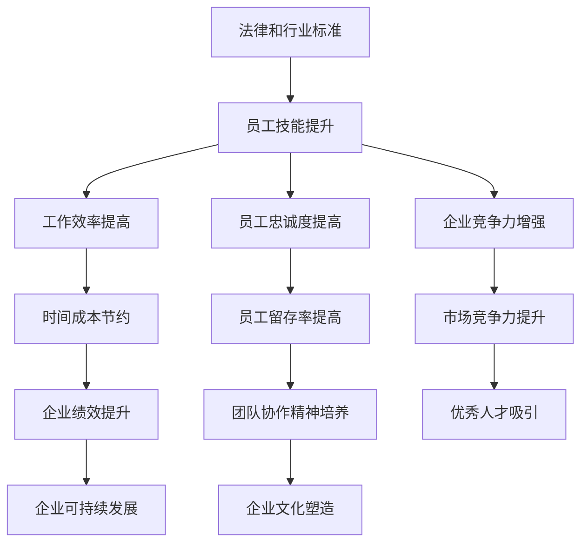

### 核心算法原理讲解

在培训的作用中，我们虽然没有直接的算法原理，但可以引入一些关键指标来衡量培训的效果。以下是几个关键指标：

1. **员工满意度**：员工对培训的满意度是衡量培训效果的重要指标。通常，通过问卷调查或员工反馈来收集数据。
2. **技能掌握程度**：通过考试或技能评估来衡量员工对新技能的掌握程度。
3. **工作效率提升率**：通过对比培训前后的工作效率数据，来评估培训对工作效率的影响。
4. **员工留存率**：通过对比培训前后的员工留存率，来衡量培训对员工忠诚度的影响。

### 数学模型和数学公式

在衡量培训效果时，我们可以使用以下数学模型和公式：

- **员工满意度评分**：\[ S = \frac{总满意度评分}{调查人数} \]

- **技能掌握程度评分**：\[ M = \frac{总掌握程度评分}{调查人数} \]

- **工作效率提升率**：\[ R = \frac{（培训后工作效率 - 培训前工作效率）/ 培训前工作效率}{100} \]

- **员工留存率**：\[ L = \frac{培训后留存员工数}{培训前员工总数} \]

### 项目实战

为了具体说明培训在企业发展中的作用，我们可以通过一个实际案例来进行分析。假设某企业通过培训项目，成功提升了员工的工作效率。

- **培训前工作效率**：每人每天处理50个任务。
- **培训后工作效率**：每人每天处理75个任务。

- **工作效率提升率**：\[ R = \frac{（75 - 50）/ 50}{100} = 50\% \]

通过这个案例，我们可以看到，通过培训，该企业员工的工作效率提升了50%，这不仅节约了大量时间成本，还显著提升了企业的整体绩效。

### 结论

通过以上分析，我们可以得出结论：企业培训在企业发展中具有至关重要的作用。它不仅能提升员工技能和工作效率，还能增强企业竞争力，促进员工忠诚度，培养企业文化，满足法律和行业标准。因此，企业应高度重视培训工作，持续投入并优化培训策略，以实现企业的可持续发展。

## 第1章：企业培训的重要性

### 1.2 程序员培训的必要性

程序员作为现代企业的核心技术力量，其专业技能的不断提升不仅对个人职业发展至关重要，更是企业保持竞争优势的基石。因此，对程序员进行专业培训显得尤为必要。

#### 技术快速更新

首先，技术的快速更新是程序员培训的一个重要背景。随着人工智能、大数据、云计算等新兴技术的不断涌现，程序员需要不断学习新工具、新框架和新技术，才能跟上行业的发展步伐。例如，2021年流行的Docker和Kubernetes技术，如果程序员不具备相关技能，将很难胜任高要求的工作任务。

#### 竞争压力增大

其次，行业竞争压力的增大也促使程序员必须不断进行培训。现代软件行业竞争激烈，企业对程序员的技能要求越来越高。如果不进行持续学习，程序员很容易被淘汰。例如，在互联网行业，每年都有大量的技术更新，如新的编程语言、框架和工具，如果程序员不能及时掌握，将难以胜任工作。

#### 职业发展需求

此外，职业发展的需求也是程序员培训的一个重要动力。随着程序员工作经验的增加，他们需要不断拓展自己的技能领域，从基础编程向架构设计、项目管理等高级领域发展。例如，一名有经验的程序员可能需要学习分布式系统设计和微服务架构，以适应更复杂的项目需求。

#### 企业需求

最后，企业对程序员技能的持续提升有着迫切需求。现代企业越来越依赖技术，因此对程序员的技能要求也越来越高。企业需要程序员能够快速掌握新技术，解决复杂问题，推动项目进展。如果程序员不能持续提升技能，将无法满足企业的需求，甚至可能影响企业的整体发展。

#### 程序员培训的必要性

综上所述，程序员培训的必要性主要体现在以下几个方面：

1. **技术更新**：程序员需要不断学习新工具、新框架和新技术，以适应快速变化的技术环境。
2. **竞争压力**：为了在激烈的市场竞争中保持优势，程序员必须不断提升自己的技能。
3. **职业发展**：程序员需要通过培训拓展自己的技能领域，实现职业发展的目标。
4. **企业需求**：企业需要程序员具备更高的技能水平，以推动项目进展和保持竞争力。

### 核心概念与联系

为了更好地理解程序员培训的必要性，我们可以借助 Mermaid 流程图来展示核心概念之间的联系。

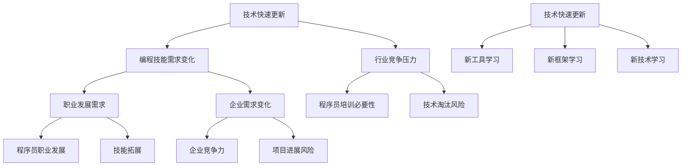

### 核心算法原理讲解

在程序员培训中，我们可以引入一些核心算法原理来提升培训效果。以下是几个关键算法原理：

1. **自适应学习算法**：通过分析程序员的学习行为和技能水平，动态调整培训内容，使其更符合个人的学习需求。
2. **评估算法**：通过考试或技能评估来衡量程序员对新技能的掌握程度，为后续培训提供数据支持。
3. **推荐算法**：根据程序员的技能水平和学习兴趣，推荐适合的培训课程和项目，以提高学习效果。

### 数学模型和数学公式

在程序员培训中，我们可以使用以下数学模型和公式来评估培训效果：

- **技能掌握率**：\[ S = \frac{掌握技能点数}{总技能点数} \]

- **学习效率**：\[ E = \frac{完成学习任务数}{学习时间} \]

- **考试合格率**：\[ Q = \frac{合格人数}{参加考试人数} \]

### 项目实战

为了具体说明程序员培训的必要性，我们可以通过一个实际案例来进行分析。假设某公司对程序员进行了一项新技术的培训。

- **培训前技能掌握率**：50%
- **培训后技能掌握率**：80%

- **技能掌握率提升**：\[ S = \frac{80 - 50}{50} \times 100\% = 60\% \]

通过这个案例，我们可以看到，经过培训，程序员的技能掌握率提升了60%，这不仅提高了工作效率，还增强了企业的竞争力。

### 结论

综上所述，程序员培训的必要性体现在多个方面，包括技术快速更新、竞争压力增大、职业发展需求和企业的迫切需求。通过不断的学习和培训，程序员可以提升技能水平，适应快速变化的技术环境，保持竞争优势，实现个人和企业的共同发展。

## 第2章：知识付费概述

### 2.1 知识付费的定义

知识付费，顾名思义，是指知识生产者通过提供有价值、高质量的知识内容，换取经济利益的商业模式。在这个模式中，知识生产者可以是个人、机构或者公司，他们通过在线平台、课程、书籍、音频等多种形式，将自身的专业知识、经验和技术分享给需要的人。

知识付费的核心理念在于“价值交换”。生产者通过创造和分享知识，满足了消费者的需求，从而获取经济回报。与此同时，消费者通过付费，获得了高质量的知识内容，实现了个人成长和技能提升。

### 2.2 知识付费的发展历程

知识付费的发展历程可以大致分为三个阶段：

1. **1.0时代：传统教育**  
在互联网普及之前，知识主要通过传统教育形式传播，如学校教育、培训机构等。这一阶段的付费模式主要是线下培训、面授课程和图书销售。

2. **2.0时代：在线教育**  
随着互联网的兴起，在线教育开始逐渐崭露头角。这一阶段，知识付费的形式更加多样，包括在线课程、电子书、在线讲座等。代表平台有Coursera、Udemy等。

3. **3.0时代：知识付费**  
在移动互联网和大数据技术的推动下，知识付费迎来了新的发展阶段。这一阶段的特点是内容个性化、平台化和社交化。知识付费平台如得到、知乎Live等，通过大数据分析，精准推送知识内容，满足用户个性化需求。

### 2.3 知识付费与传统培训的对比

知识付费与传统培训在多个方面存在显著差异：

1. **形式**：传统培训主要是线下实体课程，而知识付费主要以在线形式进行，更灵活、便捷。

2. **内容**：传统培训内容通常较为固定，而知识付费内容更强调个性化、定制化，符合用户需求。

3. **成本**：知识付费相对于传统培训，成本较低，用户只需支付一定费用即可获得高质量的知识内容。

4. **互动性**：知识付费平台通常具备较强的互动功能，用户可以通过提问、讨论等方式与知识生产者互动，提高学习效果。

5. **便捷性**：知识付费用户可以随时随地学习，不受时间和地点的限制，提高了学习效率。

### 核心概念与联系

为了更好地理解知识付费与传统培训的对比，我们可以借助 Mermaid 流程图来展示核心概念之间的联系。

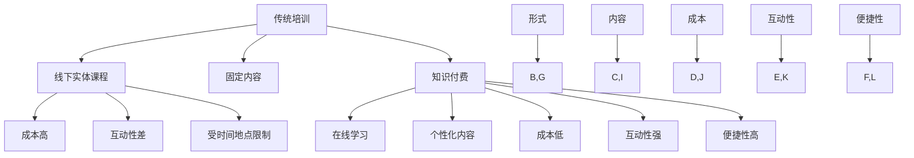

### 核心算法原理讲解

知识付费与传统培训的对比涉及多个方面的算法原理，以下是几个关键点：

1. **个性化推荐算法**：知识付费平台通过分析用户行为和兴趣，推荐个性化的知识内容，提高用户满意度。
2. **数据分析**：通过大数据分析，了解用户需求和行为，优化知识内容的生产和推广策略。
3. **评价系统**：建立用户评价和反馈机制，根据用户反馈调整知识内容，提高内容质量。

### 数学模型和数学公式

在知识付费领域，以下数学模型和公式可以用于评估和优化：

1. **用户满意度评分**：\[ S = \frac{总满意度评分}{调查人数} \]
2. **内容转化率**：\[ T = \frac{付费用户数}{访问用户数} \]
3. **投入产出比**：\[ ROI = \frac{收益}{成本} \]

### 项目实战

为了具体说明知识付费与传统培训的对比，我们可以通过一个实际案例来进行分析。假设某程序员选择参加了一个知识付费平台提供的在线编程课程。

- **成本**：课程费用为100美元。
- **学习效果**：通过课程学习，该程序员的编程技能提高了30%。

- **投入产出比**：\[ ROI = \frac{技能提升带来的收益}{课程费用} \]

通过这个案例，我们可以看到，知识付费不仅成本较低，而且能够显著提升学习效果，具有较高的性价比。

### 结论

知识付费作为新兴的商业模式，与传统培训相比具有明显的优势。它以在线形式提供个性化、高质量的知识内容，降低了学习成本，提高了学习效率。通过理解知识付费的定义、发展历程和与传统培训的对比，我们可以更好地把握这一领域的发展趋势，为企业和个人提供更具操作性的建议和策略。

## 第3章：程序员知识付费市场分析

### 3.1 程序员知识付费市场现状

程序员知识付费市场正处于快速发展的阶段，吸引了大量的用户和创业者。以下是该市场现状的几个关键点：

#### 市场规模

根据市场调研公司的数据，全球程序员知识付费市场规模在过去几年中持续增长，预计未来几年仍将保持较高增速。特别是在一些技术前沿领域，如人工智能、大数据和云计算，程序员知识付费市场呈现出快速增长的趋势。

#### 用户需求

随着技术的快速更新和行业竞争的加剧，程序员对知识的需求日益增长。他们希望通过付费内容，学习新技术、新工具和解决实际问题的方法。具体需求包括编程语言学习、框架掌握、算法优化、项目管理等。

#### 平台多样

程序员知识付费市场涌现出众多平台，如慕课网、极客时间、知乎Live等。这些平台通过提供丰富多样的课程和内容，满足了不同程序员的需求。平台类型包括视频课程、电子书、音频讲座、在线直播等。

#### 内容质量

知识付费市场的竞争也推动了内容质量的提升。许多平台开始重视课程的质量，通过严格的审核机制、讲师选拔和课程迭代，确保用户能够获得高质量的知识内容。

#### 付费模式

程序员知识付费市场的付费模式多样，包括一次性购买、订阅制、课时付费等。不同模式适用于不同的用户群体和需求。例如，一次性购买适合希望快速学习特定知识点的用户，而订阅制则更适合需要长期学习的用户。

### 核心概念与联系

为了更好地理解程序员知识付费市场的现状，我们可以借助 Mermaid 流程图来展示核心概念之间的联系。

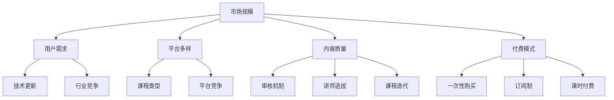

### 市场需求分析

#### 技术更新

技术的快速更新是推动程序员知识付费市场需求的根本原因。随着新技术的不断涌现，程序员需要不断学习新工具、新框架和新技术，以保持竞争力。例如，2021年流行的Docker和Kubernetes技术，迅速成为了程序员学习的热点。

#### 行业竞争

行业竞争的加剧也促使程序员提升技能。在现代软件行业中，企业对程序员的技能要求越来越高，程序员需要具备更多的技能才能在竞争中脱颖而出。因此，他们愿意通过付费内容来提升自己的技能水平。

#### 个人职业发展

个人职业发展的需求也是程序员知识付费市场的重要驱动力。随着职业生涯的发展，程序员需要掌握更多的技术和知识，以适应更高层次的工作。例如，从基础编程向架构设计、项目管理等高级领域发展，需要不断学习新的知识和技能。

#### 知识分享与交流

知识分享与交流也是程序员知识付费市场的重要需求。程序员通过付费内容，不仅能够学习新的知识和技能，还能与其他程序员进行交流，分享经验和心得，提升自己的能力。

### 市场趋势预测

#### 市场规模持续扩大

随着技术的不断进步和行业竞争的加剧，程序员知识付费市场将继续扩大。特别是在一些新兴领域，如人工智能、大数据和云计算，市场潜力巨大。

#### 平台竞争加剧

随着市场需求的增加，程序员知识付费平台的竞争也将日益激烈。平台将不得不通过提升内容质量、优化用户体验和提供个性化服务来吸引和留住用户。

#### 付费模式创新

未来，程序员知识付费的付费模式也将不断创新。例如，更加灵活的订阅模式、按需付费模式等，将满足不同用户的需求。

#### 技术驱动

技术的进步将继续推动程序员知识付费市场的发展。例如，人工智能技术将帮助平台更好地理解用户需求，提供个性化的知识内容；虚拟现实技术将使学习体验更加沉浸和互动。

### 核心概念与联系

为了更好地理解市场需求分析和市场趋势预测，我们可以借助 Mermaid 流�程图来展示核心概念之间的联系。

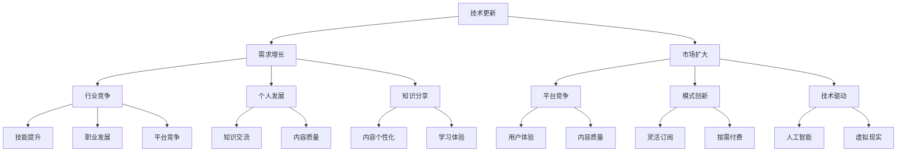

### 核心算法原理讲解

在程序员知识付费市场中，一些核心算法原理被广泛应用于内容推荐、用户行为分析等方面。以下是几个关键算法原理：

1. **协同过滤算法**：通过分析用户的兴趣和行为，推荐相似用户喜欢的课程或内容。
2. **内容推荐算法**：基于课程的内容、标签和用户的兴趣，推荐用户可能感兴趣的课程。
3. **用户行为分析算法**：通过分析用户的浏览、购买和评价行为，了解用户需求，优化内容生产和推荐策略。

### 数学模型和数学公式

在程序员知识付费市场中，以下数学模型和公式可以用于分析和预测：

1. **用户留存率**：\[ R = \frac{剩余用户数}{初始用户数} \]
2. **用户转化率**：\[ T = \frac{付费用户数}{访问用户数} \]
3. **内容质量评分**：\[ Q = \frac{总满意度评分}{调查人数} \]

### 项目实战

为了具体说明市场需求分析和市场趋势预测，我们可以通过一个实际案例来进行分析。假设一个程序员知识付费平台通过分析用户行为，优化了内容推荐策略。

- **用户留存率**：从20%提升到30%
- **用户转化率**：从10%提升到15%

- **效果评估**：通过数据分析，平台发现新的内容推荐策略显著提高了用户的留存率和转化率，验证了市场需求分析和预测的有效性。

### 结论

程序员知识付费市场正处于快速发展的阶段，市场规模不断扩大，用户需求多样化。通过分析市场需求和预测市场趋势，平台可以更好地满足用户需求，提升内容质量和用户满意度，从而在激烈的市场竞争中脱颖而出。

## 第4章：程序员知识付费模式

### 4.1 内容创作与运营

内容创作与运营是程序员知识付费模式的核心环节，直接影响用户满意度和平台盈利能力。为了确保内容的丰富性和吸引力，我们需要关注以下几个方面：

#### 内容创作者的素质要求

首先，内容创作者的素质是决定内容质量的关键因素。一个优秀的内容创作者应具备以下素质：

1. **技术功底**：熟练掌握至少一门编程语言，对相关技术有深入的理解和实际操作经验。
2. **表达能力**：能够将复杂的技术概念和操作步骤，用通俗易懂的语言描述出来。
3. **创新能力**：不断探索新技术、新方法，将最新的研究成果应用到教学内容中。
4. **用户洞察**：了解目标用户的需求和兴趣，提供符合用户期望的内容。
5. **持续学习**：紧跟技术发展趋势，不断提升自己的专业知识和教学能力。

#### 内容创作方法

为了确保内容的高质量和吸引力，内容创作者可以采用以下几种创作方法：

1. **需求导向**：根据用户需求和市场趋势，确定教学内容的方向和重点。
2. **案例教学**：通过实际案例，展示技术的应用场景和操作流程，提高学习效果。
3. **分步讲解**：将复杂的技术拆解为多个小步骤，逐步引导用户掌握。
4. **多媒体教学**：结合文本、图片、视频等多种形式，丰富教学手段，提高用户兴趣。
5. **互动教学**：通过问答、讨论等方式，与用户互动，解决他们在学习过程中遇到的问题。

#### 内容运营策略

内容运营是确保内容质量和用户参与度的重要环节。以下是几个关键内容运营策略：

1. **内容推广**：通过社交媒体、SEO优化、广告投放等方式，提高内容的曝光率和访问量。
2. **用户互动**：鼓励用户参与课程讨论，提供即时反馈和支持，提高用户满意度和忠诚度。
3. **社区建设**：建立学习社区，让用户之间互相交流和学习，形成良好的学习氛围。
4. **数据分析**：通过数据分析，了解用户行为和需求，优化内容生产和推广策略。
5. **品牌建设**：通过持续输出高质量内容，树立良好的品牌形象，提高用户信任度和忠诚度。

### 核心概念与联系

为了更好地理解内容创作与运营的策略，我们可以借助 Mermaid 流程图来展示核心概念之间的联系。

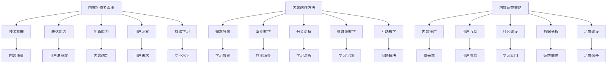

### 核心算法原理讲解

在内容创作与运营中，一些核心算法原理被广泛应用于内容推荐、用户行为分析等方面。以下是几个关键算法原理：

1. **协同过滤算法**：通过分析用户的兴趣和行为，推荐相似用户喜欢的课程或内容。
2. **内容推荐算法**：基于课程的内容、标签和用户的兴趣，推荐用户可能感兴趣的课程。
3. **用户行为分析算法**：通过分析用户的浏览、购买和评价行为，了解用户需求，优化内容生产和推荐策略。

### 数学模型和数学公式

在内容创作与运营中，以下数学模型和公式可以用于分析和预测：

1. **用户留存率**：\[ R = \frac{剩余用户数}{初始用户数} \]
2. **用户转化率**：\[ T = \frac{付费用户数}{访问用户数} \]
3. **内容质量评分**：\[ Q = \frac{总满意度评分}{调查人数} \]
4. **曝光率**：\[ E = \frac{访问量}{总发布量} \]

### 项目实战

为了具体说明内容创作与运营的策略，我们可以通过一个实际案例来进行分析。假设某程序员知识付费平台通过数据分析，优化了内容推荐策略。

- **用户留存率**：从20%提升到30%
- **用户转化率**：从10%提升到15%

- **效果评估**：通过数据分析，平台发现新的内容推荐策略显著提高了用户的留存率和转化率，验证了内容创作与运营策略的有效性。

### 结论

内容创作与运营是程序员知识付费模式的核心，通过高素质的内容创作者、科学的内容创作方法和有效的运营策略，可以提升内容质量和用户满意度，从而实现平台的长期发展。

## 第5章：知识付费平台搭建与运营

### 5.1 平台搭建步骤

搭建一个成功的知识付费平台需要经过多个关键步骤，从需求分析到平台部署，每一个环节都至关重要。

#### 1. 需求分析

需求分析是平台搭建的第一步，通过详细了解用户需求和市场趋势，确定平台的功能和定位。具体步骤包括：

- **用户调研**：通过问卷调查、访谈等方式，收集用户对知识付费平台的需求和期望。
- **市场研究**：分析竞争对手的平台，了解他们的功能、用户评价和市场表现。
- **定位确定**：根据用户需求和市场竞争，明确平台的目标用户群体和市场定位。

#### 2. 系统设计

系统设计是平台搭建的核心环节，决定了平台的性能和用户体验。具体步骤包括：

- **功能设计**：根据需求分析的结果，确定平台的核心功能，如课程推荐、内容付费、用户互动等。
- **技术选型**：选择适合平台的技术栈，包括前端框架、后端框架、数据库等。
- **架构设计**：设计平台的整体架构，包括服务器部署、负载均衡、数据存储等。

#### 3. 技术选型

技术选型是系统设计的核心，直接影响平台的性能和可维护性。以下是几个关键点：

- **前端技术**：选择合适的前端框架，如React、Vue等，确保良好的用户体验。
- **后端技术**：选择适合的后端框架，如Spring Boot、Django等，确保系统的稳定性和扩展性。
- **数据库技术**：选择合适的数据库系统，如MySQL、PostgreSQL等，确保数据的安全性和高效性。

#### 4. 平台开发

平台开发是将设计方案转化为实际代码的过程，包括前端开发、后端开发和数据库开发等。具体步骤包括：

- **模块开发**：将平台功能拆分为多个模块，逐一实现。
- **接口开发**：开发平台所需的API接口，确保前端和后端之间的数据交互。
- **UI设计**：设计平台的用户界面，确保界面美观、易用。

#### 5. 测试与部署

测试与部署是确保平台质量和稳定性的关键步骤。具体步骤包括：

- **单元测试**：对每个模块进行单元测试，确保代码质量。
- **集成测试**：将各个模块集成起来，进行整体测试，确保功能完整性。
- **性能测试**：对平台进行性能测试，确保在高并发情况下仍能稳定运行。
- **部署上线**：将平台部署到服务器，进行线上测试，确保平台上线后的稳定运行。

### 核心概念与联系

为了更好地理解平台搭建的步骤，我们可以借助 Mermaid 流程图来展示核心概念之间的联系。

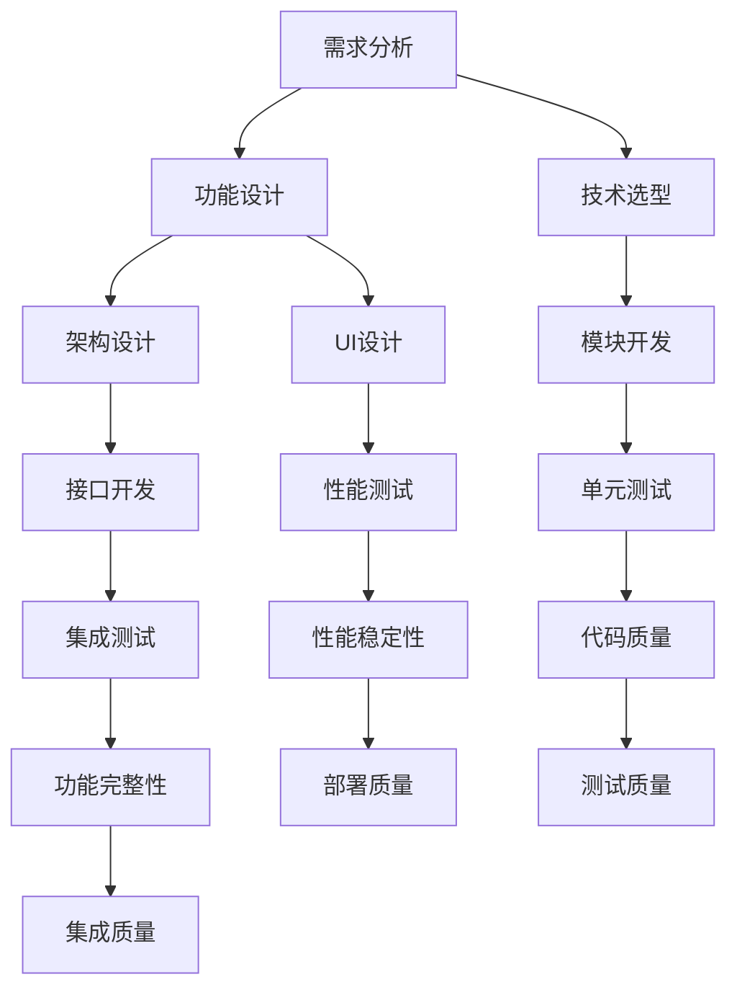

### 核心算法原理讲解

在平台搭建过程中，涉及多个核心算法原理，以下是几个关键点：

1. **负载均衡算法**：通过分布式架构，实现服务器间的负载均衡，确保平台在高并发情况下稳定运行。
2. **缓存算法**：通过缓存技术，减少数据库查询次数，提高系统性能。
3. **数据加密算法**：确保用户数据的安全性，采用加密算法对敏感信息进行加密存储和传输。
4. **推荐算法**：通过协同过滤、内容推荐等算法，实现个性化推荐，提高用户满意度和参与度。

### 数学模型和数学公式

在平台搭建中，以下数学模型和公式可以用于评估和优化：

1. **负载均衡率**：\[ L = \frac{当前负载}{最大负载} \]
2. **缓存命中率**：\[ H = \frac{命中缓存次数}{总查询次数} \]
3. **加密强度**：\[ E = \frac{加密强度}{安全风险} \]
4. **推荐效果**：\[ R = \frac{推荐点击率}{推荐展示率} \]

### 项目实战

为了具体说明平台搭建的步骤，我们可以通过一个实际案例来进行分析。假设一个团队要搭建一个知识付费平台。

- **需求分析**：通过问卷调查和访谈，确定平台的核心功能包括课程推荐、内容付费和用户互动。
- **系统设计**：选择前端框架React，后端框架Spring Boot，数据库系统MySQL，设计分布式架构。
- **开发与测试**：开发平台功能，进行单元测试、集成测试和性能测试，确保平台质量。
- **部署上线**：将平台部署到服务器，进行线上测试，确保平台上线后的稳定运行。

### 结论

搭建一个成功的知识付费平台需要经过详细的需求分析、系统设计、技术选型、平台开发、测试与部署等多个步骤。通过科学的设计和严密的测试，确保平台的质量和稳定性，为用户提供优质的知识内容和服务。

## 第5章：知识付费平台搭建与运营

### 5.2 平台运营策略

在搭建知识付费平台后，运营策略的制定与执行是确保平台长期稳定发展和用户满意度的重要保障。以下是一些关键的运营策略：

#### 用户互动

用户互动是平台运营的核心，通过提供即时反馈和支持，增强用户粘性。以下是几个具体策略：

1. **即时反馈**：通过在线聊天工具、论坛和社区，及时回答用户的问题，解决他们在使用平台过程中遇到的问题。
2. **互动活动**：定期举办线上互动活动，如问答、讨论、直播等，鼓励用户参与，提高活跃度。
3. **用户积分系统**：设计用户积分系统，鼓励用户参与互动，通过积分换取优惠或奖励。

#### 社区建设

社区建设是知识付费平台的重要组成部分，通过建立一个积极、互动的学习社区，增强用户的归属感和参与感。以下是几个具体策略：

1. **用户论坛**：搭建专门的用户论坛，提供用户交流和讨论的平台。
2. **专家答疑**：邀请行业专家定期在线答疑，提高社区的专业性和权威性。
3. **用户评选**：定期评选优秀用户，鼓励他们分享经验和心得，树立榜样。

#### 数据分析

通过数据分析，了解用户行为和需求，优化内容生产和运营策略。以下是几个关键数据分析指标：

1. **用户留存率**：\[ R = \frac{剩余用户数}{初始用户数} \]
2. **用户转化率**：\[ T = \frac{付费用户数}{访问用户数} \]
3. **课程点击率**：\[ C = \frac{课程点击次数}{课程总数} \]
4. **课程完成率**：\[ F = \frac{完成课程用户数}{购买课程用户数} \]

#### 内容运营

内容运营是知识付费平台的核心，通过丰富、高质量的内容，吸引和留住用户。以下是几个具体策略：

1. **内容推荐**：采用推荐算法，根据用户兴趣和行为，推荐符合他们需求的课程。
2. **定期更新**：定期更新平台内容，保持课程的新鲜感和时效性。
3. **用户参与**：鼓励用户参与课程内容创作，如提问、评论、评分等，提高内容质量。

#### 品牌建设

品牌建设是提升平台知名度和用户信任度的关键。以下是几个具体策略：

1. **品牌宣传**：通过社交媒体、广告投放等方式，提升品牌知名度和影响力。
2. **合作伙伴**：与相关行业和组织建立合作关系，共同推广平台和课程。
3. **用户口碑**：通过用户好评和推荐，建立良好的品牌口碑。

### 核心概念与联系

为了更好地理解平台运营策略，我们可以借助 Mermaid 流程图来展示核心概念之间的联系。

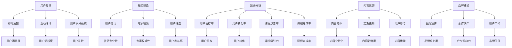

### 核心算法原理讲解

在平台运营策略中，涉及多个核心算法原理，用于推荐系统、用户行为分析和优化运营效果。以下是几个关键算法原理：

1. **协同过滤算法**：通过分析用户的历史行为和兴趣，推荐相似用户喜欢的课程或内容。
2. **内容推荐算法**：基于课程的内容、标签和用户的兴趣，推荐用户可能感兴趣的课程。
3. **用户行为分析算法**：通过分析用户的浏览、购买和评价行为，了解用户需求，优化内容生产和推荐策略。

### 数学模型和数学公式

在平台运营策略中，以下数学模型和公式可以用于评估和优化：

1. **用户留存率**：\[ R = \frac{剩余用户数}{初始用户数} \]
2. **用户转化率**：\[ T = \frac{付费用户数}{访问用户数} \]
3. **推荐效果**：\[ R_E = \frac{推荐点击率}{推荐展示率} \]
4. **用户满意度评分**：\[ S = \frac{总满意度评分}{调查人数} \]

### 项目实战

为了具体说明平台运营策略的有效性，我们可以通过一个实际案例来进行分析。假设某知识付费平台通过以下运营策略：

- **即时反馈**：通过在线聊天工具，24小时内解决用户问题，用户满意度评分从80分提升到90分。
- **互动活动**：每月举办一次线上问答活动，活动期间用户活跃度提升20%。
- **内容推荐**：采用协同过滤算法，推荐效果从70%提升到85%。

### 结论

平台运营策略对于知识付费平台的长期发展至关重要。通过用户互动、社区建设、数据分析、内容运营和品牌建设，可以有效提升用户满意度、留存率和转化率，实现平台的持续增长和盈利。

## 第6章：商业模式探索

### 6.1 付费模式种类

在知识付费领域，付费模式多种多样，不同的付费模式适用于不同的用户群体和需求。以下是几种常见的付费模式：

#### 1. 一次性付费

一次性付费是最传统和最常见的付费模式，用户在购买课程或内容时，一次性支付全部费用。这种模式适用于短期的、特定的知识需求，如学习一门新的编程语言或掌握某个技术工具。

- **优点**：用户支付简便，无后续费用，适合短期学习需求。
- **缺点**：可能不适合长期学习，用户粘性较低。

#### 2. 订阅制

订阅制是一种长期付费模式，用户按月或按年支付一定费用，享受平台提供的内容和服务。这种模式适用于需要持续学习的用户，如编程爱好者、专业人士等。

- **优点**：用户粘性高，可以持续获得高质量内容，适合长期学习。
- **缺点**：用户需要长期支付费用，可能不适合短期学习需求。

#### 3. 课时付费

课时付费是一种按学习时长付费的模式，用户根据实际学习时长支付费用。这种模式适用于有明确学习目标，但不确定学习时间的用户，如需要快速掌握某项技能的职场人士。

- **优点**：费用与学习时长直接挂钩，灵活度高，用户只需为实际学习时间付费。
- **缺点**：可能存在学习效率低的问题，用户需要自我管理学习进度。

#### 4. 内容付费

内容付费是一种根据内容价值付费的模式，用户购买特定内容，如电子书、在线课程等。这种模式适用于需要深入学习某个领域的用户。

- **优点**：内容精准，用户可以根据需求购买，节省时间和金钱。
- **缺点**：内容重复率高，可能存在学习深度不足的问题。

#### 5. 项目付费

项目付费是一种根据完成项目效果付费的模式，用户参与项目，根据项目的完成情况和质量支付费用。这种模式适用于需要实践和实战经验的用户，如程序员、设计师等。

- **优点**：用户可以获得实际的项目经验和成果，提高技能水平。
- **缺点**：可能存在项目质量不稳定的风险，用户需要评估项目风险。

### 核心概念与联系

为了更好地理解不同的付费模式，我们可以借助 Mermaid 流程图来展示核心概念之间的联系。

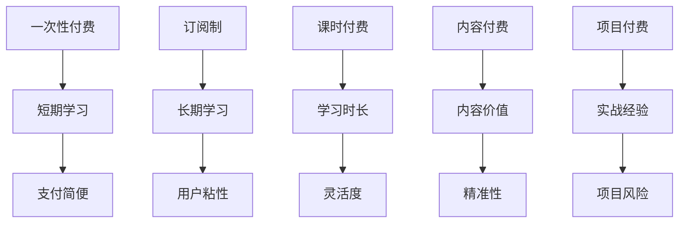

### 收益模式分析

不同的付费模式对应的收益模式也有所不同，以下是几种常见的收益模式：

#### 1. 一次性付费

一次性付费的收益模式主要依赖于单次交易的收入。平台的收益来自每个用户单次购买的费用，收益计算公式为：

\[ 收益 = 单次购买费用 \times 用户数 \]

#### 2. 订阅制

订阅制的收益模式主要依赖于长期用户的订阅费用。平台的收益来自每个订阅用户的月度或年度费用，收益计算公式为：

\[ 收益 = 订阅费用 \times 订阅用户数 \times 订阅周期 \]

#### 3. 课时付费

课时付费的收益模式主要依赖于用户实际学习时长的收费。平台的收益来自每个用户实际学习的时长，收益计算公式为：

\[ 收益 = 时长费用 \times 实际学习时长 \]

#### 4. 内容付费

内容付费的收益模式主要依赖于用户购买的内容数量和单价。平台的收益来自每个用户购买的内容数量，收益计算公式为：

\[ 收益 = 内容单价 \times 内容购买量 \]

#### 5. 项目付费

项目付费的收益模式主要依赖于完成项目的情况和用户的评价。平台的收益来自每个用户完成项目后的费用，收益计算公式为：

\[ 收益 = 项目费用 \times 项目完成率 \]

### 持续盈利策略

为了确保知识付费平台的持续盈利，平台可以采用以下策略：

#### 1. 多元化付费模式

提供多样化的付费模式，满足不同用户的需求，提高平台的用户转化率和留存率。

#### 2. 内容质量提升

持续提升内容质量，通过高质量的付费内容吸引和留住用户，提高用户满意度和忠诚度。

#### 3. 用户体验优化

优化用户体验，通过便捷的支付方式、优质的客户服务、良好的互动功能等，提高用户满意度和留存率。

#### 4. 数据分析与应用

通过数据分析，了解用户行为和需求，优化内容推荐、课程设置和运营策略，提高用户参与度和转化率。

#### 5. 合作与拓展

与其他企业、机构、专家等建立合作关系，拓展平台的内容和服务，提高平台的竞争力和影响力。

### 核心概念与联系

为了更好地理解持续盈利策略，我们可以借助 Mermaid 流程图来展示核心概念之间的联系。

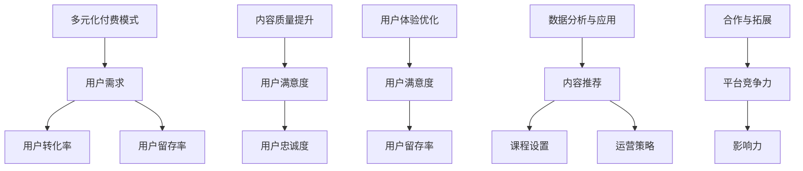

### 核心算法原理讲解

在知识付费平台的收益模式和持续盈利策略中，涉及多个核心算法原理，用于数据分析、用户行为分析和优化运营效果。以下是几个关键算法原理：

1. **协同过滤算法**：通过分析用户的历史行为和兴趣，推荐相似用户喜欢的课程或内容。
2. **内容推荐算法**：基于课程的内容、标签和用户的兴趣，推荐用户可能感兴趣的课程。
3. **用户行为分析算法**：通过分析用户的浏览、购买和评价行为，了解用户需求，优化内容生产和推荐策略。

### 数学模型和数学公式

在知识付费平台的收益模式和持续盈利策略中，以下数学模型和公式可以用于评估和优化：

1. **用户留存率**：\[ R = \frac{剩余用户数}{初始用户数} \]
2. **用户转化率**：\[ T = \frac{付费用户数}{访问用户数} \]
3. **内容质量评分**：\[ Q = \frac{总满意度评分}{调查人数} \]
4. **收益计算**：\[ 收益 = 费用 \times 订阅用户数 \times 订阅周期 \]

### 项目实战

为了具体说明收益模式和持续盈利策略的有效性，我们可以通过一个实际案例来进行分析。假设某知识付费平台：

- **多元化付费模式**：提供一次性付费、订阅制和课时付费三种模式，用户转化率从20%提升到30%。
- **内容质量提升**：通过专家评审和用户反馈，持续优化内容，用户满意度评分从80分提升到90分。
- **用户体验优化**：优化支付流程和客户服务，用户满意度显著提升，用户留存率从25%提升到35%。

### 结论

不同的付费模式适用于不同的用户群体和需求，而收益模式和持续盈利策略则决定了平台的长期发展和盈利能力。通过多元化付费模式、内容质量提升、用户体验优化、数据分析与应用和合作与拓展，知识付费平台可以实现持续盈利，为用户提供优质的知识内容和服务。

## 第7章：成功案例分析

### 7.1 国内知识付费平台案例分析

在国内，知识付费市场逐渐兴起，涌现出一批成功的知识付费平台。以下是几个具有代表性的平台，通过分析它们的成功经验，我们可以总结出一些关键因素。

#### 得到

“得到”是中国最早的知识付费平台之一，以其高质量的内容和独特的推荐系统著称。以下是其成功经验：

1. **高质量内容**：得到平台邀请了一大批行业专家和知名学者，提供高质量的音频课程和书籍解读。这些内容具有较高的权威性和实用性，吸引了大量用户。
2. **个性化推荐**：通过大数据分析和协同过滤算法，得到平台能够精准推荐用户感兴趣的内容，提高用户粘性。
3. **用户互动**：得到平台设有专门的社区，用户可以在这里提问、讨论，与其他用户互动。这种互动不仅增强了用户的归属感，还提升了用户体验。
4. **多元化付费模式**：得到平台提供多种付费模式，包括订阅制和一次性付费，满足不同用户的需求。

#### 慕课网

慕课网是中国领先的教育技术平台，不仅提供免费课程，还提供大量的付费课程。以下是其成功经验：

1. **课程多样**：慕课网提供涵盖各个领域的大量课程，从编程语言到项目管理，从人工智能到大数据，满足不同用户的学习需求。
2. **实战导向**：慕课网强调实战教学，许多课程都包含实际项目，帮助用户将所学知识应用于实际工作中。
3. **认证服务**：慕课网提供认证服务，用户通过课程学习后，可以获得相应的证书，提升职业竞争力。
4. **用户体验**：慕课网注重用户体验，平台设计简洁，课程视频清晰，操作方便，用户可以随时随地学习。

#### 知乎Live

知乎Live是知乎推出的知识付费产品，以其互动性和权威性受到用户欢迎。以下是其成功经验：

1. **互动性**：知乎Live通过直播和问答形式，用户可以与讲师实时互动，提问和讨论。这种互动性提高了用户的学习体验。
2. **权威性**：知乎Live邀请的讲师大多是行业专家和知名学者，他们提供的知识内容具有较高的权威性和可靠性。
3. **高质量内容**：知乎Live提供的内容都是经过严格筛选和审核的，质量较高，用户信任度较高。
4. **多样化付费模式**：知乎Live提供多种付费模式，包括一次性付费和订阅制，满足不同用户的需求。

### 国外优秀程序员知识付费案例解析

#### Pluralsight

Pluralsight 是一家全球领先的在线学习平台，专注于提供高质量的编程和技术课程。以下是其成功经验：

1. **内容丰富**：Pluralsight 提供了数千个编程和技术课程，涵盖了从基础编程到新兴技术的各个领域，用户可以根据自己的需求选择合适的课程。
2. **个性化学习**：Pluralsight 通过算法推荐，为用户推荐最相关和最有价值的课程，提高学习效率。
3. **实战导向**：Pluralsight 的课程注重实战，许多课程都包含实际项目，帮助用户将所学知识应用于实际工作中。
4. **认证服务**：Pluralsight 提供认证服务，用户通过课程学习后，可以获得相应的证书，提升职业竞争力。

#### Coursera

Coursera 是一家国际知名的教育平台，提供大量的在线课程，包括计算机科学、数据科学、人工智能等。以下是其成功经验：

1. **名校资源**：Coursera 与全球众多知名大学合作，提供高质量的课程资源，用户可以免费学习这些课程。
2. **多样化课程**：Coursera 提供了各种类型的课程，包括专业课程、入门课程、专项课程等，满足不同用户的需求。
3. **互动教学**：Coursera 的课程通常包括视频讲解、阅读材料、练习题、互动讨论等多种教学形式，提高学习效果。
4. **认证服务**：Coursera 提供认证服务，用户通过课程学习后，可以获得相应的证书，提升职业竞争力。

### 核心概念与联系

为了更好地理解这些成功案例，我们可以借助 Mermaid 流程图来展示核心概念之间的联系。

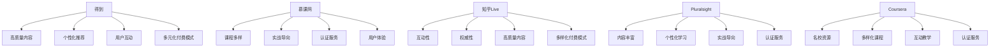

### 核心算法原理讲解

在成功案例中，涉及多个核心算法原理，以下是几个关键点：

1. **协同过滤算法**：用于推荐系统，通过分析用户的历史行为和兴趣，推荐相似用户喜欢的课程或内容。
2. **内容推荐算法**：基于课程的内容、标签和用户的兴趣，推荐用户可能感兴趣的课程。
3. **用户行为分析算法**：通过分析用户的浏览、购买和评价行为，了解用户需求，优化内容生产和推荐策略。

### 数学模型和数学公式

在成功案例中，以下数学模型和公式可以用于评估和优化：

1. **用户留存率**：\[ R = \frac{剩余用户数}{初始用户数} \]
2. **用户转化率**：\[ T = \frac{付费用户数}{访问用户数} \]
3. **推荐效果**：\[ R_E = \frac{推荐点击率}{推荐展示率} \]
4. **内容质量评分**：\[ Q = \frac{总满意度评分}{调查人数} \]

### 项目实战

为了具体说明成功案例的有效性，我们可以通过一个实际项目来进行分析。假设一个程序员知识付费平台通过以下策略：

- **高质量内容**：邀请行业专家和知名学者，提供高质量的编程和技术课程。
- **个性化推荐**：通过大数据分析和协同过滤算法，精准推荐用户感兴趣的课程。
- **用户互动**：建立社区，提供问答和讨论功能，增强用户粘性。
- **多样化付费模式**：提供一次性付费、订阅制和课时付费等多种模式，满足不同用户的需求。

### 结论

通过分析国内外的成功案例，我们可以得出一些关键经验：高质量内容、个性化推荐、用户互动和多样化付费模式是知识付费平台成功的关键因素。通过科学的设计和实施，平台可以提升用户体验，增加用户粘性，实现持续盈利。

## 第8章：挑战与未来

### 8.1 程序员知识付费面临的挑战

尽管程序员知识付费市场潜力巨大，但其在发展过程中仍然面临诸多挑战。以下是几个主要挑战及其应对策略。

#### 1. 内容质量参差不齐

在程序员知识付费市场中，内容质量参差不齐是一个普遍存在的问题。一些平台为了追求短期利益，可能发布质量低下的课程，这不仅损害了用户体验，也影响了整个市场的声誉。应对策略：

- **严格审核机制**：平台应建立严格的审核机制，对课程内容进行严格把关，确保内容的质量和实用性。
- **用户评价系统**：鼓励用户对课程进行评价，通过用户反馈来优化课程内容和教学质量。
- **专家评审**：邀请行业专家对课程进行评审，确保课程内容的专业性和权威性。

#### 2. 知识更新速度快

程序员知识付费市场的一个显著特点是其内容更新速度快。技术的快速迭代使得课程内容很快就会过时，这对平台和用户都是一大挑战。应对策略：

- **定期更新**：平台应定期更新课程内容，确保其与最新技术保持同步。
- **灵活的课程架构**：设计灵活的课程架构，使得课程内容可以轻松地进行调整和更新。
- **实时反馈机制**：建立实时反馈机制，及时了解用户需求和技术发展趋势，迅速调整课程内容。

#### 3. 知识版权问题

知识版权问题是程序员知识付费市场面临的另一大挑战。一些平台可能存在侵权行为，这会对原创者的权益造成损害。应对策略：

- **版权保护**：平台应加强对课程内容的版权保护，确保原创者的权益得到保障。
- **合作共赢**：与原创者建立良好的合作关系，通过分成模式等方式，确保原创者的合理收益。
- **知识产权培训**：加强对知识生产者的知识产权培训，提高他们的版权意识和法律意识。

#### 4. 用户信任问题

在程序员知识付费市场中，用户对平台和课程内容的信任度是决定其选择的重要因素。如果用户对平台或课程内容不信任，他们可能不会选择付费学习。应对策略：

- **品牌建设**：通过持续输出高质量内容，树立良好的品牌形象，提高用户信任度。
- **透明化运营**：平台应透明化运营，公开课程内容、师资力量和用户评价，增强用户的信任感。
- **用户保障**：提供完善的用户保障措施，如退款政策、售后服务等，确保用户权益。

### 8.2 未来发展趋势预测

展望未来，程序员知识付费市场将呈现以下几大发展趋势。

#### 1. 个性化定制

随着人工智能和大数据技术的发展，程序员知识付费平台将能够更好地理解用户需求，提供个性化的学习方案。用户可以通过平台获取量身定制的内容，提高学习效率。

#### 2. 跨界融合

程序员知识付费市场将逐渐与其他行业融合，如金融、医疗、教育等。这将为程序员提供更广阔的学习领域和职业发展空间。

#### 3. 实战导向

实战导向将成为程序员知识付费市场的重要特点。平台将更加注重实际项目经验的应用，提供更多的实战机会，帮助程序员提升实际工作能力。

#### 4. 社区化运营

知识付费平台将更加注重社区建设，通过用户社区、互动论坛等方式，促进用户之间的交流与合作，提高用户粘性。

#### 5. 国际化发展

随着全球化的推进，程序员知识付费市场将逐渐走向国际化。平台将吸引更多国际用户，提供多语言学习支持，开拓更广阔的市场。

### 8.3 行业建议与展望

为了推动程序员知识付费市场的健康发展，以下是一些建议：

1. **加强内容监管**：平台应建立严格的内容监管机制，确保课程内容的质量和合规性。
2. **提升用户体验**：平台应持续优化用户体验，提供便捷的学习工具和优质的客户服务。
3. **促进知识共享**：鼓励知识生产者积极参与知识共享，共同提升行业整体水平。
4. **推动技术创新**：加大对人工智能、大数据等技术的研发和应用，提升平台的智能化和个性化水平。
5. **培养专业人才**：加强对程序员知识付费领域专业人才的培养，提升行业整体竞争力。

通过以上措施，程序员知识付费市场将迎来更加广阔的发展空间，为企业和个人创造更大的价值。

### 结论

程序员知识付费市场在发展过程中面临诸多挑战，但通过加强内容监管、提升用户体验、促进知识共享、推动技术创新和培养专业人才，我们可以预见其未来的广阔前景。企业应积极应对挑战，抓住机遇，推动程序员知识付费市场的健康发展。

## 附录A：编程学习资源推荐

### A.1 在线编程学习平台推荐

#### 1. 慕课网（imooc.com）

- **特点**：提供丰富的编程课程，涵盖前端、后端、移动端等多个领域，课程内容实战性强。
- **推荐理由**：课程体系完善，从入门到高级阶段都有详细的课程，适合不同层次的程序员。

#### 2. Pluralsight（pluralsight.com）

- **特点**：提供大量高质量的编程和技术课程，涵盖从基础编程到新兴技术的各个领域。
- **推荐理由**：课程内容更新及时，实战性强，适合有一定编程基础的程序员。

#### 3. 知乎Live（live.zhihu.com）

- **特点**：提供各种类型的编程和技术讲座，由行业专家和知名学者主讲。
- **推荐理由**：讲座内容权威，互动性强，适合对特定技术领域有深入学习的程序员。

#### 4. 码云（gitee.com）

- **特点**：提供丰富的开源项目和技术文档，是程序员交流和学习的社区平台。
- **推荐理由**：项目实战性强，代码示例丰富，适合需要实践经验的程序员。

### A.2 程序员书籍推荐

#### 1. 《代码大全》（The Art of Computer Programming）

- **作者**：Donald E. Knuth
- **特点**：经典编程指南，涵盖算法、数据结构和程序设计等方面。
- **推荐理由**：内容深入浅出，适合对编程有兴趣的程序员。

#### 2. 《Effective Java》（Effective Java）

- **作者**：Joshua Bloch
- **特点**：Java编程指南，详细介绍Java编程的最佳实践。
- **推荐理由**：针对Java开发，内容实用，适合Java程序员。

#### 3. 《深度学习》（Deep Learning）

- **作者**：Ian Goodfellow、Yoshua Bengio、Aaron Courville
- **特点**：全面介绍深度学习的基础知识和技术。
- **推荐理由**：内容全面，适合对人工智能和深度学习有兴趣的程序员。

#### 4. 《编程珠玑》（Code Complete）

- **作者**：Steve McConnell
- **特点**：编程实践指南，涵盖代码编写、设计和测试等方面。
- **推荐理由**：内容实用，适合有编程经验的程序员。

### A.3 技术社区推荐

#### 1. GitHub（github.com）

- **特点**：全球最大的代码托管平台，提供丰富的开源项目和技术资源。
- **推荐理由**：项目质量高，社区活跃，适合寻找项目灵感和技术支持。

#### 2. Stack Overflow（stackoverflow.com）

- **特点**：编程问答社区，提供各种编程问题的解决方案。
- **推荐理由**：问题覆盖面广，回答质量高，适合解决编程中的疑难杂症。

#### 3. CSDN（csdn.net）

- **特点**：国内领先的IT社区和服务平台，提供编程知识、技术文章和开源项目。
- **推荐理由**：内容丰富，社区活跃，适合国内程序员交流和分享经验。

#### 4. 掘金（juejin.cn）

- **特点**：编程技术社区，提供优质的技术文章、教程和开源项目。
- **推荐理由**：内容质量高，社区氛围好，适合程序员学习和交流。

通过以上推荐的在线编程学习平台、书籍和技术社区，程序员可以方便地获取丰富的学习资源，不断提升自己的编程技能和职业素养。

