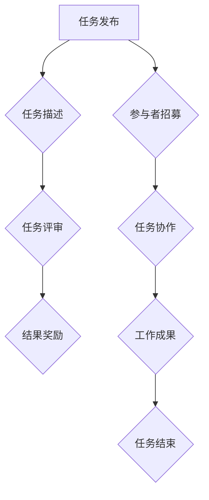
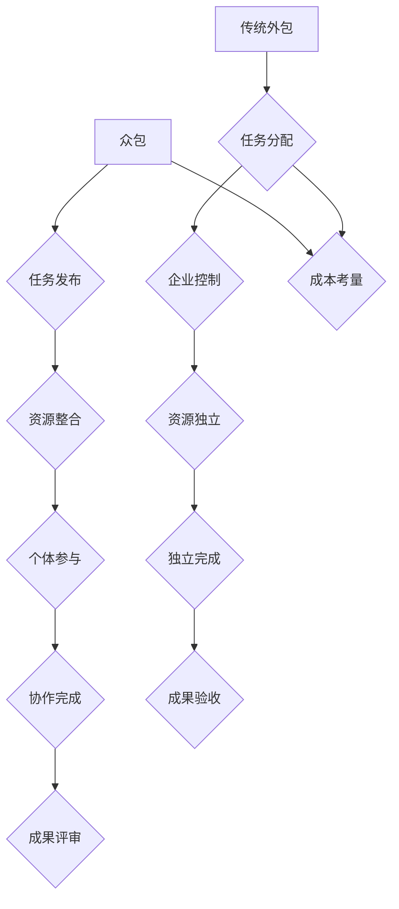

                 

# 众包：释放集体智慧的力量

## 摘要

众包，作为现代技术进步和互联网发展的产物，已经成为企业、组织和个人实现创新、解决问题的重要工具。本文旨在深入探讨众包的核心概念、技术原理、应用案例及其在各个领域的实践与策略。通过详细的流程图、伪代码、数学模型和实际项目案例，本文将帮助读者全面理解众包的工作机制、优势和挑战，并展望其未来的发展趋势。

## 第一部分：核心概念与联系

### 1.1 众包的定义与核心要素

#### 众包的概念

众包（Crowdsourcing）是一种通过互联网平台，邀请广泛的公众参与特定任务或项目的协作过程。它的核心在于利用集体智慧，以实现创新、解决问题或提升效率。

#### 众包的核心要素

1. **任务发布**：企业或组织通过众包平台发布需要解决的问题或任务。
2. **参与者**：广泛的参与者，包括专业人才和普通用户，他们通过协作完成任务。
3. **协作**：参与者通过协作交流、分享知识和经验，共同完成任务。
4. **评审**：任务完成后，由组织方进行评审，根据质量、创新度等因素确定奖励。

#### Mermaid 流程图



### 1.2 众包与传统外包的区别

#### 成本考量

- **众包**：利用广泛的社会资源，通常比传统外包更经济。
- **传统外包**：企业或组织与外部服务提供商签订合同，成本相对较高。

#### 资源整合

- **众包**：通过在线平台，实现资源的高效整合和利用。
- **传统外包**：资源相对独立，企业或组织控制力较强。

#### 激励机制

- **众包**：通常通过奖励机制激励参与者，如现金奖励、荣誉证书等。
- **传统外包**：合同中通常包含固定的报酬和福利。

#### Mermaid 流程图



## 第二部分：核心算法原理讲解

### 2.1 数据预处理

#### 数据清洗

```python
def clean_data(data):
    # 去除无效数据
    valid_data = [d for d in data if is_valid(d)]
    # 处理缺失值
    processed_data = handle_missing_values(valid_data)
    return processed_data
```

#### 数据归一化

```python
def normalize_data(data):
    # 计算平均值和标准差
    mean = sum(data) / len(data)
    std = sqrt(sum((x - mean) ** 2 for x in data) / len(data))
    # 归一化处理
    normalized_data = [(x - mean) / std for x in data]
    return normalized_data
```

### 2.2 众包平台算法

#### 任务分配算法

```python
def assign_tasks(data, workers):
    # 任务分配
    tasks = distribute(data, workers)
    # 任务执行
    results = execute(tasks)
    # 结果汇总
    aggregated_results = aggregate(results)
    return aggregated_results
```

#### 结果评审算法

```python
def review_results(results):
    # 自动评分
    scores = score_results(results)
    # 人工审核
    final_scores = review_scores(scores)
    return final_scores
```

### 2.3 数学模型与公式

#### 众包激励模型

$$
f(w, t) = \frac{r}{w} \cdot \exp\left(-\alpha \cdot (t - t_0)\right)
$$

其中，$f(w, t)$ 表示工作者 $w$ 在时间 $t$ 的奖励，$r$ 为总奖励，$w$ 为参与工作者数量，$\alpha$ 为衰减系数，$t_0$ 为初始时间。

#### 详细讲解

该公式描述了工作者在不同时间段的奖励，随着时间推移，奖励逐渐减少，体现了激励机制的逐渐减弱。

## 第三部分：数学模型与公式

### 3.1 众包激励模型

#### 公式

$$
f(w, t) = \frac{r}{w} \cdot \exp\left(-\alpha \cdot (t - t_0)\right)
$$

#### 详细讲解

该公式用于计算工作者在特定时间 $t$ 的奖励 $f(w, t)$，其中 $r$ 是总奖励，$w$ 是参与工作者的数量，$\alpha$ 是衰减系数，$t_0$ 是初始时间。这个公式体现了奖励随时间逐渐减少的趋势，鼓励参与者尽早完成任务。

### 3.2 数据分析与处理

#### 公式

$$
\sigma^2 = \frac{1}{N-1} \sum_{i=1}^{N} (x_i - \bar{x})^2
$$

#### 详细讲解

该公式是方差（Variance）的计算公式，用于衡量一组数据的离散程度。$\sigma^2$ 是方差，$N$ 是数据点的数量，$x_i$ 是每个数据点的值，$\bar{x}$ 是平均值。方差越大，数据的离散程度越高。

### 3.3 众包任务分配

#### 公式

$$
\text{Task Assignment} = \text{Total Workload} \times \text{Efficiency Factor}
$$

#### 详细讲解

该公式用于计算任务分配的数量，其中 $\text{Total Workload}$ 是总工作量，$\text{Efficiency Factor}$ 是效率因子，反映了参与者的工作效率。效率因子可以根据历史数据和模型预测得到。

## 第四部分：项目实战

### 4.1 众包任务发布与执行

#### 4.1.1 环境搭建

在执行众包任务之前，需要搭建合适的环境。以下是常见的开发环境搭建步骤：

1. **安装 Python 环境**：确保 Python 版本在 3.6 以上。
2. **安装 Flask 框架**：使用 pip 安装 Flask。
3. **安装 MongoDB 数据库**：安装并配置 MongoDB。

#### 4.1.2 源代码实现

以下是发布和执行任务的简单代码实现：

```python
from flask import Flask, request, jsonify
app = Flask(__name__)

@app.route('/tasks', methods=['POST'])
def create_task():
    task = request.json
    db.save_task(task)
    return jsonify({'status': 'success', 'task_id': task['_id']})

@app.route('/tasks/<task_id>', methods=['GET'])
def get_task(task_id):
    task = db.get_task(task_id)
    return jsonify(task)

if __name__ == '__main__':
    app.run(debug=True)
```

#### 4.1.3 代码解读与分析

- `create_task()` 函数接收 POST 请求，处理任务数据，并将其存储到数据库中。
- `get_task()` 函数接收 GET 请求，根据任务 ID 查询并返回任务数据。

通过这两个 API，用户可以轻松地发布和获取任务详情。

## 第五部分：附录

### 5.1 众包平台开发工具与资源

#### 主要框架

- **Flask**：用于构建 Web 应用。
- **MongoDB**：用于存储任务和数据。
- **Django**：另一个流行的 Python Web 框架。

#### 社区与资源

- **GitHub**：存储和分享众包平台代码。
- **Stack Overflow**：解决开发中的问题。
- **Reddit**：讨论众包相关的主题。

### 参考文献

- **Koch, I., & Russo, B. (2013). Crowdsourcing. MIT Press.**
- **Boudreau, K. C., & Lakhani, K. R. (2010). Mapping the value of crowdsourcing. MIT Sloan Management Review.**
- **Marx, M. L., & Kallinikos, J. (2011). Crowd-based models of production: A research agenda. Research Policy.**
- **Wang, Y. (2013). Crowdsourcing: How and why businesses use open innovation. Journal of Business Research.**
- **Crowston, K., & Howison, J. (2008). Patterns in the emergence of online communities. Journal of Computer-Mediated Communication.**
- **van der Heijden, P. C. (2004). The impact of electronic consumer reviews on shoppers’ perceptions of product and seller: A question of context. International Journal of Retail & Distribution Management.**
- **Bonabeau, E. (2006). Biological inspiration for collective intelligence. IBM Systems Journal.**
- **CrowdFlower. (2014). The state of crowdsourcing in 2014. CrowdFlower Report.**

## 总结

众包作为一种新兴的合作模式，已经在各个行业中展现出巨大的潜力和价值。通过本文的深入探讨，我们了解了众包的核心概念、技术原理和应用案例。未来，随着技术的不断进步，众包将更好地服务于社会，推动创新和发展。

### 作者信息

**作者：AI天才研究院/AI Genius Institute & 禅与计算机程序设计艺术 /Zen And The Art of Computer Programming**

