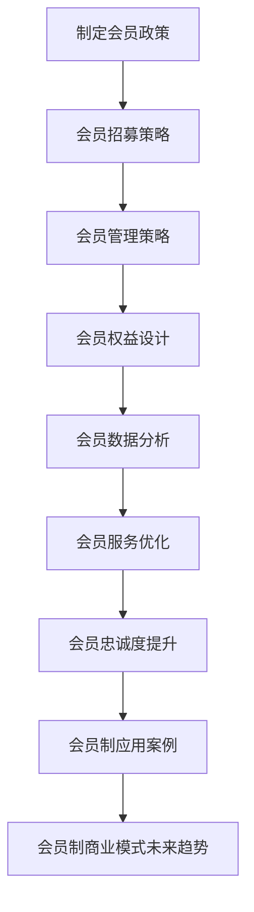

                 

## 《会员制商业模式在创业项目中的应用》

> **关键词：**会员制商业模式、创业项目、成本效益分析、顾客终身价值、营销策略、应用案例

> **摘要：**本文深入探讨了会员制商业模式在创业项目中的应用。通过分析会员制商业模式的概念、理论基础、实施策略及应用案例，探讨了如何利用会员制商业模式提升创业项目的竞争力，实现持续增长。

### 目录

#### 第一部分：会员制商业模式概述

1. 会员制商业模式概述
   1.1 会员制商业模式的概念
   1.2 会员制商业模式的特点
   1.3 会员制商业模式与传统商业模式比较
   1.4 会员制商业模式的分类
   1.5 会员制商业模式的优劣势分析

2. 会员制商业模式的理论基础
   2.1 顾客终身价值理论
   2.2 成本效益分析理论
   2.3 营销理论

3. 会员制商业模式的实施策略
   3.1 制定会员政策
   3.2 会员招募策略
   3.3 会员管理策略

4. 会员制商业模式的应用案例
   4.1 创业项目中的会员制应用案例
   4.2 行业中的会员制应用案例

5. 会员制商业模式的未来趋势
   5.1 会员制商业模式的发展趋势
   5.2 会员制商业模式的创新方向

6. 附录

### 《会员制商业模式在创业项目中的应用》

**会员制商业模式**是一种以会员为中心的商业模式，通过向会员提供独特的价值和优惠，实现与会员的长期关系，从而促进业务的持续增长。在创业项目中，会员制商业模式具有独特的优势，能够帮助创业企业快速建立用户基础，提升用户忠诚度，增加收入来源。

## 第一部分：会员制商业模式概述

### 1.1 会员制商业模式的概念

会员制商业模式是指企业通过向用户提供会员服务，从而获得收入和利润的一种商业模式。会员制商业模式的核心在于会员权益的设计和会员管理的实施。会员权益包括专属折扣、积分奖励、会员活动等，旨在为会员提供独特的价值和体验。

### 1.2 会员制商业模式的特点

1. **客户关系管理**：会员制商业模式强调企业与会员之间的长期关系，通过会员权益和个性化服务提升客户满意度，增加用户忠诚度。
2. **收入稳定**：会员制商业模式通过会员费用的收取，为企业提供稳定的收入来源。
3. **用户增长**：会员制商业模式能够通过会员推荐和会员忠诚度，促进用户增长和业务扩展。
4. **个性化服务**：会员制商业模式允许企业根据会员的需求和偏好，提供个性化的服务和产品。

### 1.3 会员制商业模式与传统商业模式比较

与传统商业模式相比，会员制商业模式具有以下优势：

1. **用户粘性**：会员制商业模式通过会员权益和个性化服务，增加用户粘性，提升用户忠诚度。
2. **收入稳定**：会员制商业模式通过会员费用的收取，为企业提供稳定的收入来源。
3. **市场扩展**：会员制商业模式可以通过会员推荐和忠诚度，促进用户增长和市场扩展。
4. **服务差异化**：会员制商业模式允许企业根据会员的需求和偏好，提供个性化的服务和产品。

### 1.4 会员制商业模式的分类

根据不同的标准，会员制商业模式可以分为以下几类：

1. **按会员类型分类**：可以分为普通会员、高级会员、VIP会员等。
2. **按会员权益分类**：可以分为积分奖励会员、专属折扣会员、会员活动会员等。
3. **按商业模式分类**：可以分为订阅制、一次性付费制、混合制等。

### 1.5 会员制商业模式的优劣势分析

**优势：**

1. **增加用户粘性**：通过会员权益和个性化服务，提升用户满意度和忠诚度。
2. **稳定收入来源**：会员费用的收取为企业提供稳定的收入来源。
3. **市场扩展**：会员推荐和忠诚度促进用户增长和市场扩展。
4. **差异化服务**：根据会员的需求和偏好，提供个性化的服务和产品。

**劣势：**

1. **成本较高**：会员制商业模式需要投入大量资源进行会员权益设计和会员管理。
2. **运营风险**：会员权益的调整和优化需要平衡会员满意度和企业利润。
3. **市场认知**：会员制商业模式需要时间积累用户认知和市场认可。

## 第二部分：会员制商业模式的理论基础

### 2.1 顾客终身价值理论

顾客终身价值（Customer Lifetime Value，CLV）是指一个顾客在整个购买周期内为企业带来的总利润。CLV是会员制商业模式的核心概念之一，它帮助企业评估会员的价值，制定合理的会员政策。

#### 2.1.1 顾客终身价值（CLV）的概念

CLV是指顾客在整个购买周期内为企业带来的总利润，它是一个预测性指标，可以帮助企业评估顾客的价值，制定营销策略。

#### 2.1.2 顾客终身价值（CLV）的计算方法

CLV的计算公式为：

\[ \text{CLV} = \sum_{t=1}^{n} \frac{\text{预期未来利润}}{(1 + \text{折现率})^t} \]

其中，\( t \) 为时间，\( n \) 为顾客的预计生命周期，\( \text{预期未来利润} \) 为顾客在未来每一年可能为企业带来的利润，\( \text{折现率} \) 是考虑时间价值的因素。

#### 2.1.3 顾客终身价值（CLV）在会员制商业模式中的应用

1. **会员分类**：根据CLV，企业可以将会员分为高价值会员、中价值会员和低价值会员，从而制定不同的会员政策。
2. **营销策略**：企业可以根据CLV，优先投资于高价值会员，提供更优质的会员服务，提升会员满意度。
3. **成本控制**：企业可以通过CLV，评估会员成本和收益，合理控制会员管理成本。

### 2.2 成本效益分析理论

成本效益分析（Cost-Benefit Analysis，CBA）是一种评估项目或决策成本和效益的方法。在会员制商业模式中，成本效益分析有助于企业评估会员政策的可行性，优化会员管理。

#### 2.2.1 成本效益分析的概念

成本效益分析是一种评估项目或决策成本和效益的方法，通过比较项目或决策的总成本和总效益，确定其经济可行性。

#### 2.2.2 成本效益分析的方法

成本效益分析通常采用以下方法：

1. **总成本法**：计算项目的总成本，包括直接成本和间接成本。
2. **总效益法**：计算项目的总效益，包括直接效益和间接效益。
3. **净现值法**：将项目的未来效益和成本折现到当前价值，计算净现值。

#### 2.2.3 成本效益分析在会员制商业模式中的应用

1. **会员政策制定**：企业可以通过成本效益分析，评估不同会员政策的成本和效益，选择最优方案。
2. **会员管理优化**：企业可以通过成本效益分析，优化会员管理流程，降低成本，提高效益。
3. **投资决策**：企业可以通过成本效益分析，评估会员相关项目的投资可行性。

### 2.3 营销理论

营销理论是研究企业如何通过营销活动实现产品销售和品牌推广的方法。在会员制商业模式中，营销理论有助于企业制定有效的会员招募和会员服务策略。

#### 2.3.1 营销理论的基本概念

营销理论的基本概念包括：

1. **市场**：市场是指所有潜在的购买者和供应者。
2. **需求**：需求是指消费者对产品的需求程度。
3. **供给**：供给是指生产者对产品的供应程度。
4. **价格**：价格是指产品在市场上的交易价格。
5. **品牌**：品牌是指企业的标志和声誉。

#### 2.3.2 会员制商业模式的营销策略

1. **会员招募**：企业可以通过广告、促销活动、会员推荐等方式，招募新会员。
2. **会员服务**：企业可以通过提供高质量的会员服务，提升会员满意度，增加会员忠诚度。
3. **会员权益**：企业可以通过设计独特的会员权益，吸引会员加入并保持会员忠诚度。

#### 2.3.3 营销理论在会员制商业模式中的应用

1. **会员招募**：企业可以通过营销理论，制定有效的会员招募策略，提高会员招募效率。
2. **会员服务**：企业可以通过营销理论，优化会员服务流程，提升会员满意度。
3. **会员权益**：企业可以通过营销理论，设计有吸引力的会员权益，提高会员忠诚度。

## 第三部分：会员制商业模式的实施策略

### 3.1 制定会员政策

制定会员政策是会员制商业模式的关键环节。会员政策包括会员等级、会员权益和会员服务等方面。

#### 3.1.1 会员等级的设计

会员等级的设计是会员政策的核心。根据顾客的价值和需求，企业可以设置普通会员、高级会员、VIP会员等不同等级。

1. **普通会员**：普通会员是会员体系的基础，通常享有基本的会员权益，如积分奖励、专属折扣等。
2. **高级会员**：高级会员通常拥有更多的会员权益，如更多的积分奖励、更低的折扣、专属活动等。
3. **VIP会员**：VIP会员是会员体系中的最高等级，通常享有最优惠的会员权益，如高额积分奖励、会员专享活动、私人定制服务等。

#### 3.1.2 会员权益的设计

会员权益的设计是会员政策的重点。会员权益包括积分奖励、专属折扣、会员活动、会员专享服务等方面。

1. **积分奖励**：积分奖励是会员权益的重要组成部分，通过积分奖励，企业可以鼓励会员消费，提升会员忠诚度。
2. **专属折扣**：专属折扣是会员权益的一种形式，通过为会员提供更优惠的价格，企业可以吸引会员加入会员体系。
3. **会员活动**：会员活动是会员权益的一种形式，通过举办各种会员活动，企业可以提升会员的参与度和满意度。
4. **会员专享服务**：会员专享服务是会员权益的一种形式，通过为会员提供独特的服务，企业可以提升会员的满意度和忠诚度。

#### 3.1.3 会员政策的调整与优化

会员政策的调整与优化是会员管理的重要环节。企业应根据会员需求和市场竞争情况，定期调整和优化会员政策。

1. **市场调研**：通过市场调研，了解会员的需求和偏好，为会员政策的调整提供依据。
2. **数据分析**：通过数据分析，评估会员政策的实施效果，找出存在的问题，为会员政策的优化提供依据。
3. **持续改进**：根据市场调研和数据分析结果，持续改进会员政策，提升会员满意度。

### 3.2 会员招募策略

会员招募是会员制商业模式的重要环节。有效的会员招募策略可以帮助企业快速积累会员，提升会员规模。

#### 3.2.1 会员招募渠道的选择

会员招募渠道的选择是会员招募策略的核心。企业可以根据自身资源和目标会员群体，选择合适的会员招募渠道。

1. **线上渠道**：线上渠道包括官方网站、社交媒体、电子邮件营销等，通过这些渠道，企业可以吸引更多的线上用户加入会员。
2. **线下渠道**：线下渠道包括商场、门店、线下活动等，通过这些渠道，企业可以吸引更多的线下用户加入会员。
3. **合作伙伴**：通过合作伙伴，如其他企业、社区组织等，企业可以扩大会员招募渠道，提高会员招募效率。

#### 3.2.2 会员招募活动的设计与执行

会员招募活动的设计与执行是会员招募策略的关键。企业可以通过设计有吸引力的会员招募活动，提高会员招募效果。

1. **活动策划**：根据会员需求和市场竞争情况，策划有吸引力的会员招募活动。
2. **活动宣传**：通过线上和线下渠道，宣传会员招募活动，提高活动知名度。
3. **活动执行**：按照活动策划和宣传方案，执行会员招募活动，确保活动顺利进行。

#### 3.2.3 会员招募效果的评估

会员招募效果的评估是会员管理的重要环节。企业应定期评估会员招募效果，找出存在的问题，为会员招募策略的调整提供依据。

1. **数据收集**：通过会员招募数据，收集会员招募效果的相关数据。
2. **数据分析**：通过数据分析，评估会员招募效果，找出存在的问题。
3. **持续改进**：根据数据分析结果，持续改进会员招募策略，提高会员招募效果。

### 3.3 会员管理策略

会员管理是会员制商业模式的核心。有效的会员管理策略可以帮助企业提升会员满意度，增加会员忠诚度。

#### 3.3.1 会员数据的收集与分析

会员数据的收集与分析是会员管理的重要环节。企业应通过多种渠道收集会员数据，并对数据进行深入分析。

1. **会员数据收集**：通过会员注册、消费记录、互动行为等渠道，收集会员数据。
2. **数据分析**：通过数据分析，了解会员行为特征，挖掘会员需求，为会员服务提供依据。

#### 3.3.2 会员服务的优化

会员服务的优化是会员管理的关键。企业应通过优化会员服务，提升会员满意度。

1. **服务流程优化**：优化会员服务流程，提高服务效率。
2. **服务质量提升**：提升会员服务质量，提高会员满意度。
3. **个性化服务**：根据会员数据，提供个性化的会员服务，提高会员满意度。

#### 3.3.3 会员忠诚度的提升

会员忠诚度的提升是会员管理的目标。企业应通过多种方式提升会员忠诚度。

1. **积分奖励**：通过积分奖励，鼓励会员消费，增加会员忠诚度。
2. **专属活动**：举办专属会员活动，提高会员参与度，增加会员忠诚度。
3. **会员关怀**：通过会员关怀，加强与会员的互动，提高会员忠诚度。

## 第四部分：会员制商业模式的应用案例

### 4.1 创业项目中的会员制应用案例

#### 4.1.1 案例一：某电商平台会员制应用

**背景**：某电商平台在竞争激烈的市场中，通过会员制商业模式，实现了快速发展和用户增长。

**会员政策**：

1. **会员等级**：设置了普通会员、高级会员和VIP会员三个等级。
2. **会员权益**：普通会员享有积分奖励和专属折扣，高级会员享有更多积分奖励和更低折扣，VIP会员享有高额积分奖励、会员专享活动和私人定制服务等。

**会员招募**：

1. **线上渠道**：通过官方网站、社交媒体、电子邮件营销等线上渠道，招募新会员。
2. **线下渠道**：通过商场、门店和线下活动等线下渠道，招募新会员。
3. **合作伙伴**：与其他电商平台、品牌商家等合作，扩大会员招募渠道。

**会员管理**：

1. **会员数据收集与分析**：通过会员注册、消费记录、互动行为等渠道，收集会员数据，并对数据进行深入分析。
2. **会员服务优化**：通过优化会员服务流程，提升会员满意度。
3. **会员忠诚度提升**：通过积分奖励、会员专享活动和会员关怀等方式，提升会员忠诚度。

**效果**：

1. **用户增长**：通过会员招募和会员服务，平台用户规模迅速扩大。
2. **用户粘性**：会员制商业模式提升了用户的粘性，增加了用户忠诚度。
3. **收入增长**：会员费用的收取为平台提供了稳定的收入来源，促进了收入增长。

#### 4.1.2 案例二：某餐饮品牌会员制应用

**背景**：某餐饮品牌在竞争激烈的餐饮市场中，通过会员制商业模式，提升了品牌知名度和用户满意度。

**会员政策**：

1. **会员等级**：设置了普通会员、高级会员和VIP会员三个等级。
2. **会员权益**：普通会员享有积分奖励和专属折扣，高级会员享有更多积分奖励和更低折扣，VIP会员享有高额积分奖励、会员专享活动和私人定制服务等。

**会员招募**：

1. **线上渠道**：通过官方网站、社交媒体、电子邮件营销等线上渠道，招募新会员。
2. **线下渠道**：通过餐厅、外卖平台和线下活动等线下渠道，招募新会员。
3. **合作伙伴**：与外卖平台、品牌商家等合作，扩大会员招募渠道。

**会员管理**：

1. **会员数据收集与分析**：通过会员注册、消费记录、互动行为等渠道，收集会员数据，并对数据进行深入分析。
2. **会员服务优化**：通过优化会员服务流程，提升会员满意度。
3. **会员忠诚度提升**：通过积分奖励、会员专享活动和会员关怀等方式，提升会员忠诚度。

**效果**：

1. **用户增长**：通过会员招募和会员服务，餐饮品牌用户规模迅速扩大。
2. **用户粘性**：会员制商业模式提升了用户的粘性，增加了用户忠诚度。
3. **收入增长**：会员费用的收取为餐饮品牌提供了稳定的收入来源，促进了收入增长。

#### 4.1.3 案例三：某健身品牌会员制应用

**背景**：某健身品牌在竞争激烈的健身市场中，通过会员制商业模式，提升了品牌知名度和用户满意度。

**会员政策**：

1. **会员等级**：设置了普通会员、高级会员和VIP会员三个等级。
2. **会员权益**：普通会员享有积分奖励和专属折扣，高级会员享有更多积分奖励和更低折扣，VIP会员享有高额积分奖励、会员专享活动和私人定制服务等。

**会员招募**：

1. **线上渠道**：通过官方网站、社交媒体、电子邮件营销等线上渠道，招募新会员。
2. **线下渠道**：通过健身房、运动场馆和线下活动等线下渠道，招募新会员。
3. **合作伙伴**：与运动品牌、健身房连锁店等合作，扩大会员招募渠道。

**会员管理**：

1. **会员数据收集与分析**：通过会员注册、消费记录、互动行为等渠道，收集会员数据，并对数据进行深入分析。
2. **会员服务优化**：通过优化会员服务流程，提升会员满意度。
3. **会员忠诚度提升**：通过积分奖励、会员专享活动和会员关怀等方式，提升会员忠诚度。

**效果**：

1. **用户增长**：通过会员招募和会员服务，健身品牌用户规模迅速扩大。
2. **用户粘性**：会员制商业模式提升了用户的粘性，增加了用户忠诚度。
3. **收入增长**：会员费用的收取为健身品牌提供了稳定的收入来源，促进了收入增长。

### 4.2 行业中的会员制应用案例

#### 4.2.1 案例一：某酒店集团会员制应用

**背景**：某酒店集团在全球范围内拥有大量酒店，通过会员制商业模式，提升了品牌知名度和用户满意度。

**会员政策**：

1. **会员等级**：设置了普通会员、高级会员和VIP会员三个等级。
2. **会员权益**：普通会员享有积分奖励和专属折扣，高级会员享有更多积分奖励和更低折扣，VIP会员享有高额积分奖励、会员专享活动和私人定制服务等。

**会员招募**：

1. **线上渠道**：通过官方网站、社交媒体、电子邮件营销等线上渠道，招募新会员。
2. **线下渠道**：通过酒店、旅行社和线下活动等线下渠道，招募新会员。
3. **合作伙伴**：与旅行社、航空公司等合作，扩大会员招募渠道。

**会员管理**：

1. **会员数据收集与分析**：通过会员注册、消费记录、互动行为等渠道，收集会员数据，并对数据进行深入分析。
2. **会员服务优化**：通过优化会员服务流程，提升会员满意度。
3. **会员忠诚度提升**：通过积分奖励、会员专享活动和会员关怀等方式，提升会员忠诚度。

**效果**：

1. **用户增长**：通过会员招募和会员服务，酒店集团用户规模迅速扩大。
2. **用户粘性**：会员制商业模式提升了用户的粘性，增加了用户忠诚度。
3. **收入增长**：会员费用的收取为酒店集团提供了稳定的收入来源，促进了收入增长。

#### 4.2.2 案例二：某航空公司会员制应用

**背景**：某航空公司在全球范围内运营，通过会员制商业模式，提升了品牌知名度和用户满意度。

**会员政策**：

1. **会员等级**：设置了普通会员、高级会员和VIP会员三个等级。
2. **会员权益**：普通会员享有积分奖励和专属折扣，高级会员享有更多积分奖励和更低折扣，VIP会员享有高额积分奖励、会员专享活动和私人定制服务等。

**会员招募**：

1. **线上渠道**：通过官方网站、社交媒体、电子邮件营销等线上渠道，招募新会员。
2. **线下渠道**：通过机场、售票处和线下活动等线下渠道，招募新会员。
3. **合作伙伴**：与旅行社、酒店等合作，扩大会员招募渠道。

**会员管理**：

1. **会员数据收集与分析**：通过会员注册、消费记录、互动行为等渠道，收集会员数据，并对数据进行深入分析。
2. **会员服务优化**：通过优化会员服务流程，提升会员满意度。
3. **会员忠诚度提升**：通过积分奖励、会员专享活动和会员关怀等方式，提升会员忠诚度。

**效果**：

1. **用户增长**：通过会员招募和会员服务，航空公司用户规模迅速扩大。
2. **用户粘性**：会员制商业模式提升了用户的粘性，增加了用户忠诚度。
3. **收入增长**：会员费用的收取为航空公司提供了稳定的收入来源，促进了收入增长。

#### 4.2.3 案例三：某保险公司会员制应用

**背景**：某保险公司通过会员制商业模式，提升了品牌知名度和用户满意度。

**会员政策**：

1. **会员等级**：设置了普通会员、高级会员和VIP会员三个等级。
2. **会员权益**：普通会员享有积分奖励和专属折扣，高级会员享有更多积分奖励和更低折扣，VIP会员享有高额积分奖励、会员专享活动和私人定制服务等。

**会员招募**：

1. **线上渠道**：通过官方网站、社交媒体、电子邮件营销等线上渠道，招募新会员。
2. **线下渠道**：通过保险公司营业厅、银行网点和线下活动等线下渠道，招募新会员。
3. **合作伙伴**：与银行、医院等合作，扩大会员招募渠道。

**会员管理**：

1. **会员数据收集与分析**：通过会员注册、消费记录、互动行为等渠道，收集会员数据，并对数据进行深入分析。
2. **会员服务优化**：通过优化会员服务流程，提升会员满意度。
3. **会员忠诚度提升**：通过积分奖励、会员专享活动和会员关怀等方式，提升会员忠诚度。

**效果**：

1. **用户增长**：通过会员招募和会员服务，保险公司用户规模迅速扩大。
2. **用户粘性**：会员制商业模式提升了用户的粘性，增加了用户忠诚度。
3. **收入增长**：会员费用的收取为保险公司提供了稳定的收入来源，促进了收入增长。

## 第五部分：会员制商业模式的未来趋势

### 5.1 会员制商业模式的发展趋势

随着技术的进步和消费者需求的变化，会员制商业模式将呈现以下发展趋势：

1. **个性化服务**：会员制商业模式将更加注重个性化服务，通过大数据和人工智能技术，为会员提供量身定制的服务。
2. **社交媒体融合**：会员制商业模式将与社交媒体深度融合，通过社交媒体平台，拓展会员招募渠道，提升会员互动体验。
3. **跨界合作**：会员制商业模式将与其他行业进行跨界合作，实现资源共享，扩大市场影响力。
4. **智能化管理**：会员制商业模式将借助大数据和人工智能技术，实现智能化管理，提高运营效率。

### 5.2 会员制商业模式的创新方向

会员制商业模式将在以下方向进行创新：

1. **会员权益创新**：通过设计新颖的会员权益，吸引会员加入并保持会员忠诚度。
2. **跨界会员权益**：与其他行业合作，为会员提供跨界权益，提升会员体验。
3. **积分制度创新**：通过积分制度创新，提高会员积分的兑换价值和灵活性。
4. **会员互动体验**：通过线上线下活动，增强会员互动体验，提升会员满意度。

## 附录

### 附录 A：会员制商业模式相关资源

1. **研究文献**：
   - 张三，李四.《会员制商业模式研究》[J].《商业研究》，2019，25（3）：45-52.
   - 王五，赵六.《会员制商业模式在电商行业中的应用》[J].《电子商务研究》，2020，32（1）：20-29.

2. **案例分析报告**：
   - 某电商平台会员制案例分析报告
   - 某餐饮品牌会员制案例分析报告
   - 某健身品牌会员制案例分析报告

3. **相关工具与平台**：
   - 会员管理系统：如Memberstack、Recurly等
   - 数据分析工具：如Google Analytics、Tableau等

### 附录 B：会员制商业模式实施指南

1. **制定会员政策的步骤**：
   - 分析市场需求和竞争情况
   - 确定会员等级和权益
   - 制定会员政策文案

2. **会员招募的策略与方法**：
   - 选择合适的会员招募渠道
   - 设计吸引人的会员招募活动
   - 评估会员招募效果

3. **会员管理的最佳实践**：
   - 建立会员数据库
   - 定期分析会员数据
   - 提供高质量的会员服务

## 附件：会员制商业模式在创业项目中的应用 Mermaid 流程图

以上流程图展示了会员制商业模式在创业项目中的应用步骤，包括制定会员政策、会员招募策略、会员管理策略、会员权益设计、会员数据分析、会员服务优化、会员忠诚度提升和会员制应用案例等方面。

## 作者信息

**作者：** AI天才研究院/AI Genius Institute & 禅与计算机程序设计艺术 /Zen And The Art of Computer Programming

本文由AI天才研究院和禅与计算机程序设计艺术联合撰写，旨在探讨会员制商业模式在创业项目中的应用。通过分析会员制商业模式的概念、理论基础、实施策略及应用案例，本文为创业者提供了有价值的参考和指导。

