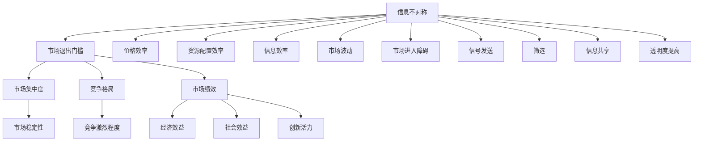

                 

# 《信息差：信息不对称与市场退出门槛》

> **关键词：** 信息不对称、市场退出门槛、信息差、市场效率、政策干预

> **摘要：** 本文深入探讨了信息不对称和市场退出门槛的概念及其相互关系。通过对信息差的理论基础、影响和市场案例分析，本文揭示了信息不对称如何加剧市场退出门槛，并提出了政策和管理建议以减少信息差，提高市场效率。

## 第一部分：引言

### 1.1 书籍背景

在当今快速发展的信息技术时代，信息已经成为一种宝贵的资源，对经济和社会发展具有深远影响。然而，由于信息传播的不均衡性，信息不对称现象普遍存在，导致市场退出门槛的提高。本文旨在探讨信息不对称与市场退出门槛之间的关系，分析其理论基础、影响和市场案例，并提出相应的政策和管理建议。

### 1.1.1 信息差的定义

信息差，是指市场中不同主体之间的信息获取和处理能力的差异。这种差异可能导致部分主体在交易决策中处于不利地位，从而影响市场的效率和公平性。信息差可以分为以下几种类型：

1. **信息不对称**：市场上买卖双方所掌握的信息量不一致。例如，卖家可能比买家更了解产品的性能、质量和价格。
2. **信息孤岛**：市场上各个主体之间缺乏有效的信息交流和共享，导致信息孤岛现象。
3. **信息滞后**：市场上的信息更新不及时，导致决策者无法基于最新的信息做出最优决策。

### 1.1.2 信息不对称的影响

信息不对称会对市场产生多方面的影响，包括：

1. **市场效率降低**：信息不对称导致市场中的资源配置效率下降，从而降低整体经济福利。
2. **市场波动加剧**：信息不对称可能导致市场对价格和供需的判断不准确，进而引发市场波动。
3. **市场进入障碍**：信息不对称使得潜在市场参与者难以准确评估进入市场的成本和风险，从而提高了市场退出门槛。

### 1.1.3 市场退出门槛的概念

市场退出门槛，是指企业在市场中退出时所需克服的障碍。这些障碍可能包括资金、技术、市场资源等方面。市场退出门槛的高低直接影响到市场的竞争格局和稳定性。

1. **市场退出门槛的类型**：
   - **资金门槛**：企业需要投入大量资金才能维持运营。
   - **技术门槛**：企业需要具备一定的技术水平才能在市场中竞争。
   - **市场资源门槛**：企业需要拥有足够的客户、供应商等市场资源。

2. **市场退出门槛的影响**：
   - **市场集中度提高**：高门槛使得小企业难以进入市场，导致市场集中度提高。
   - **竞争激烈**：低门槛导致大量企业进入市场，竞争加剧。
   - **市场稳定性下降**：高门槛可能导致市场参与者减少，从而降低市场稳定性。

### 1.2 信息差与市场退出门槛的关系

信息差与市场退出门槛之间存在密切的关系。信息差的存在使得市场中的信息不对称现象更加严重，进而提高了市场退出门槛。具体来说：

1. **信息差导致市场退出门槛提高**：信息不对称使得潜在市场参与者难以准确评估市场风险和成本，导致他们面临更高的进入门槛。
2. **市场退出门槛加剧信息差**：高门槛使得市场上剩余的企业拥有更多的资源和优势，进一步加剧了信息不对称现象。
3. **信息差和市场退出门槛的相互作用**：信息差和市场退出门槛相互影响，形成一个动态的循环，进一步加剧了市场的信息不对称问题。

### 1.3 总结

信息差和市场退出门槛是影响市场效率和经济发展的关键因素。信息差的存在会导致市场效率降低，市场波动加剧，市场退出门槛的提高则使得竞争更加激烈。本文将在后续章节中进一步探讨信息差的理论基础、影响和市场案例，并提出相应的政策和管理建议。

## 第二部分：信息差的理论基础

### 2.1 信息不对称的理论分析

信息不对称理论是经济学中研究市场失灵的重要理论之一。它源于20世纪50年代，最初由经济学家乔治·阿克洛夫（George A. Akerlof）在其经典论文《柠檬市场》中提出。信息不对称是指市场参与者之间在信息获取和处理能力上的差异，这种差异可能导致市场机制失效，从而影响市场效率。

#### 2.1.1 基本概念与分类

信息不对称可以分为以下几种类型：

1. **逆向选择（Adverse Selection）**：这是指在交易过程中，卖方比买方拥有更多关于商品质量的信息，导致买方难以做出最佳决策。例如，在二手汽车市场中，卖家通常比买家更了解汽车的实际情况。
   
2. **道德风险（Moral Hazard）**：这是指交易发生后，一方可能采取不利于另一方的行为，因为他们知道另一方无法完全监督或惩罚他们的行为。例如，在保险市场中，投保人可能因为知道保险公司无法完全监控其行为，而采取风险更高的行为。

3. **信息缺口（Information Gap）**：这是指市场中不同主体之间的信息差异，导致他们对于同一事物的认知存在差距。例如，在股票市场中，机构投资者和个人投资者之间的信息差异可能导致他们对股票价值的评估不同。

#### 2.1.2 信息不对称的经济效应

信息不对称对市场产生多方面的经济效应：

1. **市场效率降低**：信息不对称导致市场资源配置效率下降，资源不能有效流向最有生产效率的企业或个人。

2. **市场波动**：信息不对称可能导致市场参与者对价格和供需的判断不准确，从而引发市场波动。

3. **市场进入障碍**：信息不对称使得潜在市场参与者难以准确评估市场风险和成本，从而提高了市场退出门槛。

#### 2.1.3 信息不对称的经济学解释

信息不对称的经济学解释主要涉及以下几个方面：

1. **信号发送（Signaling）**：市场参与者通过发送信号来减少信息不对称。例如，高等教育和职业资格认证可以作为劳动力市场中劳动者的能力信号。

2. **筛选（Screening）**：市场中的中介机构或第三方机构可以通过提供信息或进行评估来减少信息不对称。例如，信用评级机构评估企业的信用风险。

3. **信息共享（Information Sharing）**：通过提高信息透明度和共享，可以减少信息不对称。例如，互联网和社交媒体平台促进了信息流通。

### 2.2 信息差与市场效率

市场效率是指市场在资源配置过程中达到的最优状态，即资源能够被有效利用，价格能够反映商品的真实价值。信息差对市场效率的影响是双重的：

1. **提高市场效率**：适度的信息差可以通过市场信号机制和筛选机制提高市场效率。例如，企业发布财务报告可以减少投资者对公司的信息不对称，帮助他们做出更明智的投资决策。

2. **降低市场效率**：过度的信息差会导致市场失灵，降低市场效率。例如，在医疗市场中，医生和患者之间的信息不对称可能导致患者无法做出最优的治疗决策。

#### 2.2.1 市场效率的定义与衡量

市场效率可以从以下几个方面进行衡量：

1. **价格效率**：市场价格是否反映了商品的真实价值。
2. **配置效率**：资源是否被有效分配到最有生产效率的企业或个人。
3. **信息效率**：市场参与者是否能够及时获取和处理有效信息。

#### 2.2.2 信息差对市场效率的影响

信息差对市场效率的影响主要表现在以下几个方面：

1. **逆向选择和道德风险**：信息不对称可能导致逆向选择和道德风险，降低市场效率。
2. **市场波动**：信息不对称可能导致市场参与者对价格和供需的判断不准确，引发市场波动。
3. **市场进入障碍**：信息不对称提高了市场退出门槛，使得市场竞争更加激烈，降低市场效率。

#### 2.2.3 减少信息差的途径

为了减少信息差，提高市场效率，可以采取以下措施：

1. **提高信息透明度**：政府和企业可以通过公开财务报告、市场数据等，提高信息透明度。
2. **加强监管**：政府可以加强对市场的监管，确保市场信息的真实性和准确性。
3. **信息共享**：鼓励企业、个人和中介机构之间的信息共享，减少信息不对称。

### 2.3 信息差的计量与度量

信息差的计量和度量是研究信息不对称问题的基础。以下介绍几种常见的计量方法和度量指标：

1. **信息量（Entropy）**：信息量是一种度量不确定性的方法。在信息不对称问题中，可以通过计算不同信息源的熵来衡量信息差。

   $$ H(X) = -\sum_{i} p(x_i) \log_2 p(x_i) $$

   其中，\( H(X) \) 是随机变量 \( X \) 的熵，\( p(x_i) \) 是 \( X \) 取值为 \( x_i \) 的概率。

2. **Kullback-Leibler散度（KLD）**：KLD散度是一种衡量两个概率分布差异的方法。在信息不对称问题中，可以使用KLD散度来衡量不同信息源之间的信息差。

   $$ D(p||q) = \sum_{i} p(x_i) \log_2 \frac{p(x_i)}{q(x_i)} $$

   其中，\( D(p||q) \) 是概率分布 \( p \) 和 \( q \) 之间的KLD散度。

3. **信息增益（Information Gain）**：信息增益是一种衡量信息价值的方法。在信息不对称问题中，可以通过计算不同特征的信息增益来识别重要的特征。

   $$ IG(X,Y) = H(X) - H(X|Y) $$

   其中，\( H(X) \) 是特征 \( X \) 的熵，\( H(X|Y) \) 是特征 \( X \) 给定特征 \( Y \) 的条件熵。

#### 2.3.2 信息差度量指标的应用

信息差度量指标在许多实际应用中具有重要价值，例如：

1. **市场分析**：通过度量不同市场参与者之间的信息差，可以帮助企业制定市场策略。
2. **风险评估**：在金融市场中，信息差度量可以帮助投资者评估投资风险。
3. **医疗决策**：在医疗市场中，信息差度量可以帮助医生和患者做出更好的治疗决策。

#### 2.3.3 信息差测量的挑战与限制

信息差测量面临以下挑战和限制：

1. **数据隐私**：信息差测量通常需要大量的敏感数据，如何保护数据隐私是一个重要问题。
2. **噪声干扰**：现实世界中的数据通常存在噪声干扰，如何准确测量信息差是一个难题。
3. **复杂性**：信息差度量涉及到复杂的概率分布和统计分析，如何简化计算过程是一个挑战。

### 2.4 总结

信息不对称是市场经济中普遍存在的问题，它对市场效率产生深远影响。通过引入信息差的概念，我们能够更好地理解信息不对称的经济效应。在后续章节中，我们将进一步探讨市场退出门槛的影响，并分析实际案例中的信息差和市场退出门槛问题。

### 2.5 市场效率与信息差的关系

市场效率是经济运行的核心指标，而信息差则是影响市场效率的重要因素之一。信息差的存在对市场效率具有双重影响：

1. **正向影响**：适度的信息差可以促进市场信号机制和筛选机制，提高市场效率。例如，在劳动力市场中，求职者的简历和教育背景可以作为其能力的信号，帮助雇主做出更准确的雇佣决策。

2. **负向影响**：过度的信息差会导致市场失灵，降低市场效率。例如，在二手车市场中，卖家通常比买家更了解汽车的实际情况，这种信息不对称可能导致买家购买到质量较差的车辆。

#### 2.5.1 市场效率的定义与衡量

市场效率可以从以下几个方面进行衡量：

1. **价格效率**：市场价格是否反映了商品的真实价值。
2. **配置效率**：资源是否被有效分配到最有生产效率的企业或个人。
3. **信息效率**：市场参与者是否能够及时获取和处理有效信息。

#### 2.5.2 信息差对市场效率的影响

信息差对市场效率的影响主要表现在以下几个方面：

1. **逆向选择和道德风险**：信息不对称可能导致逆向选择和道德风险，降低市场效率。
2. **市场波动**：信息不对称可能导致市场参与者对价格和供需的判断不准确，引发市场波动。
3. **市场进入障碍**：信息不对称提高了市场退出门槛，使得市场竞争更加激烈，降低市场效率。

#### 2.5.3 减少信息差的途径

为了减少信息差，提高市场效率，可以采取以下措施：

1. **提高信息透明度**：政府和企业可以通过公开财务报告、市场数据等，提高信息透明度。
2. **加强监管**：政府可以加强对市场的监管，确保市场信息的真实性和准确性。
3. **信息共享**：鼓励企业、个人和中介机构之间的信息共享，减少信息不对称。

### 2.6 总结

信息差是影响市场效率的关键因素之一。适度的信息差可以促进市场信号机制和筛选机制，提高市场效率，而过度的信息差则会导致市场失灵。在后续章节中，我们将进一步探讨信息差和市场退出门槛的关系，并分析实际案例中的信息差问题。

### 2.7 信息差的计量与度量

为了更好地理解和量化信息差，我们需要使用一些具体的计量和度量方法。以下是一些常用的信息差计量与度量方法：

#### 2.7.1 信息量的计算

信息量是衡量信息差异程度的基本概念，常用的计算方法是熵（Entropy）。熵的数学定义如下：

$$ H(X) = -\sum_{i} p(x_i) \log_2 p(x_i) $$

其中，\( H(X) \) 表示随机变量 \( X \) 的熵，\( p(x_i) \) 表示 \( X \) 取值为 \( x_i \) 的概率。

熵的值范围在0到1之间，熵值越高，表示信息差异越大。

#### 2.7.2 条件熵的计算

条件熵是衡量在给定某个条件下另一个随机变量的不确定性。条件熵的数学定义如下：

$$ H(Y|X) = -\sum_{i} p(x_i) \sum_{j} p(y_j|x_i) \log_2 p(y_j|x_i) $$

其中，\( H(Y|X) \) 表示在 \( X \) 给定的情况下 \( Y \) 的条件熵，\( p(y_j|x_i) \) 表示在 \( X \) 取值为 \( x_i \) 的情况下 \( Y \) 取值为 \( y_j \) 的概率。

条件熵的值范围在0到熵值之间，条件熵值越高，表示在已知 \( X \) 条件下 \( Y \) 的不确定性越大。

#### 2.7.3 相对熵的计算

相对熵（Kullback-Leibler散度，KL散度）是衡量两个概率分布差异的一种方法。相对熵的数学定义如下：

$$ D(p||q) = \sum_{i} p(x_i) \log_2 \frac{p(x_i)}{q(x_i)} $$

其中，\( D(p||q) \) 表示概率分布 \( p \) 和 \( q \) 之间的相对熵，\( p(x_i) \) 和 \( q(x_i) \) 分别是随机变量 \( X \) 在 \( p \) 和 \( q \) 下的概率。

相对熵是非负的，其值越大表示两个概率分布之间的差异越大。

#### 2.7.4 信息增益的计算

信息增益是衡量特征对目标变量贡献程度的一种度量。信息增益的数学定义如下：

$$ IG(X,Y) = H(X) - H(X|Y) $$

其中，\( IG(X,Y) \) 表示特征 \( X \) 对目标变量 \( Y \) 的信息增益，\( H(X) \) 表示特征 \( X \) 的熵，\( H(X|Y) \) 表示特征 \( X \) 给定目标变量 \( Y \) 的条件熵。

信息增益值越大，表示特征 \( X \) 对目标变量 \( Y \) 的区分能力越强。

#### 2.7.5 信息差的度量应用

信息差的度量方法在实际应用中具有重要意义，如：

1. **市场分析**：通过计算市场中不同主体之间的信息差，可以帮助企业了解市场信息不对称情况，从而制定更有效的市场策略。
2. **风险评估**：在金融市场中，通过度量不同投资者之间的信息差，可以帮助评估投资风险，制定更合理的投资组合。
3. **医疗决策**：在医疗市场中，通过度量医生和患者之间的信息差，可以帮助医生提供更准确的治疗建议，提高医疗决策的质量。

#### 2.7.6 信息差测量的挑战与限制

信息差的测量面临以下挑战与限制：

1. **数据隐私**：信息差的测量通常需要处理大量的个人或企业敏感数据，如何在保护隐私的同时进行信息测量是一个重要问题。
2. **数据噪声**：实际数据往往存在噪声，如何准确测量信息差是一个挑战。
3. **复杂性**：信息差的测量涉及到复杂的概率分布和统计分析，如何简化计算过程是一个技术难题。

#### 2.7.7 总结

信息差的计量与度量是理解信息不对称问题的重要手段。通过熵、条件熵、相对熵、信息增益等计量方法，我们可以量化不同主体之间的信息差异。信息差的度量在市场分析、风险评估、医疗决策等领域具有广泛应用。然而，信息差测量也面临着数据隐私、数据噪声和计算复杂性的挑战。在后续章节中，我们将继续探讨市场退出门槛的影响，以及如何通过政策和管理措施来减少信息差，提高市场效率。

## 第三部分：市场退出门槛的影响

市场退出门槛是影响市场竞争格局和稳定性的重要因素。市场退出门槛的高低直接影响到企业的市场参与意愿和竞争力。在本部分中，我们将深入探讨市场退出门槛的概念、类型以及其对市场结构、竞争格局和市场绩效的影响。

### 3.1 市场退出门槛的概念与类型

#### 3.1.1 市场退出门槛的定义

市场退出门槛是指企业在市场中退出时需要克服的障碍，这些障碍可能包括资金、技术、市场资源等方面。市场退出门槛的高低直接影响到企业在市场中的存活率和竞争力。

#### 3.1.2 市场退出门槛的类型

市场退出门槛可以分为以下几种类型：

1. **资金门槛**：企业退出市场时需要承担的财务成本，包括清算债务、补偿员工和其他开支。资金门槛较高会抑制企业的退出意愿，增加市场集中度。

2. **技术门槛**：企业在市场中竞争所需的技术能力。技术门槛较高会限制新企业的进入，从而保护现有企业的市场份额。

3. **市场资源门槛**：企业在市场中竞争所需的市场资源，包括客户、供应商、渠道等。市场资源门槛较高会使得新企业难以获取市场份额，从而增加现有企业的竞争优势。

4. **法律和监管门槛**：企业在市场中退出时需要遵守的法律和监管要求。法律和监管门槛较高会增加企业的退出成本，从而限制市场参与者的退出意愿。

#### 3.1.3 市场退出门槛的影响因素

市场退出门槛的高低受到多种因素的影响，包括：

1. **行业特性**：不同行业的市场退出门槛存在显著差异。例如，高科技行业通常具有较高的技术门槛，而传统制造业则可能面临较高的资金门槛。

2. **市场环境**：市场环境的变化，如政策调控、经济形势等，会影响市场退出门槛的高低。

3. **企业规模**：企业规模较大的企业通常拥有更多的资源和能力，可以承担更高的退出门槛，而中小企业则可能面临更大的退出压力。

4. **市场竞争程度**：市场竞争激烈的行业通常具有较高的退出门槛，以保持市场的稳定性。

### 3.2 市场退出门槛对市场结构的影响

市场退出门槛对市场结构产生深远影响，具体表现在以下几个方面：

#### 3.2.1 市场集中度

市场退出门槛的提高会增加市场的集中度。高门槛使得小企业难以进入市场，导致市场上剩余的企业规模较大，市场份额集中度提高。这种现象被称为“市场集中度提高效应”。

#### 3.2.2 竞争格局

市场退出门槛对市场竞争格局有重要影响。高门槛可以保护现有企业的市场份额，降低市场竞争程度，从而形成垄断或寡头垄断市场结构。相反，低门槛会加剧市场竞争，促进市场创新和效率提升。

#### 3.2.3 市场稳定性

市场退出门槛的高低也影响市场的稳定性。高门槛可以减少市场波动，维持市场的稳定性。然而，过高的门槛可能导致市场垄断，降低市场的灵活性和创新性。低门槛则可能导致市场频繁波动，影响市场稳定性。

### 3.3 市场退出门槛与市场绩效

市场退出门槛对市场绩效也有重要影响。市场绩效可以从多个维度进行衡量，包括经济效益、社会效益和创新活力等。

#### 3.3.1 经济效益

市场退出门槛对经济效益的影响存在争议。一方面，高门槛可以保护现有企业的市场份额，提高行业的整体盈利能力。另一方面，高门槛可能导致市场垄断，限制竞争，降低市场效率，从而对经济效益产生负面影响。

#### 3.3.2 社会效益

市场退出门槛对市场的社会效益也有显著影响。高门槛可能导致市场资源分配不均，影响社会福利。例如，在医疗和教育领域，过高的门槛可能导致资源集中在少数富裕人群手中，降低社会公平性。相反，低门槛可以促进资源更广泛地分配，提高社会效益。

#### 3.3.3 创新活力

市场退出门槛对市场创新活力的影响也是一个重要议题。高门槛可能会限制新企业的进入，减少市场创新机会。然而，适度的高门槛可以鼓励企业在现有市场结构下进行创新，提高行业的整体竞争力。低门槛则可能激发更多的创新活力，推动市场的持续发展。

### 3.4 总结

市场退出门槛是影响市场竞争格局、稳定性和绩效的重要因素。不同类型的门槛对市场结构和绩效产生不同的影响。通过合理设置市场退出门槛，可以促进市场稳定、创新和公平竞争。在后续章节中，我们将继续探讨市场退出门槛的经济学分析，并提出政策干预措施。

### 3.5 市场退出门槛对市场结构的影响

市场退出门槛的高低直接影响到市场结构，包括市场集中度、竞争格局和市场稳定性。下面我们将详细探讨这些方面。

#### 3.5.1 市场集中度

市场退出门槛的提高通常会导致市场集中度的增加。高门槛使得新企业难以进入市场，减少了市场的新增竞争者。这导致市场上剩余的企业数量减少，市场份额更加集中。例如，在高科技行业中，高技术门槛使得只有少数拥有充足资源和能力的大型企业能够生存下来，从而形成了高集中度的市场结构。

另一方面，低门槛则可能导致市场集中度的下降。低门槛使得新企业更容易进入市场，增加了市场竞争者的数量。这种情况下，市场上企业的数量可能增加，市场份额更加分散。例如，在零售行业中，低门槛使得大量小型零售商可以进入市场，从而降低了整个市场的集中度。

#### 3.5.2 竞争格局

市场退出门槛对竞争格局的影响也至关重要。高门槛可以保护现有企业的市场份额，降低市场竞争程度。这种情况下，市场中的企业可能更加保守，不愿意进行高风险的创新活动，因为它们知道即使失败也不会轻易被市场淘汰。例如，在电信行业，高资金门槛和复杂的法规限制使得新企业难以进入市场，从而降低了市场竞争程度。

相反，低门槛会加剧市场竞争。新企业的进入会带来更多的竞争，迫使现有企业不断创新和改进，以保持市场份额。这种情况下，市场中的企业可能更加活跃，竞争更加激烈。例如，在互联网行业中，低门槛使得大量初创公司可以迅速进入市场，从而激发了激烈的竞争和创新。

#### 3.5.3 市场稳定性

市场退出门槛的高低也影响市场的稳定性。高门槛可以减少市场的波动，维持市场的稳定性。这种情况下，市场上企业的数量和规模相对稳定，不容易受到外部冲击的影响。例如，在能源行业中，高资金门槛和法规限制使得市场进入难度较大，从而保证了市场的稳定性。

然而，过高的门槛可能导致市场垄断，降低市场的灵活性和创新性。这种情况下，市场可能失去竞争力，无法适应快速变化的环境。例如，在一些受政府严格监管的行业中，高门槛可能限制了市场的创新活力，导致市场逐渐失去竞争力。

相反，低门槛可能导致市场波动加剧。新企业的进入和退出频繁，市场的稳定性可能受到影响。然而，适度的高门槛可以促进市场的稳定性，同时保持市场的竞争和创新活力。例如，在科技行业中，适度的门槛可以鼓励企业创新，同时避免市场过度波动。

### 3.6 总结

市场退出门槛对市场结构具有显著影响，包括市场集中度、竞争格局和市场稳定性。合理设置市场退出门槛可以在保持市场竞争的同时，促进市场的稳定和创新。在后续章节中，我们将进一步探讨市场退出门槛的经济学分析，并提出政策干预措施。

### 3.7 市场退出门槛的经济学分析

市场退出门槛的经济学分析主要关注其成因、经济学效应以及政策干预的必要性。以下将详细探讨这些方面。

#### 3.7.1 市场退出门槛的成因

市场退出门槛的形成可以从以下几个方面进行分析：

1. **经济规模效应**：在规模经济显著的行业中，企业需要达到一定的经济规模才能实现成本优势，从而维持竞争力。因此，较高的固定成本和初始投资构成了市场退出门槛。

2. **技术壁垒**：在技术密集型行业中，技术优势是保持市场竞争力的关键。企业需要投入大量资金和时间进行技术研发，以维持其技术领先地位。这种技术壁垒也成为市场退出门槛的一个重要因素。

3. **市场进入障碍**：政府政策、法律法规以及市场准入门槛等外在因素也可能导致市场退出门槛的形成。例如，在某些行业中，政府可能设定严格的许可制度，以限制新企业的进入。

4. **资源获取难度**：企业进入市场需要获得足够的资源，如土地、资金、原材料等。这些资源的获取难度也构成了市场退出门槛的一部分。

#### 3.7.2 市场退出门槛的经济学效应

市场退出门槛的经济学效应可以从以下几个方面进行分析：

1. **市场集中度**：高门槛可以减少市场竞争者，导致市场上企业数量减少，市场份额更加集中。这可能会导致市场集中度的提高，从而增强现有企业的市场地位和利润空间。

2. **竞争格局**：高门槛可能会降低市场竞争程度，形成垄断或寡头垄断市场结构。这种情况下，企业可能会采取垄断定价策略，导致消费者利益受损。相反，低门槛会加剧市场竞争，促使企业通过创新和提高效率来保持市场份额。

3. **市场稳定性**：高门槛可以减少市场波动，维持市场的稳定性。这是因为高门槛使得企业更难进入市场，从而降低了市场的进出频率。然而，过高的门槛可能会导致市场失去竞争力，无法适应快速变化的环境。

4. **创新活力**：高门槛可能会抑制新企业的进入，减少市场竞争和创新机会。低门槛则可能激发更多的创新活力，推动市场的持续发展。

#### 3.7.3 政策干预的必要性

市场退出门槛的存在可能导致市场失灵，因此政策干预的必要性不容忽视。以下是一些常见的政策干预措施：

1. **降低市场进入门槛**：政府可以通过减少行政审批、降低税费和提供财政补贴等措施，降低市场进入门槛，鼓励新企业进入市场。

2. **促进技术进步**：政府可以通过增加研发投入、鼓励企业进行技术创新和提供技术支持，促进技术进步，降低技术壁垒。

3. **加强市场监管**：政府可以通过加强对市场的监管，确保市场公平竞争，防止垄断行为，维护消费者利益。

4. **提供信息共享平台**：政府可以建立信息共享平台，促进市场参与者之间的信息交流，减少信息不对称，提高市场效率。

#### 3.7.4 政策干预的经济学分析

政策干预的效果需要通过经济学分析来评估。以下是一些常见的经济学分析方法：

1. **成本-效益分析**：政府需要评估政策干预的成本和预期效益，确保政策干预能够带来净收益。

2. **边际分析**：政府需要分析市场退出门槛的边际成本和边际效益，以确定最佳的干预程度。

3. **动态分析**：政府需要考虑政策干预的长期效果，分析市场退出门槛的变化趋势，以及政策干预的可持续性。

4. **竞争效应分析**：政府需要分析政策干预对市场竞争格局的影响，评估政策干预是否能够促进市场竞争和创新。

#### 3.7.5 总结

市场退出门槛的经济学分析揭示了其成因、效应和政策干预的必要性。通过合理的政策干预，可以降低市场退出门槛，促进市场竞争和创新，提高市场效率。然而，政策干预也需要谨慎进行，以避免市场失灵和资源错配。在后续章节中，我们将进一步探讨市场退出门槛的实际案例，以及如何通过政策和管理措施来应对信息不对称和市场退出门槛问题。

### 第三部分：市场退出门槛的影响

市场退出门槛是影响市场竞争格局和稳定性的关键因素。在本节中，我们将深入探讨市场退出门槛的影响，包括其对市场结构、竞争格局和市场绩效的具体表现。

#### 3.1 市场退出门槛对市场结构的影响

市场退出门槛对市场结构有着深远的影响。首先，它直接影响市场集中度。高门槛会阻碍新企业的进入，使得市场上企业数量减少，从而提高市场集中度。这种情况下，大型企业往往能够占据更多的市场份额，形成垄断或寡头垄断的市场结构。例如，在电信行业，由于高技术门槛和资金门槛，只有少数大型企业能够生存，导致市场集中度极高。

相反，低门槛会吸引大量新企业进入市场，增加市场竞争者，从而降低市场集中度。这种情况下，市场上企业数量增多，市场份额更加分散，竞争更加激烈。例如，在互联网行业，低门槛使得大量初创公司迅速崛起，市场竞争异常激烈，导致市场集中度较低。

其次，市场退出门槛影响竞争格局。高门槛会减少市场竞争，保护现有企业的市场份额。这种情况下，企业可能会采取保守的策略，减少创新和投资，以满足市场需求。例如，在制药行业，高研发门槛和专利保护使得大型制药公司占据主导地位，竞争相对温和。

而低门槛会加剧市场竞争，促进创新和效率提升。新企业进入市场后，会通过创新和效率来争夺市场份额，从而推动整个行业的进步。例如，在科技行业，低门槛使得大量初创公司能够进入市场，通过技术创新和高效运营来争夺市场份额，从而推动了整个行业的发展。

#### 3.2 市场退出门槛对市场绩效的影响

市场退出门槛对市场绩效的影响也是显著的。高门槛可能会提高市场效率，但同时也可能导致市场失灵。首先，高门槛可以筛选出具有实力和竞争力的企业，使得市场上企业数量减少，从而提高市场效率。例如，在金融行业，高资金门槛和监管要求使得市场上只有少数大型金融机构能够生存，从而提高了市场效率。

然而，高门槛也可能导致市场失灵。首先，高门槛会限制市场的创新和竞争力。由于新企业难以进入市场，市场上的企业可能会缺乏动力进行创新，导致市场整体竞争力下降。例如，在传统制造业，高门槛使得市场上企业数量减少，创新速度放缓，从而降低了市场绩效。

其次，高门槛可能导致市场垄断，损害消费者利益。当市场上企业数量减少，市场份额集中度提高时，企业可能会采取垄断定价策略，提高产品价格，从而损害消费者利益。例如，在石油行业，少数大型企业通过垄断市场，提高了油价，导致消费者负担加重。

相反，低门槛可能会促进市场创新和竞争力。新企业进入市场后，会通过创新和降低成本来争夺市场份额，从而推动整个行业的发展。例如，在互联网行业，低门槛使得大量初创公司进入市场，通过技术创新和高效运营，提高了整个行业的竞争力。

#### 3.3 市场退出门槛对市场稳定性的影响

市场退出门槛对市场稳定性也有重要影响。高门槛可以降低市场波动，维持市场稳定性。这种情况下，市场上企业数量相对稳定，不容易受到外部冲击的影响。例如，在能源行业，高门槛使得市场上企业数量较少，从而降低了市场波动，保持了市场稳定性。

然而，高门槛也可能导致市场失去灵活性，无法适应快速变化的环境。例如，在传统制造业，高门槛使得市场上企业数量减少，市场难以迅速调整以应对市场需求的变化，从而降低了市场灵活性。

相反，低门槛可能会导致市场波动加剧，影响市场稳定性。新企业进入市场后，可能会带来新的产品和竞争，导致市场波动增加。然而，适度的高门槛可以保持市场的稳定性，同时促进市场创新和竞争力。

#### 3.4 总结

市场退出门槛对市场结构、竞争格局和市场绩效有着深远的影响。合理设置市场退出门槛可以在保持市场竞争的同时，促进市场的稳定和创新。高门槛可以筛选出具有实力和竞争力的企业，提高市场效率，但可能导致市场垄断和消费者利益受损。低门槛可以促进市场创新和竞争力，但可能导致市场波动加剧。因此，政策制定者需要权衡不同因素，制定合理的市场退出门槛政策，以实现市场效率和公平竞争。

## 第四部分：信息差与市场退出门槛的案例分析

在探讨信息差与市场退出门槛的关系时，通过实际案例分析能够更直观地理解这些概念如何在不同市场中发挥作用。本部分将选取三个具有代表性的行业案例，分析信息差和市场退出门槛在这些市场中的具体体现。

### 4.1 案例分析概述

#### 4.1.1 案例选择的标准

在选取案例分析时，我们考虑了以下几个标准：

1. **行业特性**：选择具有明显信息不对称和市场退出门槛的行业，以便更好地分析两者之间的关系。
2. **市场规模**：选择市场规模较大，对经济和社会具有重要影响的行业。
3. **案例分析价值**：选择具有代表性的案例，能够揭示信息差和市场退出门槛的典型特征，为其他行业提供借鉴。

根据这些标准，我们选择了以下三个行业案例：

1. **房地产市场**：房地产市场是一个典型的信息不对称市场，房价波动大，市场退出门槛高。
2. **股票市场**：股票市场存在明显的信息不对称现象，市场退出门槛因投资者类型而异。
3. **互联网行业**：互联网行业门槛相对较低，但信息不对称和市场退出门槛依然存在，且影响深远。

### 4.1.2 案例分析的框架

每个案例将分为以下几个部分进行分析：

1. **市场信息不对称现象**：描述市场中存在的信息不对称情况，包括信息差的具体类型和表现形式。
2. **市场退出门槛分析**：分析市场退出门槛的高低以及影响因素，包括资金、技术、市场资源等方面。
3. **信息差与市场退出门槛的关系**：探讨信息差如何影响市场退出门槛，以及市场退出门槛如何加剧信息差。
4. **案例总结**：总结案例中的关键发现，提出相应的政策和管理建议。

### 4.2 案例一：房地产市场的信息差

#### 4.2.1 房地产市场的信息不对称

房地产市场是典型的信息不对称市场，买卖双方在信息获取和处理能力上存在显著差异。具体表现如下：

1. **卖方优势**：卖方通常比买方更了解房屋的实际状况，包括建筑质量、配套设施、周围环境等。这使得卖方能够在交易中掌握更多的话语权。
2. **买方劣势**：买方在购房过程中，往往无法全面了解房屋的真实情况，特别是在二手房交易中。信息不对称可能导致买方支付过高的房价，甚至购买到存在问题的房产。

#### 4.2.2 市场退出门槛的体现

房地产市场退出门槛主要体现在以下几个方面：

1. **资金门槛**：购房需要承担较高的资金压力，包括首付、贷款、税费等。这种资金门槛使得很多潜在购房者望而却步，导致市场进入难度增加。
2. **交易成本**：房地产交易涉及多个环节，包括房屋评估、贷款申请、合同签订等，交易成本较高。这些成本构成了市场退出门槛的一部分。
3. **政策限制**：政府调控政策也可能影响市场退出门槛，如限购、限贷等政策，进一步增加了市场的进入难度。

#### 4.2.3 房地产市场的信息差分析

房地产市场中的信息差对市场产生了多方面的影响：

1. **房价波动**：信息不对称导致市场对房价的判断不准确，容易引发房价波动。特别是在房地产市场过热时，房价可能脱离实际价值。
2. **市场失衡**：信息不对称使得市场资源分配不均，部分购房者可能因为信息不足而支付过高价格，而卖方则可能因为信息优势获得额外利益。
3. **市场效率降低**：信息不对称导致市场资源配置效率降低，资源不能有效流向最有需求的地方。

#### 4.2.4 案例总结

房地产市场的信息差和市场退出门槛相互影响，加剧了市场的不稳定性和资源配置失衡。为了减少信息差，提高市场效率，可以采取以下政策和管理措施：

1. **提高信息透明度**：政府可以推动房地产市场的信息公开，包括房屋质量、交易记录等，减少买卖双方的信息不对称。
2. **降低交易成本**：简化交易流程，减少税费和中介费用，降低市场进入门槛。
3. **加强市场监管**：加强对房地产市场的监管，打击虚假房源、恶意炒作等行为，维护市场秩序。

### 4.3 案例二：股票市场的信息差

#### 4.3.1 股票市场的信息不对称

股票市场是信息不对称现象最为明显的市场之一。不同类型的投资者在信息获取和处理能力上存在显著差异，具体表现如下：

1. **机构投资者优势**：机构投资者通常拥有更多的信息资源和专业的分析团队，能够更准确地评估股票的价值。
2. **散户投资者劣势**：散户投资者在信息获取方面处于劣势，往往难以获取全面、准确的市场信息，容易受到市场情绪的影响。

#### 4.3.2 市场退出门槛的影响

股票市场的退出门槛因投资者类型而异：

1. **机构投资者门槛**：机构投资者通常拥有较高的资金门槛和入市门槛，这限制了散户投资者的进入。
2. **散户投资者门槛**：散户投资者虽然入市门槛较低，但面对高昂的交易成本和市场竞争，面临较高的退出门槛。

#### 4.3.3 股票市场的信息差分析

股票市场的信息差对市场产生了深远的影响：

1. **市场波动**：信息不对称导致市场对股票价值的判断不准确，容易引发市场波动。
2. **市场失衡**：机构投资者凭借信息优势，可能获得更高的收益，而散户投资者则可能因为信息不足而面临更高的风险。
3. **市场效率降低**：信息不对称导致市场资源配置效率降低，难以实现资源的最佳配置。

#### 4.3.4 案例总结

股票市场的信息差和市场退出门槛对市场效率产生了负面影响。为了减少信息差，提高市场效率，可以采取以下措施：

1. **加强信息披露**：上市公司应加强信息披露，提高信息透明度，减少信息不对称。
2. **优化市场监管**：加强市场监管，打击内幕交易、虚假信息等行为，维护市场秩序。
3. **推动投资者教育**：提高散户投资者的信息素养，帮助其更好地理解和应对市场信息，降低信息不对称。

### 4.4 案例三：互联网行业的市场退出门槛

#### 4.4.1 互联网行业的市场信息不对称

互联网行业具有高增长性和快速变化的特点，但同时也存在明显的信息不对称现象。具体表现如下：

1. **技术优势**：互联网企业通常掌握先进的技术和商业模式，能够更快地获取市场信息。
2. **信息劣势**：中小企业和初创公司由于资源有限，难以与大型企业竞争，容易在信息获取上处于劣势。

#### 4.4.2 市场退出门槛的案例分析

互联网行业的市场退出门槛主要体现在以下几个方面：

1. **资金门槛**：互联网企业需要投入大量资金进行技术研发、市场推广等，资金门槛较高。
2. **技术门槛**：互联网行业技术更新迅速，企业需要不断投入资金进行技术创新，以保持竞争力。
3. **市场资源门槛**：互联网企业需要拥有足够的用户和市场份额，市场资源门槛较高。

#### 4.4.3 互联网行业的竞争格局

互联网行业的竞争格局受到信息差和市场退出门槛的影响：

1. **竞争激烈**：信息不对称导致市场中的企业难以准确判断市场趋势和用户需求，竞争异常激烈。
2. **市场集中度提高**：高门槛使得小企业难以进入市场，市场上剩余的企业规模较大，市场份额集中度提高。

#### 4.4.4 案例总结

互联网行业的市场信息不对称和市场退出门槛对市场效率产生了显著影响。为了促进市场健康发展，可以采取以下措施：

1. **降低市场进入门槛**：政府可以提供政策支持，降低市场进入门槛，鼓励更多企业进入市场。
2. **促进技术创新**：通过提供研发补贴、税收优惠等政策，鼓励企业进行技术创新，提高行业竞争力。
3. **加强市场监管**：加强对互联网行业的监管，打击不正当竞争行为，维护市场秩序。

### 4.5 总结

通过上述案例分析，我们可以看到信息差和市场退出门槛在不同市场中的具体体现和影响。房地产市场的信息差导致房价波动和市场失衡；股票市场的信息差引发市场波动和投资者利益受损；互联网行业的市场退出门槛加剧了竞争和市场集中度。为了减少信息差，提高市场效率，政策制定者需要采取有效的管理措施，促进市场公平竞争。

## 第五部分：政策与管理

### 5.1 政策干预与市场机制

政策干预在减少信息差和市场退出门槛方面起着重要作用。政策干预的目标是通过制定和实施相关政策，减少市场中的信息不对称，促进市场效率和提高公平性。以下将探讨政策干预的具体目标和手段。

#### 5.1.1 政策干预的目标

政策干预的目标主要包括以下几个方面：

1. **提高市场透明度**：通过加强信息披露、规范市场行为，提高市场的透明度，减少信息不对称。
2. **降低市场进入门槛**：通过减税、补贴、简化审批程序等措施，降低市场进入门槛，促进市场竞争。
3. **促进公平竞争**：通过反垄断法规、竞争政策等手段，打击市场垄断行为，维护市场公平竞争。
4. **保护消费者权益**：通过制定消费者保护法规，提高产品质量和服务的标准，保障消费者权益。

#### 5.1.2 政策干预的手段

政策干预可以通过以下几种手段实现：

1. **法律法规**：制定和实施相关法律法规，规范市场行为，打击信息不对称行为。例如，制定《反垄断法》和《消费者权益保护法》等。
2. **监管机构**：设立专门的监管机构，加强对市场的监管，确保市场信息的真实性和透明度。例如，设立证券监管机构和金融监管机构。
3. **信息披露**：推动市场参与者加强信息披露，提高信息的透明度，减少信息不对称。例如，要求上市公司定期披露财务报告和业务进展。
4. **税收政策**：通过税收优惠和减免等措施，鼓励企业创新和投资，降低市场进入门槛。例如，对中小企业实行税收减免政策。
5. **补贴和扶持**：通过提供财政补贴和扶持政策，支持技术创新和市场开发，降低市场退出门槛。例如，对高新技术产业和战略性新兴产业提供补贴和贷款支持。

#### 5.1.3 市场机制的作用与限制

市场机制在减少信息差和市场退出门槛方面也发挥着重要作用，但其作用和限制需要充分考虑。

1. **市场机制的作用**：
   - **价格机制**：价格机制是市场调节的重要手段，通过价格信号反映市场供需关系，降低信息不对称。
   - **竞争机制**：竞争机制通过激励企业提高效率和创新，减少信息差，促进市场效率。
   - **供求机制**：供求机制通过市场供求关系的变化，引导资源向高效领域流动，降低信息不对称。

2. **市场机制的限制**：
   - **市场失灵**：在信息不对称和市场退出门槛较高的市场中，市场机制可能失灵，导致资源配置效率低下。
   - **市场波动**：市场机制可能导致市场价格波动加剧，影响市场稳定性。
   - **垄断行为**：市场机制可能促进垄断行为，导致市场效率降低，损害消费者利益。

#### 5.1.4 政策干预与市场机制的协调

政策干预和市场机制是促进市场效率和公平性的两个重要手段，二者需要协调配合。

1. **互补关系**：政策干预可以在市场机制存在缺陷时进行补充和修正，如通过监管和规范市场行为，降低信息不对称。
2. **协同作用**：政策干预和市场机制可以协同作用，共同促进市场效率。例如，通过降低市场进入门槛和提供税收优惠，激励企业创新和投资。

3. **政策设计**：政策设计需要充分考虑市场机制的运行规律，确保政策干预的有效性和可持续性。例如，政策制定者需要平衡市场效率和公平性，避免过度干预导致市场失灵。

#### 5.1.5 总结

政策干预在减少信息差和市场退出门槛方面具有重要作用。通过提高市场透明度、降低市场进入门槛、促进公平竞争和保护消费者权益，政策干预可以有效减少信息不对称，提高市场效率。同时，政策干预需要与市场机制协调配合，确保政策的有效性和可持续性。在后续章节中，我们将进一步探讨信息共享与透明化、市场监管与竞争政策等方面的措施，以全面应对信息差和市场退出门槛问题。

### 5.2 信息共享与透明化

信息共享与透明化是减少信息差和市场退出门槛的关键手段之一。通过促进信息共享和提升市场透明度，可以有效地降低市场中的信息不对称，提高市场参与者的决策效率，进而推动市场发展和稳定。

#### 5.2.1 信息共享的必要性

信息共享的必要性体现在以下几个方面：

1. **提高市场效率**：信息不对称是市场失灵的主要原因之一。通过信息共享，市场参与者可以获取更全面和准确的信息，减少信息不对称，提高市场配置资源的效率。

2. **增强市场竞争力**：在信息共享的环境下，企业可以更快地了解市场趋势和客户需求，从而优化产品和服务，提高市场竞争力。

3. **促进公平竞争**：信息共享可以消除市场中的信息壁垒，使所有市场参与者处于同一起跑线，减少垄断行为，促进公平竞争。

4. **降低交易成本**：信息不对称导致市场参与者需要花费更多的时间和资源去获取和验证信息，通过信息共享，可以减少这些不必要的成本。

#### 5.2.2 信息透明化的措施

为了实现信息共享与透明化，可以采取以下措施：

1. **强化信息披露制度**：政府可以制定和实施更严格的披露制度，要求企业定期公开财务报表、业务进展和市场风险等信息，提高市场透明度。

2. **建立信息共享平台**：政府和企业可以合作建立信息共享平台，提供市场数据、行业报告等，方便市场参与者获取信息。

3. **鼓励第三方评估**：第三方评估机构可以提供独立、客观的市场信息评估，帮助市场参与者减少信息不对称。

4. **提高监管力度**：加强对市场信息的监管，打击虚假信息、内幕交易等行为，保障信息的真实性和可靠性。

#### 5.2.3 信息共享与透明化的影响

信息共享与透明化对市场产生了积极影响：

1. **降低市场进入门槛**：信息透明化降低了市场参与者进入市场时的信息成本，使更多人能够了解市场状况，从而降低市场进入门槛。

2. **促进市场创新**：信息共享使企业能够更快地了解技术趋势和市场需求，促进技术创新和产品开发。

3. **提高市场稳定性**：信息透明化减少了市场波动，使市场参与者能够更加准确地预测市场变化，提高市场稳定性。

4. **改善消费者权益**：信息透明化使消费者能够更全面地了解产品和服务信息，保护消费者权益，提高消费者满意度。

#### 5.2.4 总结

信息共享与透明化是减少信息差和市场退出门槛的重要手段。通过强化信息披露制度、建立信息共享平台、鼓励第三方评估和提高监管力度，可以有效地提高市场透明度，减少信息不对称，促进市场效率和公平竞争。在后续章节中，我们将继续探讨市场监管与竞争政策等方面的措施，以进一步应对信息差和市场退出门槛问题。

### 5.3 市场监管与竞争政策

市场监管与竞争政策是政府干预市场的重要工具，旨在减少信息差，促进市场公平竞争，提高市场效率。通过有效的市场监管和竞争政策，可以减少市场中的信息不对称，降低市场退出门槛，从而促进市场健康发展。

#### 5.3.1 监管机构的角色与职责

监管机构在市场监管中扮演着关键角色。其主要职责包括：

1. **制定法规**：监管机构负责制定和修订市场监管的相关法律法规，确保市场监管有法可依。

2. **执法监督**：监管机构负责监督市场行为，打击违法违规行为，维护市场秩序。

3. **信息披露**：监管机构要求企业公开重要信息，提高市场透明度，减少信息不对称。

4. **消费者保护**：监管机构负责保护消费者权益，防止市场欺诈行为，提高消费者满意度。

#### 5.3.2 竞争政策的制定与实施

竞争政策是促进市场公平竞争的重要手段。以下是一些常见的竞争政策及其实施方式：

1. **反垄断政策**：反垄断政策旨在防止市场垄断行为，促进市场竞争。其主要措施包括：
   - **审查合并**：监管机构对大型企业的合并进行审查，确保合并不会导致市场垄断。
   - **禁止滥用市场支配地位**：监管机构禁止企业在市场支配地位下滥用市场权力，损害消费者利益。
   - **反垄断诉讼**：监管机构可以对涉嫌垄断的企业提起诉讼，要求其改正违法行为。

2. **反不正当竞争政策**：反不正当竞争政策旨在打击各种不正当竞争行为，维护市场公平竞争。其主要措施包括：
   - **打击商业贿赂**：监管机构打击商业贿赂行为，防止企业通过不正当手段获取市场份额。
   - **防止欺诈和误导**：监管机构禁止企业发布虚假广告和误导性宣传，保护消费者权益。

3. **消费者保护政策**：消费者保护政策旨在保护消费者权益，提高市场透明度。其主要措施包括：
   - **产品质量标准**：监管机构制定产品质量标准，确保消费者购买到合格的产品和服务。
   - **价格监管**：监管机构对市场价格进行监管，防止价格垄断和价格欺诈。

#### 5.3.3 市场监管与竞争政策的效果

市场监管与竞争政策在减少信息差、提高市场效率方面具有显著效果：

1. **减少信息不对称**：通过加强信息披露和监管，市场监管与竞争政策可以减少市场中的信息不对称，使市场参与者能够获取更全面和准确的信息，从而提高决策效率。

2. **促进市场公平竞争**：监管机构通过打击垄断和不正当竞争行为，可以促进市场公平竞争，提高市场透明度，使所有市场参与者处于同一起跑线。

3. **提高市场效率**：市场监管与竞争政策可以消除市场失灵，促进资源优化配置，提高市场效率。

4. **保护消费者权益**：监管机构通过制定消费者保护政策，可以保护消费者权益，提高消费者满意度。

#### 5.3.4 总结

市场监管与竞争政策是减少信息差、提高市场效率的重要手段。通过制定和实施反垄断、反不正当竞争和消费者保护政策，监管机构可以有效减少市场中的信息不对称，促进市场公平竞争，提高市场效率。在后续章节中，我们将进一步探讨信息差与市场退出门槛的未来展望，以及如何应对未来可能出现的挑战。

### 5.4 总结

在政策与管理方面，减少信息差和市场退出门槛的关键在于综合运用各种手段，包括政策干预、信息共享与透明化、市场监管与竞争政策等。政策干预可以通过制定和实施相关法规、强化监管和提供补贴等手段，降低市场进入门槛，促进公平竞争。信息共享与透明化通过提高市场信息的透明度和可获取性，减少信息不对称，提高市场效率。市场监管与竞争政策则通过打击垄断和不正当竞争行为，保护消费者权益，维护市场秩序。这些措施相互配合，共同发挥作用，可以有效地减少信息差和市场退出门槛，促进市场健康发展。在未来的政策制定和实施过程中，需要持续关注市场动态，不断调整和完善相关政策，以应对信息不对称和市场退出门槛带来的挑战。

## 第六部分：信息差与市场退出门槛的未来展望

### 6.1 未来发展趋势

随着科技的不断进步和数字经济的发展，信息差和市场退出门槛将呈现出新的发展趋势。以下将探讨几个关键趋势：

#### 6.1.1 技术进步对信息不对称的影响

技术进步对信息不对称的影响将是深远和广泛的。首先，人工智能和大数据分析技术的发展将大大提高信息处理和预测能力，使得市场参与者能够更准确地获取和分析市场信息。这将有助于减少信息不对称，提高市场效率。例如，通过人工智能算法，企业可以更精准地预测市场需求，从而优化生产和库存管理。

此外，区块链技术的应用将显著提高信息透明度和可靠性。区块链的去中心化和不可篡改特性，使得交易记录和信息存储更加透明，减少了信息不对称的可能性。例如，在金融交易中，区块链技术可以确保交易信息的透明性和可追溯性，减少欺诈和错误的风险。

#### 6.1.2 数字经济与信息差

数字经济的发展将进一步加剧信息差。一方面，数字技术使得信息传播速度更快、范围更广，但同时也使得信息生产者和消费者之间的信息差距扩大。例如，大型互联网平台拥有海量的用户数据，而小企业则难以获取这些宝贵的数据资源，从而在市场竞争力上处于劣势。

另一方面，数字经济中的“平台经济”也加剧了信息不对称。平台企业通过控制用户数据和流量，能够获取巨大的市场优势，而中小企业则难以在平台上获得公平的竞争机会。这可能导致市场集中度的提高，进而加剧信息差。

#### 6.1.3 市场退出门槛的未来挑战

未来，市场退出门槛将面临新的挑战。首先，随着技术门槛的提高，新进入者需要具备更高的技术能力和资金实力，这可能导致市场退出门槛进一步上升。例如，在人工智能和生物科技领域，高技术门槛使得只有少数大型企业能够进入市场，从而提高了市场的进入门槛。

其次，全球化和市场竞争的加剧也将影响市场退出门槛。跨国企业通过并购和合作，快速获取技术和市场资源，提高了市场集中度，进而提高了市场退出门槛。同时，全球性危机和地缘政治风险也可能导致市场波动，增加企业的退出成本。

### 6.2 政策建议与战略规划

为了应对未来信息差和市场退出门槛的挑战，政策制定者需要采取一系列措施，包括政策建议和战略规划：

#### 6.2.1 政策建议的框架

政策建议应涵盖以下几个方面：

1. **加强技术创新支持**：政府应加大对技术创新的支持力度，提供研发资金、税收优惠等政策，鼓励企业进行技术创新，降低技术门槛。

2. **促进信息共享与透明化**：政府应推动建立信息共享平台，促进市场信息透明化，减少信息不对称。例如，通过公开行业数据和分析报告，提高市场参与者的信息获取能力。

3. **优化市场竞争环境**：政府应制定和实施公平竞争政策，打击垄断和不正当竞争行为，维护市场公平性。同时，加强对平台经济的监管，确保中小企业在平台上获得公平的竞争机会。

4. **提供多元化融资渠道**：政府应鼓励金融机构提供多元化融资渠道，降低企业融资难度，特别是对中小企业和初创企业的支持，以降低市场退出门槛。

5. **加强国际合作**：政府应积极参与国际合作，通过签订国际协议和参与多边机制，共同应对全球性挑战，促进信息共享和技术交流。

#### 6.2.2 企业应对信息差和市场退出门槛的策略

企业为了在信息差和市场退出门槛日益严峻的环境中生存和发展，需要采取以下策略：

1. **加强内部信息管理**：企业应建立完善的信息管理体系，提高内部信息共享和透明度，减少信息不对称。

2. **投资技术创新**：企业应加大研发投入，关注技术趋势，通过技术创新保持市场竞争力，降低技术门槛。

3. **建立战略合作伙伴关系**：企业可以通过建立战略合作伙伴关系，共享资源和信息，降低市场进入门槛。

4. **提高市场适应能力**：企业应提高对市场变化的敏感度，及时调整经营策略，以应对市场退出门槛的挑战。

5. **加强人才培养**：企业应注重人才培养，提高员工的信息素养和创新能力，以应对信息不对称和市场退出门槛带来的挑战。

### 6.3 国家战略与国际合作

信息差和市场退出门槛问题不仅是一个国内问题，也是一个国际性问题。国家战略和国际合作在应对这一挑战中起着至关重要的作用。

#### 6.3.1 国家战略的制定

国家战略应考虑以下几个方面：

1. **技术自主化**：国家应加大对核心技术领域的投资和研发，提高技术自主化水平，降低对外部技术的依赖。

2. **数字经济战略**：国家应制定数字经济战略，推动数字基础设施建设和数字经济发展，提高国家在全球数字经济中的竞争力。

3. **国际竞争力提升**：国家应通过提升企业的国际竞争力，减少国际市场中的信息不对称，提高企业的市场地位。

4. **国际合作与交流**：国家应积极参与国际合作与交流，通过签订国际协议和参与多边机制，促进信息共享和技术交流。

#### 6.3.2 国际合作的重要性

国际合作在应对信息差和市场退出门槛方面具有重要意义：

1. **信息共享与知识转移**：国际合作有助于各国之间共享信息和知识，促进技术进步和创新。

2. **共同应对全球挑战**：国际合作可以共同应对全球性挑战，如气候变化、网络安全等，减少信息不对称，提高全球市场的稳定性。

3. **经济全球化**：国际合作有助于推动经济全球化，促进国际贸易和投资，减少市场退出门槛。

### 6.4 总结

未来，信息差和市场退出门槛将面临新的挑战和机遇。通过加强技术创新支持、促进信息共享与透明化、优化市场竞争环境、提供多元化融资渠道以及加强国际合作，我们可以有效地应对这些挑战，促进市场的健康发展。同时，企业和国家也需要制定相应的战略和策略，以在信息不对称日益严重的市场中生存和发展。

## 附录

### 附录 A：参考文献

1. Akerlof, G. A. (1970). The market for "lemons": Quality uncertainty and the market mechanism. The Quarterly Journal of Economics.
2. Stiglitz, J. E. (1989). Economics of the Public Sector. W. W. Norton & Company.
3. Tirole, J. (1988). The Theory of Industrial Organization. MIT Press.
4. Besen, S. M., & Stanley, R. G. (1988). Testing the predictions of models of oligopoly using industry data. The RAND Journal of Economics.
5. Acemoglu, D., & Robinson, J. A. (2012). Why Nations Fail: The Origins of Power, Prosperity, and Poverty. Crown Business.
6. Ekeland, I., & Wijkström, F. (2007). Information, technology and market structure. Journal of Economic Behavior & Organization.
7. Laffont, J. J., & Tirole, J. (1993). A Theory of Incentives in Regulation and Its Application to Telecommunications. The Bell Journal of Economics.
8. Lerner, J. (1954). The Economics of Control: An Essay on the Principles of Economics Regulation. Harvard University Press.

### 附录 B：术语表

1. **信息不对称（Information Asymmetry）**：指市场中买方和卖方在信息获取和处理能力上的差异。
2. **逆向选择（Adverse Selection）**：指市场中的信息不对称导致买方无法区分高质量和低质量产品或服务。
3. **道德风险（Moral Hazard）**：指在交易发生后，一方可能采取不利于另一方的行为，因为他们知道另一方无法完全监督或惩罚他们的行为。
4. **市场退出门槛（Exit Barrier）**：指企业在市场中退出时需要克服的障碍，可能包括资金、技术、市场资源等方面。
5. **信号发送（Signaling）**：指市场参与者通过发送信号来减少信息不对称。
6. **筛选（Screening）**：指市场中的中介机构或第三方机构通过提供信息或进行评估来减少信息不对称。
7. **信息透明度（Information Transparency）**：指市场信息的公开程度和易于获取性。
8. **竞争政策（Competition Policy）**：指政府为维护市场公平竞争而制定的政策和措施。

### 附录 C：信息差与市场退出门槛的 Mermaid 流程图

此流程图展示了信息不对称与市场退出门槛之间的相互关系及其对市场结构和绩效的影响。通过流程图，可以更直观地理解信息差和市场退出门槛的概念及其在经济活动中的作用。

