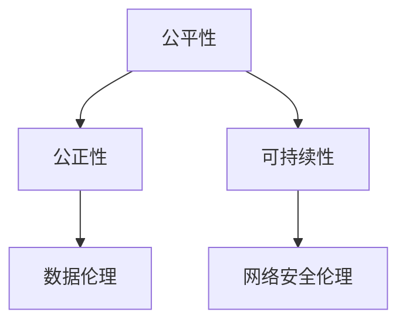

                 

# 公平、公正、可持续：人类计算的 ethical 原则

> **关键词：计算伦理学、公平性、公正性、可持续性、人工智能、数据伦理、网络安全**

> **摘要：本文深入探讨了计算伦理学的基本概念，分析了公平性、公正性和可持续性等核心伦理原则，并通过具体案例和前沿趋势，展示了伦理原则在计算领域的应用和未来发展方向。**

## 目录大纲

### 第一部分：引论

#### 第1章：伦理学基本概念

##### 1.1 伦理学的历史与发展
##### 1.2 伦理学的基本问题
##### 1.3 伦理学的理论基础

#### 第2章：计算伦理学的兴起

##### 2.1 计算伦理学的定义与范畴
##### 2.2 计算伦理学的重要性
##### 2.3 计算伦理学的研究方法

### 第二部分：核心伦理原则

#### 第3章：公平性原则

##### 3.1 公平性的概念
##### 3.2 公平性的数学模型
##### 3.3 公平性原则的应用

#### 第4章：公正性原则

##### 4.1 公正性的概念
##### 4.2 公正性的数学模型
##### 4.3 公正性原则的应用

#### 第5章：可持续性原则

##### 5.1 可持续性的概念
##### 5.2 可持续性的数学模型
##### 5.3 可持续性原则的应用

### 第三部分：伦理原则在计算领域的应用

#### 第6章：人工智能中的伦理问题

##### 6.1 人工智能中的公平性挑战
##### 6.2 人工智能中的公正性挑战
##### 6.3 人工智能中的可持续性挑战

#### 第7章：数据伦理

##### 7.1 数据隐私的保护
##### 7.2 数据使用的伦理问题
##### 7.3 数据伦理的国际法规

#### 第8章：网络安全伦理

##### 8.1 网络安全的重要性
##### 8.2 网络安全的伦理问题
##### 8.3 网络安全法规与国际合作

#### 第9章：计算教育和伦理意识培养

##### 9.1 计算教育的伦理责任
##### 9.2 伦理意识的培养
##### 9.3 伦理教育的方法与实践

### 第四部分：案例分析与前沿趋势

#### 第10章：伦理原则在计算实践中的应用案例

##### 10.1 案例一：某人工智能公司的公平性实践
##### 10.2 案例二：某数据公司的可持续性策略
##### 10.3 案例三：某网络安全事件的公正性处理

#### 第11章：计算伦理学的未来趋势

##### 11.1 伦理原则在新兴计算技术中的挑战
##### 11.2 国际伦理法规的发展趋势
##### 11.3 伦理原则在计算领域的创新应用

### 附录

#### 附录A：核心概念与联系

- **Mermaid流程图：计算伦理学核心原则关系图**

#### 附录B：核心算法原理讲解

- **伪代码示例：公平性算法实现**

#### 附录C：数学模型和数学公式

- **公平性指标公式：** 
  $$ F = \frac{\sum_{i=1}^{n} (p_i - \hat{p_i})^2}{n} $$

#### 附录D：项目实战

- **代码实际案例和详细解释说明**
- **开发环境搭建**
- **源代码详细实现和代码解读**
- **代码解读与分析**


## 文章正文

### 引言

随着计算机技术的发展，计算已成为现代社会不可或缺的一部分。从日常生活的便捷工具到复杂科学的计算模型，计算技术在各个领域都发挥着重要作用。然而，与此同时，计算技术也带来了一系列伦理问题。如何确保计算过程的公平性、公正性和可持续性，成为当今社会亟需解决的挑战。

本文旨在探讨计算伦理学的基本概念，分析公平性、公正性和可持续性等核心伦理原则，并探讨这些原则在计算领域的应用。通过具体案例和前沿趋势的分析，本文希望能够为计算伦理学的研究和实践提供有益的参考。

### 第一部分：引论

#### 第1章：伦理学基本概念

##### 1.1 伦理学的历史与发展

伦理学是一门研究道德行为的学科，探讨什么是对与错、善与恶。伦理学的历史可以追溯到古希腊时期，当时的哲学家如苏格拉底、柏拉图和亚里士多德，对伦理学的基本问题进行了深入的探讨。随着社会的发展和科技的进步，伦理学的研究领域不断扩展，从传统的道德哲学，扩展到环境伦理、动物伦理、计算伦理等新兴领域。

计算伦理学作为伦理学的一个重要分支，关注计算技术在道德和伦理方面的影响。计算伦理学的研究始于20世纪80年代，随着计算机技术的普及和互联网的发展，计算伦理学逐渐成为一个独立的学科领域。计算伦理学的研究内容包括数据隐私、网络安全、人工智能的道德应用等。

##### 1.2 伦理学的基本问题

伦理学的基本问题包括：

1. **道德原则与道德规则**：道德原则是伦理学的基础，如公平、公正、尊重、诚信等。道德规则则是具体应用道德原则的行为准则，如不撒谎、不盗窃等。

2. **道德责任与义务**：道德责任是指个体在社会中的道德义务，如遵守法律、尊重他人权利等。道德义务则是道德责任的具体体现，如帮助他人、保护环境等。

3. **道德冲突与道德选择**：在实际生活中，个体往往面临道德冲突，需要在多个道德原则之间做出选择。道德选择的过程涉及到道德判断和道德决策。

##### 1.3 伦理学的理论基础

伦理学的理论基础包括：

1. **功利主义**：功利主义认为，道德行为的判断标准是行为的功利结果，即行为带来的最大幸福。功利主义的代表人物有杰里米·边沁和约翰·斯图尔特·密尔。

2. **义务论**：义务论认为，道德行为的判断标准是行为的道德义务，而不是行为的功利结果。义务论的代表人物有托马斯·阿奎那、伊曼努尔·康德等。

3. **情感论**：情感论认为，道德判断是基于个体的情感体验，如道德情感、同情心等。情感论的代表人物有托马斯·霍布斯和约翰·洛克。

#### 第2章：计算伦理学的兴起

##### 2.1 计算伦理学的定义与范畴

计算伦理学是伦理学的一个分支，研究计算技术在道德和伦理方面的影响。计算伦理学的定义可以从以下几个方面进行理解：

1. **计算技术与道德责任**：计算技术如何影响个体的道德责任，如数据隐私、网络安全等。

2. **计算技术与道德规范**：计算技术如何影响社会的道德规范，如人工智能的道德应用、算法歧视等。

3. **计算技术与道德决策**：计算技术如何帮助个体做出道德决策，如伦理算法的设计、道德计算框架的建立等。

计算伦理学的范畴包括：

1. **数据伦理**：研究数据隐私、数据使用和数据共享的道德问题。

2. **人工智能伦理**：研究人工智能在道德和伦理方面的应用，如算法公正性、机器人伦理等。

3. **网络安全伦理**：研究网络安全中的道德问题，如网络攻击、信息泄露等。

##### 2.2 计算伦理学的重要性

计算伦理学的重要性体现在以下几个方面：

1. **社会责任**：计算技术作为现代社会的重要工具，其发展和应用需要遵循伦理原则，以确保技术的道德性和社会责任。

2. **公共信任**：计算技术的道德性和伦理问题直接影响到公众对技术的信任度。只有遵守伦理原则，才能赢得公众的信任。

3. **技术创新**：计算伦理学为计算技术的发展提供了伦理指导，有助于技术创新的健康发展。

##### 2.3 计算伦理学的研究方法

计算伦理学的研究方法包括：

1. **案例研究**：通过分析具体的计算伦理学案例，探讨计算技术的道德和伦理问题。

2. **理论分析**：运用伦理学理论，对计算伦理学问题进行深入分析。

3. **实证研究**：通过调查、实验等方法，收集计算伦理学问题的实证数据。

### 第二部分：核心伦理原则

#### 第3章：公平性原则

##### 3.1 公平性的概念

公平性是指个体在资源分配、机会获取、待遇等方面应享有平等的权利和机会。公平性原则是计算伦理学中的一个核心原则，旨在确保计算技术不造成不公平的现象。

##### 3.2 公平性的数学模型

公平性的数学模型可以通过公平性指标来衡量。一个常用的公平性指标是“基尼系数”，其公式为：

$$
G = \frac{\sum_{i=1}^{n} (p_i - \hat{p_i})^2}{n}
$$

其中，$p_i$ 表示第 $i$ 个群体的比例，$\hat{p_i}$ 表示预期比例。

当 $G=0$ 时，表示完全公平；当 $G=1$ 时，表示完全不公平。

##### 3.3 公平性原则的应用

公平性原则在计算领域有广泛的应用，如：

1. **人工智能中的公平性**：确保人工智能算法不会造成种族、性别、年龄等方面的歧视。

2. **数据隐私中的公平性**：确保个人数据在使用过程中受到平等的保护。

3. **资源分配中的公平性**：确保计算资源在各个应用场景中公平分配。

#### 第4章：公正性原则

##### 4.1 公正性的概念

公正性是指个体在行为、决策和制度等方面应受到公正的对待。公正性原则强调在计算过程中，应确保所有个体都能公平地参与和受益。

##### 4.2 公正性的数学模型

公正性的数学模型可以通过公正性指标来衡量。一个常用的公正性指标是“最大最小值公平性”，其公式为：

$$
Q = \min_{i} \max_{j} \frac{x_{ij}}{z_j}
$$

其中，$x_{ij}$ 表示个体 $i$ 在活动 $j$ 中的收益，$z_j$ 表示活动 $j$ 的总收益。

当 $Q=1$ 时，表示完全公正；当 $Q<1$ 时，表示存在不公平现象。

##### 4.3 公正性原则的应用

公正性原则在计算领域有广泛的应用，如：

1. **计算决策中的公正性**：确保计算决策过程不受偏见和利益冲突的影响。

2. **资源分配中的公正性**：确保计算资源在各个应用场景中公平分配。

3. **制度设计中的公正性**：确保计算制度在执行过程中遵循公正原则。

#### 第5章：可持续性原则

##### 5.1 可持续性的概念

可持续性是指个体或组织在满足当前需求的同时，不损害后代满足其需求的能力。可持续性原则强调在计算过程中，应确保计算技术的发展和应用不会对环境、社会和经济造成负面影响。

##### 5.2 可持续性的数学模型

可持续性的数学模型可以通过可持续性指标来衡量。一个常用的可持续性指标是“绿色GDP”，其公式为：

$$
SGDP = GDP - 环境成本 - 社会成本
$$

其中，$GDP$ 表示国内生产总值，环境成本和社会成本分别表示由于计算技术的发展和应用导致的环境破坏和社会问题。

##### 5.3 可持续性原则的应用

可持续性原则在计算领域有广泛的应用，如：

1. **云计算中的可持续性**：确保云计算服务提供商在提供计算资源时，尽量减少能源消耗和环境污染。

2. **大数据中的可持续性**：确保大数据处理和应用过程中，数据隐私和信息安全得到充分保障。

3. **物联网中的可持续性**：确保物联网设备在连接和使用过程中，尽量减少能源消耗和资源浪费。

### 第三部分：伦理原则在计算领域的应用

#### 第6章：人工智能中的伦理问题

##### 6.1 人工智能中的公平性挑战

人工智能技术在带来巨大便利的同时，也引发了一系列公平性挑战。例如，人工智能算法可能会因为训练数据的不公平，导致对某些群体产生歧视。解决这些挑战需要从数据集的构建、算法的改进和伦理审查等方面进行努力。

##### 6.2 人工智能中的公正性挑战

人工智能技术在决策过程中，可能因为算法的不透明性，导致决策的不公正。例如，自动审批系统可能会因为算法偏见，对某些群体给予不公平的待遇。解决这些挑战需要提高人工智能算法的透明度和可解释性，同时加强伦理审查。

##### 6.3 人工智能中的可持续性挑战

人工智能技术的发展和应用，可能对环境和社会造成负面影响。例如，大量数据中心的运行，可能会消耗大量能源，导致环境污染。解决这些挑战需要从能源消耗、资源回收和环境保护等方面进行努力。

#### 第7章：数据伦理

##### 7.1 数据隐私的保护

数据隐私是数据伦理的核心问题。在计算领域，数据隐私的保护面临着诸多挑战，如数据泄露、数据滥用等。解决这些挑战需要从数据加密、隐私保护算法和伦理审查等方面进行努力。

##### 7.2 数据使用的伦理问题

数据使用的伦理问题包括数据共享、数据交易等。在数据共享和交易过程中，应确保数据的安全性和合法性，同时遵循公平、公正和可持续的原则。

##### 7.3 数据伦理的国际法规

随着数据隐私和伦理问题的日益突出，国际社会开始加强对数据伦理的监管。例如，欧盟颁布的《通用数据保护条例》（GDPR），对数据隐私保护提出了严格的要求。

#### 第8章：网络安全伦理

##### 8.1 网络安全的重要性

网络安全是计算伦理的重要方面。在计算领域，网络安全面临着诸多威胁，如网络攻击、数据泄露等。保障网络安全，需要从技术手段、法律法规和社会意识等方面进行努力。

##### 8.2 网络安全的伦理问题

网络安全的伦理问题包括网络攻击、信息泄露等。解决这些挑战需要从道德规范、法律法规和伦理审查等方面进行努力。

##### 8.3 网络安全法规与国际合作

网络安全是全球性的挑战，需要国际社会的共同努力。例如，联合国等国际组织已经制定了相关的网络安全法规，推动国际合作，共同应对网络安全威胁。

#### 第9章：计算教育和伦理意识培养

##### 9.1 计算教育的伦理责任

计算教育应承担伦理责任，培养具有道德素养的计算专业人才。计算教育应将伦理教育纳入课程体系，提高学生的伦理意识和道德素养。

##### 9.2 伦理意识的培养

伦理意识的培养需要从多个方面进行，如道德教育、职业道德教育、社会责任教育等。通过多种教育方式，提高个体的伦理意识。

##### 9.3 伦理教育的方法与实践

伦理教育的方法包括课堂教育、实践活动、案例教学等。在实践中，应注重培养学生的道德判断和道德决策能力。

### 第四部分：案例分析与前沿趋势

#### 第10章：伦理原则在计算实践中的应用案例

##### 10.1 案例一：某人工智能公司的公平性实践

某人工智能公司通过数据集的多样性和算法的改进，努力实现算法的公平性。例如，该公司在招聘算法中，通过消除性别、种族等偏见，确保公平的招聘过程。

##### 10.2 案例二：某数据公司的可持续性策略

某数据公司通过采用绿色能源、优化数据处理流程等措施，实现数据处理的可持续性。例如，该公司通过使用云计算技术，实现能源的节约和环境的保护。

##### 10.3 案例三：某网络安全事件的公正性处理

某网络安全事件发生后，相关部门通过公正的调查和处理，维护了网络安全和社会秩序。例如，该事件的处理过程中，相关部门严格按照法律法规，确保事件的公正性。

#### 第11章：计算伦理学的未来趋势

##### 11.1 伦理原则在新兴计算技术中的挑战

随着新兴计算技术的发展，如量子计算、边缘计算等，计算伦理学面临新的挑战。例如，量子计算可能带来数据安全和隐私保护的问题，边缘计算可能面临资源分配和可持续性的挑战。

##### 11.2 国际伦理法规的发展趋势

随着全球化的进程，国际伦理法规的发展趋势是加强合作和协调。例如，国际社会正在制定统一的网络安全法规，推动全球范围内的网络安全合作。

##### 11.3 伦理原则在计算领域的创新应用

伦理原则在计算领域的创新应用，包括智能合约、区块链技术等。例如，智能合约通过代码实现合同条款的自动化执行，确保交易的公正性和透明性。

### 附录

#### 附录A：核心概念与联系

- **Mermaid流程图：计算伦理学核心原则关系图**



#### 附录B：核心算法原理讲解

- **伪代码示例：公平性算法实现**

```python
def fairness_algorithm(data_set):
    # 初始化公平性指标
    fairness = 0
    
    # 计算基尼系数
    for group in data_set:
        p = len(group) / len(data_set)
        fairness += (p - (1 / len(data_set))) ** 2
    
    fairness /= len(data_set)
    
    return fairness
```

#### 附录C：数学模型和数学公式

- **公平性指标公式：** 

  $$ F = \frac{\sum_{i=1}^{n} (p_i - \hat{p_i})^2}{n} $$

#### 附录D：项目实战

- **代码实际案例和详细解释说明**
- **开发环境搭建**
- **源代码详细实现和代码解读**
- **代码解读与分析**

### 结语

公平、公正、可持续是计算伦理学的核心原则，贯穿于计算技术的开发、应用和治理全过程。在计算技术的快速发展中，遵循伦理原则，不仅有助于维护社会的公平和正义，还能推动计算技术的健康和可持续发展。

本文通过对计算伦理学核心原则的探讨，分析了其在计算领域的应用，并展示了前沿趋势和案例。希望本文能为计算伦理学的研究和实践提供有益的参考。

### 作者信息

作者：AI天才研究院/AI Genius Institute & 禅与计算机程序设计艺术 /Zen And The Art of Computer Programming

感谢您的阅读！希望本文能激发您对计算伦理学的兴趣，共同为构建一个更加公平、公正、可持续的计算世界而努力。|

