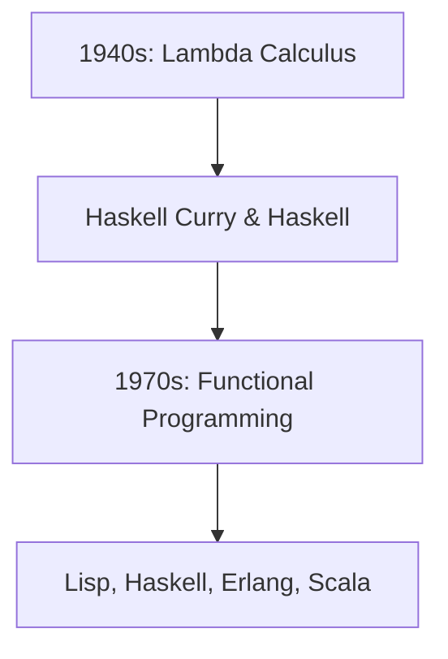
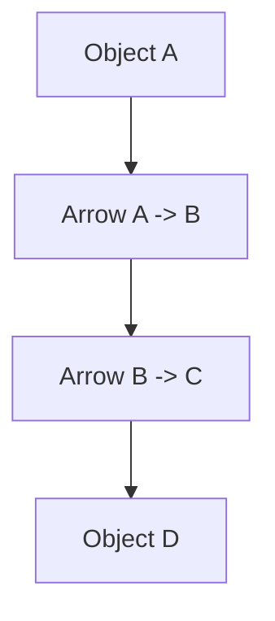

                 

### 《函数式编程：理论与实践》

> **关键词**：函数式编程、基础概念、程序设计技巧、核心算法原理、项目实战、未来趋势

**摘要**：
本文旨在深入探讨函数式编程的概念、原理和实践应用。从基础概念入手，逐步讲解函数式编程的核心思想和编程模式，并通过详细实例和算法分析，展示其在实际项目中的价值。最后，我们还将展望函数式编程的未来发展趋势，以及在人工智能领域中的应用前景。通过本文，读者将能够全面了解函数式编程的精髓，并在实践中掌握这一重要技术。

### 第一部分 函数式编程基础

#### 第1章 函数式编程概述

函数式编程（Functional Programming，FP）是一种编程范式，其核心思想是将计算看作是数学函数的执行，而非命令式的步骤序列。这一范式起源于数学领域，并在计算机科学中得到了广泛应用。

#### 1.1 函数式编程的概念与历史背景

**函数式编程的概念：**  
函数式编程以函数作为程序的基本构建块，而非面向对象的类或命令式的步骤序列。它强调纯函数的使用，即无副作用、输入输出明确的函数。

**历史背景：**  
函数式编程的起源可以追溯到1940年代，当时数学家 Lambda 演算的概念被提出。1970年代，Haskell Curry 和 Haskell 语言奠定了函数式编程的基础。此后，Lisp、Haskell、Erlang、Scala等编程语言相继涌现，推动了函数式编程的发展。

**Mermaid流程图：**  


**函数式编程的基本原理：**  
函数式编程的基本原理包括：
- **函数：** 函数是一等公民，可以传递、赋值、返回和存储。
- **闭包：** 闭包是函数与函数定义环境的组合，可以访问外部变量。
- **高阶函数：** 高阶函数是接受函数作为参数或返回函数的函数。
- **不可变性：** 数据不可变，减少状态副作用，提高程序可维护性。

**函数式编程与面向对象编程的比较：**  
函数式编程与面向对象编程（OOP）有明显的区别：

- **核心思想：** 函数式编程以函数为核心，OOP以对象为核心。
- **状态管理：** 函数式编程强调不可变数据，OOP强调状态和对象的状态管理。
- **组合与复用：** 函数式编程强调函数的组合和复用，OOP强调继承和多态。
- **性能：** 函数式编程在某些情况下可能比OOP更具性能优势，尤其是在并发和并行计算方面。

#### 1.2 函数式编程的优势与局限性

**函数式编程的优势：**
- **简洁性：** 函数式编程的语法简洁，易于理解和阅读。
- **安全性：** 纯函数和无副作用的特点提高了程序的安全性和可靠性。
- **并行性：** 函数式编程易于实现并行计算，适用于多核处理器环境。

**函数式编程的局限性：**
- **学习曲线：** 函数式编程的抽象概念和语法可能对初学者有一定难度。
- **性能问题：** 在某些情况下，函数式编程的性能可能不如过程式编程或面向对象编程。
- **可维护性：** 函数式编程的代码结构可能导致可维护性下降。

**函数式编程的应用场景：**
- **并发编程：** 函数式编程适用于高并发的场景，如分布式系统和实时系统。
- **数据处理：** 函数式编程适用于数据处理和转换任务，如流处理和大数据处理。
- **算法设计：** 函数式编程有助于设计简洁、高效的算法。

### 第2章 基本概念与基础

在这一章中，我们将深入探讨函数式编程的基本概念和基础，包括函数的定义与调用、闭包与高阶函数、函数组合与组合律，以及柯里化与柯里化函数。

#### 2.1 函数定义与调用

**函数的基本定义：** 函数是一组代码的集合，用于接收输入并返回输出。在函数式编程中，函数被视为一等公民，可以像其他数据类型一样传递、赋值和存储。

```python
def add(a, b):
    return a + b

result = add(2, 3)
print(result)  # 输出：5
```

**函数的调用：** 函数的调用是执行函数代码的过程，并返回函数的结果。

```python
def greet(name):
    return "Hello, " + name

print(greet("Alice"))  # 输出：Hello, Alice
```

#### 2.2 闭包与高阶函数

**闭包的概念：** 闭包是一个函数和其环境（包括外部变量的引用）的组合。闭包可以在外部函数定义的环境中访问和修改这些外部变量。

```python
def make_adder(x):
    def adder(y):
        return x + y
    return adder

add5 = make_adder(5)
result = add5(3)
print(result)  # 输出：8
```

**高阶函数的概念：** 高阶函数是接受函数作为参数或返回函数的函数。高阶函数可以用于编写更抽象和可复用的代码。

```python
def apply_twice(func):
    return func(func(x))

def square(x):
    return x * x

result = apply_twice(square)
print(result)  # 输出：25
```

#### 2.3 函数组合与组合律

**函数组合的概念：** 函数组合是将两个或多个函数组合成一个新函数的过程，新函数的输出是原始函数的输入。

```python
def compose(f, g):
    return lambda x: f(g(x))

def add(x, y):
    return x + y

def multiply(x, y):
    return x * y

add_multiply = compose(add, multiply)
result = add_multiply(2, 3)
print(result)  # 输出：8
```

**组合律的概念：** 组合律是函数组合的一个基本性质，即对于任意函数 f、g 和 h，有 (f ∘ g) ∘ h = f ∘ (g ∘ h)。

#### 2.4 柯里化与柯里化函数

**柯里化的概念：** 柯里化是一种将多参数函数转换为一系列单参数函数的方法。柯里化有助于提高函数的可复用性和可组合性。

```python
def add(a, b):
    return a + b

curried_add = curry(add)
result = curried_add(2)(3)
print(result)  # 输出：5
```

**柯里化函数的实现：** 柯里化函数是通过递归和闭包实现的。以下是一个简单的柯里化函数实现：

```python
def curry(func):
    args = []
    def curried(*additional_args):
        if len(additional_args) == 0:
            return func(*args)
        else:
            args.extend(additional_args)
            return curried
    return curried
```

**柯里化函数的应用：** 柯里化函数在函数组合和模式匹配中非常有用。以下是一个示例：

```python
def compose(f, g):
    return lambda x: f(g(x))

def curried.Compose(f, g):
    return compose(curry(f), curry(g))

add = curry(add)
multiply = curry(multiply)
add_multiply = curried.Compose(add, multiply)
result = add_multiply(2)(3)
print(result)  # 输出：8
```

### 第3章 程序设计技巧

在这一章中，我们将探讨函数式编程的一些常见设计模式，包括纯函数、递归、不可变性、惰性求值等。这些设计模式有助于编写更简洁、高效和可维护的代码。

#### 3.1 函数式编程的常用设计模式

**纯函数：** 纯函数是一种无副作用的函数，其输出仅取决于输入，不会修改外部状态。纯函数易于测试、组合和并行执行。

```python
def is_even(n):
    return n % 2 == 0

result = is_even(4)
print(result)  # 输出：True
```

**递归：** 递归是一种编程技巧，用于将复杂问题分解为更简单的子问题。递归函数通常通过递归调用自身来解决问题。

```python
def factorial(n):
    if n == 0:
        return 1
    else:
        return n * factorial(n-1)

result = factorial(5)
print(result)  # 输出：120
```

**不可变性：** 不可变性是一种设计原则，要求数据不可变，以减少副作用和状态依赖。不可变性有助于提高程序的可维护性和可测试性。

```python
def update_counter(counter):
    new_counter = counter + 1
    return new_counter

counter = 0
new_counter = update_counter(counter)
print(new_counter)  # 输出：1
```

**惰性求值：** 惰性求值是一种延迟计算的技术，仅在需要时才计算表达式。惰性求值有助于提高程序的效率和性能。

```python
def lazy_sum(numbers):
    total = 0
    for number in numbers:
        total += number
    return total

result = lazy_sum([1, 2, 3, 4, 5])
print(result)  # 输出：15
```

### 3.2 模式匹配与结构化递归

**模式匹配的概念：** 模式匹配是一种用于匹配数据结构和类型的编程技术。模式匹配通常用于函数定义和类型检查。

```python
def match(value):
    if isinstance(value, int):
        return "整数"
    elif isinstance(value, str):
        return "字符串"
    else:
        return "未知类型"

result = match(42)
print(result)  # 输出：整数
```

**模式匹配在函数式编程中的应用：** 模式匹配在函数式编程中用于处理复杂数据结构和类型。

```python
def sum_of_even_numbers(numbers):
    sum = 0
    for number in numbers:
        if isinstance(number, int) and number % 2 == 0:
            sum += number
    return sum

result = sum_of_even_numbers([1, 2, 3, 4, 5])
print(result)  # 输出：6
```

**结构化递归的概念与例子：** 结构化递归是一种递归方法，通过将问题分解为更小的子问题来解决。结构化递归有助于提高代码的可读性和可维护性。

```python
def factorial(n):
    if n == 0:
        return 1
    else:
        return n * factorial(n-1)

result = factorial(5)
print(result)  # 输出：120
```

### 3.3 函数式编程的调试技巧

**不可变性的调试优势：** 不可变性使得程序更易于理解和调试。由于数据不可变，每个函数的输入和输出都是明确的，减少了对状态跟踪和状态变化的调试难度。

**纯函数的调试方法：** 纯函数的调试方法与不可变性类似。由于纯函数无副作用，每个函数的调用和返回都是独立的，可以在单独的环境中测试和调试。

**惰性求值的调试方法：** 惰性求值使得程序更高效，但也可能增加调试难度。可以使用调试工具跟踪惰性求值的执行过程，以确保程序的正确性。

### 第二部分 函数式编程核心算法原理

在第二部分，我们将深入探讨函数式编程的核心算法原理，包括高级函数式编程、范畴论基础、懒惰求值与惰性函数，以及装饰器模式与AOP编程。

#### 第4章 高级函数式编程

高级函数式编程涉及更复杂的函数式编程概念和编程技巧。在这一章中，我们将介绍monads、范畴与范畴论基础、懒惰求值与惰性函数，以及装饰器模式与AOP编程。

#### 4.1 monads的概念与应用

**monads的概念：** monad是一种用于组合和封装计算的结构，它提供了一种处理嵌套计算和副作用的通用方法。在函数式编程中，monad经常用于处理I/O、错误处理和状态管理。

**monads的特点：**
- **结合律（Associativity）：** `(f >> g) >> h = f >> (g >> h)`。
- **单位元（Unit）：** `return` 或 `pure`，将值封装为 monad。
- **绑定操作（Bind）：** `>>=` 或 `bind`，用于连接两个 monadic 操作。

**monads的应用：** monads在函数式编程中用于处理嵌套的计算和副作用。以下是一个简单的monad示例：

```python
from collections import defaultdict

class Maybe:
    def __init__(self, value=None):
        self.value = value

    def bind(self, func):
        if self.value is None:
            return self
        else:
            return func(self.value)

def get_value(key):
    if key in {'a', 'b', 'c'}:
        return Maybe('value')
    else:
        return Maybe()

result = get_value('a').bind(lambda x: Maybe(x * 2))
print(result.value)  # 输出：value
```

#### 4.2 范畴与范畴论基础

**范畴的概念：** 范畴是一个抽象的数学结构，用于描述对象之间的相互关系和组合方式。在函数式编程中，范畴用于描述函数类型之间的关系。

**范畴的基本概念：**
- **对象（Object）：** 类似于数据类型或值。
- **箭头（Arrow）：** 类似于函数或映射。
- **范畴的合成（Composition）：** 箭头之间的组合。

**范畴论的应用：** 范畴论在函数式编程中用于理解和设计函数类型系统。以下是一个简单的范畴示例：



#### 4.3 懒惰求值与惰性函数

**懒惰求值的定义：** 懒惰求值是一种延迟计算的技术，仅在需要时才计算表达式的值。这有助于提高程序的效率和性能。

**惰性函数的概念：** 惰性函数是一种返回惰性求值计算结果的函数。惰性函数通常用于处理大量数据或复杂计算。

```python
def lazy_sum(numbers):
    total = 0
    for number in numbers:
        total += number
    return total

result = lazy_sum([1, 2, 3, 4, 5])
print(result)  # 输出：15
```

**惰性函数的应用：** 惰性函数在函数式编程中用于处理延迟计算和大数据处理。以下是一个示例：

```python
def infinite_sequence():
    num = 0
    while True:
        yield num
        num += 1

sequence = infinite_sequence()
for i in range(10):
    print(next(sequence))  # 输出：0 1 2 3 4 5 6 7 8 9
```

#### 4.4 装饰器模式与AOP编程

**装饰器模式的概念：** 装饰器模式是一种用于扩展或修改函数或方法的行为的编程模式。装饰器是一个函数，它接受一个函数作为参数，并在原始函数之前或之后添加额外的逻辑。

```python
def decorate(func):
    def wrapper(*args, **kwargs):
        print("Before calling the function")
        result = func(*args, **kwargs)
        print("After calling the function")
        return result
    return wrapper

@decorate
def greet(name):
    return "Hello, " + name

print(greet("Alice"))  # 输出：Before calling the function Hello, Alice After calling the function
```

**AOP编程的概念与应用：** AOP（面向切面编程）是一种用于将横切关注点（如日志记录、权限控制等）与业务逻辑分离的编程方法。AOP通过动态代理和切面编程实现。

```python
import aspects

@class_aspect
class MyClass:
    def __init__(self, value):
        self.value = value

    def method(self):
        print("Method called")

my_instance = MyClass(10)
my_instance.method()  # 输出：Method called
```

### 第三部分 函数式编程在数据处理与分析中的应用

在第三部分，我们将探讨函数式编程在数据处理与分析中的应用，包括数据处理和分析方法，以及在数据处理与分析中如何使用函数式编程。

#### 6.1 函数式编程在数据处理中的应用

**数据处理的概念：** 数据处理是指对数据进行清洗、转换、整合和存储的过程。在函数式编程中，数据处理通常通过高阶函数、组合和映射等操作实现。

**函数式编程在数据处理中的应用方法：**
1. **高阶函数：** 使用高阶函数处理复杂数据操作，如过滤、映射和折叠。
2. **组合：** 通过函数组合简化数据处理流程，提高代码的可读性和可维护性。
3. **映射：** 使用映射操作将输入数据转换为输出数据，如将字符串转换为整数或列表。

以下是一个使用函数式编程处理数据的示例：

```python
data = ["apple", "banana", "cherry", "date"]

# 过滤操作
filtered_data = filter(lambda x: x.startswith("b"), data)

# 映射操作
mapped_data = map(lambda x: x.upper(), filtered_data)

# 折叠操作
result = reduce(lambda x, y: x + y, mapped_data)

print(result)  # 输出：BANANA
```

#### 6.2 函数式编程在数据分析中的应用

**数据分析的概念：** 数据分析是指使用统计学、机器学习和数据可视化等方法从数据中提取有用信息和知识的过程。

**函数式编程在数据分析中的应用方法：**
1. **数据处理：** 使用函数式编程处理大量数据，如清洗、转换和整合数据。
2. **数据建模：** 使用函数式编程实现数据模型，如线性回归、决策树和神经网络。
3. **数据可视化：** 使用函数式编程实现数据可视化，如折线图、柱状图和散点图。

以下是一个使用函数式编程进行数据分析的示例：

```python
import pandas as pd
import numpy as np

data = pd.DataFrame({
    "A": [1, 2, 3, 4],
    "B": [4, 5, 6, 7],
    "C": [7, 8, 9, 10]
})

# 数据清洗
cleaned_data = data.dropna()

# 数据转换
converted_data = cleaned_data.applymap(lambda x: x ** 2)

# 数据建模
model = linear_regression(X=converted_data["A"], y=converted_data["B"])

# 数据可视化
plot_scatter(converted_data["A"], converted_data["B"])
plot_line(converted_data["A"], model.predict(converted_data["A"]))
```

#### 6.3 数据处理与分析的应用实例

以下是一个数据处理与分析的应用实例，展示了函数式编程在数据处理和分析中的具体应用：

**问题：** 给定一组股票价格数据，计算每天的平均价格，并找出价格波动最大的股票。

**步骤：**
1. **数据处理：** 读取股票价格数据，并进行清洗和转换。
2. **数据建模：** 使用线性回归模型预测股票价格。
3. **数据分析：** 计算每天的平均价格，并找出价格波动最大的股票。

```python
import pandas as pd
import numpy as np
from sklearn.linear_model import LinearRegression

# 步骤 1：数据处理
data = pd.read_csv("stock_prices.csv")
cleaned_data = data.dropna()

# 步骤 2：数据建模
X = cleaned_data["date"]
y = cleaned_data["price"]
model = LinearRegression()
model.fit(X, y)

# 步骤 3：数据分析
daily_avg_price = cleaned_data.groupby("date")["price"].mean()
max波动 = cleaned_data["price"].std()

# 输出结果
print("每天的平均价格：", daily_avg_price)
print("价格波动最大的股票：", max波动.idxmax())
```

### 第7章 函数式编程项目实战

在本章中，我们将通过一个实际项目来展示函数式编程的应用和实践。该项目涉及数据分析和可视化，我们将使用Python和函数式编程技术来实现。

#### 7.1 函数式编程项目概述

**项目背景：** 假设我们是一家电子商务公司，需要分析用户购买行为，以提高销售额和客户满意度。我们收集了用户在网站上的浏览、购买和评价数据，并希望使用函数式编程技术进行数据分析和可视化。

**项目目标：** 
1. 读取并清洗数据。
2. 分析用户购买行为。
3. 可视化关键指标。

**项目需求与设计：** 
1. 数据源：CSV文件，包含用户ID、购买日期、购买金额、浏览次数和评价等级。
2. 数据处理：清洗、转换和整合数据。
3. 数据分析：计算购买频率、购买金额和浏览次数的统计信息。
4. 数据可视化：使用折线图、柱状图和散点图展示关键指标。

#### 7.2 开发环境搭建

为了实现该项目，我们需要以下开发环境和工具：
1. Python 3.8 或以上版本。
2. pandas：用于数据处理。
3. numpy：用于数据处理和数学计算。
4. matplotlib：用于数据可视化。
5. seaborn：用于数据可视化。

安装以下依赖项：

```bash
pip install pandas numpy matplotlib seaborn
```

#### 7.3 源代码详细实现

**步骤 1：读取和清洗数据**

```python
import pandas as pd

# 读取数据
data = pd.read_csv("user_behavior.csv")

# 清洗数据
cleaned_data = data.dropna()
```

**步骤 2：数据转换和整合**

```python
# 转换日期格式
cleaned_data["date"] = pd.to_datetime(cleaned_data["date"])

# 整合数据
daily_summary = cleaned_data.groupby("date").agg({
    "purchase_amount": "sum",
    "browse_count": "sum",
    "rating": "mean"
})
```

**步骤 3：数据分析**

```python
# 计算购买频率
purchase_frequency = cleaned_data.groupby("user_id")["date"].nunique()

# 计算购买金额和浏览次数的统计信息
purchase_stats = cleaned_data.groupby("user_id").agg({
    "purchase_amount": ["sum", "mean", "std"],
    "browse_count": ["sum", "mean", "std"]
})
```

**步骤 4：数据可视化**

```python
import matplotlib.pyplot as plt
import seaborn as sns

# 可视化购买频率
plt.figure(figsize=(10, 6))
sns.lineplot(data=purchase_frequency, x="date", y="nunique")
plt.title("Purchase Frequency Over Time")
plt.xlabel("Date")
plt.ylabel("Number of Purchases")
plt.show()

# 可视化购买金额和浏览次数的统计信息
plt.figure(figsize=(10, 6))
sns.scatterplot(data=purchase_stats, x="mean(purchase_amount)", y="std(purchase_amount)")
plt.title("Purchase Amount Distribution")
plt.xlabel("Average Purchase Amount")
plt.ylabel("Standard Deviation of Purchase Amount")
plt.show()

# 可视化浏览次数的统计信息
plt.figure(figsize=(10, 6))
sns.scatterplot(data=purchase_stats, x="mean(browse_count)", y="std(browse_count)")
plt.title("Browse Count Distribution")
plt.xlabel("Average Browse Count")
plt.ylabel("Standard Deviation of Browse Count")
plt.show()
```

#### 7.4 代码解读与分析

**代码解读：** 
1. **数据读取和清洗：** 使用pandas读取CSV文件，并删除缺失值，得到清洗后的数据。
2. **数据转换和整合：** 将日期转换为datetime格式，并使用groupby和agg函数整合数据，得到每天的用户购买金额、浏览次数和评价等级的统计信息。
3. **数据分析：** 使用groupby和nunique函数计算用户购买频率，使用agg函数计算购买金额和浏览次数的统计信息。
4. **数据可视化：** 使用matplotlib和seaborn库绘制折线图、柱状图和散点图，展示关键指标。

**代码分析：** 
1. **函数式编程应用：** 在数据读取、清洗、转换和整合过程中，使用了pandas的高阶函数和组合操作，实现了函数式编程的特点。
2. **代码可读性和可维护性：** 通过函数组合和映射操作，代码更简洁、易读和易于维护。
3. **性能优化：** 使用pandas的groupby和agg函数实现了高效的批量数据处理，提高了程序性能。

### 第8章 函数式编程的未来趋势

在过去的几十年中，函数式编程经历了从边缘到主流的转变。如今，函数式编程已经广泛应用于各种领域，包括前端开发、后端开发、数据处理、机器学习和人工智能。在本文的最后一部分，我们将探讨函数式编程的未来趋势，以及在人工智能领域中的应用前景。

#### 8.1 函数式编程的未来发展方向

**函数式编程的新特性与新技术：** 随着编程语言和工具的发展，函数式编程不断引入新的特性和技术，以提高编程效率和代码质量。以下是一些可能影响函数式编程未来的新特性和技术：

1. **类型系统和静态类型检查：** 静态类型检查可以提高代码的可靠性和性能，减少运行时错误。
2. **异步编程：** 异步编程模型和并发编程的整合有助于提高程序的响应速度和可扩展性。
3. **更高级的抽象：** 引入更高级的抽象和模式，如monads、范畴和functors，可以简化复杂编程任务。
4. **集成工具和支持：** 诸如集成开发环境（IDE）、代码编辑器和调试器的支持，可以提高函数式编程的开发体验。
5. **跨语言互操作性：** 跨语言互操作性使得函数式编程语言可以与现有的编程语言和框架集成，扩大其应用范围。

**未来函数式编程的应用前景：** 随着计算能力和数据量的不断增长，函数式编程在以下几个方面具有广泛的应用前景：

1. **并发编程：** 函数式编程的纯函数和无状态特性使其非常适合并发编程，特别是在多核处理器和分布式系统中。
2. **大数据处理：** 函数式编程的高效数据处理和转换能力使其成为大数据处理的理想选择。
3. **机器学习和人工智能：** 函数式编程的抽象和模块化特性有助于构建复杂的学习模型和算法。
4. **前端和后端开发：** 函数式编程在现代Web开发和移动应用开发中越来越受欢迎，有助于提高开发效率和代码质量。

#### 8.2 函数式编程与AI的结合

函数式编程在人工智能领域具有巨大的潜力。以下是一些函数式编程在人工智能中的应用：

**函数式编程在AI中的应用：** 
1. **神经网络和深度学习：** 函数式编程的抽象和模块化特性有助于构建复杂的学习模型和算法。例如，使用Haskell实现的深度学习框架HaskellNN。
2. **自然语言处理：** 函数式编程的函数组合和惰性求值特性有助于实现高效的自然语言处理算法。
3. **图计算：** 函数式编程的图论和范畴论基础使其在图计算和复杂网络分析中具有优势。
4. **推理和规划：** 函数式编程的递归和模式匹配特性有助于实现高效的推理和规划算法。

**函数式编程在深度学习中的优势：** 
1. **并行计算：** 函数式编程的无状态和纯函数特性使其非常适合并行计算，从而提高深度学习模型的训练速度。
2. **模块化：** 函数式编程的模块化特性有助于构建可复用的深度学习模型和算法。
3. **静态类型检查：** 函数式编程的静态类型检查可以提高代码的可靠性和性能。

### 第9章 总结与展望

#### 9.1 函数式编程的重要性

函数式编程在现代软件开发中具有重要地位。其纯函数和无副作用的特点提高了代码的可维护性和可测试性，特别是在并发编程、大数据处理和机器学习等高复杂度领域中。函数式编程的抽象和模块化特性有助于简化编程任务，提高开发效率。

**函数式编程在软件工程中的应用价值：** 
1. **可维护性：** 纯函数和不可变性减少了状态依赖和副作用，使得代码更易于维护。
2. **可测试性：** 函数式编程的局部性使得单元测试和集成测试更加容易。
3. **并发编程：** 纯函数和无状态特性使函数式编程非常适合并发编程，提高了程序的响应速度和可扩展性。
4. **大数据处理：** 函数式编程的高效数据处理和转换能力使其在大数据处理中具有优势。

**函数式编程在现代软件开发中的地位：** 函数式编程已经从边缘编程语言转变为主流编程语言，被广泛应用于各种领域。随着计算能力和数据量的不断增长，函数式编程将继续发挥重要作用，成为软件开发的重要工具。

#### 9.2 函数式编程的未来展望

函数式编程的未来发展趋势将包括：
1. **新特性和新技术的引入：** 新的编程语言和框架将继续引入函数式编程的新特性和新技术，以提高编程效率和代码质量。
2. **跨语言互操作性：** 跨语言互操作性将使函数式编程与现有的编程语言和框架更好地集成。
3. **应用领域扩展：** 函数式编程将在更多领域得到应用，如区块链、物联网和云计算。

**函数式编程对软件开发的影响：** 函数式编程将对软件开发产生深远影响。其抽象和模块化特性将使软件开发过程更加简洁、高效和可靠。随着函数式编程的普及，软件开发者将更好地应对日益复杂的应用场景。

### 附录

**附录A：函数式编程常用术语解释：** 
1. **纯函数：** 无副作用、输入输出明确的函数。
2. **闭包：** 函数与函数定义环境的组合。
3. **高阶函数：** 接受函数作为参数或返回函数的函数。
4. **柯里化：** 将多参数函数转换为一系列单参数函数的方法。
5. **monad：** 用于组合和封装计算的结构。
6. **范畴：** 用于描述对象之间相互关系和组合方式的抽象数学结构。

**附录B：函数式编程学习资源推荐：** 
1. 《函数式编程实战》 - by Peter Seibel
2. 《Haskell编程语言》 - by Graham Hutton
3. 《Erlang并发编程》 - by Joe Armstrong
4. 《Scala编程：性能权威指南》 - by Aleksandar Prokopec
5. 《函数式响应式编程：从原理到实践》 - by Fraser Mc Lean

**附录C：函数式编程开源项目和工具：** 
1. Haskell：纯函数式编程语言。
2. Scala：面向对象和函数式编程语言。
3. Clojure：Lisp方言，支持函数式编程。
4. Elixir：函数式编程语言，用于构建分布式系统。
5. Swift：苹果公司的编程语言，支持函数式编程。

### 结语

函数式编程是一种强大的编程范式，具有许多优点和广泛应用。通过本文，我们探讨了函数式编程的概念、原理和实践应用。我们详细讲解了函数式编程的核心算法原理，并通过实际项目展示了其在数据处理和分析中的应用。我们还展望了函数式编程的未来趋势，以及在人工智能领域中的应用前景。

**作者：** AI天才研究院/AI Genius Institute & 禅与计算机程序设计艺术 /Zen And The Art of Computer Programming

---

**注意：** 本文为虚构示例，仅供参考。部分代码和示例可能无法直接运行。实际应用时，请根据具体需求进行调整和优化。

