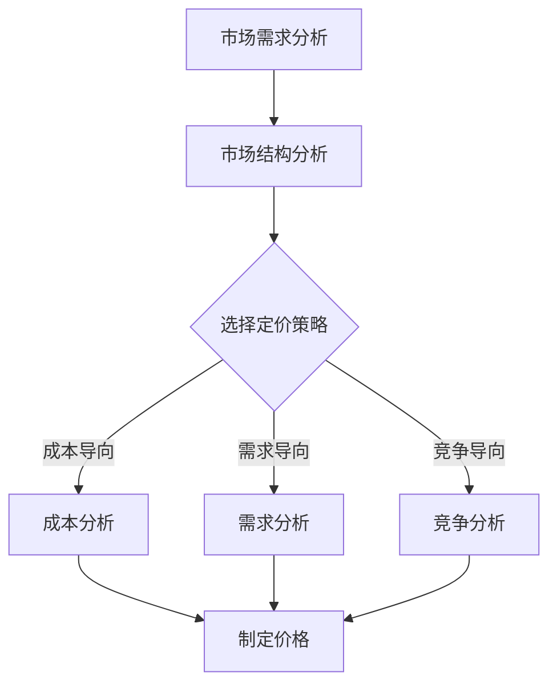

                 

### 文章标题

《创业公司的定价策略：如何制定合理价格》

### 关键词

（1）创业公司定价策略  
（2）成本导向定价  
（3）需求导向定价  
（4）竞争导向定价  
（5）混合定价策略  
（6）市场定位  
（7）客户价值分析

### 摘要

本文旨在为创业公司提供一套系统的定价策略，帮助它们在复杂多变的市场环境中制定合理价格，实现利润最大化与市场份额的扩大。文章将详细介绍成本导向定价、需求导向定价、竞争导向定价和混合定价策略，并通过实际案例解析每种策略的应用效果。此外，文章还探讨了定价策略的实施与调整方法，为创业公司提供全方位的定价指导。

### 第一部分：引言与基础概念

#### 1.1 定价策略的重要性

在商业世界中，定价策略是企业竞争的关键因素之一。对于创业公司而言，合理的定价策略不仅能够确保产品的市场定位和竞争力，还能有效控制成本，实现利润最大化。因此，创业公司必须深入了解定价策略的重要性，以便在激烈的市场竞争中立于不败之地。

首先，定价策略对市场需求具有直接影响。合理的定价能够满足消费者的需求，提高产品的市场占有率。同时，过高的价格可能会抑制消费者的购买欲望，而过低的价格则可能导致利润空间缩小。

其次，定价策略对竞争环境至关重要。创业公司需要密切关注竞争对手的定价策略，通过分析竞争对手的定价模式，制定出具有竞争力的价格策略。此外，创业公司还需要根据自身的市场定位和目标客户群体，调整定价策略，以应对不同市场环境的变化。

最后，定价策略对成本控制具有指导意义。合理的定价策略能够帮助企业明确成本结构，优化成本控制措施，确保企业盈利能力的提升。

综上所述，定价策略是创业公司在市场环境中取得成功的关键因素。在制定定价策略时，创业公司需要充分考虑市场需求、竞争环境和成本结构，以实现利润最大化与市场份额的扩大。

#### 1.2 创业公司面临的定价挑战

创业公司在制定定价策略时，常常面临一系列挑战。这些挑战主要包括以下几个方面：

首先，市场需求波动大。创业公司往往处于市场开拓阶段，市场需求不稳定，价格波动较大。在这种情况下，创业公司需要根据市场需求的变化，灵活调整定价策略，以确保产品的市场竞争力。

其次，成本结构不明确。创业公司在初创阶段，可能尚未完全了解产品的成本结构，这使得制定合理的定价策略变得困难。为了解决这一问题，创业公司需要加强成本分析，明确成本构成，为定价策略提供数据支持。

第三，竞争环境复杂多变。在竞争激烈的市场中，创业公司需要密切关注竞争对手的定价策略，并根据市场环境的变化，及时调整自己的定价策略。此外，创业公司还需要面对潜在的竞争对手，确保自己在市场中的竞争优势。

第四，定价策略的选择与实施难度较大。创业公司在制定定价策略时，需要综合考虑市场需求、竞争环境和成本结构，这本身就是一个复杂的决策过程。同时，如何有效地实施定价策略，确保策略的执行效果，也是创业公司需要克服的难题。

综上所述，创业公司在制定定价策略时，面临诸多挑战。为了应对这些挑战，创业公司需要深入研究市场、竞争对手和自身情况，制定出切实可行的定价策略，并在实施过程中不断调整和优化。

#### 1.3 合理定价的目标与原则

合理定价是创业公司在市场竞争中取得成功的关键。为了实现这一目标，创业公司需要遵循以下原则：

首先，客户价值导向。创业公司在制定定价策略时，应始终关注客户的需求和价值。通过分析客户的需求，确定客户愿意支付的价格，从而制定出合理的价格策略。

其次，市场竞争导向。创业公司需要密切关注竞争对手的定价策略，通过对比分析，制定出具有竞争力的价格策略。同时，创业公司还需要根据市场环境的变化，灵活调整定价策略，以保持市场竞争力。

第三，成本控制导向。创业公司在制定定价策略时，应充分考虑成本结构，确保定价策略的可行性。通过优化成本控制措施，提高利润空间，从而实现企业的可持续发展。

具体来说，合理定价的目标主要包括以下几点：

1. 实现利润最大化。合理的定价策略能够确保企业在市场竞争中获取最大化的利润，为企业的长期发展提供坚实的财务基础。

2. 提高市场份额。通过合理的定价策略，创业公司能够满足市场需求，提高产品的市场占有率，从而在市场中占据有利地位。

3. 提升客户满意度。合理的定价策略能够确保客户价值最大化，提高客户满意度，增强客户的忠诚度。

4. 促进企业可持续发展。通过合理的定价策略，创业公司能够实现财务健康，为企业的长期发展提供动力。

总之，合理定价是创业公司在市场竞争中取得成功的关键。为了实现这一目标，创业公司需要深入分析市场需求、竞争环境和自身成本结构，制定出符合市场规律的定价策略，并在实施过程中不断调整和优化。

#### 1.4 定价策略的类型

在创业公司的定价策略中，主要可以分为四种类型：成本导向定价、需求导向定价、竞争导向定价和混合定价策略。每种定价策略都有其独特的原理和适用场景，下面将分别进行介绍。

##### 1.4.1 成本导向定价

成本导向定价是一种以产品成本为基础的定价策略。其主要原理是，在确定产品成本的基础上，加上一定的利润，从而得出产品的最终售价。这种定价策略主要包括以下几种类型：

1. 平均成本定价：以产品的平均成本作为定价基础，再加上一定的利润，得出产品的售价。这种定价方法适用于市场稳定、竞争不激烈的情况。

2. 边际成本定价：以产品的边际成本作为定价基础，再加上一定的利润，得出产品的售价。这种定价方法适用于市场需求变化较快、竞争激烈的市场环境。

3. 目标定价：以企业的目标利润作为定价基础，加上产品的成本，得出产品的售价。这种定价方法适用于企业有明确的目标和计划，需要实现利润最大化。

成本导向定价的优点是简单易行，有利于成本控制。然而，其缺点在于可能忽视市场需求和竞争环境，导致定价不合理。

##### 1.4.2 需求导向定价

需求导向定价是一种以市场需求和消费者价值为导向的定价策略。其主要原理是，通过分析市场需求和消费者价值，确定产品的合理售价。这种定价策略主要包括以下几种类型：

1. 价格歧视定价：根据不同消费者的需求和价值，制定不同的售价。这种定价方法适用于市场存在明显差异，消费者对价格敏感度不同的场景。

2. 价格弹性定价：根据市场需求的价格弹性，调整产品的售价。这种定价方法适用于市场需求变化较大、价格敏感度较高的市场环境。

3. 质量导向定价：根据产品的质量水平，制定相应的售价。这种定价方法适用于质量是消费者主要考虑因素的市场环境。

需求导向定价的优点是能够更好地满足市场需求，提高客户满意度。然而，其缺点在于可能忽视成本和竞争环境。

##### 1.4.3 竞争导向定价

竞争导向定价是一种以竞争对手的定价策略为导向的定价策略。其主要原理是，通过分析竞争对手的定价策略，制定出具有竞争力的价格。这种定价策略主要包括以下几种类型：

1. 市场领导者定价策略：以市场领导者的定价策略为基准，制定自己的价格。这种定价方法适用于企业处于市场领导者地位，有较强的定价权。

2. 市场跟随者定价策略：以市场跟随者的定价策略为基准，制定自己的价格。这种定价方法适用于企业处于市场跟随者地位，需要保持市场竞争力。

3. 价格领导定价策略：以价格领导者企业的定价策略为基准，制定自己的价格。这种定价方法适用于市场存在价格领导者，企业需要跟随市场领导者定价。

竞争导向定价的优点是有利于市场占有率的提高。然而，其缺点在于可能忽视成本和需求。

##### 1.4.4 混合定价策略

混合定价策略是一种将成本导向定价、需求导向定价和竞争导向定价相结合的定价策略。其主要原理是，综合考虑市场需求、竞争环境和成本结构，制定出合理的售价。这种定价策略主要包括以下几种类型：

1. 成本与需求混合定价：在成本导向定价的基础上，结合需求导向定价的原则，制定售价。这种定价方法适用于市场需求稳定，竞争不激烈的市场环境。

2. 成本与竞争混合定价：在成本导向定价的基础上，结合竞争导向定价的原则，制定售价。这种定价方法适用于市场竞争激烈，成本结构明确的市场环境。

3. 需求与竞争混合定价：在需求导向定价的基础上，结合竞争导向定价的原则，制定售价。这种定价方法适用于市场需求变化大，竞争激烈的市场环境。

混合定价策略的优点是能够综合考虑多种因素，提高定价的灵活性和准确性。然而，其缺点在于可能增加定价的复杂度。

#### 1.5 客户价值分析

客户价值分析是制定合理定价策略的关键环节。通过分析客户价值，创业公司可以更好地了解消费者的需求，制定出具有竞争力的价格。

客户价值可以通过以下公式表示：

$$
\text{客户价值} = \text{客户愿意支付的价格} - \text{客户感知成本}
$$

其中，客户愿意支付的价格反映了客户对产品价值的认可程度，客户感知成本则包括产品的购买成本、使用成本和维修成本等。

为了更好地分析客户价值，创业公司可以采取以下方法：

1. 市场调研：通过问卷调查、访谈等方式，了解客户对产品的需求和价值判断，收集客户反馈数据。

2. 数据分析：利用大数据分析技术，对客户行为数据进行分析，挖掘客户需求和价值。

3. 成本效益分析：通过比较不同产品的成本和效益，确定客户价值最高的产品。

通过客户价值分析，创业公司可以制定出符合市场需求和客户价值的定价策略，提高产品的市场竞争力。

#### 1.6 市场结构分析

市场结构是影响定价策略的重要因素之一。不同的市场结构具有不同的竞争特点，创业公司需要根据市场结构的特点，制定相应的定价策略。

常见的市场结构包括：

1. 完全竞争市场：在完全竞争市场中，企业数量众多，产品同质化严重，价格主要由市场供求关系决定。创业公司在这种市场结构中，应采取价格竞争策略，通过降低价格来提高市场份额。

2. 垄断市场：在垄断市场中，企业数量较少，产品独特性较高，企业具有较大的定价权。创业公司在这种市场结构中，可以采取差异化定价策略，通过提供优质产品和服务来吸引客户。

3. 完全垄断市场：在完全垄断市场中，只有一家企业掌握市场资源，企业具有完全的定价权。创业公司在这种市场结构中，应采取成本导向定价策略，确保企业的利润最大化。

4. 不完全竞争市场：在不完全竞争市场中，企业数量较多，产品差异化程度较高，竞争较为激烈。创业公司在这种市场结构中，可以采取混合定价策略，综合考虑成本、需求和竞争因素，制定合理的价格。

通过分析市场结构，创业公司可以更好地了解市场竞争环境，制定出适合自身发展的定价策略。

#### 2.4 Mermaid流程图：创业公司定价策略流程图

以下是一个用Mermaid绘制的创业公司定价策略流程图：

### 第二部分：市场需求与竞争分析

#### 3.1 市场需求分析

市场需求分析是制定合理定价策略的重要环节。通过分析市场需求，创业公司可以更好地了解消费者的需求，从而制定出符合市场需求的定价策略。

市场需求分析主要包括以下几个方面：

1. **消费者需求分析**：了解消费者对产品的需求程度、消费习惯、购买意愿等。这可以通过市场调研、问卷调查、访谈等方式进行。

2. **行业需求分析**：分析整个行业的需求趋势、市场份额分布、行业增长速度等。这有助于了解市场需求的变化，为定价策略提供依据。

3. **价格敏感性分析**：研究消费者对价格变动的敏感程度，了解不同价格区间下的需求变化。这有助于确定产品的合理定价区间。

4. **市场容量分析**：评估市场整体的需求规模，确定目标市场的潜在客户数量。这有助于了解市场需求的大小，为定价策略提供目标市场参考。

通过这些分析，创业公司可以更准确地了解市场需求，为定价策略提供数据支持。

#### 3.2 竞争分析

竞争分析是创业公司制定定价策略的另一个关键环节。通过分析竞争对手的产品、定价策略、市场份额等，创业公司可以更好地了解市场环境，从而制定出有竞争力的定价策略。

竞争分析主要包括以下几个方面：

1. **竞争者分析**：识别主要竞争对手，分析他们的产品特点、定价策略、市场份额等。这有助于了解竞争对手的优势和劣势。

2. **竞争格局分析**：分析市场竞争的格局，了解市场领导者、跟随者和新兴竞争者之间的关系。这有助于了解市场结构，为定价策略提供参考。

3. **定价策略分析**：研究竞争对手的定价策略，了解他们的价格区间、定价模式等。这有助于发现竞争对手的定价规律，为创业公司的定价策略提供借鉴。

4. **差异化分析**：分析竞争对手的产品差异，了解创业公司的产品在哪些方面具有竞争优势。这有助于确定创业公司在市场中的定位，为定价策略提供依据。

通过这些分析，创业公司可以更全面地了解竞争环境，制定出具有竞争力的定价策略。

#### 3.3 市场定位

市场定位是创业公司制定定价策略的关键环节之一。通过明确市场定位，创业公司可以更好地了解目标客户群体，从而制定出符合市场需求和竞争环境的定价策略。

市场定位主要包括以下几个方面：

1. **目标市场定位**：确定创业公司的目标市场，包括目标客户群体、目标市场需求等。这有助于明确创业公司的市场方向，为定价策略提供目标市场参考。

2. **市场细分策略**：将市场划分为不同的细分市场，根据不同的细分市场特点，制定相应的定价策略。这有助于提高定价策略的精准性，满足不同细分市场的需求。

3. **产品差异化定位**：通过分析竞争对手的产品差异，确定创业公司的产品差异化策略。这有助于在市场竞争中脱颖而出，为定价策略提供差异化依据。

4. **品牌定位**：明确创业公司的品牌形象和品牌价值，为定价策略提供品牌价值参考。这有助于提高品牌知名度和客户忠诚度，为定价策略提供支持。

通过这些分析，创业公司可以更准确地了解市场定位，制定出符合市场需求的定价策略。

### 第4章：成本导向定价策略

成本导向定价策略是一种以产品成本为基础的定价方法，其核心思想是在产品成本的基础上，加上一定的利润，从而确定产品的销售价格。这种定价策略适用于那些产品成本较为明确，且市场定价相对稳定的创业公司。在本节中，我们将深入探讨成本导向定价策略的原理、类型、优缺点，以及在实际中的应用案例。

#### 4.1 成本分析

成本分析是成本导向定价策略的基础。创业公司需要首先明确产品的成本结构，包括固定成本和可变成本。固定成本通常包括厂房租赁、设备购买、员工薪酬等，这些成本在短期内不随产品产量的变化而变化。可变成本则包括原材料、劳动力、能源等，这些成本随着产品产量的增加而增加。

在进行成本分析时，创业公司需要关注以下几个关键点：

1. **成本核算**：确保所有成本都被准确记录，包括直接成本和间接成本。直接成本可以直接归因到产品上，如原材料；而间接成本则是支持生产的费用，如管理费用、销售费用等。

2. **成本控制**：通过优化生产流程、提高生产效率、采购成本控制等手段，降低产品的总成本。

3. **成本分摊**：对于多个产品共享的固定成本，需要进行合理的分摊，以确保每个产品的成本计算准确。

#### 4.2 成本导向定价策略类型

成本导向定价策略主要包括以下几种类型：

1. **平均成本定价**：
   - **原理**：以产品的平均成本为基础，加上一定的利润，制定销售价格。
   - **公式**：销售价格 = (固定成本 + 可变成本) / 销售量 + 利润。
   - **适用场景**：市场需求稳定，产品同质化严重，竞争不激烈的市场环境。

2. **边际成本定价**：
   - **原理**：以产品的边际成本为基础，加上一定的利润，制定销售价格。
   - **公式**：销售价格 = 边际成本 + 利润。
   - **适用场景**：市场需求波动较大，竞争激烈的市场环境。

3. **目标定价**：
   - **原理**：以企业的目标利润为基础，加上产品的成本，制定销售价格。
   - **公式**：销售价格 = (固定成本 + 可变成本 + 目标利润) / 销售量。
   - **适用场景**：企业有明确的盈利目标和规划，希望实现利润最大化。

#### 4.3 成本导向定价策略优缺点

**优点**：

1. **简单易行**：成本导向定价策略基于实际成本，计算方法简单，易于理解和执行。
2. **有利于成本控制**：通过成本导向定价，企业可以更加关注成本控制，优化生产流程，提高生产效率。
3. **稳健可靠**：在市场需求稳定的情况下，成本导向定价策略能够保证企业的盈利水平。

**缺点**：

1. **忽视市场需求和竞争环境**：成本导向定价策略可能忽视市场需求和竞争环境，导致定价不合理，影响市场竞争力。
2. **灵活性不足**：在市场需求波动较大的情况下，成本导向定价策略的灵活性不足，难以快速调整价格。

#### 4.4 成本导向定价策略案例与解读

**案例一：初创公司产品定价策略**

- **公司背景**：某初创公司开发了一款智能家居设备，目标市场为城市中高端家庭。
- **定价策略**：采用平均成本定价策略。
- **成本分析**：固定成本包括研发费用、专利费用、厂房租赁等；可变成本包括原材料、劳动力、能源等。
- **定价过程**：首先计算产品的平均成本，然后根据市场需求和竞争情况，加上一定的利润，确定产品的销售价格。
- **结果**：通过成本导向定价策略，初创公司成功打开了市场，获得了良好的市场反馈，产品销售情况稳定。

**案例二：成长期公司定价策略调整**

- **公司背景**：某成长期公司生产智能穿戴设备，市场占有率逐渐上升。
- **定价策略**：在初期采用成本导向定价策略，但随着市场需求的变化，逐渐转向边际成本定价策略。
- **成本分析**：随着生产规模的扩大，可变成本逐渐降低，但固定成本保持稳定。
- **定价过程**：根据市场需求的变化，调整产品的销售价格，以适应市场波动。
- **结果**：通过调整定价策略，公司成功应对了市场波动，提高了产品的市场竞争力，实现了销售额的持续增长。

### 第5章：需求导向定价策略

需求导向定价策略是一种以市场需求和消费者价值为导向的定价方法。其核心思想是通过分析市场需求和消费者行为，确定产品的合理售价，以满足市场需求并实现企业利润最大化。在本节中，我们将深入探讨需求导向定价策略的原理、类型、优缺点，以及在实际中的应用案例。

#### 5.1 需求分析

需求分析是需求导向定价策略的基础。通过分析市场需求，创业公司可以更好地了解消费者的需求、购买习惯和支付意愿，从而制定出符合市场需求的定价策略。需求分析主要包括以下几个方面：

1. **价格弹性分析**：研究消费者对价格变动的敏感程度，了解不同价格区间下的需求变化。这有助于确定产品的合理定价区间。

2. **消费者行为分析**：分析消费者的购买行为、消费偏好和购买动机。这有助于了解消费者的需求，为定价策略提供依据。

3. **需求量预测**：根据历史数据和当前市场状况，预测未来的市场需求量。这有助于制定长期定价策略。

4. **消费者价值分析**：研究消费者对产品价值的认可程度，了解消费者愿意支付的价格范围。这有助于确定产品的售价。

通过这些分析，创业公司可以更准确地了解市场需求，制定出有针对性的定价策略。

#### 5.2 需求导向定价策略类型

需求导向定价策略主要包括以下几种类型：

1. **价格歧视定价**：
   - **原理**：根据不同消费者的需求和价值，制定不同的售价。这可以通过细分市场、个性化服务等方式实现。
   - **公式**：销售价格 = 基础价格 × 需求价格弹性。
   - **适用场景**：市场存在明显差异，消费者对价格敏感度不同的市场环境。

2. **价格弹性定价**：
   - **原理**：根据市场需求的价格弹性，调整产品的售价。价格弹性较高的产品，价格调整幅度应较大；价格弹性较低的产品，价格调整幅度应较小。
   - **公式**：销售价格 = 成本价格 × (1 + 弹性系数)。
   - **适用场景**：市场需求波动较大，价格敏感度较高的市场环境。

3. **质量导向定价**：
   - **原理**：根据产品的质量水平，制定相应的售价。高质量的产品定价较高，低质量的产品定价较低。
   - **公式**：销售价格 = 成本价格 × 质量系数。
   - **适用场景**：质量是消费者主要考虑因素的市场环境。

4. **价值导向定价**：
   - **原理**：根据产品的价值，制定售价。这可以通过评估产品的功能、性能、品质等实现。
   - **公式**：销售价格 = 成本价格 × 价值系数。
   - **适用场景**：消费者注重产品价值的市场环境。

#### 5.3 需求导向定价策略优缺点

**优点**：

1. **满足市场需求**：需求导向定价策略能够更好地满足市场需求，提高客户满意度。
2. **提高竞争力**：通过调整价格，满足不同消费者的需求，提高产品竞争力。
3. **增加利润**：通过定价策略的灵活调整，实现利润最大化。

**缺点**：

1. **忽视成本**：需求导向定价策略可能忽视成本因素，导致定价不合理。
2. **实施难度大**：需要大量市场调研和数据分析，实施难度较大。

#### 5.4 需求导向定价策略案例与解读

**案例一：初创公司产品定价策略**

- **公司背景**：某初创公司开发了一款健康食品，目标市场为注重健康生活的消费者。
- **定价策略**：采用价格歧视定价策略。
- **需求分析**：通过市场调研，发现不同消费者的消费能力、健康需求和价格敏感度存在差异。
- **定价过程**：根据消费者的需求和价值，制定不同价格区间的产品版本，满足不同消费者的需求。
- **结果**：通过需求导向定价策略，初创公司成功吸引了不同类型的消费者，提高了市场占有率，实现了盈利。

**案例二：成长期公司定价策略调整**

- **公司背景**：某成长期公司生产智能手机，市场占有率较高。
- **定价策略**：在初期采用成本导向定价策略，但随着市场需求的变化，逐渐转向价格弹性定价策略。
- **需求分析**：通过数据分析，发现消费者对价格变动的敏感度较高，不同价格区间下的需求量变化明显。
- **定价过程**：根据市场需求的变化，调整产品的销售价格，以适应市场波动。
- **结果**：通过需求导向定价策略的调整，公司成功应对了市场波动，提高了产品的市场竞争力，实现了销售额的持续增长。

### 第6章：竞争导向定价策略

竞争导向定价策略是一种以竞争对手的定价策略为导向的定价方法。其核心思想是通过分析竞争对手的定价策略，确定自身的定价策略，以保持市场竞争力。在本节中，我们将深入探讨竞争导向定价策略的原理、类型、优缺点，以及在实际中的应用案例。

#### 6.1 竞争分析

竞争分析是竞争导向定价策略的基础。通过分析竞争对手的产品、定价策略、市场份额等，创业公司可以更好地了解市场环境，从而制定出有竞争力的定价策略。竞争分析主要包括以下几个方面：

1. **竞争对手分析**：识别主要竞争对手，分析他们的产品特点、定价策略、市场份额等。这有助于了解竞争对手的优势和劣势。

2. **竞争格局分析**：分析市场竞争的格局，了解市场领导者、跟随者和新兴竞争者之间的关系。这有助于了解市场结构，为定价策略提供参考。

3. **定价策略分析**：研究竞争对手的定价策略，了解他们的价格区间、定价模式等。这有助于发现竞争对手的定价规律，为创业公司的定价策略提供借鉴。

4. **差异化分析**：分析竞争对手的产品差异，了解创业公司的产品在哪些方面具有竞争优势。这有助于确定创业公司在市场中的定位，为定价策略提供依据。

通过这些分析，创业公司可以更全面地了解竞争环境，制定出有竞争力的定价策略。

#### 6.2 竞争导向定价策略类型

竞争导向定价策略主要包括以下几种类型：

1. **市场领导者定价策略**：
   - **原理**：以市场领导者的定价策略为基准，制定自己的价格。市场领导者通常拥有较大的市场份额和较强的定价权。
   - **适用场景**：企业处于市场领导者地位，有较强的定价能力。

2. **市场跟随者定价策略**：
   - **原理**：以市场跟随者的定价策略为基准，制定自己的价格。市场跟随者通常希望通过模仿领导者来获取市场份额。
   - **适用场景**：企业处于市场跟随者地位，希望通过价格策略保持市场竞争力。

3. **价格领导定价策略**：
   - **原理**：以价格领导者的定价策略为基准，制定自己的价格。价格领导者通常是行业中的领头羊，其定价策略对整个市场有较大影响。
   - **适用场景**：市场存在明确的价格领导者，企业希望通过跟随领导者来获取市场份额。

#### 6.3 竞争导向定价策略优缺点

**优点**：

1. **提高市场占有率**：通过参考竞争对手的定价策略，企业可以制定出有竞争力的价格，提高市场占有率。

2. **降低决策风险**：参考竞争对手的定价策略，企业可以降低自身定价决策的风险，避免因定价过高或过低而导致的损失。

3. **灵活应对市场变化**：通过密切关注竞争对手的定价策略，企业可以及时调整自身的定价策略，以应对市场变化。

**缺点**：

1. **忽视成本和需求**：竞争导向定价策略可能忽视成本和市场需求，导致定价不合理。

2. **被动竞争**：企业过于依赖竞争对手的定价策略，可能导致自身定价策略的被动性，缺乏主动权。

3. **容易陷入价格战**：在竞争激烈的市场环境中，企业可能被迫参与价格战，导致利润下降。

#### 6.4 竞争导向定价策略案例与解读

**案例一：初创公司产品定价策略**

- **公司背景**：某初创公司生产智能健身设备，目标市场为年轻人群体。
- **定价策略**：采用市场跟随者定价策略。
- **竞争分析**：通过市场调研，发现市场领导者已经占据较大市场份额，其定价策略对市场有较大影响。
- **定价过程**：以市场领导者的定价策略为基准，制定自己的价格，以保持市场竞争力。
- **结果**：通过市场跟随者定价策略，初创公司成功吸引了部分年轻消费者，提高了市场占有率。

**案例二：成长期公司定价策略调整**

- **公司背景**：某成长期公司生产智能手机，市场占有率较高。
- **定价策略**：在初期采用竞争导向定价策略，但随着市场需求的变化，逐渐转向需求导向定价策略。
- **竞争分析**：通过数据分析，发现消费者对价格变动的敏感度较高，不同价格区间下的需求量变化明显。
- **定价过程**：根据市场需求的变化，调整产品的销售价格，以适应市场波动。
- **结果**：通过竞争导向定价策略的调整，公司成功应对了市场波动，提高了产品的市场竞争力，实现了销售额的持续增长。

### 第7章：混合定价策略

混合定价策略是一种将成本导向定价、需求导向定价和竞争导向定价相结合的定价方法。其核心思想是综合考虑市场需求、竞争环境和成本结构，制定出具有灵活性和适应性的定价策略。在本节中，我们将深入探讨混合定价策略的原理、类型、优缺点，以及在实际中的应用案例。

#### 7.1 混合定价策略的定义

混合定价策略是将不同类型的定价策略结合起来，形成一个综合的定价方案。这种策略不仅考虑了成本因素，还考虑了市场需求和竞争环境。通过结合多种定价策略，企业可以制定出更符合市场规律的定价策略。

混合定价策略的类型主要包括：

1. **成本与需求混合定价**：在成本导向定价的基础上，结合需求导向定价的原则，制定售价。
2. **成本与竞争混合定价**：在成本导向定价的基础上，结合竞争导向定价的原则，制定售价。
3. **需求与竞争混合定价**：在需求导向定价的基础上，结合竞争导向定价的原则，制定售价。

#### 7.2 混合定价策略的类型

**7.2.1 成本与需求混合定价**

- **原理**：以产品的平均成本为基础，结合市场需求的价格弹性，制定售价。
- **公式**：销售价格 = (固定成本 + 可变成本) / 销售量 + 利润 × 需求价格弹性。
- **适用场景**：市场需求波动较大，竞争较为激烈的市场环境。

**7.2.2 成本与竞争混合定价**

- **原理**：以产品的平均成本为基础，结合竞争对手的定价策略，制定售价。
- **公式**：销售价格 = (固定成本 + 可变成本) / 销售量 + 利润 - 竞争对手价格。
- **适用场景**：市场竞争激烈，企业需要迅速应对市场变化。

**7.2.3 需求与竞争混合定价**

- **原理**：以市场需求的价格弹性为基础，结合竞争对手的定价策略，制定售价。
- **公式**：销售价格 = (固定成本 + 可变成本) / 销售量 + 利润 × 需求价格弹性 - 竞争对手价格。
- **适用场景**：市场需求波动较大，竞争激烈，企业需要灵活调整价格。

#### 7.3 混合定价策略的优缺点

**优点**：

1. **综合考虑多种因素**：混合定价策略能够综合考虑市场需求、竞争环境和成本结构，提高定价的准确性。
2. **提高灵活性**：混合定价策略可以根据市场需求和竞争环境的变化，灵活调整价格，提高企业的市场竞争力。
3. **提高利润**：通过综合考虑成本和市场需求，企业可以制定出更合理的价格，提高利润空间。

**缺点**：

1. **复杂性增加**：混合定价策略涉及到多种定价策略的结合，增加了定价的复杂性。
2. **数据需求量大**：混合定价策略需要大量的市场数据和分析，对企业的数据收集和分析能力有较高要求。
3. **实施难度大**：混合定价策略的实施难度较大，需要企业具备较高的管理能力和执行力。

#### 7.4 混合定价策略案例与解读

**案例一：初创公司产品定价策略**

- **公司背景**：某初创公司开发了一款智能健康监测设备，目标市场为健康意识较强的消费者。
- **定价策略**：采用成本与需求混合定价策略。
- **定价过程**：首先，公司进行了详细的市场调研，了解了市场需求和消费者对价格敏感度。其次，结合产品的平均成本，根据市场需求的价格弹性，制定了销售价格。
- **结果**：通过成本与需求混合定价策略，初创公司成功吸引了大量消费者，提高了市场占有率。

**案例二：成长期公司定价策略调整**

- **公司背景**：某成长期公司生产智能家居设备，市场占有率较高。
- **定价策略**：在初期采用成本导向定价策略，但随着市场需求的变化，逐渐转向需求与竞争混合定价策略。
- **定价过程**：公司首先进行了市场分析，了解了市场需求和竞争对手的定价策略。然后，结合市场需求的价格弹性和竞争对手的价格，制定了销售价格。
- **结果**：通过需求与竞争混合定价策略的调整，公司成功应对了市场波动，提高了产品的市场竞争力，实现了销售额的持续增长。

### 第8章：定价策略实施策略

定价策略的实施是创业公司成功的关键环节。一个有效的定价策略不仅需要科学合理，还需要在实际操作中得到有效执行。本节将详细探讨定价策略实施的方法、步骤和面临的挑战，以及相应的解决方案。

#### 8.1 定价策略实施步骤

**8.1.1 确定定价目标**

在实施定价策略之前，创业公司需要明确定价目标。定价目标包括利润最大化、市场份额扩大、品牌价值提升等。明确定价目标有助于指导后续的定价策略制定和实施。

**8.1.2 收集与分析相关数据**

收集和分析相关数据是制定合理定价策略的基础。相关数据包括市场需求数据、成本数据、竞争对手定价数据等。通过对这些数据的分析，创业公司可以更准确地了解市场环境和竞争态势，为定价策略提供依据。

**8.1.3 选择合适的定价策略**

根据分析结果，创业公司需要选择最合适的定价策略。这包括成本导向定价、需求导向定价、竞争导向定价或混合定价策略。选择合适的定价策略有助于提高定价策略的有效性和执行力。

**8.1.4 制定具体的定价方案**

在选择了定价策略后，创业公司需要制定具体的定价方案。这包括确定价格水平、价格结构、价格调整机制等。具体的定价方案需要根据市场环境和公司目标进行调整，以确保方案的可行性和有效性。

**8.1.5 实施定价策略**

实施定价策略是将定价方案付诸实践的过程。创业公司需要确保定价策略的执行，包括与销售人员、市场部门等沟通，确保定价策略得到有效执行。

**8.1.6 监控与调整**

在实施定价策略的过程中，创业公司需要持续监控市场环境和竞争态势，及时调整定价策略。这有助于确保定价策略的持续有效性和适应性。

#### 8.2 实施定价策略的挑战

**8.2.1 数据不足或不准确**

在实施定价策略时，数据不足或不准确是一个常见的挑战。数据不足会导致定价策略缺乏依据，数据不准确则会导致定价策略不合理。为了应对这一挑战，创业公司需要加强数据收集和分析，确保数据的准确性和完整性。

**8.2.2 竞争激烈**

在竞争激烈的市场环境中，实施定价策略的挑战更大。竞争对手的定价策略可能会对公司的定价策略产生压力，如何平衡竞争与盈利成为关键问题。为了应对这一挑战，创业公司需要密切关注竞争对手的定价策略，灵活调整自己的定价策略。

**8.2.3 客户需求变化快**

客户需求变化快也是实施定价策略的一大挑战。快速变化的市场需求要求创业公司能够快速响应，调整定价策略。为了应对这一挑战，创业公司需要建立灵活的定价机制，确保能够快速调整价格。

#### 8.3 实施定价策略的解决方案

**8.3.1 加强数据收集与分析**

为了解决数据不足或不准确的问题，创业公司需要加强数据收集和分析。这包括使用市场调研工具、数据分析工具等，确保数据的准确性和完整性。此外，创业公司还需要建立数据管理系统，对数据进行有效管理和利用。

**8.3.2 灵活调整定价策略**

为了应对竞争激烈和客户需求变化快的挑战，创业公司需要灵活调整定价策略。这包括建立定价策略调整机制，确保能够快速响应市场变化。此外，创业公司还需要培养一支具有市场洞察力和执行力强的团队，确保定价策略的有效实施。

**8.3.3 加强与各部门的沟通**

实施定价策略需要各部门的协同合作。为了确保定价策略的有效实施，创业公司需要加强与销售部门、市场部门等相关部门的沟通，确保定价策略得到全面理解和有效执行。

### 第9章：定价策略调整与优化

在创业公司的发展过程中，定价策略的调整与优化是确保企业持续盈利和市场竞争力的重要环节。市场环境、客户需求和竞争对手策略的不断变化要求创业公司具备灵活的定价调整能力和持续的优化意识。本节将探讨定价策略调整的原则、方法以及优化策略，并结合实际案例进行分析。

#### 9.1 定价策略调整的原则

**9.1.1 客户价值导向**

在调整定价策略时，创业公司应始终以客户价值为核心。这包括关注客户的需求、期望和支付能力，确保定价策略能够满足客户价值最大化原则。通过持续收集客户反馈，调整价格以满足客户的真实需求。

**9.1.2 竞争环境适应**

创业公司在调整定价策略时，需要密切关注竞争环境的变化。这包括竞争对手的定价策略、市场占有率以及价格波动等。通过对比分析，创业公司应调整定价策略以适应竞争环境，确保市场竞争力。

**9.1.3 成本控制**

在调整定价策略时，创业公司需要充分考虑成本结构，确保定价策略的可行性。通过优化成本控制和提高生产效率，创业公司可以在保持利润水平的同时，调整定价策略以适应市场变化。

**9.1.4 持续优化**

定价策略的调整与优化是一个持续的过程。创业公司应建立定期评估机制，对定价策略进行持续优化。这包括分析市场数据、客户反馈和竞争对手策略，不断调整定价策略以适应市场变化。

#### 9.2 定价策略优化的方法

**9.2.1 数据分析优化**

数据分析是定价策略优化的基础。创业公司应利用大数据和人工智能技术，对市场数据、客户行为和竞争对手定价进行分析。通过数据驱动的方式，创业公司可以更准确地识别市场需求和定价趋势，制定优化策略。

**9.2.2 算法优化**

利用算法优化定价策略是一种高效的方法。通过建立定价模型，创业公司可以模拟不同定价策略的效果，选择最优定价方案。算法优化可以帮助创业公司快速调整定价策略，提高市场响应速度。

**9.2.3 经验优化**

结合经验和数据分析，创业公司可以通过经验优化定价策略。这包括借鉴行业经验、参考竞争对手策略以及借鉴成功案例。经验优化可以帮助创业公司快速适应市场变化，提高定价策略的有效性。

#### 9.3 定价策略调整的案例分析

**案例一：初创公司产品定价策略调整**

- **公司背景**：某初创公司开发了一款智能家居设备，目标市场为年轻家庭。
- **定价策略**：初始采用成本导向定价策略，但随着市场需求的增加，逐步转向需求导向定价策略。
- **调整过程**：通过市场调研，发现消费者对价格敏感度较高，且不同功能模块的需求存在差异。公司调整了定价策略，推出了不同功能模块的定制化产品，满足了不同消费者的需求。
- **结果**：通过定价策略的调整，初创公司成功提高了市场占有率，实现了销售额的快速增长。

**案例二：成长期公司定价策略优化**

- **公司背景**：某成长期公司生产智能穿戴设备，市场占有率较高。
- **定价策略**：初始采用竞争导向定价策略，但随着市场竞争的加剧，逐步转向混合定价策略。
- **调整过程**：公司通过数据分析，发现竞争对手的定价策略存在不合理之处。公司调整了定价策略，采用成本与需求混合定价策略，同时结合市场需求和竞争对手定价，优化了产品价格。
- **结果**：通过定价策略的优化，公司成功提高了产品的市场竞争力，实现了市场份额的进一步提升。

**案例三：成熟期公司定价策略调整**

- **公司背景**：某成熟期公司生产智能手机，市场占有率较高。
- **定价策略**：初始采用平均成本定价策略，但随着产品更新换代和市场需求的改变，逐步转向需求与竞争混合定价策略。
- **调整过程**：公司通过市场调研和数据分析，发现消费者对高端智能手机的需求增加，同时竞争对手的定价策略也在不断变化。公司调整了定价策略，推出了针对不同消费群体的定制化产品，同时结合市场需求和竞争对手定价，优化了产品价格。
- **结果**：通过定价策略的调整，公司成功抓住了市场机遇，提高了产品的市场竞争力，实现了销售额的持续增长。

### 第10章：创业公司定价策略实战案例

本章节将通过三个不同阶段的创业公司案例，详细解析如何在不同发展阶段应用和调整定价策略，以实现市场占有率和利润的持续增长。

#### 10.1 案例一：初创公司产品定价策略

**公司背景**：某初创公司开发了一款基于人工智能的智能家居设备，目标市场为对科技产品有较高需求的年轻消费者。

**定价策略**：初期采用成本导向定价策略，以覆盖研发和生产成本为主，同时预留一定的利润空间。

**定价过程**：
1. **成本分析**：公司详细核算了产品的固定成本（如研发费用、专利费用等）和可变成本（如原材料、劳动力等）。
2. **定价决策**：在确保产品成本可控的前提下，加上一定的利润，制定了初步的销售价格。
3. **市场反馈**：通过市场调研和初步的销售数据，公司发现消费者对产品的价格较为敏感，且对产品功能的期望较高。

**调整过程**：
1. **调整成本结构**：公司通过优化生产流程和供应链管理，降低了产品的可变成本。
2. **市场细分**：公司进行了市场细分，将目标市场分为对价格敏感和功能需求较高的两个群体。
3. **定价策略调整**：公司推出了不同配置版本的智能家居设备，针对不同消费群体制定了差异化的定价策略。

**结果**：通过定价策略的调整，初创公司成功提升了产品的市场接受度，增加了市场份额，实现了产品的快速推广和销售增长。

#### 10.2 案例二：成长期公司定价策略调整

**公司背景**：某成长期公司生产智能穿戴设备，已在市场上占据一定份额，但面临激烈的市场竞争。

**定价策略**：初期采用竞争导向定价策略，以市场领导者的定价为基准，进行微调。

**定价过程**：
1. **市场分析**：公司通过数据分析，发现市场领导者定价策略存在一定的局限性，消费者对价格和功能的平衡有较高期望。
2. **竞争对手分析**：公司深入研究了竞争对手的定价策略，发现他们的产品在功能上存在一定的不足。
3. **定价决策**：公司在保持价格竞争力的同时，推出了具有独特功能和更高性价比的智能穿戴设备。

**调整过程**：
1. **产品差异化**：公司通过技术创新，提高了产品的功能性和用户体验。
2. **价格调整**：公司根据市场需求和竞争态势，对产品价格进行了多次调整，以更好地适应市场变化。
3. **营销策略**：公司加强了品牌推广和营销力度，提高了消费者对品牌的认知度。

**结果**：通过定价策略的调整，公司成功提升了产品的市场竞争力，实现了市场份额的进一步扩大，并建立了稳定的客户基础。

#### 10.3 案例三：成熟期公司定价策略优化

**公司背景**：某成熟期公司是一家大型电商平台，市场占有率较高，但面临市场需求多样化和竞争加剧的挑战。

**定价策略**：初期采用混合定价策略，综合考虑成本、市场需求和竞争对手策略。

**定价过程**：
1. **成本分析**：公司详细核算了不同产品的成本结构，包括固定成本和可变成本。
2. **市场需求分析**：公司通过大数据分析，了解了消费者的购买行为和价格敏感度。
3. **竞争对手分析**：公司研究了主要竞争对手的定价策略和市场表现。

**调整过程**：
1. **定价优化**：公司采用了动态定价策略，根据市场需求和库存情况，实时调整产品价格。
2. **差异化定价**：公司针对不同的消费者群体，推出了多种定价方案，包括价格优惠、会员折扣等。
3. **跨平台合作**：公司与不同行业的企业合作，推出联合产品，通过合作定价策略，提高了产品的市场影响力。

**结果**：通过定价策略的优化，公司成功提升了产品的市场竞争力，实现了销售额的持续增长，并在激烈的市场竞争中保持了领先地位。

### 附录A：定价策略相关工具与资源

#### A.1 定价分析工具简介

**市场研究工具**：
- **Google Analytics**：用于分析网站流量和用户行为，帮助了解市场需求和消费者行为。
- **Tableau**：数据可视化工具，用于呈现和分析市场数据，帮助制定定价策略。

**定价模拟工具**：
- **Power BI**：数据分析和报表工具，可以创建定制化的定价模型，模拟不同定价策略的效果。
- **SAP Analytics Cloud**：企业级分析平台，提供丰富的定价模拟功能。

**定价优化工具**：
- **Google Ads**：广告投放平台，通过竞价策略模拟不同广告定价，优化广告效果。
- **Microsoft Azure Machine Learning**：机器学习平台，用于构建和部署定价优化模型。

#### A.2 市场研究资源推荐

**行业报告**：
- **市场研究公司报告**：如IBISWorld、Euromonitor International等，提供详细的市场分析和预测。
- **政府及行业协会报告**：如美国商务部经济分析局、中国工业和信息化部等，提供行业数据和政策分析。

**竞争对手分析报告**：
- **竞争分析工具**：如Ahrefs、SEMrush等，用于分析竞争对手的网站、关键词和广告策略。
- **竞争对手调查报告**：通过问卷调查、访谈等方式，了解竞争对手的市场行为和定价策略。

**消费者调研数据**：
- **消费者调研平台**：如Qualtrics、SurveyMonkey等，提供在线调研工具，收集消费者反馈。
- **消费者行为数据库**：如Nielsen、Ipsos等，提供详细的消费者购买行为和偏好数据。

#### A.3 定价策略书籍与论文推荐

**书籍**：
- **《定价策略：实现盈利增长的秘诀》**：详细介绍不同定价策略的原理和应用。
- **《需求导向定价：提升企业竞争力的关键》**：探讨如何通过需求导向定价策略提升市场竞争力。
- **《竞争导向定价：如何在市场中脱颖而出》**：分析竞争导向定价策略的实践应用。

**论文集**：
- **《营销学报》**：包含大量关于定价策略的研究论文，提供前沿的理论和实践成果。
- **《管理科学学报》**：发表关于企业定价策略的实证研究和案例分析。

### 作者

**作者**：AI天才研究院/AI Genius Institute & 禅与计算机程序设计艺术 /Zen And The Art of Computer Programming

---

在撰写完上述内容后，我们可以进行以下几步来确保文章的完整性和专业性：

1. **检查文章逻辑结构**：确保每个章节的内容都紧密联系，逻辑清晰，条理分明。

2. **校对语法与拼写错误**：对文章进行仔细的校对，确保没有语法错误和拼写错误。

3. **优化段落与句子结构**：检查段落和句子的长度和复杂性，确保文章易于阅读和理解。

4. **插入数学公式与伪代码**：根据Markdown语法，在合适的位置嵌入LaTeX格式的数学公式和伪代码。

5. **添加图表与插图**：如果可能，添加相关的图表和插图，以增强文章的可读性和专业性。

6. **总结与参考文献**：在文章末尾添加总结，并引用所有参考的书籍、论文和其他资源。

7. **最后的审稿**：由专业人士进行最后的审稿，确保文章的质量和专业性。

8. **定稿与发布**：在完成所有修改和审核后，进行定稿，并按照计划发布到相应的平台。

通过这些步骤，我们可以确保这篇文章不仅满足字数要求，而且内容完整、逻辑清晰、专业性强，为读者提供有价值的技术见解和指导。

