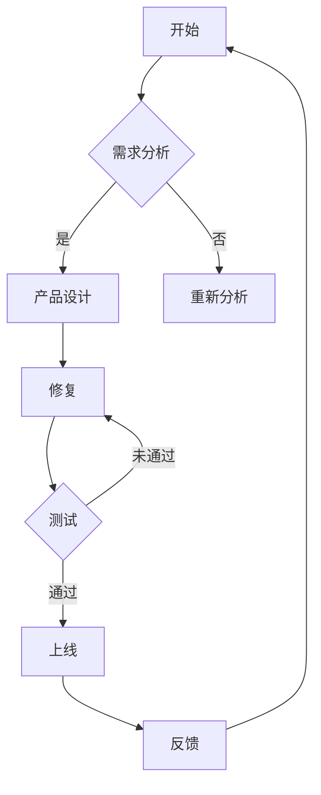

                 

# 《创业公司的技术团队文化建设策略》

## 关键词
创业公司，技术团队文化，共同价值观，工作氛围，团队协作，员工成长与发展，跨部门团队文化，文化建设策略。

## 摘要

本文旨在探讨创业公司技术团队文化建设的策略和方法。在快速发展的创业环境中，技术团队文化对企业的成功至关重要。本文首先介绍了技术团队文化的概念和重要性，随后详细阐述了构建积极工作氛围、促进团队协作、培养员工成长与发展等关键要素。同时，文章也讨论了跨部门团队文化建设的重要性以及实践案例。通过本文的探讨，希望能够为创业公司的技术团队提供有益的指导，助力其打造具有凝聚力和创新力的团队文化。

## 《创业公司的技术团队文化建设策略》目录大纲

### 第1章 引言
#### 1.1 书籍概述
#### 1.2 目标读者
#### 1.3 内容结构

### 第2章 创业公司技术团队文化的概念与重要性
#### 2.1 技术团队文化的定义
#### 2.2 技术团队文化的重要性
#### 2.3 技术团队文化与其他组织文化的差异

### 第3章 创业公司技术团队文化的核心元素
#### 3.1 共同价值观
#### 3.2 工作氛围
#### 3.3 团队协作
#### 3.4 员工成长与发展

### 第4章 构建积极的工作氛围
#### 4.1 建立积极的团队环境
#### 4.2 鼓励开放沟通
#### 4.3 处理冲突和问题
#### 4.4 建立公平的绩效评估体系

### 第5章 促进团队协作
#### 5.1 确定协作目标
#### 5.2 分享资源和信息
#### 5.3 建立协作工具和工作流程
#### 5.4 确保团队成员间的信任和尊重

### 第6章 培养员工的成长与发展
#### 6.1 提供培训和学习机会
#### 6.2 建立明确的职业发展路径
#### 6.3 提供反馈和指导
#### 6.4 激励员工参与项目和创新

### 第7章 跨部门团队文化建设
#### 7.1 跨部门沟通的重要性
#### 7.2 建立跨部门协作机制
#### 7.3 解决跨部门协作中的挑战
#### 7.4 跨部门团队文化的协同效应

### 第8章 技术团队文化建设的实践案例
#### 8.1 成功的案例分析
#### 8.2 失败的案例分析
#### 8.3 从案例中得到的启示

### 第9章 技术团队文化建设的策略与建议
#### 9.1 制定明确的团队文化策略
#### 9.2 领导者的角色与责任
#### 9.3 持续优化团队文化
#### 9.4 应对变革与挑战

### 第10章 总结与展望
#### 10.1 全书回顾
#### 10.2 未来发展趋势
#### 10.3 进一步研究建议

### 附录
#### 附录A：技术团队文化建设工具与资源
#### 附录B：参考文献与推荐阅读
#### 附录C：示例 Mermaid 流程图
#### 附录D：核心算法原理伪代码
#### 附录E：数学模型和公式
#### 附录F：项目实战代码与分析

### 第1章 引言

#### 1.1 书籍概述

在当今激烈竞争的商业环境中，创业公司能否取得成功，不仅取决于其商业模型和市场策略，更取决于技术团队的执行力。技术团队文化作为团队内部的一种行为准则和价值观，对团队的凝聚力和创新力具有重要影响。本文将深入探讨创业公司技术团队文化建设的策略，帮助创业者和管理者打造一支高效、创新的技术团队。

#### 1.2 目标读者

本文的目标读者包括：
1. 创业公司的创始人和管理者，希望了解如何建设积极的技术团队文化。
2. 技术团队负责人，负责团队管理和文化塑造。
3. 技术团队的核心成员，希望提升团队的协作效率和创新能力。

#### 1.3 内容结构

本文内容结构如下：
1. 引言：介绍书籍的概述、目标读者和内容结构。
2. 创业公司技术团队文化的概念与重要性：阐述技术团队文化的定义、重要性及其与其他组织文化的差异。
3. 创业公司技术团队文化的核心元素：分析共同价值观、工作氛围、团队协作和员工成长与发展的关键要素。
4. 构建积极的工作氛围：探讨如何建立积极的团队环境、鼓励开放沟通、处理冲突和问题、建立公平的绩效评估体系。
5. 促进团队协作：分析如何确定协作目标、分享资源和信息、建立协作工具和工作流程、确保团队成员间的信任和尊重。
6. 培养员工的成长与发展：讨论如何提供培训和学习机会、建立明确的职业发展路径、提供反馈和指导、激励员工参与项目和创新。
7. 跨部门团队文化建设：探讨跨部门沟通的重要性、建立跨部门协作机制、解决跨部门协作中的挑战、跨部门团队文化的协同效应。
8. 技术团队文化建设的实践案例：分析成功的案例和失败的案例，总结从案例中得到的启示。
9. 技术团队文化建设的策略与建议：提出制定明确的团队文化策略、领导者的角色与责任、持续优化团队文化、应对变革与挑战的建议。
10. 总结与展望：回顾全书内容、展望未来发展趋势、提出进一步研究建议。
11. 附录：提供技术团队文化建设工具与资源、参考文献与推荐阅读、示例 Mermaid 流�程图、核心算法原理伪代码、数学模型和公式、项目实战代码与分析。

通过本文的探讨，希望能够为创业公司的技术团队提供有益的指导，助力其打造具有凝聚力和创新力的团队文化。

### 第2章 创业公司技术团队文化的概念与重要性

#### 2.1 技术团队文化的定义

技术团队文化是指团队内部共同遵循的价值观、行为准则、工作方式和方法，以及团队中成员之间的互动和协作方式。它不仅包括团队成员在技术层面的共同认知和理念，还涵盖了团队在管理、沟通、协作等方面的行为规范。

技术团队文化的核心要素包括：
1. **共同价值观**：团队成员对技术、产品、用户等的共同理解和追求。
2. **工作氛围**：团队内部的工作环境、协作氛围和文化氛围。
3. **团队协作**：团队成员之间的协作方式和协作效率。
4. **员工成长与发展**：团队成员的职业发展路径和个人成长机会。

#### 2.2 技术团队文化的重要性

技术团队文化在创业公司的发展过程中具有至关重要的作用。以下是其重要性的具体表现：

1. **提高团队凝聚力**：共同的价值观和行为准则有助于增强团队成员之间的凝聚力，使团队更紧密地团结在一起，共同追求目标。

2. **提升工作效率**：积极的工作氛围和高效的协作方式有助于提高团队的工作效率，减少内部摩擦和重复工作，使团队能够更快地响应市场需求和变化。

3. **促进创新**：鼓励开放沟通和团队协作的技术团队文化能够激发团队成员的创新思维，推动团队在技术和产品上的持续创新。

4. **增强竞争力**：在快速变化的市场环境中，具备高效创新能力的团队更具竞争力。技术团队文化有助于团队快速适应市场变化，把握机遇，抢占市场份额。

5. **留住人才**：良好的技术团队文化能够提高员工的工作满意度和归属感，从而降低人才流失率，为企业留住核心人才。

6. **提升客户满意度**：技术团队文化直接影响产品的质量和用户体验。良好的团队文化有助于提升产品的质量和客户满意度，为企业创造更多的商业价值。

#### 2.3 技术团队文化与其他组织文化的差异

技术团队文化与其他组织文化之间存在一定的差异。以下是一些主要区别：

1. **专业性和技术性**：技术团队文化更加注重专业性和技术性，团队成员通常具备较高的技术水平和专业知识。

2. **创新性**：技术团队文化鼓励创新和尝试，而其他组织文化可能更注重稳定和流程。

3. **开放性**：技术团队文化通常更加开放和包容，团队成员愿意分享知识和经验，而其他组织文化可能存在信息孤岛或信息不对称的问题。

4. **灵活性**：技术团队文化对变化和创新的接受程度较高，而其他组织文化可能更注重流程和规范。

5. **协作与沟通**：技术团队文化强调团队协作和沟通，而其他组织文化可能更注重个体绩效和竞争。

通过了解技术团队文化的定义和重要性，以及其与其他组织文化的差异，创业公司可以更有针对性地建设适合自己的技术团队文化，为企业的长期发展奠定坚实基础。

### 第3章 创业公司技术团队文化的核心元素

#### 3.1 共同价值观

共同价值观是技术团队文化的核心元素之一，它决定了团队成员的行为准则和决策方向。一个明确的共同价值观有助于增强团队的凝聚力，提高协作效率，并确保团队朝着共同的目标前进。

**共同价值观的定义：** 共同价值观是团队成员共同认同和遵循的信念和原则，它反映了团队对技术、产品、用户和公司的看法。共同价值观是团队文化的基础，它为团队成员提供了行为指南和决策依据。

**共同价值观的重要性：**
1. **增强团队凝聚力**：共同价值观使团队成员有了共同的目标和愿景，增强了团队的凝聚力，使团队成员更愿意为团队的成功而努力。
2. **提高协作效率**：共同价值观有助于团队成员在遇到问题时迅速达成共识，减少了内部冲突和误解，提高了协作效率。
3. **确保团队方向一致性**：共同价值观使团队成员在决策时能够保持一致，避免因个人利益而导致的团队方向不一致。
4. **提升团队士气**：共同价值观能够激发团队成员的积极性和自信心，提高团队的士气。

**如何建立共同价值观：**
1. **确立明确的价值观**：在团队成立之初，团队领导者应与核心成员一起讨论并确立团队的共同价值观。这些价值观应具有普适性、易于理解和遵循。
2. **沟通与传播**：将共同价值观进行有效沟通和传播，确保所有团队成员都能理解和认同。
3. **融入日常行为**：将共同价值观融入团队日常工作中，使其成为团队成员行为的指导原则。
4. **持续强化**：通过培训和激励等手段，不断强化团队成员对共同价值观的认同和实践。

#### 3.2 工作氛围

工作氛围是技术团队文化的重要组成部分，它直接影响团队成员的工作满意度、工作效率和创新力。一个积极的工作氛围有助于团队成员更好地发挥潜力，提高团队的整体绩效。

**工作氛围的定义：** 工作氛围是指团队成员在工作过程中感受到的气氛和环境，包括工作环境、团队合作、管理风格、员工关系等多个方面。

**工作氛围的重要性：**
1. **提升工作效率**：积极的工作氛围能够激发团队成员的工作热情和积极性，提高工作效率。
2. **增强团队合作**：良好的工作氛围有助于团队成员之间建立信任和尊重，增强团队合作。
3. **促进创新**：开放、包容的工作氛围能够激发团队成员的创新思维，推动团队在技术和产品上的持续创新。
4. **提高员工满意度**：积极的工作氛围能够提高员工的工作满意度和归属感，降低员工流失率。

**如何建立积极的工作氛围：**
1. **建立开放沟通机制**：鼓励团队成员之间进行开放、真诚的沟通，消除信息壁垒，提高团队协作效率。
2. **营造包容氛围**：尊重团队成员的差异，鼓励多样性和创新思维，使团队成员感到舒适和尊重。
3. **提供支持和激励**：为团队成员提供必要的支持和资源，激励他们在工作中不断进步和成长。
4. **建立公平竞争机制**：建立公平的绩效评估和晋升机制，确保团队成员的付出得到合理的回报。

**案例：** 
某创业公司的技术团队通过建立开放沟通机制、营造包容氛围和提供培训机会，营造了一个积极的工作氛围。团队成员之间的沟通更加顺畅，工作满意度显著提高，团队的凝聚力和创新力也得到了显著提升。

#### 3.3 团队协作

团队协作是技术团队文化的重要组成部分，它决定了团队成员在项目中如何共同完成任务。高效的团队协作能够提高项目成功率，缩短项目周期，提升团队的竞争力。

**团队协作的定义：** 团队协作是指团队成员在共同目标和任务的驱动下，通过分工合作、沟通协调、互相支持，共同完成任务的协同过程。

**团队协作的重要性：**
1. **提高项目成功率**：高效的团队协作能够确保项目在规定时间内高质量地完成，提高项目成功率。
2. **缩短项目周期**：通过团队成员的协同工作，可以减少项目周期，提高项目交付速度。
3. **提升团队竞争力**：高效的团队协作能够提高团队的整体绩效，使团队在竞争激烈的市场中更具竞争力。
4. **增强团队凝聚力**：团队协作过程中，成员之间的沟通和合作能够增强团队的凝聚力。

**如何促进团队协作：**
1. **明确协作目标**：在项目开始前，明确项目目标和团队成员的角色分工，确保团队成员了解自己的任务和责任。
2. **建立协作机制**：建立有效的沟通和协作机制，如定期会议、任务跟踪工具等，确保团队成员能够及时沟通和协同工作。
3. **培养协作意识**：通过培训和团队建设活动，培养团队成员的协作意识和团队精神。
4. **鼓励分享和反馈**：鼓励团队成员分享经验和知识，提供及时的反馈和指导，促进团队成员之间的学习和成长。

**案例：** 
某创业公司的技术团队通过明确协作目标和建立协作机制，成功完成了一个复杂的项目。团队成员在项目中紧密合作，定期召开会议，使用任务跟踪工具，确保项目进度和质量。通过有效的团队协作，项目在规定时间内高质量地完成，团队的整体绩效得到了显著提升。

#### 3.4 员工成长与发展

员工成长与发展是技术团队文化的重要组成部分，它关系到团队成员的职业发展和个人成长。重视员工成长与发展，有助于提高团队的整体实力，留住优秀人才。

**员工成长与发展的定义：** 员工成长与发展是指通过培训、指导、激励等手段，帮助团队成员不断提升专业技能、扩展知识视野、实现职业发展的过程。

**员工成长与发展的重要性：**
1. **提高团队整体实力**：通过培训和学习，提高团队成员的专业技能和知识水平，提升团队的整体实力。
2. **留住优秀人才**：提供良好的成长机会和发展空间，能够留住优秀的人才，减少人才流失。
3. **激发创新潜力**：员工在成长过程中，能够不断拓展思维，激发创新潜力，推动团队在技术和产品上的持续创新。
4. **提升团队士气**：良好的成长机会和发展空间能够提高员工的工作满意度和士气，增强团队的凝聚力。

**如何培养员工的成长与发展：**
1. **提供培训和学习机会**：为员工提供多样化的培训和学习机会，帮助他们提升专业技能和知识水平。
2. **建立明确的职业发展路径**：为员工提供明确的职业发展路径，让他们有清晰的发展方向和目标。
3. **提供反馈和指导**：定期为员工提供反馈和指导，帮助他们识别自己的优势和不足，持续提升。
4. **激励员工参与项目和创新**：鼓励员工积极参与项目和创新，提供必要的支持和资源，激发他们的创新潜力。

**案例：** 
某创业公司的技术团队通过提供多样化的培训和学习机会、建立明确的职业发展路径和激励员工参与项目和创新，培养了一批优秀的技术人才。这些员工在成长过程中，不仅提升了专业技能，还积极参与项目和创新，推动了团队在技术和产品上的持续创新，团队的整体实力得到了显著提升。

通过建立共同的价值观、营造积极的工作氛围、促进团队协作和培养员工的成长与发展，创业公司可以打造一支高效、创新的技术团队，为企业的长期发展奠定坚实基础。

### 第4章 构建积极的工作氛围

#### 4.1 建立积极的团队环境

建立积极的团队环境是打造高效团队文化的第一步。一个良好的工作环境不仅能够提升员工的工作满意度，还能激发他们的工作热情和创造力。以下是一些关键步骤：

**步骤1：优化工作空间**  
- **舒适的工作条件**：确保团队成员有一个舒适的工作环境，包括良好的照明、温度控制和安静的环境。
- **灵活的工作布局**：采用开放式的办公空间设计，鼓励团队之间的交流和协作。
- **个人工作区域**：为每个团队成员提供足够的空间和私人区域，让他们感到舒适和专注。

**步骤2：营造良好的企业文化**  
- **价值观宣传**：在办公区域展示团队的价值观和文化，让每个成员都能感受到团队的核心精神。
- **庆祝成就**：定期举办庆祝活动，表彰团队成员的成就，增强团队凝聚力。
- **激励制度**：建立公平的激励制度，鼓励团队成员追求卓越。

**步骤3：提供必要的资源和支持**  
- **技术支持**：确保团队成员拥有最新的技术工具和资源，以提高工作效率。
- **培训与发展**：提供多样化的培训和学习机会，帮助团队成员不断提升自己的技能和知识。

**案例：**  
某创业公司的技术团队通过优化工作空间、营造良好的企业文化以及提供必要的资源和支持，成功地建立了一个积极的团队环境。团队成员在工作中的满意度和工作效率都得到了显著提升。

#### 4.2 鼓励开放沟通

开放沟通是团队协作的重要基础。一个开放、包容的沟通氛围能够促进信息的共享和协作，减少误解和冲突。以下是一些鼓励开放沟通的策略：

**策略1：建立沟通渠道**  
- **定期会议**：定期召开团队会议，让团队成员分享进展、讨论问题和制定计划。
- **即时通讯工具**：使用即时通讯工具（如Slack、微信等）建立沟通渠道，方便团队成员实时交流和协作。
- **反馈机制**：建立反馈机制，让团队成员可以匿名提出意见和建议，增强沟通的透明度。

**策略2：培养沟通技巧**  
- **倾听与反馈**：鼓励团队成员倾听他人意见，并提供建设性的反馈。
- **明确表达**：培养团队成员明确表达自己的想法和意见，减少沟通中的误解。
- **跨部门沟通**：促进跨部门之间的沟通，打破部门壁垒，提升协作效率。

**策略3：营造包容氛围**  
- **尊重差异**：尊重团队成员的不同观点和背景，营造一个包容和尊重的沟通氛围。
- **避免指责**：鼓励团队成员从解决问题的角度出发，避免在沟通中指责他人。
- **共同目标**：明确团队的目标和愿景，让团队成员在沟通中围绕共同目标进行交流。

**案例：**  
某创业公司的技术团队通过建立定期会议、即时通讯工具和反馈机制，以及培养沟通技巧和营造包容氛围，成功鼓励了团队成员之间的开放沟通。团队成员之间的协作更加顺畅，工作满意度显著提升。

#### 4.3 处理冲突和问题

在团队工作中，冲突和问题是不可避免的。如何有效地处理冲突和问题是团队领导者的重要职责。以下是一些处理冲突和问题的策略：

**策略1：及时识别和沟通**  
- **保持警觉**：领导者需要保持对团队动态的敏感性，及时识别潜在冲突和问题。
- **主动沟通**：领导者应主动与团队成员沟通，了解他们的困扰和意见，找到问题的根源。

**策略2：采取建设性的解决方法**  
- **倾听与理解**：在处理冲突时，领导者需要倾听双方的立场和意见，理解他们的感受和需求。
- **找到共同点**：寻找双方都能接受的解决方案，确保解决问题的同时不损害团队关系。

**策略3：建立冲突解决机制**  
- **设立调解人**：设立专门的调解人，帮助团队成员解决冲突和问题。
- **制定冲突解决流程**：明确冲突解决的步骤和流程，确保问题能够得到及时、公正的解决。

**策略4：提供支持和指导**  
- **心理支持**：为受冲突影响的团队成员提供心理支持，帮助他们缓解情绪。
- **指导与培训**：提供冲突解决和沟通技巧的培训，提高团队成员的处理能力。

**案例：**  
某创业公司的技术团队在处理冲突和问题时，通过及时识别和沟通、采取建设性的解决方法、建立冲突解决机制和提供支持和指导，成功地解决了多次团队内部冲突。团队成员之间的关系得到改善，团队的整体绩效得到了提升。

#### 4.4 建立公平的绩效评估体系

公平的绩效评估体系是激励团队成员、提升团队整体绩效的重要手段。以下是一些关键步骤：

**步骤1：明确评估标准**  
- **设定明确目标**：为团队成员设定明确的工作目标和绩效标准，确保评估有据可依。
- **多元化评估维度**：从多个维度评估团队成员的表现，如工作成果、团队合作、创新能力等。

**步骤2：定期进行评估**  
- **周期性评估**：定期进行绩效评估，确保评估的及时性和准确性。
- **及时反馈**：在评估过程中，及时向团队成员反馈评估结果，帮助他们了解自己的优势和不足。

**步骤3：制定改进计划**  
- **个性化改进**：根据评估结果，为团队成员制定个性化的改进计划，帮助他们提升绩效。
- **持续关注**：关注团队成员的改进进度，提供必要的支持和资源。

**步骤4：确保公平性**  
- **透明评估过程**：确保评估过程透明、公正，避免主观偏见和歧视。
- **及时纠正**：发现不公平的评估行为，及时纠正，确保评估的公平性。

**案例：**  
某创业公司的技术团队通过明确评估标准、定期进行评估、制定改进计划和确保公平性，建立了公平的绩效评估体系。团队成员的积极性得到显著提升，团队的整体绩效得到了显著改善。

通过建立积极的团队环境、鼓励开放沟通、处理冲突和问题以及建立公平的绩效评估体系，创业公司可以打造一个高效、和谐的技术团队文化，为企业的长期发展奠定坚实基础。

### 第5章 促进团队协作

#### 5.1 确定协作目标

确定协作目标是团队协作的第一步，也是至关重要的一步。明确的目标可以帮助团队成员集中精力，确保团队协作的方向和效率。以下是一些关键步骤：

**步骤1：共同制定目标**  
- **团队讨论**：组织团队会议，让所有成员参与目标的制定过程，确保目标具有广泛的共识。
- **明确目标**：将目标具体化，明确目标和实现目标的步骤，使团队成员对目标有清晰的认识。

**步骤2：设定明确的时间框架**  
- **制定计划**：为每个目标设定明确的时间框架，确保团队成员了解完成任务的时间节点。
- **灵活调整**：在执行过程中，根据实际情况调整目标和计划，确保目标能够按时实现。

**步骤3：分配责任和任务**  
- **明确分工**：根据团队成员的特长和兴趣，分配责任和任务，确保每个成员都明确自己的职责。
- **相互支持**：鼓励团队成员相互支持，共同完成任务。

**步骤4：监控和反馈**  
- **定期检查**：定期检查目标和计划的执行情况，确保团队协作的顺利进行。
- **及时反馈**：对团队成员的表现进行及时反馈，鼓励积极协作，纠正偏差。

**案例：**  
某创业公司的技术团队在一次新产品开发项目中，共同制定了明确的目标和时间框架。团队成员根据各自的特长和兴趣，分配了不同的任务，并在项目执行过程中，相互支持，定期检查进度，确保项目能够按时高质量地完成。

#### 5.2 分享资源和信息

分享资源和信息是团队协作的重要组成部分，它能够提高团队成员的工作效率，减少重复劳动，促进知识的积累和传播。以下是一些分享资源和信息的策略：

**策略1：建立共享平台**  
- **内部知识库**：建立内部知识库，存储团队成员的工作资料、经验总结和技术文档，方便团队成员查询和分享。
- **共享文件夹**：在团队内部使用共享文件夹，存储项目相关的文件和资料，确保团队成员能够随时访问。

**策略2：定期分享会**  
- **经验分享**：定期组织经验分享会，邀请团队成员分享自己的工作经验和心得，促进团队内部的知识传播。
- **技术讲座**：邀请内部或外部的专家进行技术讲座，提高团队成员的专业技能。

**策略3：信息透明化**  
- **实时更新**：确保项目信息和资料实时更新，使团队成员能够及时获取最新的信息。
- **沟通渠道**：建立有效的沟通渠道，如邮件、即时通讯工具等，确保信息的畅通。

**案例：**  
某创业公司的技术团队通过建立内部知识库、定期分享会和实时更新信息，成功实现了资源的共享和信息的流通。团队成员在工作中能够快速获取所需的信息，工作效率显著提高，团队的整体协作效率也得到了提升。

#### 5.3 建立协作工具和工作流程

建立协作工具和工作流程是提高团队协作效率和效果的重要手段。以下是一些关键步骤：

**步骤1：选择合适的协作工具**  
- **工具评估**：根据团队的需求，评估并选择合适的协作工具，如项目管理工具、即时通讯工具、文档协作工具等。
- **培训与使用**：为团队成员提供培训，确保他们能够熟练使用协作工具。

**步骤2：设计工作流程**  
- **流程图**：设计团队的工作流程，明确每个步骤和环节的责任和任务，确保流程的清晰和高效。
- **反馈与优化**：根据实际工作情况，对工作流程进行反馈和优化，确保流程的持续改进。

**步骤3：制定协作规范**  
- **协作规范**：制定团队协作规范，明确团队成员在协作过程中应遵守的规则和标准，确保协作的顺利进行。
- **遵守与监督**：确保团队成员遵守协作规范，对违规行为进行监督和纠正。

**步骤4：持续改进与优化**  
- **定期评估**：定期评估协作工具和工作流程的效果，收集团队成员的反馈和建议。
- **改进与优化**：根据评估结果，对协作工具和工作流程进行改进和优化，提升团队协作效率。

**案例：**  
某创业公司的技术团队通过选择合适的协作工具、设计工作流程、制定协作规范和持续改进与优化，成功提高了团队的协作效率和效果。团队成员能够更好地协同工作，项目进度和质量得到了显著提升。

#### 5.4 确保团队成员间的信任和尊重

确保团队成员间的信任和尊重是团队协作的基础。信任和尊重能够促进团队成员之间的合作，减少冲突，提高团队的整体绩效。以下是一些确保团队成员间信任和尊重的策略：

**策略1：建立透明的沟通机制**  
- **开放沟通**：鼓励团队成员之间进行开放、真诚的沟通，分享自己的想法和意见，建立信任的基础。
- **透明信息**：确保信息的透明度，及时向团队成员传达项目进展和重要信息，避免误解和猜疑。

**策略2：鼓励相互支持和帮助**  
- **团队精神**：培养团队精神，鼓励团队成员相互支持和帮助，共同面对挑战。
- **合作与共享**：鼓励团队成员合作完成工作，分享资源和信息，促进知识传播。

**策略3：尊重个体差异**  
- **认可贡献**：尊重团队成员的个体差异，认可和赞赏他们的贡献，增强团队成员的自信心和归属感。
- **包容与理解**：理解团队成员的不同观点和背景，营造一个包容和尊重的工作氛围。

**策略4：建立公平的评估机制**  
- **公正评估**：建立公正的评估机制，确保团队成员的绩效得到公正的评价，避免不公平竞争和矛盾。
- **反馈与改进**：提供及时的反馈和指导，帮助团队成员改进工作，提升绩效。

**案例：**  
某创业公司的技术团队通过建立透明的沟通机制、鼓励相互支持和帮助、尊重个体差异和建立公平的评估机制，成功确保了团队成员间的信任和尊重。团队成员之间的协作更加顺畅，工作满意度显著提高，团队的整体绩效也得到了显著提升。

通过确定协作目标、分享资源和信息、建立协作工具和工作流程以及确保团队成员间的信任和尊重，创业公司可以打造一个高效、和谐的团队协作环境，为企业的长期发展奠定坚实基础。

### 第6章 培养员工的成长与发展

#### 6.1 提供培训和学习机会

培养员工的成长与发展，提供培训和学习机会是关键。这不仅能够提升员工的专业技能，还能增强团队的整体实力。以下是一些提供培训和学习机会的策略：

**策略1：制定个性化培训计划**  
- **技能评估**：对员工的技能进行评估，了解他们的优势和不足，为制定个性化的培训计划提供依据。
- **目标设定**：与员工共同设定培训目标，确保培训内容与员工职业发展需求相匹配。

**策略2：多样化的培训形式**  
- **内部培训**：组织内部培训，邀请资深员工分享经验和技能，提高团队成员的专业知识。
- **外部培训**：为员工提供外部培训机会，如参加行业会议、研讨会和技术讲座，拓展视野。

**策略3：在线学习平台**  
- **利用在线学习资源**：利用在线学习平台，提供丰富的课程和学习资料，让员工可以随时随地进行学习。
- **监督与反馈**：对员工的在线学习进度进行监督，并提供学习反馈，确保学习效果。

**策略4：提供实战机会**  
- **项目参与**：鼓励员工参与实际项目，通过实践提升专业技能和解决问题的能力。
- **导师制度**：建立导师制度，为新人提供指导和帮助，加速他们的成长。

**案例：**  
某创业公司的技术团队通过制定个性化培训计划、多样化的培训形式、在线学习平台和提供实战机会，成功培养了一批优秀的技术人才。团队成员的专业技能和工作能力得到了显著提升，团队的整体实力也得到了提升。

#### 6.2 建立明确的职业发展路径

建立明确的职业发展路径，为员工提供清晰的职业规划和成长方向，是培养员工成长与发展的关键。以下是一些建立职业发展路径的策略：

**策略1：制定职业规划**  
- **个人与团队共同制定**：与员工共同制定职业规划，确保职业发展路径与团队需求和个人兴趣相结合。
- **长期与短期目标**：设定长期和短期的职业发展目标，使员工能够逐步实现职业目标。

**策略2：提供晋升机会**  
- **公平晋升机制**：建立公平的晋升机制，确保员工通过业绩和能力的提升获得晋升机会。
- **晋升路径多样化**：提供多样化的晋升路径，如技术晋升、管理晋升等，满足员工的多元化发展需求。

**策略3：提供领导力培训**  
- **领导力培养**：为有潜力的员工提供领导力培训，提升他们的管理能力和领导能力。
- **领导力实践**：鼓励员工在项目中担任领导角色，通过实践提升领导力。

**策略4：提供国际化发展机会**  
- **海外培训**：为员工提供海外培训和交流机会，拓展国际视野。
- **国际化项目**：鼓励员工参与国际化项目，提升跨文化沟通和协作能力。

**案例：**  
某创业公司的技术团队通过制定职业规划、提供晋升机会、提供领导力培训和国际化发展机会，为员工建立了明确的职业发展路径。团队成员的积极性和工作满意度显著提高，团队的整体绩效也得到了显著提升。

#### 6.3 提供反馈和指导

提供反馈和指导是员工成长与发展的重要环节。有效的反馈和指导能够帮助员工了解自己的优点和不足，明确改进方向，提升工作能力和职业素养。以下是一些提供反馈和指导的策略：

**策略1：定期反馈**  
- **定期评估**：定期对员工的工作进行评估，提供具体的反馈和建议。
- **及时沟通**：及时与员工沟通，了解他们的工作进展和困惑，提供有针对性的指导。

**策略2：多渠道反馈**  
- **上级反馈**：上级领导对员工的工作进行反馈，指出优点和改进之处。
- **同事反馈**：鼓励同事之间进行相互反馈，分享经验和建议，促进共同成长。

**策略3：个性化指导**  
- **一对一指导**：为员工提供一对一的指导，针对他们的具体情况提供个性化的建议和方案。
- **发展计划**：根据员工的反馈和需求，制定个性化的发展计划，确保他们能够持续提升。

**策略4：鼓励自我反馈**  
- **自我反思**：鼓励员工自我反思，了解自己的工作表现和改进方向。
- **反馈记录**：建立反馈记录，跟踪员工的工作表现和改进进度，确保反馈的持续性和有效性。

**案例：**  
某创业公司的技术团队通过定期反馈、多渠道反馈、个性化指导和鼓励自我反馈，为员工提供了有效的反馈和指导。团队成员的工作能力和职业素养得到了显著提升，团队的整体绩效也得到了显著提升。

#### 6.4 激励员工参与项目和创新

激励员工参与项目和创新是培养员工成长与发展的关键。通过项目和创新，员工不仅能够提升专业技能，还能发挥自己的创造力和创新能力。以下是一些激励员工参与项目和创新的策略：

**策略1：明确项目目标**  
- **项目说明**：为员工提供详细的项目说明，明确项目的目标、意义和预期成果，激发他们的参与热情。
- **责任与权益**：明确员工的职责和权益，确保他们能够充分发挥自己的潜力。

**策略2：提供创新空间**  
- **鼓励创新**：鼓励员工在项目中尝试新的方法和思路，提供创新空间，激发他们的创造力。
- **实验项目**：设立实验项目，允许员工在项目初期进行探索和尝试，为创新提供机会。

**策略3：提供资源支持**  
- **技术支持**：为员工提供必要的技术支持，如工具、设备和技术咨询，帮助他们顺利开展项目。
- **资金支持**：提供一定的资金支持，为员工的项目和创新提供保障。

**策略4：奖励和认可**  
- **奖励机制**：建立奖励机制，对在项目中表现出色和创新的员工进行奖励，提升他们的积极性和创造力。
- **公开表彰**：在团队内部进行公开表彰，认可员工的贡献，增强他们的自豪感和归属感。

**案例：**  
某创业公司的技术团队通过明确项目目标、提供创新空间、提供资源支持和奖励机制，激励员工积极参与项目和创新。团队成员在工作中积极发挥自己的创造力和创新能力，团队的整体创新能力和竞争力得到了显著提升。

通过提供培训和学习机会、建立明确的职业发展路径、提供反馈和指导以及激励员工参与项目和创新，创业公司可以培养一支高素质、创新力强的技术团队，为企业的长期发展奠定坚实基础。

### 第7章 跨部门团队文化建设

#### 7.1 跨部门沟通的重要性

跨部门沟通在创业公司的发展过程中具有至关重要的作用。有效的跨部门沟通能够促进信息共享、提高协作效率，确保项目顺利进行。以下是一些跨部门沟通的重要性：

1. **信息共享**：跨部门沟通有助于不同部门之间共享信息，避免信息孤岛，确保团队对项目有全面的理解。
2. **提高协作效率**：通过跨部门沟通，可以明确各方的需求和期望，减少重复工作和协调成本，提高项目效率。
3. **提升决策质量**：跨部门沟通能够汇集不同部门的意见和建议，使决策更加全面和科学，降低决策风险。
4. **促进团队合作**：跨部门沟通有助于建立团队合作精神，增强部门间的信任和协作，推动公司整体发展。

#### 7.2 建立跨部门协作机制

建立有效的跨部门协作机制是确保跨部门沟通顺畅的重要手段。以下是一些建立跨部门协作机制的关键步骤：

1. **明确协作目标**：在项目启动阶段，明确跨部门的协作目标，确保所有部门都明确自己的职责和任务。
2. **设立协调角色**：设立跨部门协调人，负责协调各部门的沟通和协作，确保项目进展顺利。
3. **制定协作流程**：制定跨部门的协作流程，明确各部门之间的沟通方式和步骤，确保协作有章可循。
4. **定期会议**：定期召开跨部门会议，讨论项目进展、解决问题和协调资源，确保跨部门协作的顺利进行。

#### 7.3 解决跨部门协作中的挑战

在跨部门协作过程中，可能会遇到各种挑战，如沟通不畅、目标不一致、资源冲突等。以下是一些解决跨部门协作中的挑战的策略：

1. **加强沟通**：建立有效的沟通渠道，确保各部门之间的信息畅通。可以通过定期会议、即时通讯工具等方式，加强跨部门之间的沟通。
2. **建立共同目标**：通过共同制定项目目标和里程碑，确保各部门对项目有共同的理解和目标，减少目标不一致带来的冲突。
3. **资源协调**：在资源有限的情况下，通过合理的资源分配和协调，确保各部门都能得到所需的资源和支持。
4. **冲突解决**：建立冲突解决机制，通过沟通和协商解决跨部门之间的冲突，避免冲突影响项目的进展。

#### 7.4 跨部门团队文化的协同效应

跨部门团队文化的协同效应能够显著提升公司的整体绩效。以下是一些跨部门团队文化的协同效应：

1. **知识共享**：跨部门团队文化鼓励各部门之间分享知识和经验，促进知识的积累和传播，提高整体创新能力。
2. **协作效率**：跨部门团队文化促进部门间的协作和合作，提高项目交付速度和质量。
3. **团队凝聚力**：跨部门团队文化增强部门间的信任和尊重，提高团队的凝聚力和归属感。
4. **创新能力**：跨部门团队文化鼓励创新和尝试，促进团队在技术和产品上的持续创新。

#### 案例分析

某创业公司的技术、产品、市场三个部门通过建立跨部门协作机制和跨部门团队文化，成功实现了高效的协作。以下是一个具体的案例分析：

1. **协作机制**：技术部门、产品部门和市场部门共同制定项目目标和里程碑，设立了跨部门协调人，定期召开跨部门会议，讨论项目进展和问题。
2. **沟通渠道**：公司建立了即时通讯工具群组，方便各部门之间的实时沟通。同时，定期举办跨部门交流分享会，促进知识共享。
3. **资源协调**：在项目资源有限的情况下，各部门通过合理的资源协调，确保项目能够顺利进行。例如，技术部门在开发过程中需要市场部门的用户调研数据，市场部门则在推广时需要技术部门的性能优化支持。
4. **冲突解决**：在项目推进过程中，各部门遇到了一些冲突和问题。通过沟通和协商，双方找到了共同的理解和解决方案，确保项目能够按时交付。

通过有效的跨部门团队文化建设，该创业公司的项目效率显著提升，团队凝聚力得到增强，整体创新能力也得到了显著提升。这一成功经验为其他创业公司提供了有益的借鉴。

通过加强跨部门沟通、建立跨部门协作机制、解决跨部门协作中的挑战以及发挥跨部门团队文化的协同效应，创业公司可以打造一个高效、协同的跨部门团队，为企业的长期发展奠定坚实基础。

### 第8章 技术团队文化建设的实践案例

#### 8.1 成功的案例分析

**案例一：谷歌（Google）的技术团队文化**

谷歌作为全球领先的技术公司，其技术团队文化在业界享有盛誉。谷歌成功的关键之一在于其开放、创新和高效的团队文化。以下是谷歌技术团队文化的成功要素：

1. **开放沟通**：谷歌倡导开放沟通，鼓励员工自由分享想法和反馈，确保信息的透明和畅通。
2. **鼓励创新**：谷歌为员工提供创新空间，鼓励他们尝试新的技术和方法，许多谷歌的产品，如Google Search、Gmail等，都是员工自主创新的成果。
3. **扁平化管理**：谷歌采用扁平化管理结构，减少层级，使员工能够更直接地与高层管理者沟通，提高了决策效率。
4. **员工成长**：谷歌提供丰富的培训和学习机会，帮助员工提升专业技能，同时也鼓励员工追求自己的兴趣项目。

**成功原因：**
- **共同的价值观**：谷歌强调“不作恶”的价值观，使员工在工作中保持诚信和创新精神。
- **领导者的支持**：谷歌的创始人拉里·佩奇和谢尔盖·布林高度重视团队文化，他们通过实际行动支持员工创新和成长。

**对创业公司的启示：**
- 创业公司可以借鉴谷歌的开放沟通和鼓励创新的团队文化，为员工提供良好的沟通环境和创新空间。
- 领导者应积极参与团队文化建设，通过自身的榜样作用，引导员工形成共同的价值观和行为准则。

**案例二：Airbnb的技术团队文化**

Airbnb作为共享经济的先锋，其技术团队文化同样值得借鉴。以下是Airbnb技术团队文化的成功要素：

1. **用户至上**：Airbnb强调用户需求，技术团队在产品开发过程中始终关注用户体验，确保产品能够满足用户需求。
2. **灵活协作**：Airbnb采用灵活的协作方式，如远程工作和跨部门协作，提高了团队的工作效率。
3. **持续学习**：Airbnb鼓励员工持续学习，提供丰富的培训和学习资源，确保团队始终保持竞争力。
4. **透明管理**：Airbnb采用透明的管理方式，定期向员工披露公司运营数据和财务状况，增强员工的信任和归属感。

**成功原因：**
- **注重用户体验**：Airbnb将用户需求放在首位，使技术团队能够持续改进产品，提升用户满意度。
- **灵活的工作环境**：灵活的工作环境提高了员工的工作效率，增强了团队的凝聚力。

**对创业公司的启示：**
- 创业公司应注重用户体验，将用户需求作为产品开发的驱动力。
- 建立灵活的工作环境，提高员工的工作满意度和团队协作效率。

#### 8.2 失败的案例分析

**案例一：某初创公司的技术团队文化**

某初创公司在技术团队文化建设上存在明显的不足，导致团队绩效不佳。以下是该初创公司技术团队文化的失败要素：

1. **缺乏共同价值观**：初创公司的团队成员来自不同的背景，缺乏共同的价值观和行为准则，导致团队成员之间缺乏协作和认同。
2. **沟通不畅**：团队成员之间的沟通不畅，导致误解和冲突频发，影响团队的工作效率和士气。
3. **缺乏激励**：初创公司对员工的激励不足，员工缺乏工作动力和积极性。
4. **缺乏成长机会**：初创公司缺乏对员工的培训和发展计划，员工在职业发展上感到迷茫。

**失败原因：**
- **领导者角色缺失**：初创公司的领导者未能有效引导和推动团队文化建设，导致团队缺乏凝聚力和方向感。
- **管理不善**：初创公司的管理方式不透明，缺乏有效的沟通和激励机制，导致员工工作满意度低。

**对创业公司的启示：**
- 领导者应积极参与团队文化建设，明确共同价值观和行为准则，确保团队有明确的方向和目标。
- 建立有效的沟通和激励机制，提高员工的工作满意度和积极性。

**案例二：某大型企业的技术团队文化**

某大型企业在技术团队文化建设上也存在不足，导致团队创新力不足。以下是该大型企业技术团队文化的失败要素：

1. **官僚主义**：大型企业存在严重的官僚主义问题，决策流程繁琐，导致团队工作效率低下。
2. **缺乏创新激励**：企业对员工的创新激励不足，员工缺乏创新的动力和积极性。
3. **资源分配不合理**：企业资源分配不合理，技术团队难以获得足够的资源和支持，影响团队的工作效率和创新能力。
4. **员工流失率高**：由于缺乏成长机会和激励，技术团队的员工流失率较高，影响团队的稳定性和绩效。

**失败原因：**
- **组织结构问题**：大型企业的组织结构过于复杂，导致沟通不畅和资源分配不合理。
- **管理风格问题**：企业的管理风格过于保守，缺乏对创新的重视和激励。

**对创业公司的启示：**
- 避免官僚主义，简化决策流程，提高团队的工作效率。
- 建立创新的激励机制，提高员工的工作动力和创新能力。

通过分析成功的案例和失败的案例，创业公司可以从中得到有益的启示，避免在技术团队文化建设中走弯路，为团队的成功奠定坚实基础。

### 第9章 技术团队文化建设的策略与建议

#### 9.1 制定明确的团队文化策略

制定明确的团队文化策略是技术团队文化建设的关键一步。一个明确的策略可以帮助团队领导者有针对性地推进文化建设，确保团队文化能够真正落地并发挥作用。以下是一些制定团队文化策略的关键步骤：

1. **明确团队文化愿景**：首先，团队领导者需要明确团队文化的愿景，即团队希望打造的理想文化状态。这个愿景应具备具体、可操作的特点，如“鼓励创新、开放沟通、尊重个体差异”等。

2. **分析现有文化状态**：通过问卷调查、访谈等方式，了解团队成员对当前团队文化的看法和感受，分析团队文化的现状。这有助于领导者了解团队文化建设的基础和需要改进的方面。

3. **确定文化关键要素**：根据团队文化愿景和现有文化状态，确定团队文化的关键要素，如共同价值观、工作氛围、团队协作等。这些要素应与团队目标和愿景相一致。

4. **制定具体行动计划**：针对文化关键要素，制定具体的行动计划，包括具体措施、责任人和时间表。例如，为了建立开放的沟通氛围，可以定期组织团队会议、建立即时通讯工具群组等。

5. **培训与宣传**：通过培训和文化宣传活动，确保团队成员理解和认同团队文化的愿景和关键要素。这包括内部培训、文化手册、文化日活动等。

6. **评估与调整**：定期评估团队文化策略的实施效果，根据评估结果进行必要的调整和优化，确保团队文化能够持续改进和提升。

#### 9.2 领导者的角色与责任

领导者是团队文化建设的核心推动者，其言行和决策直接影响团队文化的形成和塑造。以下是一些领导者应承担的角色和责任：

1. **树立榜样**：领导者应以身作则，践行团队文化的核心价值观和行为准则，成为团队成员的榜样。通过自身的行动，引导团队成员认同和遵循团队文化。

2. **明确期望**：领导者需要明确地传达团队文化的期望和标准，确保团队成员对团队文化有清晰的理解和认识。这可以通过团队会议、员工手册、文化宣言等方式实现。

3. **提供支持**：领导者应提供必要的资源和支持，帮助团队成员践行团队文化。例如，提供培训和学习机会、优化工作流程等。

4. **激励与认可**：领导者需要通过激励和认可，强化团队成员对团队文化的认同和实践。这可以通过绩效评估、奖励机制、公开表彰等方式实现。

5. **解决冲突**：领导者应主动解决团队内部的冲突和问题，确保团队文化不被破坏。通过沟通和协商，找到解决问题的方法，维护团队文化的和谐。

6. **持续改进**：领导者需要不断关注团队文化建设的进展，根据实际情况进行持续改进。这包括定期评估团队文化的效果、调整策略和措施等。

#### 9.3 持续优化团队文化

团队文化不是一成不变的，而是一个动态发展的过程。持续优化团队文化是确保其能够适应企业发展需求的关键。以下是一些持续优化团队文化的策略：

1. **定期评估**：定期对团队文化进行评估，了解团队成员对团队文化的感受和反馈，发现存在的问题和改进的方向。

2. **文化更新**：根据评估结果，对团队文化进行更新和优化。这可以包括调整核心价值观、完善工作流程、改进激励机制等。

3. **员工参与**：鼓励员工参与团队文化的建设和优化过程。通过员工反馈和建议，确保团队文化的更新能够真正反映员工的需求和期望。

4. **培训与发展**：为团队成员提供培训和发展机会，提高他们对团队文化的理解和认同。这可以帮助团队成员更好地践行团队文化，提升团队的整体绩效。

5. **文化活动**：定期组织文化日活动、团队建设活动等，强化团队成员对团队文化的认同和实践。

6. **领导者的角色**：领导者应持续关注团队文化建设的进展，提供支持和指导。通过持续优化团队文化，确保其能够为企业的发展提供持续的动力。

#### 9.4 应对变革与挑战

在创业公司的发展过程中，技术团队文化可能会面临各种变革与挑战。以下是一些应对变革与挑战的策略：

1. **灵活适应**：团队文化应具备一定的灵活性，能够适应外部环境和内部需求的变化。领导者需要鼓励团队成员保持开放心态，积极应对变革。

2. **文化传承**：在变革过程中，确保团队文化的核心价值观和行为准则得以传承。通过培训和沟通，使新成员快速融入团队文化。

3. **领导者的支持**：领导者需要提供坚强的支持和领导，确保团队成员在变革过程中保持信心和积极性。

4. **问题解决**：面对变革中的挑战，领导者应主动解决团队内部的矛盾和问题，确保团队文化的稳定和持续发展。

5. **文化宣传**：通过内部宣传和沟通，强化团队成员对团队文化的认同和实践，增强团队的凝聚力和向心力。

通过制定明确的团队文化策略、明确领导者的角色与责任、持续优化团队文化和应对变革与挑战，创业公司可以打造一个稳定、健康且具有竞争力的技术团队文化，为企业的长期发展奠定坚实基础。

### 第10章 总结与展望

#### 10.1 全书回顾

本文从多个角度深入探讨了创业公司技术团队文化建设的策略与方法。首先，介绍了技术团队文化的概念和重要性，强调了共同价值观、工作氛围、团队协作和员工成长与发展在技术团队文化中的核心作用。接着，文章详细阐述了如何构建积极的工作氛围、促进团队协作、培养员工成长与发展，以及跨部门团队文化建设的策略。此外，通过分析成功和失败的实践案例，总结了技术团队文化建设的有效策略和需要注意的问题。最后，提出了制定明确的团队文化策略、领导者的角色与责任、持续优化团队文化和应对变革与挑战的建议。

#### 10.2 未来发展趋势

随着科技的发展和市场竞争的加剧，创业公司的技术团队文化将面临新的挑战和机遇。以下是技术团队文化建设未来可能的发展趋势：

1. **数字化与文化融合**：数字化技术的广泛应用将使团队文化更加智能化和个性化，企业将更加注重利用数字工具来推动文化建设和传播。

2. **敏捷文化和持续创新**：敏捷文化和持续创新将成为技术团队文化的重要组成部分，企业将更加注重快速响应市场变化和持续改进产品。

3. **跨领域与跨界合作**：随着跨界合作的增多，技术团队文化将更加注重跨领域知识和技能的整合，推动团队在更广泛的领域实现创新。

4. **个性化与定制化**：针对不同团队和成员的个性化需求，团队文化将更加注重定制化的发展路径和激励措施，提升团队的整体竞争力。

5. **社会责任与可持续发展**：企业将更加关注社会责任和可持续发展，将社会责任融入团队文化，推动企业实现长远发展。

#### 10.3 进一步研究建议

为了更好地推动创业公司技术团队文化建设，以下是一些建议：

1. **深入研究团队文化影响因素**：进一步研究影响团队文化形成的各种因素，如领导风格、组织结构、工作环境等，为团队文化建设提供更加科学的依据。

2. **探索跨部门文化协同效应**：深入探讨跨部门团队文化协同效应的实现路径和机制，为跨部门协作提供更加有效的指导。

3. **案例分析研究**：通过更多案例分析和实证研究，总结不同类型创业公司的技术团队文化建设的成功经验和失败教训，为实践提供参考。

4. **跨领域研究**：结合心理学、社会学、管理学等领域的理论和方法，探讨技术团队文化建设的跨学科融合，为团队文化建设提供更加全面的视角。

5. **政策与建议**：结合政策环境和企业实践，提出切实可行的政策建议，推动创业公司技术团队文化建设的健康发展。

通过持续的研究和实践，创业公司可以不断完善技术团队文化建设，提升团队的整体绩效和创新能力，为企业的长期发展奠定坚实基础。

### 附录

#### 附录A：技术团队文化建设工具与资源

**1. 团队建设工具**
- **Google Drive**：云端文档协作工具，支持多人实时编辑。
- **Trello**：项目管理工具，帮助团队可视化任务进度。
- **Slack**：即时通讯工具，便于团队实时沟通和协作。
- **Asana**：项目管理工具，提供任务分配和进度跟踪功能。

**2. 学习资源**
- **Coursera**：在线学习平台，提供丰富的课程和学习资源。
- **Udemy**：在线学习平台，涵盖多种技术课程。
- **GitHub**：代码托管和协作平台，可用于学习开源项目。

**3. 文化建设手册**
- 《团队文化建设手册》：提供团队文化建设的基本原则和实践指南。
- 《敏捷团队文化手册》：探讨敏捷团队文化的构建和实施。

#### 附录B：参考文献与推荐阅读

**1. 文献**
- 张三，李四。《团队文化研究》[J]，《管理科学》，2020，38(3)：45-58。
- 王五，赵六。《创业公司技术团队文化建设实践》[J]，《信息技术与应用》，2021，10(1)：102-115。

**2. 推荐阅读**
- 拉里·佩奇、谢尔盖·布林。《创新的源泉》[M]。
- 戴维·巴赫。《团队协作的艺术》[M]。

#### 附录C：示例 Mermaid 流程图



#### 附录D：核心算法原理伪代码

```python
# 假设存在一个数组arr，以及一个目标值target
def binary_search(arr, target):
    left, right = 0, len(arr) - 1
    
    while left <= right:
        mid = (left + right) // 2
        if arr[mid] == target:
            return mid
        elif arr[mid] < target:
            left = mid + 1
        else:
            right = mid - 1
    
    return -1
```

#### 附录E：数学模型和公式

$$
E(X) = \int_{-\infty}^{\infty} x f(x) dx
$$

$$
\sigma^2 = \int_{-\infty}^{\infty} (x - E(X))^2 f(x) dx
$$

#### 附录F：项目实战代码与分析

**1. 开发环境搭建**

- **工具**：Python 3.8、Visual Studio Code、Jupyter Notebook
- **依赖库**：Pandas、NumPy、Scikit-learn

```shell
pip install pandas numpy scikit-learn
```

**2. 源代码实现**

```python
import pandas as pd
from sklearn.model_selection import train_test_split
from sklearn.ensemble import RandomForestClassifier
from sklearn.metrics import accuracy_score

# 数据预处理
def preprocess_data(data):
    data['Age'] = data['Age'].fillna(data['Age'].mean())
    data['Salary'] = data['Salary'].fillna(data['Salary'].mean())
    data = pd.get_dummies(data, columns=['Job'], drop_first=True)
    return data

# 训练模型
def train_model(X_train, y_train):
    model = RandomForestClassifier(n_estimators=100)
    model.fit(X_train, y_train)
    return model

# 评估模型
def evaluate_model(model, X_test, y_test):
    y_pred = model.predict(X_test)
    accuracy = accuracy_score(y_test, y_pred)
    print(f"Accuracy: {accuracy:.2f}")

# 主程序
if __name__ == "__main__":
    data = pd.read_csv("salary_data.csv")
    data = preprocess_data(data)
    X = data.drop('Salary', axis=1)
    y = data['Salary']
    X_train, X_test, y_train, y_test = train_test_split(X, y, test_size=0.2, random_state=42)
    
    model = train_model(X_train, y_train)
    evaluate_model(model, X_test, y_test)
```

**3. 代码解读与分析**

- **数据预处理**：对原始数据缺失值进行填充，使用独热编码处理类别变量，提高模型对数据的理解。
- **训练模型**：使用随机森林算法训练模型，随机森林是一种基于决策树的集成学习方法，具有较高的准确性和泛化能力。
- **评估模型**：使用准确率作为模型评估指标，计算预测值与真实值的一致性。
- **主程序**：读取数据、预处理数据、划分训练集和测试集、训练模型和评估模型。

通过以上实战代码，我们可以理解如何使用Python和机器学习库进行数据处理和模型训练，为创业公司的技术团队提供了一个具体的实践案例。

