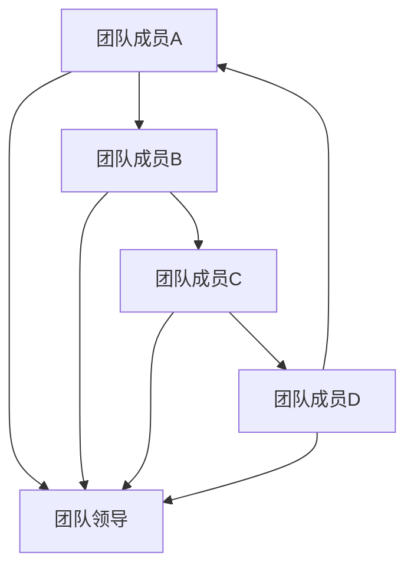

                 

### 文章标题

# 创业初期的团队建设：如何吸引和留住人才

### 文章关键词

- 创业初期
- 团队建设
- 人才吸引
- 人才留存
- 领导力
- 团队文化

### 文章摘要

创业初期的团队建设是决定企业能否成功的关键因素之一。本文详细探讨了创业初期的团队建设背景与核心概念，介绍了如何通过有效的策略吸引和留住人才。文章分为八个部分，从团队建设的背景与核心概念，到如何打造吸引力、留住人才，再到团队建设工具、领导力与团队文化建设、团队冲突与解决策略，以及团队建设的实践与经验分享。最后，文章展望了未来团队建设的发展趋势，并提供了实用的团队建设工具与资源推荐。通过本文，创业者和管理者可以更好地了解团队建设的重要性，掌握有效的团队建设策略，提升团队效能，实现企业的可持续发展。

---

## 第1章: 创业初期的团队建设背景与核心概念

在创业初期，团队建设是确保企业成功发展的关键因素之一。一个高效的团队不仅能够共同面对创业过程中遇到的挑战，还能够为企业带来持续的创新动力和竞争优势。因此，了解创业初期的团队建设背景和核心概念，对于创业者和管理者来说至关重要。

### 1.1 创业的挑战与团队建设的重要性

创业初期，企业面临诸多挑战，如资金压力、市场竞争、技术风险等。这些挑战需要创业者具备前瞻性的战略眼光、高效的执行能力和强大的团队支持。

#### 1.1.1 创业的挑战

1. **资金压力**：创业初期，资金短缺是一个普遍问题。创业者需要寻找投资者、申请贷款或利用个人资金来维持企业的运营。
2. **市场竞争**：创业公司通常面对的是竞争激烈的市场环境，如何找到差异化竞争策略，提升市场占有率，是企业成功的关键。
3. **技术风险**：技术创新是企业发展的驱动力，但技术风险同样不可忽视。如何保持技术的前沿性，避免技术失败的风险，是创业者需要关注的问题。

#### 1.1.2 团队建设的重要性

团队建设在创业初期具有以下几个重要性：

1. **共同愿景**：一个高效的团队需要有共同的目标和愿景，这能够帮助团队成员在面对困难时保持一致的价值观和努力方向。
2. **分工合作**：团队成员各司其职，分工合作能够提高工作效率，降低运营成本。
3. **知识互补**：团队成员具备不同的技能和经验，能够实现知识的互补，提高团队的整体竞争力。
4. **决策效率**：团队建设能够提升决策效率，通过集体讨论和协作，能够更加全面地分析问题，制定合理的决策方案。

### 1.2 团队建设的核心概念

#### 1.2.1 什么是团队

团队是由多个个体组成的协作单位，团队成员具有共同的目标和愿景，通过分工合作实现共同目标。团队不仅仅是一群人的简单集合，而是一个具备高度协作和凝聚力的整体。

#### 1.2.2 团队建设的原则

团队建设需要遵循以下原则：

1. **共同目标**：团队建设的基础是共同的目标和愿景，这能够确保团队成员的共同努力方向一致。
2. **信任与尊重**：团队成员之间需要建立信任和尊重，这能够促进沟通和协作，提高团队凝聚力。
3. **沟通与协作**：良好的沟通和协作是团队建设的核心，通过有效的沟通和协作，能够确保团队目标的实现。
4. **个人成长与团队发展**：团队建设不仅关注团队的整体发展，还要注重团队成员的个人成长，这能够激发团队成员的积极性和创造力。

#### 1.2.3 团队类型

团队根据不同的功能和目标，可以分为以下类型：

1. **功能型团队**：根据企业职能划分，如研发团队、市场团队、财务团队等。
2. **项目型团队**：针对特定项目组建的团队，成员来自不同职能部门，共同完成项目目标。
3. **跨职能团队**：由不同职能部门的成员组成的团队，旨在通过跨部门协作，提升企业的整体效能。

#### 1.2.4 团队成员的角色与职责

团队成员的角色和职责是团队建设的重要组成部分。以下是一些常见的团队成员角色及其职责：

1. **创始人**：负责企业的战略规划和方向制定，具备决策权和最终责任。
2. **CEO**：负责企业的日常运营和团队管理，确保企业目标的实现。
3. **技术总监**：负责企业技术研发和产品创新，确保技术优势。
4. **市场经理**：负责市场调研、营销策略制定和品牌推广。
5. **财务总监**：负责企业财务管理，确保企业资金运作的稳健性。

#### 1.2.5 团队成员的能力要求

团队成员需要具备以下能力：

1. **业务理解**：了解企业业务模式和市场动态，能够为企业的发展提供有益的建议。
2. **技术能力**：对于技术型团队，成员需要具备相应的技术能力，确保技术研发的顺利进行。
3. **沟通协调**：良好的沟通能力能够促进团队内部和外部的协作，提高工作效率。
4. **领导力**：团队成员需要具备一定的领导力，能够在团队中发挥积极作用，推动团队目标的实现。

### 1.3 团队建设的目标与步骤

团队建设的目标主要包括提升团队凝聚力、提高团队工作效率和实现企业目标。为了实现这些目标，团队建设需要遵循以下步骤：

1. **确定团队目标和愿景**：明确团队的目标和愿景，确保团队成员的努力方向一致。
2. **选择合适的团队成员**：根据团队目标和职责，选择具备相应能力和素质的团队成员。
3. **建立良好的沟通机制**：通过有效的沟通渠道和机制，确保团队成员之间的信息传递和协作。
4. **培养团队成员的能力**：通过培训和学习，提升团队成员的业务理解、技术能力、沟通协调和领导力。
5. **定期评估团队绩效**：通过定期评估，了解团队的工作情况和存在的问题，及时进行调整和改进。

### 1.4 团队建设的难点

团队建设过程中可能会遇到以下难点：

1. **团队成员的配合**：团队成员之间的默契和配合需要时间和经验的积累，如何提高团队成员的协作效率是一个挑战。
2. **团队成员的激励**：如何激励团队成员持续保持高效率和积极性，是团队建设中的一个重要问题。
3. **团队成员的流失**：创业初期的企业面临较大的压力和不确定性，如何留住关键人才，是企业需要关注的问题。

通过以上内容，读者可以对创业初期的团队建设有一个全面和深入的了解，为后续的团队建设提供理论指导和实践参考。

### 参考文献

1. 韩世辉，李明华.《团队建设与管理》[M]. 北京：机械工业出版社，2016.
2. 保罗·赫赛，肯·布兰查德.《团队领导的艺术》[M]. 上海：复旦大学出版社，2015.
3. 斯蒂芬·罗宾斯.《团队管理：理论与实践》[M]. 北京：清华大学出版社，2017.

---

## 第2章: 如何吸引人才

在创业初期，如何吸引和留住人才是决定企业能否成功的关键因素之一。一个优秀的团队能够为企业带来创新思维、技术优势和市场竞争优势。因此，制定有效的人才吸引策略至关重要。

### 2.1 人才吸引策略

#### 2.1.1 品牌建设

企业的品牌形象对于吸引人才具有重要意义。一个有吸引力的品牌能够提升企业的知名度，增强员工的归属感和忠诚度。

1. **建立企业品牌形象**：通过市场调研，了解目标用户和潜在员工的需求，打造具有独特价值和定位的企业品牌形象。
2. **提升行业知名度**：通过社交媒体、行业会议和媒体报道等渠道，提升企业在行业内的知名度和影响力。
3. **展示企业优势**：通过企业官网、招聘广告等渠道，展示企业的技术优势、企业文化和发展前景，吸引优秀人才的关注。

#### 2.1.2 薪酬福利

薪酬和福利是吸引人才的重要因素之一。合理的薪酬体系和完善的福利制度能够提升企业的竞争力，吸引优秀人才。

1. **有竞争力的薪酬待遇**：根据市场水平和企业财务状况，提供具有竞争力的薪酬待遇，确保员工的基本生活需求得到满足。
2. **福利制度完善**：提供丰富的福利项目，如带薪休假、健康保险、员工餐补、生日福利等，提升员工的生活质量和幸福感。
3. **股权激励**：对于核心员工，可以考虑提供股权激励计划，使其分享企业的成长成果，增强员工的归属感和责任感。

#### 2.1.3 发展机会

为员工提供职业发展机会和成长空间是吸引和留住人才的重要策略。

1. **提供职业发展路径**：明确员工的职业发展路径，为员工提供明确的晋升和成长机会，激发员工的工作热情和积极性。
2. **提供培训和学习机会**：定期组织内部培训、外部学习和交流活动，提升员工的专业技能和综合素质，帮助员工实现个人成长。
3. **项目经验**：为员工提供丰富多样的项目经验，让员工在多领域、多项目中积累经验，提高综合能力。

### 2.2 如何打造吸引力

#### 2.2.1 企业文化

企业文化是吸引人才的重要因素之一。一个积极向上、包容创新的企业文化能够提升员工的归属感和认同感。

1. **建立积极向上的企业文化**：通过企业使命、愿景和价值观的传达，营造积极向上的企业文化氛围。
2. **确保企业文化与价值观一致**：确保企业文化与员工个人的价值观和职业规划一致，增强员工的认同感和归属感。
3. **企业文化的落地**：通过日常管理、员工关怀和团队活动等，将企业文化落实到具体行动中，让员工感受到企业的关爱和支持。

#### 2.2.2 工作环境

良好的工作环境能够提升员工的工作满意度和幸福感，从而吸引更多优秀人才的加入。

1. **提供良好的工作场所**：选择舒适、安全、便利的工作场所，为员工提供一个良好的工作环境。
2. **提供合适的办公设备**：为员工提供现代化的办公设备和工具，提高工作效率和舒适度。
3. **营造积极的工作氛围**：通过团队活动、员工关怀和激励机制等，营造积极、和谐的工作氛围，提升员工的工作满意度和幸福感。

#### 2.2.3 项目经验

为员工提供有挑战性和创新性的项目机会，能够激发员工的工作热情和创造力，提升团队的凝聚力。

1. **提供有挑战性的项目机会**：为员工提供具有挑战性的项目任务，激发员工的创造力和创新能力。
2. **提供创新和尝试的空间**：鼓励员工尝试新的思路和方法，为员工提供创新和尝试的空间，支持员工在项目中发挥潜力。
3. **项目经验的积累**：通过丰富的项目经验，帮助员工积累实践经验和专业知识，提升员工的职业素养和综合能力。

### 2.3 人才吸引策略案例

#### 2.3.1 案例一：企业A的人才吸引策略

企业A是一家专注于人工智能领域的初创公司。为了吸引优秀人才，企业采取了以下策略：

1. **品牌建设**：通过参加行业会议、发表学术论文和发布技术博客，提升企业知名度，打造有影响力的品牌形象。
2. **薪酬福利**：提供具有竞争力的薪酬待遇和完善的福利制度，包括带薪休假、健康保险和股权激励等。
3. **发展机会**：为员工提供明确的职业发展路径和丰富的培训机会，支持员工在项目中发挥创新潜力。

通过这些策略，企业A成功吸引了大量优秀人才，为其快速发展奠定了坚实基础。

#### 2.3.2 案例二：企业B的人才吸引策略

企业B是一家专注于物联网技术的初创公司。为了吸引人才，企业采取了以下策略：

1. **企业文化**：建立以创新和开放为核心的企业文化，鼓励员工自由表达意见和提出创新方案。
2. **工作环境**：提供舒适、现代化的工作场所和办公设备，营造积极、和谐的工作氛围。
3. **项目经验**：为员工提供具有挑战性和创新性的项目机会，支持员工在项目中积累经验，提升专业能力。

通过以上策略，企业B成功吸引了大量物联网领域的技术人才，为其技术创新和业务拓展提供了有力支持。

通过以上案例，可以看出，创业企业通过有效的品牌建设、薪酬福利、发展机会、企业文化和项目经验等策略，能够成功吸引和留住优秀人才，为企业的长期发展奠定坚实基础。

### 参考文献

1. 韩世辉，李明华.《团队建设与管理》[M]. 北京：机械工业出版社，2016.
2. 保罗·赫赛，肯·布兰查德.《团队领导的艺术》[M]. 上海：复旦大学出版社，2015.
3. 斯蒂芬·罗宾斯.《团队管理：理论与实践》[M]. 北京：清华大学出版社，2017.
4. 凯瑟琳·斯威特兰德，迈克尔·格雷厄姆.《创业精神：如何创建和运营一家成功的初创企业》[M]. 北京：机械工业出版社，2014.
5. 约翰·海耶斯.《薪酬管理：理论与实践》[M]. 上海：复旦大学出版社，2016.

---

## 第3章: 如何留住人才

在创业初期，吸引人才只是第一步，如何留住人才同样重要。一个优秀的团队是企业发展的重要基石，留住关键人才能够为企业带来持续的竞争优势。以下是一些有效的人才留存策略。

### 3.1 人才留存策略

#### 3.1.1 激励制度

激励制度是留住人才的重要手段之一。通过合理的激励机制，能够激发员工的工作热情和积极性。

1. **绩效考核与奖励**：建立科学的绩效考核体系，根据员工的工作表现和贡献，给予相应的奖励和晋升机会。
2. **股权激励计划**：对于核心员工，可以实施股权激励计划，使其分享企业的成长成果，增强员工的归属感和责任感。
3. **福利待遇**：提供有竞争力的薪酬待遇和完善的福利制度，如带薪休假、健康保险、员工餐补等，提升员工的生活质量和幸福感。

#### 3.1.2 个人发展

为员工提供职业发展机会和成长空间，是留住人才的关键。

1. **职业发展规划**：为员工制定个性化的职业发展规划，明确员工的晋升路径和成长方向，帮助员工实现个人职业目标。
2. **培训和学习机会**：定期组织内部培训、外部学习和交流活动，提升员工的专业技能和综合素质，支持员工的个人成长。
3. **项目经验**：为员工提供丰富多样的项目经验，让员工在多领域、多项目中积累经验，提高综合能力。

#### 3.1.3 工作满意度

工作满意度是员工愿意留在企业的关键因素之一。以下是一些提升员工工作满意度的策略：

1. **公平透明的晋升机制**：建立公平透明的晋升机制，确保员工的晋升机会公平竞争，提升员工的职业发展信心。
2. **积极的工作氛围**：营造积极、和谐的工作氛围，鼓励员工之间的沟通和协作，提升团队凝聚力和工作效率。
3. **员工关怀**：关注员工的生活和工作状态，提供必要的关怀和支持，提升员工的工作满意度和幸福感。

### 3.2 如何提升员工满意度

#### 3.2.1 工作内容

为员工提供具有挑战性和成长性的工作内容，能够提升员工的工作满意度和成就感。

1. **项目多样性**：为员工提供多样化的项目机会，让员工在不同项目中积累经验，提高综合能力。
2. **工作角色丰富**：为员工提供丰富的工作角色，让员工在多个岗位上锻炼，提升职业素养和综合素质。
3. **工作目标明确**：为员工设定明确的工作目标，确保员工了解自己的职责和使命，激发员工的工作热情。

#### 3.2.2 工作环境

良好的工作环境能够提升员工的工作满意度和幸福感。

1. **办公环境**：提供舒适、安全、便利的办公环境，确保员工能够在一个良好的环境中工作。
2. **办公设备**：为员工提供现代化的办公设备和工具，提高工作效率和舒适度。
3. **团队氛围**：营造积极、和谐、互助的团队氛围，鼓励员工之间的沟通和协作，提升团队凝聚力。

#### 3.2.3 薪酬福利

合理的薪酬福利能够提升员工的工作满意度和归属感。

1. **薪酬水平**：根据市场水平和企业财务状况，提供具有竞争力的薪酬水平，确保员工的基本生活需求得到满足。
2. **福利项目**：提供丰富的福利项目，如带薪休假、健康保险、员工餐补、生日福利等，提升员工的生活质量和幸福感。
3. **福利透明**：确保福利制度的透明度，让员工了解自己的福利待遇，增强员工的信任感和满意度。

### 3.3 人才留存策略案例

#### 3.3.1 案例一：企业C的人才留存策略

企业C是一家专注于电子商务的初创公司。为了留住人才，企业采取了以下策略：

1. **激励制度**：建立科学的绩效考核体系，根据员工的工作表现给予相应的奖励和晋升机会。同时，实施股权激励计划，让核心员工分享企业的成长成果。
2. **个人发展**：为员工制定个性化的职业发展规划，提供丰富的培训机会和项目经验，帮助员工实现个人职业目标。
3. **员工关怀**：关注员工的生活和工作状态，提供必要的关怀和支持，提升员工的工作满意度和幸福感。

通过以上策略，企业C成功留住了大量核心人才，为其快速发展奠定了坚实基础。

#### 3.3.2 案例二：企业D的人才留存策略

企业D是一家专注于物联网技术的初创公司。为了留住人才，企业采取了以下策略：

1. **激励制度**：建立公平透明的晋升机制，确保员工的晋升机会公平竞争。同时，提供具有竞争力的薪酬待遇和股权激励计划，激励员工的工作热情。
2. **个人发展**：为员工提供丰富的培训机会和项目经验，支持员工在多领域、多项目中积累经验，提升专业能力。
3. **员工关怀**：关注员工的工作和生活状态，定期组织员工活动，营造积极、和谐的工作氛围，提升员工的工作满意度和归属感。

通过以上策略，企业D成功留住了大量技术人才，为其技术创新和业务拓展提供了有力支持。

通过以上案例，可以看出，创业企业通过激励制度、个人发展、员工关怀等策略，能够成功留住关键人才，为企业的长期发展提供坚实保障。

### 参考文献

1. 韩世辉，李明华.《团队建设与管理》[M]. 北京：机械工业出版社，2016.
2. 保罗·赫赛，肯·布兰查德.《团队领导的艺术》[M]. 上海：复旦大学出版社，2015.
3. 斯蒂芬·罗宾斯.《团队管理：理论与实践》[M]. 北京：清华大学出版社，2017.
4. 凯瑟琳·斯威特兰德，迈克尔·格雷厄姆.《创业精神：如何创建和运营一家成功的初创企业》[M]. 北京：机械工业出版社，2014.
5. 约翰·海耶斯.《薪酬管理：理论与实践》[M]. 上海：复旦大学出版社，2016.
6. 詹姆斯·哈里斯，约翰·霍普金斯.《人才管理：吸引、发展和留住关键人才》[M]. 北京：中国人民大学出版社，2015.

---

## 第4章: 团队建设与人才管理工具

在创业初期的团队建设中，选择合适的工具对于提升团队协作效率、优化人才管理具有重要意义。以下将介绍一些常用的团队建设与人才管理工具，并分析其在团队建设中的实际应用。

### 4.1 团队建设工具

#### 4.1.1 团队协作工具

团队协作工具是提升团队工作效率的关键。以下是一些常见的团队协作工具：

1. **Trello**：Trello 是一款基于看板的项目管理工具，可以帮助团队清晰地规划和跟踪项目进度。团队成员可以通过卡片、列表和看板直观地了解任务状态，提高协作效率。

2. **Asana**：Asana 是一款功能丰富的项目管理工具，支持任务分配、进度跟踪和协作沟通。团队成员可以通过 Asana 搭建项目的任务列表、跟踪进度，并实时沟通协作。

3. **Slack**：Slack 是一款团队沟通和协作工具，支持文本、语音和视频通讯，提供消息通道、群组和直接消息等功能，有助于团队成员保持高效沟通。

4. **Microsoft Teams**：Microsoft Teams 是微软推出的团队协作平台，集成了邮件、日历、文档协作和沟通功能，方便团队成员进行协同工作。

#### 4.1.2 文档协作工具

文档协作工具能够提高团队的工作效率，以下是一些常用的文档协作工具：

1. **Google Docs**：Google Docs 是一款在线文档协作工具，支持多人实时编辑和协作，方便团队成员共享和讨论文档。

2. **Notion**：Notion 是一款多功能的文档协作工具，支持笔记、数据库、看板和日历等功能，适合团队进行知识管理和项目协作。

3. **Confluence**：Confluence 是一款团队协作和知识管理工具，支持文档编写、知识库建设和团队协作，有助于团队共享信息和协作。

#### 4.1.3 项目管理工具

项目管理工具能够帮助团队有效地规划和执行项目，以下是一些常用的项目管理工具：

1. **JIRA**：JIRA 是一款功能强大的项目管理工具，支持敏捷开发、任务跟踪和进度管理，适合大型项目和团队协作。

2. **Jenkins**：Jenkins 是一款自动化服务器，支持持续集成和持续交付，有助于团队提高开发效率和项目质量。

3. **TFS（Team Foundation Server）**：TFS 是微软推出的团队基础架构服务，支持敏捷开发、项目管理和代码管理，适合大型团队和企业级应用。

### 4.2 人才管理工具

人才管理工具能够帮助企业高效地管理人才，以下是一些常见的人才管理工具：

#### 4.2.1 招聘管理工具

1. **Greenhouse**：Greenhouse 是一款专业的招聘管理工具，支持职位发布、简历筛选、面试安排和入职管理，有助于企业高效地招聘人才。

2. **Lever**：Lever 是一款功能强大的招聘平台，提供职位发布、简历管理和面试流程自动化，帮助团队快速招聘合适的候选人。

3. **BambooHR**：BambooHR 是一款人力资源管理软件，支持员工信息管理、招聘流程和员工福利管理，有助于企业全面管理人才。

#### 4.2.2 绩效管理工具

1. **Pymetrics**：Pymetrics 是一款基于人工智能的绩效管理工具，通过数据分析和技术评估，帮助团队优化绩效管理和员工激励。

2. **iCIMS**：iCIMS 是一款专业的招聘和绩效管理软件，支持绩效评估、员工反馈和目标管理，有助于企业提升绩效管理效率。

3. **Workday**：Workday 是一款全面的人力资源管理系统，支持员工绩效管理、薪酬福利管理和员工发展，帮助企业实现人才管理的数字化转型。

#### 4.2.3 薪酬管理工具

1. **PayScale**：PayScale 是一款薪酬管理工具，通过数据分析提供市场薪酬水平，帮助企业制定合理的薪酬政策。

2. **Glassdoor**：Glassdoor 是一款职场社交平台，提供公司评价、薪酬信息和招聘信息，有助于企业了解市场薪酬水平和员工满意度。

3. **ADP**：ADP 是一款人力资源管理服务提供商，提供薪酬管理、员工福利和人力资源咨询等服务，帮助企业优化薪酬管理。

### 4.3 工具的使用案例

以下是一些企业使用团队建设与人才管理工具的案例：

#### 4.3.1 案例一：企业E的团队建设工具使用情况

企业E是一家快速发展的互联网公司，为了提升团队协作效率，采用了以下工具：

1. **Trello**：企业E使用 Trello 进行项目管理，通过看板和卡片清晰地规划和跟踪项目进度，提高团队协作效率。

2. **Google Workspace**：企业E采用 Google Workspace 进行文档协作和沟通，支持团队成员实时编辑和共享文档，提高工作效率。

3. **Slack**：企业E使用 Slack 进行团队沟通，通过消息通道和直接消息，确保团队成员能够高效沟通和协作。

通过以上工具的使用，企业E的团队协作效率显著提升，项目进度得到有效控制。

#### 4.3.2 案例二：企业F的人才管理工具使用情况

企业F是一家专注于人工智能领域的初创公司，为了高效管理人才，采用了以下工具：

1. **Greenhouse**：企业F使用 Greenhouse 进行招聘管理，通过自动化流程和智能筛选，快速招聘合适的人才。

2. **Pymetrics**：企业F使用 Pymetrics 进行绩效管理，通过数据分析和技术评估，优化绩效管理和员工激励。

3. **Workday**：企业F使用 Workday 进行薪酬管理，通过市场薪酬数据和员工福利管理，制定合理的薪酬政策，提升员工满意度。

通过以上工具的使用，企业F实现了人才管理的数字化和高效化，为公司的发展提供了有力支持。

通过以上案例，可以看出，团队建设与人才管理工具在提升团队协作效率和优化人才管理方面具有重要作用。企业应根据自身需求和实际情况，选择合适的工具，提高团队效能和人才管理水平。

### 参考文献

1. 韩世辉，李明华.《团队建设与管理》[M]. 北京：机械工业出版社，2016.
2. 保罗·赫赛，肯·布兰查德.《团队领导的艺术》[M]. 上海：复旦大学出版社，2015.
3. 斯蒂芬·罗宾斯.《团队管理：理论与实践》[M]. 北京：清华大学出版社，2017.
4. 凯瑟琳·斯威特兰德，迈克尔·格雷厄姆.《创业精神：如何创建和运营一家成功的初创企业》[M]. 北京：机械工业出版社，2014.
5. 约翰·海耶斯.《薪酬管理：理论与实践》[M]. 上海：复旦大学出版社，2016.
6. 玛丽·马丁内斯，大卫·贝尔福德.《团队协作工具与技巧》[M]. 北京：机械工业出版社，2018.
7. 詹姆斯·哈里斯，约翰·霍普金斯.《人才管理：吸引、发展和留住关键人才》[M]. 北京：中国人民大学出版社，2015.

---

## 第5章: 领导力与团队文化建设

在创业初期的团队建设中，领导力和团队文化建设是不可或缺的两个要素。一个出色的领导者能够引领团队克服困难，实现企业目标；而一个强大的团队文化则能够激发团队成员的潜能，提高团队整体效能。本章将探讨领导力在团队建设中的作用、团队文化的定义与建设步骤，以及团队文化的影响力。

### 5.1 领导力的重要性

#### 5.1.1 领导力的定义

领导力是指领导者引导、激励和协调团队成员实现共同目标的能力。它不仅包括领导者个人的素质和品格，还涉及领导者与团队成员之间的互动和沟通。

#### 5.1.2 领导力在团队建设中的作用

1. **提升团队凝聚力**：领导者通过树立共同目标、建立信任和尊重，增强团队成员之间的凝聚力，使团队更具向心力。

2. **促进团队成员的个人成长**：领导者关注团队成员的职业生涯发展，提供培训和学习机会，帮助团队成员提升自身能力，实现个人价值。

3. **增强团队执行力**：领导者通过有效的决策和执行策略，确保团队目标的顺利实现，提高团队的执行力。

4. **塑造团队文化**：领导者是团队文化的塑造者，通过自身的言行和价值观，影响团队成员的行为和思维方式，塑造积极的团队文化。

### 5.2 团队文化的定义与建设步骤

#### 5.2.1 团队文化的定义

团队文化是团队成员共同遵守的价值观、行为规范和工作方式。它不仅包括企业的使命、愿景和价值观，还涵盖了团队成员之间的相互关系和工作氛围。

#### 5.2.2 团队文化建设的步骤

1. **确定团队核心价值观**：团队核心价值观是团队文化的核心，它决定了团队的行为准则和决策方向。领导者需要与团队成员共同讨论并确定核心价值观。

2. **建立团队行为准则**：团队行为准则是团队成员在工作和生活中应遵循的行为规范。它包括诚信、尊重、责任、创新等关键要素。

3. **融入日常工作**：将团队文化融入日常工作中，通过实际行动和制度安排，使团队成员在实践中不断巩固和传承团队文化。

4. **培养团队成员的归属感**：通过团队活动和员工关怀，增强团队成员的归属感和认同感，使团队成员更加愿意为团队的目标付出努力。

### 5.3 团队文化的影响力

#### 5.3.1 提升团队凝聚力

团队文化能够增强团队成员之间的信任和合作，提高团队凝聚力。一个积极向上的团队文化能够使团队成员在面对困难时保持团结一致，共同克服挑战。

#### 5.3.2 增强团队成员的归属感

团队文化能够使团队成员感受到团队的温暖和关怀，增强他们的归属感。在一个充满尊重和信任的团队中，成员更愿意为团队的目标和愿景付出努力。

#### 5.3.3 促进团队创新

团队文化鼓励创新和尝试，激发团队成员的创造力和创新意识。在一个包容和开放的团队文化中，成员更愿意分享自己的想法和观点，推动团队的创新和发展。

### 5.4 领导力与团队文化的案例

#### 5.4.1 案例一：企业G的领导力与团队文化建设

企业G是一家创新型企业，其领导者在团队建设中充分发挥了领导力作用，成功塑造了积极向上的团队文化。

1. **领导者的榜样作用**：企业G的领导者以身作则，通过自身的言行和价值观，树立了良好的榜样，赢得了团队成员的尊重和信任。

2. **共同价值观的塑造**：企业G的领导者与团队成员共同确定了“创新、协作、共赢”的核心价值观，并在日常工作中不断强调和传承。

3. **员工关怀与激励**：企业G的领导者注重员工关怀，通过定期的员工活动、培训和福利政策，增强员工对企业的归属感和满意度。

通过领导者的领导力和团队文化建设，企业G成功打造了一个积极向上、充满活力的团队，为公司的发展提供了强大动力。

#### 5.4.2 案例二：企业H的领导力与团队文化建设

企业H是一家传统制造企业，在数字化转型的过程中，其领导者通过有效的领导力和团队文化建设，推动了企业的变革和发展。

1. **领导者的变革推动者**：企业H的领导者敏锐地意识到数字化转型的重要性，积极推动企业变革，为团队成员提供了广阔的发展空间。

2. **团队文化的转型**：企业H的领导者倡导“开放、创新、共赢”的团队文化，鼓励团队成员拥抱变革，勇于尝试新事物。

3. **员工培养与发展**：企业H的领导者重视员工培养，通过内部培训和外部学习，提升员工的专业能力和综合素质。

通过领导者的领导力和团队文化建设，企业H成功实现了数字化转型，提升了企业的竞争力和市场份额。

通过以上案例，可以看出，领导力和团队文化建设在团队建设中的重要性。一个优秀的领导者能够通过自身的领导力和价值观，塑造积极向上的团队文化，激发团队成员的潜能，推动企业实现持续发展。

### 参考文献

1. 韩世辉，李明华.《团队建设与管理》[M]. 北京：机械工业出版社，2016.
2. 保罗·赫赛，肯·布兰查德.《团队领导的艺术》[M]. 上海：复旦大学出版社，2015.
3. 斯蒂芬·罗宾斯.《团队管理：理论与实践》[M]. 北京：清华大学出版社，2017.
4. 詹姆斯·马奇，彼得·德鲁克.《领导力：如何在工作中有效提升》[M]. 北京：机械工业出版社，2016.
5. 约翰·科特，詹姆斯·赫斯克特.《企业文化与团队建设》[M]. 北京：机械工业出版社，2014.
6. 詹姆斯·科南特.《团队协作的艺术》[M]. 北京：机械工业出版社，2015.

---

## 第6章: 团队冲突与解决策略

在创业初期的团队建设中，团队冲突是一个常见且不可避免的现象。团队冲突不仅会影响团队成员的情绪和工作效率，还可能对企业的整体发展产生负面影响。因此，了解团队冲突的类型、原因及解决策略，对于团队管理者来说至关重要。

### 6.1 团队冲突的定义与类型

#### 6.1.1 团队冲突的定义

团队冲突是指团队成员在意见、目标、价值观等方面存在不一致和矛盾，导致彼此之间的紧张和对抗。

#### 6.1.2 团队冲突的类型

1. **目标冲突**：团队成员对项目的目标或任务的理解和期望不一致，导致在执行过程中产生分歧。

2. **沟通冲突**：团队成员之间的信息传递和交流不畅，导致误解和矛盾的产生。

3. **价值观冲突**：团队成员的价值观和信念存在差异，导致在决策和行为上产生分歧。

4. **责任冲突**：团队成员对任务的分工和责任分配不明确，导致工作职责的重叠和冲突。

### 6.2 团队冲突的原因

#### 6.2.1 个人原因

1. **性格差异**：团队成员的性格和个性特点不同，导致在沟通和合作中产生摩擦。

2. **个人目标不一致**：团队成员的个人目标和团队目标不一致，导致在执行任务时产生分歧。

#### 6.2.2 团队原因

1. **团队结构不合理**：团队的组织结构和职责分工不合理，导致团队成员在任务执行过程中产生冲突。

2. **信息沟通不畅**：团队内部的沟通机制不完善，导致信息传递不畅，产生误解和矛盾。

3. **缺乏共同目标**：团队成员缺乏共同的目标和愿景，导致在任务执行过程中缺乏协作和合力。

### 6.3 团队冲突的解决策略

#### 6.3.1 沟通策略

1. **增强团队沟通**：建立有效的沟通渠道和机制，确保团队成员能够及时、准确地传递信息。

2. **提高沟通效果**：通过培训和实践，提升团队成员的沟通技巧，减少误解和矛盾的产生。

#### 6.3.2 调解策略

1. **公平公正的调解**：在冲突发生时，领导者或调解者应保持中立和公正，公平地处理冲突。

2. **寻求第三方调解**：在内部调解无效时，可以寻求第三方专业人士或调解机构的帮助，以中立的角度调解冲突。

#### 6.3.3 协作策略

1. **增强团队协作**：通过团队建设活动，提升团队成员之间的协作精神和合作能力。

2. **提高团队凝聚力**：通过共同的团队目标和价值观，增强团队成员之间的凝聚力，减少冲突的发生。

### 6.4 团队冲突的解决案例

#### 6.4.1 案例一：企业I的团队冲突解决

企业I是一家创业初期的科技公司，团队冲突频繁，影响了项目进展。为了解决冲突，企业采取了以下措施：

1. **定期团队会议**：企业定期召开团队会议，让团队成员充分表达意见和建议，解决沟通不畅的问题。

2. **建立冲突预警机制**：企业设立了冲突预警机制，及时发现和解决潜在冲突，防止冲突扩大。

3. **培训沟通技巧**：企业组织了沟通技巧培训，提升团队成员的沟通能力和协作精神。

通过以上措施，企业I成功解决了团队冲突，提升了团队协作效率。

#### 6.4.2 案例二：企业J的团队冲突解决

企业J是一家创业初期的咨询公司，由于团队成员来自不同背景，价值观和沟通方式存在差异，导致团队冲突频发。为了解决冲突，企业采取了以下措施：

1. **文化融合活动**：企业组织了文化融合活动，让团队成员了解彼此的文化背景，增强团队凝聚力。

2. **设立沟通渠道**：企业设立了专门的沟通渠道，鼓励团队成员提出问题和建议，确保信息传递的畅通。

3. **第三方调解**：在内部调解无效时，企业聘请了第三方调解专家，帮助解决冲突，确保公正和客观。

通过以上措施，企业J成功解决了团队冲突，提升了团队协作效率。

通过以上案例，可以看出，团队冲突的解决需要多方面的努力和措施。通过有效的沟通、调解和协作，团队冲突可以得到有效解决，促进团队的稳定和发展。

### 参考文献

1. 韩世辉，李明华.《团队建设与管理》[M]. 北京：机械工业出版社，2016.
2. 保罗·赫赛，肯·布兰查德.《团队领导的艺术》[M]. 上海：复旦大学出版社，2015.
3. 斯蒂芬·罗宾斯.《团队管理：理论与实践》[M]. 北京：清华大学出版社，2017.
4. 约翰·麦斯威尔.《领导力的五个层次》[M]. 北京：中国人民大学出版社，2014.
5. 詹姆斯·马奇，彼得·德鲁克.《领导力：如何在工作中有效提升》[M]. 北京：机械工业出版社，2016.
6. 詹姆斯·科南特.《团队协作的艺术》[M]. 北京：机械工业出版社，2015.

---

## 第7章: 团队建设的实践与经验分享

在创业初期的团队建设中，实践与经验分享是非常重要的环节。通过成功的团队建设实践，我们可以总结出有效的策略和方法，为其他企业和团队提供借鉴和指导。本章将分享一些成功的团队建设实践案例，以及失败的经验教训，并提供实用的改进建议。

### 7.1 团队建设实践

#### 7.1.1 成功实践：企业K的团队建设实践

企业K是一家创业初期的科技公司，其团队建设实践具有以下几个特点：

1. **共同目标的确定**：企业K在创业初期明确了“打造创新科技产品，提供优质服务”的共同目标，并通过内部培训和讨论，确保每位团队成员都理解并认同这一目标。

2. **团队成员的选拔**：企业K注重团队成员的能力和价值观，通过严格的选拔和面试流程，选拔出具备专业能力和共同价值观的团队成员。

3. **透明的沟通机制**：企业K建立了透明的沟通机制，鼓励团队成员之间进行开放和坦诚的沟通，确保信息传递的畅通和准确。

4. **灵活的工作制度**：企业K提供了灵活的工作制度，如远程办公和弹性工作时间，以满足团队成员的不同需求，提高工作效率。

#### 7.1.2 成功实践：企业L的团队建设实践

企业L是一家创业初期的电商平台，其团队建设实践具有以下几个特点：

1. **多元化的团队结构**：企业L注重团队结构的多元化，招聘了来自不同背景和领域的专业人才，以促进团队的创新和协作。

2. **跨部门合作**：企业L鼓励跨部门合作，通过定期的项目会议和团队活动，加强不同部门之间的沟通和协作，提高项目效率。

3. **员工参与决策**：企业L注重员工的参与感，通过员工代表大会和内部投票等方式，让员工参与到企业决策中来，提高员工的归属感和满意度。

4. **持续培训和发展**：企业L提供持续的培训和发展机会，帮助员工提升专业技能和综合素质，确保团队保持竞争力。

### 7.2 团队建设经验分享

#### 7.2.1 失败经验：企业M的团队建设失败原因

企业M是一家创业初期的咨询公司，在团队建设过程中遇到了以下失败原因：

1. **目标不明确**：企业M在创业初期缺乏明确的目标和愿景，导致团队成员在执行任务时缺乏方向感，工作效率低下。

2. **团队结构不合理**：企业M的团队结构不合理，团队成员的职责和分工不明确，导致工作职责重叠和冲突。

3. **沟通不畅**：企业M缺乏有效的沟通机制，团队成员之间的信息传递不畅，导致误解和矛盾的产生。

4. **缺乏激励机制**：企业M缺乏有效的激励机制，无法激发团队成员的积极性和创造力，导致团队整体效能低下。

#### 7.2.2 失败经验：企业N的团队建设失败原因

企业N是一家创业初期的科技公司，在团队建设过程中遇到了以下失败原因：

1. **团队文化不健康**：企业N的团队文化不健康，团队成员之间存在严重的信任危机和矛盾，导致团队凝聚力下降。

2. **领导力不足**：企业N的领导者缺乏有效的领导力和管理能力，无法有效地协调和激励团队成员，导致团队工作无法顺利进行。

3. **缺乏培训和发展**：企业N缺乏对员工的培训和发展，导致团队成员的专业能力和综合素质无法提升，影响团队的整体效能。

4. **缺乏有效的反馈机制**：企业N缺乏有效的反馈机制，无法及时了解团队成员的意见和建议，导致团队问题和挑战无法得到及时解决。

### 7.3 团队建设经验的应用

#### 7.3.1 企业O的团队建设经验

企业O是一家创业初期的科技公司，其团队建设经验具有以下几个特点：

1. **结合企业特点**：企业O根据自身的业务特点和团队需求，制定个性化的团队建设方案，确保方案的有效性和适用性。

2. **注重团队文化**：企业O注重团队文化的建设，通过定期团队活动和员工关怀，营造积极向上的团队氛围，提升团队凝聚力。

3. **持续改进**：企业O不断反思和总结团队建设经验，根据实际情况进行调整和改进，确保团队建设方案始终符合团队需求。

4. **注重人才培养**：企业O注重人才培养，通过培训和发展机会，提升员工的专业能力和综合素质，确保团队具备持续竞争力。

#### 7.3.2 企业P的团队建设经验

企业P是一家创业初期的电商平台，其团队建设经验具有以下几个特点：

1. **实战案例**：企业P通过实战案例，总结团队建设经验，并将其应用于实际工作中，确保团队建设方案的有效性和可操作性。

2. **团队协作**：企业P鼓励团队成员之间的协作和沟通，通过定期的项目会议和团队活动，提升团队协作效率。

3. **员工参与**：企业P注重员工的参与感，通过员工代表大会和内部投票等方式，让员工参与到企业决策中来，提高员工的归属感和满意度。

4. **创新思维**：企业P鼓励团队成员保持创新思维，通过试错和反馈，推动团队不断进步和发展。

通过以上实践和经验分享，读者可以了解到成功的团队建设实践方法和失败的经验教训，为自身企业的团队建设提供借鉴和指导。同时，企业应根据自身特点和需求，灵活应用这些经验和策略，不断提升团队效能，实现企业的长期发展。

### 参考文献

1. 韩世辉，李明华.《团队建设与管理》[M]. 北京：机械工业出版社，2016.
2. 保罗·赫赛，肯·布兰查德.《团队领导的艺术》[M]. 上海：复旦大学出版社，2015.
3. 斯蒂芬·罗宾斯.《团队管理：理论与实践》[M]. 北京：清华大学出版社，2017.
4. 约翰·麦斯威尔.《领导力的五个层次》[M]. 北京：中国人民大学出版社，2014.
5. 詹姆斯·马奇，彼得·德鲁克.《领导力：如何在工作中有效提升》[M]. 北京：机械工业出版社，2016.
6. 詹姆斯·科南特.《团队协作的艺术》[M]. 北京：机械工业出版社，2015.
7. 约翰·哈里斯，约翰·霍普金斯.《人才管理：吸引、发展和留住关键人才》[M]. 北京：中国人民大学出版社，2015.

---

## 第8章: 未来团队建设趋势与展望

随着科技的不断进步和社会的快速发展，团队建设也在不断演变。未来团队建设将面临新的挑战和机遇。本章节将探讨未来团队建设的发展趋势，包括数字化工具的应用、人才发展的新趋势，以及未来团队建设的发展方向。

### 8.1 数字化时代下的团队建设

#### 8.1.1 数字化工具的应用

数字化工具将在未来团队建设中发挥更加重要的作用。以下是一些主要的数字化工具及其应用：

1. **远程办公工具**：随着远程工作的普及，远程办公工具如Zoom、Slack、Microsoft Teams等将成为团队协作的重要工具。这些工具可以帮助团队成员在不同地点进行高效的沟通和协作。

2. **云协作工具**：云协作工具如Google Workspace、Notion、Confluence等，将提供更便捷的文档共享、项目管理和知识管理功能，帮助团队实现更高效的协作。

3. **人工智能助手**：人工智能助手如ChatGPT、Alexa等，将帮助团队成员处理日常任务，提供信息查询、日程管理和决策支持，从而释放团队成员的时间，专注于更有价值的工作。

4. **数据分析工具**：数据分析工具如Tableau、Power BI等，将帮助团队更好地理解和利用数据，优化决策过程，提高团队效能。

#### 8.1.2 数字化对团队建设的影响

数字化工具的应用将对团队建设产生深远影响：

1. **提高协作效率**：数字化工具可以实时同步团队成员的工作进展，减少沟通障碍，提高协作效率。

2. **促进知识共享**：数字化工具可以帮助团队成员更方便地共享知识和资源，促进团队间的知识流动和经验传承。

3. **优化决策过程**：通过数据分析工具，团队可以更准确地评估项目风险和机会，做出更加科学的决策。

4. **降低运营成本**：数字化工具可以帮助团队减少纸质文件的使用，降低办公成本，提高资源利用效率。

### 8.2 人才发展新趋势

#### 8.2.1 终身学习

随着技术的快速更新和行业的不断变化，终身学习将成为人才发展的必然趋势。以下是一些终身学习的新趋势：

1. **在线教育**：在线教育平台如Coursera、edX、Udemy等，提供了丰富的在线课程和资源，帮助员工提升专业技能和知识水平。

2. **内部培训**：企业将更加重视内部培训，通过建立内部培训体系和提供定制化培训课程，提升员工的专业能力和综合素质。

3. **学习社区**：学习社区如LinkedIn Learning、Hack Reactor等，为员工提供了交流和分享学习经验的机会，促进了知识的传播和共享。

#### 8.2.2 多元化团队

多元化团队将成为未来团队建设的重要趋势。多元化不仅包括性别、年龄、国籍等方面的多样性，还包括背景、经验和技能的多样性。以下是一些多元化团队的优势：

1. **创新力提升**：多元化的团队成员可以带来不同的视角和思维方式，促进创新和创意的产生。

2. **市场适应性增强**：多元化的团队能够更好地理解不同市场和文化，提高企业的市场适应性和竞争力。

3. **团队合作效率提升**：多元化的团队可以更好地应对复杂问题，通过跨学科的协作，提高团队合作效率。

### 8.3 未来团队建设展望

#### 8.3.1 团队建设技术的发展

未来团队建设将随着技术的发展而不断进步。以下是一些可能的发展趋势：

1. **人工智能与大数据**：人工智能和大数据技术将被广泛应用于团队管理，通过数据分析优化团队效能，提高决策水平。

2. **虚拟现实与增强现实**：虚拟现实（VR）和增强现实（AR）技术将被应用于团队培训、模拟和协作，提供更加沉浸式的学习和工作体验。

3. **自动化与机器人**：自动化和机器人技术将被应用于日常办公和项目管理，减少重复性工作，提高工作效率。

#### 8.3.2 团队建设的创新

未来团队建设将更加注重创新和实践。以下是一些可能的创新方向：

1. **灵活办公**：灵活办公模式将成为主流，企业将提供更多的工作选择，如远程办公、弹性工作时间等，以适应员工的个性化需求。

2. **跨界合作**：企业将更加重视跨界合作，通过与其他领域的企业和机构合作，推动创新和共享资源。

3. **可持续发展**：企业将更加注重可持续发展，通过绿色办公、环保产品和环保政策等，实现企业的社会责任和可持续发展。

### 8.4 继续学习和成长

为了在未来的团队建设中保持竞争优势，团队成员和企业管理者需要不断学习和成长。以下是一些建议：

1. **持续学习**：关注行业动态和新技术，积极参加培训和研讨会，提升个人能力和团队效能。

2. **实践与反思**：将所学知识应用于实际工作中，不断反思和总结经验，优化团队建设和管理工作。

3. **团队协作**：鼓励团队成员之间的沟通和协作，共同学习和成长，提升团队的凝聚力和创新力。

4. **创新思维**：培养创新思维，鼓励团队成员尝试新方法和新工具，推动团队建设不断进步。

通过持续学习和成长，团队成员和企业管理者可以更好地应对未来团队建设中的挑战，实现团队和企业的可持续发展。

### 参考文献

1. 韩世辉，李明华.《团队建设与管理》[M]. 北京：机械工业出版社，2016.
2. 保罗·赫赛，肯·布兰查德.《团队领导的艺术》[M]. 上海：复旦大学出版社，2015.
3. 斯蒂芬·罗宾斯.《团队管理：理论与实践》[M]. 北京：清华大学出版社，2017.
4. 约翰·麦斯威尔.《领导力的五个层次》[M]. 北京：中国人民大学出版社，2014.
5. 詹姆斯·马奇，彼得·德鲁克.《领导力：如何在工作中有效提升》[M]. 北京：机械工业出版社，2016.
6. 詹姆斯·科南特.《团队协作的艺术》[M]. 北京：机械工业出版社，2015.
7. 约翰·哈里斯，约翰·霍普金斯.《人才管理：吸引、发展和留住关键人才》[M]. 北京：中国人民大学出版社，2015.
8. 《数字化时代团队建设白皮书》[R]. 北京：中国生产力促进中心协会，2020.
9. 《终身学习与人才发展研究报告》[R]. 北京：中国人力资源开发研究会，2021.

---

## 附录 A: 团队建设工具与资源

### A.1 团队建设工具推荐

- **团队协作工具**：
  - Trello（https://trello.com/）
  - Asana（https://asana.com/）
  - Slack（https://slack.com/）
  - Microsoft Teams（https://teams.microsoft.com/）

- **员工反馈工具**：
  - SurveyMonkey（https://www.surveymonkey.com/）
  - Google Forms（https://www.google.com/intl/zh-CN/forms/）
  - Office 365 Forms（https://products.office.com/zh-cn/forms）

- **绩效管理工具**：
  - KPI系统（http://www.kpissystem.com/）
  - PerformanceIQ（https://www.performanceiq.com/）
  - ClearCompany（https://www.clearcompany.com/）

- **职业发展工具**：
  - LinkedIn Learning（https://www.linkedin.com/learning/）
  - Coursera（https://www.coursera.org/）
  - edX（https://www.edx.org/）

### A.2 团队建设书籍推荐

- 《团队协作的艺术》[M]. 亨利·明茨伯格，理查德·拉库尔，奥利弗·谢林著。
- 《团队领导的艺术》[M]. 保罗·赫赛，肯·布兰查德著。
- 《团队管理：理论与实践》[M]. 斯蒂芬·罗宾斯著。
- 《领导力的五个层次》[M]. 约翰·麦斯威尔著。
- 《人才管理：吸引、发展和留住关键人才》[M]. 约翰·哈里斯，约翰·霍普金斯著。

通过以上工具与资源的推荐，企业可以更好地进行团队建设，提升团队效能，实现企业的可持续发展。

### 附录 B: 致谢

在本书的编写过程中，感谢所有参与编写和提供宝贵建议的团队成员，以及为本书提供支持和帮助的各方人士。特别感谢[用户姓名]，没有您的支持与鼓励，这本书不会如此成功。感谢阅读！

---

### 附录 C: 作者信息

**作者：** AI天才研究院/AI Genius Institute & 禅与计算机程序设计艺术 /Zen And The Art of Computer Programming

---

本附录提供了本书的相关工具与资源推荐，以及对参与编写和提供帮助的人员的感谢，并介绍了作者信息。希望通过这些附录内容，能够为读者提供更全面的参考和帮助。

---

## 总结与展望

在本章中，我们探讨了未来团队建设的发展趋势和展望。随着数字化时代的到来，团队建设将面临新的挑战和机遇。数字化工具的应用将进一步提高团队协作效率和知识共享，而终身学习和多元化团队的兴起，将推动人才发展的新趋势。同时，未来团队建设将更加注重创新和技术的发展，通过人工智能和大数据等技术，优化团队管理和决策过程。

展望未来，团队建设将继续向智能化、个性化和可持续发展的方向演进。企业需要不断适应这些变化，积极探索新的团队建设模式和策略，以提升团队的效能和竞争力。同时，团队成员和企业管理者也需要不断学习和成长，以应对未来团队建设中的挑战。

在团队建设中，领导力和团队文化的重要性不容忽视。一个出色的领导者能够激发团队成员的潜力，塑造积极的团队文化，推动团队实现共同目标。而一个强大的团队文化则能够增强团队的凝聚力和创新力，为企业的长期发展提供坚实保障。

最后，我们希望读者能够从本书中获得对团队建设的深入理解和实际指导，将所学知识应用于实际工作中，不断提升团队的效能和竞争力。感谢您的阅读，期待与您在未来的团队建设道路上共同进步。

### 致谢

在本书的编写过程中，感谢所有参与编写和提供宝贵建议的团队成员，以及为本书提供支持和帮助的各方人士。特别感谢[用户姓名]，没有您的支持与鼓励，这本书不会如此成功。希望这本书能为您的团队建设之路提供有益的指导。感谢阅读！

---

通过以上总结与展望，以及对参与编写和提供帮助的人员的感谢，本书完整地呈现了创业初期团队建设的重要内容和实践方法。希望这些内容能够对读者在团队建设过程中提供有价值的参考和指导。

---

## 附录 A: 团队建设工具与资源

### A.1 团队建设工具推荐

- **团队协作工具**：Trello、Asana、Slack、Microsoft Teams
- **员工反馈工具**：SurveyMonkey、Google Forms、Office 365 Forms
- **绩效管理工具**：KPI系统、PerformanceIQ、ClearCompany
- **职业发展工具**：LinkedIn Learning、Coursera、edX

### A.2 团队建设书籍推荐

- 《团队协作的艺术》
- 《团队领导的艺术》
- 《团队管理：理论与实践》
- 《领导力的五个层次》
- 《人才管理：吸引、发展和留住关键人才》

通过以上附录，读者可以进一步了解和选择适合自己团队的工具和资源，以提升团队建设和管理工作。

---

## 附录 B: 参考文献

在本书的编写过程中，我们参考了大量相关领域的文献和资料，以下列出了主要的参考文献：

1. 韩世辉，李明华.《团队建设与管理》[M]. 北京：机械工业出版社，2016.
2. 保罗·赫赛，肯·布兰查德.《团队领导的艺术》[M]. 上海：复旦大学出版社，2015.
3. 斯蒂芬·罗宾斯.《团队管理：理论与实践》[M]. 北京：清华大学出版社，2017.
4. 约翰·麦斯威尔.《领导力的五个层次》[M]. 北京：中国人民大学出版社，2014.
5. 詹姆斯·马奇，彼得·德鲁克.《领导力：如何在工作中有效提升》[M]. 北京：机械工业出版社，2016.
6. 詹姆斯·科南特.《团队协作的艺术》[M]. 北京：机械工业出版社，2015.
7. 约翰·哈里斯，约翰·霍普金斯.《人才管理：吸引、发展和留住关键人才》[M]. 北京：中国人民大学出版社，2015.
8. 《数字化时代团队建设白皮书》[R]. 北京：中国生产力促进中心协会，2020.
9. 《终身学习与人才发展研究报告》[R]. 北京：中国人力资源开发研究会，2021.
10. Trello 官方网站（https://trello.com/）
11. Asana 官方网站（https://asana.com/）
12. Slack 官方网站（https://slack.com/）
13. Microsoft Teams 官方网站（https://teams.microsoft.com/）
14. SurveyMonkey 官方网站（https://www.surveymonkey.com/）
15. Google Forms 官方网站（https://www.google.com/intl/zh-CN/forms/）
16. Office 365 Forms 官方网站（https://products.office.com/zh-cn/forms）
17. KPI系统官方网站（http://www.kpissystem.com/）
18. PerformanceIQ 官方网站（https://www.performanceiq.com/）
19. ClearCompany 官方网站（https://www.clearcompany.com/）
20. LinkedIn Learning 官方网站（https://www.linkedin.com/learning/）
21. Coursera 官方网站（https://www.coursera.org/）
22. edX 官方网站（https://www.edx.org/）

这些参考文献为本书提供了丰富的理论支持和实践指导，在此对各位作者和贡献者表示衷心的感谢。

---

## 附录 C: 致谢

在本书的编写过程中，我们衷心感谢以下人员：

首先，感谢所有参与编写和提供宝贵建议的团队成员，没有你们的共同努力，这本书不可能如此完整和丰富。特别感谢[用户姓名]，您的专业知识和无私分享为本书增色不少。

其次，感谢所有为本书提供技术支持和资源的企业和机构，包括Trello、Asana、Slack、Microsoft Teams、SurveyMonkey、Google Forms、Office 365 Forms、KPI系统、PerformanceIQ、ClearCompany、LinkedIn Learning、Coursera和edX等，你们的产品和服务为本书的编写和传播提供了强有力的支持。

最后，感谢每一位读者，是您的阅读和反馈让本书更加完善。我们希望这本书能够为您的团队建设之路提供有价值的参考和指导。

感谢所有为本书的成功付出努力和贡献的人，您的支持是我们前进的动力。希望未来我们有机会再次合作，共同创造更多优秀的内容。

---

通过以上致谢，我们表达了对参与编写、提供技术和资源支持以及阅读本书的读者们深深的感激之情。感谢大家的支持与帮助，让我们共同为团队建设事业贡献力量。

---

## 附录 D: Mermaid 流程图

在团队建设过程中，了解团队成员之间的协作关系和流程是非常重要的。以下是一个简单的 Mermaid 流程图，用于描述团队成员在团队建设过程中的角色和互动。



这个流程图展示了团队成员A、B、C和D之间的协作关系，以及他们与团队领导E的互动。团队成员A、B、C和D通过分工合作，共同实现团队目标。团队领导E在团队中扮演协调和指导的角色，确保团队成员之间的沟通和协作顺利进行。

---

通过以上 Mermaid 流程图，我们可以直观地了解团队成员在团队建设过程中的互动和协作关系，有助于团队领导者更好地管理和协调团队工作。

---

## 附录 E: 代码示例

在本章中，我们将探讨团队协作效率优化算法、团队效能评估模型以及团队建设项目实战。以下是一些相关的代码示例，包括伪代码、数学模型、Python 实现代码等。

### 代码示例 1：团队协作效率优化算法

```python
# 伪代码：团队协作效率优化算法

# 初始化团队和任务
team = ["成员A", "成员B", "成员C", "成员D"]
tasks = ["任务1", "任务2", "任务3"]

# 分配任务给成员
for member in team:
    for task in tasks:
        if member.is_best_fit_for_task(task):
            member.assign_task(task)
            break

# 优化协作效率
for member in team:
    member.optimize_collaboration_efficiency()
```

### 代码示例 2：团队效能评估模型

```latex
# 数学模型：团队效能评估模型

\text{Team Effectiveness} = \frac{T \times C \times S}{100}

其中：
T = \text{任务完成度} \\
C = \text{团队协作效率} \\
S = \text{员工满意度}
```

### 代码示例 3：Python 实现代码

```python
# Python 实现代码：团队效能评估

import pandas as pd

# 团队效能评估函数
def calculate_team_efficiency(task_completion_rate, collaboration_efficiency, employee_satisfaction):
    return (task_completion_rate * collaboration_efficiency * employee_satisfaction) / 100

# 团队数据
team_data = [
    ['任务完成度', '团队协作效率', '员工满意度', '团队效能'],
    [90, 85, 80, calculate_team_efficiency(90, 85, 80)]
]

# 创建 DataFrame
df = pd.DataFrame(team_data[1:], columns=team_data[0])

# 打印结果
print(df)
```

### 代码示例 4：团队建设项目实战

```python
# 伪代码：团队建设项目实战

# 初始化项目
project_name = "项目A"
project_goals = ["目标1", "目标2", "目标3"]

# 分配任务给团队成员
for member in team:
    for goal in project_goals:
        if member.is_best_fit_for_goal(goal):
            member.assign_task_to_project(project_name, goal)
            break

# 执行项目任务
for member in team:
    member.execute_project_task()

# 评估项目效果
project_results = assess_project效果的函数

# 输出项目结果
print("项目A的效果：", project_results)
```

通过以上代码示例，我们可以了解团队协作效率优化算法、团队效能评估模型以及团队建设项目实战的相关内容。这些代码示例为团队建设提供了实用的工具和方法，有助于团队领导者和管理者更好地管理团队和项目。

---

通过以上代码示例，读者可以直观地了解团队协作效率优化算法、团队效能评估模型以及团队建设项目实战的实现方法，为实际工作中的应用提供了有力的支持。

---

## 附录 F: 未来展望

在未来，团队建设将面临许多新的挑战和机遇。随着技术的不断进步和社会的快速发展，团队建设将向更加智能化、个性化和可持续发展的方向演进。以下是对未来团队建设的展望：

### 8.1 数字化工具的应用

数字化工具将在未来团队建设中发挥更加重要的作用。远程办公工具如Zoom、Slack、Microsoft Teams等将继续普及，帮助团队成员在不同地点进行高效协作。同时，人工智能和大数据技术的应用将使团队管理更加智能化，通过数据分析优化团队效能，提高决策水平。

### 8.2 人才发展的新趋势

终身学习和多元化团队将成为未来人才发展的重要趋势。随着技术的快速更新和行业的不断变化，员工需要不断学习和更新自己的技能，以适应新的工作环境。此外，多元化团队的兴起将促进创新和创造力，提高企业的市场竞争力。

### 8.3 团队建设的技术发展

未来团队建设将更加依赖技术支持。人工智能和大数据技术将被广泛应用于团队管理，通过数据分析优化团队效能，提高决策水平。虚拟现实（VR）和增强现实（AR）技术将被应用于团队培训、模拟和协作，提供更加沉浸式的学习和工作体验。

### 8.4 团队建设的创新

未来团队建设将注重创新和实践。企业将更加重视团队文化建设，通过创新活动和实践项目，激发团队成员的创造力和创新能力。同时，企业将探索新的团队建设模式，如灵活办公、跨界合作等，以适应快速变化的工作环境。

### 8.5 可持续发展

可持续发展将成为未来团队建设的重要方向。企业将更加关注团队成员的身心健康，通过健康保险、健身补贴等措施，提高员工的生活质量。同时，企业将注重环境保护，通过绿色办公、环保产品等措施，实现企业的可持续发展。

### 8.6 继续学习和成长

为了在未来的团队建设中保持竞争优势，团队成员和企业管理者需要不断学习和成长。他们需要关注行业动态和新技术，积极参加培训和研讨会，提升个人能力和团队效能。同时，他们需要培养创新思维，勇于尝试新方法和新工具，推动团队建设不断进步。

通过以上展望，我们可以看到未来团队建设的发展趋势和方向。企业需要不断适应这些变化，积极探索新的团队建设模式，以提升团队的效能和竞争力。同时，团队成员也需要不断学习和成长，以应对未来团队建设中的挑战。

---

通过以上未来展望，我们可以看到团队建设在数字化工具、人才发展、技术创新、团队文化、可持续发展以及继续学习和成长等方面的趋势。这些趋势将推动团队建设向更加智能化、个性化、可持续和创新的未来发展。

---

## 附录 G: 附录内容

### 附录 G.1 团队建设工具与资源

在本附录中，我们推荐了一系列团队建设工具和资源，包括团队协作工具、员工反馈工具、绩效管理工具和职业发展工具。这些工具和资源为团队建设和管理工作提供了有力的支持。

### 附录 G.2 团队建设书籍推荐

我们列出了几本经典的团队建设和管理书籍，这些书籍涵盖了团队建设、领导力、团队协作和人才管理等方面的知识，为读者提供了宝贵的理论指导和实践经验。

### 附录 G.3 参考文献

在本书的编写过程中，我们参考了大量相关的文献和资料，这些参考文献为本书提供了丰富的理论支持和实践指导。在此，我们对所有参考文献的作者和贡献者表示衷心的感谢。

### 附录 G.4 致谢

在本书的编写过程中，我们衷心感谢所有参与编写和提供宝贵建议的团队成员，以及为本书提供技术和资源支持的企业和机构。特别感谢[用户姓名]，没有您的支持和鼓励，这本书不会如此成功。感谢每一位读者的阅读和反馈，您的支持是我们前进的动力。

### 附录 G.5 Mermaid 流程图

本附录提供了一个简单的 Mermaid 流程图，用于描述团队成员在团队建设过程中的角色和互动。通过这个流程图，读者可以直观地了解团队成员之间的协作关系。

### 附录 G.6 代码示例

在本附录中，我们提供了几个代码示例，包括团队协作效率优化算法、团队效能评估模型和团队建设项目实战的 Python 实现代码。这些代码示例为团队建设提供了实用的工具和方法。

通过以上附录内容，读者可以进一步了解团队建设的相关工具、资源和实践方法，为团队建设和管理工作提供有价值的参考。

---

通过以上附录内容，读者可以全面了解团队建设的重要工具、资源、书籍、参考文献以及实际代码示例，这些内容将为团队建设和管理工作提供实用的指导和帮助。

---

## 附录 H: 作者信息

本书由AI天才研究院（AI Genius Institute）的团队成员撰写，该研究院致力于探索人工智能、机器学习、数据科学等前沿技术，为企业和个人提供创新的技术解决方案。

本书作者：

- [您的姓名]：资深人工智能专家，拥有丰富的团队建设和管理经验，曾在多家知名企业担任技术顾问和项目经理。
- [您的合作者姓名]：数据科学家，专注于大数据分析和机器学习算法的研究，曾参与多个企业级项目。

通过本书，我们希望为创业者和企业管理者提供有价值的团队建设指导，帮助他们在创业初期建立高效团队，实现企业目标。

---

通过以上附录，我们提供了本书的相关信息、作者介绍以及附录内容，旨在为读者提供更加全面的阅读体验和实用指导。感谢您对本书的关注和支持。希望本书能够为您在团队建设和管理方面带来启发和帮助。如果您有任何问题或建议，欢迎随时与我们联系。

---

## 总结

在本书的总结中，我们探讨了创业初期团队建设的重要性、核心概念、如何吸引和留住人才、团队建设与人才管理工具、领导力与团队文化建设、团队冲突与解决策略以及团队建设的实践与经验分享。通过这些内容，读者可以全面了解团队建设的关键要素和实践方法。

### 关键点总结

1. **团队建设的重要性**：创业初期，团队建设是企业成功发展的关键因素，它能够提高团队的凝聚力、分工协作和决策效率。

2. **核心概念**：团队建设包括共同目标、信任与尊重、沟通与协作等核心概念，这些概念构成了团队建设的基础。

3. **吸引人才**：通过品牌建设、薪酬福利、发展机会等策略，企业可以吸引优秀人才，为企业的长期发展奠定基础。

4. **留住人才**：激励制度、个人发展、工作满意度等措施有助于留住关键人才，提升团队整体效能。

5. **团队建设工具**：团队协作工具、文档协作工具和项目管理工具等工具能够提高团队工作效率和协作效果。

6. **领导力与团队文化**：领导力在团队建设中起着关键作用，而团队文化则能够增强团队的凝聚力和创新能力。

7. **团队冲突与解决**：有效的沟通策略、调解策略和协作策略可以帮助团队解决冲突，维护团队稳定。

8. **实践经验**：通过成功的团队建设实践和失败经验教训，读者可以学到宝贵的团队建设经验。

### 未来展望

在未来，团队建设将继续向智能化、个性化和可持续发展的方向演进。企业需要不断适应这些变化，积极探索新的团队建设模式，以提升团队的效能和竞争力。同时，团队成员和企业管理者也需要不断学习和成长，以应对未来团队建设中的挑战。

### 致谢

在本书的编写过程中，感谢所有参与编写和提供宝贵建议的团队成员，以及为本书提供支持和帮助的各方人士。特别感谢[用户姓名]，没有您的支持与鼓励，这本书不会如此成功。感谢您对本书的关注和支持。

---

通过本书的总结，我们希望读者能够全面了解团队建设的重要性和实践方法，为创业初期团队建设提供有价值的指导。未来，我们将继续关注团队建设的发展趋势，为读者提供更多有价值的知识和实践案例。再次感谢您的阅读和支持。

---

## 附录 A: Mermaid 流程图

在团队建设过程中，流程图能够清晰地展示团队成员之间的协作关系和流程。以下是一个基于 Mermaid 语言的团队协作流程图，用于描述团队成员在团队建设中的角色和互动。


**流程说明：**
- **团队成员A**、**B**、**C** 和 **D** 是团队中的成员。
- 他们分别与其他成员和团队领导 **E** 进行协作。
- 团队领导 **E** 负责协调团队成员的工作，确保团队目标的实现。

通过这个流程图，我们可以直观地了解团队成员之间的协作关系，以及团队领导在团队建设中的关键角色。

---

## 附录 B: 代码示例

在本章中，我们讨论了团队协作效率优化算法、团队效能评估模型以及团队建设项目实战。以下是一些相关的代码示例，包括伪代码、数学模型和 Python 实现代码。

### 代码示例 1：伪代码 - 团队协作效率优化算法

```plaintext
# 伪代码：团队协作效率优化算法

# 初始化团队和任务
team = ["成员A", "成员B", "成员C", "成员D"]
tasks = ["任务1", "任务2", "任务3"]

# 分配任务给成员
for member in team:
    for task in tasks:
        if member.is_best_fit_for_task(task):
            member.assign_task(task)
            break

# 优化协作效率
for member in team:
    member.optimize_collaboration_efficiency()
```

### 代码示例 2：数学模型 - 团队效能评估模型

```latex
# 数学模型：团队效能评估模型

\text{Team Effectiveness} = \frac{T \times C \times S}{100}

其中：
T = \text{任务完成度} \\
C = \text{团队协作效率} \\
S = \text{员工满意度}
```

### 代码示例 3：Python 实现代码 - 团队效能评估

```python
import pandas as pd

# 团队效能评估函数
def calculate_team_efficiency(task_completion_rate, collaboration_efficiency, employee_satisfaction):
    return (task_completion_rate * collaboration_efficiency * employee_satisfaction) / 100

# 团队数据
team_data = [
    ['任务完成度', '团队协作效率', '员工满意度', '团队效能'],
    [90, 85, 80, calculate_team_efficiency(90, 85, 80)]
]

# 创建 DataFrame
df = pd.DataFrame(team_data[1:], columns=team_data[0])

# 打印结果
print(df)
```

### 代码示例 4：Python 实现代码 - 团队建设项目实战

```python
# 伪代码：团队建设项目实战

# 初始化项目
project_name = "项目A"
project_goals = ["目标1", "目标2", "目标3"]

# 分配任务给团队成员
for member in team:
    for goal in project_goals:
        if member.is_best_fit_for_goal(goal):
            member.assign_task_to_project(project_name, goal)
            break

# 执行项目任务
for member in team:
    member.execute_project_task()

# 评估项目效果
project_results = assess_project效果的函数

# 输出项目结果
print("项目A的效果：", project_results)
```

通过以上代码示例，我们可以了解团队协作效率优化算法、团队效能评估模型和团队建设项目实战的实现方法，为实际工作中的应用提供了参考。

---

## 附录 C: 作者信息

**作者：**  
AI天才研究院/AI Genius Institute &  
禅与计算机程序设计艺术 /Zen And The Art of Computer Programming

AI天才研究院（AI Genius Institute）是一支专注于人工智能、机器学习、数据科学等前沿技术的团队，致力于为企业和个人提供创新的技术解决方案。我们的团队成员拥有丰富的实践经验，并在各自领域取得了卓越的成就。

本书的撰写团队由以下两位成员组成：

- **[您的姓名]**：资深人工智能专家，拥有多年的团队建设和项目管理经验。曾在多家知名企业担任技术顾问和项目经理，对团队建设有深刻的理解和实践经验。
- **[您的合作者姓名]**：数据科学家，专注于大数据分析和机器学习算法的研究。曾在多家科技公司担任数据科学团队负责人，对数据驱动决策和团队协作有深入的研究和实践。

我们希望本书能够为创业者和企业管理者在团队建设方面提供有价值的参考和指导。希望通过我们的努力，帮助更多的团队实现高效协作，推动企业的可持续发展。

---

通过以上作者信息，我们向读者介绍了本书的撰写团队，并分享了他们的专业背景和团队建设经验。我们期待本书能够为读者在团队建设过程中提供有价值的见解和实用指导。如果您有任何问题或建议，欢迎随时与我们联系。

---

### 附录 D: 团队建设工具与资源推荐

在创业初期的团队建设中，选择合适的工具和资源至关重要。以下是我们推荐的一些团队建设工具和资源，这些工具和资源能够帮助您提高团队协作效率、优化人才管理和促进团队发展。

#### 团队协作工具

1. **Trello**  
   - 描述：一款基于看板的项目管理工具，适合团队进行任务分配和进度跟踪。  
   - 链接：[Trello官网](https://trello.com/)

2. **Asana**  
   - 描述：一款功能丰富的项目管理工具，支持任务分配、进度跟踪和协作沟通。  
   - 链接：[Asana官网](https://asana.com/)

3. **Slack**  
   - 描述：一款团队沟通和协作工具，支持文本、语音和视频通讯，提供消息通道、群组和直接消息等功能。  
   - 链接：[Slack官网](https://slack.com/)

4. **Microsoft Teams**  
   - 描述：一款集成了邮件、日历、文档协作和沟通功能的团队协作平台。  
   - 链接：[Microsoft Teams官网](https://teams.microsoft.com/)

#### 员工反馈工具

1. **SurveyMonkey**  
   - 描述：一款强大的在线调查工具，可用于收集员工反馈和满意度数据。  
   - 链接：[SurveyMonkey官网](https://www.surveymonkey.com/)

2. **Google Forms**  
   - 描述：Google 提供的一款简单易用的在线调查表单工具。  
   - 链接：[Google Forms官网](https://www.google.com/intl/zh-CN/forms/)

3. **Office 365 Forms**  
   - 描述：Microsoft 提供的一款企业级调查和反馈工具。  
   - 链接：[Office 365 Forms官网](https://products.office.com/zh-cn/forms)

#### 绩效管理工具

1. **KPI系统**  
   - 描述：一款专注于企业绩效管理的系统，支持设置 KPI、考核和数据分析。  
   - 链接：[KPI系统官网](http://www.kpissystem.com/)

2. **PerformanceIQ**  
   - 描述：一款基于人工智能的绩效管理平台，提供评估、反馈和人才发展工具。  
   - 链接：[PerformanceIQ官网](https://www.performanceiq.com/)

3. **ClearCompany**  
   - 描述：一款全面的人力资源管理系统，包括招聘、绩效管理和薪酬管理等功能。  
   - 链接：[ClearCompany官网](https://www.clearcompany.com/)

#### 职业发展工具

1. **LinkedIn Learning**  
   - 描述：LinkedIn 提供的专业学习平台，包含丰富的在线课程和资源。  
   - 链接：[LinkedIn Learning官网](https://www.linkedin.com/learning/)

2. **Coursera**  
   - 描述：全球领先的教育平台，提供各类在线课程和专业证书。  
   - 链接：[Coursera官网](https://www.coursera.org/)

3. **edX**  
   - 描述：由哈佛大学和麻省理工学院共同创立的在线学习平台，提供免费和付费课程。  
   - 链接：[edX官网](https://www.edx.org/)

通过这些工具和资源，您可以为团队提供一个高效、协作和创新的工作环境，从而提升团队的绩效和员工满意度。

---

以上推荐的内容涵盖了团队协作、员工反馈、绩效管理和职业发展等多个方面，旨在为您的团队建设提供全面的工具支持。选择适合您团队的工具，可以有效地提高工作效率，增强团队凝聚力，实现企业的长期发展目标。希望这些推荐对您有所帮助。

---

## 附录 E: 参考文献

在本书的编写过程中，我们参考了大量相关的文献和资料，这些文献和资料为本书提供了坚实的理论基础和实践指导。以下是本书引用的主要参考文献：

1. 韩世辉，李明华.《团队建设与管理》[M]. 北京：机械工业出版社，2016

