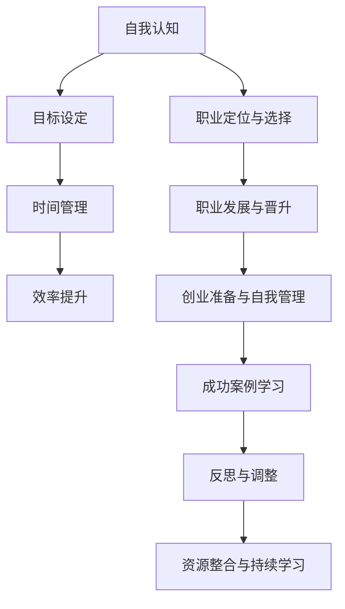

                 

## 引言

### 创业者的自我管理与职业生涯规划

在当今这个快速变化的时代，创业者面临着前所未有的挑战与机遇。无论是初创企业，还是大型企业的创业团队，创业者都需要具备出色的自我管理能力和科学的职业生涯规划。这两个方面不仅决定了创业的成败，也深刻影响着个人的成长和职业发展。

### 什么是自我管理？

自我管理是指个人对自己行为、时间和情绪的调节和控制能力。对于创业者而言，自我管理尤为重要，因为它直接影响到创业的效率、决策的质量以及应对挑战的能力。自我管理不仅仅是时间管理，还包括情绪管理、目标设定、工作习惯的养成等多个方面。

### 什么是职业生涯规划？

职业生涯规划是指个人在职业发展过程中，通过自我认知、目标设定、路径规划、持续学习等步骤，有意识地规划和调整自己的职业发展路径。对于创业者来说，职业生涯规划不仅是为了实现个人职业目标，更是为了确保创业过程中能够持续获得必要的技能和资源。

### 为什么自我管理与职业生涯规划对创业者至关重要？

#### 提高效率

有效的自我管理能够帮助创业者合理安排时间，提高工作效率，从而在有限的时间内完成更多任务，为创业项目的顺利推进打下坚实的基础。

#### 明确目标

通过科学的职业生涯规划，创业者能够清晰地设定自己的职业目标，并为实现这些目标制定可行的行动计划，确保创业过程中的每一步都朝着既定目标前进。

#### 预防风险

自我管理能力强的创业者更容易应对创业过程中的各种挑战和不确定性，从而降低创业风险，提高成功的可能性。

#### 促进成长

持续的学习和自我提升是职业生涯规划的核心，创业者通过不断学习和调整，能够不断提升自己的专业能力和领导力，为创业的成功奠定坚实的基础。

### 本文结构

本文将围绕创业者的自我管理和职业生涯规划，从以下几个方面展开：

1. **自我管理基础**：包括自我认知与目标设定、时间管理与效率提升等。
2. **职业生涯规划**：涵盖职业生涯规划概述、职业定位与选择、职业发展与晋升、创业准备与自我管理。
3. **实践与反思**：通过成功创业者的案例分析和职业生涯规划的持续调整来总结和反思。

### 核心关键词

- **自我管理**
- **职业生涯规划**
- **创业者**
- **目标设定**
- **时间管理**
- **效率提升**
- **职业定位**
- **职业发展**

通过本文，希望读者能够对创业者的自我管理和职业生涯规划有更深入的理解，并能够将其应用到实际的创业实践中去。

### 摘要

本文旨在探讨创业者的自我管理与职业生涯规划的重要性，以及如何通过科学的方法和策略来提升自我管理能力和职业生涯规划的成效。文章分为三个主要部分，首先介绍了自我管理的基础，包括自我认知与目标设定、时间管理与效率提升。然后详细阐述了职业生涯规划的相关内容，包括职业定位与选择、职业发展与晋升、创业准备与自我管理。最后，通过成功创业者的案例分析，以及职业生涯规划的持续调整，总结了创业者在自我管理和职业生涯规划中的实践与反思。本文的目标是帮助创业者更好地认识自我，设定明确的目标，提升管理能力，从而在创业道路上取得成功。

## 第一部分：自我管理基础

### 第1章：自我认知与目标设定

#### 1.1 自我认知的重要性

自我认知是自我管理的基础，它帮助我们了解自己的内在特质、能力、兴趣和价值观，从而更好地规划个人发展和职业生涯。创业者通过自我认知，可以明确自己的优势与劣势，找到最适合自己的发展路径。

##### **自我评估工具**

自我评估是自我认知的重要环节。以下是一些常用的自我评估工具：

- **SWOT分析**：SWOT分析是一种常用的自我评估方法，它通过对自身优势（Strengths）、劣势（Weaknesses）、机会（Opportunities）和威胁（Threats）进行分析，帮助创业者全面了解自己的状况。
  
- **MBTI性格测试**：MBTI（Myers-Briggs Type Indicator）是一种基于心理学理论的性格测试，它可以帮助创业者了解自己的性格类型，从而更好地理解自己的行为模式。

- **职业兴趣测试**：职业兴趣测试可以帮助创业者了解自己对不同职业的兴趣程度，从而找到最适合自己的职业方向。

##### **自我优势与劣势分析**

在自我评估过程中，创业者需要深入分析自己的优势与劣势。以下是一些具体的分析方法和技巧：

- **优势分析**：识别自己的专业技能、经验、知识、人际关系等优势，并思考如何利用这些优势提升工作效率和竞争力。

- **劣势分析**：识别自己的弱点，如沟通能力不足、管理经验缺乏等，并思考如何通过学习和培训来克服这些劣势。

#### 1.2 目标设定原理

目标设定是自我管理的核心环节，它能够帮助创业者明确自己的发展方向和努力的方向。一个有效的目标应当遵循SMART法则，即具体（Specific）、可衡量（Measurable）、可实现（Achievable）、相关（Relevant）和有时限（Time-bound）。

##### **SMART目标法则**

- **具体（Specific）**：目标应当明确具体，避免模糊和抽象。例如，“提高销售额”不如“将本季度销售额提升20%”。

- **可衡量（Measurable）**：目标应当可以量化，以便于评估进展和结果。例如，“提升团队凝聚力”不如“通过团队建设活动，使团队满意度提升30%”。

- **可实现（Achievable）**：目标应当具有挑战性，但也要确保通过努力可以实现。例如，“成为行业领导者”可能过于宏大，而“在本季度实现10%的市场份额增长”则更具实现性。

- **相关（Relevant）**：目标应当与自身的职业目标和企业发展目标相一致。例如，如果企业目标是扩大市场份额，那么个人目标可以是“开发新的客户关系管理策略”。

- **有时限（Time-bound）**：目标应当设定一个明确的完成时限。例如，“在未来三个月内实现目标”，比没有时间限制的目标更具紧迫性和执行力。

##### **目标分解与时间管理**

设定目标后，创业者需要将其分解为具体的任务和行动，并制定合理的时间表。以下是一些目标分解与时间管理的技巧：

- **任务分解**：将目标分解为具体的任务，并明确每个任务的负责人和完成时间。

- **优先级排序**：根据任务的紧急程度和重要性，对任务进行优先级排序，确保关键任务得到优先处理。

- **时间块管理**：将工作时间划分为不同的时间块，并为每个时间块安排具体的任务，避免时间的浪费。

- **定期回顾**：定期回顾目标的进展情况，调整计划以适应实际情况。

#### 1.3 目标调整与持续优化

目标设定并不是一成不变的，创业者需要根据实际情况和环境变化，不断调整和优化目标。以下是一些目标调整与持续优化的策略：

- **环境变化**：当外部环境发生变化时，创业者需要及时调整目标，确保其仍然符合自身和企业的发展方向。

- **反馈机制**：建立有效的反馈机制，收集团队成员和利益相关者的反馈，了解目标设定的合理性和执行效果。

- **持续学习**：创业者需要不断学习新的知识和技能，提升自身的能力和视野，从而更好地实现目标。

通过自我认知与目标设定，创业者能够明确自己的发展方向，提升自我管理能力，为职业生涯的持续进步奠定坚实基础。

### 第2章：时间管理与效率提升

#### 2.1 时间管理的重要性

时间管理是自我管理的重要组成部分，它直接影响到创业者的工作效率和生活质量。有效的时间管理不仅能帮助创业者充分利用时间资源，还能提高工作效率，减少压力，从而在竞争激烈的创业环境中占据优势。

##### **时间观念的形成**

形成良好的时间观念是时间管理的第一步。以下是一些有助于建立时间观念的方法：

- **定期反思**：定期回顾自己的时间使用情况，分析哪些活动是必要的，哪些是浪费时间的，从而逐步培养对时间价值的感觉。

- **设定时间限制**：为各种活动设定时间限制，例如，每天早上7点到8点是个人时间，8点到9点是工作准备时间，9点到12点是处理紧急事务时间，等等。这样可以确保每个时间段都有明确的目标和任务。

- **优先处理重要任务**：在每天的工作计划中，优先处理最重要和最紧急的任务，确保关键任务得到及时完成。

##### **时间管理的好处**

时间管理的好处体现在多个方面：

- **提高工作效率**：通过合理规划时间，创业者可以更高效地完成工作，减少不必要的拖延和浪费。

- **减少压力**：有效的时间管理能减少时间焦虑和工作压力，提高生活质量。

- **更好地平衡工作与生活**：合理安排时间，确保工作与生活的平衡，避免因过度工作而忽视了家庭和个人生活。

#### 2.2 时间管理技巧

##### **四象限法则**

四象限法则是时间管理中的一种常用方法，它将任务分为四个象限，分别是紧急且重要、紧急但不重要、不紧急但重要、不紧急且不重要。通过这种方法，创业者可以更清晰地了解任务的优先级，从而更好地安排时间。

- **紧急且重要**：这类任务通常是突发事件或重要会议，必须立即处理。
- **紧急但不重要**：这类任务可能会耗费大量时间，但可能对目标实现影响不大，可以考虑委托他人处理。
- **不紧急但重要**：这类任务通常是对长期目标的贡献，需要合理安排时间，确保完成。
- **不紧急且不重要**：这类任务可以暂时搁置，或者完全删除。

##### **GTD（Getting Things Done）方法**

GTD是一种系统化的时间管理方法，旨在帮助创业者高效地处理任务和事务。GTD的核心原则包括收集、整理、处理、组织、回顾和执行。

- **收集**：将所有需要处理的任务和想法记录下来，放入任务清单中。
- **整理**：对任务清单进行分类和整理，确保每项任务都有明确的处理方式。
- **处理**：对每项任务进行评估，决定是立即执行、推迟执行、删除还是委托他人。
- **组织**：将任务按照优先级和截止时间进行排列，制定详细的执行计划。
- **回顾**：定期回顾任务清单和执行情况，确保没有遗漏。
- **执行**：按照计划执行任务，确保每项任务都能按时完成。

##### **时间块管理**

时间块管理是将工作时间划分为若干个时间块，并为每个时间块分配具体的任务。这种方法可以帮助创业者集中精力处理特定任务，避免分散注意力。

- **划分时间块**：将工作时间划分为多个时间段，例如，上午9点到11点是处理重要邮件时间，下午2点到4点是处理会议安排时间。
- **任务匹配**：根据每个时间块的特点和任务需求，将相应的任务分配到对应的时间块。
- **专注执行**：在分配的时间块内，尽量减少干扰，专注于任务的执行。

#### 2.3 提升工作效率

##### **工作习惯的养成**

良好的工作习惯是提升工作效率的关键。以下是一些有助于养成良好工作习惯的方法：

- **定时休息**：工作一段时间后，定时休息可以帮助恢复精力，提高工作效率。例如，工作45分钟后，休息10分钟。
- **避免拖延**：设立明确的目标和截止时间，避免拖延，确保任务按时完成。
- **减少干扰**：在工作时间避免使用手机、社交媒体等干扰工具，集中精力处理任务。
- **规律作息**：保持规律的作息时间，确保充足的睡眠，有助于提高工作效率。

##### **信息过滤与处理**

在信息爆炸的时代，创业者需要有效地过滤和处理信息，以确保信息的高效利用。以下是一些信息过滤与处理的技巧：

- **筛选关键信息**：通过筛选和分类，将重要的信息与冗余的信息区分开来，确保关键信息得到及时处理。
- **利用工具**：利用各种工具，如邮件管理软件、信息过滤器等，提高信息处理效率。
- **及时跟进**：对于重要的信息，及时跟进并处理，避免因拖延而导致的损失。

##### **高效工具的使用**

高效的工具能够大大提升工作效率。以下是一些常用的高效工具：

- **项目管理工具**：如Trello、Asana等，可以帮助创业者更好地管理任务和团队协作。
- **笔记软件**：如Evernote、OneNote等，可以方便地记录和整理笔记，提高工作效果。
- **时间跟踪工具**：如Toggl、RescueTime等，可以监控和优化时间使用，提高工作效率。

通过掌握和运用这些时间管理技巧和提升工作效率的方法，创业者能够更好地利用时间资源，提高工作效率，为创业的持续成功奠定基础。

### 第3章：职业生涯规划概述

#### 3.1 职业生涯规划的重要性

职业生涯规划是创业者个人发展和成功的关键因素之一。它不仅仅是为了实现个人的职业目标，更是为了确保在竞争激烈的创业环境中，创业者能够持续成长和获得成功。以下从几个方面探讨职业生涯规划的重要性：

##### **职业发展的关键阶段**

职业生涯规划首先需要明确职业发展的关键阶段，这些阶段通常是：

- **探索阶段**：这是职业发展的初期，创业者需要尝试不同的工作，了解自己的兴趣、能力和价值观，从而找到最适合自己的职业方向。
- **成长阶段**：在这一阶段，创业者需要在专业领域内不断学习，提升自己的技能和知识，逐步建立起自己的专业能力和影响力。
- **稳定阶段**：在这个阶段，创业者需要巩固自己的职业地位，确保职业生涯的稳定发展，同时为未来的职业发展做好准备。
- **转型阶段**：随着环境和自身情况的变化，创业者可能需要调整自己的职业方向，实现职业转型，以适应新的发展需求。

##### **职业生涯规划的影响**

职业生涯规划对创业者的个人发展和职业成功有着深远的影响：

- **目标明确**：通过职业生涯规划，创业者可以明确自己的职业目标，制定具体的行动计划，确保每一步都朝着目标前进。
- **资源整合**：职业生涯规划可以帮助创业者更好地整合个人资源和外部资源，包括技能、知识和人脉，为职业发展提供强有力的支持。
- **风险规避**：科学的职业生涯规划可以帮助创业者预见职业发展中的潜在风险，并采取预防措施，降低失败的可能性。
- **持续成长**：职业生涯规划鼓励创业者不断学习和提升，保持职业发展的动力，从而在竞争激烈的市场中立于不败之地。

#### 3.2 职业生涯规划原则

为了确保职业生涯规划的实效性，创业者需要遵循以下原则：

##### **个人与环境的适应性**

职业生涯规划需要考虑个人与环境的适应性，这包括：

- **个人特质与职业需求的匹配**：创业者需要了解自己的性格、兴趣和能力，并将其与职业需求相匹配，选择最适合自己的职业方向。
- **外部环境的适应**：创业者需要关注行业趋势、市场需求和职业机会，确保自己的职业规划与外部环境相适应。

##### **长期性与灵活性**

职业生涯规划应当具有长期性和灵活性：

- **长期性**：职业生涯规划需要考虑长期的职业发展，设定长期目标和规划，确保职业发展的连续性和稳定性。
- **灵活性**：职业生涯规划需要具备灵活性，能够根据实际情况和环境变化进行调整，确保规划始终符合个人和外部环境的需求。

##### **不断学习和调整**

持续学习和调整是职业生涯规划的核心原则：

- **持续学习**：创业者需要不断学习新的知识和技能，提升自身能力，以适应不断变化的市场环境。
- **定期调整**：创业者需要定期回顾和评估职业规划的实施情况，及时调整目标和计划，确保职业发展的顺利推进。

通过遵循以上原则，创业者可以制定出科学、合理的职业生涯规划，确保个人在职业发展过程中始终保持清晰的方向和持续的动力。

#### 3.3 职业生涯规划与自我管理的关系

职业生涯规划与自我管理是相辅相成的，它们共同构成了创业者成功的基石。以下是两者之间的密切关系：

##### **自我管理是职业生涯规划的执行保障**

自我管理能力是职业生涯规划能够有效执行的基础。创业者通过自我管理，能够更好地控制自己的行为和时间，确保按照职业生涯规划设定的目标和计划前进。以下是自我管理在职业生涯规划执行中的作用：

- **时间管理**：通过有效的时间管理，创业者能够确保在职业生涯规划中设定的每个目标和任务都得到及时处理，避免拖延和遗漏。
- **情绪管理**：情绪管理有助于创业者保持冷静和积极的心态，应对职业生涯规划实施过程中遇到的挑战和困难，从而确保规划的顺利执行。
- **目标调整**：自我管理能力强的创业者能够根据实际情况和环境变化，灵活调整职业生涯规划中的目标和计划，确保规划始终符合个人和外部环境的需求。

##### **职业生涯规划是自我管理的方向指引**

职业生涯规划为创业者提供了明确的发展方向和目标，是自我管理的方向指引。以下是职业生涯规划在自我管理中的作用：

- **目标设定**：职业生涯规划中的目标是自我管理的核心，创业者通过设定具体的职业目标，可以明确自我管理的方向和重点。
- **行动规划**：职业生涯规划中的行动计划为创业者提供了明确的行动步骤，创业者可以根据这些步骤进行自我管理，确保每个行动都朝着目标前进。
- **持续学习**：职业生涯规划强调持续学习和能力提升，这促使创业者不断进行自我管理，保持学习和成长的动力。

##### **相互促进与协同发展**

职业生涯规划与自我管理是相互促进、协同发展的。通过有效的职业生涯规划，创业者可以明确自己的职业目标和发展路径，从而有针对性地进行自我管理。同时，通过自我管理，创业者能够更好地执行职业生涯规划中的目标和任务，确保规划的顺利实施。

- **动态调整**：职业生涯规划不是一成不变的，创业者需要根据实际情况和环境变化进行动态调整。自我管理能力强的创业者能够及时识别和应对变化，确保职业生涯规划的持续有效性。
- **能力提升**：通过职业生涯规划，创业者可以明确自己需要提升的能力和技能，从而有针对性地进行自我管理，不断提升自身能力，为职业生涯的持续发展奠定基础。

综上所述，职业生涯规划与自我管理是创业者成功的双刃剑，二者相互依赖、相互促进，共同推动了创业者的职业发展和个人成长。

### 第4章：职业定位与选择

#### 4.1 职业定位方法

职业定位是职业生涯规划的重要环节，它关乎创业者如何找到最适合自己的职业方向。以下是一些职业定位的方法：

##### **内外因素分析**

职业定位需要综合考虑内外因素，包括个人能力和市场机会。

- **内部因素**：内部因素主要包括个人兴趣、价值观、技能和能力。创业者需要深入分析自己的兴趣和价值观，了解自己的优势和劣势，从而找到与自己性格和技能相匹配的职业。
  
- **外部因素**：外部因素主要包括行业趋势、市场需求和职业机会。创业者需要关注行业的发展动态，了解当前市场需求和未来趋势，选择有潜力的职业方向。

##### **职业市场趋势**

创业者可以通过以下途径了解职业市场趋势：

- **行业报告**：阅读专业的行业报告，了解行业的发展状况、市场趋势和未来方向。
  
- **职业论坛**：参加职业论坛和讲座，与行业专家和同行交流，了解当前的职业需求和职业前景。

- **社交媒体**：关注行业相关的社交媒体账号和讨论组，获取实时信息和观点。

##### **个人兴趣与能力匹配**

个人兴趣与能力匹配是职业定位的关键。以下是一些实现匹配的方法：

- **职业性格测试**：通过职业性格测试，了解自己的性格类型，从而找到与自己性格相匹配的职业。

- **职业咨询**：寻求职业咨询师的帮助，进行一对一的职业咨询，找到适合自己的职业方向。

- **实习和兼职**：通过实习和兼职，亲身体验不同职业，了解自己的兴趣和能力，从而做出更明智的职业选择。

#### 4.2 职业选择策略

职业选择策略是创业者根据职业定位的结果，制定具体的职业选择方案。以下是一些职业选择策略：

##### **职业目标设定**

设定明确的职业目标是职业选择的第一步。职业目标应当包括短期和长期目标，例如：

- **短期目标**：在短期内实现哪些具体的职业目标，如提升某项技能、获得某个证书或找到一份合适的工作。
  
- **长期目标**：在长期内实现哪些职业成就，如成为某个领域的专家、创业或实现职业转型。

##### **职业路径规划**

职业路径规划是指根据职业目标，制定具体的职业发展路径。以下是一些职业路径规划的策略：

- **逐步晋升**：通过在当前职业中逐步晋升，积累经验和技能，为未来的职业发展打下基础。

- **跨部门或跨行业转型**：根据市场需求和个人兴趣，考虑跨部门或跨行业转型，寻找新的职业机会。

- **继续教育和培训**：通过继续教育和培训，提升自己的知识和技能，为职业发展提供更强的支持。

##### **职业转换与适应**

职业转换是指从当前职业转向新的职业。以下是一些职业转换与适应的策略：

- **提前准备**：在职业转换前，提前准备相关的知识和技能，确保能够顺利适应新的职业。

- **网络拓展**：建立广泛的人脉网络，获取职业转换的信息和机会。

- **积极沟通**：与新的同事和上级积极沟通，了解职业要求和期望，快速适应新的工作环境。

通过科学合理的职业定位和职业选择策略，创业者能够找到最适合自己的职业方向，为职业生涯的持续发展奠定坚实基础。

### 第5章：职业发展与晋升

#### 5.1 职业发展路径

职业发展路径是指个人在职业生涯中从初级职位到高级职位的成长过程。了解职业发展路径对于创业者来说至关重要，它不仅能够帮助创业者明确自己的职业发展方向，还能为他们的职业规划提供指导。

##### **初级、中级、高级职业阶段**

职业发展通常分为初级、中级和高级三个阶段：

- **初级阶段**：这是职业生涯的初期，创业者通常在初级职位上积累经验和技能。在这个阶段，创业者需要关注以下几点：

  - **技能积累**：通过实际工作，学习和掌握必备的技能和知识，为职业发展打下坚实的基础。
  - **适应能力**：快速适应工作环境，了解公司的文化和工作方式，建立良好的同事关系。
  - **自我提升**：主动寻找学习和成长的机会，如参加培训课程、阅读相关书籍等。

- **中级阶段**：在中级职位上，创业者需要承担更多的责任和任务，成为团队的核心成员。在这个阶段，创业者需要注重以下几点：

  - **专业能力**：进一步深化专业知识，提升自己的技术水平和解决问题的能力。
  - **团队协作**：培养团队领导力，增强团队协作能力，提升团队的整体绩效。
  - **业务拓展**：积极参与公司的业务拓展和项目管理，积累更多的业务经验。

- **高级阶段**：在高级职位上，创业者通常担任重要管理岗位，如部门经理或公司高管。在这个阶段，创业者需要具备以下能力：

  - **战略眼光**：具备战略规划能力，能够从全局角度审视公司的未来发展，制定合理的战略和目标。
  - **领导能力**：具备强大的领导力，能够激励和带领团队，实现公司的长远目标。
  - **决策能力**：具备快速决策和应对突发事件的能力，确保公司能够应对市场变化和挑战。

##### **跨部门与跨行业职业发展**

跨部门和跨行业职业发展是创业者提升职业高度和广度的有效途径。以下是一些跨部门和跨行业职业发展的策略：

- **跨部门发展**：通过跨部门工作机会，创业者可以拓展自己的业务领域，提高综合素质。具体策略包括：

  - **主动沟通**：主动与不同部门的同事交流，了解他们的工作内容和需求，寻找合作机会。
  - **跨部门项目**：参与跨部门的重大项目，提升自己的协调能力和项目管理能力。
  - **内部转岗**：通过内部转岗机会，实现职业领域的转换，拓宽自己的职业发展空间。

- **跨行业发展**：跨行业发展可以帮助创业者开拓新的职业领域，实现职业的升级和转型。以下是一些跨行业发展的策略：

  - **行业调研**：了解不同行业的发展状况和趋势，找到与自身能力和兴趣相匹配的行业。
  - **行业交流**：参加行业交流活动，与行业专家和同行建立联系，获取行业信息和资源。
  - **转型准备**：在跨行业前，做好充分的准备，包括知识储备、技能提升和职业转换的规划。

通过了解职业发展路径，创业者能够更清晰地规划自己的职业发展，找到合适的职业发展方向，提升职业高度和广度，实现职业生涯的持续成功。

#### 5.2 晋升策略

晋升是创业者职业生涯中一个重要的里程碑，它不仅代表了个人能力的提升，也为未来的职业发展提供了更多机会。以下是一些有效的晋升策略：

##### **个人品牌建设**

个人品牌建设是晋升的关键因素之一。通过以下策略，创业者可以提升个人品牌：

- **专业知识**：不断学习和提升自己的专业知识，成为行业内的专家，增强个人竞争力。
- **业务成果**：通过优异的业务成果展示自己的价值，例如完成重要项目、提升团队绩效等。
- **口碑传播**：积极与同事、上级和客户建立良好的关系，通过口碑传播提升个人声誉。
- **形象塑造**：注重个人形象和职业礼仪，保持专业和自信的形象。

##### **沟通与人际关系管理**

良好的沟通和人际关系管理能力对晋升至关重要。以下是一些具体策略：

- **有效沟通**：学会倾听和表达，确保信息传递准确无误，减少误解和冲突。
- **建立人脉**：积极参与社交活动，建立广泛的人脉网络，获取更多的职业机会和资源。
- **团队合作**：在团队中发挥积极作用，协调各方利益，提升团队整体绩效。
- **领导能力**：培养领导力，能够带领团队完成任务，赢得上级和同事的信任和支持。

##### **持续学习和职业素养提升**

持续学习和职业素养提升是晋升的重要保障。以下是一些策略：

- **专业培训**：参加专业培训和认证，提升自己的专业技能和知识水平。
- **阅读和知识积累**：阅读行业相关书籍和文章，积累知识，保持对行业动态的敏锐度。
- **自我反思**：定期进行自我反思，分析自己的优势和不足，制定改进计划。
- **跨领域学习**：拓展自己的知识面，学习跨领域的知识和技能，增强综合素质。

通过实施这些晋升策略，创业者能够不断提升自身能力和竞争力，为职业晋升创造有利条件。

### 第6章：创业准备与自我管理

#### 6.1 创业的必要条件

创业不仅仅是一个想法，更是需要一系列准备和条件的支持。以下是一些创业的必要条件，这些条件对于创业者的成功至关重要。

##### **创业精神的培养**

创业精神是创业者成功的重要因素之一，它包括创新思维、冒险精神、执着追求和持续学习等特质。以下是一些培养创业精神的方法：

- **创新思维**：鼓励创业者勇于尝试新思路，不断寻求改进和创新的方法，以解决市场需求。
- **冒险精神**：培养敢于冒险和承担风险的勇气，敢于挑战现状，抓住机遇。
- **执着追求**：在创业过程中遇到困难和挫折时，保持坚定的信念，持续努力，不轻言放弃。
- **持续学习**：不断学习新的知识和技能，以适应快速变化的市场环境和需求。

##### **创业机会的识别**

识别和把握创业机会是创业成功的关键。以下是一些识别创业机会的方法：

- **市场需求**：深入了解市场需求，发现未被满足的消费者需求或市场缺口。
- **技术趋势**：关注行业技术发展趋势，利用新技术创造新的商业模式或产品。
- **社会变化**：关注社会变化和趋势，如人口结构变化、消费者行为变化等，寻找新的商业机会。
- **竞争分析**：分析竞争对手的弱点和优势，发现市场机会，并制定相应的战略。

##### **创业团队的构建**

创业团队是创业成功的重要支撑，一个高效的团队能够为创业提供强大的合力。以下是一些构建创业团队的方法：

- **共同目标**：确保团队成员有共同的目标和愿景，共同为创业项目努力。
- **互补能力**：选择具有不同技能和经验的人加入团队，实现能力的互补和协作。
- **文化契合**：建立积极向上的企业文化，确保团队成员之间相互信任和支持。
- **透明沟通**：建立有效的沟通机制，确保信息透明和及时传达，避免误解和冲突。

#### 6.2 创业中的自我管理

创业过程中，自我管理尤为重要，它直接影响到创业者的心理状态、工作效率和团队协作。以下是一些创业中的自我管理策略：

##### **创业过程中的心理调适**

创业过程中，创业者会面临各种心理压力和挑战，以下是一些心理调适的策略：

- **积极心态**：保持积极的心态，相信自己的能力和团队的力量，面对困难和挫折时不轻言放弃。
- **情绪管理**：学会管理自己的情绪，避免情绪波动对工作和团队的影响，保持冷静和理智。
- **自我激励**：设立短期和长期的目标，通过实现目标来激励自己，保持创业的动力和热情。

##### **创业资源的管理与调配**

创业资源包括资金、人力、时间和物资等，合理管理和调配资源是创业成功的关键。以下是一些创业资源管理策略：

- **资金管理**：制定详细的财务计划，确保资金合理使用，避免浪费和过度投资。
- **人力资源管理**：合理安排团队工作，确保每个成员都能充分发挥自己的能力，提升团队整体绩效。
- **时间管理**：充分利用时间，制定详细的工作计划，确保每项任务都能按时完成。
- **物资管理**：合理采购和储备物资，确保生产和运营的顺利进行。

##### **创业过程中的时间管理**

创业过程中的时间管理尤为重要，以下是一些时间管理策略：

- **优先级排序**：将任务按照优先级排序，确保关键任务得到优先处理。
- **时间块管理**：将工作时间划分为不同的时间块，并为每个时间块安排具体的任务，避免时间的浪费。
- **定期回顾**：定期回顾时间使用情况，分析时间使用效果，及时调整计划。

通过有效的自我管理和资源调配，创业者能够更好地应对创业过程中的挑战，提高工作效率和团队协作能力，为创业的成功奠定坚实的基础。

### 第7章：成功创业者的自我管理案例

#### 7.1 成功创业者的特质

成功创业者通常具备一系列独特的特质，这些特质不仅使他们能够在创业过程中克服各种困难，还能确保他们的企业持续成长和成功。以下是一些成功创业者的特质及其具体表现：

##### **坚韧不拔**

成功创业者往往具备坚韧不拔的精神，他们能够在面对困难和挫折时不轻言放弃。例如，苹果公司创始人史蒂夫·乔布斯在推出iPod和iPhone之前，曾经历过多次失败和挫折。然而，他始终坚持自己的信念，不断尝试和改进，最终创造了革命性的产品。

##### **创新思维**

创新思维是成功创业者的重要特质之一。他们能够不断寻找新的解决方案，突破传统思维模式，创造出具有竞争力的产品或服务。例如，亚马逊创始人杰夫·贝佐斯通过创建在线书店，颠覆了传统零售模式，为消费者提供了便捷的购物体验。

##### **领导能力**

成功创业者通常具备强大的领导能力，能够带领团队实现共同目标。他们能够激励团队成员，发挥每个人的潜力，并建立高效的团队协作机制。例如，谷歌联合创始人拉里·佩奇和谢尔盖·布林通过卓越的领导力，打造了一支充满创新和激情的团队，使谷歌成为全球最大的搜索引擎。

##### **决策能力**

成功创业者具备出色的决策能力，能够在面对复杂和不确定的情况时做出明智的决策。他们能够迅速分析问题，权衡利弊，并采取行动。例如，微软创始人比尔·盖茨在个人电脑兴起时，迅速决策投资操作系统软件，从而把握住了市场的机遇。

##### **持续学习**

成功创业者始终保持对知识的渴望，不断学习新的知识和技能。他们通过不断学习，提升自己的能力和视野，确保企业在不断变化的市场环境中保持竞争力。例如，特斯拉创始人埃隆·马斯克通过学习各种领域的知识，成功地推动了电动汽车和太空探索技术的发展。

#### 7.2 创业过程中面临的挑战与应对

尽管成功创业者具备上述特质，但他们在创业过程中仍然面临诸多挑战。以下是一些常见的挑战及其应对策略：

##### **资金短缺**

资金短缺是创业过程中最常见的问题之一。创业者需要通过多种途径筹集资金，包括个人储蓄、天使投资、风险投资等。例如，Uber的创始人格拉哈尔·卡兰和崔斯特·卡兰在创业初期，通过个人储蓄和天使投资，成功筹集了足够的资金，支持了公司的早期发展。

##### **市场竞争**

在激烈的市场竞争中，创业者需要不断创新和优化产品或服务，以保持竞争优势。例如，微软在个人电脑市场上面对着IBM、苹果等竞争对手，通过不断推出新技术和产品，保持了领先地位。

##### **团队管理**

团队管理是创业过程中的另一个重要挑战。创业者需要培养和激励团队成员，建立高效的团队协作机制。例如，谷歌通过实施“20%时间项目”政策，鼓励员工利用20%的工作时间进行创新和探索，从而激发了团队的创造力和创新能力。

##### **市场拓展**

市场拓展是创业者需要面对的长期挑战。他们需要不断开拓新市场，扩大客户基础。例如，特斯拉在电动汽车市场上面对着传统汽车制造商的激烈竞争，通过在全球范围内建立销售网络和充电站，成功开拓了国际市场。

#### 7.3 案例分析

以下通过两个成功创业者的案例，进一步探讨他们在自我管理方面的实践和成就：

##### **案例一：创业者A的创业之路**

创业者A在创业初期，通过自我评估工具识别了自己的优势和劣势。他发现自己在市场营销方面具有优势，但在财务管理方面存在不足。因此，他决定专注于市场营销，同时聘请专业的财务人员来管理公司的财务。

在时间管理方面，创业者A采用了GTD（Getting Things Done）方法，将每天的任务分解为具体的时间块，并严格按照时间表执行。这种方法帮助他提高了工作效率，确保每个任务都按时完成。

在创业过程中，创业者A还面临着市场竞争和团队管理的挑战。他通过不断学习和参加行业会议，了解市场动态和竞争态势，制定了有效的市场拓展策略。同时，他通过建立积极的团队文化，激励团队成员共同努力，实现了公司的快速发展。

##### **案例二：创业者B的职业生涯规划**

创业者B在职业生涯规划方面有着明确的目标和计划。他在创业之前，曾担任一家大型企业的市场总监，积累了丰富的市场和管理经验。在创业初期，他设定了短期目标，如开发首款产品并实现市场推广，以及长期目标，如打造一个具有竞争力的品牌。

在自我管理方面，创业者B采用了多种策略，如定期进行自我反思和调整，确保自己的职业生涯规划始终符合实际情况。他还通过参加专业培训和阅读相关书籍，不断提升自己的知识和技能，以应对市场竞争和业务拓展的需求。

通过上述案例分析，我们可以看到，成功创业者通过自我管理，不仅克服了创业过程中的各种挑战，还实现了企业的持续成长和成功。这些案例为创业者提供了宝贵的经验和启示，帮助他们更好地应对创业过程中的挑战，实现自己的职业目标。

### 第8章：职业生涯规划与自我管理反思

#### 8.1 自我管理反思的重要性

职业生涯规划与自我管理反思是创业者成长过程中不可或缺的环节。反思不仅能够帮助创业者总结过去的经验和教训，还能为未来的发展提供宝贵的指导。以下是自我管理反思的重要性及其在职业生涯规划中的应用：

##### **识别问题**

反思是识别问题的有效方法。通过反思，创业者可以深入分析自己在职业生涯规划中的不足和问题，如时间管理不当、目标设定不明确、资源分配不合理等。这些问题的识别有助于创业者及时调整策略，避免未来出现类似的问题。

##### **经验积累**

反思是经验积累的重要途径。通过反思，创业者可以总结自己在职业生涯规划中的成功经验和失败教训。这些经验不仅有助于创业者自身的发展，还能为其他创业者提供有益的参考。创业者可以通过撰写反思日记、参与讨论组和咨询专业人士等方式，将反思成果转化为实际的行动。

##### **持续改进**

反思是持续改进的动力。通过反思，创业者可以认识到自己的不足，并采取相应的措施进行改进。这种持续改进的过程有助于创业者不断提升自己的能力和素质，确保职业生涯规划的顺利实施。

##### **适应变化**

反思是适应变化的重要工具。创业过程中，市场环境和竞争态势不断变化，创业者需要具备快速适应和调整的能力。通过反思，创业者可以及时了解市场变化，调整自己的职业生涯规划，确保始终与市场发展保持同步。

#### 8.2 反思在职业生涯规划中的作用

反思在职业生涯规划中扮演着多重角色，它不仅是问题识别和经验积累的工具，更是实现职业生涯目标的关键环节。以下是反思在职业生涯规划中具体作用：

- **目标调整**：通过反思，创业者可以评估目标的实现情况，发现目标设定中的不合理之处，从而进行调整和优化。例如，如果某个长期目标在执行过程中遇到了困难，创业者可以将其分解为更小、更具体的目标，逐步实现。

- **策略优化**：反思有助于创业者分析职业生涯规划中的策略是否合理，是否需要调整。例如，如果发现某项任务的时间管理效率较低，创业者可以重新规划时间安排，或者寻求外部资源支持。

- **能力提升**：反思是创业者能力提升的重要途径。通过反思，创业者可以识别自己在技能和知识方面的不足，并制定相应的学习计划，提升自身的综合素质。

- **决策优化**：在职业生涯规划中，创业者需要做出多个关键决策。通过反思，创业者可以评估决策的效果，分析决策过程中的优缺点，为未来的决策提供参考。

#### 8.3 反思对个人成长的影响

反思不仅影响职业生涯规划，还对个人成长产生深远影响。以下是反思对个人成长的影响：

- **自我认知**：反思有助于创业者更深入地了解自己，认识到自己的优点和不足。这种自我认知有助于创业者明确自己的发展方向，制定更符合个人特点的职业规划。

- **情绪调节**：反思可以帮助创业者更好地管理情绪，避免因挫折和困难而情绪失控。通过反思，创业者可以找到情绪调节的方法，如倾诉、运动等，保持良好的心态。

- **心理韧性**：反思是培养心理韧性的重要途径。通过反思，创业者可以认识到自己在面对困难和挫折时的应对策略，学会从失败中吸取教训，不断提升自己的心理韧性。

- **行为改变**：反思有助于创业者改变不良行为，培养良好习惯。例如，如果发现自己在时间管理方面存在问题，创业者可以通过制定详细的时间计划、使用时间管理工具等方式，改善时间管理能力。

通过反思，创业者不仅能够优化职业生涯规划，提升个人成长，还能在创业道路上更加坚定和自信地前进。

### 附录

#### 附录A：职业生涯规划与自我管理资源

为了帮助创业者更好地进行职业生涯规划与自我管理，以下提供了一些实用的资源和工具：

##### **职业规划工具**

- **职业性格测试**：如MBTI（Myers-Briggs Type Indicator）测试和DISC测试，帮助创业者了解自己的性格类型，从而更好地选择职业方向。
- **职业兴趣测试**：如霍兰德职业兴趣测试，帮助创业者发现与自己兴趣相符的职业。
- **职业竞争力评估**：如盖洛普优势识别器，评估创业者在职业发展中的优势和能力。

##### **自我管理工具**

- **时间管理软件**：如Trello、Asana、Slack等，帮助创业者规划和跟踪任务进度。
- **习惯养成应用**：如 Habitica，通过游戏化方式帮助创业者养成良好的工作和生活习惯。
- **个人成长书籍**：如《高效能人士的七个习惯》、《深度工作》等，提供自我管理的方法和技巧。

##### **职业发展资源**

- **行业报告**：如市场研究公司发布的行业报告，帮助创业者了解行业趋势和市场动态。
- **职业发展论坛**：如LinkedIn、职业社交平台等，创业者可以在这里分享经验、寻求建议和获取职业机会。
- **在线课程平台**：如Coursera、Udemy等，提供各种专业课程和证书项目，帮助创业者提升知识和技能。

这些资源和工具将为创业者的职业生涯规划与自我管理提供有力支持，帮助他们更好地实现职业目标。

### Mermaid 流程图：职业生涯规划流程

此流程图展示了职业生涯规划的主要步骤和环节，帮助创业者理清职业发展的路径和关键点。通过不断的反思和调整，创业者能够确保职业生涯规划的实效性，实现持续成长和成功。

