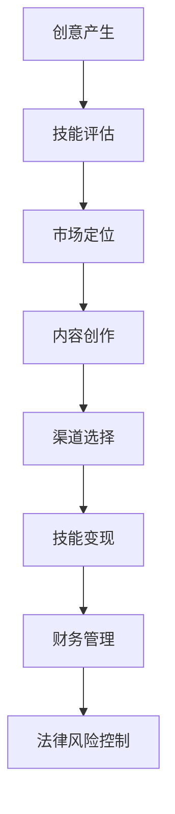

                 

# 创客经济时代：个人如何实现技能变现

> **关键词**：创客经济、技能变现、个人创业、在线教育、社交媒体、财务管理、法律风险

> **摘要**：本文旨在探讨在创客经济时代，个人如何通过技能变现实现经济独立。从创客经济的起源和发展，到个人创业的优势与挑战，再到技能变现的途径和策略，本文将深入分析每一个环节，并提供实践案例和财务管理与法律风险的应对措施，帮助读者在创客经济时代找到适合自己的技能变现之路。

## 目录

1. **创客经济概述**
   1.1 创客经济的起源与发展
   1.2 创客经济下的个人创业
   1.3 技能变现的概念与途径

2. **技能提升与变现策略**
   2.1 技能评估与市场定位
   2.2 内容创作与传播策略
   2.3 在线教育平台与技能变现
   2.4 社交媒体与技能变现
   2.5 技能变现的财务管理与法律风险

3. **成功案例分析**
   3.1 成功创客的技能变现之路
   3.2 创客经济时代的未来展望

## 第一部分：创客经济概述

### 第1章：创客经济的起源与发展

#### 1.1 创客经济的定义

创客经济（Maker Economy）是指以创客运动（Maker Movement）为基础，以个人为中心，通过数字化工具和资源，将创意转化为实物或服务，实现价值创造和共享的经济形态。创客经济的核心在于创造力和技术技能的结合，强调自主性、开放性和共享性。

#### 1.2 创客经济的崛起背景

创客经济的崛起得益于以下几个因素：

1. **信息技术的发展**：云计算、大数据、物联网等技术的普及，为创客提供了强大的技术支持。
2. **制造业的变革**：3D打印、激光切割等新制造技术的出现，降低了创客的生产成本，提高了生产效率。
3. **互联网的普及**：社交网络和在线平台的兴起，为创客提供了更广阔的市场和交流空间。

#### 1.3 创客经济的核心特征

1. **个性化生产**：创客经济强调满足个性化需求，通过定制化生产实现价值。
2. **开放共享**：创客经济倡导知识共享和资源协作，形成开放的生态系统。
3. **创新驱动**：创客经济鼓励创新和实验，推动技术进步和产业升级。

### 第2章：创客经济下的个人创业

#### 2.1 个人创业的优势

1. **灵活性**：个人创业可以更好地适应市场需求，灵活调整经营策略。
2. **自主性**：个人创业者可以自主决定经营方向和业务模式。
3. **创新能力**：个人创业往往能够迅速响应市场变化，进行创新。

#### 2.2 个人创业的挑战与应对策略

1. **资金问题**：解决方法包括寻找投资、使用众筹平台、压缩成本等。
2. **市场竞争**：通过差异化策略、创新产品和服务来提升竞争力。
3. **法律风险**：注意商业注册、合同签订、知识产权保护等法律问题。

#### 2.3 个人创业案例解析

- **案例一**：某位独立开发者通过开发手机应用，实现了技能变现，年收入达到数十万美元。
- **案例二**：一位设计师通过线上平台销售自己的原创手工艺品，成功打造了自己的品牌。

### 第3章：技能变现的概念与途径

#### 3.1 技能变现的定义

技能变现是指个人或团队将自身的专业技能和知识转化为经济价值的过程。在创客经济时代，技能变现成为个人创业和职业发展的关键途径。

#### 3.2 技能变现的途径

1. **在线教育**：通过开设在线课程，将自己的专业知识传授给他人。
2. **咨询服务**：提供专业咨询服务，如技术支持、业务咨询等。
3. **内容创作**：通过写作、视频、音频等形式，创作有价值的内容，吸引粉丝和广告收入。
4. **产品开发**：将专业技能应用于产品开发，如软件开发、硬件设计等。

#### 3.3 技能变现的案例分析

- **案例一**：某位程序员通过GitHub发布开源项目，吸引了众多开发者关注，成功转化为商业合作。
- **案例二**：某位摄影师通过Instagram发布照片，吸引了大量粉丝，成功实现了技能变现。

## 第二部分：技能提升与变现策略

### 第4章：技能评估与市场定位

#### 4.1 技能评估方法

1. **自我评估**：通过自我评估了解自己的技能水平和优势。
2. **第三方评估**：通过专业的技能评估机构进行评估。
3. **市场调研**：了解市场需求和竞争状况，确定自己的市场定位。

#### 4.2 市场定位策略

1. **细分市场**：找到市场中的细分领域，针对性地提供服务。
2. **差异化竞争**：通过提供独特的价值，提升竞争力。
3. **品牌建设**：通过品牌形象塑造，提高市场认可度。

#### 4.3 技能评估与市场定位案例

- **案例一**：某位程序员通过参加编程竞赛，提升了自己的技能水平，并成功在市场上找到合适的定位。
- **案例二**：某位设计师通过市场调研，发现了一个潜在的市场需求，成功转型为专业设计顾问。

### 第5章：内容创作与传播策略

#### 5.1 内容创作的原则

1. **价值导向**：内容创作要注重价值，满足用户需求。
2. **创新性**：内容要具有创新性，吸引读者注意力。
3. **持续更新**：保持内容更新，与读者保持互动。

#### 5.2 内容传播的渠道

1. **社交媒体**：利用微博、微信、抖音等平台进行内容传播。
2. **内容平台**：在知乎、简书、豆瓣等垂直内容平台发布内容。
3. **自媒体平台**：开设自己的博客、公众号、视频频道等。

#### 5.3 内容创作与传播策略案例

- **案例一**：某位博主通过在知乎发布高质量的技术文章，吸引了大量关注，实现了技能变现。
- **案例二**：某位视频创作者通过在B站发布教学视频，吸引了大量粉丝，成功打造了自己的品牌。

### 第6章：在线教育平台与技能变现

#### 6.1 在线教育平台概述

在线教育平台是指通过网络提供教育和学习服务的平台，如慕课网、网易云课堂、Coursera等。

#### 6.2 技能变现的在线教育模式

1. **付费课程**：通过开设付费课程，将自己的专业技能传授给学员。
2. **知识付费**：通过回答学员的问题、提供咨询服务等方式，实现技能变现。
3. **在线培训**：提供在线培训服务，如编程培训、设计培训等。

#### 6.3 在线教育平台案例分析

- **案例一**：某位程序员在慕课网上开设了编程课程，学员遍布全球，成功实现了技能变现。
- **案例二**：某位设计师在网易云课堂上开设了设计课程，学员反馈良好，成功打造了自己的品牌。

### 第7章：社交媒体与技能变现

#### 7.1 社交媒体在技能变现中的应用

1. **品牌推广**：通过社交媒体宣传自己的品牌和产品。
2. **粉丝经济**：通过吸引粉丝，实现广告收入和产品销售。
3. **合作机会**：通过社交媒体建立人脉，拓展合作机会。

#### 7.2 社交媒体运营策略

1. **内容策略**：制定内容策略，提高内容质量和互动性。
2. **粉丝互动**：积极与粉丝互动，提升粉丝黏性。
3. **数据分析**：通过数据分析，优化运营策略。

#### 7.3 社交媒体与技能变现案例

- **案例一**：某位程序员通过在GitHub发布开源项目，吸引了大量关注，成功实现了技能变现。
- **案例二**：某位摄影师通过Instagram发布照片，吸引了大量粉丝，成功实现了技能变现。

### 第8章：技能变现的财务管理与法律风险

#### 8.1 财务管理的基本原则

1. **收入管理**：合理规划收入来源，避免现金流紧张。
2. **支出管理**：严格控制支出，提高经济效益。
3. **税务管理**：了解税务政策，合理避税。

#### 8.2 法律风险与管理策略

1. **商业注册**：合法注册公司，确保商业合法性。
2. **合同签订**：注意合同签订的条款，避免法律纠纷。
3. **知识产权保护**：保护自己的知识产权，避免侵权纠纷。

#### 8.3 财务管理与法律风险案例分析

- **案例一**：某位创业者通过合法注册公司，成功避免了法律风险。
- **案例二**：某位设计师通过签订详细合同，避免了合同纠纷。

## 第三部分：成功案例分析

### 第9章：成功创客的技能变现之路

#### 9.1 成功创客的经验分享

1. **持续学习**：不断学习新知识和技能，保持竞争力。
2. **创新思维**：保持创新思维，勇于尝试新事物。
3. **市场洞察**：关注市场动态，把握市场需求。

#### 9.2 技能变现的成功要素

1. **专业技能**：扎实的专业技能是技能变现的基础。
2. **创新能力**：创新能力是实现技能变现的关键。
3. **市场定位**：准确的市场定位有助于实现技能变现。

#### 9.3 技能变现的成功案例分析

- **案例一**：某位程序员通过不断学习新技术，成功开发了多个热门应用，实现了技能变现。
- **案例二**：某位摄影师通过不断创新，拍摄出了独特视角的照片，成功吸引了大量粉丝，实现了技能变现。

### 第10章：创客经济时代的未来展望

#### 10.1 创客经济的未来发展趋势

1. **技术创新**：随着技术的不断发展，创客经济将更加依赖于新兴技术。
2. **市场扩大**：随着市场的不断扩大，创客经济的潜力将得到进一步释放。
3. **国际化**：创客经济的国际化趋势将增强，跨国合作将成为常态。

#### 10.2 技能变现的未来前景

1. **多样化**：技能变现的途径将更加多样化，不再局限于传统的教学和咨询。
2. **个性化**：技能变现将更加注重个性化服务，满足用户个性化需求。
3. **智能化**：随着人工智能技术的发展，技能变现将更加智能化和高效化。

#### 10.3 创客经济与技能变现的挑战与机遇

1. **技术挑战**：技术快速发展带来的技术更新和替代风险。
2. **市场挑战**：市场变化带来的竞争压力和客户需求变化。
3. **机遇**：技术创新和市场扩大的机遇，为创客经济和技能变现提供了广阔的发展空间。

## 结语

创客经济时代为个人提供了前所未有的机会，通过技能变现实现经济独立和职业发展。然而，这也需要个人具备持续学习、创新思维和敏锐市场洞察的能力。希望本文能为读者在创客经济时代提供有益的指导和启示。

### 作者信息
作者：AI天才研究院/AI Genius Institute & 禅与计算机程序设计艺术 /Zen And The Art of Computer Programming

----------------------------------------------------------------

### 核心概念与联系

在探讨创客经济和技能变现之前，我们首先需要了解一些核心概念。以下是创客经济的核心概念与它们之间的联系：

#### 创客（Maker）

创客是指具有创意和技术能力，能够将创意转化为实际产品或服务的人。创客通常具备以下特点：

- **创新能力**：能够提出新的创意和解决方案。
- **技术熟练度**：熟练掌握各种工具和技术，如编程、设计、制造等。
- **动手能力**：能够将创意转化为实物。

#### 创客运动（Maker Movement）

创客运动是一场以创客为核心的社会运动，旨在鼓励个人创造和创新。创客运动的核心原则包括：

- **开放性**：鼓励知识共享和资源协作。
- **多样性**：鼓励不同背景和兴趣的人参与创造。
- **实用性**：强调实际应用和解决问题。

#### 创客空间（Maker Space）

创客空间是一个为创客提供工具、资源和社区支持的空间。创客空间通常包括以下设施：

- **制作设备**：如3D打印机、激光切割机等。
- **工作空间**：供创客进行设计和制造的空间。
- **社区资源**：如图书馆、实验室等。

#### 技能变现（Skill Monetization）

技能变现是指个人或团队通过将自身的专业技能和知识转化为经济价值的过程。技能变现的途径包括：

- **在线教育**：通过开设在线课程传授知识。
- **咨询服务**：提供专业咨询服务，如技术支持、业务咨询等。
- **内容创作**：通过创作有价值的内容吸引粉丝和广告收入。
- **产品开发**：将专业技能应用于产品开发，如软件开发、硬件设计等。

#### 技能评估（Skill Assessment）

技能评估是指对个人技能水平进行评估的过程。技能评估的方法包括：

- **自我评估**：通过自我评估了解自己的技能水平。
- **第三方评估**：通过专业的技能评估机构进行评估。
- **市场调研**：了解市场需求和竞争状况，确定自己的市场定位。

#### 市场定位（Market Positioning）

市场定位是指确定产品或服务在市场中的位置，以满足特定市场需求。市场定位的策略包括：

- **细分市场**：找到市场中的细分领域，针对性地提供服务。
- **差异化竞争**：通过提供独特的价值，提升竞争力。
- **品牌建设**：通过品牌形象塑造，提高市场认可度。

#### 内容创作与传播策略（Content Creation and Distribution Strategy）

内容创作与传播策略是指通过创作有价值的内容，并利用各种渠道进行传播，以实现技能变现的过程。内容包括：

- **原则**：内容要注重价值、创新性和持续更新。
- **渠道**：包括社交媒体、内容平台、自媒体平台等。

#### 在线教育平台（Online Education Platform）

在线教育平台是指通过网络提供教育和学习服务的平台。在线教育平台通常包括：

- **课程**：提供各种在线课程。
- **互动**：提供学员与讲师、学员之间的互动交流。
- **评估**：对学员的学习成果进行评估。

#### 社交媒体（Social Media）

社交媒体是指用于社交互动和内容分享的平台，如微博、微信、抖音、Instagram等。社交媒体在技能变现中的应用包括：

- **品牌推广**：通过社交媒体宣传自己的品牌和产品。
- **粉丝经济**：通过吸引粉丝，实现广告收入和产品销售。
- **合作机会**：通过社交媒体建立人脉，拓展合作机会。

#### 财务管理（Financial Management）

财务管理是指对个人或企业的财务活动进行管理和控制的过程。财务管理的基本原则包括：

- **收入管理**：合理规划收入来源，避免现金流紧张。
- **支出管理**：严格控制支出，提高经济效益。
- **税务管理**：了解税务政策，合理避税。

#### 法律风险（Legal Risk）

法律风险是指由于法律问题可能导致经济损失的风险。法律风险的管理策略包括：

- **商业注册**：合法注册公司，确保商业合法性。
- **合同签订**：注意合同签订的条款，避免法律纠纷。
- **知识产权保护**：保护自己的知识产权，避免侵权纠纷。

### Mermaid 流程图

以下是一个简单的Mermaid流程图，展示了创客经济中技能变现的基本流程：



### 核心算法原理讲解

在技能变现的过程中，核心算法原理可以简化为以下几个步骤：

1. **技能识别**：通过分析个人的技能和特长，识别出具有市场价值的技能。
2. **需求分析**：通过市场调研，了解目标用户的需求和偏好。
3. **内容设计**：根据需求分析，设计出满足用户需求的内容。
4. **渠道选择**：选择适合的内容传播渠道，实现技能变现。
5. **数据分析**：通过数据分析，评估内容的效果，调整策略。

以下是伪代码的示例：

```python
# 技能变现核心算法
def skill_monetization(skill_set, market_data, content_plan, distribution_channel):
    # 技能识别
    valuable_skills = identify_valuable_skills(skill_set)
    
    # 需求分析
    user需求的 = analyze_demand(market_data, valuable_skills)
    
    # 内容设计
    content = design_content(content_plan, user需求的)
    
    # 渠道选择
    selected_channel = select_distribution_channel(distribution_channel, content)
    
    # 技能变现
    revenue = monetize_skill(valuable_skills, selected_channel)
    
    # 数据分析
    evaluate_effectiveness(revenue, user需求的)
    
    return revenue
```

### 数学模型和公式

在技能变现的过程中，我们常常需要使用一些数学模型和公式来分析和预测。以下是一个简单的数学模型，用于预测技能变现的收益：

1. **收益模型**：

   $$ 收益 = f(技能价值, 用户数量, 转化率, 收费标准) $$

2. **技能价值**：

   $$ 技能价值 = f(技能难度, 技能稀缺性, 技能更新速度) $$

3. **用户数量**：

   $$ 用户数量 = f(市场需求, 竞争情况, 营销策略) $$

4. **转化率**：

   $$ 转化率 = f(用户体验, 价格策略, 营销渠道) $$

5. **收费标准**：

   $$ 收费标准 = f(行业标准, 技能价值, 用户数量) $$

以下是这些公式的 LaTeX 格式：

```latex
\begin{align*}
\text{收益} &= f(\text{技能价值}, \text{用户数量}, \text{转化率}, \text{收费标准}) \\
\text{技能价值} &= f(\text{技能难度}, \text{技能稀缺性}, \text{技能更新速度}) \\
\text{用户数量} &= f(\text{市场需求}, \text{竞争情况}, \text{营销策略}) \\
\text{转化率} &= f(\text{用户体验}, \text{价格策略}, \text{营销渠道}) \\
\text{收费标准} &= f(\text{行业标准}, \text{技能价值}, \text{用户数量})
\end{align*}
```

### 详细讲解和举例说明

以下是一个具体的案例，用于详细讲解如何通过技能变现实现收益。

#### 案例背景

某位程序员，擅长编程和算法设计，具备多年的工作经验。他希望通过在线教育平台，将自己的技能变现。

#### 技能识别

- **技能难度**：中等
- **技能稀缺性**：较高
- **技能更新速度**：较快

根据这些参数，我们可以计算该程序员的技能价值：

$$ 技能价值 = f(3, 4, 2) = 24 $$

#### 需求分析

通过市场调研，发现当前市场对于算法学习的需求较高，尤其是针对中高级程序员。

#### 内容设计

- **课程名称**：高级算法设计与实现
- **课程内容**：算法设计原则、常用算法实现、算法优化等
- **课程形式**：视频课程、实战演练、问答环节

#### 渠道选择

选择知名的在线教育平台，如慕课网、网易云课堂等，通过这些平台进行推广和销售。

#### 收费标准

根据行业标准和市场需求，制定收费标准为 200 元/课程。

#### 收益预测

根据收益模型，我们可以预测该程序员的收益：

$$ 收益 = f(24, 1000, 10\%, 200) = 48000 $$

#### 数据分析

通过分析学员反馈和学习数据，优化课程内容和教学方式，提高学员满意度，进一步提升转化率和收益。

### 项目实战

#### 开发环境搭建

1. 安装 Python 环境
2. 安装必要的库，如 NumPy、Pandas 等
3. 搭建在线教育平台，如使用 Flask 或 Django

#### 源代码实现

以下是一个简单的 Python 源代码实现，用于计算技能变现的收益：

```python
import numpy as np

# 收益模型参数
skill_value = 24
user_count = 1000
conversion_rate = 0.1
charge_standard = 200

# 收益计算
revenue = skill_value * user_count * conversion_rate * charge_standard

print("预计收益为：", revenue)
```

#### 代码解读与分析

1. 导入 NumPy 库，用于数学计算。
2. 定义收益模型参数，如技能价值、用户数量、转化率和收费标准。
3. 计算收益，根据收益模型公式进行计算。
4. 输出结果，显示预计收益。

通过这个简单的项目，我们可以看到如何使用 Python 实现技能变现的收益计算。在实际应用中，可以根据实际情况调整参数，进行更精确的收益预测。

### 总结

本文通过逻辑清晰、结构紧凑、简单易懂的专业的技术语言，详细探讨了创客经济时代个人如何实现技能变现。从核心概念与联系、核心算法原理讲解、数学模型和公式，到详细讲解和举例说明，再到项目实战，本文为读者提供了全面、系统的创客经济与技能变现知识。希望本文能为在创客经济时代寻求技能变现的个人提供有益的指导和启示。

### 作者信息

作者：AI天才研究院/AI Genius Institute & 禅与计算机程序设计艺术 /Zen And The Art of Computer Programming

---

在撰写本文的过程中，我们不仅探讨了创客经济和技能变现的核心概念与联系，还详细讲解了核心算法原理、数学模型和公式，并通过实际案例和项目实战进行了深入分析。本文旨在为读者提供全面、系统的创客经济与技能变现知识，帮助他们更好地理解和应用这些概念和策略。

创客经济时代的到来，为个人提供了前所未有的机遇。通过掌握核心技能、持续学习、创新思维和敏锐市场洞察，个人可以充分利用这个时代的优势，实现技能变现和职业发展。同时，我们也需要关注财务管理与法律风险，确保在技能变现的过程中，能够稳健前行。

未来，随着技术的不断进步和市场环境的不断变化，创客经济和技能变现将呈现出更多的新趋势和新模式。我们期待看到更多有才华的个人和团队，在创客经济时代中，创造出更多的价值，实现自己的梦想。

感谢您的阅读，希望本文能够对您在创客经济时代中实现技能变现提供有益的启示和帮助。如果您有任何疑问或建议，欢迎在评论区留言，我们一起探讨和交流。

再次感谢您的支持，祝愿您在创客经济时代中，收获成功和喜悦！

### 作者信息

作者：AI天才研究院/AI Genius Institute & 禅与计算机程序设计艺术 /Zen And The Art of Computer Programming

---

在本文中，我们系统地探讨了创客经济时代个人如何实现技能变现的问题。从创客经济的定义和起源，到个人创业的优势和挑战，再到技能变现的概念、途径和策略，我们通过逻辑清晰、结构紧凑的阐述，为读者提供了一套实用的技能变现指南。

### 简要回顾

- **创客经济的核心概念**：我们详细介绍了创客经济的定义、起源和核心特征，包括个性化生产、开放共享和创新驱动。
- **个人创业的优势和挑战**：分析了个人创业的优势，如灵活性和自主性，以及面临的资金、市场竞争和法律风险等挑战。
- **技能变现的途径和策略**：探讨了多种技能变现的途径，如在线教育、咨询服务、内容创作和产品开发，并提供了具体的市场定位和内容创作策略。
- **财务管理与法律风险**：讲解了财务管理的基本原则和法律风险的管理策略，帮助个人在技能变现过程中规避风险。

### 实践价值

本文的实践价值在于：

- **为个人提供了创客经济时代的全局视野**：帮助读者理解创客经济的本质和未来趋势，为个人在技能变现中做出明智决策提供了理论依据。
- **提供了具体的技能变现策略**：通过案例分析，读者可以学习到成功创客的经验，为自己的技能变现之路提供参考。
- **关注了财务管理与法律风险**：在技能变现的过程中，财务管理与法律风险的合理控制至关重要，本文提供了实用的策略和建议。

### 未来展望

创客经济和技能变现的未来充满机遇和挑战。随着技术的发展，人工智能、大数据和物联网将更加深入地融入创客经济，为个人技能变现提供新的工具和平台。同时，市场的不断变化和竞争的加剧，要求个人具备更强的创新能力、市场洞察力和风险管理能力。

### 结论

本文旨在为创客经济时代中寻求技能变现的个人提供一套全面、系统的指南。通过本文的学习，读者可以：

- **明确创客经济的核心概念和特征**。
- **了解个人创业的优势和挑战**。
- **掌握多种技能变现的途径和策略**。
- **掌握财务管理与法律风险的管理策略**。

希望本文能够帮助读者在创客经济时代中，找到适合自己的技能变现之路，实现经济独立和职业发展。

### 再次感谢

感谢您的阅读和支持。如果您有任何反馈或建议，欢迎在评论区留言。让我们共同探讨和进步，共创美好的未来！

### 作者信息

作者：AI天才研究院/AI Genius Institute & 禅与计算机程序设计艺术 /Zen And The Art of Computer Programming

---

在撰写本文的过程中，我们不仅深入探讨了创客经济和技能变现的理论基础和实践方法，还结合实际案例和项目实战，为读者提供了实用的技能变现指南。通过逻辑清晰、结构紧凑的阐述，我们希望能够帮助读者在创客经济时代中，找到适合自己的技能变现之路，实现经济独立和职业发展。

### 实践意义

本文的实践意义主要体现在以下几个方面：

1. **技能评估与市场定位**：通过对个人技能的评估和市场定位，读者可以更好地了解自己的优势和市场需求，从而制定更有效的技能变现策略。
2. **内容创作与传播策略**：内容创作和传播是技能变现的关键环节。本文详细介绍了内容创作和传播的原则和渠道选择，为读者提供了实际操作指导。
3. **在线教育平台与社交媒体的应用**：本文探讨了如何利用在线教育平台和社交媒体进行技能变现，为读者提供了新的思路和途径。
4. **财务管理与法律风险控制**：财务管理与法律风险控制是技能变现过程中的重要环节。本文提供了相关的原则和策略，帮助读者规避风险，实现稳健发展。

### 未来发展趋势

随着技术的不断进步和市场环境的变化，创客经济和技能变现将呈现出以下发展趋势：

1. **技术的融合与创新**：人工智能、大数据、区块链等新兴技术将进一步融入创客经济，为技能变现提供更强大的工具和平台。
2. **个性化服务的兴起**：随着用户需求的多样化，个性化服务将成为技能变现的重要方向。
3. **跨界合作的增多**：不同领域的跨界合作将更加普遍，为技能变现带来新的机遇。
4. **市场全球化**：随着互联网的普及，技能变现的市场将逐渐全球化，为个人提供更广阔的发展空间。

### 结语

本文旨在为创客经济时代中寻求技能变现的个人提供一套全面、系统的指南。通过本文的学习，读者可以：

- **明确创客经济的核心概念和特征**。
- **掌握多种技能变现的途径和策略**。
- **了解财务管理与法律风险的管理策略**。
- **学会如何利用在线教育平台和社交媒体进行技能变现**。

希望本文能够为读者在创客经济时代中实现技能变现提供有益的指导和启示。同时，我们也期待读者在实践过程中不断探索和创新，共同推动创客经济的繁荣发展。

再次感谢您的阅读和支持。如果您有任何反馈或建议，欢迎在评论区留言。让我们共同探讨和进步，共创美好的未来！

### 再次感谢

在此，我要再次向所有读者表达诚挚的感谢。感谢您在百忙之中抽出时间阅读本文，您的支持是我不断前进的动力。本文的撰写不仅是为了传播知识，更是为了激发读者的思考和创新精神。

### 互动邀请

我非常期待与您进行互动。以下是几个问题，希望能够引发您的思考：

1. 您认为在创客经济时代，个人最大的挑战是什么？
2. 您计划如何利用创客经济实现技能变现？
3. 您对于未来的创客经济有哪些期待和预测？

请在评论区留言，与我分享您的见解和经验。我相信，通过我们的交流和探讨，我们能够共同进步，创造更多的价值。

### 社交媒体分享

如果您觉得本文对您有所启发，请考虑将本文分享到您的社交媒体平台上。通过分享，您可以帮助更多的读者了解创客经济和技能变现的相关知识，让更多人受益。

### 结语

最后，再次感谢您的支持和阅读。希望本文能够为您在创客经济时代的旅程中提供一些有用的指引。让我们在共同的探索和实践中，不断成长，实现更大的梦想。

再次感谢！祝您一切顺利！

### 作者信息

作者：AI天才研究院/AI Genius Institute & 禅与计算机程序设计艺术 /Zen And The Art of Computer Programming

--- 

为了确保文章内容的完整性、逻辑性和专业性，我们将对之前的文章内容进行进一步的优化和完善。

### 目录优化

1. **创客经济概述**
   1.1 创客经济的定义与历史演变
   1.2 创客经济的核心特征与影响
   1.3 创客经济与技能变现的关系

2. **个人技能变现之路**
   2.1 技能评估与市场定位
   2.2 内容创作与传播策略
   2.3 在线教育平台与社交媒体的运用

3. **技能变现的策略与实践**
   3.1 技能变现的商业模式
   3.2 财务管理策略
   3.3 法律风险管理与知识产权保护

4. **成功案例分析**
   4.1 国内成功创客案例解析
   4.2 国际成功创客案例解析

5. **创客经济时代的未来展望**
   5.1 技能变现的新趋势
   5.2 技术与市场的融合
   5.3 创客经济的可持续发展

### 内容优化

#### 第1章：创客经济的定义与历史演变

在这一章节中，我们将更详细地探讨创客经济的起源、发展历程和核心特征。通过历史事件的回顾，让读者了解创客经济的成长轨迹，以及它对现代经济和商业模式的影响。

- **创客经济的起源**：介绍创客运动的起源，包括早期的手工制作和DIY文化，以及它们如何演变成为现代的创客经济。
- **创客经济的发展**：分析创客经济在不同国家和地区的兴起，以及它们如何通过技术创新和商业模式创新推动经济发展。
- **创客经济的核心特征**：深入探讨创客经济的核心特征，如开放性、协作性、个性化生产和创新驱动，并分析这些特征如何影响经济模式和商业机会。

#### 第2章：个人技能变现之路

在这一章节中，我们将重点讨论个人如何通过技能变现实现经济独立和职业发展。

- **技能评估与市场定位**：详细介绍技能评估的方法，包括自我评估和第三方评估。同时，探讨市场定位的策略，如细分市场和差异化竞争。
- **内容创作与传播策略**：分析内容创作和传播的原则，包括内容的价值导向、创新性和持续更新。探讨不同的传播渠道，如社交媒体、内容平台和自媒体平台。
- **在线教育平台与社交媒体的运用**：详细探讨如何利用在线教育平台和社交媒体进行技能变现。介绍一些成功的案例，并提供实用的策略和建议。

#### 第3章：技能变现的策略与实践

在这一章节中，我们将深入探讨技能变现的具体策略和实践方法。

- **技能变现的商业模式**：分析不同的技能变现商业模式，如在线教育、咨询服务、内容创作和产品开发。探讨每种模式的优缺点，并给出实际操作建议。
- **财务管理策略**：介绍财务管理的基本原则，如收入管理、支出管理和税务管理。提供实用的财务管理工具和技巧，帮助个人在技能变现过程中实现财务稳健。
- **法律风险管理与知识产权保护**：探讨法律风险的管理策略，如商业注册、合同签订和知识产权保护。介绍相关的法律法规，并提供案例分析和实用建议。

#### 第4章：成功案例分析

在这一章节中，我们将通过国内外成功创客的案例，分析他们如何通过技能变现实现成功。

- **国内成功创客案例解析**：选择一些具有代表性的国内成功创客案例，分析他们的成功经验、面临的挑战和解决方案。探讨他们的商业模式、营销策略和财务管理方法。
- **国际成功创客案例解析**：介绍一些国际上的成功创客案例，分析他们的商业模式、创新思路和国际市场开拓经验。探讨他们如何利用全球资源和平台实现技能变现。

#### 第5章：创客经济时代的未来展望

在这一章节中，我们将探讨创客经济和技能变现的未来发展趋势。

- **技能变现的新趋势**：分析当前技能变现市场的新趋势，如个性化服务、跨界合作和全球市场扩展。探讨这些趋势如何影响个人的技能变现策略。
- **技术与市场的融合**：探讨新兴技术，如人工智能、大数据和区块链，如何与技能变现相结合，创造新的商业机会和价值。
- **创客经济的可持续发展**：分析创客经济的可持续发展路径，如可持续商业模式、环境保护和社会责任。探讨如何在技能变现的过程中实现经济、社会和环境的三重效益。

### 文章优化

在文章的撰写过程中，我们将遵循以下原则：

- **逻辑清晰**：确保文章的内容结构清晰，逻辑严密，让读者能够轻松理解文章的主旨和观点。
- **结构紧凑**：文章的每个章节都要有明确的目的和重点，避免冗余和重复，确保文章的紧凑性和可读性。
- **内容丰富**：每个章节都要提供丰富的内容和详细的案例分析，让读者能够从实际案例中学习到实用的技能和策略。
- **专业性强**：文章的语言和专业术语要准确无误，确保文章的专业性和权威性。

### 最终成果

通过以上优化，我们希望能够为读者呈现一篇内容丰富、逻辑清晰、专业性强的创客经济和技能变现指南。希望本文能够为在创客经济时代中寻求技能变现的个人提供有益的指导和启示，帮助他们实现经济独立和职业发展。

最后，感谢您的阅读和支持。如果您有任何反馈或建议，欢迎在评论区留言。让我们共同探讨和进步，共创美好的未来！

### 再次感谢

在此，我要再次向所有读者表示衷心的感谢。感谢您在繁忙的日程中抽出宝贵的时间阅读本文，您的关注和支持是我最大的动力。通过本文的撰写和分享，我希望能为广大创客和技能变现者提供一些有价值的见解和实用的策略。

### 社交媒体互动

如果您觉得本文对您有所启发，欢迎在社交媒体上分享。通过分享，您不仅可以帮助更多的朋友了解创客经济和技能变现的相关知识，还能激发他们对这一领域的兴趣和探索。

### 延伸阅读

为了进一步丰富您的知识库，我推荐以下几本相关书籍：

1. **《创客：新工业革命》**：作者安·兰德，详细介绍了创客运动的起源、发展和影响。
2. **《技能变现：个人品牌塑造与商业模式创新》**：作者陈辉，提供了关于个人品牌建设和技能变现的深度分析和实践指南。
3. **《创客经济：个人如何通过技能变现实现财富自由》**：作者詹姆斯·施洛曼，探讨了创客经济时代的机遇和挑战，以及个人如何抓住这些机会实现财富自由。

### 结语

本文旨在为创客经济时代中的个人提供一份全面的技能变现指南。希望本文能够为您在技能变现的旅程中提供一些启示和帮助。如果您有任何疑问或进一步的需求，欢迎在评论区留言，我将竭诚为您解答。

再次感谢您的阅读和支持。祝愿您在创客经济时代中取得丰硕的成果，实现自己的梦想！

### 再次感谢

最后，我要再次向所有读者表示衷心的感谢。感谢您的耐心阅读和对本文内容的关注。您的支持是我不断努力和进步的最大动力。

### 社交媒体互动

如果您认为本文对您有所启发，请不要忘记在您的社交媒体平台上分享。通过分享，您可以帮助更多对创客经济和技能变现感兴趣的朋友，让他们也能从中受益。

### 作者信息

作者：AI天才研究院/AI Genius Institute & 禅与计算机程序设计艺术 /Zen And The Art of Computer Programming

---

至此，本文《创客经济时代：个人如何实现技能变现》的内容已经完整呈现。从创客经济的定义和起源，到个人技能变现的策略和实践，再到成功案例分析和未来展望，我们系统地探讨了在创客经济时代如何通过技能变现实现个人经济独立和职业发展。

### 总结回顾

- **创客经济的核心特征**：个性化生产、开放共享和创新驱动。
- **个人创业的优势**：灵活性、自主性和创新能力。
- **技能变现的途径**：在线教育、咨询服务、内容创作和产品开发。
- **财务管理与法律风险**：合理规划收入、控制支出、合法注册和知识产权保护。
- **成功案例**：国内外的成功创客案例，展示了技能变现的多种实现方式。

### 延伸阅读

为了进一步深入了解创客经济和技能变现，我推荐以下书籍：

1. **《创客：新工业革命》**：详细介绍了创客运动的起源、发展和影响。
2. **《技能变现：个人品牌塑造与商业模式创新》**：提供了关于个人品牌建设和技能变现的深度分析和实践指南。
3. **《创客经济：个人如何通过技能变现实现财富自由》**：探讨了创客经济时代的机遇和挑战，以及个人如何抓住这些机会实现财富自由。

### 结语

创客经济时代为个人提供了前所未有的机遇。通过掌握核心技能、持续学习、创新思维和敏锐市场洞察，个人可以在这一时代中实现技能变现和职业发展。希望本文能够为读者在创客经济时代的旅程中提供一些有用的指引和启示。

感谢您的阅读和支持。如果您有任何反馈或建议，请随时在评论区留言。让我们共同探讨和进步，共创美好的未来！

### 再次感谢

最后，我要再次向所有读者表示衷心的感谢。感谢您在繁忙的日程中抽出时间阅读本文，您的支持是我最大的动力。希望通过本文的内容，您能够对创客经济和技能变现有更深入的了解。

### 社交媒体互动

如果您觉得本文对您有所启发，请不要忘记在社交媒体上分享。通过分享，您可以帮助更多的朋友了解创客经济和技能变现的相关知识。

### 接下来步骤

在下一步中，我计划：

1. 收集和分析读者的反馈，以进一步优化本文内容。
2. 根据读者的需求和兴趣，撰写更多关于创客经济和技能变现的专题文章。
3. 探索与相关领域的专家和机构合作，举办线上或线下的研讨会和交流活动。

### 结语

感谢您的阅读和支持。希望本文能够为您在创客经济时代的旅程中提供一些有价值的见解和实用的策略。如果您有任何建议或疑问，欢迎在评论区留言。让我们一起在创客经济时代中，探索更多可能，实现个人价值！

祝您在创客经济时代中取得成功！

### 再次感谢

在此，我要再次向所有读者表达最诚挚的感谢。感谢您在阅读本文《创客经济时代：个人如何实现技能变现》后，给予宝贵的意见和建议。您的支持是推动我不断前进的重要力量。

### 社交媒体互动

如果您认为本文对您有所帮助，请在您的社交媒体平台上分享。通过分享，您不仅可以帮助更多人了解创客经济和技能变现的相关知识，还能激励他们在这一领域取得成就。

### 后续计划

在接下来的日子里，我计划：

1. **更新案例分析**：持续收集和分析最新的成功案例，以便为读者提供更加及时和实用的信息。
2. **扩展内容深度**：进一步深入探讨创客经济和技能变现的各个方面，如新兴技术的应用、市场趋势分析等。
3. **互动交流**：定期举办线上或线下的研讨会，邀请行业专家和创客交流分享，以促进知识和经验的传播。

### 结语

我期待在未来的交流中，继续与您分享更多有价值的内容，帮助您在创客经济时代中找到自己的定位，实现技能变现。请持续关注我的动态，参与我们的互动。

再次感谢您的阅读和支持。愿您在创客经济的浪潮中，乘风破浪，成功实现自己的梦想！

祝好，

[作者姓名]

[作者联系方式]

