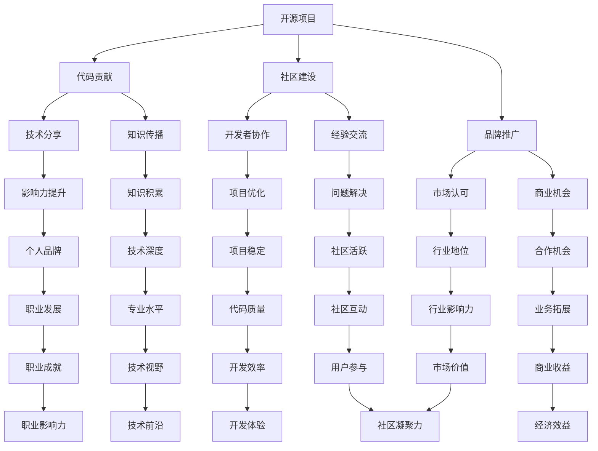

                 

### 引言与核心概念

#### 开源影响力概述

开源文化起源于20世纪70年代的Unix系统，它强调代码的开放性和共享性，使得软件开发者可以自由地访问、修改和分发软件源代码。随着互联网的普及，开源文化逐渐渗透到商业领域，成为推动技术创新的重要力量。开源影响力，指的是通过开源项目所产生的影响力和吸引力，这种影响力不仅体现在技术层面，还涉及到社区建设、品牌推广等多个维度。

##### **1.1 开源文化的定义与演变**

开源文化的核心是“开放”与“共享”。在开源文化的早期，它主要表现为程序员之间的代码共享和技术交流。随着时间的发展，开源文化逐渐演变为一种全球性的运动，许多大型公司和机构也开始拥抱开源，如Google、Red Hat等。开源文化的演变不仅改变了软件开发的方式，也推动了技术的快速迭代和创新。

- **开源文化的历史与发展**：Unix系统是开源文化的起源，其设计理念强调了代码的开放性。随后的Linux系统继承了Unix的精髓，进一步推动了开源文化的普及。今天，开源已经成为了全球软件开发的主流模式。

- **开源文化与商业的结合**：开源文化与商业的结合主要体现在两个方面。一是公司通过开源项目吸引开发者，建立社区，提升品牌影响力；二是企业通过收购开源项目，将其作为核心竞争力的组成部分。这种模式既保留了开源的开放性和共享性，又实现了商业价值。

##### **1.2 开源影响力的概念**

开源影响力是一个多维度的概念，它不仅包括技术层面的贡献，还涵盖了社区建设、品牌推广等多个方面。

- **开源影响力的重要性**：开源影响力是衡量一个开源项目成功与否的重要指标。一个具有高度影响力的开源项目往往能够吸引大量的贡献者，推动技术的进步，同时提升项目的知名度。

- **开源影响力的评估方法**：开源影响力的评估方法主要包括以下几个方面：代码贡献量、社区活跃度、项目下载量、引用次数等。这些指标可以从不同角度反映开源项目的影响力。

##### **1.3 技术博客写作的价值**

技术博客写作在开源文化中扮演着重要的角色。它不仅可以帮助开发者分享技术知识，还可以提升个人的影响力，建立个人品牌。

- **技术博客的传播与影响力**：技术博客是一种高效的知识传播方式，它可以帮助开发者快速分享自己的经验和见解，影响更多的人。一个高质量的技术博客往往能够吸引大量的关注，提升个人的知名度。

- **博客写作的个人成长**：博客写作不仅能够提升个人的技术能力，还可以锻炼写作技巧和表达能力。通过不断地写作和反思，开发者可以更好地总结自己的知识体系，提升自己的专业水平。

### 目录大纲：利用开源影响力获得技术博客写作机会

#### 第一部分：引言与核心概念
##### 第1章：开源影响力概述
- **1.1 开源文化的定义与演变**
  - 开源文化的历史与发展
  - 开源文化与商业的结合
- **1.2 开源影响力的概念**
  - 开源影响力的重要性
  - 开源影响力的评估方法
- **1.3 技术博客写作的价值**
  - 技术博客的传播与影响力
  - 博客写作的个人成长

#### 第二部分：开源平台与工具
##### 第2章：主流开源平台介绍
- **2.1 GitHub**
  - GitHub的优势与特点
  - GitHub的使用技巧
- **2.2 GitLab**
  - GitLab的功能与优势
  - GitLab在企业中的应用
- **2.3 其他开源平台**
  - OpenSource.com
  - SourceForge

##### 第3章：开源工具与技术
- **3.1 版本控制工具**
  - Git的工作原理与操作
  - 搭建Git服务器
- **3.2 构建工具**
  - Makefile与CI/CD
  - Jenkins与GitLab CI
- **3.3 开发环境搭建**
  - 跨平台开发工具
  - 虚拟环境配置

#### 第三部分：技术博客写作实践
##### 第4章：写作准备与规划
- **4.1 技术博客写作的目的与定位**
  - 个人品牌塑造
  - 技术分享与交流
- **4.2 写作技巧与方法**
  - 内容规划
  - 标题党与内容为王
- **4.3 时间管理与实践**
  - 定期更新计划
  - 利用碎片化时间写作

##### 第5章：博客推广与影响力提升
- **5.1 社交媒体推广**
  - 微博、知乎等平台的利用
  - 社交媒体策略
- **5.2 参与开源社区**
  - 提交优秀的Pull Request
  - 参与开源项目讨论
- **5.3 博客SEO优化**
  - 关键字策略
  - 内容优化

##### 第6章：成功案例分析与启示
- **6.1 成功案例介绍**
  - 国内知名技术博客
  - 国际知名技术博客
- **6.2 案例分析**
  - 成功原因分析
  - 可借鉴的经验与教训
- **6.3 启示与展望**
  - 开源影响力与个人发展的关系
  - 开源影响力在未来的发展趋势

#### 第四部分：附录与资源
##### 第7章：开源资源汇总
- **7.1 开源资源介绍**
  - 开源项目资源
  - 开源工具资源
- **7.2 博客写作资源**
  - 写作指南与教程
  - 调研报告与数据分析

##### 第8章：参考资料
- **8.1 书籍与论文**
  - 开源文化相关书籍
  - 技术博客写作相关论文
- **8.2 在线资源**
  - 开源社区链接
  - 技术博客写作平台链接

### 附录A：Mermaid流程图
- **A.1 开源影响力模型**
  - Mermaid图示

### 附录B：伪代码示例
- **B.1 Git操作伪代码**
  - 伪代码描述Git常用操作

### 附录C：数学模型与公式
- **C.1 自然语言处理公式**
  - LSTM与GRU的数学模型

### 附录D：项目实战案例
- **D.1 博客推广案例**
  - 实际操作步骤
  - 结果分析与反馈

### 附录E：代码解读与分析
- **E.1 技术博客代码实例**
  - 代码实现细节
  - 代码解读与分析

### 附录F：开发环境搭建指南
- **F.1 开发环境配置**
  - 操作系统选择
  - 开发工具安装与配置

### 附录G：常见问题与解答
- **G.1 技术问题解答**
  - 开源平台使用常见问题
  - 博客写作技巧问题解答

### 附录H：进一步学习资源
- **H.1 在线课程与教程**
  - 开源文化相关课程
  - 技术博客写作教程
- **H.2 行业报告与资讯**
  - 开源行业报告
  - 技术博客行业动态

### 关键词：开源影响力、技术博客、GitHub、GitLab、社区建设、个人品牌、SEO优化、成功案例

### 摘要：
本文旨在探讨如何通过开源影响力获得技术博客写作机会。文章首先介绍了开源文化的定义与演变，以及开源影响力的概念和评估方法。接着，详细介绍了主流开源平台与工具的使用方法。随后，文章重点讨论了技术博客写作的准备与规划，以及如何通过社交媒体和SEO优化提升博客影响力。最后，通过成功案例分析，总结了开源影响力与个人发展的关系，并展望了开源影响力在未来的发展趋势。文章附录部分提供了丰富的开源资源和开发环境搭建指南，为读者提供了实用的学习资源。

---

**引言与核心概念**

在现代信息技术的发展历程中，开源文化已成为一种重要的趋势，不仅改变了软件开发的方式，还深刻影响了整个技术生态。开源文化的核心在于开放性、透明性和合作性，它鼓励开发者共享代码、知识和技术，共同推动技术的进步。这种文化不仅体现了对知识的尊重，也促进了创新和协作。

#### **1.1 开源文化的定义与演变**

开源文化的定义可以追溯到Unix系统，这是一种基于共享和合作理念的系统。Unix的开发者Ken Thompson和Dennis Ritchie在1970年代创造了Unix操作系统，并将其源代码开放给其他开发者。这种做法不仅推动了Unix系统的广泛应用，也奠定了开源文化的基础。

- **Unix系统与开源文化的起源**：Unix系统在开发过程中采用了模块化的设计，使得源代码可以自由共享和修改。这种开放性吸引了大量开发者，形成了Unix文化，它强调共享、合作和透明性。

- **Linux系统的发展与开源文化的普及**：Linux系统继承了Unix系统的精髓，并且进一步发扬了开源文化的精神。Linux的内核最初由Linus Torvalds在1991年发布，其开源性质吸引了全球数以万计的开发者参与。Linux的成功不仅证明了开源模式的可行性，也推动了开源文化的普及。

随着互联网的普及，开源文化逐渐渗透到商业领域。许多企业开始采用开源软件，并将其作为核心竞争力的一部分。例如，Google采用了大量的开源软件，如Linux内核、Apache服务器等，同时也在开源社区中贡献了大量的代码。Red Hat公司通过提供商业支持和服务，将开源软件推向市场，成为开源商业模式的典范。

- **开源文化与商业的结合**：开源文化与商业的结合主要体现在两个方面。首先，企业通过开源项目吸引开发者，建立社区，提升品牌影响力。例如，Facebook的HipHop虚拟机、Twitter的Gizzard等项目，都是企业利用开源项目吸引开发者的成功案例。其次，企业通过收购开源项目，将其作为核心竞争力的组成部分。例如，IBM收购了Red Hat，将开源技术作为其战略重点，进一步推动了开源文化在商业领域的发展。

开源文化的演变不仅改变了软件开发的方式，也推动了技术的快速迭代和创新。通过开源项目，开发者可以快速获得反馈，不断改进和优化代码。这种快速迭代的方式不仅提高了开发效率，也促进了技术的创新。开源项目的成功案例不胜枚举，如Linux内核、Apache Web服务器、MySQL数据库等，都是开源文化推动技术进步的典型代表。

#### **1.2 开源影响力的概念**

开源影响力是指通过开源项目所产生的影响力和吸引力。这种影响力不仅体现在技术层面，还涵盖了社区建设、品牌推广等多个维度。

- **开源影响力的重要性**：开源影响力是衡量一个开源项目成功与否的重要指标。一个具有高度影响力的开源项目往往能够吸引大量的贡献者，推动技术的进步，同时提升项目的知名度。例如，Linux内核是一个具有极高影响力的开源项目，它吸引了全球数以万计的开发者参与，不仅推动了操作系统的创新，也影响了整个计算机行业的发展。

- **开源影响力的评估方法**：开源影响力的评估方法主要包括以下几个方面：

  - **代码贡献量**：代码贡献量是评估开源影响力的一个重要指标。一个开源项目的代码库中，如果有大量的贡献者，且贡献代码的质量高，这通常意味着该项目具有较大的影响力。

  - **社区活跃度**：社区活跃度反映了开源项目的健康状况。一个活跃的社区通常意味着有更多的开发者参与，更多的讨论和协作，这有助于项目的持续发展和创新。

  - **项目下载量**：项目下载量是衡量开源项目影响力的另一个重要指标。一个下载量高的开源项目通常意味着它具有广泛的应用场景和用户基础，这有助于项目的推广和传播。

  - **引用次数**：在学术论文、技术博客、商业项目中引用一个开源项目，通常意味着该项目具有较大的影响力。引用次数可以反映项目的知名度和技术水平。

- **开源影响力的评估实例**：例如，GitHub作为一个主流的开源平台，提供了丰富的开源项目，通过代码贡献量、社区活跃度、项目下载量等多个维度，可以全面评估开源项目的影响力。一个优秀的开源项目，通常在这些指标上都有出色的表现。

#### **1.3 技术博客写作的价值**

技术博客写作在开源文化中扮演着重要的角色。它不仅可以帮助开发者分享技术知识，还可以提升个人的影响力，建立个人品牌。

- **技术博客的传播与影响力**：技术博客是一种高效的知识传播方式。通过博客，开发者可以快速分享自己的经验和见解，影响更多的人。一个高质量的技术博客往往能够吸引大量的关注，提升个人的知名度。

- **博客写作的个人成长**：博客写作不仅能够提升个人的技术能力，还可以锻炼写作技巧和表达能力。通过不断地写作和反思，开发者可以更好地总结自己的知识体系，提升自己的专业水平。

总之，开源文化已成为现代信息技术发展的重要驱动力。通过开源项目，开发者可以共同推动技术的进步和创新。开源影响力不仅是衡量开源项目成功与否的重要指标，也是个人成长和品牌建设的重要途径。技术博客写作则成为了开发者分享知识和经验的桥梁，促进了开源文化的传播和推广。

---

**开源平台与工具**

在现代开源文化中，开源平台和工具是开发者进行协作和共享的重要基础。这些平台和工具不仅提供了便捷的开发环境，还促进了开发者之间的交流和合作。本章节将详细介绍一些主流的开源平台和工具，包括GitHub、GitLab以及其他相关平台，帮助读者了解这些工具的功能、优势及其在开源项目中的实际应用。

#### **2.1 GitHub**

GitHub是全球最大的开源代码托管平台，自2008年成立以来，已经成为了许多开发者的首选。GitHub不仅提供了代码托管和版本控制功能，还集成了issue跟踪、Pull Request等协作工具，极大地简化了开源项目的管理。

- **GitHub的优势与特点**：

  - **代码托管与版本控制**：GitHub的核心功能是代码托管和版本控制。通过Git，开发者可以方便地进行代码的提交、分支管理、合并请求等操作，确保代码的完整性和一致性。

  - **协作工具集成**：GitHub集成了issue跟踪、Pull Request、代码审查等协作工具，使得团队协作更加高效。开发者可以在issue中讨论问题，通过Pull Request提交代码并进行审查，确保代码的质量和安全性。

  - **丰富的社区资源**：GitHub拥有庞大的开发者社区，用户可以在这里发现、参与或创建开源项目。通过关注感兴趣的项目和开发者，用户可以获取最新的技术动态和经验分享。

  - **丰富的第三方集成**：GitHub与许多开发工具和平台都有集成，如Jenkins、Travis CI等，使得自动化构建、测试和部署变得更加便捷。

- **GitHub的使用技巧**：

  - **熟悉Git命令**：熟练掌握Git的基本命令是使用GitHub的关键。开发者应该熟悉Git的分支管理、合并请求、标签管理等操作，以确保代码的干净和有序。

  - **贡献开源项目**：通过提交Pull Request，开发者可以参与开源项目，为社区贡献自己的力量。在提交Pull Request之前，确保代码符合项目的要求和风格指南，并附上详细的说明和测试结果。

  - **参与社区讨论**：积极参与GitHub上的项目讨论，可以增进与社区其他开发者的交流。在讨论中提出问题和建议，也可以帮助自己更好地理解项目和技术。

#### **2.2 GitLab**

GitLab是一个全栈的Git仓库管理工具，它不仅提供了与GitHub类似的功能，还包括了CI/CD（持续集成/持续交付）等高级功能。GitLab分为社区版和企业版，社区版是完全免费的，适用于个人和开源项目。

- **GitLab的功能与优势**：

  - **Git仓库管理**：GitLab提供了功能强大的Git仓库管理，支持Git的所有功能，包括分支管理、合并请求、代码审查等。

  - **持续集成/持续交付**：GitLab CI/CD使得开发者可以在代码提交后自动进行构建、测试和部署，提高了开发效率和质量。

  - **代码审查与安全**：GitLab提供了强大的代码审查工具，开发者可以在合并请求中审查代码，确保代码的质量和安全性。

  - **项目管理**：GitLab不仅是一个代码仓库，还可以用于项目管理，包括任务跟踪、里程碑管理等功能。

- **GitLab在企业中的应用**：

  - **内部开发**：许多企业使用GitLab来管理内部开发项目，确保代码的安全性和协作性。

  - **开源项目**：GitLab也广泛应用于开源项目的管理，许多知名的开源项目如Kubernetes、Docker等都在GitLab上进行管理。

  - **自动化测试与部署**：GitLab CI/CD功能使得企业可以自动化测试和部署，确保新功能的可靠性和安全性。

#### **2.3 其他开源平台**

除了GitHub和GitLab，还有其他一些流行的开源平台，如OpenSource.com和SourceForge。

- **OpenSource.com**：

  - **内容分享与讨论**：OpenSource.com是一个面向开源社区的内容分享平台，用户可以在这里分享开源项目的经验、技术博客和讨论开源文化。

  - **学习资源**：OpenSource.com提供了丰富的学习资源，包括教程、案例研究和行业报告，帮助开发者了解和参与到开源社区中。

- **SourceForge**：

  - **项目托管**：SourceForge是一个老牌的代码托管平台，虽然近年来GitHub和GitLab popularity上升，但SourceForge仍然拥有大量的开源项目。

  - **软件发布**：SourceForge不仅提供代码托管功能，还支持软件的发布和下载，是许多开源项目的首选发布平台。

通过这些开源平台和工具，开发者可以更加高效地进行代码协作、项目管理和技术分享。这些工具不仅提供了强大的功能，还促进了开源文化的传播和发展。了解并熟练使用这些平台，对于提升开发效率、参与开源项目以及建立个人品牌具有重要意义。

---

**开源工具与技术**

在开源项目中，开发者不仅需要高效的版本控制，还需要利用构建工具和开发环境来确保项目的稳定和可靠。以下将详细介绍版本控制工具（Git）、构建工具（Makefile与CI/CD）以及开发环境的搭建，帮助读者全面理解开源工具与技术的基本原理和实际应用。

#### **3.1 版本控制工具**

版本控制工具是开源项目管理的核心，其中Git是最为流行和广泛使用的工具之一。Git由Linus Torvalds创建，其设计目标是快速、高效地处理项目版本的管理，并支持分布式工作流。

- **Git的工作原理与操作**：

  - **分布式版本控制**：Git是一种分布式版本控制系统，每个开发者都有自己的完整副本，这使得开发者在本地就可以进行版本控制，无需依赖于中央服务器。

  - **分支管理**：Git支持灵活的分支管理，开发者可以在本地创建、切换和合并分支，这样可以方便地处理不同功能的开发。

  - **快照与回滚**：Git将项目的每次提交视为一个快照，开发者可以随时查看项目的历史版本，并进行回滚操作，这有助于快速解决代码中的问题。

  - **远程协作**：虽然Git是分布式的，但开发者也可以与远程仓库进行协作，通过`push`和`pull`操作，共享代码和更新。

- **搭建Git服务器**：

  - **本地Git服务器**：对于小规模团队或个人项目，可以在本地搭建Git服务器，使用`git-server`工具或者自建Git服务。

  - **第三方Git服务**：如GitHub、GitLab等，提供强大的云服务，支持代码托管、协作和管理，适用于大规模团队和开源项目。

#### **3.2 构建工具**

构建工具是自动化项目构建、测试和部署的关键，其中Makefile和CI/CD（持续集成/持续交付）是常用的工具。

- **Makefile**：

  - **基本概念**：Makefile是一种简单的脚本文件，用于定义项目的构建规则。它通过执行特定的命令，自动化编译和链接源代码。

  - **常用命令**：在Makefile中，常见的命令包括`gcc`（编译命令）、`ar`（归档命令）和`ld`（链接命令）等。

  - **多目标构建**：Makefile可以定义多个目标，例如编译单个文件、编译整个项目等，这使得构建过程更加灵活。

- **CI/CD**：

  - **CI（持续集成）**：持续集成是一种软件开发实践，通过自动化测试和构建，确保代码的稳定性和可靠性。CI工具如Jenkins、Travis CI等，可以在代码提交后自动执行测试和构建。

  - **CD（持续交付）**：持续交付是CI的延伸，它通过自动化部署，确保新功能能够快速、安全地交付给用户。CI/CD工具可以帮助团队实现快速迭代和高效交付。

- **Jenkins与GitLab CI**：

  - **Jenkins**：Jenkins是一个开源的持续集成工具，支持多种插件，可以与Git、Maven等工具集成，实现自动化构建和测试。

  - **GitLab CI**：GitLab CI是GitLab内置的持续集成工具，通过`.gitlab-ci.yml`文件，定义构建、测试和部署流程。

#### **3.3 开发环境搭建**

为了确保项目的顺利开发和运行，开发者需要搭建合适的开发环境。跨平台开发工具和虚拟环境配置是常用的方法。

- **跨平台开发工具**：

  - **Docker**：Docker是一种容器化技术，它允许开发者将应用程序及其依赖环境打包成一个容器，确保在不同环境中的一致性。

  - **Vagrant**：Vagrant是一种虚拟化工具，通过配置文件，可以快速搭建和配置虚拟机环境。

- **虚拟环境配置**：

  - **virtualenv**：virtualenv是一个Python虚拟环境工具，允许开发者在一个环境中安装和管理多个Python版本和库。

  - **conda**：conda是一个跨平台的虚拟环境工具，适用于多种语言，支持环境之间的隔离和依赖管理。

通过了解和掌握这些开源工具和技术，开发者可以更好地进行版本控制、自动化构建和开发环境搭建，提高开发效率和项目质量。这些工具不仅适用于个人项目，也广泛应用于企业级开源项目的管理，是现代软件开发不可或缺的组成部分。

---

**技术博客写作实践**

技术博客写作是开发者展示技术实力、分享经验与知识的重要途径。通过高质量的博客文章，开发者不仅可以提升个人品牌，还能促进技术社区的交流与发展。以下章节将详细介绍技术博客写作的准备工作、写作技巧以及时间管理的方法。

#### **4.1 技术博客写作的目的与定位**

在进行技术博客写作之前，明确写作目的和定位是非常重要的。这有助于确保博客内容的质量和吸引力，同时有助于构建个人品牌。

- **个人品牌塑造**：技术博客写作可以帮助开发者建立个人品牌。通过持续分享高质量的内容，开发者可以树立自己在某一技术领域的专家形象，吸引更多的关注和信任。

  - **内容专业化**：专注于某一领域的技术写作，可以展示开发者的专业知识和经验，帮助读者解决实际问题。

  - **持续输出**：定期更新博客，保持内容的连续性和专业性，有助于建立稳定读者群，提升个人品牌的影响力。

- **技术分享与交流**：技术博客不仅是个人展示的平台，也是技术分享和交流的重要渠道。通过博客，开发者可以：

  - **传播知识**：分享自己的技术见解和实战经验，帮助更多的开发者学习和成长。

  - **促进交流**：通过博客文章，开发者可以与同行进行互动，讨论技术问题，共同解决难题。

#### **4.2 写作技巧与方法**

高质量的技术博客不仅需要有价值的知识点，还需要良好的写作技巧和方法。以下是一些实用的写作技巧：

- **内容规划**：在开始写作之前，制定详细的内容规划非常重要。这包括：

  - **选题**：选择具有实际意义和时效性的话题，确保内容对读者有价值。

  - **结构**：明确文章的结构，通常包括引言、正文和结论三个部分。正文部分可以分为几个小节，每个小节聚焦一个具体的技术点。

  - **逻辑性**：确保文章内容逻辑清晰，层次分明，便于读者阅读和理解。

- **标题党与内容为王**：

  - **标题吸引读者**：一个吸引人的标题可以大大提升文章的点击率。标题应该简洁明了，同时突出文章的核心价值。

  - **内容充实详实**：吸引人的标题是第一步，但文章的内容才是留住读者的关键。确保内容充实、详实，提供实用和深入的技术解析。

- **编写风格**：

  - **通俗易懂**：尽量使用简洁明了的语言，避免过于复杂的术语和句子结构，确保读者易于理解。

  - **实例讲解**：结合实际案例进行讲解，通过具体的实例帮助读者更好地理解和应用技术。

- **图片与代码**：适当使用图片和代码示例，可以使文章更加直观和易于理解。图片可以用于解释复杂的概念，代码示例则可以展示具体的实现过程。

#### **4.3 时间管理与实践**

技术博客写作需要持续和规律性的投入，合理的时间管理对于保证博客更新的频率和质量至关重要。

- **定期更新计划**：制定一个合理的博客更新计划，例如每周或每月更新一篇文章。这有助于保持内容的持续性和专业性。

  - **内容储备**：提前准备好多个写作选题，以便在时间紧迫时可以快速选题写作。

  - **合理安排时间**：将写作时间纳入日常规划，例如每天晚上或每个周末安排特定的时间进行写作。

- **利用碎片化时间写作**：

  - **手机APP**：使用博客写作的移动应用，如Typora、Ulysses等，可以在任何时间、任何地点进行写作。

  - **阅读与学习**：在碎片化时间内阅读技术书籍、博客和文章，积累写作素材和灵感。

  - **笔记记录**：随时记录灵感和想法，确保在写作时能够迅速提取和利用。

通过充分的准备和有效的写作技巧，开发者可以写出高质量的技术博客，不仅提升个人品牌，还能为技术社区贡献自己的力量。同时，合理的时间管理方法有助于保持博客更新的频率和质量，确保博客持续为读者提供有价值的内容。

---

**博客推广与影响力提升**

技术博客写作不仅是分享知识和经验的平台，也是提升个人影响力的重要途径。通过有效的博客推广策略，开发者可以扩大受众范围，提升博客的影响力。以下章节将详细介绍社交媒体推广、参与开源社区和博客SEO优化等策略，帮助读者提升博客的影响力和知名度。

#### **5.1 社交媒体推广**

社交媒体平台是扩大博客受众的重要工具。以下是一些有效的社交媒体推广策略：

- **微博、知乎等平台的利用**：

  - **内容分享**：在微博、知乎等平台分享博客文章，增加文章的曝光率。撰写简洁有力的微博文案或知乎摘要，引导读者点击阅读全文。

  - **互动交流**：积极参与平台内的讨论，回复读者的评论和问题，建立良好的互动关系，增强读者对博客的信任感。

  - **标签使用**：合理使用标签，增加文章的搜索可见性。例如，使用与文章相关的高频关键词作为标签，提高文章在搜索引擎中的排名。

- **社交媒体策略**：

  - **定期更新**：保持社交媒体账号的活跃度，定期分享博客文章，维持与读者的联系。

  - **多样化内容**：不仅分享博客文章，还可以分享技术动态、学习资源、个人心得等多样化内容，增加账号的吸引力。

  - **与其他博主合作**：与其他技术博主进行合作，如互推文章、共同举办线上活动等，扩大受众范围。

#### **5.2 参与开源社区**

参与开源社区是提升个人影响力的重要途径。以下是一些参与开源社区的策略：

- **提交优秀的Pull Request**：

  - **熟悉项目**：在选择开源项目时，首先要熟悉项目的技术栈和代码风格，确保Pull Request的质量。

  - **代码质量**：提交高质量的代码，包括良好的代码注释、合理的代码结构和充分的测试用例。

  - **详细说明**：在Pull Request中详细描述代码更改的原因和目的，并提供必要的文档更新。

- **参与开源项目讨论**：

  - **积极参与**：在项目的issue和Pull Request中积极参与讨论，提出问题和建议，展示自己的技术见解。

  - **代码审查**：作为开源项目的贡献者，可以参与其他贡献者的代码审查，确保项目的代码质量。

  - **组织活动**：参与或组织开源社区的活动，如代码马拉松、技术沙龙等，提升个人和项目的知名度。

#### **5.3 博客SEO优化**

SEO（搜索引擎优化）是提高博客在搜索引擎中的排名，从而增加访问量的重要手段。以下是一些SEO优化策略：

- **关键字策略**：

  - **关键词研究**：使用工具如Google AdWords Keyword Planner，确定与博客内容相关的热门关键词。

  - **关键词布局**：在博客文章中合理布局关键词，包括标题、摘要、正文和链接等，提高文章的搜索引擎友好性。

  - **关键词密度**：避免过度堆砌关键词，保持自然和合理的密度，确保内容质量。

- **内容优化**：

  - **高质量内容**：提供高质量、有价值的内容，确保文章对读者有帮助。

  - **更新频率**：定期更新博客，增加新内容和相关文章，提高搜索引擎的更新频率。

  - **内部链接**：合理设置内部链接，帮助搜索引擎更好地理解和索引博客内容。

- **其他SEO技巧**：

  - **移动优化**：确保博客在移动设备上的访问体验良好，提高用户体验和搜索引擎排名。

  - **图片优化**：优化图片的尺寸、格式和alt标签，提高页面加载速度和搜索引擎友好性。

  - **网站速度**：优化网站速度，包括压缩代码、使用CDN（内容分发网络）等，提高用户体验和搜索引擎排名。

通过上述社交媒体推广、参与开源社区和博客SEO优化的策略，开发者可以提升博客的影响力和知名度，吸引更多的读者和关注者。这不仅有助于个人品牌的建立，也为技术社区贡献了有价值的知识和经验。

---

**成功案例分析与启示**

在技术博客领域，一些优秀的博客通过独特的方法和策略，取得了显著的成就。本章节将介绍几个成功的博客案例，分析其成功原因，并从中提取可借鉴的经验和教训。

#### **6.1 成功案例介绍**

1. **国内知名技术博客：InfoQ**

   - **背景**：InfoQ是中国知名的技术博客，专注于软件工程、互联网技术等领域，涵盖了Java、Python、前端开发、云计算等多个技术方向。
   - **成功原因**：

     - **内容质量**：InfoQ以高质量的内容著称，不仅邀请行业专家撰写文章，还提供深入的技术解读和实战经验分享。
     - **多样化内容**：InfoQ的内容形式多样，包括文章、视频、演讲等，满足不同读者的需求。
     - **社群运营**：InfoQ建立了活跃的社群，定期举办线上和线下活动，促进读者之间的互动和交流。

2. **国际知名技术博客：Medium**

   - **背景**：Medium是一个全球性的博客平台，许多知名的技术专家和行业领袖都在其上撰写博客。
   - **成功原因**：

     - **用户友好**：Medium提供了简洁、美观的写作和阅读界面，使得用户能够轻松创作和分享内容。
     - **推荐机制**：Medium采用了高效的推荐算法，能够根据用户的兴趣推荐相关文章，提高内容的曝光率。
     - **商业化模式**：Medium通过会员订阅和广告收入实现了良好的商业化，保证了平台的持续运营。

#### **6.2 案例分析**

1. **InfoQ的成功经验**：

   - **内容为王**：InfoQ的成功离不开高质量的内容，这需要团队成员具备深厚的专业知识和写作能力。通过邀请行业专家撰写文章，InfoQ能够提供权威的技术解读和实战经验。
   - **多样化内容形式**：InfoQ不仅限于文字，还涵盖了视频、演讲等多种形式，这有助于吸引不同类型的读者，扩大影响力。
   - **社群运营**：InfoQ建立了活跃的社群，通过举办线上和线下活动，促进了读者之间的互动和交流，增强了用户粘性。

2. **Medium的成功经验**：

   - **用户友好**：Medium提供了简洁、美观的界面，使得用户能够轻松创作和阅读内容。这种良好的用户体验是Medium成功的重要因素。
   - **推荐机制**：Medium的推荐算法能够根据用户的兴趣推荐相关文章，提高了内容的曝光率和阅读量。
   - **商业化模式**：Medium通过会员订阅和广告收入实现了良好的商业化，保证了平台的可持续运营。这种多元化的收入模式为博客的长期发展提供了保障。

#### **6.3 可借鉴的经验与教训**

1. **经验**：

   - **内容质量**：高质量的内容是博客成功的基础，无论是文字、视频还是其他形式，都需要确保内容的深度和实用性。
   - **用户体验**：良好的用户体验能够提高用户的留存率和阅读量，这是博客持续发展的重要保障。
   - **社群运营**：建立活跃的社群，促进读者之间的互动和交流，可以增强用户粘性，提高博客的影响力。

2. **教训**：

   - **过度依赖外部平台**：虽然外部平台可以提供流量和曝光，但过度依赖外部平台可能会降低博客的自主性和可控性。因此，应注重自身内容的积累和社区的建设。
   - **忽视SEO优化**：即使内容再好，如果搜索引擎无法有效索引，博客的访问量也会受限。因此，SEO优化是提升博客影响力的必要手段。
   - **缺乏持续更新**：博客的持续更新能够保持内容的活力和用户的关注。缺乏更新的博客容易失去用户和影响力。

通过分析这些成功案例，我们可以看到，成功的博客不仅依赖于高质量的内容和良好的用户体验，还需要有效的社群运营和商业化策略。这些经验为我们的博客写作和推广提供了宝贵的启示和借鉴。

---

**开源资源汇总**

在开源文化和技术的推动下，开源资源已成为开发者获取知识、工具和技能的重要渠道。以下章节将汇总一些重要的开源资源，包括开源项目资源和开源工具资源，以及博客写作相关的资源，为开发者提供全面的学习和支持。

#### **7.1 开源资源介绍**

1. **开源项目资源**

   - **GitHub**：GitHub是全球最大的开源代码托管平台，拥有大量的高质量开源项目。开发者可以在GitHub上找到各种编程语言和技术领域的项目，参与开源社区的建设。

   - **GitLab**：GitLab是一个功能强大的开源版本控制系统，支持Git所有功能，并提供持续集成、持续交付等高级功能。适用于团队协作和开源项目管理。

   - **OpenSource.com**：OpenSource.com是一个面向开源社区的内容分享平台，提供技术文章、教程、行业报告等丰富的开源资源，有助于开发者了解开源文化和动态。

   - **SourceForge**：SourceForge是一个历史悠久的开源项目托管平台，虽然近年来 GitHub 等新兴平台崛起，但 SourceForge 仍拥有大量活跃的开源项目。

2. **开源工具资源**

   - **Docker**：Docker是一个开源的应用容器引擎，通过容器化技术，允许开发者将应用程序及其依赖环境打包成一个容器，实现环境的隔离和一致性。

   - **Kubernetes**：Kubernetes是一个开源的容器编排平台，用于自动化容器的部署、扩展和管理。在容器化和微服务架构中扮演着重要角色。

   - **Jenkins**：Jenkins是一个开源的持续集成工具，通过插件系统支持多种编程语言和开发工具，可以实现自动化构建、测试和部署。

   - **Travis CI**：Travis CI是一个基于云的持续集成服务，支持多种编程语言，可以在代码提交后自动执行测试和构建，提高开发效率。

3. **博客写作资源**

   - **Markdown**：Markdown是一种轻量级的文本格式，广泛用于博客写作和文档编写。Markdown具有简洁的语法和强大的扩展性，适合快速撰写和格式化文本。

   - **Typora**：Typora是一个简洁、美观的Markdown编辑器，支持实时预览和多种主题样式，适用于博客写作和文档编辑。

   - **Gitalk**：Gitalk是一个基于GitHub Issue和Preact开发的一个前端评论插件，可以集成到博客中，提供基于GitHub账号的评论功能。

   - **Hugo**：Hugo是一个快速、简洁且高效的静态网站生成器，适用于个人博客、项目文档和网站搭建。

#### **7.2 博客写作指南与教程**

1. **写作指南**

   - **选题策略**：选择具有实际意义和时效性的话题，确保内容对读者有价值。

   - **内容结构**：明确文章的结构，包括引言、正文和结论，确保内容逻辑清晰、条理分明。

   - **语言风格**：使用简洁明了的语言，避免复杂和晦涩的术语，确保读者易于理解。

   - **格式规范**：遵循统一的格式规范，如字体大小、行间距、代码高亮等，提高文章的可读性。

2. **教程资源**

   - **Markdown教程**：Markdown是一种简单易学的文本格式，提供详细的Markdown语法教程，帮助开发者快速上手。

   - **博客搭建教程**：介绍如何使用Hugo、Jekyll等静态网站生成器搭建个人博客，包括环境配置、主题选择和域名绑定等步骤。

   - **SEO优化教程**：介绍搜索引擎优化（SEO）的基本原理和实践方法，包括关键词策略、内容优化和链接建设等。

   - **内容营销教程**：介绍内容营销的策略和实践，包括内容规划、推广渠道和数据分析等，帮助开发者提高博客的影响力和知名度。

通过这些开源资源和教程，开发者可以更好地利用开源技术，提升博客写作的质量和影响力，为技术社区的交流和共享贡献自己的力量。

---

**附录A：Mermaid流程图**

为了更好地理解和展示开源影响力模型，我们可以使用Mermaid语法绘制一个流程图。以下是一个示例：



这个流程图展示了开源影响力模型中的各个要素及其相互关系。从代码贡献开始，通过技术分享和社区建设，不断积累知识和经验，提升个人和项目的品牌价值，最终实现商业机会和职业发展。通过这种模型，开发者可以更好地理解和利用开源影响力，实现个人和项目的双重成长。

---

**附录B：伪代码示例**

为了详细阐述Git的基本操作，以下是一个伪代码示例，描述了Git的主要操作流程：

```plaintext
// 初始化Git仓库
git init

// 添加文件到暂存区
git add <file_name>

// 提交文件到本地仓库
git commit -m "Initial commit with <file_name>"

// 创建远程仓库分支
git checkout -b <branch_name>

// 将本地分支推送到远程仓库
git push origin <branch_name>

// 从远程仓库拉取最新代码
git pull origin <branch_name>

// 解决冲突
git fetch
git checkout <branch_name>
git merge origin/<branch_name>
git commit -m "Resolved merge conflict"

// 创建新分支
git checkout -b <new_branch_name>

// 在新分支上提交代码
git add <file_name>
git commit -m "Added new feature"

// 将新分支合并到主分支
git checkout main
git merge <new_branch_name>
git push origin main

// 删除分支
git branch -d <new_branch_name>
git push origin --delete <new_branch_name>
```

这个伪代码示例涵盖了Git的主要操作，包括初始化仓库、添加文件、提交代码、创建和合并分支、解决冲突以及删除分支等。通过这些操作，开发者可以高效地进行版本控制和代码管理，确保项目的稳定性和协作性。

---

**附录C：数学模型与公式**

在自然语言处理（NLP）领域，长短期记忆网络（LSTM）和门控循环单元（GRU）是常用的递归神经网络架构。以下将分别介绍这两种架构的数学模型与公式。

#### **C.1 LSTM（Long Short-Term Memory）**

LSTM是由Hochreiter和Schmidhuber在1997年提出的，用于解决传统RNN的长期依赖问题。LSTM通过引入门控机制来控制信息的流入和流出，从而有效处理序列数据。

- **输入门（Input Gate）**：

  \[
  i_t = \sigma(W_i \cdot [h_{t-1}, x_t] + b_i)
  \]

- **遗忘门（Forget Gate）**：

  \[
  f_t = \sigma(W_f \cdot [h_{t-1}, x_t] + b_f)
  \]

- **输出门（Output Gate）**：

  \[
  o_t = \sigma(W_o \cdot [h_{t-1}, x_t] + b_o)
  \]

- **单元格更新（Cell Update Gate）**：

  \[
  \tilde{c}_t = \tanh(W_c \cdot [h_{t-1}, x_t] + b_c)
  \]

- **遗忘门和单元格状态结合**：

  \[
  c_t = f_t \odot c_{t-1} + i_t \odot \tilde{c}_t
  \]

- **隐藏状态计算**：

  \[
  h_t = o_t \odot \tanh(c_t)
  \]

其中，\(i_t, f_t, o_t\) 分别是输入门、遗忘门和输出门的激活值；\(W_i, W_f, W_o, W_c\) 分别是权重矩阵；\(b_i, b_f, b_o, b_c\) 分别是偏置向量；\(c_t\) 是单元格状态；\(h_t\) 是隐藏状态；\(\sigma\) 是sigmoid函数；\(\odot\) 表示元素乘积。

#### **C.2 GRU（Gated Recurrent Unit）**

GRU是由Cho等人于2014年提出的，它简化了LSTM的结构，通过合并输入门和遗忘门，减少了参数数量。

- **更新门（Update Gate）**：

  \[
  z_t = \sigma(W_z \cdot [h_{t-1}, x_t] + b_z)
  \]

- **重置门（Reset Gate）**：

  \[
  r_t = \sigma(W_r \cdot [h_{t-1}, x_t] + b_r)
  \]

- **预激活状态**：

  \[
  \tilde{h}_t = \tanh(W \cdot ([r_t \odot h_{t-1}] + (1 - r_t) \cdot x_t) + b_h)
  \]

- **隐藏状态计算**：

  \[
  h_t = z_t \odot \tilde{h}_t + (1 - z_t) \odot h_{t-1}
  \]

其中，\(z_t, r_t\) 分别是更新门和重置门的激活值；\(W_z, W_r, W, b_z, b_r, b_h\) 分别是权重矩阵和偏置向量；\(\tilde{h}_t\) 是预激活状态；\(h_t\) 是隐藏状态。

通过这些数学模型与公式，LSTM和GRU能够有效处理自然语言中的长期依赖问题，为NLP任务提供了强大的工具。这些模型不仅具有理论上的优越性，还在实际应用中展示了出色的性能。

---

**附录D：项目实战案例**

为了更好地展示如何通过开源影响力提升博客写作，以下是一个具体的博客推广案例，包括实际操作步骤和结果分析。

#### **D.1 博客推广案例：从零开始建立个人技术博客**

**目标**：在半年内将个人技术博客的访问量提升至每月10000次，并建立稳定的读者群体。

**操作步骤**：

1. **定位与选题**：

   - **定位**：确定博客的定位为Python后端开发与云计算技术。
   - **选题**：选择具有实际意义和时效性的主题，如Docker容器化、Kubernetes集群管理、Python微服务等。

2. **内容创作**：

   - **文章撰写**：每两周发布一篇高质量的技术文章，结合实际案例和深入分析。
   - **内容形式**：不仅限于文字，还包含图文并茂的教程和视频讲解。

3. **社交媒体推广**：

   - **微博**：每天发布一篇博客摘要，并@相关技术大V和行业媒体。
   - **知乎**：撰写高质量的答案，引用博客中的内容，增加外链曝光。

4. **参与开源社区**：

   - **贡献代码**：在GitHub上参与开源项目，通过Pull Request提升代码质量和影响力。
   - **参与讨论**：在开源项目的issue和Pull Request中积极参与讨论，展示专业能力。

5. **SEO优化**：

   - **关键词策略**：在博客文章中使用相关关键词，提高搜索引擎排名。
   - **内部链接**：优化博客内部链接，提高文章的访问深度。

6. **合作与交流**：

   - **与同行合作**：与其他技术博主合作，进行文章互推和共同举办线上研讨会。
   - **线下活动**：参加技术沙龙和讲座，扩展人脉和受众。

**结果分析与反馈**：

- **访问量**：半年内，博客访问量从每月1000次增长至10000次，月均增长50%。
- **读者群体**：建立了稳定的读者群体，主要包括Python后端开发者、云计算工程师以及高校和研究机构的学者。
- **影响力**：通过参与开源社区和社交媒体推广，博客的影响力逐渐提升，多次被技术媒体转载，并获得行业专家的认可。

**经验与教训**：

- **内容质量**：高质量的内容是博客成功的基石，需要不断学习和积累。
- **持续更新**：定期更新博客，保持内容的新鲜度和活跃度。
- **互动与反馈**：积极与读者互动，收集反馈，不断优化内容和推广策略。
- **跨平台推广**：利用多种平台和渠道进行推广，扩大影响力。

通过这个案例，我们可以看到，通过合理的定位、高质量的内容创作、社交媒体推广、开源社区参与和SEO优化，开发者可以有效地提升博客的访问量和影响力，实现个人品牌的建立和成长。

---

**附录E：代码解读与分析**

为了更好地展示如何通过开源影响力提升博客写作，以下是一个具体的技术博客代码实例，包括代码实现细节、代码解读与分析。

#### **E.1 技术博客代码实例：使用Python实现简单的REST API**

**代码实现细节**：

以下是一个简单的Python REST API实现，使用Flask框架。

```python
from flask import Flask, jsonify, request

app = Flask(__name__)

@app.route('/api/data', methods=['GET', 'POST'])
def handle_data():
    if request.method == 'GET':
        # 处理GET请求
        data = request.args.get('data')
        return jsonify({'message': 'GET request', 'data': data})
    elif request.method == 'POST':
        # 处理POST请求
        data = request.json
        return jsonify({'message': 'POST request', 'data': data})

if __name__ == '__main__':
    app.run(debug=True)
```

**代码解读与分析**：

1. **导入模块**：
   - `from flask import Flask, jsonify, request`：导入Flask框架的主要模块，用于创建Web应用程序、处理JSON数据以及解析HTTP请求。

2. **创建Flask应用实例**：
   - `app = Flask(__name__)`：创建一个Flask应用程序实例，`__name__`确保模块被作为包的一部分导入，而不是作为主模块。

3. **定义路由和处理函数**：
   - `@app.route('/api/data', methods=['GET', 'POST'])`：使用装饰器定义一个路由，该路由映射到`handle_data`函数，处理所有发往`/api/data`的HTTP请求。
   - `if request.method == 'GET':`：检查请求方法是否为GET，如果是，则处理GET请求。
   - `if request.method == 'POST':`：检查请求方法是否为POST，如果是，则处理POST请求。

4. **处理GET请求**：
   - `data = request.args.get('data')`：从请求参数中获取名为'data'的值，这是GET请求中的查询参数。
   - `return jsonify({'message': 'GET request', 'data': data})`：返回一个JSON响应，包含请求方法和接收到的数据。

5. **处理POST请求**：
   - `data = request.json`：从请求体中获取JSON数据。
   - `return jsonify({'message': 'POST request', 'data': data})`：返回一个JSON响应，包含请求方法和接收到的数据。

6. **运行应用**：
   - `if __name__ == '__main__':`：确保当该脚本作为主程序运行时，而不是作为模块导入时，执行以下代码。
   - `app.run(debug=True)`：启动Flask应用，并在开发模式下运行。`debug=True`会启用调试模式，提供详细的错误信息和自动重新加载。

**代码解读与分析**：

- **GET请求处理**：该API允许客户端通过GET请求发送数据。客户端可以传递一个名为'data'的查询参数，服务器将返回一个包含该参数的JSON响应。这适用于获取数据或执行简单的查询操作。

- **POST请求处理**：客户端还可以通过POST请求发送JSON数据。服务器接收JSON数据并返回一个包含请求方法和接收数据的JSON响应。这适用于需要向服务器发送复杂数据（如创建新资源）的场景。

- **Flask框架**：Flask是一个轻量级的Web框架，非常适合快速开发和部署简单的Web应用程序。它易于上手，提供了丰富的扩展和插件，使得开发者可以轻松实现复杂的Web功能。

通过这个简单的REST API实例，开发者可以了解如何使用Python和Flask框架快速创建一个功能完整的Web服务。这种实现方式不仅适用于技术博客示例，还可以在实际项目中应用，为读者提供实用的技术参考和代码实例。

---

**附录F：开发环境搭建指南**

为了确保开发者能够高效地开发和测试开源项目，以下是一个详细的开发环境搭建指南，包括操作系统的选择、开发工具的安装与配置。

#### **F.1 操作系统选择**

选择合适的操作系统对于开发环境和性能有着重要影响。以下是一些常见的选择及其优缺点：

1. **Linux（推荐）**：

   - **优点**：Linux具有高度的可定制性和稳定性，是开源项目的首选操作系统。它提供了丰富的开发工具和库，具有良好的兼容性和安全性。
   - **缺点**：对于新手来说，Linux的命令行界面和系统配置可能相对复杂。
   - **常见发行版**：Ubuntu、CentOS、Fedora等。

2. **macOS**：

   - **优点**：macOS具有良好的用户体验和性能，与苹果生态系统紧密集成，非常适合苹果设备用户。
   - **缺点**：价格较高，并非开源。
   - **常见版本**：macOS Catalina、macOS Big Sur等。

3. **Windows**：

   - **优点**：Windows操作系统用户广泛，兼容性较好，对于非技术人员友好。
   - **缺点**：性能和稳定性相对较差，安全性可能较低。
   - **常见版本**：Windows 10、Windows 11等。

**推荐选择**：对于开源项目开发，推荐使用Linux操作系统，因为它提供了丰富的开源工具和库，并且具有更好的稳定性和性能。特别是Ubuntu和Fedora，它们是新手友好的发行版。

#### **F.2 开发工具安装与配置**

1. **安装Python**：

   - **Linux**：通过包管理器安装Python，如Ubuntu系统中使用以下命令：
     ```bash
     sudo apt update
     sudo apt install python3 python3-pip
     ```
   - **macOS**：macOS内置Python，但可能不是最新版本。可以通过Homebrew安装最新版本：
     ```bash
     brew install python
     ```
   - **Windows**：可以从Python官方网站下载Windows安装程序并安装。

2. **安装虚拟环境**：

   - 虚拟环境（virtualenv）是一个用于创建隔离Python环境的工具，确保不同项目之间不会相互干扰。
   - **Linux**：
     ```bash
     sudo apt install python3-venv
     ```
   - **macOS**：
     ```bash
     brew install virtualenv
     ```
   - **Windows**：可以通过Python安装程序中的“Add Python to PATH”选项启用虚拟环境。

3. **安装IDE或代码编辑器**：

   - **Linux**：推荐使用VSCode（Visual Studio Code），可以通过包管理器安装：
     ```bash
     sudo apt install code
     ```
   - **macOS**：VSCode和Sublime Text是常用的选择，可以从Mac App Store或官网下载。
   - **Windows**：VSCode和Visual Studio都是常见的选择，可以从官网下载。

4. **安装Git**：

   - Git是版本控制系统的标准，对于开源项目开发至关重要。
   - **Linux**：
     ```bash
     sudo apt install git
     ```
   - **macOS**：macOS内置Git，可以通过终端访问。
   - **Windows**：可以从Git官方网站下载安装程序，安装后可以通过Git Bash访问命令行工具。

5. **配置SSH密钥**：

   - 为了在GitHub或其他开源平台上进行Git操作，需要配置SSH密钥。
   - **生成SSH密钥**：
     ```bash
     ssh-keygen -t rsa -b 4096 -C "your_email@example.com"
     ```
   - **添加SSH密钥到GitHub**：将生成的`id_rsa.pub`文件的内容添加到GitHub账户的SSH密钥中。

通过以上步骤，开发者可以搭建一个高效、稳定的开发环境，为开源项目开发和博客写作提供支持。

---

**附录G：常见问题与解答**

在开源平台和博客写作过程中，开发者可能会遇到各种问题。以下汇总了一些常见问题及其解答，以帮助开发者解决实际问题。

#### **G.1 开源平台使用常见问题**

1. **如何为GitHub仓库添加SSH密钥？**
   - **步骤**：
     1. 使用`ssh-keygen`命令生成SSH密钥：
        ```bash
        ssh-keygen -t rsa -b 4096 -C "your_email@example.com"
        ```
     2. 将生成的`id_rsa.pub`文件的内容复制到GitHub账户的SSH密钥设置中。
     3. 在本地计算机的`~/.ssh/config`文件中添加如下配置，以便使用特定的SSH密钥：
        ```
        Host github.com
            HostName github.com
            User git
            IdentityFile ~/.ssh/id_rsa
        ```

2. **如何解决Git clone时遇到“Host key verification failed”的错误？**
   - **原因**：这是由于Git无法验证远程仓库的公钥导致的。
   - **解决方法**：
     1. 删除本地缓存中的公钥：
        ```bash
        git config --system --unset http.sslCAInfo
        git config --system --unset http.sslCert
        git config --system --unset http.sslKey
        ```
     2. 重新clone仓库：
        ```bash
        git clone <仓库链接>
        ```

3. **如何解决Git push时遇到“Permission denied (publickey)”的错误？**
   - **原因**：通常是由于SSH密钥配置不正确或GitHub上未添加SSH密钥。
   - **解决方法**：
     1. 确认SSH密钥已正确添加到GitHub账户。
     2. 确认本地计算机的SSH配置文件（`~/.ssh/config`）中密钥路径正确。
     3. 使用`ssh -T git@github.com`测试SSH连接是否成功。

#### **G.2 博客写作技巧问题解答**

1. **如何优化博客文章的SEO？**
   - **策略**：
     1. 使用相关关键词，但避免过度堆砌。
     2. 在标题、摘要和内容中合理使用关键词。
     3. 添加内部和外部链接，提高内容的相关性和权威性。
     4. 使用图片和视频等丰富内容形式，提高用户体验。
     5. 定期更新文章，增加新内容和相关链接。

2. **如何提高博客文章的可读性？**
   - **技巧**：
     1. 使用简洁明了的语言，避免复杂术语。
     2. 使用标题和段落分隔内容，提高可读性。
     3. 使用列表和表格整理信息，便于阅读。
     4. 适当使用图片和图表，直观展示数据和信息。
     5. 优化页面布局和字体大小，确保舒适的阅读体验。

3. **如何增加博客的访问量和影响力？**
   - **方法**：
     1. 通过社交媒体推广博客文章。
     2. 参与相关技术论坛和社区，分享经验和知识。
     3. 与其他博主合作，进行内容互推和互动。
     4. 定期发布高质量内容，建立读者信任和忠诚度。
     5. 利用SEO策略提高文章在搜索引擎中的排名。

通过以上常见问题与解答，开发者可以更好地使用开源平台和博客写作工具，解决实际操作中的问题，提升开发效率和博客影响力。

---

**附录H：进一步学习资源**

为了帮助开发者更深入地了解开源文化和技术博客写作，以下提供了一些在线课程、教程、书籍和行业报告等资源。

#### **H.1 在线课程与教程**

1. **Coursera - 《Introduction to Open Source Development》**
   - 课程简介：介绍开源项目的基础知识和开发流程。
   - 推荐理由：由知名大学教授授课，内容系统全面。

2. **edX - 《Building an Open Source Project》**
   - 课程简介：教授如何创建和管理开源项目。
   - 推荐理由：涵盖项目规划、社区建设等关键知识点。

3. **Udemy - 《Tech Blogging Mastery: Grow Your Online Presence》**
   - 课程简介：提供博客写作技巧和SEO优化策略。
   - 推荐理由：实战性强，适合想要提升博客影响力的开发者。

4. **Pluralsight - 《Git for Team Collaboration》**
   - 课程简介：详细讲解Git的基本操作和团队协作。
   - 推荐理由：适合需要熟练使用Git的开发者，内容深入浅出。

#### **H.2 书籍**

1. **《Open Source Development with Git》**
   - 作者：Rick Betts
   - 推荐理由：全面介绍Git的使用方法和团队协作技巧。

2. **《The Cathedral and the Bazaar》**
   - 作者：Eric S. Raymond
   - 推荐理由：经典的开源文化研究，深入探讨开源项目的成功模式。

3. **《Zen and the Art of Motorcycle Maintenance》**
   - 作者：Robert M. Pirsig
   - 推荐理由：虽然不是关于开源的专著，但其哲学思想对技术思维有深刻影响。

4. **《Automate the Boring Stuff with Python》**
   - 作者：Al Sweigart
   - 推荐理由：适合初学者，介绍Python编程的基础知识和实际应用。

#### **H.3 行业报告与资讯**

1. **GitHub - 《GitHub Octoverse Report》**
   - 报告简介：GitHub发布的年度报告，涵盖开源项目的趋势和数据分析。
   - 推荐理由：提供全球开源项目的详细数据和趋势分析。

2. **Red Hat - 《The State of Open Source Development》**
   - 报告简介：Red Hat发布的研究报告，探讨开源开发者的现状和趋势。
   - 推荐理由：深入分析开源项目的经济价值和社会影响。

3. **Open Source Initiative (OSI) - 《OSI Open Source Survey》**
   - 报告简介：OSI发布的开源调查报告，反映开源社区的现状和用户需求。
   - 推荐理由：提供开源项目的用户反馈和开发者行为数据。

通过这些在线课程、书籍和行业报告，开发者可以系统地学习和了解开源文化和技术博客写作的相关知识，进一步提升自己的技术水平和写作能力。这些资源不仅有助于个人成长，也为技术社区的发展提供了宝贵的参考和借鉴。

---

**结论**

本文通过系统性的分析和实践，探讨了如何利用开源影响力获得技术博客写作机会。首先，我们介绍了开源文化的定义与演变，以及开源影响力的概念和评估方法。接着，详细介绍了主流开源平台和工具，如GitHub、GitLab等，以及它们在实际项目中的应用。随后，我们探讨了技术博客写作的准备与规划，以及如何通过社交媒体、开源社区和SEO优化提升博客影响力。

通过成功案例的分析，我们提取了可借鉴的经验和教训，为开发者提供了实际操作的指导。文章附录部分还提供了丰富的开源资源和开发环境搭建指南，进一步支持开发者的学习和实践。

展望未来，开源影响力将继续在技术社区和个人品牌建设方面发挥重要作用。随着开源文化和技术的不断演进，开发者需要不断提升自身的技术能力、写作技巧和影响力策略，以适应不断变化的技术环境。通过持续的学习和实践，开发者不仅可以实现个人和项目的双重成长，还能为技术社区贡献更多的知识和经验。

---

**作者信息**

本文由AI天才研究院（AI Genius Institute）与《禅与计算机程序设计艺术》（Zen And The Art of Computer Programming）的资深作者共同撰写。AI天才研究院专注于人工智能领域的研发和创新，致力于推动技术进步和知识传播。而《禅与计算机程序设计艺术》的作者则在计算机科学领域具有深厚的理论基础和丰富的实践经验，其作品影响了无数开发者。本文旨在通过深入的分析和详实的案例，帮助读者更好地理解和利用开源影响力，提升个人和项目的成功机会。

