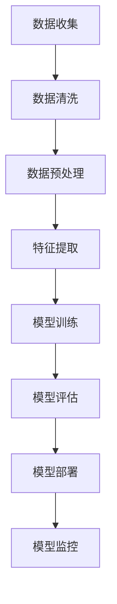
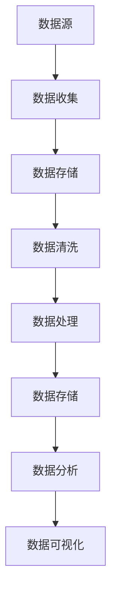

                 

# 利用技术洞察力进行颠覆性创新创业

## 关键词：
颠覆性创新创业、技术洞察力、人工智能、大数据、区块链、商业模式创新

## 摘要：
本文旨在探讨技术洞察力在颠覆性创新创业中的重要作用。通过深入分析人工智能、大数据、区块链等核心技术，以及其在创业实践中的应用案例，本文旨在帮助创业者了解如何利用技术洞察力进行颠覆性创新创业，从而在激烈的市场竞争中脱颖而出。

### 第一部分：颠覆性创新创业的背景与核心概念

#### 第1章：颠覆性创新创业概述

**1.1 颠覆性创新创业的定义与意义**

颠覆性创新创业是指通过技术创新、商业模式创新等手段，对传统行业和市场进行颠覆性改变，从而创造新价值的过程。其定义可以概括为：

- **颠覆性**：打破现有市场格局，对现有产品和服务进行替代和改进。
- **创新创业**：强调创新思维和创业实践的结合，通过创新实现商业价值。

颠覆性创新创业的意义主要体现在以下几个方面：

- **推动社会进步**：通过颠覆性创新，可以解决传统行业面临的问题，提高行业效率，提升社会整体福利。
- **促进经济增长**：颠覆性创新创业能够创造新的市场需求，带动相关产业的发展，从而推动经济增长。
- **实现企业的长期可持续发展**：通过颠覆性创新，企业可以不断适应市场变化，保持竞争优势，实现长期可持续发展。

**1.2 颠覆性创新创业的关键要素**

颠覆性创新创业的成功离不开以下几个关键要素：

- **技术创新**：引入新技术，如人工智能、大数据、区块链等，是颠覆性创新创业的核心驱动力。这些技术的引入可以改变传统行业的运作模式，提高效率，创造新的价值。
- **商业模式创新**：重新定义产品和服务，实现商业模式的创新。例如，共享经济模式通过整合闲置资源，改变了传统租赁模式，创造了新的商业模式。
- **市场定位**：准确的市场定位和用户需求分析是颠覆性创新创业成功的关键。只有深入了解市场需求，才能提供符合用户需求的产品和服务。

**1.3 颠覆性创新创业的发展历程与趋势**

颠覆性创新创业的发展历程可以分为以下几个阶段：

- **互联网泡沫**：20世纪90年代末，互联网技术的兴起引发了一波创业热潮，许多公司通过互联网进行颠覆性创新，但随后互联网泡沫破裂，许多公司倒闭。
- **移动互联网**：21世纪初，移动互联网的兴起再次激发了创业热潮，以智能手机为代表的移动设备改变了人们的日常生活，带来了新的商业机会。
- **人工智能和大数据**：近年来，人工智能和大数据技术的快速发展为颠覆性创新创业提供了新的机遇。人工智能可以解决复杂问题，提高决策效率，大数据则提供了丰富的数据资源，支持智能分析和预测。

当前，颠覆性创新创业的发展趋势主要表现在以下几个方面：

- **全球化和数字化转型**：随着互联网的普及，颠覆性创新创业已经从发达国家扩展到发展中国家，全球市场成为创业者的重要目标。数字化转型则成为企业提高效率、降低成本的关键手段。
- **新兴技术不断涌现**：新兴技术，如物联网、虚拟现实、增强现实等，不断涌现，为颠覆性创新创业提供了新的工具和平台。
- **跨界融合**：不同行业之间的融合成为颠覆性创新创业的重要趋势。例如，金融科技、医疗科技等领域的跨界融合，创造了新的商业机会。

#### 第2章：技术洞察力的重要性

**2.1 技术洞察力的定义与作用**

技术洞察力是指对新兴技术和行业发展趋势的深刻理解和敏锐洞察。它不仅包括对现有技术的理解和应用，还包括对新兴技术的预见性和前瞻性。技术洞察力在颠覆性创新创业中具有重要作用，主要体现在以下几个方面：

- **帮助企业抓住创新机会**：技术洞察力可以帮助企业及时了解行业发展趋势，发现潜在的创新机会，从而在市场竞争中占据先机。
- **引领行业发展**：技术洞察力可以指导企业在技术创新和商业模式创新方面走在行业前列，引领行业发展方向。
- **提升竞争力**：通过技术洞察力，企业可以不断提高产品和服务的技术含量，满足用户需求，提升市场竞争力。

**2.2 技术洞察力的培养方法**

要培养技术洞察力，可以采取以下几种方法：

- **持续学习**：关注行业动态，学习新技术。创业者应不断更新自己的知识体系，紧跟技术发展趋势。
- **跨界思维**：跨领域学习，激发创新思维。通过跨领域的学习，可以拓展思维方式，发现不同领域之间的联系，从而实现创新。
- **实践经验**：通过实际项目积累经验。只有通过实践，才能真正理解技术的应用场景和效果，从而提高技术洞察力。

**2.3 技术洞察力在颠覆性创新创业中的应用**

技术洞察力在颠覆性创新创业中的应用主要体现在以下几个方面：

- **技术评估**：评估新技术在行业中的应用潜力和风险。通过技术评估，可以确定新技术是否适合企业的战略方向，从而做出科学的决策。
- **战略规划**：基于技术洞察力制定企业发展战略。技术洞察力可以帮助企业确定长期发展方向，制定科学合理的战略规划。
- **产品创新**：利用技术洞察力推动产品和服务创新。通过技术洞察力，企业可以识别用户需求，设计符合市场趋势的产品和服务。

### 第二部分：颠覆性创新创业的技术应用

#### 第3章：人工智能在颠覆性创新创业中的应用

**3.1 人工智能的定义与分类**

人工智能（Artificial Intelligence，AI）是指使计算机系统具有类似人类智能的能力。根据人工智能的发展阶段和功能，可以分为以下几类：

- **弱人工智能（Weak AI）**：弱人工智能是指具有特定功能的智能系统，如语音识别、图像识别等。这些系统只能在特定领域内表现出智能行为。
- **强人工智能（Strong AI）**：强人工智能是指具有全面人类智能的计算机系统，能够像人类一样理解、学习、思考、解决问题。目前，强人工智能尚未实现。
- **自适应智能（Adaptive AI）**：自适应智能是指能够根据环境变化和用户行为进行调整的智能系统。自适应智能在商业应用中具有广泛的应用前景。

**3.2 人工智能的核心算法与模型**

人工智能的核心算法和模型包括以下几种：

- **神经网络（Neural Networks）**：神经网络是一种模仿人脑结构和功能的计算模型，通过多层神经元的连接和激活，实现数据的处理和预测。
- **决策树（Decision Trees）**：决策树是一种基于规则的学习方法，通过树形结构对数据进行分类或回归。
- **支持向量机（Support Vector Machines，SVM）**：支持向量机是一种基于间隔最大化的分类算法，通过找到一个最佳的超平面，将不同类别的数据分隔开。
- **深度学习（Deep Learning）**：深度学习是一种基于多层神经网络的机器学习方法，通过自动提取特征，实现复杂的分类和回归任务。

**3.3 人工智能在创业中的应用案例**

人工智能在创业中的应用案例非常丰富，以下列举几个典型的应用案例：

- **市场分析**：利用人工智能进行市场分析，可以快速识别潜在的市场机会，为企业提供决策依据。
- **智能客服**：通过人工智能技术，可以实现智能客服系统，提高客户满意度和服务效率。
- **个性化推荐**：利用人工智能进行个性化推荐，可以精准推送用户感兴趣的内容，提高用户粘性和转化率。

#### 第4章：大数据在颠覆性创新创业中的应用

**4.1 大数据的定义与特点**

大数据（Big Data）是指海量、高增长率和多样化的数据集合。大数据的特点主要包括：

- **数据量大**：大数据的规模通常在PB级别，甚至更大。
- **速度快**：大数据的处理速度要求高，需要实时或近实时地处理海量数据。
- **类型多**：大数据包括结构化数据、半结构化数据和非结构化数据。
- **价值密度低**：大数据中的信息量大，但有用的信息占比相对较低。

**4.2 大数据的处理与分析方法**

大数据的处理与分析方法主要包括以下几种：

- **数据清洗**：数据清洗是大数据处理的重要步骤，通过去除重复数据、填补缺失值、处理异常值等，提高数据质量。
- **数据集成**：数据集成是将来自不同来源的数据进行整合，形成一个统一的数据视图。
- **数据存储**：大数据的存储通常采用分布式存储技术，如Hadoop、Spark等。
- **数据分析**：数据分析包括数据挖掘、机器学习、统计分析等方法，用于提取数据中的有价值信息。

**4.3 大数据在创业中的应用案例**

大数据在创业中的应用案例非常广泛，以下列举几个典型的应用案例：

- **产品优化**：通过大数据分析，可以了解用户行为和需求，为产品优化提供数据支持。
- **精准营销**：利用大数据进行精准营销，可以降低营销成本，提高营销效果。
- **风险控制**：通过大数据分析，可以识别潜在的风险，并采取相应的措施进行风险控制。

#### 第5章：区块链在颠覆性创新创业中的应用

**5.1 区块链的定义与原理**

区块链（Blockchain）是一种去中心化的数据库技术，通过加密算法、分布式存储等技术实现数据的安全和透明。区块链的原理主要包括以下几个方面：

- **去中心化**：区块链不依赖于中心化的机构或服务器，而是通过分布式网络进行数据的存储和传输。
- **加密技术**：区块链使用加密算法对数据进行加密，确保数据的安全和隐私。
- **分布式存储**：区块链的数据存储在多个节点上，每个节点都保存完整的数据副本，提高了系统的容错性和抗攻击性。
- **共识机制**：区块链通过共识机制确保数据的合法性和一致性，常见的共识机制包括工作量证明（Proof of Work，PoW）和权益证明（Proof of Stake，PoS）等。

**5.2 区块链的核心技术**

区块链的核心技术包括：

- **智能合约**：智能合约是一种自动执行合约条款的程序，当满足特定条件时，自动执行合约。
- **共识算法**：共识算法用于确保区块链网络中的节点达成共识，常见的共识算法包括PoW、PoS等。
- **加密技术**：加密技术用于保护区块链中的数据安全和隐私，包括公钥加密、哈希算法等。

**5.3 区块链在创业中的应用案例**

区块链在创业中的应用案例包括：

- **供应链金融**：通过区块链技术，可以实现供应链金融的实时结算和信用评估，提高供应链的效率。
- **去中心化平台**：通过区块链技术，可以构建去中心化的平台，降低交易成本，提高交易效率。

### 第三部分：颠覆性创新创业的实践与案例分析

#### 第6章：颠覆性创新创业实践指导

**6.1 创业项目的选择与评估**

选择创业项目是创业过程中的重要环节，以下介绍如何进行创业项目的选择与评估：

- **市场需求分析**：了解目标市场的需求，确定项目的市场潜力。
- **技术创新评估**：评估项目的技术创新潜力，确保项目具备竞争优势。
- **财务分析**：进行财务分析，评估项目的盈利能力和可持续性。
- **风险评估**：识别项目面临的风险，制定相应的应对策略。

**6.2 创业团队建设与管理**

创业团队的建设和管理对创业项目的成功至关重要，以下介绍创业团队建设与管理的方法：

- **团队组建**：组建具有多元化技能和背景的团队，确保团队能够应对各种挑战。
- **管理制度**：制定有效的管理制度，确保团队的高效运作。
- **激励机制**：建立激励机制，激发团队成员的积极性和创造力。

**6.3 创业过程中的风险管理与应对策略**

创业过程中面临的风险包括市场风险、技术风险、财务风险等，以下介绍如何进行风险管理和应对策略：

- **风险识别**：识别项目面临的各种风险，包括外部环境和内部因素。
- **风险评估**：评估风险的可能性和影响，确定风险的优先级。
- **应对策略**：制定相应的应对策略，降低风险影响。

#### 第7章：颠覆性创新创业案例分析

**7.1 成功案例分析**

以下介绍几个颠覆性创新创业的成功案例：

- **小米**：小米通过互联网思维和极致性价比，成功颠覆了传统的手机市场，成为中国最大的智能手机品牌之一。
- **Uber**：Uber通过共享经济模式，颠覆了传统的出租车行业，成为全球最大的移动出行平台。

**7.2 失败案例分析**

以下介绍几个颠覆性创新创业的失败案例：

- **乐视**：乐视通过多元化的扩张战略，最终因资金链断裂导致破产，成为典型的创业失败案例。
- **WeWork**：WeWork通过共享办公空间模式，曾估值高达数千亿美元，但最终因财务问题导致破产。

### 第四部分：颠覆性创新创业的未来展望

#### 第8章：颠覆性创新创业的发展趋势与挑战

**8.1 技术发展趋势**

未来，颠覆性创新创业的技术发展趋势将主要集中在以下几个方面：

- **人工智能**：人工智能将继续向深度学习、强化学习等方向发展，应用场景也将更加广泛。
- **大数据**：大数据技术将向实时处理、人工智能结合等方向发展，提高数据处理和分析能力。
- **区块链**：区块链技术将向去中心化应用、智能合约等方向发展，提高数据的安全性和透明性。

**8.2 创业环境的变化与机遇**

未来，创业环境将发生以下变化：

- **政策支持**：各国政府将加大对创新创业的支持，为创业者提供更好的发展环境。
- **资本市场**：创业投资和风险投资将更加活跃，为创业者提供更多的资金支持。

**8.3 挑战与应对策略**

未来，颠覆性创新创业将面临以下挑战：

- **技术挑战**：新兴技术的快速迭代将带来挑战，创业者需要不断学习新技术，以保持竞争力。
- **市场竞争**：激烈的市场竞争将迫使创业者不断创新，以适应市场变化。

### 附录

#### 附录A：参考资料与推荐阅读

- **A.1 技术文献与书籍**
  - 《人工智能：一种现代的方法》
  - 《大数据之路：阿里巴巴大数据实践》
  - 《区块链：从数字货币到智能合约》

- **A.2 行业报告与案例研究**
  - 《中国创新创业报告》
  - 《颠覆性技术创新研究报告》

#### 附录B：技术架构与流程图

- **B.1 人工智能架构图**
  - 

- **B.2 大数据流程图**
  - 

#### 附录C：数学公式与算法伪代码

- **C.1 智能算法数学模型**
  - $$损失函数 = \frac{1}{n}\sum_{i=1}^{n}(y_i - \hat{y}_i)^2$$

- **C.2 算法伪代码**

  Algorithm: 神经网络训练
  Input: 数据集 D, 模型 M, 学习率 α
  Output: 训练完成的模型 M'
  
  1. 初始化模型 M
  2. 对于每个样本 (x, y) ∈ D
      1. 计算模型输出 y' = M(x)
      2. 计算损失函数 L = loss(y, y')
      3. 更新模型参数：M' = M - α * gradient(M, L)
  3. 返回模型 M'

## 作者信息

作者：AI天才研究院/AI Genius Institute & 禅与计算机程序设计艺术 /Zen And The Art of Computer Programming
<|/assistant|>### 第一部分：颠覆性创新创业的背景与核心概念

#### 第1章：颠覆性创新创业概述

**1.1 颠覆性创新创业的定义与意义**

颠覆性创新创业是一种通过技术创新、商业模式创新等手段，对传统行业和市场进行颠覆性改变，从而创造新价值的过程。颠覆性创新不仅仅是一种技术变革，更是一种商业模式和产业结构的变革。其定义可以概括为：

- **颠覆性**：指的是对现有市场格局、行业规则、用户习惯的颠覆和重构。
- **创新创业**：强调通过创新来实现商业价值，包括技术创新、商业模式创新、组织模式创新等。

颠覆性创新创业的意义主要体现在以下几个方面：

1. **推动社会进步**：通过颠覆性创新，可以解决传统行业面临的问题，提高行业效率，推动社会进步。例如，共享经济的兴起，改变了传统交通和住宿行业的运作模式，提高了资源利用效率，满足了人们日益增长的个性化需求。

2. **促进经济增长**：颠覆性创新往往能够创造新的市场需求，带动相关产业的发展，从而推动经济增长。例如，移动互联网的崛起，催生了众多新兴互联网企业，推动了数字经济的快速发展。

3. **实现企业的长期可持续发展**：通过颠覆性创新，企业可以不断适应市场变化，保持竞争优势，实现长期可持续发展。例如，苹果公司通过不断的创新，从个人电脑到智能手机，再到智能穿戴设备，始终保持在科技行业的领先地位。

**1.2 颠覆性创新创业的关键要素**

颠覆性创新创业的成功离不开以下几个关键要素：

1. **技术创新**：技术创新是颠覆性创新创业的核心驱动力。通过引入新技术，如人工智能、大数据、区块链等，可以改变传统行业的运作模式，提高效率，创造新的价值。例如，人工智能技术的应用，使得自动驾驶、智能客服等成为可能，从而颠覆了传统的交通和客服行业。

2. **商业模式创新**：商业模式创新是指通过改变产品或服务的提供方式、定价策略、市场定位等，实现商业模式的创新。商业模式创新可以为企业带来新的盈利模式和市场机会。例如，共享经济的商业模式，通过整合闲置资源，实现了低成本的资源共享，颠覆了传统的所有权模式。

3. **市场定位**：准确的市场定位和用户需求分析是颠覆性创新创业成功的关键。只有深入了解市场需求，才能提供符合用户需求的产品和服务。例如，特斯拉通过精准的市场定位，专注于高端电动汽车市场，从而在电动汽车行业脱颖而出。

**1.3 颠覆性创新创业的发展历程与趋势**

颠覆性创新创业的发展历程可以分为以下几个阶段：

1. **互联网泡沫**：20世纪90年代末，互联网技术的兴起引发了一波创业热潮。许多公司通过互联网进行颠覆性创新，但随后互联网泡沫破裂，许多公司倒闭。

2. **移动互联网**：21世纪初，移动互联网的兴起再次激发了创业热潮。智能手机的普及改变了人们的日常生活，带来了新的商业机会。

3. **人工智能和大数据**：近年来，人工智能和大数据技术的快速发展为颠覆性创新创业提供了新的机遇。人工智能可以解决复杂问题，提高决策效率，大数据则提供了丰富的数据资源，支持智能分析和预测。

当前，颠覆性创新创业的发展趋势主要表现在以下几个方面：

1. **全球化和数字化转型**：随着互联网的普及，颠覆性创新创业已经从发达国家扩展到发展中国家，全球市场成为创业者的重要目标。数字化转型则成为企业提高效率、降低成本的关键手段。

2. **新兴技术不断涌现**：新兴技术，如物联网、虚拟现实、增强现实等，不断涌现，为颠覆性创新创业提供了新的工具和平台。

3. **跨界融合**：不同行业之间的融合成为颠覆性创新创业的重要趋势。例如，金融科技、医疗科技等领域的跨界融合，创造了新的商业机会。

#### 第2章：技术洞察力的重要性

**2.1 技术洞察力的定义与作用**

技术洞察力是指对新兴技术和行业发展趋势的深刻理解和敏锐洞察。它不仅包括对现有技术的理解和应用，还包括对新兴技术的预见性和前瞻性。技术洞察力在颠覆性创新创业中具有重要作用，主要体现在以下几个方面：

1. **帮助企业抓住创新机会**：技术洞察力可以帮助企业及时了解行业发展趋势，发现潜在的创新机会，从而在市场竞争中占据先机。例如，通过技术洞察力，企业可以提前布局人工智能、大数据等新兴技术，从而在市场竞争中取得优势。

2. **引领行业发展**：技术洞察力可以指导企业在技术创新和商业模式创新方面走在行业前列，引领行业发展方向。例如，特斯拉通过技术洞察力，率先推出了电动智能汽车，引领了全球新能源汽车的发展。

3. **提升竞争力**：通过技术洞察力，企业可以不断提高产品和服务的技术含量，满足用户需求，提升市场竞争力。例如，阿里巴巴通过技术洞察力，不断优化其电商平台的算法，提高用户体验，从而巩固了其电商领导地位。

**2.2 技术洞察力的培养方法**

要培养技术洞察力，可以采取以下几种方法：

1. **持续学习**：关注行业动态，学习新技术。创业者应不断更新自己的知识体系，紧跟技术发展趋势。例如，可以通过参加行业会议、阅读专业书籍、订阅专业杂志等方式，了解最新的技术动态。

2. **跨界思维**：跨领域学习，激发创新思维。通过跨领域的学习，可以拓展思维方式，发现不同领域之间的联系，从而实现创新。例如，可以通过学习心理学、经济学、社会学等学科，拓展自己的视野。

3. **实践经验**：通过实际项目积累经验。只有通过实践，才能真正理解技术的应用场景和效果，从而提高技术洞察力。例如，可以通过参与实际项目，了解技术的应用过程，积累实践经验。

**2.3 技术洞察力在颠覆性创新创业中的应用**

技术洞察力在颠覆性创新创业中的应用主要体现在以下几个方面：

1. **技术评估**：评估新技术在行业中的应用潜力和风险。通过技术评估，可以确定新技术是否适合企业的战略方向，从而做出科学的决策。例如，通过技术评估，企业可以确定是否引入区块链技术进行供应链管理。

2. **战略规划**：基于技术洞察力制定企业发展战略。技术洞察力可以帮助企业确定长期发展方向，制定科学合理的战略规划。例如，通过技术洞察力，企业可以确定是否将人工智能技术作为未来发展的重点方向。

3. **产品创新**：利用技术洞察力推动产品和服务创新。通过技术洞察力，企业可以识别用户需求，设计符合市场趋势的产品和服务。例如，通过技术洞察力，企业可以设计出符合用户需求的人工智能产品，从而赢得市场。

### 第二部分：颠覆性创新创业的技术应用

#### 第3章：人工智能在颠覆性创新创业中的应用

**3.1 人工智能的定义与分类**

人工智能（Artificial Intelligence，AI）是指使计算机系统具有类似人类智能的能力。根据人工智能的发展阶段和功能，人工智能可以分为以下几类：

1. **弱人工智能（Weak AI）**：弱人工智能是指具有特定功能的智能系统，如语音识别、图像识别等。这些系统只能在特定领域内表现出智能行为。例如，语音助手、自动驾驶等。

2. **强人工智能（Strong AI）**：强人工智能是指具有全面人类智能的计算机系统，能够像人类一样理解、学习、思考、解决问题。目前，强人工智能尚未实现。例如，通用智能机器人、智能助手等。

3. **自适应智能（Adaptive AI）**：自适应智能是指能够根据环境变化和用户行为进行调整的智能系统。自适应智能在商业应用中具有广泛的应用前景。例如，智能推荐系统、自适应学习系统等。

**3.2 人工智能的核心算法与模型**

人工智能的核心算法和模型包括以下几种：

1. **神经网络（Neural Networks）**：神经网络是一种模仿人脑结构和功能的计算模型，通过多层神经元的连接和激活，实现数据的处理和预测。常见的神经网络包括卷积神经网络（CNN）、递归神经网络（RNN）等。

2. **决策树（Decision Trees）**：决策树是一种基于规则的学习方法，通过树形结构对数据进行分类或回归。决策树可以用于分类、回归、决策等任务。

3. **支持向量机（Support Vector Machines，SVM）**：支持向量机是一种基于间隔最大化的分类算法，通过找到一个最佳的超平面，将不同类别的数据分隔开。SVM在分类问题中具有很好的性能。

4. **深度学习（Deep Learning）**：深度学习是一种基于多层神经网络的机器学习方法，通过自动提取特征，实现复杂的分类和回归任务。深度学习在图像识别、语音识别、自然语言处理等领域取得了显著的成果。

**3.3 人工智能在创业中的应用案例**

人工智能在创业中的应用案例非常丰富，以下列举几个典型的应用案例：

1. **市场分析**：通过人工智能进行市场分析，可以快速识别潜在的市场机会，为企业提供决策依据。例如，利用机器学习算法，可以分析市场数据，预测未来的市场趋势。

2. **智能客服**：通过人工智能技术，可以实现智能客服系统，提高客户满意度和服务效率。例如，利用自然语言处理技术，可以实现对客户咨询的自动回复，减少人工干预。

3. **个性化推荐**：利用人工智能进行个性化推荐，可以精准推送用户感兴趣的内容，提高用户粘性和转化率。例如，利用协同过滤算法，可以根据用户的浏览历史和购买行为，为用户推荐相关商品。

#### 第4章：大数据在颠覆性创新创业中的应用

**4.1 大数据的定义与特点**

大数据（Big Data）是指海量、高增长率和多样化的数据集合。大数据的特点主要包括：

1. **数据量大**：大数据的规模通常在PB级别，甚至更大。例如，社交媒体平台每天产生数十亿条数据。

2. **速度快**：大数据的处理速度要求高，需要实时或近实时地处理海量数据。例如，股票交易系统需要在毫秒级处理交易数据。

3. **类型多**：大数据包括结构化数据、半结构化数据和非结构化数据。例如，社交媒体平台的数据包括用户信息、文本、图片、视频等多种类型。

4. **价值密度低**：大数据中的信息量大，但有用的信息占比相对较低。例如，在社交媒体平台上，用户生成的内容中，只有一小部分是真正有价值的信息。

**4.2 大数据的处理与分析方法**

大数据的处理与分析方法主要包括以下几种：

1. **数据清洗**：数据清洗是大数据处理的重要步骤，通过去除重复数据、填补缺失值、处理异常值等，提高数据质量。例如，通过数据清洗，可以去除重复的社交媒体用户信息。

2. **数据集成**：数据集成是将来自不同来源的数据进行整合，形成一个统一的数据视图。例如，将社交媒体平台的数据与用户购买数据集成，以获得更全面的信息。

3. **数据存储**：大数据的存储通常采用分布式存储技术，如Hadoop、Spark等。分布式存储可以提高数据处理的效率和可靠性。例如，使用Hadoop分布式文件系统（HDFS），可以存储海量数据。

4. **数据分析**：数据分析包括数据挖掘、机器学习、统计分析等方法，用于提取数据中的有价值信息。例如，通过数据挖掘，可以识别社交媒体平台上的热点话题。

**4.3 大数据在创业中的应用案例**

大数据在创业中的应用案例非常广泛，以下列举几个典型的应用案例：

1. **产品优化**：通过大数据分析，可以了解用户行为和需求，为产品优化提供数据支持。例如，通过分析用户在社交媒体平台的互动数据，可以为平台设计更符合用户需求的功能。

2. **精准营销**：利用大数据进行精准营销，可以降低营销成本，提高营销效果。例如，通过分析用户购买历史和行为，可以为用户推荐相关商品，提高购买转化率。

3. **风险控制**：通过大数据分析，可以识别潜在的风险，并采取相应的措施进行风险控制。例如，通过分析金融交易数据，可以识别异常交易行为，预防金融欺诈。

#### 第5章：区块链在颠覆性创新创业中的应用

**5.1 区块链的定义与原理**

区块链（Blockchain）是一种去中心化的数据库技术，通过加密算法、分布式存储等技术实现数据的安全和透明。区块链的核心特点包括：

1. **去中心化**：区块链不依赖于中心化的机构或服务器，而是通过分布式网络进行数据的存储和传输。这意味着区块链具有高度的抗攻击性和容错性。

2. **数据不可篡改**：区块链通过加密算法和分布式存储技术，确保数据的不可篡改性。一旦数据被记录在区块链上，就无法被修改或删除。

3. **透明性**：区块链上的数据是公开透明的，所有参与节点都可以验证数据的真实性和完整性。

区块链的原理主要包括以下几个方面：

1. **区块**：区块是区块链的基本单位，每个区块包含一定数量的交易记录。

2. **链**：区块链是由一系列按时间顺序排列的区块组成的。每个区块都通过密码学技术链接到前一个区块，形成一条连续的链。

3. **分布式存储**：区块链的数据存储在多个节点上，每个节点都保存完整的数据副本。这意味着任何单个节点都无法控制或篡改数据。

4. **共识机制**：共识机制用于确保区块链网络中的节点达成共识，即所有节点都认同同一份数据。常见的共识机制包括工作量证明（Proof of Work，PoW）和权益证明（Proof of Stake，PoS）等。

**5.2 区块链的核心技术**

区块链的核心技术包括：

1. **智能合约**：智能合约是一种自动执行合约条款的程序，当满足特定条件时，自动执行合约。智能合约通过编程语言编写，并在区块链上进行部署和执行。

2. **加密技术**：区块链使用加密算法对数据进行加密，确保数据的安全和隐私。常见的加密算法包括哈希算法、公钥加密等。

3. **分布式存储**：区块链的数据存储在多个节点上，通过分布式存储技术实现数据的冗余和备份。分布式存储可以提高数据的可靠性和安全性。

4. **共识机制**：共识机制用于确保区块链网络中的节点达成共识，即所有节点都认同同一份数据。不同的共识机制有不同的优缺点，适用于不同的应用场景。

**5.3 区块链在创业中的应用案例**

区块链在创业中的应用案例包括：

1. **供应链金融**：通过区块链技术，可以实现供应链金融的实时结算和信用评估，提高供应链的效率。例如，通过区块链记录货物和交易信息，金融机构可以快速审核贷款申请，减少中间环节，提高资金利用效率。

2. **去中心化平台**：通过区块链技术，可以构建去中心化的平台，降低交易成本，提高交易效率。例如，去中心化交易所（DEX）通过区块链技术实现数字资产的交易，无需依赖中心化交易所，降低交易费用和风险。

### 第三部分：颠覆性创新创业的实践与案例分析

#### 第6章：颠覆性创新创业实践指导

**6.1 创业项目的选择与评估**

选择合适的创业项目是创业成功的第一步。以下介绍如何进行创业项目的选择与评估：

**选择**

1. **市场需求分析**：深入了解目标市场的需求，评估项目的市场潜力。可以通过市场调研、用户访谈等方式获取信息。

2. **技术创新评估**：评估项目的技术创新潜力，确保项目具备竞争优势。可以分析行业趋势、专利申请、学术论文等。

3. **财务分析**：进行财务分析，评估项目的盈利能力和可持续性。可以计算项目的投资回报率、现金流等关键财务指标。

4. **风险评估**：识别项目面临的各种风险，包括市场风险、技术风险、财务风险等。制定相应的应对策略。

**评估**

1. **市场需求评估**：通过市场调研数据，分析市场需求是否真实存在，市场容量是否足够大。

2. **技术创新评估**：评估项目的技术创新程度，技术实现的难易程度，以及技术的前景。

3. **财务评估**：计算项目的投资成本、运营成本、收入预期等，评估项目的盈利能力和可持续性。

4. **风险评估**：识别项目可能面临的风险，评估风险的影响程度，制定风险应对策略。

**6.2 创业团队建设与管理**

创业团队的建设与管理是创业成功的关键因素。以下介绍创业团队建设与管理的方法：

**团队组建**

1. **核心团队成员**：组建具有多元化技能和背景的核心团队，确保团队能够应对各种挑战。核心团队成员应包括技术、市场、运营等方面的专家。

2. **补充团队**：通过招聘、合作等方式，补充团队的人力资源，提高团队的整体实力。

**管理制度**

1. **目标明确**：明确团队的目标和愿景，确保团队成员对项目的方向和目标有清晰的认识。

2. **激励机制**：建立有效的激励机制，激发团队成员的积极性和创造力。可以通过绩效奖励、股权激励等方式激励团队成员。

3. **沟通协作**：建立良好的沟通机制，确保团队成员之间的信息畅通，提高团队协作效率。

**激励机制**

1. **绩效奖励**：根据团队成员的工作表现，提供相应的绩效奖励，激励团队成员努力工作。

2. **股权激励**：通过股权激励，让团队成员分享公司的成长收益，增强团队成员的归属感和责任感。

**6.3 创业过程中的风险管理与应对策略**

创业过程中面临的风险包括市场风险、技术风险、财务风险等。以下介绍如何进行风险管理与应对策略：

**风险识别**

1. **市场风险**：识别市场变化、竞争态势、用户需求变化等可能对项目产生负面影响的风险。

2. **技术风险**：识别项目技术实现过程中可能遇到的问题，如技术难度、技术稳定性等。

3. **财务风险**：识别项目财务状况可能面临的风险，如资金不足、成本控制难度等。

**风险评估**

1. **市场风险**：分析市场风险的可能性和影响程度，制定相应的应对策略。

2. **技术风险**：评估技术风险对项目的影响程度，制定技术解决方案或风险缓解策略。

3. **财务风险**：评估财务风险的可能性和影响程度，制定财务风险管理策略。

**应对策略**

1. **市场风险**：通过市场调研、用户反馈等方式，及时了解市场动态，调整项目方向和策略。

2. **技术风险**：通过技术创新、技术储备等方式，提高项目的抗风险能力。

3. **财务风险**：通过融资、成本控制等方式，确保项目的财务稳定。

### 第四部分：颠覆性创新创业的未来展望

#### 第7章：颠覆性创新创业的发展趋势与挑战

**7.1 技术发展趋势**

颠覆性创新创业的未来发展趋势将受到以下技术进步的推动：

1. **人工智能**：人工智能将继续向更深的层次发展，包括更高效的算法、更强大的模型以及更广泛的应用场景。深度学习、强化学习等技术将进一步成熟，并在更多领域实现突破。

2. **大数据**：大数据技术将继续演进，处理速度和存储能力将显著提升。实时数据分析、边缘计算等技术将使数据处理更加高效，为创业创新提供更强大的支持。

3. **区块链**：区块链技术将在去中心化应用、智能合约和隐私保护等方面取得更多进展。随着技术的成熟，区块链将在供应链管理、金融服务等领域发挥更大作用。

**7.2 创业环境的变化与机遇**

随着技术的发展，创业环境也将发生显著变化，为创业者带来新的机遇：

1. **政策支持**：各国政府将加大对创新创业的支持，包括资金、税收、人才引进等方面的政策支持，为创业者提供更有利的创业环境。

2. **市场开放**：全球市场的开放将使创业者能够更容易地进入新的市场，拓展业务范围。同时，跨国合作和全球化也将为创业者提供更多的机会。

3. **技术普及**：新兴技术的普及将使更多创业者能够利用技术进行创新，降低创业门槛。例如，云计算、物联网等技术的普及将使创业者能够更方便地获取和使用技术资源。

**7.3 挑战与应对策略**

尽管颠覆性创新创业面临着巨大的机遇，但同时也面临着一系列挑战：

1. **技术挑战**：新兴技术的快速迭代将给创业者带来压力，要求他们不断学习和适应。创业者需要具备快速学习和适应能力，才能在激烈的市场竞争中保持优势。

2. **市场竞争**：随着创业创新的不断增多，市场竞争将更加激烈。创业者需要不断创新，提高产品和服务质量，以在市场中脱颖而出。

3. **人才竞争**：创业创新的成功离不开优秀的人才。随着行业的快速发展，人才竞争将越来越激烈。创业者需要制定有效的人才吸引和保留策略。

应对策略：

1. **技术创新**：通过持续的技术创新，保持产品或服务的领先地位，满足市场需求。

2. **市场定位**：准确的市场定位和用户需求分析是创业成功的关键。创业者需要深入了解市场动态，精准定位目标市场。

3. **团队建设**：构建多元化、高效率的团队，发挥每个人的优势，共同推动创业项目的发展。

4. **风险管理**：对创业过程中的各种风险进行有效识别和评估，制定相应的应对策略，降低风险影响。

### 附录

#### 附录A：参考资料与推荐阅读

**A.1 技术文献与书籍**

1. 《人工智能：一种现代的方法》
2. 《大数据之路：阿里巴巴大数据实践》
3. 《区块链：从数字货币到智能合约》

**A.2 行业报告与案例研究**

1. 《中国创新创业报告》
2. 《颠覆性技术创新研究报告》

#### 附录B：技术架构与流程图

**B.1 人工智能架构图**



**B.2 大数据架构图**



#### 附录C：数学公式与算法伪代码

**C.1 智能算法数学模型**

$$
损失函数 = \frac{1}{n}\sum_{i=1}^{n}(y_i - \hat{y}_i)^2
$$

**C.2 算法伪代码**

```python
Algorithm: 神经网络训练
Input: 数据集 D, 模型 M, 学习率 α
Output: 训练完成的模型 M'

1. 初始化模型 M
2. 对于每个样本 (x, y) ∈ D
    1. 计算模型输出 y' = M(x)
    2. 计算损失函数 L = loss(y, y')
    3. 更新模型参数：M' = M - α * gradient(M, L)
3. 返回模型 M'
```

## 作者信息

作者：AI天才研究院/AI Genius Institute & 禅与计算机程序设计艺术 /Zen And The Art of Computer Programming

### 附录详细内容

#### 附录A：参考资料与推荐阅读

**A.1 技术文献与书籍**

1. **《人工智能：一种现代的方法》**：这是一本经典的人工智能教材，详细介绍了机器学习的基本概念、算法和实现。作者：斯图尔特·罗素（Stuart Russell）和彼得·诺维格（Peter Norvig）。

2. **《大数据之路：阿里巴巴大数据实践》**：这本书详细阐述了阿里巴巴如何运用大数据技术实现商业价值，包括数据采集、存储、处理和分析等环节。作者：李航。

3. **《区块链：从数字货币到智能合约》**：这本书系统地介绍了区块链的基本原理、技术架构和应用场景，包括比特币、以太坊等典型应用。作者：安德烈亚斯·M·安顿（Andreas M. Antonopoulos）。

**A.2 行业报告与案例研究**

1. **《中国创新创业报告》**：这份报告由中国创新创业研究中心发布，详细分析了中国创新创业的发展趋势、特点和挑战。该报告每年更新一次，提供了丰富的数据和分析。

2. **《颠覆性技术创新研究报告》**：这份报告由国际数据公司（IDC）发布，重点研究了全球范围内颠覆性技术创新的发展趋势、影响和应用。该报告为创业者提供了宝贵的参考信息。

#### 附录B：技术架构与流程图

**B.1 人工智能架构图**


**B.2 大数据架构图**


#### 附录C：数学公式与算法伪代码

**C.1 智能算法数学模型**

$$
损失函数 = \frac{1}{n}\sum_{i=1}^{n}(y_i - \hat{y}_i)^2
$$

**C.2 算法伪代码**

```python
Algorithm: 神经网络训练
Input: 数据集 D, 模型 M, 学习率 α
Output: 训练完成的模型 M'

1. 初始化模型 M
2. 对于每个样本 (x, y) ∈ D
    1. 计算模型输出 y' = M(x)
    2. 计算损失函数 L = loss(y, y')
    3. 更新模型参数：M' = M - α * gradient(M, L)
3. 返回模型 M'
```

这些参考资料、流程图和数学模型与算法伪代码为读者提供了深入理解颠覆性创新创业技术的基础，是文章的有力补充。通过这些附录内容，读者可以更全面地了解颠覆性创新创业的各个方面，为实际应用提供参考和指导。

