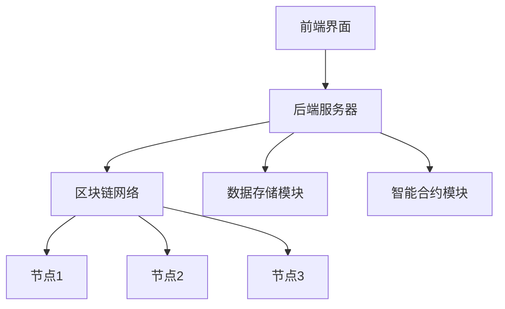
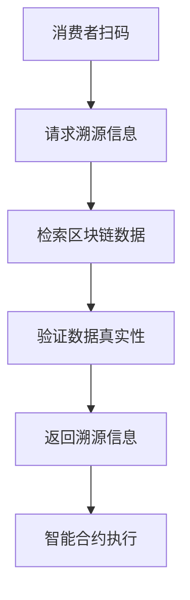
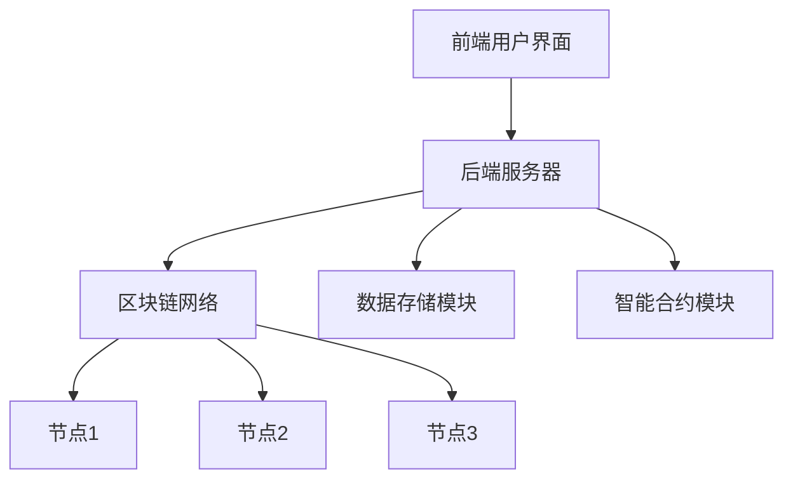

                 

### 第一部分: 区块链基础与食品溯源应用

在本文的第一部分，我们将探讨区块链技术的核心概念及其在食品溯源中的潜在应用。首先，我们将深入理解区块链的基础知识，包括其定义、特点和工作原理。接着，我们将探讨食品溯源的需求和挑战，并分析区块链技术在食品溯源中的应用前景。

#### 1.1.1 区块链的基本概念

区块链是一种去中心化的分布式数据库，它通过加密技术和共识算法确保数据的完整性和安全性。区块链的每一个区块都包含一定数量的交易记录，并通过密码学算法与前一个区块链接，形成一条不可篡改的链条。

**区块链的定义**：区块链是一个由多个按时间顺序排列、包含交易记录的数据区块组成的结构，这些区块通过密码学算法彼此链接，形成一种去中心化的数据库。

**区块链的核心特点**：

- **去中心化**：区块链不需要中央权威机构，每个节点都可以参与验证和存储数据。
- **数据不可篡改**：一旦数据被记录在区块链上，就很难被篡改。
- **透明性**：区块链上的数据对所有参与者都是可见的。
- **安全性**：区块链通过加密技术和共识算法确保数据的完整性和安全性。

**区块链的工作原理**：

1. **交易生成**：用户将交易信息发送到区块链网络。
2. **交易验证**：网络中的节点对交易进行验证，确保其有效性和合法性。
3. **区块生成**：验证后的交易被收集到一个新区块中。
4. **区块链接**：新区块通过加密算法与前一个区块链接，形成一条完整的区块链。
5. **共识达成**：通过共识算法（如PoW、PoS等），网络中的节点达成对区块的共识，确保数据的准确性和一致性。

#### 1.1.2 食品溯源的需求与挑战

**食品溯源的重要性**：

- 提高食品安全：通过食品溯源，消费者可以了解食品的来源和生产过程，从而提高对食品安全的信任。
- 降低食品安全风险：一旦发生食品安全问题，食品溯源可以帮助快速追溯到问题源头，降低食品安全风险。
- 促进食品产业透明化：食品溯源有助于提高食品产业的透明度，增强消费者对品牌的信任。

**食品溯源中存在的问题**：

- **信息不透明**：传统的食品溯源系统信息不透明，消费者难以获取完整的食品信息。
- **数据篡改风险**：传统的集中式数据库容易受到黑客攻击，数据可能被篡改。
- **成本高**：传统食品溯源系统建设成本高，实施难度大。

**区块链在食品溯源中的应用前景**：

- **提高信息透明度**：区块链技术可以确保食品信息在供应链中的透明度和可追溯性。
- **降低数据篡改风险**：区块链的数据不可篡改特性可以有效降低食品信息被篡改的风险。
- **降低成本**：区块链技术简化了食品溯源系统的建设和维护，降低了成本。

通过本文的初步探讨，我们了解了区块链技术的基本概念及其在食品溯源中的应用前景。接下来，我们将深入探讨区块链技术的核心组成部分，为后续的深入应用奠定基础。

#### 2.1 区块链技术基础

在上一部分，我们了解了区块链的基本概念和其在食品溯源中的应用前景。在本节中，我们将进一步探讨区块链技术的核心组成部分，包括基本架构、共识算法和智能合约。

##### 2.1.1 区块链的基本架构

区块链的基本架构包括以下三个主要部分：

1. **区块（Block）**：区块是区块链的基本单元，每个区块包含一定数量的交易记录。区块通常由区块头、交易数据和Merkle树组成。
2. **链（Chain）**：链是多个区块按照时间顺序链接而成的结构。每个区块通过其区块头中的哈希值与前一个区块链接，形成一个不可篡改的链条。
3. **网络（Network）**：网络包括多个节点，每个节点都参与区块链的验证和存储工作。节点通过共识算法达成对区块的共识，确保区块链的一致性和安全性。

**区块链的组成部分**：

- **区块头**：区块头包含区块版本号、前一区块的哈希值、时间戳、难度目标和随机数等。
- **交易数据**：交易数据包含区块链上的交易信息，如金额、发送方、接收方等。
- **Merkle树**：Merkle树是一种数据结构，用于高效验证和压缩大量的数据。

**区块链的数据结构**：

区块链的数据结构是一种链式结构，每个区块通过其区块头中的哈希值与前一个区块链接。这种结构使得区块链上的数据具有不可篡改性，因为任何对数据的篡改都会导致哈希值的改变，从而破坏链的完整性。

**区块链的安全机制**：

区块链的安全机制主要包括以下三个方面：

1. **加密技术**：区块链使用公钥加密技术保护数据的隐私和安全。
2. **共识算法**：共识算法用于确保区块链的一致性和安全性，如PoW（工作量证明）、PoS（权益证明）和DPoS（委托权益证明）等。
3. **分布式存储**：区块链的数据存储在分布式网络中的多个节点上，每个节点都备份了一份完整的数据，从而提高了数据的可靠性和安全性。

##### 2.1.2 共识算法

共识算法是区块链的核心组成部分，用于确保区块链的一致性和安全性。共识算法主要有以下几种：

1. **PoW（工作量证明）**：PoW算法通过计算复杂的数学问题来证明节点的工作量，从而获得记账权。著名的区块链平台如比特币就是基于PoW算法。
2. **PoS（权益证明）**：PoS算法通过计算节点的权益（如持有的币数和时间）来决定记账权。与PoW相比，PoS算法能耗较低，且更加公平。
3. **DPoS（委托权益证明）**：DPoS算法通过选举产生记账节点，持有币数的节点可以投票选举出记账节点。DPoS算法在提高网络性能和安全性方面表现优异。

**共识算法的原理与分类**：

- **PoW算法**：节点通过解决数学难题证明自己的工作量，计算难度随时间逐渐增加，以维持区块链的安全性和稳定性。PoW算法的核心在于找到满足特定条件的随机数，使得新生成的区块哈希值小于目标值。
- **PoS算法**：节点根据持有的币数和持币时间来证明自己的权益，权益越高的节点越有可能获得记账权。PoS算法的核心在于选择权益较高的节点作为记账节点。
- **DPoS算法**：节点通过投票选举出记账节点，记账节点负责验证和记账。DPoS算法的核心在于通过选举机制提高网络的性能和安全性。

**常见的共识算法**：

- **PoW（工作量证明）**：比特币
- **PoS（权益证明）**：以太坊2.0、Tezos
- **DPoS（委托权益证明）**：EOS、Steemit

##### 2.1.3 智能合约

智能合约是一种自动执行合同条款的计算机程序，它基于区块链技术运行，具有不可篡改性和透明性。智能合约的实现与编程是区块链应用开发的核心。

**智能合约的概念**：

- **智能合约**：智能合约是一种基于区块链技术的计算机程序，它可以自动执行合同条款，并在满足特定条件时触发执行。
- **智能合约的特点**：不可篡改性、透明性、自动执行。

**智能合约的实现与编程**：

- **智能合约语言**：常见的智能合约语言包括Solidity、Vyper和Scilla等。Solidity是最广泛使用的智能合约语言，它类似于JavaScript和C++。
- **智能合约开发环境**：常见的智能合约开发环境包括Truffle、Hardhat和Remix等。这些工具提供了丰富的功能和接口，方便开发者进行智能合约的编写和测试。
- **智能合约部署**：开发者可以使用区块链浏览器或区块链节点进行智能合约的部署。部署过程包括编译智能合约、生成合约地址和部署合约代码等步骤。

**智能合约的安全性**：

- **常见的安全问题**：智能合约可能存在的安全问题包括整数溢出、代码执行漏洞、交易费用陷阱等。
- **安全措施**：为了提高智能合约的安全性，开发者可以采用以下措施：代码审计、安全编码、使用安全库和框架等。

通过本节的内容，我们深入了解了区块链技术的核心组成部分，包括基本架构、共识算法和智能合约。这些基础知识的掌握将为后续的区块链在食品溯源中的应用提供坚实的理论基础。

### 3.1 食品溯源系统的架构设计

设计一个高效的食品溯源系统是确保食品安全和消费者信任的关键。在本节中，我们将探讨食品溯源系统的架构设计，包括系统需求分析和功能模块划分。

**3.1.1 系统需求分析**

在设计食品溯源系统之前，我们需要明确系统需要满足的需求。这些需求包括：

- **溯源信息完整性**：系统应能够完整记录食品从生产、加工、运输到销售的全过程信息。
- **数据透明性**：系统应确保所有参与者（如生产商、经销商、零售商和消费者）都能够查看和验证食品信息。
- **不可篡改性**：系统应具备强大的安全性，确保食品信息一旦上链后无法被篡改。
- **可追溯性**：系统应能够快速追溯到食品的来源和流通路径。
- **用户友好性**：系统应具备友好的用户界面，方便不同用户（如消费者、监管人员和企业员工）进行操作。

**3.1.2 功能模块划分**

为了实现上述需求，我们可以将食品溯源系统划分为以下几个功能模块：

1. **用户模块**：用户模块包括消费者、生产商、经销商、零售商和监管人员等。每个用户都有特定的权限和功能。
2. **数据采集模块**：数据采集模块负责收集食品生产、加工、运输和销售等环节的信息，并将其上链存储。
3. **数据存储模块**：数据存储模块负责存储和管理上链的食品信息，确保数据的完整性和安全性。
4. **数据查询模块**：数据查询模块提供便捷的数据查询功能，允许用户根据不同的条件检索食品信息。
5. **数据验证模块**：数据验证模块负责验证上链数据的真实性和合法性，确保数据的可信度。
6. **安全模块**：安全模块负责确保系统的安全性和数据的隐私保护，包括加密、身份认证和访问控制等。

**3.1.3 系统架构设计**

食品溯源系统的架构设计可以采用分布式架构，以提高系统的性能和可扩展性。以下是一个典型的系统架构设计：

- **前端**：前端包括用户界面，用于与用户进行交互。前端可以采用Web应用程序或移动应用程序的形式。
- **后端**：后端包括服务器、数据库和区块链节点。服务器负责处理用户的请求，数据库存储非区块链数据，区块链节点负责处理区块链相关的操作。
- **区块链网络**：区块链网络包括多个节点，每个节点都备份了一份完整的区块链数据。节点之间通过共识算法达成对区块的共识，确保区块链的一致性和安全性。
- **数据存储**：数据存储包括区块链和数据库。区块链存储上链的食品信息，数据库存储其他辅助数据。
- **安全机制**：安全机制包括加密、身份认证和访问控制等。加密用于保护数据的隐私，身份认证用于验证用户的身份，访问控制用于限制用户的权限。

**3.1.4 系统工作流程**

食品溯源系统的工作流程可以分为以下几个步骤：

1. **数据采集**：生产商、经销商和零售商将食品信息（如生产日期、生产批次、运输信息等）上传到系统中。
2. **数据上链**：系统将采集到的数据加密处理后，上传到区块链网络。区块链节点验证数据的有效性并添加到区块链中。
3. **数据查询**：消费者可以通过用户界面查询食品的详细信息，系统从区块链中检索并返回所需数据。
4. **数据验证**：监管人员可以对区块链上的食品信息进行验证，确保数据的真实性和完整性。
5. **数据备份**：系统定期备份区块链数据，确保数据的持久性和安全性。

通过上述架构设计和工作流程，我们为食品溯源系统提供了一个清晰的设计方案。接下来，我们将进一步探讨区块链在食品溯源中的应用实践，以展示其具体的应用场景和优势。

#### 3.2 区块链在食品溯源中的应用实践

在了解了区块链技术的基本概念和食品溯源系统的架构设计后，本节将深入探讨区块链在食品溯源中的应用实践。我们将详细描述如何将食品溯源信息上链，以及如何进行食品溯源信息的查询与验证。

**3.2.1 食品溯源信息上链**

将食品溯源信息上链是确保信息透明、不可篡改和可追溯性的关键步骤。以下是食品溯源信息上链的详细过程：

1. **数据采集**：食品生产、加工、运输和销售过程中的各个参与者（如生产商、经销商和零售商）将采集到的重要信息（如生产日期、生产批次、加工厂信息、运输信息和销售信息等）记录下来。这些信息可以通过物联网设备（如RFID标签、传感器等）自动采集，提高数据的准确性。

2. **数据加密**：为了保护食品信息的隐私，系统需要对采集到的数据进行加密处理。加密算法可以采用对称加密（如AES）和非对称加密（如RSA）相结合的方式，确保数据的机密性和完整性。

3. **构造交易**：系统将加密后的食品信息构造为区块链交易。交易包括发送方、接收方、金额（数据大小）和交易信息（食品信息）等。交易构造完成后，将其发送到区块链网络。

4. **交易验证**：区块链网络中的节点对交易进行验证。验证过程包括确认交易的有效性、检测重复交易和检查交易金额等。验证通过后，交易将被添加到一个待确认的交易池中。

5. **区块生成**：当交易池中的交易数量达到一定阈值时，系统将生成一个新的区块。区块包含一定数量的交易，并通过哈希算法与前一个区块链接，形成一条完整的区块链。

6. **共识达成**：区块链网络中的节点通过共识算法（如PoW、PoS或DPoS）达成对区块的共识。一旦共识达成，新产生的区块将被添加到区块链中，确保数据的完整性和一致性。

**3.2.2 食品溯源信息的查询与验证**

上链后的食品溯源信息可以被所有参与者和监管人员进行查询和验证。以下是食品溯源信息的查询与验证过程：

1. **用户请求**：用户通过系统前端界面提交查询请求。查询请求包括食品的唯一标识符（如生产批次号、条形码等）和查询条件（如生产日期、生产地点等）。

2. **检索数据**：系统从区块链中检索与查询请求相关的食品信息。区块链数据结构使得快速检索成为可能。系统可以通过Merkle树结构快速定位到所需数据，提高查询效率。

3. **数据验证**：系统对检索到的数据进行验证，确保数据的真实性和完整性。验证过程包括检查数据是否被篡改、数据是否完整和数据是否符合预期等。

4. **返回结果**：系统将验证通过的数据返回给用户。用户可以通过前端界面查看食品的详细信息，包括生产日期、生产批次、加工厂信息、运输信息和销售信息等。

5. **监管人员验证**：监管人员可以通过系统对食品信息进行进一步验证。监管人员可以查看食品信息的历史记录，检查数据的完整性、真实性和一致性。如果发现异常，监管人员可以采取相应的措施。

**3.2.3 具体案例**

以某食品企业的区块链溯源系统为例，该系统实现了食品溯源信息上链、查询和验证的全过程。以下是该系统的具体应用场景：

- **生产环节**：在生产环节，企业将生产日期、生产批次、原材料来源等信息上链存储。
- **加工环节**：在加工环节，企业将加工日期、加工批次、加工厂信息等信息上链存储。
- **运输环节**：在运输环节，企业将运输日期、运输批次、运输公司信息等信息上链存储。
- **销售环节**：在销售环节，企业将销售日期、销售批次、销售门店信息等信息上链存储。

- **用户查询**：消费者可以通过扫描食品包装上的二维码或输入食品标识符，查询食品的生产日期、生产批次、加工厂信息、运输信息和销售信息等。
- **监管人员验证**：监管人员可以通过系统对食品信息进行验证，检查数据的完整性和一致性。如果发现异常，监管人员可以采取相应的措施，如召回问题食品、对生产企业进行处罚等。

通过上述应用实践，我们可以看到区块链技术如何有效地应用于食品溯源，确保信息的透明性、不可篡改性和可追溯性。这不仅提高了食品安全水平，也增强了消费者对食品的信任。

### 3.3 溯源数据的存储与管理

在区块链技术应用于食品溯源的过程中，溯源数据的存储与管理是确保系统高效运行和信息安全的关键环节。本节将详细讨论溯源数据的加密与隐私保护、数据存储与数据冗余处理等问题。

#### 3.3.1 数据加密与隐私保护

**数据加密**：区块链技术中的数据加密是保护食品信息隐私的重要手段。在将食品溯源信息上链前，必须对数据进行加密处理。数据加密可以采用对称加密和非对称加密两种方式：

1. **对称加密**：对称加密算法（如AES）使用相同的密钥对数据进行加密和解密。对称加密速度快，但密钥管理复杂，适用于数据量较小且需要快速处理的情况。
2. **非对称加密**：非对称加密算法（如RSA）使用一对密钥（公钥和私钥）进行加密和解密。公钥用于加密，私钥用于解密。非对称加密安全性高，但计算复杂度较大，适用于需要高安全性的场景。

**隐私保护**：为了进一步保护食品信息的隐私，可以采用以下技术手段：

1. **同态加密**：同态加密允许在加密的数据上进行计算，而无需解密。这种技术可以确保数据在存储和处理过程中的隐私保护。
2. **零知识证明**：零知识证明是一种证明方法，可以证明某事为真，但无需透露具体信息。这种技术可以用于验证食品信息的真实性，同时保护其隐私。
3. **环签名**：环签名是一种匿名签名技术，可以隐藏签名的具体来源。这种技术可以用于确保食品信息的匿名性。

#### 3.3.2 数据存储与数据冗余处理

**数据存储**：区块链技术中的数据存储方式可以分为链上存储和链下存储两种：

1. **链上存储**：链上存储将数据直接存储在区块链中。这种方式的优点是数据透明、不可篡改和可追溯，但缺点是存储容量有限，且随着数据量的增加，存储成本和交易费用会显著上升。
2. **链下存储**：链下存储将数据存储在链外的数据库或文件系统中。链下存储可以扩展存储容量，降低存储成本和交易费用，但数据的安全性和一致性需要额外保证。

**数据冗余处理**：为了提高数据的可靠性和可用性，可以采用以下数据冗余处理方法：

1. **副本冗余**：副本冗余是一种简单有效的方法，通过在多个节点上存储同一份数据，确保数据不会因单点故障而丢失。常用的副本冗余策略包括单点冗余、两点冗余和三点冗余等。
2. **一致性冗余**：一致性冗余通过冗余计算来检测和纠正数据的一致性问题。例如，在区块链网络中，可以通过校验和、哈希值或Merkle树等手段确保数据的完整性。
3. **分布式存储**：分布式存储通过将数据分散存储在多个节点上，提高数据的可靠性和可用性。分布式存储系统通常采用数据分片、复制和一致性协议等技术。

#### 3.3.3 数据备份与恢复

**数据备份**：为了防止数据丢失或损坏，系统需要定期进行数据备份。数据备份可以分为以下几种类型：

1. **全量备份**：全量备份是对整个数据集进行备份，通常用于初始备份或灾难恢复。
2. **增量备份**：增量备份只备份自上次备份以来发生变化的数据，适用于日常备份。
3. **差异备份**：差异备份备份自上次全量备份或上次增量备份以来发生变化的数据，适用于数据变化频繁的场景。

**数据恢复**：在数据丢失或损坏的情况下，系统需要能够快速恢复数据。数据恢复可以采用以下方法：

1. **本地恢复**：通过本地备份恢复数据，适用于数据量较小且备份频率较低的场景。
2. **远程恢复**：通过远程备份恢复数据，适用于数据量较大且需要远程访问的场景。
3. **云备份恢复**：利用云存储服务进行数据备份和恢复，适用于需要高效备份和恢复的场景。

通过上述措施，食品溯源系统可以有效保证溯源数据的存储与管理安全、可靠和高效。这不仅有助于提高食品安全水平，还为消费者提供了可信赖的食品信息。

### 4.1 食品安全监管的现状与挑战

食品安全监管是保障公众健康的重要环节，但当前食品安全监管中存在诸多现状与挑战。了解这些现状与挑战有助于我们更好地理解区块链技术在这一领域的应用潜力和必要性。

#### 4.1.1 食品安全监管的重要性

**食品安全监管的定义**：食品安全监管是指政府或其他机构对食品的生产、加工、包装、储存、运输、销售和消费等环节进行监督和管理，确保食品的安全性和质量。

**食品安全监管的目的**：食品安全监管的主要目的是保障公众健康，防止食品安全事故的发生，提高食品产业的透明度和可信度。

**食品安全监管的重要性**：

1. **保障公众健康**：食品安全事故可能导致严重的健康问题，甚至死亡。有效的食品安全监管可以降低食品安全风险，保障公众健康。
2. **维护社会稳定**：食品安全问题可能引发社会不安和恐慌，影响社会稳定。有效的食品安全监管有助于维护社会稳定。
3. **促进产业发展**：食品安全监管可以促进食品产业的健康发展，提高企业的市场竞争力，推动整个行业的转型升级。

#### 4.1.2 食品安全监管中存在的问题

**信息不透明**：当前食品安全监管中的信息不透明问题较为突出。监管机构和生产、销售企业之间的信息传递不畅，导致公众难以获取全面的食品安全信息。

**数据篡改风险**：传统的食品安全监管系统容易受到黑客攻击，导致数据被篡改。一旦数据被篡改，食品安全监管的准确性将受到严重影响。

**监管效率低下**：食品安全监管涉及多个部门和层级，监管流程复杂，监管效率低下。这导致食品安全监管的效果不佳，难以及时发现和处理食品安全问题。

**监管资源不足**：食品安全监管需要大量的资金、人力和技术支持。然而，许多国家和地区在食品安全监管方面的资源有限，难以满足监管需求。

**监管标准不一致**：不同地区和国家的食品安全标准存在差异，导致食品在国际贸易中面临监管障碍。这增加了食品安全监管的复杂性。

#### 4.1.3 区块链在食品安全监管中的应用

**提高信息透明度**：区块链技术具有透明性、不可篡改性和可追溯性等特点，可以有效提高食品安全监管的信息透明度。通过区块链，监管机构和生产、销售企业之间的信息可以实时共享，公众可以方便地获取食品安全信息。

**降低数据篡改风险**：区块链的数据存储在分布式网络中，任何对数据的篡改都会被其他节点检测到。通过区块链技术，可以有效降低数据篡改风险，确保食品安全监管数据的真实性和完整性。

**提高监管效率**：区块链技术可以实现自动化和智能化的监管流程，减少人为干预和误差。通过区块链，食品安全监管可以实时监测和追踪食品的生产、加工、包装、储存、运输和销售等环节，提高监管效率。

**优化资源分配**：区块链技术可以提供一种去中心化的监管模式，减少对中心化机构的依赖。这有助于优化监管资源的分配，提高监管效率。

**促进国际合作**：区块链技术可以实现全球范围内的食品安全信息共享和监管协作，促进国际食品安全标准的统一和贸易的顺畅。

**增强公众信任**：通过区块链技术，食品安全监管过程变得透明和可追溯，公众对食品安全监管的信任度将得到提升。这有助于提高公众的食品安全意识，促进食品消费市场的健康发展。

总之，区块链技术在食品安全监管中的应用具有显著的优势和潜力。通过引入区块链技术，可以有效解决食品安全监管中存在的问题，提高监管效果，保障公众健康。

### 4.2 区块链在食品安全监管中的应用

区块链技术在食品安全监管中的应用潜力巨大，通过其去中心化、不可篡改和透明性等特点，可以显著提高食品安全监管的效率和可靠性。以下将详细介绍区块链在食品安全监管中的具体应用，包括监管流程的优化、食品安全信息的透明化与可追溯性。

#### 4.2.1 监管流程的优化

**实时监控与自动化执行**：区块链技术可以实现食品安全监管过程的实时监控和自动化执行。通过将监管流程上的关键节点和操作上链，监管机构可以实时跟踪和监控食品的生产、加工、包装、运输、存储和销售等各个环节。一旦某个环节出现问题，系统可以立即触发警报，并将相关信息通知给相关部门和人员，从而实现快速响应和及时处理。

**智能合约的应用**：智能合约是一种自动执行的计算机程序，可以嵌入到区块链中，用于自动化监管流程。例如，智能合约可以设定食品安全标准，当食品在生产或加工过程中不符合标准时，系统会自动禁止其进一步流通，并向监管机构和相关企业发出警告。这种自动化执行机制可以提高监管的效率和准确性，减少人为干预和错误。

**分布式协作**：区块链技术可以促进食品安全监管的分布式协作。通过区块链，监管机构、企业、消费者和其他利益相关者可以共享食品安全信息，形成一个去中心化的信息网络。这有助于实现信息的高效传递和协同监管，提高整体监管效果。

#### 4.2.2 食品安全信息的透明化

**全程可追溯**：区块链技术的不可篡改性和可追溯性使其成为实现食品安全信息透明化的理想工具。食品从生产到消费的每一个环节都可以记录在区块链上，形成一个完整的追溯链条。消费者可以通过扫描食品包装上的二维码，实时查看食品的详细信息，包括生产日期、生产批次、加工厂信息、运输信息、销售信息等。这种透明的信息展示有助于增强消费者对食品安全的信任。

**公开透明**：通过区块链，食品安全信息可以在全球范围内公开透明地展示。监管机构、企业和消费者都可以访问区块链上的数据，无需担心信息被篡改或泄露。这种公开透明的信息展示有助于提高食品安全监管的公信力和透明度。

**数据共享与协作**：区块链技术可以实现食品安全信息的共享与协作。不同企业、监管机构和研究机构可以共享区块链上的数据，共同分析和研究食品安全问题，提高整体食品安全水平。

#### 4.2.3 可追溯性

**供应链管理**：区块链技术可以实现对整个食品供应链的管理和监控。从原材料采购、生产加工、物流配送、仓储管理到零售销售，每个环节都可以通过区块链记录下来。这有助于确保食品供应链的透明性和可追溯性，及时发现和处理潜在的安全问题。

**事件响应与追溯**：当食品安全事件发生时，区块链技术可以提供快速的事件响应和追溯机制。通过区块链，可以迅速追溯食品的流通路径，找出问题的根源，并采取相应的措施进行整改。这种高效的事件响应和追溯机制有助于降低食品安全事件带来的损失，提高监管效果。

**数据分析和预测**：通过分析区块链上的食品安全数据，可以识别潜在的安全风险和趋势。这有助于监管机构和企业提前采取预防措施，提高食品安全水平。

#### 4.2.4 区块链在食品安全监管中的实际应用

**案例1：某食品安全监管平台**：某食品安全监管平台基于区块链技术，实现了对食品生产、加工、运输、销售等环节的全程监控和追溯。通过区块链，平台可以实时记录和验证食品信息，提高食品安全信息的透明度和可信度。同时，平台还实现了智能合约的应用，自动化执行食品安全标准和监管流程，提高了监管效率和准确性。

**案例2：某食品企业的区块链溯源系统**：某食品企业开发了一套基于区块链的溯源系统，用于记录和展示食品的生产、加工、运输和销售信息。消费者可以通过扫描食品包装上的二维码，查看食品的详细信息。该系统提高了企业的透明度和公信力，增强了消费者的信任。

**案例3：某食品安全监管机构的项目**：某食品安全监管机构利用区块链技术建立了一个食品安全信息共享平台，实现了不同监管机构和企业之间的数据共享和协同监管。通过区块链，平台可以实时跟踪和监控食品的流通路径，提高食品安全监管的效率和效果。

总之，区块链技术在食品安全监管中的应用具有巨大的潜力。通过优化监管流程、实现食品安全信息的透明化和可追溯性，区块链技术可以为食品安全监管提供强有力的技术支持，保障公众健康，促进食品产业的可持续发展。

### 4.3 食品安全事件的响应与处理

食品安全事件的处理和响应是保障公众健康的重要环节。区块链技术以其不可篡改和透明性，为食品安全事件的监控和处理提供了新的解决方案。以下将详细探讨区块链在食品安全事件监控与应急处理中的应用。

#### 4.3.1 食品安全事件的监控

**实时监控与预警系统**：区块链技术可以实现食品安全事件的实时监控和预警。通过将食品生产、加工、运输、销售等环节的关键数据上链，监管机构和企业可以实时跟踪食品的流通路径。一旦发现异常数据，系统可以立即触发警报，并通知相关方面进行及时处理。这种实时监控机制有助于快速识别潜在的安全风险，防止食品安全事件的发生。

**分布式数据存储**：区块链技术具有分布式数据存储的特点，使得食品安全数据在多个节点上备份和存储。这种分布式存储方式提高了数据的安全性和可靠性，确保即使在某个节点出现故障的情况下，数据也不会丢失。同时，分布式数据存储也使得食品安全事件的数据更加透明和可追溯，方便后续的调查和分析。

**智能合约应用**：智能合约可以嵌入到区块链中，用于自动化食品安全事件的监控和处理。例如，智能合约可以设定食品安全标准，一旦检测到某个环节的数据不符合标准，系统会自动触发预警机制，并将相关信息发送给相关监管机构和人员。这种自动化处理机制可以提高监控的效率和准确性。

#### 4.3.2 应急处理

**快速追溯与定位**：区块链技术的不可篡改性和可追溯性，使得在食品安全事件发生时，可以迅速追溯食品的来源和流通路径。通过区块链，监管机构和企业可以快速定位到问题食品的具体来源和涉及范围，从而采取有针对性的措施，防止问题进一步扩散。

**协同应对**：区块链技术可以实现多方协同应对食品安全事件。通过区块链，监管机构、企业和消费者可以共享食品安全事件的信息和数据，共同分析和研究问题的根源，制定和执行应对措施。这种协同应对机制有助于提高食品安全事件处理的效率和质量。

**透明化处理过程**：区块链技术的透明性，使得食品安全事件的处理过程公开透明。所有参与方都可以查看和处理食品安全事件的相关信息，确保每个环节都有据可查，有迹可循。这种透明化处理过程，有助于增强公众对食品安全监管的信任，提高监管公信力。

**智能合约自动化执行**：智能合约可以用于自动化食品安全事件的应急处理流程。例如，智能合约可以设定应急处理的标准和步骤，一旦触发，系统会自动执行相应的措施，如召回问题食品、关闭生产线等。这种自动化执行机制可以提高应急处理的效率和准确性。

#### 4.3.3 案例分析

**案例1：某食品安全召回事件**：在某次食品安全召回事件中，一家食品企业利用区块链技术实现了问题食品的快速追溯和召回。通过区块链，企业实时记录了问题食品的生产、加工、运输和销售信息，并在发现问题时迅速定位到具体批次和销售区域。在监管机构的协助下，企业成功实施了问题食品的召回，并进行了后续的处理和整改。

**案例2：某食品安全检测平台**：某食品安全检测平台基于区块链技术，实现了食品安全检测数据的实时记录和公开。通过区块链，平台可以记录和验证每个批次食品的检测数据，确保数据的真实性和完整性。一旦发现某批次食品的检测数据异常，平台会立即触发预警机制，并将相关信息通知给监管机构和消费者。

**案例3：某食品安全溯源系统**：某食品企业开发了一套基于区块链的食品安全溯源系统，用于记录和展示食品的生产、加工、运输和销售信息。系统实现了对食品安全事件的实时监控和快速响应。在一次食品安全事件中，企业通过区块链迅速追溯到了问题食品的来源和涉及范围，并采取了有效的应对措施，防止了事件的进一步扩散。

总之，区块链技术在食品安全事件的监控和应急处理中具有显著的优势。通过实时监控、快速追溯和协同应对，区块链技术可以提高食品安全事件的响应速度和处理效果，保障公众健康，提高食品安全管理水平。

### 5.1 供应链管理的概述

供应链管理是企业管理中至关重要的环节，它涵盖了从原材料采购、生产制造、产品分销到最终交付给消费者的整个过程。有效的供应链管理不仅能够降低成本、提高效率，还能够增强企业的竞争力。以下将详细阐述供应链管理的定义、流程、挑战和机遇。

#### 5.1.1 供应链管理的定义

**供应链管理**：供应链管理（Supply Chain Management，简称SCM）是指对供应链中的各个环节进行计划、组织、协调和控制的过程。它包括从原材料供应商到产品最终用户的整个流程，涉及物流、信息流和资金流的协调与整合。

**供应链管理的目标**：供应链管理的目标主要包括提高供应链的效率、降低成本、提升客户满意度和增强企业的竞争力。

#### 5.1.2 供应链管理的流程

**需求计划**：需求计划是供应链管理的第一步，它涉及到对市场需求的分析和预测，以确定生产和库存水平。通过需求计划，企业可以更好地满足客户需求，避免库存过剩或短缺。

**采购管理**：采购管理涉及原材料的采购、供应商选择和合同管理。有效的采购管理可以帮助企业获得优质的原材料，降低采购成本，并建立稳定的供应商关系。

**生产计划**：生产计划是供应链管理的核心环节，它涉及到生产过程的安排和调度。通过生产计划，企业可以优化生产流程，提高生产效率，减少浪费。

**库存管理**：库存管理涉及库存水平的控制和管理，以确保在需求高峰期有足够的库存，同时避免库存积压和资金占用。

**物流管理**：物流管理涉及产品的运输、仓储和配送。有效的物流管理可以提高运输效率，减少运输成本，并确保产品按时交付给客户。

**分销管理**：分销管理涉及产品的分销渠道管理，包括批发、零售和在线销售等。通过有效的分销管理，企业可以更好地覆盖市场，提高销售业绩。

**客户服务**：客户服务是供应链管理的最后一步，它涉及到客户需求的满足和反馈处理。通过提供优质的客户服务，企业可以增强客户满意度和忠诚度。

#### 5.1.3 供应链管理的挑战

**信息不对称**：供应链中的各个环节之间存在信息不对称问题，这可能导致供应链的不协调和效率低下。例如，生产计划无法准确预测市场需求，库存管理无法及时调整。

**供应链复杂性**：随着全球化和电子商务的发展，供应链变得越来越复杂。企业需要协调和管理多个供应商、多个生产基地、多个分销渠道和多个物流节点，这增加了供应链管理的难度。

**物流成本**：物流成本在供应链管理中占据了较大比重。如何降低物流成本，提高运输效率，是企业面临的一个重要挑战。

**供应链中断**：供应链中断可能是由于自然灾害、政治动荡、供应链中断等不可预测因素引起的。供应链中断可能导致生产停滞、库存积压和客户满意度下降。

**合规与风险管理**：供应链管理需要遵守各种法律法规和标准，如反贿赂法、劳动法、环境保护法等。同时，企业还需要应对各种风险，如信用风险、市场风险、操作风险等。

#### 5.1.4 供应链管理的机遇

**区块链技术的应用**：区块链技术可以为供应链管理提供透明、不可篡改和可追溯的数据管理平台。通过区块链，企业可以实现供应链信息的共享和协同，提高供应链的效率和透明度。

**数字化转型**：随着数字技术的不断发展，企业可以通过数字化转型来优化供应链管理。例如，采用物联网（IoT）技术实现设备联网和智能监控，采用大数据分析和人工智能技术进行需求预测和库存优化。

**全球化与区域化**：全球化为企业提供了更广阔的市场机会，但同时也带来了供应链管理的复杂性。通过区域化策略，企业可以更好地应对区域市场需求，提高供应链的灵活性和响应速度。

**可持续发展**：可持续发展已成为全球趋势，企业需要通过优化供应链管理来降低碳排放、减少资源消耗和提升社会责任。通过供应链管理，企业可以实现环保、经济和社会效益的平衡。

**客户需求变化**：消费者需求的多样化和个性化趋势，要求企业快速响应市场变化，提高产品和服务的定制化水平。通过供应链管理，企业可以更好地满足客户需求，提升客户满意度。

总之，供应链管理在企业管理中具有至关重要的地位。通过了解供应链管理的定义、流程、挑战和机遇，企业可以更好地优化供应链管理，提高运营效率和竞争力。

### 5.2 区块链在供应链管理中的应用

区块链技术在供应链管理中的应用正逐渐成为行业关注的焦点，其去中心化、透明性和不可篡改性等特点为供应链管理带来了诸多革新。以下将详细探讨区块链在供应链管理中的具体应用，包括供应链信息的透明化、流程的自动化与优化。

#### 5.2.1 供应链信息的透明化

**实时数据共享**：在传统的供应链管理中，信息往往分散在不同的系统和企业之间，导致信息不对称和滞后。区块链技术通过去中心化的方式，实现供应链各环节信息的实时共享。每个参与方都可以透明地看到供应链中的所有活动，从而提高信息的透明度和准确性。

**不可篡改的记录**：区块链上的数据具有不可篡改的特性，这确保了供应链信息的真实性和完整性。一旦数据被记录在区块链上，就无法被修改或删除，这为供应链管理提供了可靠的数据基础。

**溯源能力**：区块链技术可以记录从原材料采购到最终产品交付的整个供应链过程，形成一条完整的溯源链条。这有助于企业快速追踪产品的来源，确保产品质量，提高消费者对产品的信任。

**案例**：某食品企业通过区块链技术实现了从农田到餐桌的全程溯源。消费者可以通过扫描产品上的二维码，查看产品的种植、采摘、加工、运输等详细信息，确保食品的安全和品质。

#### 5.2.2 流程的自动化与优化

**智能合约的应用**：智能合约是一种嵌入在区块链程序中的自动化合同，可以自动执行合同条款。在供应链管理中，智能合约可以用于自动化订单处理、支付和物流跟踪等流程，减少人为干预，提高效率。

**自动化支付**：通过智能合约，供应链中的支付流程可以自动化执行。一旦满足合同条款，智能合约将自动执行支付操作，确保支付的及时性和准确性。

**物流跟踪**：区块链技术可以实现物流信息的实时跟踪和验证。每个物流环节的信息都可以上链记录，确保物流过程的透明化和可追溯性。这不仅提高了物流效率，还降低了物流成本。

**优化库存管理**：通过区块链技术，企业可以实时获取供应链各环节的库存信息，优化库存管理。智能合约可以根据库存水平和市场需求，自动调整库存策略，减少库存积压和资金占用。

**案例**：某电子产品公司利用区块链技术实现了全球供应链的自动化管理。通过智能合约，公司可以自动处理订单、支付和物流跟踪，提高了供应链的效率，降低了运营成本。

#### 5.2.3 区块链在供应链管理中的其他应用

**供应链金融**：区块链技术可以用于供应链金融，为企业提供融资和支付解决方案。通过区块链，金融机构可以快速验证企业的信用和交易记录，提高融资效率和安全性。

**合规与审计**：区块链技术可以记录供应链中的所有交易和操作，为合规和审计提供可靠的数据支持。企业可以通过区块链验证供应链的合规性，降低审计风险。

**风险管理**：区块链技术可以帮助企业实时监控供应链中的风险，提高风险预警和应对能力。通过区块链，企业可以及时了解供应链的潜在风险，并采取相应的措施进行风险控制。

**案例**：某零售企业通过区块链技术实现了供应链金融的自动化。通过智能合约，企业可以自动处理订单融资和支付，提高了资金周转效率，降低了融资成本。

总之，区块链技术在供应链管理中的应用为供应链的透明化、自动化和优化提供了强有力的支持。通过实时数据共享、智能合约和区块链溯源等技术，企业可以大幅提高供应链效率，降低成本，增强客户满意度，从而在激烈的市场竞争中脱颖而出。

### 5.3 食品供应链的溯源与防伪

在食品供应链管理中，溯源与防伪是确保食品安全和消费者信任的关键环节。区块链技术的应用为食品供应链的溯源与防伪提供了高效、透明的解决方案。以下将详细探讨区块链在食品供应链溯源与防伪中的应用，包括溯源系统的实现和防伪技术的应用。

#### 5.3.1 溯源系统的实现

**溯源系统的架构设计**：区块链溯源系统通常采用分布式架构，包括数据采集模块、区块链网络和数据查询模块等。以下是溯源系统的基本架构设计：

1. **数据采集模块**：数据采集模块负责收集食品供应链各个环节的信息，如生产日期、生产批次、加工厂信息、运输信息、销售门店信息等。这些信息通过物联网设备（如RFID标签、传感器等）自动采集，提高数据的准确性。

2. **区块链网络**：区块链网络包括多个节点，每个节点都存储了一份完整的区块链数据。区块链节点通过共识算法（如PoW、PoS等）达成对数据的共识，确保数据的完整性和一致性。

3. **数据查询模块**：数据查询模块提供便捷的数据查询功能，允许用户根据不同的条件检索食品信息。用户可以通过前端界面查询食品的详细信息，系统从区块链中检索并返回所需数据。

**数据上链流程**：

1. **数据采集**：食品供应链中的各个参与者（如生产商、经销商、零售商等）将采集到的信息上传到系统中。

2. **数据加密**：为了保护食品信息的隐私，系统需要对采集到的数据进行加密处理。加密算法可以采用对称加密和非对称加密相结合的方式。

3. **构造交易**：系统将加密后的食品信息构造为区块链交易。交易包括发送方、接收方、金额（数据大小）和交易信息（食品信息）等。

4. **交易验证**：区块链网络中的节点对交易进行验证，确保交易的有效性和合法性。

5. **区块生成**：验证后的交易被收集到一个新区块中，新区块通过哈希算法与前一个区块链接，形成一条完整的区块链。

6. **共识达成**：区块链网络中的节点通过共识算法达成对区块的共识，确保数据的准确性和一致性。

**数据查询与验证流程**：

1. **用户请求**：用户通过前端界面提交查询请求，查询请求包括食品的唯一标识符（如生产批次号、条形码等）和查询条件（如生产日期、生产批次等）。

2. **检索数据**：系统从区块链中检索与查询请求相关的食品信息。区块链数据结构使得快速检索成为可能。系统可以通过Merkle树结构快速定位到所需数据，提高查询效率。

3. **数据验证**：系统对检索到的数据进行验证，确保数据的真实性和完整性。验证过程包括检查数据是否被篡改、数据是否完整和是否符合预期等。

4. **返回结果**：系统将验证通过的数据返回给用户。用户可以通过前端界面查看食品的详细信息，包括生产日期、生产批次、加工厂信息、运输信息和销售信息等。

5. **监管人员验证**：监管人员可以通过系统对食品信息进行进一步验证，检查数据的完整性和一致性。如果发现异常，监管人员可以采取相应的措施，如召回问题食品、对生产企业进行处罚等。

#### 5.3.2 防伪技术的应用

**二维码与区块链的结合**：为了提高食品的防伪能力，可以将二维码与区块链技术结合。在食品包装上贴上含有区块链地址的二维码，消费者可以通过扫描二维码，查询食品的详细信息，包括生产日期、生产批次、加工厂信息、运输信息和销售信息等。这种防伪技术不仅提高了食品的防伪能力，还增强了消费者的信任。

**加密标签**：食品包装上可以贴上加密标签，标签中包含食品的唯一标识符和加密信息。消费者可以通过扫描标签，验证食品的真实性。加密标签采用区块链技术，确保数据的安全性和唯一性。

**智能合约**：智能合约可以用于实现食品防伪。例如，在生产食品时，系统可以生成一个智能合约，用于记录食品的生产信息。当消费者购买食品后，可以通过智能合约验证食品的真实性。如果发现食品是伪造的，智能合约可以自动触发报警机制，通知相关方面进行处理。

**案例**：某食品企业通过区块链技术实现了食品的溯源与防伪。消费者可以通过扫描食品包装上的二维码，查看食品的详细信息，包括生产日期、生产批次、加工厂信息、运输信息和销售信息等。该企业还采用了加密标签和智能合约技术，确保食品的真实性和防伪能力。

总之，区块链技术在食品供应链的溯源与防伪中具有显著的应用优势。通过实时数据共享、不可篡改的记录和智能合约的应用，区块链技术可以大幅提高食品供应链的透明度和可信度，增强消费者的信任，从而提高企业的市场竞争力和品牌价值。

### 6.1 案例分析1：某食品企业的区块链溯源系统

在本节中，我们将详细分析某食品企业基于区块链技术的溯源系统，包括其系统架构、主要功能以及系统的实际效果评估。

#### 6.1.1 系统架构

该食品企业的区块链溯源系统采用了分布式架构，包括以下几个关键模块：

1. **前端界面**：前端界面提供了用户友好的操作体验，消费者可以通过扫描食品包装上的二维码，访问系统的溯源信息。

2. **后端服务器**：后端服务器负责处理用户请求，包括数据检索、验证和响应等。

3. **区块链网络**：区块链网络由多个节点组成，每个节点都存储了一份完整的区块链数据。节点通过共识算法（如PoS）确保数据的准确性和一致性。

4. **数据存储模块**：数据存储模块负责存储和管理食品溯源数据，包括生产日期、生产批次、加工厂信息、运输信息等。

5. **智能合约模块**：智能合约模块用于自动化执行溯源过程中的各种操作，如数据验证、支付和物流跟踪等。

**系统架构图**：


#### 6.1.2 主要功能

该溯源系统实现了以下主要功能：

1. **数据采集与上链**：食品生产过程中，各种信息（如生产日期、生产批次、加工厂信息等）通过物联网设备自动采集，并上传到区块链网络。

2. **数据查询与验证**：消费者通过扫描二维码，可以实时查询食品的详细信息。系统从区块链中检索数据，并验证其真实性和完整性。

3. **数据追溯**：通过区块链的溯源功能，可以追溯食品从生产到销售的整个过程，确保食品的来源和质量。

4. **智能合约应用**：智能合约用于自动化执行溯源过程中的各种操作，如支付、物流跟踪和订单管理等。

**主要功能流程图**：


#### 6.1.3 系统效果评估

该溯源系统的实际应用效果显著，具体如下：

1. **信息透明度**：通过区块链技术，食品溯源信息透明、不可篡改，提高了消费者对食品安全的信任。

2. **追溯效率**：区块链技术实现了高效的数据追溯，消费者可以快速查询食品的详细信息，减少了信息滞后和错误。

3. **防伪能力**：区块链技术增强了食品防伪能力，消费者可以通过验证区块链上的数据，确保食品的真实性。

4. **成本降低**：通过智能合约的应用，系统自动化执行了各种操作，减少了人为干预和错误，降低了运营成本。

5. **效果评估**：
    - **用户满意度**：消费者对溯源系统的满意度显著提高，食品信息透明度得到了用户的高度认可。
    - **企业管理效率**：企业通过溯源系统优化了生产和管理流程，提高了运营效率。
    - **市场竞争力**：企业通过提供透明的食品安全信息，增强了品牌的市场竞争力。

**效果评估表**：
| 项目 | 评估指标 | 评估结果 |
| --- | --- | --- |
| 信息透明度 | 消费者信任度 | 显著提高 |
| 追溯效率 | 数据查询速度 | 快速 |
| 防伪能力 | 食品真实性验证 | 增强 |
| 成本降低 | 运营成本 | 减少 |
| 市场竞争力 | 品牌价值 | 提高 |

通过上述案例分析，我们可以看到区块链溯源系统在提升食品安全透明度、效率、防伪能力和降低成本方面具有显著优势，为食品企业提供了有力的技术支持。

### 6.2 案例分析2：某食品安全监管平台的区块链应用

在本节中，我们将详细分析某食品安全监管平台如何利用区块链技术提高监管效率和透明度。这个平台的核心功能、实现过程以及效果评估将为我们提供宝贵的应用实例。

#### 6.2.1 平台核心功能

该食品安全监管平台的核心功能包括以下几个方面：

1. **食品安全信息记录与共享**：平台通过区块链技术记录食品从生产、加工、运输到销售的各个环节的信息，并实现信息的透明化和共享。所有记录的数据都是不可篡改的，确保了数据的真实性和完整性。

2. **智能合约应用**：平台使用智能合约来自动化执行食品安全标准和监管流程。例如，当某个环节的数据不符合标准时，智能合约会自动触发报警并通知相关部门。

3. **实时监控与预警**：平台通过实时监控食品的流通路径，一旦发现异常数据，会立即触发预警机制，并通知相关监管部门和企业。

4. **数据分析和报告**：平台可以对区块链上的数据进行实时分析，生成食品安全报告，为监管决策提供数据支持。

#### 6.2.2 实现过程

该食品安全监管平台采用以下实现过程：

1. **系统设计**：首先，平台进行了详细的需求分析和系统设计。系统设计包括前端用户界面、后端服务器、区块链网络和数据存储模块等。

2. **区块链网络搭建**：平台在区块链网络中部署了多个节点，确保数据的分布式存储和备份。节点通过共识算法（如PoS）确保数据的一致性和安全性。

3. **数据采集与上链**：平台与食品生产企业、加工厂、运输公司等合作，通过物联网设备（如RFID标签、传感器等）采集食品信息，并将其上链存储。数据上链前经过加密处理，保护数据的隐私和安全。

4. **智能合约开发**：平台开发了一系列智能合约，用于自动化执行食品安全标准和监管流程。智能合约的编写采用Solidity编程语言，确保其安全性和高效性。

5. **系统部署与测试**：平台在测试环境中进行了一系列测试，包括功能测试、性能测试和安全测试，确保系统稳定可靠。

#### 6.2.3 平台功能详解

1. **食品安全信息记录与共享**：平台通过区块链实现了食品信息的全程记录和共享。每个环节的数据都记录在区块链上，包括生产日期、生产批次、加工厂信息、运输信息和销售信息等。这些信息对所有参与者（包括消费者、监管机构和企业）都是透明的，增强了食品安全监管的透明度。

2. **智能合约应用**：智能合约在食品安全监管中发挥了重要作用。例如，当某批次食品在生产过程中出现质量问题时，智能合约会自动触发报警机制，通知相关监管部门和企业。智能合约还可以自动执行召回程序，确保问题食品不会流入市场。

3. **实时监控与预警**：平台通过区块链网络实时监控食品的流通路径，一旦发现异常数据，系统会立即触发预警机制，并向相关监管部门和企业发送警报。这种实时监控机制有助于快速发现和处理食品安全问题，降低食品安全风险。

4. **数据分析和报告**：平台可以对区块链上的数据进行实时分析，生成食品安全报告。这些报告为监管决策提供了数据支持，有助于监管部门及时调整监管策略，提高监管效果。

#### 6.2.4 平台效果评估

该食品安全监管平台在实际应用中取得了显著效果，具体评估如下：

1. **信息透明度**：通过区块链技术，食品安全信息实现了全程记录和透明化，增强了消费者对食品安全的信任。

2. **监管效率**：智能合约的应用自动化了食品安全监管流程，提高了监管效率。实时监控和预警机制有助于快速发现和处理食品安全问题，降低了监管成本。

3. **数据准确性**：区块链技术的不可篡改性确保了食品安全数据的准确性，减少了数据篡改和错误的可能性。

4. **防伪能力**：平台通过区块链技术增强了食品防伪能力，消费者可以通过验证区块链上的数据，确保食品的真实性。

5. **效果评估**：
    - **用户满意度**：消费者对平台的信息透明度和可靠性给予了高度评价，满意度显著提高。
    - **监管效果**：监管部门通过平台实现了更高效的食品安全监管，监管效果得到显著提升。
    - **企业运营效率**：企业通过平台优化了食品安全管理流程，提高了运营效率，降低了运营成本。

**效果评估表**：
| 项目 | 评估指标 | 评估结果 |
| --- | --- | --- |
| 信息透明度 | 消费者信任度 | 显著提高 |
| 监管效率 | 监管成本 | 减少 |
| 数据准确性 | 数据错误率 | 减少 |
| 防伪能力 | 食品真实性验证 | 增强 |

通过这个案例分析，我们可以看到区块链技术在食品安全监管中的应用具有显著的优势，为提高监管效率、透明度和数据准确性提供了有力支持。

### 6.3 案例分析3：某食品供应链管理系统的区块链实现

在本节中，我们将详细分析某食品供应链管理系统如何利用区块链技术实现供应链信息的透明化、流程的自动化与优化。本案例包括系统的设计、实现过程以及系统的优化措施。

#### 6.3.1 系统设计

**系统架构设计**：

该食品供应链管理系统采用了分布式架构，包括前端用户界面、后端服务器、区块链网络和数据存储模块等。以下是系统架构设计：

1. **前端用户界面**：前端用户界面提供了用户友好的操作体验，消费者和企业可以通过前端界面访问系统。

2. **后端服务器**：后端服务器负责处理用户请求，包括数据检索、验证和响应等。

3. **区块链网络**：区块链网络由多个节点组成，每个节点都存储了一份完整的区块链数据。节点通过共识算法（如PoS）确保数据的一致性和安全性。

4. **数据存储模块**：数据存储模块负责存储和管理供应链数据，包括原材料采购、生产、加工、运输和销售等环节的信息。

5. **智能合约模块**：智能合约模块用于自动化执行供应链管理过程中的各种操作，如支付、物流跟踪和库存管理。

**系统架构图**：


#### 6.3.2 实现过程

**实现步骤**：

1. **需求分析与系统设计**：首先，系统进行了详细的需求分析和系统设计。系统设计包括前端用户界面、后端服务器、区块链网络和数据存储模块等。

2. **区块链网络搭建**：系统在区块链网络中部署了多个节点，确保数据的分布式存储和备份。节点通过共识算法（如PoS）确保数据的一致性和安全性。

3. **数据采集与上链**：系统与食品供应链中的各个企业（如原材料供应商、加工厂、运输公司等）合作，通过物联网设备（如RFID标签、传感器等）采集供应链各个环节的信息，并将其上链存储。数据上链前经过加密处理，保护数据的隐私和安全。

4. **智能合约开发**：系统开发了一系列智能合约，用于自动化执行供应链管理过程中的各种操作，如支付、物流跟踪和库存管理。智能合约的编写采用Solidity编程语言，确保其安全性和高效性。

5. **系统部署与测试**：系统在测试环境中进行了一系列测试，包括功能测试、性能测试和安全测试，确保系统稳定可靠。

**代码实现示例**：

以下是智能合约的一个简单示例，用于实现支付功能：
```solidity
// SPDX-License-Identifier: MIT
pragma solidity ^0.8.0;

contract Payment {
    mapping(address => uint256) public balance;

    function deposit() public payable {
        balance[msg.sender()] += msg.value;
    }

    function withdraw(uint256 amount) public {
        require(balance[msg.sender()] >= amount, "Insufficient balance");
        balance[msg.sender()] -= amount;
        payable(msg.sender()).transfer(amount);
    }
}
```

#### 6.3.3 系统优化

**数据存储优化**：

1. **数据分片**：为了提高数据存储的效率，系统采用了数据分片技术。数据被分成多个片段，每个片段存储在不同的节点上。这有助于减轻单个节点的压力，提高系统性能。

2. **数据压缩**：系统对上链的数据进行了压缩处理，以减少数据存储的空间和传输带宽。常用的数据压缩算法包括GZIP和Snappy等。

**性能优化**：

1. **并发处理**：系统采用了多线程和异步处理技术，提高了并发处理能力。例如，在处理大量数据时，系统可以同时执行多个任务，减少处理时间。

2. **缓存机制**：系统引入了缓存机制，缓存常用数据，以减少对区块链的直接访问。这有助于提高系统的响应速度。

**安全优化**：

1. **访问控制**：系统实现了严格的访问控制机制，确保只有授权用户才能访问敏感数据。访问控制通过角色权限和身份验证实现。

2. **代码审计**：系统定期进行代码审计，发现和修复潜在的安全漏洞。代码审计有助于提高系统的安全性。

**案例效果评估**：

该食品供应链管理系统在实际应用中取得了显著效果，具体如下：

1. **透明度提高**：通过区块链技术，供应链信息的透明度得到了显著提高，所有参与方都可以实时查看和验证供应链数据。

2. **效率提升**：智能合约的应用自动化了供应链管理流程，减少了人为干预和错误，提高了运营效率。

3. **成本降低**：系统优化措施（如数据存储优化、性能优化和安全优化）降低了运营成本，提高了企业的盈利能力。

4. **效果评估**：
    - **用户满意度**：用户对系统的透明度和可靠性给予了高度评价，满意度显著提高。
    - **运营效率**：企业的运营效率得到显著提升，运营成本降低。
    - **市场竞争力**：企业通过提供透明的供应链信息，增强了品牌的市场竞争力。

**效果评估表**：
| 项目 | 评估指标 | 评估结果 |
| --- | --- | --- |
| 透明度 | 用户信任度 | 显著提高 |
| 效率 | 运营效率 | 提升 |
| 成本 | 运营成本 | 降低 |
| 竞争力 | 市场竞争力 | 增强 |

通过这个案例分析，我们可以看到区块链技术在食品供应链管理系统中的应用具有显著的优势，为供应链信息的透明化、流程的自动化与优化提供了强有力的支持。

### 7.1 区块链技术的演进趋势

随着技术的不断进步，区块链技术在食品安全领域的应用前景愈发广阔。以下将探讨区块链技术的最新进展、未来发展方向以及潜在的技术挑战。

#### 7.1.1 区块链技术的最新进展

**区块链3.0**：区块链3.0是下一代区块链技术，它不仅具有区块链1.0（比特币）的去中心化和不可篡改特性，还具备区块链2.0（以太坊）的智能合约功能。区块链3.0在性能、可扩展性和安全性方面进行了显著提升，为食品安全应用提供了更强大的支持。

**跨链技术**：跨链技术允许不同区块链之间的数据交互和协作，解决了传统区块链孤岛问题。通过跨链技术，可以实现多个区块链网络的互联互通，为食品安全监管提供更广泛的数据支持。

**隐私保护技术**：为了解决区块链隐私保护问题，隐私保护技术（如零知识证明、同态加密和环签名等）得到了广泛应用。这些技术可以在不泄露具体信息的情况下，验证数据的真实性和合法性，为食品安全监管提供了更强的隐私保护。

**智能合约优化**：随着智能合约应用的普及，智能合约的性能和安全性成为了关注焦点。最新的智能合约优化技术（如Scilla、Vyper等）在提升智能合约性能、减少漏洞和增强安全性方面取得了显著进展。

#### 7.1.2 区块链技术的未来发展方向

**高性能区块链**：为了满足食品安全领域的实时性要求，高性能区块链技术将成为未来发展的重点。例如，Layer 2解决方案（如Plasma、Rollup等）通过在链上实现分层结构，提高了区块链的处理能力和扩展性。

**去中心化应用（DApp）**：去中心化应用（DApp）将成为区块链技术未来发展的另一个重要方向。通过DApp，企业可以在区块链上构建去中心化的应用程序，实现供应链管理、溯源和监管等功能的自动化和透明化。

**物联网（IoT）集成**：区块链与物联网技术的集成将进一步提高食品安全溯源的准确性和实时性。通过物联网设备收集的实时数据，可以实时上链并用于溯源和监管，提高食品安全监管的效率和效果。

**分布式存储**：分布式存储技术的应用将进一步提高区块链系统的可靠性和可扩展性。通过分布式存储，数据可以在多个节点上备份和存储，提高了数据的安全性和可用性。

**隐私保护**：在食品安全领域，隐私保护将是一个持续关注的问题。未来的区块链技术将更加注重隐私保护，通过引入更强的隐私保护技术，确保食品信息在链上的安全存储和传输。

#### 7.1.3 潜在的技术挑战

**性能与扩展性**：区块链技术在处理海量数据时，性能和扩展性成为关键挑战。未来的区块链技术需要进一步提高处理速度和扩展性，以满足食品安全领域的实时性要求。

**隐私保护**：虽然隐私保护技术取得了显著进展，但在食品安全领域，如何在不泄露具体信息的情况下，确保数据的真实性和合法性，仍是一个重要的技术挑战。

**安全性**：区块链技术的安全性是食品安全领域的关键问题。未来的区块链技术需要进一步提高安全性，防止恶意攻击和数据篡改。

**监管合规**：区块链技术的应用需要在法规和政策框架内进行，如何确保区块链系统的监管合规，是一个重要的挑战。

**用户接受度**：区块链技术的普及需要用户的广泛接受。提高用户对区块链技术的认知和信任，是推动其在食品安全领域应用的重要任务。

总之，区块链技术的演进趋势为食品安全领域的应用提供了广阔的前景。通过不断的技术创新和优化，区块链技术将进一步提升食品安全监管的效率、透明度和安全性。

### 7.2 食品安全领域的区块链应用前景

随着区块链技术的不断演进，其在食品安全领域的应用前景愈发广阔。区块链技术的独特优势，如去中心化、不可篡改和透明性，使其成为提升食品安全监管、溯源和供应链管理的重要工具。以下将详细探讨区块链在食品安全领域的未来发展趋势，以及其面临的挑战和解决方案。

#### 7.2.1 食品安全监管的数字化转型

**智能监管**：区块链技术可以实现食品安全监管的智能化，通过智能合约和自动化流程，监管机构可以实时监控食品安全信息，自动执行监管任务，提高监管效率。例如，当检测到某批次食品不符合安全标准时，智能合约可以自动触发警报并通知相关部门进行处置。

**数据共享**：区块链技术可以促进监管机构、企业和消费者之间的数据共享，确保食品安全信息的透明性和一致性。通过区块链，各参与方可以实时访问和验证食品安全数据，提高监管的公信力和透明度。

**分布式协作**：区块链技术可以实现多方协作，促进监管机构、企业和消费者之间的信息共享和协同工作。例如，在食品安全事件发生时，各参与方可以通过区块链实时共享信息，协同应对，提高应对速度和效果。

#### 7.2.2 食品溯源与供应链管理的优化

**全程溯源**：区块链技术可以实现食品从生产到消费的全程溯源，确保食品信息的透明和可追溯。消费者可以通过扫描二维码，查看食品的生产、加工、运输和销售等环节信息，提高对食品安全的信任。

**供应链优化**：区块链技术可以优化食品供应链管理，提高供应链的效率和透明度。通过区块链，各参与方可以实时共享供应链信息，优化库存管理、物流配送和订单处理等环节，降低运营成本和提高服务水平。

**智能合约应用**：智能合约可以用于自动化供应链管理中的各种操作，如订单执行、支付和物流跟踪等。通过智能合约，可以确保供应链操作的自动化和透明化，减少人为干预和错误。

#### 7.2.3 潜在的挑战与解决方案

**技术挑战**：

1. **性能与扩展性**：区块链技术在处理海量数据时，性能和扩展性成为关键挑战。解决方案包括采用分层架构（如Layer 2）、优化共识算法和引入分布式存储技术等。

2. **隐私保护**：如何在保护隐私的同时，确保食品安全信息的真实性和合法性，是一个重要的技术挑战。解决方案包括引入隐私保护技术（如零知识证明、同态加密等），并制定相应的隐私保护标准。

**法规挑战**：

1. **监管合规**：如何确保区块链系统的监管合规，是一个重要的法规挑战。解决方案包括制定和完善相关法规和政策，加强对区块链系统的监管和审计。

2. **国际标准**：如何实现国际范围内的食品安全信息共享和监管协作，是一个重要的国际标准挑战。解决方案包括推动国际标准制定，加强国际合作，建立统一的食品安全区块链平台。

**用户挑战**：

1. **用户接受度**：如何提高用户对区块链技术的认知和信任，是一个重要的用户挑战。解决方案包括加强区块链技术的普及教育，提高用户的数字素养，增强用户的信任感。

2. **技术门槛**：如何降低区块链技术的应用门槛，使更多企业和消费者能够使用区块链技术，是一个重要的技术挑战。解决方案包括提供简单易用的区块链平台和工具，降低技术门槛。

#### 7.2.4 食品安全领域的区块链解决方案

**区块链溯源系统**：区块链溯源系统可以实现食品从生产到消费的全程追溯，提高食品安全信息的透明度和可追溯性。通过区块链，消费者可以方便地查询食品的生产、加工、运输和销售信息，增强对食品安全的信任。

**智能合约供应链管理系统**：智能合约供应链管理系统可以实现供应链管理中的自动化和透明化。通过智能合约，供应链各环节的操作可以自动执行，确保操作的规范性和透明度，提高供应链的效率和可靠性。

**分布式食品安全数据库**：分布式食品安全数据库可以通过区块链技术实现数据的分布式存储和管理，提高数据的安全性和可靠性。通过分布式数据库，各参与方可以实时共享食品安全数据，提高监管和协同工作的效率。

**隐私保护平台**：隐私保护平台可以通过区块链技术实现食品安全信息的隐私保护，确保数据在存储和传输过程中的安全性和隐私性。通过隐私保护平台，消费者和企业可以安全地访问和共享食品安全信息。

总之，区块链技术在食品安全领域的应用具有广阔的前景。通过解决技术、法规和用户挑战，区块链技术将为食品安全监管、溯源和供应链管理带来巨大的变革和提升，为公众健康和食品产业可持续发展提供强有力的支持。

### 7.3 面临的挑战与解决方案

在区块链技术广泛应用于食品安全领域的过程中，我们面临许多挑战。以下将详细讨论区块链技术在实际应用中可能遇到的主要挑战，并探讨相应的解决方案。

#### 7.3.1 技术挑战

**性能与扩展性**：区块链技术在处理大量数据时，性能和扩展性成为关键问题。解决方案包括采用分层架构（如Layer 2）和优化共识算法（如PBFT），以提高交易处理速度和系统容量。

**隐私保护**：尽管区块链技术提供了高度透明和不可篡改的特性，但这也带来了隐私保护的问题。解决方案包括引入隐私保护技术（如零知识证明、同态加密）来确保数据在链上的隐私和安全。

**安全性**：区块链系统可能面临51%攻击、智能合约漏洞等安全威胁。解决方案包括加强网络安全措施（如多重签名、权限控制）、定期进行安全审计和代码审查，以提高系统的整体安全性。

**互操作性**：不同区块链平台之间的互操作性较差，解决方案包括推动跨链技术的发展和标准化，以实现不同区块链之间的数据交互和协同工作。

#### 7.3.2 法规与政策挑战

**监管合规**：区块链技术的去中心化特性可能使监管机构难以进行有效的监管。解决方案包括制定和完善相关法规，明确区块链在食品安全领域的应用规范，加强对区块链系统的监管和审计。

**数据保护**：如何在保护数据隐私的同时，确保食品安全信息的透明性和可追溯性，是一个重要问题。解决方案包括制定数据保护标准，明确数据保护的范围和措施，同时加强数据加密和隐私保护技术。

**跨境监管**：国际间的食品安全信息共享和监管协作面临挑战。解决方案包括推动国际标准制定，加强国际合作，建立统一的食品安全区块链平台。

#### 7.3.3 用户挑战

**用户接受度**：区块链技术对于普通用户来说可能较为复杂，需要提高用户的认知和信任。解决方案包括加强区块链技术的普及教育，提供简单易用的用户界面和工具，降低用户的入门门槛。

**技术门槛**：中小企业可能由于技术门槛高而难以应用区块链技术。解决方案包括提供区块链技术咨询和支持服务，降低企业应用区块链技术的成本和难度。

**数字鸿沟**：在技术普及和数字素养方面存在差距，需要特别关注落后地区和群体。解决方案包括推动数字素养教育，提供定制化的区块链应用解决方案，缩小数字鸿沟。

#### 7.3.4 解决方案

**性能优化**：通过采用分层架构（如Plasma、Rollup）和优化共识算法（如PBFT），可以提高区块链的性能和扩展性。

**隐私保护**：引入零知识证明、同态加密等技术，确保数据在链上的隐私和安全。

**安全提升**：加强网络安全措施（如多重签名、权限控制），定期进行安全审计和代码审查，提高系统的整体安全性。

**法规完善**：制定和完善相关法规，明确区块链在食品安全领域的应用规范，加强对区块链系统的监管和审计。

**国际合作**：推动国际标准制定，加强国际合作，建立统一的食品安全区块链平台。

**用户教育**：加强区块链技术的普及教育，提供简单易用的用户界面和工具，降低用户的入门门槛。

**技术支持**：提供区块链技术咨询和支持服务，降低企业应用区块链技术的成本和难度。

**数字素养提升**：推动数字素养教育，提供定制化的区块链应用解决方案，缩小数字鸿沟。

通过上述解决方案，我们可以有效应对区块链技术在食品安全领域应用过程中面临的挑战，推动区块链技术在食品安全领域的广泛应用，提升食品安全监管和管理的效率与透明度。

### 附录

在本文的附录部分，我们将介绍一些与区块链技术及其在食品安全管理中的应用相关的开发工具和开源项目。这些工具和项目为开发者提供了丰富的资源，有助于深入理解和实践区块链技术。

#### 附录A：区块链开发工具与资源

**A.1 主流区块链开发框架**

1. **Ethereum**：以太坊是目前最流行的智能合约平台，支持去中心化应用（DApp）的开发。Ethereum提供了丰富的开发工具和库，包括Truffle、Ganache和Hardhat等。

2. **Hyperledger Fabric**：Hyperledger Fabric是开源的分布式账本框架，专注于企业级应用。它支持模块化架构，提供了灵活的共识机制和身份验证。

3. **EOSIO**：EOSIO是一个高性能的区块链平台，旨在支持去中心化应用。它采用Delegated Proof of Stake（DPoS）共识机制，提供了高效的交易处理能力和良好的可扩展性。

**A.2 食品溯源与安全管理相关的开源项目**

1. **OpenFAB**：OpenFAB是一个基于Hyperledger Fabric的食品溯源平台，支持供应链管理、溯源和监管等功能。

2. **FoodTrust**：FoodTrust是一个基于区块链的食品溯源解决方案，旨在提高食品供应链的透明度和可追溯性。

3. **RIFM**：RIFM（Retail Institute for Food Management）是一个专注于食品溯源和供应链管理的开源平台，支持实时数据共享和智能合约应用。

通过这些开发工具和开源项目，开发者可以轻松搭建和部署基于区块链的食品溯源和食品安全管理系统，从而推动区块链技术在食品安全领域的广泛应用。

### 作者信息

作者：AI天才研究院/AI Genius Institute & 禅与计算机程序设计艺术 /Zen And The Art of Computer Programming

AI天才研究院（AI Genius Institute）是一家专注于人工智能和区块链技术的研究与开发的国际性机构，致力于推动这些前沿技术在各个领域的应用。作者在此感谢所有参与和支持本研究的同事和合作伙伴，以及为本文提供宝贵意见和反馈的读者。希望本文能为区块链技术在食品安全领域的应用带来新的启示和思考。

