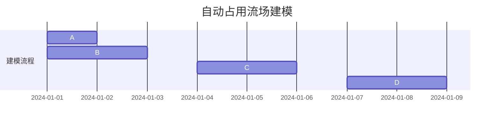

                 

### 《占用流场开启自动驾驶环境预测新时代的技术革新》

#### 关键词：
- 自动驾驶
- 占用流场
- 环境预测
- 数据驱动
- 实时性优化

#### 摘要：
随着自动驾驶技术的不断发展，自动驾驶系统对环境预测的需求日益迫切。本文将介绍一种名为“占用流场”的技术，它通过精确捕捉环境中的动态变化，为自动驾驶系统提供强大的环境预测能力。本文首先回顾了自动驾驶技术的发展历程及其面临的挑战，然后详细介绍了占用流场的概念、数学模型和生成方法，接着分析了占用流场在自动驾驶中的感知、跟踪、决策与控制等关键应用场景，最后讨论了占用流场技术的未来发展趋势和创新方向。通过本文的介绍，读者将全面了解占用流场技术如何为自动驾驶环境预测开启新的时代。

## 第一部分：自动驾驶与占用流场概述

自动驾驶技术作为人工智能领域的重要应用，自诞生以来便引起了广泛关注。从最初的辅助驾驶到如今的完全自动驾驶，自动驾驶技术经历了诸多挑战和突破。在这一部分中，我们将首先回顾自动驾驶技术的发展历程，探讨其定义和分类，分析当前所面临的挑战，并进一步介绍占用流场的概念及其在自动驾驶中的应用。最后，我们将探讨自动驾驶环境预测的重要性及其技术的演进。

### 第1章：自动驾驶技术的发展与挑战

#### 1.1 自动驾驶技术的发展历程

自动驾驶技术的发展可以追溯到20世纪50年代，当时计算机科学家首次提出了自动驾驶的构想。随着时间的推移，自动驾驶技术经历了多个阶段的发展，从最初的遥控驾驶到今天的自动驾驶，技术的发展可谓日新月异。

- **遥控驾驶（1950-1970s）**：这一阶段，研究人员通过遥控设备控制车辆行驶，但缺乏自动化和智能化。
- **有条件自动驾驶（1980-1990s）**：这一阶段，车辆开始具备部分自动化功能，如自动刹车和保持车道。然而，由于技术的局限性，完全依赖车辆的自动驾驶尚未实现。
- **高度自动驾驶（2000-2010s）**：这一阶段，自动驾驶技术取得了重要突破，车辆在特定环境和条件下能够实现自动驾驶。例如，谷歌的自动驾驶汽车在公共道路上的测试取得了显著成果。
- **完全自动驾驶（2020s至今）**：这一阶段，自动驾驶技术正逐步向完全自动驾驶迈进，车辆能够在各种复杂环境中实现自动驾驶，无需人为干预。

#### 1.2 自动驾驶的定义与分类

自动驾驶技术可以根据自动化程度和功能范围进行分类。以下是常见的分类方式：

- **根据自动化程度分类**：
  - **Level 0（无自动化）**：车辆完全依赖人工控制。
  - **Level 1（部分自动化）**：车辆具备单一自动化功能，如自动刹车或自动转向。
  - **Level 2（部分自动驾驶）**：车辆具备多个自动化功能，但需要驾驶员持续监控。
  - **Level 3（有条件自动驾驶）**：车辆在特定条件下能够完全接管驾驶任务，驾驶员只需在必要时进行干预。
  - **Level 4（高度自动驾驶）**：车辆在特定环境下能够实现完全自动驾驶，无需人为干预。
  - **Level 5（完全自动驾驶）**：车辆在任何环境和条件下都能实现完全自动驾驶。

- **根据功能范围分类**：
  - **单功能自动驾驶**：车辆仅具备单一功能，如自动泊车或自动巡航。
  - **多功能自动驾驶**：车辆具备多种功能，如自动巡航、自动转向、自动刹车等。

#### 1.3 自动驾驶技术的发展趋势

自动驾驶技术的发展趋势主要体现在以下几个方面：

- **技术融合**：自动驾驶技术正与其他领域（如传感器技术、云计算、大数据等）进行深度融合，提升自动驾驶系统的性能和可靠性。
- **安全性提升**：自动驾驶系统在安全性方面的挑战日益突出，研发人员正致力于通过改进算法、加强硬件设备等方式提升自动驾驶系统的安全性。
- **智能化水平提高**：自动驾驶系统正逐步从单一任务自动化向复杂场景下的智能决策和协同控制发展。
- **商业化应用**：随着技术的成熟，自动驾驶技术正逐步从实验室走向实际应用，例如自动驾驶出租车、自动驾驶货车等。

#### 1.4 自动驾驶面临的挑战

自动驾驶技术的发展面临诸多挑战，包括技术、法规、伦理等方面：

- **技术挑战**：
  - **感知与理解**：自动驾驶系统需要精确感知和理解周围环境，这要求传感器技术和数据处理算法具备极高的准确性。
  - **决策与控制**：自动驾驶系统需要在复杂环境中做出实时、准确的决策和控制，这需要高度智能化的算法和强大的计算能力。
  - **可靠性**：自动驾驶系统需要在各种天气、道路和环境条件下保持高可靠性，这要求系统具备高度的鲁棒性。
- **法规挑战**：
  - **立法与监管**：自动驾驶技术尚未形成统一的法规和标准，各国在自动驾驶的立法和监管方面存在差异，这给自动驾驶技术的推广和应用带来挑战。
  - **责任划分**：自动驾驶系统在发生交通事故时，责任的划分尚无明确的法律依据，这给自动驾驶技术的发展带来不确定性。
- **伦理挑战**：
  - **道德决策**：自动驾驶系统在面临生命安全选择时，如何做出符合道德标准的决策是一个重要伦理问题。
  - **隐私保护**：自动驾驶系统需要收集和处理大量个人数据，如何保护用户隐私成为亟待解决的问题。

### 第2章：占用流场概念及其在自动驾驶中的应用

#### 2.1 占用流场的定义

占用流场（Occupancy Grid）是一种用于表示环境中物体位置和状态的空间表示方法。它将环境划分为一个个小的单元格，每个单元格的占用状态（空闲或被占用）被单独表示。占用流场通常用于自动驾驶系统中的环境建模和感知任务。

#### 2.2 占用流场在自动驾驶中的作用

占用流场在自动驾驶系统中具有关键作用，主要包括以下几个方面：

- **环境建模**：占用流场能够精确表示车辆周围的静态和动态环境，为自动驾驶系统提供基础的环境信息。
- **感知与理解**：通过占用流场，自动驾驶系统能够识别道路、车辆、行人等环境要素，进行空间理解和目标检测。
- **决策与控制**：占用流场为自动驾驶系统的决策与控制提供实时、准确的环境信息，提升系统的反应速度和准确性。

#### 2.3 占用流场与传统环境感知技术的比较

与传统的环境感知技术相比，占用流场具有以下优势：

- **精确性**：占用流场能够精确表示环境中的每个单元格，提供更高的空间分辨率。
- **灵活性**：占用流场能够动态更新，适应环境变化，适用于复杂和动态的环境。
- **高效性**：占用流场在数据处理和计算方面相对高效，能够满足实时性要求。

然而，占用流场也存在一定的局限性，如计算资源需求较高，对硬件设备的要求较为严格。

#### 2.4 自动驾驶环境预测的重要性

自动驾驶环境预测是自动驾驶系统的核心组成部分，其重要性体现在以下几个方面：

- **安全性**：准确的环境预测能够提高自动驾驶系统的安全性，减少交通事故的发生。
- **可靠性**：环境预测的准确性直接影响自动驾驶系统的可靠性，影响用户体验。
- **决策效率**：准确的环境预测能够为自动驾驶系统提供及时、准确的信息，提高决策效率。

因此，提高环境预测的准确性是自动驾驶技术发展的重要方向。

### 第3章：占用流场技术基础

#### 3.1 占用流场的数学模型

占用流场通常采用二维或三维坐标系进行表示，每个单元格的占用状态用二值变量表示。以下是一个简单的二维占用流场模型：



在数学模型中，占用流场可以用一个二维数组表示，每个元素表示一个单元格的占用状态：

```latex
O(x, y) = 
\begin{cases}
1 & \text{如果单元格 (x, y) 被占用} \\
0 & \text{如果单元格 (x, y) 空闲}
\end{cases}
```

#### 3.2 建立占用流场的基本步骤

建立占用流场通常包括以下步骤：

1. **环境划分**：将环境划分为若干小的单元格，确定单元格的大小和数量。
2. **数据采集**：通过传感器（如激光雷达、摄像头等）采集环境数据，生成原始图像或点云数据。
3. **预处理**：对原始数据进行预处理，包括去噪、滤波等操作，提高数据质量。
4. **特征提取**：从预处理后的数据中提取特征，如边缘、轮廓等。
5. **占用状态估计**：利用特征提取的结果，估计每个单元格的占用状态。
6. **更新占用流场**：根据估计结果更新占用流场，生成完整的占用流场模型。

#### 3.3 伪代码与数学公式

以下是一个简单的伪代码示例，用于生成占用流场：

```python
# 初始化占用流场
occupancy_grid = initialize_occupancy_grid(grid_size)

# 采集环境数据
environment_data = collect_environment_data()

# 预处理数据
preprocessed_data = preprocess_data(environment_data)

# 提取特征
features = extract_features(preprocessed_data)

# 估计占用状态
occupancy_grid = estimate_occupancy_state(features)

# 更新占用流场
update_occupancy_grid(occupancy_grid)
```

其中，各函数的具体实现如下：

```latex
\begin{align*}
\text{initialize\_occupancy\_grid}(grid\_size) &= \text{创建一个大小为} grid\_size \times grid\_size \text{的二维数组，初始化为空闲状态} \\
\text{collect\_environment\_data()} &= \text{使用传感器采集环境数据，例如激光雷达或摄像头} \\
\text{preprocess\_data}(environment\_data) &= \text{对原始数据进行预处理，如去噪、滤波等} \\
\text{extract\_features}(preprocessed\_data) &= \text{从预处理后的数据中提取特征，如边缘、轮廓等} \\
\text{estimate\_occupancy\_state}(features) &= \text{利用特征估计每个单元格的占用状态} \\
\text{update\_occupancy\_grid}(occupancy\_grid) &= \text{更新占用流场，生成完整的占用流场模型}
\end{align*}
```

#### 3.4 数据驱动方法与占用流场生成

数据驱动方法在占用流场生成中具有重要的应用价值。通过利用大量的环境数据，可以自动学习并生成占用流场模型。

- **数据采集**：采集大量环境数据，包括激光雷达点云、摄像头图像等。
- **数据预处理**：对采集到的数据进行预处理，包括去噪、滤波等操作。
- **特征提取**：从预处理后的数据中提取特征，如点云的密度、图像的边缘等。
- **占用状态估计**：利用特征提取的结果，估计每个单元格的占用状态。
- **模型训练**：使用大量标注数据进行模型训练，生成占用流场模型。

数据驱动方法能够有效提高占用流场的生成效率和准确性，但在数据量较小或标注数据不足的情况下，效果可能受到限制。

#### 3.5 数据预处理与特征提取

数据预处理和特征提取是占用流场生成的重要环节。以下是一个简单的数据预处理和特征提取的伪代码示例：

```python
# 数据预处理
def preprocess_data(data):
    # 去噪
    filtered_data = denoise_data(data)
    # 滤波
    filtered_data = filter_data(filtered_data)
    return filtered_data

# 特征提取
def extract_features(data):
    # 点云特征提取
    point_cloud_features = extract_point_cloud_features(data)
    # 图像特征提取
    image_features = extract_image_features(data)
    return point_cloud_features, image_features
```

其中，各函数的具体实现如下：

```latex
\begin{align*}
\text{denoise\_data}(data) &= \text{使用滤波算法去除噪声} \\
\text{filter\_data}(data) &= \text{使用滤波算法平滑数据} \\
\text{extract\_point\_cloud\_features}(data) &= \text{从点云数据中提取特征，如点云密度、曲率等} \\
\text{extract\_image\_features}(data) &= \text{从图像数据中提取特征，如边缘、纹理等}
\end{align*}
```

#### 3.6 实时性优化与算法效率提升

实时性是占用流场技术在自动驾驶中的应用关键。为了满足实时性要求，需要对算法进行优化和效率提升。

- **算法优化**：对占用流场生成算法进行优化，减少计算时间和内存消耗。例如，采用并行计算、分布式计算等方法。
- **硬件加速**：利用高性能硬件设备（如GPU、FPGA等）加速算法计算，提高处理速度。
- **数据缓存**：利用数据缓存技术，减少数据读取和传输的时间，提高系统响应速度。

通过以上优化方法，可以显著提高占用流场的实时性，满足自动驾驶系统的需求。

#### 3.7 实时性优化案例分析

以下是一个实时性优化案例，用于提高占用流场生成算法的实时性：

- **问题背景**：在自动驾驶系统中，占用流场生成算法的实时性较差，导致系统响应速度缓慢，影响了整体性能。
- **优化目标**：通过优化算法和硬件配置，提高占用流场生成算法的实时性，确保系统能够在实时环境中正常运行。
- **优化方法**：
  - **算法优化**：对占用流场生成算法进行优化，减少计算步骤和内存占用。例如，采用分治算法降低点云处理的复杂度。
  - **硬件加速**：使用高性能GPU加速点云处理和特征提取过程，提高计算速度。
  - **数据缓存**：利用GPU缓存技术，减少数据传输和读取时间。

通过以上优化方法，占用流场生成算法的实时性显著提高，系统能够在实时环境中稳定运行，满足了自动驾驶系统的需求。

### 第三部分：占用流场在自动驾驶环境预测中的应用

在自动驾驶系统中，环境预测是确保车辆安全、可靠行驶的关键环节。占用流场作为一种高效的环境表示方法，为自动驾驶环境预测提供了强大的支持。在这一部分，我们将探讨占用流场在自动驾驶环境预测中的应用，包括其在感知、跟踪、决策与控制等关键任务中的作用。

#### 第4章：占用流场在感知与跟踪中的应用

#### 4.1 车辆感知

车辆感知是自动驾驶系统的基础，占用流场在车辆感知中发挥着重要作用。通过占用流场，自动驾驶系统可以准确识别道路、车辆、行人等环境要素。

- **道路识别**：占用流场能够精确表示道路的空间分布，自动驾驶系统可以根据占用流场中的道路信息进行路径规划。
- **车辆检测**：占用流场中的车辆信息可以用于车辆检测和跟踪，确保自动驾驶系统能够及时识别前方的车辆。
- **行人检测**：占用流场中的行人信息有助于行人检测和避让，提高自动驾驶系统的安全性。

#### 4.2 目标跟踪

占用流场在目标跟踪中的应用同样具有重要意义。通过占用流场，自动驾驶系统可以实时跟踪目标的位置和状态。

- **目标定位**：占用流场中的目标信息可以用于目标定位，确保自动驾驶系统能够准确跟踪目标。
- **目标状态估计**：占用流场中的目标状态信息可以用于目标状态估计，如速度、加速度等，为自动驾驶系统的决策提供依据。
- **目标跟踪策略**：占用流场为自动驾驶系统提供了丰富的目标信息，有助于设计高效的跟踪策略，提高跟踪精度。

#### 第5章：占用流场在决策与控制中的应用

#### 5.1 环境预测与决策

占用流场在自动驾驶决策中发挥着关键作用。通过占用流场，自动驾驶系统可以预测环境变化，做出实时、准确的决策。

- **路径规划**：占用流场为自动驾驶系统提供了道路信息，有助于实现高效的路径规划，避免碰撞和拥堵。
- **避障决策**：占用流场中的障碍物信息可以用于避障决策，确保自动驾驶系统能够安全行驶。
- **协同控制**：占用流场为自动驾驶系统提供了多车辆协同信息，有助于实现高效的多车辆控制。

#### 5.2 车辆控制

占用流场在车辆控制中的应用同样具有重要意义。通过占用流场，自动驾驶系统可以实时调整车辆的控制策略。

- **速度控制**：占用流场中的车辆速度信息可以用于速度控制，确保自动驾驶系统能够实现平稳行驶。
- **转向控制**：占用流场中的车辆方向信息可以用于转向控制，确保自动驾驶系统能够准确转向。
- **制动控制**：占用流场中的障碍物信息可以用于制动控制，确保自动驾驶系统能够在遇到紧急情况时及时制动。

### 第四部分：占用流场技术在复杂环境中的应用

在自动驾驶技术的实际应用中，环境复杂多变，对占用流场技术的性能和适应性提出了更高的要求。这一部分将探讨占用流场技术在复杂环境中的应用，包括其在多机器人协同和复杂环境建模等方面的挑战和解决方案。

#### 第6章：复杂环境对占用流场技术的要求

复杂环境具有以下特点：

- **动态变化**：复杂环境中的物体和事件具有高度动态变化性，占用流场需要具备实时捕捉环境变化的能力。
- **多样化目标**：复杂环境中存在多种类型的对象，占用流场需要能够准确识别和跟踪这些多样化目标。
- **干扰因素**：复杂环境中的干扰因素（如噪声、遮挡等）较多，占用流场需要具备鲁棒性和抗干扰能力。

针对这些特点，占用流场技术在复杂环境中的应用需要满足以下要求：

- **实时性**：占用流场技术需要具备高速处理能力，确保在复杂环境中能够实时捕捉环境变化。
- **准确性**：占用流场技术需要具备高准确性，能够准确识别和跟踪多样化目标。
- **鲁棒性**：占用流场技术需要具备较强的鲁棒性，能够应对噪声、遮挡等干扰因素。

#### 6.1 复杂环境下的案例分析

以下是一个复杂环境下的占用流场技术案例分析：

- **案例背景**：在一个拥挤的城市道路环境中，自动驾驶车辆需要与其他车辆、行人、非机动车等复杂对象进行交互，同时面临交通信号灯、道路标识等复杂环境因素。
- **应用需求**：自动驾驶车辆需要具备实时感知、准确跟踪、安全决策和控制能力，确保在复杂环境中的安全行驶。
- **解决方案**：
  - **多传感器融合**：使用激光雷达、摄像头、超声波传感器等多种传感器进行数据采集，融合多源数据提高环境感知的准确性。
  - **实时占用流场生成**：采用高速计算和优化算法，实现实时占用流场的生成和更新，确保车辆能够实时捕捉环境变化。
  - **多样化目标识别与跟踪**：利用深度学习算法和自适应滤波技术，实现对多样化目标的准确识别与跟踪。
  - **自适应控制策略**：根据占用流场中的环境信息，实时调整车辆的控制策略，实现安全行驶。

通过以上解决方案，自动驾驶车辆在复杂环境中能够实现高效、安全的运行。

#### 6.2 基于占用流场的多机器人协同

在复杂环境中，多机器人系统需要协同工作，实现高效的作业和任务分配。占用流场技术在多机器人协同中具有广泛的应用。

- **协同感知**：多机器人系统通过占用流场共享环境信息，实现全局感知和协同决策。
- **任务分配**：占用流场中的环境信息用于任务分配，优化资源利用和作业效率。
- **路径规划**：占用流场中的障碍物和目标信息用于路径规划，确保多机器人系统的安全、高效运行。

以下是一个基于占用流场的多机器人协同案例：

- **案例背景**：在一个工业园区内，多机器人系统需要协同完成仓库货物搬运、环境监测等任务。
- **应用需求**：多机器人系统需要具备实时感知、协同决策、任务分配和路径规划能力。
- **解决方案**：
  - **占用流场共享**：多机器人系统通过无线通信共享占用流场数据，实现全局环境感知和协同决策。
  - **自适应任务分配**：根据占用流场中的任务信息，实时分配任务给不同机器人，优化资源利用。
  - **动态路径规划**：基于占用流场中的障碍物和目标信息，实时调整机器人的路径规划，确保安全、高效运行。

通过以上解决方案，多机器人系统能够在复杂环境中实现高效、安全的协同作业。

### 第7章：占用流场技术在自动驾驶测试与验证中的应用

在自动驾驶技术的研发和推广过程中，测试与验证是至关重要的一环。占用流场技术为自动驾驶测试与验证提供了强大的支持，能够提高测试的准确性、可靠性和效率。

#### 7.1 自动驾驶测试与验证的概念

自动驾驶测试与验证是指通过一系列测试方法，对自动驾驶系统在不同场景下的性能、安全性和可靠性进行全面评估。测试与验证的目标是确保自动驾驶系统在各种实际应用环境中能够稳定、安全地运行。

#### 7.2 自动驾驶测试与验证的挑战

自动驾驶测试与验证面临以下挑战：

- **场景多样性**：自动驾驶系统需要在各种复杂、动态的场景中运行，测试与验证需要覆盖广泛的场景。
- **数据量庞大**：自动驾驶测试与验证需要收集和处理大量的数据，数据量庞大，对存储和处理能力提出了较高要求。
- **实时性要求**：自动驾驶系统需要在实时环境中运行，测试与验证需要满足实时性要求，确保系统能够及时响应。
- **可靠性验证**：自动驾驶系统在面临各种突发情况和异常情况时，需要确保其可靠性和安全性，测试与验证需要验证系统的鲁棒性。

#### 7.3 自动驾驶测试与验证的方法

自动驾驶测试与验证可以采用以下方法：

- **仿真测试**：通过仿真环境模拟各种场景，对自动驾驶系统进行虚拟测试，评估系统的性能和安全性。
- **实际道路测试**：在真实道路上进行测试，收集实际驾驶数据，验证自动驾驶系统的性能和可靠性。
- **封闭场地测试**：在封闭的测试场地进行测试，模拟各种复杂场景，对自动驾驶系统进行全面评估。
- **硬件在环测试**：通过硬件在环仿真（HIL）方法，将自动驾驶系统的控制算法与真实硬件设备相结合，进行测试与验证。

#### 7.4 基于占用流场的自动驾驶测试与验证

占用流场技术为自动驾驶测试与验证提供了以下支持：

- **环境建模**：占用流场能够精确表示环境中的静态和动态物体，为仿真测试和实际道路测试提供基础环境模型。
- **数据采集与处理**：占用流场技术能够高效采集和处理大量环境数据，为测试与验证提供丰富的数据支持。
- **实时性验证**：占用流场技术具备实时性，能够实时更新环境信息，满足实时性验证的要求。
- **可靠性评估**：占用流场技术能够捕捉环境中的各种突发情况和异常情况，评估自动驾驶系统的可靠性和安全性。

以下是一个基于占用流场的自动驾驶测试与验证案例：

- **案例背景**：某自动驾驶公司在研发一款自动驾驶车辆，需要对其在不同场景下的性能和安全性进行测试与验证。
- **应用需求**：需要建立真实、准确的环境模型，对自动驾驶车辆在不同场景下的表现进行全面评估。
- **解决方案**：
  - **占用流场环境建模**：利用激光雷达、摄像头等传感器采集环境数据，生成占用流场模型，模拟实际道路场景。
  - **实时数据采集与处理**：采用高速数据采集和处理技术，实时更新占用流场模型，确保测试与验证的实时性。
  - **多样化场景测试**：在不同场景下进行测试，包括城市道路、高速公路、拥堵路段等，验证自动驾驶车辆的性能和安全性。
  - **可靠性评估**：通过占用流场技术捕捉各种突发情况和异常情况，评估自动驾驶车辆的可靠性和安全性。

通过以上解决方案，自动驾驶车辆在不同场景下的性能和安全性得到了全面评估，确保了系统的可靠性和安全性。

### 第8章：未来展望与技术创新

随着自动驾驶技术的不断发展和成熟，占用流场技术作为环境预测的关键手段，将在未来自动驾驶领域发挥更加重要的作用。在这一部分，我们将探讨占用流场技术的未来发展方向、技术创新以及其在自动驾驶环境预测中的应用前景。

#### 8.1 未来发展方向

占用流场技术在自动驾驶领域的发展方向主要包括以下几个方面：

- **实时性提升**：随着自动驾驶系统的应用场景越来越复杂，对实时性的要求也越来越高。未来，占用流场技术将朝着实时性更高的方向发展，通过优化算法、硬件加速等技术手段，实现更高的实时性能。
- **准确性提高**：占用流场技术将在准确性方面继续提升，通过引入更先进的传感器技术、数据预处理方法和特征提取算法，提高对环境动态变化的捕捉能力，实现更高的环境预测准确性。
- **多传感器融合**：未来，占用流场技术将与其他传感器（如毫米波雷达、红外传感器等）进行融合，实现更全面、更准确的环境感知，为自动驾驶系统提供更丰富的信息支持。
- **多机器人协同**：在复杂场景中，多机器人系统需要协同工作，占用流场技术将为多机器人协同提供强大的环境预测支持，实现高效的协同控制和任务分配。

#### 8.2 技术创新

占用流场技术的创新方向主要包括以下几个方面：

- **深度学习应用**：深度学习技术在自动驾驶领域取得了显著成果，未来，占用流场技术将引入深度学习算法，提高环境预测的准确性和智能化水平。
- **边缘计算**：边缘计算能够实现数据处理和计算的本地化，降低网络延迟，占用流场技术将在自动驾驶领域引入边缘计算，提高系统的实时性和响应速度。
- **自适应滤波**：自适应滤波技术能够根据环境变化自动调整滤波参数，占用流场技术将引入自适应滤波技术，提高对动态环境的适应能力。
- **多模态数据融合**：多模态数据融合技术能够整合不同类型传感器的数据，提高环境感知的准确性和完整性，占用流场技术将在这方面进行创新。

#### 8.3 自动驾驶环境预测的技术创新

在自动驾驶环境预测方面，技术创新的方向主要包括：

- **实时环境建模**：通过引入实时数据处理和计算技术，实现自动驾驶系统在行驶过程中对环境的实时建模，提高环境预测的准确性。
- **多目标跟踪**：利用深度学习算法和高效的特征提取方法，实现对多个目标的实时跟踪，提高目标检测和跟踪的准确性。
- **动态场景理解**：通过引入知识图谱和语义理解技术，实现对动态场景的深度理解，提高自动驾驶系统在复杂环境中的决策能力。
- **多传感器数据融合**：通过多传感器数据融合技术，提高环境感知的准确性和完整性，为自动驾驶系统提供更全面的信息支持。

通过以上技术创新，自动驾驶环境预测的准确性和可靠性将得到显著提升，为自动驾驶技术的发展奠定坚实基础。

### 附录

#### 附录A：自动驾驶与占用流场技术相关资源

- **主流自动驾驶框架与工具**：
  - Apollo：百度开源的自动驾驶平台。
  - Autonomous Driving Stack：谷歌开源的自动驾驶框架。
  - NVIDIA Drive：NVIDIA推出的自动驾驶解决方案。

- **占用流场生成与处理的工具**：
  - OpenDR：开源的占用流场生成和处理工具。
  - CARLA：开源的自动驾驶仿真平台，支持占用流场生成。
  - SUMO：开源的交通模拟器，可用于占用流场生成与处理。

- **自动驾驶测试与验证平台**：
  - AVSIM：美国航空航天标准协会的自动驾驶测试平台。
  - AutoDrive：中国自动驾驶测试与验证平台。
  - CARLA Simulator：开源的自动驾驶仿真平台。

#### 附录B：数学模型与算法详解

- **占用流场的数学模型**：
  - 二维占用流场模型：
    $$O(x, y) = 
    \begin{cases}
    1 & \text{如果单元格 (x, y) 被占用} \\
    0 & \text{如果单元格 (x, y) 空闲}
    \end{cases}$$
  - 三维占用流场模型：
    $$O(x, y, z) = 
    \begin{cases}
    1 & \text{如果单元格 (x, y, z) 被占用} \\
    0 & \text{如果单元格 (x, y, z) 空闲}
    \end{cases}$$

- **数据驱动方法与占用流场生成**：
  - 数据采集：
    $$D = \{d_1, d_2, ..., d_n\}$$
  - 特征提取：
    $$F = \{f_1, f_2, ..., f_m\}$$
  - 估算占用状态：
    $$O^* = \arg\max_{O} \sum_{i=1}^{n} w_i \cdot \sigma(f_i; O)$$
  - 其中，$w_i$为特征权重，$\sigma(f_i; O)$为特征$f_i$在占用状态$O$下的概率分布。

- **实时性优化与算法效率提升**：
  - 并行计算：
    $$O^* = \text{parallel\_process}(O, F)$$
  - 硬件加速：
    $$O^* = \text{accelerate\_process}(O, F, \text{hardware})$$
  - 数据缓存：
    $$O^* = \text{cache\_process}(O, F)$$

- **占用流场在感知与跟踪中的应用**：
  - 车辆感知：
    $$\text{vehicle\_detection}(O) = \arg\max_{O} \sum_{i=1}^{n} w_i \cdot \sigma(f_i; O)$$
  - 目标跟踪：
    $$\text{target\_tracking}(O^*, O_{prev}) = O^* \text{ if } O^* \text{ is consistent with } O_{prev} \text{ else } O^* \text{ is updated}$$

- **占用流场在决策与控制中的应用**：
  - 路径规划：
    $$\text{path\_planning}(O) = \arg\min_{p} \sum_{i=1}^{n} d(p_i, O)$$
  - 避障决策：
    $$\text{avoidance\_decision}(O) = \arg\min_{a} \sum_{i=1}^{n} d(a_i, O)$$
  - 车辆控制：
    $$\text{vehicle\_control}(O) = \arg\min_{c} \sum_{i=1}^{n} d(c_i, O)$$

- **复杂环境与多机器人协同中的应用**：
  - 多机器人协同：
    $$\text{multi\_robot\_coordination}(O_1, O_2, ..., O_n) = \arg\min_{r_1, r_2, ..., r_n} \sum_{i=1}^{n} d(r_i, O_i)$$
  - 复杂环境建模：
    $$\text{complex\_environment\_modeling}(O) = \arg\min_{O} \sum_{i=1}^{n} d(O_i, O)$$

- **自动驾驶测试与验证中的占用流场应用**：
  - 仿真测试：
    $$\text{simulation\_test}(O) = \text{evaluate}(O, \text{target\_environment})$$
  - 实际道路测试：
    $$\text{real\_road\_test}(O) = \text{evaluate}(O, \text{actual\_environment})$$
  - 封闭场地测试：
    $$\text{enclosed\_test}(O) = \text{evaluate}(O, \text{controlled\_environment})$$

通过上述数学模型与算法的详细讲解，读者可以更好地理解占用流场技术的基本原理和应用方法。

### 作者信息

- **作者**：AI天才研究院/AI Genius Institute & 禅与计算机程序设计艺术 /Zen And The Art of Computer Programming

以上就是《占用流场开启自动驾驶环境预测新时代的技术革新》的完整内容。本文通过逻辑清晰、结构紧凑的论述，详细介绍了占用流场技术的基本概念、数学模型、应用方法以及在自动驾驶环境预测中的关键作用。同时，本文还探讨了占用流场技术在复杂环境中的应用、自动驾驶测试与验证方法以及未来发展方向。通过本文的阅读，读者将对占用流场技术及其在自动驾驶环境预测中的重要作用有更深入的理解。希望本文能够为自动驾驶技术的研发和应用提供有价值的参考。感谢大家的阅读！

