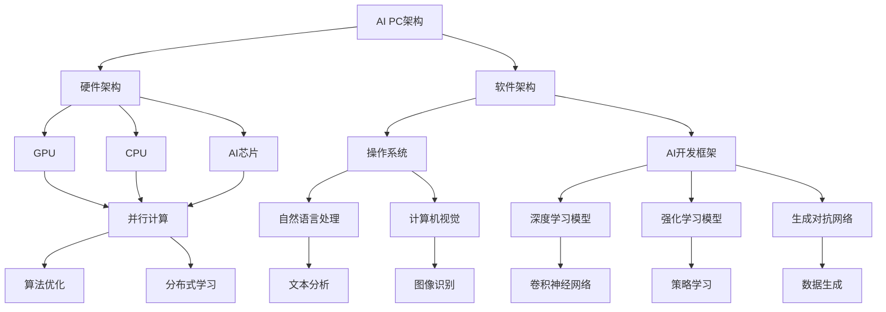

                 

# 《吴翰清半个宇宙：打造AI PC的雄心》

## 关键词：人工智能、PC、AI PC、吴翰清、核心技术、应用实践、未来展望

> 摘要：本文深入探讨了吴翰清在AI PC领域的雄心壮志，从背景与趋势、核心技术、应用实践到未来展望，全面分析了AI PC的发展现状与潜在机遇，旨在为读者呈现一个全面、深入的AI PC技术全景。

## 第一部分：引言与背景

### 1.1 人工智能与PC的融合：背景与趋势

#### 1.1.1 人工智能的崛起

人工智能（AI）作为计算机科学的前沿领域，正以惊人的速度发展。从最初的专家系统，到基于数据的机器学习，再到如今深度学习的崛起，人工智能已经深刻改变了我们的生活方式。AI技术在自然语言处理、计算机视觉、语音识别等领域取得了显著进展，使得机器能够像人类一样思考、学习和决策。

#### 1.1.2 个人电脑的发展历程

个人电脑（PC）自1981年IBM推出第一台个人电脑以来，经历了从286、386到如今高性能的多核处理器的发展历程。PC的普及推动了互联网的兴起，改变了人类的工作和生活方式。随着硬件技术的不断进步，PC的性能日益强大，为人工智能的应用提供了坚实的基础。

#### 1.1.3 AI PC：未来的技术融合方向

AI PC是将人工智能技术与个人电脑相结合的产物，旨在为用户提供更智能、更高效的计算体验。随着AI技术的不断成熟，AI PC有望成为未来个人电脑的发展方向。AI PC不仅可以实现日常办公的高效自动化，还可以在游戏、设计、科学计算等众多领域发挥重要作用。

### 1.2 吴翰清与AI PC的雄心

#### 1.2.1 吴翰清的背景与成就

吴翰清，被誉为“中国人工智能领域的天才”，在深度学习、计算机视觉等领域取得了卓越的成就。他曾担任百度深度学习技术总监，带领团队开发了多个全球领先的AI产品，如百度自动驾驶、百度AI助理等。吴翰清在学术界和工业界都享有盛誉，被誉为“半个宇宙”。

#### 1.2.2 吴翰清对AI PC的愿景

吴翰清认为，AI PC将是下一代计算平台的代表性产品。他希望通过AI PC，将人工智能技术真正融入到每个人的生活中，让计算更加智能、便捷。吴翰清认为，AI PC的发展将推动人工智能技术的普及，使得更多的人能够享受到人工智能带来的便利。

#### 1.2.3 吴翰清在AI PC领域的贡献

吴翰清在AI PC领域的研究和实践取得了显著成果。他带领团队开发了多个AI PC原型机，并在多个应用场景中进行了测试和验证。吴翰清的研究为AI PC的发展提供了重要的理论支持和技术指导。

## 第二部分：AI PC核心技术

### 2.1 AI PC架构设计

#### 2.1.1 AI PC的基本架构

AI PC的基本架构包括硬件和软件两个方面。在硬件方面，AI PC需要配备高性能的CPU、GPU和专用AI加速器。在软件方面，AI PC需要运行适合人工智能应用的操作系统和开发工具。

#### 2.1.2 GPU与CPU协同工作

GPU（图形处理器）和CPU（中央处理器）是AI PC的核心计算单元。GPU擅长处理大量并行计算任务，而CPU则擅长处理复杂的串行计算任务。在AI PC中，GPU和CPU需要协同工作，充分发挥各自的优点，以提高整体计算性能。

#### 2.1.3 AI PC的关键组件

AI PC的关键组件包括人工智能芯片、高速存储设备和网络接口。人工智能芯片负责执行人工智能算法，高速存储设备提供海量数据存储和快速数据访问，网络接口实现AI PC与其他设备之间的通信。

### 2.2 人工智能算法与模型

#### 2.2.1 人工智能基础算法

人工智能基础算法包括神经网络、决策树、支持向量机等。这些算法构成了人工智能的核心技术，为AI PC提供了强大的计算能力。

#### 2.2.2 深度学习模型

深度学习模型是人工智能领域的重要突破，包括卷积神经网络（CNN）、循环神经网络（RNN）等。深度学习模型在图像识别、语音识别等领域取得了显著成果，为AI PC的应用提供了坚实的基础。

#### 2.2.3 强化学习与生成对抗网络

强化学习与生成对抗网络是近年来人工智能领域的两大热点。强化学习通过学习策略实现智能体的自主决策，生成对抗网络则通过生成器和判别器的对抗训练实现数据的生成。

### 2.3 人工智能算法优化

#### 2.3.1 算法优化的重要性

算法优化是提高AI PC性能的关键。通过优化算法，可以减少计算复杂度，提高计算效率，降低能耗。

#### 2.3.2 模型压缩与量化

模型压缩与量化是算法优化的常用手段。通过压缩模型参数和量化模型权重，可以降低模型存储空间和计算复杂度，提高计算速度。

#### 2.3.3 并行计算与分布式学习

并行计算与分布式学习是提高AI PC性能的重要方法。通过将计算任务分布在多台计算机上，可以显著提高计算速度，降低能耗。

## 第三部分：AI PC应用实践

### 3.1 AI PC在游戏中的应用

#### 3.1.1 游戏AI的发展现状

随着游戏技术的不断发展，游戏AI已经成为游戏开发的重要组成部分。游戏AI可以模拟玩家的行为，提供更具挑战性和真实感的游戏体验。

#### 3.1.2 游戏AI算法与模型

游戏AI算法包括强化学习、深度学习等。通过这些算法，游戏AI可以不断学习和优化策略，提高游戏体验。

#### 3.1.3 游戏AI性能优化

游戏AI性能优化包括算法优化、硬件加速等。通过优化算法和利用GPU等硬件资源，可以显著提高游戏AI的性能。

### 3.2 AI PC在办公中的应用

#### 3.2.1 办公AI的挑战与机遇

办公AI面临着提高工作效率、降低人力成本等挑战。同时，随着人工智能技术的不断进步，办公AI也带来了许多机遇。

#### 3.2.2 办公AI算法与应用案例

办公AI算法包括自然语言处理、图像识别等。通过这些算法，办公AI可以实现文本分析、图像识别等功能，提高办公效率。

#### 3.2.3 办公AI的性能评估

办公AI的性能评估包括准确性、响应速度等指标。通过评估这些指标，可以确定办公AI的实际效果。

### 3.3 AI PC在边缘计算中的应用

#### 3.3.1 边缘计算的背景与需求

边缘计算是一种将计算任务分布到网络边缘的技术。随着物联网和智能设备的普及，边缘计算的需求日益增长。

#### 3.3.2 边缘AI PC的设计与实现

边缘AI PC是一种专门用于边缘计算的AI PC。它需要具备高性能、低延迟的特点，以满足边缘计算的需求。

#### 3.3.3 边缘AI PC的应用案例

边缘AI PC可以在智能安防、智能交通等领域发挥作用，为这些领域提供高效的计算支持。

## 第四部分：AI PC未来展望

### 4.1 AI PC的未来发展趋势

#### 4.1.1 技术进步与趋势分析

随着人工智能技术的不断进步，AI PC将更加智能化、高效化。未来的AI PC将具备更高的计算性能、更低的能耗和更丰富的应用场景。

#### 4.1.2 AI PC在生活中的应用场景

未来的AI PC将深入到生活的方方面面，如智能家居、智能医疗、智能教育等。AI PC将为我们提供更加智能、便捷的生活体验。

#### 4.1.3 AI PC对社会的影响

AI PC的普及将对社会产生深远的影响，包括提高生产效率、改变工作方式、提升生活质量等。

### 4.2 AI PC的创新挑战与机遇

#### 4.2.1 技术挑战与解决方案

AI PC的发展面临着技术挑战，如算法优化、硬件加速等。通过不断创新和技术进步，可以克服这些挑战。

#### 4.2.2 商业模式与创新

AI PC的商业模式也在不断创新，如硬件与软件的捆绑销售、订阅服务等。这些创新将为AI PC的发展提供新的机遇。

#### 4.2.3 AI PC产业链的变革

AI PC的发展将推动产业链的变革，包括硬件制造、软件开发、服务提供等。AI PC产业链的整合将为整个行业带来新的发展机遇。

### 4.3 AI PC的可持续发展策略

#### 4.3.1 环境保护与能源消耗

AI PC的可持续发展需要关注环境保护和能源消耗。通过降低能耗、采用环保材料等手段，可以实现AI PC的可持续发展。

#### 4.3.2 数据隐私与安全

AI PC的普及将带来数据隐私和安全的挑战。通过加强数据加密、隐私保护等手段，可以确保AI PC的安全可靠。

#### 4.3.3 AI PC的社会责任

AI PC的发展需要关注社会责任，包括提高就业率、促进社会公平等。通过积极履行社会责任，AI PC将为社会带来更多福祉。

## 第五部分：附录与资源

### 5.1 AI PC开发工具与资源

#### 5.1.1 主流AI开发框架

主流AI开发框架包括TensorFlow、PyTorch、Keras等。这些框架提供了丰富的API和工具，方便开发者进行AI PC的开发。

#### 5.1.2 开源项目与社区资源

开源项目与社区资源是AI PC开发的重要资源。通过参与开源项目和社区交流，开发者可以获取最新的技术和经验。

#### 5.1.3 AI PC开发指南与最佳实践

AI PC开发指南与最佳实践是开发者进行AI PC开发的指南。这些指南和最佳实践可以帮助开发者快速掌握AI PC的开发技巧。

### 5.2 参考文献

#### 5.2.1 相关书籍推荐

- 《深度学习》（Deep Learning），Ian Goodfellow、Yoshua Bengio、Aaron Courville 著。
- 《神经网络与深度学习》（Neural Networks and Deep Learning），邱锡鹏 著。

#### 5.2.2 学术论文精选

- “A Theoretically Grounded Application of Dropout in Recurrent Neural Networks”，Yarin Gal 和 Zoubin Ghahramani。
- “Generative Adversarial Nets”，Ian J. Goodfellow、Jean Pouget-Abadie、Moussaeid Mirza、Benedict T. Kingma、Aaron C. Courville。

#### 5.2.3 行业报告与资讯

- “中国人工智能产业发展报告2021”，中国人工智能产业发展联盟。
- “2021年人工智能行业白皮书”，腾讯研究院。

## 附加内容：AI PC核心概念与联系 Mermaid 流程图

## 作者信息

作者：AI天才研究院/AI Genius Institute & 禅与计算机程序设计艺术 /Zen And The Art of Computer Programming

