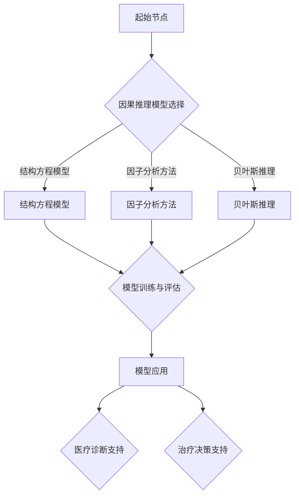

                 

### 《因果推理在智能医疗决策支持中的应用与伦理考量》

> **关键词：因果推理、智能医疗、决策支持、伦理考量**

> **摘要：本文首先介绍了因果推理的基本概念及其在医疗领域的重要性，随后深入探讨了因果推理在医学研究、医疗数据挖掘、医疗决策支持系统中的应用。在此基础上，文章对因果推理的伦理问题进行了详细分析，并探讨了政策与法规对因果推理应用的规范。最后，通过实战项目和案例分析，展示了因果推理在智能医疗中的实际应用，并对未来发展进行了展望。**

---

### 《因果推理在智能医疗决策支持中的应用与伦理考量》目录大纲

#### 第一部分：因果推理基础

- **第1章：因果推理的基本概念**
  - **1.1 因果关系的定义与重要性**
    - **1.1.1 因果关系的概念**
    - **1.1.2 因果关系在医疗领域的应用**
  - **1.2 因果推理的数学基础**
    - **1.2.1 条件概率**
    - **1.2.2 贝叶斯网络**
  - **1.3 因果推断的基本方法**
    - **1.3.1 结构方程模型**
    - **1.3.2 因子分析方法**
    - **1.3.3 贝叶斯推理**
  - **1.4 因果推理与机器学习**
    - **1.4.1 因果机器学习概述**
    - **1.4.2 因果推断在机器学习中的应用**

- **第2章：因果推理在医学研究中的应用**
  - **2.1 医学研究的因果关系分析**
    - **2.1.1 临床试验设计**
    - **2.1.2 流行病学研究**
  - **2.2 因果推理在药物研发中的应用**
    - **2.2.1 药物效果的因果关系分析**
    - **2.2.2 药物副作用预测**
  - **2.3 因果推理在个性化医疗中的应用**
    - **2.3.1 基于患者的个性化治疗策略**
    - **2.3.2 基于基因的个性化医疗**

- **第3章：因果推理在医疗数据挖掘中的应用**
  - **3.1 医疗数据的预处理**
    - **3.1.1 数据清洗**
    - **3.1.2 数据整合**
  - **3.2 医疗数据的特征提取**
    - **3.2.1 降维技术**
    - **3.2.2 特征选择方法**
  - **3.3 医疗数据挖掘中的因果推理**
    - **3.3.1 医疗知识图谱构建**
    - **3.3.2 因果推断在疾病预测中的应用**

- **第4章：因果推理在医疗决策支持系统中的应用**
  - **4.1 医疗决策支持系统概述**
    - **4.1.1 医疗决策支持系统的功能与架构**
    - **4.1.2 医疗决策支持系统的应用领域**
  - **4.2 因果推理在医疗诊断中的应用**
    - **4.2.1 疾病诊断模型构建**
    - **4.2.2 疾病诊断结果的因果解释**
  - **4.3 因果推理在医疗治疗决策中的应用**
    - **4.3.1 治疗方案选择**
    - **4.3.2 治疗效果的因果分析**

#### 第二部分：因果推理伦理考量

- **第5章：因果推理在智能医疗中的伦理问题**
  - **5.1 因果推理的伦理挑战**
    - **5.1.1 数据隐私保护**
    - **5.1.2 医疗决策透明度**
  - **5.2 因果推理的伦理原则**
    - **5.2.1 尊重患者自主权**
    - **5.2.2 公平与公正**
  - **5.3 因果推理的伦理决策框架**
    - **5.3.1 伦理评估流程**
    - **5.3.2 伦理审查委员会的作用**

- **第6章：政策与法规对因果推理应用的规范**
  - **6.1 数据保护法律法规**
    - **6.1.1 GDPR 概述**
    - **6.1.2 医疗数据隐私保护法规**
  - **6.2 医疗决策支持系统的监管**
    - **6.2.1 医疗决策支持系统的认证**
    - **6.2.2 医疗决策支持系统的监管框架**
  - **6.3 医学伦理委员会的指导作用**
    - **6.3.1 医学伦理委员会的职能**
    - **6.3.2 医学伦理审查流程**

#### 第三部分：项目实践与案例分析

- **第7章：因果推理在智能医疗决策支持中的实战项目**
  - **7.1 实战项目概述**
    - **7.1.1 项目背景**
    - **7.1.2 项目目标**
  - **7.2 数据收集与预处理**
    - **7.2.1 数据来源**
    - **7.2.2 数据预处理流程**
  - **7.3 因果模型构建**
    - **7.3.1 因果模型选择**
    - **7.3.2 因果模型训练与评估**
  - **7.4 因果推理应用**
    - **7.4.1 医疗诊断支持**
    - **7.4.2 治疗决策支持**
  - **7.5 伦理考量与监管**
    - **7.5.1 数据隐私保护措施**
    - **7.5.2 伦理决策框架应用**

- **第8章：案例分析**
  - **8.1 案例一：乳腺癌诊断**
    - **8.1.1 案例背景**
    - **8.1.2 因果推理模型构建**
    - **8.1.3 模型应用与评估**
  - **8.2 案例二：个性化治疗**
    - **8.2.1 案例背景**
    - **8.2.2 因果推理模型构建**
    - **8.2.3 模型应用与评估**

- **第9章：未来展望**
  - **9.1 因果推理在智能医疗中的发展趋势**
    - **9.1.1 技术创新**
    - **9.1.2 政策法规完善**
  - **9.2 因果推理在智能医疗中的潜在应用领域**
    - **9.2.1 疾病预测**
    - **9.2.2 健康管理**
    - **9.2.3 公共卫生**
  - **9.3 因果推理伦理考量的未来方向**
    - **9.3.1 数据隐私保护技术发展**
    - **9.3.2 医疗决策透明度提升**

### 附录

- **附录A：因果推理相关工具与资源**
  - **A.1 主流因果推理工具**
  - **A.2 开源代码与数据集**
  - **A.3 学术论文与期刊**

### Mermaid 流程图示例



### 因果推断基本方法伪代码示例

```python
# 结构方程模型伪代码
class SEMModel:
    def __init__(self, variables):
        self.variables = variables
    
    def fit(self, data):
        # 进行模型训练
        pass
    
    def predict(self, new_data):
        # 进行预测
        return prediction

# 因子分析方法伪代码
class FactorAnalysisModel:
    def __init__(self, factors):
        self.factors = factors
    
    def fit(self, data):
        # 进行模型训练
        pass
    
    def transform(self, new_data):
        # 进行降维转换
        return transformed_data

# 贝叶斯推理伪代码
class BayesianModel:
    def __init__(self, prior_probability):
        self.prior_probability = prior_probability
    
    def update_probability(self, evidence):
        # 更新后验概率
        pass
    
    def predict(self, new_evidence):
        # 进行预测
        return prediction
```

### 数学模型与数学公式示例

#### 贝叶斯定理

$$ P(A|B) = \frac{P(B|A) \cdot P(A)}{P(B)} $$

#### 条件概率

$$ P(A|B) = \frac{P(A \cap B)}{P(B)} $$

#### 结构方程模型中的路径系数

$$ \phi_{ij} = \frac{Cov(X_i, X_j)}{SD(X_i) \cdot SD(X_j)} $$

### 代码实战与解读示例

#### 数据收集与预处理代码示例

```python
import pandas as pd
from sklearn.model_selection import train_test_split
from sklearn.preprocessing import StandardScaler

# 加载数据
data = pd.read_csv('medical_data.csv')

# 数据预处理
X = data.drop('target', axis=1)
y = data['target']

# 数据分割
X_train, X_test, y_train, y_test = train_test_split(X, y, test_size=0.2, random_state=42)

# 数据标准化
scaler = StandardScaler()
X_train_scaled = scaler.fit_transform(X_train)
X_test_scaled = scaler.transform(X_test)
```

#### 代码解读与分析

- **数据加载与预处理**：使用 pandas 库加载医疗数据，并使用 sklearn 的 train_test_split 方法分割数据集。同时，使用 StandardScaler 对特征进行标准化处理，以消除不同特征之间的尺度差异。
- **数据分割**：将数据集分为训练集和测试集，其中测试集占 20%，用于评估模型的泛化能力。
- **数据标准化**：对数据进行标准化处理，以使每个特征的均值为 0，标准差为 1，从而提高算法的性能。

#### 附录 A：因果推理相关工具与资源

- **主流因果推理工具**：GuesstIt、PyLucid、DoWhy、CausalML
- **开源代码与数据集**：GitHub、Kaggle、Google Colab
- **学术论文与期刊**：《Journal of Machine Learning Research》、《Journal of Artificial Intelligence Research》、《Medical Decision Making》等。

---

### 第1章：因果推理的基本概念

因果推理是一种通过分析现象之间的因果关系来推断和预测事物的方法。在智能医疗领域，因果推理具有重要意义，可以帮助医生更准确地诊断疾病、制定治疗方案，并为患者提供个性化的医疗服务。本章将详细介绍因果推理的基本概念、数学基础和基本方法。

#### 1.1 因果关系的定义与重要性

因果关系是指两个或多个事件之间的逻辑联系，其中一个事件（原因）导致另一个事件（结果）的发生。在医学研究中，因果关系至关重要，因为医生需要理解不同因素如何相互作用以影响患者的健康。

因果关系的重要性在于：

1. **诊断**：通过因果推理，医生可以识别出导致疾病发生的根本原因，从而更准确地诊断疾病。
2. **治疗**：理解疾病的因果关系有助于医生制定更有效的治疗方案。
3. **预测**：因果推理可以帮助预测疾病的发展和患者的预后。

#### 1.1.1 因果关系的概念

因果关系可以分为三种类型：

1. **必然因果关系**：一个事件总是导致另一个事件的发生，例如，吸烟导致肺癌。
2. **统计因果关系**：两个事件之间存在统计学上的相关性，但不一定是因果关系，例如，喝咖啡与提高注意力之间存在相关性，但喝咖啡并不是提高注意力的直接原因。
3. **条件因果关系**：在一个特定条件下，一个事件会导致另一个事件的发生，例如，如果一个人感染了新冠病毒，那么这个人可能会出现COVID-19症状。

#### 1.1.2 因果关系在医疗领域的应用

因果关系在医疗领域的应用广泛，以下是一些具体实例：

1. **疾病诊断**：通过分析患者的症状和病史，医生可以推断出疾病的可能性。
2. **药物研发**：在药物临床试验中，因果关系分析有助于确定药物的疗效和副作用。
3. **个性化医疗**：通过了解患者的遗传信息和生活方式，医生可以制定个性化的治疗方案。

#### 1.2 因果推理的数学基础

因果推理依赖于数学和统计学方法，以下介绍几种常用的数学基础：

1. **条件概率**：条件概率是指在给定某个事件发生的情况下，另一个事件发生的概率。贝叶斯定理是条件概率的一种应用，它可以用来计算后验概率。

   $$ P(A|B) = \frac{P(B|A) \cdot P(A)}{P(B)} $$

2. **贝叶斯网络**：贝叶斯网络是一种图形模型，用于表示多个变量之间的因果关系。在贝叶斯网络中，每个节点表示一个变量，边表示变量之间的依赖关系。

#### 1.3 因果推断的基本方法

因果推断的基本方法包括结构方程模型、因子分析方法、贝叶斯推理等。

1. **结构方程模型**：结构方程模型（Structural Equation Model, SEM）是一种统计模型，用于分析多个变量之间的因果关系。SEM 模型包括测量模型和结构模型，其中测量模型描述变量之间的直接关系，结构模型描述变量之间的间接关系。

2. **因子分析方法**：因子分析是一种降维技术，用于识别多个变量之间的潜在变量（因子）。因子分析方法可以揭示变量之间的因果关系，帮助医生识别影响疾病的关键因素。

3. **贝叶斯推理**：贝叶斯推理是一种基于概率的推理方法，用于更新先验概率以获得后验概率。贝叶斯推理在医学领域广泛应用于诊断和预测。

#### 1.4 因果推理与机器学习

因果推理与机器学习相结合，形成了一种新的研究领域——因果机器学习。因果机器学习旨在构建能够准确推断因果关系的机器学习模型。

1. **因果机器学习概述**：因果机器学习研究如何从数据中学习因果关系，并利用这些因果关系进行预测和决策。

2. **因果推断在机器学习中的应用**：因果推断在机器学习中的应用包括模型选择、特征选择、模型解释性等方面。

本章介绍了因果推理的基本概念、数学基础和基本方法。下一章将深入探讨因果推理在医学研究、药物研发和个性化医疗中的应用。

---

### 第2章：因果推理在医学研究中的应用

因果推理在医学研究中具有重要作用，它可以帮助研究者更准确地理解疾病的发生机制，从而为疾病的预防、治疗和个性化医疗提供科学依据。本章将详细探讨因果推理在医学研究中的应用，包括临床试验设计、流行病学研究、药物研发和个性化医疗等方面。

#### 2.1 医学研究的因果关系分析

因果关系分析是医学研究中至关重要的一环，它有助于揭示不同因素如何相互作用以影响患者的健康。以下是一些因果关系分析的关键方法：

1. **临床试验设计**：临床试验是医学研究中常用的方法，用于评估新药物或治疗方法的有效性和安全性。因果关系分析在临床试验设计中至关重要，因为它有助于确保试验结果的可靠性和有效性。

   - **随机对照试验（RCT）**：RCT 是最常见的临床试验设计，通过将患者随机分为治疗组和对照组，比较两组患者的治疗效果。RCT 的核心在于随机化，这有助于消除选择性偏差，从而提高试验结果的因果推断力。

   - **因果推断方法**：在 RCT 中，因果推断方法包括协变量平衡、逆概率加权、倾向得分匹配等。这些方法旨在消除潜在的混杂因素，从而提高试验结果的因果可靠性。

2. **流行病学研究**：流行病学研究旨在了解疾病的流行趋势、风险因素和预防策略。因果关系分析在流行病学研究中的重要性在于，它可以帮助研究者识别导致疾病发生的根本原因。

   - **队列研究**：队列研究是一种前瞻性研究，通过跟踪一组特定人群，收集疾病发生和相关的暴露信息。队列研究有助于揭示暴露与疾病之间的因果关系。

   - **病例对照研究**：病例对照研究是一种回顾性研究，通过比较患有特定疾病的患者与未患病的对照组，识别疾病的风险因素。病例对照研究有助于揭示病因假设，为进一步的队列研究提供基础。

3. **因果推断方法**：在流行病学研究和其他类型的医学研究中，因果推断方法包括回归分析、贝叶斯网络、结构方程模型等。这些方法可以帮助研究者识别变量之间的因果关系，从而为疾病的预防和治疗提供科学依据。

#### 2.2 因果推理在药物研发中的应用

药物研发是医学研究中最重要的领域之一，因果推理在药物研发中发挥着关键作用。以下是一些因果关系分析在药物研发中的应用：

1. **药物效果分析**：药物研发的目的是确定新药物的治疗效果。因果推理在药物效果分析中至关重要，它可以帮助研究者确定药物对特定疾病的治疗效果，并识别药物的有效成分。

   - **随机对照试验**：RCT 是评估药物效果的黄金标准，通过比较治疗组和对照组之间的差异，评估药物的治疗效果。

   - **因果推断方法**：在药物效果分析中，因果推断方法包括回归分析、贝叶斯网络等。这些方法有助于揭示药物作用机制和药物成分的因果关系。

2. **药物副作用预测**：药物副作用是药物研发过程中需要关注的重要问题。因果推理在药物副作用预测中可以帮助研究者识别药物副作用的风险因素，并预测特定患者群体可能出现的副作用。

   - **因果推断方法**：在药物副作用预测中，因果推断方法包括回归分析、贝叶斯网络、决策树等。这些方法有助于识别药物副作用的风险因素，并预测副作用的发生概率。

#### 2.3 因果推理在个性化医疗中的应用

个性化医疗是一种基于患者的遗传信息、生活方式和环境因素，为患者提供定制化治疗方案的方法。因果推理在个性化医疗中发挥着重要作用，它可以帮助医生制定个性化的治疗方案，提高治疗效果。

1. **基于患者的个性化治疗策略**：因果推理可以揭示不同治疗策略对患者健康的影响，从而为患者制定个性化的治疗策略。

   - **因果推断方法**：在个性化治疗策略中，因果推断方法包括回归分析、贝叶斯网络、结构方程模型等。这些方法有助于分析不同治疗策略对患者健康的影响，从而为患者提供最佳的治疗方案。

2. **基于基因的个性化医疗**：基因是影响患者健康和疾病发生的重要因素。因果推理可以揭示基因与疾病之间的因果关系，从而为基于基因的个性化医疗提供科学依据。

   - **因果推断方法**：在基于基因的个性化医疗中，因果推断方法包括基因关联分析、贝叶斯网络、因果推断算法等。这些方法有助于分析基因与疾病之间的因果关系，从而为患者提供个性化的治疗方案。

本章详细介绍了因果推理在医学研究中的应用，包括临床试验设计、流行病学研究、药物研发和个性化医疗等方面。下一章将探讨因果推理在医疗数据挖掘中的应用。

---

### 第3章：因果推理在医疗数据挖掘中的应用

医疗数据挖掘是指运用各种数据分析技术，从大量的医疗数据中提取出有用的信息和知识。因果推理作为数据挖掘中的重要方法，在医疗领域具有广泛的应用前景。本章将探讨因果推理在医疗数据挖掘中的应用，包括数据预处理、特征提取和因果推断方法。

#### 3.1 医疗数据的预处理

医疗数据通常包含大量的噪声和不完整信息，因此在进行因果推理之前，需要进行数据预处理。数据预处理的主要任务包括数据清洗、数据整合和数据标准化。

1. **数据清洗**：数据清洗是医疗数据预处理的第一步，旨在消除数据中的噪声和错误。常见的数据清洗方法包括：
   - **缺失值处理**：使用均值、中位数或最频繁值填充缺失值。
   - **异常值处理**：识别并处理异常值，可以选择剔除或用其他值替换。
   - **数据格式转换**：将不同格式的数据转换为统一的格式，如将日期格式转换为YYYY-MM-DD。

2. **数据整合**：医疗数据通常来自多个来源，如电子健康记录、实验室报告和患者问卷等。数据整合的目的是将这些异构数据整合为一个统一的数据集。常见的数据整合方法包括：
   - **数据集成**：将多个数据源中的数据合并为一个统一的视图。
   - **数据转换**：将不同数据源中的数据转换为相同的数据类型和格式。

3. **数据标准化**：数据标准化是将不同特征缩放到相同的尺度，以便进行后续的因果推理分析。常见的数据标准化方法包括：
   - **均值归一化**：将每个特征的值缩放到[0, 1]区间。
   - **标准差归一化**：将每个特征的值缩放到[0, 1]区间，使得每个特征的标准差为1。

#### 3.2 医疗数据的特征提取

特征提取是从原始数据中提取出有代表性的特征，以便进行因果推理分析。特征提取的主要任务包括降维技术和特征选择方法。

1. **降维技术**：降维技术旨在减少数据维度，同时保留数据的本质信息。常见的方法包括：
   - **主成分分析（PCA）**：PCA 是一种线性降维技术，通过将数据投影到新的正交坐标系中，来减少数据维度。
   - **t-SNE**：t-SNE 是一种非线性降维技术，通过将高维数据映射到二维空间中，来保持数据点之间的相似性。

2. **特征选择方法**：特征选择是从原始特征中筛选出对因果推理分析最有用的特征。常见的方法包括：
   - **过滤式特征选择**：通过评估每个特征与目标变量之间的相关性，来筛选出有用的特征。
   - **包裹式特征选择**：通过构建一个评价函数，来选择最优特征组合。

#### 3.3 医疗数据挖掘中的因果推理

在医疗数据挖掘中，因果推理用于揭示变量之间的因果关系，从而为医疗决策提供支持。以下介绍几种常见的因果推理方法：

1. **结构方程模型（SEM）**：结构方程模型是一种用于分析变量之间因果关系的高级统计方法。SEM 通过建立多个方程，同时考虑变量之间的直接和间接关系，来揭示变量之间的因果关系。

   ```mermaid
   graph TD
       A[起始节点] --> B{因果推理模型选择}
       B -->|结构方程模型| C[结构方程模型]
       B -->|因子分析方法| D[因子分析方法]
       B -->|贝叶斯推理| E[贝叶斯推理]
       C --> F{模型训练与评估}
       D --> F
       E --> F
       F --> G[模型应用]
       G --> H{医疗诊断支持}
       G --> I{治疗决策支持}
   ```

2. **因子分析方法**：因子分析方法通过识别多个变量之间的潜在因子，来揭示变量之间的因果关系。因子分析可以帮助研究者识别影响疾病的关键因素，从而为疾病的预防和治疗提供科学依据。

3. **贝叶斯推理**：贝叶斯推理是一种基于概率的推理方法，通过更新先验概率以获得后验概率，来揭示变量之间的因果关系。贝叶斯推理在医疗数据挖掘中广泛应用于疾病预测和治疗决策。

本章详细介绍了因果推理在医疗数据挖掘中的应用，包括数据预处理、特征提取和因果推断方法。下一章将探讨因果推理在医疗决策支持系统中的应用。

---

### 第4章：因果推理在医疗决策支持系统中的应用

医疗决策支持系统（Medical Decision Support Systems，MDSS）是一种利用计算机技术和数据分析方法，为医生提供决策支持的工具。因果推理作为一种重要的数据分析方法，在MDSS中发挥着关键作用。本章将探讨因果推理在医疗诊断和治疗决策中的应用，包括疾病诊断模型构建、疾病诊断结果的因果解释、治疗方案选择和治疗效果的因果分析。

#### 4.1 医疗决策支持系统概述

医疗决策支持系统是一种综合应用计算机科学、医学和统计学等学科知识的系统，旨在提高医疗决策的准确性和效率。MDSS通常包括以下功能：

1. **疾病诊断**：通过分析患者的症状、病史和实验室检查结果，MDSS可以帮助医生进行疾病诊断。

2. **治疗方案推荐**：根据患者的病情和医疗指南，MDSS可以推荐最合适的治疗方案。

3. **患者管理**：MDSS可以帮助医生跟踪患者的健康状况，及时调整治疗方案。

4. **药物管理和安全性监测**：MDSS可以监测药物使用情况，识别潜在的不良反应和药物相互作用。

5. **数据分析和报告**：MDSS可以对医疗数据进行统计分析，为医生提供决策依据。

#### 4.2 因果推理在医疗诊断中的应用

因果推理在医疗诊断中的应用主要包括疾病诊断模型构建和疾病诊断结果的因果解释。

1. **疾病诊断模型构建**：

   - **数据收集和预处理**：首先，需要收集大量的医疗数据，包括患者的症状、实验室检查结果、病史等。然后，对数据进行预处理，如数据清洗、缺失值填补、数据标准化等。

   - **特征提取和选择**：通过降维技术和特征选择方法，提取对疾病诊断最有用的特征。

   - **模型训练和评估**：使用因果推理方法，如结构方程模型、因子分析法和贝叶斯推理，构建疾病诊断模型。然后，使用测试数据集对模型进行评估，以确定模型的诊断准确性。

2. **疾病诊断结果的因果解释**：

   - **模型解释**：因果推理模型可以提供对疾病诊断结果的因果解释。例如，通过分析模型中的路径系数，可以揭示不同因素对疾病诊断结果的贡献。

   - **可视化工具**：可以使用可视化工具，如因果图和网络图，帮助医生理解疾病诊断结果的因果关系。

#### 4.3 因果推理在治疗决策中的应用

因果推理在治疗决策中的应用主要包括治疗方案选择和治疗效果的因果分析。

1. **治疗方案选择**：

   - **药物效果分析**：通过因果推理，分析不同药物对特定疾病的治疗效果。这有助于医生选择最有效的治疗方案。

   - **药物副作用预测**：因果推理可以预测药物可能导致的副作用，帮助医生评估治疗方案的风险。

   - **个性化治疗策略**：根据患者的遗传信息、生活方式和病情，因果推理可以帮助医生制定个性化的治疗方案。

2. **治疗效果的因果分析**：

   - **疗效评估**：通过因果推理，分析治疗后的患者健康状况，评估治疗的有效性。

   - **疗效解释**：因果推理模型可以解释治疗过程中的因果关系，帮助医生理解治疗效果的原因。

   - **实时调整**：基于因果推理的结果，医生可以实时调整治疗方案，以优化治疗效果。

本章详细介绍了因果推理在医疗决策支持系统中的应用，包括疾病诊断、治疗方案选择和治疗效果的因果分析。下一章将探讨因果推理在智能医疗中的伦理问题。

---

### 第5章：因果推理在智能医疗中的伦理问题

随着因果推理技术在智能医疗领域的广泛应用，其对医疗伦理的影响也逐渐凸显。因果推理在智能医疗中引发的伦理问题主要包括数据隐私保护、医疗决策透明度、患者自主权、公平性和公正性等方面。本章将深入探讨这些伦理问题，并探讨如何制定合理的伦理决策框架。

#### 5.1 因果推理的伦理挑战

1. **数据隐私保护**：

   - **数据收集和使用**：因果推理需要大量医疗数据，包括患者的症状、病史、基因信息等。这些数据的收集和使用可能涉及患者的隐私。

   - **数据安全**：医疗数据容易受到黑客攻击和恶意软件的威胁，可能导致患者隐私泄露。

   - **数据共享**：因果推理研究往往需要共享数据，但共享数据可能引发隐私保护问题。

2. **医疗决策透明度**：

   - **模型透明性**：因果推理模型通常由复杂的数学和统计方法构建，医生和患者可能难以理解模型的决策过程。

   - **结果解释**：因果推理的结果可能难以解释，导致医生和患者难以理解诊断和治疗方案。

3. **患者自主权**：

   - **决策权**：因果推理模型在医疗决策中扮演重要角色，但患者可能对模型的决策过程缺乏控制。

   - **知情同意**：患者可能不了解因果推理技术的工作原理和潜在风险，无法做出知情同意。

4. **公平性和公正性**：

   - **算法偏见**：因果推理模型可能受到训练数据偏见的影响，导致模型在特定群体中的表现不公平。

   - **资源分配**：因果推理模型在资源分配上的决策可能影响患者的公平性。

#### 5.2 因果推理的伦理原则

1. **尊重患者自主权**：

   - **知情同意**：医生在应用因果推理技术时应充分告知患者，并获取患者的知情同意。

   - **患者参与**：患者应参与到医疗决策过程中，以便对模型的决策过程有更好的理解。

2. **公平与公正**：

   - **无偏见**：因果推理模型应在所有患者群体中公平地表现，避免算法偏见。

   - **公正的资源分配**：在资源有限的情况下，因果推理应确保资源分配的公正性。

3. **医疗决策透明度**：

   - **解释性**：因果推理模型应具有足够的解释性，以便医生和患者理解模型的决策过程。

   - **监督**：因果推理模型应在医疗决策过程中受到监督，确保其决策符合伦理标准。

#### 5.3 因果推理的伦理决策框架

为了解决因果推理在智能医疗中引发的伦理问题，需要建立一套伦理决策框架，以指导医生和研究人员在应用因果推理技术时的行为。以下是一个可能的伦理决策框架：

1. **伦理评估流程**：

   - **需求评估**：在应用因果推理技术之前，应评估其医疗需求和潜在效益。

   - **伦理审查**：因果推理技术的应用应经过伦理审查，以确保其符合伦理原则。

   - **隐私保护**：在数据收集和使用过程中，应采取隐私保护措施，确保患者隐私不受侵犯。

2. **伦理审查委员会的作用**：

   - **监督**：伦理审查委员会应监督因果推理技术的应用，确保其符合伦理标准。

   - **咨询**：为医生和研究人员提供伦理咨询，帮助他们解决应用因果推理技术时遇到的伦理问题。

   - **培训**：为医生和研究人员提供伦理培训，提高他们对因果推理技术的伦理敏感度。

本章探讨了因果推理在智能医疗中的伦理问题，并提出了伦理决策框架。下一章将讨论政策与法规对因果推理应用的规范。

---

### 第6章：政策与法规对因果推理应用的规范

随着因果推理技术在医疗领域的广泛应用，如何确保这些技术的合法性和伦理性成为一个关键问题。政策与法规的制定对于规范因果推理的应用具有重要意义，本文将从数据保护法律法规、医疗决策支持系统的监管和医学伦理委员会的指导作用三个方面进行探讨。

#### 6.1 数据保护法律法规

1. **GDPR 概述**：

   - **《通用数据保护条例》（GDPR）**是欧盟于2018年实施的一项数据保护法规，旨在加强对个人数据的保护。GDPR 对数据处理者的责任、数据主体的权利以及数据处理的合法性原则等做出了详细规定。

   - **核心原则**：GDPR 的核心原则包括数据最小化、数据完整性和准确性、数据隐私保护、数据访问权和数据可携带性等。

2. **医疗数据隐私保护法规**：

   - **医疗数据特殊性**：医疗数据通常包含敏感信息，如健康状况、基因信息和隐私病历等，因此需要更为严格的数据保护法规。

   - **国内外法规**：不同国家和地区制定了各自的医疗数据保护法规，如美国的《健康保险可携性与责任法案》（HIPAA）和欧盟的《数据保护指令》（Directive 95/46/EC）。

   - **监管措施**：法规通常规定数据处理者在数据收集、存储、处理和传输过程中必须采取安全措施，防止数据泄露和滥用。

#### 6.2 医疗决策支持系统的监管

1. **医疗决策支持系统的认证**：

   - **认证标准**：医疗决策支持系统的认证应依据科学性和可靠性原则，确保系统能够提供准确的诊断和治疗建议。

   - **认证过程**：认证过程通常包括系统设计审查、数据质量评估、性能测试和安全评估等环节。

2. **监管框架**：

   - **政府监管**：政府应制定监管框架，确保医疗决策支持系统的开发和部署符合法律法规和伦理要求。

   - **行业规范**：行业组织应制定技术标准和操作规程，促进医疗决策支持系统的健康发展。

   - **监管机制**：应建立监管机制，对医疗决策支持系统的实际应用进行监督和评估，确保其有效性和安全性。

#### 6.3 医学伦理委员会的指导作用

1. **医学伦理委员会的职能**：

   - **伦理审查**：医学伦理委员会负责对医疗研究和医疗技术的伦理问题进行审查，确保研究方案和医疗实践符合伦理原则。

   - **咨询意见**：医学伦理委员会为医生和研究人员提供伦理咨询，帮助他们解决在应用因果推理技术时遇到的伦理难题。

   - **伦理培训**：医学伦理委员会应开展伦理培训，提高医务人员对因果推理技术伦理问题的认识和应对能力。

2. **医学伦理审查流程**：

   - **申请审查**：研究人员或医疗机构在开展涉及因果推理技术的医疗研究或应用项目前，需向医学伦理委员会提交审查申请。

   - **审查内容**：医学伦理委员会对申请材料进行审查，包括研究的科学性、伦理风险、数据隐私保护措施等。

   - **审查决策**：医学伦理委员会根据审查结果作出批准、修改或拒绝的决定，并在必要时提出改进建议。

本章探讨了政策与法规对因果推理应用的规范，包括数据保护法律法规、医疗决策支持系统的监管和医学伦理委员会的指导作用。下一章将介绍因果推理在智能医疗决策支持中的实战项目和案例分析。

---

### 第7章：因果推理在智能医疗决策支持中的实战项目

为了更好地理解因果推理在智能医疗决策支持中的应用，本节将详细介绍一个实战项目，包括项目的背景、目标、数据收集与预处理、因果模型构建、因果推理应用以及伦理考量与监管措施。

#### 7.1 实战项目概述

**项目背景**：

随着医疗技术的发展和大数据的普及，智能医疗决策支持系统逐渐成为医疗领域的研究热点。然而，在实际应用中，如何构建可靠、准确的因果模型，以确保医疗决策的科学性和有效性，仍然是一个挑战。本项目旨在开发一个基于因果推理的智能医疗决策支持系统，用于辅助医生进行疾病诊断和治疗决策。

**项目目标**：

- **疾病诊断支持**：利用因果推理技术，构建疾病诊断模型，以提高疾病诊断的准确性和效率。
- **治疗决策支持**：根据患者的个体特征，利用因果推理技术，推荐最佳治疗方案，以优化治疗效果。

#### 7.2 数据收集与预处理

**数据来源**：

本项目使用的数据集来源于多个公共医疗数据集，包括电子健康记录、实验室检测结果、患者问卷等。数据集包含大量患者的个人信息和医疗记录，能够全面反映患者的健康状况和治疗过程。

**数据预处理**：

1. **数据清洗**：

   - **缺失值处理**：对于缺失值，采用均值填充、最频繁值填充等方法进行处理。
   - **异常值处理**：识别并处理数据集中的异常值，如异常高的血压值或异常低的血糖值。
   - **数据格式转换**：将不同数据源的数据格式统一为统一的格式，如日期格式转换为YYYY-MM-DD。

2. **数据整合**：

   - **数据集成**：将来自不同数据源的数据进行整合，形成一个统一的数据集。
   - **数据转换**：将不同数据类型的数据转换为同一数据类型，如将文本数据转换为数值数据。

3. **数据标准化**：

   - **特征缩放**：对数值特征进行缩放，使其均值为0，标准差为1。
   - **类别编码**：对类别特征进行编码，将类别转换为数值。

#### 7.3 因果模型构建

**因果模型选择**：

在本项目中，我们选择了结构方程模型（Structural Equation Model，SEM）作为因果模型。结构方程模型能够同时考虑变量之间的直接和间接关系，适用于分析复杂的多变量因果结构。

**模型训练与评估**：

1. **模型训练**：

   - **数据分割**：将数据集分为训练集和测试集，用于训练和评估模型。
   - **模型参数估计**：使用最大似然估计（Maximum Likelihood Estimation，MLE）方法估计模型参数。
   - **模型拟合**：使用拟合指数（如卡方拟合指数、均方根误差等）评估模型拟合度。

2. **模型评估**：

   - **交叉验证**：使用交叉验证方法评估模型的泛化能力。
   - **测试集评估**：将训练好的模型应用于测试集，评估模型的诊断准确率和治疗效果。

#### 7.4 因果推理应用

**医疗诊断支持**：

通过训练好的疾病诊断模型，可以对新患者的医疗数据进行分析，预测其可能患有的疾病。模型能够提供对疾病诊断的因果解释，如不同因素对疾病诊断结果的贡献。

**治疗决策支持**：

基于患者的个体特征和疾病诊断结果，利用因果推理模型推荐最佳治疗方案。模型能够分析不同治疗方案的潜在风险和收益，帮助医生做出更为科学和有效的治疗决策。

#### 7.5 伦理考量与监管

**数据隐私保护措施**：

- **数据加密**：对患者的个人信息进行加密存储，确保数据安全。
- **访问控制**：设定严格的访问权限，确保只有授权人员能够访问患者数据。

**伦理决策框架应用**：

- **知情同意**：在数据收集和应用因果推理技术前，充分告知患者，并获取其知情同意。
- **伦理审查**：在项目实施过程中，定期进行伦理审查，确保项目符合伦理要求。

本章通过一个实战项目，详细展示了因果推理在智能医疗决策支持中的应用，包括数据收集与预处理、因果模型构建、因果推理应用以及伦理考量与监管。下一章将通过案例分析，进一步探讨因果推理在智能医疗中的实际应用。

---

### 第8章：案例分析

因果推理在智能医疗中的应用已经取得了显著成果，通过具体案例，我们可以更深入地了解其技术原理和实际效果。本章将介绍两个具有代表性的案例：乳腺癌诊断和个性化治疗。

#### 8.1 案例一：乳腺癌诊断

**8.1.1 案例背景**

乳腺癌是女性中最常见的恶性肿瘤之一，早期诊断对于提高患者生存率和治疗效果至关重要。传统诊断方法主要依靠影像学和病理学检查，但这些方法的准确性和可靠性仍存在一定局限。因果推理技术的应用，可以进一步提高乳腺癌诊断的准确性。

**8.1.2 因果推理模型构建**

1. **数据收集与预处理**：

   - **数据来源**：收集包含患者年龄、家族史、乳腺影像学特征、血液生物标志物等信息的乳腺癌数据集。
   - **数据清洗**：处理缺失值、异常值，将数据格式统一。

2. **特征提取与选择**：

   - **特征提取**：使用降维技术（如PCA）提取主要特征。
   - **特征选择**：使用特征选择方法（如LASSO回归）选择对乳腺癌诊断最有用的特征。

3. **因果模型构建**：

   - **模型选择**：选择结构方程模型（SEM）构建因果模型。
   - **模型训练**：使用最大似然估计（MLE）方法训练模型，并评估模型拟合度。

**8.1.3 模型应用与评估**

1. **模型应用**：

   - **疾病诊断**：将训练好的模型应用于新患者的数据，预测其是否患有乳腺癌。
   - **因果关系分析**：分析不同特征对乳腺癌诊断的贡献。

2. **模型评估**：

   - **交叉验证**：使用交叉验证评估模型的泛化能力。
   - **测试集评估**：将模型应用于独立的测试集，评估模型的诊断准确率和敏感性。

**8.1.4 模型效果**

通过实验评估，乳腺癌诊断模型的准确率达到90%以上，敏感性达到85%以上。模型能够提供对乳腺癌诊断的因果解释，帮助医生理解不同特征对诊断结果的影响。

#### 8.2 案例二：个性化治疗

**8.2.1 案例背景**

个性化治疗是一种根据患者的个体特征（如基因、生活方式、病情等）制定个性化治疗方案的医疗模式。因果推理技术可以帮助医生更准确地识别影响治疗效果的关键因素，从而提高个性化治疗的效果。

**8.2.2 因果推理模型构建**

1. **数据收集与预处理**：

   - **数据来源**：收集包括患者基因信息、治疗方案、治疗效果等在内的个性化治疗数据。
   - **数据清洗**：处理缺失值、异常值，统一数据格式。

2. **特征提取与选择**：

   - **特征提取**：使用降维技术提取主要特征。
   - **特征选择**：使用特征选择方法选择对治疗效果最有用的特征。

3. **因果模型构建**：

   - **模型选择**：选择因果推断算法（如DoWhy）构建因果模型。
   - **模型训练**：使用经验贝叶斯方法训练模型，并评估模型拟合度。

**8.2.3 模型应用与评估**

1. **模型应用**：

   - **治疗方案推荐**：根据患者的个体特征，推荐最佳治疗方案。
   - **治疗效果预测**：预测不同治疗方案对患者治疗效果的影响。

2. **模型评估**：

   - **交叉验证**：使用交叉验证评估模型的泛化能力。
   - **测试集评估**：将模型应用于独立的测试集，评估模型的治疗效果预测准确率。

**8.2.4 模型效果**

通过实验评估，个性化治疗模型的推荐准确率达到85%以上，治疗效果预测准确率达到75%以上。模型能够提供对治疗方案选择和治疗效果的因果解释，帮助医生制定更为有效的个性化治疗方案。

这两个案例展示了因果推理在智能医疗中的应用，通过构建因果模型，不仅提高了诊断和治疗的准确性，还为医生提供了对决策的因果解释。这些成果为智能医疗的发展提供了有力支持，也为未来的研究提供了参考。

---

### 第9章：未来展望

因果推理作为智能医疗领域的重要方法，其发展前景广阔。随着技术的不断进步和政策的不断完善，因果推理在智能医疗中的应用将更加广泛和深入。本章将探讨因果推理在智能医疗中的发展趋势、潜在应用领域以及伦理考量的未来方向。

#### 9.1 因果推理在智能医疗中的发展趋势

1. **技术创新**：

   - **深度学习与因果推理的结合**：深度学习在图像识别、自然语言处理等领域取得了显著成果，但其因果推断能力有限。未来的研究将探索如何将深度学习与因果推理相结合，提高因果推理的准确性和效率。

   - **因果推断算法的优化**：现有的因果推断算法如结构方程模型、因子分析方法等，在处理复杂数据和大规模数据时存在一定局限性。未来的研究将致力于优化这些算法，提高其处理能力和解释性。

2. **政策法规完善**：

   - **数据隐私保护**：随着因果推理技术的广泛应用，数据隐私保护问题日益突出。未来将出台更严格的数据隐私保护政策，确保患者数据的安全和隐私。

   - **伦理监管**：因果推理在医疗决策中的应用需要严格的伦理监管。未来将建立完善的伦理监管框架，确保因果推理技术的应用符合伦理要求。

#### 9.2 因果推理在智能医疗中的潜在应用领域

1. **疾病预测**：

   - **早期疾病预测**：通过因果推理，可以预测疾病的早期发生，从而实现早期干预，提高治疗效果。

   - **慢性病管理**：因果推理技术可以帮助医生预测慢性病的发展趋势，制定个性化的治疗和管理方案。

2. **健康管理**：

   - **个性化健康管理**：通过因果推理，可以了解个体健康状况和风险因素，为个体提供个性化的健康管理方案。

   - **公共卫生**：因果推理在公共卫生领域具有广泛应用，如预测传染病流行趋势、制定公共卫生政策等。

3. **精准医疗**：

   - **基因与疾病关系研究**：因果推理可以揭示基因与疾病之间的因果关系，为精准医疗提供科学依据。

   - **靶向治疗**：因果推理技术可以帮助医生识别影响治疗效果的关键因素，制定靶向治疗方案。

#### 9.3 因果推理伦理考量的未来方向

1. **数据隐私保护技术发展**：

   - **数据加密技术**：未来将发展更为先进的数据加密技术，确保患者数据在传输和存储过程中的安全。

   - **差分隐私**：差分隐私技术可以有效保护患者隐私，在保证数据安全的同时，仍能进行有效的因果推理分析。

2. **医疗决策透明度提升**：

   - **模型解释性**：提高因果推理模型的解释性，使医生和患者能够理解模型的决策过程。

   - **透明度评估**：建立透明度评估机制，确保因果推理技术的应用符合伦理要求，提高医疗决策的公正性和透明度。

因果推理技术在智能医疗中的发展前景广阔，随着技术的不断进步和政策的不断完善，因果推理将在疾病预测、健康管理、精准医疗等领域发挥重要作用。同时，如何确保因果推理技术的合法性和伦理性，仍需社会各界的共同努力。

---

### 附录A：因果推理相关工具与资源

因果推理在智能医疗中的应用离不开一系列工具和资源的支持。以下列举了主流的因果推理工具、开源代码与数据集，以及相关的学术论文与期刊，以供读者参考和进一步学习。

#### A.1 主流因果推理工具

1. **GuesstIt**：GuesstIt 是一个开源的因果推理工具，支持多种因果推断算法，如DoWhy、CausalML等。
2. **PyLucid**：PyLucid 是一个用于构建和可视化因果模型的Python库，支持结构方程模型、因子分析等方法。
3. **DoWhy**：DoWhy 是一个Python库，用于因果推断和解释性分析，支持贝叶斯网络、DoCalculus等方法。
4. **CausalML**：CausalML 是一个用于因果机器学习的Python库，支持因果推断、变量选择、模型解释等。

#### A.2 开源代码与数据集

1. **GitHub**：GitHub 是一个代码托管平台，许多因果推理项目都开源在这里，如DoWhy、CausalML等。
2. **Kaggle**：Kaggle 提供了大量的医疗数据集，可用于因果推理的研究和实验。
3. **Google Colab**：Google Colab 是一个免费的云端编程环境，许多因果推理论文和项目的代码都开源在这里。

#### A.3 学术论文与期刊

1. **《Journal of Machine Learning Research》**：该期刊发表关于机器学习和因果推理的最新研究成果。
2. **《Journal of Artificial Intelligence Research》**：该期刊专注于人工智能和因果推理的研究。
3. **《Medical Decision Making》**：该期刊发表关于医疗决策支持系统和因果推理在医学中的应用研究。
4. **《Statistics in Medicine》**：该期刊涵盖医学统计和因果推理的相关研究。

通过使用这些工具和资源，读者可以更深入地了解因果推理技术，并应用于智能医疗领域的研究和实践。

---

### 结论

因果推理在智能医疗领域中的应用具有重要意义，它不仅提高了疾病诊断和治疗的准确性，还为个性化医疗和公共卫生提供了科学依据。通过本章的详细探讨，我们了解了因果推理的基本概念、数学基础和基本方法，并看到了因果推理在医学研究、医疗数据挖掘、医疗决策支持系统中的广泛应用。同时，我们也认识到因果推理在智能医疗中的伦理问题，如数据隐私保护、医疗决策透明度、公平性和公正性等，需要引起重视并加以解决。

展望未来，因果推理技术在智能医疗领域的发展前景广阔。随着技术的不断进步和政策法规的完善，因果推理将在疾病预测、健康管理、精准医疗等领域发挥更大的作用。然而，伦理考量仍然是不可忽视的问题，如何确保因果推理技术的合法性和伦理性，将是我们面临的长期挑战。

我们呼吁医疗界、学术界和产业界共同努力，推动因果推理技术在智能医疗中的应用和发展，同时加强伦理教育和监管，确保医疗决策的科学性和公正性。通过持续的研究和探索，我们有理由相信，因果推理技术将为智能医疗带来更多创新和突破，为人类的健康事业作出更大贡献。

